# 第六章。方法查找与常量查找

> 
> 
> *在 Ruby 内部，模块是类。*

正如我们在第五章中看到的，类在 Ruby 中扮演着重要角色，保存方法定义和常量值等内容。我们还学习了 Ruby 是如何通过每个`RClass`结构中的`super`指针实现继承的。

实际上，随着程序的增长，你可以想象它是按类和父类组织的，形成一种巨大的树形结构。底部是`Object`类（或者，实际上是内部的`BasicObject`类）。这个类是 Ruby 的默认父类，你所有的类都会出现在树的某个更高的地方，向不同的方向分支。在本章中，我们将学习 Ruby 是如何利用这个父类树来查找方法的。当你编写调用方法的代码时，Ruby 会以非常精确的方式在这棵树中查找。我们将通过一个具体的例子来演示方法查找过程。

在本章后面，我们将学习另一种方式来可视化你的 Ruby 代码。每次你创建一个新的类或模块时，Ruby 会向一个不同的树中添加一个新的作用域，这棵树是基于你程序的语法结构的。这棵树的主干是顶级作用域，也就是你开始编写 Ruby 代码文件的地方。随着你定义越来越多的嵌套模块和类，这棵树也会不断变得更高。我们将学习如何通过这个语法或命名空间树，Ruby 能够找到常量定义，就像父类树帮助 Ruby 找到方法一样。

但在我们深入方法和常量查找之前，让我们先来看一下 Ruby 模块。什么是模块？它们与类有何不同？当你将模块包含进类时会发生什么？

路线图

+   Ruby 是如何实现模块的

    +   模块是类

    +   将模块包含进类中

+   Ruby 的方法查找算法

    +   方法查找示例

    +   方法查找算法实践

    +   Ruby 中的多重继承

    +   全局方法缓存

    +   内联方法缓存

    +   清除 Ruby 的方法缓存

    +   将两个模块包含进一个类中

    +   将一个模块包含到另一个模块中

    +   Module#prepend 示例

    +   如何 Ruby 实现 Module#prepend

+   **实验 6-1：在包含模块后修改模块**

    +   类看到后来添加到模块中的方法

    +   类看不见后加入的子模块

    +   包含的类与原始模块共享方法表

    +   深入了解 Ruby 如何复制模块

+   常量查找

    +   在超类中查找常量

    +   Ruby 如何在父命名空间中查找常量？

+   Ruby 中的词法作用域

    +   为新类或模块创建常量

    +   使用词法作用域在父命名空间中查找常量

    +   Ruby 的常量查找算法

+   **实验 6-2：Ruby 首先找到哪个常量？**

    +   Ruby 的实际常量查找算法

+   总结

# Ruby 如何实现模块

如你所知，模块在 Ruby 中与类非常相似。你可以像创建类一样创建模块——通过输入 `module` 关键字，然后定义一系列方法。但尽管模块和类相似，它们在 Ruby 中的处理方式有三点重要的不同：

+   Ruby 不允许你直接从模块创建对象。实际上，这意味着你不能在模块上调用 `new` 方法，因为 `new` 是 `Class` 的方法，而不是 `Module` 的方法。

+   Ruby 不允许为模块指定一个超类。

+   此外，你可以使用 `include` 关键字将模块包含到类中。

那么模块到底是什么？Ruby 是如何在内部表示它们的？它使用`RModule`结构吗？将模块“包含”到类中意味着什么？

## 模块即类

事实证明，在内部 Ruby 将模块实现为类。当你创建一个模块时，Ruby 会为该模块创建一个新的`RClass`/`rb_classext_struct`结构对，就像它为一个新类创建一样。例如，假设我们像这样定义一个新的模块。

```
module Professor
end
```

在内部，Ruby 会创建一个类，而不是一个模块！图 6-1 展示了 Ruby 如何在内部表示模块。

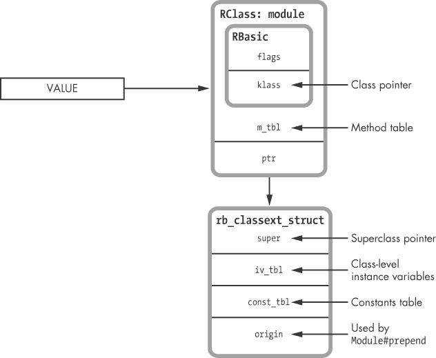

图 6-1. Ruby 类结构中用于模块的部分

在这个图中，我再次展示了 Ruby 的`RClass`结构。然而，我从图表中移除了一些值，因为模块并不使用它们。最重要的是，我移除了`iv_index_tbl`，因为你不能为模块创建对象实例——换句话说，你不能在模块上调用`new`方法。这意味着没有对象级别的属性需要跟踪。我还移除了`refined_class`和`allocator`值，因为模块也不使用它们。我保留了`super`指针，因为模块确实有内部的超类，尽管你不能自行指定它们。

Ruby 模块的技术定义（暂时忽略`origin`值）可能如下所示：

> Ruby 模块是一个 Ruby 对象，它还包含方法定义、一个超类指针和一个常量表。

## 将模块包含到类中

模块背后的真正魔力发生在你将模块包含到类中时，如示例 6-1 所示。

示例 6-1. 将模块包含到类中

```
module Professor
end

class Mathematician < Person
  include Professor
end
```

当我们运行示例 6-1 时，Ruby 为`Professor`模块创建了一个`RClass`结构的副本，并将其作为`Mathematician`的新的超类。Ruby 的 C 源代码将这个模块的副本称为*包含类*。新副本的`Professor`的超类被设置为`Mathematician`原始超类，这样可以保持超类或祖先链。图 6-2 总结了这一有些令人困惑的情况。

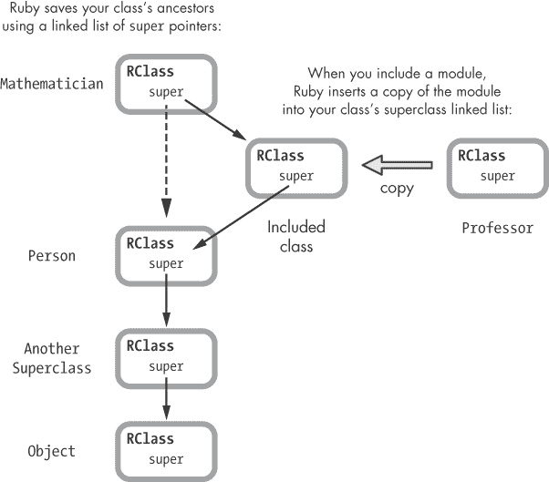

图 6-2. 将模块包含到类中

你可以看到图 6-2 左上角的`Mathematician`类。在它下面的左侧，你可以看到它的父类链：`Mathematician`的父类是`Person`，`Person`的父类是`Another Superclass`，依此类推。每个`RClass`结构中的`super`指针（实际上是每个`rb_classext_struct`结构中的`super`指针）都指向下一个父类。

现在来看图 6-2 右侧的`Professor`模块。当我们将此模块包含到`Mathematician`类中时，Ruby 会将`Mathematician`的`super`指针指向`Professor`的一个副本，而该副本的`super`指针又指向`Person`，即`Mathematician`的原始父类。

### 注意

*Ruby 实现`extend`的方式与此完全相同，不同之处在于被包含的类成为目标类的类或 metaclass 的父类。因此，`extend`允许你向类添加类方法。*

# Ruby 的方法查找算法

每当你调用一个方法，或者用面向对象编程术语来说，“给接收者发送一条消息”时，Ruby 需要确定哪个类实现了该方法。有时这很明显：接收者的类可能实现了目标方法。然而，这种情况并不常见。可能是你的系统中其他模块或类实现了该方法。Ruby 使用一个非常精确的算法，在你的程序中的模块和类之间按照特定的顺序进行搜索，以找到目标方法。理解这个过程对每个 Ruby 开发者来说都是至关重要的，所以让我们仔细研究一下。

图 6-3 中的流程图为你提供了 Ruby 方法查找算法的图形表示。

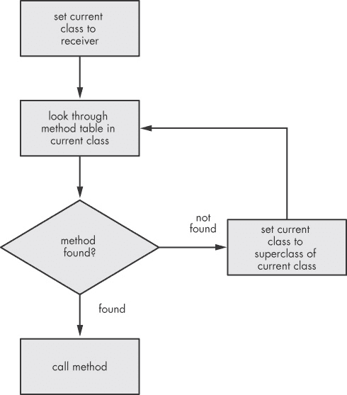

图 6-3. Ruby 的方法查找算法

这个算法非常简单，不是吗？正如你所看到的，Ruby 只是沿着`super`指针一直查找，直到找到包含目标方法的类或模块。你可能会想象 Ruby 需要通过一些特殊的逻辑来区分模块和类——例如，它需要处理有多个包含模块的情况。但是不，实际上它只是对`super`指针链表进行简单的循环。

## 方法查找示例

稍后我们将详细演示这个算法，以确保我们完全理解它。但首先，让我们设置一个包含类、父类和模块的示例。这将帮助我们了解类和模块在 Ruby 中如何协同工作。

示例 6-2 展示了带有访问器方法 `first_name` 和 `last_name` 的 `Mathematician` 类。

示例 6-2。一个简单的 Ruby 类，重复自示例 5-1

```
class Mathematician
  attr_accessor :first_name
  attr_accessor :last_name
end
```

现在让我们介绍一个父类。在示例 6-3 中， 在  我们将 `Person` 设置为 `Mathematician` 的父类。

示例 6-3。`Person` 是 `Mathematician` 的父类。

```
    class Person
    end

 class Mathematician < Person
      attr_accessor :first_name
      attr_accessor :last_name
    end
```

我们将姓名属性移到 `Person` 父类中，因为不仅仅是数学家有名字。我们最终得到了示例 6-4 中显示的代码。

示例 6-4。现在姓名属性在 `Person` 父类中。

```
class Person
  attr_accessor :first_name
  attr_accessor :last_name
end

class Mathematician < Person
end
```

最后，我们将在 `Mathematician` 类中包含 `Professor` 模块，如  所示。示例 6-5 展示了完整的示例。

示例 6-5。现在我们有一个包含模块并且有父类的类。

```
    class Person
      attr_accessor :first_name
      attr_accessor :last_name
    end

    module Professor
      def lectures; end
    end

    class Mathematician < Person
   include Professor
    end
```

## 方法查找算法的实际应用

现在我们已经设置好示例，准备查看 Ruby 如何找到我们调用的方法。每当你在程序中调用任何方法时，Ruby 会按照我们接下来将看到的相同流程来查找方法。

让我们开始吧，先调用一个方法。使用以下代码，我们创建一个新的数学家对象并设置它的名字：

```
ramanujan = Mathematician.new
ramanujan.first_name = "Srinivasa"
```

为了执行这段代码，Ruby 需要找到 `first_name=` 方法。这个方法在哪里呢？Ruby 到底是如何找到它的？

首先，Ruby 通过 `klass` 指针从 `ramanujan` 对象中获取类，如图 6-4 所示。

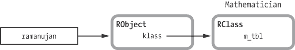

图 6-4。Ruby 首先在对象的类中查找 `first_name=` 方法。

接下来，Ruby 检查 `Mathematician` 是否通过查看其方法表直接实现了 `first_name=`，如图 6-5 所示。

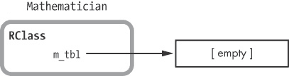

图 6-5。Ruby 首先在类的方法表中查找 `first_name=`。

因为我们已将所有方法移到 `Person` 超类中，所以 `first_name=` 方法不再存在。Ruby 继续执行算法，并通过 `super` 指针获取 `Mathematician` 的超类，如图 6-6 所示。


图 6-6. `Mathematician` 的超类是 `Professor` 模块的副本。

请记住，这不是 `Person` 类；它是 *包含的* 类，即 `Professor` 模块的副本。由于它是副本，Ruby 会在 `Professor` 的方法表中查找。回想一下示例 6-5，`Professor` 只包含单一方法 `lectures`。Ruby 不会找到 `first_name=` 方法。

### 注意

*请注意，由于 Ruby 将模块插入到原始超类之上，包含的模块中的方法会覆盖超类中的方法。在这种情况下，如果 `Professor` 也有一个 `first_name=` 方法，Ruby 将调用它，而不是 `Person` 中的方法。*

由于 Ruby 没有在 `Professor` 中找到 `first_name=`，它继续遍历 `super` 指针，但这一次它使用的是 `Professor` 中的 `super` 指针，如图 6-7 所示。


图 6-7. `Person` 类是包含的 `Professor` 模块副本的超类。

请注意，`Professor` 模块的超类——更准确地说，包含的 `Professor` 模块的副本的超类——是 `Person` 类。这是 `Mathematician` 原始的超类。最后，Ruby 在 `Person` 的方法表中找到了 `first_name=` 方法。因为它已经确定了哪个类实现了 `first_name=`，所以 Ruby 可以使用我们在第四章中学到的方法调度过程来调用这个方法。

## Ruby 中的多重继承

这里最有趣的是，Ruby 在内部使用类继承来实现模块的包含。实际上，包含一个模块和指定一个超类之间没有区别。这两种操作都会将新的方法引入目标类，并且都在内部使用类的 `super` 指针。将多个模块包含到 Ruby 类中，相当于指定多个超类。

尽管如此，Ruby 仍通过强制执行一个单一的祖先列表来保持简单。虽然包含多个模块会在内部创建多个超类，但 Ruby 会将它们维护在一个单一的列表中。结果是？作为 Ruby 开发者，你既可以享受多重继承的好处（从任意数量的模块中为类添加新行为），又能保持单继承模型的简单性。

Ruby 也从这种简化中受益！通过强制使用单一的超类祖先列表，其方法查找算法非常简单。每当你在对象上调用方法时，Ruby 只需要遍历超类链表，直到找到包含目标方法的类或模块。

## 全局方法缓存

根据继承链中超类的数量，方法查找可能会很耗时。为了解决这个问题，Ruby 会缓存查找结果以供后续使用。它记录了哪个类或模块实现了你代码中调用的方法，存在两个缓存中：一个是全局方法缓存，一个是内联方法缓存。

让我们先了解一下全局方法缓存。Ruby 使用 *全局方法缓存* 保存接收者类和实现者类之间的映射，如表格 6-1 所示。

表格 6-1. 全局方法缓存可能包含的示例

| `klass` | `defined_class` |
| --- | --- |
| `Fixnum#times` | `Integer#times` |
| `Object#puts` | `BasicObject#puts` |
| 等等... | 等等... |

表格 6-1 中的左栏 `klass` 显示了接收者类；这是你在其上调用方法的对象所属的类。右栏 `defined_class` 记录了方法查找的结果。它是实现方法的类，或者说是实现 Ruby 查找方法的类。

以表格 6-1 的第一行为例；它显示了 `Fixnum#times` 和 `Integer#times`。在全局方法缓存中，这意味着 Ruby 的方法查找算法开始在 `Fixnum` 类中查找 `times` 方法，但实际上它是在 `Integer` 类中找到了。类似地，表格 6-1 的第二行表示 Ruby 开始在 `Object` 类中查找 `puts` 方法，但实际上找到了 `BasicObject` 类中的实现。

全局方法缓存允许 Ruby 在下次你的代码调用全局缓存中第一列列出的某个方法时跳过方法查找过程。你的代码第一次调用 `Fixnum#times` 后，Ruby 知道它可以执行 `Integer#times` 方法，无论你在程序中的哪个位置调用 `times`。

## 内联方法缓存

Ruby 使用另一种类型的缓存，称为*内联方法缓存*，进一步加速方法查找。内联缓存将信息保存在 Ruby 执行的编译后 YARV 指令旁边（见图 6-8）。


图 6-8. 左侧的 YARV 指令应调用右侧的`Integer#times`实现。

在图形的左侧，我们看到与代码`10.times do... end`对应的编译后的 YARV 指令。首先，`putobject 10`将`Fixnum`对象`10`推入 YARV 的内部栈中。这是`times`方法调用的接收者。接下来，`send`调用`times`方法，方法名位于尖括号之间的文本中。

图形右侧的矩形表示 Ruby 通过其方法查找算法找到的`Integer#times`方法（在`Fixnum`类及其超类中查找`times`方法后）。Ruby 的内联缓存使得它能够将`times`方法调用与`Integer#times`实现之间的映射直接保存在 YARV 指令中。图 6-9 展示了内联缓存的样子。


图 6-9. 内联缓存将方法查找的结果保存在需要调用该方法的`send`指令旁边。

如果 Ruby 再次执行这一行代码，它将立即执行`Integer#times`，而不需要调用方法查找算法。

## 清除 Ruby 的方法缓存

由于 Ruby 是一种动态语言，你可以随时定义新的方法。为了让你能够这样做，Ruby 必须清除全局和内联方法缓存，因为方法查找的结果可能会发生变化。例如，如果我们向`Fixnum`或`Integer`类中添加新的`times`方法定义，Ruby 需要调用新的`times`方法，而不是它之前使用的`Integer#times`方法。

实际上，每当你创建或删除（*未定义*）方法、将模块包含到类中或执行类似的操作时，Ruby 会清除全局和内联方法缓存，迫使重新调用方法查找代码。当你使用修饰符或进行其他类型的元编程时，Ruby 也会清除缓存。事实上，在 Ruby 中清除缓存是一个相当频繁的操作。全局和内联方法缓存可能只能在短时间内保持有效。

## 将两个模块包含到一个类中

虽然 Ruby 的方法查找算法可能很简单，但它用于包含模块的代码并不简单。如上所述，当你将一个模块包含到一个类中时，Ruby 会将该模块的副本插入到该类的祖先链中。这意味着如果你依次包含两个模块，第二个模块会首先出现在祖先链中，并且会被 Ruby 的方法查找逻辑首先找到。

例如，假设我们将两个模块包含到`Mathematician`中，如示例 6-6 所示。

示例 6-6。将两个模块包含到一个类中

```
class Mathematician < Person
  include Professor
  include Employee
end
```

现在`Mathematician`对象拥有来自`Professor`模块、`Employee`模块和`Person`类的方法。但 Ruby 会首先找到哪些方法，哪些方法会被覆盖呢？

图 6-10 和图 6-11 展示了优先级的顺序。由于我们首先包含了`Professor`模块，Ruby 首先将对应的`Professor`模块的包含类作为父类插入。


图 6-10。在示例 6-6 中，我们首先包含了`Professor`模块。

现在，当我们包含`Employee`模块时，`Employee`模块对应的包含类会被插入到`Professor`模块对应的包含类之上，如图 6-11 所示。


图 6-11。在示例 6-6 中，我们在包含`Professor`模块之后，第二次包含了`Employee`模块。

由于`Employee`在父类链中位于`Professor`之上，如图 6-11 左侧所示，`Employee`的方法会覆盖`Professor`的方法，而`Professor`的方法又会覆盖`Person`的方法，即实际的父类方法。

## 将一个模块包含到另一个模块中

模块不允许你指定父类。例如，我们不能写出如下代码：

```
module Professor < Employee
end
```

但是我们可以将一个模块包含到另一个模块中，正如在示例 6-7 中所示。

示例 6-7。一个模块包含另一个模块

```
module Professor
  include Employee
end
```

如果我们将 `Professor`（一个包含其他模块的模块）包含进 `Mathematician`，Ruby 会先找到哪些方法呢？如 图 6-12 所示，当我们将 `Employee` 包含进 `Professor` 时，Ruby 会创建一个 `Employee` 的副本，并将其设置为 `Professor` 的父类。

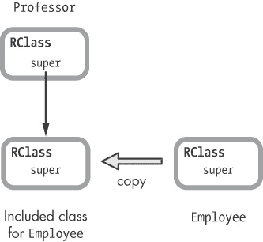

图 6-12. 当你将一个模块包含进另一个模块时，Ruby 会将其设置为目标模块的父类。

模块在你的代码中不能有父类，但它们在 Ruby 内部可以有父类，因为 Ruby 内部用类来表示模块！

最后，当我们将 `Professor` 包含进 `Mathematician` 时，Ruby 会遍历这两个模块，并将它们都插入为 `Mathematician` 的父类，如 图 6-13 所示。

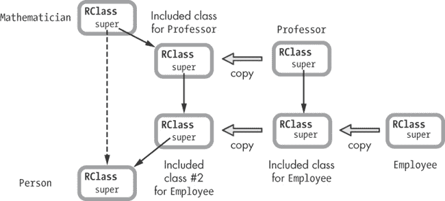

图 6-13. 同时将两个模块包含到一个类中

现在，Ruby 会首先查找 `Professor` 中的方法，其次查找 `Employee` 中的方法。

## Module#prepend 示例

在 图 6-2 中，我们看到 Ruby 如何将一个模块包含进一个类。具体来说，我们看到 Ruby 如何将模块的 `RClass` 结构副本插入到目标类的父类链中，位于类和它的父类之间。

从版本 2.0 开始，Ruby 现在允许你将一个模块“前置”到类中。我们将使用 `Mathematician` 类来进行说明，如 示例 6-8 所示。

示例 6-8. 一个带有 `name` 属性的简单 Ruby 类

```
    class Mathematician
   attr_accessor :name
    end

    poincaré = Mathematician.new
    poincaré.name = "Henri Poincaré"
 p poincaré.name
     => "Henri Poincaré"
```

首先，我们定义一个仅有 `name` 属性的 `Mathematician` 类，如  所示。然后，我们创建一个 `Mathematician` 类的实例，设置其名称，并显示它，如  所示。

现在假设我们通过再次将 `Professor` 模块包含进 `Mathematician` 类，使所有数学家都成为教授，如 示例 6-9 所示的 。

示例 6-9. 将 `Professor` 模块包含进 `Mathematician` 类

```
    module Professor
    end

    class Mathematician
      attr_accessor :name
   include Professor
    end
```

图 6-14 显示了 `Mathematician` 和 `Professor` 的父类链。

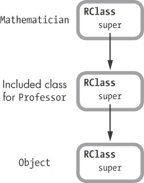

图 6-14. `Professor` 是 `Mathematician` 的父类。

如果我们决定在每个数学家的名字前显示 `Prof.` 头衔，我们可以像在 示例 6-10 中所示那样，仅在 `Mathematician` 类中添加该行为。

示例 6-10. 一种丑陋的方式在每个数学家的名字前显示 `Prof.` 头衔

```
    module Professor
    end

    class Mathematician
      attr_writer :name
      include Professor
   def name
        "Prof. #{@name}"
      end
    end
```

但是这是一个非常糟糕的解决方案：`Mathematician` 类必须承担显示教授头衔的工作，见 。如果其他类也包含 `Professor` 呢？它们不也应该显示 `Prof.` 头衔吗？如果 `Mathematician` 中包含了显示 `Prof.` 的代码，那么任何其他包含 `Professor` 的类都将缺少这段代码。

将显示头衔的代码包含在 `Professor` 模块中更为合理，正如在 示例 6-11 中所示。这样，任何包含 `Professor` 的类都能够显示 `Prof.` 头衔以及其类名。

示例 6-11. 我们如何让 Ruby 调用模块的 `name` 方法？

```
    module Professor
   def name
        "Prof. #{super}"
      end
    end

    class Mathematician
      attr_accessor :name
   include Professor
    end

    poincaré = Mathematician.new
    poincaré.name = "Henri Poincaré"
 p poincaré.name
     => "Henri Poincaré"
```

在  处，我们在 `Professor` 中定义了一个 `name` 方法，该方法会在实际姓名之前显示 `Prof.` 头衔（假设 `name` 已在父类中定义）。在  处，我们将 `Professor` 包含到 `Mathematician` 中。最后，在  处，我们调用 `name` 方法，但得到的是 `Henri Poincaré` 的名字，没有 `Prof.` 头衔。出了什么问题？

如 图 6-14 所示，问题在于 `Professor` 是 `Mathematician` 的父类，而不是反过来。这意味着当我在 示例 6-11 中调用 `poincaré.name` 时，Ruby 会从 `Mathematician` 中找到 `name` 方法，而不是从 `Professor` 中找到。图 6-15 直观地展示了当我调用 `poincaré.name` 时 Ruby 方法查找算法的执行过程。

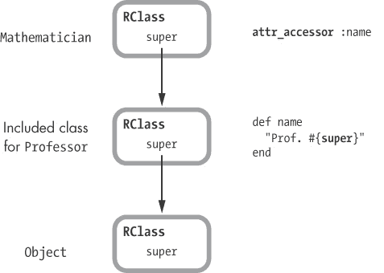

图 6-15. Ruby 在找到来自 `Professor` 的 `name` 方法之前会先调用 `attr_accessor` 方法。

当我们在示例 6-11 中调用`name`时，Ruby 会在父类链中从顶部开始向下查找它看到的第一个`name`方法。如图 6-15 所示，第一个`name`方法是`Mathematician`中的简单`attr_accessor`方法。

然而，如果我们使用`prepend`而不是`include`，我们就能得到预期的行为，如示例 6-12 所示。

示例 6-12. 使用`prepend`时，Ruby 首先找到模块的`name`方法。

```
    module Professor
      def name
        "Prof. #{super}"
      end
    end

    class Mathematician
      attr_accessor :name
   prepend Professor
    end

    poincaré = Mathematician.new
    poincaré.name = "Henri Poincaré"
 p poincaré.name
     => "Prof. Henri Poincaré"
```

这里唯一的区别是使用了`prepend`，如图 6-16 所示。

## Ruby 如何实现 Module#prepend

当你将一个模块预置到一个类时，Ruby 会将其放在类之前，形成父类链，正如图 6-16 所示。


图 6-16. 使用`prepend`时，Ruby 将模块放在目标类之前，形成父类链。

但是这里有些奇怪的地方。当我们在一个 mathematician 对象上调用`name`时，Ruby 是如何找到模块的方法的呢？也就是说，在示例 6-12 中，我们是在`Mathematician`类上调用`name`，而不是在`Professor`模块上调用。Ruby 应该会找到简单的`attr_accessor`方法，而不是模块中的版本，但事实并非如此。Ruby 是从父类链中向上查找模块的方法吗？如果是这样，Ruby 是如何做到的呢，特别是当`super`指针指向下方时？

其中的秘密在于，Ruby 内部使用了一个技巧，使得它看起来`Mathematician`是`Professor`的父类，虽然实际上并不是，如图 6-17 所示。将一个模块预置（prepend）到类中，就像是将模块包含（include）到类中一样。`Mathematician`处于父类链的顶部，往下走时，我们会发现 Ruby 仍然将`Professor`类设置为`Mathematician`的父类。

但是在图 6-17 中，`Professor` 下方我们看到了一些新的内容，即 `Mathematician` 的 *原始类*。这是 Ruby 为使 `prepend` 生效而创建的 `Mathematician` 的新副本。

当你使用 `prepend` 插入模块时，Ruby 会创建目标类的副本（内部称为 *原始类*），并将其设置为被插入模块的父类。Ruby 使用我们在图 6-1 和图 6-2 中看到的 `origin` 指针来跟踪这个类的新副本。此外，Ruby 会将原始类中的所有方法移动到原始类中，这意味着这些方法现在可以被具有相同名称的插入模块中的方法重写。在图 6-17 中，你可以看到 Ruby 已将 `attr_accessor` 方法从 `Mathematician` 移动到原始类。


图 6-17. Ruby 创建目标类的副本，并将其设置为被插入模块的父类。

# 实验 6-1: 在包含模块后修改模块

根据 Xavier Noria 的建议，本实验将探讨当你修改已被包含到类中的模块时会发生什么。我们将使用相同的 `Mathematician` 类和 `Professor` 模块，但方法有所不同，如在示例 6-13 中所示。

示例 6-13. 另一个将模块包含进类的例子

```
    module Professor
      def lectures; end
    end

    class Mathematician
   attr_accessor :first_name
      attr_accessor :last_name
   include Professor
    end
```

这次，`Mathematician` 类包含了用于 `@first_name` 和 `@last_name` 的访问器方法，如下图所示！[](httpatomoreillycomsourcenostarchimages1853843.png.jpg)，我们再次包含了 `Professor` 模块，如下图所示！[](httpatomoreillycomsourcenostarchimages1853845.png.jpg)。如果我们检查数学家对象的方法，如示例 6-14 所示，我们应该看到属性方法，例如 `first_name=` 和来自 `Professor` 的 `lectures` 方法。

示例 6-14. 检查数学家对象的方法

```
fermat = Mathematician.new
fermat.first_name = 'Pierre'
fermat.last_name = 'de Fermat'

p fermat.methods.sort
 => [ ... :first_name, :first_name=, ... :last_name, :last_name=, :lectures ... ]
```

毫不奇怪，我们看到所有方法。

## 类查看后添加到模块的方法

现在，让我们在将`Professor`模块包含到`Mathematician`类之后，再添加一些新方法。Ruby 是否知道这些新方法也应该添加到`Mathematician`类呢？让我们通过在示例 6-15 运行后，接着运行示例 6-14 来找出答案。

示例 6-15. 将新方法添加到`Professor`模块，并在其被包含到`Mathematician`后进行修改。

```
    module Professor
      def primary_classroom; end
    end

    p fermat.methods.sort
  => [ ... :first_name, :first_name=, ... :last_name, :last_name=, :lectures,
    ... :primary_classroom, ... ]
```

如你所见，在  我们得到了所有的方法，包括新添加的`primary_classroom`方法，它是在将`Professor`包含进`Mathematician`后添加的。这里也没有惊讶，Ruby 总是领先一步。

## 类看不到稍后包含的子模块

现在进行另一个测试。如果我们重新打开`Professor`模块，并使用示例 6-16 再将另一个模块包含到其中，会发生什么呢？

示例 6-16. 将新模块包含进`Professor`模块，且该模块已被包含进`Mathematician`。

```
module Employee
  def hire_date; end
end

module Professor
  include Employee
end
```

这变得有些混乱，因此让我们回顾一下在示例 6-13 和示例 6-16 中所做的操作：

+   在示例 6-13 中，我们将`Professor`模块包含进了`Mathematician`类。

+   然后，在示例 6-16 中，我们将`Employee`模块包含进了`Professor`模块。因此，`Employee`模块的方法现在应该在`mathematician`对象上可用。

让我们看看 Ruby 是否按照预期工作：

```
p fermat.methods.sort
 => [ ... :first_name, :first_name=, ... :last_name, :last_name=, :lectures ... ]
```

没有成功！`hire_date`方法在`fermat`对象中*不可用*。将模块包含到已包含模块的类中并不会影响该类。

正如我们已经了解了 Ruby 如何实现模块，这个事实应该不难理解。将`Employee`模块包含进`Professor`模块并不会改变 Ruby 在我们将其包含到`Mathematician`模块时所创建的`Professor`模块副本，正如在图 6-18 中所示。

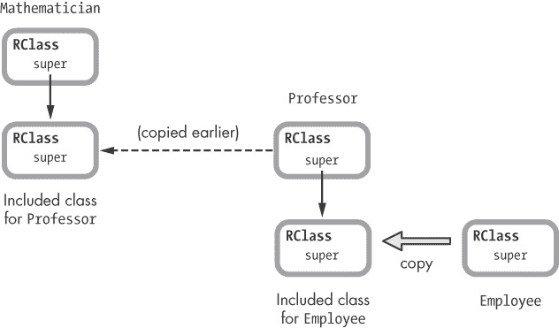

图 6-18. `Employee` 模块被包含到原始的 `Professor` 模块中，而不是 `Mathematician` 使用的包含副本。

## 包含的类与原始模块共享方法表

那么，我们在 示例 6-15 中添加的 `primary_classroom` 方法呢？即使我们在将 `Professor` 包含到 `Mathematician` 后才添加了 `primary_classroom` 方法，Ruby 是如何将该方法包含到 `Mathematician` 中的呢？图 6-18 显示 Ruby 在我们向 `Professor` 添加新方法之前，已经创建了 `Professor` 模块的副本。但那 `fermat` 对象是如何获得这个新方法的呢？

事实证明，当你包含一个模块时，Ruby 复制的是 `RClass` 结构，而不是底层的方法表，如 图 6-19 所示。

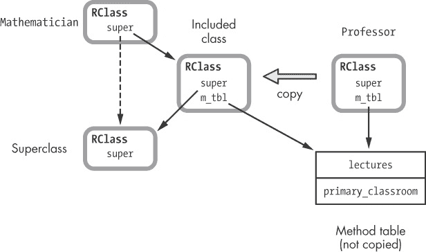

图 6-19. Ruby 不会在包含模块时复制方法表。

Ruby 不会复制 `Professor` 的方法表。相反，它只是将 `Professor` 的新副本中的 `m_tbl`（即“包含类”）设置为指向相同的方法表。这意味着，通过重新打开模块并添加新方法来修改方法表，将会改变该模块以及任何已经包含该模块的类。

深入了解 Ruby 如何复制模块

通过直接查看 Ruby 的 C 源代码，你将精确理解 Ruby 在包含模块时如何复制它们，以及为什么 Ruby 会按你在这个实验中看到的行为表现。你可以在 *class.c* 文件中找到 Ruby 用于复制模块的 C 函数。示例 6-17 展示了 `rb_include_class_new` 函数的一部分。

示例 6-17. `rb_include_class_new` C 函数的一部分，来自 *`class.c`*

```
    VALUE
 rb_include_class_new(VALUE module, VALUE super)
    {
     VALUE klass = class_alloc(T_ICLASS, rb_cClass);
        --*snip*--
     RCLASS_IV_TBL(klass) = RCLASS_IV_TBL(module);
        RCLASS_CONST_TBL(klass) = RCLASS_CONST_TBL(module);
     RCLASS_M_TBL(klass) = RCLASS_M_TBL(RCLASS_ORIGIN(module));
     RCLASS_SUPER(klass) = super;
        --*snip*--
        return (VALUE)klass;
    }
```

在  中，Ruby 传入了 `module`（要复制的目标模块）和 `super`（用于新副本的超类）。通过指定特定的超类，Ruby 将新副本插入到超类链中的特定位置。如果你在 *class.c* 中搜索 `rb_include_class_new`，你会发现 Ruby 是通过另一个 C 函数 `include_modules_at` 来调用它的，该函数处理了 Ruby 用来包含模块的复杂内部逻辑。

在  Ruby 调用`class_alloc`创建一个新的`RClass`结构，并将其引用保存在`klass`中。请注意，`class_alloc`的第一个参数是值`T_ICLASS`，用于标识新类为一个包含类。在处理包含类时，Ruby 在其 C 源代码中始终使用`T_ICLASS`。

在  Ruby 通过三个操作`RClass`的 C 宏，从原始模块的`RClass`结构复制一系列指针到新副本中。

+   `RCLASS_IV_TBL` 获取或设置指向实例变量表的指针。

+   `RCLASS_CONST_TBL` 获取或设置指向常量变量表的指针。

+   `RCLASS_M_TBL` 获取或设置指向方法表的指针。

例如，`RCLASS_IV_TBL(klass) = RCLASS_IV_TBL(module)` 将`klass`（新副本）中的实例变量表指针设置为`module`（要复制的目标模块）中的实例变量指针。现在`klass`和`module`使用相同的实例变量。同样，`klass`与`module`共享常量和方法表。因为它们共享相同的方法表，向`module`添加新方法也会将其添加到`klass`。这解释了我们在实验 6-1：包含模块后修改模块中看到的行为：向模块添加方法也会将其添加到包含该模块的每个类中。

还要注意，在  Ruby 使用`RCLASS_ORIGIN(module)`，而不是`module`。通常`RCLASS_ORIGIN(module)`与`module`相同；但是，如果您之前在`module`中使用了`prepend`，那么`RCLASS_ORIGIN(module)`会返回`module`的原始类。回想一下，当您调用`Module#prepend`时，Ruby 会复制（原始类）目标模块并将复制插入到超类链中。通过使用`RCLASS_ORIGIN(module)`，Ruby 获取原始模块的方法表，即使您使用不同的模块进行了预先处理。

最后，在  Ruby 将`klass`的超类指针设置为指定的超类并返回它。

# 常量查找

我们已经了解了 Ruby 的方法查找算法以及它如何通过超类链搜索找到正确的方法调用。现在我们将把注意力转向一个相关的过程：Ruby 的常量查找算法，或者说 Ruby 用来在代码中查找你引用的常量值的过程。

显然，方法查找是语言的核心，但为什么要研究常量查找？作为 Ruby 开发人员，我们在代码中并不经常使用常量——当然不像我们经常使用类、模块、变量和块那样。

一个原因是常量像模块和类一样，是 Ruby 内部工作方式和我们使用 Ruby 的方式的核心。每当你定义一个模块或类时，你也定义了一个常量。而每当你引用或使用一个模块或类时，Ruby 必须查找对应的常量。

第二个原因与 Ruby 查找你在代码中引用的常量的方式有关。你可能知道，Ruby 会查找在超类中定义的常量，但它也会查找在程序的周围命名空间或语法作用域中的常量。研究 Ruby 如何处理语法作用域，能帮助我们发现一些关于 Ruby 内部工作方式的重要信息。

让我们先回顾一下常量在 Ruby 中是如何工作的。

## 在超类中查找常量

Ruby 查找你引用的常量定义的一个方式是通过使用超类链，正如它查找方法定义时的方式一样。示例 6-18 展示了一个类如何在其超类中查找常量的例子。

示例 6-18。Ruby 查找你在超类中定义的常量。

```
    class MyClass
   SOME_CONSTANT = "Some value..."
    end

 class Subclass < MyClass
      p SOME_CONSTANT
    end
```

在示例 6-18 中，我们定义了一个只有一个常量 `SOME_CONSTANT` 的 `MyClass`，位置在 。然后我们创建了 `Subclass`，并将 `MyClass` 设为超类，位置在 。当我们打印 `SOME_CONSTANT` 的值时，Ruby 使用了与查找方法相同的算法，正如图 6-20 所示。

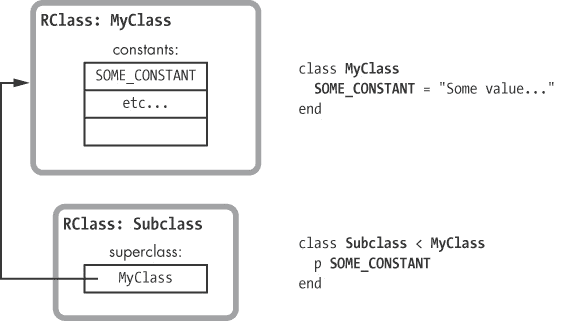

图 6-20。Ruby 使用超类链来查找常量，就像查找方法一样。

在这里，右侧显示了来自示例 6-18 的代码，左侧显示了我们创建的两个类对应的 `RClass` 结构。在图的左上角，你可以看到 `MyClass`，它在常量表中包含了 `SOME_CONSTANT` 的值。下面是 `Subclass`。当我们在 `Subclass` 中引用 `SOME_CONSTANT` 时，Ruby 使用 `super` 指针查找 `MyClass` 及其 `SOME_CONSTANT` 的值。

## Ruby 如何在父命名空间中查找常量？

示例 6-19 展示了另一种定义常量的方法。

示例 6-19。使用在周围命名空间中定义的常量

```
 module Namespace
   SOME_CONSTANT = "Some value..."
   class Subclass
     p SOME_CONSTANT
      end
    end
```

使用地道的 Ruby 风格，我们在中创建了一个名为`Namespace`的模块。然后，在该模块内，我们在中声明了相同的`SOME_CONSTANT`值。接下来，我们在中在`Namespace`内声明了`Subclass`，并且我们能够像在示例 6-18 中一样引用并打印`SOME_CONSTANT`的值。

但当我们在中显示`SOME_CONSTANT`时，Ruby 是如何在示例 6-19 中找到它的呢？图 6-21 展示了这个问题。


图 6-21. Ruby 如何在周围命名空间中找到常量？

在该图的左侧有两个`RClass`结构，一个用于`Namespace`模块，另一个用于`Subclass`。注意，`Namespace`并不是`Subclass`的超类；`Subclass`中的`super`指针指向的是`Object`类，即 Ruby 的默认超类。那么，Ruby 是如何在我们引用`Subclass`中的`SOME_CONSTANT`时找到它的呢？某种程度上，Ruby 允许你沿着“命名空间链”向上查找常量。这种行为被称为使用词法作用域查找常量。

# Ruby 中的词法作用域

*词法作用域*指的是程序中语法结构内的一部分代码区域，而不是在超类层次结构或其他某些方案内。例如，假设我们使用`class`关键字定义`MyClass`，如示例 6-20 所示。

示例 6-20. 使用`class`关键字定义类

```
class MyClass
  SOME_CONSTANT = "Some value..."
end
```

这段代码告诉 Ruby 创建`RClass`结构的新副本，但它也定义了程序中的一个新作用域或语法区域。这个区域是`class`和`end`关键字之间的部分，如图 6-22 所示。


图 6-22. `class`关键字创建一个类并引入新的词法作用域。

将你的 Ruby 程序视为一系列作用域，每个你创建的模块或类都有一个作用域，另外还有一个默认的顶级词法作用域。为了追踪这个新作用域在程序词法结构中的位置，Ruby 会将几个指针附加到 YARV 指令片段上，这些指针对应于它在这个新作用域内编译的代码，如 图 6-23 所示。

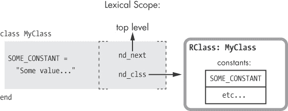

图 6-23. 对于每一段编译后的代码，Ruby 使用指针来追踪父级词法作用域和当前的类或模块。

此图展示了附加在 Ruby 代码右侧的词法作用域信息。这里有两个重要的值：

+   首先，`nd_next` 指针被设置为父级或周围的词法作用域——在这种情况下是默认或顶级作用域。

+   接下来，`nd_clss` 指针表示与该作用域对应的 Ruby 类或模块。在这个例子中，因为我们刚刚使用 `class` 关键字定义了 `MyClass`，Ruby 会将 `nd_clss` 指针指向与 `MyClass` 对应的 `RClass` 结构。

## 为新类或模块创建常量

每当你创建一个类或模块时，Ruby 会自动创建一个相应的常量，并将其保存在类或模块的父级词法作用域中。

让我们回到 示例 6-19 中的“命名空间”示例。图 6-24 显示了当你在 `Namespace` 内部创建 `MyClass` 时 Ruby 内部的操作。

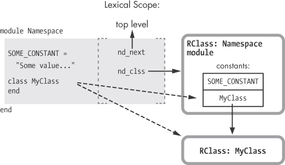

图 6-24. 当你声明一个新类时，Ruby 会创建一个新的 `RClass` 结构，并定义一个新的常量，其值为新类的名称。

图中的虚线箭头显示了 Ruby 在你创建一个新的类或模块时所采取的操作：

+   首先，Ruby 为新的模块或类创建一个新的 `RClass` 结构，如下图所示。

+   然后，Ruby 使用新的模块或类名称创建一个新的常量，并将其保存在对应于父词法作用域的类中。Ruby 将新常量的值设置为指向新的 `RClass` 结构的引用或指针。在 图 6-24 中，你可以看到 `MyClass` 常量出现在 `Namespace` 模块的常量表中。

新的类也获得了它自己的新的词法作用域，如 图 6-25 中所示。

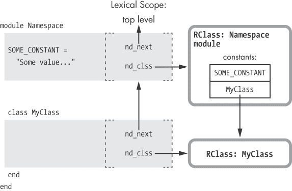

图 6-25. 新的类也会获得它自己的词法作用域，图中显示为第二个阴影矩形。

该图显示了新作用域的一个新的阴影矩形。其 `nd_clss` 指针被设置为指向 `MyClass` 的新的 `RClass` 结构，而 `nd_next` 指针被设置为对应于 `Namespace` 模块的父作用域。

## 在父命名空间中使用词法作用域查找常量

在 示例 6-21") 中，让我们回到 示例 6-19 的例子，该示例打印 `SOME_CONSTANT` 的值。

示例 6-21. 在父级词法作用域中查找常量（重复自 示例 6-19）

```
    module Namespace
      SOME_CONSTANT = "Some value..."
      class Subclass
     p SOME_CONSTANT
      end
    end
```

在 图 6-20 中，我们看到了 Ruby 如何通过 `super` 指针遍历以查找来自父类的常量。但是在 图 6-21 中，我们看到 Ruby 无法使用 `super` 指针查找 `SOME_CONSTANT`，因为 `Namespace` 不是 `MyClass` 的父类。相反，如 图 6-26 所示，Ruby 可以使用 `nd_next` 指针向上遍历程序的词法作用域，以查找常量值。


图 6-26. Ruby 可以通过 `nd_next` 和 `nd_clss` 指针在父词法作用域中找到 `SOME_CONSTANT`。

通过跟随这个图中的箭头，你可以看到在示例 6-21 中，`p SOME_CONSTANT` 命令如何工作：

+   首先，Ruby 在当前作用域的类 `MyClass` 中查找 `SOME_CONSTANT` 的值。在图 6-26 中，当前作用域包含 `p SOME_CONSTANT` 代码。你可以看到 Ruby 如何使用 `nd_clss` 指针在右侧找到当前作用域的类。在这里，`MyClass` 的常量表中没有任何内容。

+   接下来，Ruby 使用 `nd_next` 指针找到父词法作用域，向上移动图 6-26。

+   Ruby 重复这一过程，使用 `nd_clss` 指针在当前作用域的类中进行查找。这一次，当前作用域的类是 `Namespace` 模块，位于图 6-26 的右上角。现在，Ruby 在 `Namespace` 的常量表中找到了 `SOME_CONSTANT`。

## Ruby 的常量查找算法

图 6-27 中的流程图总结了 Ruby 在查找常量时如何遍历词法作用域链。

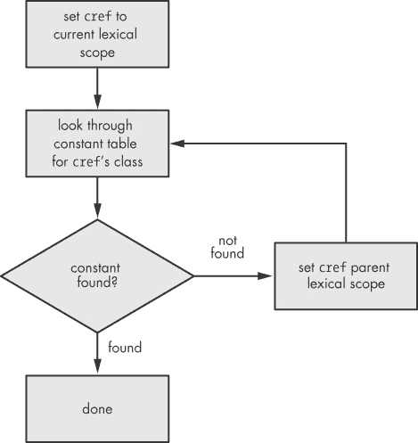

图 6-27. Ruby 常量查找算法的一部分

注意，这个图与图 6-3 非常相似。Ruby 在查找常量时，会遍历每个词法作用域中的 `nd_next` 指针所形成的链表，就像它在查找方法时遍历 `super` 指针一样。Ruby 使用超类来查找方法，使用父词法作用域来查找常量。

然而，这只是 Ruby 常量查找算法的一部分。正如我们在图 6-20 中看到的，Ruby 还会通过超类查找常量。

# 实验 6-2：Ruby 首先会找到哪个常量？

我们刚刚了解到，Ruby 会遍历一个链接列表的词法作用域，以查找常量值。然而，我们在 图 6-20 中看到，Ruby 还会使用超类链查找常量。让我们使用 示例 6-22 来更详细地了解这一点。

示例 6-22. Ruby 是先查找词法作用域链吗？还是先查找超类链？*(find-constant.rb)*

```
    class Superclass
   FIND_ME = "Found in Superclass"
    end

    module ParentLexicalScope
   FIND_ME = "Found in ParentLexicalScope"

      module ChildLexicalScope

        class Subclass < Superclass
          p FIND_ME
        end

      end
    end
```

请注意，我已经将常量 `FIND_ME` 定义了两次——一次在 ，另一次在 。Ruby 会首先找到哪个常量呢？是会首先遍历词法作用域链，并在  处找到常量吗？还是会遍历超类链，并在  处找到常量值？

让我们来看看！当我们运行 示例 6-22 时，我们得到以下结果：

```
$ **ruby find-constant.rb**
"Found in ParentLexicalScope"
```

你可以看到，Ruby 首先会查看词法作用域链。

现在，让我们注释掉 示例 6-22 中的第二个定义，并再次尝试实验：

```
    module ParentLexicalScope
   #FIND_ME = "Found in ParentLexicalScope"
```

当我们运行修改后的 示例 6-22 时，我们得到以下结果：

```
$ **ruby find-constant.rb**
"Found in Superclass"
```

因为现在只有一个 `FIND_ME` 的定义，Ruby 通过遍历超类链来找到它。

## Ruby 的实际常量查找算法

不幸的是，事情并没有那么简单；Ruby 在处理常量时还有一些其他的怪癖。图 6-28 是一个简化的流程图，展示了 Ruby 的整个常量查找算法。

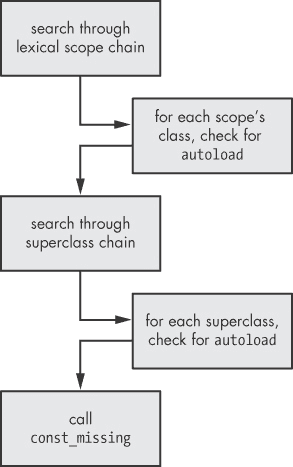

图 6-28. Ruby 常量查找算法的高级总结

在开头，你可以看到 Ruby 首先通过迭代词法作用域链进行查找，就像我们在示例 6-22 中看到的那样。Ruby 总是会查找在父词法作用域中定义的常量，包括类和模块。然而，当 Ruby 迭代作用域链时，它会检查你是否使用了 `autoload` 关键字，这会指示 Ruby 如果某个常量未定义，则打开并读取一个新的代码文件。（Rails 框架使用 `autoload`，允许你加载模型、控制器和其他 Rails 对象，而无需显式使用 `require`。）

如果 Ruby 遍历整个词法作用域链，仍未找到给定的常量或相应的 `autoload` 关键字，它会继续迭代超类链，就像我们在示例 6-18 中看到的那样。这样可以让你加载在超类中定义的常量。Ruby 再次尊重任何可能存在于超类中的 `autoload` 关键字，并在必要时加载额外的文件。

最后，如果一切都失败了，且常量仍未找到，Ruby 会调用你模块中的 `const_missing` 方法（如果你提供了该方法）。

# 概要

在本章中，我们学习了两种完全不同的方式来看待你的 Ruby 程序。一方面，你可以按类和超类组织代码，另一方面，你可以按词法作用域组织代码。我们看到 Ruby 如何在内部使用不同的 C 指针集合，在执行程序时跟踪这两棵树。`RClass` 结构中的 `super` 指针形成了超类树，而词法作用域结构中的 `nd_next` 指针形成了命名空间或词法作用域树。

我们学习了两种使用这些树的重要算法：Ruby 如何查找方法和常量。Ruby 使用类树来查找你的代码（以及 Ruby 自身的内部代码）调用的方法。类似地，Ruby 使用词法作用域树和超类层次结构来查找你的代码引用的常量。理解方法和常量查找算法至关重要。它们使你能够设计程序并组织代码，使用这两棵树以适应你要解决的问题。

初看起来，这两种组织方式似乎完全是正交的，但实际上，它们通过 Ruby 类的行为紧密相关。当你创建一个类或模块时，你将它们同时添加到超类和词法作用域层次结构中，当你引用类或超类时，你指示 Ruby 使用词法作用域树查找特定的常量。
