# 第七章. 哈希表：Ruby 内部的工作马

> 
> 
> *Ruby 将大量内部数据存储在哈希表中。*

实验 5-1：保存一个新的实例变量需要多长时间？ 向我们展示了在 Ruby 1.9 和 2.0 中，`RObject` 结构体的 `ivptr` 成员指向一个简单的实例变量值数组。我们了解到，添加新值通常非常快速，但 Ruby 在保存每第三个或第四个实例变量时会稍微变慢，因为它必须分配一个更大的数组。

从 Ruby 的 C 源代码库的更广泛角度来看，我们发现这种技术并不常见。相反，Ruby 经常使用一种称为 *哈希表* 的数据结构。与我们在 实验 5-1：保存一个新的实例变量需要多长时间？ 中看到的简单数组不同，哈希表可以自动扩展以容纳更多的值；哈希表的客户端无需担心可用空间或为其分配更多内存。

除此之外，Ruby 使用哈希表来保存你在 Ruby 脚本中创建的哈希对象中的数据。Ruby 还将大量内部数据保存在哈希表中。每当你创建一个方法或常量时，Ruby 会将一个新值插入哈希表中，Ruby 还将我们在 实验 3-2：探索特殊变量 中看到的许多特殊变量保存在哈希表中。此外，Ruby 将泛型对象（如整数或符号）的实例变量保存在哈希表中。因此，哈希表是 Ruby 内部的工作马。

在本章中，我将首先解释哈希表是如何工作的：当你用一个键保存一个新值时，表内会发生什么，以及当你稍后使用相同的键检索该值时会发生什么。我还将解释哈希表是如何自动扩展以容纳更多的值的。最后，我们将探讨哈希函数在 Ruby 中是如何工作的。

路线图

+   Ruby 中的哈希表

    +   在哈希表中保存一个值

    +   从哈希表中检索值

+   **实验 7-1：从不同大小的哈希中检索值**

+   哈希表如何扩展以容纳更多值

    +   哈希冲突

    +   重新哈希条目

    +   Ruby 如何在哈希表中重新哈希条目？

+   **实验 7-2：在不同大小的哈希中插入一个新元素**

    +   魔法数字 57 和 67 从哪里来？

+   Ruby 如何实现哈希函数

+   **实验 7-3：在哈希中使用对象作为键**

    +   Ruby 2.0 中的哈希优化

+   总结

# Ruby 中的哈希表

*哈希表*是计算机科学中常用的、广为人知的、历史悠久的概念。它们根据从每个值计算得到的整数值——即*哈希*——将值组织成不同的组或*桶*。当你需要查找某个值时，可以通过重新计算它的哈希值来确定它所在的桶，从而加速搜索过程。


*每次你编写方法时，Ruby 都会在哈希表中创建一个条目。*

## 在哈希表中保存一个值

图 7-1 展示了一个单一的哈希对象及其哈希表。

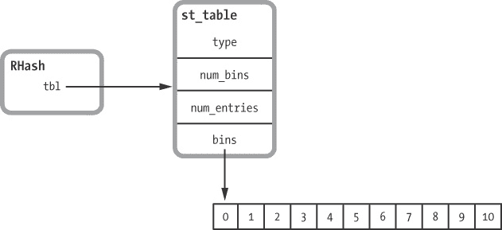

图 7-1：一个包含空哈希表的 Ruby 哈希对象

左边是`RHash`（即*Ruby 哈希*）结构。右边是该哈希使用的哈希表，表示为`st_table`结构。这个 C 结构包含了哈希表的基本信息，包括表中保存的条目数量、桶的数量以及指向桶的指针。每个`RHash`结构包含一个指向相应`st_table`结构的指针。右下角的空桶是因为 Ruby 1.8 和 1.9 最初为一个新的空哈希创建了 11 个桶。（Ruby 2.0 略有不同；请参见 Ruby 2.0 中的哈希优化。）

理解哈希表如何工作最好的方式是通过一个例子。假设我向一个名为`my_hash`的哈希中添加一个新的键/值对：

```
my_hash[:key] = "value"
```

在执行这行代码时，Ruby 会创建一个新的结构，叫做 `st_table_entry`，并将其保存到 `my_hash` 的哈希表中，如 图 7-2 所示。

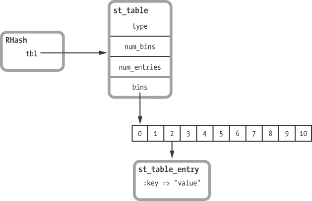

图 7-2. 一个包含单个值的 Ruby 哈希对象

在这里，你可以看到 Ruby 将新的键/值对保存在了第三个桶，也就是第 2 号桶下。Ruby 通过获取给定的键——在这个例子中是符号 `:key`——并将其传递给一个内部哈希函数，返回一个伪随机整数来完成这一步：

```
some_value = internal_hash_function(:key)
```

接下来，Ruby 会取哈希值——在这个例子中是 `some_value`——并通过桶的数量计算余数，即除以桶的数量后的余数。

```
some_value % 11 = 2
```

### 注意

*在 图 7-2 中，我假设 `:key` 的实际哈希值除以 11 后的余数是 2。稍后在本章中，我将更详细地探讨 Ruby 实际使用的哈希函数。*

现在让我们为哈希表添加第二个元素：

```
my_hash[:key2] = "value2"
```

这次让我们假设 `:key2` 的哈希值除以 11 得到的余数是 5。

```
internal_hash_function(:key2) % 11 = 5
```

图 7-3 显示了 Ruby 将第二个 `st_table_entry` 结构放在了第 5 个桶，也就是第六个桶下。

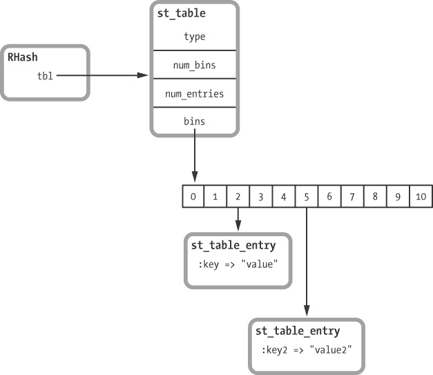

图 7-3. 一个包含两个值的 Ruby 哈希对象

## 从哈希表中检索值

使用哈希表的好处在于，当你要求 Ruby 根据给定的键来检索值时，这种优势会变得非常明显。例如：

```
p my_hash[:key]
 => "value"
```

如果 Ruby 将所有键和值保存在一个数组或链表中，它就必须遍历数组或链表中的所有元素来查找 `:key`。根据元素的数量，这可能会花费很长时间。但使用哈希表时，Ruby 可以通过重新计算该键的哈希值，直接跳到它需要查找的键。

为了重新计算某个特定键的哈希值，Ruby 只需再次调用哈希函数：

```
some_value = internal_hash_function(:key)
```

然后，它重新将哈希值除以桶的数量来得到余数，或者说是模值。

```
some_value % 11 = 2
```

到此为止，Ruby 知道要在第 2 个桶中查找键为 `:key` 的条目。Ruby 之后可以通过重复相同的哈希计算来找到 `:key2` 的值。

```
internal_hash_function(:key2) % 11 = 5
```

### 注意

*Ruby 用来实现哈希表的 C 库是由加利福尼亚大学伯克利分校的彼得·摩尔（Peter Moore）在 1980 年代编写的。后来，这个库经过了 Ruby 核心团队的修改。你可以在 C 代码文件* st.c *和* include/ruby/st.h *中找到摩尔的哈希表代码。*该代码中所有的函数和结构体名称都遵循 `st_` 的命名规范。表示每个 Ruby Hash 对象的 `RHash` 结构体的定义位于* include/ruby/ruby.h *文件中。除了 `RHash`，该文件还包含 Ruby 源代码中使用的所有其他主要对象结构体：`RString`、`RArray`、`RValue` 等。*

# 实验 7-1：从不同大小的哈希表中检索值

这个实验将创建大小差异巨大的哈希表，从 1 个到 100 万个元素不等，然后测量从这些哈希表中查找并返回一个值所需的时间。示例 7-1 展示了实验代码。

示例 7-1。测量从大小差异巨大的哈希表中检索一个元素所需的时间

```
    require 'benchmark'

 21.times do |exponent|

      target_key = nil

   size = 2**exponent
      hash = {}
   (1..size).each do |n|
        index = rand
     target_key = index if n > size/2 && target_key.nil?
     hash[index] = rand
      end

      GC.disable

      Benchmark.bm do |bench|
        bench.report("retrieving an element
                      from a hash with #{size} elements 10000 times") do
          10000.times do
         val = hash[target_key]
          end
        end
      end

      GC.enable
    end
```

在 ，外层循环遍历二的幂次，计算不同的 `size` 值，如  所示。这些大小从 1 到大约 100 万不等。接下来，内层循环在  插入指定数量的元素到一个新的空哈希表中，位置在 。

在禁用垃圾回收以避免影响结果后，实验 7-1：从不同大小的哈希表中检索值 使用基准库来测量从每个哈希表中检索一个值 10,000 次所需的时间，如下所示 。代码行  保存一个随机的键值，稍后将在  处作为 `target_key` 使用。

图 7-4 中的结果显示，Ruby 能以与从小哈希表中返回值相同的速度，从包含超过 100 万个元素的哈希表中找到并返回一个值。

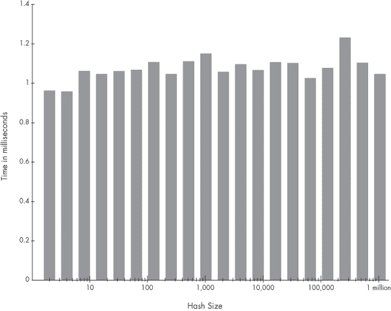

图 7-4。Ruby 2.0 中检索 10,000 个值所需的时间（毫秒）与哈希大小的关系

显然，Ruby 的哈希函数非常快速，一旦 Ruby 确定了包含目标键的桶，它就可以非常迅速地找到对应的值并返回。这里值得注意的是，图表基本上是平坦的。

# 哈希表如何扩展以容纳更多值

如果有数百万个 `st_table_entry` 结构，为什么将它们分布到 11 个桶中能帮助 Ruby 快速查找？因为即使哈希函数很快，且 Ruby 将值均匀地分配到哈希表的 11 个桶中，如果总共有 100 万个元素，Ruby 仍然需要在每个桶中搜索近 100,000 个元素来找到目标键。

这里肯定发生了其他的事情。似乎随着元素的不断增加，Ruby 必须为哈希表添加更多的桶。让我们再次看看 Ruby 内部哈希表代码是如何工作的。继续看 图 7-1 到 图 7-3 的示例，假设我不断向哈希表中添加更多的元素。

```
my_hash[:key3] = "value3"
my_hash[:key4] = "value4"
my_hash[:key5] = "value5"
my_hash[:key6] = "value6"
```

随着我们添加更多元素，Ruby 会继续创建更多的 `st_table_entry` 结构并将它们添加到不同的桶中。

## 哈希碰撞

最终，可能会有两个或多个元素被保存到同一个桶中。当发生这种情况时，我们就遇到了 *哈希碰撞*。这意味着 Ruby 不再能够仅凭哈希函数唯一地识别和检索一个键。

图 7-5 显示了 Ruby 用来跟踪每个桶中条目的链表。每个 `st_table_entry` 结构包含指向同一桶中下一个条目的指针。随着你向哈希表中添加更多条目，链表会变得越来越长。

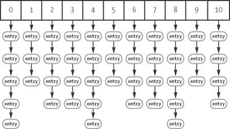

图 7-5. 包含 44 个值的哈希表

为了检索一个值，Ruby 需要遍历链表并将每个键与目标进行比较。只要单个桶中的条目数量不增长到太大，这并不是一个严重的问题。对于整数或符号（通常用作哈希键），这只是一个简单的数值比较。然而，如果你使用更复杂的数据类型，如自定义对象，Ruby 会对键调用 `eql?` 方法，以检查链表中的每个键是否是目标。正如你可能猜到的那样，`eql?` 如果两个值相等，则返回 *true*，如果不相等，则返回 *false*。

## 重新哈希条目

为了防止这些链表失控地增长，Ruby 会衡量每个桶的 *密度*，即每个桶的平均条目数。在 图 7-5 中，你可以看到每个桶的平均条目数大约是 4。 这意味着哈希值取模 11 开始为不同的键和哈希值返回重复的值；因此，发生了哈希碰撞。

一旦密度超过 5（这是 Ruby C 源代码中的常量），Ruby 就会分配更多的桶，然后*重新哈希*，或者重新分配现有条目到新的桶集中。如果我们继续添加更多的键值对，例如，Ruby 最终会丢弃 11 个桶的数组，并分配一个包含 19 个桶的数组，如图 7-6 所示。

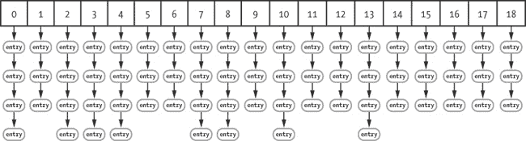

图 7-6：包含 65 个值的哈希表

在这个图中，桶的密度已降到大约 3。

通过监控桶的密度，Ruby 确保链表保持简短，并且检索哈希元素始终是快速的。在计算出哈希值后，Ruby 只需要遍历一两个元素就能找到目标键。

Ruby 是如何重新哈希哈希表中的条目？

你可以在*st.c*源文件中找到`rehash`函数（这段代码会循环遍历`st_table_entry`结构并重新计算每个条目的桶位置）。为了简化，示例 7-2 展示了来自 Ruby 1.8.7 的`rehash`版本。虽然 Ruby 1.9 和 2.0 的工作方式大致相同，但它们的 C 语言重哈希代码稍微复杂一些。

示例 7-2：Ruby 1.8.7 中重新哈希哈希表的 C 代码

```
    static void
    rehash(table)
        register st_table *table;
    {
        register st_table_entry *ptr, *next, **new_bins;
        int i, old_num_bins = table->num_bins, new_num_bins;
        unsigned int hash_val;
     new_num_bins = new_size(old_num_bins+1);
        new_bins = (st_table_entry**)Calloc(new_num_bins,
                                            sizeof(st_table_entry*));
     for(i = 0; i < old_num_bins; i++) {
            ptr = table->bins[i];
            while (ptr != 0) {
                next = ptr->next;
             hash_val = ptr->hash % new_num_bins;
             ptr->next = new_bins[hash_val];
                new_bins[hash_val] = ptr;
                ptr = next;
            }
        }
     free(table->bins);
        table->num_bins = new_num_bins;
        table->bins = new_bins;
    }
```

在这个示例中，`new_size`方法调用在处返回新的桶数。一旦 Ruby 得到了新的桶数，它会分配新的桶，然后从开始，遍历所有现有的`st_table_entry`结构（哈希中的所有键值对）。对于每个`st_table_entry`，Ruby 使用处相同的取模公式重新计算桶的位置：`hash_val = ptr->hash % new_num_bins`。然后，Ruby 将每个条目保存到该新桶的链表中，位置在。最后，Ruby 更新`st_table`结构，并在处释放旧的桶。

# 实验 7-2：向不同大小的哈希表中插入一个新元素

测试这个重新哈希（或重新分配）条目是否真的发生的一种方法是，测量 Ruby 将一个新元素保存到不同大小的现有哈希表中所需的时间。当我们向同一个哈希表中添加更多元素时，我们最终应该能够看到 Ruby 花费额外时间重新哈希这些元素的证据。

这个实验的代码展示在示例 7-3 中。

示例 7-3：向不同大小的哈希表中添加一个元素

```
    require 'benchmark'

 100.times do |size|

      hashes = []
   10000.times do
        hash = {}
        (1..size).each do
          hash[rand] = rand
        end
        hashes << hash
      end

      GC.disable

      Benchmark.bm do |bench|
        bench.report("adding element number #{size+1}") do
          10000.times do |n|
         hashes[n][size] = rand
          end
        end
      end

      GC.enable
    end
```

在  外部循环遍历从 0 到 100 的哈希表大小，而在  内部循环创建给定大小的 10,000 个哈希表。在禁用垃圾回收后，实验使用基准库测量 Ruby 插入单个新值所需的时间，在  将新值插入所有 10,000 个给定大小的哈希表中。

结果令人惊讶！图 7-7 显示了 Ruby 1.8 的结果。

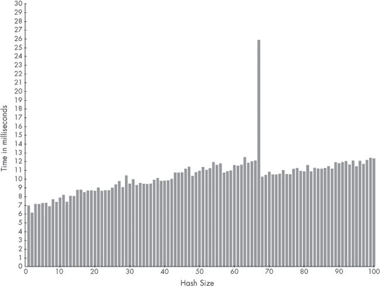

图 7-7. 添加 10,000 对键值对所需的时间与哈希表大小的关系（Ruby 1.8）

从左到右解释这些数据值，我们可以看到以下内容：

+   向空哈希表插入第一个元素大约需要 7 毫秒（共插入 10,000 次）。

+   随着哈希表大小从 2 增加到 3，再到大约 60 或 65，插入新元素所需的时间缓慢增加。

+   在包含 64、65 或 66 个元素的哈希表中，每插入一个新的键值对大约需要 11 到 12 毫秒（共插入 10,000 次）。

+   一个巨大的尖峰！插入第 67 个键值对所需的时间是之前的两倍多：大约 26 毫秒，而不是 10,000 个哈希表的 11 毫秒！

+   在插入第 67 个元素后，插入其他元素所需的时间降至约 10 毫秒或 11 毫秒，然后从此处开始缓慢增加。

这里发生了什么？嗯，Ruby 花费额外时间来插入第 67 个键值对，将桶数组从 11 个桶重新分配到 19 个桶，然后将 `st_table_entry` 结构重新分配到新的桶数组中。

图 7-8 显示了 Ruby 2.0 的相同图表。这次的桶密度阈值有所不同。Ruby 2.0 在插入第 57 个元素时就开始重新分配元素到桶中，而不是像之前在第 67 次插入时才进行这项操作。随后，Ruby 2.0 在插入第 97 个元素后再次进行重新分配。

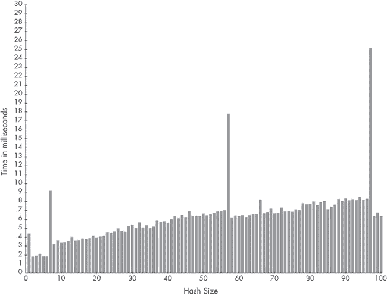

图 7-8. 添加 10,000 对键值对所需的时间与哈希表大小的关系（Ruby 2.0）

在图中，第一次和第七次插入时出现的两个较小的尖峰非常引人注目。尽管它们不像第 57 和第 97 个元素处的尖峰那样明显，但这些较小的尖峰仍然是可以察觉的。事实证明，Ruby 2.0 还包含另一个优化，使得在包含少于 7 个元素的小哈希表中，哈希访问速度更快。我将在 Ruby 2.0 中的哈希优化中进一步讨论这个问题。

魔术数字 57 和 67 从哪里来？

要了解这些魔法数字（57、67 等）是从哪里来的，查看你所使用的 Ruby 版本的*st.c*代码文件顶部。你应该能找到像示例 7-4 中所示的素数列表。

示例 7-4. Ruby 使用基于素数的算法来确定每个哈希表中所需的桶数。

```
    /*
    Table of prime numbers 2^n+a, 2<=n<=30.
    */
    static const unsigned int primes[] = {
   8 + 3,
   16 + 3,
   32 + 5,
      64 + 3,
      128 + 3,
      256 + 27,
      512 + 9,
    --*snip*--
```

这个 C 数组列出了接近 2 的幂的素数。Peter Moore 的哈希表代码使用这个表来决定在哈希表中使用多少个桶。例如，上面列表中的第一个素数是 11，在 ，这就是为什么 Ruby 哈希表一开始有 11 个桶。后来，随着元素数量的增加，桶的数量增加到 19，在 ，接着是 37，在 ，依此类推。

Ruby 总是将哈希表桶的数量设置为素数，以便更有可能使哈希值在桶之间均匀分布。在数学上，素数在这里的作用是因为它们与哈希值共享的因子较少，如果一个较差的哈希函数返回的哈希值不完全随机的话。记住，Ruby 在计算应该将值放入哪个桶时，会将哈希值除以桶的数量。如果哈希值和桶的数量有共同因子，甚至更糟的是，如果哈希值是桶数量的倍数，那么桶号（模数）可能总是相同的。这将导致表中的条目在桶之间分布不均。

在 *st.c* 文件的其他地方，你应该能看到这个 C 常量：

```
#define ST_DEFAULT_MAX_DENSITY 5
```

这个常量定义了允许的最大密度，或者说每个桶中的平均元素数量。

最后，你应该能看到决定何时执行桶重新分配的代码，方法是查找在*st.c*中使用常量`ST_DEFAULT_MAX_DENSITY`的地方。对于 Ruby 1.8，你将看到这段代码：

```
if (table->num_entries/(table->num_bins) > ST_DEFAULT_MAX_DENSITY) {
  rehash(table);
```

Ruby 1.8 在 `num_entries/11` 大于 5 时（即当它等于 66）会将桶从 11 重新哈希到 19。由于这个检查是在添加新元素之前进行的，所以当你添加第 67 个元素时条件成立，因为此时 `num_entries` 会是 66。

对于 Ruby 1.9 和 Ruby 2.0，你将看到以下代码：

```
if ((table)->num_entries >
    ST_DEFAULT_MAX_DENSITY * (table)->num_bins) {
  rehash(table);
```

你可以看到，Ruby 2.0 在 `num_entries` 大于 5*11 时首次重新哈希，或者当你插入第 57 个元素时。

# Ruby 如何实现哈希函数

现在，仔细看看 Ruby 用于将键和值分配到哈希表中的桶的实际哈希函数。这个函数是哈希对象实现的核心——如果它运作良好，Ruby 哈希非常快速，但一个糟糕的哈希函数会导致严重的性能问题。此外，Ruby 内部使用哈希表来存储其自身的信息，除了你保存在哈希对象中的数据值之外。显然，拥有一个好的哈希函数是非常重要的！


*哈希函数允许 Ruby 找到包含给定键和值的桶。*

让我们回顾一下 Ruby 如何使用哈希值。记住，当你在哈希中保存一个新元素——即一个新的键/值对——Ruby 会将该元素分配到哈希对象使用的内部哈希表中的一个桶（bin）里，如 图 7-9 所示。

Ruby 根据桶的数量计算键的哈希值的余数。

```
bin_index = internal_hash_function(key) % bin_count
```

使用我们之前使用的相同示例值，这个公式变成了：

```
2 = hash(:key) % 11
```

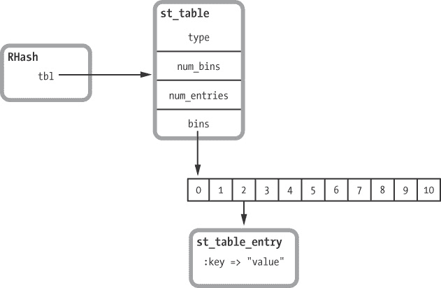

图 7-9. 一个包含单个值的 Ruby 哈希对象（重复自 图 7-2）

这个公式之所以有效，是因为 Ruby 的哈希值对于任何给定的输入数据基本上是随机整数。为了更好地理解 Ruby 的哈希函数如何工作，可以调用 `hash` 方法，如 示例 7-5 所示。

示例 7-5. 显示不同 Ruby 对象的哈希值

```
$ **irb**
> **"abc".hash**
 => 3277525029751053763
> **"abd".hash**
 => 234577060685640459
> **1.hash**
 => -3466223919964109258
> **2.hash**
 => -2297524640777648528
```

在这里，即使是相似的值，它们的哈希值也有很大的不同。如果我们再次调用`hash`，对于相同的输入数据，我们总是会得到相同的整数值。

```
> **"abc".hash**
 => 3277525029751053763
> **"abd".hash**
 => 234577060685640459
```

下面是 Ruby 哈希函数如何实际运作的说明，适用于大多数 Ruby 对象：

+   当你调用`hash`时，Ruby 会在 `Object` 类中找到默认的实现。如果需要，你可以重写它。

+   `Object` 类的 `hash` 方法实现所使用的 C 代码获取目标对象的 C 指针值——即该对象 `RValue` 结构的实际内存地址。这本质上是该对象的唯一 ID。

+   Ruby 将指针值传递给一个复杂的 C 函数（哈希函数），该函数会打乱值中的位，从而以可重复的方式生成一个伪随机整数。

对于字符串和数组，Ruby 实际上会遍历字符串中的所有字符或数组中的所有元素，并计算一个累积的哈希值。这保证了字符串或数组的任何实例的哈希值总是相同的，并且如果字符串或数组中的任何值发生变化，哈希值也会随之变化。整数和符号是另一种特殊情况。Ruby 直接将它们的值传递给哈希函数。

为了从值中计算哈希，Ruby 1.9 和 2.0 使用一种叫做 *MurmurHash* 的哈希函数，它是由 Austin Appleby 在 2008 年发明的。*Murmur* 这个名字来自于该算法中使用的机器语言操作：*multiply* 和 *rotate*。（要了解 Murmur 算法是如何工作的，可以阅读其 C 语言代码，该代码在 *st.c* Ruby 源代码文件中。或者阅读 Austin 关于 Murmur 的网页：*[`sites.google.com/site/murmurhash/`](http://sites.google.com/site/murmurhash/)*。）

Ruby 1.9 和 2.0 使用一个随机种子值初始化 MurmurHash，该值在每次重新启动 Ruby 时都会重新初始化。这意味着如果你停止并重新启动 Ruby，你将会得到相同输入数据的不同哈希值。这也意味着如果你自己尝试，你将会得到与上面不同的值，但在同一个 Ruby 进程中，哈希值始终是相同的。

# 实验 7-3：在哈希中使用对象作为键

因为哈希值是伪随机数，一旦 Ruby 将其除以桶的数量，例如 11，剩余的值（模值）就是 0 到 10 之间的随机数。这意味着当 `st_table_entry` 结构保存在哈希表中时，它们会均匀地分布在可用的桶中，从而确保 Ruby 可以快速查找任何给定的键。每个桶中的条目数始终很少。

但是，如果 Ruby 的哈希函数不返回随机整数，而是对于每个输入数据值返回相同的整数，会发生什么呢？

在这种情况下，每次你向哈希中添加键/值时，它总是会被分配到同一个桶。Ruby 最终会将所有条目都放在该一个桶下的一个长列表中，而其他任何桶中都没有条目，正如在图 7-10 中所示。


图 7-10。使用非常差的哈希函数创建的哈希表

如果你尝试从这个哈希中检索一个值，Ruby 就必须一个一个地查找这个长列表中的每个元素，以找到请求的键。在这种情况下，从哈希中加载一个值将会非常非常慢。

为了证明这一点，并且说明 Ruby 的哈希函数有多重要，我们将使用哈希函数较差的对象作为哈希中的键。我们将在这里重复实验 7-1：从大小差异的哈希中检索值，但这次使用我定义的类的实例作为键值，而不是随机数。示例 7-6 展示了实验 7-1：从大小差异的哈希中检索值的代码，并且做了两处更新。

示例 7-6. 测量从大小差异极大的哈希中检索元素所需的时间。这与示例 7-1 相同，只不过这次使用的是`KeyObject`实例作为键。

```
    require 'benchmark'

 class KeyObject
      def eql?(other)
        super
      end
    end

    21.times do |exponent|

      target_key = nil

      size = 2**exponent
      hash = {}
      (1..size).each do |n|
     index = KeyObject.new
        target_key = index if n > size/2 && target_key.nil?
        hash[index] = rand
      end

      GC.disable

      Benchmark.bm do |bench|
        bench.report("retrieving an element
                       from a hash with #{size} elements 10000 times") do
          10000.times do
            val = hash[target_key]
          end
        end
      end

      GC.enable

    end
```

在  处，我们定义了一个名为`KeyObject`的空类。注意，我实现了`eql?`方法；这使得 Ruby 在检索值时能够正确地搜索目标键。然而，在这个示例中，`KeyObject`中没有任何有趣的数据，因此我只是调用了`super`并使用了`Object`类中`eql?`方法的默认实现。

然后，在  处，我们使用`KeyObject`的新实例作为哈希值的键。图 7-11 展示了这个测试的结果。

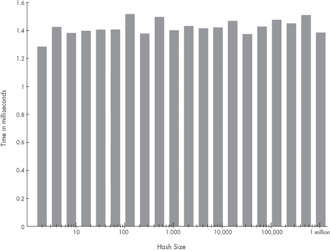

图 7-11. 使用对象作为键时，检索 10,000 个值的时间与哈希大小的关系（Ruby 2.0）

如你所见，结果与图 7-4 非常相似。图表几乎是平的。无论哈希中有 100 万个元素还是只有 1 个元素，检索一个值所需的时间差不多。毫无意外；使用对象作为键并没有让 Ruby 变慢。

现在让我们改变`KeyObject`类并再试一次。示例 7-7 展示了相同的代码，并在  处添加了一个新的哈希函数。

示例 7-7. `KeyObject`现在有一个非常差的哈希函数。

```
    require 'benchmark'

    class KeyObject
      def hash
     4
      end
      def eql?(other)
        super
      end
    end

    21.times do |exponent|

      target_key = nil

      size = 2**exponent
      hash = {}
      (1..size).each do |n|
        index = KeyObject.new
        target_key = index if n > size/2 && target_key.nil?
        hash[index] = rand
      end

      GC.disable

      Benchmark.bm do |bench|
        bench.report("retrieving an element
                      from a hash with #{size} elements 10000 times") do
          10000.times do
            val = hash[target_key]
          end
        end
      end

      GC.enable
    end
```

我故意编写了一个非常差的哈希函数。这个哈希函数不像返回伪随机整数，而是始终返回整数 4，正如在示例 7-7 中所示，不管你在哪个`KeyObject`对象实例上调用它。现在，Ruby 在计算哈希值时总是会得到 4。它将必须将所有哈希元素都分配到内部哈希表中的 4 号桶里，正如在图 7-10 所示。

让我们来尝试一下，看看会发生什么！图 7-12 显示了运行示例 7-7 代码的结果。

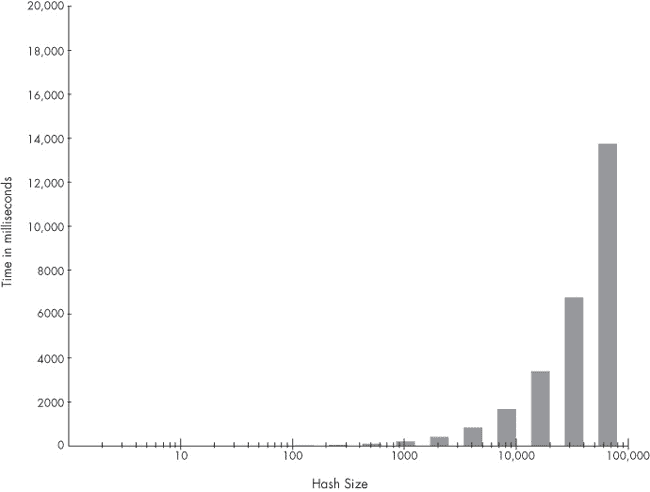

图 7-12. 使用较差哈希函数（Ruby 2.0）时，检索 10,000 个值所需的时间与哈希大小的关系

图 7-12 与 图 7-11 有很大的不同！注意图表的比例。y 轴显示的是毫秒，x 轴则是哈希中元素的数量，以对数尺度显示。但这次请注意，y 轴上有数千毫秒——也就是说，实际的秒数！

使用一个或少数几个元素，我们可以非常快速地检索到 10,000 个值——如此之快，时间短到在图表上无法显示。事实上，这大约需要 1.5 毫秒。然而，当元素数量超过 100，尤其是超过 1,000 时，加载 10,000 个值所需的时间会随着哈希大小的增加而线性增长。对于一个包含大约 10,000 个元素的哈希表，加载这 10,000 个值需要超过 1.6 秒。如果我们继续用更大的哈希表进行测试，加载这些值可能需要几分钟甚至几小时。

这里发生的情况是，所有哈希元素都被保存到同一个桶中，这迫使 Ruby 一个一个地查找键。

## Ruby 2.0 中的哈希优化

从 2.0 版本开始，Ruby 引入了一种新的优化，使得哈希表的运作更快。对于包含 6 个或更少元素的哈希表，Ruby 现在完全避免计算哈希值，而是将哈希数据直接保存为数组。这些被称为 *紧凑哈希表*。图 7-13 显示了一个紧凑的哈希表。

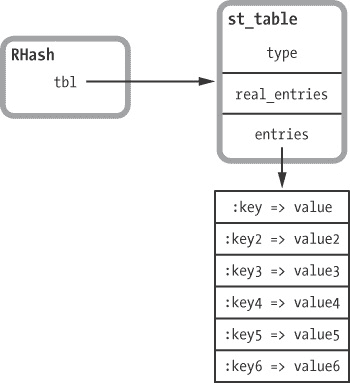

图 7-13。内部，Ruby 2.0 将包含 6 个或更少元素的小哈希表保存为数组。

Ruby 2.0 不使用 `st_table_entry` 结构来处理小哈希表，也不创建桶数组。相反，它创建一个数组，并将键/值对直接保存到该数组中。这个数组足够大，可以容纳 6 个键/值对；一旦插入第 7 个键和值，Ruby 就会丢弃该数组，创建桶数组，并像往常一样通过计算哈希值将所有 7 个元素移动到 `st_table_entry` 结构中。这解释了我们在插入第 7 个元素时在图 7-8 中看到的小幅波动。`real_entries` 保存数组中保存的值的数量，范围从 0 到 6。

在一个紧凑的哈希表中，只有 6 个或更少的元素；因此，Ruby 遍历键值寻找目标值的速度比计算哈希值并使用桶数组要快。图 7-14 显示了 Ruby 2.0 如何从紧凑的哈希表中获取一个元素。

要查找给定键 `target` 的值，Ruby 会遍历数组并在每个键值上调用 `eql?` 方法（如果值是对象）。对于简单的值，如整数或符号，Ruby 直接使用数值比较。Ruby 2.0 对于紧凑哈希表从不调用哈希函数。

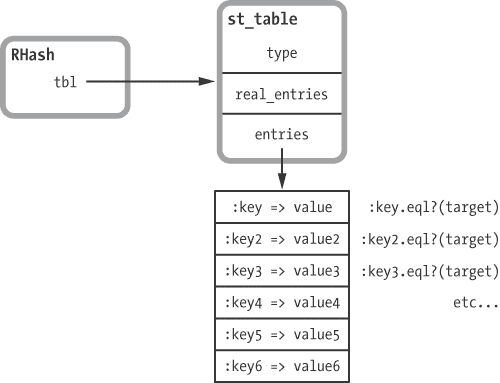

图 7-14。对于小哈希表，Ruby 2.0 通过遍历数组来查找给定的键。

# 总结

理解哈希表是理解 Ruby 内部工作原理的关键，因为哈希表的速度和灵活性使得 Ruby 能够以多种方式使用它们。

在本章开始时，我们学习了哈希表如何能够快速返回值，无论表中有多少元素。接下来，我们学习了 Ruby 如何在你添加更多元素时自动增大哈希表的大小。哈希表的用户无需担心表的速度或大小。哈希表始终会保持快速，并会根据需要自动扩展。

最后，我们看了 Ruby 哈希函数的重要性。哈希表的算法依赖于底层的哈希函数。使用有效的哈希函数时，值会在哈希表的桶中均匀分布，碰撞较少，从而使得数据能够快速保存和检索。然而，如果使用一个差的哈希函数，值将会被保存到同一个桶中，导致性能下降。
