# 第八章。Ruby 如何借鉴 Lisp 中的一个几十年历史的想法

> 
> 
> *块是 Ruby 对闭包的实现。*

块是 Ruby 中最常用且强大的特性之一，因为它们允许你将代码片段传递给 `Enumerable` 方法，例如 `each`、`detect` 或 `inject`。通过使用 `yield` 关键字，你还可以编写自定义迭代器或函数，以调用其他原因的块。包含块的 Ruby 代码通常比等效的老旧语言（如 C）代码更简洁、更优雅、更具表现力。

但不要急于得出结论，认为块是一个新概念！事实上，块在 Ruby 中并不新鲜。块背后的计算机科学概念，称为*闭包*，最早由 Peter J. Landin 在 1964 年发明，距离 Lisp 的原始版本由 John McCarthy 在 1958 年创建才几年。闭包后来被 Lisp 采用，或者更准确地说，被 Lisp 的一个方言——*Scheme* 采用，Scheme 是由 Gerald Sussman 和 Guy Steele 在 1975 年发明的。Sussman 和 Steele 在 Scheme 中使用闭包的做法首次将这一概念带给了许多程序员。

那么在这个语境中，*闭包*一词到底是什么意思呢？换句话说，Ruby 块到底是什么？它们只是出现在 `do` 和 `end` 关键字之间的 Ruby 代码片段吗？在本章中，我将回顾 Ruby 如何在内部实现块，并展示它们如何符合 Sussman 和 Steele 在 1975 年提出的*闭包*定义。我还将展示块、lambda 和 proc 如何作为不同的方式来理解闭包。

路线图

+   块：Ruby 中的闭包

    +   逐步了解 Ruby 如何调用块

    +   借鉴 1975 年的一个想法

    +   rb_block_t 和 rb_control_frame_t 结构

+   实验 8-1：哪种更快：while 循环还是将块传递给 each？

+   Lambdas 和 Procs：将函数视为一等公民

    +   栈与堆内存

    +   深入了解 Ruby 如何保存字符串值

    +   Ruby 如何创建 Lambda

    +   Ruby 如何调用 Lambda

    +   Proc 对象

+   实验 8-2: 调用 lambda 后改变局部变量

    +   在同一作用域内多次调用 lambda

+   总结

# 块：Ruby 中的闭包

内部地，Ruby 使用一个名为 `rb_block_t` 的 C 结构来表示每个块，参见图 8-1。通过了解 Ruby 在 `rb_block_t` 中存储的内容，我们可以准确地弄清楚一个块是什么。

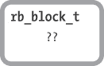

图 8-1. rb_block_t C 结构内部是什么？

正如我们在第五章中对 `RClass` 结构的分析一样，我们也可以基于块在 Ruby 中的功能推测 `rb_block_t` 结构的内容。我们将从块的最明显特征开始。我们知道每个块必须包含一段 Ruby 代码，或者在内部是编译后的 YARV 字节码指令。例如，假设我们调用一个方法并传递一个块作为参数，见示例 8-1。

示例 8-1. 表面上，一个块只是 Ruby 代码的一小段。

```
10.times do
  str = "The quick brown fox jumps over the lazy dog."
  puts str
end
```

当执行 `10.times` 调用时，Ruby 需要知道要迭代的代码是什么。因此，`rb_block_t` 结构必须包含指向该代码的指针，如图 8-2 所示。

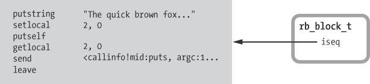

图 8-2. `rb_block_t` 结构包含指向 YARV 指令片段的指针。

值 `iseq` 是指向块中 Ruby 代码的 YARV 指令的指针。

另一个显而易见但常被忽视的块行为是，块可以访问周围或父级 Ruby 作用域中的变量，正如在示例 8-2 中所示。

示例 8-2. 块内的代码访问来自周围代码的 `str` 变量。

```
 str = "The quick brown fox"
 10.times do
   str2 = "jumps over the lazy dog."
   puts "#{str} #{str2}"
    end
```

这里，`puts` 函数调用在  中同时引用了块内的 `str2` 变量以及在周围代码中定义的 `str` 变量，位置见 。显然，块可以访问它们周围代码中的值。这种能力正是块有用之处之一。

块在某种程度上具有双重特性。一方面，它们表现得像独立的方法：你可以像调用任何方法一样调用它们并传递参数。另一方面，它们是周围函数或方法的一部分。

## 步骤解析 Ruby 如何调用块

这是如何在内部工作的？Ruby 是将块实现为独立的方法，还是作为周围方法的一部分？让我们通过 示例 8-2 步骤查看，当你调用块时，Ruby 内部发生了什么。

当 Ruby 执行 示例 8-2 中的第一行代码时，在  处，`str = "The quick brown fox"`，YARV 将局部变量 `str` 存储在其内部栈上。YARV 使用 `EP`（环境指针）追踪 `str` 的位置，`EP` 位于当前的 `rb_control_frame_t` 结构中，如 图 8-3 所示。^([1])


图 8-3. Ruby 将局部变量 `str` 保存到栈上。

接下来，Ruby 在 示例 8-2 中到达 `10.times do` 调用，在  处。执行实际迭代之前——也就是在调用 `times` 方法之前——Ruby 创建并初始化一个新的 `rb_block_t` 结构来表示块。Ruby 现在需要创建这个块结构，因为块实际上只是 `times` 方法的另一个参数。图 8-4 显示了这个新的 `rb_block_t` 结构。

在创建新的块结构时，Ruby 将 `EP` 的当前值复制到新的块中。换句话说，Ruby 将当前栈帧的位置保存在新的块中。

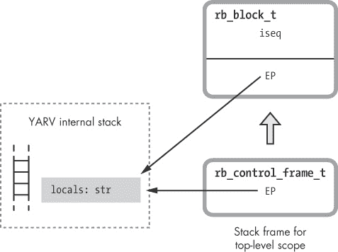

图 8-4. Ruby 在调用方法并将块传递给它之前创建了一个新的 `rb_block_t` 结构。

接下来，Ruby 在 `10` 对象（`Fixnum` 类的一个实例）上调用 `times` 方法。在执行此操作时，YARV 在其内部堆栈上创建了一个新的帧。现在我们有两个堆栈帧：上方是 `Fixnum.times` 方法的新堆栈帧，下面是用于顶层函数的原始堆栈帧（见 图 8-5）。

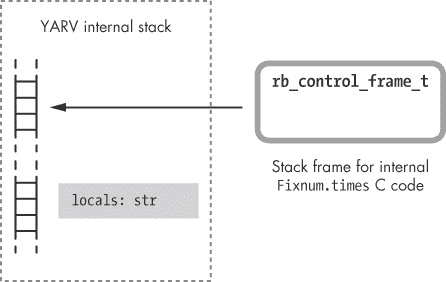

图 8-5. Ruby 在执行 `10.times` 调用时创建了一个新的堆栈帧。

Ruby 使用自己的 C 代码在内部实现 `times` 方法。尽管这是一个内置方法，但 Ruby 的实现方式与你可能实现的方法类似。Ruby 开始迭代数字 0、1、2 等，直到 9，然后它调用 `yield`，每次为这些整数调用一次块。最后，实现 `yield` 的代码在内部每次通过循环时都会调用块，为块中的代码在堆栈顶部推送第三个帧。 图 8-6 展示了这个第三个堆栈帧。


图 8-6. Ruby 在 `10.times` 方法调用块时创建了第三个堆栈帧。

图的左侧现在有三个堆栈帧：

+   在顶部是为块创建的新堆栈帧，包含在示例 8-2 中定义的 `str2` 变量，位于 。

+   中间是用于实现 `Fixnum#times` 方法的内部 C 代码的堆栈帧。

+   最底部是原始函数的堆栈帧，包含在示例 8-2 中定义的 `str` 变量，位于 。

在创建新的栈帧时，Ruby 内部的 `yield` 代码将 `EP` 从块中复制到新的栈帧中。现在，块内的代码可以通过 `rb_control_frame_t` 结构直接访问它的局部变量，并通过 `EP` 指针间接访问父作用域中的变量，利用动态变量访问。具体来说，这使得 示例 8-2 中的 `puts` 语句能够访问父作用域中的 `str2` 变量。

## 借用 1975 年的一个想法

到目前为止，我们已经看到 Ruby 的 `rb_block_t` 结构包含两个重要的值：

+   指向 YARV 代码指令片段的指针——`iseq` 指针

+   指向 YARV 内部栈位置的指针，即在创建块时栈顶所在的位置——`EP` 指针

图 8-7 显示了 `rb_block_t` 结构中的这两个值。

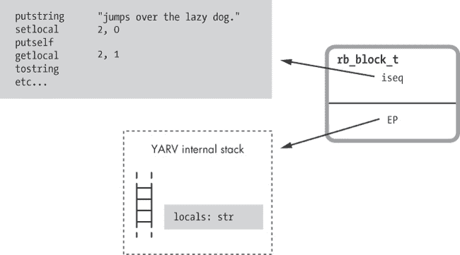

图 8-7。到目前为止，我们已经看到 Ruby 块包含指向 YARV 指令片段的指针和 YARV 栈上的一个位置。

我们还看到，当 Ruby 块访问周围代码中的值时，Ruby 使用 `EP`。一开始，这看起来像是一个非常技术性的、不重要的细节。这显然是我们期望 Ruby 块表现出的行为，而 `EP` 似乎只是 Ruby 内部实现块的一个小细节，一个不那么引人注目的部分。或者说它不是吗？


*上图中的 IBM 704 是第一台在 1960 年代初运行 Lisp 的计算机。（来源：NASA）*

`EP` 实际上是 Ruby 内部实现中一个非常重要的部分。它是 Ruby 实现 *闭包* 的基础，闭包是一个计算机科学概念，在 Ruby 创立之前的 Lisp 中就已被引入。以下是 Sussman 和 Steele 在 1975 年对 *闭包* 一词的定义：

> 为了解决这个问题，我们引入了闭包（[11, 14]）的概念，它是一个数据结构，包含一个 lambda 表达式和一个在应用该 lambda 表达式时使用的环境。^([2])

他们定义闭包为以下内容的组合：

+   一个“lambda 表达式”——即一个接受一组参数的函数

+   在调用该 lambda 或函数时使用的环境

让我们再看一下内部的 `rb_block_t` 结构体，为了方便起见，重复在图 8-8 中展示。


图 8-8. 块是一个函数与调用该函数时使用的环境的结合。

该结构体符合 Sussman 和 Steele 对闭包的定义：

+   `iseq` 是指向一个 lambda 表达式的指针——即一个函数或代码片段。

+   `EP` 是指向调用该 lambda 或函数时使用的环境的指针——即指向周围堆栈帧的指针。

按照这个思路，我们可以看到块（blocks）是 Ruby 实现闭包的方式。具有讽刺意味的是，块——正是使 Ruby 既优雅又现代的特性之一——基于的是至少在 Ruby 诞生前 20 年就已经完成的研究和工作！

`rb_block_t` 和 `rb_control_frame_t` 结构体

在 Ruby 1.9 及以后的版本中，你可以在 *vm_core.h* 文件中找到 `rb_block_t` 结构体的定义，如 示例 8-3 所示。

示例 8-3. `rb_block_t` 结构体定义，来自 *vm_core.h*

```
    typedef struct rb_block_struct {
     VALUE self;
     VALUE klass;
     VALUE *ep;
     rb_iseq_t *iseq;
     VALUE proc;
    } rb_block_t;
```

你可以看到上面描述的 `iseq`  和 `ep`  值，以及一些其他值：

+   `self` ：当块首次被引用时，`self` 指针指向的值也是闭包环境的一个重要部分。Ruby 在与块外部相同的对象上下文中执行块代码。

+   `klass` ：与 `self` 一起，Ruby 还使用这个指针来追踪当前对象的类。

+   `proc` ：Ruby 在从块创建 proc 对象时会使用这个值。正如我们将在下一节中看到的，procs 和块是密切相关的。

在 *vm_core.h* 中 `rb_block_t` 的定义上方，我们可以看到 `rb_control_frame_t` 结构体的定义，如 示例 8-4 所示。

示例 8-4. `rb_control_frame_t` 结构体定义，来自 *vm_core.h*

```
    typedef struct rb_control_frame_struct {
        VALUE *pc;                  /* cfp[0] */
        VALUE *sp;                  /* cfp[1] */
        rb_iseq_t *iseq;            /* cfp[2] */
        VALUE flag;                 /* cfp[3] */
     VALUE self;                 /* cfp[4] / block[0] */
        VALUE klass;                /* cfp[5] / block[1] */
        VALUE *ep;                  /* cfp[6] / block[2] */
        rb_iseq_t *block_iseq;      /* cfp[7] / block[3] */
     VALUE proc;                 /* cfp[8] / block[4] */
        const rb_method_entry_t *me;/* cfp[9] */

    #if VM_DEBUG_BP_CHECK
        VALUE *bp_check;            /* cfp[10] */
    #endif
    } rb_control_frame_t;
```

请注意，这个 C 结构体也包含了与 `rb_block_t` 结构体相同的值：从`self`到`proc`，正如下图所示！[](httpatomoreillycomsourcenostarchimages1853843.png.jpg) 和 。这两个结构体共享相同的值是 Ruby 为加速内部操作而采用的一项有趣但令人困惑的优化措施。每当你第一次通过将代码块传递到方法调用中时，Ruby 需要创建一个新的 `rb_block_t` 结构体，并将当前 `rb_control_frame_t` 结构体中的值（如 `EP`）复制到其中。然而，由于这两个结构体在相同的顺序中包含相同的值（`rb_block_t` 是 `rb_control_frame_t` 的子集），Ruby 可以避免创建新的 `rb_block_t` 结构体，而是将新的代码块指针设置为 `rb_control_frame_t` 结构体中的公共部分。换句话说，Ruby 不是分配新的内存来存放新的 `rb_block_t` 结构体，而是简单地传递指向 `rb_control_frame_t` 结构体中间部分的指针。通过这种方式，Ruby 避免了不必要的 `malloc` 调用，加快了创建代码块的过程。

# 实验 8-1: 哪个更快：`while` 循环还是将代码块传递给 each？

包含代码块的 Ruby 代码通常比较老语言（如 C）中的等效代码更优雅、简洁。例如，在 C 中，我们会写出 示例 8-5 中展示的简单 `while` 循环来将数字 1 到 10 相加。

示例 8-5. 使用 `while` 循环在 C 中求 1 到 10 的和

```
#include <stdio.h>
main()
{
  int i, sum;
  i = 1;
  sum = 0;
  while (i <= 10) {
    sum = sum + i;
    i++;
  }
  printf("Sum: %d\n", sum);
}
```

示例 8-6 展示了 Ruby 中相同的 `while` 循环。

示例 8-6. 使用 `while` 循环在 Ruby 中求 1 到 10 的和

```
sum = 0
i = 1
while i <= 10
  sum += i
  i += 1
end
puts "Sum: #{sum}"
```

然而，大多数 Ruby 开发者会像在 示例 8-7 中所示的那样，使用带有代码块的区间对象来编写这段代码。

示例 8-7. 使用区间对象和代码块在 Ruby 中求 1 到 10 的和

```
sum = 0
(1..10).each do |i|
  sum += i
end
puts "Sum: #{sum}"
```

抛开美学问题，使用代码块会有什么性能惩罚吗？Ruby 是否会为了创建新的 `rb_block_t` 结构体、复制 `EP` 值并创建新的栈帧而显著变慢？

嗯，我不会对 C 代码进行基准测试，因为显然它会比使用 Ruby 的任何选项都要快。相反，让我们测量一下 Ruby 使用简单的 `while` 循环来将整数 1 到 10 加起来得到 55 所需的时间，正如 示例 8-8 所示。

示例 8-8. 基准测试 `while` 循环 *(while.rb)*

```
require 'benchmark'
ITERATIONS = 1000000
Benchmark.bm do |bench|
  bench.report("iterating from 1 to 10, one million times") do
    ITERATIONS.times do
      sum = 0
      i = 1
      while i <= 10
        sum += i
        i += 1
      end
    end
  end
end
```

在这里，我使用基准测试库来测量运行`while`循环一百万次所需的时间。诚然，我使用了一个块来控制这百万次迭代（`ITERATIONS.times do`），但在下一个测试中，我也会使用相同的块。使用 Ruby 2.0 在我的笔记本电脑上，我能在不到半秒的时间内完成这段代码：

```
$ **ruby while.rb**
      user     system      total        real
      iterating from 1 to 10, one million times  0.440000   0.000000
                                                 0.440000 (  0.445757)
```

现在让我们测量运行示例 8-9 的代码所需的时间，该代码使用`each`和一个块。

示例 8-9. 基准测试调用一个块 *(each.rb)*

```
require 'benchmark'
ITERATIONS = 1000000
Benchmark.bm do |bench|
  bench.report("iterating from 1 to 10, one million times") do
    ITERATIONS.times do
      sum = 0
      (1..10).each do |i|
        sum += i
      end
    end
  end
end
```

这次运行一百万次循环所需的时间略长，约为 0.75 秒：

```
$ **ruby each.rb**
      user     system      total        real
      iterating from 1 to 10, one million times  0.760000   0.000000
                                                 0.760000 (  0.765740)
```

与简单的`while`循环迭代 10 次相比，Ruby 调用块的时间多了约 71%（参见图 8-9）。

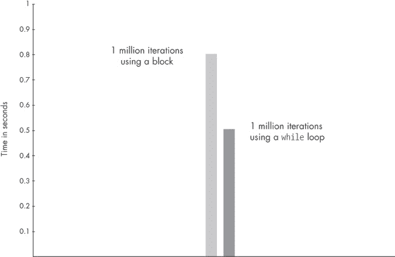

图 8-9. Ruby 2.0 调用块的时间比简单的`while`循环多 71%。图表显示了一百万次迭代所需的时间（以秒为单位）。

使用`each`会更慢，因为在内部，`Range#each`方法每次循环时都必须调用或传递控制给块。这涉及相当大量的工作。为了将控制传递给一个块，Ruby 首先必须为该块创建一个新的`rb_block_t`结构，并将新的块的`EP`设置为引用的环境，然后将该块传递给`each`的调用。然后，在每次循环时，Ruby 必须在 YARV 的内部栈上创建一个新的栈帧，调用块的代码，最后将块的`EP`从块复制到新的栈帧。运行一个简单的`while`循环更快，因为 Ruby 只需要在每次循环时重置`PC`（程序计数器）。它从不调用方法，也不会创建新的栈帧或新的`rb_block_t`结构。

增加 71% 的时间看起来像是一个巨大的性能惩罚，根据你的工作和这个 `while` 循环的上下文，它可能重要也可能不重要。如果这个循环是一个时间敏感的关键操作，并且最终用户正在等待，如果循环内部没有其他昂贵的操作，那么使用传统的 C 风格 `while` 循环来编写迭代可能是值得的。然而，大多数 Ruby 应用程序，尤其是 Ruby on Rails 网站的性能，通常受到数据库查询、网络连接和其他因素的限制，而不是 Ruby 执行速度的限制。Ruby 的执行速度很少会对应用程序的整体性能产生直接的影响。（当然，如果你使用的是一个大型框架，比如 Ruby on Rails，那么你的 Ruby 代码只是一个非常庞大系统中的一小部分。我想 Rails 在处理一个简单的 HTTP 请求时，会多次使用块和迭代器，除了你自己写的 Ruby 代码之外。）

# Lambdas 和 Procs：将函数视为一等公民

现在来看一种更复杂的方式，将“quick brown fox”字符串打印到控制台。示例 8-10 展示了使用 `lambda` 的一个例子。

示例 8-10. 使用 Ruby 中的 `lambda`

```
 def message_function
   str = "The quick brown fox"
   lambda do |animal|
     puts "#{str} jumps over the lazy #{animal}."
      end
    end
 function_value = message_function
 function_value.call('dog')
```

让我们仔细地走过这段代码。首先，在  我们定义了一个名为 `message_function` 的方法。在 `message_function` 内部，在  我们创建了一个名为 `str` 的局部变量。接下来，在  我们调用了 `lambda`，并传递了一个代码块。在这个代码块内，在  我们再次打印了“quick brown fox”字符串。然而，`message_function` 不会立即显示这个字符串，因为它并没有实际调用位于  的代码块。相反，`lambda` 返回我们传给它的代码块作为数据值，而这个数据值又会被 `message_function` 返回。

这是一个“将函数视为一等公民”的例子，用计算机科学中常用的表达方式来说。块从 `message_function` 返回后，我们将其保存在局部变量 `function_value` 中，如 ，然后显式地使用 `call` 方法调用它，如 。通过 `lambda` 关键字—或者等效的 `proc` 关键字—Ruby 允许你以这种方式将一个块转换为数据值。

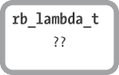

图 8-10. Ruby 是否使用 *rb_lambda_t* C 结构？如果是，它会包含什么？

我有很多关于 示例 8-10 的问题。当我们调用 `lambda` 时会发生什么？Ruby 如何将块转换为数据值，将块视为一等公民意味着什么？`message_function` 是直接返回一个 `rb_block_t` 结构，还是返回一个 `rb_lambda_t` 结构？那么 `rb_lambda_t` 会包含哪些信息呢？（参见 图 8-10）？

## 栈与堆内存

在我们能够回答这些问题之前，我们需要更仔细地了解 Ruby 如何保存数据。在内部，Ruby 将数据保存在两个地方：*栈*上或*堆*中。

我们之前见过 *栈*。这是 Ruby 保存局部变量、返回值和每个方法参数的地方。栈上的值仅在该方法运行时有效。当方法返回时，YARV 会删除其栈帧和其中的所有值。

Ruby 使用 *堆* 来保存你可能需要较长时间的数据，甚至在某个方法返回后依然有效。堆中的每个值都会在有引用指向它时保持有效。一旦一个值不再被程序中的任何变量或对象引用，Ruby 的垃圾回收系统会删除它，释放其内存供其他用途。

这种方案并非 Ruby 独有。事实上，许多其他编程语言也使用这种方式，包括 Lisp 和 C。而且请记住，Ruby 本身就是一个 C 程序。YARV 的栈设计基于 C 程序使用栈的方式，Ruby 的堆使用的是底层 C 堆的实现。

栈和堆在另一个重要方面有所不同。Ruby 只在栈上保存数据的引用——即 `VALUE` 指针。对于简单的整数值、符号和常量（例如 `nil`、`true` 或 `false`），引用就是实际的值。然而，对于所有其他数据类型，`VALUE` 是指向包含实际数据的 C 结构的指针，例如 `RObject`。如果栈上只保存 `VALUE` 引用，那么 Ruby 将数据结构保存在什么地方？保存在堆中。让我们通过一个例子更好地理解这一点。

## 更深入地了解 Ruby 如何保存字符串值

让我们详细看一下 Ruby 如何处理字符串值 `str`，来自 示例 8-10。首先，假设 YARV 有一个外部作用域的栈帧，但尚未调用 `message_function`。图 8-11 显示了这个初始栈帧。

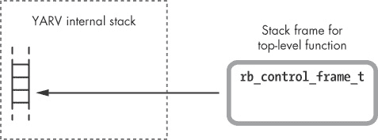

图 8-11。为了执行示例 8-11 中的代码，Ruby 从初始栈帧开始。

在这张图中，你可以看到左侧是 YARV 的内部栈，右侧是 `rb_control_frame_t` 结构。现在假设 Ruby 执行了在示例 8-10 中显示的 `message_function` 函数调用。接下来的图 8-12 展示了接下来的情况。

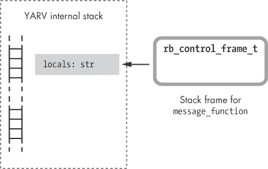

图 8-12。Ruby 在调用 `message_function` 时创建了第二个栈帧。

Ruby 将 `str` 局部变量保存在 `message_function` 使用的新栈帧中。让我们仔细看看这个 `str` 变量，以及 Ruby 如何将“quick brown fox”字符串存储到其中。Ruby 将每个对象保存在一个叫做 `RObject` 的 C 结构中，将每个数组保存在一个叫做 `RArray` 的结构中，将每个字符串保存在一个叫做 `RString` 的结构中，依此类推。图 8-13 展示了将“quick brown fox”字符串保存在 `RString` 中的情况。

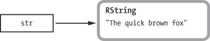

图 8-13。Ruby 使用 `RString` C 结构来保存字符串值。

实际的字符串结构如图右侧所示，字符串的引用或指针如图左侧所示。当 Ruby 将字符串值（或任何对象）保存到 YARV 栈时，实际上只将字符串的引用放入栈中。实际的字符串结构则保存于堆中，如下一页中的图 8-14 所示。

一旦堆中不再有任何指针引用某个特定对象或值，Ruby 会在下一次垃圾回收系统运行时释放该对象或值。为了演示这一点，假设我的示例代码根本没有调用 `lambda`，而是在保存 `str` 变量后立即返回 `nil`，如示例 8-11 所示。

示例 8-11。此代码没有调用 `lambda`。

```
def message_function
  str = "The quick brown fox"
  nil
end
```

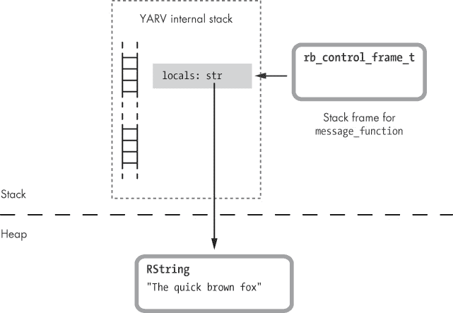

图 8-14。栈上的 `str` 值是保存于堆中的 `RString` 结构的引用。

一旦 `message_function` 调用完成，YARV 会简单地将 `str` 值从栈中弹出（以及栈中保存的任何其他临时值），并返回到原始栈帧，如 图 8-15 所示。


图 8-15。现在不再引用 `RString` 结构体。

如图所示，不再引用包含“快速棕色狐狸”字符串的 `RString` 结构体。Ruby 的垃圾回收系统旨在识别堆中没有任何引用的值，就像这里的“快速棕色狐狸”字符串。识别后，GC 系统将释放这些孤立的值，将内存返回到堆中。

## Ruby 如何创建 Lambda

现在我们对堆以及 Ruby 如何使用堆有了一些了解，准备进一步学习关于 lambdas 的知识。之前我提到过“将函数作为一等公民”的说法，这意味着 Ruby 允许你将函数或代码当作数据值来处理，将它们保存在变量中，作为参数传递等等。Ruby 使用块来实现这个概念。

`lambda`（或 `proc`）关键字将块转换为数据值。但请记住，块是 Ruby 对闭包的实现。这意味着新的数据值必须以某种方式包含块的代码和引用的环境。

为了说明我的意思，我们返回到 示例 8-10，并在 示例 8-12") 中重复，重点看它如何使用 `lambda`。

示例 8-12。使用 `lambda` 在 Ruby 中（从 示例 8-10 重复）

```
    def message_function
   str = "The quick brown fox"
   lambda do |animal|
     puts "#{str} jumps over the lazy #{animal}."
      end
    end
    function_value = message_function
 function_value.call('dog')
```

请注意，在  处，当我们调用 lambda（块）时，块内的 `puts` 语句位于  处，可以访问在  处的 `message_function` 内定义的 `str` 字符串变量。这是怎么回事呢？我们刚刚看到，当 `message_function` 返回时，`str` 对 `RString` 结构体的引用被从栈中弹出！显然，在调用 `lambda` 后，`str` 的值仍然存在，以便块在稍后访问它。

当你调用 `lambda` 时，Ruby 将当前 YARV 堆栈帧的全部内容复制到堆中，其中包含 `RString` 结构。例如，图 8-16 显示了 `message_function` 开始时 YARV 堆栈的状态，位于 示例 8-12 的  处。（为了简化起见，这里没有显示 `RString` 结构，但请记住，`RString` 结构也会被保存在堆中。）


图 8-16. Ruby 在调用 `message_function` 时创建了第二个堆栈帧。

接下来，示例 8-12 在  处调用 `lambda`。图 8-17 显示了调用 `lambda` 时 Ruby 会发生什么。

虚线下方的水平堆栈图标显示，Ruby 为 `message_function` 创建了堆栈帧的新副本并保存在堆中。现在，`str RString` 结构有了第二个引用，这意味着当 `message_function` 返回时，Ruby 不会释放该结构。

事实上，除了堆栈帧的副本外，Ruby 还在堆中创建了另外两个新对象：

+   一个内部环境对象，通过图中左下角的 `rb_env_t` C 结构表示。它本质上是堆中堆栈副本的封装器。正如我们在 第九章 中看到的，你可以通过 `Binding` 类间接访问该环境对象。

+   一个 Ruby proc 对象，通过 `rb_proc_t` 结构表示。这是 `lambda` 关键字的实际返回值；它是 `message_function` 函数的返回值。

请注意，新的 proc 对象，即 `rb_proc_t` 结构，包含一个 `rb_block_t` 结构，其中包括 `iseq` 和 `EP` 指针。可以将 proc 看作是一个封装块的 Ruby 对象。与普通块类似，这些指针跟踪块的代码和其闭包的引用环境。Ruby 会设置块中的 `EP` 指针，指向堆中堆栈帧的副本。

此外，请注意 proc 对象包含一个内部值`is_lambda`。对于这个例子，`is_lambda`被设置为`true`，因为我们使用`lambda`关键字创建了 proc。如果我使用`proc`关键字或者仅仅通过调用`Proc.new`来创建 proc，那么`is_lambda`会被设置为`false`。Ruby 通过这个标志来区分 proc 和 lambda 之间的细微行为差异，但最好将 proc 和 lambda 视为本质相同。

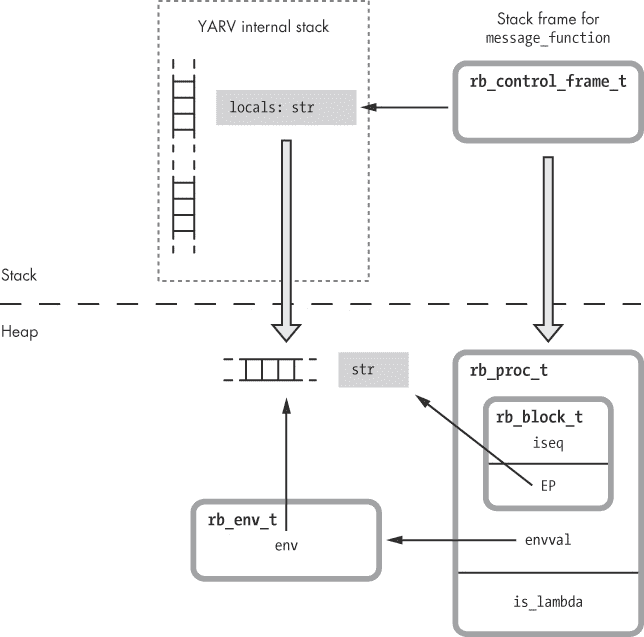

图 8-17。当你调用`lambda`时，Ruby 会将当前的堆栈帧复制到堆中。

## Ruby 如何调用 lambda

让我们回到示例 8-13 中的 lambda 示例。

示例 8-13。在 Ruby 中使用`lambda`（从示例 8-10 再次重复）

```
    def message_function
      str = "The quick brown fox"
      lambda do |animal|
        puts "#{str} jumps over the lazy #{animal}."
      end
    end
 function_value = message_function
 function_value.call('dog')
```

当`message_function`在处返回时会发生什么？因为 lambda 或 proc 对象是其返回值，lambda 的引用会保存在外部作用域的堆栈帧中的`function_value`局部变量中。这防止了 Ruby 释放 proc、内部环境对象以及`str`变量，并且现在堆中有指针指向这些值（参见图 8-18）。


图 8-18。一旦`message_function`返回，外围代码会持有 proc 对象的引用。

当 Ruby 在处执行 proc 对象的`call`方法时，它也会执行其块。图 8-19 展示了当你在 lambda 或 proc 上使用`call`方法时，Ruby 会发生什么。

和任何块一样，当 Ruby 调用 proc 对象中的块时，它会创建一个新的栈帧，并将 `EP` 设置为块的引用环境。然而，这个环境是之前已经复制到堆中的栈帧的副本；新的栈帧包含一个指向堆的 `EP`。这个 `EP` 使得块内对 `puts` 的调用可以访问在 `message_function` 中定义的 `str` 值。图 8-19 展示了作为 proc 参数的 `animal`，它像其他方法或块的参数一样，保存在新的栈帧中。

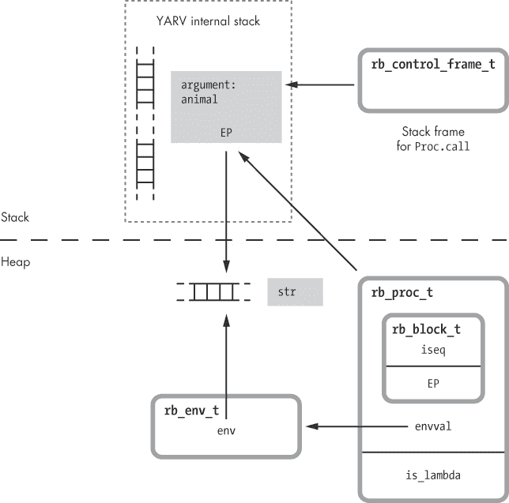

图 8-19。调用 proc 对象像往常一样创建一个新的栈帧，并将 `EP` 设置为指向堆的引用环境。

## Proc 对象

我们已经看到 Ruby 其实并没有一个叫做 `rb_lambda_t` 的结构。换句话说，图 8-20 中展示的那个结构实际上并不存在。


图 8-20。Ruby 实际上并没有使用一个叫做 `rb_lambda_t` 的结构。

相反，在这个例子中，Ruby 的 `lambda` 关键字创建了一个 proc 对象——实际上，这是我们传递给 `lambda` 或 `proc` 关键字的块的封装器。Ruby 使用 `rb_proc_t` C 结构来表示 procs，正如你在图 8-21 中看到的那样。

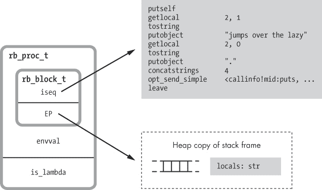

图 8-21。Ruby 的 proc 是闭包；它们包含指向函数和引用环境的指针。

这是一个闭包：它包含一个函数以及该函数所引用或创建的环境。这个环境是保存在堆中的栈帧的持久副本。

一个 proc 是一个 Ruby 对象。它包含与其他对象相同的信息，包括 `RBasic` 结构。为了保存与对象相关的信息，Ruby 使用一个叫做 `RTypedData` 的结构，配合 `rb_proc_t` 来表示 proc 对象的实例。图 8-22 展示了这些结构如何协同工作。

你可以将`RTypedData`看作是 Ruby 的 C 代码用来围绕 C 数据结构创建 Ruby 对象包装器的一种技巧。在这个案例中，Ruby 使用`RTypedData`来创建`Proc` Ruby 类的一个实例，该类表示`rb_proc_t`结构体的单个副本。`RTypedData`结构体包含与所有 Ruby 对象相同的`RBasic`信息：

+   ****`flags`****。Ruby 需要跟踪的某些内部技术信息

+   ****`klass`****。指向该对象所属的 Ruby 类的指针；在此示例中是`Proc`类

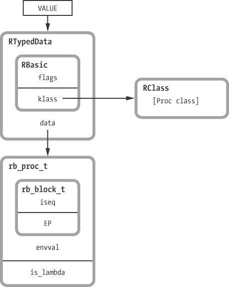

图 8-22。Ruby 将与 proc 对象相关的信息保存在`RTypedData`结构中。

图 8-23 再次查看 Ruby 如何表示 proc 对象。proc 对象位于右侧，紧邻一个`RString`结构体。

请注意，Ruby 处理字符串值和 proc 的方式相似。与字符串一样，procs 可以被保存在变量中或作为函数调用的参数传递。每当你引用一个 proc 或将其保存在变量中时，Ruby 使用指向该 proc 的`VALUE`指针。

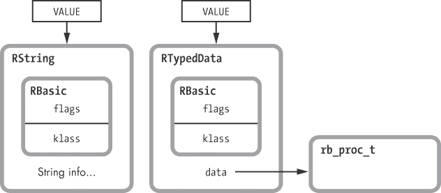

图 8-23。比较 Ruby 字符串与 proc

# 实验 8-2：调用 lambda 后更改局部变量

示例 8-10 到示例 8-13 展示了如何调用`lambda`将当前的栈帧复制到堆上。现在来看一个略有不同的示例。示例 8-14 基本相同，唯一不同的是在这一行，`lambda`调用后更改了`str`。

示例 8-14。`lambda`会将`str`的哪个版本复制到堆上？*(modify_after_lambda.rb)*

```
    def message_function
      str = "The quick brown fox"
   func = lambda do |animal|
        puts "#{str} jumps over the lazy #{animal}."
      end
   str = "The sly brown fox"
      func
    end
    function_value = message_function
 function_value.call('dog')
```

因为我们在调用`lambda`时，`str`的值尚未更改为`The sly brown fox`，所以 Ruby 应该已经将栈帧复制到了堆中，包括`str`的原始值。这意味着当我们在调用 lambda 时，应该看到原始的“quick brown fox”字符串。然而，运行代码时，我们得到以下结果：

```
$ **ruby modify_after_lambda.rb**
The sly brown fox jumps over the lazy dog.
```

发生了什么？Ruby 以某种方式将`str`的新值`The sly brown fox`复制到了堆上，以便我们在调用 lambda 时能够访问它，调用时位于。

为了弄清楚 Ruby 是如何做到这一点的，让我们更仔细地看看当你调用`lambda`时发生了什么。图 8-24 展示了 Ruby 如何将栈帧复制到堆中，包括来自示例 8-14 的`str`值。

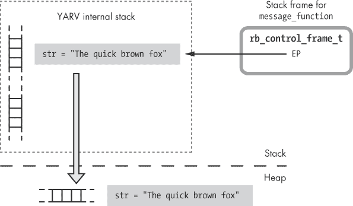

图 8-24。当你调用`lambda`时，Ruby 将栈帧复制到堆中。

一旦创建了此副本，示例 8-14 中的代码在将`str`更改为“sly fox”字符串：

```
str = "The sly brown fox"
```

由于 Ruby 在调用`lambda`时复制了栈帧，我们应该修改原始的`str`副本，而不是新的 lambda 副本（参见图 8-25）。

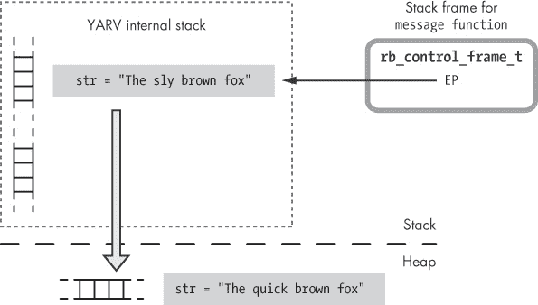

图 8-25。Ruby 在创建堆副本后是否继续使用原始栈帧？

字符串的新堆副本应保持未修改，稍后调用 lambda 时应该返回原始的“quick fox”字符串，而不是修改后的“sly fox”字符串。Ruby 是如何允许我们在`lambda`创建新持久副本后修改栈的呢？

结果表明，一旦 Ruby 创建了栈的新的堆副本（新的`rb_env_t`结构或内部环境对象），它会重置`rb_control_frame_t`结构中的`EP`，使其指向该副本。图 8-26 展示了 Ruby 在创建堆栈帧的持久副本后如何重置`EP`。

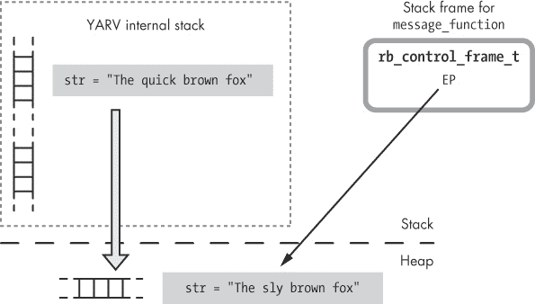

图 8-26。Ruby 在创建堆中的栈帧持久副本后，重置了`EP`。

这里的区别在于 `EP` 现在指向堆。当我们在示例 8-14 中调用 `str = "The sly brown fox"` 时，Ruby 将使用新的 `EP` 访问堆中的值，而不是栈上的原始值。请注意，`The sly brown fox` 出现在堆中的图 8-26 底部。

## 在同一作用域内多次调用 lambda。

`lambda` 关键字的另一个有趣行为是，Ruby 避免多次复制栈帧，正如你在示例 8-15 中看到的那样。

示例 8-15。在同一作用域内调用 `lambda` 两次

```
i = 0
increment_function = lambda do
  puts "Incrementing from #{i} to #{i+1}"
  i += 1
end
decrement_function = lambda do
  i -= 1
  puts "Decrementing from #{i+1} to #{i}"
end
```

这段代码期望两个 lambda 函数在主作用域中操作局部变量 `i`。

但是，如果 Ruby 为每次调用 `lambda` 创建了栈帧的单独副本，那么每个函数都会操作 `i` 的单独副本。请看以下示例 8-16 中的例子。

示例 8-16。调用在示例 8-15 中创建的 lambda。

```
increment_function.call
decrement_function.call
increment_function.call
increment_function.call
decrement_function.call
```

如果 Ruby 为每个 lambda 函数使用了 `i` 的单独副本，那么前面的示例会生成示例 8-17 中显示的输出。

示例 8-17。如果每次调用 `lambda` 创建了自己的栈帧副本，我们期望的输出

```
Incrementing from 0 to 1
Decrementing from 0 to -1
Incrementing from 1 to 2
Incrementing from 2 to 3
Decrementing from -1 to -2
```

但实际上，我们看到的是在示例 8-18 中显示的输出。

示例 8-18。由于 lambda 函数共享相同堆上的栈副本，运行示例 8-16 会生成以下输出。

```
Incrementing from 0 to 1
Decrementing from 1 to 0
Incrementing from 0 to 1
Incrementing from 1 to 2
Decrementing from 2 to 1
```

通常这正是你期望的：你传递给 lambda 的每个块都访问父作用域中的相同变量。Ruby 通过检查 `EP` 是否已经指向堆来实现这一点。如果是，就像在示例 8-15 中第二次调用 `lambda` 时，Ruby 不会创建第二个副本；它只会在第二个 `rb_proc_t` 结构中重用相同的 `rb_env_t` 结构。最终，两个 lambda 使用相同的堆副本栈。

# 总结

在第三章中，我们看到每次调用块时，YARV 都会创建一个新的栈帧，正如调用方法时的行为一样。乍一看，Ruby 块似乎是一种特殊的可以调用并传递参数的方法。然而，正如我们在本章中所看到的，块的含义远不止于此。

仔细查看 `rb_block_t` 结构体时，我们看到块是如何在 Ruby 中实现计算机科学中的*闭包*概念的。块是一个函数与调用该函数时所需的环境的结合体。我们了解到，块在 Ruby 中具有一种奇特的双重身份：它们类似于方法，但又成为调用它们的方法的一部分。Ruby 语法允许这种双重角色的方式非常简洁，这是这门语言最美丽和优雅的特点之一。

后来我们看到，Ruby 允许你使用 `lambda` 关键字将函数或代码作为一等公民，这将一个块转化为可以传递、保存和重用的数据值。在回顾栈内存和堆内存的区别之后，我们探讨了 Ruby 如何实现 lambdas 和 procs，并且发现当你调用 `lambda` 或 `proc` 时，Ruby 会将栈帧复制到堆上，并在调用 lambda 的块时重用它。最后，我们看到 proc 对象如何将代码表示为 Ruby 中的数据对象。

* * *

^([1]) 如果外部代码位于函数或方法内部，则 `EP` 会指向栈帧，如图所示。但如果外部代码位于 Ruby 程序的顶层作用域中，那么 Ruby 会使用动态访问将变量保存在 `TOPLEVEL_BINDING` 环境中。不管怎样，`EP` 始终指示 `str` 变量的位置。

^([2]) Gerald J. Sussman 和 Guy L. Steele, Jr.， “Scheme: An Interpreter for Extended Lambda Calculus” (MIT 人工智能实验室，AI 备忘录 No. 349，1975 年 12 月)。
