# 第九章. 元编程

> 
> 
> *一旦你了解 Ruby 如何在内部实现元编程，它就变得更容易理解了。*

Ruby 开发者面临的最令人困惑和令人畏惧的主题之一是*元编程*。如同前缀 *meta* 所示，元编程字面意思是以不同或更高的抽象层次进行编程。Ruby 提供了许多不同的方式来实现这一点，使得程序能够动态地检查和改变自己。在 Ruby 中，程序可以改变自己！

Ruby 的一些元编程特性允许程序查询关于自身的信息——例如，关于方法、实例变量和超类的信息。其他元编程特性则允许你以一种替代的、更灵活的方式执行正常的任务，例如定义方法或常量。最后，像 `eval` 这样的函数允许你的程序从头开始编写新的 Ruby 代码，在运行时调用解析器和编译器。

在本章中，我们将重点关注元编程的两个重要方面。首先，我们将探讨如何改变标准的方法定义过程，这是元编程最常见和最实用的用途。我们将学习 Ruby 通常如何将方法分配给类，以及这与词法作用域的关系。接着，我们将看看如何使用元类和单例类以替代方式定义方法。我们还将学习 Ruby 如何实现新的实验性特性——修饰符功能，允许你定义方法并在稍后激活它们（如果你愿意的话）。

路线图

+   定义方法的替代方式

    +   Ruby 的正常方法定义过程

    +   使用对象前缀定义类方法

    +   使用新的词法作用域定义类方法

    +   使用单例类定义方法

    +   在词法作用域中使用单例类定义方法

    +   创建修饰符

    +   使用修饰符

+   实验 9-1: 我是谁？self 在词法作用域中的变化

    +   顶层作用域中的 self

    +   类作用域中的 self

    +   元类作用域中的 self

    +   类方法中的 self

+   元编程与闭包：eval、instance_eval 和 binding

    +   写代码的代码

    +   图 9-16

    +   instance_eval 示例

    +   Ruby 闭包的另一个重要部分

    +   instance_eval 将 self 改为接收者

    +   instance_eval 为新的词法作用域创建单例类

    +   Ruby 如何跟踪块的词法作用域

+   实验 9-2：使用闭包定义方法

    +   使用 define_method

    +   作为闭包的方式的函数

+   总结

在本章的下半部分，我们将看到如何使用`eval`方法编写写代码的代码：这是元编程的最纯粹形式。我们还将看到元编程与闭包是如何相关的。像块、lambda 和 proc 一样，`eval`及其相关的元编程方法在调用时会创建一个闭包。事实上，我们将学习如何使用在第八章中开发的相同思维模型来理解 Ruby 的许多元编程特性。

# 定义方法的替代方法

通常，我们使用`def`关键字在 Ruby 中定义方法。`def`后面是新方法的名称，接着是方法体。然而，通过使用 Ruby 的一些元编程特性，我们可以以不同的方式定义方法。我们可以创建类方法而非普通方法；我们可以为单个对象实例创建方法；正如我们在实验 9-2：使用闭包定义方法中看到的，我们还可以创建能够访问周围环境的闭包方法。

接下来，我们将探讨在使用元编程定义方法时，Ruby 内部发生了什么。在每种情况下，研究 Ruby 内部的操作将使 Ruby 的元编程语法更容易理解。但在我们研究元编程之前，让我们先了解 Ruby 如何正常地定义方法。这些知识将为我们学习替代方法定义方式奠定基础。

## Ruby 的普通方法定义过程

示例 9-1 展示了一个非常简单的 Ruby 类，包含一个方法。

示例 9-1。使用 `def` 关键字向类添加方法

```
class Quote
  def display
    puts "The quick brown fox jumped over the lazy dog."
  end
end
```

Ruby 如何执行这个小程序？它是如何知道将 `display` 方法分配给 `Quote` 类的？

当 Ruby 执行 `class` 关键字时，它为新的 `Quote` 类创建了一个新的词法作用域（见图 9-1）。Ruby 在词法作用域中设置 `nd_clss` 指针，使其指向新的 `Quote` 类的 `RClass` 结构。由于这是一个新类，`RClass` 结构最初有一个空的方法表，如图的右侧所示。

接下来，Ruby 执行 `def` 关键字，它用于定义 `display` 方法。但 Ruby 如何创建普通方法？当你调用 `def` 时，内部发生了什么？

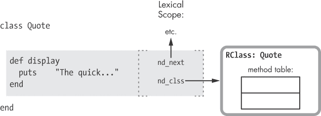

图 9-1。Ruby 在你定义类时会创建一个新的词法作用域。

默认情况下，当你使用 `def` 时，只提供新方法的名称。（我们将在下一节看到，你还可以指定对象前缀与新方法名称一起使用。）只提供新方法名称的 `def` 指示 Ruby 使用当前的词法作用域来查找目标类，如图 9-2 所示。

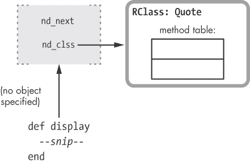

图 9-2。默认情况下，Ruby 使用当前的词法作用域来查找新方法的目标类。

当 Ruby 初次编译示例 9-1 时，它为 `display` 方法创建了一个单独的 YARV 代码片段。稍后，当执行 `def` 关键字时，Ruby 将此代码分配给目标类 `Quote`，并将给定的方法名称保存到方法表中（见图 9-3）。

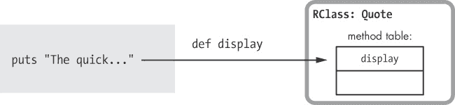

图 9-3. Ruby 将新方法添加到目标类的方法表中。

当我们执行这个方法时，Ruby 会根据 Ruby 的方法查找算法查找该方法。因为`display`现在出现在`Quote`的函数表中，Ruby 能够找到并执行该方法。

总结一下，使用`def`关键字在你的程序中定义新方法时，Ruby 遵循以下三步过程：

1.  它将每个方法的主体编译成一个独立的 YARV 指令片段。（当 Ruby 解析并编译你的程序时，就会发生这种情况。）

1.  它使用当前的词法作用域来获取指向类或模块的指针。（当 Ruby 在执行你的程序时遇到`def`关键字时，就会发生这种情况。）

1.  它将新方法的名称——实际上是映射到名称的整数 ID 值——保存在该类的方法表中。

## 使用对象前缀定义类方法

现在我们理解了 Ruby 方法定义过程的正常工作方式，让我们通过元编程来学习一些替代的定义方法。如同我们在图 9-2 中所看到的，Ruby 通常将新方法分配给与当前词法作用域对应的类。然而，有时你会决定将方法添加到另一个类中——例如，在定义类方法时。（记住，Ruby 会将类方法保存在类的元类中。）示例 9-2 展示了如何创建类方法的一个例子。

示例 9-2. 使用`def self`添加类方法

```
    class Quote
   def self.display
        puts "The quick brown fox jumped over the lazy dog."
      end
    end
```

在  中，我们使用`def`来定义新方法，但这一次我们使用`self`前缀。这个前缀告诉 Ruby 将方法添加到你在前缀中指定的对象的类中，而不是使用当前的词法作用域。图 9-4 展示了 Ruby 如何在内部实现这一点。

这种行为与标准的方法定义过程非常不同！当你为`def`提供对象前缀时，Ruby 使用以下算法来决定将新方法放置到哪里：

1.  Ruby 评估前缀表达式。在 示例 9-2 中，我们使用了 `self` 关键字。当 Ruby 在 `class Quote` 的作用域内执行代码时，`self` 被设置为 `Quote` 类。（我们本可以在这里提供任何 Ruby 表达式，而不仅仅是 `self`。）在 图 9-4 中，从 `self` 到 `RClass` 结构的箭头表示 `self` 的值是 `Quote`。

    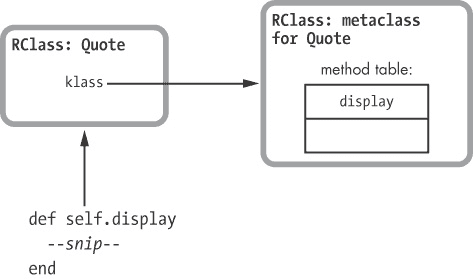

    图 9-4。提供对象前缀给 `def` 会指示 Ruby 将新方法添加到对象的类中。

1.  Ruby 查找该对象的类。在 示例 9-2 中，由于 `self` 本身是一个类（`Quote`），对象的类实际上是 `Quote` 的元类。图 9-4 通过箭头从 `Quote` 的 `RClass` 结构向右延伸来表示这一点。

1.  Ruby 将新方法保存到该类的函数表中。在这种情况下，Ruby 将 `display` 方法放置在 `Quote` 的元类中，使得 `display` 成为一个新的类方法。

### 注意

*如果你调用 `Quote.class`，Ruby 会返回 `Class`。所有类实际上都是 `Class` 类的实例。元类是一个内部概念，通常对你的 Ruby 程序隐藏。要查看 `Quote` 的元类，你可以调用 `Quote.singleton_class`，它将返回 `#<Class:Quote>`。*

## 使用新的词法作用域定义类方法

示例 9-3 展示了一种不同的方法，将 `display` 分配为 `Quote` 的类方法。

示例 9-3。使用 `class << self` 定义类方法

```
 class Quote
   class << self
        def display
          puts "The quick brown fox jumped over the lazy dog."
        end
      end
    end
```

在  处，`class << self` 声明了一个新的词法作用域，就像在  处的 `class Quote` 一样。在 Ruby 的正常方法定义过程 中，我们看到在由 `class Quote` 创建的作用域中使用 `def` 会将新方法分配给 `Quote`。但是，在 `class << self` 创建的作用域中，Ruby 将方法分配给哪个类呢？答案是 `self` 的类。因为在  处，`self` 被设置为 `Quote`，所以 `self` 的类就是 `Quote` 的元类。

图 9-5 显示了 `class << self` 如何为 `Quote` 的 metaclass 创建一个新的词法作用域。

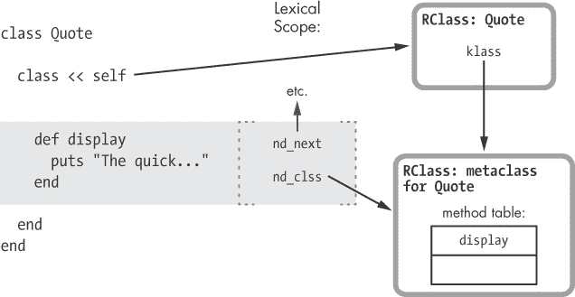

图 9-5. 使用 `class << self` 时，Ruby 为类的 metaclass 创建了一个新的词法作用域。

在这个图中，Ruby 的 `class <<` 元编程语法的作用如下：

1.  Ruby 首先求值出 `class <<` 后面的表达式。在示例 9-3 中，这个表达式是 `self`，它的值是 `Quote` 类，就像在示例 9-2 中使用对象前缀语法时一样。图中从 `self` 到 `RClass` 结构的长箭头指示了 `self` 的值是 `Quote` 类。

1.  Ruby 会找到表达式求值后的对象所属的类。在示例 9-3 中，这将是 `Quote` 类，或者是 `Quote` 的 metaclass，图中从 `Quote` 到 `Quote` 的 metaclass 向下延伸的箭头指示了这一点。

1.  Ruby 为这个类创建了一个新的词法作用域。在这个示例中，词法作用域使用的是 `Quote` 的 metaclass，如图中从 `nd_clss` 向右延伸到新作用域的箭头所示。

现在我们可以使用新的词法作用域来像往常一样使用 `def` 定义一系列的类方法。在示例 9-3 中，Ruby 会将 `display` 方法直接分配给 `Quote` 的 metaclass。这是定义 `Quote` 类方法的一种不同方式。你可能会觉得 `class << self` 比 `def self` 更让人困惑，但它是通过在内部的 metaclass 词法作用域内声明所有类方法来创建一系列类方法的便捷方式。

## 使用单例类定义方法

我们已经看到，元编程允许你通过向类的类或 metaclass 添加方法来声明类方法。Ruby 还允许你向单个对象实例添加方法，如在示例 9-4 中所示。

示例 9-4. 向单个对象实例添加方法

```
 class Quote
    end

 some_quote = Quote.new
 def some_quote.display
      puts "The quick brown fox jumped over the lazy dog."
    end
```

在  处，我们声明了 `Quote` 类；然后在  处，我们创建了 `Quote` 的一个实例：`some_quote`。然而，在  处，我们为 `some_quote` 实例创建了一个新方法，而不是为 `Quote` 类创建方法。因此，只有 `some_quote` 会有 `display` 方法；`Quote` 的其他实例将没有这个方法。

Ruby 内部通过一个名为 *单例类* 的隐藏类来实现这种行为，它类似于单个对象的元类。以下是它们的区别：

+   *Singleton class*（单例类）是 Ruby 内部创建的一个特殊隐藏类，用于存放仅为特定对象定义的方法。

+   *Metaclass*（元类）是一个单例类，当该对象本身是一个类时就会出现这种情况。

所有元类都是单例类，但并不是所有单例类都是元类。Ruby 会为你创建的每个类自动创建一个元类，并将类方法存储在元类中，供你稍后声明。另一方面，Ruby 仅在你为单个对象定义方法时创建单例类，如 示例 9-4 所示。当你使用 `instance_eval` 或相关方法时，Ruby 也会创建单例类。

### 注意

*大多数 Ruby 开发者将* singleton class *和* metaclass *这两个术语互换使用，当你调用 `singleton_class` 方法时，Ruby 会返回一个单例类或元类。然而，Ruby 的 C 源代码在内部确实区分了单例类和元类。*

图 9-6 展示了 Ruby 在执行 示例 9-4 时如何创建单例类。Ruby 评估作为 `def` 前缀提供的表达式：`some_quote`。因为 `some_quote` 是一个对象实例，Ruby 为 `some_quote` 创建了一个新的单例类，然后将新方法分配给这个单例类。使用带有对象前缀的 `def` 关键字会指示 Ruby 使用元类（如果前缀是类）或创建单例类（如果前缀是其他对象）。


图 9-6. 为 `def` 提供对象前缀会指示 Ruby 将新方法添加到对象的单例类中。

## 在词法作用域中使用单例类定义方法

您还可以使用 `class <<` 语法为单个对象实例声明新的词法作用域，以便添加方法，如 示例 9-5 所示。

示例 9-5. 使用 `class <<` 添加单例方法

```
    class Quote
    end

    some_quote = Quote.new
 class << some_quote
      def display
        puts "The quick brown fox jumped over the lazy dog."
      end
    end
```

这段代码与 示例 9-4 中的代码的区别出现在  处，当我们使用 `class <<` 语法与表达式 `some_quote` 结合时，`some_quote` 会被求值为一个单个对象实例。如 图 9-7 所示，`class << some_quote` 指示 Ruby 创建一个新的单例类以及一个新的词法作用域。

在 图 9-7 的左侧，您可以看到来自 示例 9-5 的部分代码。Ruby 首先计算表达式 `some_quote`，并发现它是一个对象，而不是类。图 9-7 使用指向 `some_quote` 的 `RObject` 结构的长箭头来表示这一点。由于它不是一个类，Ruby 会为 `some_quote` 创建一个新的单例类，并且还会创建一个新的词法作用域。接下来，它将新作用域的类设置为新的单例类。如果 `some_quote` 的单例类已经存在，Ruby 会重用它。


图 9-7. Ruby 为 `some_quote` 创建了一个新的单例类和词法作用域。

## 创建 Refinements

Ruby 2.0 的 *refinements* 特性使我们能够在以后定义方法并将其添加到类中。如果我们想查看如何实现这一点，我们将使用与 示例 9-1 中相同的 `Quote` 类和 `display` 方法，方便起见，下面再次列出。

```
class Quote
  def display
    puts "The quick brown fox jumped over the lazy dog."
  end
end
```

现在假设在我们的 Ruby 应用程序的其他地方，我们希望覆盖或更改 `display` 方法的行为，而不需要在整个 `Quote` 类中进行更改。Ruby 提供了一种优雅的方式来实现这一点，如 示例 9-6 所示。

示例 9-6. 在模块内部优化类

```
module AllCaps
  refine Quote do
    def display
      puts "THE QUICK BROWN FOX JUMPED OVER THE LAZY DOG."
    end
  end
end
```

在`refine Quote do`中，我们使用 `refine` 方法并传递 `Quote` 类作为参数。这为 `Quote` 定义了新的行为，稍后我们可以激活它。图 9-8 展示了我们调用 `refine` 时内部发生的事情。

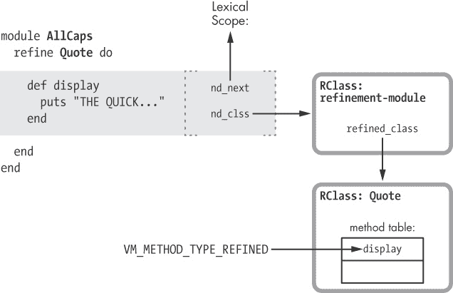

图 9-8. Ruby 在你调用 `refine` 时创建一个特殊的模块，并更新目标类方法的类型。

从左上角开始，逐步解析 图 9-8，我们可以看到以下内容：

+   `refine`方法创建了一个新的词法作用域（阴影矩形区域）。

+   Ruby 创建一个新的“refinement”模块，并使用它作为这个新作用域的类。

+   Ruby 将指向`Quote`类的指针保存在新 refinement 模块中的`refined_class`。

当你在 refine 块中定义新的方法时，Ruby 会将它们保存在 refinement 模块中。但它也会跟随 `refined_class` 指针，并更新目标类中的相同方法，使其使用方法类型 `VM_METHOD_TYPE_REFINED`。

## 使用 Refinements

你可以决定在程序的特定部分使用 `using` 方法激活这些“refined”方法，如 示例 9-7 所示。

示例 9-7. 激活一个 refined 方法

```
 Quote.new.display
     => The quick brown...

 using AllCaps

 Quote.new.display
     => THE QUICK BROWN...
```

当我们第一次在  调用 display 时，Ruby 使用原始方法。然后，在  处我们通过`using`激活 refinement，这导致 Ruby 在我们再次调用 display 时，使用更新后的方法，如  所示。

`using`方法将指定模块的 refinement 关联到当前的词法作用域。当我写这段话时，当前版本的 Ruby 2.0 只允许在顶级作用域中使用 refinement，如这个例子所示；`using`是顶级`main`对象的方法。（未来版本可能允许在程序的任何词法作用域中使用 refinement。）图 9-9 展示了 Ruby 如何在内部将 refinement 与顶级词法作用域关联。


图 9-9. `using`方法将模块的 refinements 与顶级词法作用域关联。

注意，每个词法作用域中都包含一个 `nd_refinements` 指针，它跟踪该作用域中活跃的 refinements。`using` 方法会设置 `nd_refinements`，否则它的值为 `nil`。

最后，图 9-10 展示了当我调用方法时，Ruby 的方法分发算法如何找到更新后的方法。

当你调用方法时，Ruby 使用一个复杂的方法分发过程。该算法的一部分查找 `VM_METHOD_TYPE_REFINED` 方法。当它遇到已修改的方法时，Ruby 会在当前词法作用域中查找任何活跃的 refinements。如果它找到了活跃的 refinement，Ruby 会调用已修改的方法；否则，它会调用原始方法。

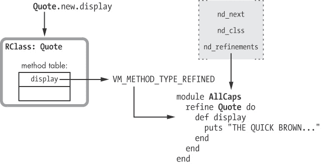

图 9-10。当原始方法标记为`VM_METHOD_TYPE_REFINED`时，Ruby 会在 refine 块中查找方法。

# 实验 9-1：我是谁？`self` 如何随词法作用域变化

我们已经见过多种在 Ruby 中定义方法的方式。我们使用常规的 `def` 关键字创建了方法。然后，我们看到了如何在元类和单例类上创建方法，以及如何使用 refinements。

尽管每种技术将方法添加到不同的类中，但每种方法也遵循一个简单的规则：Ruby 会根据当前的词法作用域将新方法添加到相应的类中。（然而，当你使用前缀时，`def` 关键字会将方法分配给另一个类。）在 refinements 中，当前作用域的类实际上是创建用来存放已修改方法的特殊模块。事实上，这正是词法作用域在 Ruby 中扮演的重要角色之一：它标识了我们当前正在向哪个类或模块添加方法。

我们还知道，`self` 关键字返回当前对象——当前由 Ruby 执行的方法的接收者。回想一下，YARV 会在你的 Ruby 调用栈的每个级别中保存 `self` 的当前值，这些值保存在 `rb_control_frame_t` 结构中。那么，这个对象是否与当前词法作用域的类相同？

## 顶级作用域中的 `self`

让我们看看在运行一个简单程序时，`self` 的值如何变化，这个程序从 示例 9-8 开始。

示例 9-8：只有一个词法作用域的简单 Ruby 程序

```
p self
 => main
p Module.nesting
 => []
```

为了简单起见，我已经在控制台中展示了输出。你可以看到，Ruby 在开始执行你的代码之前会创建一个 `top self` 对象。这个对象作为顶级作用域中方法调用的接收者。Ruby 使用字符串 `main` 来表示这个对象。

`Module.nesting` 调用返回一个数组，显示词法作用域栈——即，代码中到该点为止“嵌套”的模块。这个数组将包含词法作用域栈中每个词法作用域的元素。因为我们处于脚本的顶层，Ruby 返回一个空数组。

图 9-11 显示了该简单程序的词法作用域栈和 `self` 的值。

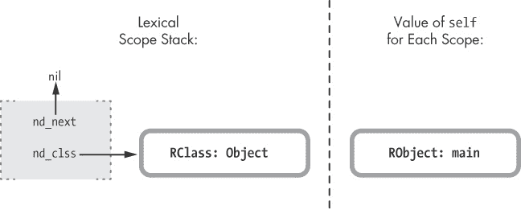

图 9-11。在顶层，Ruby 将 `self` 设置为 `main` 对象，并在词法作用域栈中有一个条目。

在此图的右侧，您可以看到 `main` 对象：当前 `self` 的值。左侧是词法作用域栈，其中仅包含一个顶层作用域的条目。Ruby 将顶层作用域的类设置为 `main` 对象的类，也就是 `Object` 类。

### 注意

*回想一下，当你使用 `def` 关键字声明一个新方法时，Ruby 会将方法添加到当前词法作用域的类中。我们刚刚看到，顶层词法作用域的类是 `Object`。因此，我们可以得出结论，当你在脚本的顶层定义方法时，方法会被添加到 `Object` 类中，因为 `Object` 是每个其他类的超类。你可以从任何地方调用在顶层定义的方法。*

## 类作用域中的 self

现在，让我们定义一个新类，看看 `self` 和词法作用域栈的变化，正如 示例 9-9 中所示。

示例 9-9。声明一个新类会更改 `self` 并在词法作用域栈中创建一个新条目。

```
    p self
    p Module.nesting

    class Quote
      p self
    => Quote
      p Module.nesting
    => [Quote]
    end
```

打印语句的输出显示在线。我们可以在  中看到，Ruby 已将 `self` 更改为 `Quote`——新的类——并且我们可以在  中看到，词法作用域栈中新增了一个层级。图 9-12 显示了一个总结。


图 9-12。现在，`self` 在当前词法作用域中与类相同。

在这张图的左侧，我们可以看到词法作用域栈。最顶层的作用域位于左上方，下面是由`class`关键字创建的新词法作用域。同时，在图的右侧，我们可以看到调用`class`时`self`的值是如何变化的。在最顶层，`self`被设置为`main`对象，但当我们调用`class`时，Ruby 将`self`改为新的类。

## 元类作用域中的 self

让我们使用`class << self`语法来创建一个新的元类作用域。示例 9-10 展示了包含更多代码行的相同程序。

示例 9-10. 声明元类作用域

```
    p self
    p Module.nesting

    class Quote
      p self
      p Module.nesting

      class << self
        p self
      => #<Class:Quote>
        p Module.nesting
      => [#<Class:Quote>, Quote]
      end
    end
```

在  我们看到 Ruby 再次改变了`self`的值。语法`#<Class:Quote>`表示`self`被设置为`Quote`的元类。在  我们看到 Ruby 还为词法作用域栈添加了另一个级别。图 9-13 展示了栈中的下一个级别。

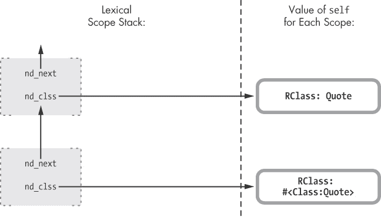

图 9-13. 为元类创建了一个新的词法作用域。

在左侧，我们可以看到 Ruby 在执行`class << self`时创建了一个新的作用域。图的右侧显示了新作用域中`self`的值，即`Quote`的元类。

## 类方法中的 self

现在再进行一次测试。假设我们向`Quote`类添加一个类方法，然后按示例 9-11 所示调用它。（输出位于底部，因为`p`语句直到我们调用`class_method`时才会执行。）

示例 9-11. 声明和调用类方法

```
    p self
    p Module.nesting

    class Quote
      p self
      p Module.nesting

      class << self
        p self
        p Module.nesting

        def class_method
          p self
          p Module.nesting
        end
      end
    end

    Quote.class_method
  => Quote
  => [#<Class:Quote>, Quote]
```

在  我们看到当我们调用`class_method`时，Ruby 将`self`重新设置为`Quote`类。这是有道理的：当我们在接收者上调用方法时，Ruby 总是将`self`设置为接收者。因为在这个例子中我们调用了一个类方法，所以 Ruby 将接收者设置为该类。

在  我们看到 Ruby 没有改变词法作用域栈。它仍然设置为`[#<Class:Quote>, Quote]`，正如图 9-14 中所示。


图 9-14. 当你调用方法时，Ruby 会改变`self`，但不会创建新的作用域。

请注意，词法作用域没有改变，但`self`已经变成了`Quote`，即方法调用的接收者。

你可以使用这些通用规则来跟踪`self`和词法作用域：

+   在类或模块作用域内部，`self`始终会被设置为该类或模块。Ruby 在你使用`class`或`module`关键字时会创建一个新的词法作用域，并将该作用域的类设置为新的类或模块。

+   在一个方法内部（包括类方法），Ruby 会将`self`设置为该方法调用的接收者。

# 元编程和闭包：eval，instance_eval 和 binding

在第八章中，我们学到了块是 Ruby 实现闭包的方式，并且我们看到了块如何将函数与函数引用所在的环境结合起来。在 Ruby 中，元编程和闭包是紧密相关的。许多 Ruby 的元编程构造也充当闭包，使其内部的代码可以访问引用的环境。我们将学习三个重要的元编程特性，以及每个特性如何通过充当闭包来像块一样访问引用的环境。

## 写代码的代码

在 Ruby 中，`eval`方法是元编程的最纯粹形式：你将一个字符串传递给`eval`，Ruby 会立即解析、编译并执行这段代码，正如示例 9-12 所示。

示例 9-12. 使用`eval`解析和编译代码

```
str = "puts"
str += " 2"
str += " +"
str += " 2"
eval(str)
```

我们动态构建字符串`puts 2+2`并将其传递给`eval`。然后 Ruby 会评估这个字符串。也就是说，它会使用与首次处理 Ruby 主脚本时相同的 Bison 语法规则和解析引擎来对其进行标记、解析和编译。完成这个过程后，Ruby 会生成一组新的 YARV 字节码指令，并执行新的代码。

但关于`eval`有一个非常重要的细节，在示例 9-12 中并不明显。具体来说，Ruby 会在你调用`eval`的相同上下文中评估新的代码字符串。要理解我的意思，请看看示例 9-13。

示例 9-13. 这里并不明显，但`eval`也通过闭包访问周围的作用域。

```
    a = 2
    b = 3
    str = "puts"
    str += " a"
    str += " +"
    str += " b"
 eval(str)
```

你可能会期望运行此代码的结果是 5，但请注意 示例 9-12 和 示例 9-13 之间的区别。示例 9-13 涉及周围作用域中的局部变量 `a` 和 `b`，Ruby 可以访问它们的值。图 9-15 展示了 YARV 内部栈在调用 `eval` 之前的样子，如  所示。

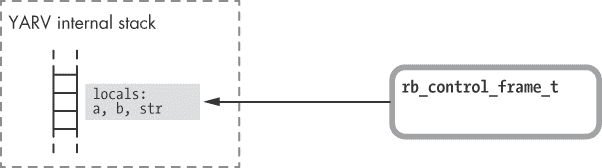

图 9-15. Ruby 像往常一样将局部变量 `a`、`b` 和 `str` 保存在 YARV 的内部栈中。

正如预期的那样，我们看到 Ruby 将 `a`、`b` 和 `str` 的值保存在左侧的栈中。在右侧，我们有 `rb_control_frame_t` 结构体，它代表了该脚本的外部（或主）作用域。

图 9-16 展示了当我们调用 `eval` 方法时发生的情况。

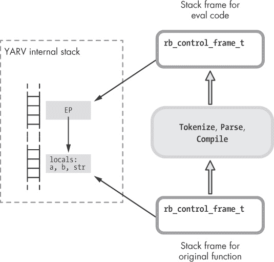

图 9-16. 调用 `eval` 并访问父作用域的值

调用 `eval` 会对我们传递的文本执行解析和编译。当编译器完成后，Ruby 会为执行新编译的代码创建一个新的栈帧（`rb_control_frame_t`）（如上所示）。然而请注意，Ruby 将这个新栈帧中的 `EP` 设置为指向包含 `a` 和 `b` 变量的较低栈帧。这个指针允许传递给 `eval` 的代码访问这些值。

Ruby 在这里使用的 `EP` 应该看起来很熟悉。除了动态解析和编译代码，`eval` 的工作方式与我们将一个块传递给某个函数时相同，就像在 示例 9-14 中那样。

示例 9-14. 块内部的代码可以访问周围作用域的变量。

```
a = 2
b = 3
10.times do
  puts a+b
end
```

换句话说，`eval` 方法创建了一个闭包：它是函数与该函数所在环境的结合体。在这种情况下，函数是新编译的代码，而环境是我们调用 `eval` 的地方。

## 使用 binding 调用 eval

`eval` 方法可以接受第二个参数：一个 *绑定*。绑定是没有函数的闭包——也就是说，它只是一个引用环境。可以将绑定看作是指向 YARV 栈帧的指针。将绑定值传递给 Ruby 表示你不希望使用当前上下文作为闭包的环境，而是希望使用其他引用环境。示例 9-15 展示了一个例子。

示例 9-15. 使用 `binding` 访问来自其他环境的变量

```
    def get_binding
      a = 2
      b = 3
   binding
    end
 eval("puts a+b", get_binding)
```

`get_binding` 函数包含了局部变量 `a` 和 `b`，但它也在  返回一个绑定。在代码的底部，我们希望 Ruby 动态编译并执行代码字符串，并打印出结果。通过将 `get_binding` 返回的绑定传递给 `eval`，我们告诉 Ruby 在 `get_binding` 函数的上下文中评估 `puts a+b`。如果我们在没有绑定的情况下调用 `eval`，它将创建新的空的局部变量 `a` 和 `b`。

Ruby 会在堆中创建当前环境的持久副本，因为你可能会在当前栈帧已经被弹出之后很久才调用 `eval`。即使在这个例子中 `get_binding` 已经返回，Ruby 仍然可以在执行由 `eval` 解析和编译的代码时访问 `a` 和 `b` 的值，正如在  中所示。

图 9-17 展示了调用 `binding` 时发生的内部操作。

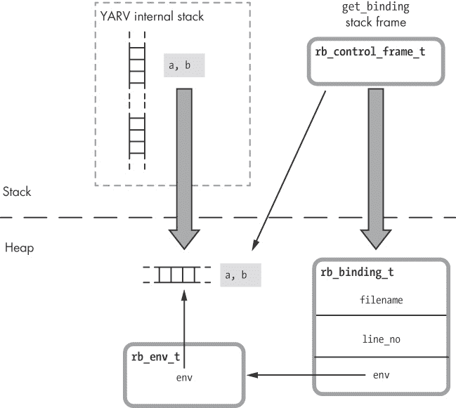

图 9-17. 调用 `binding` 会将当前栈帧的副本保存到堆中。

这个图形类似于当你调用 `lambda` 时 Ruby 的操作（参见 图 8-18），不同之处在于 Ruby 创建的是一个 `rb_binding_t` C 结构，而不是 `rb_proc_t` 结构。这个绑定结构仅仅是对内部环境结构的一个包装——栈帧在堆中的副本。绑定结构还包含了你调用 `binding` 的文件名和行号。

与 proc 对象一样，Ruby 使用 `RTypedData` 结构将 Ruby 对象包装在 `rb_binding_t` C 结构中（参见 图 9-18）。

绑定对象允许你创建一个闭包，然后将其环境作为数据值获取并处理。然而，由绑定创建的闭包不包含任何代码；它没有功能。你可以将绑定对象视为一种间接方式，用于访问、保存和传递 Ruby 内部的 `rb_env_t` 结构。

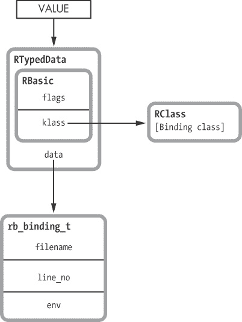

图 9-18。Ruby 使用 `RTypedData` 将 Ruby 对象包装在 `rb_binding_t` 结构中。

## `instance_eval` 示例

现在来看一个 `eval` 方法的变体：`instance_eval` 在 示例 9-16 中展示了它的实际应用。

示例 9-16。`instance_eval` 内部的代码可以访问 `obj` 的实例变量。

```
 class Quote
      def initialize
     @str = "The quick brown fox"
      end
    end
    str2 = "jumps over the lazy dog."
 obj = Quote.new
 obj.instance_eval do
   puts "#{@str} #{str2}"
    end
```

下面是发生的事情：

+   在  我们创建了一个 Ruby 类 `Quote`，它在 `initialize` 中将字符串的前半部分保存在实例变量中，见 。

+   在  我们创建了一个 `Quote` 类的实例，然后在  调用 `instance_eval`，并传递一个块。`instance_eval` 方法与 `eval` 类似，不同之处在于它在接收者的上下文中评估给定的字符串，或者说我们调用它的对象。如这里所示，如果不想动态解析和编译代码，我们可以将一个块传递给 `instance_eval`，而不是传递一个字符串。

+   我们传递给 `instance_eval` 的块打印出  中的字符串，访问了 `obj` 的实例变量中的字符串前半部分，以及从周围的作用域或环境中获取的后半部分。

这怎么可能起作用呢？似乎传递给 `instance_eval` 的块有两个环境：quote 实例和周围的代码环境。换句话说，`@str` 变量来自一个地方，而 `str2` 变量来自另一个地方。

## Ruby 闭包的另一个重要部分

这个例子突出了 Ruby 中闭包环境的另一个重要部分：当前的 `self` 值。回想一下，Ruby 调用栈中每个栈帧或级别的 `rb_control_frame_t` 结构包含一个 `self` 指针，以及 `PC`、`SP` 和 `EP` 指针及其他值（见 图 9-19）。


图 9-19。`rb_control_frame_t` 结构

`self`指针记录了你在 Ruby 项目中`self`的当前值；它指示哪个对象是当前执行方法的拥有者。你 Ruby 调用栈中的每一层都可能包含不同的`self`值。

回想一下，每当你创建一个闭包时，Ruby 会在`rb_block_t`结构中设置`EP`（环境指针），指向引用环境，使得块内的代码可以访问外部变量。实际上，Ruby 还会将`self`的值复制到`rb_block_t`中。这意味着当前对象也是 Ruby 闭包的一部分。图 9-20 展示了在 Ruby 中闭包包含的内容。

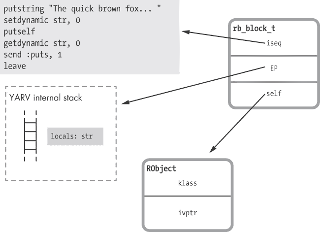

图 9-20. 在 Ruby 中，闭包环境包含了栈帧和来自引用代码的当前对象。

因为`rb_block_t`结构包含了来自引用环境的`self`值，所以块中的代码可以访问在创建或引用闭包时处于活动状态的对象的值和方法。这个功能对于块来说可能看起来是显而易见的：在你调用一个块之前和之后，当前对象并没有改变。然而，如果你使用 lambda、proc 或 binding，Ruby 会记住你创建它时的当前对象是什么。而正如我们稍后会看到的，使用`instance_eval`时，Ruby 有时会在你创建闭包时改变`self`，使你的代码可以访问不同对象的值和方法。

## instance_eval 将 self 改变为接收者

当你在示例 9-16 中的调用`instance_eval`时，Ruby 同时创建了一个闭包和一个新的词法作用域。例如，正如你在图 9-21 中看到的，`instance_eval`中的代码所创建的新栈帧为`EP`和`self`都使用了新的值。

在图的左侧，我们看到执行`instance_eval`时创建了一个闭包。这个结果应该不令人惊讶。将一个块传递给`instance_eval`时，在示例 9-16 中的会在栈上创建一个新的层次，并将`EP`设置为引用环境，从而使块内的代码可以访问变量`str2`和`obj`。


图 9-21. 执行 `instance_eval` 时创建的栈帧具有新的 `self` 值。

然而，如你在图示右侧所见，`instance_eval` 还会改变新闭包中 `self` 的值。当 `instance_eval` 块内的代码运行时，`self` 指向 `instance_eval` 的接收者，或者称为 `obj`，如示例 9-16 所示。这使得 `instance_eval` 内的代码能够访问接收者内部的值。在示例 9-16 中，位于  的代码可以访问 `obj` 内的 `@str` 和外部代码中的 `str2`。

## `instance_eval` 为新的词法作用域创建单例类

`instance_eval` 方法还会创建一个新的单例类，并将其作为新词法作用域的类，如图 9-22 所示。

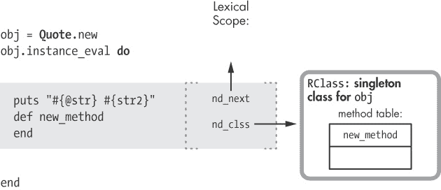

图 9-22. `instance_eval` 为新的单例类创建词法作用域。

在执行 `instance_eval` 时，Ruby 创建了一个新的词法作用域，如 `instance_eval` 块内阴影矩形所示。如果我们将一个字符串传递给 `instance_eval`，Ruby 将解析并编译这个字符串，然后以相同的方式创建新的词法作用域。

随着新的词法作用域的创建，Ruby 为接收者 `obj` 创建了一个单例类。这个单例类允许你为接收对象定义新方法（参见图 9-22）：`instance_eval` 块中的 `def new_method` 调用将 `new_method` 添加到 `obj` 的单例类中。作为一个单例类，`obj` 将拥有这个新方法，但程序中的其他对象或类将无法访问它。（元编程方法 `class_eval` 和 `module_eval` 也以类似的方式工作，同样创建新的词法作用域；然而，它们只是使用目标类或模块作为新的作用域，并不会创建元类或单例类。）

Ruby 如何追踪块的词法作用域

让我们更深入地看看 Ruby 如何在内部表示词法作用域。图 9-23 展示了 Ruby 为 `Quote` 类创建的词法作用域。


图 9-23. Ruby 的 C 源代码在内部使用一个独立的结构体`cref`来跟踪词法作用域。

你可以看到`display`方法的代码片段被表示为左侧矩形框中的内容，位于`class Quote`声明内。在矩形框的右侧，你可以看到一个指向标记为`cref`的结构的小箭头，它表示实际的词法作用域。这个结构包含指向`Quote`类（`nd_clss`）和父词法作用域（`nd_next`）的指针。

如图所示，Ruby 的 C 源代码在内部通过这些`cref`结构来表示词法作用域。左侧的小箭头显示，程序中的每段代码都通过指针引用一个`cref`结构，这个指针跟踪着该段代码属于哪个词法作用域。

注意关于图 9-23 的一个重要细节：`class Quote`声明中的代码片段和词法作用域都指向同一个`RClass`结构体。代码、词法作用域和类之间存在一一对应的关系。每次 Ruby 执行`class Quote`声明中的代码时，它使用的是`Quote`类的相同`RClass`结构体。这种行为看起来显而易见；类声明中的代码总是引用相同的类。

然而，对于代码块来说，事情就不那么简单了。通过使用诸如`instance_eval`之类的元编程方法，你可以为同一段代码（例如一个代码块）指定不同的词法作用域，每次执行时都可以使用不同的作用域。图 9-24 展示了这个问题。


图 9-24. 代码块的代码无法引用单一的词法作用域，因为作用域的类依赖于`obj`的值。

我们在上一节中了解到，Ruby 为通过`instance_eval`创建的词法作用域创建了一个单例类。然而，这段代码可能会为不同的`obj`值多次执行。实际上，你的程序可能会在不同的线程中同时执行这段代码。这就要求 Ruby 不能像处理类定义那样为代码块保持对单一`cref`结构的指针。这个代码块的作用域在不同时间会引用不同的类。

Ruby 通过将块使用的词法作用域的指针保存在不同的位置来解决这个问题：作为 YARV 内部堆栈上的一个条目（参见 图 9-25）。

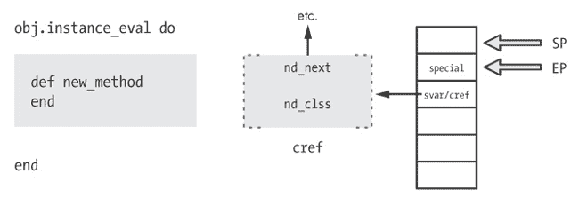

图 9-25. Ruby 使用堆栈上的 `svar/cref` 条目来跟踪块的词法作用域，而不是使用块的代码片段。

在图的左侧，你可以看到调用 `instance_eval` 和块内的代码片段。在图的中央是表示词法作用域的 `cref` 结构。在图的右侧，你可以看到 YARV 在堆栈的第二个条目中保存了指向词法作用域的指针，标记为 `svar/cref`。

从 第三章 回顾一下，YARV 的内部堆栈的第二个条目包含两种值之一：`svar` 或 `cref`。正如我们在 实验 3-2：探索特殊变量 中看到的那样，`svar` 保存指向特殊变量表的指针，例如执行方法时上一个正则表达式匹配的结果。而在执行块时，YARV 则在这里保存 `cref` 值。通常，这个值并不重要，因为块通常使用周围代码的词法作用域。但是，在执行 `instance_eval` 和一些其他元编程特性时，比如 `module_eval` 和 `instance_exec`，Ruby 会将 `cref` 设置为当前的词法作用域。

# 实验 9-2：使用闭包定义方法

Ruby 中另一个常见的元编程模式是使用 `define_method` 动态地在类中定义方法。例如，示例 9-17 展示了一个简单的 Ruby 类，当你调用 `display` 时，它会打印出一个字符串。

示例 9-17. 一个从实例变量显示字符串的 Ruby 类

```
class Quote
  def initialize
    @str = "The quick brown fox jumps over the lazy dog"
  end
  def display
    puts @str
  end
end
Quote.new.display
 => The quick brown fox jumps over the lazy dog
```

这段代码类似于 示例 9-1 中的代码，只不过我们使用实例变量 `@str` 来保存字符串值。

## 使用 `define_method`

我们本可以使用元编程以更冗长但动态的方式定义 `display`，就像在 示例 9-18 中所示。

示例 9-18. 使用 `define_method` 创建一个方法

```
    class Quote
      def initialize
        @str = "The quick brown fox jumps over the lazy dog"
      end
   define_method :display do
        puts @str
      end
    end
```

我们在 处调用`define_method`，而不是正常的`def`关键字。由于新方法的名称作为参数`:display`传递，我们可以从一些数据值动态构建方法名称，或者遍历一个方法名称数组，为每个名称调用`define_method`。

但`def`和`define_method`之间有另一个微妙的区别。对于`define_method`，我们通过块提供方法体；也就是说，我们在 处使用`do`关键字。这个语法差异看似微不足道，但请记住，块实际上是闭包。添加`do`关键字引入了一个闭包，这意味着新方法内部的代码可以访问外部的环境。而`def`关键字则无法做到这一点。

在调用`define_method`时，示例 9-18 中没有本地变量，但假设我们在应用程序的其他地方确实有一些值，并希望在新方法中使用这些值。通过使用闭包，Ruby 会在堆上创建周围环境的内部副本，新方法可以访问这个副本。

## 方法作为闭包

现在进行另一个测试。示例 9-19 将字符串的前一半存储在实例变量中。稍后，我们将为`Quote`类编写一个新方法来访问这个变量。

示例 9-19. 现在 `@str` 只有字符串的前一半。

```
class Quote
  def initialize
    @str = "The quick brown fox"
  end
end
```

示例 9-20 展示了我们如何使用闭包来访问实例变量和周围的环境。

示例 9-20. 使用闭包与`define_method`

```
    def create_method_using_a_closure
      str2 = "jumps over the lazy dog."
   Quote.send(:define_method, :display) do
        puts "#{@str} #{str2}"
      end
    end
```

由于`define_method`是`Module`类的私有方法，我们需要使用令人困惑的`send`语法在 处。早些时候，在 处，在示例 9-18 中，我们能够直接调用`define_method`，因为我们在类的作用域内使用了它。而在应用程序的其他地方，我们不能直接这么做。通过使用`send`，`create_method_using_a_closure`方法可以调用一个它通常无法访问的私有方法。

更重要的是，请注意即使`create_method_using_a_closure`返回后，`str2`变量仍然保留在堆中供新方法使用：

```
create_method_using_a_closure
Quote.new.display
 => The quick brown fox jumps over the lazy dog.
```

在内部，Ruby 将其视为对`lambda`的调用。也就是说，这段代码的功能就像我在示例 9-21 中编写的代码一样。

示例 9-21. 将一个 proc 传递给 `define_method`

```
    class Quote
      def initialize
        @str = "The quick brown fox"
      end
    end
    def create_method_using_a_closure
      str2 = "jumps over the lazy dog."
      lambda do
        puts "#{@str} #{str2}"
      end
    end
 Quote.send(:define_method, :display, create_method_using_a_closure)
 Quote.new.display
```

示例 9-21 将创建闭包和定义方法的代码分开。因为在  我们向 `define_method` 传递了三个参数，Ruby 期望第三个参数是一个 proc 对象。虽然这种写法更加冗长，但由于调用 `lambda` 明确表示 Ruby 会创建一个闭包，因此它显得稍微不那么令人困惑。

最后，当我们在  调用 `new` 方法时，Ruby 会将 `self` 指针从闭包重置为接收者对象，类似于 `instance_eval` 的工作方式。这使得 `new` 方法能够像预期的那样访问 `@str`。

# 总结

在本章中，我们看到闭包的概念——这一概念在 Ruby 中块、lambda 和 proc 的工作原理中至关重要——同样适用于 `eval`、`instance_eval` 和 `define_method` 等方法。相同的底层概念解释了这些不同的 Ruby 方法是如何工作的。同样，词法作用域的概念是 Ruby 中所有创建方法并将其赋值给类的方式的基础。理解词法作用域的概念应该使你更容易理解 Ruby 中 `def` 关键字和 `class <<` 语法的不同用法。

虽然元编程刚开始看起来可能很复杂，但了解 Ruby 的内部工作原理可以帮助我们理解 Ruby 的元编程特性到底做了什么。最初看似一组庞大且不相关的方法，在一个混乱的 API 中，最终会发现它们是由一些重要的思想联系起来的。研究 Ruby 的内部机制使我们能够看到这些概念，并理解它们的含义。
