# 第十章. JRuby：JVM 上的 Ruby

> 
> 
> *JRuby 是在 Java 平台上实现的 Ruby。*

在 第一章 到 第九章 中，我们学习了 Ruby 的标准版本是如何在内部工作的。由于 Ruby 是用 C 语言编写的，它的标准实现通常被称为 *CRuby*。它也常被称为 *Matz 的 Ruby 解释器（MRI）*，这是因为 Yukihiro Matsumoto 在 1990 年代初期创建了这个语言。

在本章中，我们将看到一种名为 *JRuby* 的 Ruby 替代实现。JRuby 是用 Java 实现的 Ruby，而不是用 C 语言。使用 Java 使得 Ruby 应用程序能够像任何其他 Java 程序一样运行，利用 Java 虚拟机（JVM）。它还使得你的 Ruby 代码能够与成千上万的用 Java 和其他在 JVM 上运行的语言编写的库进行互操作。得益于 JVM 的先进垃圾回收（GC）算法、即时编译器（JIT）和许多其他技术创新，使用 JVM 意味着你的 Ruby 代码通常运行得更快，更可靠。

在本章的前半部分，我们将对比标准 Ruby——即 MRI——与 JRuby。你将了解当使用 JRuby 运行 Ruby 程序时会发生什么，以及 JRuby 是如何解析和编译你的 Ruby 代码的。在后半部分，我们将看到 JRuby 和 MRI 是如何使用 `String` 类保存你的字符串数据的。

路线图

+   使用 MRI 和 JRuby 运行程序

    +   如何 JRuby 解析和编译你的代码

    +   如何 JRuby 执行你的代码

    +   使用 Java 类实现 Ruby 类

+   **实验 10-1：监控 JRuby 的即时编译器**

    +   实验代码

    +   使用 -J-XX:+PrintCompilation 选项

    +   JIT 是否加速你的 JRuby 程序？

+   JRuby 和 MRI 中的字符串

    +   JRuby 和 MRI 如何保存字符串数据

    +   写时复制

+   **实验 10-2：测量写时复制性能**

    +   创建唯一的、非共享的字符串

    +   实验代码

    +   可视化写时复制

    +   修改共享字符串较慢

+   总结

# 使用 MRI 和 JRuby 运行程序

使用标准 Ruby 运行 Ruby 程序的常见方法是输入`ruby`，然后跟上 Ruby 脚本的名称，如图 10-1 所示。

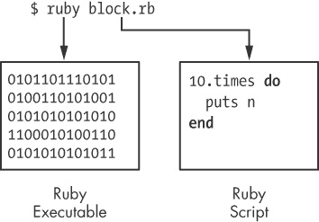

图 10-1. 使用标准 Ruby 在命令行运行脚本

如左侧矩形框所示，在终端提示符下输入`ruby`会启动一个二进制可执行文件，这是 Ruby 构建过程中将 Ruby 的 C 源代码编译后的产物。右侧则显示了`ruby`命令的命令行参数，即包含 Ruby 代码的文本文件。

要使用 JRuby 运行 Ruby 脚本，通常在终端提示符下输入`jruby`。 （根据你安装 JRuby 的方式，标准的`ruby`命令可能已重新映射为启动 JRuby。）图 10-2 展示了这个命令的高层工作原理。


图 10-2. `jruby` 命令实际上映射到一个 shell 脚本。

与`ruby`命令不同，`jruby`命令并不映射到二进制可执行文件，而是指向一个执行`java`命令的 shell 脚本。图 10-3 展示了 JRuby 启动 Java 的命令简化版。

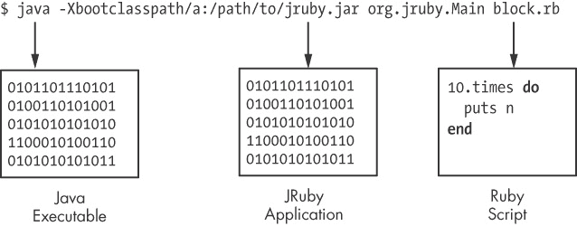

图 10-3. JRuby 启动 JVM 的命令简化版

在图 10-3 中注意到，JRuby 使用被称为*Java 虚拟机 (JVM)* 的二进制可执行文件来执行 Ruby 脚本。与标准 Ruby 可执行文件一样，JVM 是用 C 编写并编译成二进制可执行文件。JVM 运行 Java 应用程序，而 MRI 运行 Ruby 应用程序。

还要注意，在 Figure 10-3 的中间，`java`程序的一个参数，*-Xbootclasspath*，指定了一个额外的 Java 编译代码库或集合，用于新程序：*jruby.jar*。JRuby Java 应用程序包含在*jruby.jar*中。最后，在右侧，你再次看到包含你的 Ruby 代码的文本文件。

简而言之，当标准 Ruby 和 JRuby 启动你的 Ruby 程序时，会发生以下情况：

+   当你使用 MRI 运行 Ruby 脚本时，你启动了一个二进制可执行文件，最初用 C 语言编写，直接编译和执行你的 Ruby 脚本。这是 Ruby 的标准版本。

+   当你使用 JRuby 运行 Ruby 脚本时，你启动了一个二进制可执行文件，即 JVM，它执行 JRuby Java 应用程序。这个 Java 应用程序依次解析、编译和执行你的 Ruby 脚本，同时在 JVM 内部运行。

## JRuby 如何解析和编译你的代码

一旦你启动了 JRuby，它需要解析和编译你的代码。为此，它使用一个解析器生成器，就像 MRI 一样。Figure 10-4 展示了 JRuby 解析和编译过程的高级概述。

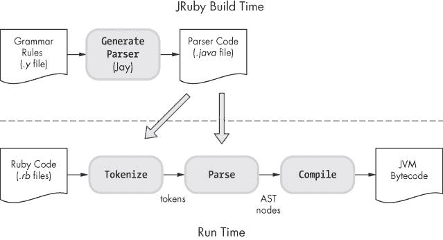

Figure 10-4. JRuby 使用名为 Jay 的解析器生成器。

正如 MRI 使用 Bison 一样，JRuby 在构建过程中使用名为*Jay*的解析器生成器来创建解析你的 Ruby 代码的代码。Jay 与 Bison 非常相似，只是它是用 Java 而不是 C 编写的。在运行时，JRuby 使用生成的解析器对你的 Ruby 代码进行标记化和解析。与 MRI 一样，这个过程产生一个抽象语法树（AST）。

一旦 JRuby 解析了你的代码并生成了 AST，它会对你的代码进行编译。但是，与 MRI 生成 YARV 指令不同，JRuby 生成一系列指令，即*Java 字节码*指令，供 JVM 执行。Figure 10-5 and JRuby (right)")展示了 MRI 和 JRuby 处理 Ruby 代码的高级比较。

图的左侧显示了使用 MRI 执行时你的 Ruby 代码的变化。MRI 将你的代码转换为标记，然后转换为 AST 节点，最后转换为 YARV 指令。*Interpret*箭头表示 MRI 可执行文件读取 YARV 指令并解释或执行它们。（你不需要编写 C 或机器语言代码；这项工作已经为你完成。）

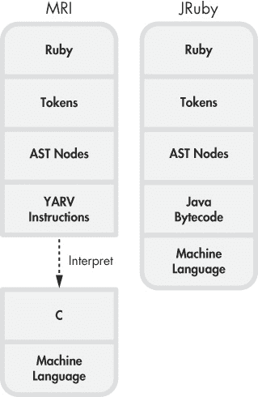

Figure 10-5. MRI（左）和 JRuby（右）中你的 Ruby 代码的不同形式

图右侧的高层次概述展示了 JRuby 如何在内部处理您的 Ruby 代码。大矩形中的各个框显示了 JRuby 执行代码时，您的代码所经历的不同形式。您可以看到，像 MRI 一样，JRuby 首先将您的代码转换为词法单元，随后转换为 AST 节点。但随后 MRI 和 JRuby 分道扬镳：JRuby 将 AST 节点编译为 Java 字节码指令，JVM 可以执行这些指令。此外，JVM 还可以使用 JIT 编译器将 Java 字节码转换为机器语言，这样可以进一步加速程序，因为执行机器语言比执行 Java 字节码要快。（我们将在实验 10-1：监控 JRuby 的即时编译器中更详细地了解 JIT 编译器。）

## JRuby 如何执行您的代码

我们已经看到 JRuby 以几乎与 MRI 相同的方式对代码进行词法分析和解析。就像 MRI Ruby 1.9 和 2.0 将您的代码编译为 YARV 指令一样，JRuby 将其编译为 Java 字节码指令。

但相似性到此为止：MRI 和 JRuby 使用两种完全不同的虚拟机来执行您的代码。标准 Ruby 使用 YARV，而 JRuby 使用 JVM 来执行您的程序。

使用 Java 构建 Ruby 解释器的核心目的，就是能够通过 JVM 执行 Ruby 程序。使用 JVM 的能力非常重要，原因有二：

+   ****环境性****。JVM 使您能够在服务器、应用程序以及之前无法运行 Ruby 的 IT 组织中使用 Ruby。

+   ****技术性****。JVM 是经过近 20 年的强烈研究和开发的产物，包含了许多难题的复杂解决方案，比如垃圾回收和多线程。Ruby 在 JVM 上通常能更快、更可靠地运行。

为了更好地理解这一过程，让我们看看 JRuby 如何执行简单的 Ruby 脚本 *simple.rb*，如示例 10-1")所示。

示例 10-1。 一行 Ruby 程序 *(simple.rb)*

```
puts 2+2
```

首先，JRuby 对这段 Ruby 代码进行词法分析并解析为 AST 节点结构。接下来，它遍历这些 AST 节点并将 Ruby 转换为 Java 字节码。如示例 10-2 所示，使用 `--bytecode` 选项可以查看这些字节码。

示例 10-2。 JRuby 的 `--bytecode` 选项显示您的 Ruby 代码被编译成的 Java 字节码。

```
$ **jruby --bytecode simple.rb**
```

由于该命令的输出较为复杂，我在这里不做深入探讨，但图 10-6 总结了 JRuby 如何编译并执行该脚本。

在此图的左侧，你可以看到代码 `puts 2+2`。指向下方的大箭头表示 JRuby 将这段代码转换为一系列 Java 字节码指令，这些指令实现了一个名为 `simple` 的 Java 类（与脚本的文件名相同）。`class simple extends AbstractScript` 的表示法是 Java 代码；它在这里声明了一个新的 Java 类 `simple`，该类以 `AbstractScript` 作为父类。

`simple` 类是我们 Ruby 代码的 Java 版本，它执行 2 + 2 并打印总和。`simple` Java 类用 Java 完成了相同的操作。在 `simple` 内部，JRuby 创建了一个名为 `__file__` 的 Java 方法，执行 `2+2` 的代码，正如图中底部的内部 `__file__` 矩形所示。方法矩形 `<init>` 是 `simple` 类的构造函数。

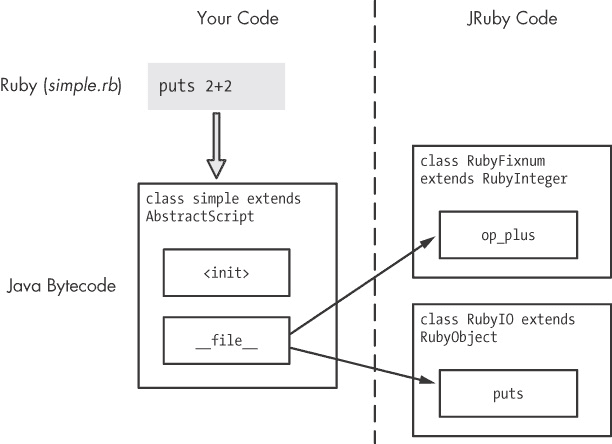

图 10-6. JRuby 将你的 Ruby 代码转换为 Java 类。

在图 10-6 的右侧，你可以看到 JRuby 的 Ruby 类库的一个小部分。这些是 Ruby 的内建类，比如 `Fixnum`、`String` 和 `Array`。MRI 使用 C 实现这些类。当你的代码调用这些类中的某个方法时，方法调度过程会使用 CFUNC 方法类型。然而，JRuby 使用 Java 代码实现所有内建的 Ruby 类。在图 10-6 的右侧，你可以看到我们的代码调用的两个内建 Ruby 方法。

+   首先，你的代码执行 2 + 2，使用 Ruby `Fixnum` 类的 `+` 方法。JRuby 使用名为 `RubyFixnum` 的 Java 类实现 Ruby `Fixnum` 类。在这个例子中，你的代码调用了 `RubyFixnum` 类中的 `op_plus` Java 方法。

+   为了打印总和，代码调用了内建 Ruby `IO` 类的`puts`方法（实际上是通过`Kernel`模块）。JRuby 以类似的方式实现这一点，使用一个名为 `RubyIO` 的 Java 类。

## 使用 Java 类实现 Ruby 类

正如你所知道的，标准 Ruby 是使用 C 内部实现的，C 不支持面向对象编程的概念。C 代码无法像 Ruby 代码那样使用对象、类、方法或继承。

然而，JRuby 是用 Java 实现的，Java 是一种面向对象的编程语言。虽然 Java 不如 Ruby 本身那样灵活和强大，但它确实支持编写类、创建类的实例对象，并通过继承将一个类与另一个类关联起来，这意味着 JRuby 对 Ruby 的实现也是面向对象的。

JRuby 使用 Java 对象实现 Ruby 对象。为了更好地理解这意味着什么，请参见图 10-7，它将 Ruby 代码与 MRI C 结构进行了比较。

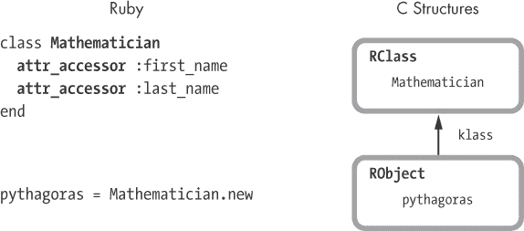

图 10-7。MRI 使用 C 结构实现对象和类。

Ruby 在内部为每个类创建一个`RClass` C 结构，为每个对象创建一个`RObject`结构。Ruby 通过`RObject`结构中的`klass`指针追踪每个对象的类。图 10-7 展示了一个`RClass`表示`Mathematician`类，一个`RObject`表示`pythagoras`，即`Mathematician`的一个实例。

图 10-8 显示 JRuby 中的情况非常相似，至少在第一眼看上去是这样。

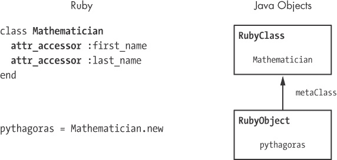

图 10-8。 在内部，JRuby 使用`RubyObject` Java 类表示对象，使用`RubyClass` Java 类表示类。

在图的左侧，我们看到相同的 Ruby 代码。右侧是两个 Java 对象，一个是`RubyObject` Java 类的实例，另一个是`RubyClass` Java 类的实例。JRuby 对 Ruby 对象和类的实现与 MRI 非常相似，但 JRuby 使用 Java 对象而不是 C 结构。JRuby 使用`RubyObject`和`RubyClass`这两个名称，因为这些 Java 对象代表了你的 Ruby 对象和类。

但是，当我们更仔细地观察时，事情并不像看起来那么简单。由于`RubyObject`是一个 Java 类，JRuby 可以利用继承来简化其内部实现。事实上，`RubyObject`的父类是`RubyBasicObject`。这反映了 Ruby 类之间的关系，正如我们通过调用`ancestors`方法查看`Object`时所看到的那样。

```
p Object.ancestors
 => [Object, Kernel, BasicObject]
```

调用`ancestors`返回一个包含接收者所有父类链中类和模块的数组。这里，我们可以看到`Object`的父类是`Kernel`模块，而它的父类是`BasicObject`。JRuby 对其内部 Java 类层次结构使用相同的模式，如图 10-9 所示。

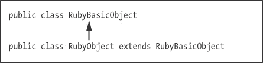

图 10-9。`RubyBasicObject`是`RubyObject` Java 类的父类。

除了 `Kernel` 模块，我们可以看到 JRuby 的内部 Java 类层次结构反映了它实现的 Ruby 类层次结构。这种相似性得益于 Java 的面向对象设计。

现在来看第二个示例。让我们再次使用 `ancestors` 来展示 `Class` Ruby 类的超类。

```
p Class.ancestors
 => [Class, Module, Object, Kernel, BasicObject]
```

在这里，我们看到 `Class` 的超类是 `Module`，它的超类是 `Object`，依此类推。正如我们所预期的那样，JRuby 的 Java 代码在内部使用了相同的设计（参见 图 10-10）。

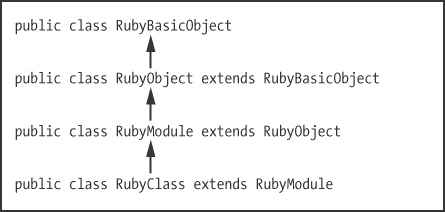

图 10-10. JRuby 的 `RubyClass` 内部 Java 类层次结构

# 实验 10-1：监控 JRuby 的即时编译器

我之前提到过，JRuby 可以通过使用 JIT 编译器加速你的 Ruby 代码。JRuby 总是将你的 Ruby 程序转换为 Java 字节码指令，JVM 可以将其编译为机器语言，直接由计算机的微处理器执行。在这个实验中，我们将看到何时发生这种情况，并测量它加速了多少代码。

## 实验代码

示例 10-3") 展示了一个 Ruby 程序，它打印出 1 到 100 之间的 10 个随机数。

示例 10-3. 测试 JRuby JIT 行为的示例程序 *(jit.rb)*

```
 array = (1..100).to_a
 10.times do
   sample = array.sample
      puts sample
    end
```

在  我们创建了一个包含 100 个元素的数组：从 1 到 100。然后，在  我们对以下代码块迭代 10 次。在这个块内部，我们在  使用 `sample` 方法随机选择数组中的一个值并打印。当我们运行这段代码时，得到的输出如 示例 10-4 所示。

示例 10-4. 来自 示例 10-3") 的输出

```
$ **jruby jit.rb**
87
88
69
5
38
--*snip*--
```

现在，让我们移除 `puts` 语句并增加迭代次数。（移除输出将使实验更易管理。）示例 10-5 展示了更新后的程序。

示例 10-5. 我们移除了 `puts` 并将迭代次数增加到 1,000。

```
    array = (1..100).to_a
    1000.times do
   sample = array.sample
    end
```

## 使用 -J-XX:+PrintCompilation 选项

当然，如果我们现在运行程序，我们不会看到任何输出，因为我们已经去除了`puts`。让我们再次运行程序——这次使用一个调试标志（如示例 10-6 所示）来显示 JVM 的 JIT 编译器正在做什么。

示例 10-6. `-J-XX:+PrintCompilation`选项生成的输出

```
$ **jruby -J-XX:+PrintCompilation jit.rb**
    101   1       java.lang.String::hashCode (64 bytes)
    144   2       java.util.Properties$LineReader::readLine (452 bytes)
    173   3       sun.nio.cs.UTF_8$Decoder::decodeArrayLoop (553 bytes)
    200   4       java.lang.String::charAt (33 bytes)
--*snip*--
```

在这里，我们为 JRuby 使用了`-J`选项，并将`XX:+PrintCompilation`选项传递给底层 JVM 应用程序。`PrintCompilation`使 JVM 显示你在示例 10-6 中看到的信息。`java.lang.String::hashCode`这一行意味着 JVM 将`String` Java 类的`hashCode`方法编译成了机器语言。其他值显示了关于 JIT 过程的技术信息（`101`是时间戳，`1`是编译 ID，`64 bytes`是已编译字节码片段的大小）。

这个实验的目标是验证假设，即示例 10-5 应该会在 JVM 的 JIT 编译器将其转换为机器语言后运行得更快。注意，示例 10-5 在循环中只有一行 Ruby 代码，在处调用了`array.sample`。因此，一旦 JIT 将 JRuby 实现的`Array#sample`编译成机器语言，我们应该会看到我们的 Ruby 程序明显更快地完成，因为`Array#sample`被调用了很多次。

由于示例 10-6 中的输出非常长且复杂，我们将使用`grep`来搜索输出中`org.jruby.RubyArray`的出现情况。

```
$ **jruby -J-XX:+PrintCompilation jit.rb | grep org.jruby.RubyArray**
```

结果没有输出。在`PrintCompilation`输出中没有任何一行与名称`org.jruby.RubyArray`匹配，这意味着 JIT 编译器没有将`Array#sample`方法转换为机器语言。它之所以没有进行转换，是因为 JVM 仅在程序执行多次的 Java 字节码指令上运行 JIT 编译器——这些字节码指令被称为*热点*。JVM 会花更多时间编译热点，因为它们被调用的次数非常多。为了验证这一点，我们可以将迭代次数增加到 100,000 并重复测试，正如在示例 10-7 中所示。

示例 10-7. 增加迭代次数应该触发 JIT 编译器将`Array#sample`转换为机器语言。

```
array = (1..100).to_a
100000.times do
  sample = array.sample
end
```

当我们再次用`grep`重复相同的`jruby`命令时，看到的输出与示例 10-8 相同。

示例 10-8. 运行示例 10-7 并将`-J-XX:+PrintCompilation`通过`grep`输出后的结果

```
 $ **jruby -J-XX:+PrintCompilation jit.rb | grep org.jruby.RubyArray**
       1809 165       org.jruby.RubyArray::safeArrayRef (11 bytes)
       1810 166  !    org.jruby.RubyArray::safeArrayRef (12 bytes)
       1811 167       org.jruby.RubyArray::eltOk (16 bytes)
       1927 203       org.jruby.RubyArray$INVOKER$i$0$2$sample::call (36 bytes)
    1928 204  !    org.jruby.RubyArray::sample (834 bytes)
       1930 205       org.jruby.RubyArray::randomReal (10 bytes)
```

由于我们在！[](httpatomoreillycomsourcenostarchimages1853843.png.jpg)使用了`grep org.jruby.RubyArray`，所以我们只看到与文本`org.jruby.RubyArray`匹配的 Java 类名。在！[](httpatomoreillycomsourcenostarchimages1853845.png.jpg)我们可以看到 JIT 编译器编译了`Array#sample`方法，因为我们看到了文本`org.jruby.RubyArray::sample`。

## JIT 是否加速了你的 JRuby 程序？

现在来看看 JIT 是否加速了。根据命令行参数`ARGV[0]`，我将其保存在`iterations`中，见！[](httpatomoreillycomsourcenostarchimages1853843.png.jpg)，示例 10-9 测量调用`Array#sample`特定次数所需的时间。

示例 10-9. 用于基准测试 JIT 性能的示例代码

```
    require 'benchmark'

 iterations = ARGV[0].to_i

    Benchmark.bm do |bench|
      array = (1..100).to_a
      bench.report("#{iterations} iterations") do
        iterations.times do
          sample = array.sample
        end
      end
    end
```

通过运行如下的列表，我们可以测量执行循环 100 次所需的时间，例如。

```
$ **jruby jit.rb 100**
```

图 10-11 显示了使用 JRuby 和 MRI 在 100 到 1 亿次迭代中的结果。

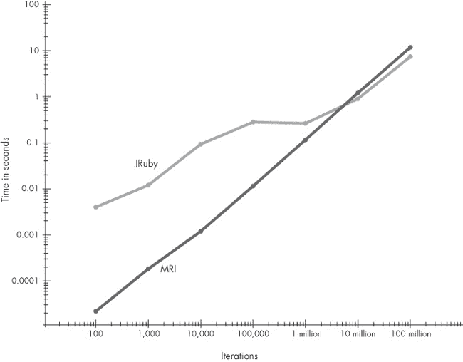

图 10-11. JRuby 与 MRI 性能对比图。时间以秒为单位，横轴为迭代次数（使用 JRuby 1.7.5 和 Java 1.6；MRI Ruby 2.0）。

MRI 的图表大致是一条向右上方延伸的直线。这意味着 Ruby 2.0 执行`Array#sample`方法的时间几乎是固定的。另一方面，JRuby 的结果则更为复杂。你可以看到，在不到 100,000 次迭代时，JRuby 执行示例 10-9 所需的时间较长。（该图表使用对数刻度，因此左侧的绝对时间差异较小。）然而，一旦迭代次数达到约 100 万，JRuby 的速度显著加快，开始用更少的时间执行`Array#sample`。

最终，经过许多迭代，JRuby 的速度快于 MRI。但这里重要的不是 JRuby 可能更快，而是它的性能特性会有所变化。你的代码运行得越久，JVM 优化它的时间就越长，速度也会越快。

# JRuby 和 MRI 中的字符串

我们已经学习了 JRuby 如何执行字节码指令，在你的代码与通过 Java 实现的 Ruby 对象库之间传递控制。现在我们将更深入地了解这个库，特别是 JRuby 如何实现 `String` 类。JRuby 和 MRI 是如何实现字符串的？它们将你在 Ruby 代码中使用的字符串数据保存在何处，它们的实现方式有何异同？我们通过查看 MRI 如何实现字符串来开始解答这些问题。

## JRuby 和 MRI 如何保存字符串数据

这段代码将毕达哥拉斯的名言保存到一个局部变量中。那么，这个字符串去了哪里？

```
str = "Geometry is knowledge of the eternally existent."
```

回顾第五章，MRI 使用不同的 C 结构来实现内建类，如 `RRegExp`、`RArray` 和 `RHash`，以及用于保存字符串的 `RString`。图 10-12 展示了 MRI 如何在内部表示 `Geometry...` 字符串。

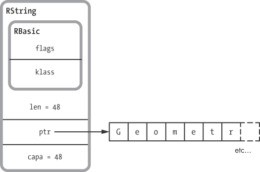

图 10-12。`RString` C 结构的一部分

请注意，MRI 将实际的字符串数据保存在一个单独的缓冲区或内存区域中，如右侧所示。`RString` 结构本身包含指向该缓冲区的指针 `ptr`。还要注意，`RString` 包含另外两个整数值：`len`，即字符串的长度（此示例为 48），和 `capa`，即数据缓冲区的容量（同样为 48）。数据缓冲区的大小可以大于字符串的长度，在这种情况下，`capa` 会大于 `len`。（如果你执行了减少字符串长度的代码，则会出现这种情况。）

现在让我们考虑 JRuby。图 10-13 展示了 JRuby 如何在内部表示这个字符串。JRuby 使用 Java 类 `RubyString` 来表示 Ruby 代码中的字符串，这与我们之前看到的 `RubyObject` 和 `RubyClass` 命名模式一致。`RubyString` 使用另一个类来跟踪实际的字符串数据：`ByteList`。这个低级别的代码追踪一个独立的数据缓冲区（称为 `bytes`），类似于 MRI 中 `RString` 结构的实现方式。`ByteList` 还在 `realSize` 实例变量中存储字符串的长度。

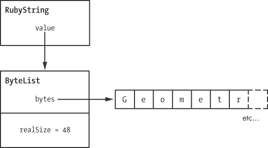

图 10-13。JRuby 为每个字符串使用两个 Java 对象和一个数据缓冲区。

## 写时复制

在内部，JRuby 和 MRI 都使用一种名为*写时复制（copy-on-write）*的优化技术来处理字符串和其他数据。这个技巧允许两个相同的字符串值共享同一个数据缓冲区，从而节省内存和时间，因为 Ruby 避免了不必要地对相同的字符串数据进行单独复制。

例如，假设我们使用`dup`方法复制一个字符串。

```
str = "Geometry is knowledge of the eternally existent."
str2 = str.dup
```

JRuby 是否必须将`Geometry is...`文本从一个字符串对象复制到另一个字符串对象？不需要。图 10-14 展示了 JRuby 如何在两个不同的字符串对象之间共享字符串数据。

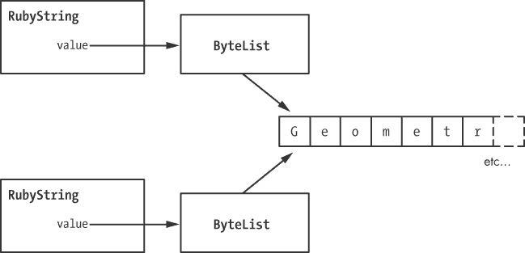

图 10-14. 两个 JRuby 字符串对象可以共享相同的数据缓冲区。

当我们调用`dup`时，JRuby 会创建新的`RubyString`和`ByteList` Java 对象，但它不会复制实际的字符串数据。相反，它会让第二个`ByteList`对象指向与原始字符串相同的数据缓冲区。现在我们有两组 Java 对象，但只有一个底层的字符串值，如图右侧所示。由于字符串可以包含成千上万的字节，这种优化通常能节省大量内存。

MRI 使用相同的技巧，尽管方式稍微复杂一些。图 10-15 展示了标准 Ruby 是如何共享字符串的。

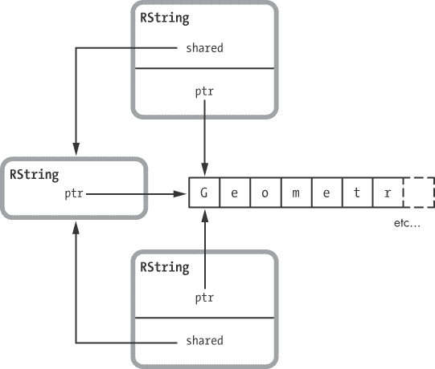

图 10-15. MRI 通过创建第三个`RString`结构来共享字符串。

像 JRuby 一样，MRI 共享底层的字符串数据。然而，当你在标准的 MRI Ruby 中复制一个字符串时，它会创建一个第三个`RString`结构，然后将原始的`RString`和新的`RString`都设置为通过`shared`指针指向它。

无论哪种情况，我们都会遇到一个问题。如果我们更改其中一个字符串变量会怎样？例如，假设我们将其中一个字符串转换为大写，如下所示：

```
    str = "Geometry is knowledge of the eternally existent."
 str2 = str.dup
 str2.upcase!
```

在中，无论是在 JRuby 还是 MRI 中，我们都有两个共享的字符串，但是在中，我使用`upcase!`方法更改了第二个字符串。现在这两个字符串不同了，这意味着 Ruby 显然不能继续共享底层的字符串缓冲区，否则`upcase!`方法会更改两个字符串。我们可以通过显示字符串的值来看到这两个字符串现在已经不同。

```
p str
 => "Geometry is knowledge of the eternally existent."
p str2
 => "GEOMETRY IS KNOWLEDGE OF THE ETERNALLY EXISTENT."
```

到某个时刻，Ruby 必须将这两个字符串分开，创建一个新的数据缓冲区。这就是*写时复制*（copy-on-write）这个短语的含义：无论是在 MRI 还是 JRuby 中，当你对其中一个字符串进行写操作时，它们会创建一个新的字符串数据缓冲区副本。

# 实验 10-2：测量写时复制性能

在这个实验中，我们将收集证据，证明当我们向共享字符串写入时，确实会发生额外的复制操作。首先，我们将创建一个简单的非共享字符串并写入它。然后，我们将创建两个共享字符串，并向其中一个写入。如果确实发生写时复制，那么向共享字符串写入应该会稍微长一点，因为 Ruby 必须在写入之前创建字符串的新副本。

## 创建一个唯一的、非共享的字符串

让我们重新创建我们的示例字符串`str`。最初，Ruby 不可能与其他任何内容共享 `str`，因为只有一个字符串。我们将使用 `str` 作为基准性能测量。

```
str = "Geometry is knowledge of the eternally existent."
```

但事实证明，Ruby 会立即共享 `str`！为了理解为什么，我们将检查 MRI 用于执行此代码的 YARV 指令，如 示例 10-10 所示。

示例 10-10. 当你使用字面量字符串常量时，MRI Ruby 在内部使用 `dup` YARV 指令。

```
    code = <<END
    str = "Geometry is knowledge of the eternally existent."
    END

    puts RubyVM::InstructionSequence.compile(code).disasm
    == disasm: <RubyVM::InstructionSequence:<compiled>@<compiled>>==========
    local table (size: 2, argc: 0 [opts: 0, rest: -1, post: 0, block: -1] s1)
 [ 2] str
    0000 trace            1                                               (   1)
 0002 putstring        "Geometry is knowledge of the eternally existent."
 0004 dup
 0005 setlocal_OP__WC__0 2
    0007 leave
```

仔细阅读上面的 YARV 指令，我们可以看到在  Ruby 使用 `putstring` 将字符串放到栈上。这个 YARV 指令内部将字符串参数复制到栈中，已经创建了一个共享副本。在  Ruby 使用 `dup` 创建了另一个共享副本的字符串，用作 `setlocal` 的参数。最后，在  `setlocal_OP__WC__0 2` 将这个字符串保存到 `str` 变量中，在本地表中显示为 `[2]` 。

图 10-16 总结了这个过程。

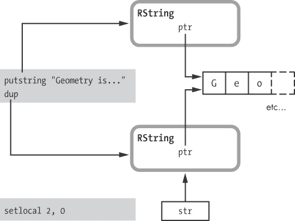

图 10-16. 执行 `putstring` 和 `dup` 创建共享字符串。

左侧是 YARV 指令 `putstring`、`dup` 和 `setlocal`。右侧是这些指令创建的 `RString` 结构，以及底层共享的字符串数据。正如我刚才提到的，`putstring` 实际上会将字符串常量从图表中遗漏的第三个 `RString` 中复制，这意味着字符串实际上被共享了第三次。

因为 Ruby 最初会共享从常量值创建的字符串，所以我们需要通过以下方式将两个字符串连接在一起来创建字符串：

```
str = "This string is not shared" + " and so can be modified faster."
```

这个拼接的结果将是一个新的、唯一的字符串。Ruby 不会将它的字符串数据与任何其他字符串对象共享。

## 实验代码

让我们做一些测量。示例 10-11 展示了这个实验的代码。

示例 10-11. 测量写时复制的延迟

```
    require 'benchmark'

    ITERATIONS = 1000000

    Benchmark.bm do |bench|
      bench.report("test") do
        ITERATIONS.times do
       str = "This string is not shared" + " and so can be modified faster."
       str2 = "But this string is shared" + " so Ruby will need to copy it
                  before writing to it."
       str3 = str2.dup
       str3[3] = 'x'
        end
      end
    end
```

在运行此测试之前，让我们先看一下这段代码。在  处，我们通过连接两个字符串创建一个独立的、未共享的字符串，这就是`str`。接下来，在  处，我们创建第二个独立字符串 `str2`。但在  处，我们使用`dup`来创建这个字符串的副本`str3`，现在 `str2` 和 `str3` 共享相同的值。

## 可视化写时复制

在  的示例 10-11 中，我们使用代码 `str3[3] = 'x'` 修改 `str3` 的第四个字符。但在这里，Ruby 无法仅修改 `str3` 中的字符而不同时修改 `str2`，如图 10-17 所示。

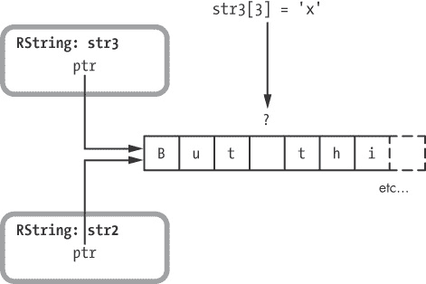

图 10-17. Ruby 无法修改 `str3` 而不修改 `str2`。

Ruby 必须首先为 `str3` 创建一个单独的副本，如图 10-18 所示。

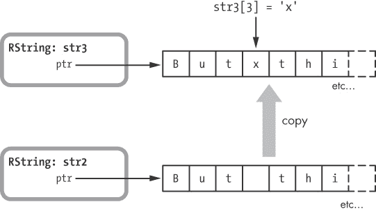

图 10-18. Ruby 在写入之前，将字符串复制到 `str3` 的新缓冲区。

现在，Ruby 可以在不影响 `str2` 的情况下将数据写入 `str3` 的新缓冲区。

## 修改共享字符串更慢

当我们执行示例 10-11 时，`benchmark`库会测量运行内部代码块一百万次所需的时间。这个代码块创建了`str`、`str2`和`str3`，然后修改了`str3`。在我的笔记本电脑上，`benchmark`测得的时间大约是 1.87 秒。

接下来，让我们将`str3[3] = 'x'`在  处改为修改`str`。

```
#str3[3] = 'x'str[3] = 'x'
```

现在我们正在修改未共享的独立字符串，而不是共享字符串。再次运行测试，得到的结果大约是 1.69 秒，约比`benchmark`报告的共享字符串时间少了 9.5%。如预期，修改独立字符串所需的时间略少于修改共享字符串的时间。

图表图 10-19 展示了我对 MRI 和 JRuby 的 10 次不同观察结果的累积平均值。在图表的左侧是 MRI 的平均测量值。最左边的条形图表示修改共享字符串`str3`所需的时间，右侧的 MRI 条形图显示了修改唯一字符串`str`所花费的时间。右侧的两根条形图展示了 JRuby 的相同模式，但条形图的高度差异要小得多。显然，JVM 可以比 MRI 更快地创建字符串的新副本。

但还有更多：注意到总体上 JRuby 运行实验代码的时间减少了 60%。也就是说，它比 MRI 快了 2.5 倍！正如在实验 10-1：监控 JRuby 的即时编译器中所看到的，我们一定是在看到 JVM 的优化，如 JIT 编译，使得 JRuby 相比 MRI 更快。

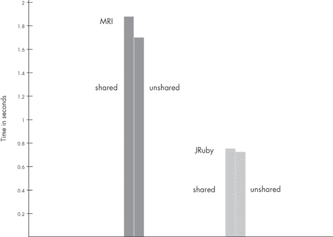

图 10-19. MRI 和 JRuby 在写时复制（秒）上显示了延迟。

# 总结

在本章中，我们了解了 JRuby，它是用 Java 编写的 Ruby 版本。我们看到了`jruby`命令如何启动 JVM，并将*jruby.jar*作为参数传递。我们探讨了 JRuby 如何解析和编译我们的代码，并在实验 10-1：监控 JRuby 的即时编译器中学到，JVM 如何编译热点，或是频繁执行的 Java 字节码片段，转化为机器语言。来自实验 10-1：监控 JRuby 的即时编译器的结果显示，编译热点显著提升了性能，使得 JRuby 在某些情况下比 MRI 运行得更快。

本章的后半部分，我们学习了 MRI 和 JRuby 如何在内部表示我们的字符串数据。我们发现，两个版本的 Ruby 都使用写时复制优化，当可能时，多个字符串对象之间共享字符串数据。最后，在实验 10-2：测量写时复制性能中，我们证明了写时复制在 JRuby 和 MRI 中都确实发生了。

JRuby 是 Ruby 的一个非常强大且巧妙的实现：通过在 Java 平台上运行 Ruby 代码，你可以从在 JVM 上投入的多年研究、开发、调优和测试中受益。JVM 是当今最流行、最成熟且最强大的软件平台之一。它不仅被 Java 和 JRuby 使用，还被许多其他编程语言使用，例如 Clojure、Scala 和 Jython，等等。通过使用这个共享平台，JRuby 可以利用 Java 平台的速度、稳定性和多样性——而且这一切是免费的！

JRuby 是一项开创性的技术，每个 Ruby 开发者都应该熟悉它。
