# 第十一章。Rubinius：用 Ruby 实现的 Ruby

> 
> 
> *Rubinius 使用 Ruby 实现 Ruby。*

像 JRuby 一样，Rubinius 是 Ruby 的一个替代实现。Rubinius 的许多内部源代码是用 Ruby 本身编写的，而不是仅使用 C 或 Java 编写。Rubinius 实现了内置类，如`Array`、`String`和`Integer`，正如你使用 Ruby 代码实现它们一样！

这一设计为你提供了一个独特的机会，了解 Ruby 的内部工作原理。如果你不确定某个特定的 Ruby 特性或方法是如何工作的，你可以阅读 Rubinius 中的 Ruby 代码来了解，而无需特别掌握 C 或 Java 编程知识。

Rubinius 还包括一个用 C++编写的复杂虚拟机。这个虚拟机会执行你的 Ruby 程序，像 JRuby 一样，支持 JIT 和真正的并发，并使用复杂的垃圾回收算法。

本章开始时提供了 Rubinius 的高级概述，并举例说明如何使用回溯输出深入探讨 Rubinius 的源代码。接下来，我们将了解 Rubinius 和 MRI 如何实现`Array`类，包括 Ruby 如何将数据保存到数组中，以及从数组中删除元素时发生的事情。

路线图

+   Rubinius 内核和虚拟机

    +   词法分析与解析

    +   使用 Ruby 编译 Ruby

    +   Rubinius 字节码指令

    +   Ruby 与 C++的协作

    +   使用 C++对象实现 Ruby 对象

+   **实验 11-1：比较 MRI 和 Rubinius 中的回溯**

    +   Rubinius 中的回溯

+   Rubinius 和 MRI 中的数组

    +   MRI 中的数组

    +   RArray C 结构定义

    +   Rubinius 中的数组

+   **实验 11-2：探索 Rubinius 中 Array#shift 的实现**

    +   阅读 Array#shift

    +   修改 Array#shift

+   总结

# Rubinius 内核和虚拟机

要使用 Rubinius 运行 Ruby 程序（参见图 11-1），通常使用`ruby`命令（与 MRI 相同）或`rbx`，因为`ruby`命令实际上是 Rubinius 中可执行文件*rbx*的符号链接。

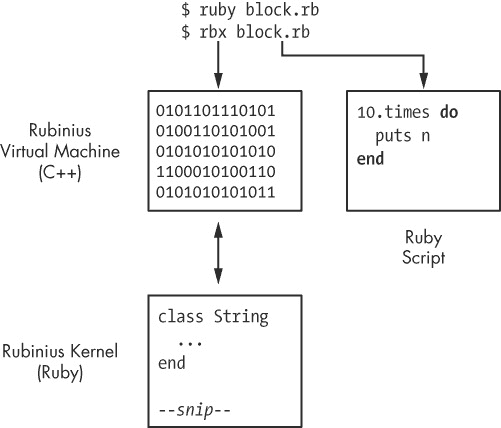

图 11-1. Rubinius 由 C++虚拟机和 Ruby 内核组成。

与 MRI 一样，你通过一个可执行文件来启动 Rubinius，该文件读取并执行命令行中指定的 Ruby 程序。但 Rubinius 的可执行文件与标准的 Ruby 可执行文件完全不同。正如前面的图所示，Rubinius 由两个主要部分组成：

+   ****Rubinius 内核****。这是 Rubinius 中用 Ruby 编写的部分。它实现了大部分语言特性，包括许多内建核心类的定义，如`String`和`Array`。Rubinius 内核被编译成字节码指令并安装到你的计算机上。

+   ****Rubinius 虚拟机****。Rubinius 虚拟机是用 C++编写的。它执行来自 Rubinius 内核的字节码指令，并执行一系列其他低级任务，如垃圾回收。Rubinius 可执行文件包含了此虚拟机的已编译机器语言版本。

图 11-2 更详细地展示了 Rubinius 的虚拟机和内核。Rubinius 内核包含一组 Ruby 类，如`String`、`Array`和`Object`，以及执行各种任务的其他 Ruby 类，如编译或加载代码。图中左侧的 Rubinius 虚拟机是你从命令行启动的*rbx*可执行文件。C++虚拟机包含执行垃圾回收、即时编译（以及许多其他任务）的代码，以及用于内建类（如`String`或`Array`）的附加代码。事实上，正如箭头所示，每个内建于 Rubinius 中的 Ruby 类都由 C++和 Ruby 代码共同工作。Rubinius 使用 Ruby 定义某些方法，使用 C++定义其他方法。

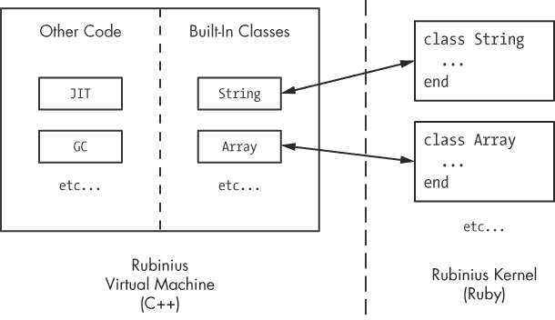

图 11-2. Rubinius 内部的更近视图

为什么使用两种语言实现 Ruby？因为 C++加速了 Rubinius 程序，并允许它们以低级别直接与操作系统进行交互。使用 C++而不是 C 还使得 Rubinius 能够在内部使用优雅的面向对象设计。而使用 Ruby 来实现内建类和其他功能使得 Ruby 开发者能够轻松阅读和理解 Rubinius 源代码的大部分内容。

## 分词和解析

Rubinius 处理你的 Ruby 程序的方式与 MRI 非常相似，如图 11-3 所示。

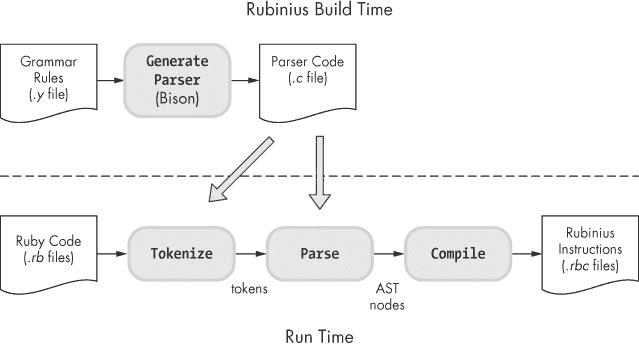

图 11-3. Rubinius 如何处理你的代码

Rubinius 在构建过程中使用 Bison 生成一个 LALR 解析器，和 MRI 一样。当你运行程序时，解析器将代码转换为一个标记流、一个抽象语法树（AST）结构，然后是一个高层次虚拟机指令序列，称为 *Rubinius 指令*。图 11-4 比较了代码在 MRI 和 Rubinius 内部的形式。

最初，Rubinius 和 MRI 的工作方式相似，但与 MRI 直接解释代码不同，Rubinius 使用名为低级虚拟机（LLVM）的编译器框架，将代码再次编译成更低级的指令。LLVM 反过来可能使用 JIT 编译器将这些指令编译成机器语言。

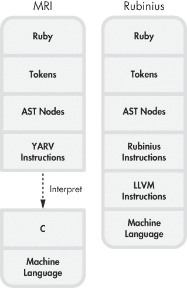

图 11-4. MRI 和 Rubinius 如何在内部转换你的代码

## 使用 Ruby 编译 Ruby

Rubinius 最吸引人的特点之一是它如何通过 Ruby 和 C++ 的结合实现 Ruby 编译器。当你使用 Rubinius 运行程序时，你的代码将同时由 C++ 和 Ruby 代码处理，如图 11-5 所示。

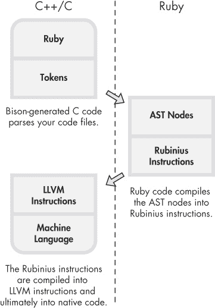

图 11-5. Rubinius 如何编译你的代码的高级概述

在图的左上角，Rubinius 和 MRI 一样，使用 C 代码通过一系列语法规则解析 Ruby 代码。在右侧，Rubinius 开始使用 Ruby 代码处理你的 Ruby 程序，将 AST 中的每个节点表示为 Ruby 类的实例。在编译过程中，每个 Ruby AST 节点都知道如何为程序的相应部分生成 Rubinius 指令。最后，在左下角，LLVM 框架进一步将 Rubinius 指令编译成 LLVM 指令，并最终编译成机器语言。

## Rubinius 字节码指令

为了理解 Rubinius 指令，让我们使用 Rubinius 运行一个简短的程序（参见示例 11-1"))。

示例 11-1. 使用 Rubinius 计算 2 + 2 = 4 *(simple.rb)*

```
$ **cat simple.rb**
puts 2+2
$ **rbx simple.rb**
4
```

当我们使用 `rbx compile` 命令和 `-B` 选项重新运行 *simple.rb* 时，Rubinius 显示了它的编译器生成的字节码指令，如示例 11-2 所示。

示例 11-2. 使用 `rbx compile` 命令和 `-B` 选项显示 Rubinius 字节码指令

```
    $ **rbx compile simple.rb -B**
    ============= :__script__ ==============
    Arguments:   0 required, 0 post, 0 total
    Arity:       0
    Locals:      0
    Stack size:  3
    Literals:    2: :+, :puts
    Lines to IP: 1: 0..12

    0000:  push_self
    0001:  meta_push_2
    0002:  meta_push_2
 0003:  send_stack                 :+, 1
    0006:  allow_private
 0007:  send_stack                 :puts, 1
    0010:  pop
    0011:  push_true
    0012:  ret
    ----------------------------------------
```

这些指令与 MRI 的 YARV 指令有些相似。每条指令通常会将一个值推送到内部栈上，对栈上的值进行操作，或者执行一个方法，比如 `+` 在  或 `puts` 在 。

图 11-6 显示了 Ruby 代码和对应的 Rubinius 指令，分别用于 *simple.rb* 和 `Kernel` 模块的一部分。

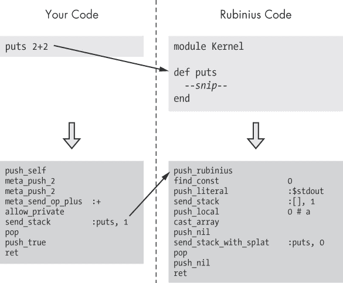

图 11-6. Rubinius 中的 `puts` 方法是通过 Ruby 代码实现的。

你可以在图中的顶部看到 Ruby 代码：左侧是 `puts 2+2` 代码，右侧是 Rubinius 对 `puts` 方法的定义。Rubinius 在 Ruby 中实现了内置 Ruby 类，比如 `Kernel` 模块；因此，当我们调用 `puts` 方法时，Rubinius 会将控制权传递给 Rubinius 内核中包含的 Ruby 代码中的 `Kernel#puts` 方法。

图的下半部分显示了 Ruby 代码编译后的 Rubinius 指令。左侧是 `puts 2+2` 的指令，右侧是 `Kernel#puts` 方法的编译版本。Rubinius 以相同的方式编译其内置 Ruby 代码和你的 Ruby 代码（只是 Rubinius 在构建过程中编译内置 Ruby 代码）。

## Ruby 和 C++ 协同工作

为了处理某些底层技术细节并提高速度，Rubinius 在其虚拟机中使用 C++ 代码来帮助实现内置的类和模块。也就是说，它同时使用 Ruby 和 C++ 来实现语言的核心类。

为了理解这个过程，让我们在 Rubinius 中执行这个简短的 Ruby 脚本（见示例 11-3）。

示例 11-3. 调用 `String#[]` 方法

```
str = "The quick brown fox..."
puts str[4]
 => q
```

这个简单的程序打印了样本字符串中的第五个字符（索引为 4 的字母 *q*）。由于 `String#[]` 方法是内置 Ruby 类的一部分，Rubinius 使用 Ruby 代码来实现它，如图 11-7 所示。

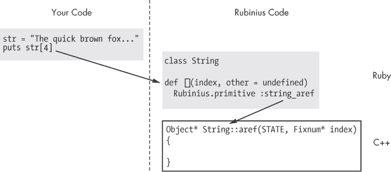

图 11-7. Rubinius 使用 Ruby 和 C++ 代码的组合来实现内置类。

图左侧是打印字母 *q* 的 Ruby 脚本。右侧是 Rubinius 用于实现 `String#[]` 方法的 Ruby 代码，取自名为 *string.rb* 的 Rubinius 源代码文件（该文件以 `String` 类命名）。(我们将在实验 11-1：比较 MRI 和 Rubinius 的回溯中学习如何找到 Rubinius 源代码文件。)

注意，`String#[]` 的开始部分是方法调用 `Rubinius.primitive`。这表明 Rubinius 实际上使用 C++ 代码来实现这个方法；`Rubinius.primitive` 是一个指令，告诉 Rubinius 编译器生成对相应 C++ 代码的调用。实际实现 `String#[]` 的代码是一个名为 `String::aref` 的 C++ 方法，位于 图 11-7 的右下方。

## 使用 C++ 对象实现 Ruby 对象

Ruby 使用面向对象的 C++ 使其虚拟机能够通过相应的 C++ 对象在内部表示每个 Ruby 对象（见 图 11-8）。

Rubinius 使用 C++ 对象，就像 MRI 使用 `RClass` 和 `RObject` C 结构体一样。当你定义一个类时，Rubinius 会创建一个 `Class` C++ 类的实例。当你创建一个 Ruby 对象时，Rubinius 会创建一个 `Object` C++ 类的实例。`pythagoras` 对象中的 `klass_` 指针表示它是 `Mathematician` 类的实例，就像 MRI 中 `RObject` C 结构体中的 `klass` 指针一样。

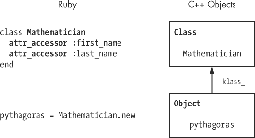

图 11-8. Rubinius 使用 C++ 对象表示类和对象。

# 实验 11-1：比较 MRI 和 Rubinius 的回溯

回想一下，当异常发生时，Ruby 会显示回溯以帮助你找到问题。示例 11-4 展示了一个简单的例子。

示例 11-4. 一个抛出异常的 Ruby 脚本

```
10.times do |n|
  puts n
  raise "Stop Here"
end
```

我们调用 `raise` 来告诉 Ruby 在显示参数 `n` 的值后第一次执行块时停止。示例 11-5 展示了运行 示例 11-4 时的输出，使用的是 MRI。

示例 11-5. MRI 如何显示异常的回溯

```
$ **ruby iterate.rb**
0
iterate.rb:3:in 'block in <main>': Stop Here (RuntimeError)
    from iterate.rb:1:in 'times'
    from iterate.rb:1:in '<main>'
```

在开发 Ruby 程序时，你可能多次看到类似的输出。然而，有一个微妙的细节值得仔细观察。 图 11-9 展示了 MRI 回溯输出的示意图。

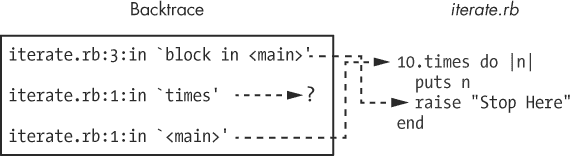

图 11-9. MRI 显示内置 CFUNC 方法的调用位置，而非定义位置。

注意，包含 `raise` 调用的 *iterate.rb* 第 3 行位于调用栈的顶部。在调用栈底部，MRI 显示了 `iterate.rb:1`，即脚本的起始位置。

还要注意，MRI 的回溯包含了一个断开的链接：*iterate.rb* 中没有定义 `times` 方法。相反，MRI 引用了 *调用* `times` 方法的那行代码：`10.times do`。实际的 `times` 方法是用 C 代码在 MRI 内部实现的——一个 CFUNC 方法。MRI 在回溯中显示对 CFUNC 方法的调用位置，而不是这些方法的实际 C 实现位置。

## Rubinius 中的回溯

与 MRI 不同，Rubinius 使用 Ruby 而非 C 实现内置方法。该实现使得 Rubinius 在回溯中包含了内置方法的准确源文件和行号信息。为了演示这一点，我们再次使用 Rubinius 运行 示例 11-4。 示例 11-6 显示了结果。

示例 11-6. Rubinius 如何显示异常的回溯

```
$ **rbx iterate.rb**
0
An exception occurred running iterate.rb
    Stop Here (RuntimeError)

Backtrace:
          { } in Object#__script__ at iterate.rb:3
             Integer(Fixnum)#times at kernel/common/integer.rb:83
                 Object#__script__ at iterate.rb:1
  Rubinius::CodeLoader#load_script at kernel/delta/codeloader.rb:68
  Rubinius::CodeLoader.load_script at kernel/delta/codeloader.rb:119
           Rubinius::Loader#script at kernel/loader.rb:645
             Rubinius::Loader#main at kernel/loader.rb:844
```

Rubinius 显示了更多信息！为了更好地理解这个输出，参见 图 11-10 和 图 11-11。

在 图 11-10 的左侧是 Rubinius 在运行 *iterate.rb* 时显示的回溯信息的简化版。Rubinius 显示了与 *iterate.rb* 对应的两行回溯信息，正如 MRI 所做的那样。但 Rubinius 还在 Ruby 调用栈中包含了新的条目，这些条目对应于 Rubinius 内核中的 Ruby 源代码文件。我们可以猜测，*loader.rb* 和 *codeloader.rb* 文件包含了加载和执行我们脚本的代码。

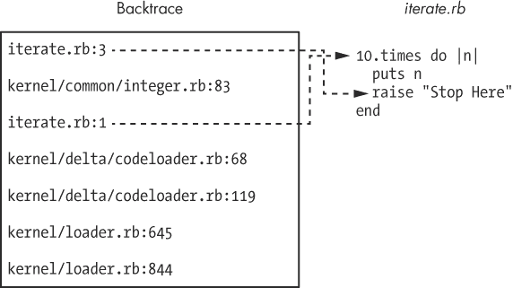

图 11-10. 与 MRI 相似，Rubinius 在回溯中包含了你的程序信息。

但是调用栈中最有趣的条目是 `kernel/common/integer.rb:83`。这个条目告诉我们 `Integer#times` 方法在 Rubinius 内核中的实现位置，如 图 11-11 所示。

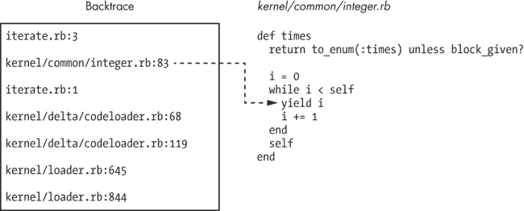

图 11-11. Rubinius 在回溯中包含其内核信息。

图中左侧的回溯信息与 图 11-10 中的信息相同。箭头指向 Ruby 调用栈的第二级，指向调用 `puts n` 块的代码——`Integer#times` 方法中的 `yield` 指令。

使用 Rubinius 时，*iterate.rb* 成为更大 Ruby 程序的一部分：Rubinius 内核。当我们调用 `10.times` 时，Rubinius 调用右侧显示的 Ruby 代码，然后使用第 83 行的 `yield` 关键字执行我们的块。

### 注意

*路径* kernel/common/integer.rb *指的是 Rubinius 源代码树中的一个位置。如果你是通过二进制安装程序安装 Rubinius，你需要从* [`rubini.us/`](http://rubini.us/) *或 GitHub 下载源代码，以便查看。*

Rubinius 通过从 0 开始计数到指定的整数（减去 1），在每次循环中调用块来实现 `Integer#times`。让我们仔细看看 `Integer#times`，如 示例 11-7 所示。

示例 11-7. *来自* kernel/common/integer.rb 的 `Integer#times` 的 Rubinius 实现

```
 def times
   return to_enum(:times) unless block_given?

   i = 0
   while i < self
     yield i
        i += 1
      end
   self
    end
```

`times` 方法的定义从  开始。在  处，如果没有提供块，Rubinius 会返回 `to_enum` 的结果，如下所示。（`to_enum` 方法返回一个新的枚举器对象，允许你在以后需要时执行枚举。）

```
p 10.times
 => #<Enumerable::Enumerator:0x120 @generator=nil @args=[] @lookahead=[]     @object=10 @iter=:times>
```

如果你提供一个块，Rubinius 会继续执行方法的其余部分。 在时，Rubinius 创建了一个计数器`i`并将其初始化为 0。接下来，它在使用一个 while 循环来执行迭代。请注意，while 循环条件`i < self`引用了`self`的值。在`Integer#times`内部，`self`设置为当前的整数对象，在我们的脚本中为 10。 在时，Rubinius 将控制权传递给（调用）给定的块，传递当前的`i`值。这将调用我们的`puts n`块。最后，在时，Rubinius 返回`self`，这意味着`10.times`的返回值将是 10。

# Rubinius 和 MRI 中的数组

数组在 Ruby 中如此普遍，以至于我们容易理所当然地认为它们是理所当然的。但它们在 Ruby 内部是如何工作的呢？Ruby 是如何保存你放入数组中的对象的，内部又是如何表示数组对象的呢？在接下来的章节中，我们将探讨 Rubinius 和 MRI 用于存储数组中值的内部数据结构。

## MRI 中的数组

假设你将斐波那契数列中的前六个数字放入一个数组中。

```
fibonacci_sequence = [1, 1, 2, 3, 5, 8]
```

如图 11-12 所示，MRI 为数组创建了一个 C 结构，但将其元素保存在其他地方。

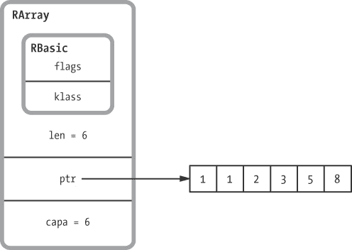

图 11-12。MRI 使用`RArray` C 结构来表示数组。

MRI 使用一个`RArray`结构来表示你创建的每个数组。像`RString`、`RObject`和其他 C 结构一样，`RArray`使用内部的`RBasic`结构来保存`klass`指针和其他技术信息。（在这个例子中，`klass`指针指向`Array`类的`RClass`结构。）

在`RBasic`下方是一些特定于数组的附加值——`ptr`、`len`和`capa`：

+   `ptr`是指向 Ruby 单独分配的内存段的指针，用于存储数组元素。斐波那契数列出现在此内存段中，如图 11-12 右侧所示。

+   `len`是数组的长度——即保存在独立内存段中的值的数量。

+   `capa`跟踪内存段的容量。这个数字通常比`len`大。MRI 避免在每次改变数组大小时不断调整内存段的大小；相反，当你添加数组元素时，它偶尔会增加独立内存段的大小，每次分配比新元素所需的更多内存。

单独内存段中的每个值实际上是一个指向 Ruby 对象的 `VALUE` 指针。在这种情况下，斐波那契数列将直接保存在 `VALUE` 指针中，因为它们是简单的整数。

RArray C 结构体定义

示例 11-8 展示了来自 MRI C 源代码的 `RArray` 定义。

示例 11-8. *`RArray` 的定义（来自* include/ruby/ruby.h*)*

```
    #define RARRAY_EMBED_LEN_MAX 3struct RArray {
      struct RBasic basic;
   union {
        struct {
       long len;
          union {
         long capa;
         VALUE shared;
          } aux;
       VALUE *ptr;
        } heap;
     VALUE ary[RARRAY_EMBED_LEN_MAX];
      } as;
    };
```

这个定义展示了 图 11-12 中缺失的一些值。首先，在 ，请注意，MRI 使用 C `union` 关键字声明 `RArray` 的两个备选定义。第一个，是一个内部的 `struct`，在  定义了 `len`，在  定义了 `capa`，在  定义了 `shared`，在  定义了 `ptr`。与字符串类似，MRI 使用写时复制优化来处理数组，使得两个或更多数组可以共享相同的底层数据。对于共享数据的数组，位于  的 `shared` 值指向另一个包含共享数据的 `RArray`。

联合体的后半部分在  定义了 `ary`，这是 `RArray` 中一个 `VALUE` 指针的 C 数组。这是一个优化，允许 MRI 将包含三项或更少元素的数组数据直接保存在 `RArray` 结构中，从而避免了为其分配单独的内存段。MRI 以类似的方式优化了其他四个 C 结构体：`RString`、`RObject`、`RStruct`（由 `Struct` 类使用）和 `RBignum`（由 `Bignum` 类使用）。

## Rubinius 内部的数组

现在让我们看看 Rubinius 如何在内部保存相同的斐波那契数组。我们之前学到，Rubinius 使用相应的 C++ 对象来表示每个 Ruby 对象。这种表示方式同样适用于数组。例如，图 11-13 展示了 Rubinius 用于表示 `fibonacci_sequence` 的 C++ 对象。

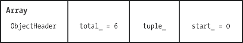

图 11-13. Rubinius 使用 C++ 对象来表示数组。

四个组合块代表了 `Array` C++ 类的一个实例。每当你创建一个数组时，Rubinius 会创建一个 C++ 数组对象。从左到右，字段如下：

+   `ObjectHeader` 包含 Rubinius 在每个对象内部跟踪的技术信息，包括类指针和实例变量数组。`ObjectHeader` 对应于 MRI 中的 `RBasic` C 结构，并且是 Rubinius 虚拟机内 `Array` C++ 类的 C++ 超类之一。

+   `total_` 是数组的长度，对于 `fibonacci_sequence` 来说，长度为 6。

+   `tuple_` 是指向另一个 C++ 类实例的指针，该类名为 `Tuple`，其中包含数组数据。

+   `start_` 表示元组对象内部数组数据的起始位置。（元组可能包含比数组所需更多的数据。）最初，Rubinius 将其设置为 0。

Rubinius 并不将数组数据保存在 C++ 数组对象中。它将数据保存在元组对象中，如 图 11-14 所示。

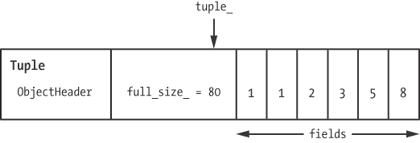

图 11-14. Rubinius 将数组数据保存在元组对象中。

每个元组都包含与数组相同的对象头信息。Rubinius 会在每个 C++ 对象中保存此头信息。在对象头之后，元组对象包含一个名为 `full_size_` 的值，用于跟踪该元组对象的字节大小。紧接着这个值，Rubinius 将实际的数据值保存在一个名为 `fields` 的 C++ 数组中。这些数据值就是我们的六个斐波那契数，如 图 11-14 右侧所示。

### 注意

*数组数据值保存在元组 C++ 对象中。如果我们创建了一个更大的数组，Rubinius 将使用更大的元组对象。如果我们更改数组的大小，Rubinius 会分配一个适当大小的新元组，或者正如我们将在 实验 11-2：探索 Rubinius 实现的 Array#shift 中看到的那样，它可以优化某些数组方法，以避免分配新的对象并加速程序。*

# 实验 11-2：探索 Rubinius 实现的 Array#shift

我们已经看到 Rubinius 使用 C++ 对象表示数组，但请记住，Rubinius 结合了 Ruby 和 C++ 代码来实现 `Array` 类中的方法。在这个实验中，我们将通过观察 Rubinius 如何实现 `Array#shift` 方法来更深入地了解数组的工作原理。

但首先，快速回顾一下 `Array#shift` 的作用。正如你所知，调用 `shift` 会从数组的开头移除一个元素，并且将剩余的元素向左*移动*，如 示例 11-9 所示。

示例 11-9. `Array#shift` 从数组中移除第一个元素，并将剩余的元素向左移动。

```
    fibonacci_sequence = [1, 1, 2, 3, 5, 8]
    p fibonacci_sequence.shift
  => 1
    p fibonacci_sequence
  => [1, 2, 3, 5, 8]
```

在  `Array#shift` 返回 `fibonacci_sequence` 的第一个元素。从  的输出中可以看到，`Array#shift` 还会移除数组中的第一个元素，并将剩余的五个元素向左移动。但 Ruby 是如何在内部实现 `Array#shift` 的呢？它是否真的将剩余的数组元素向左复制，还是将它们复制到一个新数组中？

## 阅读 `Array#shift`

首先，让我们找出 `Array#shift` 方法在 Rubinius 中的位置。因为我们没有像实验 11-1：比较 MRI 和 Rubinius 中的回溯那样可以参考的回溯信息，我们可以使用 `source_location` 来询问 Rubinius 方法的位置。

```
p Array.instance_method(:shift).source_location
 => ["kernel/common/array.rb", 848]
```

这个输出告诉我们，Rubinius 在源代码树中的 `*kernel/common/array.rb*` 文件的第 848 行定义了 `Array#shift` 方法。示例 11-10 显示了 `Array#shift` 在 Rubinius 中的实现。

示例 11-10. `Array#shift` 在 Rubinius 内核中的实现

```
 def shift(n=undefined)
      Rubinius.check_frozen

   if undefined.equal?(n)
        return nil if @total == 0
     obj = @tuple.at @start
        @tuple.put @start, nil
        @start += 1
        @total -= 1

        obj
   else
        n = Rubinius::Type.coerce_to(n, Fixnum, :to_int)
        raise ArgumentError, "negative array size" if n < 0

        Array.new slice!(0, n)
      end
    end
```

在  `shift` 方法接受一个可选参数 `n`。如果 `shift` 方法在没有参数 `n` 的情况下被调用，如在示例 11-9 中所示，它将移除第一个元素并将剩余元素向左移动一个位置。如果你向 `shift` 提供参数 `n`，它将移除 `n` 个元素，并将剩余元素向左移动 `n` 个位置。在  中，Rubinius 会检查是否提供了参数 `n`。如果指定了 `n`，它将跳转到  并使用 `Array#slice!` 来移除前 `n` 个元素并返回它们。

## 修改 `Array#shift`

现在，让我们看看当你不提供任何参数调用 `shift` 时会发生什么。Rubinius 如何将数组向左移动一个元素呢？不幸的是，在  调用的 `Tuple#at` 方法是由 Rubinius 虚拟机中的 C++ 代码实现的。（你在 Ruby 的 `*kernel/common/tuple.rb*` 文件中找不到 `at` 的定义。）这意味着我们无法用 Ruby 阅读整个算法。

然而，我们可以向 Rubinius 中添加 Ruby 代码，当我们调用`shift`时显示有关数组数据的信息。由于 Rubinius 内核是用 Ruby 编写的，我们可以像修改任何其他 Ruby 程序一样修改它！首先，我们将向`Array#shift`添加几行代码，如示例 11-11 所示。  

示例 11-11. 向 Rubinius 内核添加调试代码

```
    if undefined.equal?(n)
      return nil if @total == 0

   fibonacci_array = (self == [1, 1, 2, 3, 5, 8])
   puts "Start: #{@start} Total: #@total} Tuple: #{@tuple.inspect}" if  fibonacci_array

      obj = @tuple.at @start
      @tuple.put @start, nil
      @start += 1
      @total -= 1

   puts "Start: #{@start} Total: #{@total} Tuple: #{@tuple.inspect}" if  fibonacci_array

      obj
    end
```

在，我们检查这个数组是否是我们的斐波那契数组。Rubinius 使用这种方法来处理系统中的每个数组，但我们只想显示有关我们数组的信息。然后，在，我们显示`@start`、`@total`和`@tuple`的值。底层，`@tuple`是一个 C++对象，但在 Rubinius 中它也充当 Ruby 对象，允许我们调用其`inspect`方法。在，我们显示了被`Array#shift`代码更改后的相同值。  

现在，我们需要重新构建 Rubinius 以包括我们的代码更改。示例 11-12 展示了通过`rake install`命令生成的输出。（在 Rubinius 源代码树的根目录下运行此命令。）  

示例 11-12. 重新构建 Rubinius  

```
    $ **rake install**

    --*snip*--

    RBC kernel/common/hash.rb
    RBC kernel/common/hash19.rb
    RBC kernel/common/hash_hamt.rb
 RBC kernel/common/array.rb
    RBC kernel/common/array19.rb
    RBC kernel/common/kernel.rb

    --*snip*--
```

Rubinius 构建过程重新编译了*array.rb*源代码文件，位于，以及其他许多内核文件。（`RBC`指的是 Rubinius 编译器。）  

### 注意  

*不要在生产环境中尝试使用这种代码更改。*  

现在，使用我们修改过的 Rubinius 版本重新运行示例 11-9。 示例 11-13 显示了与我们原始代码交替的输出。  

示例 11-13. 使用我们修改过的`Array#shift`  

```
    fibonacci_sequence = [1, 1, 2, 3, 5, 8]
    p fibonacci_sequence.shift
 Start: 0 Total: 6 Tuple: #<Rubinius::Tuple: 1, 1, 2, 3, 5, 8>
 Start: 1 Total: 5 Tuple: #<Rubinius::Tuple: nil, 1, 2, 3, 5, 8> => 1
    p fibonacci_sequence
     => [1, 2, 3, 5, 8]
```

在和，我们在`Array#shift`中的新 Ruby 代码展示了`fibonacci_sequence`的内部内容：`@start`、`@total`和`@tuple`实例变量。比较和，我们可以看到`Array#shift`的内部工作原理。Rubinius 并没有分配一个新的数组对象，而是重用了底层的元组对象。Rubinius 做了以下操作：  

+   将`@total`从 6 改为 5，因为数组的长度减少了 1  

+   将`@start`从 0 改为 1，这使得它能够继续使用相同的`@tuple`值；现在数组内容从`@tuple`中的第二个值（索引 1）开始，而不是第一个值（索引 0）  

+   将 `@tuple` 中的第一个值从 1 改为 `nil`，因为数组不再使用这个第一个值

创建新对象并分配新内存可能需要很长时间，因为 Rubinius 可能需要向操作系统请求内存。它对元组对象中底层数据的重用，而不是复制或为新数组分配内存，使得 Rubinius 的运行速度更快。

图 11-15 和 图 11-16 总结了 `Array#shift` 的工作原理。图 11-15 显示了调用 `Array#shift` 前的数组：`@start` 指向元组中的第一个值，`@length` 为 6。

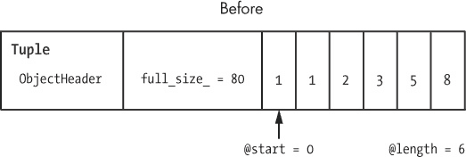

图 11-15. 调用 `Array#shift` 前保存斐波那契数的元组

图 11-16 显示了调用 `Array#shift` 后的元组；Rubinius 仅仅更改了 `@start` 和 `@length` 的值，并将元组中的第一个值设为 `nil`。

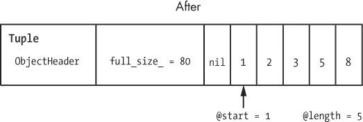

图 11-16. 调用 `Array#shift` 后相同的元组

如你所猜测，MRI 通过跟踪数组数据在原始数组中的起始位置来对 `Array#shift` 进行类似的优化。然而，它使用的 C 代码更复杂且更难理解。Rubinius 内核为我们提供了更清晰的算法视图。

# 总结

我们在本章中了解到，Rubinius 使用一个用 C++ 实现的虚拟机来运行你的 Ruby 代码。像 YARV 一样，Rubinius 虚拟机是专门设计来运行 Ruby 程序的，它使用一个编译器将 Ruby 程序转换为字节码。我们看到，这些 Rubinius 指令类似于 YARV 指令；它们以类似的方式操作栈值。

但与其他 Ruby 实现不同，Rubinius 的独特之处在于其 Ruby 语言内核。Rubinius 内核使用 Ruby 代码实现了许多内置的 Ruby 类，例如 `Array`。这一创新设计提供了一个探索 Ruby 内部机制的窗口——你可以通过使用 Rubinius 学习 Ruby 如何在内部工作，而无需了解 C 或 Java。你可以通过阅读 Rubinius 内核中的 Ruby 源代码，了解 Ruby 如何实现字符串、数组或其他类。Rubinius 不仅仅是一个 Ruby 实现；它是 Ruby 社区一个宝贵的学习资源。
