# 第十二章。MRI、JRuby 和 Rubinius 中的垃圾回收

> 
> 
> *垃圾回收器是 Ruby 对象的诞生地，也是它们的死亡地。*

*垃圾回收（GC）*是 Ruby 等高级语言用来为你管理内存的过程。你的 Ruby 对象在使用时存活在哪里？Ruby 如何清理你程序不再使用的对象？Ruby 的 GC 系统解决了这些问题。

垃圾回收并不是 Ruby 所独有的。垃圾回收的第一个实现出现在 Lisp 编程语言中，由约翰·麦卡锡（John McCarthy）在大约 1960 年发明。与 Ruby 一样，Lisp 也通过垃圾回收自动为你管理内存。自其发明以来，垃圾回收一直是计算机科学研究的课题，且已成为许多计算机语言的重要特性，包括 Java、C#，当然还有 Ruby。

计算机科学家发明了许多不同的算法来执行垃圾回收。事实证明，MRI 使用的是约翰·麦卡锡（John McCarthy）50 多年前发明的相同垃圾回收算法：*标记-扫描垃圾回收*。而 JRuby 和 Rubinius 则使用另一种算法，它是在 1963 年发明的：*复制垃圾回收*。它们还采用了另一种创新方法，称为*代际垃圾回收*，并且可以在应用程序继续运行的同时，通过*并发垃圾回收*在单独的线程中执行 GC 任务。在本章中，我们将介绍这些复杂的垃圾回收算法背后的基本思想。MRI、JRuby 和 Rubinius 的垃圾回收器使用这些算法的更复杂版本，但相同的基本原则依然适用。

路线图

+   垃圾回收器解决的三个问题

+   MRI 中的垃圾回收：标记与扫描

    +   空闲列表

    +   MRI 使用多个空闲列表

    +   标记

    +   MRI 如何标记活跃对象？

    +   扫描

    +   懒惰扫描

    +   RVALUE 结构

    +   标记与扫描的缺点

+   **实验 12-1：观察 MRI 垃圾回收的实际应用**

    +   查看 MRI 执行懒惰扫描

    +   看到 MRI 执行完整的回收过程

    +   解读 GC 配置文件报告

+   JRuby 和 Rubinius 中的垃圾回收

+   复制垃圾回收

    +   Bump 分配

    +   半空间算法

    +   伊甸堆

+   代际垃圾回收

    +   弱代际假设

    +   为年轻对象使用半空间算法

    +   提升对象

    +   成熟对象的垃圾回收

    +   代际间的引用

+   并发垃圾回收

    +   在对象图变化时标记

    +   三色标记

    +   JVM 中的三个垃圾回收器

+   **实验 12-2：在 JRuby 中使用详细 GC 模式**

    +   触发主要回收过程

+   进一步阅读

+   总结

# 垃圾回收器解决了三个问题

尽管名称为“垃圾回收”，但它不仅仅是清理垃圾对象的过程。垃圾回收器实际上解决了三个问题：

+   它们*分配*内存供新对象使用。

+   它们*识别*程序不再使用的对象。

+   它们*回收*来自未使用对象的内存。

Ruby 的 GC 系统也不例外。当你创建一个新的 Ruby 对象时，垃圾回收器会为该对象分配内存。稍后，Ruby 的垃圾回收器会判断你的程序何时不再使用该对象，从而可以重用该内存来创建新的 Ruby 对象。分配内存和回收内存是同一枚硬币的两面；因此，Ruby 的垃圾回收器执行这两项任务是合乎逻辑的。

# MRI 中的垃圾回收：标记和清扫

学习垃圾回收的一个好地方是 MRI 相对简单的 GC 算法，它类似于约翰·麦卡锡在 1960 年通过其开创性工作 Lisp 所使用的算法。一旦我们理解了该算法的工作原理，我们将进一步探讨 JRuby 和 Rubinius 中更复杂的垃圾回收机制，并研究 MRI 是如何采纳它们的一些技术的。

MRI 的*标记-清除*算法会为你的程序分配新的对象内存，直到可用内存（或*堆*）耗尽，此时 MRI 会暂停程序并*标记*你代码中仍然持有引用的对象作为*活跃对象*。然后 Ruby 会*清除*剩余的对象，这些对象称为*垃圾对象*，并允许其内存被重新利用。一旦这个过程完成，Ruby 允许你的程序继续执行。

## 空闲列表

标准 MRI Ruby 使用麦卡锡最初的内存分配解决方案，称为*空闲列表*。图 12-1 展示了空闲列表的概念图。


图 12-1。MRI 内部空闲列表的概念图

图中的每一个白色方块代表一个可用于创建新对象的小块内存。可以把这个图看作是一个未使用的 Ruby 对象链表。当你创建一个新的 Ruby 对象时，MRI 从列表的头部取出一个空闲内存块，并用它来创建一个新的 Ruby 对象，如图 12-2 所示。


图 12-2。Ruby 从空闲列表中取出了第一个内存块，并用它创建了一个新的 Ruby 对象。

该图中的灰色框表示一个已分配的、活跃的对象。其余的白色框仍然是可用的。在内部，所有 Ruby 对象都由一个 C 结构体`RVALUE`表示。MRI 在`RVALUE`内部使用一个 C *联合体*来包含我们目前在 MRI 中看到的所有 C 结构体，例如`RArray`、`RString`、`RRegexp`等。换句话说，每个方块都可以是任何类型的 Ruby 对象，或是一个自定义 Ruby 类的实例（通过`RObject`）。每个对象的内容，如字符串中的字符，通常存储在一个单独的内存位置。

随着你的程序开始分配更多新对象，MRI 从空闲列表中取出更多新的`RVALUE`结构，未使用的值列表逐渐缩小，如图 12-3 所示。


图 12-3. 当你的程序创建更多对象时，MRI 开始使用空闲列表。

MRI 的多空闲列表使用

当 MRI 开始执行一个 Ruby 脚本时，它会为空闲列表分配内存。它将初始空闲列表的长度设置为约 10,000 个`RVALUE`结构体，这意味着 MRI 可以在不分配更多内存的情况下创建 10,000 个 Ruby 对象。当需要更多对象时，MRI 会分配更多内存，将更多空的 RVALUE 结构体放到空闲列表中。

Ruby 不是创建一个包含 10,000 个元素的单一长链表，而是将分配的内存划分为多个子区块，在 MRI 源代码中称为*堆*，每个堆约 16k 大小。然后，它为每个堆创建一个空闲列表，最初创建 24 个列表，每个列表包含 407 个对象，剩余的内存则用于其他内部数据结构。

由于存在多个空闲列表，MRI 会不断从一个空闲列表中返回`RVALUE`结构体，直到该列表为空，然后跳到另一个空闲列表，从第二个列表中返回更多结构体。通过这种方式，MRI 会遍历所有可用的空闲列表，直到它们全部为空。

## 标记

当你的程序运行时，它会创建新对象，最终 MRI 会用完空闲列表上所有剩余的对象。此时，GC 系统会停止你的程序，识别出你的代码不再使用的对象，并回收它们的内存，以便分配给新对象。如果没有找到未使用的对象，Ruby 会向操作系统请求更多内存；如果没有可用内存，Ruby 会抛出内存不足的异常并停止。

你的程序分配但不再使用的对象被称为*垃圾对象*。为了识别垃圾对象，MRI 会遍历你对象的 C 结构体中的指针，跟随引用从一个对象到另一个对象，找到所有活跃对象（参见图 12-4）。如果 MRI 没有找到对某个对象的引用，它就知道你的代码不再使用该对象。

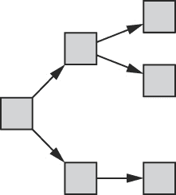

图 12-4. Ruby 从左边的根对象开始，沿着指针或引用从一个对象到另一个对象。

左侧的灰色框是*根对象*，这是你创建的全局变量或 Ruby 知道你的应用程序必须使用的内部对象。通常，在任何给定时刻都会有许多根对象。箭头表示从该根对象到其他对象的引用，这些对象可能包含对其他对象的引用。这种对象及其引用的网络被称为*对象图*。MRI 在遍历对象图时标记每个找到的 Ruby 对象，在标记过程中暂停你的程序，以确保不会创建新的对象引用。

一旦标记过程完成，堆中包含一系列对象，既有标记的也有未标记的，如图 12-5 所示。标记的对象是*活跃的*，意味着你的代码正在使用它们。未标记的对象是垃圾，意味着 Ruby 可以释放或回收它们的内存。由于你的代码仍在使用这些标记的对象，因此它们的内存必须被保留。

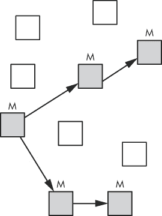

图 12-5. MRI 已标记五个活跃对象（灰色），并在堆中剩余五个垃圾对象（白色）。

## MRI 如何标记活跃对象？

MRI 使用一种称为*位图标记*的技术来保存标记和未标记对象的信息。位图标记是指将活跃对象的标记作为一系列位保存在一种名为*空闲位图*的数据结构中（参见图 12-6）。MRI 使用一个单独的内存结构来存储空闲位图，而不是将标记保存在对象附近。

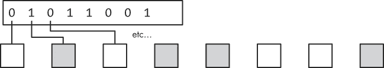

图 12-6. MRI 将 GC 标记标志保存在一个名为*空闲位图*的单独数据结构中。

使用一个单独的内存结构来存储标记位的原因与一种称为*写时复制*的 Unix 内存优化技术有关（参见写时复制）。类似于 Ruby 如何在包含相同字母的不同字符串之间共享内存，写时复制允许 Unix 进程共享包含相同值的内存。通过将标记位单独保存，MRI 最大化了内存中相同值的共享数量。（在 Ruby 1.9 及更早版本中，标记位保存在每个`RVALUE`结构内部，这导致垃圾回收器在标记活跃对象时修改几乎所有 Ruby 的共享内存，从而使写时复制优化失效。）

## 扫描

在识别到垃圾对象后，接下来是回收它们。Ruby 的 GC 算法将未标记的对象重新放回空闲链表，如图 12-7 所示。

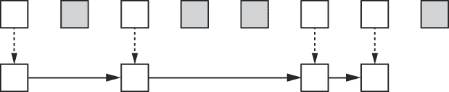

图 12-7. 在清扫过程中，MRI 将未使用的`RVALUE`结构重新放回空闲链表。

将未使用的对象移回空闲链表的过程称为*清扫*这些对象。通常，这个过程运行得非常快，因为 MRI 并不会真正复制对象；它只是调整每个`RVALUE`中的指针，以创建空闲链表（图 12-7 中的实线箭头所示）。

## 懒惰清扫

从版本 1.9.3 开始，MRI 引入了一种名为*懒惰清扫*的优化。懒惰清扫算法减少了程序在垃圾回收器停顿时的时间。（记住，在正常的标记清扫过程中，MRI 会停止执行你的代码。）

懒惰清扫仅将足够的垃圾对象回收到空闲链表中，以便创建一些新的 Ruby 对象，并让程序继续运行，从而减少了清扫所需的时间。Ruby 只会将 MRI 的一个内部堆结构中找到的所有垃圾`RVALUE`对象清扫回该堆的空闲链表。如果当前堆中没有找到垃圾对象，Ruby 会尝试对下一个堆进行懒惰清扫，并继续遍历剩余的堆。（我们将在实验 12-1：观察 MRI 垃圾回收的实际操作中看到这个算法的运作。）

懒惰清扫可以减少程序在等待垃圾回收时的暂停时间；然而，它并不会减少垃圾回收工作的总体量。懒惰清扫将相同的清扫工作量分摊到多个 GC 暂停中。

RVALUE 结构

你可以在 MRI 的*gc.c*源代码文件中找到`RVALUE` C 结构的定义，该文件包含了 MRI 垃圾回收器的实现。示例 12-1 展示了`RVALUE`定义的一部分。

示例 12-1. *`RVALUE`定义的一部分* 来自 gc.c

```
    typedef struct RVALUE {
   union {
     struct {
          VALUE flags;        /* always 0 for freed obj */
          struct RVALUE *next;
        } free;
     struct RBasic  basic;
        struct RObject object;
        struct RClass  klass;
        struct RFloat  flonum;
        struct RString string;
        struct RArray  array;
        struct RRegexp regexp;

    --*snip*--

        } as;
    #ifdef GC_DEBUG    const char *file;
        int   line;
    #endif} RVALUE;
```

请注意在  处，`RVALUE` 使用联合体来内部存储多种不同类型的值。第一个可能的值是 `free` 结构，定义在  处，表示仍在空闲列表中的 `RVALUE`。MRI 在联合体中包括所有可能类型的 Ruby 对象，起始位置在  处：`RObject`、`RString` 等等。

## 标记清除的缺点

标记清除的主要缺点是，它要求程序暂停并等待标记和清除过程的完成。然而，从 1.9.3 版本开始，MRI 的懒清除技术在一定程度上缩短了 GC 暂停的时间。

另一个缺点是，执行标记清除垃圾回收所需的时间与堆的总大小成正比。在标记阶段，Ruby 需要访问程序中的每一个活动对象。在清除阶段，Ruby 需要遍历堆中所有未使用的垃圾对象。随着程序创建的对象数量和堆的总大小的增加，这两个任务都会变得更加耗时。

标记清除的最后一个问题是，所有空闲列表中的元素——所有未使用的、可供程序使用的对象——必须具有相同的大小。MRI 在你分配新对象时并不知道它是字符串、数组还是一个简单的数字。这就是为什么 MRI 在空闲列表中使用的 `RVALUE` 结构必须能够包含任何可能类型的 Ruby 对象。

# 实验 12-1：观察 MRI 垃圾回收的实际运行

你已经了解了 MRI 垃圾回收算法的理论原理。现在，让我们换个角度，看看 MRI 如何执行实际的垃圾回收。在示例 12-2 中，创建了 10 个 Ruby 对象。

示例 12-2. 使用 `Object.new` 创建 10 个 Ruby 对象

```
10.times do
  obj = Object.new
end
```

如果 MRI 确实从空闲列表中分配未使用的空间给新对象，那么在我们运行 示例 12-2 时，Ruby 应该从空闲列表中移除 10 个 `RVALUE` 结构，并将它们分配给这 10 个新对象。为了查看这一过程的实际效果，我们使用 `ObjectSpace#count_objects` 方法，如 示例 12-3 所示。

示例 12-3. 使用 `ObjectSpace#count_objects` 显示 MRI 堆的信息

```
    def display_count
   data = ObjectSpace.count_objects
   puts "Total: #{data[:TOTAL]} Free: #{data[:FREE]} Object: #{data[:T_OBJECT]}"end

    10.times do
      obj = Object.new
   display_count
    end
```

现在我们每次在循环中调用 `display_count`。`display_count` 使用 `ObjectSpace#count_objects` 来显示关于总对象数量、空闲对象数量以及每次循环中活动的 `RObject` 结构的相关信息。

运行 示例 12-3 会产生 示例 12-4 中显示的结果。

示例 12-4. 示例 12-3 产生的输出

```
Total: 17491 Free: 171 Object: 85
Total: 17491 Free: 139 Object: 86
Total: 17491 Free: 132 Object: 87
Total: 17491 Free: 125 Object: 88
Total: 17491 Free: 118 Object: 89
Total: 17491 Free: 111 Object: 90
Total: 17491 Free: 104 Object: 91
Total: 17491 Free: 97 Object: 92
Total: 17491 Free: 90 Object: 93
Total: 17491 Free: 83 Object: 94
```

`Total:` 字段显示 MRI 返回的 `ObjectSpace.count_objects[:TOTAL]` 的值。该值（17491）表示当前 Ruby 中所有活动对象的总数。它包括我们创建的对象；Ruby 在解析、编译和执行程序时内部创建的对象；以及空闲列表中的对象。这个数字在我们创建新对象时不会改变，因为它已经包括了整个空闲列表中的对象。

`Free:` 字段显示 `ObjectSpace.count_objects[:FREE]` 返回的空闲列表长度值。请注意，每次循环时，该值都会减少约 7。我们每次迭代只创建一个对象，但 Ruby 在执行 `display_count` 方法中的代码时，每次循环都会创建 6 个其他对象。

`Object:` 字段显示当前在 Ruby 中活动的 `RObject` 结构的数量。请注意，每次循环时，这个值都会增加 1，即使我们没有保持对新对象的活动引用。也就是说，我们没有将 `Object.new` 返回的值保存到任何地方。`RObject` 的计数包括活动对象和垃圾对象。

## 查看 MRI 执行懒散清理

现在，如果我们将迭代次数从 10 增加到 30，并重新运行 示例 12-3，我们将在 示例 12-5 中看到以下输出。

示例 12-5. 运行 示例 12-3，将迭代次数从 10 改为 30

```
    Total: 17493 Free: 166 Object: 85
    Total: 17493 Free: 134 Object: 86
    Total: 17493 Free: 127 Object: 87
    Total: 17493 Free: 120 Object: 88

    --*snip*--

    Total: 17493 Free: 29 Object: 101
    Total: 17493 Free: 22 Object: 102
    Total: 17493 Free: 15 Object: 103
 Total: 17493 Free: 8 Object: 104
 Total: 17493 Free: 246 Object: 104
    Total: 17493 Free: 239 Object: 105
    Total: 17493 Free: 232 Object: 106
    Total: 17493 Free: 225 Object: 107
```

这时，空闲列表计数下降至 8，在  处。然后在  处，空闲计数增加到 246，但对象计数保持在 104。 这看起来像是一次完整的垃圾回收。但是实际上并不是！如果 Ruby 已经回收了所有可用的垃圾对象，当空闲计数增加时，`RObject` 的计数应该会减少，因为我们的所有对象会立即成为垃圾。这里到底发生了什么？

这是一种懒惰清理。Ruby 首先标记所有活动对象，间接识别出垃圾对象。然而，Ruby 并没有将所有垃圾对象移动到空闲列表，而是只清理了其中一部分：它从某个内部堆结构中找到了垃圾对象。空闲计数增加了，但 `RObject` 的计数保持不变，因为 MRI 重用了一个先前迭代中创建的 `RObject` 结构来创建新对象。

## 查看 MRI 执行完整的垃圾回收

我们可以通过手动触发完整垃圾回收来观察其效果，方法是使用 `GC.start`（见 示例 12-6）。

示例 12-6. 触发完整的垃圾回收

```
    def display_count
      data = ObjectSpace.count_objects
      puts "Total: #{data[:TOTAL]} Free: #{data[:FREE]} Object: #{data[:T_OBJECT]}"end

    30.times do
      obj = Object.new
      display_count
    end

 GC.start
 display_count
```

在这里，我们再次迭代 30 次，创建新对象并调用 `display_count`。然后，在  处，我们调用 `GC.start`，这会触发 MRI 执行完整的垃圾回收。最后，在  处，我们再次调用 `display_count` 来显示相同的技术信息。示例 12-7 显示了新的输出。

示例 12-7. 示例 12-6 生成的输出

```
    --*snip*--

    Total: 17491 Free: 26 Object: 101
    Total: 17491 Free: 19 Object: 102
    Total: 17491 Free: 12 Object: 103
 Total: 17491 Free: 251 Object: 103
    Total: 17491 Free: 244 Object: 104
    Total: 17491 Free: 237 Object: 105
    Total: 17491 Free: 230 Object: 106
    Total: 17491 Free: 223 Object: 107
    Total: 17491 Free: 216 Object: 108
    Total: 17491 Free: 209 Object: 109
    Total: 17491 Free: 202 Object: 110
    Total: 17491 Free: 195 Object: 111
    Total: 17491 Free: 188 Object: 112
    Total: 17491 Free: 181 Object: 113
 Total: 17491 Free: 9527 Object: 43
```

示例 12-7 的大部分内容与 示例 12-5 的输出相似。总数保持不变，而空闲计数逐渐减少。在  处，我们看到懒惰清理再次发生，空闲计数增加至 251。然而，在  处，我们看到一个显著变化。对象的总数保持在 17491，但空闲计数跃升至 9527，且对象数剧烈减少至 43！

从这个观察中，我们可以得出以下结论：

+   在  处，free 计数显著增加，因为 Ruby 通过一次大规模操作将所有垃圾对象移动到了空闲列表中。这些垃圾对象包括我们代码在之前迭代中创建的对象，以及 Ruby 在解析和编译阶段内部创建的对象。

+   `RObject`的数量减少到 43，因为之前迭代中创建的所有对象都是垃圾（因为我们没有将它们保存在任何地方）。这个 43 的数量仅包括 Ruby 内部创建的对象，而不包括我们代码创建的对象。如果我们将新对象保存到某个地方，`RObject`的数量将保持不变。（我们接下来会尝试这样做。）

## 解读 GC 性能分析报告

在这个实验中，我们只从空闲列表中分配了少量对象。当然，您的 Ruby 程序通常会创建更多的对象，远超 30 个。当我们创建数千个甚至数百万个对象时，MRI 的垃圾回收器会如何表现？如何得知在复杂的 Ruby 应用程序中垃圾回收器占用了多少时间？

答案是使用`GC::Profiler`类。如果启用它，MRI 的内部 GC 代码将收集关于每次 GC 运行的统计数据。示例 12-8 展示了如何使用`GC::Profiler`。

示例 12-8. 使用`GC::Profiler`显示 GC 使用情况*(gc-profile.rb)*

```
 GC::Profiler.enable

    10000000.times do
      obj = Object.new
    end

 GC::Profiler.report
```

我们首先在  处通过调用`GC::Profiler.enable`启用性能分析器。以下代码创建了 1000 万个 Ruby 对象。在  处，我们通过调用`GC::Profiler.report`显示 GC 性能分析报告。示例 12-9 显示了在示例 12-8 中生成的报告。

示例 12-9. 从示例 12-8 生成的 GC 性能分析报告的一部分

```
$ **ruby gc-profile.rb**
GC 1046 invokes.
Invoke Time(sec)       Use Size(byte)     Total Size(byte)         Total Object      GC Time(ms)
           0.036               690920               700040                17501         0.694000
           0.039               695200               700040                17501         0.433999
           0.041               695200               700040                17501         0.585000
           0.046               695200               700040                17501         0.577000
           0.049               695200               700040                17501         0.466000
           0.051               695200               700040                17501         0.516999
           0.054               695200               700040                17501         0.419000
           0.056               695200               700040                17501         0.535000
           0.059               695200               700040                17501         0.410000
           0.062               695200               700040                17501         0.426999
--*snip*--
```

为了节省空间，我已从报告中移除了第一列——一个简单的计数器。以下是其他列的含义：

+   *调用时间* 显示垃圾回收发生的时间，单位是 Ruby 脚本开始运行后的秒数。

+   *使用的大小* 显示每次垃圾回收完成后，所有存活的 Ruby 对象占用的堆内存大小。

+   *总大小* 显示回收后堆的总大小——换句话说，就是存活对象占用的内存加上空闲列表的大小。

+   *总对象* 显示 Ruby 对象的总数，包括存活对象和空闲列表中的对象。

+   最后，*GC 时间* 显示每次垃圾回收所用的时间。

在此实验中，注意到除了 *调用时间* 之外，没有任何值发生变化。活跃 Ruby 对象所使用的内存量、堆的总大小和对象的总数量都保持不变。这是因为我们没有将新 Ruby 对象保存到任何地方。它们立即变成垃圾。*GC 时间*值有所波动，但大致保持不变。垃圾回收器清扫所有新对象并将其移回空闲列表所需的时间保持大致相同，因为每次回收器清扫的对象数量大致相同。

然而，如果我们将所有新对象保存在一个数组中，它们将保持活跃并且不会变成垃圾。示例 12-10") 展示了将每个对象保存到一个单一的大数组中的代码。

示例 12-10. 在数组中保存 1000 万个 Ruby 对象 *(gc-profile-array.rb)*

```
    GC::Profiler.enable

 arr = []
10000000.times do
   arr << Object.new
    end

    GC.start

    GC::Profiler.report
```

在这里，我们在  创建了一个空数组，并在  中保存了每个新对象。由于数组持有所有新对象的引用，它们保持活跃。垃圾回收器无法回收任何这些对象的内存。示例 12-11 显示了由 示例 12-10") 生成的 GC 性能分析报告。

示例 12-11. Ruby 必须增加堆的大小以容纳所有新的活跃对象。

```
    $ **ruby gc-profile-array.rb**
 GC 17 invokes.
    Invoke Time(sec)       Use Size(byte)     Total Size(byte)         Total Object      GC Time(ms)
               0.031               690920               700040                17501         0.575000
               0.034               708480               716320                17908         0.689000
               0.037              1261680              1269840                31746         1.077000
               0.043              2254280              2262920                56573         1.994999
               0.054              4044200              4053720               101343         3.454999
               0.074              7266080              7277160               181929         5.288000
               0.108             13058920             13072840               326821         9.417000
               0.170             23489240             23508320               587708        14.465000
               0.279             42267080             42311720              1057793        26.015999
               0.478             76096560             76157840              1903946        45.910000
```

这次的性能分析报告非常不同！垃圾回收器无法释放任何新对象，因为它们仍然活跃在数组中。这意味着 Ruby 则不得不反复分配更多内存来容纳它们。当你阅读 示例 12-11 时，注意到三个重要的值——*使用大小*、*总大小*和*对象总数*——都呈指数增长。这种增长就是为什么在  我们看到垃圾回收器只被调用了 17 次。（在调用 `GC::Profiler.enable` 之前，Ruby 也运行了几次垃圾回收，因为它解析并编译了我们的脚本。）每次垃圾回收器都会或多或少地将堆的大小加倍，从而使脚本能够持续运行更长时间。与我们在 示例 12-9 中看到的快速多次垃圾回收不同，Ruby 只运行了几次较慢的垃圾回收。

如果我们绘制每次回收所需时间（*GC 时间*）与堆的总大小（*总堆大小*）的图表，如 图 12-8 所示，我们可以得出另一个有趣的结论。

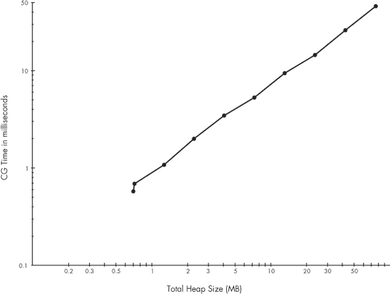

图 12-8. 执行标记和清除所需的时间随着堆大小线性增加。

图 12-8 使用对数刻度表示横轴（*总堆大小*）和纵轴（*GC 时间*）。因为 Ruby 在每次回收时都会将堆大小翻倍，所以数据点在对数横轴上大致均匀分布。由于时间是指数级增加的，数据点在对数纵轴上也大致均匀分布。

最重要的是，注意数据点形成了一条直线：这条直线意味着执行垃圾回收所需的时间随着总堆大小线性增加。随着你创建更多的 Ruby 对象，标记它们的时间也会更长。当垃圾对象增多时，清理过程也需要更多时间；然而，在这个例子中，我们没有看到清理时间，因为所有对象都保持活跃。

# JRuby 和 Rubinius 的垃圾回收

由于 JRuby 使用 Java 虚拟机（JVM）来实现 Ruby，它能够利用 JVM 的高级垃圾回收系统来管理 Ruby 对象的内存。事实上，垃圾回收是使用 JVM 平台的主要优点之一：JVM 的垃圾回收器已经经过多年的优化。

Rubinius 的 C++ 虚拟机还包含一个复杂高效的垃圾回收器，使用了与 JVM 相同的一些底层算法。选择 Rubinius 作为你的 Ruby 平台的一个好处就是它的先进垃圾回收系统。

JRuby 和 Rubinius 使用的垃圾回收器与 MRI 的垃圾回收器在三个方面有所不同：

+   它们并没有使用空闲列表，而是为新对象分配内存，并通过一种叫做*复制垃圾回收*的算法回收垃圾对象的内存。

+   它们通过*代际垃圾回收*以不同的方式处理旧的和新的 Ruby 对象。

+   它们使用*并发垃圾回收*在应用程序代码运行时执行一些垃圾回收任务。

### 注意

*尽管 JRuby 和 Rubinius 使用的垃圾回收系统与 MRI 的标记-清除垃圾回收器有很大不同，但 MRI 已经开始引入一些这些概念。具体来说，Ruby 2.1 中的垃圾回收系统已经开始使用代际和并发垃圾回收。*

在接下来的章节中，我们将探讨支撑复制、分代和并发垃圾回收的基本算法，同时了解 Rubinius 和 JRuby 中垃圾回收是如何工作的。

# 复制垃圾回收

1963 年，在约翰·麦卡锡（John McCarthy）构建了第一个 Lisp 垃圾回收器三年后，马文·明斯基（Marvin Minsky）开发了一种不同的内存分配和回收方式，称为*复制垃圾回收*。（明斯基的研究最初也用于 Lisp。该算法后来在 1969 年由 Fenichel 和 Yochelson 以及在 1978 年由 Baker 进行了改进。）与使用空闲列表跟踪可用对象的方式不同，复制垃圾回收器从一个大的堆或内存段中为新对象分配内存。当这个内存段用完时，这些回收器*复制*所有活跃对象到第二个内存段，并将垃圾对象遗留在原地。然后，交换这两个内存段，立即回收垃圾对象所占用的所有内存。（Rubinius 和 JVM 都使用基于这个原始思想的复杂算法。）

## 增量分配

当你使用复制垃圾回收器（例如 JVM 和 Rubinius 中的回收器）为新对象分配内存时，垃圾回收器使用一种称为*增量分配*的算法。增量分配通过*增进*或递增一个指针来分配来自大而连续堆的相邻内存段，以跟踪下一个分配的位置。图 12-9 展示了这个过程如何在三次重复分配中工作。（大矩形表示 Rubinius 或 JVM 的堆。）

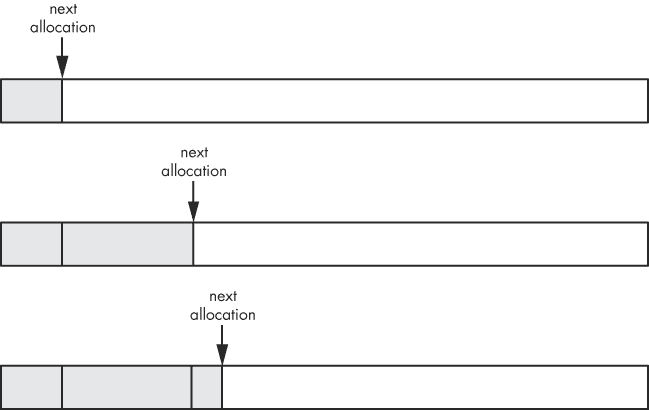

图 12-9。使用增量分配分配三个对象

复制回收器保持一个指针，用于跟踪下一个分配将在堆中的哪里发生。每次回收器为新对象分配内存时，它都会从堆中取出一些内存，并将指针向右移动。随着更多对象的创建，从堆中分配的内存也向右移动。还要注意的是，新对象的大小并不相同；每个对象使用的字节数不同。因此，这些对象在堆中并不均匀分布。

这种技术的优点是它非常快速且实现简单，并且提供了良好的*引用局部性*，意味着程序中相关的值应该在内存中相互靠近。局部性很重要，因为如果你的代码反复访问相同的内存区域，CPU 可以缓存这些内存并更快速地访问它。如果程序经常访问非常不同的内存区域，CPU 必须不断重新加载内存缓存，从而减慢程序的性能。

复制垃圾回收的另一个好处是能够创建不同大小的对象。与 MRI 中的`RVALUE`结构不同，JRuby 和 Rubinius 可以分配任意大小的新对象。

## 半空间算法

当初始堆用尽并发生垃圾回收时，复制垃圾回收器的真正优势和优雅之处显现出来。复制垃圾回收器以与标记清除（mark-and-sweep）回收器相同的方式识别存活对象和垃圾对象——通过遍历对象图，跟随对象引用或指针。然而，一旦垃圾对象被识别出来，复制垃圾回收器的工作方式就非常不同了。

复制垃圾回收器实际上使用两个堆：一个用来通过增量分配（bump allocation）创建新对象，另一个为空的堆，如图 12-10 所示。

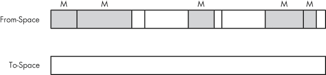

图 12-10。半空间算法使用两个堆，其中一个最初为空。

上方的堆包含已经创建的对象，称为*来自空间*（from-space）。请注意，来自空间中的对象已经被标记为存活（灰色并带有*M*标记）或垃圾（白色）。下方的堆是*目标空间*（to-space），最初为空。接下来我将描述的算法被称为*半空间*算法，因为总的可用内存被分为来自空间和目标空间。

当来自空间（from-space）完全填满时，复制垃圾回收器将所有存活的对象复制到目标空间（to-space），并将垃圾对象留在原地。图 12-11 展示了复制过程。

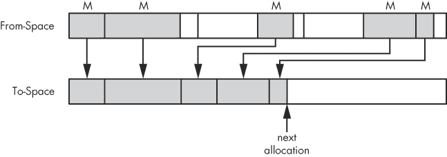

图 12-11。半空间算法仅将存活的对象复制到第二个堆中。

来自空间（from-space）再次出现在图表的顶部，而目标空间（to-space）位于下方。注意存活的对象是如何被复制到目标空间中的。指向下方的箭头表示这一复制过程。类似于增量分配中使用的指针，会跟踪下一个存活对象应该复制到哪里。

一旦复制过程完成，半空间算法会交换堆，如图 12-12 所示。

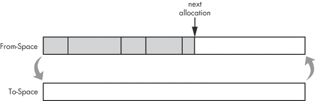

图 12-12。复制存活对象后，半空间算法交换堆。

在图 12-12 中，to-space 已经变成了新的 from-space，并且现在准备通过提升分配来为新对象分配更多内存。你可能会认为这个算法会很慢，因为涉及了大量的复制操作，但其实并不慢，因为只有活跃的、存活的对象才会被复制，垃圾对象会被留下并最终回收。

### 注意

*所有活跃对象都被复制到堆的左侧；这使得垃圾回收器能够最有效地分配剩余未使用的内存。堆的压缩是半空间算法的自然结果。*

虽然半空间算法是一种优雅的内存管理方式，但它在某种程度上存在内存低效的问题。它要求回收器分配的内存是实际使用内存的两倍，因为所有对象可能都保持活跃状态，并可能被复制到第二个堆中。这个算法也比较难以实现，因为当回收器移动活跃对象时，它还必须更新对这些对象的引用和指针。

## 伊甸堆

事实证明，Rubinius 和 JVM 都使用一种变体的半空间算法，并采用一种称为*伊甸园*（Garden of Eden）或*伊甸堆*（Eden heap）的第三种堆结构来分配新对象的内存。图 12-13 展示了这三种内存结构。


图 12-13. 伊甸堆用于分配全新对象的内存。

伊甸堆是 JVM 和 Rubinius 为新对象分配内存的地方；from-space 包含了在上一次垃圾回收过程中复制过来的所有活跃对象；to-space 在下一次垃圾回收运行之前保持为空。每次垃圾回收过程运行时，回收器将你的对象从伊甸堆和 from-space 复制到 to-space，从而为新对象提供更多的内存，因为每次半空间复制操作后，伊甸堆都会保持为空。

# 世代垃圾回收

包括 JVM 和 Rubinius 虚拟机在内的许多现代垃圾回收器使用*世代 GC*算法，这是一种将新对象与旧对象区别对待的技术。新对象，或*年轻对象*，是你的程序刚刚创建的对象，而旧对象，或*成熟对象*，是你的程序正在继续使用的对象。一个对象被认为是成熟对象的标准通常是它在垃圾回收系统运行的次数。

## 弱世代假设

将对象分类为年轻对象或成熟对象的原因基于这样的假设：大多数年轻对象的生命周期较短，而成熟对象可能会持续很长时间。这一假设被称为*弱代际假设*。简单来说，新对象通常会“早逝”。由于年轻对象和成熟对象的生命周期不同，因此每个类别或*代*需要采用不同的垃圾收集算法。

例如，考虑一个 Ruby on Rails 网站。为了生成每个客户端请求的网页，Rails 应用会创建许多新的 Ruby 对象。然而，一旦网页生成并返回给客户端，所有这些 Ruby 对象就不再需要，垃圾收集系统可以回收它们的内存。同时，应用可能还会创建一些在请求之间存活的 Ruby 对象，比如表示控制器、一些配置数据或用户会话的对象。这些成熟对象会有更长的生命周期。

## 使用半空间算法处理年轻对象

根据弱代际假设，年轻对象是程序不断创建的，但也经常变成垃圾。因此，JVM 和 Rubinius 对于年轻对象运行垃圾收集过程的频率远高于成熟对象（你将在实验 12-2：在 JRuby 中使用详细 GC 模式中看到详细数据）。半空间算法非常适合处理年轻对象，因为它只复制存活的对象。当伊甸园堆（Eden heap）充满新对象时，垃圾收集器会将其中大部分标记为垃圾，因为新对象通常早逝。由于存活的对象较少，垃圾收集器的复制工作量也较小。JVM 将这些对象称为*幸存者*，并将 from-space 和 to-space 称为*幸存者空间*。

## 提升对象

当一个新对象变成旧对象（即它经历了垃圾收集系统的若干次运行后），它会在半空间复制过程中被*提升*，即被复制到成熟代堆中，如图 12-14 所示。

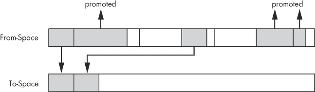

图 12-14. 代际垃圾收集器将旧对象从年轻堆提升到成熟堆中。

请注意，from-space 包含五个活动对象，显示为灰色矩形。通过半空间算法，其中两个对象被复制到 to-space，而其他三个对象则被提升。它们的年龄已经超过了*新对象生命周期*，因为它们在若干次垃圾收集运行中保持活跃。

在 Rubinius 中，新对象生命周期的默认值为 2，这意味着一旦垃圾回收系统运行了两次并且您的代码仍然持有该对象的引用，该对象就会变成老年代对象。（这意味着 Rubinius 会使用半空间算法在从空间和到空间之间复制一个活动对象两次。）随着时间的推移，Rubinius 会根据各种统计数据调整对象生命周期值，尽可能优化垃圾回收。

JVM 的垃圾回收器会内部计算新对象的生命周期，尝试保持从空间和到空间的堆大约填充一半。如果这些堆开始填满，新对象的生命周期将缩短，且对象将更快地被提升。如果空间大部分是空的，JVM 将增加新对象的生命周期，使新对象能在此停留更长时间。

## 老年代对象的垃圾回收

一旦您的对象被提升到老年代，它们很可能会因为弱代际假设而长时间存活。因此，JVM 和 Rubinius 需要在老年代上进行垃圾回收的频率要少得多。垃圾回收会在为老年代对象分配的堆满时进行。由于大多数新对象在新对象生命周期内不会存活，老年代的收集速度较慢。

JVM 提供了许多命令行选项，使您能够配置年轻代和老年代堆的相对或绝对大小（JVM 文档中将老年代称为*老年代*）。JVM 还维护了第三代，用于 JVM 自身创建的内部对象：*永久代*。年轻代的垃圾回收被称为*小规模回收*，而老年代则是*大规模回收*。

Rubinius 使用一种名为 *Immix* 的复杂垃圾回收算法来处理老年代对象。Immix 尝试通过将活动对象收集到连续区域中，减少总内存使用量和堆碎片化的程度。Rubinius 还使用第三代来处理非常大的对象，并使用标准的标记-清除过程来收集它们。

### 注意

*MRI Ruby 2.1 版本实现了一种代际垃圾回收算法，类似于 JVM 和 Rubinius 多年来使用的算法。其主要挑战是检测哪些老年代对象引用了年轻代对象（参见 代际之间的引用）。MRI 通过使用写屏障来解决这个问题，跟踪每次老年代对象引用年轻代对象，尽管在 MRI 中实现写屏障非常复杂，因为现有的 C 扩展并不包含这些屏障。*

代际之间的引用

除了新对象的生命周期外，代际垃圾回收器还必须追踪另一个重要细节：因旧对象的引用而活跃的年轻对象。由于年轻代的回收不会标记成熟对象，回收器可能会错误地认为某些年轻对象是垃圾，而它们实际上并非如此。图 12-15 展示了这个问题的一个例子。

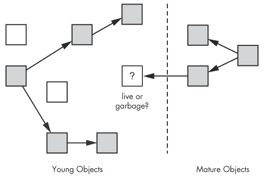

图 12-15. 代际垃圾回收器需要找到引用年轻代对象的成熟对象。

年轻代集合包含几个活动对象（灰色）和垃圾对象（白色）。在年轻代对象标记阶段，代际垃圾回收器仅跟踪年轻代对象的引用，以加速这一频繁发生的过程。然而，请注意标有问号的中心对象：它是活动对象还是垃圾对象？虽然没有其他年轻对象引用它，但有一个成熟对象引用它。如果 Rubinius 或 JVM 在标记完年轻代对象后运行半空间算法，中心对象将被错误地视为垃圾，其内容将被覆盖！

**写屏障**

代际垃圾回收器可以通过使用*写屏障*来解决这个问题。这些代码片段用于跟踪程序何时从一个成熟对象向年轻对象添加引用。当垃圾回收器遇到这样的引用时，它会将该成熟对象视为标记年轻代对象时的另一个根，从而使该对象被视为活动对象，并能通过半空间算法正确复制。

# 并发垃圾回收

Rubinius 和 JVM 都使用另一种复杂的技术来减少应用程序等待垃圾回收的时间：*并发垃圾回收*。使用并发垃圾回收时，垃圾回收器与应用程序代码同时运行。这消除了或至少减少了由于垃圾回收导致的程序暂停，因为应用程序在垃圾回收器运行时无需停止等待。

并发垃圾回收器与主应用程序在不同的线程中运行。尽管理论上这可能意味着应用程序会稍微变慢，因为部分 CPU 时间必须用来运行 GC 线程，但如今大多数计算机都配备了多核微处理器，允许不同的线程并行运行。这意味着可以将一个核心专门用于运行 GC 线程，其他核心则运行主应用程序。（实际上，这仍可能会使应用程序变慢，因为可用的核心减少了。）

### 注意

*MRI Ruby 2.1 还通过并行执行标记-清扫算法中的清扫部分来支持一种形式的并发垃圾回收，同时您的 Ruby 代码继续运行。这有助于减少应用程序在垃圾回收运行时暂停的时间。*

## 在对象图变化时进行标记

在应用程序运行时标记对象是并发垃圾回收器面临的一个大难题：如果在回收器标记对象时，应用程序改变了对象图该怎么办？为了更好地理解这个问题，请参见图 12-16 中的示例对象图。

此图展示了一组正在被并发垃圾回收器标记的对象。左侧是根对象，右侧是根对象引用的各种子对象。所有活跃对象都被标记为*M*并显示为灰色。垃圾回收器（通过大箭头表示）已经标记了活跃对象，现在正在处理底部附近的对象。回收器即将标记右下角的两个剩余白色对象。

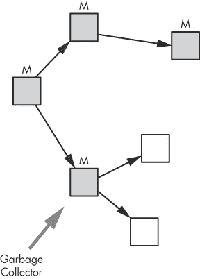

图 12-16. 垃圾回收器标记对象图

现在假设您的应用程序（在标记过程进行时仍在运行）创建了一个新对象，并将其作为先前标记的对象的子对象。图 12-17 展示了新的情况。

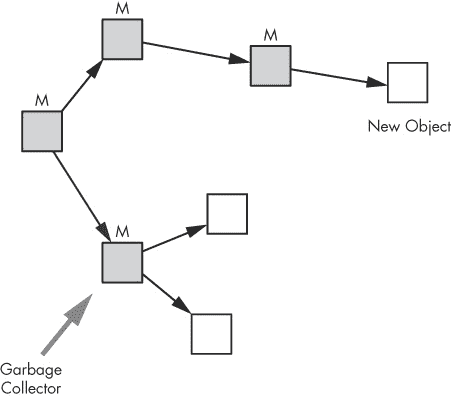

图 12-17. 您的应用程序在标记过程进行时创建了一个新对象。

请注意，某个已标记的活跃对象指向了一个尚未被标记的新对象。

现在假设垃圾回收器完成了对象图的标记。它已标记了所有活跃对象，这意味着任何剩余的对象都被假定为垃圾。图 12-18 展示了标记过程结束时对象图的样子。

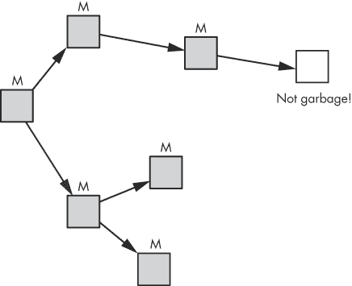

图 12-18. 回收器错误地将新的活跃对象认为是垃圾。

垃圾回收器已经完成了所有活跃对象的标记，但它错过了新的对象。回收器现在将回收其内存，但应用程序将丢失有效数据，或者会在某个对象中添加垃圾数据！

## 三色标记

解决这个问题的方法是维护一个*标记堆栈*，即一个仍需要通过标记过程检查的对象列表，如图 12-19 所示。

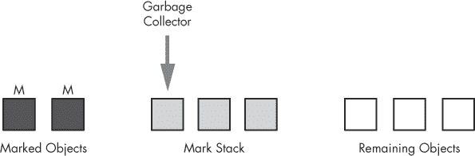

图 12-19. 标记过程通过标记堆栈中的对象进行。

初始时，所有根对象都被放置在标记堆栈中。当垃圾回收器标记对象时，它将对象从标记堆栈移到左侧的标记对象列表中，并将它找到的任何子对象添加到标记堆栈中。当标记堆栈耗尽时，垃圾回收器就完成了；它已经识别了所有存活的对象，右侧的任何剩余对象都被认为是垃圾。但在这种方案下，如果应用程序在标记过程中修改了某个对象，回收器可以将该修改过的对象移回标记堆栈，即使它之前已被标记，如图 12-20 所示。

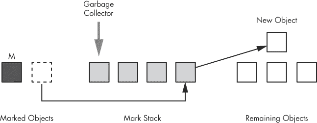

图 12-20. 收集器将标记的对象移回标记堆栈，因为应用程序对其进行了修改。

应用程序已经向系统添加了一个新对象，如图中右侧的剩余对象列表所示。然而，这次，回收器注意到一个现有对象被修改了，因为它现在包含对新对象的引用，并将修改后的对象移到中间的标记堆栈中。因此，回收器最终会在处理标记堆栈时找到并标记新对象。

这种修改后的标记算法被称为*三色标记*：已经处理的对象被认为是“黑色”的；标记堆栈中的对象是“灰色”的；其余的对象是“白色”的，如图 12-19 和图 12-20 所示。

### 注意

*并发垃圾回收器可以使用写屏障来检测应用程序何时更改对象图。写屏障被代际和并发垃圾回收器共同使用。*

## JVM 中的三种垃圾回收器

为了支持不同类型的应用程序和服务器硬件，JVM 包含三种实现并发垃圾回收的独立垃圾回收器。你可以使用命令行参数选择在 JRuby 程序中运行哪种回收器。这三种回收器如下：

+   ****串行（Serial）****。这种回收器会暂停你的应用程序并在应用程序等待时执行垃圾回收。它完全不使用并发垃圾回收。

+   ****并行（Parallel）****。这种回收器会在应用程序运行时，在独立线程中执行许多垃圾回收任务，包括小规模回收。

+   ****并发（Concurrent）****。这种回收器会在应用程序运行的同时执行大部分垃圾回收任务。它经过优化，尽量减少 GC 暂停时间，但使用它可能会降低应用程序的整体吞吐量。

### 注意

*除了这三种回收器，还有多种新的实验性垃圾回收器可供 JVM 使用。其中之一是垃圾优先（G1）回收器，另一个是持续并发压缩（C4）回收器。*

除非你明确指示，否则 JVM 会自动选择这些垃圾回收器中的一种，具体取决于所使用的硬件类型。对于大多数计算机，JVM 默认使用并行回收器；对于服务器级机器，则使用并发回收器。你可以通过在启动 JRuby 程序时使用命令行选项来更改 JVM 默认的垃圾回收选择。有关更多详细信息，请参见文章《Java SE 6 HotSpot 虚拟机垃圾回收调优》(*[`www.oracle.com/technetwork/java/javase/gc-tuning-6-140523.html`](http://www.oracle.com/technetwork/java/javase/gc-tuning-6-140523.html)*)。

能够从这些不同的垃圾回收算法中进行选择，并通过其他配置选项进一步调优回收器的行为，是使用 JRuby 的一大优势。垃圾回收器的效果和性能取决于应用程序的行为以及所使用的底层算法。

为了帮助理解 JVM 提供的众多与垃圾回收（GC）相关的选项，JRuby 项目的主要开发者之一查尔斯·纳特（Charles Nutter）建议使用以下经验法则：

+   如果不确定，保持 JVM 的默认设置。这些设置在大多数情况下表现良好。

+   如果你有大量需要频繁或定期回收的数据，并发回收器或实验性的 G1 回收器可能比并行回收器表现更好。

+   在调优垃圾回收之前，尽量优化代码以减少内存使用。当你分配过多内存时，调整 JVM 的垃圾回收器只能解决问题的一半。

# 实验 12-2：在 JRuby 中使用详细垃圾回收模式

实验 12-1：查看 MRI 垃圾回收的实际操作 探讨了 MRI 中的垃圾回收。在这个实验中，我们将通过要求 JVM 显示 JVM 垃圾回收器正在做什么的技术信息，来查看垃圾回收如何在 JRuby 中工作。示例 12-12") 展示了来自 实验 12-1：查看 MRI 垃圾回收的实际操作 的代码，该代码创建了 10 个 Ruby 对象。

示例 12-12. 使用`Object.new`创建 10 个 Ruby 对象 *(jruby-gc.rb)*

```
10.times do
  obj = Object.new
end
```

当我们使用 `-J-verbose:gc` 选项运行这个简单程序时，JVM 会显示有关垃圾回收的内部调试信息。以下是要使用的命令：

```
$ **jruby -J-verbose:gc jruby-gc.rb**
```

但这个命令不会产生任何输出。也许我们创建的对象不够多，无法触发垃圾回收。

让我们增加新对象的数量到 1000 万，如 示例 12-13") 中所示。

示例 12-13. 使用`Object.new`创建 1000 万个 Ruby 对象 *(jruby-gc.rb)*

```
10000000.times do
  obj = Object.new
end
```

新的输出显示在 示例 12-14 中。

示例 12-14. 运行 示例 12-13") 并使用 `-J-verbose:gc` 选项产生的输出

```
$ **jruby -J-verbose:gc jruby-gc.rb**
[GC 17024K->1292K(83008K), 0.0072491 secs]
[GC 18316K->1538K(83008K), 0.0091344 secs]
[GC 18562K->1349K(83008K), 0.0006953 secs]
[GC 18373K->1301K(83008K), 0.0006876 secs]
[GC 18325K->1289K(83008K), 0.0004180 secs]
[GC 18313K->1285K(83008K), 0.0006950 secs]
[GC 18309K->1285K(83008K), 0.0006597 secs]
[GC 18309K->1285K(83008K), 0.0007186 secs]
[GC 18309K->1285K(83008K), 0.0005617 secs]
[GC 18309K->1285K(83008K), 0.0006873 secs]
[GC 18309K->1285K(83008K), 0.0004944 secs]
[GC 18309K->1285K(83008K), 0.0006644 secs]
[GC 18309K->1285K(83008K), 0.0006448 secs]
[GC 18309K->1285K(83008K), 0.0007203 secs]
```

每次垃圾回收发生时，JVM 都会显示一行信息，说明垃圾回收的情况。在这里显示了 14 个 GC 事件。每一行包含以下信息：

+   ****`GC...`**** *GC* 前缀意味着该事件是一次小规模的回收。JVM 仅清理了 Eden 堆中的新对象或幸存空间中的年轻对象。

+   ****`17024K->1292K`****. 这些值显示了垃圾回收前（箭头左侧）和回收后（箭头右侧）存活对象所使用的数据量。在这个例子中，年轻代中的存活对象所占用的空间每次从大约 17MB 或 18MB 降低到大约 1.3MB。

+   ****`(83008K)`****. 括号中的值表示此进程的 JVM 堆的总大小。该值没有发生变化。

+   ****`0.0072491 secs`****. 该值显示了每次垃圾回收所花费的时间。

[示例 12-14 展示了每当我们创建更多 Ruby 对象时，JVM 的年轻代堆不断被填满。注意，每次 JVM 垃圾回收器通常花费不到 1 毫秒的时间来清理成千上万的垃圾对象。

另外需要注意的是，没有发生主要的垃圾回收。为什么？因为我们没有保存我们的 Ruby 对象。示例 12-13")创建了 1000 万个对象，但没有使用它们，因此 JVM 的垃圾回收器判断它们都是垃圾，并在它们被晋升为成熟对象之前立即回收它们的内存。

## 触发主要收集

为了触发主要垃圾收集，我们需要创建一些成熟的对象，通过创建不会过早死亡而是持续一段时间的 Ruby 对象来实现。我们可以通过将新对象保存在数组中来实现这一点，就像我们在实验 12-1：观察 MRI 垃圾回收过程中所做的那样。示例 12-15 再次重复了相同的脚本，以方便操作。

示例 12-15。将 1000 万个 Ruby 对象保存到数组中

```
 arr = []
    10000000.times do
   arr << Object.new
    end
```

注意在处，我们创建了一个空数组，然后在处将所有 1000 万个新对象插入其中。因为数组包含对所有对象的引用，这些对象将一直保持活动状态。

现在，让我们使用`-J-verbose:gc`命令重新运行实验。示例 12-16 展示了结果。

示例 12-16。运行示例 12-15 并使用`-J-verbose:gc`时输出的开始部分

```
    $ **jruby -J-verbose:gc jruby-gc.rb**
 [GC 16196K->8571K(**83008K**), 0.0873137 secs]
    [GC 25595K->20319K(83008K), 0.0480336 secs]
    [GC 37343K->37342K(83008K), 0.0611792 secs]
    [GC 37586K(83008K), 0.0029985 secs]
    [GC 54366K->54365K(83008K), 0.0617091 secs]
    [GC 65553K->65360K(83008K), 0.0586615 secs]
    [GC 82384K->82384K(100040K), 0.0479422 secs]
    [GC 89491K(100040K), 0.0124503 secs]
    [GC 95890K->95888K(147060K), 0.0795343 secs]
    [GC 96144K(147060K), 0.0030345 secs]
    [GC 130683K->130682K(148020K), 0.0941640 secs]
    [GC 147706K->147704K(165108K), 0.0925857 secs]
    [GC 150767K->151226K(168564K), 0.0226121 secs]
 [Full GC 151226K->125676K(168564K), 0.5317203 secs]
    [GC 176397K->176404K(**236472K**), 0.0999831 secs]

    --*snip*--
```

注意在处，输出`[Full GC...]`首次出现是在进行 13 次年轻代收集后。（输出继续超过示例 12-16 中所示内容。）这告诉我们，许多 Ruby 对象被晋升，填满了成熟代并迫使进行一次成熟代收集。

我们可以从这个输出中得出一些其他有趣的结论。首先，从第一次垃圾回收运行时的年轻代回收（在）到成熟代回收时的大小（在），年轻代回收的大小逐渐增加。这告诉我们，随着对象的创建，JVM 自动增加了总堆内存的大小。请注意，括号中的总堆大小值从约 83MB 开始，增加到超过 200MB，如**加粗**部分所示。此外，每次年轻代回收的时间仍然相对较短，不到 0.1 秒，尽管比我们在示例 12-14 中看到的更慢，后者用了不到 1 毫秒。请记住，半空间算法只复制存活的对象。这次我们所有的 Ruby 对象都保持存活，JVM 不得不重复复制它们。最后，请注意，成熟代（或完整代）回收在时耗时约 0.53 秒，这比任何年轻代回收都要长得多。

# 进一步阅读

垃圾回收这一主题有大量的相关资料。如果你想了解约翰·麦卡锡最初的自由列表实现，可以参阅他在 Lisp 中的文章：“符号表达式的递归函数及其机器计算，第一部分”（*《ACM 通讯》*，1960 年）。

如果你想了解现代垃圾回收的研究，可以阅读 Stephen M. Blackburn 和 Kathryn S. McKinley 的《一种具有空间效率、快速回收和变异器性能的标记区域垃圾回收器》（*《ACM SIGPLAN 通知》*，2008 年）。Oracle 的以下文章不仅解释了 JVM 的整体垃圾回收算法，还作为一个很好的参考，介绍了你可以用来定制和调整 JVM 垃圾回收器行为的许多命令行选项：“Java SE 6 HotSpot 虚拟机垃圾回收调优”（* [`www.oracle.com/technetwork/java/javase/gc-tuning-6-140523.html`](http://www.oracle.com/technetwork/java/javase/gc-tuning-6-140523.html) *）。

最后，关于垃圾回收算法的一些权威来源，以及它们在多年中的变化，包括 Jones 和 Lins 的*《垃圾回收：自动动态内存管理的算法》*（Wiley，1996 年）和 Jones、Hosking 与 Moss 的*《垃圾回收手册：自动内存管理的艺术》*（CRC Press，2012 年）。

# 总结

本章介绍了 Ruby 内部机制中最重要但最难理解的领域之一：垃圾回收。我们了解到，垃圾回收器为新对象分配内存并清理未使用的垃圾对象。我们检查了 MRI、Rubinius 和 JRuby 在垃圾回收中使用的基本算法，并发现 MRI 使用空闲列表来分配和回收内存，而 Rubinius 和 JVM 使用半空间算法。我们还看到 Rubinius 和 JRuby 如何采用并发和代际 GC 技术，而 MRI 从 Ruby 2.1 开始使用这些技术。

但我们仅仅触及了垃圾回收的表面。自 1960 年发明以来，已经开发了许多复杂的 GC 算法；事实上，垃圾回收仍然是计算机科学研究的一个活跃领域。MRI、Rubinius 和 JRuby 中的 GC 实现可能会随着时间的推移不断演化和改进。
