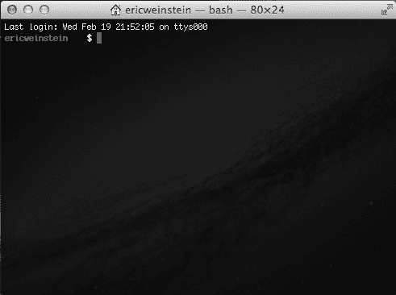
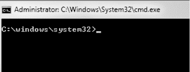
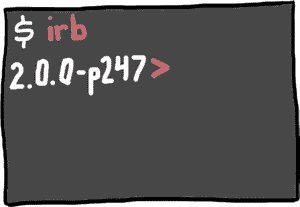

# 第一章：本书内容介绍

你找到了这本书！太棒了。我真的希望它能够到你手中。

想象一下，有人告诉你，他发现了一种新的写作方式。不是一种新的语言，比如法语、日语或精灵语，而是一种全新的*写作方式*，可以让你的故事*真正发生*。如果你描述了一个迷宫，人们可以进入——并迷失在——这个迷宫里。如果你写一个遥远的星球，在那里机器人海盗与忍者巫师展开战斗，那么那个星球就会真实存在。不仅如此，你还可以写出像“`Beep boop shiver me circuits`”这样的对话，或者施展像`ninja_wizard.throw_flaming_ninja_stars`这样的魔法。疯了，对吧？这可能正是你会说的话：这完全疯了，任何想到这一点的人肯定有太多时间在手，太多想象力了。


好吧，事实证明并没有“想象力过多”这种事。那么！想象一下：不仅这种疯狂的新写作方式*是真实的*，而且你可以学会如何做到这一点。你只需要一点练习，就能弄明白如何创造你自己的世界和规则。你将成为主宰，你可以做几乎任何你能想到的事情。不仅如此，如果你做得非常好，人们将从四面八方来体验你创造的世界，并使用你创造的所有神奇事物。

你可以暂时停止想象（至少现在可以）。我告诉你，这是真的！而这本书可以帮助你做到这一点。你现在手中拿着的页面是一本关于*编程语言*的指南，这种语言叫做*Ruby*，它将让你做所有这些事情，你所需要的只有大脑、一台计算机和 Ruby。

*这怎么可能？* 你可能在想。*如果有这么酷而强大的东西存在，我现在肯定早就听说过了。*

这引出了我们接下来的话题。

# 为什么要学习编程（以及为什么是 Ruby）？

当我年轻的时候，学习编程对我来说听起来很无聊。我认为编程和计算机都与数学和逻辑有关——没有空间去发挥创造力或做任何有趣的事情。整天，人们都在告诉我该做什么：去学校、遛狗、看牙医、做作业。我觉得编程大概也只是这些事情的延续，所以我完全避免接触它。相反，我写关于太空旅行、魔法和遥远世界的故事，在那些世界里，不仅有惊人的事情发生，而且我是主角！我现在依然一直写故事，但即使是最棒的故事也会在读者翻完最后一页后结束。尽管你多么希望星际飞船或忍者巫师成为现实，写关于它们的故事并不能让它们发生。所以我确实写了很多故事，但我也不得不去看牙医。

然后发生了一件非常奇怪的事：我决定尝试编程。我发现我原本以为会非常枯燥无味的事情，实际上完全相反——它既具有挑战性又很有趣。突然之间，我开始掌控一切！如果我让电脑做一个拼图游戏，它就做了一个拼图游戏。如果我让它做一个网站，它就做了一个网站。它创造出了我能看到、玩耍和使用的真实事物。就像我多年来一直在写的那些故事，现在可以活生生地呈现出来，而所有这一切只需要这个小小的框框和我能用来与它交流的语言。

的确，一些编程语言很难，一些甚至令人困惑。但 Ruby 不一样：它的设计目的是让你开心——让*你*更容易阅读和理解，而不仅仅是让计算机理解。Ruby 的创建是为了帮助你编写既能被计算机也能被人类理解的故事，因此你不会看到像 `static` 和 `void` 这样的奇怪符号或单词，取而代之的是像 `unless`、`rescue`、`self`，甚至 `begin` 和 `end` 这样的词语，程序看起来几乎像英语一样。

就像任何编程语言一样，学习 Ruby 会帮助你掌握重要的技能，制作很酷的东西，并且感觉到成就感。但最重要的是，你会玩得很*开心*。在编程语言中，我认为 Ruby 是最有趣的。

假设你想让电脑说“Howdy！”。如果你想用其他语言来实现——比如 Java——你可能需要写一些非常复杂的代码，像这样：

```

class Howdy {
  public static void main (String[] args) {
    System.out.println("Howdy!");
  }
}

```

打印一个单词需要这么多代码。在 Ruby 中要做同样的事，你只需要输入：

```

puts "Howdy!"

```

就这样！Ruby 会把字显示在屏幕上。简单吧？Ruby 旨在让你成为一个快乐高效的程序员（哦对了——你现在是程序员了），所以它去掉了很多复杂的*语法*（比如 `{` 和 `;`），让你不必到处写像 `public static void main` 这样的无聊代码。而且由于 Ruby 几乎可以做所有像 Java 这种更复杂语言能够做的事，你将能够更快、更省力地构建出令人惊叹的作品。

让我们开始吧！

# 所有成人请注意：安装 Ruby

好的——这部分你可能需要叫上妈妈、爸爸、爷爷、奶奶、叔叔、阿姨、老师或其他成年人的帮助来在你的电脑上安装 Ruby。Ruby 是免费的，但如果你还没有它，你需要连接互联网来下载。

方向会根据你使用的计算机类型有所不同，所以如果你不确定，可以问一下大人！

如果你使用的是 Windows，请跳转到 Windows 上的安装。

## 在 Mac 或 Linux 上安装

首先，我们来检查一下你是否已经安装了 Ruby。如果你使用的是 Mac 或运行 Linux 的电脑，你可以在*命令行*中检查你安装的 Ruby 版本——这也是你编写 Ruby 程序的地方。

命令行的使用方式可能和你通常通过点击图标和用鼠标移动的方式非常不同，但一旦习惯了，命令行的使用会更快速、更高效。

在 Mac 或 Linux 计算机上，你的命令行是在一个名为*Terminal*的应用程序中。找到并打开你的终端应用程序。你应该会看到类似以下内容：



一旦打开了终端，继续输入以下命令（你不需要输入美元符号——只需输入`ruby -v`部分）并按 ENTER 键：

```

$ **ruby -v**

```

如果 Ruby 已安装，你应该会看到类似以下内容的回应：

```

ruby 2.0.0p247

```

如果你收到这个响应并且包含`2.0.0`，那就万事大吉！跳到成就解锁：Ruby 安装完成！。如果你看到的版本不是`2.0.0`（比如`1.9.3`或`1.8.7`），我们需要将 Ruby 升级到 2.0.0（本书使用的版本）。如果你的计算机非常先进，可能已经安装了 Ruby 2.1——本书中的代码在 Ruby 2.1 上也能正常工作。为了获得最佳效果和最少的错误，建议你使用 Ruby 2.0.0 来运行所有示例。

如果你的计算机显示类似以下内容：

```

-bash: ruby: command not found

```

如果没有显示出来，那说明你的电脑上没有安装 Ruby。别担心，找个成年人帮忙，并跳转到附录 A，那里有详细的逐步说明。我们会在那儿安装 Ruby！安装完毕后，回来继续本章节的内容。

## 在 Windows 上安装

如果你在运行 Windows 的 PC 上，可以通过打开*命令提示符*来检查是否已安装 Ruby。我们在这个示例中使用的是 Windows 7。你可以从开始菜单打开命令提示符，或者通过搜索*cmd.exe*找到它；找到后，双击它打开应用程序。你应该会看到类似以下内容：



你的命令提示符——即`>`前面的部分——可能和我的不同，但没关系！输入**`ruby -v`**，然后按 ENTER 键：

```

> **ruby -v**

```

如果你收到包含`2.0.0`的响应，那就万事大吉！如果你看到的是除了 2.0.0 以外的 Ruby 版本，或者收到这个错误：

```

'ruby' is not recognized as an internal or external command,
operable program or batch file.

```

如果没有安装，我们就需要继续安装 Ruby。让我们开始吧！

### 使用 RubyInstaller

在 Windows 上安装 Ruby 最简单的方法是访问*[`rubyinstaller.org/downloads/`](http://rubyinstaller.org/downloads/)*并下载 Ruby 2.0.0-p481。（如果安装网站上显示的*p*后面的数字稍微高于这里的数字，不用担心；这意味着该版本略微更新，但仍然是 Ruby 2.0，应该能够正常工作。）下载完成后，前往你保存*.exe*文件的文件夹，双击运行安装程序。安装程序会要求你执行以下操作：

1.  当安装程序提示你选择安装时使用的语言时，选择“English”（或者你最熟悉的语言）。

1.  安装程序会要求你接受其许可协议。勾选“我接受许可协议”后点击**下一步**。

1.  安装程序会询问你希望将 Ruby 安装到哪里，默认位置是 `C:\Ruby200`。这很好！你还会看到一个复选框，上面写着“将 Ruby 可执行文件添加到 PATH”。确保勾选了该框，然后点击**安装**。

1.  如果一切顺利，你应该会看到“完成 Ruby 设置向导”屏幕。点击**完成**，然后你就完成了！

安装程序运行完后，关闭命令提示符，重新打开它，并输入 **`ruby -v`**；你应该看到计算机打印出带有 `ruby 2.0.0` 的响应。我的显示是这样的（你的可能略有不同）：

```

ruby 2.0.0p481 (2014-05-08) [i386-mingw32]

```



# 成就解锁：Ruby 安装完成！

完美！现在你已经安装了 Ruby，我们可以开始学习如何使用它了。在下一章中，我们将介绍一些 Ruby 基础知识，并学习如何互动式地使用 Ruby，也就是说，你只需按下 ENTER 键，就能看到 Ruby 执行你的代码。在接下来的章节中，你将通过一系列故事了解 Ruby 语言的细节。毕竟，Ruby 程序就是你为计算机写的故事，而 Ruby 的特点就是编写既适合人类又适合计算机阅读的代码，所以我认为通过故事来展示它的工作原理是非常合适的。我认为这些故事还挺不错的。

你可能会忍不住想，只看本书中的代码并对自己说：“没错，这很有道理！我不需要运行这些代码。”我开始编程时也这么想过，但我错了。学习编写代码的唯一方法就是——写代码，如果你只是阅读这些示例，而从不运行任何 Ruby 代码，那你就错过了很多真正酷的知识。

在我们开始冒险之前，还有一句建议：你可能需要读几遍某些内容，或者多次运行代码才能真正理解。这没关系！学习编程不仅仅是写代码的新方式——它也是一种全新的思维方式。有时候可能会有点难，但我保证只要你坚持下去，你一定能掌握它。相信我，有些人比你聪明和热情的程度都要低，但他们也学会了编程，如果他们能做到，你也能。

# 穿上 Ruby 套鞋

好的，你已经拥有了属于你自己的 Ruby 副本，并且知道 Ruby 是一种你可以用来指示计算机做任何事情的语言。但你可能有很多问题：Ruby 是从哪里来的？是谁创建的，为什么要创建它？用它创造了哪些惊人的东西？Ruby 有什么*好处*？别再疑惑了：我会给你所有这些问题的答案（还有一些额外的答案）。

虽然计算机大约在几百万年前就被发明了（你能识别为计算机的第一批设备是在 1940 年代制造的），但 Ruby 相对较晚才被创造出来，时间是在 1993 年。你可能认为 1993 年也已经是几百万年前的事情了，某种程度上你是对的。那时互联网只有大约一百个网站。没有智能手机。事实上，大多数人的手机是*通过电线连接到墙上的*。那是黑暗的时代。

但在 1990 年代中期的那个古老时代，一个名叫松本行弘（或者朋友们称他为“Matz”）的人正忙于尝试发明未来。他对那些旨在让计算机更容易使用，但却难以理解、阅读、记忆和使用的编程语言感到沮丧。为什么没有一种语言是为了让*人类*使用而设计的，一种清晰、简单，甚至是有趣的语言呢？

Matz 意识到他理想中的编程语言并不存在，于是他创造了它。Matz 曾说：“我希望看到 Ruby 帮助全球的每一位程序员提高生产力，享受编程，并且感到快乐。这是 Ruby 语言的主要目的。”^([1]) 这就是 Ruby 的精髓：一种*有趣*的方式，让你通过大脑和计算机创建游戏、网站，或者任何你能想象的东西。Matz 对他创造的语言产生了如此积极的影响，以至于 Ruby 程序员们有一句话：“Matz 很友好，所以我们也很友好”，简称 MINSWAN。在你学习 Ruby，尤其是教别人时，记得 MINSWAN！

这让我想起：用 Ruby 可以创建许多令人惊叹的东西。在过去的几年里，Ruby 被用于构建像 Twitter 和 Hulu 这样的大型网站、iPhone 应用，甚至是 NASA 的模拟。没错：你可以用 Ruby 来探索太空！每天都有越来越多的人使用 Ruby 来做各种项目，随着 Ruby 社区不断涌现出许多很酷的新工具和想法，你的想象力几乎是你在构建程序时唯一的限制。


这些程序是通过*脚本*编写的。这意味着，你不需要做一个长而乏味的过程叫做*编译*，你只需编写一个简单的 Ruby 程序，运行它，瞧！就完成了！

你的网站已经上线，游戏也在运行，你的宇宙飞船正在向女巫女王发射激光。那么如何运行这些 Ruby 脚本呢？为此，我们需要了解 `ruby` 命令和一个叫做 *IRB* 的小程序。

# 了解 IRB

在 Ruby 中，你可以通过输入 `puts` 命令将内容打印到屏幕上。假设我们想打印出“Ruby 很棒！”。让我们试试—首先我们需要打开 IRB，这是一个用于探索 Ruby 的程序。

如果你使用的是 Mac 或 Linux，打开终端并输入：

```

$ **irb**

```

你只需输入 **`irb`**，不需要输入美元符号；美元符号是我用来表示你在终端中应该输入的内容。

如果你使用的是 Windows，可以通过开始菜单运行 IRB。

一旦你打开了 IRB，应该会看到类似这样的内容：

```

2.0.0p247 :001 >

```

那就是 IRB 的*提示符*，它告诉你 IRB 已经准备好等待你输入内容了。根据你的 Ruby 版本，它可能看起来稍有不同，但应该以 `>` 结尾。

在本书中，我们会将它简化为如下形式：

```

>>

```

每当你看到 `>>` 时，我们就会使用 IRB。如果你在 `>>` 后输入内容（别忘了引号——它们非常重要！）：

```

>> **puts "Ruby is awesome!"**

```

当你按下 ENTER 时，应该会看到 Ruby 打印出：

```

Ruby is awesome!
=> nil

```

太棒了！我们已经写了一个简单的程序，将一些文本打印到屏幕上。你还会看到 Ruby 输出一些关于`nil`的内容。暂时不用担心这个；稍后我会解释这一部分。（如果你迫不及待想了解：基本上，这是 Ruby 告诉你它已经完成打印，没有其他内容要给你了。你将在第七章中学习关于 `nil` 的所有内容。）酷的是，你刚刚写了你人生中的第一个 Ruby 程序！

IRB 会继续提示你，并等待你输入内容，直到你告诉它停止，你可以随时通过输入 `exit`（或直接退出终端程序）来停止。

# 使用文本编辑器和 ruby 命令

写 Ruby 命令的另一种方式是作为脚本，这种方式就是写很多行代码，然后一次性运行，而不是一行一行地执行。要写一个脚本，你需要一个叫做*文本编辑器*的程序。（这*不是*像 Microsoft Word 这样的*文字处理软件*；文字处理软件非常适合写故事或学校报告，但它对于写程序来说是糟糕的选择。）

### 注意

*你可以在这里下载本书中出现的所有脚本：* [`nostarch.com/rubywizardry/`](http://nostarch.com/rubywizardry/)。*但如果你正在学习编程并跟着书中的内容操作，尽量自己输入，而不是直接复制粘贴！你会学到更多。*

## Mac

所有 Mac 都带有一个叫做 TextEdit 的文本编辑器（你可以在 *应用程序* 文件夹中找到它）。它非常简单易用，非常适合写 Ruby 程序。如果你想要一些更有特色的东西，可以从 *[`www.sublimetext.com/2`](http://www.sublimetext.com/2)* 下载一个非常棒的免费文本编辑器，叫做 Sublime Text 2（你需要 OS X 10.6 或更高版本）。

## Linux

Linux 有许多不错的编辑器，但 Gedit 是我最喜欢的之一。你可以从 *[`wiki.gnome.org/Apps/Gedit`](https://wiki.gnome.org/Apps/Gedit)* 下载它。Sublime Text 2 也是 Linux 上非常好的编辑器，可以从 *[`www.sublimetext.com/2`](http://www.sublimetext.com/2)* 获取。

## Windows

正如我刚才提到的，Microsoft Word 对于编写程序来说*并不*理想。而 Notepad++则是一个非常棒的 Windows 免费文本编辑器，你可以从*[`notepad-plus-plus.org/download/v6.6.7.html`](http://notepad-plus-plus.org/download/v6.6.7.html)*下载。你还可以使用 Sublime Text 2 编辑器，网址是*[`www.sublimetext.com/2`](http://www.sublimetext.com/2)*。

## 创建你的第一个脚本

一旦你安装了文本编辑器，打开它并输入你在 IRB 中输入的相同内容：

```

puts "Ruby is awesome!"

```

接下来将这个文件保存为 awesome.rb 到你喜欢的任何文件夹（现在创建一个*ruby*文件夹来存放所有的 Ruby 程序是个好主意）。然后，打开你的终端并切换到保存*awesome.rb*的文件夹。使用`cd`命令可以这样做：

+   在 Mac 或 Linux 上，你的提示符（命令行中`$`左边的部分）看起来像这样：`/Users/`*`username`*` $`。如果你把*awesome.rb*保存在名为*ruby*的文件夹里，可以通过在命令行输入以下命令来进入该文件夹：

    ```

    $ **cd /Users/*username*/ruby**

    ```

    不要输入`$`部分，只需输入其后的内容。另外，不要字面上输入*`username`*；你应该用你在提示符中看到的内容替代它！（我的提示符是`/Users/eweinstein/`，但你的会有所不同。）

+   在 Windows 上，你的提示符（命令行中`>`左边的部分）看起来像这样：`C:\Users\`*`username`*。如果你把*awesome.rb*保存在名为*ruby*的文件夹里，可以通过在命令行输入以下命令来进入该文件夹：

    ```

    > **cd C:\Users\*username*\ruby**

    ```

    不要输入`>`部分，只需输入其后的内容。同样，不要字面上输入*`username`*；你应该用你在提示符中看到的内容替代它。

一旦你进入了*ruby*文件夹，输入：

```

$ **ruby awesome.rb**

```

你应该看到 Ruby 输出：

```

Ruby is awesome!

```

就是这样，你已经成功运行了第一个 Ruby 脚本。做得好！

# 何时使用 IRB，何时使用文本编辑器

如果我们将相同的内容输入到 IRB 和脚本文件中，并且得到相同的输出，那它们之间有什么区别呢？基本上，IRB 每次只允许你尝试一行代码；每按一次 ENTER 键，IRB 就会读取或*评估*你写的代码并给出一个答案。这是一个很好的尝试方式，可以检查代码是否有效。

这意味着每次按下 ENTER 键时，Ruby 会中断你并返回计算每一行的结果，像这样：

```

>> **2 + 5**
=> 7
>> **24 * 10**
=> 240
>> **'Hi ' + 'there!'**
=> "Hi there!"

```

粗体中的代码是你输入的内容；其下是你按下 ENTER 键后 IRB 返回的响应。我们不总是需要这么多信息！有时候，我们只想知道所有工作结果的最终输出。为了实现这一点，我们可以将相同的代码写成脚本。只需打开之前的编辑器（例如，如果你是 Mac 用户，使用 TextEdit；如果是 Linux 用户，使用 Gedit；或者在 Windows 上使用 Notepad++），然后输入以下内容：

```

**puts 2 + 5**
**puts 24 * 10**
**puts 'Hi ' + 'there!'**

```

然后将脚本保存为 script_example.rb，或者任何你喜欢的名称，只要以*.rb*结尾（但不允许有空格！），使用`cd`切换到保存脚本的目录，最后通过`ruby`命令运行脚本：

```

$ **ruby script_example.rb**

```

这样，我们就能只输出我们想要的信息，而无需逐行输入：

```

7
240
Hi there!

```

这样不仅更容易阅读，而且我们现在可以通过**`ruby script_example.rb`**反复运行脚本，进行计算，而不必每次都重新输入所有命令。我们可以永久保存程序，修改它，并在之后继续构建。

# 本书中使用的提示符

在整本书中，我们会交替使用 IRB 来运行小段代码和使用脚本来运行较长的代码。每当你看到 IRB 提示符，它看起来是这样的：

```

>>

```

这意味着你应该使用 IRB 来运行代码；当你看不到它时，意味着你应该在文本编辑器中输入脚本并使用`ruby`命令来运行。下面是一个 IRB 示例：

```

>> **2 + 2**
=> 4

```

让我们花点时间来讲解这段代码的每一部分。`>>`部分表示，“我们在 IRB 中，IRB 是一个理解 Ruby 命令的程序。”记住，你不需要输入`>>`；这只是让你知道我们正在使用 IRB。书中的`>>`代表你自己电脑上的 IRB 提示符。

以**`2 + 2`**为例，这是你需要输入的命令——完全输入这些行，然后按 ENTER。当你看到 IRB 提示符下有几行加粗的代码时，只需逐行输入，每输入一行按一次 ENTER。

但是这段代码的第二行以`=>`开头。这是 IRB 在你按下 ENTER 后返回的结果。（这意味着你也不需要输入这些部分。）如果你在输入命令后遇到错误，而不是看到书中展示的结果，确保你输入的 Ruby 命令*完全正确*。计算机非常愚蠢：它们只会按你*说*的做，而不一定是你*想要*的！

书中的其他程序较长，因此你希望能够修改或改进它们并修正错误。这意味着你需要用文本编辑器来编写它们。我会在每个示例中提醒你该使用什么编辑器。但记住，当你看不见 IRB 的`>>`时，你就需要使用文本编辑器。

一旦我们进入故事，你会听到关于*计算装置*的描述。这些是与你的计算机类似的虚拟计算机版本，每当你在故事中看到角色在计算装置上运行 Ruby 时，他们实际上是在使用 IRB 和 Ruby，所以你也可以在家自己跟着操作。

最后，本书后面的某些脚本会比较长。我会把它们分成多个部分并逐个讲解。你会看到像这样的编号球：

➊ ➋ ➌ ➍ ➎

我会在文本中引用这些数字，这样你就可以一步步地跟着每个示例操作。你不需要把这些输入到电脑中；它们只是供参考！

再次提醒，如果你忘记了 IRB 和 Ruby 脚本提示符之间的区别，不用担心——我会在过程中提醒你！

# 进入闪亮的红色远方

不用担心理解你刚刚在这些例子中看到的所有代码。我们才刚开始学习 Ruby，我保证在接下来的几个章节中，我们将深入探讨它的所有秘密。我们将讲解如何处理文本和数字，如何帮助程序根据用户提供的信息做出决策，如何创建自己的 Ruby 命令，如何编写可以连接到互联网网站的脚本，等等。

我之前说过，编写 Ruby 更像是写故事，而不是为机器编写指令，因此我将通过故事来教你 Ruby 是如何工作的。在接下来的页面中，我将介绍一些角色，他们将帮助解释你想了解的 Ruby 知识。有些将是 Ruby 编程专家，有些像你一样是 Ruby 新手。许多人会遇到各种各样他们认为无法解决的问题，但通过一点努力和一些 Ruby 魔法，他们会发现这些问题并不像看起来那么严重。说到魔法，接下来也会有一点——一位国王、一位女王、一座城堡、一片被施了魔法（可能稍微有些鬼气）的森林、一位流浪的吟游诗人、一些巫师和魔法师、几条龙，当然，还有几位像你一样的小孩，他们迷失在这个疯狂的王国中，只能开始探索……


* * *

^([1]) Google 技术讲座，2008 年 2 月 (*[`www.youtube.com/watch?v=oEkJvvGEtB4`](https://www.youtube.com/watch?v=oEkJvvGEtB4)*).
