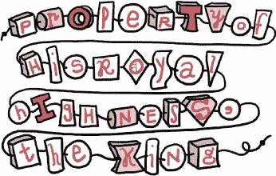
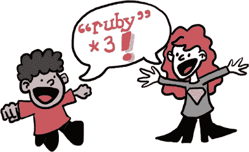

# 第二章：国王与他的绳子

# 一根短绳

国王心情极差。简直是*非常糟糕*，那种会对猫大喊大叫、把雪花球从三楼窗户扔出去的心情。如果你看到他愤怒地朝你走来，你会立刻换到街对面。如果他是你爸爸，你会一年到头给圣诞老人写信，要求换一个爸爸。真的，对每个人来说，都是资本字母*B*的坏消息。

事情是这样的，国王今天早晨丢失了他最心爱的物品，正好发生在他吃完平常的干燕麦后，准备进行他那次快步的午后散步之前。他翻遍了他的宫殿（字面意义上：国王有很多钱，也有很多仆人），但始终没有找到。当斯卡雷特和鲁本找到他时，他正坐在一把由纯金做成的软垫扶手椅上，悲伤得泪流满面。


“它看起来怎么样？”斯卡雷特问。

“*什么*看起来像什么？”国王问道，边说边让自己的咸泪顺着精心打理的胡须流到嘴里。

“你丢失的东西，”鲁本说。

“像一根绳子一样！”国王说。“因为那就是它：一根绳子，两端打着结，用来固定我的小物件和装饰品。这根绳子上有几个珠子，拼出了‘国王陛下的财产’字样，就像这样：

```

'Property of His Royal Highness, the King'

```

“一串字母，”鲁本说。

“更像是一串*字符*，”国王说。“每个字母都非常独特。例如，*K*是个弯曲的家伙。别让我再提*P*了——”



但鲁本和斯卡雷特并没有听。他们已经开始到处寻找国王丢失的绳子。

“你的绳子会不会掉进这个神秘的管道里？”斯卡雷特问，指着一个冒着黑烟的金属管道，管道上用白色粉笔写着*神秘管道*字样。

“不行，”国王说。“那神秘的管道顶部极其狭窄，像我这么长的绳子根本塞不进去。”

“你的绳子有多长？”鲁本问。

“我不确定，”国王说。“我想我们可以数一数所有字符，这样就知道了。”（相信我，这会非常无聊。）


“那样太无聊了，”斯卡雷特说。“我觉得有更好的办法。”她走到房间的一角，吹去一台非常古老的计算装置上的灰尘，小心翼翼地在它的小绿屏幕上输入了以下内容：

```

>> **'Property of His Royal Highness, the King'.length**
=> 40

```

“好外套！”国王说。“没错！我现在想起来了——我的绳子正好是 40 个字符长。可是你们怎么做到的？”

“露比有很多类似的好办法，”斯卡雷特说。“这是另一个。”

```

>> **'Property of His Royal Highness, the King'.reverse**
=> "gniK eht ,ssenhgiH layoR siH fo ytreporP"

```

国王点了点头。“是的，差不多就是我每次洗完澡后挂起来晾干时，它在镜子里看起来的样子。”

与此同时，Ruben 正在用他在神秘管道旁找到的粉笔数国王字符串中的字符数。“等一下，”他说，“我数到 42 个字符，包括两端的引号。”

国王像只肥胖的小猎犬一样哼了一声。“你不能把那些算上！”他说，“那些是两端的小结，用来包含字符！你只计算字符，不算引号。”

“这正是 Ruby 所做的，”Scarlet 解释道，“但你必须给你的字符串加上引号，否则 Ruby 会认为你在试图使用一个*变量*。”

# 关于变量的更多内容

相信我，这个让国王彻底困惑了。由于他不像你那样聪明，我就让 Ruben 和 Scarlet 花很长时间给他解释变量的概念，同时我给你解释一下。

一个 Ruby 变量只是一个名字（没有引号！），你可以将其赋给一个*值*（这是某种信息，比如构成国王字符串的单词）。一种值是字符串；另一种值是*数字*，你已经见过当 Ruby 告诉你国王的字符串长度是 40 时使用的数字。

你可以像这样创建一个变量：

```

>> **kings_string = 'A string fit for a king'**
>> **wiener_dog_weight = 22**

```

等号告诉 Ruby，“嘿！把右边的这个值保存到左边的这个名字下。”这意味着你以后可以输入变量名，直接得到对应的值：

```

>> **wiener_dog_weight**
=> 22

```

这在你试图追踪你那只走失的小宠物（我们叫它 Smalls）以及它不断变化的体重时，可能会派上用场：

```

>> **smalls_weight = 22**
=> 22
>> **pounds_lost = 4**
=> 4
>> **smalls_new_weight = smalls_weight - pounds_lost**
=> 18

```


不用担心 22 和 4 被重复返回给你；Ruby 只是想帮忙。Ruby 总是期望变量名在左边，值在右边，所以一定要小心不要弄错顺序！

你还会注意到我在变量名中使用了 `_`（称为*下划线*）而不是空格。Ruby 不允许名字中有空格，因此最好使用 `_` 来代替。

听起来国王还在适应字符串（想象一下我把耳朵贴在他书房的厚橡木门上），所以我会再给你介绍 Ruby 的另一点魔法。当你看到像这样的代码时：

```

>> **'Property of His Royal Highness, the King'.reverse**

```

它意味着你在*调用*字符串上的 `reverse` *方法*。当我们说我们在“调用一个方法”时，我们的意思是我们在请求 Ruby 执行一个命令：“嘿，Ruby！请反转这个字符串！”我稍后会详细讲解方法，但现在你可以把它们看作是作用于特定 Ruby 对象的命令。例如，字符串可以被反转，但数字不行：

```

>> **"18".reverse**
=> "81"
>> **18.reverse**
=> NoMethodError: undefined method `reverse' for 18:Fixnum

```

`NoMethodError`！？那是 Ruby 在说，“哇，哇，*哇*。我知道如何对字符串执行 `reverse`，但是我不知道如何对数字执行 `reverse`！”随着练习，你会了解到哪些方法适用于哪些 Ruby 对象。以作者的名誉保证（我从来不是童子军）。


# Ruby 运算符

“让我看看我理解对了没有，”国王说。“变量是 Ruby 值的名字，比如字符串和数字。它们没有引号，也不能有空格。我可以用等号将一个变量赋值给一个值，然后我可以用变量的名字来取回这个值。”

“完全正确，”鲁本说。

“当我看到一个对象后面跟着一个点，再跟着一个命令时，那意味着我正在对这个对象使用这个命令，”国王说。

“正是如此，”斯卡雷特说。

“你提到过我不能对一个数字使用`reverse`，”国王说。“这很有道理。那么，我*能*对数字做些什么呢？”

“各种各样的操作，”鲁本说。他推开斯卡雷特，走到计算设备前打字：

```

>> **100 + 17**
=> 117
>> **50 - 20**
=> 30
>> **10 * 10**
=> 100
>> **40 / 20**
=> 2

```

“是的，是的，”国王说，“我可以用 `+` 把它们加在一起，用 `-` 减去，用 `*` 乘以，用 `/` 除以。”

“你们可能见过 ÷ 作为除法符号，”鲁本继续说，“但是在代码中我们可以直接使用 `/`。比如，4 ÷ 2 会变成 `4 / 2`。”

“但是我能做些什么*有趣*的事情呢？”国王抱怨道。

“那这个呢？”鲁本问道，一边继续打字。

```

>> **22.next**
=> 23
>> **22.pred**
=> 21

```

“啊哈！”国王说，“*现在*你说到点子上了。`next` 一定是告诉 Ruby 计算 *下一个* 数字，而 `pred` 是请求 Ruby 返回它的 *前驱*，即紧跟在它之前的数字。”

“正如雨水一样，”鲁本说。

“下雨！”国王惊呼道，猛地跳起，强劲到把他那把纯金的椅子给撞翻了。他以一个对这个年纪来说几乎不可能的速度跑出房间，鲁本和斯卡雷特紧跟其后。

在宫殿里穿行了好几分钟，经过一片混乱的内容（毕竟国王把整个宫殿弄得颠倒了），鲁本和斯卡雷特在国王的主浴室赶上了他。他又开始哭泣，不过这次是出于喜悦，而他手中紧紧握着的正是——他的字符串！

“下雨提醒我，我在吃完焦干燕麦早餐后洗了个清爽的澡！”国王呜咽着说。“然后它就在这里，挂着晾干，正如我离开时那样。我真是无以为报！”



“小心！”斯卡雷特说，“你的字符串还是有点湿，看看上面滑动的珠子。”

国王大声吸了吸鼻子，检查了他的字符串，结果字符串上的字符果然在四处滑动。国王想了想，然后将字符串的两端打了双结，以防字符滑掉：

```

"Property of His Royal Highness, the King"

```

“双引号！”斯卡雷特说，“你能在 Ruby 字符串中使用它们吗？”

“当然，”鲁本说，“单引号和双引号字符串几乎完全相同。”他打开国王的药柜，露出一台稍微不那么旧的计算设备，然后打出以下内容：

```

>> **double_quotes = "A string's the thing"**
=> "A string's the thing"
>> **single_quotes = 'for a springly King'** 
=> "for a springly King"

```

“看见了吗？”鲁本说。“即使我们输入单引号，Ruby 也会回显双引号。两者都可以用！”

“虽然我听说过，”国王说，“你可以在双引号字符串中放入比单引号字符串更复杂的元素和小饰品。”

“那是真的，”鲁本说，“但我们会在适当的时候讲到那个。”然后他用金镶边的*咔哒*一声关上了国王的药箱。

# 你的小项目

现在你对字符串、数字和变量有了一些了解，让我们做一个小项目：编写一个程序，反射并回显国王的字符串。*反射* 是指将某物倒过来，所以你可能已经猜到我们会对一些字符串进行 `reverse` 操作。另一方面，*回显* 是指将某物重复几次，我们很快就会看到一种快速简便地重复字符串的方法。你会为它的简洁与易用感动得泪流满面，甚至会把这本书的页面撕下来擦干眼泪。

### 注意

*对于一些较长的代码示例，我们将编写 Ruby 脚本，而不是使用 IRB！当你看到代码上方有文件名并用斜体显示时，比如* kings_string.rb *用于下一个示例，这意味着你可以将代码写入一个文件，文件名按给定名称，并使用 `ruby` 命令运行它。如果你不记得怎么做，或者需要帮助，回头看看第一章，或者请最近的成年人帮忙。你可以在* [`nostarch.com/rubywizardry/`](http://nostarch.com/rubywizardry/) *下载本书中所有的脚本。*（但记住，如果你在学习编程，尽量自己敲代码，而不是仅仅阅读和运行代码！）*

接下来创建一个新文件，名为 kings_string.rb。然后，打开文件并输入以下内容。我们将编写一个简短的程序，展示通过赋值变量可以做的酷事，并展示 Ruby 如何处理字符串。

kings_string.rb

```

kings_string = "Property of His Royal Highness, the King"
string_reflection = kings_string.reverse
times_to_echo = 3
string_echo = kings_string * times_to_echo
puts kings_string
puts string_reflection
puts string_echo

```

前四行是在赋值变量。你可以通过等号看出来。

特别是第二行，非常酷：它定义了一个变量来保存 `kings_string`，但因为 `reverse` 方法会将字符串倒过来，所以 `string_reflection` 实际上会是 `"gniK eht ,ssenhgiH layoR siH fo ytreporP"`！

你可能还在想第四行代码是怎么回事：

```

string_echo = kings_string * times_to_echo

```

你想得对！`*` 是 Ruby 中表示“乘以”的符号。这意味着 `2 * 2` 等于 4，`13 * 379` 等于 4,927，依此类推。*但是等等！*你可能会进一步问，*怎么能将一个字符串（它只是一些字母）与数字相乘呢？* 答案是 Ruby 是个非常聪明的机器人。当它看到类似这样的内容时：

```

>> **"Hello!" * 3**

```

它是这样做的：

```

=> "Hello!Hello!Hello!"

```

所以这就是我们如何生成回显：`kings_string * times_to_echo` 会变成 `"Property of His Royal Highness, the King"` 重复三次！

`puts` 是 “put string” 的缩写，就像是“把那个字符串放到我能看到的地方”。正如我们所见，它只是将文本打印到屏幕上。你觉得运行程序时会看到什么？保存并关闭文件，然后使用 **`ruby kings_string.rb`** 运行它。你应该会看到如下输出：

```

Property of His Royal Highness, the King
gniK eht ,ssenhgiH layoR siH fo ytreporP
Property of His Royal Highness, the KingProperty of His Royal
Highness, the KingProperty of His Royal Highness, the King

```

干得好！

# 你知道这个！

让我们花点时间回顾一下你在过去几页中已经掌握的内容。

我们谈到了*字符串*，它们只是用引号括起来的单词或短语（单引号或双引号都可以）。实际上，由于组成字符串的元素不一定只能是字母——它们可以包括标点符号甚至数字，只要整个字符串都在引号之间——所以我们说字符串由*字符*组成，而不是字母。你可以把字符串看作是由字符组成的*字面*字符串，每个端点都用单引号或双引号系住。（你可以选择单引号或双引号，但两端必须匹配：`"string'` 或 `'string"` 是不行的！）

你还看到字符串有一些方便的*方法*，比如 `length` 和 `reverse`，这些方法是 Ruby 知道如何与字符串一起使用的命令。你总是先写下你想要操作的对象，后面跟一个点，再后面是命令，就像这样：

```

"gadzooks".length

```

我们稍微谈了一下关于*数字*的内容，这些数字是 Ruby 中的值，它们的工作方式和你想象的现实生活中的数字完全一样。数字有自己独特的方法，包括 `next`（用于进入下一个数字）和 `pred`（用于进入前一个数字）：

```

>> **4.next**
=> 5

```

最后，我们谈到了*变量*，以及如何使用它们为 Ruby 的值起特殊的名字，例如 `42` 或 `"chunky bacon"`。你总是将变量名（不能包含空格）写在左边，后面跟一个等号，再后面是值：

```

>> **bacon_consistency = "chunky"**
=> "chunky"
>> **number_of_bacon_strips = 3**
=> 3

```

你只需输入名称，就可以拿回这个值：

```

>> **bacon_consistency**
=> "chunky"

```

根据你所知道的，如何在我们之前处理的那个小项目中进一步推进？例如，如果我们用 `next` 或 `pred` 改变了 `times_to_echo` 的数值会怎样？如果我们在存储在 `kings_string` 中的句子末尾加一个空格会发生什么？（提示：这可能会让我们的输出看起来更好。但不要直接在变量名 `kings_string` 上加空格——记住，Ruby 变量名不能有空格！）如果我们尝试用 `+` 把几个不同的字符串拼接在一起，而不是用数字乘它们，会发生什么？至于早餐中的“chunky bacon”，到底是什么东西？
