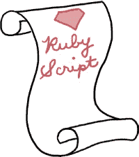
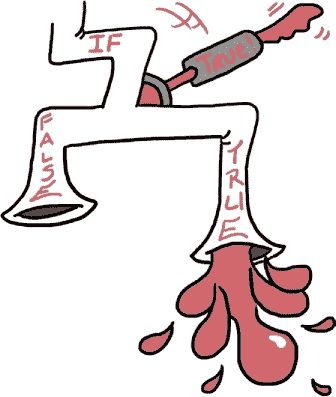

# 第三章 管道梦想

# 学徒水管工的困境

国王、斯嘉丽和鲁本从皇家浴室返回，国王高兴地把他的字符串像一只大胡子猫一样挥舞着。

“为了一个淋浴里的字符串搞得这么复杂！”斯嘉丽对国王说。“希望你现在感觉好些了。”

“做很多事，”国王说着，转动着他字符串上的珠子和小饰品。

“说到水管，”鲁本说，“你听到那个声音了吗？”他们转过拐角重新进入国王的书房时，发现自己已经脚踝深陷在一个迷你湖中。到处都是水，水啊水！

“神秘管道！”国王喊道。“看！”他指着正在剧烈晃动并从狭窄顶部喷涌出大量水的神秘管道。


“看看这个 Flowmatic 某某东西！”国王说。

“这不是很形象，”鲁本说。

“不，那就是它的名字，”国王说。“Flowmatic 某某东西™。”

“找到了！”斯嘉丽说，抓起一个背面标有“陛下的 Flowmatic 某某东西™”的方形金属盒子。她撬开 Flowmatic 某某东西的盖子，发现里面有一个微型计算装置，上面显示着发光的`>>` IRB 提示符。

“我该做什么？”斯嘉丽问国王。

“我好像记得这个程序使用了`flowmatic_on`变量，”国王说。“试着关闭它。”他停顿了一下。“嘿！我想起了我们学过的关于变量的知识！”

斯嘉丽给国王竖起大拇指，输入命令并按下 ENTER：

```

>> **flowmatic_on = false**
=> false

```

神秘管道颤抖了一下，冒出了几声喷溅声，水流停止了。

“呼！”鲁本说。“干得好！”他从斯嘉丽肩膀上探头看着屏幕。“你是怎么做到的？`false`是什么？它不可能是字符串，那里没有引号。它也是一个变量吗？”

“不行！”斯嘉丽说。“但它像数字、字符串和变量一样内置在 Ruby 里。它叫做*布尔值*，其实有两个：`true`和`false`。看起来神秘管道在`flowmatic_on`为`true`时工作，`false`时停止。”

“那么，`flowmatic_on true`之前是怎么回事？”鲁本问道。

“我不知道！”斯嘉丽说。“一定是某个人或某物创建了那个变量。”

“嗯，水不再漏了，”国王说，“但是问题并没有完全解决。它应该在`flowmatic_on`为`true`时也能正常工作！毕竟，Flowmatic 负责向城堡提供所有水源；没有它，就没有皇家浴室、皇家刷牙，甚至没有皇家水气球大战！我们需要让神秘管道和它的 Flowmatic 保持开启状态，而且不漏水。”

“那这个呢？”鲁本指着计算装置上 Flowmatic 的开/关控制下方的一行说。

```

Warning! flow_rate is above 50!

```

“水一定流进神秘管道太快了，”斯嘉丽说。

“天哪！”国王说。“流量一定得超过 50！”

“我们该怎么办？”鲁本问道。

国王想了想。“我认为我们最好做些在这种情况下总该做的事情，”他说。“我们应该请专业人士来处理。这个情况下，是皇家管道工！”

# 编写和运行 Ruby 脚本

当国王去叫皇家管道工时，我趁机再给你讲讲 Ruby 的一些魔法。别担心，不会占用你太多时间。



你看，其实你并不总是需要在 IRB 中逐行输入命令。正如在第一章中提到的，你可以写一大段 Ruby 代码并将其保存为 Ruby *脚本*。然后，你可以在 IRB 中运行这个 Ruby 脚本！（这就像在终端中使用 `ruby` 命令运行你的代码一样，就像我们在第一章中所做的那样，只是 IRB 会一直保持开启。）只需在包含 Ruby 脚本的文件夹中启动 IRB，然后输入 `load 'filename.rb'`。这和将文件中的所有内容逐行输入到 IRB 中完全相同——但这样做便于修改和重新尝试！

我们来试试这个小例子。将以下代码输入到你最喜欢的文本编辑器中，并保存为名为 flow.rb 的文件。（如果你需要提醒如何操作，可以回顾一下第一章，不用担心——我们会在短短的时间内讲解新的 `#{}` 语法。）

flow.rb

```

flow_rate = 100
puts "The flow rate is currently #{flow_rate}."
flow_rate = 100 / 2
puts "Now the flow rate is #{flow_rate}!"

```

如果你打开 IRB，输入 **`load 'flow.rb'`**，然后按回车键，你应该会看到：

```

>> **load 'flow.rb'**
The flow rate is currently 100.
Now the flow rate is 50!
=> true

```

让我们逐行解析一下。

首先，`load 'flow.rb'`（你在这里使用单引号或双引号都可以）告诉 Ruby 查找当前目录下的一个名为 *flow.rb* 的文件（*目录*只是你计算机中文件夹的另一个名称）。如果 Ruby 找到 *flow.rb* 且文件中的代码没有问题，Ruby 会像你逐行输入代码到 IRB 一样运行它。接下来，你知道 `flow_rate = 100` 和 `puts` 是做什么的：前者将 `flow_rate` 变量设置为值 `100`，而 `puts` 打印出你给它的字符串。（你还会看到一个额外的 `=> true`，这表示加载文件成功。）但你可能想知道：这个看起来很奇怪的 `#{flow_rate}` 是什么？

好吧，字符串和变量是不同的东西，但有时你可能想把它们结合起来——比如，打印出一个显示不同 `flow_rate` 变量值的消息。Ruby 让我们可以使用 `#{}` 来直接把变量的值插入到字符串中，而不必每次想用它时都查找变量值并手动输入。所以，当你有以下代码时：

```

flow_rate = 100
puts "The flow rate is currently #{flow_rate}."

```

你得到：

```

The flow rate is currently 100.

```

还有一件事：记得在第二章中，鲁本说过带双引号（`"`)的字符串和带单引号（`'`）的字符串略有不同吗？嗯，`#{}`魔法（如果你想显得很高大上，这叫做*字符串插值*）只能在双引号字符串中使用；单引号字符串无法实现这一点。（这正是国王在第二章中所说的，你可以在双引号字符串上做比在单引号字符串上更多复杂操作的意思。）

这就是我想给你们看的所有内容。顺便说一句，提到国王……

# 他的威严的流量控制

“喂？”国王说。（他已经等待了一段时间。）“这是皇家水管工吗？”

“咳！咳！咳！”皇家水管工说。


“哎呀，”国王说。“听起来皇家水管工好像得了重度的咳嗽症。”

“咳？”斯嘉丽说。

“咳！”皇家水管工说。

“有点像感冒，但更咳嗽和喘不过气，”国王说。“皇家水管工，能派你的学徒下来帮我们处理那个神秘的管道吗？它已经溢出来好久了。”

“咳！”她说，挂了电话。

“我想这是个肯定的回答，”国王说。

“我也这么觉得，”鲁本说。“看起来学徒已经在这里了！”

皇家水管工的学徒提着一个大红色工具箱走进国王的书房。鲁本和斯嘉丽发现他戴着深色的矩形太阳镜和浓密的黑胡子，难以读出他的表情。*哈尔多*的名字用红色线绣在他的工作服前面。

“哈尔多！”国王说。

“就是我，”哈尔多说。“我听说那个神秘的管道坏了。”

“当然，”斯嘉丽说。“你能帮我们修好吗？”


“我想是的，”哈尔多说，“但我只是个学徒，所以可能需要一些时间。我们来看看吧。”他说着走到 Flowmatic 某某机器前，盯着屏幕看了片刻。“我好像记得这里面有个*instructions.rb*文件。”他输入了`load 'instructions.rb'`，然后出现了以下内容：

```

     |~~                                            |~~
     |                                              |
    :$: HIS MAJESTY'S FLOWMATIC SOMETHING-OR-OTHER :$:
     `'''''''''''''''''''''''''''''''''''''''''''''`
                   ~= Instructions =~

     1\. Water should flow if flowmatic_on is true and
        water_available is true.
     2\. If flowmatic_on is false, the message
        "Flowmatic is off!" should appear.
     3\. If water_available is false, the message
        "No water!" should appear.
     4\. If the flow_rate is above 50, the warning
        "Warning! flow_rate is above 50!" should
        appear, along with the current flow rate.
     5\. If the flow_rate is below 50, the warning
        "Warning! flow_rate is below 50!" should
        appear, along with the current flow rate.
=> true

```

“哈！”鲁本说。“问题是，如果流量太高或太低，我们只能收到消息。Ruby 不会自动修正流量，因此我们可能会遭遇洪水。”

“我们能修好这个！”斯嘉丽说。“我们写一个 Ruby 程序来检查流量。如果流量太高，我们就降低它，如果流量太低，我们就增加它！”

哈尔多挠了挠头。“嗯，问题是，”他说。“我想我知道我们需要做什么，但我还没学够 Ruby，无法输入正确的命令。不过，如果你们小孩能帮我一把，我觉得我们就能搞定了。”

“没问题，”鲁本说，“让一个 Ruby 程序根据不同条件执行不同操作是斯嘉丽和我非常熟悉的事情。”

“这叫做 *控制流*，”斯嘉丽说，“其实一点也不难。看看吧！”她在计算装置上的文本编辑器中打开了一个新文件，将其保存为 flowmatic_rules.rb，并输入了以下内容：

```

flowmatic_on = true
water_available = true
if flowmatic_on && water_available
  flow_rate = 50
end

```

“我完全不懂了，”国王说。

“我们慢慢来，”斯嘉丽说，“首先，我们将 `flowmatic_on` 和 `water_available` 这两个变量赋值为 `true`。然后，在第二行，我们有 `if`，它是一个 *条件语句*。它的意思是：*如果*后面的代码是 `true`，那么在 `end` 之前的所有代码都会被执行。”

“`&&` 只是 Ruby 表达 *and* 的方式，”鲁本说，“我们已经知道第四行将流量设置为 50，所以整个意思是：‘如果 `flowmatic_on` 为 `true` 且 `water_available` 也为 `true`，这个程序就会将 `flow_rate` 变量设为 `50`。`end` 只是告诉 Ruby，如果我们没有将流量设置为 50，就什么都不做——至少现在不做。”

“我明白了，”哈尔多说，“这只是第一条指令！干得好。不过如果 Flowmatic *没有*开启，或者没有水可用会怎么样？”

“嗯，暂时什么都没有，”鲁本说，“不过我们可以解决这个问题。”他伸手过去，在文本编辑器中修改了*flowmatic_rules.rb*代码：

```

  flowmatic_on = true
  water_available = true
➊ if flowmatic_on && water_available
    flow_rate = 50
➋ elsif !flowmatic_on
    puts "Flowmatic is off!"
➌ else
    puts "No water!"
  end

```

“我想我开始明白了，”国王说，“➊ 就是我们之前所做的。然后在 ➋ 处，我们尝试了一些新的东西：`elsif`！`elsif`是不是意味着‘如果第一部分没有执行，就试试下一步’？”

“正是这样，”斯嘉丽说，“别担心奇怪的拼写！那只是‘else, if’的简写方式。而 `!` 只是 Ruby 表达 *not* 的方式。所以如果 `flowmatic_on` 是 `false`，那么 `!flowmatic_on` 就是 `true`，反之亦然。”

“而且既然只剩下一个条件——如果 Flowmatic *开启* 了但没有水——程序就在 ➌ 处用 `else` 输出‘没有水！’的信息，这意味着：‘如果没有运行其他代码，那就运行后面的代码，’”鲁本说。



“而且这一切后面都会跟着一个 `end`，就像之前一样，”斯嘉丽说。

“你需要在 `if`、`elsif` 和 `else` 后面的行前加两个空格吗？”国王问。

“*缩进*？”斯嘉丽问。“不是的，但看起来确实挺不错。”

“这就处理了前面的三条指令！”哈尔多说，“我想我已经掌握了。看看我能不能用 Ruby 重写最后两条指令。”他在自己的 *flowmatic_rules.rb* 脚本中添加了以下几行：

```

➍ if flow_rate > 50
    puts "Warning! flow_rate is above 50! It's #{flow_rate}."
    flow_rate = 50
    puts "The flow_rate's been reset to #{flow_rate}."
➎ elsif flow_rate < 50
    puts "Warning! flow_rate is below 50! It's #{flow_rate}."
    flow_rate = 50
    puts "The flow_rate's been reset to #{flow_rate}."
➏ else
    puts "The flow_rate is #{flow_rate} (thank goodness)."
  end

```

“好吧，*这个*我明白了，”国王说。“`>`表示*大于*，`<`表示*小于*，所以➍处的第一部分表示：如果流量大于 50，我们显示一个‘太高’的警告，然后将变量`flow_rate`赋值为 50。程序接着使用字符串插值输出新的`flow_rate`值，就像我们之前看到的那样。”

“但是在➎处，程序检查`flow_rate`是否小于 50。如果是的话，我们会显示一个‘太低’的警告，并将其重置为 50。

“在➏处，我们有`else`。如果`flow_rate`既不大于 50 也不小于 50，那意味着它*恰好*是 50。所以，我们只需显示流量值，而不更改变量，并用`puts`输出它（谢天谢地）。”国王微笑着，显然为自己感到高兴。

“完美！”Ruben 说。“你还可以使用`<=`表示*小于或等于*，`>=`表示*大于或等于*，但我觉得我们现在还不需要这些。”

# 用更复杂的逻辑运算符改进 flow_rate.rb

Ruben 研究了屏幕片刻。“你知道，”他说，“我觉得你可以用更少的代码来替换从➍到➏的部分。看看这个！”

```

if flow_rate < 50 || flow_rate > 50
  puts "Warning! flow_rate is not 50! It's #{flow_rate}."
  flow_rate = 50
  puts "The flow_rate's been reset to #{flow_rate}."
else
  puts "The flow_rate is #{flow_rate} (thank goodness)."
end

```

“那两个竖线是什么意思？”Haldo 问。“我以前没见过这些。”

“就像`&&`表示*与*，`!`表示*不是*，`||`表示*或*，”Scarlet 说。“所以我们的意思是，‘如果流量小于 50*或*大于 50，显示警告并重置为 50；否则，直接告诉我们它是 50（谢天谢地）。’

“效果相当不错，”她接着说，“不过我们可以做得更简洁。”

```

if flow_rate != 50
  puts "Warning! flow_rate is not 50! It's #{flow_rate}."
  flow_rate = 50
  puts "The flow_rate's been reset to #{flow_rate}."
else
  puts "The flow_rate is #{flow_rate} (thank goodness)."
end

```

“我知道`!`表示*不是*，”国王说，“那么可以猜测`!=`表示*不等于*吗？”

“不仅是合理的，还是正确的！”Ruben 说。“你可以用`!=`表示*不等于*，用`==`表示*等于*。但要*非常*小心，不要混淆`=`和`==`。第一个是用来给变量赋值的，而第二个是用来检查两个事物是否相等的。”

“这太神奇了，”Haldo 说。“我觉得我真的掌握了 Ruby 的控制流了。还有什么我应该知道的吗？”

“还有一件事，”Scarlet 说。“因为程序中经常出现`if`后跟负条件的情况，Ruby 想出了另一种写法。你不必每次都输入类似以下内容：

```

if flow_rate != 50
  puts "Warning! flow_rate is not 50! It's #{flow_rate}."
end

```

你可以改为输入`unless`：

```

unless flow_rate == 50
  puts "Warning! flow_rate is not 50! It's #{flow_rate}."
end

```

“这两个例子完全一样，”Scarlet 结束道。“但如果你有`elsif`和`else`，有时候直接使用`if`看起来会更美观。”

当 Scarlet 在说话时，Haldo 保存了他们完成的*flowmatic_rules.rb*文件，并在 IRB 提示符下输入了**`load 'flowmatic_rules.rb'`**。当他按下 ENTER 键时，神秘的管道震动了一下，随后开始轻微地震动。Ruben 和 Scarlet 听到了水流穿过城堡墙壁的声音，哪里也没有水溢出。

“好极了！”国王说。“我真是太感谢你们了！不过我还是有个疑问，”他接着说，“最初是怎么把流量设置为 100 的？”

“这个我不太确定，”哈尔多说。“可能是城堡里有另一个 Ruby 程序，访问了`flow_rate`变量并改变了它。”他翻开了自己的红色工具箱，拿出了一个手电筒。“我马上调查一下，”他说。

“你不打算摘掉太阳镜吗？”斯卡利特问道。

“不需要，”哈尔多说，然后他打开了与神秘管道同一侧墙上的一扇小门，消失在城堡的深处，边走边吹着口哨。

# 一个更大的项目给你

在过去的几页中，你已经学到了很多，现在是时候将你新学到的知识付诸实践了！(别担心，我对你充满信心。) 哈尔多——现在是由于鲁本和斯卡利特的帮助，晋升为皇家水管工的*高级*学徒——需要你的帮助。虽然他还没找到神秘管道溢出的具体原因，但他曾短暂地进入过一个小而复杂的迷宫。他请求你记录他在迷宫中的冒险经历，因此让我们从创建一个名为 maze.rb 的新文件开始。（如果你不记得怎么做，看看第一章，或者向附近的成年人求助。）在你的文件中输入以下内容。

maze.rb

```

puts "Holy giraffes! You fell into a maze!"
print "Where to? (N, E, S, W): "
direction = gets.chomp

puts "#{direction}, you say? A fine choice!"

if direction == "N"
  puts "You are in a maze of twisty little passages, all alike."
elsif direction == "E"
  puts "An elf! And his pet ham!"
elsif direction == "S"
  puts "A minotaur! Wait, no, that's just your reflection."
elsif direction == "W"
  puts "You're here, wherever here is."
else
  puts "Wait, is that even a direction?"
end

```

通过在终端输入**`ruby maze.rb`**并按下回车键来运行程序。你应该看到像这样的输出（尽管你的输出会根据你选择的方向有所不同）：

```

Holy giraffes! You fell into a maze!
Where to? (N, E, S, W): **E**
E, you say? A fine choice!
An elf! And his pet ham!

```

`print`命令是新的，但别担心：它几乎和`puts`一样，唯一的区别是它打印文本后不会自动添加一个新的空行。

这部分也是新的：

```

direction = gets.chomp

```

我们在做的是设置一个变量`direction`，它等于调用`gets`方法后再调用`chomp`方法。这是一种说法，意味着我们正在“吃掉”`gets`的输入。`gets`是一个内建方法（你可以把它当作一个 Ruby 命令），它*获取*用户刚刚输入的内容；`chomp`则去除输入内容末尾的多余部分，比如空格或空行。这意味着我们现在已经把用户输入的内容（来自`gets.chomp`）存储在了`direction`变量中。

之后的一切就很顺利了！你已经看过`#{}`的字符串插值，现在的所有内容只是检查用户输入的字母是否与`==`（相等）比较，并使用`if`、`elsif`和`else`来控制用户看到的消息。

你可以通过从命令行输入**`ruby maze.rb`**来测试你的迷宫程序，或者在启动 IRB 后输入**`load 'maze.rb'`**。你可以不断重新运行它，并尝试不同的输入，看看每次会发生什么！

你还可以走得更远一点。（别担心，这真的是一个非常小的迷宫。）这里有一些想法：

+   你如何添加更多的方向，比如 NW、SW、NE、SE、上或下？

+   你如何处理接受小写字母作为方向的输入？

+   圆形有 360 度，向右转等于转 90 度。如果你想让用户输入一个数字，让他们转动相应的度数怎么办？你可以如何使用`<`、`<=`、`>`、`>=`、`==`或`!=`来实现这个功能？（这有点超出了我们之前讨论的内容，但你可以做到！如果你不是冒险类型的人，你也不会在城堡下面的迷宫里徘徊。）

# 你知道这个！

控制流是个复杂的东西，但做完那个较大的项目证明你已经掌握了它。让我们回顾一下在过程中学到的一些东西。

我们讨论了*布尔值*，它可以是`true`或`false`。它们和字符串、数字、变量一样是 Ruby 的一部分，但它们绝对不是字符串！不要给它们加上引号，否则它们就不能正常工作。

我们介绍了*脚本*，以及如何在 IRB 中使用`load '`*`script_name`*`.rb'`运行它们。（你也可以完全不在 IRB 中运行 Ruby 程序，只需在命令行输入`ruby` *`script_name`*`.rb`。）记住：如果你在 IRB 中加载文件，需要加引号，但如果你在命令行输入，就不需要引号！（计算机很笨，且非常挑剔。）

我们解释了*字符串插值*，使用`#{}`，以及如何将变量的值直接插入到字符串中。这在很多情况下都很有用，记住：你只能在双引号（`"`）字符串中使用字符串插值，它在单引号（`'`）字符串中不起作用！

最后，我们学习了如何使用`if`、`elsif`、`else`和`unless`进行控制流，并了解如何将这些与逻辑运算符`&&`（和）、`!`（非）和`||`（或），以及比较运算符`<`（小于）、`>`（大于）、`<=`（小于或等于）、`>=`（大于或等于）、`==`（等于）和`!=`（不等于）结合使用。将这些一起使用，我们可以看到（例如）*如果*某件事*和*另一件事是`true`，判断*如果*某件事*小于*另一件事，或者说我们应该做某件事*除非*某事*不等于*其他事。（哇！）

难以置信，但这几乎就是计算机程序所做的一切：比较值并测试什么是真的，什么是不是真的。让我们花点时间放松一下，享受一下所有 Ruby 知识的光辉吧。（下一章会让你有点迷惑。）
