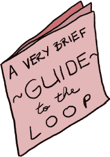
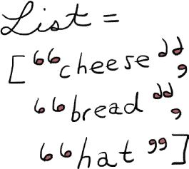

# 第四章 留在环线上

# 红宝石单轨列车

“好了，”国王说道，“这一场冒险让我饿得像个伐木工。自从早餐吃了些干烤燕麦后，我就什么都没吃了！”

“快到午饭时间了，”鲁本说道，“有什么吃的吗？”

“这里什么都没有，”国王沮丧地说道，“我怕是把皇家厨房和皇家储藏室弄得一团糟了，毕竟我把整个宫殿翻了一遍找我的线，厨师们大概还没有把一切恢复到原来的样子。”

“我们可以出去了！”斯卡雷特说道，“我肯定宫殿外的王国有很多好地方可以吃饭。”

国王用力点了点头，“当然！”他说，“我们坐环线去哈舍里吧。那是我最喜欢的餐厅！”

“什么是环线？”斯卡雷特问道。

“很高兴你问了，”国王一边忙着穿上自己最好的旅行披风和裤子一边说道，“环线就是那种单轨列车，遍布王国各地，能带着我的臣民去任何他们想去的地方。从这里到哈舍里只有几个站！”

“我们不能坐个皇家马车之类的吗？”鲁本问道。

“这样有什么好玩的吗？”国王回答道，“赶快吧——下一趟环线列车应该马上就会抵达宫殿外面。”

国王、斯卡雷特和鲁本离开了国王的书房，穿过一个又一个走廊，绕过忙碌的厨师、女佣、管家、杂工和其他一大批宫殿工作人员，他们正在忙着把国王在疯狂寻找自己的线时翻转的所有东西恢复原状。最终，他们来到了宫殿的大木门前，两个看起来非常强壮的侍卫礼貌地行礼并为三人拉开了门。

“环线的站在哪里？”鲁本问，突然被阳光晃得睁不开眼。

“就在那儿，”国王指着宫殿入口附近一个小山丘顶上的大金属平台说道，“看到那条铁轨了吗？环线列车就是在上面运行的。几分钟后，它就会到达平台，然后驶向王国的东边。”

“真高啊！”斯卡雷特说道，“这样安全吧？”

“绝对安全！”国王说道，“你们很快就知道了。”

走了几分钟后，国王、斯卡雷特和鲁本到达了平台。就在鲁本准备问列车到达需要多长时间时，一辆明亮的红色金属列车飞速驶到平台，车门发出轻柔的*嗖*的一声开了。“哈哈！我们到了，”国王说道，“全员登车！”

门在他们身后迅速关上，几乎没有任何声音，环线列车便迅速驶离了宫殿站。鲁本四下张望，“这里一个人都没有！”他说，“我们有一辆车！自己一个人！”他在车厢的一侧塑料长椅上伸展开来。

“一个人*都没有*，”斯卡雷特说道，“连个指挥员都没有。怎么可能？”

“不需要指挥员！”国王说道，“环线是完全自动化的。它完全靠红宝石驱动！”

“在红宝石上铺铁轨？”鲁本说道，“太棒了！”

“我可不这么认为，”斯嘉丽说道。“我们看到没有人盯着的情况下，Flowmatic Something-or-Other 是如何工作的。”

“哦，我觉得没什么好担心的，”国王说道。“环线已经运行了好多年，从来没有出过问题。”

鲁本把鼻子贴在玻璃上。“我们很快就到了！”他说，“看起来环线正不停地朝哈舍里驶去。”

“你是什么意思？”国王问道。

“我们已经错过了两个车站—这太棒了！嗯，也许对那些在其他车站的人不太好，但，你懂的，对我们来说，更多的哈舍里。”

国王的眼睛瞪大了。“如果有人在等车，环线应该在每个车站停靠！”他说，“如果我们跳过任何一个站，肯定是出了问题！”

“没什么好担心的，是吧？”斯嘉丽说道。“我们现在被困在一辆失控的火车上！”

“太棒了！”鲁本说道。


“好了，好了，”国王说道。“如果今天早上的情况有任何指示的话，我相信这里肯定有某个计算装置，我们可以打开它看看发生了什么。”三人很快扫视着火车，寻找隐藏的隔间或神秘设备。不久后，鲁本发现了一个金属网格的方块，旁边有一个小红按钮。当他按下按钮时，金属网格轻微地吱吱作响，滑了起来，露出了 IRB `>>` 提示符的欢快光芒。

“找到了！”鲁本挥手让斯嘉丽和国王过来。

“太好了！”斯嘉丽说道。“让我们看看能不能找出一个方法来让这个东西停下来。”

“快点！”国王说道。“我们可不想错过我们的站。哈舍里全天供应早餐，但如果你晚到，有时候他们会卖完最好的菜肴。比如哈希！”

斯嘉丽正忙着检查计算装置屏幕上的 Ruby 代码。“哦不！”她说道。“看起来我们陷入了*无限循环*！”

“真是美味的早餐肉汁！”国王叫道。“那是什么？”

# while 循环

“无限循环是一个永远不会结束的 Ruby 指令，”鲁本说道。“在 Ruby 中，*循环*是一段会反复执行的代码，它会按照指令执行，直到应该停止为止。但如果给它设置一个永远不会发生的停止条件，代码就会永远运行！”

“看看这个，”斯嘉丽说道。“看起来驱动火车的代码永远不会停止运行！”当国王眯起眼睛看屏幕时，他看到了这样的画面。

### 注意

*只需阅读接下来的几个例子——不要在 IRB 中尝试它们。这些小段代码（以灰色显示）只能作为更长程序的一部分运行。*

```

while true
  drive_train_forward
end

```

“我想我听说过这个，”国王说道。“这个环线是一个*while 循环*，是一段在某个条件为真时会重复执行的代码。但由于这个循环以`while true`开始，而`true`总是`true`，所以这个循环会永远调用`drive_train_forward`方法！”

“没错，”斯嘉丽说道。“我们需要一种方式告诉环线停下来。”

“那这个怎么样？”鲁本指着一张夹在计算机装置屏幕旁边的泛黄纸张说。国王低下头去读。“‘关于循环及其机制的简短指南’，”他引用道。“这看起来很有前景！”



“这里写着不仅有`drive_train_forward`方法，还有`stop_train`方法，它应该能让列车停下来，”鲁本说。“试试这个！”

“没问题！”斯嘉丽说。她迅速修改了计算机装置中的代码：

```

while true
  stop_train
end

```

当她按下回车键的瞬间，列车发出了一个深沉而悲伤的*boooooop*声，声音不到一秒钟就消失了，随着声音的渐隐，列车开始减速。没过多久，他们的列车车厢在单轨道上完全停了下来。

“干得好！”鲁本说。

“嗯，你确实让列车停下来了，”国王说。“但是看看窗外。”鲁本和斯嘉丽跑到国王指的地方，朝车厢前方的窗户望去。看到这一幕，他们的心一下子沉了下来。“我们卡在两个站台之间！”斯嘉丽说。“我甚至看不到前方轨道上的下一个站台。”

“我们再看看那本简短指南，”鲁本说。“如果设计循环程序的人内建了`drive_train_forward`和`stop_train`方法，也许她还设计了一个方法来判断列车是否在站台上。”

斯嘉丽和鲁本回到计算机装置旁，再次翻阅《关于循环及其机制的简短指南》。与此同时，国王若有所思地说道：“如果这个循环是一个无限循环，为什么列车竟然会为我们停下来？难道它不应该像其他站点那样呼啸而过吗？”

“我不知道，”鲁本说。“但是记得哈尔多说过王国里可能有另一个程序导致神秘管道溢出吗？也许某个地方有代码在运行，它告诉列车为我们停下。”

“也许吧，”国王说，“但是什么代码，为什么？还有，谁写的？这一切越来越奇怪了。”

“我想我找到可以用的东西了，”斯嘉丽说。“这里写着循环程序里也有一个`at_stop?`方法。如果我们用对了方法调用它，应该能在我们处于两个站点之间时前进，然后在到达站台时停下来！”

“太好了！”鲁本说。“我想我知道怎么做了。”他说着走向计算机装置并开始敲字。

“别忘了给你的`while`循环加上`end`，”斯嘉丽说。“就像`if`/`elsif`/`else`一样，循环也需要`end`。”

“我知道，我知道，”鲁本说。“好了，我想这就能解决了。”

```

while true
  if at_stop?
    stop_train
    break
  else
    drive_train_forward
    break
  end
end

```

“等一下，”国王说。“那个`break`是什么意思？”

“那会让`while`循环立即停止，”鲁本说。“否则，我们就会一直`stop_train`或`drive_train_forward`下去！”

“看来我们需要一种方法来修复这个问题，”国王抱怨道。

“我想这段新代码会解决问题，”鲁本说道。他按下了 ENTER，火车开始启动。在不到一分钟的时间里，火车驶入下一个平台并缓缓停下。

“我们成功了！”国王说道，“而且我们到了东部 Bumpspark 车站！The Hashery 离这里只有两个站，下一站就是 New Mixico 平台。”


“太棒了！我们很快就能到达了，”鲁本说道。但是火车只是在东部 Bumpspark 车站停着，车门开着，平台上一个人也没有。国王、斯嘉丽和鲁本尴尬地站了几分钟，直到国王清了清嗓子打破了沉默。

“嗯，”他说，“看起来我们已经弄明白了如何在一个平台上停下火车，但它没有重新启动，似乎出了点问题。我们要不要再看一遍代码？”

“早就想到了，”斯嘉丽说道，“我想我知道问题出在哪里了——在我们的`while`循环中，我们给 Loop 程序的指令是：如果在车站就停下，如果不在车站就继续前进。嗯，我们现在在一个车站，Loop 正*完全*按照我们告诉它做的事情——它停下了！我们在循环中从来没有写任何东西告诉火车停下来后如何重新启动。”

“你说得对！”鲁本说道，“我们需要重写程序，也许像这样？”他打字道：

```

while !at_stop?
  drive_train_forward
end

```

“那个`!at_stop?`对我来说有点丑，”斯嘉丽说道，“而 Ruby 的目标就是写出漂亮的代码。也许像这样？”她轮到使用计算装置：

```

until at_stop?
  drive_train_forward
end

```

“就像`if`有`unless`，`while`也有`until`，”斯嘉丽说道，“这意味着*直到*我们到达停靠点之前，我们应该继续推动火车前进。”

“那确实看起来好看多了，”国王说道，“但是我们仍然有个问题：我们目前在一个停靠点，所以程序不会让我们继续前进！即使它能前进，我们也只会到下一个车站停下，而程序中没有任何指令告诉火车如何重新启动。”

“你完全正确，”斯嘉丽说道，“我们需要某种方式让 Ruby 从一个停靠点到另一个停靠点，直到线路上没有更多停靠点。鲁本，你看到清单上有什么能告诉火车从一个车站到下一个车站继续前进的东西吗？”

“嗯，”鲁本说道，“这里说 Ruby 的`next`方法可以在 Loop 程序中用来从一个车站移动到另一个车站，但我不完全确定我们该怎么做。‘Loop 与其机制简明指南’中有一个例子，但里面有一些看起来奇怪的方括号。你以前见过这些吗？”

# 数组

在斯嘉丽向鲁本解释那些看起来奇怪的括号时，我会先花点时间给你们解释一下它们。（斯嘉丽也可以解释得很好，但我有点着急了。）

鲁本描述的情况看起来是这样的：

```

["East Bumpspark", "Endertromb Avenue", "New Mixico", "Mal Abochny"]

```

一堆用方括号(`[]`)括起来并由逗号(`,`)分隔的 Ruby 对象叫做*数组*。数组基本上就是列表！比如，你可以用数组来创建一个 Ruby 购物清单，如下所示：

```

grocery_list = ["cheese", "bread", "grapes", "a festive hat for all
occasions"]

```

你可以将任何东西放入 Ruby 数组中：字符串、数字、布尔值，甚至是其他列表！这是一种方便的方式，将一个变量设置为多个值的集合。我们将在下一章进一步讨论数组，但现在需要知道的重点是，数组可以与非常方便的方法一起使用（这些方法叫做*迭代器*，不过不用担心现在就记住这个词），让你可以*遍历*——也就是说，逐个处理——数组中的每个元素。例子是学习的最好方式，现在就试试在 IRB 中运行这段代码，看看结果：

```

>> **grocery_list = ["cheese", "bread", "grapes", "a festive hat for**
**all occasions"]**
>> **for item in grocery_list**
>>   **next if item.length.odd?**
>>   **puts item**
>> **end**

```

这将会输出：

```

cheese
grapes
=> ["cheese", "bread", "grapes", "a festive hat for all occasions"]

```

你在最后看到整个数组，因为即使`for`只会打印你要求的内容，它仍然会返回整个数组，以防你做了什么改变它的操作。（我们并没有做什么。）



`next`方法是 Ruby 内置的，正如它的名字所示：它立即跳到数组中的下一个项，而不调用其他代码。在这个例子中，由于字符串`"bread"`的长度是 5，`"a festive hat for all occasions"`的长度是 31（这两个都是奇数），因此会调用`next`，这些列表项就不会被打印出来（记住，`next`会直接跳到列表中的下一个项，跳过`end`之前的其他代码）。由于`"cheese"`和`"grapes"`的长度都是 6——偶数——并且`next`只有在字母数是奇数时才会被调用，因此会调用`puts`语句，打印出项名称。

至于你刚才看到的全新`for`/`in`部分，我就交给 Scarlet 和 Ruben 来解释了。看起来 Ruben 已经掌握了数组和迭代器的使用，所以让我们看看他在“Loop”程序中正在做的例子。

# 将数组和循环付诸实践

“我想我明白了，”Ruben 说，“所以数组只是事物的列表——字符串、数字、任何我们喜欢的东西——我们可以将它们设置为一个单独的变量名。如果我们想的话。不仅如此，我们还可以使用循环和迭代器遍历整个数组，这样我们就能对数组中的每一项，或者说*元素*，做某些操作。”

“没错，”Scarlet 说，“我能看看你在 IRB 中输入的内容吗？”Ruben 点点头，把计算装置的显示屏转向 Scarlet。这是她看到的内容：

```

stops = ["East Bumpspark", "Endertromb Avenue", "New Mixico", "Mal
Abochny"]
for stop in stops
  next if stop.empty?
end

```

“很好！”Scarlet 说，“但是那个`for`/`in`部分是怎么回事？那是像`while`那样的循环吗？”

“算是吧，”Ruben 说，“基本上，它告诉 Ruby，‘嘿！*对于*这个数组中的每个元素，执行`end`之前的指令。所以，在这个例子中，对于`stops`列表中的每一个停靠点，如果那里没有人等候，就跳到下一个停靠点。’”

“好的，”Scarlet 说，“还有一个问题——我看到你定义了`stops`变量并将其设置为数组，但我没有看到你在哪里赋值给`stop`变量。为什么？”

“这只是 Ruby 给你提供的一个很酷的快捷方式。你看，当你遍历数组时，Ruby 会从一个项移动到下一个项，如果你能在处理时为每个项临时起个名字，那会方便很多。由于这个‘临时’变量只在 `for` 循环内有效，所以你不需要声明它——你只需要写类似 `for stop in stops` 的代码，Ruby 就知道 `stop` 会依次取 `stops` 数组中每个项的值。事实上，你可以给这个变量任何名字，比如 `item` 或 `thingy` 或 `elf_with_a_pet_ham`，但是我觉得 `stop` 是最有意义的。”

“我也这么觉得，”Scarlet 说。“不过我总觉得那个 `for` 循环有点奇怪。我已经读了很多 Ruby 代码了，可是我不常看到 `for` 循环。可是我倒是看到很多这样的！”然后她开始在计算机上打字：

```

stops = ["East Bumpspark", "Endertromb Avenue", "New Mixico",
"Mal Abochny"]
stops.each do |stop|
  next if stop.empty?
end

```

“哇！”Ruben 说。“那是什么？它跟我的 `for` 循环做的是不是一样的事？”

“没错！”Scarlet 说。“虽然它只有一点点不同，但看起来更漂亮。我们可以直接在 `stops` 变量上调用 `each` 方法，而不是使用 `for`/`in` 部分。这样我们就得到了和之前完全一样的代码，只不过它是放在 `do` 和 `end` 之间，而不是 `for`/`in` 和 `end` 之间。`do`/`end` 这一部分在 Ruby 中其实很常见，它被称为 *块*。”

“明白了，”Ruben 说，“这很有道理。那 `stop` 在两个竖线之间是什么意思？它是不是像我 `for` 循环中的那个‘临时’ `stop` 变量？”

“没错，”Scarlet 说。“你可以把那些竖线看作是一个小窗口的边界，我们将其沿着数组移动：当我们把窗口覆盖到数组中的每个元素时，`stop` 就临时被设置为该元素的值。”

“事实上，”她继续说道，“你甚至可以把它写得简短一些。Ruby 允许你使用大括号代替 `do`/`end`，而且因为我们在代码块中只有一行代码，用大括号看起来更简洁。”她在 IRB 中输入：

```

stops = ["East Bumpspark", "Endertromb Avenue", "New Mixico",
"Mal Abochny"]
stops.each { |stop| next if stop.empty? }

```

“这一切都很迷人，”国王说，“但是代码 *能不能* 工作？我们能在饿死之前赶到 New Mixico 站，或者——天哪！——Hashery 会不会没了哈希？”

“我想我们都准备好了！”Ruben 说。“我感觉我们在吃过一顿好饭后，还会继续讨论数组和块。准备好了吗，Scarlet？”Scarlet 点了点头，他们在三秒钟倒数后同时按下了 ENTER。Loop 列车开始震动，车门 *嗖* 一声关上，列车继续开向 Endertromb Avenue 站。三人屏住呼吸，车门打开，列车停了一会儿……然后车门再次滑动关闭！国王开始鼓掌，直到他们离开列车，走下从月台到街道的楼梯，朝着 Hashery 的樱桃红色门走去。

# 您的项目，如果您选择接受

经过 Loop 权威委员会审查，委员会成员们确认 Loop*确实*需要一位列车长（即便是仅仅为了照看程序并确保它不再进入无限循环）。令人惊讶的是，没有人自愿担任这个职位，所以我决定自告奋勇让你来担任！这就是我这个人。

操作列车是个大生意，但我认为从小做起是安全的。我们先来做一个程序，用来报告 Loop 是否会停在一个请求的车站，如果会，它会列出所有在请求站之前的站点，乘客就可以知道他们的车站前还要经过多少个站。我们从创建一个名为 loop_the_loop.rb 的新文件开始。（如果你不记得怎么做，可以回去看看第一章，或者请你的当地成人帮忙。）然后打开文件，输入以下代码。

loop_the_loop.rb

```

➊ we_wanna_ride = true
  stops = ["East Bumpspark", "Endertromb Avenue", "New Mixico",
  "Mal Abochny"]

➋ while we_wanna_ride
    print "Where ya headin', friend?: "
➌   destination = gets.chomp

➍   if stops.include? destination
    puts "I know how to get to #{destination}! Here's the station list:"
➎     stops.each do |stop|
        puts stop
        break if stop == destination
      end
    else
      puts "Sorry, we don't stop at that station. Maybe another time!"
      we_wanna_ride = false
    end
  end

```

这里有一些新的内容，但没有什么是你不能应付的！

首先，我们设置了几个变量：`we_wanna_ride`为`true`，`stops`设置为一个字符串数组 ➊。接着，我们创建了一个`while`循环，以`we_wanna_ride`（它开始时为`true`）作为条件 ➋。在循环内，我们使用`print`在屏幕上打印一些文字，并用`gets.chomp`获取用户的回答 ➌。

`include?`方法 ➍是新的！它会返回`true`，如果数组中有一个元素与`destination`匹配，否则返回`false`。（这个方法对于快速检查你想要的对象是否在给定数组中非常有用。）

接下来的部分在➎稍微有点复杂：

```

stops.each do |stop|
  puts stop
  break if stop == destination
end

```

你已经见过`stops.each do |stop| ... end`这一部分，而`break if stop == destination`部分的作用正如你所猜的那样：它在 Loop 到达乘客想要的目的地站时，*跳出*循环。不过，在执行这个检查之前，它会先打印出每个元素，所以如果那个站点在数组中，它至少会打印出一个站点。

你可以通过在命令行输入**`ruby loop_the_loop.rb`**并按下 ENTER 来测试你的列车程序。你应该会看到类似这样的输出（当然，你可能会选择与我不同的站点）：

```

Where ya headin', friend?: Mal Abochny
I know how to get to Mal Abochny! Here's the station list:
East Bumpspark
Endertromb Avenue
New Mixico
Mal Abochny
Where ya headin', friend?: New Mixico
I know how to get to New Mixico! Here's the station list:
East Bumpspark
Endertromb Avenue
New Mixico
Where ya headin', friend?: Detroit
Sorry, we don't stop at that station. Maybe another time!

```

你可以通过不同的输入反复运行程序，看看每次输出是如何变化的！

如果你想让程序更加复杂一点，这里有一些其他的想法：

+   现在，程序会一直提示用户输入，只要用户继续输入`stops`数组中的车站。你怎么更新程序，让它即使识别到车站，也只运行一次呢？

+   你怎么处理接受小写字母作为目的地的问题呢？（提示：这将与上一个项目中你可能采取的某个额外步骤类似。）

+   如果一个乘客正在乘坐相反方向的火车（例如，从 Mal Abochny 到 East Bumpspark）怎么办？你如何更新你的程序使其能在两个方向上都工作？更棘手的是，如果火车路线是一个大圆圈（意味着，如果一个乘客从 East Bumpspark 去 Mal Abochny，那么在 Mal Abochny 后的下一站应该再次是 East Bumpspark）呢？你如何更新你的程序，打印出正确的火车停靠列表，如果乘客想要绕整个圆圈走一圈？

# 你知道这个！

我在这一章中给了你很多信息，但如果你在读完它后还能驾驭火车，我敢肯定你已经掌握了要领。让我们回顾一下我们所学的内容。

我们讲解了*while 循环*，它是包含一些代码的循环，位于`while`和`end`之间，只要`while`条件为`true`，代码就会继续执行。（小心——如果条件永远无法变为`false`，循环将永远执行下去，造成*无限循环*！）

我们看到，就像`if`有`unless`，`while`也有`until`。如果你能写出：

```

while something_is_the_case
  # Do something!
end

```

然后你也可以写：

```

until !something_is_the_case
  # Do something!
end

```

我们还看到，当使用循环或*迭代器*（它只是 Ruby 代码，用于遍历列表中的项目）时，我们可以调用`next`方法，根据`if`/`elsif`/`else`或`unless`语句跳过某些元素。

我们简要讨论了数组，它基本上就是 Ruby 列表，以及如何将任何我们想要的东西放入其中。一个数组看起来是这样的：

```

my_hobbies = ["Ruby", "eating things", "cat videos"]

```

我们学习了如何使用*for 循环*或`each`方法来*迭代*（或遍历）一个数组，虽然它们的工作方式完全相同，但`each`方法在 Ruby 中更为常见。

一个`for`循环是这样的：

```

# Assuming we have an array called todo_list
for task in todo_list
  puts task
end

```

使用`each`迭代看起来是这样的：

```

# Using do/end
todo_list.each do |task|
  puts task
end

# Or, using curly brackets
todo_list.each { |task| puts task }

```

最后，我们学习了一些关于*块*的内容。Ruby 块就是常规的 Ruby 代码，夹在`do`/`end`或花括号（`{}`）之间。像`each`这样的某些方法会接收块，我们将在深入学习 Ruby 的 Hashery 课程后，进一步了解这些内容。
