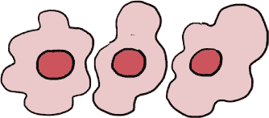
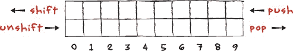
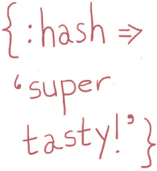

# 第五章  阳光与炉灶上的哈希

# 大汉克的哈舍里

“早安，陛下！”哈舍里里深处传来了一个宏亮的声音。

“早上好，大汉克！”国王说道。

“大汉克？”鲁本问，“谁是大汉克？”

一位庞大的男人，光头和卷曲的黑色胡须，从餐馆的后面走了出来。“我就是！”他说。


国王用力地摇了摇汉克的手。“很高兴见到你，汉克！我们一路过来可费了不少劲——环路出了点问题——但我迫不及待想坐下来好好享受一顿你做的最棒的哈希。”

大汉克皱起了眉头，胡须也显得有些下垂。“环路出了问题？”他问，“真希望我能说我很惊讶。这里的事情也有点乱。”

国王倒吸了一口气。“你不会是——”

大汉克点了点头。“我们的炉灶坏了，”他说，“在修好之前，我做不出任何东西：没有鸡蛋，没有早餐肉汁，当然也做不出我闻名的哈希。”

国王瘫坐在哈舍里里一张长长的橡木长凳上。“没有哈希！还有什么比这更糟糕的？”

“这哈希一定非常好，”斯卡雷特说道。

“太棒了！”国王喊道，眼看就要流泪了。“但是没有一个能用的炉灶，我们就做不成任何事。而我们已经走了这么远！”

“等一下，”大汉克说，“这可不是我和吱吱叫的吉姆第一次在哈舍里出问题，也不会是最后一次。我们一定会弄明白的。”

“谁是吱吱叫的吉姆？”鲁本问。

“他是我的炸菜厨师，”汉克说道，“他可不算是厨房技术方面的天才——我们一切都靠红宝石（Ruby）来运行——不过他可是个了不起的厨师。做的煎蛋非常好，他几乎已经掌握了我的哈希食谱。”

“红宝石！”鲁本和斯卡雷特同时喊道。

大汉克抬起了浓黑的眉毛。“你们孩子懂不懂红宝石（Ruby）？”他问道，“如果懂的话，那会大有帮助。”

“当然！”斯卡雷特说道，“带我们去厨房，我们接手。”

“太棒了！”国王说道，“这些孩子可聪明了，汉克，”他补充道，“他们会很快让你的厨房恢复运转。”

大汉克点了点头。“听起来不错！实际上，我让吱吱叫的吉姆在后面用旧煎锅，但我想他需要点红宝石（Ruby）方面的帮助。我会再试试炉灶，但如果你们孩子和吉姆在我修好之前就把订单做好了，告诉我，我们可以一起想办法。”

“没问题，”斯卡雷特说道，“你带路！”

大汉克示意他们跟着他走，摇摇晃晃地穿过一排排木凳，向哈舍里的后方走去。他停在一扇顶部有小窗户的红色金属门前，轻轻敲了两下，肩膀顶着推开了门。“吉姆！”他喊道，“国王和他的朋友们来了！”

他们听到厨房角落里传来一阵短促的摩擦声，接着是一堆锅碗瓢盆撞击的声音。

“没事，没事——我明白了！” 吱吱吉姆喊道，声音颤抖了两次。他从一堆大土豆袋后面跌跌撞撞地走出来，手里拿着一个平底锅，另一个则歪歪斜斜地顶在头上。

“我知道为什么他们叫他吱吱吉姆了，”鲁本低声对斯卡利特说道。

“轻松点，吉姆，”大汉说着，从吉姆手中接过锅具。“国王和他的朋友们对 Ruby 有一些了解，所以我请他们帮你，而我则去调整主灶。”

吱吱吉姆急忙向国王行了个礼。“陛下，”他说。

“吱吱吉姆，”国王说道。


大汉指了指吉姆刚刚从中走出来的厨房角落。“计算装置就在那边，”他说。“我在炉子那边，厨房的另一边。”他转过身，双臂各夹着一袋土豆。“如果需要我，大声喊我——厨房很大，”他头也不回地喊道。说完，他就走了。

吱吱吉姆清了清嗓子。“大汉可能告诉过你，我不是 Ruby 专家，”他尖声说道，“但是如果你能帮我重新启动我的煎锅，我可以像无人能敌一样做好顾客的订单。”他从围裙口袋里拿出一叠订单。“大多数是土豆饼和今天的特别菜单——阳光数组，”他说。“三颗顺序排列的荷包蛋！是王国里最棒的早午餐。”

“好吧，”鲁本说。“我们其实刚刚帮国王解决了循环问题，而且我们还得用了数组。这应该是小菜一碟！”

“鸡蛋，” 吱吱吉姆纠正道。

“哦，是的，一块……鸡蛋，” 鲁本说。

“我们开始工作吧，”斯卡利特说。“计算装置我已经打开了！”

# 数组中的数组

“太棒了！”吉姆说。“既然你们了解数组，能帮我创建一个吗？第一个订单是一个阳光数组；就是三颗 `'sunny_side_up_egg'` 按顺序排列。”



“当然！”斯卡利特说。“它应该像这样。”她开始在计算装置上打字：

```

>> **order_one = ['sunny_side_up_egg', 'sunny_side_up_egg', 'sunny_**
**side_up_egg']**
=> ["sunny_side_up_egg", "sunny_side_up_egg", "sunny_side_up_egg"]

```

当斯卡利特按下回车键时，炉灶上的小金属轨道开始震动。一个接一个的三个鸡蛋沿轨道滚下来，撞上一个小锤子，摔开并落在炉灶上，做成了荷包蛋。

“太完美了！”吉姆说。“不过看起来要打很多字，而且我们还会有很多订单。”他的声音再次颤抖。“有没有什么办法能用更少的输入做到一样的事？”

“没问题！”斯卡利特说。“你也可以这样创建一个新数组：

```

>> **order_two = Array.new(3, 'sunny_side_up_egg')**
=> ["sunny_side_up_egg", "sunny_side_up_egg", "sunny_side_up_egg"]

```

“这里，我们调用了 `Array` 的 `new` 方法，它创建了一个项目列表。括号里的下一个部分意味着数组应该包含三个项目，”斯卡利特解释道，“最后一个部分意味着每个项目应该是一个 `'sunny_side_up_egg'`。这和我们为 `order_one` 所做的完全一样。”

“我记得在循环中用方括号创建数组，”Ruben 说，“但我从没见过 `Array.new`。那是做什么的？”

“记得 Ruby 有像 `String` 这样的数据类型吗？”Scarlet 问道。嗯，`Array` 是另一种数据类型。你可以使用 *数组字面量* 语法创建一个数组，方法就是将一个变量名赋值给一个用方括号括起来的列表。你也可以通过在 `Array` *类* 上调用 `new` 方法来创建一个数组。”

“什么是 Ruby 类？”Squeaky Jim 问道。

“我们稍后会讲到，”Scarlet 说，“但重要的是，类就像 Ruby 中的对象组，调用类名上的 `new` 方法会创建该类的一个新的 *实例*，或者说是一个例子。”

“好吧，这样说得通，”Ruben 说，“我们可以把变量放进数组里，之前我们也看到过你可以把字符串放进去。还有什么可以放进数组里？”

“任何东西！”Scarlet 说，“而且数组里的项甚至可以是不同的东西。看看这个！”

```

>> **random_array = [1, 'two', 'sunny_side_up_egg', true]**
=> [1, "two", "sunny_side_up_egg", true]

```

“一个数字，一个字符串，一个变量，和一个布尔值，全部在同一个数组里，”Ruben 说，“真棒！”

“太好了，”Squeaky Jim 说，“第一份阳光数组就快好了。但我有种预感，我们可能要做很多这种东西——有没有什么方法可以让我们把所有的订单都放进一个数组里？就像一个列表中的列表？”

“绝对可以，”Ruben 说，Scarlet 让开了，他开始打字：

```

>> **order_three = ['hash']**
=> ["hash"]
>> **order_four = ['egg', 'hash']**
=> ["egg", "hash"]
>> **todays_orders = [order_one, order_two, order_three, order_four]**
=> [["sunny_side_up_egg", "sunny_side_up_egg", "sunny_side_up_egg"],
["sunny_side_up_egg", "sunny_side_up_egg", "sunny_side_up_egg"],
["hash"], ["egg", "hash"]]

```

“太棒了！`todays_orders` 是一个包含四个其他数组的数组：`order_one`、`order_two`、`order_three` 和 `order_four`，”Squeaky Jim 说，“我们很快就能完成了。不过，如果我们的订单已经打包成一个数组了，怎么再取出来呢？”

# 更多数组方法！

“我们可以做几件事，”Ruben 说，“数组有很多很酷的内建方法我们可以使用。比如说，我们可以用 `first` 方法获取数组中的第一个 *项* 或 *元素*，就像这样：

```

>> **todays_orders.first**
=> ["sunny_side_up_egg", "sunny_side_up_egg", "sunny_side_up_egg"]

```

“我明白了，”Scarlet 说，“`first` 方法给我们数组中的第一个元素！而且既然我们在谈 `first`，我们还可以用 `last` 获取数组中的最后一个元素！”

```

>> **todays_orders.last**
=> ['egg', 'hash']

```

“那是 `order_four`，”Jim 说，“马上就来！”

“不过等等，”Ruben 说，他迅速在计算机装置上打字：

```

>> **todays_orders.empty?**
=> false
>> **todays_orders.length**
=> 4

```

“哇，那是什么？”Jim 问道，把他的纸质煎炸厨师帽推回去，挠了挠头。“我以前没见过 `empty?` 或 `length`。”

“我们之前在字符串上看到过 `length`，”Scarlet 说，“当我们对字符串使用这个方法时，它会告诉我们字符串包含了多少个字符。那对数组来说，它会告诉我们数组里有多少项吗？”

“没错，”Ruben 说，“我们在循环列车站看到过 `empty?`，它只是返回一个布尔值——如果站点没人等车就是 `true`，如果至少有一个人就是 `false`。这个 `empty?` 适用于数组，但它的工作方式完全一样。”

然后 Ruben 皱起了眉头。“但列表里还有四个订单！我们可以用 `first` 和 `last` 获取其中一些，但怎么获取剩下的呢？我们在做这些的时候怎么从列表中移除它们？”

# 移位！弹出！插入！

“我想我可以帮忙，”斯嘉丽说。“不过我们需要用到一些新的数组方法。”她越过鲁本，操作计算机装置，开始打字：

```

>> **todays_orders**
=> [["sunny_side_up_egg", "sunny_side_up_egg", "sunny_side_up_egg"],
["sunny_side_up_egg", "sunny_side_up_egg", "sunny_side_up_egg"],
["hash"], ["egg", "hash"]]
>> **current_order = todays_orders.shift**
=> ["sunny_side_up_egg", "sunny_side_up_egg", "sunny_side_up_egg"]
>> **todays_orders**
=> [["sunny_side_up_egg", "sunny_side_up_egg", "sunny_side_up_egg"],
["hash"], ["egg", "hash"]]

```

“太完美了！”鲁本说。“你是怎么把 `todays_orders` 中的第一个订单提取出来并放入 `current_order` 变量的？”

“使用 `shift` 方法，”斯嘉丽说。“它同时做两件事：它从你调用它的数组中删除第一个元素，并且*返回*，或者说吐出那个元素！”

“所以，如果你把一个新变量设为调用 `shift` 方法后的结果，”国王插话说，“你基本上是把数组中的一个元素移到新的变量里了！”

鲁本和斯嘉丽转向国王，国王刚刚结束了对厨房里散乱的许多土豆袋的研究。

“那…其实是完全正确的，”斯嘉丽说。

“太棒了！”国王说。“但是如果我想把东西添加到数组的前面呢？或者添加到后面呢？甚至——敢我说——把东西从后面移除呢？”

“那么我们有适合你的方法！”斯嘉丽说。“我不想弄乱订单，所以我会在我自己创建的名为 `breakfast_items` 的数组上给你展示。看一下！”她在计算机装置上输入了以下内容：

```

>> **breakfast_items = ['egg', 'hash', 'gravy', 'biscuit', 'sausage',**
**'jam']**
>> **current_food = breakfast_items.shift**
=> egg
>> **breakfast_items**
=> ['hash', 'gravy', 'biscuit', 'sausage', 'jam']
>> **current_food = breakfast_items.pop**
=> jam
>> **breakfast_items**
=> ['hash', 'gravy', 'biscuit', 'sausage']

```

“天哪！”国王说。“这正是我想要的——`pop` 删除并返回数组中的最后一个元素，而 `shift` 对第一个元素做了相同的操作！”他看着斯嘉丽继续输入。

```

>> **breakfast_items.push('egg')**
=> ['hash', 'gravy', 'biscuit', 'sausage', 'egg']
>> **breakfast_items.unshift('jam')**
=> ['jam', 'hash', 'gravy', 'biscuit', 'sausage', 'egg']

```

“啊哈！我明白了：`push` 会把一个元素添加到数组的末尾，而 `unshift` 会把一个元素添加到数组的开头，”国王继续说道。

“没问题！只要确保你从左到右读数组，”斯嘉丽说。“第一个元素是最左边的那个，最后一个元素是最右边的那个。”

“如果我想把东西添加到中间呢？”国王问。

斯嘉丽什么也没说，只是继续输入：

```

>> **breakfast_items**
=> ['jam', 'hash', 'gravy', 'biscuit', 'sausage', 'egg']
>> **breakfast_items.insert(2, 'tea')**
=> ['jam', 'hash', 'tea', 'gravy', 'biscuit', 'sausage', 'egg']

```

“太神奇了！”鲁本说。“但是等一下，为什么 `tea` 是数组中的第三个元素？”他问。“你调用 `insert` 方法时传入的是数字 2，而不是数字 3！”

“这是计算机的一大怪异之处，”斯嘉丽说。“它们不像你我那样从 1 开始计数。它们是从*零*开始的。如果你从 1 开始计数，`tea` 会是位置 3，但如果从零开始，它会比那个少一个位置。所以如果你希望它成为第三个元素，你必须告诉 Ruby 在位置 2 调用 `insert`，而不是位置 3。”

“我比塑料花厂里的大黄蜂还要迷惑，”国王沮丧地说。“就在我以为我开始理解 Ruby 的时候。”

“等一下，我想我明白了，”斯奎基·吉姆说，他的声音只轻微沙哑。“这样对吗？”他在一张沾着哈希酱的餐巾纸背面画了个图：



“数组就像一排盒子，”吉姆说。“第一个编号是零，后面的编号依次增大。你可以用`shift`从前面取东西，用`unshift`往前面添加东西，用`push`往后面添加东西，用`pop`从后面取东西。”他从鲁本看向斯卡雷特，不确定地问：“这样对吗？”

“没错！”鲁本和斯卡雷特异口同声地说。

“做得好，我的孩子！”国王说。“你学得真快。”

“事实上，”斯卡雷特说，“数组就像一排盒子，你甚至可以通过请求数组获取某个盒子编号的元素！看到了吗？”她在计算机装置上输入：

```

>> **breakfast_items**
=> ['jam', 'hash', 'tea', 'gravy', 'biscuit', 'sausage', 'egg']
>> **breakfast_items[2]**
=> "tea"

```

“就像是你告诉数组要抓取哪个盒子的编号，”鲁本解释道。“通过说你想要`breakfast_items[2]`，你其实是在告诉 Ruby，你想要数组中第 2 号位置的元素，也就是第三个元素。”

咯吱作响的吉姆微笑着说：“太好了！”他说。“不过我在想……”

“奇怪什么？”鲁本问。

“嗯，”吉姆一边翻着最后一个煎蛋，一边把它放进纸篮里，“从数组中添加和移除东西没问题，我觉得厨房的软件在这方面做得足够好。但如果我想先了解*所有*订单的信息呢？有没有办法可以遍历所有订单并逐个打印出来？”

# 遍历数组

“确实，”国王说。“我们在循环里见过这个——叫什么来着？”

“*迭代*，”鲁本说。“这样做！”他伸手操作计算机装置，开始快速打字：

```

>> **todays_orders.each do |order|**
>>   **puts "#{order}"**
>> **end**
["sunny_side_up_egg", "sunny_side_up_egg", "sunny_side_up_egg"]
["hash"]
["egg", "hash"]

```

“是的，这看起来很熟悉！”国王说。“这会打印出`todays_orders`数组中的每一个订单吗？”

“你答对了，”斯卡雷特说。“但是记住，有一种写法比`do`/`end`块更简洁。”她迅速输入：

```

>> **todays_orders.each { |order| puts "#{order}" }**
["sunny_side_up_egg", "sunny_side_up_egg", "sunny_side_up_egg"]
["hash"]
["egg", "hash"]

```

“没错！”国王说。“当块中只有一行代码时，你可以用大括号代替`do`/`end`。”他挠了挠浓密的白胡子。“不过这些*块*还是让我有点困惑。”

“我们很快会再谈这些！”斯卡雷特说。“现在，我们应该确保在哈舍餐馆里，关于数组和顾客订单的部分都没问题。”

咯吱作响的吉姆点点头。“我想我已经掌握了数组的用法，我们现在对订单的处理也没问题了，”他说，扔掉最后一张订单票。“不过这些关于迭代的讨论让我在想，或许我们还能解决另一个问题。”

“那是什么？”斯卡雷特问。

“嗯，”吉姆吱吱地说，“大汉克和我一直在想，怎样才能最好地把哈舍餐馆的菜单打印出来给顾客。你认为迭代数组可能是个好方法吗？”

“菜单由什么组成？”鲁本问。

“用 Ruby 术语来说，就是字符串和数字，”吉姆说。“每个字符串就是菜单上的一项，每一项都会有一个表示价格的数字。我想既然我们可以在数组中混合使用字符串和数字，那应该没问题。”

“嗯，”Scarlet 说。“我不这么认为。你怎么将菜单项和它们的价格配对呢？即使你只是交替列出它们，每当菜单更改时，你不断地进行推入、弹出、移动和移出操作，也许会搞乱它们。”

“你说得对，”Jim 承认道。“那么，也许是一个数组的数组？每个数组元素可以是它自己的一小段数组，每个小数组就可以包含一个菜单项的名称和它的价格。”

“这稍微好点，”Ruben 说。“至少这样你的菜单名称和价格会在一起。Scarlet，你觉得怎么样？”

Scarlet 想了想，最后说道：“不，我想我们应该用*哈希*，而不是数组。”

# 哈希工坊中的哈希

我敢打赌你现在在想：“好吧，我们现在在哈希工坊。哈希已经上桌了。难道 Ruby 有一个内置的东西叫做*哈希*，这不是个大笑话吧？”



其实不是。完全没有笑点。哈希是 Ruby 中最酷的部分之一，所以在 Scarlet、国王、Ruben 和 Squeaky Jim 弄清楚早餐哈希和 Ruby 哈希之间的区别时，我来花一点时间给你们解释它们。

数组就像是一排排的盒子，对吧？每个元素都有自己编号的槽位，就像购物清单上的物品。这很好，只要清单上每行的所有东西——也就是说，数组中的每个元素——各自独立，做自己的事。但如果你想显示两个元素之间有某种关系怎么办？

想想字典：在字典中，你有一个单词和它的定义。不同于购物清单，你不会说所有的单词都单独列在一行，所有的定义也单独列在另一行，因为那样会忽略字典中最重要的一部分：单词与其含义之间的关系。Squeaky Jim 的订单就像一个列表，而一个订单并不真正影响任何其他订单，所以数组很适合。但对于他的菜单，他需要将菜单项与价格关联起来，因此他需要像字典一样的东西。而 Ruby 用哈希来实现这个功能。

哈希比起解释更容易展示（难道不是所有东西都是这样吗？），所以看一下下面的代码。它将我们的英雄（以及 Squeaky Jim 和 Big Hank）与他们的描述配对。快在 IRB 中输入它，并注意我们使用了花括号（`{}`）而不是数组中使用的方括号（`[]`）：

```

>> **our_heroes = {**
>>   **:the_king => 'the ruler of the kingdom',**
>>   **:ruben => 'a Ruby wizard in training',**
>>   **:scarlet => 'a Ruby wizard in training',**
>>   **:big_hank => 'the owner of the Hashery',**
>>   **:squeaky_jim => 'a fry cook at the Hashery'**
>> **}**

```

这段代码接收一个变量`our_heroes`，并将一个哈希值存储在其中。不要被花括号搞混——这不是一个代码块！哈希值不是命令；它们只是我们所说的*键值对*。一个单词及其定义是键值对的好例子：单词是*键*，而单词的定义是*值*。就像在字典中一样，你使用哈希键来查找哈希值。

每一组键值对之间用逗号分隔，这让它们有点像数组。相似之处不止于此！例如，如果您有上面的哈希，您可以这样写：

```

>> **our_heroes[:the_king]**

```

然后您会得到：

```

=> "the ruler of the kingdom"

```

这有点像查找数组值，只不过您不需要在方括号中提供元素的编号，而是写上哈希键。

不用担心哈希键现在看起来奇怪；那些看起来像变量、前面有冒号的东西叫做*符号*，我们将在下一章介绍它们。

和数组一样，您可以使用*字面*语法或 `new` 方法创建哈希。这两行代码的意思是相同的：

```

>> **hashery_menu = {}**
=> {}
>> **hashery_menu = Hash.new**
=> {}

```

有时您会看到另一种写哈希的方式。不是使用小小的*哈希箭头*（`=>`），而是有些人在符号名称后加上冒号，这样 `our_heroes` 哈希看起来就像这样：

```

>> **our_heroes = {**
>>   **the_king: 'the ruler of the kingdom',**
>>   **ruben: 'a Ruby wizard in training',**
>>   **scarlet: 'a Ruby wizard in training',**
>>   **big_hank: 'the owner of the Hashery',**
>>   **squeaky_jim: 'a fry cook at the Hashery'**
>> **}**
=> {:the_king=>"the ruler of the kingdom", :ruben=>"a Ruby wizard in
training", :scarlet=>"a Ruby wizard in training", :big_hank=>"the
owner of the Hashery", :squeaky_jim=>"a fry cook at the Hashery"}

```

这两个例子都是完全正确的 Ruby 代码，您可以选择任何一个，哪个更容易记住就用哪个。（我喜欢冒号，因为它们打起来更快。）

最后，您可以使用一些简洁的方法在哈希中提取键、值或键值对组合。例如，调用哈希的`keys`方法会返回一个包含键的数组：

```

>> **our_heroes.keys**
=> [:the_king, :ruben, :scarlet, :big_hank, :squeaky_jim]

```

您还可以在哈希上调用 `values` 方法，获取其值的数组：

```

>> **our_heroes.values**
=> ['the ruler of the kingdom', 'a Ruby wizard in training', 'a Ruby
wizard in training', 'the owner of the Hashery', 'a fry cook at the
Hashery']

```

还有一些其他值得了解的哈希方法。就像 `empty?` 可以告诉您数组是否为空一样，`empty?` 也可以告诉您哈希是否没有键值对：

```

>> **our_heroes.empty?**
=> false
>> **empty_hash = {}**
>> **empty_hash.empty?**
=> true

```

您还可以使用 `length` 方法来查找哈希中有多少组键值对：

```

>> **our_heroes.length**
=> 5

```

最后但同样重要的是，您可以使用一些全新的哈希方法 `has_key?` 和 `has_value?` 来检查哈希是否包含某个键或值：

```

>> **our_heroes.has_key?(:ruben)**
=> true
>> **our_heroes.has_key?(:trady_blix)**
=> false
>> **our_heroes.has_value?('a fry cook at the Hashery')**
=> true

```

然而，您可能想问：“我怎样才能*一起*获取哈希的所有键和值？”好吧，最好的方法就是遍历哈希。这个过程看起来和遍历数组非常相似——事实上，只有一个小小的不同！

```

>> **our_heroes.each do |hero, role|**
>>   **puts "#{hero} is #{role}."**
>> **end**

```

继续尝试吧。（确保在 `puts` 中使用双引号——记得，如果您要在字符串中插入变量，需要使用双引号。）你看到了我提到的那个小差别吗？在管道符号（`||`）之间，您需要同时放入 `hero` *和* `role`。在数组中，我们只需要一个变量放在管道符号之间，但哈希包含键*和*值，所以我们需要告诉 Ruby 块这两者。如果一切顺利，您将获得一个包含所有勇敢英雄及其人生站位的列表：

```

the_king is the ruler of the kingdom.
ruben is a Ruby wizard in training.
scarlet is a Ruby wizard in training.
big_hank is the owner of the Hashery.
squeaky_jim is a fry cook at the Hashery.
=> {:the_king=>"the ruler of the kingdom", :ruben=>"a Ruby wizard in
training", :scarlet=>"a Ruby wizard in training", :big_hank=>"the
owner of the Hashery", :squeaky_jim=>"a fry cook at the Hashery"}

```

说到我们的英雄，听起来 Scarlett 和 Ruben 已经向国王和 Squeaky Jim 解释完了哈希。（我的听力非常敏锐。）让我们看看他们是否已经弄清楚如何使用哈希来遍历 Hashery 菜单。

# 欢快的范围

“我有一个完美的主意，适用于遍历 Hashery 菜单，” squeaky Jim 说道，这次他的声音一点也不破音。“我们只需要做的是——”

就在那一刻，大汉 Hank 从厨房的远端笨重地走了过来。

“我不想打断你，”他大声说，“但我在使用这个范围时遇到了麻烦。事实上，我只需要解决 Ruby 中一个小细节就能让它工作，但如果我能弄明白，我愿意做猴子的税务律师。你能帮帮我吗？”

“没问题！”斯卡雷特说。“有什么问题？”

“跟我来，”大汉克说，他们穿过了那座巨大的厨房，经过堆满鸡蛋、面粉、土豆和其他食材的台面，经过烤箱、铲子和那些只有三根叉的叉子，直到他们来到厨房另一侧那台闪闪发光的新炉灶前。

“她不是很美吗？”大汉克问。“真希望我能弄明白她的原理。这里是我卡住的地方。”他指着范围控制台上发光的 IRB `>>` 提示符。它显示了：

```

>> **current_temperature = (300..400)[0]**
NoMethodError: undefined method `[]' for 300..400:Range

```

“我听到你说的关于数组的事了，”汉克说，“而范围的使用手册说它会从 300 度加热到 400 度。所以我想我可以用方括号来获得零位置的温度，那应该是 300。”

“哦，我明白问题所在了，”鲁本说。“这个范围并没有使用数组来表示温度！它使用的是*范围*。”

“范围？”大汉克问。

“这就是 Ruby 给你一堆不同的值紧挨着放在一起的方式，”鲁本说。“范围（ranges）并不像数组那样能做所有的事情，但我们可以很容易地把它们转成数组。看看这个！”他开始输入：

```

>> **('a'..'f').to_a**
=> ["a", "b", "c", "d", "e", "f"]
>> **('a'...'f').to_a**
=> ["a", "b", "c", "d", "e"]
>> **(1..9).to_a**
=> [1, 2, 3, 4, 5, 6, 7, 8, 9]
>> **(1...9).to_a**
=> [1, 2, 3, 4, 5, 6, 7, 8]
>> **(1..9).first**
=> 1
>> **(1..9).last**
=> 9

```

“我简直要变成圣诞鹅了！”汉克大喊道。“太神奇了！不过我有几个问题。首先，那个 `to_a` 是做什么的？”

“`to_a` 方法将范围转换为数组，”斯卡雷特说。“由于范围的值是紧挨着的，Ruby 能够推测出数组的样子。看到没？它对字母和数字都能工作！”

“不仅如此，”鲁本补充道，“而且一旦范围变成了数组，你就可以像处理任何数组一样对它进行迭代。”

“明白了，”汉克说，转动着他的胡子。“但告诉我这个：为什么有些范围用两个点，有些用三个？”

“那就是你告诉 Ruby 是否包含范围中的最后一个元素的方式，”鲁本说。“两个点意味着‘包含第一个元素，直到最后一个元素，并且范围内的最后一个元素’，而三个点意味着‘包含第一个元素，并且包含直到但不包括范围中的最后一个元素’。”

“听起来有点混乱，”吉姆尖叫道。

“有可能，”斯卡雷特承认道。“这就是为什么我通常只使用两个点的范围。把两个数都放在范围里更有意义。”

“明白了，”大汉克说。“最后一个问题。如果我想要范围中的第一个元素，我可以用 `to_a` 将它转换成数组，然后用 `[0]` 抓取第一个元素。但我也可以用你刚刚给我展示的 `first` 方法吗？”

“当然！”鲁本说，然后开始输入：

```

>> **current_temperature = (300..400).first**
=> 300

```

随着一声愉快的*哔*，范围迅速加热至 300 度。新鲜的香肠味开始弥漫在空气中。

“你们做到了！我真是无法感谢你们这些孩子。”大汉 Hank 笑着，像个欢快的餐厅牛仔一样把哈希菜肴甩到烤架上。“不过，我忍不住觉得有点傻。明明是那么小的事！”

“编程总是给人这种感觉，”Scarlet 说道。“但做得越多，你就越明白，*总*是一些小问题，而你会变得越来越擅长迅速解决问题。”

“说到快速，”大汉 Hank 说道，“午餐高峰马上就要来了。”他环顾四周，厨房里堆满了未擦过的土豆和未煎的鸡蛋。“怎么样——要不要先吃点东西，顺便帮我一把？”他笑了笑，那副黑色的大胡子在脸上晃动。“当然，吃的全是免费的。国王和他的朋友们想吃什么就吃什么！”

Ruben 和 Scarlet 互相看了看，然后看向国王。国王点了点头。“我们已经走了这么远，”他说。“不如再待一会儿！”

# 点餐时间！

既然 Hashery 已经恢复到百分之百的状态，大汉 Hank 和吱吱 Jim（现在他对 Ruby 更有信心了，所以吱吱声少了许多）需要你的帮助来准备菜单给顾客。Jim 没来得及告诉我们他的计划，但我敢肯定你能搞定这个。简单得像派……呃，鸡蛋，对吧？

让我们从创建一个名为 hashery_menu.rb 的新文件开始。（如果你不记得如何做，可以回去看看第一章，或者请你身边的大人帮忙。）然后打开你的文件，输入以下代码。

hashery_menu.rb

```

hashery_menu = {
  eggs: 2,
  hash: 3,
  jam: 1,
  sausage: 2,
  biscuit: (1..3)
}

hashery_menu.keys.each do |item|
  puts "Today we're serving: #{item}!"
end

hashery_menu.each do |item, price|
  puts "We've got #{item} for $#{price}. What a deal!"
end
puts "Here's what a biscuit'll run ya, depending on how much butter
you want:"
hashery_menu[:biscuit].to_a.each do |price|
  puts "$#{price}"
end

```

这就是你和 Jim 之前已经整理过的内容，所以这里没有什么新鲜的或令人害怕的东西！

这是你运行代码时会看到的输出，使用命令 **`ruby hashery_menu.rb`**：

```

Today we're serving: eggs!
Today we're serving: hash!
Today we're serving: jam!
Today we're serving: sausage!
Today we're serving: biscuit!
We've got eggs for $2\. What a deal!
We've got hash for $3\. What a deal!
We've got jam for $1\. What a deal!
We've got sausage for $2\. What a deal!
We've got biscuit for $1..3\. What a deal!
Here's what a biscuit'll run ya, depending on how much butter you
want:
$1
$2
$3

```

但是，*确实*有几个新的想法组合，我们可以逐一查看它们是如何工作的。看看这里：

```

hashery_menu = {
  eggs: 2,
  hash: 3,
  jam: 1,
  sausage: 2,
  biscuit: (1..3)
}

```

在这里，我们只是创建了一个名为 `hashery_menu` 的哈希。它有像 `:eggs` 和 `:hash` 这样的键，每个键都有一个与之对应的值，比如 `:eggs` 的值是 `2`，`:hash` 的值是 `3`。这是我们为菜单上的每个项目收取的价格。

接下来是这一部分：

```

hashery_menu.keys.each do |item|
  puts "Today we're serving: #{item}!"
end

```

我们使用 `keys` 方法来获取哈希中所有键的列表，然后将这个列表（或者说是 *数组*）传递给 `each` 方法。对于每个键，我们会打印出字符串：`Today we're serving: #{item}!` 比如，当我们遍历到键 `:eggs` 时，我们会输出：`Today we're serving: eggs!` 代码会遍历哈希中的每个项目，然后 `puts` 每个菜单项到屏幕上。

```

hashery_menu.each do |item, price|
  puts "We've got #{item} for $#{price}. What a deal!"
end

```

这里事情有点变得复杂了。当我们在哈希上调用 `each` 方法时，我们将哈希的 *键*（`item`）和该键的 *值*（`price`）传递给 `do` 块。例如，当我们遍历到 `:eggs`（其对应的值是 `2`）时，我们会输出：`We've got eggs for $2\. What a deal!`

```

puts "Here's what a biscuit'll run ya, depending on how much butter
you want:"
hashery_menu[:biscuit].to_a.each do |price|
  puts "$#{price}"
end

```

最后，我们将用一点 Ruby 魔法操作一下我们的`hashery_menu`中的`:biscuit`。首先，我们用`hashery_menu[:biscuit]`来访问它的值。然后，由于这个值是一个范围，我们可以在它上面调用`to_a`方法，将它转换成数组，然后像之前一样使用`each`方法遍历它的所有项。我们将打印出我们的消息，告诉大家一个饼干的价格是多少，然后`do`块将打印出可能的价格：`$1`、`$2`和`$3`，每个价格占一行。

你可以通过在命令行输入**`ruby hashery_menu.rb`**来测试整个菜单程序，它应该显示出我刚才给你展示的输出结果。

你这里有一个很棒的菜单，但如果你想让 Squeaky Jim 和 Big Hank 欣喜得泪流满面，可以尝试以下的创意。

你的菜单里有一个非常棒的范围，甚至还将它转换成了数组！不过我没有看到你菜单里有普通的数组，而你*完全*可以将数组作为哈希的值。为什么不添加一个`:random_special`键（即每日特别推荐），并将一个价格数组作为它的值呢？如果我告诉你可以在数组上调用`sample`方法，让 Ruby 从数组中随机挑选一个元素，你会怎么用它呢？

你可以非常花哨地使用`shift`、`unshift`、`push`或`pop`方法，将值添加到或从`:random_special`数组中删除。看看你已经写的代码，你会如何在`:random_special`键的数组值上调用这些方法呢？

说到`push`方法，Ruby 有一个很酷的快捷方式。它叫做*铲子操作符*，它的用法是这样的。包含`<<`的那一行和`bagel_types.push('cinnamon raisin')`完全相同：

```

>> **bagel_types = ['plain', 'sesame', 'everything']**
=> ["plain", "sesame", "everything"]
>> **bagel_types << 'cinnamon raisin'**
=> ["plain", "sesame", "everything", "cinnamon raisin"]

```

尝试用`<<`替换你的`push`操作，然后去*`[`www.ruby-doc.org/`](http://www.ruby-doc.org/)*阅读更多关于铲子操作符的内容。提示：它如何帮助你在 Ruby 中构建字符串？

# 你已经知道了这个！

你可能会觉得大脑里充满了我们所学的所有新的数组、哈希和范围的魔法，但不用担心——我们将再次过一遍所有内容，确保你都掌握了。

让我们从*数组*开始，数组只是信息的列表。你有两种创建数组的方式。你可以使用数组字面量语法，像这样使用方括号：

```

>> **breakfast = ['chunky bacon, 'chunky bacon', 'chunky bacon']**
=> ["chunky bacon", "chunky bacon", "chunky bacon"]

```

或者你可以使用`Array.new`来做相同的事情：

```

>> **breakfast = Array.new(3, 'chunky bacon']**
=> ["chunky bacon", "chunky bacon", "chunky bacon"]

```

你发现数组可以包含任何东西，包括字符串、数字、变量、布尔值，甚至其他数组。

你学到了一堆*数组方法*，包括：

+   `empty?`，如果数组没有元素，则返回`true`，如果数组至少有一个元素，则返回`false`。

+   `length`或`size`，它们做的是相同的事情——返回数组中的元素个数。

+   `first`，它返回数组中的第一个元素，而不将其移除。

+   `last`，它返回数组中的最后一个元素而不移除它。

+   `shift`，它返回数组中的第一个元素*并且*将其从数组中移除。

+   `unshift`，它将元素添加到数组的开头。

+   `push`，它将元素添加到数组的末尾。

+   `pop`，用于移除并返回数组的最后一个元素

+   `insert`，可以在数组的任何位置添加一个元素

呼！

让我们通过一些更多的例子在 IRB 中做些练习，刷新一下记忆：

```

>> **empty_array = []**
=> []
>> **empty_array.empty?**
=> true
>> **not_empty_array = [1, 2, 3, 4, 'I declare a thumb war']**
=> [1, 2, 3, 4, "I declare a thumb war"]
>> **not_empty_array.empty?**
=> false
>> **not_empty_array.length**
=> 5
>> **not_empty_array.first**
=> 1
>> **not_empty_array.last**
=> 'I declare a thumb war'
>> **not_empty_array**
=> [1, 2, 3, 4, 'I declare a thumb war']
>> **first_item = not_empty_array.shift**
=> 1
>> **not_empty_array**
=> [2, 3, 4, 'I declare a thumb war']
>> **not_empty_array.unshift(first_item)**
=> [1, 2, 3, 4, 'I declare a thumb war']
>> **last_item = not_empty_array.pop**
=> 'I declare a thumb war'
>> **not_empty_array**
=> [1, 2, 3, 4]
# We could also do not_empty_array << last_item
>> **not_empty_array.push(last_item)**
=> [1, 2, 3, 4, 'I declare a thumb war']
# Insert the number 5 at position 4; remember, arrays start counting
at 0!
>> **not_empty_array.insert(4, 5)**
=> [1, 2, 3, 4, 5, 'I declare a thumb war']

```

我们讨论了如何使用方括号访问数组：

```

>> **junk_drawer = ['lightbulb', 'dead battery', 'some pens', 'old**
**penny']**
=> ["lightbulb", "dead battery", "some pens", "old penny"]
>> **junk_drawer[2]**
=> "some pens"

```

最后，我们回顾了如何遍历数组：

```

>> **junk_drawer.each do |thing|**
>>   **puts thing**
>> **end**
lightbulb
dead battery
some pens
old penny
=> ["lightbulb", "dead battery", "some pens", "old penny"]

```

这与以下内容完全相同：

```

>> **junk_drawer.each { |thing| puts thing }**
lightbulb
dead battery
some pens
old penny
=> ["lightbulb", "dead battery", "some pens", "old penny"]

```

接下来：*哈希*。哈希与数组不同，因为它们不仅仅是列表。相反，它们将*键*与*值*关联起来（想象：字典中的单词与定义）。然而，和数组一样，哈希可以使用*字面量语法*或`new`方法来创建：

```

>> **hashery_menu = {}**
=> {}
>> **hashery_menu = Hash.new**
=> {}

```

而且，和数组一样，你可以使用方括号访问哈希值：

```

>> **hashery_menu = {**
>>   **eggs: 2,**
>>   **hash: 3,**
>>   **jam: 1,**
>>   **sausage: 2,**
>>   **biscuit: (1..3)**
>> **}**
=> {:eggs=>2, :hash=>3, :jam=>1, :sausage=>2, :biscuit=>1..3}
>> **hashery_menu[:jam]**
=> 1

```

我们看到了一些*哈希方法*，包括`empty?`（如果哈希没有键值对，则返回`true`，如果哈希至少有一个键值对，则返回`false`），`length`（返回哈希中键值对的数量），`keys`（返回哈希中键的数组），`values`（返回哈希中值的数组），`has_key?`（如果哈希包含某个特定的键，则返回`true`，否则返回`false`），以及`has_value?`（如果哈希包含某个特定的值，则返回`true`，否则返回`false`）。

这就是它们，尽显风采：

```

>> **hashery_menu.empty?**
=> false
>> **empty_hash = {}**
=> **{}**
>> **empty_hash.empty?**
=> true
>> **hashery_menu.length**
=> 5
>> **hashery_menu.keys**
=> [:eggs, :hash, :jam, :sausage, :biscuit]
>> **hashery_menu.values**
=> [2, 3, 1, 2, 1..3]
>> **hashery_menu.has_key?(:jam)**
=> true
>> **hashery_menu.has_key?(:zebra)**
=> false
>> **hashery_menu.has_value?(3)**
=> true
>> **hashery_menu.has_value?(42)**
=> false

```

我们还学到了，我们可以像遍历数组一样遍历哈希，只不过我们需要在代码块中的管道符号之间放入键*和*值的变量：

```

>> **hashery_menu.each do |item, price|**
>>   **puts "#{item} costs #{price}"**
>> **end**
eggs costs 2
hash costs 3
jam costs 1
sausage costs 2
biscuit costs 1..3
=> {:eggs=>2, :hash=>3, :jam=>1, :sausage=>2, :biscuit=>1..3}

```

最后（但同样重要），我们学习了*范围*。范围就是一堆相邻的 Ruby 值。我们看到，括号内的两个点包含范围的两个端点，而三个点包含第一个端点，但只到（不包括）第二个端点：

```

>> **(1..5).to_a**
=> [1, 2, 3, 4, 5]
>> **(1...5).to_a**
=> [1, 2, 3, 4]

```

我们还学习了一些*范围方法*，包括`to_a`（将范围转换为数组）、`first`（返回范围中的第一个项）和`last`（返回范围中的最后一项）：

```

>> **('a'..'c').to_a**
=> ["a", "b", "c"]
>> **('a'..'c').first**
=> "a"
>> **('a'..'c').last**
=> "c"

```

好了！我们成功了。到目前为止做得很好——但不要太得意忘形。午餐高峰期快到了，下一章会有点疯狂。
