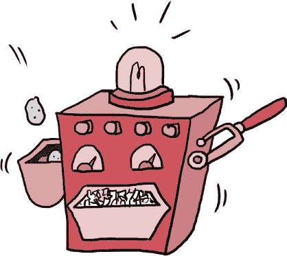
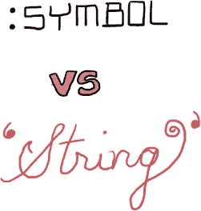
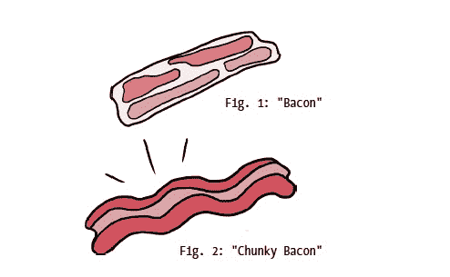

# 第六章：Ruby 的哈希表中的（厚切）培根

# 符号！

“那个哈希表真棒！”斯嘉丽说。鲁本一边点头一边猛地将另一份鸡蛋和哈希菜肴塞进嘴里。

“很高兴你喜欢！”大汉克说。“不过上午的高峰期马上就要到了，我们得加紧准备了。”


斯嘉丽从凳子上跳了下来。“我们有鸡蛋要煎、土豆要擦、香肠要煮、早餐肉汁要做、饼干要烤。还有别的什么吗？”

汉克转动了他的胡子。“我不确定，”他说，“让我们看看你们和斯奎基·吉姆做的菜单吧。”

“好！”斯嘉丽说，她在厨房的计算机装置上调出了哈希餐厅的菜单：

```

>> **hashery_menu**
=> { :eggs => 2, :hash => 3,
     :jam => 1,
     :sausage => 2,
     :biscuit => 1..3 }

```

“这看起来不错——每一道菜都与它的价格在哈希表中关联，”大汉克说，“但我们也应该把我们的早餐饮料加上。你能为我的菜单哈希加一个包含数组作为值的键吗？”

“当然，”斯嘉丽说。“那我们应该放哪些饮料？”

“我们有咖啡、橙汁和茶，”汉克说。

“好！”斯嘉丽说。她输入了：

```

>> **hashery_menu['drinks'] = ['coffee', 'orange juice', 'tea']**
=> ["coffee", "orange juice", "tea"]

```

“啊哈！原来这是往哈希表里添加一个键的方法，”汉克说。

“没错！”斯嘉丽回答说。“你只需输入哈希表的名字，然后在方括号中输入键名——这里，我们使用的是`'drinks'`——然后将整个表达式赋值为你喜欢的任何值。看，我们是怎么更新`hashery_menu`的？”

```

>> **hashery_menu**
=> {:eggs=>2, :hash=>3, :jam=>1, :sausage=>2, :biscuit=>1..3,
"drinks"=>["coffee", "orange juice", "tea"]}

```

“酷！”鲁本说，终于吃完了他的鸡蛋和哈希菜肴。“现在菜单上有了饮料的列表。”他凑近计算机装置发光的屏幕，“不过看起来`drinks`哈希键是一个字符串，而其余的都是符号。这样有区别吗？”

“哦，*当然*有区别！”斯奎基·吉姆说，他正打开土豆袋并清理哈希餐厅巨大的 Grate-O-Matic。他将纸帽子推得更高一点，靠在机器上。“你看——”他开始说，但在他讲话的同时，肘部不小心按下了机器的大开关，机器突然启动，发出咆哮声，吓得斯奎基·吉姆差点摔倒好几次，才拼命把它关掉。



“你看，”吉姆 squeaked（发出尖锐的声音）地说，在他终于关掉 Grate-O-Matic 后，“尽管我在 Ruby 方面不太擅长，但我*确实*时不时地会尝试编程厨房的计算机装置。有一天早晨，哈希餐厅超级忙——这是我见过的最忙的上午高峰期之一！”

“我记得那个，”大汉克说，一边从闪亮的红色冰箱里拿出一大把香肠。“我们不仅有大量顾客，而且那天还是‘自选菜单日’。”

“自选菜单日？”鲁本问，一边挠着头。

大汉克点了点头，开始把香肠从长长的链条上拉下来，丢进一个巨大的平底锅里。“没错。我们让顾客自己创建个人菜单，这样他们可以点任何自己想要的东西。开始的时候没问题——人们在做菜单、点餐、吃饭。但随着时间推移，程序变得越来越慢。在高峰期，我们几乎无法完成任何订单！我们不得不关闭厨房的计算装置，手动处理所有订单。简直是一片混乱。”

吱吱作响的吉姆点了点头。“我想我知道为什么了！”

汉克停下了拉香肠的动作。“你知道？”

“没错！”吉姆说，“我前几天在读 Ruby，试图提高一下自己在厨房里的操作技巧，发现 Ruby 符号比字符串占用更少的内存。在‘自己做菜单’那天，我们把所有哈希表的键都用了字符串，随着程序运行，内存越来越多，直到没有足够的内存去完成任务。”

“稍微退后一点，”国王边咀嚼着一块生土豆边说，“这些 Ruby 符号到底是什么？你说它们比字符串占用更少的内存是什么意思？”

# 符号的简要介绍

当吱吱作响的吉姆试图向大家解释 Ruby 符号时，我来给你简要总结一下。基本上，Ruby 符号就是一个 *名称*。例如，如果我在谈论国王，而斯卡利特也在谈论国王，那么我们讨论的就是同一个东西——国王！在 Ruby 中，当我们谈论符号（即名称）时，会在前面加上冒号，像 `:the_king`。你经常会看到符号名称中有 *下划线* (`_`)，因为和变量名一样，符号名称中不能有空格。

那么，符号和字符串（比如 `'The_King'`）到底有什么不同呢？好吧，回想一下国王在第二章的字符串。现在，假设国王有 *两个* 上面挂着 *完全相同* 珠子和饰品的字符串。虽然它们的 *内容* 可能相同，但它们并不是 *完全相同的东西*。但是当我们谈论国王时，我们并不是在谈论两个长得一模一样的国王，而是在谈论 *同一个* 国王！

如果你还有点困惑，不用担心：我有几个代码示例可以帮助你完全搞清楚。启动 IRB，然后试试这个：

```

>> **string_one = 'The King'**
=> "The King"
>> **string_two = 'The King'**
=> "The King"
>> **string_one.object_id**
=> 2184370320
>> **string_two.object_id**
=> 2184365180

```

这里我们把两个 *不同* 的变量设置为相同的字符串值 `'The King'`。然后，当你对这两个变量使用 `object_id` 方法时，你是在要求 Ruby 提供它用来跟踪每个对象的唯一编号。这是 Ruby 用来区分对象的 ID 号，并且没有两个对象的 ID 是完全相同的。相反，如果两个变量有相同的对象 ID，它们 *必须* 指向同一个对象。

你在 IRB 中看到的对象 ID 数字可能不会和我的*完全*一样，但没关系！每次你启动一个新的 Ruby 程序时，对象 ID 都会重新分配。重要的是，`string_one`和`string_two`，尽管它们的值都等于 `'The King'`，却是*不同的对象*。它们的内容完全相同，但就像我们之前提到的“国王的字符串”例子一样，我们讨论的是两个完全不同的字符串，只不过它们恰好包含相同的内容。

现在看看*这个*：

```

>> **symbol_one = :the_king**
=> :the_king
>> **symbol_two = :the_king**
=> :the_king
>> **symbol_one.object_id**
=> 466088
>> **symbol_two.object_id**
=> 466088

```

这里我们设置了两个不同的变量，`symbol_one` 和 `symbol_two`，都指向符号 `:the_king`。再次强调，你的对象 ID 可能不会和刚才显示的数字完全相同，但当你比较 `symbol_one` 和 `symbol_two` 的对象 ID 时，你会发现它们是完全相同的数字！就像我们谈论国王时，我们指的是同一个人一样，`symbol_one` 和 `symbol_two` 也指的是同一个对象，`:the_king`。

因为符号仅仅是你可以随便使用的名称，所以你不需要为它们赋值。虽然你可以明确地说：

```

>> **variable_name = :my_fancy_symbol**
=> :my_fancy_symbol

```

你*不能*说：

```

:my_fancy_symbol = some_value

```

如果你这样做，你会得到一个`SyntaxError`。就像你不能通过把字符串或数字放到等号的左边来给它们赋不同的值一样，你也不能给符号赋不同的值。

唯一会把符号放在等号左边的情况，是当你在哈希中使用它们时，像这样：

```

>> **fancy_words = { bloviate: 'To talk at length' }**
=> {:bloviate=>"To talk at length"}

```

记住，如果我们使用更新的哈希语法，就不需要在 `bloviate` 键前加冒号。如果我们想使用旧的哈希箭头语法（`=>`），我们就需要在符号前加冒号：

```

>> **fancy_words = { :bloviate => 'To talk at length' }**
=> {:bloviate=>"To talk at length"}

```

但的确！我*确实*还在继续。那么你可能会想知道：符号到底有什么用？它们为什么比字符串占用更少的内存？

因为符号总是只有一个对象 ID，它只会在每个 Ruby 程序中创建一次。这意味着你可以创建成千上万的变量，它们都指向相同的符号对象，而只有*一个*符号对象被创建。如果你用字符串做这个操作，它们的对象 ID 会不同，这样你就会得到*成千上万的不同字符串*。就像你一样，Ruby 也只有有限的内存，不能同时跟踪太多的东西。如果你创建大量字符串，Ruby 在试图管理它们时就会耗尽内存，程序会变得非常慢，甚至崩溃！如果你使用符号，Ruby 会创建更少的对象，使用更少的内存，因此，使用符号的程序（比如作为哈希键的符号）会比使用字符串的等效程序运行得更快。这就引出了那个“千百万亿”级的问题：你什么时候应该利用符号带来的内存节省呢？

基本上，每当你需要重复使用一个名称，但又不想每次都创建一个全新的字符串时，符号是最好的选择。它们非常适合用作哈希键，也可以用来引用方法名。我们很快就会讨论如何将符号用作方法名！



说到“马上”，我敢肯定吱吱作响的吉姆快要结束他对 Ruby 符号的解释了。让我们看看鲁本、斯嘉丽、国王和大汉是否对符号有和你一样好的理解！

# 符号与哈希，终于在一起了

“我想我明白了，”鲁本说。“符号只是 Ruby 用来指代特定对象的名称，所以如果我们在哈希中使用符号作为键，我们实际上是在反复引用同一个对象。”

“完全正确！”吱吱作响的吉姆说。“现在你明白为什么我们在用字符串而不是符号做‘自建菜单’哈希时遇到了那么大的麻烦了。”

“当然！”斯嘉丽说。“每次顾客制作新菜单时，都会生成一堆新的字符串。”

“我们有成百上千的顾客，”大汉叹了口气。“难怪我们的 Ruby 程序内存不够用了！”

“嗯，我当然不想现在就开始把字符串加到菜单里，”斯嘉丽说。“我们怎么才能把字符串键改成符号呢？”她在计算装置中输入`hashery_menu`来调出哈希菜单的内容：

```

>> **hashery_menu**
=> { :eggs => 2, :hash => 3,
     :jam => 1,
     :sausage => 2,
     :biscuit => 1..3,
     "drinks" => ["coffee", "orange juice", "tea"] }

```

“嗯，”国王说。“我们能不能直接把字符串键改成符号键？”

“我不这么认为，”吱吱作响的吉姆说。“根据我读到的内容，我觉得我们能做的最好的办法是删除字符串键，然后用符号键替代它。”

“你说得对，”鲁本说，“但编程就是要不断试验。我听说 Ruby 有一个`to_sym`方法，可以把字符串转换成符号。我们要不要试试？”

“没问题，”斯嘉丽说，她打字：

```

>> **hashery_menu.keys.last.to_sym**
=> :drinks

```

“看起来成功了！”鲁本说。“你能再调出哈希看看确认一下吗？”

斯嘉丽点了点头，再次调出了哈希菜单。

```

>> **hashery_menu**
=> { :eggs => 2, :hash => 3,
     :jam => 1,
     :sausage => 2,
     :biscuit => 1..3,
     "drinks" => ["coffee", "orange juice", "tea"] }

```

“糟了！”鲁本说。“Ruby 返回了字符串 `'drinks'` 的符号版本，但它并没有真正改变哈希中的键。”

“这倒也好，”大汉说。“我一直在想我们的早餐饮品，突然意识到我们根本没在数组里放价格！”

斯嘉丽拍了拍额头。“没错！”她说。“我们需要把饮料*和*价格都放进去。”她想了想。“等等——如果我们在关联饮料和它们的价格，那不就像是将每个食物项和它的价格关联起来吗？我们能不能把哈希放到另一个哈希里面？”

“没别的办法了，只有实验！”国王说。“你不如按照吉姆建议的，先删除`"drinks"`键，然后试试加一个符号键，把哈希作为值放进去？”

“好的！”斯嘉丽说。“吉姆，你知道怎么从哈希中删除一个键吗？”

“我想是的，”吉姆说，他伸手过来开始在计算装置上打字：

```

>> **hashery_menu.delete('drinks')**
=> ["coffee", "orange juice", "tea"]

```

“哇，那是什么？”鲁本说。“当你删除了键时，它居然把值还给你了！”

吉姆点点头。“那就是`delete`方法的作用！”他说。“这样，如果我们想用删除的键的值做点什么，我们就可以把它保存到变量里，像这样：

```

menu_drinks = hashery_menu.delete('drinks')

```

“不过，”Jim 说，“现在*不能*这么做，因为`'drinks'`键已经没了。看到了吧？”他再次输入：

```

>> **hashery_menu**
=> { :eggs => 2, :hash => 3,
     :jam => 1,
     :sausage => 2,
     :biscuit => 1..3 }

```

“干得漂亮！”Scarlet 说。“现在我们只需要测试一下是否能将哈希放在哈希里。Big Hank，饮料的价格是多少？”

“咖啡一美元，橙汁两美元，茶一美元。” Hank 说。Scarlet 在计算装置中输入：

```

>> **hashery_menu[:drinks] = { :coffee => 1, :orange_juice => 2,**
**:tea => 1 }**
=> { :coffee => 1, :orange_juice => 2, :tea => 1 }

```

“成功了！”国王大声喊道。“大家干得好！”

“就在千钧一发之际！” Big Hank 大声说道。大家都忙着围绕计算装置，致力于使 Hashery 菜单完美无缺，根本没有注意到周围愈发喧闹的声音。顾客们涌入 Hashery，空气中充满了声音，甚至 Big Hank 都得大声喊叫，才能让大家听见：“启动 Grate-O-Matic！照看好煎锅！像你们的命运依赖一样烤饼干！上午的高峰期来了，他们饿了！”

“是的，Hank！” Squeaky Jim 说道，他不仅*没有*发出尖锐的声音，还启动了 Grate-O-Matic，开始像做了一辈子一样翻制哈希。“把新的菜单送到所有顾客手中！”

“菜单！差点忘了，”Hank 说。“今天的特别菜单上还有一个新添加。”然后他输入了：

```

>> **hashery_menu[:chunky_bacon] = 1**
=> 1

```

“ chunky bacon？” Scarlet 和 Ruben 一起问道。



Hank 微笑着耸耸肩。“我有个朋友以前常来点这个，”他说。“有段时间没见到他了，所以我没有把它放进菜单里。但谁知道呢？”他望向越来越多的饥饿的 Hashery 顾客。“也许今天是他回来的一天。”

# 上午的高峰期

现在你已经了解了符号，你可以应付任何规模的上午高峰期，不用担心会让 Ruby 程序变慢或内存不足。事实上，你已经成为了 Ruby 符号的高手，以至于 Big Hank 和 Squeaky Jim 给了你一个他们到目前为止觉得不可能完成的任务：将他们的老式“自定义菜单”转变为使用符号作为键而不是字符串！

这一想法一开始听起来可能有点奇怪，但它只是为了确保你能够舒适地使用 Ruby 哈希表；每次使用它们时，你不必每次都将所有的键都转换成符号。哈希表非常适合存储像我们 Hashery 菜单这样的信息，你会在编写 Ruby 代码时反复使用它们——不仅仅是本书中的代码。

之前，我们看到不能仅仅对哈希表的键调用`to_sym`并期待它神奇地改变；相反，我们必须删除键并替换它。

对于单个字符串键来说，这样的做法还行，但 Hank 和 Jim 讨论的是成千上万的字符串，遍布数百个顾客的菜单——即使你想，也不可能一个一个地转换它们！但是，如果我们能*自动*遍历一个哈希表，做精确的操作：抓取每个字符串键，删除它，保存键的值，并将该值赋给一个新的符号键呢？

我们创建一个新文件，命名为 strings_to_symbols.rb。（如果你不记得如何做，可以参考第一章，或者向最近的成年人寻求帮助。）然后用你的文本编辑器打开文件，并输入以下内容：

```

my_own_menu = { 'tater_tots' => 2,
  'fancy_toast' => 3,
  'omelette' => 3,
  'tiny_burger' => 4,
  'chunky_bacon' => 1,
  'root_beer_float' => 2,
  'egg_nog' => 2
}

```

在这里，我们创建了一个全新的哈希表，名为`my_own_menu`，并将一些值（价格，数值类型）分配给一些键（菜单项，字符串类型）。继续往程序中添加内容，我们还没有完成！

```

puts "Object ID before: #{my_own_menu.object_id}"

```

接下来，我们将打印出我们菜单哈希的对象 ID。这是为了之后确认，尽管我们对哈希做了一些修改，但它仍然是同一个对象；在我们修改了键和值之后，如果对象 ID 与之前相同，那么我们就可以确定它是同一个哈希，只不过其中的信息不同了。

继续在*strings_to_symbols.rb*中添加内容。现在我们有了哈希键的字符串，但我们真正想要的是符号！我们需要添加一点代码，将字符串键转换为符号键。

```

my_own_menu.keys.each do |key|
  my_own_menu[key.to_sym] = my_own_menu.delete(key)
end

puts "Object ID after: #{my_own_menu.object_id}"

puts my_own_menu

```

好了，就到这里。我们对`my_own_menu`哈希调用`keys`方法来获取键，然后立即对这些键调用`each`方法进行迭代。（还记得第五章吗？如果需要提示，可以回头看看。）

这里是非常酷的部分：对于哈希中的每个键，我们对键调用`delete`（它会将键从哈希中移除），但因为`delete`返回的是被删除的键所关联的值，我们立刻将其赋值为对该键调用`to_sym`。这是一个惊人的双重效果：它不仅删除了哈希中的原始键，还立刻将值添加到了一个*新的*键上，而这个新键就是原始键转换成的符号。结果是什么？你将哈希表中的所有键从字符串转换成了符号！

我们甚至可以证明这就是同一个哈希，而不是它的副本：我们在遍历哈希之前和之后打印哈希的对象 ID，你会看到输出中两次显示的对象 ID 是完全一样的。没错——*每个*对象在 Ruby 中都有一个对象 ID，包括哈希本身！

你的完整代码应该是这样的：

strings_to_symbols.rb

```

my_own_menu = { 'tater_tots' => 2,
  'fancy_toast' => 3,
  'omelette' => 3,
  'tiny_burger' => 4,
  'chunky_bacon' => 1,
  'root_beer_float' => 2,
  'egg_nog' => 2
}
puts "Object ID before: #{my_own_menu.object_id}"

my_own_menu.keys.each do |key|
  my_own_menu[key.to_sym] = my_own_menu.delete(key)
end

puts "Object ID after: #{my_own_menu.object_id}"

puts my_own_menu

```

运行你的代码吧——输入**`ruby strings_to_symbols.rb`**并按下 ENTER 键。输出应该如下所示：

```

Object ID before: 2174149520
Object ID after: 2174149520
{:tater_tots=>2, :fancy_toast=>3, :omelette=>3, :tiny_burger=>4,
:chunky_bacon=>1, :root_beer_float=>2, :egg_nog=>2}

```

你应该看到相同的对象 ID 打印两次，然后是你的哈希表的漂亮输出，键变成了符号而不是字符串。

# 符号还能做什么？

现在你可以轻松解决大汉克和吱吱吉姆的菜单问题，你可能会想知道还能做些什么。如同鲁本所说，实验是编程的一个重要部分，你可以用哈希和符号做很多实验。例如，如果你对一个包含空格的字符串调用`to_sym`，会发生什么呢？（你仍然会得到一个符号，但它看起来会很奇怪——试试看吧！）

我们还可以探索哈希嵌套哈希。记住，我们可以像这样访问哈希中的值：

```

>> **hash_name[:key]**
=> value

```

那么，你会如何访问嵌套哈希中的哈希值呢？这里有个提示——对于我们的原始菜单：

```

>> **hashery_menu**
=> { :eggs => 2, :hash => 3,
     :jam => 1,
     :sausage => 2,
     :biscuit => (1..3),
     :drinks => { :coffee => 1, :orange_juice => 2, :tea => 1 } }

```

你觉得`hashery_menu[:drinks][:orange_juice]`会返回什么？

最后，字符串有一个`to_sym`方法，可以将其转换为符号，但符号*也*有一个`to_s`方法（即“to string”的缩写），可以将其转换为字符串。你会如何更新这个程序，将符号键转换为字符串？

# 你知道这个！

本章我们只讨论了哈希和符号，但由于它们不像数字、字符串（甚至数组）那样容易理解，因此值得再讲一遍。（天哪，我已经写了多年的 Ruby 了，*仍然*觉得符号很奇怪！）

首先，我们看了如何往哈希中添加键值对，这就像用方括号（`[]`）将键设置为一个值一样简单：

```

my_hash[:key] = value

```

接下来，我们介绍了符号，它们基本上就是名字；你不需要给它们赋值，但如果需要的话，你可以将它们存储在变量中。

例如，这样是可以的：

```

my_variable = :my_symbol

```

但*这样做*会导致错误：

```

:my_symbol = some_value

```

符号唯一可以出现在左边的情况是当我们把它们当作哈希键使用时，如下所示：

```

>> **my_hash = { ninjas: 'awesome',**
>>   **wizards: 'pretty rad',**
>>   **warrior_princesses: 'super tough'**
>> **}**
=> {:ninjas=>"awesome", :wizards=>"pretty rad", :warrior_
princesses=>"super tough"}

```

当你在谈论国王、老师或亚伯拉罕·林肯时，你说的总是*完全相同*的人；同样，符号总是指向*完全相同*的对象。这意味着它们比字符串占用更少的内存，因为每次你创建一个新的字符串——即使它和另一个字符串的*所有字符*都一样——它仍然是一个独立的对象，并拥有自己的对象 ID：

```

>> **symbol_one = :the_king**
=> :the_king
>> **symbol_two = :the_king**
=> :the_king
>> **symbol_one.object_id**
=> 466088
>> **symbol_two.object_id**
=> 466088 # The same!
>> **string_one = 'The King'**
=> "The King"
>> **string_two = 'The King'**
=> "The King"
>> **string_one.object_id**
=> 2184370320
>> **string_two.object_id**
=> 2184365180 # Different!

```

一般来说，符号适用于你需要反复使用一个名字的情况，主要用于哈希键以及其他一些巧妙的小技巧（我们将在后续章节中进一步讨论）。当你关心某个事物的*内容*时，你应该使用字符串；当你关心某个事物的*名称*时，你应该使用符号。

如果你不确定两个对象是否相同，你可以使用`object_id`方法（它适用于任何 Ruby 对象）来获取对象的 ID 号。每个对象都有一个唯一的 ID 号，这就是 Ruby 在程序中区分对象的方法：

```

>> **'The King'.object_id**
=> 2187090900
>> **{ :eggs => 2, :hash => 3 }.object_id**
=> 2187097060
>> **['eeny', 'meeny', 'miny', 'moe'].object_id**
=> 2187104080

```

记住，你的对象 ID 不会和这里显示的完全相同，但它们应该在你的计算机上彼此不同。

在符号和字符串之间转换非常简单！你可以使用`to_sym`方法将字符串转换为符号：

```

>> **'drinks'.to_sym**
=> :drinks

```

你也可以使用`to_s`方法将符号转换为字符串：

```

>> :**drinks.to_s**
=> "drinks"

```

关于从哈希中删除键值对，你不仅知道可以通过`delete`方法来实现，还学到了`delete`不仅会从哈希中移除键值对*并且*返回该值，这样你就可以将其保存在变量中：

```

>> **simple_hash = { :one => 1, :two => 2 }**
=> { :one => 1, :two => 2 }
>> **saved_value_from_hash = simple_hash.delete(:two)**
=> 2
>> **simple_hash**
=> { :one => 1 }
>> **saved_value_from_hash**
=> 2

```

最后，你学到了一件事：百分之百允许将哈希存储在另一个哈希中，如下所示：

```

>> **fancy_hash = { :number_key => 42,**
>>   **:hash_key => { :first_value => 1,**
>>     **:second_value => 2**
>>   **}**
>> **}**
=> {:number_key=>42, :hash_key=>{:first_value=>1, :second_value=>2}}

```

你现在已经进入了 Ruby 的核心部分！好消息是，从这里开始基本上都是顺风顺水。虽然接下来*确实*有一些难度较大的概念，但一旦你掌握了基本的 Ruby 对象（如数字、字符串、数组和哈希），学会了如何使用它们的一些方法，并且对控制流等主题（使用`if`/`elsif`/`else`、循环和迭代器）变得得心应手，你就已经涵盖了大部分语言内容。如果你还不完全熟悉 Ruby，不用担心；虽然学习基础知识并不需要太长时间，但你可以根据自己的节奏深入探索。这也是我们接下来要做的：深入 Ruby 的核心，那里有一些听起来奇怪（但非常强大！）的“生物”在等待你。
