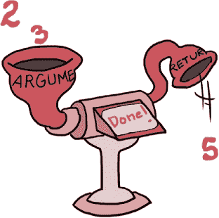

# 第七章 方法与区块的魔力

# 疯狂中的方法

“我想这就是最后一份了！”嘎吱吉姆说，一边把一堆散乱的哈希倒进了簸箕。“真是个忙碌的上午高峰！”

“我同意，”大汉克说。他把一个巨大的绿色堆肥袋扛到肩上，朝国王、斯卡莱特和鲁本笑了笑。“感谢今天所有的帮助！要不是你们在这里帮忙，我们可真麻烦了。”

“我们乐意效劳！”鲁本说，他正打包三盒哈希蛋。 “这里的食物真棒！”

“当然见过！”斯卡莱特说。“午餐高峰时你们还好吗？我们玩得很开心，如果你们需要帮助，我们还可以再帮忙。”

汉克笑着把一袋又一袋的东西扔进厨房那巨大的堆肥桶。“哈希瑞更像是一个早餐和早午餐的地方，”他说。“午餐高峰时客人通常不多。我想我们会没问题的。”他擦了擦手，看了看四周。“今天剩下的时间你打算做什么？”

“嗯，”国王说，“既然我们已经来到这里，我在想我们可以——”

“等一下。这是什么？”斯卡莱特打断了他，一边从嘎吱吉姆的簸箕里拿出一把看似散落的哈希。

嘎吱吉姆弯下腰去看。“大部分是泥土，”他说。

“但是这些小红针是什么？”她问。“还有这个闪亮的绿色东西？”

国王从他的王袍里拿出一只小放大镜，凑近了点，想看得更清楚。

“啊哈！我见过这些红色的针刺，”国王说。“它们来自卡尔迈恩松。”他仔细观察了那块闪亮的绿色物体。“不过这个，”他说，一边抚摸着自己蓬松的白胡子，“这个是我多年来做国王从未遇见过的。”

“它看起来像是鳞片，”鲁本说。“像是鱼或者蜥蜴的！”

“甜玉米松饼！”国王说。“你说得对！但它太大，不能来自任何普通的鱼类或蜥蜴。它到底来自哪里呢？”

“一步一步来，”斯卡莱特说。“卡尔迈恩松是什么？”

“卡尔迈恩松是王国东部的一片广袤的红色森林，”国王回答道。“事实上，就在这里走几分钟就能到了。”

斯卡莱特把鳞片翻转在手心里。“你们见过这样的东西吗，汉克？吉姆？”

“永远不会，”吉姆说，汉克摇了摇头。

斯卡莱特想了想。“如果这可能是哈希瑞计算机故障的线索，我们应该调查一下，”她说。“越早越好！”

国王用力点了点头。“这边，”他说。他转向大汉克和嘎吱吉姆。“再次感谢你们美味的午餐，伙计们！”他说。“明天我还会再来的！”

“我们乐意效劳，陛下！”汉克笑着说，他和嘎吱吉姆鞠了个躬。

国王、鲁本和斯卡莱特挥手告别了汉克和吉姆，走出哈希瑞，走进明亮的上午光线中。

“就在那里！”国王踮起脚尖指着说。卡尔迈恩松的红色树顶在不到一英里的地方可见。

“好吧，我们出发吧，”鲁本说道。“还有大把时间，只需要几分钟。”说完，他们三人朝森林出发。

“你知道，”Scarlet 过了一会儿说，“我觉得这些 Ruby 故障根本不是偶然发生的。”

“真的吗？”国王问。

“想一想！”Scarlet 说道。“你的字符串丢了，神秘管道溢出，循环出了问题，而 Hashery 的计算装置也坏了——这一切竟然是在同一天发生的？”

“嗯，那个绳子的部分可能是我搞错了，”国王不好意思地说道。

“不管怎样，我觉得 Scarlet 说的有道理，”鲁本说。“我觉得这……是*破坏行为*！”

“天哪！破坏？”国王说道。“谁会做出这样的事？”

“我不知道，”Scarlet 回答，“但不管怎么说，我们会弄明白的！”

又走了几分钟，三人终于到达了卡尔曼松树林的边缘。巨大的松树高耸入云，红色的针叶在阳光下闪闪发光。


Scarlet 伸手抓起一把针。她用另一只手翻找口袋，从中拿出了她在 Jim 的簸箕里找到的针。国王拿着放大镜检查了这两根针，足足看了快一分钟。

“完全一样，”他最后说道。“这些针确实是松树的针！”

“你说得对！”鲁本说。“但是既然我们已经到了这里，接下来该做什么？”

“我想我们会向一个了解这里情况的人求助，”国王说。

“怎么回事？”Scarlet 和鲁本异口同声地问道。

“当然，借助计算装置！”国王说道。

Scarlet 四下看看。“但是我们现在在森林里！”她说道。“这里到 Hashery 之间根本没有计算装置。”

“计算装置在王国的每个角落都有，”国王说道。“你只需要知道该在哪里找。”他伸手拉了拉一棵附近树的最低枝条，一台巧妙隐藏在树干里的计算装置随之从树里摇了出来。

“哇！”鲁本说。“那现在怎么办？”

“嗯，我想我们得用 Ruby 来查找住在松树林里的人，”国王说道。“即使我们找不到我们那根闪闪发光的绿色鳞片的主人，至少我们可能会找到可以帮忙的人。”

“完美！”Scarlet 说道。“那么每个计算装置里都有一个储存着王国居民目录的数据库？”

“嗯，是的，”国王揉了揉头。“但是有个问题，我对 Ruby 不太了解，但我*确实*记得曾经听说过，实际上没有内建方法来获取所有那些人的列表。”

鲁本坐在一块平坦的岩石上。“没有方法！”他说。“如果 Ruby 没有内建方法，我们怎么能找到人来帮忙呢？”

Scarlet 思考了一会儿。“嗯，”她说，“我*认为*我们是可以自己编写 Ruby 方法的，不过我以前从没见过这样做。”

“编写我们自己的 Ruby 方法？”国王问。“那太棒了！你确定这可能吗？”

“当然有可能！”一个附近的声音喊道。国王和斯嘉丽都吓了一跳，鲁本差点从岩石上掉下来。他们都转过身，朝着声音的方向看去，看到离他们只有几步远的地方站着……一个骑士，拔出了剑！

“啊！”鲁本喊道，试图躲到岩石后面。

“这到底是怎么回事，午夜小吃马尔济潘有什么关系？”国王质问道。

骑士停住了，随即匆忙把头盔的面甲推了上去。

“陛下！”她喊道，并深深鞠了一躬。“非常抱歉！我没认出您来，因为我的面甲盖住了脸。”她迅速将剑收回剑鞘。

“一位女骑士！”斯嘉丽说道。

“不，只是个骑士。”国王说道。“毕竟，如果她是个男的，你不会说‘一个男骑士’吧？”

“我想不是。”斯嘉丽承认道。

“你是谁？”鲁本问。


骑士挺直了腰背，自豪地把手放在臀部。“我是 Off-White 骑士！”她回答道。

“Off-white？”国王问道。“我觉得你的盔甲更像是蛋壳色。”

“也许是米色。”斯嘉丽眯着眼说。

“我觉得那是一只大鸟。”国王说。

“够了，别再闹了！”骑士说道。“我是*Off-White*骑士，现在是你们自卫的时候了！”

“啊！”鲁本又喊道，双手抱头。

骑士试图挠头，却不小心刮到了头盔的外部。“你为什么那样缩着身子？”她问道。

“你们不打算把我们杀掉吗？”鲁本问道。

那位 Off-White 骑士笑了。“天哪，绝对不是！”她说。“事实上，作为骑士，我的职责就是帮助卡门松树林中需要帮助的人，所以我来教你们如何编写自己的 Ruby 方法。”

“但这是白天。”国王说道。

鲁本和斯嘉丽交换了一个心照不宣的眼神。

# 定义你自己的方法

Off-White 骑士清了清嗓子。“是的。嗯，”她说，“我想说的是，你完全可以定义你自己的 Ruby 方法。你只需要使用特殊的词汇`def`和`end`。”她走到那个巧妙伪装的计算装置旁，开始打字。

```

>> **def simon_says(phrase)**
>>   **return phrase**
>> **end**

```

“你先输入`def`，这是*define*的缩写，因为你在定义一个全新的方法。接下来，输入方法的名字，在这个例子中是`simon_says`。然后在括号之间输入*参数*，这个方法只有一个参数：`phrase`。”

“什么？”国王一边揉着头，一边问道。

“参数。”Off-White 骑士说道。“它们就像占位符或你在调用方法时给方法传递的信息的昵称。”

“让我弄明白。”国王说道。“当你用`def`和`end`写出一个方法做什么的时候，那叫做*定义*这个方法。”

“没错。”骑士说。

“当你在某个地方实际使用方法时，那就是*调用*该方法。”

“的确！”骑士说，“有时候我们说*调用*而不是*调用*，但它们的意思完全一样。你定义一个方法，让 Ruby 知道它做什么，而你在需要使用时调用这个方法。调用一个方法看起来是这样的，”她继续说，并输入更多内容：

```

>> **simon_says('Prepare for battle!')**
=> "Prepare for battle!"

```

“我现在有点模糊了，”国王说。

“你总是有点模糊，”灰白骑士说，盯着国王蓬松的胡子。

“是的，是的，”国王说，“但是我仍然有些困惑。你能再讲讲如何调用方法吗？”

“当然！”骑士说，“当我们之前定义`print_sum`方法时，我们只是告诉 Ruby 每当我们使用`simon_says`这个名字时运行什么代码。然后我们可以通过写方法名并插入自己的信息——字符串``'Prepare for battle!'``——来使用这段代码，就像之前`phrase`参数一样。正如我所说，`phrase`就像一个占位符，直到我们准备好使用带有``'Prepare for battle!'``的方法时，它才出现在括号之间。”

“那`'Prepare for battle!'`周围的括号呢？”Ruben 问，“我之前看到过没有括号的 Ruby 方法调用。”

“你说得对！”骑士说，“括号是可选的；你通常在定义方法时使用它们，但在调用方法时，你可以选择使用或省略它们。对 Ruby 来说都是一样的！”

## return 与 puts

“好的，我现在明白定义和调用了，”国王说，“但这个`return`是怎么回事，它和`puts`有什么不同呢？它们不都是把东西打印到屏幕上吗？”

“啊哈！”灰白骑士说，“很多人觉得这很混淆，但我想我可以通过几个例子向你展示`return`和`puts`之间的区别。”

“这里我们定义了一个叫做`print_sum`的方法，它用`puts`打印两个数字的和，”她说：

```

>> **def print_sum(a, b)**
>>   **puts a + b**
>> **end**

```

“接下来，我们将定义第二个方法，它*返回*和。”

```

>> **def return_sum(a, b)**
>>   **return a + b**
>> **end**

```

“你看我们定义的`print_sum`和`return_sum`方法的区别了吗？”骑士问，“一个是`puts`，另一个是`return`。”Scarlet、Ruben 和国王都点了点头。

“完美！”灰白骑士说，“让我们看看这对我们 Ruby 代码的实际意义。首先，我们调用我们的`print_sum`方法。”

```

>> **sum = print_sum(2, 3)**
5
=> nil
>> **sum**
=> nil

```

“看到了吗？”骑士说，“`puts`会在屏幕上打印某些东西——在这种情况下，它加了`2`和`3`，并把结果`5`打印到屏幕上——但它不会*做*任何事与值`5`：它在打印后产生`nil`！当我们检查`sum`的值时，我们看到它是`nil`。”

“现在让我们调用我们的`return_sum`方法。”她继续输入：

```

>> **sum = return_sum(2, 3)**
=> 5
>> **sum**
=> 5

```



“*现在*我明白了，”国王说，“打印某个东西只是让该值出现在屏幕上，但*返回*它则让你将该值存储在变量中，就像我们对`sum`所做的那样。”

“你明白了！”骑士说。“一个方法就像一个小机器。东西进入它，东西从它出来。进入方法的东西在你调用时是它的*参数*，出来的东西是它的*返回值*。”

“如果一个方法没有特定的返回值，它会返回`nil`。你知道每次你`puts`或`print`一些东西时，看到`=> nil`吗？那是因为尽管`puts`和`print`方法在屏幕上写入文本，它们没有返回值，所以它们*返回*`nil`。”

“等一下，”国王说。“如果一个方法在没有其他返回值时能自动返回`nil`，为什么我们不能自动返回其他值呢？”

## 理解方法参数

“我们可以！”白骑士说。“每当你在方法定义中，Ruby 会自动返回最后执行的 Ruby 代码。如果你想省点打字，可以省略`return`关键字，只要方法的最后一行是返回值，Ruby 会自动为你返回它。”

“太棒了！”鲁本说。“任何能节省我们打字的方式都很好。现在，稍微回顾一下参数和参数之间的区别：参数是在方法*定义*中括号之间的便捷名称，用来告诉方法它将获得哪种类型的信息，而参数则是你在*调用*方法时实际传递给它的信息。”鲁本说道。

“完全正确！”白骑士说道。“等一下，让我再给你一个例子。”她愤怒地敲击着计算机装置，同时叙述着。“我们来定义一个叫做`add_things`的方法，它有`thing_one`和`thing_two`两个参数，并返回它们的和。它看起来应该是这样的：

```

>> **def add_things(thing_one, thing_two)**
>>   **thing_one + thing_two**
>> **end**

```

“接下来，我们将*调用*这个方法，传入参数`3`和`7`。返回值是`10`。”

```

>> **add_things(3, 7)**
=> 10

```

“太好了，”斯嘉丽说，“但是如果你想要有时候传递一个参数给方法，有时候又不传，怎么办？如果你没有传递正确数量的参数，Ruby 会抛出一个错误！”她在计算机装置上敲打：

```

>> **def plus_one(number)**
>>   **number + 1**
>> **end**

>> **plus_one 2**
=> 3

>> **plus_one()**
ArgumentError: wrong number of arguments (0 for 1)

```

“是的！”鲁本说。“这里，Ruby 说它得到了零个参数，但它期望得到一个。”

“很好的观点！”白骑士说。“在这种情况下，你可以使用*可选*或*默认*参数。那些是带有占位符值的特殊参数，如果你在调用方法时没有给 Ruby 传递这些参数，Ruby 会插入占位符。让我为你定义一个这样的函数。”她说道，开始再次在计算机装置上敲击键盘：

```

>> **def declare_name(name='The Off-White Knight!')**
>>   **puts name**
>> **end**

```

“看到等号了吗？”她说。“这告诉方法，如果没有其他指示，就使用这个字符串。现在，如果没有任何参数，方法将使用默认的名称，”她说。“我们来试试调用它！”她继续敲击键盘：

```

>> **declare_name()**
The Off-White Knight!
=> nil

```

“哇！”鲁本说。“你根本没传任何参数，所以默认值被自动使用了。”

“没错，”骑士说道。“而且，因为 Ruby 非常灵活，你甚至不需要括号就能表明你在调用一个方法！”她又输入了更多代码：

```

>> **declare_name**
The Off-White Knight!
=> nil

```

“这看起来有点*太*神奇了，”国王说道。“如果有很多代码在运行，我怎么才能立刻区分没有括号的方法和普通的变量？”

“这个观点很不错，”米白骑士说道。她试图擦去额头上的汗水，却不小心把面罩拉下来了。“我经常使用括号，因为它能清楚地表明我在使用一个方法，而不是其他东西，比如一个变量。”

“现在，假设你*确实*想用你自己的名字，”她继续说道，努力把面罩推回去。“你只需要传递它——带括号或不带括号——像这样。”她又输入了几行代码：

```

>> **declare_name('Lady Scarlet the Bold!')**
Lady Scarlet the Bold!
=> nil

>> **declare_name 'Sir Ruben the Fearless!'**
Sir Ruben the Fearless!
=> nil

```

“呼！”米白骑士说道。“让我休息一下，手套太累了。”

# nil 是什么？

“当然，”国王说道。“不过，我还是有点困惑 `nil`，”他说。“它*到底*是什么？”


“我想我知道答案了，”鲁本说道。“`nil` 是 Ruby 表达‘什么都没有’的一种方式。当 Ruby 想表达‘什么都没有’或者‘没有值’时，它使用 `nil`。”

“`nil` 是 `true` 还是 `false`？”国王问道。

“没有！”鲁本说。“它是它自己的东西。但它*确实*是 Ruby 中两个*假值*之一——另一个是 `false`。”

“你说的‘falsey’是什么意思？”国王问道。

“我的意思是，如果你在 `if` 语句中使用 `nil`，它将是 `true` 的反面，”鲁本说道。“这应该很熟悉。”他在计算装置中输入了代码：

```

>> **if nil**
>>   **puts "This text won't be printed!"**
>> **end**

```

“你的代码没有在屏幕上打印任何东西！”国王说道。

鲁本点了点头。“这是因为 Ruby 永远不会将 `if nil` 当作一个 `true` 条件。对 Ruby 来说，说‘if nothing’和‘if false’是一样的，所以它永远不会执行 `if nil` 和 `end` 之间的代码。”他想了想。“记得 `if` 语句吗？”他问道。

国王用力点了点头。“就像是昨天一样！”他说。

“是今天，”鲁本说道。

“番茄，番茄，”国王说道，两次发音完全一样。鲁本和斯嘉丽互相看了看，然后耸了耸肩。

“总之，”鲁本说道，“`if` 语句会获取一段 Ruby 代码，如果这段代码是 `true` 就做一件事，如果是 `false` 就做另一件事。`nil` 在 `if` 语句中总是被当作 `false` 来处理，因此，如果你想在一个值是 `nil` 时执行某些操作，你可能会认为需要这样做：

```

>> **if !nil**
>>   **puts "But I will get printed!"**
>> **end**

But I will get printed!
=> nil

```

“不过我们已经见过一段内置的 Ruby 代码，它和‘if not’的意思完全一样：`unless`！”鲁本又输入了一些代码：

```

>> **unless nil**
>>   **puts "But I will get printed!"**
>> **end**

But I will get printed!
=> nil

```

“`unless` 和 ‘if not’ 的含义完全相同。当我们说‘如果不困就熬夜’，这和‘除非困了就熬夜’的意思是一样的，”鲁本解释道。

“我以前见过这个！”国王说道。“我们在 Ruby 中使用 `unless`，每当我们本该使用 `if` 和 `!` 时。”

“对！”鲁本说。“`false` 和 `nil` 在 `if` 或 `unless` 语句中表现相同，但记住 `nil` 和 `false` 并不完全一样。”他继续输入：

```

>> **nil == false**
=> false

```

“你看到 `unless` 示例末尾的 `=> nil` 吗？”白色骑士问。“那就是我说的。`nil` 是 `puts` 的返回值。看一下！”她伸手越过鲁本的头，继续输入：

```

>> **puts 'Prepare for nil!'**
Prepare for nil!
=> nil

```

“关于 `nil` 还有最后一件事，”骑士说。“它不仅 *不是* 和 `false` 一样，它 *也不是* 和零一样！零是一个数字；`nil` 只是根本什么也不是。”

“我现在明白了，”国王说。

# Splat 参数

“对，”骑士说，“那么我们进入更多方法魔法！我已经告诉你如何让一个方法接收一个可选参数，但 Ruby 还允许你告诉方法接收 *任意数量* 的参数。*Splat 参数* 就是告诉 Ruby 方法：‘嘿，我会传给你一个完整的东西列表。我不知道有多少个，所以你就处理我传给你的任何数量吧！’”骑士活动了几下手指。“它们是这么工作的，”她说，然后开始输入：

```

>> **def declare_knights(*knights)**
>>   **puts knights**
>> **end**
>> **declare_knights('Lady Scarlet', 'Sir Ruben', 'The Off-White**
**Knight')**
Lady Scarlet
Sir Ruben
The Off-White Knight
=> nil

```

“你可以把我们第一行中的星号（`*`）看作是一个小的 splat 标记，它告诉方法接收所有的参数，无论有多少，并对它们做一些操作。”白色骑士说。

“我看到了参数名旁边的小星号，”国王说，“但在方法体内看不到，也没有在调用方法时看到。`*` 是不是只在定义方法时使用，并且只在圆括号之间？”

“正是如此，”骑士说。“Ruby 很聪明——你只需要告诉它一次！正如我提到的，”白色骑士继续道，“Ruby 会自动意识到方法体内最后出现的内容可能就是你想返回的东西。所以，如我之前提到的，如果你想省略一些输入，当方法的最后一行是返回值时，你可以省略 `return` 关键字。Ruby 会自动处理！这意味着，像这样：

```

>> **def add(a, b)**
>>   **return a + b**
>> **end**

>> **add(1, 3)**
=> 4

```

完全等同于这个！

```

>> **def add(a, b)**
>>   **a + b**
>> **end**

>> **add(1, 3)**
=> 4

```

“太棒了！”斯嘉丽说，“我肯定会记住这个技巧，等写我自己的方法时用上。”

“现在，”白色骑士说着，拔出剑，“是时候让你执行 YIELD 了！”

“啊！”鲁本喊道，再次用手捂住了头。

# 块方法

白色骑士费力地将剑重新插回鞘中。“你真的应该改掉那个畏缩的习惯，”她说。“我刚才说的是，当你写自己的 Ruby 方法并且接收块时，你需要使用 `yield` 关键字。”

“哦，”鲁本说，慢慢地又把手放了下来。

“等一下，你可以写自己的 Ruby 方法来接收块吗？”斯嘉丽问。

“当然！”骑士说。“你会像这样写，”她说着，在计算装置中输入：

```

>> **def my_block_method**
>>   **yield**
>> **end**
=> nil

```

“首先，”骑士说道，“我们定义一个方法，`my_block_method`，使用 `def`。接下来，我们使用 `yield` 关键字告诉方法让块中的代码运行；当你调用这个方法并传入一个块时，块中的内容就是方法执行的内容！让我们来看几个例子。”

```

>> **my_block_method { 1 + 1 }**
=> 2

```

“这里，我们调用 `my_block_method` 并传入一个块，块中只是加了 `1 + 1`，所以 `my_block_method` 返回 `2`。我们还可以做其他的事情，比如打印文本：”

```

>> **my_block_method { puts 'Hello from the block!' }**
Hello from the block!
=> nil

```

“`my_block_method` 让块中的代码运行，所以它打印出了 `Hello from the block!` 我们看到 `nil` 是因为 `puts` 在屏幕上打印文本，但它返回的值是 `nil`，”骑士解释道。

“块是什么来着？”国王问。

“块只是一些 Ruby 代码，放在大括号之间，或者放在 `do` 和 `end` 之间，”骑士说道，“你可能见过像 `each` 这样的内建方法使用块，但现在你也可以创建你自己的方法来使用块了！”

“太棒了！”Scarlet 说道，“但你能把 splat 参数和块一起使用吗？”

“你可以的！”骑士说道，“你可以将常规参数、默认参数、*和* splat 参数传递给你写的任何方法，并且它们可以按任何顺序出现。”

骑士伸了伸手指，打了个响指，开始在计算装置上输入，并一边解释：“让我们来构建一个我们可以用来快速轻松自我介绍的小工具，”她说道，“毕竟，我们骑士总是得到处去新城镇时介绍自己。”

```

>> **def all_about_me(name, age=100, *pets)**
>>   **puts "My name is #{name}"**
>>   **puts "I'm #{age} years old"**
>>   **if block_given?**
>>     **yield pets**
>>   **else**
>>     **puts pets**
>>   **end**
>> **end**
=> nil

```

“我们还没完，”骑士说道，“但让我们来回顾一下。首先，我定义了 `all_about_me` 方法，接受三个参数。我们看到一个普通的 `name` 参数和一个 `age` 参数，如果没有传入年龄，默认值是 `100`。”

“但是你本来可以先写上带默认值的 `age` 参数，再写 `name` 参数，”Ruben 说道。

“你明白了，”骑士说道，“终于，`*pets` splat 参数！它可以与常规或默认参数按任何顺序出现，不过我们正好把它放在了最后。”

“我明白这部分了，”国王说道，“但是 `block_given?` 是怎么回事？”

“那是一个 Ruby 内建方法，”骑士说道，“如果方法接收到了块作为参数，它会返回 `true`，否则返回 `false`。我写了 `all_about_me` 方法，它会在传入块时 `yield` 给块，传递宠物列表给块；否则，它只是用 `puts` 打印出宠物列表。如果 `block_given?` 现在还不完全明白也没关系——我们稍后会看到更多。”

“为什么是 `yield pets` 而不是仅仅 `yield`？”Scarlet 问道。

“这是个很好的问题，”骑士说道，“之前我们只是想让块处理传给我们方法的所有内容，所以我们简单地写了 `yield`。但现在，我们希望块只关注 `pets`，所以我们特意只将宠物列表传给块。”

骑士的手指再次在计算装置上移动，试验着他们新定义的方法。

```

>> **all_about_me('Ruben', 12, 'Smalls', 'Chucky Jim')**
My name is Ruben.
I'm 12 years old.
Smalls
Chucky Jim
=> nil

```

“那是我！”鲁本说道，“太棒了。我们还能做什么？”

“嗯，”白色骑士说道，“我们可以使用我之前提到的那个块！看看如果我们把一个块传递给我们的方法，然后通过 `pets` 引用我们传递的宠物会发生什么：”

```

>> **all_about_me('Ruben', 12, 'Smalls', 'Chucky Jim') { |pets| puts**
**pets.join(' and ') }**
My name is Ruben.
I'm 12 years old.
Smalls and Chucky Jim
=> nil

```

“这看起来和上一个例子很像，”红衣骑士说道，“但是这个块挺复杂的。它在做什么？”

“我来给你们讲解！首先，`{ |pets| puts pets}` 只是告诉 Ruby：‘嘿，块！我要传给你一个变量 `pets`，你应该把它打印出来。’”

“但是然后，`all_about_me` 只会打印出数组的元素，看起来不太好看，”红衣骑士说道。

“没错！”骑士说道，“所以我也在使用一个内建的 Ruby 方法，`join`。Ruby 数组的元素可以通过 `join` 方法连接成字符串，所以我正在用 `join` 把宠物数组转化成一个字符串，中间用 `' and '` 连接。”

“你能给我们看一个别的例子吗？”鲁本问道。

“当然，”骑士说道，“这里有一个例子，我们可以用 `join` 把一个数字数组转换成一个字符串，每个数字之间加上 `'plus'`：”

```

>> **[1, 2, 3].join(' plus ')**
=> "1 plus 2 plus 3"

```

“Ruby 总是有新东西可以发现，”国王惊叹道。

# 进入达戈龙的巢穴

“说到发现，”红衣骑士说道，“这让我想起来了！”她在口袋里翻找。“你以前见过这样的东西吗？”她拿出了那片闪闪发光的绿色鳞片，让白色骑士检查。

“天啊！”白色骑士说道，“这片鳞片看起来像是达戈龙的！”

“你是说那只 *龙*？”鲁本猜测。

“不，达戈龙，”白色骑士说道，“那是她的名字。虽然她确实是一条龙。”

“一只母龙！”鲁本说道。

“不，只是一条龙，”白色骑士说道，“如果她是个男人，你会称她为‘男人龙’吗？”

“我猜不是，”鲁本承认道。他紧张地四处张望。“但是在卡尔敏松林里真有龙吗？”

“别担心，”骑士说道，“达戈龙是一只非常强大的龙，但她也非常聪明且有礼貌。事实上，我很惊讶你在麻烦发生的地方找到了她的一片鳞片。这听起来不像是我认识的达戈龙。”

“嗯，*听起来*我们最好去找她问问发生了什么，”国王说道，“带路吧，女士骑士！”

“去找达戈龙！”白色骑士说着，把面罩拉下来遮住了眼睛。“这边！”骑士朝森林深处走去，国王、红衣骑士和鲁本跟在后面。

走了几分钟后，他们开始听到低沉而有节奏的 *呼呼声*，就像有人在用风箱给火加油。

“那是什么？”鲁本低声问。

“达戈龙！”骑士低声说。“她在这里！”他们还没反应过来，便发现自己站在一只庞大的龙面前，这只龙蜷缩在一个闪闪发光的绿色圈子里，正在睡觉。


“达戈龙！”骑士喊道，把面罩推上她的头盔。

达戈龙没有睁开眼睛。“是吗？”她吼道，一股细细的烟雾从她的右鼻孔冒了出来。

“我带来了一些客人来看您，包括国王！”

达格龙的眼睛猛地睁开，立刻集中在他们四个人身上。达格龙展开身体，竖起身来，直立到了她的最大高度；她的头几乎碰到了周围松树的顶部。

“陛下！”达格龙说道，她低头行礼，差点让头碰到地面。

“达格龙女士，”国王说道。“我们带来一个稍微有点……不寻常的问题。”国王朝斯卡雷特点了点头。“这个是你的吗？”

斯卡雷特从口袋里拿出一片鳞片，递给了达格龙。达格龙盯着它看了几秒钟，然后慢慢摇了摇头。

“我不认为那是我的，”达格龙说道，“但我*确实*有很多鳞片。如果你们愿意，可以检查一下看看我是不是缺少了某一片。”

一行人花了将近一个小时检查达格龙，寻找松动或丢失的鳞片。斯卡雷特和鲁本四处搜寻。乳白骑士也努力地探寻。国王则在一棵高大的红松下小憩片刻。

“好吧，毫无疑问，”斯卡雷特最终说道，把那片神秘的鳞片靠近达格龙尾巴的尖端。“这*绝对*不是达格龙的。”她把鳞片放进口袋，沮丧地坐在鲁本旁边的岩石上。

“虽然我很高兴自己不是这些奇怪事件中的嫌疑人，”达格龙说道，“但我*确实*感到很抱歉让你们失望。”她想了想。“虽然我不能确定能帮上什么忙，但我可能知道能帮忙的人。”

斯卡雷特抬起了头。“谁？”她问道。

“至于游吟诗人，”达格龙说道。“他在猩红松树林中嬉戏歌唱，几乎走遍了王国的每个角落。如果有任何奇怪的事情发生，我确信他会知道。”

鲁本从岩石上跳了下来。“你能带我们去见他吗？”他问道。

“当然，”达格龙说道。“不过我们可能需要一段时间才能找到他。”

斯卡雷特站起来，拍了拍身上的灰尘。“实际上，我打赌我们可以很快找到他，”她说道。“既然我们现在知道如何定义自己的 Ruby 方法，我可能知道*正是*那个方法！”

# 你知道这个！

在定义自己的方法、创建使用代码块的方法以及了解像展开参数和默认参数这样的内容之后，你的大脑可能已经感觉非常充实了！我们花点时间回顾一下本章讨论的内容吧。

首先，你学会了如何编写自己的方法。我们用`def`开始方法定义，接着是方法的名字，然后是括号中的参数列表。最后，输入我们希望方法执行的代码，最后用`end`结束，像这样：

```

>> **def multiply_by_three(number)**
>>   **number * 3**
>> **end**

>> **multiply_by_three(2)**
=> 6

```

你还学会了方法可以有*默认*或*可选*参数。如果我们为一个接受可选参数的方法提供了参数，方法就会使用这个参数；否则，它会使用默认值：

```

>> **def multiply_by_three(number=2)**
>>   **number * 3**
>> **end**

>> **multiply_by_three**
=> 6

>> **multiply_by_three 3**
=> 9

```

如果我们想要一个可以接受任意数量参数的方法，我们可以通过在参数名前加星号（`*`）来使用*展开参数*：

```

>> **def print_all_the_names(*names)**
>>   **puts names**
>> **end**

>> **print_all_the_names('Larry', 'Curly', 'Moe')**
Larry
Curly
Moe
=> nil

```

说到`nil`，你已经学到没有显式*返回值*的方法会返回`nil`，这是 Ruby 表示“什么都没有”的方式。记住，返回一个值与仅仅在屏幕上打印它是不同的！

```

>> **puts 'Beware the Dagron!'**
Beware the Dagron!
=> nil

```

事实上，谈到返回值时，更常见的做法是省略`return`，让 Ruby 自动返回它运行的最后一段代码的结果。所以虽然你*可以*写成这样：

```

>> **def just_return_two**
>>   **return 2**
>> **end**

>> **just_return_two**
=> 2

```

用这种方式写会更符合 Ruby 风格：

```

>> **def also_returns_two**
>>   **2**
>> **end**
>> **also_returns_two**
=> 2

```

最后，我们看到如果要定义一个接受块的方法，只需要使用方便的`yield`关键字。我们可以不带参数地`yield`，将控制权交给块，或者传递参数，以便给块提供可操作的参数。

```

>> **def block_party**
>>   **yield**
>> **end**

>> **block_party { puts 'Hello from the block!' }**
Hello from the block!
=> nil

>> **def block_party_part_two(name)**
>>   **yield name**
>> **end**

>> **block_party_part_two('Haldo') { |name| puts "This is #{name}'s**
**party!" }**

This is Haldo's party!
=> nil

```

你在这一章学到了很多东西，但请记住：如果你对某个方法的功能或它期望的参数有疑问，你随时可以查阅 Ruby 文档，地址是 *[`ruby-doc.org/`](http://ruby-doc.org/)*。只要上网之前请确保先问问身边的大人！

说到查找新内容，我们将在下一章介绍一些新的 Ruby 代码——具体来说，如何组织、创建和控制我们自己的 Ruby 对象。
