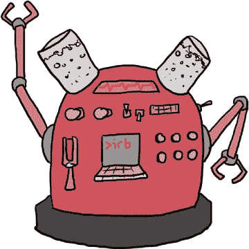

# 第十章：一种不同颜色的马

# 完全的熊猫乱象

国王、女王、鲁本和斯卡利特一层又一层地绕过楼梯，向皇家马厩走去。就在鲁本和斯卡利特以为这曲折的楼梯永远没有尽头时，女王来到了一扇沉重的橡木大门前，推开了它们。他们全都眯着眼睛跑进了宫殿后方田野的阳光里，离得不远处就是皇家马厩的入口。

“这边！”女王说道。“快点！”

他们跑到马厩的前门，那里有两名女王的卫兵在等候。每个卫兵都抓住了一位非常眼熟的皇家水管工高级学徒的胳膊。


“哈尔多！”鲁本倒吸一口气。

“好了好了，”国王说道，“我相信这一切一定有合理的解释。”尽管他说着这些话，国王看上去依然很担心。他转向哈尔多。“哈尔多，这一切的解释到底是什么，天晓得你到底做了什么？”

在哈尔多来得及回应之前，女王走近卫兵。“哈尔多不是我在我的皇家办公室里看到的那个人，”她说道。“那时有四个人，他们个头要矮得多。请放开他。”

卫兵们点点头，放开了哈尔多的胳膊。

“谢谢，殿下，”哈尔多说道，拍了拍自己身上的灰尘。

“你为什么在这里的马厩？”国王问道。

“这就是我们刚刚问他的，”那位鼻子弯曲的卫兵说道。

“我在试着解释，”哈尔多说道。“你看，经过在安布罗斯洞窟的搜寻却一无所获后，我回到了我的工作，作为皇家水管工的高级学徒。不过，我从斯卡利特和鲁本那里学到了很多 Ruby 的知识，因此我可以在几个小时内完成一天的工作。于是，我有些空闲时间，就兼任了皇家马夫的兼职学徒。”

“太棒了，”国王显然松了口气，看到哈尔多不是他们一直追的坏人。“真是一个全能的人！”

“我不确定我会走那么远，”哈尔多微微脸红地说道。

“陛下们，”那位没有弯曲鼻子的卫兵说道，“我们从女王的办公室追赶一群戴兜帽的人，但一旦他们到达这里的马厩，我们就失去了他们的踪迹。当我们看到发生的事情时，只有哈尔多一个人在附近。我们以为他可能卷入其中，于是我们召唤了女王。”他耸耸肩，“结果是哈尔多出来看看发生了什么事，试图帮忙。”

“等一下，”女王说道。“你在马厩看到*什么*事情了？”

卫兵们交换了一个不安的眼神。“你最好来看看，”那位鼻子弯曲的卫兵说道。

一行人匆忙走进马厩。两名卫兵指向第一个马厩，国王、女王、鲁本和斯卡利特探头望了进去。

“这是我见过的最奇怪的马，”国王说道。


“那……是一只熊猫，”鲁本说道。

“而且它是红色的！”女王呻吟道，“天啊，这里发生了什么事？”

“不应该是红色吗？”斯卡雷特问。

“一点也不！”女王说，“所有的皇家熊猫应该是紫色的！”她跑到下一个摊位，然后是下一个，再下一个。“这个是蓝色的！”她喊道，“这个是黄色的！一个熊猫都不是紫色的！”她摊开双手，“谁听说过紫色熊猫的狂欢游行，结果熊猫都是*除了*紫色的其他颜色？”

“等一下，熊猫以前是紫色的，但现在不是了吗？”鲁本说，“它们*天生*就是紫色的吗？”

“那么，紫色熊猫狂欢游行究竟是什么？”斯卡雷特问。

“一个一个来，”女王说。她转向鲁本，“不，熊猫不是天生紫色的。它们一出生是白色的，但我们给它们喂食特殊的营养丰富的食物，才让它们变成紫色的。至于游行，”她对斯卡雷特说，“我们每个月举行一次，庆祝王国的和平与繁荣。我们认为如果我们的生活中有一点疯狂，至少我们应该能掌控它。”她叹了口气，“当然，考虑到今天的混乱，我们是没法举行游行了。”

“别急，”斯卡雷特说，“我敢打赌我们能修好它！听起来像是有人动了熊猫食物的手脚。它在哪里？”

“在这边，”哈尔多说，“食物是由熊猫供应器 3000 号准备的。”

他们走过一排排摊位，走到马厩的另一边，那儿有一台巨大的圆形机器，上面布满了刻度盘和开关，正在嗡嗡作响。中间的一个熟悉的屏幕在发光。



“计算装置！”鲁本说，“熊猫供应器 3000 号是用 Ruby 编写的吗？”

“绝对是的，”哈尔多说，“自从你们帮我修好了神秘管道之后，我就尽可能多地学习 Ruby。我敢说我已经学得相当好了，”他说着，一边把大拇指挂在工装裤的带子上。“我甚至已经掌握了这个熊猫供应器。”

“你能告诉我们有人动过熊猫的食物吗？”鲁本问道。

“那你能修好吗？”女王焦急地问道。

# 创建模块

“我想是的，”哈尔多说，“我们看看。”他打开了一个名为*colorize.rb*的文件，这时大家看到的内容是：

```

module Colorize
  def color
    [:red, :blue, :green, :yellow].sample
  end
end

```

“啊哈！”哈尔多说，“我看出了问题所在。有人把`color`方法改成了返回一个随机颜色的符号——红色、蓝色、绿色或黄色。这就是`sample`方法的作用，”他解释道，“它从一个数组中挑选一个随机项。”

“这就是为什么熊猫都是不同的颜色，*除了*紫色！”鲁本说，“不过等一下——这个文件里根本没有关于熊猫食物的内容。那第一行是什么意思？”

“那个？那意味着这段代码是一个*模块*，”哈尔多一边挠着浓密的黑胡子一边说道，“你可以把 Ruby 模块看作是一个装满了方便的信息和方法的桶，随时可以用到。”

“它看起来像是一个类，”斯卡雷特说。

“这就像一个类！” Haldo 说。“像类一样，模块有它们自己的方法。事实上，模块其实就是：一组方法的集合！”

“那类和模块之间的区别是什么？” Ruben 问。

“模块实际上*和*类完全相同，只是我们不能使用`new`方法来创建新的模块，” Haldo 解释道。“首先，我们快速回顾一下类。”他启动了 IRB 并输入了：

```

>> **class FancyClass; end**
=> nil

```

“这只是创建了一个名为`FancyClass`的新空类，” Haldo 解释道。

“那个分号是做什么用的？” Scarlet 问。

“这只是告诉 Ruby 一行代码结束了，” Haldo 说。“通常在 IRB 中，你通过按 RETURN 或 ENTER 键开始新的一行来实现，但由于我们的类和模块定义是空的，所以我们可以使用分号告诉 Ruby 一行代码已经结束，并且我们将开始新的一行。”他耸耸肩。“有些人不喜欢使用分号。每个人有自己的喜好！现在，让我们创建一个`FancyClass`的实例。”

```

>> **FancyClass.new**
=> #<FancyClass:0x000001044d80c8>

```

“你们以前创建过类的实例，对吧？” Haldo 问。Scarlet 和 Ruben 点了点头。“很好！”他说。“现在，让我们创建一个模块，尝试创建它的实例。”

```

>> **module ImportantThings; end**
=> nil

>> **ImportantThings.new**
NoMethodError: undefined method `new' for ImportantThings:Module

```

“尝试创建模块的实例会导致错误，因为模块没有像类那样的`new`方法，” Haldo 说。

“所以，如果你不能创建模块的实例，” Ruben 说，“那你*能*用它做什么？”

“我来给你们展示！” Haldo 说，“让我们创建一个自己的模块。”他输入了：

```

>> **module Bucket**
>>   **MAX_BITS_AND_TRINKETS = 100**

>>   **def announcing_bits_and_trinkets**
>>     **puts 'Step right up! Bits and trinkets available now!'**
>>   **end**
>> **end**
=> nil

```

“`MAX_BITS_AND_TRINKETS`是什么，” Scarlet 问，“为什么它是全大写的？”

# 常量

“那是一个*常量*，” Haldo 说。“常量像变量，但一旦你设定了它们的值，就不能再改变。它们以大写字母开头——例如，类名和模块名就是常量——虽然你*技术上*可以在 Ruby 程序中重新赋值给常量，但 Ruby 会警告你这么做。看？”他输入了：

```

>> **RUBY = 'Wonderful!'**
=> "Wonderful!"

>> **RUBY = 'Stupendous!'**
(irb):2: warning: already initialized constant RUBY =>
"Stupendous!"

```

“当你创建一个不是类或模块的常量时——也就是说，只是一个不会改变的值的名字——你通常会把它写成全大写，” Haldo 说。

“常量只能在模块里使用吗？” Ruben 问。

“不行！” Haldo 说，“你可以在 Ruby 程序中的任何地方使用它们。我现在之所以提到它们，是因为类名和模块名在技术上是常量，因为它们以大写字母开头。”

“这挺酷的，” Scarlet 说，“但是如果常量和方法都被放在模块里，如何访问它们的全大写形式呢？”

“我很高兴你问了这个问题，” Haldo 说，笑着。“让我们来看一下！”他又输入了一些代码：

```

>> **class Announcer**
>>   **include Bucket**
>> **end**
=> Announcer

```

“在这里，我创建了一个`Announcer`类，它*包含*了`Bucket`模块。我们的`Bucket`模块包含一个常量`MAX_BITS_AND_TRINKETS`，它被设置为`100`，还有一个方法`announcing_bits_and_trinkets`，它会在屏幕上打印一些文字。

“当我们在类中`include`一个模块时，模块中的常量和方法可以被该类的任何实例使用。因为我们在`Announcer`中包含了`Bucket`，所以`Announcer`现在可以使用`Bucket`中定义的任何常量和方法！让我们创建一个`Announcer`实例，看看当我们使用`Bucket`中定义的方法时会发生什么。”

```

>> **loud_lucy = Announcer.new**
=> #<Announcer:0x00000103f0c5b8>

>> **loud_lucy.announcing_bits_and_trinkets**
Step right up! Bits and trinkets available now!
=> nil

```

“哇！”鲁本说。“`loud_lucy`知道如何使用`announcing_bits_and_trinkets`方法，尽管它在`Bucket`模块中定义！”

# 拓展你的知识

“完全正确！”哈尔多说。“但`include`并不是唯一一种将模块中定义的常量和方法引入其他类的方法。看看这个。”他又敲了一些代码：

```

>> **class Announcer**
>>   **extend Bucket**
>> **end**
=> Announcer

>> **Announcer.announcing_bits_and_trinkets**
Step right up! Bits and trinkets available now!
=> nil

```

“如果我们将模块`Bucket`通过`extend`引入类，那么这些常量和方法就可以被类本身使用，”哈尔多解释道。“在这种情况下，类`Announcer`——而不是它的实例`loud_lucy`——可以使用该方法。通常情况下，你会希望实例拥有该方法，而不是类，所以根据我的经验，你通常会更常使用`include`而不是`extend`。”

“记得我说过有一个 Ruby 技巧，让你可以将多个类的行为混合到一个类中吗？”女王问。“这就是方法！”

# Mixin 与继承

“等一下，”鲁本说。“所以你可以有一个类继承另一个类*并且*包括模块来添加额外的方法？”

“自己看！”哈尔多回答道，然后他敲了几行代码：

```

>> **module Enchanted**
>>   **def speak**
>>     **puts 'Hello there!'**
>>   **end**
>> **end**
=> nil

```

“首先，我创建了一个包含单一`speak`方法的`Enchanted`模块。”

```

>> **class Animal**
>>   **def initialize(name)**
>>     **@name = name**
>>   **end**
>> **end**
=> nil

```

“接下来，我创建了一个`Animal`类，用来设置我们创建的`Animal`实例的名字。”

```

>> **class Dog < Animal**
>>   **include Enchanted**

>>   **def bark**
>>     **puts 'Arf!'**
>>   **end**
>> **end**
=> nil

```

“在下一步中，我创建了一个继承自`Animal`并包含`Enchanted`模块的`Dog`类。如果我们做对了，我们的`Dog`实例应该能同时使用`Dog bark`方法*和*`Enchanted speak`方法。现在就试试看！”

```

>> **bigelow = Dog.new('Bigelow')**
=> #<Dog:0x000001049df148 @name="Bigelow">

>> **bigelow.bark**
Arf!
=> nil

>> **bigelow.speak**
Hello there!
=> nil

```

“当我们以这种方式使用模块时，我们称之为*mixin*，”哈尔多说，“因为你将新的常量和方法混合到一个现有的类中。基本上，`Dog`现在拥有了`Animal`和`Enchanted`的功能，尽管它仅直接继承自`Animal`。我们可以`include`任意多个类！假设我们在某个地方定义了所有这些模块，我们可以将它们一一使用：”

```

class Dog
  include Enchanted
  include Magical
  include AnythingWeLike
  # ...and so on and so forth
end

```

“所以如果你有一个`Dog`类和模块`Enchanted`、`Magical`以及`AnythingWeLike`，”国王说，“如果你用`Dog`类创建了一只狗，那只狗就可以使用`Enchanted`、`Magical`或`AnythingWeLike`中定义的任何方法。”

“完全正确，”哈尔多说。“我们也可以通过`extend`为我们的类引入任意多个模块。”他继续敲打着键盘：

```

class Dog
  extend Enchanted
  extend Magical
  extend AnythingWeLike
  # ...and so on and so forth
end

```

“太棒了！”斯卡利特说。

“等一下，”鲁本说。“这意味着在计算装置的某个地方，有一个包含`Colorize`模块的熊猫食物文件？”

# 引入另一个文件

“完全正确，”哈尔多说。“它的名字正是 *panda_food.rb*。看一下！”他打开了文件让大家看。“这就是控制熊猫食物的代码。”

### 注

*接下来的几个例子只是让你跟着看一看而已——按原样运行这些代码会导致错误！我们会在本章稍后自己运行这个例子。*

```

require './colorize'

class PandaFood < Food
  include Colorize

  attr_reader :calories

  CALORIES_PER_SERVING = 1000

  def initialize
    @calories = CALORIES_PER_SERVING
  end
end

```

“它是这么工作的，”哈尔多说。“我们选择一只熊猫——霍戈斯是我最喜欢的——看看我们能不能弄明白它的食物出了什么问题。”他说着，打开了 IRB 并输入：

```

>> **hogarths_food = PandaFood.new**
=> #<PandaFood:0x00000104480850 @calories=1000>

>> **hogarths_food.calories**
=> 1000

```

“`attr_accessor` 让我们访问 `@calories` 实例变量，它的值是 `1000`，”哈尔多解释道。“现在我们来看一下颜色！”

```

>> **hogarths_food.color**
=> :yellow

```

“嗯，”哈尔多说。“这能对吗？我们再试试。”

```

>> **hogarths_food.color**
=> :blue

```

“看到了吧！”哈尔多说。“你看到了吗？这就是我们的麻烦所在。其他在 Panda Provisionator 3000 上运行的 Ruby 程序在给机器指令制作食物时，会检查熊猫食物的颜色，它们得到的是黄色和蓝色，而不是紫色！”

“然后熊猫们吃了食物并变了颜色！”鲁本说。“哇，那应该是很快发生的。”

哈尔多点了点头。“熊猫们刚刚吃了食物。它们从白色变成其他颜色其实需要一些时间，但一旦它们变成了某种颜色，吃不同颜色的食物就会让它们的颜色立即变化。”

“所以把它们换回来应该是小菜一碟！”斯卡雷特说。“我们只需要把颜色改回紫色。”她研究了一会儿屏幕。“嘿，哈尔多，”她说，“这个 `require` 是干什么的？”

“我很高兴你注意到了这一点，”哈尔多说。“`require` 方法将 Ruby 代码从你当前工作之外的文件中引入！所以在 IRB 中你只是随便玩玩的时候不需要它，但如果你写了一个 Ruby 文件，你可以使用 `require` 来引入来自其他文件的代码。你甚至不需要输入 *.rb* 文件扩展名；只要输入 `require`，然后文件名作为字符串，就能立即使用那里的代码。”

他创建了一个名为 *test_colors.rb* 的文件，并开始输入：

```

➊ require './colorize'
➋ class TestColors
➌   include Colorize
  end

  test = TestColors.new
➍ puts test.color

```

哈尔多关闭了文件。当他运行 `ruby test_colors.rb` 时，他们看到的是：

```

$ **ruby test_color.rb**
blue
$ **ruby test_color.rb**
yellow

```

“看到了吗？”哈尔多说。“我们可以创建一个名为 *test_colors.rb* 的文件，然后在其中 `require` 我们之前看到的 *colorize.rb* 文件 ➊。一旦这么做了，我们可以创建自己的 `TestColors` 类 ➋，从 *colorize.rb* 文件中 `include` `Colorize` 模块 ➌，然后使用 `color` 方法 ➍！”

“不错！”鲁本说。“但为什么我们需要在 `colorize` 前加上 `./`？”

“这有点复杂，”哈尔多说，“不过简短的回答是，当你想要`require`一个 Ruby 文件时，你需要告诉 Ruby 去哪儿找它。`./`表示，‘就在这个文件夹里找！’如果我们需要从我们所在的文件夹*之外*的文件夹中引用东西，我们就用*两个*点告诉 Ruby 上一级文件夹。这可能会让人困惑，”哈尔多接着说，“所以我画了几张图来帮助自己记住。我想我还留着它们！”他在口袋里翻找了一会儿，然后拿出一张纸，展开，展示给国王、女王、斯卡利特和鲁本看。


“我明白了！”斯卡利特说，“一个点加一个斜杠表示‘在当前文件夹里找’，两个点加一个斜杠表示‘上一级文件夹找’，而每当我们需要进入嵌套文件夹时，我们就用斜杠分隔的文件夹名称。”

“完全正确，”哈尔多说。

“但是有没有这种情况，你*不*需要使用点或斜杠？”她问。

“那也有点复杂，”哈尔多说，“不过简短的答案是，当然可以。我可以找时间给你演示一下，但有一种方法可以使用互联网下载其他人写的 Ruby 文件集合，这些文件叫做*gems*，你可以在自己的代码中使用！”

“听起来真棒！”斯卡利特说。

“确实是！”哈尔多说，“等我们搞清楚这个谜题后，我很乐意给你展示。”

“我想我已经弄明白这一切了，”国王插话道，“但是自从你提到常量，我一直在想，包含一个模块到类中是获取它常量的唯一方法吗？”

# 查找常量

“一点也不！”哈尔多说，“看看这个。”他迅速在计算装置上敲打了几下：

```

>> **module APocketFullofMethods**
>>   **NUMBER_OF_METHODS = 42**
>> **end**
=> nil

>> **NUMBER_OF_METHODS**
NameError: uninitialized constant NUMBER_OF_METHODS

>> **APocketFullofMethods::NUMBER_OF_METHODS**
=> 42

```

### 注解

*这些示例如果你试试就能正常工作，所以赶紧试试吧！*

“这里，我定义了一个名为`APocketFullofMethods`的模块，”哈尔多说，“在其中，我放了一个常量，`NUMBER_OF_METHODS`，它的值是 42。你看，如果我从模块外部尝试访问`NUMBER_OF_METHODS`，我会得到一个`NameError`，但是如果我输入`APocketFullofMethods::NUMBER_OF_METHODS`，我就能得到`42`！”

“太棒了！”国王说。

“但是那两个连在一起的冒号是干什么的？”斯卡利特问。

“啊，我以前见过这个，”女王说，“那是*作用域解析操作符*，对吧，哈尔多？”

“哦，是的，”哈尔多说，“不过我觉得这个名字有点令人困惑。实际上，你可以把它当作一种查找方法：那四个点看起来像是一双小眼睛。它是我们指定查找哪个模块来找到我们创建的东西的方式。”

“真酷！”鲁本说。

“不是吗？”哈尔多说，“Ruby 模块主要有两个用途。第一个，正如我向你展示的，是将新行为混入到 Ruby 类中。第二个叫做 *命名空间*。你可以把它看作是为你命名的东西——主要是方法和常量——创建独立的空间。”他把太阳镜推到鼻梁上。“你看，如果你定义一个方法，并给它起个名字，然后再定义同名的方法，Ruby 会用新定义的方法替换旧方法。但如果你把一个同名的方法放进模块里，而模块外面也有一个同名的方法或常量，那你就可以同时使用它们！”

“模块必须创建一个新的作用域！”鲁本说。“所以有两个同名的方法，把一个放在模块里就像是有两瓶相同的汽水，一个在冰箱里，另一个不在。对于方法来说，一个在模块里（冰箱里），另一个不在，所以你可以根据它所在的位置来判断它们的区别。”

“没错，”哈尔多说。

“而且我们刚才说的关于方法的内容，对常量也适用吧？”斯卡雷特问道。

“它的确能！”哈尔多回答道。

“如果把一个模块放到另一个模块里面会发生什么？”鲁本问道。

“你只需要继续使用那些 `::` 点，”哈尔多说。“例如，如果你在 `Colorize` 模块里面有一个 `Pastel` 模块，想要访问 `Pastel` 模块里面的 `NUMBER_OF_PASTEL_COLORS` 常量，你可以写成 `Colorize::Pastel::NUMBER_OF_PASTEL_COLORS`。”

“如果模块内部的内容都进行了命名空间处理，就像你说的那样，”斯卡雷特问道，“那是否意味着你可以有两个同名的东西，一个在模块里面，另一个在模块外面？”

“完全正确！”哈尔多说道。他打字：

```

>> **module Namespace**
>>   **GREETING = 'Hello from INSIDE the module!'**
>> **end**
=> nil

>> **GREETING = 'Hello from OUTSIDE the module!'**
=> "Hello from OUTSIDE the module!"

```

“这里，我定义了两个同名的常量：`GREETING`。第一个在 `Namespace` 模块内部，另一个在主作用域中，外面没有任何模块。我们可以通过这种方式告诉 Ruby 要获取哪一个。”他又打了几行代码：

```

>> **GREETING**
=> "Hello from OUTSIDE the module!"
>> **Namespace::GREETING**
=> "Hello from INSIDE the module!"

```

“我明白了！”鲁本说。“那两个冒号告诉 Ruby 使用哪个作用域！”他停顿了一下。“我们能不能对类方法也做这些操作？我的意思是，如果一个模块能包含用 `def` 创建的方法，那它是不是也可以有方法通过 `self.def` 被添加到包含的类中？”

哈尔多点了点头。“你*可以*使用作用域解析运算符来获取类方法和常量，但在 Ruby 中，我们通常用点号获取类方法，用两个冒号获取常量。因为这个方法是类方法，”他继续说道，“它就像是在普通对象上调用一个方法一样。记住，类本身就是对象！这里有个例子——我们并没有定义这些方法，所以代码不会运行，但它看起来大概是这样的：

```

MyClass.fancy_class_method
MyClass::CLASS_CONSTANT

```

“呼！”国王说着，坐在一捆干草上。“我觉得我已经明白了——竟然如此简单。”斯卡雷特和鲁本相视而笑。

“我*不*明白的是，”国王继续说道，“这些家伙怎么这么快就破坏了 `Colorize` 模块。他们只在马厩待了几秒钟！他们打字的速度有多快？”

“我想我可能刚刚找到了答案，”女王说，她一直在检查熊猫配给机 3000。她伸手到机器的一侧，拉出一块有些磨损的金属片。

“那是什么？”哈尔多问。

“这个，”女王说，“是一个 Key-a-ma-Jigger。它是一个可以预先加载代码的小设备。我们的捣蛋鬼们一定知道 Provisionator 是如何工作的，并将一些代码预先加载到这个小机器上来破坏它。他们只需要插上去并运行！”

“甜玉米松饼！”国王说，“我们对上了专业人士。”

“我倒是说，”鲁本皱着眉头说，“我们怎么抓住他们？他们现在肯定已经跑了一英里远了。”

女王一直在研究 Key-a-ma-Jigger，她嘴角微微上扬。“我想我也知道这个，”她说，“看！Key-a-ma-Jigger 是五个一组出售的，而这个上面还挂着一圈，这意味着这很可能是它们的最后一个！”她把那台小机器紧紧握在手中。“我猜它们需要更多，而全王国只有一个地方生产 Key-a-ma-Jigger。”

“哪里？”斯卡雷特、鲁本和哈尔多同时问道。

“是的，亲爱的，*哪里*？”国王问。

“重构工厂！”女王回答道。

“重构工厂！”哈尔多说，“那个地方在王国的中心，环路可以在几分钟内带你到那里！”

“走吧！”国王说，“我们直接乘快车去王国中心。我们要抓住这些带毒的犯罪分子，现行抓捕！”

“去环路！”女王说。她转向哈尔多，“哈尔多，你介意留下来修好 Provisionator 吗？”

“一点也不，陛下，”他说，“这应该不需要太久。”

“谢谢你，”女王说。她转向其他人，说道，“快点，赶快！”说完，她们冲出了马厩，朝着宫殿旁的小山上的环路平台跑去。

# 一匹不同颜色的马

现在你已经了解了模块是如何工作的，你可以帮助哈尔多修复熊猫配给机，并让所有的熊猫恢复原来的颜色！如果运气好的话，你将能够及时修好它们，参加紫色熊猫狂潮游行。

让我们先创建一个新的文件，命名为 colorize.rb，并输入以下代码。实际上，这次我们会创建*两个*文件：一个是模块文件，另一个是包含该模块的类文件。

colorize.rb

```

module Colorize
  def color
    :purple
  end
end

```

首先，我们设置了 `Colorize` 模块，并创建了一个非常简单的 `color` 方法，它只返回我们想要的颜色（`:purple`）。

在你电脑的同一个文件夹里，创建一个名为 panda_food.rb 的文件，并在其中输入以下代码。写两个文件而不是一个可能有点奇怪，但这里没有什么是你不知道怎么做的！

panda_food.rb

```

➊ require './colorize'

➋ class Food
    def serve
      puts 'Food is ready!'
    end
  end

➌ class PandaFood < Food
➍   include Colorize

    attr_accessor :calories

➎   CALORIES_PER_SERVING = 1000

    def initialize
      @calories = CALORIES_PER_SERVING
    end

    def serve
      puts 'One piping hot serving of panda food, coming up!'
    end

➏   def analyze
      puts "This food contains #{@calories} calories and is #{color}."
    end
  end

➐ hogarths_food = PandaFood.new
  puts hogarths_food.analyze

```

首先，我们在 *panda_food.rb* 文件的 ➊ 处 `require` 了 *colorize.rb*。接着，我们定义了一个非常简单的 `Food` ➋ 类，`PandaFood` 类继承自它 ➌，并且我们在 `PandaFood` 类的 ➍ 处包含了 `Colorize` 模块。最后，我们加上了一个常量来告诉我们每份食物的卡路里数 ➎，并定义了一个 `analyze` 方法来告诉我们食物的卡路里含量和颜色 ➏。（在对待食物这件事上，你永远不能太小心！）最后，我们创建了 `PandaFood` 的一个实例并调用了它的 `analyze` 方法 ➐。

和往常一样，尝试通过命令行输入 **`ruby panda_food.rb`** 来运行你文件中的代码。确保你在与你的 *panda_food.rb* 文件相同的文件夹中，然后输入：

```

$ **ruby panda_food.rb**

```

你应该能看到这个：

```

This food contains 1000 calories and is purple.

```

紫色的熊猫食物！我们的熊猫得救了！

这应该能够很好地满足 Haldo 的需求，但你可以通过一点努力让这段代码更好（你可以直接从 Refactory 购买，价格低廉，仅为九十九九九九十九九十九五）。例如，我们的 `Colorize` 模块只有一个方法，它做的就是返回紫色。我们如何修改 `color` 方法，以便设置任何我们想要的颜色呢？我们还可能想在 `Colorize` 中添加哪些方法？

我们对 `Food` 类的使用也不多——`PandaFood` 覆盖了 `Food` 唯一的一个方法！我们还能在 `Food` 中添加什么内容来让它变得更好呢？（提示：可能性是无穷无尽的！）

最后，记住 Haldo 在 创建模块 中看到的被篡改过的代码吗？它是这样的：

```

module Colorize
  def color
    [:red, :blue, :green, :yellow].sample
  end
end

```

如果你有冒险精神，试试把 *colorize.rb* 文件中的代码改成这个，然后重新运行 **`ruby panda_food.rb`**。看看每次颜色是如何变化的，就像我们的英雄们看到的那样？

# 你知道这个！

我能看出你对这个模块的操作非常熟练。（我是一个非常出色的性格判断者。）不过，为了确保*我*也能掌握这一点，我们再复习一遍。Haldo 解释了很多，而我没做什么解释，所以我想确保这一切都已经牢牢地记在我的脑袋里。

首先，我们学习了模块，了解它们基本上就像类一样，只是你不能使用 `new` 方法来创建它们的实例。我们看到，我们可以将模块作为 *命名空间* 使用，这只是一种高级说法，意思是它们让我们能够像这样优雅地组织代码：

```

module Bucket
  MAX_BITS_AND_TRINKETS = 100

  def announcing_bits_and_trinkets
    puts 'Step right up! Bits and trinkets available now!'
  end
end

```

我们还学习了 *常量*（如 `MAX_BITS_AND_TRINKETS`），它们与 Ruby 变量类似，只是它们的值应该是不变的。（你*可以*修改它们，但 Ruby 会发出严厉的警告。）常量总是用大写字母表示。

我们还看到了，可以通过使用 `include` 或 `extend` 来将模块作为 *混入* 使用。当我们使用 `include` 时，它会将模块中的所有方法添加到包括它的类的实例中；当我们使用 `extend` 时，这些模块方法会被添加到类本身：

```

module Greetings
  def sailor
    puts 'Ahoy there!'
  end
  def pirate
    puts 'Avast, ye salty dog!'
  end

  def robot
    puts 'BEEP BOOP WHAT IS UP'
  end
end

```

在这里，我们刚刚创建了一个包含几个方法的`Greetings`模块。接下来，我们将创建一个`Message`类，并包含`Greetings`模块：

```

class Message
  include Greetings
end

```

然后我们会看到，任何`Message`的实例都可以使用`Greetings`中定义的方法！

```

>> **message = Message.new**
=> #<Message:0x007fd6022c7948>

>> **message.pirate**
Avast, ye salty dog!
=> nil

```

如果我们改用`extend Message`与`Greetings`，那么`Greetings`的方法将可以被`Message`类本身使用：

```

>> **class Message**
>>   **extend Greetings**
>> **end**
=> nil

>> **Message.robot**
BEEP BOOP WHAT IS UP
=> nil

```

记住，现在拥有`robot`方法的是`Message`类*本身*，而不是`Message`的实例！如果我们尝试创建`Message`的实例并调用它的`robot`方法，就会报错：

```

>> **my_message = Message.new**
=> #<Message:0x000001030cdf88>
>> **my_message.robot**
NoMethodError: undefined method `robot' for
#<Message:0x000001030cdf88>

```

但是如果一个类*包含*了`Greetings`模块，那么该类的实例就会拥有该方法：

```

>> **class Message**
>>   **include Greetings**
>> **end**

>> **my_message = Message.new**
=> #<Message:0x00000103108d18>
>> **my_message.robot**
BEEP BOOP WHAT IS UP
=> nil

```

通过将模块包含进已经继承自其他类的类中，我们可以在保持只有一个父类的简洁性的同时，享受从多个类继承的所有好处：

```

module Enchanted
  def speak
    puts 'Hello there!'
  end
end

```

在这里，我们再次创建了我们的`Enchanted`模块，并包含了它那经过验证的`speak`方法。

```

class Animal
  def initialize(name)
    @name = name
  end
end
class Dog < Animal
  include Enchanted

  def bark
    puts 'Arf!'
  end
end

```

我们之前已经看到过这个例子：我们只需定义一个`Animal`类和一个继承自它的`Dog`类。`Dog`类有一个方法：`bark`。

```

>> **bigelow = Dog.new('Bigelow')**
=> #<Dog:0x000001049df148 @name="Bigelow">

>> **bigelow.bark**
Arf!
=> nil

>> **bigelow.speak**
Hello there!
=> nil

```

最后，我们看到`Dog`类的实例，例如`bigelow`，可以使用`bark`（它从`Dog`继承而来）和`speak`（它从`Enchanted`继承而来）！

当我们的模块和类都在同一个文件中时，这一切都很顺利，但如果它们不在同一个文件呢？没错：我们可以使用`require`！为了将我们写的一个文件导入到另一个文件中，我们只需使用`require`方法，并提供一个字符串，指明我们想要的文件名（不需要*.rb*扩展名）。记住，我们需要使用点和斜杠来告诉 Ruby 去哪里查找：`./`表示“在当前文件夹中查找”，而`../`表示“跳出当前文件夹并四处查找”。如果我们想向上跳*两个*文件夹，可以使用`../../`；如果我们想访问当前文件夹中但嵌套在* fancy_things*和*genius_ideas*文件夹中的*genius_idea_3.rb*文件，我们就写`./fancy_things/genius_ideas/genius_idea_3`。

所以举个例子，如果我们将*colorize.rb*与下面的 Ruby 脚本放在同一个文件夹中，我们会这样写：

```

require './colorize'
class Food < PandaFood
  include Colorize
   # ...and so on and so forth
end

```

最后，你看到我们可以使用*作用域解析运算符*来访问模块中的特定常量（甚至是深层嵌套的常量！），而且我们可以像往常一样使用点语法来获取类方法：

```

MyClass::AModuleInsideThat::YetAnotherModule::MY_CONSTANT
MyClass.some_method

```

有了这些，你现在已经正式掌握了关于 Ruby 类和模块的所有知识！（好吧，好吧，总是有更多可以学习的，但你已经知道了写日常 Ruby 程序所需的所有内容。）事实上，你已经学会了这么多 Ruby，以至于我们现在要从学习新东西中短暂休息一下，集中精力*重*写一些我们已经知道的代码。重写代码，目的是让它做相同的事情，但看起来更好或运行得更快，这叫做*重构*，而——幸运的是！——这正是 Refactory 的核心内容。
