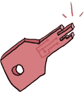

# 第十一章 第二次的机会

# 在重建厂进行重建

国王、女王、鲁本和斯嘉丽在环形平台停稳的瞬间跳了下来，门口*嗖*的一声打开。他们直奔重建厂那扇闪闪发光的红色金属大门，站台出口的方向就能看到它们。

“就在这里！”国王说道。“快点！”他们走近时，守卫大门的两名守卫匆忙地拉开大门，同时试图敬礼。

他们四人飞快地穿过大门，沿着一条长长的铺砌道路行驶。前方出现了重型的重建厂：一座巨大的红色金属建筑，顶部有十几个烟囱冒出看起来十分宜人的粉红色烟雾。


他们来到了一扇大大的闪亮双开门，门被撑开着。从里面透出温暖的红光。国王和女王毫不犹豫地走了进去，鲁本和斯嘉丽紧随其后。

“我的好朋友！”国王大声喊道，挥手示意一位拿着文件夹的戴安全帽的男子。“我们有紧急情况！我们需要立刻与工头谈话！”

那名男子抬起头，差点把文件夹掉下来。“陛下！”他说道。“当然，当然！马上！”他一边抓住安全帽，一边拿着文件夹飞奔进入了重建厂的深处。

国王、女王、鲁本和斯嘉丽站在入口处，喘着气。斯嘉丽四下张望。“我们在哪里？”她问。

“这是重建厂的主入口，”女王说道。她点了点头，指向建筑内部更远处的光亮。“那边是重建厂的生产区，所有的实际工作都在那儿进行。”

“他们在这里制造 Key-a-ma-Jiggers 吗？”鲁本问道。

女王点点头。“除了其他的事情，”她说。

鲁本张开嘴准备问重建厂还生产什么，但就在这时，戴着安全帽的年轻人回来，身后跟着一个年长的男子，眼睛闪闪发光，胡须浓密而蓬松。


“陛下！殿下！”那位年长的男子对国王和女王说，向每位王室成员鞠了一躬。“我能为您做什么？”

“封锁工厂！”女王说道。“我们有理由相信重建厂内有闯入者，必须将他们阻止！”

那位留着胡子的男子简短地点了点头，穿过重建厂狭窄的入口，走到一部明亮的红色电话旁。他拿起听筒，拨了一个数字。当他对着电话说话时，他的声音回荡在整个重建厂内：

+   封锁所有出口！这不是演习！

+   封锁所有出口！这不是演习！

老人把手放在电话的听筒上。“这些闯入者长什么样？”他问道。

“我们不确定，”女王说道。

“但他们有四个。”那位男子再次点了点头，然后继续拨打电话：

> 开始逐区搜索四个入侵者！拘留任何可疑人员并立即报告！

说完，他挂掉电话，微笑着走回到他们那边。

“这应该能解决问题，”他说。“如果 Refactory 里有任何入侵者，我的团队会立刻找到他们，并立即通知我们。”

“非常感谢！”Scarlet 说道。“但是，嗯，你到底*是谁*呢？”

“为什么，我是工头，Rusty Fourman！”那人说着，掀起了他的安全帽。“我是这里 Refactory 所有操作的负责人。”他指了指从他那儿叫来的年轻人。“这是我的得力助手 Marshall Fiveman。”

“很高兴见到你，”Marshall 说道。

“我也很高兴见到你！”Ruben 说道。

“Rusty 一直在管理 Refactory，我记得的所有时间里都是这样，”国王说道。

“那有多长？”Scarlet 问道。

“哦，我不知道，”国王说。“至少需要几天时间吧。”

“好多年了！”Rusty 笑着说道。他拉了拉自己的胡子，突然变得严肃起来。“我猜这些入侵者就是把你们带到我这的吧。我毫不怀疑我们很快就能抓到他们，但你知道他们可能在这里做什么吗？”

“是的！”Scarlet 一边从口袋里摸索，一边说道。“你们做这些的吗？”她问道，递出了那个 Key-a-ma-Jigger。

Rusty 盯着她手中的小块金属看了看。“嗯，是的，我们确实在这里制作 Key-a-ma-Jiggers，”他说。“还有一些其他的东西。大多数时候，我们的工作是重构 Ruby 代码。”



“重构？”Ruben 问道。“那是什么？”

“基本上就是在重写你的程序时，”Rusty 说。

“重写它们？！”Ruben 说。“可是我第一次写它们花了那么多时间！为什么还要再写一遍？”

“因为你可以让你的代码变得更快，更容易阅读，或者更容易更新，而且它仍然能完成相同的工作。”Rusty 说道。他想了想。“如果我给你示范一下可能更容易些。我们可以做几个更常见的 Ruby 重构，我觉得你很快就能明白了。”他看了看手表。“工厂封得严严实实，等我团队找到你的嫌疑人就只是时间问题了。与此同时，让我们做点 Ruby 重构吧！”

工头示意他们走近一些，并带他们深入 Refactory，朝着那个温暖的光芒走去，那个光芒将建筑内的一切都染成了深红色。他走到一根长长的拱形栏杆旁，俯瞰着一个看起来像是熔化的红色金属缓缓冒泡的池子，打开了一个看起来很熟悉的机器——计算装置！国王、皇后、Scarlet 和 Ruben 走到他旁边，他开始在键盘上打字。

“那么，” Rusty 一边用一只手挠鼻子，一边继续用另一只手打字，“在我所有在 Refactory 的岁月里，我见过很多 Ruby 代码。随着时间的推移，我发现了一些非常有效的代码模式，也有一些效果不太好的模式。你们想看看一些好的模式吗？”他问道。

“当然！”国王回答道。

# 变量赋值技巧

“比如说，”Rusty 说，“我经常看到这样的代码，代码作者希望把一个变量设置为某个特定的值，但*仅仅*是在该值尚未被设置时。所以我可能会写这样的代码，检查某个变量是否是`nil`，如果是，就把它设置为默认值。”他继续键入：

```

>> **rubens_number = nil**
=> nil

>> **if rubens_number.nil?**
>>   **rubens_number = 42**
>> **end**
=> 42

```

“这对我来说完全没问题，”国王说。

“哦，这完全是正确的 Ruby 代码，”Rusty 说，“它将做我们预期的事情——因为`rubens_number`是`nil`，Ruby 会把它设置为`42`。但是，有一种更清晰的写法！”他继续键入：

```

>> **rubens_number ||= 42**
=> 42

>> **rubens_number**
=> 42

```

“你可以把`||=`看作是`||`（‘或’）和`=`（变量赋值）的结合体，”Rusty 说。“这个组合意味着：‘如果`rubens_number`没有值，就将它设置为`42`。’这和键入下面的代码是一样的！”他继续键入：

```

>> **rubens_number = nil**
=> nil
>> **rubens_number = rubens_number || 43**
=> 43

```

“如果变量*已经*有值怎么办？”Scarlet 问。

“让我们来看看！”Rusty 说。他继续键入：

```

>> **scarlets_number = 700**
=> 700
>> **scarlets_number ||= 42**
=> 700
>> **scarlets_number**
=> 700

```

“在这种情况下，”Rusty 说，“`scarlets_number`已经有了值`700`，所以`||=`什么也不做。正如我提到的，`||`表示‘或’，你可能已经见过`=`表示‘给变量赋值’。”Scarlet 和 Ruben 点了点头。

“所以，”Rusty 继续说，“当我们写`||=`时，我们告诉 Ruby：‘嘿！你应该*条件性地赋值*给这个变量。’这其实是个复杂的说法，意思是我们希望 Ruby 使用它已经知道的值*或者*使用新值，前提是该变量尚未被设置。对于`rubens_number`，因为没有值，所以赋值为`42`；对于`scarlets_number`，我们已经设置了`700`，所以`||= 42`什么也不做。”

“但我们能写这个吗？”Scarlet 问道，并键入：

```

>> **rubens_number = 42 if rubens_number.nil?**
=> 42

```

“哎，是的！”Rusty 说，他的大胡子随着笑容向上翘起。“我不一定会在这个例子中使用那个代码，因为我可以轻松地使用`||=`，但是在 Ruby 中，使用内联`if`和`unless`进行重构是一个非常常见的做法。”

“*内联*是什么意思？”Scarlet 问道。

“我来给你演示！”Foreman 说，他继续向计算装置输入更多代码：

```

>> **if !rubens_number.nil?**
>>   **puts 'Not nil!'**
>> **end**
Not nil!
=> nil

```

“那也能完成任务，”Rusty 说，“但是为什么要使用`if`和`!`，如果我们可以直接使用`unless`呢？”

```

>> **unless rubens_number.nil?**
>>   **puts 'Not nil!'**
>> **end**
Not nil!
=> nil

```

“现在，这稍微好一点，”Rusty 继续说，“但它仍然比我们需要的代码行数多。如果我们有`if`或`unless`，但是没有`else`，我们可以把整个条件写成一行，像这样。”

```

>> **puts 'Not nil!' unless rubens_number.nil?**
Not nil!
=> nil

```

“现在，*这个*是最棒的！”Rusty 说。“我们不仅可以把`if !`转换成`unless`，还可以把`unless`与我们正在测试的变量写成一行！”

“我们也能在`if`中这么做吗？”Scarlet 问。

“没错！”Rusty 说，他继续键入：

```

>> **puts '42! My favorite number!' if rubens_number == 42**
42! My favorite number!
=> nil

```

“现在，就像`if`一样，我们也可以在`unless`中使用`else`，”Rusty 说，“但是虽然`if`/`else`对我来说很容易理解，`unless`/`else`却让我感到困惑。”

# Crystal-Clear 条件语句

“我同意，”国王说道，揉了揉头。“所以我们应该把`if !`转换成`unless`，并且如果没有`else`，我们可以将`if`或`unless`写成一行？”

“完全正确，”Rusty 说。“这个很容易让人困惑：”

```

>> **unless rubens_number.nil?**
>>   **puts 'Not nil!'**
>> **else**
>>   **puts 'Totally nil.'**
>> **end**
Not nil!
=> nil

```

“但是 *这个* 一目了然！”

```

>> **if rubens_number.nil?**
>>   **puts 'Totally nil.'**
>> **else**
>>   **puts 'Not nil!'**
>> **end**
Not nil!
=> nil

```

“事实上，”Rusty 继续说道，“我们可以把它们写成两行一行的语句——一个 `if` 和一个 `unless`。我觉得这不太容易理解，但我会给你们演示一下，以防你们有兴趣。”

```

>> **puts 'Not nil!' unless rubens_number.nil?**
Not nil!
=> nil
>> **puts 'Totally nil.' if rubens_number.nil?**
=> nil

```

“记住，”Rusty 说道，“`puts` 返回 `nil`，所以我们才会在 `=>` 后面看到它。但因为 `rubens_number` 是 `42` 而 *不是* `nil`，Ruby 就不会打印 `'Totally nil.'`。”

“我觉得 `if`/`else` 那个最容易理解，”Ruben 说道，“但它仍然多了很多行。如果有 `else`，有没有更简单的写法？”

“正好有，”Rusty 说道，“我们可以使用一个 *三元运算符*。它长这样！”

```

>> **puts 1 < 2 ? 'One is less than two!' : 'One is greater than two!'**
One is less than two!
=> nil

```

“失落的扭曲扎带的甜美幽冥！”国王大声喊道，“我们这片和平王国里，究竟是什么东西？”

“它并不像看起来那么可怕。我们只需在代码中使用一个问号，后面跟着冒号，”Rusty 说道，“在这种情况下，我们希望代码通过 `puts` 打印出某些内容。接下来，我们给 Ruby 一个 *表达式*：这个表达式的结果要么为真，要么为假。在这个例子中，表达式是 `1 < 2`。”Rusty 摸了摸胡子。“然后我们写一个问号，后面跟着如果表达式为真时 Ruby 应该做的事情。最后，写一个冒号，后面跟着如果表达式为假时 Ruby 应该做的事情。因为 1 *确实* 小于 2，所以 Ruby 会打印出 `One is less than two!`。”他沉思了一下，“实际上，你可以把它当作写一个 `if`/`else`，只是把它写成了一行。`?` 就像是简写版的 `if`，而 `:` 就像是简写版的 `else`。”

“真是太神奇了，”女王说道，“不过你不觉得它有点难读吗？”

“有时候，”Rusty 承认道，“所以我通常会坚持使用常规的 `if`/`else`。但是如果代码很简短，我有时会把 `if`/`else` 重构成 `? :`。”

“如果你想检查的表达式是一个带问号的方法呢？”Ruben 问道，“三元运算符还能工作吗？”

“哦，是的，”Rusty 说道，他迅速打字：

```

>> **bill = nil**
=> nil
>> **puts bill.nil? ? "Bill's nil!" : "Bill's not nil at all."**
Bill's nil!
=> nil

```

“那第三行可能看起来有点棘手，两个问号这么近，”Rusty 说道，“所以你要小心使用它们。记住，`nil?` 是 Ruby 内置的方法，如果调用的对象是 `nil`，它返回 `true`，否则返回 `false`。”

“还记得，`nil` 被返回是因为 `puts` 没有返回值，而不是因为它返回了 `bill`！”女王说道。

“完全正确，完全正确，”Rusty 说道。

“这看起来不错，”Scarlet 眯着眼睛看着计算装置的屏幕，“但是我觉得一长串 `? :` 符号——甚至是 `if`/`else`！——会变得难以阅读。有没有一种好的方法来写代码，当 Ruby 需要做很多不同的事情，而我们不必到处写 `if` 和 `else`？”

# 何时需要使用 `case` 语句

“你对重构有着敏锐的眼光，”Rusty 说。“的确，我们可以用某些东西来替代 Ruby 中的`if`和`else`。虽然我自己不常用它，”他继续说道，“但它*确实*比长链条的`if`、`elsif`和`else`要更具可读性。它被称为`case`语句。来看看吧！”他说着输入了代码：

```

>> **number = 1**

>> **case number**
>> **when 0**
>>   **puts "Zero!"**
>> **when 1**
>>   **puts "One is fun!"**
>> **when 2**
>>   **puts "Two. It's true!"**
>> **when 3**
>>   **puts "Three for me."**
>> **else**
>>   **puts "#{number}? I don't know that one."**
>> **end**

One is fun!
=> nil

```

“我们使用`case`关键字告诉 Ruby 要关注哪个变量，”Rusty 解释道。“然后我们可以使用`when`来表示：*当*这个值符合条件时——也就是说，当这个值是我们正在查看的变量时——执行这个操作！”

“就像`if`和`unless`一样，我们用`else`来让 Ruby 在没有匹配时执行某些操作，”Ruben 说。

“完全正确，”Rusty 说。

“但这就是`case`语句能做的全部吗？”Marshall 插话道。“在我看来，仅仅检查一个变量是否为某个数值似乎没那么有趣。”

“哦，天哪，不，”Rusty 说。“它们可以变得非常复杂！”他说着输入了代码：

```

  >> **number = 7**

  >> **case number**
➊ >> **when 0**
  >>   **puts "That's definitely zero."**
➋ >> **when 1..10**
  >>   **puts "It's a number between 1 and 10, all right."**
➌ >> **when 42**
  >>   **puts "Ah yes, 42\. My favorite number!"**
➍ >> **when String**
  >>   **puts "What? That's a string!"**
  >> **else**
  >>   **puts "A #{number}? What in the world is a #{number}?"**
  >> **end**

It's a number between 1 and 10, all right.
=> nil

```

“我们可以检查一个数字是否为特定的值，比如`0`（➊）或`42`（➌），是否在一个范围内（➋），甚至是否是某个特定类的实例，比如`String`（➍），”Rusty 说。“`case`语句能快速完成很多`if`和`else`要花很长时间处理的工作。”

“那*确实*很高级，”国王说，“但如果我从 Ruby 学到了一件事，那就是最令人愉快的时刻就是我能在不写出每个细节的情况下完成任务。有没有这样的重构方法？”

# 简化方法

“我就知道你会问，”工头说道。“这是一个老方法，但仍然很棒。你知道方法和`return`吗？”

他们都点了点头。

“完美，”他说。“如你所知或所不知，Ruby 方法会自动返回它们评估的最后一段代码的结果。这意味着，如果你希望方法返回它评估的最后一个表达式，你完全可以省略`return`关键字。让我们定义一个简单的方法，检查它所接收的参数是否为`true`。”

```

>> **def true?(idea_we_have)**
>>   **return idea_we_have == true**
>> **end**
=> nil

```

“现在，如果`idea_we_have`是`true`，这将`return true`，如果不是，则返回`false`，”Rusty 说，“但事实证明，Ruby 会自动返回它运行的最后一段代码的结果。我们根本不需要`return`！”

```

>> **def true?(idea_we_have)**
>>   **idea_we_have == true**
>> **end**
=> nil

```

“啊，是的！”国王说道。“我想我们以前见过这种 Ruby 的魔法。”

“好吧，”Rusty 说，“但试试这个。若你有一个会返回布尔值的表达式——也就是说，它最终会是`true`或`false`——你不需要用`==`将它与`true`或`false`比较。那只是一个额外的步骤！你可以直接返回那个会是`true`或`false`的变量*本身*。”他说着在计算装置中输入了代码：

```

>> **def true?(idea_we_have)**
>>   **idea_we_have**
>> **end**
=> nil
>> **most_true_variable = true**
=> true

>> **true?(most_true_variable)**
=> true

```

“`most_true_variable`是`true`，并且由于我们的方法会自动返回传入的任何参数，它就返回了`true`，”工头解释道。

“太棒了！”皇后说。“我喜欢这个方法是如此简单。不过，这只适用于`true`或`false`的变量吗？”

Rusty 点了点头，“虽然还有另一种很好的重构方式，能让我们判断 Ruby 值是否是 *真值*。”


“真值？”Ruben 和 Scarlet 一起问。

“真值！”Rusty 说，“当我说 Ruby 值是 *真值* 时，我的意思是：这个值不是 `false` 或 `nil`。记得这两个值在 `if` 和 `unless` 中是怎么工作的吧？”他问道，然后输入了：

```

>> **my_variable = true**
=> true

>> **puts 'Truthy!' if my_variable**
Truthy!
=> nil

```

“因为 `my_variable` 是 `true`，而 `true` 是一个真值，所以 `if` 语句的代码执行了，Ruby 打印出了 `'Truthy!'`，”Rusty 说，“现在让我们看看，如果我们用 `false` 做同样的事情会发生什么。”

```

>> **my_variable = false**
=> false
>> **puts 'Truthy!' if my_variable**
=> nil

```

“什么都没打印！”国王说。

“没错，”工头说，“`my_variable` 是 `false`，所以 `'Truthy!'` 不会在屏幕上打印出来。同样的事情也发生在 `nil` 上。”

```

>> **my_variable = nil**
=> nil
>> **puts 'Truthy!' if my_variable**
=> nil

```

“`false` 或 `nil` 没有打印任何东西，因为它们是 *假值*；Ruby 中的其他所有值都是一个真值，”Rusty 解释道，“看看吧！”他又打了一些代码：

```

>> **my_variable = 99**
=> 99

>> **puts 'Truthy!' if my_variable**
Truthy!
=> nil

```

“不过，你会看到，`nil` 和 `false` 并不 *完全* 相同，`99` 和 `true` 也并不 *完全* 相同。”他再次输入：

```

>> **nil == false**
=> false

>> **99 == true**
=> false

```

“但是！”他大声说道，举起一个手指，“我们可以通过一个简单的 `!!` 把一个 *真值* 转换成 `true`，把一个 *假值* 转换成 `false`。你看，第一个 `!` 让 Ruby 返回一个布尔值，但由于 `!` 的意思是‘非’，它与我们想要的相反。第二个 `!` 通过撤销第一个 `!` 的效果，修正了这一点！”国王、Scarlet、Ruben 甚至女王都显得困惑。“这里，我来给你们演示，”工头提议，然后他在计算机装置上输入：

```

>> **truthy_value = 'A fancy string'**
=> "A fancy string"

>> **falsey_value = nil**
=> nil

>> **truthy_value**
=> "A fancy string"

>> **!truthy_value**
=> false

>> **!!truthy_value**
=> true

```

“所以 `truthy_value` 是一个字符串，”Scarlet 说，“由于它不是 `false` 或 `nil`，如果你把它放进 `if` 语句中，代码会运行。”

“没错，”Rusty 说。

“所以，”Scarlet 说，“`!truthy_value` 是 `false`，而 *不是* `!truthy_value`——也就是说，`!!truthy_value`——是 `true`！”

“你明白了！”Rusty 说，“现在，看看对于假值是怎么工作的。”

```

>> **falsey_value**
=> nil

>> **!falsey_value**
=> true

>> **!!falsey_value**
=> false

```

“这完全相反！”Ruben 说，“`nil` 是假值，所以 `!nil` 是 `true`，而 `!!nil` 是 `false`。”

“完全正确，”工头说，“我们甚至可以写一个方法来检查某个东西是否为真值，像这样。”

```

>> **def truthy?(thing)**
>>   **!!thing**
>> **end**
=> nil

>> **truthy?('A fancy string')**
=> true

>> **truthy?(nil)**
=> false

```

“在这种情况下，我们定义了一个 `truthy?` 方法，它接受一个参数 `thing`，”Rusty 说，“然后我们调用 `!!thing`：第一个 `!` 如果 `thing` 是真值会返回 `false`，如果 `thing` 是假值会返回 `true`。由于这与我们想要的相反，我们使用 `!!` 来让我们的函数在 `thing` 是真值时返回 `true`，在 `thing` 是假值时返回 `false`。”

“太棒了！”Scarlet 说。

“不是吗？”Rusty 说，“一旦我们定义了 `truthy?`，我们就可以对 `'A fancy string'` 调用它，看到它是一个真值，然后对 `nil` 调用它，看到 `nil` 是假值。”

“我们还能做什么来让我们的 Ruby 程序更简洁、更清晰？”Ruben 问道。

“嗯，这个可能看起来很明显，”Rusty 说，“但实际上它是编程中最难的部分之一——给变量、方法和常量起个好名字！”

“什么意思？”Marshall 说道，他正在愤怒地在写字板上乱写。

“好吧，让我们以`truthy?`方法为例，”Rusty 说道，“看看如果我们选了一个更笨拙的名字会发生什么。”他迅速敲入：

```

>> **def is_this_a_truthy_thing_or_not?(thing)**
>>   **return !!thing**
>> **end**
=> nil

```

“看起来太糟糕了，”国王说道。

“是的，确实可以，”Rusty 说道，“不仅如此，它还包含了一个额外的`return`，而我们并不需要这个。简单的方法要好得多。”

```

>> **def truthy?(thing)**
>>   **!!thing**
>> **end**
=> nil

```

“啊！我明白了，”国王说道，“我们希望给我们创建的 Ruby 对象取一些简单、容易记住的名字，这样我们就可以少写代码，并且在以后引用代码时减少错误。”

“太好了！”Rusty 说道，“想象一下如果每次想检查一个值是否为真值，我们都得输入`is_this_a_truthy_thing_or_not?`，那简直是疯了！”

“我们还能怎样减少重复写代码的情况？”Marshall 问道。

# 去重代码

“好吧，有一种很好的方法就是在我们能做到的时候移除重复代码！”Rusty 说道，“在我们的程序中复制粘贴代码太容易了，这样一来如果变量名或值发生变化，修改程序就变得非常困难。看看这个，”他说着，敲入：

```

>> **def king?(dude)**
>>   **if dude == 'The King'**
>>      **puts 'Royal!'**
>>   **else**
>>      **puts 'Not royal.'**
>>   **end**
>> **end**
=> nil

>> **def queen?(lady)**
>>   **if lady == 'The Queen'**
>>     **puts 'Royal!'**
>>   **else**
>>     **puts 'Not royal.'**
>>   **end**
>> **end**
=> nil

```

“我在这里定义了两个方法，”Rusty 说道，“第一个，`king?`，检查传入的参数是否是`'The King'`；如果是，它`puts 'Royal!'`，否则输出`'Not royal.'`。我还定义了第二个方法，`queen?`，它检查传入的参数是否是`'The Queen'`。你看，这部分代码重复了多少？”Rusty 继续说道，“打这些代码非常无聊，而且更糟的是，如果我们想要改变任何打印出来的消息，我们得在两个地方做修改！我宁愿这么写，”他说着，然后他确实这么做了：

```

>> **royal?(person)**
>>   **if person == 'The King' || person == 'The Queen'**
>>     **puts 'Royal!'**
>>   **else**
>>     **puts 'Not royal.'**
>>   **end**
>> **end**
=> nil

```

“现在我们有了一个方法，它做了两个方法的工作，”Rusty 说道。

```

>> **royal?('The King')**
Royal!
=> nil
>> **royal?('The Queen')**
Royal!
=> nil
>> **royal?('The jester')**
Not royal.
=> nil

```

“我喜欢这个方法多了，”Ruben 说道，“如果我们想的话，我们也可以使用三元运算符来写对吧？”

“当然！”Rusty 说道，“如果你愿意的话，我们过一会儿可以谈这个问题。”

“在我们继续之前，”国王打断道，“我担心如果我们走得*太*远，将方法结合得太多，可能会导致方法做*太多*工作，而且很难理解。”

“这种情况经常发生！”工头说道，“虽然通常你会希望写尽可能少的代码，但有时你最终写出的是非常庞大、难以思考的方法，这些方法其实应该被拆分成更小的部分。看看前几天通过重构器来的这个方法，”他说着，敲入了计算设备：

```

>> **list_of_numbers = [1, 2, 3, 4, 5]**
=> [1, 2, 3, 4, 5]

>> **def tally_odds_and_evens(numbers)**
>>   **evens = []**
>>   **odds = []**
>>   **numbers.each do |number|**
>>     **if number.even?**
>>       **puts 'Even!'**
>>       **evens.push(number)**
>>     **else**
>>       **puts 'Odd!'**
>>       **odds.push(number)**
>>     **end**
>>   **end**

>>   **puts "#{evens}"**
>>   **puts "#{odds}"**
>> **end**
=> nil

```

“首先，它设置了一些变量，”Rusty 说道，“`evens`数组存储偶数，`odds`数组存储奇数，`list_of_numbers`存储要检查是否为偶数或奇数的数字。”

“接下来，`tally_odds_and_evens`方法遍历一个数字列表，并通过 Ruby 内建的`even?`和`odd?`方法检查每个数字是偶数还是奇数。对于每个数字，`tally_odds_and_evens`打印出它是偶数还是奇数，然后将它添加到相应的数组中。”

```

>> **tally_odds_and_evens(list_of_numbers)**

Odd!
Even!
Odd!
Even!
Odd!
[2, 4]
[1, 3, 5]
=> nil

```

“正如你所见，”Rusty 说，“它其实挺复杂的。”

“我倒是能理解！”国王说。“我几乎一句话都听不懂。”

“如果我们把这个大方法` tally_odds_and_evens`拆成几个小的、命名清晰的方法，可能会更容易理解，”Rusty 说道，他接着打字：

```

>>  **list_of_numbers = [1, 2, 3, 4, 5]**
=> [1, 2, 3, 4, 5]

>>  **def tally_odds_and_evens(numbers)**
>>   **evens = []**
>>   **odds = []**
>>   **numbers.each do |number|**
>>     **alert_odd_or_even(number)**
>>     **update_tally(number, evens, oddsna)**
>>   **end**

>>   **puts "#{evens}"**
>>   **puts "#{odds}"**
>> **end**
=> nil

```

“首先，我们将重写` tally_odds_and_evens`方法。我们会把打印`Odd!`或`Even!`的代码移到一个单独的方法`alert_odd_or_even`中，而更新计数的代码则移到另一个方法`update_tally`。我们将在一分钟内写完每个方法，”Rusty 说。

“有道理，”国王说。

“接下来，我们将去掉写`Odd!`或`Even!`到屏幕上的部分，把它封装成一个名为`alert_odd_or_even`的方法。事实上，我们可以使用我们学到的三元运算符把它做成一行代码！”

```

>> **def alert_odd_or_even(number)**
>>   **puts number.even? ? 'Even!' : 'Odd!'**
>> **end**
=> nil

```

“然后，”Rusty 继续说道，“我们会把更新`evens`和`odds`数组的代码提取到一个单独的方法`update_tally`中。”

```

>> **def update_tally(number, evens, odd)**
>>   **if number.even?**
>>     **evens.push(number)**
>>   **else**
>>     **odds.push(number)**
>>   **end**
>> **end**
=> nil

```

“这就是我们之前的代码，只是被封装成了一个独立的方法。虽然它的整体结构更清晰了，但它依然和之前一样有效，”Rusty 解释道。

```

>> **tally_odds_and_evens(list_of_numbers)**

Odd!
Even!
Odd!
Even!
Odd!
[2, 4]
[1, 3, 5]
=> nil

```

“总体来说，代码稍微多了一些，”Rusty 承认，“但现在它更清晰了，我们可以独立更改打印内容或更新偶数和奇数列表的方法。”

“太棒了！”国王笑着说。“我喜欢我的 Ruby 方法就像我一样：简短且简单！”女王、Ruben 和 Scarlet 忍住了笑。

Rusty 把安全帽推到头上。“这是我能想到的所有重构，”他说。他再次看了看手表。“奇怪，我们怎么还没收到搜索团队的回音呢。你之前告诉我这些坏蛋是在找什么来着？”他想了想，突然弹了下手指。“啊，没错！是你们的 Key-a-ma-Jigger。你们就是为了这个才来的吗？”

“是的！”Scarlet 说。“我们在皇家马厩的 Panda Provisionator 3000 上发现了这个，我们猜测这是神秘坏人最后一个拥有的，所以他们可能会回到这里找更多的。”她再次把那块小金属片递给了 Foreman。

Rusty 点了点头。“是的，那是我们的一件，”他说。“如果你们的麻烦制造者正在寻找更多，他们很可能会试图进入 Tricky Things and Trinkets 的保险库！”

“天啊！”女王说道。“那是什么？”

“这是我们放置大量物品的地方，”Rusty 说，“比如我们发现特别难重构的 Ruby 代码，还有一些东西和小玩意儿。这里也是我们存放大量库存的地方，包括我们的 Key-a-ma-Jiggers。”


国王用拳头击打掌心。“如果 Key-a-ma-Jiggers 就在那个地方，我敢肯定就是那里我们能找到罪魁祸首！”他说。“你能打个电话让你们的团队立刻前往那里吗？”

就在国王问完问题的瞬间，工头的红色电话开始不断响起。

Rusty 冲向电话并拿起它。“你好？”他说。他专心地听了一会儿，然后倒抽一口气。他用手捂住话筒。“我的一个小组在金库附近抓到了四个入侵者！”他说。他再次将电话放到耳边，然后深深叹了口气。“好吧，”他说，“派出所有可用的工人，快点！”他说完后挂断了电话。

“是什么情况？”女王问。“你们的小组抓到他们了吗？”

“没有，”工头呻吟道，“他们逃掉了！”女王的脸色变了，国王用手捂住了脸，Scarlet 和 Ruben 互相看了一眼，张大了嘴巴。

“但是！”Rusty 说，一只手举起一个手指，“我的每一位工人都在紧追不舍。我们的四个坏蛋被看到正朝着炼油厂的装货码头走去，那是一条单行道！我们会比你改名一个 Ruby 方法还要快就把他们包围起来。”

“那我们还在等什么？”女王说。“让我们去看看这段时间我们一直在追的到底是谁！”说完，她带着其他四人一起冲向了炼油厂深处的装货码头。

# 重新重构

练习使完美！现在你已经学会了很多方法，可以让你的 Ruby 代码更短，更易读，是时候把它们应用到几个特别棘手的方法上了。别担心，尽管你可能会有些小困难，但如果你以前的重构没有问题，接下来的这些也会轻松应对！（即使你在过程中遇到一点小挫折，到你完成这些示例时，你会成为一个重构大师。）

让我们开始吧，首先创建一个名为 first_try.rb 的新文件，并输入以下代码。这次我们将实际创建*两个*文件：一个是初始代码，另一个是我们要做的重构。*first_try.rb*定义了一个方法`all_about_my_number`，如果没有传入数字，它会将数字设置为`42`。然后，它会打印出一些关于这个数字的信息，包括数字是多少，它是正数、负数还是零。

first_try.rb

```

def all_about_my_number(number)
  if number.nil?
    number = 42
  end

  puts "My number is: #{number}"

  if number > 0 == true
    return 'Positive'
  elsif number < 0 == true
    return 'Negative'
  else
    return 'Zero'
  end
end

```

如果你觉得这段代码不够好，别担心！我们马上就要重构它了。在你电脑的同一文件夹中，创建另一个名为 refactored.rb 的文件，并在其中输入以下代码。这段代码的功能与*first_try.rb*中的代码完全相同，但它看起来会更简洁。

refactored.rb

```

def describe_number(number)
  number ||= 42

  puts "My number is: #{number}"

  sign(number)
end

def sign(number)
  case
  when number > 0
    'Positive'
  when number < 0
    'Negative'
  else
    'Zero'
  end
end

```

和往常一样，你可以通过在命令行输入**`ruby first_try.rb`** 和 **`ruby refactored.rb`** 来运行文件中的代码。由于我们在上一章中创建了两个文件，并且这里没有新代码，所以应该不会有太多意外！（虽然可能会有一些小的惊喜。）

你可能首先注意到的区别是在`case`语句中；之前我们做了类似这样的事情：

```

case number
when 0
puts 'Zero!'
# ... and so on

```

现在我们要做的是：

```

case
  when number > 0
# ... and so on

```

这两种都是 100%正确的 Ruby 代码。如果你有一个变量，想要检查它是否等于某个值、是否是某个类的实例，或者是否在某个范围内，你就可以使用第一种语法；如果你想对一个值进行特定检查（比如`number > 0`），则可以使用第二种语法。

你可能还注意到我们跳过了一些重构。例如，我们从像`if number > 0 == true`这样的行中移除了`==`检查。有时候，你会开始用一种方式进行重构，然后意识到有一种更好的方法！其他时候，可能有很多种同样好的方式来重构你的代码，而你恰好选择了其中一种。

最后，我们成功地去除了大量重复代码（包括一些`return`语句，我们可以让 Ruby 隐式处理！），并将检查数字符号（正、负或零）的代码提取到一个独立的方法中。

我们如何让这个重构更加酷炫呢？可能有无数种方法，但这里有一些例子让你开始思考。例如，我们将`nil?`检查重构为`||=`。这样做还可以，但我们还能做些什么吗？（提示：我们在第七章中学到了设置默认参数。）另外，我们有一个`if`/`else`语句，我们将它转换成了`case`语句，但如果我们在某个地方使用三元操作符会更合适吗？为什么或者为什么不？请用 6000 个字以上解释你的答案。（提示：不要这么做——那会超级无聊。）

再举一个例子来挑战你的思维：我们并没有进行任何检查来确保传递给我们方法的参数确实是一个数字。如果我们传入一个布尔值呢？一个字符串呢？我们该如何重构方法，使它能够处理非数字输入呢？

# 你知道这个！

好了！一开始你可能觉得这一章内容不多——毕竟我们只是重新编写了我们一直在编写的代码——但事实证明，*重*写我们的 Ruby 代码甚至比第一次编写更具挑战性。为了确保你能应对这些挑战（提示：你绝对能），让我们再回顾一下我们所做的重构。

首先，你看到我们可以用`||=`*有条件地*设置一个值。换句话说，我们可以告诉 Ruby，如果变量没有已有值，就为它设置一个值；如果有值，就使用现有值：

```

>> **my_variable ||= 'pink smoke'**
=> "pink smoke"

>> **my_variable**
=> "pink smoke"

```

在这里，`my_variable`还没有被设置，因此`||=`将它设置为`'pink smoke'`。不过，如果变量已经有值，`||=`不会改变它。看看吧！

```

>> your_variable = 'blue smoke'
=> "blue smoke"

>> your_variable ||= 'pink smoke'
=> "blue smoke"

>> your_variable
=> "blue smoke"

```

你还看到我们可以用`unless`替换`if !`：

```

>> if !my_variable.nil?
>>    puts 'Not nil!'
>> end
Not nil!
=> nil

>> unless my_variable.nil?
>>    puts 'Not nil!'
>> end
Not nil!
=> nil

```

你还看到我们甚至可以将`if`或`unless`*内联*使用，如果不需要`else`的话：

```

>> puts 'Not nil!' unless my_variable.nil?
Not nil!
=> nil

```

如果涉及到`else`，通常最好坚持使用常规的`if`/`else`语句。

```

>> if true
>>   puts 'True!'
>> else
>>   puts 'False!'
>> end
True!
=> nil

```

然而，对于非常简短的`if`/`else`语句，有时候使用*三元操作符*会更合适，像这样：

```

>> puts true ? 'True!' : 'False!'
True!
=> nil

```

你学到了我们甚至可以在带有问号的方法上使用三元运算符！只需要确保使用两个问号：一个是方法名的一部分，另一个是三元运算符的一部分：

```

>> jill = nil
>> puts jill.nil? ? "Jill's nil!" : "Jill's not nil at all."
>> Jill's nil!
=> nil

```

我们还讨论了用`case`语句替换长链的`if`/`elsif`/`else`语句。`case`语句接收一个变量，根据其值执行不同的操作：

```

>> random_trinket = 'plastic cup'
=> "Plastic cup"

>> case random_trinket
>> when 'plastic cup'
>>   puts "Plastic cup's on the up and up!"
>> when 'pet ham'
>>   puts "A pet ham! What are you, an elf?"
>> when 'star monkey'
>>   puts "I've always wanted one of those!"
>> else
>>   puts "A #{random_trinket}, huh? Never heard of it!"
>> end
Plastic cup's on the up and up!
=> nil

```

接下来，我们回忆了 Ruby 的*隐式返回*。Ruby 方法会自动返回它们执行的最后一段代码的结果，所以这两个方法的效果完全相同：

```

>> def number_42?(number)
>>   return number == 42
>> end
=> nil

>> number_42?(42)
=> true

>> number_42?(43)
=> false

>> def number_42?(number)
>>   number == 42
>> end
=> nil

>> number_42?(42)
=> true

>> number_42?(43)
=> false

```

接下来，你发现当我们使用布尔变量（`true`或`false`）时，我们可以直接返回这些变量，而不是用`==`与`true`或`false`进行比较。这样做是有效的：

```

>> def thing_true?(thing)
>>   thing == true
>> end
=> nil

```

但这样做完全相同，而且代码量稍微少一些：

```

>> def thing_true?(thing)
>>   thing
>> end
=> nil
>> the_truest_thing_ever = true
=> true

>> thing_true?(the_truest_thing_ever)
=> true

```

实际上，我们可以通过在对象前面使用两个“非”符号（`!`）来获取任何 Ruby 值的*真实性*。一个*真值*的 Ruby 值在`if`语句中表现得像`true`，而*假值*则表现得像`false`。除了`false`和`nil`外，所有 Ruby 值都是“真值”。“真值”会执行`if`语句中的代码：

```

>> if true
>>   puts 'Woohoo!'
>> end

Woohoo!
=> nil

```

而假值则不会：

```

>> if false
>>   puts 'A waltz.'
>> end
=> nil

```

什么都没有发生！`nil`也没有发生任何事情：

```

>> if nil
>>   puts 'A dill (pickle).'
>> end
=> nil

```

由于除了`false`和`nil`外，所有值都是“真值”，所以在`if`语句中，常规字符串会是“真值”：

```

>> if 'fancy string'
>>   puts 'For a fancy king!'
>> end

For a fancy king!
=> nil

```

你可以通过`!!`在 Ruby 中检查一个值的真实性：

```

>> !!nil
=> false

>> !!'fancy string'
=> true

```

我也提到了一些你可能已经在心底知道的事情：为我们的常量、变量和方法起个好名字非常重要！看看第二个方法名比第一个方法名要好多少？

```

>> def is_this_value_truthy?(value)
>>   !!value
>> end
=> nil

>> def truthy?(value)
>>   !!value
>> end
=> nil

```

最后但同样重要的是，你看到删除重复代码并将程序拆分成执行非常具体任务的小方法，可以让我们的 Ruby 代码更容易编写、理解和修改。你读的代码越多，就会越发现这是真的，所以不要犹豫，去请教你身边的成年人帮你在网上找一些 Ruby 代码片段来阅读！

说到代码，我们即将看到 Ruby 语法的新篇章，当我们跟随国王、王后、斯卡利特、鲁本和拉斯蒂一起走到货运码头时。那里的不断拾取和放下将是一个完美的机会，来探索 Ruby 的*输入*和*输出*——也就是*I/O*——而我们很可能会第一次看到那些正在颠覆这个和平王国的恶棍们。
