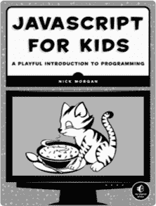
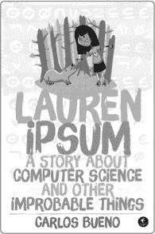
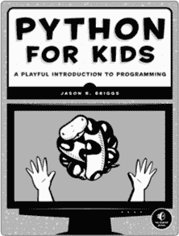
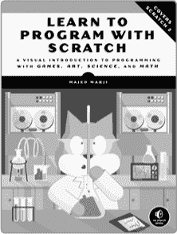
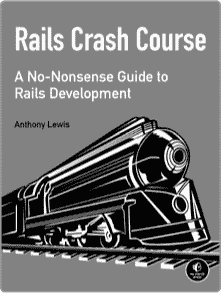

# 第十四章。接下来该做什么

# 全局视角：你知道的

哇，这真是个故事。多么扣人心弦！多么悬疑！真是太令人震撼了，我在快结束时几乎都没怎么说话。你大概注意到了吧。我经常进进出出。

看起来我们好像没有走得太远，但如果你回想一下当初刚开始读这本书的时候，你对 Ruby 完全一无所知。你可能从未听说过“皇家管道工的高级学徒”、“哈舍里”或“达格龙”，更不用说字符串、对象 ID 或方法了。现在，你已经了解了这些内容，甚至更多！

我们已经学了这么多，我觉得有必要做一个最后的快速回顾。为了我自己。只是为了整理一下我这个凌乱的大脑。别担心—这会很快；如果你需要更深入的复习，可以翻回前面的章节，重新阅读你知道这些！部分（因为你完全知道，尽管你不总是记得每一个细节）。


我们从学习如何安装和设置 Ruby 开始。可不是一件小事！我们成功地将 Ruby 安装并运行在我们的电脑上，学会了如何通过 IRB 运行 Ruby 代码片段，并且发现了如何编写文件，叫做*脚本*，让我们能够将一堆代码行收集在一起，一次性运行它们。

一旦我们弄清楚了如何运行代码，接下来的步骤就是编写一些有趣的东西来运行。还记得当你只会打印字符串和加数字的时候吗？那时候编程的乐趣就是在`puts`中输出短语，或者把东西相乘？那时候的日子真好！但一旦你开始学会编写可以在现实中发生的故事——也就是程序——你就会迫不及待地想写出更大更好的程序。所以我们继续学习了控制流程（使用`if`、`elsif`、`else`和`unless`）和布尔值（`true`和`false`），没多久，我们就能控制信息在程序中的流动，修复神秘的管道，并引导哈尔多穿过地下迷宫。

然后我们真的是进入正题了！我们开始讨论 Ruby 循环和迭代器，使用 `each` 等方法打印数组中的所有值（数组就像一个物品列表：[1, 2, 3]），更新哈希（哈希就像一个包含项和值的简短字典：`{ name: Lou, fancy: true }`），并帮助汉克和吱吱吉姆修复哈舍里计算机。我们学习了范围，它只是一系列数字或字母（例如 `(0..5)` 或 `('a'..'z')`），以及符号，它们是我们在 Ruby 中使用的名字或标签。例如，我们看到它们作为哈希的键被使用，像 `{ hamburgers: 'delicious' }`。

就在这时，事情开始变得有趣了！Scarlet 在 Hashery 楼层发现了一个 Python 的音阶，带领我们前往 Carmine Pines。在那里，我们遇见了 Off-White Knight，他向我们展示了如何使用`def`关键字创建我们自己的方法。我们还看到了如何进行各种高级方法操作，比如设置默认参数、使用 splat 参数，并通过`yield`关键字编写可以接收代码块的方法。

我们继续去见了 Dagron，他解释了 Ruby 中的对象和类（类实际上就是创建其他对象的对象）。我们学习了程序中变量的作用域，包括全局变量、类变量、实例变量和局部变量。我们甚至了解了一个特殊的 Ruby 值——`self`，它指代当前对象！当我们深入学习 Ruby 类的语法时，我们了解了`attr_reader`、`attr_writer`和`attr_accessor`，这些是我们可以使用的快捷方式，让我们无需每次都编写方法来获取和设置实例变量，便可以从类外部更新它们。

我们还发现（在女王的帮助下）一些类可以*继承*其他类——也就是说，它们可以获得其他类的一些属性和能力——并且类允许我们通过继承来重用代码。我们看到，从其他类继承的类可以*重写*父类的方法——例如，一个继承自`Dog`类的`GuardDog`可以有自己的`bark`方法版本，执行与`Dog`的`bark`方法不同的操作——而且我们始终可以“向上”调用父类的方法，使用`super`关键字。

女王还教会了我们关于*模块*的知识，模块就像 Ruby 类一样，只不过我们不会创建它们的实例！它们用于通过`include`或`extend`来混入行为，这让我们能够从多个来源复用代码，同时仍然只使用一个父类。模块还用于*命名空间*，或者组织我们的代码，使得我们不必将所有代码都塞进一个文件里。

通过使用模块，我们可以轻松地控制在 Ruby 程序中所有变量、常量和方法的可用范围，并且可以创建具有一个父类的类，继承来自多个来源的行为。

然后我们来到了 Refactory，学习了如何重写代码，使其更加清晰，而不改变其行为。我们看到了一些提升 Ruby 代码的技巧，包括将大方法拆分成小方法，并去除重复代码，使每个方法只做一件事且做得很好。我们还在 Refactory 学习了文件的输入/输出，包括如何用 Ruby 打开、读取和写入文件。

最后，我们讨论了 Ruby 和互联网，学习了 Ruby gems、像 WEBrick 这样的 web 服务器，以及像 RubyGems 网站和 GitHub 这样的有用网站。我们看到了国王、王后、Scarlet 和 Ruben 如何运用他们的 Ruby 知识抓住 Python，并最终向它们展示 Ruby 和 Python 都是优秀的编程语言，而你通过 Ruby 知识走到了这里，结束了本书，充满了智慧。我为此感到无比自豪！这就是诚实的真相。

# 额外资源与进一步阅读

虽然这些页面中包含了大量 Ruby 魔法，但我们并没有涵盖 *Ruby 所有的知识*。有大量惊人的书籍和网站可以帮助你进一步学习 Ruby 和编程，我在这里列出了一些！不要觉得必须阅读所有（或任何）这些书籍或网站——它们只是你在完成本书后，继续学习 Ruby 的新途径。

## 初学者书籍

这些书非常适合初学者。

***《Ruby 入门（第二版）》*** 作者：Peter Cooper（Apress，2009 年）。这本书听起来就是这个意思！一本出色的 Ruby 入门书籍。

***《Ruby 编程（第四版）》*** 作者：Dave Thomas、Andy Hunt 和 Chad Fowler（The Pragmatic Bookshelf，2013 年）。这本书有时被称为“鹤嘴锄书”，因为封面上有一张巨大的鹤嘴锄图像。许多 Ruby 程序员说这是他们的 Ruby 必备书籍，我可以保证，在这里你不会有任何一个 Ruby 问题没有答案。

***《Ruby 编程语言》*** 作者：David Flanagan 和 Yukihiro Matsumoto（O’Reilly Media，2008 年）。Yukihiro “Matz” Matsumoto 是 Ruby 语言的创始人，所以他对 Ruby 能做什么以及它的伟大之处有着许多宝贵的见解。这是另一本非常棒的 Ruby 入门书籍。

***Why’s (Poignant) Guide to Ruby*** 作者：why the lucky stiff（*[`en.wikipedia.org/wiki/Why’s_(poignant)_Guide_to_Ruby`](http://en.wikipedia.org/wiki/Why%E2%80%99s_(poignant)_Guide_to_Ruby)*）。这是我第一次学习 Ruby 时阅读的书，如果你仔细阅读，你会发现我偷偷把 why 的一些技巧和笑话融入到了这本书中。why 的指南是一本充满魔力、疯狂、图文并茂的 Ruby 入门书。当你读完这本书后，拿起那本！我保证你会很高兴你这么做了。

## 中级书籍

这些书籍有些内容更为深入。

***《Ruby 设计模式》*** 作者：Russ Olsen（Addison-Wesley Professional，2007 年）。本书讲解了编写 Ruby 代码的优秀设计模式。你将从专业人士那里学到技巧！

***《优雅的 Ruby》*** 作者：Russ Olsen（Addison-Wesley Professional，2011 年）。想学习像本地 Ruby 程序员那样编写代码吗？阅读这本书！

***《扎实的 Ruby 程序员》*** 作者：David Black（Manning Publications，2009 年）。想象一本像这样书的书，少一些魔法生物，多一些关于高级 Ruby 话题的内容，比如线程和错误处理。想象好了吗？恭喜！你已经想象到了 *《扎实的 Ruby 程序员》*。（想象一下吧！）

***酷炫的 Ruby 脚本*** 由 Steve Pugh 编写（No Starch Press，2008 年）。如果你在寻找一本有趣的食谱书，一本包含从游戏到 Web 服务器的各种 Ruby 脚本的真正大餐，那就把这本书从最近的书店架子上拿走（或者请你的父母从网上订购）。

## 高级书籍

这些书籍是所有书中最为复杂的！

***元编程 Ruby 2*** 由 Paolo Perrotta 编写（The Pragmatic Bookshelf，2014 年）。这本书探索了 Ruby 如何读取并在运行时改变其自身代码的深奥秘密！不适合心脏脆弱的人。

***实用的面向对象设计在 Ruby 中*** 由 Sandi Metz 编写（Addison-Wesley Professional，2012 年）。如果你想像专家一样编写 Ruby 代码，这本书无疑是最佳选择。完成后，你的对象将闪闪发光，类将熠熠生辉！

***Ruby 在显微镜下*** 由 Pat Shaughnessy 编写（No Starch Press，2013 年）。这本书直击 Ruby 的核心，探讨了所有那些零与一、比特与字节是如何转化为 Ruby 代码的。如果你读完这本书并完全理解其中的每个细节，请打电话给我并向我解释一下。

# 在线与多媒体

## Railscasts

### (*[`railscasts.com/`](http://railscasts.com/)*)

Ruby on Rails 是一个流行的框架，或者说是 Ruby 程序员用来创建 Web 应用程序的一套工具。Ryan Bates 的这些录屏演示展示了 Ruby 代码如何驱动 Rails 应用程序，而 Ryan 的讲解使得你在家也能轻松跟随学习。与 Ruby Tapas 类似，并非所有这些录屏都免费，所以如果你想观看全部内容，你可能需要得到身边成年人的帮助来注册。

## Ruby5 播客

### (*[`ruby5.envylabs.com/`](http://ruby5.envylabs.com/)*)

这是更多关于 Ruby 的新闻，但以播客形式呈现！如果你更喜欢听而不是读，这个适合你。

## Ruby Rogues

### (*[`rubyrogues.com/`](http://rubyrogues.com/)*)

这是另一个播客，尽管我认为它更像是在听博客文章，而不像听新闻。如果你有兴趣了解更多关于 Ruby 的方方面面、其宝石和工具，听一听 Ruby Rogues 吧。

## Ruby Tapas

### (*[`www.rubytapas.com/`](http://www.rubytapas.com/)*)

对于那些喜欢看视频而非阅读或听的朋友，Avdi Grimm 的这些录屏短片为你介绍了 Ruby 的不同部分，这些部分你可能还不了解。不过，只有少部分录屏是免费的，因此如果你想看完整的内容，你需要得到身边成年人的帮助。

## Ruby Weekly

### (*[`rubyweekly.com/`](http://rubyweekly.com/)*)

由同样编写了 *Ruby 入门* 的 Peter Cooper 精心策划的每周一次电子邮件，里面充满了有用的 Ruby 文章、教程和视频。这些内容相当进阶，但在你开始写 Ruby 一段时间后，这将是你寻找 Ruby 新闻的第一个地方。

## 互动资源

### Codecademy

#### (*[`www.codecademy.com/tracks/ruby/`](http://www.codecademy.com/tracks/ruby/)*)

如果你想在自己舒适的网页浏览器中练习运行 Ruby，可以去 Codecademy 完成 Ruby 课程。有个有趣的事实：这些课程都是我写的，所以应该会感觉很熟悉！唯一的缺点是，它们涵盖了你在这里已经学过的很多内容，因此可能会显得有点*过于熟悉*。不过，如果你想练习编写代码并复习你学过的内容，可以去那里开始敲代码——而且它是免费的！（你必须年满 13 岁才能创建账户。）

### Code School

#### (*[`www.codeschool.com/paths/ruby/`](https://www.codeschool.com/paths/ruby/)*)

Code School 是另一个学习 Ruby 的好网站。像 Codecademy 一样，它要求你年满 13 岁才能创建账户，不同的是，它并不是免费的。不过它有很多优秀的视频，如果你通过观看别人操作来学习最有效，那这个网站可能很适合你。

### Ruby Koans

#### (*[`rubykoans.com/`](http://rubykoans.com/)*)

想象一下，如果你将本书中的所有知识分成一亿个小而智慧的格言，这些格言的形式是 Ruby 程序。那些就是 Ruby koans！如果你需要更多的练习，并且喜欢通过实践来学习，赶紧下载这些 koans 开始编程吧。它们还非常擅长教你如何进行测试，因为每个 koan 都像是一个失败的测试，你需要修复它才能通过；你修复的代码行越多，你的 Ruby 启蒙就越深。

### Ruby Monk

#### (*[`rubymonk.com/`](https://rubymonk.com/)*)

这有点像 Codecademy 的课程和 Ruby Koans 的结合。你完成的练习越多，掌握 Ruby 的进度就越远！

# 额外主题

我们讨论了大量的 Ruby 知识，但也有一些语言特性我们没来得及涉及——主要是因为它们不像我们讨论的内容那样有趣，而且这些话题相对有点复杂。不过，如果你感兴趣并想了解更多，我在这里列出了一个简短的清单。

## `Enumerable` 模块

你可能在我们的学习过程中好奇，为什么数组*和*哈希都知道如何使用 `each` 方法。这是因为它们都包含了 `Enumerable` 模块，你也可以在自己的类中直接使用这个模块来简化代码！它包含了很多实用的方法，比如 `all?`、`any?`、`include?` 和 `find`。你可以在官方文档中阅读所有相关内容：*[`ruby-doc.org/core-2.0.0/Enumerable.html`](http://ruby-doc.org/core-2.0.0/Enumerable.html)*。

## 正则表达式

正则表达式就像 Ruby 内部的一个迷你语言，它让你能够匹配单词或短语中的模式。例如，你可以用它们查找只包含大写字母的字符串，或者检查一个字符串是否是有效的电子邮件地址。正则表达式在许多编程语言中都有，但你可以在 *[`www.regular-expressions.info/ruby.html`](http://www.regular-expressions.info/ruby.html)* 找到一些 Ruby 特定的信息。你还可以使用一个名为 Rubular 的免费工具，访问 *[`rubular.com/`](http://rubular.com/)*。Rubular 让你可以实时测试你的正则表达式，这样你可以看到你的模式匹配了什么，没匹配到什么。

## Procs 和 Lambdas

这些并不完全是块，也不完全是方法——它们介于两者之间！你可以将它们看作是没有名称的方法，或者看作是可以反复执行的“保存”块。你可以在 Ruby Monk 练习中了解更多关于它们的信息（请参见 交互式资源）。

## 信息隐藏

你可以通过使用 `private` 和 `protected` 方法，使你的 Ruby 类中的信息更安全。这在你作为团队的一部分编写 Ruby 代码时非常有用，尽管它们不能完全阻止其他程序员使用不应该使用的方法，但它们可以帮助你的队友理解哪些方法是可以依赖的，哪些方法仍在“开发中”。你可以在 Ruby 文档中阅读更多关于 `public` 和 `protected` 方法的内容： *[`www.ruby-doc.org/core-2.0.0/Module.html#method-i-private`](http://www.ruby-doc.org/core-2.0.0/Module.html#method-i-private)*。

## 处理异常

每当我们看到 Ruby 代码抛出错误时，通常我会解释为什么会发生错误，然后我们继续前进，但如果仔细想想，这并不总是最好的处理方式。有时候，当发生错误（也叫做*异常*）时，我们希望做些什么来处理它，比如设置一个默认值或打印一条消息到屏幕上。Ruby 中的异常处理称为——你猜对了——*异常处理*，如果你想了解更多关于它的信息，可以阅读 Avdi Grimm 的《*Exceptional Ruby*》 (*[`exceptionalruby.com/`](http://exceptionalruby.com/)*).

## 反射/元编程

记得我们之前讨论文件输入输出时，我们看到可以编写 Ruby 代码来写 Ruby 代码吗？这意味着 Ruby 有能力查看并修改自己的代码！这种内省的部分称为*反射*，而 Ruby 改变自己编程能力的过程称为*元编程*。这是一种非常难写的 Ruby 代码，但如果你有兴趣，你可以通过 Paolo Perrotta 的《*Metaprogramming Ruby*》一书深入了解它。

## 调试

我们谈了一点修复代码中的错误，但我们没有谈论如何为其编写测试，或者*调试*（即修复）它的系统化方法。编写测试以证明你的代码是正确的，并且成为一个擅长调试的程序员，这些都是任何程序员必备的重要技能。如果你有兴趣了解更多，你可以阅读 Ruby 文档中关于内置 Ruby 测试库 MiniTest 的内容，网址是 *[`ruby-doc.org/stdlib-1.9.3/libdoc/minitest/spec/rdoc/MiniTest/Spec.html`](http://ruby-doc.org/stdlib-1.9.3/libdoc/minitest/spec/rdoc/MiniTest/Spec.html)*。如果你感到特别冒险，你还可以阅读我最喜欢的测试库 RSpec，网址是 *[`rspec.info/`](http://rspec.info/)*。

## 线程与进程

在我们所有的 Ruby 程序中，我们实际上只做了一件事：我们设置一个变量然后使用它，或者我们可能会遍历一个数组并将每个项打印到屏幕上。我们从来没有真正做到过*完全*同时做两件事。使用 Ruby 线程和进程时，实际上可以同时做两件事！正如你可能想象的那样，同时处理多个任务比每次只处理一个进程要困难得多，因此学习如何使用 Ruby 线程和进程需要一些实践。如果你想了解更多，你可以阅读 Jesse Storimer 的*《与 Ruby 线程一起工作》*（* [`www.jstorimer.com/products/working-with-ruby-threads/`](http://www.jstorimer.com/products/working-with-ruby-threads/) *）。小心——这本书真的很高级！

## 创建网站

最后，虽然我们讨论过 Ruby 的 Web 服务器，如 WEBrick，但我们并没有深入讨论如何用 Ruby 创建整个网站。你可能听说过 Ruby on Rails（我在描述 Railscasts 时提到过它，在 在线与多媒体 一章），它是一个由许多 gem 组成的大型代码库，帮助简化用 Ruby 编写网站的过程。它是构建网站的一种好方式，且非常流行，但有时较新的 Ruby 程序员会难以理解它做了哪些事情以及它的设计决策。如果你想用 Ruby 来创建网站，你可能想从一个较小、较简单的程序开始（而且是我最喜欢的之一），它叫做*Sinatra*。你可以在网上找到它，网址是 *[`www.sinatrarb.com/`](http://www.sinatrarb.com/)*。

我承认：我一直在拖延。我不想让这本书结束！但可惜的是，我已经把所有 Ruby 的智慧都传授给你了。现在你知道我所知道的一切，而且你还拥有国王、女王、Ruben、Scarlet 和他们所有朋友们的聪明才智与经验。我知道你能做到！从一开始我就相信你。所以即使书必须结束，至少它以我正确的结尾！

当你合上这本书时，我希望你做一件事：启动你自己的个人计算机设备，编写一个 Ruby 程序。它可以做任何你想做的事情，无论是大是小，无论是愚蠢还是严肃。别担心它会坏掉！我们学习的唯一方法就是编写程序、破坏它们、修复它们并使它们更好，所以如果你的程序坏掉或最初没有按预期工作，也完全没问题。你是在为机器编写故事和诗歌，冒险的最大部分并不是拥有一个完成并完美运行的程序，而是沿途发生的所有疯狂事物。

所以，去吧！去写你能写出的最棒程序，享受*乐趣*吧。我会再见的。


# 附录 A. 在 Mac 和 Linux 上安装 Ruby

# 在 Mac 上安装

新款 Mac 自带 Ruby 2.0，因此如果你在这里，可能是使用了一个较旧的 Mac，它装的是 Ruby 1.8.7。别担心！我们会很快帮你升级。

打开你的终端并输入以下代码。（`$` 只是显示你开始输入的位置——不要输入`$`！）这将安装一个名为 RVM（Ruby 版本管理器）的工具以及 Ruby 2.0。

```

$ **\curl -L https://get.rvm.io | bash -s stable --ruby=2.0.0**
**--auto-dotfiles**

```

一旦完成，你会看到一大堆文本弹出，告诉你你的计算机正在下载 Ruby。下载完成后，关闭终端，重新打开终端，然后输入**`ruby -v`**。你应该看到计算机输出带有`ruby 2.0.0`的响应！

如果你的 Ruby 版本仍然不是 Ruby 2.0，你可以尝试使用 Homebrew 包管理器来安装它。首先，安装 Homebrew：

```

$ **ruby -e "$(curl -fsSL https://raw.github.com/Homebrew/homebrew/go/**
**install)"**

```

一旦命令成功执行完成，你可以直接输入以下内容：

```

$ **brew install ruby**

```

在撰写本文时，Homebrew 会自动安装 Ruby 2.1.3。这个版本比 Ruby 2.0 新一点，它将能够与本书中的代码示例兼容。

# 在 Linux 上安装

打开你的终端并输入以下代码。（`$` 只是显示你开始输入的位置——不要输入`$`！）这将安装一个名为 RVM（Ruby 版本管理器）的工具以及 Ruby 2.0。

```

$ **\curl -L https://get.rvm.io | bash -s stable --ruby=2.0.0 --auto-**
**dotfiles**

```

一旦完成，你会看到一大堆文本弹出，告诉你你的计算机正在下载 Ruby。下载完成后，关闭终端，重新打开终端，然后输入**`ruby -v`**。你应该看到计算机输出带有`ruby 2.0.0`的响应！

如果你遇到错误或计算机告诉你 Ruby 没有安装，找一个可靠的成年人并查看 Ruby 安装页面 *[`www.ruby-lang.org/en/installation/`](https://www.ruby-lang.org/en/installation/)*。可能有一个专为你版本的 Linux 设计的最新安装包，使用该安装包安装 Ruby 可能会更加方便，而不是使用 RVM。你也可以请你的成年人去 IRC 上询问 #ruby 频道的朋友们帮助。

# 附录 B. 故障排除

在运行 Ruby 脚本或使用 IRB 时，你可能会遇到一些常见的错误。我在这里列出了一些错误以及修复它们的小贴士！

# 运行 Ruby 脚本时出错

从命令行运行 Ruby 脚本时，你可能会遇到两种常见的错误： 命令未找到 和 “没有此文件或目录”。以下是解决这些问题的一些建议。

## 找不到命令

如果你正在运行一个 Ruby 脚本，并且得到如下输出：

```

$: command not found

```

这很可能意味着你不小心在 `ruby` 命令前输入了一个 `$`。我使用 `$` 符号来表示你正在从命令行运行 Ruby 脚本，并带有文件名（例如 `ruby my_fancy_script.rb`）；你不应该输入 `$` 符号本身！

## 没有此文件或目录

如果你遇到类似下面的错误：

```

No such file or directory -- some_filename.rb (LoadError)

```

这意味着你尝试运行`ruby some_filename.rb`，但是该文件在你当前所在的文件夹中并不存在。

要解决这个问题，首先确保你在保存 Ruby 脚本的文件夹中。你可以使用 `cd` 命令（“change directory”）从一个文件夹切换到另一个文件夹。查看 创建你的第一个脚本 获取有关如何使用 `cd` 命令的帮助。

如果你在正确的文件夹中，且命令仍然给出错误，检查你的文件名拼写！(我经常会打错 Ruby 文件名。)

# 使用 IRB 时的错误

使用 IRB 时，你可能会遇到一些常见错误。下面是如何解决它们的办法，以及修正拼写错误和其他错误的一些实用技巧。

## 未定义的本地变量或方法

如果你在 IRB 中尝试调用一个方法，并且得到类似的错误：

```

NameError: undefined local variable or method `some_method_name' for
main:Object

```

这意味着你尝试使用一个 Ruby 不认识的方法。当你退出并重新启动 IRB 时，Ruby 会忘记你之前的所有操作——所以如果你定义了一个方法，退出 IRB 后重新启动，你需要重新定义该方法才能继续使用它。（如果你需要复习如何定义方法，请查看 定义你自己的方法。）如果你的方法来自某个文件，请确保使用命令 `load 'your_file.rb'` 加载该文件，如果一切都失败了，再检查一下方法名称的拼写是否正确。

## 语法错误

如果你遇到类似下面的错误：

```

SyntaxError: (irb):1: syntax error, unexpected 'something_here'

```

这意味着你写的 Ruby 代码有些地方不太对，IRB 不知道该怎么处理它。检查代码中是否有小错误，例如拼写错误、数组元素之间缺少逗号，或是哈希中的 `=>` 或冒号丢失。

## 无法将 nil 转换为字符串

如果你遇到类似下面的错误：

```

TypeError: can't convert nil into String

```

这意味着你试图用一种 Ruby 类型（如字符串、整数或`nil`）做某件事，但 Ruby 期待的是另一种类型。这通常发生在某个值是`nil`，但你并不知道；如果你看到这个错误，试着用`puts`输出所有变量的值，确保每个变量的类型（字符串、整数、数组等）符合你的预期！(有关`puts`命令的帮助，请参见了解 IRB，有关变量类型的复习，请参见更多关于变量。)

## 你刚才说的是什么 . . . ?

有时，你可能会看到 Ruby 打印出类似下面的内容：

```

...?

```

这意味着 Ruby 期待你“完成你的想法”。通常情况下，它意味着你按了 ENTER 却没有闭合一个字符串，或者你输入的最后一个符号是 `+` 或 `-`。你只需要完成那个想法——完成你开始输入的表达式，闭合你打开的字符串或数组，或者 Ruby 等待的其他内容——这样就可以了。例如：

```

>> 1 +
...? 2
=> 3

```

如果你不知道 Ruby 正在等待什么，或者你只是输入错了想重新开始，你可以按 CTRL-C 告诉 IRB 不要再等待你。你会返回到常规的 IRB 提示符，并可以从那里继续。(有关 CTRL-C 的更多信息，请参见调查王国的 Web 服务器.)

## 清除屏幕

有时你会在 IRB 中输入很多内容，想要清除屏幕。根据你使用的操作系统，有几种方法可以做到这一点。在 Mac 上，你可以按 ⌘-K 或 CTRL-L，或者在 IRB 中输入`system 'clear'`然后按 ENTER。如果你使用的是 Linux，按 CTRL-L 或输入`system 'clear'`应该有效。如果你使用的是 Windows，按 CTRL-L 或输入`system 'cls'`（不是`'clear'`！）应该可以清除屏幕。

## 返回到上一个命令

如果你在任何时候想返回到你在 IRB 中输入的上一个命令，只需按键盘上的上箭头！这非常方便，尤其是在你刚清除屏幕，然后意识到需要重新输入某个命令，或者你输入错了命令，想要在不重新输入所有内容的情况下重试。

## 查找答案！

最后，如果你遇到一个不知道如何处理的错误，去互联网上搜索一下（记得先征得你本地成年人的许可！）。每个人都会遇到错误，所以很可能已经有人找到了解决你可能遇到的错误的方法。即使是最优秀的程序员，也每天都需要查找自己不知道的东西。你越是习惯在遇到困惑时寻找答案，你在编写 Ruby 代码时就会越高效、越快乐。

# 更新

访问 *[`nostarch.com/rubywizardry/`](http://nostarch.com/rubywizardry/)* 获取更新、勘误和其他信息。

# 更多有趣的书籍，专为好奇的孩子们！



**儿童 JavaScript 编程**

**编程的趣味入门**

由 NICK MORGAN 编写

2014 年 12 月，336 页，$34.95

ISBN 978-1-59327-408-5

*全彩*



**洛伦·伊普苏姆**

**关于计算机科学及其他不太可能的事物的故事**

*由* CARLOS BUENO 编写

2014 年 12 月，192 页，$16.95

ISBN 978-1-59327-574-7

*全彩*



**儿童 Python 编程**

**编程的趣味入门**

*由* JASON BRIGGS 编写

2012 年 12 月，344 页，$34.95

ISBN 978-1-59327-407-8

*全彩*



**学习 Scratch 编程**

**通过游戏、艺术、科学和数学的视觉编程入门**

*由* MAJED MARJI 编写

2014 年 2 月，288 页，$34.95

ISBN 978-1-59327-543-3

*全彩*



**Rails 快速入门**

**Rails 开发的实用指南**

*由* ANTHONY LEWIS 编写

2014 年 10 月，296 页，$34.95

ISBN 978-1-59327-572-3


**漫画指南™：数据库**

*由* MANA TAKAHASHI、SHOKO AZUMA 和 TREND-PRO CO., LTD. 编写

2009 年 1 月，224 页，$19.95

ISBN 978-1-59327-190-9

**800.420.7240 或 415.863.9900 | sales@nostarch.com | [www.nostarch.com](http://www.nostarch.com)**
