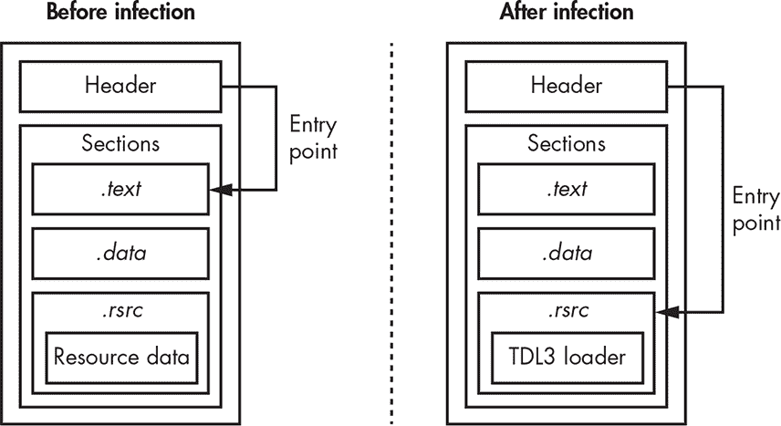
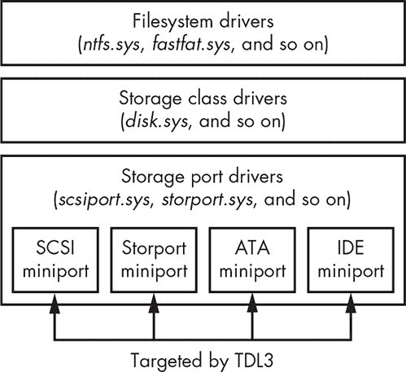
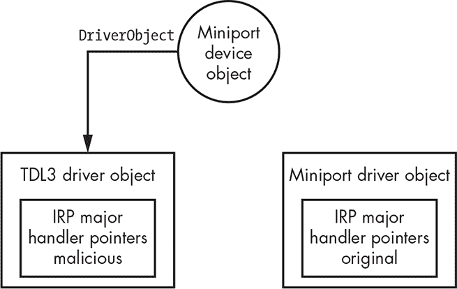

## 第一章：什么是 ROOTKIT：TDL3 案例研究**


在本章中，我们将介绍带有*TDL3*的 rootkit。这个 Windows rootkit 提供了一个很好的例子，展示了如何利用操作系统架构的底层控制和数据流劫持技术。我们将探讨 TDL3 如何感染系统，并且它如何颠覆特定的操作系统接口和机制以保持生存并避免被发现。

TDL3 使用一种感染机制，直接将其代码加载到 Windows 内核中，因此它在 64 位 Windows 系统中被微软引入的内核完整性措施所无效化。然而，TDL3 用于在内核中插入代码的技术仍然是一个很好的示例，展示了在绕过这些完整性机制后，如何可靠且有效地挂钩内核的执行。像许多 rootkit 一样，TDL3 挂钩内核代码路径依赖于内核架构的关键模式。从某种意义上说，rootkit 的钩子可能比官方文档更能揭示内核的实际结构，当然，它们也是理解未记录的系统结构和算法的最佳指南。

事实上，TDL3 已经被 TDL4 取代，后者继承了 TDL3 的许多规避和反取证功能，但转而采用*bootkit*技术，绕过了 64 位系统中的 Windows 内核模式代码签名机制（我们将在第七章中描述这些技术）。

在本章中，我们将指出 TDL3 颠覆的特定操作系统接口和机制。我们将解释 TDL3 及类似 rootkit 的设计和工作原理，然后在第二部分中，我们将讨论用于发现、观察和分析这些 rootkit 的方法和工具。

### TDL3 在野外传播的历史

TDL3 rootkit 首次被发现于 2010 年，^(1) 是当时最复杂的恶意软件之一。它的隐蔽机制对整个杀毒软件行业构成了挑战（它的后继者，TDL4 bootkit，也是第一个广泛传播的 x64 平台 bootkit）。

**注意**

*这一家族的恶意软件也被称为 TDSS、Olmarik 或 Alureon。为同一家族的恶意软件起多个名字并不罕见，因为杀毒软件厂商往往在报告中给出不同的名字。在分析的早期阶段，研究团队通常会给相同攻击的不同组件指定不同的名称，这也是很常见的做法。*

TDL3 通过*按安装付费（PPI）*商业模式，通过加盟商 DogmaMillions 和 GangstaBucks（这两个加盟商现在已经被关闭）进行分发。PPI 模式在网络犯罪团伙中广受欢迎，类似于常见的浏览器工具栏分发模式。工具栏分发商通过创建带有嵌入唯一标识符（UID）的特殊版本来跟踪其使用情况，每个通过不同分发渠道提供下载的软件包或捆绑包都会有一个 UID。这使得开发者能够计算与每个 UID 相关的安装数量（即用户数量），从而确定每个分发渠道所带来的收入。同样，分发商信息被嵌入到 TDL3 rootkit 可执行文件中，特定服务器计算与分发商相关的安装数量，并对其进行收费。

网络犯罪团伙的成员们收到了一个独特的登录名和密码，这些标识符用来识别每个资源的安装数量。每个加盟商还配有一个个人经理，遇到技术问题时可以咨询该经理。

为了减少被杀毒软件检测到的风险，加盟商经常重新打包分发的恶意软件，并使用复杂的防御技术来检测调试器和虚拟机的使用，从而困扰恶意软件研究人员的分析。^(2) 伙伴们还被禁止使用像 VirusTotal 这样的资源来检查他们当前的版本是否会被安全软件检测到，甚至因这样做而受到罚款威胁。这是因为提交到 VirusTotal 的样本可能会引起安全研究实验室的注意，从而进行分析，实际上缩短了恶意软件的有效生命周期。如果恶意软件的分发商担心其产品的隐蔽性，他们会被推荐使用类似 VirusTotal 的恶意软件开发者运营的服务，这些服务能保证提交的样本不会被安全软件供应商获取。

### 感染流程

一旦 TDL3 感染程序通过其中一个分发渠道下载到用户系统上，它就会开始感染过程。为了在系统重启后继续存活，TDL3 会通过向其中一个启动驱动程序注入恶意代码来感染该驱动程序，启动驱动程序对加载操作系统至关重要。这些启动驱动程序会在操作系统初始化过程的早期阶段与内核镜像一起加载。因此，当感染的计算机启动时，修改后的驱动程序会被加载，恶意代码控制了启动过程。

因此，当在内核模式地址空间中运行时，感染程序会在支持核心操作系统组件的启动驱动程序列表中进行搜索，并随机选择一个作为感染目标。列表中的每个条目都由未记录的 `KLDR_DATA_TABLE_ENTRY` 结构描述，如清单 1-1 所示，并由 `DRIVER_OBJECT` 结构中的 `DriverSection` 字段引用。每个已加载的内核模式驱动程序都有一个对应的 `DRIVER_OBJECT` 结构。

```
typedef struct _KLDR_DATA_TABLE_ENTRY {

   LIST_ENTRY InLoadOrderLinks;

   LIST_ENTRY InMemoryOrderLinks;

   LIST_ENTRY InInitializationOrderLinks;

   PVOID ExceptionTable;

   ULONG ExceptionTableSize;

   PVOID GpValue;

   PNON_PAGED_DEBUG_INFO NonPagedDebugInfo;

   PVOID ImageBase;

   PVOID EntryPoint;

   ULONG SizeOfImage;

   UNICODE_STRING FullImageName;

   UNICODE_STRING BaseImageName;

   ULONG Flags;

   USHORT LoadCount;

   USHORT Reserved1;

   PVOID SectionPointer;

   ULONG CheckSum;

   PVOID LoadedImports;

   PVOID PatchInformation;

} KLDR_DATA_TABLE_ENTRY, *PKLDR_DATA_TABLE_ENTRY;
```

*清单 1-1：由 `DriverSection` 字段引用的 `KLDR_DATA_TABLE_ENTRY` 结构的布局*

一旦选择了目标驱动程序，TDL3 病毒就会通过覆盖驱动程序资源区 *.rsrc* 的前几百个字节，来修改内存中的驱动程序映像，载入恶意加载器。这个加载器非常简单：它仅仅是在启动时从硬盘加载其需要的其余恶意代码。

被覆盖的 *.rsrc* 节区的原始字节——这些字节对驱动程序的正常运行仍然是必需的——会被保存在恶意软件维护的隐藏文件系统中的名为 *rsrc.dat* 的文件中。（请注意，感染过程不会改变被感染驱动程序文件的大小。）一旦完成这一修改，TDL3 会更改驱动程序的可移植执行文件（PE）头中的入口点字段，使其指向恶意加载器。因此，被 TDL3 感染的驱动程序的入口点地址会指向资源节区，这在正常情况下是不合法的。图 1-1 展示了感染前后的启动驱动程序，演示了驱动程序映像如何被感染，Header 标签指的是 PE 头和节区表。



*图 1-1：系统感染后，内核模式启动驱动程序的修改*

这种感染 Windows 可执行文件和动态链接库（DLL）的 PE 格式可执行文件的方式，是病毒感染者的典型做法，但对于 rootkit 来说并不常见。PE 头和节区表对任何 PE 文件都是不可或缺的。PE 头包含关于代码和数据位置、系统元数据、栈大小等关键信息，而节区表则包含关于可执行文件节区及其位置的信息。

为完成感染过程，恶意软件将 PE 头部的 .NET 元数据目录项覆盖为与安全数据目录项中包含的相同值。这个步骤可能是为了防止对感染镜像进行静态分析，因为它可能会导致常见恶意软件分析工具在解析 PE 头部时发生错误。事实上，尝试加载这些镜像会导致 IDA Pro 5.6 版本崩溃——这个漏洞后来已经被修复。根据微软的 PE/COFF 规范，.NET 元数据目录包含由公共语言运行时（CLR）使用的数据，用于加载和运行 .NET 应用程序。然而，对于内核模式启动驱动程序来说，这个目录项并不相关，因为它们都是本地二进制文件，并不包含任何系统管理代码。因此，操作系统加载程序不会检查此目录项，从而使感染的驱动程序即使其内容无效，仍然能够成功加载。

请注意，这种 TDL3 感染技术是有限制的：它仅适用于 32 位平台，因为微软的内核模式代码签名策略在 64 位系统上强制执行强制性代码完整性检查。由于在系统感染过程中驱动程序的内容发生了变化，它的数字签名不再有效，从而阻止操作系统在 64 位系统上加载该驱动程序。恶意软件的开发者通过 TDL4 做出了回应。我们将在第六章中详细讨论这一策略及其规避方法。

### 控制数据流

为了实现隐匿性，内核 rootkit 必须修改内核系统调用的控制流或数据流（或两者），无论何时操作系统的原始控制流或数据流会暴露任何恶意软件组件的存在（例如，文件）或其运行的任务或工件（如内核数据结构）。为了实现这一点，rootkit 通常会在系统调用实现的执行路径上注入代码；这些代码钩子的放置是 rootkit 最具指导性的方面之一。

#### *自带链接器*

*Hooking* 本质上是链接。现代 rootkit 自带链接器，将其代码与系统链接，这是我们称之为 *自带链接器* 的设计模式。为了隐蔽地嵌入这些“链接器”，TDL3 遵循了一些常见的恶意软件设计原则。

首先，目标必须保持稳定，尽管有额外注入的代码，因为攻击者从让目标软件崩溃中既无收益也有损失。从软件工程的角度来看，钩子是一种软件组合方式，需要谨慎处理。攻击者必须确保系统只有在可预测的状态下才会进入新的代码，以便代码能够正确处理，从而避免任何可能导致崩溃或异常行为的情况，这些异常行为可能会引起用户的注意。钩子的位置似乎仅限于 rootkit 作者的想象力，但实际上，作者必须遵循他们非常熟悉的稳定软件边界和接口。因此，钩子通常会针对系统本地动态链接功能所使用的相同结构，无论它们是否公开文档化。回调表、方法表以及其他连接抽象层或软件模块的函数指针是钩子最安全的目标；钩子函数的前言同样也很有效。

其次，钩子的位置不应过于明显。虽然早期的 rootkit 会钩住内核的顶层系统调用表，但这种技术很快就变得过时，因为它太显眼了。事实上，当 2005 年的索尼 rootkit 使用这种技术时，^(3) 这种钩子位置已经被认为是过时的，因而引起了许多人的关注。随着 rootkit 越来越复杂，它们的钩子逐渐向栈的下层迁移，从主要的系统调用分发表到操作系统子系统，这些子系统为不同的实现提供统一的 API 层，例如虚拟文件系统（VFS），然后再到特定驱动程序的方法和回调。TDL3 就是这种迁移的一个典型例子。

#### *TDL3 的内核模式钩子是如何工作的*

为了保持低调，TDL3 采用了一种在实际环境中前所未见的相当复杂的钩子技术：它在存储端口/小型端口驱动程序的层次拦截发送到硬盘的读写 I/O 请求（存储驱动栈最底层的硬件存储媒体驱动程序）。*端口驱动程序*是为小型端口驱动程序提供编程接口的系统模块，小型端口驱动程序由相应存储设备的供应商提供。图 1-2 显示了 Microsoft Windows 中存储设备驱动栈的架构。

针对存储设备上某个对象的 I/O 请求包（IRP）结构的处理从文件系统驱动程序的层次开始。对应的文件系统驱动程序会确定该对象存储的具体设备（如磁盘分区和磁盘区域，最初为文件系统预留的连续存储区域），并向类驱动程序的设备对象发出另一个 IRP。后者会将 I/O 请求转换为相应的小型端口设备对象。



*图 1-2：Microsoft Windows 中存储设备驱动堆栈架构*

根据 Windows 驱动程序工具包（WDK）文档，存储端口驱动程序提供硬件独立类驱动程序与 HBA 特定（主机基础架构）迷你端口驱动程序之间的接口。一旦该接口可用，TDL3 就会在存储设备驱动堆栈中最低的硬件独立级别设置内核模式 hook，从而绕过在文件系统或存储类驱动程序级别操作的任何监控工具或保护措施。这样的 hook 只能通过了解特定设备集的这些表的正常组成或了解特定机器已知良好配置的工具来检测。

为了实现这种 hooking 技术，TDL3 首先获取对应设备对象的迷你端口驱动程序对象的指针。具体来说，hooking 代码尝试打开 *\??\PhysicalDriveXX*（其中 *XX* 对应硬盘的编号）的句柄，但该字符串实际上是一个指向设备对象 *\Device\HardDisk0\DR0* 的符号链接，该设备对象由存储类驱动程序创建。从 *\Device\HardDisk0\DR0* 开始向下移动设备堆栈，我们在最底层找到了迷你端口存储设备对象。一旦找到迷你端口存储设备对象，通过跟随文档中 `DEVICE_OBJECT` 结构的 `DriverObject` 字段，就能直接获取指向其驱动程序对象的指针。在此时，恶意软件已拥有进行存储驱动堆栈 hooking 所需的所有信息。

接下来，TDL3 创建一个新的恶意驱动程序对象，并用指向新创建字段的指针覆盖迷你端口驱动程序对象中的 `DriverObject` 字段，如 图 1-3 所示。这使得恶意软件能够拦截对底层硬盘的读/写请求，因为所有处理程序的地址都在相关驱动程序对象结构中指定：`DRIVER_OBJECT` 结构中的 `MajorFunction` 数组。



*图 1-3：hooking 存储迷你端口驱动程序对象*

如 图 1-3 所示，恶意的主要处理程序拦截 `IRP_MJ_INTERNAL_CONTROL` 和 `IRP_MJ_DEVICE_CONTROL`，用于监控和修改对硬盘的读/写请求，存储被感染的驱动程序和恶意软件实现的隐藏文件系统的镜像：

+   `IOCTL_ATA_PASS_THROUGH_DIRECT`

+   `IOCTL_ATA_PASS_THROUGH`

TDL3 防止 Windows 工具读取包含受保护数据的硬盘扇区，或者防止这些扇区被 Windows 文件系统意外覆盖，从而保护了 rootkit 的隐蔽性和完整性。当遇到读取操作时，TDL3 会在 I/O 操作完成后清空返回缓冲区，并且在遇到写数据请求时跳过整个读取操作。TDL3 的钩住技术使其能够绕过一些内核补丁检测技术；也就是说，TDL3 的修改不会触及任何经常受到保护和监控的区域，包括系统模块、系统服务描述符表（SSDT）、全局描述符表（GDT）或中断描述符表（IDT）。它的继任者 TDL4 采取了相同的方法来绕过 64 位 Windows 操作系统上的内核模式补丁保护 PatchGuard，因为它从 TDL3 继承了大量内核模式功能，包括这些存储迷你端口驱动程序的钩子。

### 隐藏文件系统

TDL3 是第一个将其配置文件和有效载荷存储在目标系统上隐藏加密存储区域中的恶意软件系统，而不是依赖操作系统提供的文件系统服务。今天，TDL3 的这种方法已被其他复杂威胁如 Rovnix Bootkit、ZeroAccess、Avatar 和 Gapz 等所采用并改编。

这种隐藏存储技术大大妨碍了取证分析，因为恶意数据被存储在一个加密容器中，该容器位于硬盘的某个地方，但不在操作系统自身的本地文件系统所保留的区域内。同时，恶意软件可以使用传统的 Win32 API，如`CreateFile`、`ReadFile`、`WriteFile`和`CloseHandle`，访问隐藏文件系统的内容。这通过允许恶意软件开发者使用标准的 Windows 接口从存储区域读取和写入有效载荷，而无需开发和维护任何自定义接口，促进了恶意软件有效载荷的开发。这一设计决策意义重大，因为它与使用标准接口钩住技术一起，提高了 rootkit 的整体可靠性；从软件工程的角度来看，这是一个很好的、正确的代码复用示例！微软首席执行官的成功公式是“开发者，开发者，开发者，开发者！”——换句话说，就是将现有开发者的技能视为宝贵的资本。TDL3 选择了类似地利用那些转向黑暗面的开发者的现有 Windows 编程技能，或许是为了简化过渡并提高恶意代码的可靠性。

TDL3 在硬盘上分配其隐藏文件系统的镜像，位于操作系统自有文件系统未占用的扇区。该镜像从磁盘的末端向磁盘的起始部分生长，这意味着如果它生长得足够大，最终可能会覆盖用户的文件系统数据。镜像被分为每块 1,024 字节的块。第一块（位于硬盘的末端）包含一个文件表，其条目描述文件系统中包含的文件，并包括以下信息：

+   限制为 16 个字符的文件名，包括终止的空字符

+   文件的大小

+   实际的文件偏移量，我们通过将文件的起始偏移量乘以 1,024，并从文件系统开始的偏移量中减去该值来计算

+   文件系统创建的时间

文件系统的内容采用自定义（且大多是临时）加密算法按块加密。不同版本的 rootkit 使用了不同的算法。例如，一些修改版使用了 RC4 密码，使用与每个块对应的第一个扇区的逻辑块地址（LBA）作为密钥。然而，另一些修改版使用了 XOR 操作与固定密钥进行加密：0x54 每次 XOR 操作时递增，导致加密强度较弱，容易发现加密块中包含零的特定模式。

从用户模式下，payload 通过打开一个名为 *\Device\XXXXXXXX\YYYYYYYY* 的设备对象句柄来访问隐藏存储，其中 *XXXXXXXX* 和 *YYYYYYYY* 是随机生成的十六进制数字。请注意，访问此存储的代码路径依赖于许多标准的 Windows 组件——希望这些组件已经被微软调试过，因此是可靠的。设备对象的名称每次系统启动时都会生成，然后作为参数传递给 payload 模块。rootkit 负责维护和处理对该文件系统的 I/O 请求。例如，当 payload 模块对存储在隐藏存储区中的文件执行 I/O 操作时，操作系统会将该请求传递给 rootkit，并执行其入口点函数来处理请求。

在这一设计模式中，TDL3 展示了 rootkit 的一般趋势。它并没有为所有操作提供全新的代码，也没有让第三方恶意软件开发人员负担学习这些代码的特殊性，而是借助现有且熟悉的 Windows 功能——只要这些借用技巧及其底层的 Windows 接口不是常识。具体的感染方法会随着大规模部署的防御措施的变化而演变，但这种方法一直存在，因为它遵循了恶意软件和良性软件开发共享的通用代码可靠性原则。

### 结论：TDL3 遇到了它的克星

正如我们所见，TDL3 是一个复杂的 rootkit，开创了几种在感染系统上隐秘且持久运行的技术。它的内核模式挂钩和隐藏存储系统并未被其他恶意软件开发者忽视，因此这些技术随后出现在其他复杂威胁中。它感染例程的唯一限制是只能针对 32 位系统。

当 TDL3 最初开始传播时，它完成了开发者预期的任务，但随着 64 位系统数量的增加，感染 x64 系统的需求也随之增长。为了实现这一目标，恶意软件开发者不得不弄清楚如何绕过 64 位内核模式代码签名策略，以便将恶意代码加载到内核模式地址空间中。正如我们在第七章中将讨论的那样，TDL3 的作者选择了*引导程序（bootkit）*技术来规避签名强制执行。
