## **2

**FESTI ROOTKIT：最先进的垃圾邮件和 DDoS 僵尸网络**


本章专门讨论了发现的最先进的垃圾邮件和分布式拒绝服务（DDoS）僵尸网络之一——Win32/Festi 僵尸网络，我们将从现在起简单地称之为 Festi。Festi 拥有强大的垃圾邮件发送和 DDoS 能力，并且具有有趣的 rootkit 功能，能够通过挂钩文件系统和系统注册表来保持低调。Festi 还通过主动反制动态分析，采用调试器和沙盒规避技术来隐藏其存在。

从高层次的角度来看，Festi 拥有一个精心设计的模块化架构，完全实现于内核模式驱动程序中。内核模式编程当然充满了危险：代码中的一个小错误就可能导致系统崩溃并使其无法使用，可能迫使用户重新安装系统，从而清除恶意软件。因此，垃圾邮件发送恶意软件通常很少依赖于内核模式编程。Festi 能够造成如此大的损害，表明其开发者拥有扎实的技术能力，并深入理解 Windows 系统。事实上，他们提出了几个有趣的架构决策，本章将介绍这些内容。

### **Festi 僵尸网络案件**

Festi 僵尸网络首次发现是在 2009 年秋季，到 2012 年 5 月，它已经成为最强大和活跃的垃圾邮件发送及 DDoS 攻击僵尸网络之一。最初，这个僵尸网络对任何人开放租用，但在 2010 年初之后，它仅限于主要的垃圾邮件合作伙伴，如 Pavel Vrublebsky，他是使用 Festi 僵尸网络进行犯罪活动的其中一位参与者，该事件在 Brian Krebs 的《垃圾邮件国家》（Spam Nation）一书中有详细描述（Sourcebooks，2014）。

根据 M86 Security Labs（现为 Trustwave）2011 年的统计数据，如 图 2-1 所示，Festi 是报告期内全球三大最活跃的垃圾邮件僵尸网络之一。

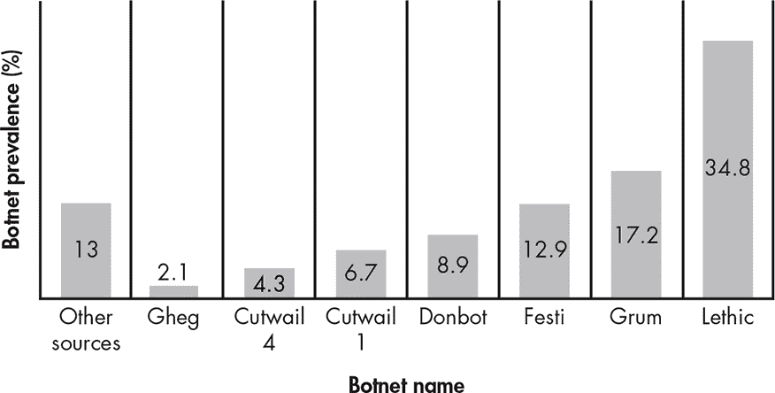

*图 2-1：根据 M86 Security Labs 的数据，最流行的垃圾邮件僵尸网络*

Festi 在流行度上的崛起源于对 Assist，一家支付处理公司，发起的特别攻击。^(1) Assist 是竞标俄罗斯最大航空公司 Aeroflot 合同的公司之一，但在 Aeroflot 准备做出决定前几周，网络犯罪分子利用 Festi 发起了对 Assist 的大规模 DDoS 攻击。这次攻击使得处理系统在一段较长的时间内无法使用，最终迫使 Aeroflot 将合同授予另一家公司。这一事件是 rootkit 如何在现实犯罪中被使用的典型例子。

### **剖析 Rootkit 驱动程序**

Festi rootkit 主要通过类似于第一章中讨论的 TDL3 rootkit 的 PPI 计划分发。引导程序的相当简单的功能将内核模式驱动程序安装到系统中，后者实现了恶意软件的主要逻辑。内核模式组件作为一个“系统启动”内核模式驱动程序注册，名称随机生成，这意味着恶意驱动程序会在系统启动时加载并执行。

**引导程序感染者**

*Dropper*（引导程序）是一种特殊类型的感染程序。引导程序将负载携带到受害者系统中。负载通常会被压缩和加密或混淆。一旦执行，引导程序会从其映像中提取负载，并将其安装到受害者系统中（即将其"丢到"系统中——因此得名此类感染程序）。与引导程序不同，*下载程序*（另一种感染程序）不携带负载，而是从远程服务器下载负载。

Festi 僵尸网络仅针对 Microsoft Windows x86 平台，并且没有针对 64 位平台的内核模式驱动程序。这在其分发时是可行的，因为当时仍有许多 32 位操作系统在使用，但现在随着 64 位系统的数量超越 32 位系统，这意味着该 rootkit 在很大程度上已经过时。

内核模式驱动程序有两个主要任务：从命令和控制（C&C）服务器请求配置信息，并下载和执行以插件形式存在的恶意模块（如图 2-2 所示）。每个插件都专门用于某个任务，例如对指定的网络资源执行 DDoS 攻击或向 C&C 服务器提供的邮件列表发送垃圾邮件。

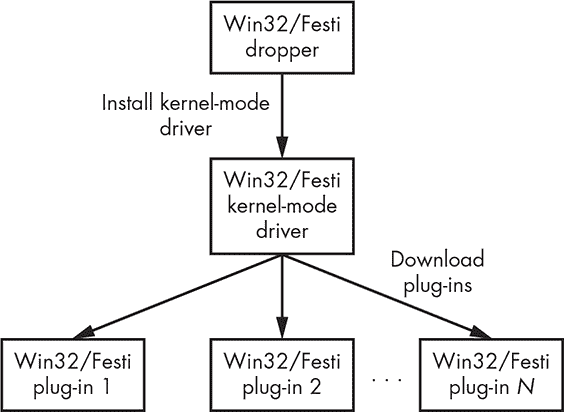

*图 2-2：Festi rootkit 的操作*

有趣的是，这些插件并未存储在系统硬盘上，而是存储在易失性内存中，这意味着当感染的计算机关闭或重启时，插件会从系统内存中消失。这使得恶意软件的取证分析变得更加困难，因为硬盘上仅存储了主内核模式驱动程序，且该驱动程序既不包含负载，也不包含任何攻击目标的信息。

#### ***Festi 用于 C&C 通信的配置信息***

为了使其能够与 C&C 服务器通信，Festi 分发时带有三项预定义的配置信息：C&C 服务器的域名、加密 bot 与 C&C 之间传输数据的密钥，以及 bot 的版本信息。

此配置信息是硬编码到驱动程序的二进制文件中的。图 2-3 显示了一个内核模式驱动的节表，其中有一个可写节`.cdata`，该节存储了配置信息以及执行恶意活动所需的字符串。

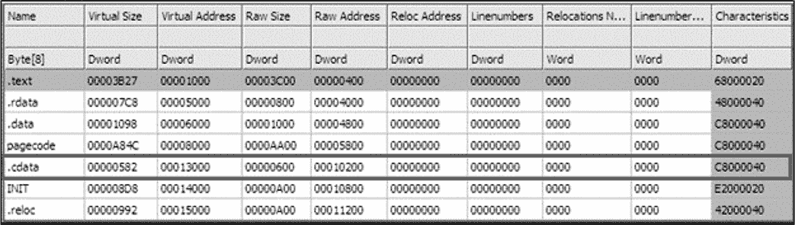

*图 2-3：Festi 内核模式驱动的节表*

恶意软件使用一种简单的算法对内容进行混淆，该算法将数据与一个 4 字节的密钥进行异或。`.cdata`部分在驱动程序初始化的最初阶段被解密。

`.cdata`部分中的字符串，列在表 2-1 中，可能引起安全软件的注意，因此对它们进行混淆有助于恶意软件逃避检测。

**表 2-1：** Festi 配置数据部分中的加密字符串

| **字符串** | **用途** |
| --- | --- |
| `\Device\Tcp``\Device\Udp` | 恶意软件用于发送和接收数据的设备对象名称 |
| `\REGISTRY\MACHINE\SYSTEM\ CurrentControlSet\Services\ SharedAccess\Parameters\FirewallPolicy\ StandardProfile\GloballyOpenPorts\List` | 存储 Windows 防火墙参数的注册表键路径，恶意软件用此路径来禁用本地防火墙 |
| `ZwDeleteFile, ZwQueryInformationFile, ZwLoadDriver, KdDebuggerEnabled, ZwDeleteValueKey, ZwLoadDriver` | 恶意软件使用的系统服务名称 |

#### ***Festi 的面向对象框架***

与许多内核模式驱动程序不同，这些驱动程序通常使用面向过程的编程范式用纯 C 语言编写，而 Festi 驱动程序具有面向对象的架构。恶意软件实现的架构的主要组件（类）包括：

**内存管理器** 分配和释放内存缓冲区

**网络套接字** 在网络上发送和接收数据

**C&C 协议解析器** 解析 C&C 消息并执行接收到的命令

**插件管理器** 管理下载的插件

这些组件之间的关系如图 2-4 所示。

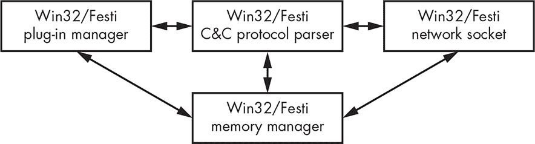

*图 2-4：Festi 内核模式驱动程序的架构*

如你所见，内存管理器是所有其他组件使用的核心组件。

这种面向对象的方法使得恶意软件能够轻松移植到其他平台，如 Linux。为了做到这一点，攻击者只需要修改由组件接口隔离的系统特定代码（例如调用系统服务进行内存管理和网络通信的代码）。例如，下载的插件几乎完全依赖于主模块提供的接口；它们很少使用系统提供的例程来执行系统特定的操作。

#### ***插件管理***

从 C&C 服务器下载的插件被恶意软件加载并执行。为了有效管理下载的插件，Festi 维护了一个指向特定定义的`PLUGIN_INTERFACE`结构体的指针数组。每个结构体对应内存中的一个特定插件，并为机器人提供特定的入口点——处理从 C&C 接收的数据的例程，如图 2-5 所示。通过这种方式，Festi 跟踪内存中加载的所有恶意插件。

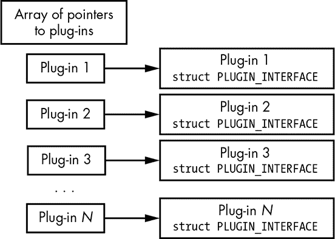

*图 2-5：指向`PLUGIN_INTERFACE`结构体的指针数组布局*

列表 2-1 显示了`PLUGIN_INTERFACE`结构的布局。

```
struct PLUGIN_INTERFACE

{

  // Initialize plug-in

  PVOID Initialize;

  // Release plug-in, perform cleanup operations

  PVOID Release;

  // Get plug-in version information

  PVOID GetVersionInfo_1;

  // Get plug-in version information

  PVOID GetVersionInfo_2;

  // Write plug-in-specific information into tcp stream

  PVOID WriteIntoTcpStream;

  // Read plug-in specific information from tcp stream and parse data

  PVOID ReadFromTcpStream;

  // Reserved fields

  PVOID Reserved_1;

  PVOID Reserved_2;

};
```

*列表 2-1：定义`PLUGIN_INTERFACE`结构*

前两个例程，`Initialize`和`Release`，分别用于插件的初始化和终止。接下来的两个例程，`GetVersionInfo_1`和`GetVersionInfo_2`，用于获取当前插件的版本信息。

`WriteIntoTcpStream`和`ReadFromTcpStream`例程用于在插件与 C&C 服务器之间交换数据。当 Festi 向 C&C 服务器传输数据时，它会遍历指向插件接口的指针数组，并执行每个已注册插件的`WriteIntoTcpStream`例程，将指向 TCP 流对象的指针作为参数传递。TCP 流对象实现了网络通信接口的功能。

在接收到来自 C&C 服务器的数据时，机器人执行插件的`ReadFromTcpStream`例程，以便已注册的插件能够从网络流中获取参数和插件特定的配置信息。因此，每个加载的插件可以独立于其他插件与 C&C 服务器进行通信，这意味着插件可以独立开发，从而提高开发效率和架构的稳定性。

#### ***内置插件***

安装时，主要的恶意内核模式驱动程序实现了两个内置插件：*配置信息管理器*和*机器人插件管理器*。

##### **配置信息管理器**

配置信息管理器插件负责请求配置信息并从 C&C 服务器下载插件。这个简单的插件定期连接到 C&C 服务器以下载数据。两次连续请求之间的延迟由 C&C 服务器本身指定，可能是为了避免安全软件用来检测感染的静态模式。我们在“Festi 网络通信协议”中描述了机器人与 C&C 服务器之间的网络通信协议，详见第 26 页。

##### **机器人插件管理器**

机器人插件管理器负责维护已下载插件的数组。它接收来自 C&C 服务器的远程命令，并加载和卸载特定的插件，这些插件以压缩形式传送到系统中。每个插件都有一个默认的入口点—`DriverEntry`—并导出两个例程`CreateModule`和`DeleteModule`，如图 2-6 所示。

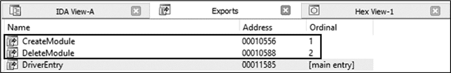

*图 2-6：Festi 插件的导出地址表*

`CreateModule`例程在插件初始化时执行，并返回指向`PLUGIN_INTERFACE`结构的指针，如列表 2-1 中所述。它以指向由主模块提供的几个接口的指针作为参数，例如内存管理器和网络接口。

当插件被卸载时，`DeleteModule`例程会被执行，释放之前分配的所有资源。图 2-7 展示了插件管理器加载插件的算法。

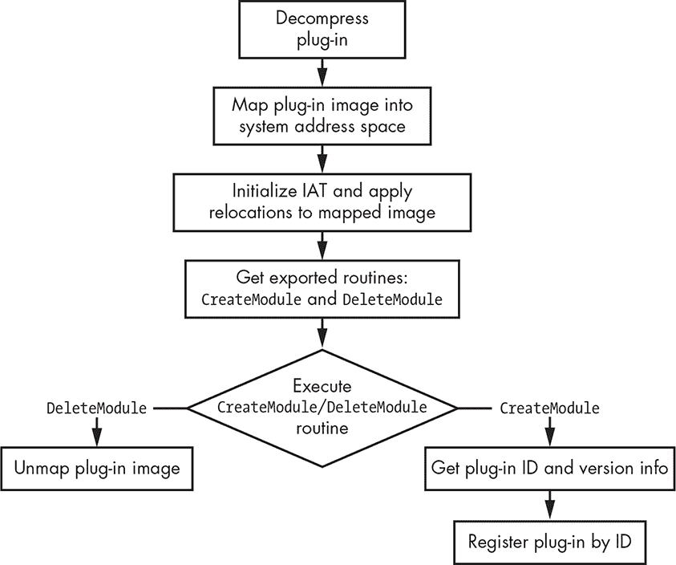

*图 2-7：插件管理器算法*

恶意软件首先将插件解压到内存缓冲区中，然后将其映射到内核模式地址空间作为 PE 镜像。插件管理器初始化导入地址表（IAT）并将其重定位到映射的镜像中。在这个算法中，Festi 还模拟了典型操作系统的运行时加载器和操作系统模块的动态链接器。

根据插件是加载还是卸载，插件管理器执行`CreateModule`或`DeleteModule`例程。如果插件正在加载，插件管理器获取插件的 ID 和版本信息，然后将其注册到`PLUGIN_INTERFACE`结构中。

如果插件正在卸载，恶意软件会释放之前分配给插件镜像的所有内存。

#### ***反虚拟机技术***

Festi 有检测其是否在 VMware 虚拟机中运行的技术，以规避沙盒和自动化恶意软件分析环境。它尝试通过执行列表 2-2 中的代码获取任何现有的 VMWare 软件版本。

```
mov eax, 'VMXh'

mov ebx, 0

mov ecx, 0Ah

mov edx, 'VX'

in eax, dx
```

*列表 2-2：获取 VMWare 软件版本*

Festi 检查`ebx`寄存器，如果代码在 VMware 虚拟环境中执行，寄存器的值为`VMX`，否则为`0`。

有趣的是，如果 Festi 检测到虚拟环境的存在，它不会立即终止执行，而是像在物理计算机上执行一样继续。当恶意软件从 C&C 服务器请求插件时，它提交某些信息，揭示它是否在虚拟环境中执行；如果是，C&C 服务器可能不会返回任何插件。

这可能是一种规避动态分析的技术：Festi 不终止与 C&C 服务器的通信，试图欺骗自动分析系统，使其认为 Festi 没有察觉到自己被监控，而实际上 C&C 服务器已经意识到自己正在被监控，因此不会提供任何命令或插件。恶意软件通常会在检测到它在调试器或沙盒环境中运行时终止执行，以避免泄露配置信息和有效载荷模块。

然而，恶意软件研究人员对这种行为非常敏感：如果恶意软件在没有执行任何恶意活动的情况下迅速终止，它可能会引起分析员的注意，分析员可能会进行更深入的分析，查明为什么它没有起作用，最终发现恶意软件试图隐藏的数据和代码。通过不在检测到沙箱时终止执行，Festi 试图避免这些后果，但它确实指示其 C&C 不向沙箱提供恶意模块和配置数据。

Festi 还检查系统中是否存在网络流量监控软件，这可能表明恶意软件已在恶意软件分析和监控环境中执行。Festi 查找内核模式驱动程序 *npf.sys*（网络数据包过滤器）。该驱动程序属于 Windows 数据包捕获库 WinPcap，常用于网络监控软件如 Wireshark，通过它可以访问数据链路层网络。*npf.sys* 驱动程序的存在表明系统上安装了网络监控工具，这对恶意软件来说是不安全的。

**WINPCAP**

*Windows 数据包捕获库*（WinPcap）允许应用程序捕获和传输网络数据包，绕过协议栈。它提供内核级网络数据包过滤和监控功能。许多开源和商业网络工具广泛使用此库作为过滤引擎，例如协议分析器、网络监控器、网络入侵检测系统和嗅探器，包括知名工具如 Wireshark、Nmap、Snort 和 ntop。

#### ***反调试技术***

Festi 还通过检查从操作系统内核镜像导出的 `KdDebuggerEnabled` 变量，来检测系统中是否存在内核调试器。如果操作系统附加了系统调试器，该变量的值为 `TRUE`；否则，值为 `FALSE`。

Festi 通过定期将调试寄存器 `dr0` 到 `dr3` 清零，积极对抗系统调试器。这些寄存器用于存储断点的地址，移除硬件断点会阻碍调试过程。清除调试寄存器的代码在清单 2-3 中展示。

```
char _thiscall ProtoHandler_1(STRUCT_4_4 *this, PKEVENT a1)

{

__writedr(0, 0); // mov dr0, 0

__writedr(1u, 0); // mov dr1, 0

__writedr(2u, 0); // mov dr2, 0

__writedr(3ut 0); // mov dr3, 0

  return _ProtoHandler(&this->struct43, a1);

}
```

*清单 2-3：Festi 代码中清除调试寄存器*

突出的 `writedr` 指令对调试寄存器执行写操作。正如你所看到的，Festi 在执行负责处理恶意软件与 C&C 服务器之间通信协议的 `_ProtoHandler` 例程之前，将零写入这些寄存器。

#### ***隐藏磁盘上恶意驱动程序的方法***

为了保护和隐藏存储在硬盘上的恶意内核模式驱动程序映像，Festi 钩住了文件系统驱动程序，以便它可以拦截并修改发送到文件系统驱动程序的所有请求，从而排除其存在的证据。

安装钩子的简化版例程见清单 2-4。

```
NTSTATUS __stdcall SetHookOnSystemRoot(PDRIVER_OBJECT DriverObject,

                                       int **HookParams)

{

  RtlInitUnicodeString(&DestinationString, L"\\SystemRoot");

  ObjectAttributes.Length = 24;

  ObjectAttributes.RootDirectory = 0;

  ObjectAttributes.Attributes = 64;

  ObjectAttributes.ObjectName = &DestinationString;

  ObjectAttributes.SecurityDescriptor = 0;

  ObjectAttributes.SecurityQualityOfService = 0;

➊ NTSTATUS Status = IoCreateFile(&hSystemRoot, 0x80000000, &ObjectAttributes,

                                 &IoStatusBlock, 0, 0, 3u, 1u, 1u, 0, 0, 0, 0,

                                 0x100u);

  if (Status < 0 )

    return Status;

➋ Status = ObReferenceObjectByHandle(hSystemRoot, 1u, 0, 0,

                                     &SystemRootFileObject, 0);

  if (Status < 0 )

    return Status;

➌ PDEVICE_OBJECT TargetDevice = IoGetRelatedDeviceObject(SystemRootFileObject);

  if ( !_ TargetDevice )

      return STATUS_UNSUCCESSFUL;

  ObfReferenceObject(TargetDevice);

  Status = IoCreateDevice(DriverObject, 0xCu, 0, TargetDev->DeviceType,

                          TargetDevice->Characteristics, 0, &SourceDevice);

  if (Status < 0 )

    return Status;

➍ PDEVICE_OBJECT DeviceAttachedTo = IoAttachDeviceToDeviceStack(SourceDevice,

                                                                TargetDevice);

  if ( ! DeviceAttachedTo )

  {

    IoDeleteDevice(SourceDevice);

    return STATUS_UNSUCCESSFUL;

  }

  return STATUS_SUCCESS;

}
```

*清单 2-4：挂钩文件系统设备驱动程序堆栈*

恶意软件首先尝试获取指向特殊系统文件`SystemRoot`的句柄，该文件对应于 Windows 安装目录 ➊。然后，通过执行`ObReferenceObjectByHandle`系统例程 ➋，Festi 获得指向与`SystemRoot`句柄对应的`FILE_OBJECT`的指针。`FILE_OBJECT`是操作系统用于管理设备对象访问的特殊数据结构，因此它包含指向相关设备对象的指针。在我们的案例中，由于我们打开了`SystemRoot`的句柄，`DEVICE_OBJECT`与操作系统的文件系统驱动程序相关联。恶意软件通过执行`IoGetRelatedDeviceObject`系统例程 ➌来获取指向`DEVICE_OBJECT`的指针，然后通过调用`IoAttachDeviceToDeviceStack` ➍将新设备对象附加到获取的设备对象指针上，如图 2-8 中所示的文件系统设备堆栈布局。Festi 的恶意设备对象位于堆栈的顶部，这意味着针对文件系统的 I/O 请求会被重定向到恶意软件。这使得 Festi 能够通过修改与文件系统驱动程序的请求和返回数据来隐藏自己。

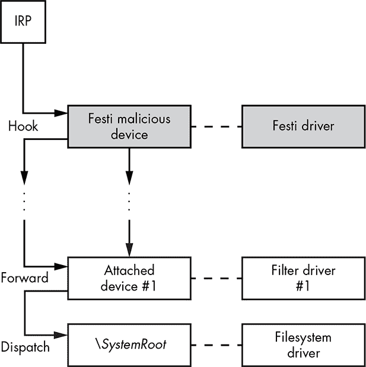

*图 2-8：Festi 挂钩的文件系统设备堆栈布局*

在图 2-8 的最底部，您可以看到文件系统驱动程序对象以及处理操作系统文件系统请求的相应设备对象。这里可能还附加了一些额外的文件系统过滤器。朝图形的顶部，您可以看到 Festi 驱动程序附加到文件系统设备堆栈。

该设计使用并严格遵循 Windows 堆栈式 I/O 驱动程序设计，重现了本地操作系统的设计模式。到现在，您可能已经看到了趋势：rootkit 旨在与操作系统紧密集成，可靠地模仿成功的操作系统设计模式，为其模块提供支持。事实上，通过分析 rootkit 的各个方面（如 Festi 处理输入/输出请求的方式），您可以学到很多操作系统内部的知识。

在 Windows 中，文件系统 I/O 请求以 IRP 的形式表示，该请求从上到下经过堆栈。堆栈中的每个驱动程序都可以观察和修改请求或返回的数据。这意味着，如图 2-8 所示，Festi 可以修改针对文件系统驱动程序的 IRP 请求以及任何相应的返回数据。

Festi 通过`IRP_MJ_DIRECTORY_CONTROL`请求代码监视 IRP，该代码用于查询目录的内容，监视与恶意软件内核模式驱动程序所在位置相关的查询。如果它检测到此类请求，Festi 会修改文件系统驱动程序返回的数据，以排除任何与恶意驱动程序文件对应的条目。

#### ***保护 Festi 注册表键的方法***

Festi 还使用类似的方法隐藏一个对应于已注册内核模式驱动程序的注册表项。该注册表项位于 *HKEY_LOCAL_MACHINE\SYSTEM\CurrentControlSet\Services* 中，包含 Festi 驱动程序的类型及其在文件系统中的路径。这使得它容易被安全软件检测到，因此 Festi 必须隐藏该项。

为此，Festi 首先通过修改*系统服务描述符表（SSDT）*钩住 `ZwEnumerateKey`，这是一种查询指定注册表项信息并返回所有子项的系统服务。SSDT 是操作系统内核中的一个特殊数据结构，包含系统服务处理程序的地址。Festi 将原始 `ZwEnumerateKey` 处理程序的地址替换为钩子地址。

**Windows 内核补丁保护**

值得一提的是，这种钩子方法——修改 SSDT——仅适用于 32 位的 Microsoft Windows 操作系统。正如在第一章中提到的，Windows 的 64 位版本实现了*内核补丁保护*（也称为 PatchGuard）技术，以防止软件修改某些系统结构，包括 SSDT。如果 PatchGuard 检测到任何受监控的数据结构被修改，它将导致系统崩溃。

`ZwEnumerateKey` 钩子监控针对 *HKLM\System\CurrentControlSet\Service* 注册表项的请求，该项包含与系统上安装的内核模式驱动程序相关的子项，包括 Festi 驱动程序。Festi 修改钩子中的子项列表，排除与其驱动程序相关的条目。任何依赖 `ZwEnumerateKey` 获取已安装内核模式驱动程序列表的软件都无法察觉 Festi 恶意驱动程序的存在。

如果注册表在关机过程中被安全软件发现并删除，Festi 还能够替换注册表项。在这种情况下，Festi 首先执行系统例程 `IoRegisterShutdownNotification`，以便在系统关闭时接收关机通知。它检查关机通知处理程序，查看恶意驱动程序和相应的注册表项是否存在于系统中，如果不存在（即如果它们被删除了），它会恢复它们，从而保证其在重启后仍能存在。

### **Festi 网络通信协议**

为了与 C&C 服务器通信并执行其恶意活动，Festi 使用了一种自定义的网络通信协议，并且它必须保护该协议以防被窃听。在我们对 Festi 僵尸网络的调查过程中^(2)，我们获取了它与之通信的 C&C 服务器列表，并发现虽然有些服务器专注于发送垃圾邮件，其他则执行 DDoS 攻击，但两种类型的服务器都采用了相同的通信协议。Festi 的通信协议分为两个阶段：初始化阶段，它获取 C&C 的 IP 地址；工作阶段，它从 C&C 请求任务描述。

#### ***初始化阶段***

在初始化阶段，恶意软件获取 C&C 服务器的 IP 地址，这些域名存储在机器人（bot）的二进制文件中。这个过程有趣之处在于，恶意软件手动解析 C&C IP 地址。具体来说，它构造一个 DNS 请求包来解析 C&C 服务器域名，并将该包发送到 8.8.8.8 或 8.8.4.4 这两个 Google DNS 服务器的 53 端口。作为回应，Festi 接收到一个 IP 地址，以供后续通信使用。

手动解析域名使得僵尸网络更具抗查杀能力。如果 Festi 必须依赖本地 ISP 的 DNS 服务器来解析域名，ISP 有可能通过修改 DNS 信息来阻止对 C&C 服务器的访问——比如，如果执法机构发出命令封锁这些域名。然而，通过手动构造 DNS 请求并将其发送到 Google 服务器，恶意软件绕过了 ISP 的 DNS 基础设施，使得封锁变得更加困难。

#### ***工作阶段***

工作阶段是 Festi 向 C&C 服务器请求执行任务的阶段。与 C&C 服务器的通信通过 TCP 协议进行。发送给 C&C 服务器的网络数据包请求布局如图 2-9 所示，包括消息头和特定插件数据数组。

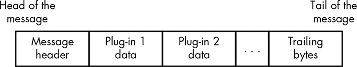

*图 2-9：发送到 C&C 服务器的网络数据包布局*

消息头由配置管理插件生成，包含以下信息：

+   Festi 版本信息

+   是否存在系统调试器

+   是否存在虚拟化软件（VMWare）

+   是否存在网络流量监控软件（WinPcap）

+   操作系统版本信息

插件特定数据由一系列*标签-值-终止*条目组成：

**标签** 一个 16 位整数，指定标签后面的值类型

**值** 以字节、字、双字、以 null 结尾的字符串或二进制数组形式的特定数据

**终止** 终止词，0xABDC，表示条目的结束

标签-值-终止方案为恶意软件提供了一种方便的方式，将插件特定的数据序列化成网络请求并发送到 C&C 服务器。

数据在发送到网络之前，使用简单的加密算法进行了混淆。加密算法的 Python 实现如列表 2-5 所示。

```
key = (0x17, 0xFB, 0x71,0x5C) ➊

def decr_data(data):

  for ix in xrange(len(data)):

    data[ix] ^= key[ix % 4]
```

*列表 2-5：网络加密算法的 Python 实现*

恶意软件使用一个滚动的 XOR 算法，配合一个固定的 4 字节密钥 ➊。

### **绕过安全和取证软件**

为了能够通过网络与 C&C 服务器通信、发送垃圾邮件并执行 DDoS 攻击，同时避开安全软件，Festi 依赖于 Windows 内核模式下实现的 TCP/IP 堆栈。

为了发送和接收数据包，恶意软件会根据使用的协议类型打开 *\Device\Tcp* 或 *\Device\Udp* 设备的句柄，并采用一种相当有趣的技术来获取该句柄，而不会引起安全软件的注意。在设计这种技术时，Festi 的作者再次展现了对 Windows 系统内部结构的出色理解。

为了控制主机上对网络的访问，一些安全软件通过拦截 `IRP_MJ_CREATE` 请求来监控对这些设备的访问。当有人尝试打开句柄以与设备对象通信时，这些请求会被发送到传输驱动程序。这样，安全软件就可以确定哪个进程正在尝试通过网络进行通信。一般来说，安全软件监控对设备对象访问的最常见方法是：

+   挂钩 `ZwCreateFile` 系统服务处理程序，以拦截所有尝试打开设备的操作

+   附加到 *\Device\Tcp* 或 *\Device\Udp* 以拦截所有发送的 IRP 请求

Festi 聪明地绕过了这两种技术，从而建立了与远程主机的网络连接。

首先，Festi 并没有使用系统实现的 `ZwCreateFile` 系统服务，而是实现了一个几乎具有与原版相同功能的自定义系统服务。Figure 2-10 展示了 `ZwCreateFile` 例程的自定义实现。

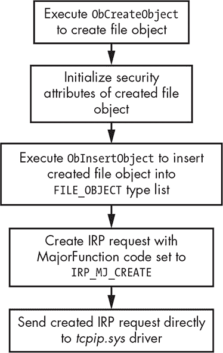

*Figure 2-10: `ZwCreateFile` 例程的自定义实现*

你可以看到，Festi 手动创建了一个文件对象，以便与正在打开的设备进行通信，并直接向传输驱动程序发送 `IRP_MJ_CREATE` 请求。因此，所有附加到 *\Device\Tcp* 或 *\Device\Udp* 的设备将错过该请求，而安全软件不会注意到这一操作，如 Figure 2-11 所示。

在图的左侧，你可以看到 IRP 是如何被正常处理的。IRP 包会经过完整的驱动程序堆栈，所有钩入其中的驱动程序——包括安全软件——都会接收到 IRP 包并检查其内容。图的右侧展示了 Festi 如何直接将 IRP 包发送到目标驱动程序，绕过了所有中间驱动程序。

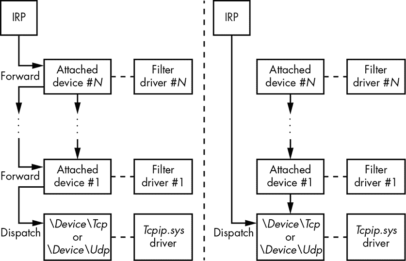

*Figure 2-11: 绕过网络监控安全软件*

Festi 同样巧妙地绕过了第二种安全软件技术。为了直接向 *\Device\Tcp* 或 *\Device\Udp* 发送请求，恶意软件需要指向相应设备对象的指针。负责此操作的代码片段在 Listing 2-6 中展示。

```
   RtlInitUnicodeString(&DriverName, L"\\Driver\\Tcpip");

   RtlInitUnicodeString(&tcp_name, L"\\Device\\Tcp");

   RtlInitUnicodeString(&udp_name, L"\\Device\\Udp");

➊ if (!ObReferenceObjectByName(&DriverName,64,0,0x1F01FF,

                                IoDriverObjectType,0,0,&TcpipDriver))

   {

     DevObj = TcpipDriver->DeviceObject;

  ➋ while ( DevObj )                          // iterate through DEVICE_OBJECT

     {                                         // linked list

       if ( !ObQueryNameString(DevObj, &Objname, 256, &v8) )

       {

      ➌ if ( RtlCompareUnicodeString(&tcp_name, &Objname, 1u) )

         {

       ➍  if ( !RtlCompareUnicodeString(&udp_name, &Objname, 1u) )

           {

             ObfReferenceObject(DevObj);

             this->DeviceUdp = DevObj;        // Save pointer to \Device\Udp

           }

         } else

         {

           ObfReferenceObject(DevObj);

           this->DeviceTcp = DevObj;          // Save pointer to \Device\Tcp

         }

       }

       DevObj = DevObj->NextDevice;       // get pointer to next DEVICE_OBJECT

                                          // in the list

     }

     ObfDereferenceObject(TcpipDriver);

   }
```

*Listing 2-6: 实现绕过网络监控安全软件的技术*

Festi 通过执行`ObReferenceObjectByName`例程➊（一个未公开的系统例程）并传递一个指向 Unicode 字符串的指针，该字符串包含目标驱动程序的名称，来获取指向*tcpip.sys*驱动程序对象的指针。然后，恶意软件遍历与该驱动程序对象对应的设备对象列表➋，并将其名称与*\Device\Tcp* ➌和*\Device\Udp* ➍进行比较。

当恶意软件以这种方式获取打开的设备句柄时，它使用该句柄在网络上发送和接收数据。尽管 Festi 能够避开安全软件，但通过使用操作在比 Festi 更低层次的网络流量过滤器（例如，在网络驱动接口规范 NDIS 层次）仍然可以看到它发送的包。

### **C&C 服务器失效的域名生成算法**

Festi 的另一个显著特点是它实现了一个域名生成算法（DGA），用于在 C&C 服务器的域名在机器人的配置数据中无法访问时作为回退机制。例如，如果执法机构关闭了 Festi C&C 服务器的域名，而恶意软件无法下载插件和命令时，就会发生这种情况。该算法以当前日期为输入，并输出一个域名。

表 2-2 列出了 Festi 样本的基于 DGA 的域名。如您所见，所有生成的域名都是伪随机的，这是 DGA 生成的域名的特点。

**表 2-2：** Festi 生成的 DGA 域名列表

| **日期** | **DGA 域名** |
| --- | --- |
| 07/11/2012 | *fzcbihskf.com* |
| 08/11/2012 | *pzcaihszf.com* |
| 09/11/2012 | *dzcxifsff.com* |
| 10/11/2012 | *azcgnfsmf.com* |
| 11/11/2012 | *bzcfnfsif.com* |

实现 DGA 功能使得僵尸网络对接管尝试具有抗性。即使执法机关成功禁用了主要的 C&C 服务器域名，僵尸网络主控者仍然可以通过回退到 DGA 重新获得对僵尸网络的控制。

### **恶意功能**

现在我们已经讨论了 rootkit 功能，接下来来看一下从 C&C 服务器下载的恶意插件。在我们的调查过程中，我们获取了这些插件的样本，并已识别出三种类型：

+   *BotSpam.sys*用于发送垃圾邮件

+   *BotDos.sys*用于执行 DDoS 攻击

+   *BotSocks.sys*提供代理服务

我们发现，不同的 C&C 服务器倾向于提供不同类型的插件：一些 C&C 服务器仅向机器人提供垃圾邮件插件，而其他服务器则只处理 DDoS 插件，这表明恶意软件的功能取决于它所报告的 C&C 服务器。Festi 僵尸网络并非一个统一体，而是由多个针对不同目标的子僵尸网络组成。

#### ***垃圾邮件模块***

*BotSpam.sys*插件负责发送垃圾邮件。C&C 服务器向其发送一个垃圾邮件模板和一个收件人电子邮件地址列表。图 2-12 展示了垃圾邮件插件的工作流程。

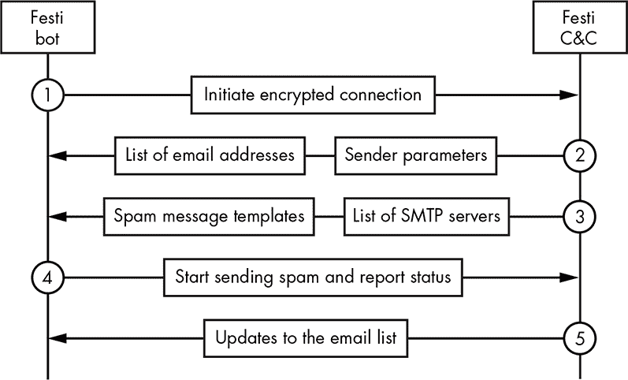

*图 2-12：Festi 垃圾邮件插件的工作流程图*

首先，插件与其 C&C 服务器建立加密连接，以下载包含发件人参数和实际垃圾邮件模板的电子邮件地址列表。然后，它将垃圾邮件分发给收件人。与此同时，恶意软件向 C&C 服务器报告状态，并请求更新电子邮件列表和垃圾邮件模板。

插件会检查通过 SMTP 服务器发送的电子邮件的状态，扫描来自 SMTP 服务器的响应，寻找特定字符串以指示问题——例如，如果没有找到指定地址的收件人，电子邮件未被接收，或电子邮件被归类为垃圾邮件。如果在 SMTP 服务器的响应中发现这些字符串，插件会优雅地终止与 SMTP 服务器的会话，并获取列表中的下一个地址。这个预防措施有助于恶意软件避免 SMTP 服务器将感染机器的 IP 地址列入黑名单，防止其继续发送垃圾邮件。

#### ***DDoS 引擎***

*BotDos.sys* 插件使僵尸网络能够对指定主机执行 DDoS 攻击。该插件支持多种类型的 DDoS 攻击，能够针对不同软件安装的各种架构和主机进行攻击。攻击类型取决于从 C&C 接收到的配置信息，涵盖 TCP 洪水、UDP 洪水、DNS 洪水和 HTTP 洪水等攻击。

##### **TCP 洪水**

在 TCP 洪水攻击中，僵尸网络向目标机器上的端口发起大量连接。每次 Festi 连接到服务器上的目标端口时，服务器会分配资源来处理传入的连接。很快，服务器的资源耗尽，无法再响应客户端请求。

默认端口是 HTTP 端口 80，但可以通过来自 C&C 服务器的相应配置信息更改，从而使恶意软件能够攻击监听其他端口（而非 80 端口）的 HTTP 服务器。

##### **UDP 洪水**

在 UDP 洪水攻击中，僵尸网络发送长度随机生成的 UDP 数据包，并填充随机数据。数据包的长度可以是 256 到 1,024 字节之间。目标端口也是随机生成的，因此不太可能是开放的。结果，攻击会导致目标主机生成大量 ICMP 目标不可达数据包进行回应，从而使目标机器无法使用。

##### **DNS 洪水**

僵尸网络还能够通过向目标主机的 53 端口（DNS 服务）发送大量 UDP 数据包来执行 DNS 洪水攻击。数据包包含解析在 *.com* 域区中随机生成的域名的请求。

##### **HTTP 洪水**

在针对 Web 服务器的 HTTP 洪水攻击中，僵尸网络的二进制文件包含多个不同的用户代理字符串，用于与 Web 服务器创建大量 HTTP 会话，导致远程主机超载。列表 2-7 包含了组装并发送 HTTP 请求的代码。

```
int __thiscall BuildHttpHeader(_BYTE *this, int a2)

{

➊ user_agent_idx = get_rnd() % 0x64u;

  str_cpy(http_header, "GET ");

  str_cat(http_header, &v4[204 * *(_DWORD *)(v2 + 4) + 2796]);

  str_cat(http_header, " HTTP/1.0\r\n");

  if ( v4[2724] & 2 )

  {

    str_cat(http_header, "Accept: */*\r\n");

    str_cat(http_header, "Accept-Language: en-US\r\n");

    str_cat(http_header, "User-Agent: ");

  ➋ str_cat(http_header, user_agent_strings[user_agent_idx]);

    str_cat(http_header, "\r\n");

  }

  str_cat(http_header, "Host: ");

  str_cat(http_header, &v4[204 * *(_DWORD *)(v2 + 4) + 2732]);

  str_cat(http_header, "\r\n");

  if ( v4[2724] & 2 )

    str_cat(http_header, "Connection: Keep-Alive\r\n");

  str_cat(http_header, "\r\n");

  result = str_len(http_header);

  *(_DWORD *)(v2 + 16) = result;

  return result;

}
```

*列表 2-7：Festi DDoS 插件组装 HTTP 请求的片段*

在 ➊ 处，代码生成一个值，然后在 ➋ 处作为用户代理字符串数组的索引使用。

#### ***Festi 代理插件***

*BotSocks.sys* 插件通过在 TCP 和 UDP 协议上实现 SOCKS 服务器，为攻击者提供远程代理服务。SOCKS 服务器代表客户端与另一个目标服务器建立网络连接，然后将所有流量在客户端和目标服务器之间来回转发。

因此，感染 Festi 的计算机变成了一个代理服务器，允许攻击者通过感染的计算机连接到远程服务器。网络犯罪分子可能会使用这种服务进行匿名化——即隐藏攻击者的 IP 地址。由于连接是通过感染的主机发生的，远程服务器可以看到受害者的 IP 地址，但看不到攻击者的 IP 地址。

Festi 的 *BotSocks.sys* 插件没有使用任何反向连接代理机制来绕过 NAT（网络地址转换），NAT 使得网络中的多个计算机可以共享一个外部可见的 IP 地址。一旦恶意软件加载了插件，它会打开一个网络端口并开始监听传入连接。端口号是从 4000 到 65536 的范围内随机选择的。插件将它所监听的端口号发送给 C&C 服务器，以便攻击者能够与受害计算机建立网络连接。NAT 通常会阻止这种传入连接（除非为目标端口配置了端口转发）。

*BotSocks.sys* 插件还试图绕过 Windows 防火墙，否则防火墙可能会阻止端口的打开。该插件修改了注册表项 *SYSTEM\CurrentControlSet\Services\SharedAccess\Parameters\FirewallPolicy\DomainProfile\GloballyOpenPorts\List*，该项包含可以在 Windows 防火墙配置文件中打开的端口列表。恶意软件在此注册表项中添加了两个子项，以便允许来自任何目标的 TCP 和 UDP 传入连接。

**SOCKS**

*Socket Secure (SOCKS)* 是一种互联网协议，通过代理服务器在客户端和服务器之间交换网络数据包。SOCKS 服务器将来自 SOCKS 客户端的 TCP 连接代理到任意 IP 地址，并提供转发 UDP 数据包的手段。SOCKS 协议通常被网络犯罪分子用作一种绕过工具，允许流量绕过互联网过滤器，从而访问本应被封锁的内容。

### **结论**

现在你应该已经完整了解了 Festi rootkit 的功能及其用途。Festi 是一款有趣的恶意软件，具有精心设计的架构和精心打造的功能。恶意软件的每个技术方面都符合其设计原则：保持隐蔽，并且能够抵抗自动化分析、监控系统和取证分析。

从 C&C 服务器下载的易变恶意插件不会在感染机器的硬盘上留下任何痕迹。使用加密技术保护连接 C&C 服务器的网络通信协议，使得在网络流量中难以检测到 Festi，且通过高级的内核模式网络套接字使用，允许 Festi 绕过某些主机入侵防御系统（HIPS）和个人防火墙。

该僵尸程序通过实现 rootkit 功能，隐藏其主模块及相应的注册表键值，从而避开安全软件。这些方法在 Festi 最为流行时对安全软件非常有效，但也暴露了其一个主要缺陷：它仅针对 32 位系统。Windows 操作系统的 64 位版本实施了现代安全功能，如 PatchGuard，使得 Festi 的入侵工具无效。64 位版本还要求内核模式驱动程序拥有有效的数字签名，这显然对于恶意软件来说不是容易的选择。如第一章所述，为了绕过这一限制，恶意软件开发者想出了实现引导工具技术的解决方案，我们将在第二部分中详细介绍这一技术。
