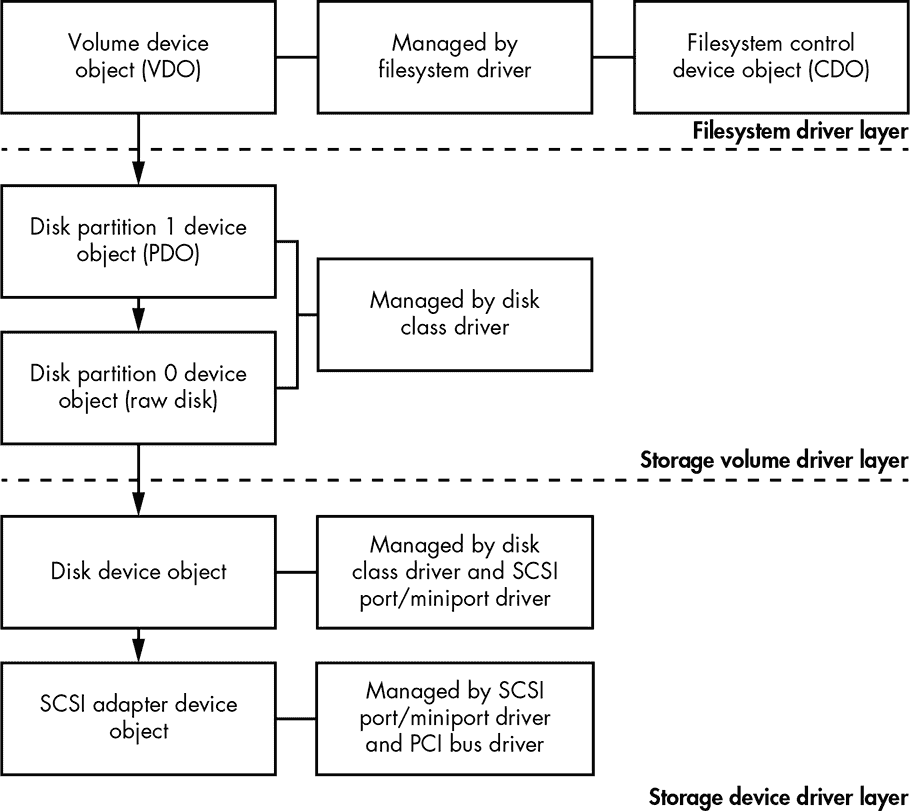
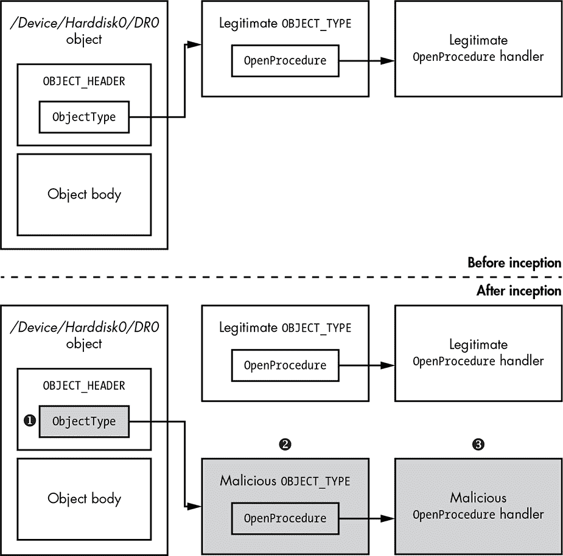
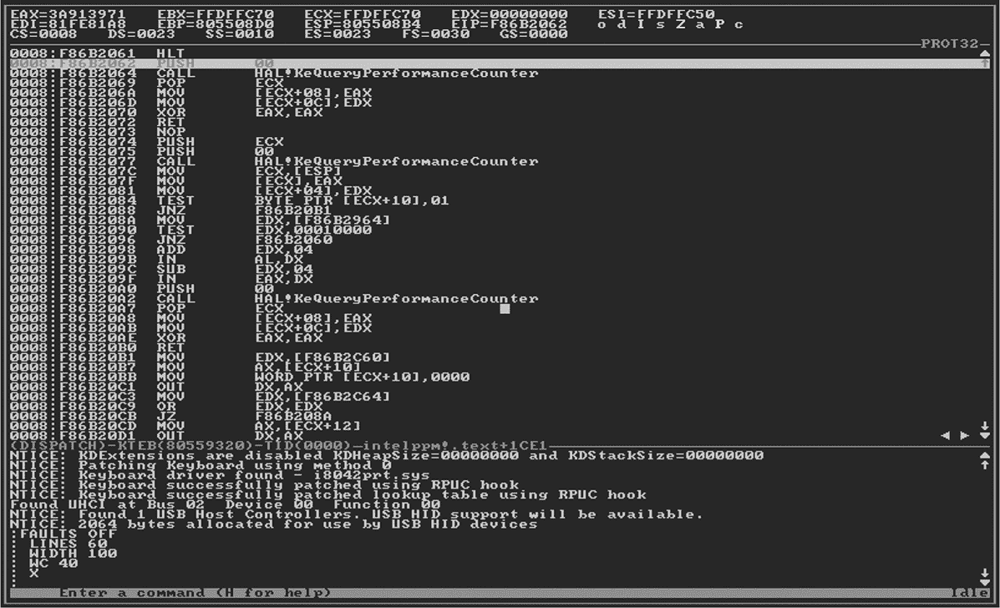

## **观察根 kit 感染**

我们如何检查一个潜在感染的系统是否藏有根 kit 呢？毕竟，根 kit 的整个目的就是防止管理员检查系统的真实状态，因此发现感染证据可能是一场智力较量——或者更准确地说，是一次理解系统内部结构的竞赛。分析人员必须最初对从感染系统获得的任何信息保持怀疑，并努力寻找即便在受损状态下也可信赖的更深层次证据。

从 TDL3 和 Festi 根 kit 的例子中我们知道，依赖于在若干固定位置检查内核完整性的检测根 kit 方法很可能会失败。根 kit 不断进化，因此新型根 kit 很有可能使用防御软件尚未掌握的技术。实际上，在 2000 年代初根 kit 的黄金时代，根 kit 开发者不断引入新的技巧，使得他们的根 kit 能够避开检测长达数月，直到防御者能够开发出新的稳定检测方法并将其添加到防御软件中。

有效防御的开发延迟为一种新型软件工具——专用*反根 kit*软件——创造了市场，这类工具在其检测算法（有时甚至是系统稳定性）上作出妥协，以便更快速地发现根 kit。当这些算法逐渐成熟后，它们成为了更传统的主机入侵预防系统（HIPS）产品的一部分，并加入了新的“前沿”启发式方法。

面对防御方面的这些创新，根 kit 开发者通过想出方法积极破坏反根 kit 工具来回应。系统级的防御与进攻通过多个周期共同进化。在这一共同进化过程中，尤其是由于它的存在，防御者大大完善了对系统组成、攻击面、完整性和保护特征的理解。在计算机安全领域，这些来自微软高级安全研究员 John Lambert 的话在此处和其他地方都很真实：“如果你羞辱攻击研究，你就误判了它的贡献。进攻与防守并不是平等的。防守是进攻的孩子。”

为了有效捕捉根 kit，防御者必须学会从根 kit 创建者的角度思考。

### 拦截方法

根 kit 必须在操作系统的特定点上拦截控制，以防止反根 kit 工具启动或初始化。这些拦截点非常多，既存在于标准操作系统机制中，也存在于未记录的机制中。拦截方法的一些例子包括：修改关键函数中的代码，改变内核及其驱动程序中各种数据结构的指针，以及使用*直接内核对象操作（DKOM）*等技术操控数据。

为了给这个看似无尽的列表带来一些秩序，我们将考虑三个主要的操作系统机制，rootkit 可以通过拦截这些机制来控制程序的启动和初始化：系统事件、系统调用和对象调度器。

#### *拦截系统事件*

获得控制的第一种方法是通过 *事件通知回调* 来拦截系统事件，事件通知回调是用于处理各种类型系统事件的操作系统接口。合法驱动程序需要通过加载可执行二进制文件、创建和修改注册表键来响应新进程或数据流的创建。为了避免驱动程序开发者创建脆弱的、未记录的钩子解决方案，微软提供了标准化的事件通知机制。恶意软件编写者使用相同的机制，通过他们自己的代码响应系统事件，取代合法的响应。

举一个例子，内核模式驱动程序的 `CmRegisterCallbackEx` 例程注册了一个回调函数，该函数在每次有人对系统注册表进行操作时执行，比如创建、修改或删除注册表键。通过滥用这个功能，恶意软件可以拦截所有对系统注册表的请求，检查这些请求，然后决定是阻止还是允许它们。这使得 rootkit 能够保护任何与其内核模式驱动程序相对应的注册表键，隐藏它们免受安全软件的检测，并阻止任何试图删除它们的操作。

**在系统注册表中注册内核模式驱动程序**

在 Windows 中，每个内核模式驱动程序在系统注册表中都有一个专门的条目，位于 *HKEY_LOCAL_MACHINE\SYSTEM\CurrentControlSet\Services* 键下。该条目指定了驱动程序的名称、驱动程序类型、驱动程序镜像在磁盘上的位置，以及驱动程序何时加载（按需加载、启动时加载、系统初始化时加载等等）。如果删除此条目，操作系统将无法加载内核模式驱动程序。为了在目标系统上保持持久性，内核模式 rootkit 通常会保护其对应的注册表条目，以防被安全软件删除。

另一种恶意的系统事件拦截利用了内核模式驱动程序的 `PsSetLoadImageNotifyRoutine` 例程。这个例程注册了回调函数 `ImageNotifyRoutine`，每当可执行镜像被映射到内存中时，该回调函数会被执行。回调函数接收关于正在加载的镜像的信息——即镜像的名称和基地址，以及该镜像被加载到的进程地址空间的标识符。

Rootkit 经常滥用 `PsSetLoadImageNotifyRoutine` 函数，将恶意负载注入目标进程的用户模式地址。通过注册回调函数，rootkit 会在图像加载操作发生时收到通知，并可以检查传递给 `ImageNotifyRoutine` 的信息，以判断目标进程是否值得关注。例如，如果 rootkit 只想将用户模式负载注入网页浏览器，它可以检查正在加载的图像是否对应于浏览器应用程序，并据此采取行动。

内核还提供了其他接口，暴露类似的功能，我们将在接下来的章节中讨论它们。

#### *拦截系统调用*

第二种感染方法涉及拦截另一个关键的操作系统机制：系统调用，这是用户程序与内核交互的主要方式。由于几乎所有的用户空间 API 调用都会生成一个或多个对应的系统调用，能够调度系统调用的 rootkit 就能完全控制系统。

作为例子，我们将研究拦截文件系统调用的方法，这对于必须始终隐藏自身文件以防止被意外访问的 rootkit 尤为重要。当安全软件或用户扫描文件系统中的可疑或恶意文件时，系统会发出系统调用，指示文件系统驱动程序查询文件和目录。通过拦截这些系统调用，rootkit 可以操控返回数据，将其恶意文件的信息从查询结果中排除（正如我们在《隐藏磁盘上的恶意驱动程序方法》中看到的，见第 22 页）。

要了解如何应对这些滥用行为并保护文件系统调用免受 rootkit 的侵害，我们首先需要简要了解文件子系统的结构。这是操作系统内核内部如何被分为多个专业层级并遵循许多交互规范的完美例子——这些概念即使对大多数系统开发人员也是模糊的，但对 rootkit 编写者而言却不然。

##### 文件子系统

Windows 文件子系统与其 I/O 子系统紧密集成。这些子系统是模块化和分层的，每个层级的功能由独立的驱动程序负责。主要有三种类型的驱动程序。

*存储设备驱动程序*是与特定设备的控制器（如端口、总线和硬盘驱动器）交互的低级驱动程序。大多数这些驱动程序是*即插即用（PnP）*的，由 PnP 管理器加载和控制。

*存储卷驱动程序* 是中间层驱动程序，控制存储设备分区上的卷抽象。为了与磁盘子系统的较低层交互，这些驱动程序创建了一个 *物理设备对象 (PDO)* 来表示每个分区。当文件系统挂载到某个分区时，文件系统驱动程序会创建一个 *卷设备对象 (VDO)*，它代表该分区，向更高层的文件系统驱动程序展示，接下来会解释这一点。

*文件系统驱动程序* 实现特定的文件系统，如 FAT32、NTFS、CDFS 等，并且还会创建一对对象：一个 VDO 和一个 *控制设备对象 (CDO)*，它表示给定的文件系统（与底层分区不同）。这些 CDO 设备的名称通常为 *\Device\Ntfs*。

**注意**

*欲了解更多关于不同类型驱动程序的信息，请参考 Windows 文档* ([`docs.microsoft.com/en-us/windows-hardware/drivers/ifs/storage-device-stacks--storage-volumes--and-file-system-stacks/`](https://docs.microsoft.com/en-us/windows-hardware/drivers/ifs/storage-device-stacks--storage-volumes--and-file-system-stacks/))。

图 3-1 展示了使用 SCSI 磁盘设备作为示例的设备对象层次结构的简化版本。

在存储设备驱动程序层，我们可以看到 SCSI 适配器和磁盘设备对象。这些设备对象由三个不同的驱动程序创建和管理：PCI 总线驱动程序，它 *枚举*（发现）可用的 PCI 总线上的存储适配器；SCSI 端口/迷你端口驱动程序，它初始化并控制枚举的 SCSI 存储适配器；以及磁盘类驱动程序，它控制附加到 SCSI 存储适配器的磁盘设备。

*图 3-1：存储设备驱动程序堆栈示例*

在存储卷驱动程序层，我们可以看到分区 0 和分区 1，这些也是由磁盘类驱动程序创建的。分区 0 表示整个原始磁盘，并且始终存在，无论磁盘是否已分区。分区 1 表示磁盘设备上的第一个分区。我们的示例只有一个分区，因此只显示了分区 0 和分区 1。

分区 1 必须向用户公开，以便他们能够存储和访问存储在磁盘设备上的文件。为了公开分区 1，文件系统驱动程序在存储堆栈的文件系统驱动程序层顶部创建了一个 VDO。请注意，可能还会有可选的存储过滤设备对象附加在 VDO 顶部或设备堆栈中的设备对象之间，为了简化图示我们省略了这些内容。我们还可以在图的右上角看到一个文件系统 CDO，操作系统用来控制文件系统驱动程序。

该图演示了存储驱动程序堆栈的复杂性如何为 rootkit 提供拦截文件系统操作并修改或隐藏数据的机会。

#### *拦截文件操作*

对于 rootkit 来说，拦截文件操作在最上层（即文件系统驱动程序层）比在更低层更容易。这样，rootkit 可以在应用程序程序员的层面上看到所有这些操作，而不需要去查找和解析对程序员不可见的文件系统结构，这些结构对应着传递给下层驱动程序的*输入/输出请求包（IRPs）*。

如果 rootkit 改为在较低层拦截操作，它必须重新实现部分 Windows 文件系统，这是一个复杂且容易出错的任务。然而，这并不意味着没有低级驱动程序拦截：磁盘的扇区映射仍然相对容易获取，即使在迷你端口驱动程序层拦截或转发扇区操作也是可行的，正如 TDL3 所展示的那样。

无论 rootkit 在哪个层次拦截存储 I/O，都有三种主要的拦截方法：

1.  将过滤驱动程序附加到目标设备的驱动程序堆栈上

1.  替换驱动程序描述符结构中指向 IRP 或 FastIO 处理函数的指针

1.  替换这些 IRP 或 FastIO 驱动程序函数的代码。

**FASTIO**

为了执行输入/输出操作，IRP 会遍历整个存储设备堆栈，从最上层的设备对象一直到最底层。*FastIO* 是一种可选的方法，旨在对缓存文件执行快速同步的输入/输出操作。在 FastIO 操作中，数据直接在用户模式缓冲区和系统缓存之间传输，绕过文件系统和存储驱动程序堆栈。这使得对缓存文件的 I/O 操作变得更快。

在第二章中，我们讨论了 Festi rootkit，它使用了拦截方法 1：Festi 在文件系统驱动程序层的存储驱动程序堆栈顶部附加了一个恶意的过滤设备对象。

本书后续将讨论 TDL4（第七章）、Olmasco（第十章）和 Rovnix（第十一章）引导病毒，它们都采用方法 2：在最低层次，即存储设备驱动程序层，拦截磁盘输入/输出操作。我们在第十二章将讨论的 Gapz 引导病毒则使用方法 3，也是存储设备驱动程序层。你可以参考这些章节，了解每种方法的实现细节。

这简要回顾了 Windows 文件系统，显示出由于该系统的复杂性，rootkit 在这堆驱动程序中有着丰富的目标选择。rootkit 可能会在任何一层拦截控制，甚至可能在多层同时拦截。反 rootkit 程序需要处理所有这些可能性——例如，通过安排自己的拦截或检查已注册的回调是否看起来合法。显然，这是一个困难的任务，但防御者至少需要理解各个驱动程序的调度链。

#### *拦截对象调度器*

本章将讨论的第三类拦截目标是 Windows 对象调度器方法。*对象调度器*是管理操作系统资源的子系统，所有这些资源都表示为内核对象，属于 Windows NT 架构分支，这一架构是所有现代 Windows 版本的基础。对象调度器的实现细节及相关数据结构在不同版本的 Windows 中可能有所不同。本节内容主要适用于 Windows 7 之前的版本，但其通用方法也适用于其他版本。

Rootkit 控制对象调度器的一种方式是拦截构成调度器的 Windows 内核中的`Ob*`函数。然而，Rootkit 很少这样做，因为与它们很少攻击顶级系统调用表条目一样，这样的钩子太明显，容易被检测到。实际上，Rootkit 通常使用更复杂的技巧来针对内核，我们将在后文中描述。

每个内核对象本质上是一个内核模式的内存结构，可以大致分为两部分：一个包含调度元数据的头部和对象体，后者根据创建和使用该对象的子系统的需求进行填充。头部的布局为`OBJECT_HEADER`结构，其中包含指向对象类型描述符`OBJECT_TYPE`的指针。后者也是一个结构，它是对象的主要属性。正如现代类型系统所要求的，表示类型的结构本身也是一个对象，其主体包含适当的类型信息。该设计通过头部存储的元数据实现了对象继承。

对于典型的程序员来说，这些类型系统的复杂性并不重要。大多数对象通过系统服务进行处理，系统服务通过其描述符（`HANDLE`）引用每个对象，同时隐藏对象调度和管理的内部逻辑。

也就是说，对 Rootkit 来说，某些对象类型描述符`OBJECT_TYPE`中的字段非常重要，例如指向处理某些事件（例如打开、关闭和删除对象）的例程的指针。通过挂钩这些例程，Rootkit 可以拦截控制并操控或修改对象数据。

但是，系统中所有类型都可以在调度器命名空间中列举为*ObjectTypes*目录中的对象。Rootkit 可以通过两种方式针对这些信息以实现拦截：通过直接替换指向处理函数的指针，使其指向 Rootkit 本身，或者通过替换对象头部中的类型指针。

由于 Windows 调试器使用并信任这些元数据来检查内核对象，利用这些相同的系统元数据的 Rootkit 拦截非常难以检测。

准确检测劫持现有对象类型元数据的 Rootkit 更加困难。由此产生的拦截更具颗粒性，因此更加微妙。图 3-2 展示了这种 Rootkit 拦截的示例。

*图 3-2：通过 `ObjectType` 操控钩住 `OpenProcedure` 处理程序*

在图 3-2 的顶部，我们可以看到对象在被 rootkit 拦截之前的状态：对象的头部和类型描述符是原始的，没有被修改。图的底部显示了对象在 rootkit 修改了其类型描述符后的状态。rootkit 获取一个指向表示存储设备的对象的指针，例如 *\Device\Harddisk0\DR0*。然后，它为该设备创建自己版本的 `OBJECT_TYPE` 结构 ➋。在副本中，它更改了指向相关处理程序的函数指针（在我们的示例中，是 `OpenProcedure` 处理程序），将其指向 rootkit 自己的处理程序函数 ➌。接着，指向这个“恶意副本”结构的指针替换了原始设备描述符中的类型指针 ➊。现在，被感染的磁盘行为，如其元数据所描述的，几乎与未受损的磁盘对象行为完全相同——除了已经被替换的处理程序，只对这个对象实例有效。

请注意，描述所有其他同类磁盘对象的合法结构依然是原始的。修改后的元数据仅存在于一个副本中，且只有被目标对象指向。要找到并识别这种不一致，检测算法必须列举所有磁盘对象实例的类型字段。系统地发现这些不一致是一个艰巨的任务，需要充分理解对象子系统抽象是如何实现的。

### 恢复系统内核

防御机制可能会试图全局性地中和 rootkit——换句话说，自动通过一种算法恢复被破坏系统的完整性，该算法会检查各种内部调度表和元数据结构的内容，以及这些结构指向的函数。采用这种方法，你会从恢复或验证系统服务描述符表（SSDT）开始——这个表包含了内核若干标准系统调用函数的起始代码——然后继续检查并恢复所有怀疑已被修改的内核数据结构。然而，正如你现在肯定能理解的那样，这种恢复策略充满了许多危险，并且根本无法保证有效。

查找或计算“干净”的系统调用函数指针及其下层回调所需的正确值，以恢复正确的系统调用调度，绝非易事。定位干净的系统文件副本也同样困难，这些副本可以用来恢复被修改的内核代码片段。

即使我们假设这些任务是可能的，并非我们发现的每个内核修改都是恶意的。许多独立的合法程序——例如前面讨论的反 rootkit 检查工具，以及更传统的防火墙、杀毒软件和 HIPS——会安装自己的良性挂钩来拦截内核控制流。可能很难分辨杀毒软件的挂钩和 rootkit 的挂钩；实际上，它们的控制流修改方法可能彼此难以区分。这意味着合法的反恶意软件程序可能被误认为是它们所防御的威胁并被禁用。*数字版权管理（DRM）*软件代理也是如此，它们与 rootkit 难以区分，甚至索尼 2005 年的 DRM 代理因此被称为“索尼 rootkit”。

另一个检测和消除 rootkit 的挑战是确保恢复算法的安全性。由于内核数据结构在不断使用，任何对它们的不同步写入——例如，当正在修改的数据结构在被正确重写之前就被读取——都可能导致内核崩溃。

此外，rootkit 可能随时尝试恢复其挂钩，增加更多潜在的不稳定性。

综合考虑，将内核完整性的恢复自动化作为应对已知威胁的反应措施，比作为获取内核可信信息的一般解决方案更有效。

仅仅检测和恢复内核函数的调度链一次是不够的。rootkit 可能会继续检查内核代码及其依赖的数据的任何修改，并尝试不断恢复它们。事实上，一些 rootkit 还监控其文件和注册表项，并在被防御软件删除时恢复它们。防御者被迫进行类似 1984 年经典编程游戏*核心战争*的现代版，程序争夺计算机内存的控制权。

借用另一个经典的电影*战争游戏*中的一句话，“唯一的取胜之道是不参与。”意识到这一点，操作系统行业开发了从启动时就开始的操作系统完整性解决方案，以预防 rootkit 攻击者。因此，防御者不再需要管理各种指针表和诱人的操作系统代码片段，如处理程序函数的前言。

忠于防御-进攻共演的本质，它们的努力促使攻击者研究劫持启动过程的方法。他们发明了*bootkit*，这是我们接下来章节的主要内容。

如果你的 Windows 黑客之旅是在 Windows XP SP1 之后开始的，你可能希望跳到下一章，而我们则会沉迷于无意义的操作系统调试怀旧。不过，如果你对老前辈的故事有些兴趣，继续阅读吧。

### 伟大的 Rootkit 军备竞赛：一段怀旧的回忆

2000 年代初期是 rootkit 的黄金时代：防御软件显然在军备竞赛中落后，能够应对新 rootkit 中发现的技巧，但无法防止它们。这是因为，在那个时期，唯一可供 rootkit 分析员使用的工具就是操作系统单一实例上的内核调试器。

尽管功能有限，这款名为 NuMega SoftIce 的内核调试器却拥有冻结操作系统并可靠地检查其状态的能力，甚至是当前工具也知道这是一项具有挑战性的任务。在 Windows XP Service Pack 2 之前，SoftIce 是内核调试器的黄金标准。一个快捷键组合允许分析员完全冻结内核，进入本地调试控制台（如图 3-3 所示），并在完全冻结的操作系统内存中搜索 rootkit 的存在——这种视图是内核 rootkit 无法更改的。

由于认识到 SoftIce 带来的威胁，rootkit 作者迅速开发出检测其在系统上存在的方法，但这些技巧并未能长时间阻止分析员。通过 SoftIce 控制台，防御者掌握了攻击者无法破坏的信任根，扭转了局面。许多从 SoftIce 调试功能开始职业生涯的分析员对失去冻结整个操作系统状态并进入一个展示整个内存状态真实情况的调试控制台的能力深感惋惜。

一旦检测到 rootkit，分析员可以结合静态和动态分析方法定位 rootkit 代码中的相关位置，消除 rootkit 对 SoftIce 的检查，然后逐步查看 rootkit 代码，了解其操作细节。

*图 3-3：SoftIce 本地调试控制台*

可惜，SoftIce 已经消失；微软收购了其生产商，部分目的是加强微软自家的内核调试器 WinDbg。如今，WinDbg 仍然是分析运行中 Windows 内核异常的最强大工具。它甚至可以远程进行分析，除了在恶意干扰调试器本身时。然而，SoftIce 的操作系统独立监视控制台功能已经不复存在。

控制台的丧失并不一定有利于攻击者。尽管 rootkit 理论上可以干扰防御软件，也可以干扰远程调试器，但这种干扰通常会显得足够显眼，从而触发检测。对于隐蔽性强、针对性攻击的 rootkit 来说，过于显眼的表现往往导致任务失败。确实，某些高级恶意软件中发现了检测远程调试器的功能，但这些检查过于明显，分析员可以轻松绕过。

攻击者的优势真正开始消退，直到微软通过特定的防御措施提高了 rootkit 开发的复杂性，这些内容将在本书后续章节讨论。如今，HIPS 采用*端点检测与响应（EDR）*方法，重点是尽可能多地收集有关系统的信息，将这些信息上传到中央服务器，然后应用异常检测算法，包括那些旨在捕捉不太可能由系统已知用户发起的操作，从而表明系统可能已被攻破。这种收集并利用信息来检测潜在 rootkit 的需求，显示了在单一操作系统内核映像中分辨良性与恶性之间的困难。

### 结论

军备竞赛仍在继续，双方不断共演进与发展，但现在已转向了启动过程的新领域。接下来的章节将介绍那些旨在保障操作系统内核完整性并切断攻击者对其众多目标访问的新技术，以及攻击者对这些技术的反应，这些反应破坏了新强化启动过程的早期阶段，并暴露了其设计的内部惯例和弱点。
