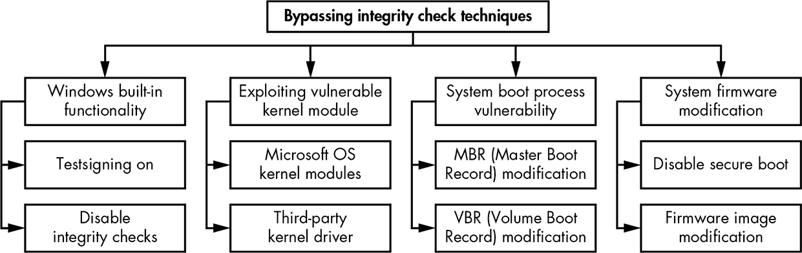
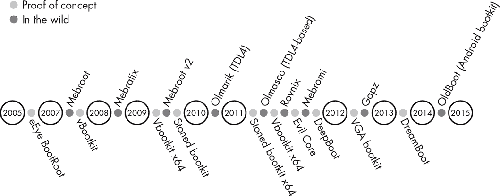

## **4

引导程序的演变**


本章将向你介绍*引导程序*，这是一种在操作系统完全加载之前，感染系统启动过程早期阶段的恶意程序。随着 PC 引导过程的变化，引导程序的使用有所减少，但它们已经令人印象深刻地卷土重来。现代引导程序使用早期引导程序的隐蔽性和持久性技巧的变种，以尽可能长时间地在目标系统中保持活动状态，而不被系统用户察觉。

本章将带你了解最早的引导程序；追踪引导程序的流行变化，包括近年来它们的壮丽回归；并讨论现代引导感染恶意软件。

### **第一个引导程序**

引导程序感染的历史可以追溯到 IBM PC 上市之前。“第一个引导程序”这个称号通常被授予 Creeper，它是一个自我复制的程序，约在 1971 年被发现。Creeper 在 VAX PDP-10 上的 TENEX 网络操作系统下运行。第一个已知的杀毒软件是名为 Reaper 的程序，用于清除 Creeper 的感染。在本节中，我们将从 Creeper 开始，回顾引导程序的早期示例。

#### ***引导扇区感染者***

*引导扇区感染者（BSI）*是最早的引导程序之一。它们首次出现在 MS-DOS 时代，这是 Windows 之前的非图形操作系统，当时 PC BIOS 的默认行为是尝试从软驱中找到任何磁盘并启动其中的代码。正如其名称所示，这些恶意程序感染了软盘的引导扇区；引导扇区位于磁盘的第一个物理扇区。

在启动时，BIOS 会查找驱动器 A 中的可启动软盘，并运行它在引导扇区中找到的代码。如果感染的软盘留在驱动器中，即使该磁盘不可启动，它也会用 BSI 感染系统。

尽管一些 BSI 感染了软盘和操作系统文件，但大多数 BSI 是*纯粹的*，意味着它们是硬件特定的，没有操作系统组件。纯粹的 BSI 仅依赖 BIOS 提供的中断来与硬件通信并感染磁盘驱动器。这意味着感染的软盘会尝试感染 IBM 兼容的 PC，无论运行的是什么操作系统。

#### ***Elk Cloner 和 Load Runner***

BSI 病毒软件最早的目标是 Apple II 微型计算机，它的操作系统通常完全包含在软盘中。首个感染 Apple II 的病毒归功于 Rich Skrenta，他的 Elk Cloner 病毒（1982-1983）^(1)采用了 BSI 使用的感染方法，尽管它比 PC 引导扇区病毒早了好几年。

Elk Cloner 本质上是将自身注入到加载的 Apple OS 中，以便进行修改。病毒随后驻留在 RAM 中，并通过拦截磁盘访问并用其代码覆盖系统引导扇区来感染其他软盘。在每次第 50 次启动时，它会显示以下消息（有时被慷慨地描述为一首诗）：

```
Elk Cloner:

The program with a personality

    It will get on all your disks

      It will infiltrate your chips

        Yes it's Cloner!

    It will stick to you like glue

      It will modify ram too

        Send in the Cloner!
```

下一个已知的影响 Apple II 的恶意软件是 Load Runner，首次出现在 1989 年。Load Runner 会拦截由键盘组合 CONTROL-COMMAND-RESET 触发的 Apple 重置命令，并以此为信号将自身写入当前软盘，从而使其在重置后依然存在。这是恶意软件持久性的最早方法之一，并预示着更复杂的保持隐匿的攻击方式的到来。

#### ***大脑病毒***

1986 年，首个 PC 病毒——Brain 出现。Brain 的原始版本仅影响 360KB 的软盘。作为一种相当庞大的 BSI，Brain 将其加载程序感染了软盘的第一个引导扇区。病毒将其主体和原始引导扇区存储在软盘的可用扇区中。Brain 将这些扇区（即包含原始引导代码和主体的扇区）标记为“坏”扇区，以防操作系统覆盖这些空间。

Brain 的一些方法如今也被现代引导木马所采用。首先，Brain 将其代码存储在隐藏区域，这也是现代引导木马的常见做法。其次，它将感染的扇区标记为坏扇区，以保护代码不被操作系统的常规清理覆盖。第三，它使用了隐身技术：如果病毒在感染的扇区被访问时仍然处于活动状态，它会钩住磁盘中断处理程序，确保系统显示合法的引导代码扇区。我们将在接下来的几章中更详细地探讨这些引导木马特性。

### **引导木马的演变**

本节中，我们将探讨随着操作系统的发展，BSI 的使用如何逐渐减少。然后我们将研究微软的内核模式代码签名策略如何使得以前的方法失效，迫使攻击者创造新的感染方法，以及一种名为*安全启动*的安全标准如何为现代引导木马带来新的障碍。

#### ***BSI 时代的结束***

随着操作系统变得更加复杂，纯粹的 BSI（引导程序接口）开始面临一些挑战。操作系统的新版本取代了用于与具有操作系统特定驱动程序的磁盘进行通信的 BIOS 提供的中断。因此，一旦操作系统启动，BSI 便无法再访问 BIOS 中断，从而无法感染系统中的其他磁盘。在这种系统上尝试执行 BIOS 中断可能会导致不可预测的行为。

随着更多系统实现了可以从硬盘而非磁盘启动的 BIOS，感染的软盘变得不那么有效，BSI 感染的传播速度开始下降。微软 Windows 的推出和软盘使用的急剧下降为传统 BSI 的终结敲响了丧钟。

#### ***内核模式代码签名策略***

随着微软在 Windows Vista 及以后的 64 位版本 Windows 中引入内核模式代码签名策略，引导病毒技术也必须进行重大修订，这一策略通过引入对内核模式驱动程序的新要求，使攻击者的局面发生了逆转。从 Vista 开始，每个系统都需要有效的数字签名才能执行；没有签名的恶意内核模式驱动程序根本无法加载。攻击者发现自己无法在操作系统完全加载后将代码注入内核，因此不得不寻找绕过现代计算机系统完整性检查的方法。

我们可以将所有已知的绕过微软数字签名检查的技巧分为四组，如图 4-1 所示。



*图 4-1：绕过内核模式代码签名策略的技术*

第一组完全在用户模式下运行，并依赖内建的微软 Windows 方法，合法地禁用签名策略，以便调试和测试驱动程序。操作系统提供了一个接口，用于通过使用自定义证书验证驱动程序的数字签名，暂时禁用驱动程序映像认证或启用测试签名。

第二组试图利用系统内核或合法的第三方驱动程序中的漏洞，这些驱动程序具有有效的数字签名，从而使恶意软件能够渗透到内核模式中。

第三组的目标是操作系统引导加载程序，目的是修改操作系统内核并禁用内核模式代码签名策略。较新的引导病毒采用了这种方法。它们在任何操作系统组件加载之前执行，因此可以篡改操作系统内核以禁用安全检查。我们将在下一章详细讨论这一方法。

第四组的目标是攻破系统固件。与第三组类似，它的目标是在操作系统内核启动之前在目标系统上执行，以禁用安全检查。唯一的主要区别是这些攻击针对的是固件而非引导加载程序组件。

在实际应用中，第三种方法——破坏引导过程——是最常见的，因为它能够实现更持久的攻击。因此，攻击者又回到了他们的旧 BSI 技巧，创造了现代的引导病毒。绕过现代计算机系统中的完整性检查的需求，极大地影响了引导病毒的发展。

#### ***安全引导的兴起***

如今，计算机越来越多地配备功能完善的安全引导保护。安全引导是一种安全标准，旨在确保引导过程中涉及的组件的完整性。我们将在第十七章中详细了解它。面对安全引导，恶意软件的态势不得不再次改变；它们不再针对引导过程，而是更多地尝试攻击系统固件。

就像微软的内核模式代码签名策略消除了内核模式根套件并开启了引导病毒的新时代一样，安全启动（Secure Boot）目前正在对现代引导病毒构成障碍。我们看到现代恶意软件更频繁地攻击 BIOS。我们将在第十五章讨论这一类型的威胁。

### **现代引导病毒**

对于引导病毒，像计算机安全领域的其他领域一样，*概念验证（PoC）*和实际恶意软件样本通常是共同演化的。在这种情况下，PoC 是安全研究人员为证明威胁确实存在而开发的恶意软件（与网络犯罪分子开发的恶意软件不同，后者的目标是非法的）。

第一个现代引导病毒通常被认为是 eEye 的 PoC BootRoot，它在 2005 年 Las Vegas 的 Black Hat 大会上展示。BootRoot 的代码是由 Derek Soeder 和 Ryan Permeh 编写的，属于*网络驱动接口规范（NDIS）*后门。它首次展示了原始引导病毒概念可以作为攻击现代操作系统的模型。

尽管 eEye 的演讲是引导病毒恶意软件发展的一个重要步骤，但过了两年，才在野外检测到一个具有引导病毒功能的新恶意样本。这一荣誉属于 Mebroot，它出现在 2007 年。Mebroot 当时是最复杂的威胁之一，它使用了新的隐蔽技术，在重启后仍能生存下来，对杀毒公司构成了严重挑战。

Mebroot 的检测恰逢两种重要 PoC 引导病毒——Vbootkit 和 Stoned——在同一年 Black Hat 大会上发布。Vbootkit 的代码展示了通过修改引导扇区来攻击微软的 Windows Vista 内核是可能的。（Vbootkit 的作者将其代码作为开源项目发布。）Stoned 引导病毒也是攻击 Vista 内核的，它的名字来源于数十年前非常成功的 Stoned BSI。

两个 PoC 的发布对于向安全行业展示需要注意的引导病毒（bootkit）类型起到了重要作用。如果研究人员犹豫不决，没有发布他们的结果，恶意软件作者将有可能成功地预先阻止系统检测到新的引导病毒恶意软件。另一方面，正如常常发生的那样，恶意软件作者会重复利用安全研究人员展示的 PoC 中的方法，并且在 PoC 展示后不久就会出现新的实际恶意软件。图 4-2 和 表 4-1 展示了这种共同进化的过程。



*图 4-2：引导病毒复兴时间线*

**表 4-1：PoC 引导病毒与实际引导病毒威胁的演化**

| **PoC 引导病毒演化** | **引导病毒威胁演化** |
| --- | --- |
| **eEye BootRoot (2005)** 第一个^(1) 基于 MBR 的引导病毒，针对 Microsoft Windows 操作系统 | **Mebroot (2007)** 第一个广为人知的现代基于 MBR 的引导病毒（我们将在第七章详细讨论基于 MBR 的引导病毒） |
| **Vbootkit (2007)** 第一个滥用 Microsoft Windows Vista 的引导病毒 | **Mebratix (2008)** 另一种基于 MBR 感染的恶意软件家族 |
| **Vbootkit 2 x64 (2009)** 第一个绕过 Microsoft Windows 7 数字签名检查的引导病毒 | **Mebroot v2 (2009)** Mebroot 恶意软件的进化版本 |
| **Stoned (2009)** 另一个基于 MBR 的引导病毒感染示例 | **Olmarik (TDL4) (2010/11)** 第一个 64 位引导病毒 |
| **Stoned x64 (2011)** 支持 64 位操作系统感染的基于 MBR 的引导病毒 | **Olmasco (TDL4 修改版) (2011)** 第一个基于 VBR 的引导病毒感染 |
| **Evil Core** ^(3) **(2011)** 使用 SMP（对称多处理）引导到受保护模式的概念引导病毒 | **Rovnix (2011)** 一种进化版基于 VBR 的感染，具有变形代码 |
| **DeepBoot** ^(4) **(2011)** 使用有趣技巧从实模式切换到受保护模式的引导病毒 | **Mebromi (2011)** 第一次在野外出现的 BIOS 引导病毒概念探索 |
| **VGA** ^(5) **(2012)** 基于 VGA 的引导病毒概念 | **Gapz** ^(6) **(2012)** VBR 感染的下一个进化 |
| **DreamBoot** ^(7) **(2013)** 第一个公开的 UEFI 引导病毒概念 | **OldBoot** ^(8) **(2014)** 第一个针对 Android 操作系统的引导病毒 |

1. 当我们提到某个引导病毒是“第一个”时，请注意，我们指的是“在我们所知的范围内第一个”。

2. Nitin Kumar 和 Vitin Kumar, “VBootkit 2.0—通过引导扇区攻击 Windows 7,” HiTB 2009, *[`conference.hitb.org/hitbsecconf2009dubai/materials/D2T2%20-%20Vipin%20and%20Nitin%20Kumar%20-%20vbootkit%202.0.pdf`](http://conference.hitb.org/hitbsecconf2009dubai/materials/D2T2%20-%20Vipin%20and%20Nitin%20Kumar%20-%20vbootkit%202.0.pdf)*。

3. Wolfgang Ettlinger 和 Stefan Viehböck, “Evil Core 引导病毒,” NinjaCon 2011, *http://downloads.ninjacon.net/downloads/proceedings/2011/Ettlinger_Viehboeck-Evil_Core_Bootkit.pdf*。

4. Nicolás A. Economou 和 Andrés Lopez Luksenberg, “DeepBoot,” Ekoparty 2011, *[`www.ekoparty.org//archive/2011/ekoparty2011_Economou-Luksenberg_Deep_Boot.pdf`](http://www.ekoparty.org//archive/2011/ekoparty2011_Economou-Luksenberg_Deep_Boot.pdf)*。

5. Diego Juarez 和 Nicolás A. Economou，“VGA 持久根病毒”，Ekoparty 2012, *https://www.secureauth.com/labs/publications/vga-persistent-rootkit/*。

6. Eugene Rodionov 和 Aleksandr Matrosov，"Mind the Gapz: The Most Complex Bootkit Ever Analyzed?" 2013 年春， *[`www.welivesecurity.com/wp-content/uploads/2013/05/gapz-bootkit-whitepaper.pdf`](http://www.welivesecurity.com/wp-content/uploads/2013/05/gapz-bootkit-whitepaper.pdf)*。

7. Sébastien Kaczmarek，"UEFI 和 Dreamboot"，HiTB 2013， *[`conference.hitb.org/hitbsecconf2013ams/materials/D2T1%20-%20Sebastien%20Kaczmarek%20-%20Dreamboot%20UEFI%20Bootkit.pdf`](https://conference.hitb.org/hitbsecconf2013ams/materials/D2T1%20-%20Sebastien%20Kaczmarek%20-%20Dreamboot%20UEFI%20Bootkit.pdf)*。

8. Zihang Xiao, Qing Dong, Hao Zhang 和 Xuxian Jiang，"Oldboot: The First Bootkit on Android"， *[`blogs.360.cn/360mobile/2014/01/17/oldboot-the-first-bootkit-on-android/`](http://blogs.360.cn/360mobile/2014/01/17/oldboot-the-first-bootkit-on-android/)*。

我们将在后续章节中详细讲解这些引导木马使用的技术。

### **结论**

本章讨论了引导木马的历史和演变，帮助你对引导木马技术有了一个大致的了解。在第五章，我们将深入探讨内核模式代码签名策略，并探索通过引导木马感染绕过这一技术的方法，重点讲解 TDSS 根木马。TDSS（也称为 TDL3）和 TDL4 引导木马的演变清晰地展示了从内核模式根木马到引导木马的转变，作为恶意软件在受感染系统中长时间未被察觉地持续存在的一种方式。
