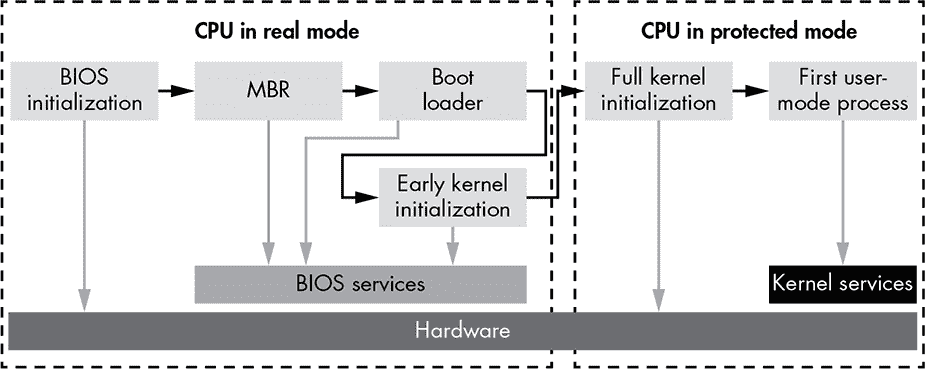
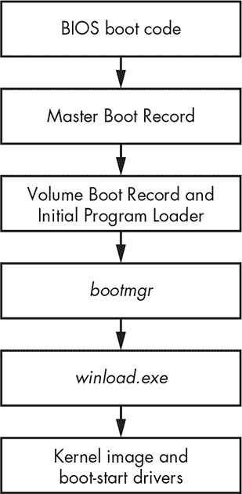
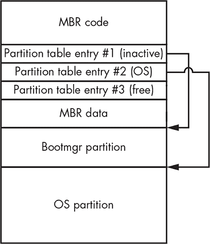
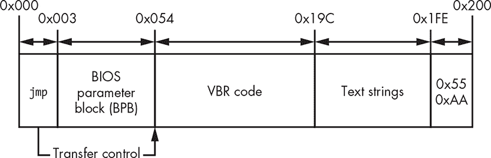
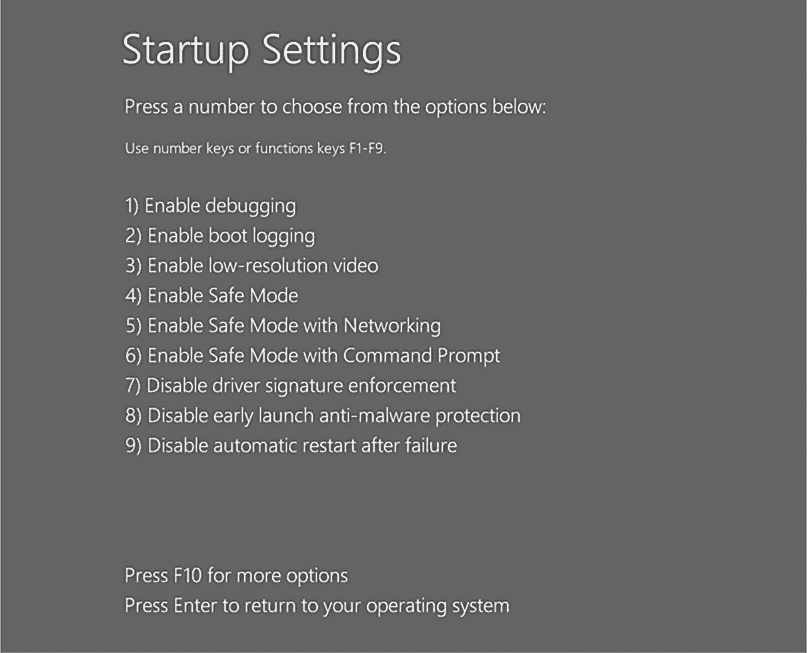

## **5

**操作系统引导过程要点**


本章将介绍 Microsoft Windows 引导过程中的一些与引导木马（bootkit）相关的最重要的方面。由于引导木马的目标是在目标系统的低级别隐藏，它需要篡改操作系统的引导组件。因此，在我们深入了解引导木马的构建和行为之前，你需要了解引导过程是如何工作的。

**注意**

*本章中的信息适用于 Microsoft Windows Vista 及其后续版本；早期版本的 Windows 引导过程有所不同，具体内容请参见* “*bootmgr 模块和引导配置数据*” *在 第 64 页中的内容。*

引导过程是操作系统运行中最重要但却最难理解的阶段之一。尽管这个概念在普遍情况下大家都很熟悉，但很少有程序员——包括系统程序员——能深入理解它，而且大多数人缺乏相关工具。正因如此，引导过程成为攻击者利用反向工程和实验所得知识的温床，而程序员通常不得不依赖那些不完整或过时的文档。

从安全角度来看，引导过程负责启动系统并将其引导到一个可信的状态。防御代码用来检查系统状态的逻辑设施也在这一过程中创建，因此攻击者越早能够攻破系统，就越容易躲避防御者的检查。

本章中，我们回顾了在运行传统固件的 Windows 系统中的引导过程基础。运行 UEFI 固件的机器，其引导过程与基于传统固件的机器有显著不同，后者自 Windows 7 x64 SP1 起引入，因此我们将在 第十四章中单独讨论该过程。

在本章中，我们从攻击者的角度出发，探讨引导过程。尽管攻击者可以针对特定的芯片组或外设发起攻击——事实上，确实有些攻击者这么做——但这种类型的攻击通常不具备良好的扩展性，且很难可靠地开发。因此，攻击者最好选择那些相对通用，但又不至于通用到防御程序员能够轻松理解和分析的接口。

一如既往，进攻性研究不断推动技术的边界，随着技术的进步，更多系统内部的细节被公开并透明化。本章的结构也凸显了这一点：我们将从一般概述开始，但逐步深入到未文档化（在本文写作时）的数据结构和逻辑流程，这些内容只能通过反汇编系统获得——这正是引导木马研究人员和恶意软件创作者所走的路线。**

### Windows 引导过程的高级概述

图 5-1 显示了现代启动过程的一般流程。几乎任何启动过程的部分都可以被启动工具包攻击，但最常见的目标是基本输入/输出系统（BIOS）初始化、主引导记录（MBR）和操作系统引导加载程序。



*图 5-1：系统启动过程的流程图*

**注意**

*安全启动技术，我们将在第十七章中讨论，旨在保护现代启动过程，包括其复杂且多功能的 UEFI 部分。*

随着启动过程的推进，执行环境变得更加复杂，防御者可以获得更丰富且更熟悉的编程模型。然而，正是低级代码创建并支持这些抽象模型，因此，通过攻击这些低级代码，攻击者可以操纵这些模型，拦截启动过程的流程并干扰更高级别的系统状态。通过这种方式，更多的抽象和强大的模型可能会被削弱，这正是启动工具包的目的所在。

### 传统启动过程

要理解一项技术，回顾其早期版本是有帮助的。这里是启动过程的基本概述，它通常在启动扇区病毒的鼎盛时期（1980 年代至 2000 年代）执行，如 Brain（在第四章中讨论）：

1.  开机（冷启动）

1.  电源自检

1.  ROM BIOS 执行

1.  ROM BIOS 硬件测试

1.  视频测试

1.  内存测试

1.  开机自检（POST），进行全面硬件检查（当启动过程为*热启动*或*软启动*时，即从非完全关机状态启动，此步骤可跳过）

1.  在默认启动驱动器的第一个扇区测试 MBR，如 BIOS 设置中所指定

1.  MBR 执行

1.  操作系统文件初始化

1.  基础设备驱动程序初始化

1.  设备状态检查

1.  配置文件读取

1.  命令行 shell 加载

1.  shell 启动命令文件执行

请注意，早期的启动过程通过测试和初始化硬件开始。尽管许多硬件和固件技术自 Brain 及其直接继任者以来已有所发展，但这一点仍然适用。本文书后续描述的启动过程在术语和复杂性上有所不同，但总体原理相似。

### Windows 启动过程

图 5-2 显示了 Windows 启动过程和涉及的组件的高级视图，适用于 Windows Vista 及更高版本。图中的每个模块代表在启动过程中执行并获得控制的模块，按从上到下的顺序排列。如你所见，它与传统启动过程的迭代非常相似。然而，随着现代 Windows 操作系统组件的复杂性增加，启动过程涉及的模块也相应增多。



*图 5-2：Windows 启动过程的高级视图*

在接下来的几节中，我们将引用此图，详细讲解启动过程。如图 5-2 所示，当计算机首次开机时，BIOS 引导代码获取控制权。这是软件所见的启动过程的开始；硬件/固件层也涉及其他逻辑（例如，在芯片组初始化期间），但在启动过程中软件是不可见的。

#### *BIOS 和预引导环境*

BIOS 执行基本的系统初始化和自检（POST），以确保关键系统硬件正常工作。BIOS 还提供了一个专门的环境，其中包含与系统设备通信所需的基本服务。这个简化的 I/O 接口首先在预引导环境中可用，稍后被不同的操作系统抽象所替代，供大多数 Windows 用户使用。在启动木马分析中，最有趣的服务是 *磁盘服务*，它暴露了用于执行磁盘 I/O 操作的多个入口点。磁盘服务可以通过一个特殊的处理程序访问，这个处理程序被称为 *中断 13h 处理程序*，简称 INT 13h。启动木马通常会通过篡改 INT 13h 来攻击磁盘服务；它们这样做是为了通过修改系统启动时从硬盘读取的操作系统和引导组件来禁用或规避操作系统的保护。

接下来，BIOS 查找可引导的磁盘驱动器，该驱动器托管要加载的操作系统实例。它可能是硬盘、USB 驱动器或 CD 驱动器。一旦识别出可引导设备，BIOS 引导代码加载 MBR，如图 5-2 所示。

#### *主引导记录（MBR）*

MBR 是一种数据结构，包含硬盘分区信息和引导代码。它的主要任务是确定可引导硬盘的活动分区，该分区包含要加载的操作系统实例。一旦识别出活动分区，MBR 将读取并执行其引导代码。列表 5-1 展示了 MBR 的结构。

```
typedef struct _MASTER_BOOT_RECORD{

➊ BYTE bootCode[0x1BE];  // space to hold actual boot code

➋ MBR_PARTITION_TABLE_ENTRY partitionTable[4];

  USHORT mbrSignature;  // set to 0xAA55 to indicate PC MBR format

} MASTER_BOOT_RECORD, *PMASTER_BOOT_RECORD;
```

*列表 5-1：MBR 的结构*

如你所见，MBR 引导代码 ➊ 仅限于 446 字节（在十六进制中为 0x1BE，这是反向工程引导代码人员熟悉的值），因此它只能实现基本功能。接下来，MBR 解析分区表，图示在 ➋，以定位活动分区；读取该分区的第一个扇区中的卷引导记录（VBR）；并将控制权转交给它。

##### 分区表

MBR 中的分区表是一个包含四个元素的数组，每个元素都由 `MBR_PARTITION_TABLE_ENTRY` 结构描述，如列表 5-2 所示。

```
typedef struct _MBR_PARTITION_TABLE_ENTRY {

➊ BYTE status;            // active?  0=no, 128=yes

   BYTE chsFirst[3];       // starting sector number

➋ BYTE type;              // OS type indicator code

   BYTE chsLast[3];        // ending sector number

➌ DWORD lbaStart;         // first sector relative to start of disk

   DWORD size;             // number of sectors in partition

} MBR_PARTITION_TABLE_ENTRY, *PMBR_PARTITION_TABLE_ENTRY;
```

*列表 5-2：分区表条目的结构*

`MBR_PARTITION_TABLE_ENTRY` 的第一个字节 ➊，即 `status` 字段，表示分区是否为活动分区。任何时候只能有一个分区被标记为活动分区，其状态由值 128（十六进制为 0x80）表示。

`type` 字段 ➋ 列出了分区类型。最常见的类型有：

+   扩展 MBR 分区类型

+   FAT12 文件系统

+   FAT16 文件系统

+   FAT32 文件系统

+   IFS（用于安装过程的可安装文件系统）

+   LDM（Microsoft Windows NT 的逻辑磁盘管理器）

+   NTFS（主要的 Windows 文件系统）

类型为 `0` 表示 *未使用*。字段 `lbaStart` 和 `size` ➌ 定义了分区在磁盘上的位置，单位为扇区。`lbaStart` 字段包含分区相对于硬盘起始位置的偏移量，`size` 字段包含分区的大小。

##### Microsoft Windows 驱动器布局

图 5-3 显示了一个典型的 Microsoft Windows 系统的可启动硬盘布局，包含两个分区。

Bootmgr 分区包含 *bootmgr* 模块和一些其他的操作系统启动组件，而操作系统分区则包含一个主机操作系统和用户数据的卷。*bootmgr* 模块的主要作用是决定加载哪个特定的操作系统实例。如果计算机上安装了多个操作系统，*bootmgr* 会显示一个对话框提示用户选择其中一个。*bootmgr* 模块还提供了一些参数，用以决定操作系统如何加载（例如是否以安全模式启动、使用最后一次良好配置、禁用驱动程序签名强制等）。



*图 5-3：典型的可启动硬盘布局*

#### *卷引导记录和初始程序加载器*

硬盘可能包含多个分区，主机上有多个不同操作系统实例，但通常只有一个分区应该标记为活动分区。MBR 不包含解析活动分区上特定文件系统的代码，因此它读取并执行分区的第一个扇区，即 VBR，见 图 5-2。

VBR 包含分区布局信息，指定正在使用的文件系统类型及其参数，并包含从活动分区读取初始程序加载器（IPL）模块的代码。IPL 模块实现文件系统解析功能，以便能够从分区的文件系统中读取文件。

清单 5-3 显示了 VBR 的布局，由 `BIOS_PARAMETER_BLOCK_NTFS` 和 `BOOTSTRAP_CODE` 结构组成。`BIOS_PARAMETER_BLOCK`（BPB）结构的布局特定于卷的文件系统。`BIOS_PARAMETER_BLOCK_NTFS` 和 `VOLUME_BOOT_RECORD` 结构对应于 NTFS 卷。

```
typedef struct _BIOS_PARAMETER_BLOCK_NTFS {

   WORD SectorSize;

   BYTE SectorsPerCluster;

   WORD ReservedSectors;

   BYTE Reserved[5];

   BYTE MediaId;

   BYTE Reserved2[2];

   WORD SectorsPerTrack;

   WORD NumberOfHeads;

➊ DWORD HiddenSectors;

   BYTE Reserved3[8];

   QWORD NumberOfSectors;

   QWORD MFTStartingCluster;

   QWORD MFTMirrorStartingCluster;

   BYTE ClusterPerFileRecord;

   BYTE Reserved4[3];

   BYTE ClusterPerIndexBuffer;

   BYTE Reserved5[3];

   QWORD NTFSSerial;

   BYTE Reserved6[4];

} BIOS_PARAMETER_BLOCK_NTFS, *PBIOS_PARAMETER_BLOCK_NTFS;

typedef struct _BOOTSTRAP_CODE{

    BYTE    bootCode[420];                // boot sector machine code

    WORD    bootSectorSignature;          // 0x55AA

} BOOTSTRAP_CODE, *PBOOTSTRAP_CODE;

typedef struct _VOLUME_BOOT_RECORD{

  ➋ WORD    jmp;

    BYTE    nop;

    DWORD   OEM_Name

    DWORD   OEM_ID; // NTFS

    BIOS_PARAMETER_BLOCK_NTFS BPB;

    BOOTSTRAP_CODE BootStrap;

} VOLUME_BOOT_RECORD, *PVOLUME_BOOT_RECORD;
```

*清单 5-3：VBR 布局*

请注意，VBR 以一个`jmp`指令 ➋ 开始，该指令将系统控制转交给 VBR 代码。VBR 代码又读取并执行来自分区的 IPL，分区的位置由`HiddenSectors`字段 ➊ 指定。IPL 报告其从硬盘开始的偏移量（以扇区为单位）。VBR 的布局总结在图 5-4 中。



*图 5-4：VBR 的结构*

如你所见，VBR 基本上由以下组件组成：

+   负责加载 IPL 的 VBR 代码

+   BIOS 参数块（一个存储卷参数的数据结构）

+   如果发生错误，显示给用户的文本字符串

+   0xAA55，VBR 的 2 字节签名

IPL 通常占用 15 个连续的 512 字节的扇区，并位于 VBR 之后。它实现了足够的代码来解析分区的文件系统并继续加载*bootmgr*模块。IPL 和 VBR 一起使用，因为 VBR 只能占用一个扇区，并且由于空间有限，无法实现足够的功能来解析卷的文件系统。

#### *bootmgr 模块与引导配置数据*

IPL 从文件系统中读取并加载操作系统引导管理器的*bootmgr*模块，如图 5-2 的第四层所示。一旦 IPL 运行，*bootmgr*便接管了引导过程。

*bootmgr*模块从引导配置数据（BCD）中读取，这些数据包含多个重要的系统参数，包括那些影响安全策略的参数，如内核模式代码签名策略，详细内容请见第六章。引导木马通常试图绕过*bootmgr*的代码完整性验证实现。

**bootmgr 模块的起源**

*bootmgr*模块是在 Windows Vista 中引入的，旨在替代以前 NT 衍生版本中找到的`ntldr`引导加载程序。微软的想法是，在引导链中创建一个额外的抽象层，以便将预引导环境与操作系统内核层隔离开来。将引导模块与操作系统内核隔离，改善了 Windows 的引导管理和安全性，使得在内核模式模块上强制执行安全策略（如内核模式代码签名策略）变得更加容易。遗留的`ntldr`被分为两个模块：*bootmgr*和*winload.exe*（如果操作系统从休眠加载，则是*winresume.exe*）。每个模块实现了不同的功能。

*bootmgr*模块管理引导过程，直到用户选择引导选项（如图 5-5 所示的 Windows 10）。一旦用户做出选择，程序*winload.exe*（或*winresume.exe*）会加载内核、引导启动驱动程序以及一些系统注册表数据。



*图 5-5：Windows 10 中的*bootmgr*引导菜单*

##### 实模式与保护模式

当计算机第一次开机时，CPU 以*实模式*运行，这是一种使用 16 位内存模型的传统执行模式，其中 RAM 中的每个字节由一个包含两个字（2 字节）的指针表示：*段起始*:*段偏移*。该模式对应于*段内存模型*，其中地址空间被划分为多个段。每个目标字节的地址通过段的地址和该字节在段内的偏移量来描述。在这里，*段起始*指定目标段，*段偏移*是目标段内参考字节的偏移量。

实模式寻址方案只允许使用系统 RAM 中的一小部分。具体来说，内存中的实际（物理）地址计算为最大的地址，表示为 ffff:ffff，这仅为 1,114,095 字节（65,535 × 16 + 65,535），意味着实模式下的地址空间仅限于大约 1MB——显然不足以支持现代操作系统和应用程序。为了绕过这一限制并访问所有可用内存，*bootmgr*和*winload.exe*在*bootmgr*接管控制后将处理器切换到*保护模式*（在 64 位系统上称为*长模式*）。

*bootmgr*模块由 16 位实模式代码和一个压缩的 PE 镜像组成，解压后在保护模式下执行。16 位代码从*bootmgr*镜像中提取并解压 PE，切换处理器到保护模式，然后将控制权交给解压后的模块。

**注意**

*引导工具包必须正确处理处理器执行模式的切换，以便维持对启动代码执行的控制。切换后，整个内存布局会发生变化，之前位于连续内存地址集合中的部分代码可能会被移动到不同的内存段。引导工具包必须实现相当复杂的功能来绕过这一点，并保持对启动过程的控制。*

##### BCD 启动变量

一旦*bootmgr*初始化了保护模式，未压缩的镜像便接管控制并从 BCD 中加载启动配置数据。当 BCD 存储在硬盘上时，它的布局与注册表蜂巢相同。（要浏览其内容，可以使用`regedit`并导航到键 *HKEY_LOCAL_MACHINE\BCD000000*。）

**注意**

*为了从硬盘读取数据，*bootmgr*在保护模式下使用 INT 13h 磁盘服务，而该服务原本是为实模式设计的。为了做到这一点，*bootmgr*将处理器的执行上下文保存到临时变量中，暂时切换到实模式，执行 INT 13h 处理程序，然后返回保护模式，恢复保存的上下文。*

BCD 存储包含*bootmgr*加载操作系统所需的所有信息，包括指向包含要加载操作系统实例的分区的路径、可用的启动应用程序、代码完整性选项以及指示操作系统加载预安装模式、安全模式等的参数。

表 5-1 显示了在 BCD 中最受 bootkit 作者关注的参数。

**表 5-1:** BCD 启动变量

| **变量名称** | **描述** | **参数类型** | **参数 ID** |
| --- | --- | --- | --- |
| `BcdLibraryBoolean_DisableIntegrityCheck` | 禁用内核模式代码完整性检查 | `Boolean` | `0x16000048` |
| `BcdOSLoaderBoolean_WinPEMode` | 告诉内核以预安装模式加载，并作为副作用禁用内核模式代码完整性检查 | `Boolean` | `0x26000022` |
| `BcdLibraryBoolean_AllowPrereleaseSignatures` | 启用测试签名（TESTSIGNING） | `Boolean` | `0x1600004` |

变量`BcdLibraryBoolean_DisableIntegrityCheck`用于禁用完整性检查并允许加载未签名的内核模式驱动程序。此选项在 Windows 7 及更高版本中被忽略，如果启用了安全启动（参见第十七章），则无法设置此选项。

变量`BcdOSLoaderBoolean_WinPEMode`表示系统应以 Windows 预安装环境模式启动，这本质上是一个最小化的 Win32 操作系统，提供有限的服务，主要用于为 Windows 安装准备计算机。此模式还会禁用内核完整性检查，包括在 64 位系统上强制执行的内核模式代码签名策略。

变量`BcdLibraryBoolean_AllowPrereleaseSignatures`使用测试代码签名证书加载内核模式驱动程序用于测试目的。这些证书可以通过包含在 Windows 驱动程序工具包中的工具生成。（*Necurs*根套件利用此过程将恶意的内核模式驱动程序安装到系统中，该驱动程序由自定义证书签名。）

在检索到启动选项后，*bootmgr*执行自完整性验证。如果验证失败，*bootmgr*会停止启动系统并显示错误信息。然而，如果`BcdLibraryBoolean_DisableIntegrityCheck`或`BcdOSLoaderBoolean_WinPEMode`在 BCD 中被设置为`TRUE`，*bootmgr*则不会执行自完整性检查。因此，如果任一变量为`TRUE`，*bootmgr*将不会注意到其是否已被恶意代码篡改。

一旦所有必要的 BCD 参数已加载且自完整性验证通过，*bootmgr*会选择要加载的启动应用程序。当从硬盘重新加载操作系统时，*bootmgr*选择*winload.exe*；当从休眠状态恢复时，*bootmgr*选择*winresume.exe*。这些各自的 PE 模块负责加载和初始化操作系统内核模块。*bootmgr*以相同的方式检查启动应用程序的完整性，如果`BcdLibraryBoolean_DisableIntegrityCheck`或`BcdOSLoaderBoolean_WinPEMode`为`TRUE`，则再次跳过验证。

在引导过程的最后一步，一旦用户选择了要加载的操作系统实例，*bootmgr* 会加载 *winload.exe*。一旦所有模块都正确初始化，*winload.exe*（图 5-2 中的第 5 层）将控制权传递给操作系统内核，后者继续引导过程（第 6 层）。与*bootmgr*一样，*winload.exe* 会检查它所负责的所有模块的完整性。许多引导程序会试图绕过这些检查，以便将恶意模块注入操作系统内核模式地址空间。

当 *winload.exe* 接管操作系统引导时，它会启用受保护模式中的分页，然后加载操作系统内核镜像及其依赖项，包括以下模块：

***bootvid.dll*** 引导时的视频 VGA 支持库

***ci.dll*** 代码完整性库

***clfs.dll*** 通用日志文件系统驱动程序

***hal.dll*** 硬件抽象层库

***kdcom.dll*** 内核调试器协议通信库

***pshed.dll*** 特定平台硬件错误驱动程序

除了这些模块，*winload.exe* 还加载引导启动驱动程序，包括存储设备驱动程序、早期启动反恶意软件（ELAM）模块（在第六章中解释）和系统注册表配置单元。

**注意**

*为了从硬盘读取所有组件，* winload.exe *使用由* bootmgr 提供的接口。* 该接口依赖于 BIOS INT 13h 磁盘服务。因此，如果 INT 13h 处理程序被引导程序钩住，恶意软件可以伪造所有* winload.exe*读取的数据。

在加载可执行文件时，*winload.exe* 会根据系统的代码完整性策略验证其完整性。一旦所有模块加载完成，*winload.exe* 会将控制权交给操作系统内核镜像以初始化它们，如接下来的章节中所讨论的那样。

### 结论

在这一章中，你了解了早期引导阶段中的 MBR 和 VBR，以及从引导程序威胁角度来看，*bootmgr* 和 *winload.exe* 等重要引导组件。

正如你所看到的，控制权在引导过程各个阶段之间的转移，并不像直接跳到下一个阶段那么简单。相反，通过各种数据结构（如 MBR 分区表、VBR BIOS 参数块和 BCD）关联的多个组件决定了预引导环境中的执行流程。这个复杂的关系是引导程序如此复杂的原因之一，也是它们通过修改引导组件，旨在将控制权从原始引导代码转移到自己的代码（并且有时来回切换，以执行必要任务）的原因。

在下一章中，我们将研究引导过程的安全性，重点讨论 ELAM 和微软内核模式代码签名策略，这些策略成功地击败了早期 rootkit 的方法。
