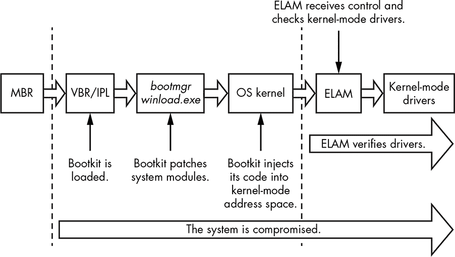
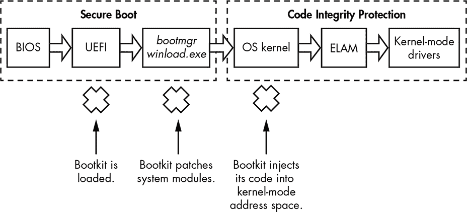
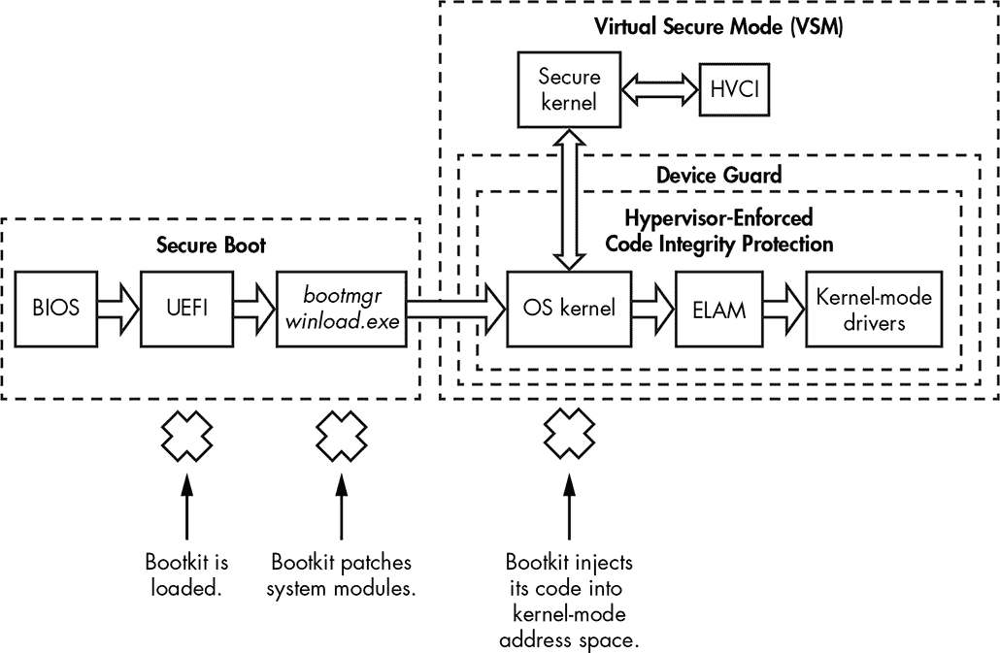

## 第六章：引导过程安全**


本章将介绍 Microsoft Windows 内核中实现的两个重要安全机制：Windows 8 中引入的早期启动反恶意软件（ELAM）模块，以及 Windows Vista 中引入的内核模式代码签名策略。这两种机制旨在防止未经授权的代码在内核地址空间中执行，从而使得 rootkit 更难以危害系统。我们将探讨这些机制的实现方式，讨论它们的优点和弱点，并检视它们在防御 rootkit 和 bootkit 方面的有效性。

### 早期启动反恶意软件模块

早期启动反恶意软件（ELAM）模块是一个用于 Windows 系统的检测机制，允许第三方安全软件（如防病毒软件）注册一个内核模式驱动程序，该驱动程序在引导过程中非常早期执行，且在任何其他第三方驱动程序加载之前执行。因此，当攻击者试图将恶意组件加载到 Windows 内核地址空间时，安全软件可以检查并防止该恶意驱动程序加载，因为 ELAM 驱动程序已经处于活动状态。

#### *API 回调例程*

ELAM 驱动程序注册*回调*例程，内核使用这些回调例程评估系统注册表集群和引导启动驱动程序中的数据。这些回调可以检测恶意数据和模块，并防止它们被 Windows 加载和初始化。

Windows 内核通过实现以下 API 例程来注册和注销这些回调：

CmRegisterCallbackEx **和** CmUnRegisterCallback 用于注册和注销回调以监控注册表数据

IoRegisterBootDriverCallback **和** IoUnRegisterBootDriverCallback 用于注册和注销引导启动驱动程序的回调

这些回调例程使用原型`EX_CALLBACK_FUNCTION`，如清单 6-1 所示。

```
NTSTATUS EX_CALLBACK_FUNCTION(

➊ IN PVOID CallbackContext,

➋ IN PVOID Argument1,         // callback type

➌ IN PVOID Argument2          // system-provided context structure

);
```

*清单 6-1：ELAM 回调的原型*

参数`CallbackContext` ➊ 在驱动程序执行上述回调例程之一以注册回调后，接收来自 ELAM 驱动程序的上下文。*上下文*是指向内存缓冲区的指针，该缓冲区包含特定于 ELAM 驱动程序的参数，这些参数可以被任何回调例程访问。此上下文是一个指针，且也用于存储 ELAM 驱动程序的当前状态。➋处的参数提供了回调类型，对于引导启动驱动程序，回调类型可以是以下之一：

BdCbStatusUpdate 向 ELAM 驱动程序提供有关驱动程序依赖关系或引导启动驱动程序加载的状态更新

BdCbInitializeImage ELAM 驱动程序用于分类引导启动驱动程序及其依赖关系

##### 引导启动驱动程序分类

➌处的参数提供了操作系统用来将启动驱动程序分类为*已知良好*（已知合法且干净的驱动程序）、*未知*（ELAM 无法分类的驱动程序）和*已知不良*（已知恶意的驱动程序）的信息。

不幸的是，ELAM 驱动程序必须基于有限的关于驱动程序映像的数据来做出分类决策，即：

+   映像的名称

+   映像注册为启动驱动程序的注册表位置

+   映像证书的发布者和签发者

+   映像的哈希值和哈希算法的名称

+   证书指纹和指纹算法的名称

ELAM 驱动程序无法接收映像的基地址，也无法访问硬盘上的二进制映像，因为存储设备驱动程序堆栈尚未初始化（因为系统尚未完成启动）。它必须仅根据映像的哈希值及其证书来决定加载哪些驱动程序，而无法观察到映像本身。因此，在此阶段，驱动程序的保护并不非常有效。

##### ELAM 策略

Windows 根据注册表中指定的 ELAM 策略决定是否加载已知不良或未知驱动程序：*HKLM\System\CurrentControlSet\Control\EarlyLaunch\DriverLoadPolicy*。

表 6-1 列出了决定可以加载哪些驱动程序的 ELAM 策略值。

**表 6-1：** ELAM 策略值

| **策略名称** | **策略值** | **描述** |
| --- | --- | --- |
| `PNP_INITIALIZE_DRIVERS_DEFAULT` | `0x00` | 仅加载已知良好的驱动程序。 |
| `PNP_INITIALIZE_UNKNOWN_DRIVERS` | `0x01` | 仅加载已知良好和未知的驱动程序。 |
| `PNP_INITIALIZE_BAD_CRITICAL_DRIVERS` | `0x03` | 加载已知良好、未知和已知不良的关键驱动程序。（这是默认设置。） |
| `PNP_INITIALIZE_BAD_DRIVERS` | `0x07` | 加载所有驱动程序。 |

如您所见，默认的 ELAM 策略`PNP_INITIALIZE_BAD_CRITICAL_DRIVERS`允许加载不良的关键驱动程序。这意味着，如果一个关键驱动程序被 ELAM 分类为已知不良，系统仍然会加载它。此策略的背后逻辑是，关键系统驱动程序是操作系统的基本组成部分，因此它们初始化失败将导致操作系统无法启动；也就是说，系统只有在所有关键驱动程序成功加载和初始化后才能启动。因此，ELAM 策略在可用性和服务性方面妥协了一些安全性。

然而，使用此策略不会加载已知的不良*非关键*驱动程序，或那些即使没有也能让操作系统成功加载的驱动程序。这是`PNP_INITIALIZE_BAD_CRITICAL_DRIVERS`和`PNP_INITIALIZE_BAD_DRIVERS`策略之间的主要区别：后者允许加载所有驱动程序，包括已知的不良非关键驱动程序。

#### *Bootkit 如何绕过 ELAM*

ELAM 为安全软件提供了对抗 rootkit 威胁的优势，但对抗 bootkit 的能力较弱——它本来就不是为了应对 bootkit 设计的。ELAM 只能监控合法加载的驱动程序，但大多数引导包加载的是使用操作系统未公开功能的内核模式驱动程序。这意味着引导包可以绕过安全强制措施，将其代码注入内核地址空间，尽管有 ELAM。此外，如图 6-1 所示，引导包的恶意代码在操作系统内核初始化之前、任何内核模式驱动程序加载之前（包括 ELAM）就已经运行。这意味着引导包可以绕过 ELAM 保护。



*图 6-1：带有 ELAM 的引导过程流程*

大多数引导包在内核初始化的过程中加载它们的内核模式代码，通常是在所有操作系统子系统（如 I/O 子系统、对象管理器、即插即用管理器等）初始化完成后，但在执行 ELAM 之前。显然，ELAM 无法阻止在它之前加载的恶意代码的执行，因此它对引导包技术没有防御能力。

### 微软内核模式代码签名政策

内核模式代码签名政策通过对加载到内核地址空间的模块强制执行代码签名要求，保护了 Windows 操作系统。该政策使得引导包和 rootkit 通过执行内核模式驱动程序来危害系统变得更加困难，从而迫使 rootkit 开发者转而采用引导包技术。然而，正如本章后续部分所解释的，攻击者可以通过操控一些与启动配置选项对应的变量，禁用整个加载时签名验证逻辑。

#### *内核模式驱动程序完整性检查要求*

签名策略首次在 Windows Vista 中引入，并且在所有后续版本的 Windows 中得到了强制执行，尽管在 32 位和 64 位操作系统上其执行方式不同。它在加载内核模式驱动程序时生效，以便在将驱动程序映像映射到内核地址空间之前验证其完整性。表 6-2 展示了 64 位和 32 位系统上哪些内核模式驱动程序需要进行哪些完整性检查。

**表 6-2：** 内核模式代码签名政策要求

| **驱动程序类型** | **是否需要进行完整性检查？** |
| --- | --- |
| **64 位** | **32 位** |
| --- | --- |
| 启动驱动程序 | 是 | 是 |
| 非启动即插即用驱动程序 | 是 | 否 |
| 非启动驱动程序 | 是 | 否（除非是流媒体保护内容的驱动程序） |

如表所示，在 64 位系统上，所有内核模式模块，无论类型如何，都需要进行完整性检查。在 32 位系统上，签名策略仅适用于启动驱动程序和媒体驱动程序；其他驱动程序不进行检查（PnP 设备安装强制执行安装时签名要求）。

为了符合代码完整性要求，驱动程序必须具有嵌入式的软件发布者证书（SPC）数字签名或带有 SPC 签名的目录文件。然而，引导启动驱动程序只能拥有嵌入式签名，因为在启动时存储设备驱动程序堆栈尚未初始化，导致驱动程序的目录文件无法访问。

#### *驱动程序签名的位置*

嵌入在 PE 文件中的驱动程序签名，例如引导启动驱动程序，指定在 PE 头数据目录中的`IMAGE_DIRECTORY_DATA_SECURITY`条目中。微软提供了 API 来枚举并获取映像中包含的所有证书信息，如清单 6-2 所示。

```
BOOL ImageEnumerateCertificates(

   _In_     HANDLE FileHandle,

   _In_     WORD TypeFilter,

   _Out_    PDWORD CertificateCount,

   _In_out_ PDWORD Indices,

   _In_opt_ DWORD IndexCount

);

BOOL ImageGetCertificateData(

   _In_    HANDLE FileHandle,

   _In_    DWORD CertificateIndex,

   _Out_   LPWIN_CERTIFICATE Certificate,

   _Inout_ PDWORD RequiredLength

);
```

*清单 6-2：微软用于枚举和验证证书的 API*

内核模式代码签名策略提高了系统的安全性韧性，但它确实有其局限性。在接下来的章节中，我们将讨论这些局限性以及恶意软件作者如何利用这些局限性绕过保护。

**即插即用设备安装签名策略**

除了内核模式代码签名策略，微软 Windows 还有另一种签名策略：即插即用设备安装签名策略。重要的是不要混淆这两者。

即插即用设备安装签名策略的要求仅适用于即插即用（PnP）设备驱动程序，并且此策略用于验证发布者的身份和 PnP 设备驱动程序安装包的完整性。验证要求驱动程序包的目录文件必须由 Windows 硬件质量实验室（WHQL）证书或第三方 SPC 签名。如果驱动程序包不符合 PnP 策略的要求，系统将显示警告对话框，提示用户决定是否允许在系统上安装该驱动程序包。

系统管理员可以禁用 PnP 策略，允许没有适当签名的 PnP 驱动程序包安装到系统中。此外，请注意，该策略仅在安装驱动程序包时应用，而不是在驱动程序加载时应用。虽然这看起来像是一个 TOCTOU（检查时间到使用时间）弱点，但实际上不是；它只是意味着，成功安装到系统中的 PnP 驱动程序包不一定会被加载，因为这些驱动程序在启动时也会受到内核模式代码签名策略的检查。

#### *传统代码完整性弱点*

负责执行代码完整性的内核模式代码签名策略的逻辑由 Windows 内核映像和内核模式库*ci.dll*共享。内核映像使用此库来验证所有加载到内核地址空间中的模块的完整性。签名过程的主要弱点在于代码中的单点故障。

在 Microsoft Windows Vista 和 7 中，内核镜像中的一个单一变量是此机制的核心，决定是否执行完整性检查。它如下所示：

```
BOOL nt!g_CiEnabled
```

该变量在引导时通过内核镜像例程`NTSTATUS SepInitializeCodeIntegrity()`进行初始化。操作系统会检查是否已进入 Windows 预安装（WinPE）模式，如果是，变量`nt!g_CiEnabled`将被初始化为`FALSE`（0x00）值，这会禁用完整性检查。

所以，当然，攻击者发现他们可以通过简单地将`nt!g_CiEnabled`设置为`FALSE`来轻松绕过完整性检查，这正是 2011 年 Uroburos 恶意软件家族（也称为 Snake 和 Turla）发生的情况。Uroburos 通过引入并利用第三方驱动程序中的漏洞绕过了代码签名策略。合法的第三方签名驱动程序是*VBoxDrv.sys*（VirtualBox 驱动程序），该漏洞在内核模式中获得代码执行后清除了`nt!g_CiEnabled`变量的值，此时任何恶意的未签名驱动程序都可以加载到被攻击的机器上。

**一个 LINUX 漏洞**

这种弱点不仅仅是 Windows 特有的：攻击者也以类似的方式禁用了 SELinux 中的强制访问控制。具体来说，如果攻击者知道包含 SELinux 强制执行状态的变量的地址，攻击者只需覆盖该变量的值即可。由于 SELinux 的强制执行逻辑在执行任何检查之前会先测试该变量的值，因此此逻辑会被禁用。关于此漏洞及其利用代码的详细分析可以在*[`grsecurity.net/~spender/exploits/exploit2.txt`](https://grsecurity.net/~spender/exploits/exploit2.txt)*找到。

如果 Windows 不是处于 WinPE 模式，它接下来会检查引导选项`DISABLE_INTEGRITY_CHECKS`和`TESTSIGNING`的值。如其名称所示，`DISABLE_INTEGRITY_CHECKS`会禁用完整性检查。任何版本的 Windows 用户都可以通过引导菜单选项“禁用驱动程序签名强制执行”手动设置此选项。Windows Vista 用户还可以使用*bcdedit.exe*工具将`nointegritychecks`选项的值设置为`TRUE`；在启用安全启动时，较高版本的 Windows 会忽略启动配置数据（BCD）中的此选项（有关安全启动的更多信息，请参见第十七章）。

`TESTSIGNING`选项更改操作系统验证内核模式模块完整性的方式。当设置为`TRUE`时，不需要验证证书链到受信任的根证书颁发机构（CA）。换句话说，*任何*具有*任何*数字签名的驱动程序都可以加载到内核地址空间。Necurs 根套件通过将`TESTSIGNING`设置为`TRUE`并加载其内核模式驱动程序（该驱动程序使用自定义证书签名）来滥用此选项。

多年来，浏览器存在未能遵循 X.509 证书链中的中间链接以到达合法受信 CA 的 bug^(1)，但是操作系统的模块签名方案在涉及信任链时仍然没有避免捷径。

#### *ci.dll 模块*

负责执行代码完整性策略的内核模式库*ci.dll*包含以下例程：

CiCheckSignedFile 验证摘要并验证数字签名

CiFindPageHashesInCatalog 验证经过验证的系统目录是否包含 PE 映像第一内存页面的摘要

CiFindPageHashesInSignedFile 验证 PE 映像第一内存页面的摘要并验证其数字签名

CiFreePolicyInfo 释放由`CiVerifyHashInCatalog`、`CiCheckSignedFile`、`CiFindPageHashesInCatalog`和`CiFindPageHashesInSignedFile`函数分配的内存

CiGetPEInformation 创建一个加密的通信通道，连接调用者和*ci.dll*模块

CiInitialize 初始化*ci.dll*的功能，用于验证 PE 映像文件的完整性

CiVerifyHashInCatalog 验证包含在经过验证的系统目录中的 PE 映像的摘要

`CiInitialize`例程对我们的目的来说最为重要，因为它初始化库并创建其数据上下文。我们可以在清单 6-3 中看到与 Windows 7 对应的原型。

```
NTSTATUS CiInitialize(

➊ IN ULONG CiOptions;

   PVOID Parameters;

➋ OUT PVOID g_CiCallbacks;

);
```

*清单 6-3：`CiInitialize`例程的原型*

`CiInitialize`例程接收作为参数的代码完整性选项（`CiOptions`）➊以及指向回调数组的指针（`OUT PVOID g_CiCallbacks`）➋，它将在输出时填充该数组。内核使用这些回调来验证内核模式模块的完整性。

`CiInitialize`例程还会执行自检，以确保没有人篡改它。然后，例程继续验证启动驱动程序列表中所有驱动程序的完整性，该列表本质上包含启动时加载的驱动程序及其依赖项。

一旦*ci.dll*库的初始化完成，内核会使用`g_CiCallbacks`缓冲区中的回调来验证模块的完整性。在 Windows Vista 和 7 中（但不包括 Windows 8），`SeValidateImageHeader`例程决定某个特定映像是否通过完整性检查。清单 6-4 展示了该例程的算法。

```
NTSTATUS SeValidateImageHeader(Parameters) {

   NTSTATUS Status = STATUS_SUCCESS;

   VOID Buffer = NULL;

➊ if (g_CiEnabled == TRUE) {

         if (g_CiCallbacks[0] != NULL)

         ➋ Status = g_CiCallbacks0;

         else

            Status = 0xC0000428

   }

   else {

      ➌ Buffer = ExAllocatePoolWithTag(PagedPool, 1, 'hPeS');

         *Parameters = Buffer

         if (Buffer == NULL)

            Status = STATUS_NO_MEMORY;

   }

   return Status;

}
```

*清单 6-4：`SeValidateImageHeader`例程的伪代码*

`SeValidateImageHeader`检查`nt!g_CiEnabled`变量是否设置为`TRUE`➊。如果不是，它会尝试分配一个字节长度的缓冲区➌，并且如果成功，则返回`STATUS_SUCCESS`值。

如果`nt!g_CiEnabled`为`TRUE`，则`SeValidateImageHeader`执行`g_CiCallbacks`缓冲区中的第一个回调`g_CiCallbacks[0]`➋，该回调设置为`CiValidateImageData`例程。后续回调`CiValidateImageData`验证加载的映像的完整性。

#### *Windows 8 中的防御性变化*

在 Windows 8 中，微软进行了一些更改，旨在限制在这种场景下可能发生的攻击类型。首先，微软废弃了内核变量`nt!g_CiEnabled`，这意味着不再像早期版本的 Windows 那样在内核镜像中有一个控制完整性策略的单一控制点。Windows 8 还改变了`g_CiCallbacks`缓冲区的布局。

清单 6-5（Windows 7 和 Vista）和清单 6-6（Windows 8）展示了`g_CiCallbacks`在不同操作系统版本中的布局差异。

```
typedef struct _CI_CALLBACKS_WIN7_VISTA {

 PVOID CiValidateImageHeader;

 PVOID CiValidateImageData;

 PVOID CiQueryInformation;

} CI_CALLBACKS_WIN7_VISTA, *PCI_CALLBACKS_WIN7_VISTA;
```

*清单 6-5：Windows Vista 和 Windows 7 中`g_CiCallbacks`缓冲区的布局*

如清单 6-5 所示，Windows Vista 和 Windows 7 的布局仅包含基本的必要内容。相比之下，Windows 8 的布局（清单 6-6）则有更多的字段，用于额外的回调函数，用于 PE 映像数字签名验证。

```
typedef struct _CI_CALLBACKS_WIN8 {

    ULONG ulSize;

    PVOID CiSetFileCache;

    PVOID CiGetFileCache;

 ➊ PVOID CiQueryInformation;

 ➋ PVOID CiValidateImageHeader;

 ➌ PVOID CiValidateImageData;

    PVOID CiHashMemory;

    PVOID KappxIsPackageFile;

} CI_CALLBACKS_WIN8, *PCI_CALLBACKS_WIN8;
```

*清单 6-6：Windows 8 中`g_CiCallbacks`缓冲区的布局*.x

除了在`CI_CALLBACKS_WIN7_VISTA`和`CI_CALLBACKS_WIN8`结构中都存在的函数指针`CiQueryInformation` ➊、`CiValidateImageHeader` ➋和`CiValidateImageData` ➌之外，`CI_CALLBACKS_WIN8`结构还具有一些字段，这些字段影响 Windows 8 中代码完整性执行的方式。

**关于 CI.DLL 的进一步阅读**

更多关于*ci.dll*模块实现细节的信息可以在* [`github.com/airbus-seclab/warbirdvm`](https://github.com/airbus-seclab/warbirdvm)*找到。本文深入探讨了*ci.dll*模块中用于加密内存存储的实现细节，该存储可能被其他操作系统组件用于保持某些细节和配置信息的保密。该存储受到了高度混淆的虚拟机（VM）保护，这使得逆向工程存储加密/解密算法变得更加困难。文章的作者提供了有关 VM 混淆方法的详细分析，并分享了他们的 Windbg 插件，用于实时解密和加密存储。

### 安全启动技术

安全启动技术是在 Windows 8 中引入的，用于防止引导过程受到 bootkit 感染。安全启动利用统一可扩展固件接口（UEFI）来阻止任何没有有效数字签名的引导应用程序或驱动程序的加载和执行，以保护操作系统内核、系统文件和启动关键驱动程序的完整性。图 6-2 展示了启用安全启动的启动过程。



*图 6-2：启用安全启动的启动过程*

当启用安全启动时，BIOS 会验证启动时执行的所有 UEFI 和操作系统启动文件的完整性，以确保它们来自合法来源并具有有效的数字签名。所有与启动相关的驱动程序的签名都将在*winload.exe*和 ELAM 驱动程序中进行检查，作为安全启动验证的一部分。安全启动类似于微软的内核模式代码签名策略，但它适用于在操作系统内核加载并初始化*之前*执行的模块。因此，未经信任的组件（即没有有效签名的组件）将无法加载，并会触发修复。

当系统首次启动时，安全启动确保预启动环境和引导加载程序组件没有被篡改。引导加载程序则验证内核和启动驱动程序的完整性。一旦内核通过完整性验证，安全启动就会验证其他驱动程序和模块。从根本上说，安全启动依赖于一个*信任根*的假设——即在执行初期，系统是可信的。当然，如果攻击者设法在此之前发起攻击，他们很可能会成功。

在过去的几年里，安全研究社区已经将大量关注集中在了可以让攻击者绕过安全启动（Secure Boot）的 BIOS 漏洞上。我们将在第十六章中详细讨论这些漏洞，并在第十七章中更深入地探讨安全启动。

### Windows 10 中的虚拟化基础安全

直到 Windows 10，代码完整性机制仍是系统内核的一部分。这实际上意味着完整性机制以它试图保护的相同特权级别运行。虽然在许多情况下这可以有效，但也意味着攻击者有可能攻击完整性机制本身。为了增强代码完整性机制的有效性，Windows 10 引入了两个新功能：虚拟安全模式和设备保护（Device Guard），这两者都基于硬件辅助的内存隔离。这项技术通常被称为*二级地址转换*，并且被包括在英特尔（称为扩展页表，或 EPT）和 AMD（称为快速虚拟化索引，或 RVI）CPU 中。

#### *二级地址转换*

Windows 自 Windows 8 以来就支持二级地址转换（SLAT）与 Hyper-V（微软的虚拟机管理程序）。Hyper-V 使用 SLAT 来执行虚拟机的内存管理（例如，访问保护），并减少将来宾物理地址（虚拟化技术隔离的内存）转换为实际物理地址的开销。

SLAT 为虚拟机监控器提供了一个虚拟到物理地址转换的中介缓存，这大大减少了虚拟机监控器处理翻译请求所需的时间，特别是对于主机的物理内存。它还被用于 Windows 10 中虚拟安全模式技术的实现。

#### *虚拟安全模式与设备防护*

虚拟安全模式（VSM）基于虚拟化的安全性首次出现在 Windows 10，并基于微软的 Hyper-V。当 VSM 启用时，操作系统和关键系统模块会在隔离的虚拟机监控器保护的容器中执行。这意味着即使内核被攻破，其他虚拟环境中执行的关键组件仍然是安全的，因为攻击者无法从一个被攻破的虚拟容器跳转到另一个虚拟容器。VSM 还将代码完整性组件与 Windows 内核本身隔离在虚拟机监控器保护的容器中。

VSM 隔离使得无法使用易受攻击的合法内核模式驱动程序来禁用代码完整性（除非发现影响保护机制本身的漏洞）。由于潜在的易受攻击驱动程序和代码完整性库位于不同的虚拟容器中，攻击者不应能够关闭代码完整性保护。

设备防护技术利用虚拟安全模式（VSM）来防止不可信的代码在系统上运行。为了实现这一保障，设备防护将 VSM 保护的代码完整性与平台和 UEFI 安全启动相结合。通过这样做，设备防护从启动过程的最初阶段一直到加载操作系统内核模式驱动程序和用户模式应用程序时，都在强制执行代码完整性策略。

图 6-3 展示了设备防护如何影响 Windows 10 防止引导劫持和根套件的能力。安全启动通过验证在预启动环境中执行的任何固件组件（包括操作系统引导加载程序）来保护免受引导劫持。为了防止恶意代码被注入到内核模式地址空间，VSM 将负责强制执行代码完整性的关键操作系统组件（在此背景下称为虚拟机监控器强制代码完整性，或 HVCI）从操作系统内核地址空间中隔离开。



*图 6-3：启用虚拟安全模式和设备防护的启动过程*

#### *设备防护对驱动程序开发的限制*

设备防护对驱动程序开发过程施加了特定的要求和限制，某些现有驱动程序在启用设备防护时将无法正确运行。所有驱动程序必须遵循以下规则：

+   从不可执行（NX）不可分页池中分配所有非分页内存。驱动程序的 PE 模块不能有既可写又可执行的部分。

+   不要尝试直接修改可执行系统内存。

+   不要在内核模式下使用动态或自修改代码。

+   不要加载任何数据作为可执行文件。

由于大多数现代根套件和启动病毒不符合这些要求，即使驱动程序具有有效的签名或能够绕过代码完整性保护，它们也无法在启用设备保护的情况下运行。

### 结论

本章概述了代码完整性保护的演变。启动过程的安全性是防御操作系统免受恶意软件攻击的最重要前沿。ELAM 和代码完整性保护是强大的安全功能，可以限制平台上不受信任代码的执行。

Windows 10 将启动过程的安全性提升到了一个新的水平，通过使用 VSM 将 HVCI 组件与操作系统内核隔离，防止了代码完整性绕过。然而，如果没有启用安全启动机制，启动病毒可以在系统加载前攻击系统，从而绕过这些保护措施。在接下来的章节中，我们将更详细地讨论安全启动以及设计用于规避它的 BIOS 攻击。
