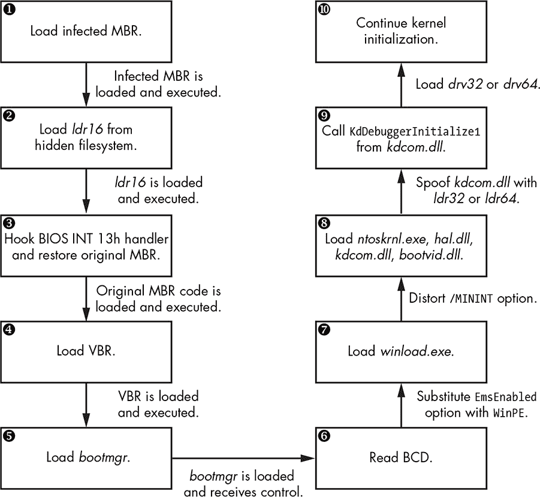
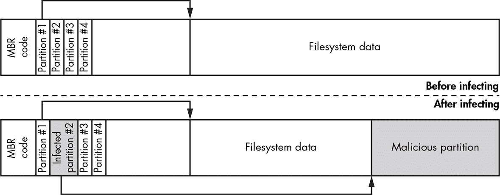
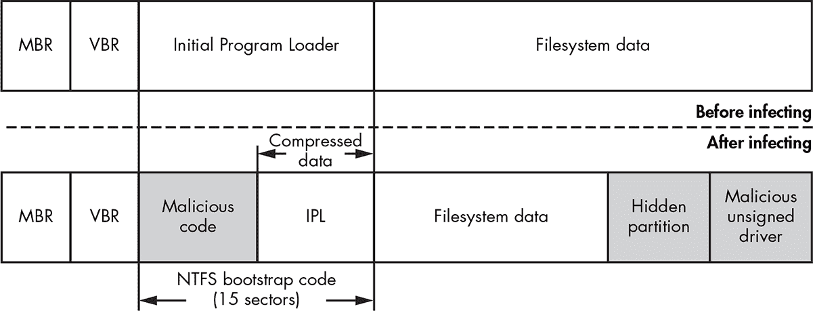
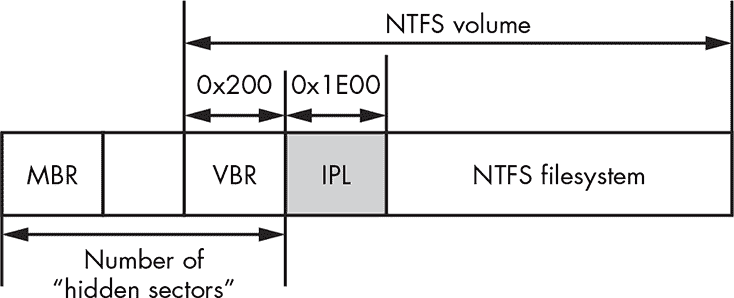
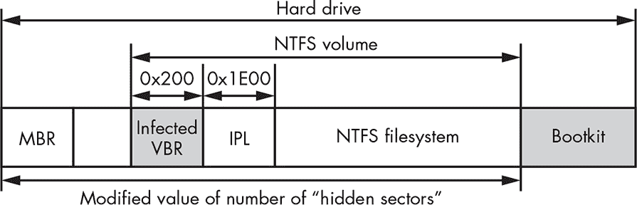

## 第七章：**引导病毒感染技术**


在探索了 Windows 启动过程后，我们接下来讨论一下针对系统启动过程中涉及的模块的引导病毒感染技术。这些技术根据其目标启动组件的不同，分为两类：MBR 感染技术和 VBR/初始程序加载器（IPL）感染技术。我们将通过分析 TDL4 引导病毒来展示 MBR 感染技术，再通过分析 Rovnix 和 Gapz 引导病毒来展示两种不同的 VBR 感染技术。

### MBR 感染技术

基于 MBR 修改的方法是引导病毒攻击 Windows 启动过程时最常见的感染技术。大多数 MBR 感染技术直接修改 MBR 代码或 MBR 数据（如分区表），或者在某些情况下，二者都修改。

MBR 代码修改仅*更改*MBR 引导代码，而保持分区表不变。这是最直接的感染方法。它通过将恶意代码覆盖系统 MBR 代码，同时以某种方式保存 MBR 的原始内容，例如将其存储在硬盘上的隐藏位置。

相反，MBR 数据修改方法涉及改变 MBR 分区表，*而不*改变 MBR 引导代码。由于分区表的内容因系统而异，这种方法更为先进，因为这使得分析人员很难找到可以明确识别感染的模式。

最后，结合这两种技术的混合方法也是可能的，并且在实际应用中已有使用。

接下来，我们将更详细地分析两种 MBR 感染技术。

#### *MBR 代码修改：TDL4 感染技术*

为了说明 MBR 代码修改感染技术，我们将深入分析第一个真正针对 Microsoft Windows 64 位平台的引导病毒：TDL4。TDL4 延续了其前代 rootkit TDL3（在第一章中讨论过）那些广为人知的先进规避和反取证技术，并且具有绕过内核模式代码签名策略（在第六章中讨论）并感染 64 位 Windows 系统的能力。

在 32 位系统中，TDL3 rootkit 能够通过修改引导启动的内核模式驱动程序，在系统重启后仍能保持持久性。然而，在 64 位系统中引入的强制签名检查防止了感染的驱动程序被加载，从而使得 TDL3 失效。

为了绕过 64 位的 Microsoft Windows，TDL3 的开发者将感染点移至启动过程的更早阶段，实施了引导病毒作为一种持久性手段。因此，TDL3 rootkit 演变为 TDL4 引导病毒。

##### 感染系统

TDL4 通过将启动硬盘的 MBR 覆盖为恶意 MBR 来感染系统（正如我们所讨论的，它会在 Windows 内核镜像*之前*执行），因此它能够篡改内核镜像并禁用完整性检查。（其他基于 MBR 的引导程序将在第十章中详细描述。）

与 TDL3 类似，TDL4 在硬盘的末尾创建了一个隐藏的存储区域，向其中写入了原始的 MBR 以及一些自己的模块，具体见表 7-1。TDL4 存储原始 MBR，以便在感染发生后能够重新加载，并且系统看似会正常启动。引导程序在启动时使用*mbr*、*ldr16*、*ldr32*和*ldr64*模块来绕过 Windows 完整性检查，并最终加载未签名的恶意驱动程序。

**表 7-1：** TDL4 感染系统时写入隐藏存储的模块

| **模块名称** | **描述** |
| --- | --- |
| *mbr* | 感染硬盘启动扇区的原始内容 |
| *ldr16* | 16 位实模式加载程序代码 |
| *ldr32* | 伪造的*x86 系统上的 kdcom.dll*库 |
| *ldr64* | 伪造的*x64 系统上的 kdcom.dll*库 |
| *drv32* | x86 系统的主要引导程序驱动程序 |
| *drv64* | x64 系统的主要引导程序驱动程序 |
| *cmd.dll* | 注入到 32 位进程中的有效负载 |
| *cmd64.dll* | 注入到 64 位进程中的有效负载 |
| *cfg.ini* | 配置信息 |
| *bckfg.tmp* | 加密的命令与控制（C&C）URL 列表 |

TDL4 通过直接向硬盘迷你端口驱动程序发送 I/O 控制代码`IOCTL_SCSI_PASS_THROUGH_DIRECT`请求来向硬盘写入数据，这个驱动程序是硬盘驱动堆栈中的最低层驱动程序。这使得 TDL4 能够绕过标准的过滤内核驱动程序及其可能包含的任何防御措施。TDL4 使用`DeviceIoControl` API 发送这些控制代码请求，传递第一个参数为打开的符号链接*\??\PhysicalDriveXX*的句柄，其中*XX*是正在感染的硬盘编号。

打开此句柄并进行写访问需要管理员权限，因此 TDL4 利用 Windows 任务计划程序服务中的 MS10-092 漏洞（首次出现在 Stuxnet 中）来提升其权限。简而言之，此漏洞允许攻击者对特定任务进行未经授权的权限提升。为了获取管理员权限，TDL4 注册一个任务，让 Windows 任务计划程序使用当前权限执行该任务。恶意软件修改了计划任务的 XML 文件，使其以本地系统帐户运行，该帐户包括管理员权限，并确保修改后的 XML 文件的校验和与之前相同。这样，任务计划程序会被欺骗，按照本地系统而不是正常用户的身份来运行任务，从而使 TDL4 成功感染系统。

通过这种方式写入数据，恶意软件能够绕过在文件系统层面实现的防御工具，因为 *I/O 请求包（IRP）*，描述 I/O 操作的数据结构，直接传递到磁盘类驱动程序处理程序。

一旦所有组件安装完成，TDL4 通过执行 `NtRaiseHardError` 本地 API（如 列表 7-1 中所示）强制系统重启。

```
NTSYSAPI

NTSTATUS

NTAPI

NtRaiseHardError(

      IN NTSTATUS ErrorStatus,

      IN ULONG NumberOfParameters,

      IN PUNICODE_STRING UnicodeStringParameterMask OPTIONAL,

      IN PVOID *Parameters,

    ➊ IN HARDERROR_RESPONSE_OPTION ResponseOption,

      OUT PHARDERROR_RESPONSE Response

);
```

*列表 7-1：`NtRaiseHardError` 例程的原型*

代码将 `OptionShutdownSystem` ➊ 作为其第五个参数传递，这会将系统置于 *蓝屏死机（BSoD）* 状态。BSoD 会自动重启系统，并确保在下次启动时加载根工具包模块，而不会提醒用户感染（系统看起来像是简单崩溃了）。

##### 绕过 TDL4 感染系统启动过程中的安全性

图 7-1 显示了感染了 TDL4 的机器的启动过程。该图表展示了恶意软件绕过代码完整性检查并将其组件加载到系统中的高层次步骤。



*图 7-1：TDL4 启动工具包启动过程工作流*

在蓝屏死机（BSoD）和随后的系统重启之后，BIOS 将感染的 MBR 读入内存并执行，加载启动工具包的第一部分（图 7-1 中的➊）。接下来，感染的 MBR 在可启动硬盘的末尾定位启动工具包的文件系统，并加载并执行一个名为 *ldr16* 的模块。*ldr16* 模块包含负责挂钩 BIOS 13h 中断处理程序（磁盘服务）、重新加载原始 MBR（图 7-1 中的➋和➌），并将执行权转交给它的代码。这样，启动过程可以继续正常进行，但现在带有挂钩的 13h 中断处理程序。原始的 MBR 存储在隐藏文件系统中的 *mbr* 模块中（见 表 7-1）。

BIOS 中断 13h 服务提供了在预启动环境中执行磁盘 I/O 操作的接口。这非常关键，因为在启动过程的最初阶段，操作系统中的存储设备驱动尚未加载，而标准的启动组件（即 *bootmgr*、*winload.exe* 和 *winresume.exe*）依赖于 13h 服务从硬盘读取系统组件。

一旦控制权转交给原始的 MBR，启动过程照常进行，加载 VBR 和 *bootmgr*（图 7-1 中的➍和➎），但现在驻留在内存中的启动工具包控制着所有从硬盘到系统的 I/O 操作。

*ldr16*中最有趣的部分在于它实现了 13h 磁盘服务中断处理程序的钩子。启动过程中读取硬盘数据的代码依赖于 BIOS 的 13h 中断处理程序，而现在这一处理程序被 bootkit 所拦截，这意味着 bootkit 可以*伪造*从硬盘读取的任何数据。bootkit 利用这一能力，通过用*ldr32*或*ldr64* ➑（取决于操作系统）替换*kdcom.dll*库，这些库来自隐藏的文件系统，在读取操作时将其内容替换到内存缓冲区中。正如我们很快会看到的，替换*kdcom.dll*为恶意的*动态链接库（DLL）*使得 bootkit 能够加载自己的驱动程序，同时禁用内核模式调试功能。

**竞争底层**

在劫持 BIOS 的磁盘中断处理程序时，TDL4 采用了类似 rootkit 的策略，rootkit 通常会沿着服务接口栈向下迁移。一般来说，越深层的入侵者越能成功。因此，一些防御软件有时会与其他防御软件争夺控制栈底层的权限！这种使用与 rootkit 技术难以区分的技术来挂钩 Windows 系统底层的竞争，导致了系统稳定性的问题。对此问题的详细分析已经在*Uninformed*期刊的两篇文章中发表。^(1)

1. skape, “他们在想什么？由不安全假设引起的烦恼，”*Uninformed* 1（2005 年 5 月），*[`www.uninformed.org/?v=1&a=5&t=pdf`](http://www.uninformed.org/?v=1&a=5&t=pdf)*; Skywing, “他们在想什么？反病毒软件的失败，”*Uninformed* 4（2006 年 6 月），*[`www.uninformed.org/?v=4&a=4&t=pdf`](http://www.uninformed.org/?v=4&a=4&t=pdf)*。

为了符合 Windows 内核与串行调试器之间通信所使用接口的要求，模块*ldr32*和*ldr64*（取决于操作系统）导出了与原始*kdcom.dll*库相同的符号（如 Listing 7-2 所示）。

```
Name                   Address           Ordinal

KdD0Transition         000007FF70451014  1

KdD3Transition         000007FF70451014  2

KdDebuggerInitialize0  000007FF70451020  3

KdDebuggerInitialize1  000007FF70451104  4

KdReceivePacket        000007FF70451228  5

KdReserved0            000007FF70451008  6

KdRestore              000007FF70451158  7

KdSave                 000007FF70451144  8

KdSendPacket           000007FF70451608  9
```

*Listing 7-2：ldr32/ldr64 的导出地址表*

从恶意版本的*kdcom.dll*导出的多数功能除了返回`0`外什么都不做，只有`KdDebuggerInitialize1`函数在 Windows 内核映像的内核初始化过程中被调用（见 Figure 7-1 中的➒）。这个函数包含加载 bootkit 驱动程序的代码。它调用`PsSetCreateThreadNotifyRoutine`来注册回调函数`CreateThreadNotifyRoutine`，每当创建或销毁一个线程时触发该回调；当回调被触发时，它会创建一个恶意的`DRIVER_OBJECT`来挂钩系统事件，并等待硬盘设备的驱动栈在启动过程中构建完成。

一旦磁盘类驱动程序加载完成，bootkit 就可以访问存储在硬盘上的数据，因此它会从隐藏的文件系统中加载它替换了*kdcom.dll*库的*drv32*或*drv64*模块中的内核模式驱动程序，并调用该驱动程序的入口点。

##### 禁用代码完整性检查

为了将 Windows Vista 及以后版本中*kdcom.dll*的原始版本替换为恶意 DLL，恶意软件需要禁用内核模式代码完整性检查，如前所述（为了避免被检测，它只会暂时禁用检查）。如果检查没有被禁用，*winload.exe*将报告错误并拒绝继续启动过程。

bootkit 通过告诉*winload.exe*以预安装模式加载内核（参见《遗留代码完整性弱点》在第 74 页），来关闭代码完整性检查，该模式下没有启用检查。*winload.exe*模块通过将`BcdLibraryBoolean_EmsEnabled`元素（在启动配置数据（BCD）中编码为`16000020`）替换为`BcdOSLoaderBoolean_WinPEMode`（在 BCD 中编码为`26000022`；见图 7-1 中的➏）来完成此操作，当*bootmgr*从硬盘读取 BCD 时，使用与 TDL4 伪造*kdcom.dll*相同的方法。(`BcdLibraryBoolean_EmsEnabled`是一个可继承对象，指示是否应启用全局紧急管理服务重定向，默认设置为`TRUE`。)列表 7-3 展示了*ldr16*中实现的伪造`BcdLibraryBoolean_EmsEnabled`选项的汇编代码➊ ➋ ➌。

```
seg000:02E4   cmp     dword ptr es:[bx], '0061'     ; spoofing BcdLibraryBoolean_EmsEnabled

seg000:02EC   jnz     short loc_30A                 ; spoofing BcdLibraryBoolean_EmsEnabled

seg000:02EE   cmp     dword ptr es:[bx+4], '0200'   ; spoofing BcdLibraryBoolean_EmsEnabled

seg000:02F7   jnz     short loc_30A                 ; spoofing BcdLibraryBoolean_EmsEnabled

seg000:02F9 ➊ mov     dword ptr es:[bx], '0062'     ; spoofing BcdLibraryBoolean_EmsEnabled

seg000:0301 ➋ mov     dword ptr es:[bx+4], '2200'   ; spoofing BcdLibraryBoolean_EmsEnabled

seg000:030A   cmp     dword ptr es:[bx], 1666Ch     ; spoofing BcdLibraryBoolean_EmsEnabled

seg000:0312   jnz     short loc_328                 ; spoofing BcdLibraryBoolean_EmsEnabled

seg000:0314   cmp     dword ptr es:[bx+8], '0061'   ; spoofing BcdLibraryBoolean_EmsEnabled

seg000:031D   jnz     short loc_328                 ; spoofing BcdLibraryBoolean_EmsEnabled

seg000:031F ➌ mov     dword ptr es:[bx+8], '0062'   ; spoofing BcdLibraryBoolean_EmsEnabled

seg000:0328   cmp     dword ptr es:[bx], 'NIM/'     ; spoofing /MININT

seg000:0330   jnz     short loc_33A                 ; spoofing /MININT

seg000:0332 ➍ mov     dword ptr es:[bx], 'M/NI'     ; spoofing /MININT
```

*列表 7-3：* ldr16 *代码的一部分，负责伪造`BcdLibraryBoolean_EmsEnabled`和`/MININT`选项*

接下来，bootkit 会开启预安装模式，足够长的时间来加载恶意版本的*kdcom.dll*。一旦加载完成，恶意软件会禁用预安装模式，就像从未启用过一样，以便清除系统中的任何痕迹。请注意，攻击者只能在预安装模式开启时禁用它——通过在从硬盘读取*winload.exe*映像时破坏`/MININT`字符串选项 ➍（参见图 7-1 中的➐）。在初始化过程中，内核会从*winload.exe*接收一组参数，以启用特定选项并指定启动环境的特性，例如系统中的处理器数量、是否以预安装模式启动以及是否在启动时显示进度指示器。由字符串字面值描述的参数存储在*winload.exe*中。

*winload.exe*映像使用`/MININT`选项通知内核预安装模式已启用，然而，由于恶意软件的操控，内核接收到一个无效的`/MININT`选项，并继续初始化，就好像预安装模式没有启用一样。这是引导工具感染过程中的最后一步（见图 7-1 中的➓）。恶意的内核模式驱动程序成功加载到操作系统中，绕过了代码完整性检查。

##### 加密恶意 MBR 代码

清单 7-4 展示了 TDL4 引导工具中恶意 MBR 代码的一部分。注意，恶意代码从➌开始被加密，以避免通过静态分析检测，静态分析依赖静态签名。

```
seg000:0000       xor     ax, ax

seg000:0002       mov     ss, ax

seg000:0004       mov     sp, 7C00h

seg000:0007       mov     es, ax

seg000:0009       mov     ds, ax

seg000:000B       sti

seg000:000C       pusha

seg000:000D ➊    mov     cx, 0CFh        ;size of decrypted data

seg000:0010       mov     bp, 7C19h       ;offset to encrypted data

seg000:0013

seg000:0013 decrypt_routine:

seg000:0013 ➋    ror     byte ptr [bp+0], cl

seg000:0016       inc     bp

seg000:0017       loop    decrypt_routine

seg000:0017 ; -------------------------------------------------------------

seg000:0019 ➌ db 44h                     ;beginning of encrypted data

seg000:001A    db 85h

seg000:001C    db 0C7h

seg000:001D    db 1Ch

seg000:001E    db 0B8h

seg000:001F    db 26h

seg000:0020    db 04h

seg000:0021    --snip--
```

*清单 7-4：TDL4 解密恶意 MBR 的代码*

寄存器`cx`和`bp` ➊分别初始化为加密代码的大小和偏移量。`cx`寄存器的值作为循环中的计数器 ➋，执行按位逻辑操作`ror`（右旋指令）以解密代码（由➌标记并由`bp`寄存器指向）。一旦解密，代码将挂钩 INT 13h 处理程序，修补其他操作系统模块，以禁用操作系统的代码完整性验证并加载恶意驱动程序。

#### *MBR 分区表修改*

TDL4 的一个变种，称为 Olmasco，展示了另一种 MBR 感染方式：修改分区表，而不是 MBR 代码。Olmasco 首先在可引导硬盘的末尾创建一个未分配的分区，然后通过修改 MBR 分区表中的空闲分区表条目#2，在同一位置创建一个隐藏分区（见图 7-2）。

这种感染方式之所以可能，是因为 MBR 包含一个分区表，其中的条目从偏移 0x1BE 开始，包含四个 16 字节的条目，每个条目描述硬盘上的一个分区（`MBR_PARTITION_TABLE_ENTRY`数组在清单 5-2 中有展示）。因此，硬盘最多可以有四个主分区，并且只有一个被标记为活动分区。操作系统从活动分区启动。Olmasco 会用其恶意分区的参数覆盖分区表中的一个空条目，标记该分区为活动分区，并初始化新创建分区的 VBR。（第十章提供了更多关于 Olmasco 感染机制的细节。）



*图 7-2：Olmasco 的 MBR 分区表修改*

### VBR/IPL 感染技术

有时安全软件只检查 MBR 上的未经授权的修改，而忽略了 VBR 和 IPL 的检查。VBR/IPL 感染者，如最初的 VBR 引导工具，利用这一点来提高保持未被检测到的机会。

所有已知的 VBR 感染技术可分为两类：IPL 修改（如 Rovnix bootkit）和 BIOS 参数块（BPB）修改（如 Gapz bootkit）。

#### *IPL 修改：Rovnix*

考虑一下 Rovnix bootkit 的 IPL 修改感染技术。Rovnix 并不覆盖 MBR 扇区，而是修改可启动硬盘的活动分区上的 IPL 和 NTFS 引导代码。如图 7-3 所示，Rovnix 读取紧随 VBR 之后的 15 个扇区（其中包含 IPL），对其进行压缩，在前面插入恶意引导代码，然后将修改后的代码写回这 15 个扇区。因此，在下次系统启动时，恶意引导代码获得控制权。

当恶意引导代码被执行时，它会挂钩 INT 13h 处理程序，以便修补*bootmgr*、*winload.exe*和内核，从而一旦引导加载程序组件加载，它就能获得控制权。最后，Rovnix 解压缩原始 IPL 代码并将控制权交还给它。

Rovnix bootkit 遵循操作系统的执行流程，从启动到处理器执行模式切换，直到加载内核。此外，Rovnix 通过使用调试寄存器`DR0`至`DR7`（这是 x86 和 x64 架构的关键部分），在内核初始化期间保持控制，并加载其自身的恶意驱动程序，从而绕过内核模式代码完整性检查。这些调试寄存器允许恶意软件在不实际修补系统代码的情况下设置钩子，从而保持被钩住的代码的完整性。



*图 7-3：Rovnix 的 IPL 修改*

Rovnix 引导代码与操作系统的引导加载程序组件紧密协作，并且在很大程度上依赖于它们的平台调试设施和二进制表示形式。（我们将在第十一章中更详细地讨论 Rovnix。）

#### *VBR 感染：Gapz*

Gapz bootkit 感染的是活动分区的 VBR，而不是 IPL。Gapz 是一个非常隐蔽的 bootkit，因为它只感染了原始 VBR 的几个字节，修改了`HiddenSectors`字段（见清单 5-3 在第 63 页），并且保持 VBR 和 IPL 中的所有其他数据和代码不变。

在 Gapz 的案例中，最有趣的分析模块是 BPB（`BIOS_PARAMETER_BLOCK`），特别是它的`HiddenSectors`字段。该字段中的值指定了在 IPL 之前存储在 NTFS 卷上的扇区数量，如图 7-4 所示。



*图 7-4：IPL 的位置*

Gapz 通过覆盖`HiddenSectors`字段，将硬盘上存储的恶意启动引导程序代码的扇区偏移量值写入其中，如图 7-5 所示。当 VBR 代码再次运行时，它会加载并执行启动引导程序代码，而不是合法的 IPL。Gapz 启动引导程序镜像被写入硬盘的第一个分区之前或最后一个分区之后。（我们将在第十二章中更详细地讨论 Gapz。）



*图 7-5：Gapz VBR 感染*

### 结论

在本章中，你了解了 MBR 和 VBR 启动引导程序的感染技术。我们跟踪了高级 TDL3 根套件的演变，直到现代的 TDL4 启动引导程序，你看到 TDL4 如何控制系统启动，通过用恶意代码替换 MBR 来感染它。正如你所看到的，微软 64 位操作系统中的完整性保护（特别是内核模式代码签名策略）启动了一场新的启动引导程序开发竞赛，目标是 x64 平台。TDL4 是第一个在野外成功克服这一障碍的启动引导程序，它采用了一些设计特点，这些特点后来被其他启动引导程序采纳。我们还看了 VBR 感染技术，具体由 Rovnix 和 Gapz 启动引导程序展示，这两个启动引导程序分别是第十一章和第十二章的主题。
