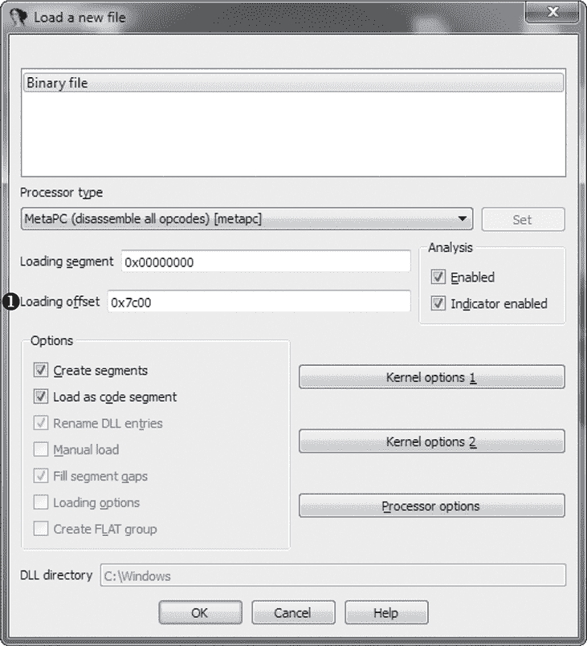
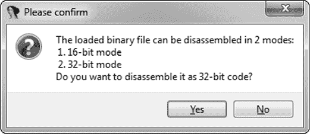
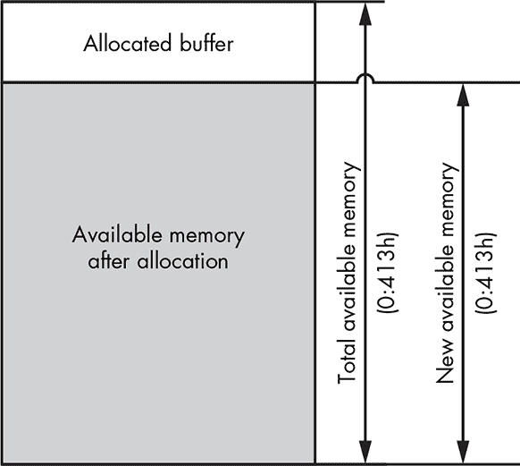
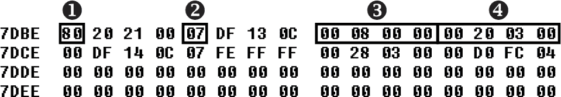
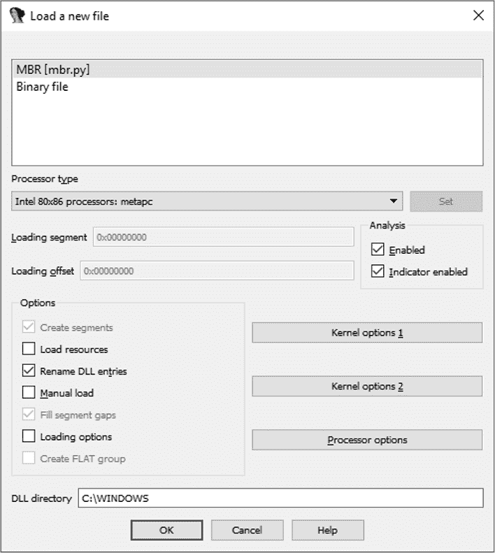

## **使用 IDA PRO 进行 BOOTKIT 静态分析**


本章介绍了使用 IDA Pro 进行 bootkit 静态分析的基本概念。反向工程 bootkit 有几种方法，涵盖所有现有方法需要一本专门的书。本章重点介绍 IDA Pro 反汇编器，因为它提供了独特的功能，能够支持 bootkit 的静态分析。

静态分析 bootkit 与大多数常规应用环境中的逆向工程截然不同，因为 bootkit 的关键部分在预启动环境中执行。例如，典型的 Windows 应用程序依赖于标准的 Windows 库，并且预期调用已知的标准库函数，这些函数是像 Hex-Rays IDA Pro 这样的逆向工程工具所熟悉的。通过应用程序调用的函数，我们可以推断出很多信息；Linux 应用程序与 POSIX 系统调用也是如此。但预启动环境缺乏这些提示，因此预启动分析工具需要额外的功能来弥补这些缺失的信息。幸运的是，这些功能在 IDA Pro 中可用，本章将解释如何使用它们。

正如在第七章中讨论的那样，bootkit 由几个紧密关联的模块组成：主引导记录（MBR）或卷引导记录（VBR）感染者、恶意引导加载程序、内核模式驱动程序等。本章将讨论 bootkit MBR 和合法操作系统 VBR 的分析，您可以将其作为反向工程任何在预启动环境中执行的代码的模型。您可以从本书的下载资源中获取您将要使用的 MBR 和 VBR。在本章结束时，我们将讨论如何处理其他 bootkit 组件，如恶意引导加载程序和内核模式驱动程序。如果您还没有学习第七章，现在应该去学习。

首先，我们将展示如何开始进行 bootkit 分析；您将了解在 IDA Pro 中使用哪些选项将代码加载到反汇编器中、预启动环境中使用的 API、不同模块之间如何传递控制以及哪些 IDA 功能可能简化它们的反向工程。然后，您将学习如何为 IDA Pro 开发自定义加载器，以自动化反向工程任务。最后，我们提供了一组练习，帮助您进一步探索 bootkit 静态分析。您可以从 *[`nostarch.com/rootkits/`](https://nostarch.com/rootkits/)* 下载本章的材料。

### 分析 Bootkit MBR

首先，我们将在 IDA Pro 反汇编器中分析一个引导木马 MBR。本章使用的 MBR 类似于 TDL4 引导木马创建的 MBR（参见第七章）。TDL4 的 MBR 是一个很好的例子，因为它实现了传统的引导木马功能，但其代码易于反汇编和理解。本章中的 VBR 例子基于一个来自实际 Microsoft Windows 卷的合法代码。

#### *加载并解密 MBR*

在接下来的章节中，你将把 MBR 加载到 IDA Pro 中，并分析 MBR 代码的入口点。然后，你将解密代码，并检查 MBR 如何管理内存。

##### 将 MBR 加载到 IDA Pro 中

引导木马 MBR 的静态分析的第一步是将 MBR 代码加载到 IDA 中。因为 MBR 不是一个传统的可执行文件，并且没有专用的加载器，你需要将它作为一个二进制模块加载。IDA Pro 会像 BIOS 一样，将 MBR 加载到内存中作为一个连续的单一段落，而不会进行任何额外处理。你只需要提供该段的起始内存地址。

通过 IDA Pro 打开二进制文件加载 MBR。当 IDA Pro 第一次加载 MBR 时，它会显示一条消息，提供各种选项，如图 8-1 所示。



*图 8-1：加载 MBR 时显示的 IDA Pro 对话框*

你可以接受大多数参数的默认值，但需要在加载偏移字段➊中输入一个值，该字段指定将模块加载到内存中的位置。这个值应该始终是 0x7C00——这是 BIOS 启动代码将 MBR 加载到的固定地址。输入完这个偏移量后，点击**确定**。IDA Pro 加载模块后，会提供选项让你选择以 16 位或 32 位模式反汇编模块，如图 8-2 所示。



*图 8-2：IDA Pro 对话框询问你选择哪个反汇编模式*

对于这个例子，选择**否**。这会指示 IDA 将 MBR 反汇编为 16 位实模式代码，这正是实际 CPU 在启动过程中最初阶段解码 MBR 的方式。

由于 IDA Pro 将反汇编的结果存储在扩展名为*idb*的数据库文件中，从现在开始，我们将其反汇编结果称为数据库。IDA 使用这个数据库来收集你通过 GUI 操作和 IDA 脚本提供的所有代码注释。你可以将这个数据库视为所有 IDA 脚本函数的隐式参数，它代表了你对 IDA 能作用的二进制文件所获得的逆向工程知识的当前状态。

如果你没有任何数据库经验，别担心：IDA 的接口设计使得你无需了解数据库内部结构。然而，理解 IDA 如何表示它所学到的代码知识确实非常有帮助。

##### 分析 MBR 的入口点

当 BIOS 在启动时加载时，经过感染的引导工具修改后的 MBR 从其第一个字节开始执行。我们将其加载地址指定给 IDA 的反汇编器为 0:7C00h，这是 BIOS 加载它的地方。列表 8-1 显示了加载的 MBR 映像的前几个字节。

```
seg000:7C00 ; Segment type: Pure code

seg000:7C00 seg000          segment byte public 'CODE' use16

seg000:7C00                 assume cs:seg000

seg000:7C00                 ;org 7C00h

seg000:7C00                 assume es:nothing, ss:nothing, ds:nothing, fs:nothing, gs:nothing

seg000:7C00                 xor     ax, ax

seg000:7C02               ➊ mov     ss, ax

seg000:7C04                 mov     sp, 7C00h

seg000:7C07                 mov     es, ax

seg000:7C09                 mov     ds, ax

seg000:7C0B                 sti

seg000:7C0C                 pusha

seg000:7C0D                 mov     cx, 0CFh

seg000:7C10                 mov     bp, 7C19h

seg000:7C13

seg000:7C13 loc_7C13:                               ; CODE XREF: seg000:7C17

seg000:7C13               ➋ ror     byte ptr [bp+0], cl

seg000:7C16                 inc     bp

seg000:7C17                 loop    loc_7C13

seg000:7C17 ; ---------------------------------------------------------------------------

seg000:7C19 encrypted_code  db 44h, 85h, 1Dh, 0C7h, 1Ch, 0B8h, 26h, 4, 8, 68h, 62h

seg000:7C19               ➌ db 40h, 0Eh, 83h, 0Ch, 0A3h, 0B1h, 1Fh, 96h, 84h, 0F5h
```

*列表 8-1：MBR 的入口点*

我们在早期看到初始化存根 ➊，它设置了堆栈段选择符 `ss`、堆栈指针 `sp` 和段选择符寄存器 `es` 和 `ds`，以便访问内存并执行子程序。初始化存根之后是一个解密例程 ➋，它通过逐字节旋转位（使用 `ror` 指令）来解密剩余的 MBR ➌，然后将控制权传递给解密后的代码。加密数据的大小由 `cx` 寄存器给出，而 `bp` 寄存器指向该数据块。这种临时加密旨在阻碍静态分析并避免被安全软件检测到。它还给我们带来了第一个障碍，因为我们现在需要提取实际代码以继续分析。

##### 解密 MBR 代码

为了继续分析加密的 MBR，我们需要解密代码。由于有了 IDA 脚本引擎，你可以轻松地使用列表 8-2 中的 Python 脚本完成这个任务。

```
➊ import idaapi

   # beginning of the encrypted code and its size in memory

   start_ea = 0x7C19

   encr_size = 0xCF

➋ for ix in xrange(encr_size):

  ➌ byte_to_decr = idaapi.get_byte(start_ea + ix)

     to_rotate = (0xCF - ix) % 8

     byte_decr = (byte_to_decr >> to_rotate) | (byte_to_decr << (8 - to_rotate))

  ➍ idaapi.patch_byte(start_ea + ix, byte_decr)
```

*列表 8-2：解密 MBR 代码的 Python 脚本*

首先，我们导入 `idaapi` 包 ➊，它包含了 IDA API 库。然后我们循环遍历并解密加密的字节 ➋。为了从反汇编段中获取字节，我们使用 `get_byte` API ➌，它只接受一个参数：要读取的字节的地址。一旦字节解密完成，我们使用 `patch_byte` API 将字节写回反汇编区域 ➍，该 API 接受要修改的字节的地址和要写入的值。你可以通过选择 **文件**▸**脚本** 从 IDA 菜单中执行此脚本，或按 ALT-F7。

**注意**

*此脚本并不会修改 MBR 的实际映像，而是修改其在 IDA 中的表示——即 IDA 对加载代码执行时的预期样子。在对反汇编代码进行任何修改之前，你应该先创建 IDA 数据库当前版本的备份。这样，如果修改 MBR 代码的脚本有 bug 并扭曲了代码，你就可以轻松恢复最近的版本。*

##### 实模式下的内存管理分析

解密了代码后，让我们继续分析它。如果你查看解密后的代码，你会发现列表 8-3 中显示的指令。这些指令通过存储 MBR 输入参数和内存分配来初始化恶意代码。

```
seg000:7C19               ➊ mov     ds:drive_no, dl

seg000:7C1D               ➋ sub     word ptr ds:413h, 10h

seg000:7C22                 mov     ax, ds:413h

seg000:7C25                 shl     ax, 6

seg000:7C28               ➌ mov     ds:buffer_segm, ax
```

*列表 8-3：预启动环境中的内存分配*

将 `dl` 寄存器的内容存储到内存中的汇编指令位于 `ds` 段的一个偏移量 ➊ 处。从我们分析这种代码的经验来看，我们可以猜测 `dl` 寄存器包含执行 MBR 的硬盘编号；我们将这个偏移量注释为名为 `drive_no` 的变量。IDA Pro 会在数据库中记录这一注释并在清单中显示。当执行 I/O 操作时，您可以使用这个整数索引来区分系统中不同的磁盘。您将在下一节的 BIOS 磁盘服务中使用这个变量。

类似地，清单 8-3 显示了注释`buffer_segm` ➌，这是代码分配缓冲区的偏移量。IDA Pro 会将这些注释传播到使用相同变量的其他代码中。

在➋处，我们看到内存分配。在预启动环境中，并没有现代操作系统那种内存管理器的概念，比如支持`malloc()`调用的操作系统逻辑。相反，BIOS 通过一个*字*（在 x86 架构中为 16 位值）维护可用内存的千字节数，该字存储在地址 0:413h 处。为了分配 *X* KB 的内存，我们从可用内存的总大小中减去 *X*，这个总大小存储在 0:413h 处的字中，如图 8-3 所示。



*图 8-3：预启动环境中的内存管理*

在清单 8-3 中，代码通过从总可用内存中减去 10h 来分配一个 10KB 的缓冲区。实际的地址存储在变量`buffer_segm` ➌中。MBR 然后使用分配的缓冲区来存储从硬盘读取的数据。

#### *分析 BIOS 磁盘服务*

预启动环境的另一个独特方面是 BIOS 磁盘服务，它是用于与硬盘通信的 API。在引导包分析中，这个 API 特别值得关注，原因有二。首先，引导包使用它从硬盘读取数据，因此熟悉该 API 最常用的命令对于理解引导包代码至关重要。其次，BIOS 磁盘服务本身也是引导包的常见目标。在最常见的情况下，引导包会挂钩该 API，从而修补通过其他代码在引导过程中从硬盘读取的合法模块。

BIOS 磁盘服务可以通过 INT 13h 指令访问。为了执行 I/O 操作，软件通过处理器寄存器传递 I/O 参数，并执行 INT 13h 指令，这会将控制权转交给适当的处理程序。I/O 操作码或*标识符*被传递到`ah`寄存器——`ax`寄存器的高位部分。`dl`寄存器用于传递目标磁盘的索引。处理器的进位标志（`CF`）用于指示在执行服务时是否发生错误：如果`CF`被设置为`1`，则表示发生了错误，详细的错误代码将返回在`ah`寄存器中。这种通过函数传递参数的 BIOS 约定早于现代操作系统的系统调用约定；如果它看起来有些复杂，请记住，这就是统一系统调用接口概念的起源地。

这个 INT 13h 中断是进入 BIOS 磁盘服务的入口点，它允许在预引导环境中的软件对磁盘设备执行基本的 I/O 操作，如硬盘、软盘和光盘驱动器，具体如表 8-1 所示。

**表 8-1：** INT 13h 命令

| **操作码** | **操作描述** |
| --- | --- |
| 2h | 读取扇区到内存 |
| 3h | 写入磁盘扇区 |
| 8h | 获取驱动器参数 |
| 41h | 扩展安装检查 |
| 42h | 扩展读取 |
| 43h | 扩展写入 |
| 48h | 扩展获取驱动器参数 |

表 8-1 中的操作分为两组：第一组（包含代码 41h、42h、43h 和 48h）为*扩展操作*，第二组（包含代码 2h、3h 和 8h）为*传统操作*。

两组操作之间唯一的区别是，扩展操作可以使用基于*逻辑块寻址（LBA）*的寻址方案，而传统操作则仅依赖基于*柱面-磁头-扇区（CHS）*的寻址方案。在 LBA 寻址方案中，磁盘上的扇区按顺序从索引`0`开始枚举，而在 CHS 寻址方案中，每个扇区都使用元组`(c,h,s)`进行寻址，其中`c`是柱面号，`h`是磁头号，`s`是扇区号。尽管引导工具可能使用任一组操作，但几乎所有现代硬件都支持基于 LBA 的寻址方案。

##### 获取驱动器参数以定位隐藏存储

当你继续查看跟随在 10KB 内存分配后的 MBR 代码时，你应该会看到执行 INT 13h 指令，如示例 8-4 所示。

```
seg000:7C2B               ➊ mov     ah, 48h

seg000:7C2D               ➋ mov     si, 7CF9h

seg000:7C30                 mov     ds:drive_param.bResultSize, 1Eh

seg000:7C36                 int     13h         ; DISK - IBM/MS Extension

                                             ➌ ; GET DRIVE PARAMETERS

                                                ; (DL - drive, DS:SI - buffer)
```

*示例 8-4：通过 BIOS 磁盘服务获取驱动器参数*

由于 MBR 的大小（512 字节）限制了其可以实现的代码功能，因此启动工具会加载额外的代码进行执行，这段代码称为*恶意引导加载程序*，它被放置在硬盘末尾的隐藏存储中。为了获取硬盘上隐藏存储的坐标，MBR 代码使用扩展的“获取驱动器参数”操作（操作码 48h，在表 8-1 中），该操作返回硬盘的大小和几何信息。通过这些信息，启动工具可以计算出额外代码在硬盘上的偏移位置。

在清单 8-4 中，你可以看到 IDA Pro 为指令 INT 13h ➌自动生成的注释。在代码分析过程中，IDA Pro 识别传递给 BIOS 磁盘服务处理程序的参数，并生成带有请求的磁盘 I/O 操作名称和用于传递参数给 BIOS 处理程序的寄存器名称的注释。这段 MBR 代码执行 INT 13h 操作，并使用参数`48h` ➊。执行后，这个例程会填充一个名为`EXTENDED_GET_PARAMS`的特殊结构，该结构提供驱动器参数。该结构的地址存储在`si`寄存器中 ➋。

##### 检查 EXTENDED_GET_PARAMS

`EXTENDED_GET_PARAMS`路由在清单 8-5 中提供。

```
typedef struct _EXTENDED_GET_PARAMS {

   WORD bResultSize;             // Size of the result

   WORD InfoFlags;               // Information flags

   DWORD CylNumber;              // Number of physical cylinders on drive

   DWORD HeadNumber;             // Number of physical heads on drive

   DWORD SectorsPerTrack;        // Number of sectors per track

➊ QWORD TotalSectors;           // Total number of sectors on drive

➋ WORD BytesPerSector;          // Bytes per sector

} EXTENDED_GET_PARAMS, *PEXTENDED_GET_PARAMS;
```

*清单 8-5：`EXTENDED_GET_PARAMS`结构布局*

启动工具实际上只关心返回结构中的两个字段：硬盘上的扇区数量 ➊ 和磁盘扇区的大小（以字节为单位） ➋。启动工具通过将这两个值相乘来计算硬盘的总大小（以字节为单位），然后利用结果来定位硬盘末尾的隐藏存储。

##### 读取恶意引导加载程序扇区

一旦启动工具获取了硬盘参数并计算出隐藏存储的偏移量，启动工具的 MBR 代码就会通过 BIOS 磁盘服务的扩展读取操作从磁盘中读取这些隐藏数据。这些数据是下一阶段的恶意引导加载程序，旨在绕过操作系统安全检查并加载恶意的内核模式驱动程序。清单 8-6 展示了将其读取到 RAM 中的代码。

```
seg000:7C4C read_loop:                              ; CODE XREF: seg000:7C5Dj

seg000:7C4C              ➊ call    read_sector

seg000:7C4F                 mov     si, 7D1Dh

seg000:7C52                 mov     cx, ds:word_7D1B

seg000:7C56                 rep movsb

seg000:7C58                 mov     ax, ds:word_7D19

seg000:7C5B                 test    ax, ax

seg000:7C5D                 jnz     short read_loop

seg000:7C5F                 popa

seg000:7C60              ➋ jmp     far boot_loader
```

*清单 8-6：从磁盘加载额外恶意引导加载程序的代码*

在`read_loop`中，这段代码通过调用`read_sector` ➊反复从硬盘读取扇区，并将它们存储在之前分配的内存缓冲区中。然后，代码通过执行`jmp far`指令 ➋将控制转移到这个恶意引导加载程序。

查看`read_sector`例程的代码，在清单 8-7 中，你可以看到使用了 INT 13h，参数为`42h`，这对应于扩展读取操作。

```
seg000:7C65 read_sector     proc near

seg000:7C65                 pusha

seg000:7C66               ➊ mov     ds:disk_address_packet.PacketSize, 10h

seg000:7C6B               ➋ mov     byte ptr ds:disk_address_packet.SectorsToTransfer, 1

seg000:7C70                 push    cs

seg000:7C71                 pop     word ptr ds:disk_address_packet.TargetBuffer+2

seg000:7C75               ➌ mov     word ptr ds:disk_address_packet.TargetBuffer, 7D17h

seg000:7C7B                 push    large [dword ptr ds:drive_param.TotalSectors_l]

seg000:7C80               ➍ pop     large [ds:disk_address_packet.StartLBA_l]

seg000:7C85                 push    large [dword ptr ds:drive_param.TotalSectors_h]

seg000:7C8A               ➎ pop     large [ds:disk_address_packet.StartLBA_h]

seg000:7C8F                 inc     eax

seg000:7C91                 sub     ds:disk_address_packet.StartLBA_l, eax

seg000:7C96                 sbb     ds:disk_address_packet.StartLBA_h, 0

seg000:7C9C                 mov     ah, 42h

seg000:7C9E               ➏ mov     si, 7CE9h

seg000:7CA1                 mov     dl, ds:drive_no

seg000:7CA5               ➐ int     13h             ; DISK - IBM/MS Extension

                                                    ; EXTENDED READ

                                                    ; (DL - drive, DS:SI - disk address packet)

seg000:7CA7                 popa

seg000:7CA8                 retn

seg000:7CA8 read_sector     endp
```

*清单 8-7：从磁盘读取扇区*

在执行 INT 13h ➐之前，bootkit 代码初始化`DISK_ADDRESS_PACKET`结构，设置适当的参数，包括结构的大小➊、要传输的扇区数量➋、存储结果的缓冲区地址➌，以及要读取的扇区地址➍ ➎。该结构的地址通过`ds`和`si`寄存器提供给 INT 13h 处理程序➏。注意结构偏移量的手动注释；IDA 会获取并传播它们。BIOS 磁盘服务使用`DISK_ADDRESS_PACKET`来唯一标识从硬盘读取哪些扇区。`DISK_ADDRESS_PACKET`结构的完整布局及其注释在列表 8-8 中提供。

```
typedef struct _DISK_ADDRESS_PACKET {

   BYTE PacketSize;                 // Size of the structure

   BYTE Reserved;

   WORD SectorsToTransfer;          // Number of sectors to read/write

   DWORD TargetBuffer;              // segment:offset of the data buffer

   QWORD StartLBA;                  // LBA address of the starting sector

} DISK_ADDRESS_PACKET, *PDISK_ADDRESS_PACKET;
```

*列表 8-8：`DISK_ADDRESS_PACKET` 结构布局*

一旦引导加载程序被读取到内存缓冲区，bootkit 就会执行它。

到此为止，我们已经完成了对 MBR 代码的分析，接下来将分析 MBR 的另一个重要部分：分区表。你可以在*[`nostarch.com/rootkits/`](https://nostarch.com/rootkits/)*下载完整版本的反汇编并注释过的恶意 MBR。

#### *分析受感染的 MBR 分区表*

MBR 分区表是 bootkit 的常见攻击目标，因为它包含的数据——虽然有限——在启动过程的逻辑中扮演着关键角色。在第五章中介绍过，分区表位于 MBR 中的偏移量 0x1BE 处，由四个条目组成，每个条目的大小为 0x10 字节。它列出了硬盘上可用的分区，描述了它们的类型和位置，并指定了 MBR 代码完成后应该将控制权转交到哪里。通常，合法 MBR 代码的唯一目的是扫描此表格以查找*活动*分区——即标记了相应位标志并包含 VBR 的分区——并将其加载。你可能能够通过简单地操作表格中包含的信息来在启动的早期阶段拦截这一执行流程，而无需修改 MBR 代码本身；我们将在第十章中讨论的 Olmasco bootkit 实现了这种方法。

这说明了 bootkit 和 rootkit 设计中的一个重要原则：如果你能够巧妙地操控某些数据以弯曲控制流，那么这种方法比修补代码更受青睐。这节省了恶意软件程序员测试新修改代码的努力——这是代码重用促进可靠性的一个好例子！

像 MBR 或 VBR 这样的复杂数据结构通常会为攻击者提供许多机会，将它们视为一种字节码，并将消耗这些数据的本机代码视为通过输入数据编程的虚拟机。*语言理论安全*（LangSec，*[`langsec.org/`](http://langsec.org/)*）方法解释了为什么会出现这种情况。

能够读取和理解 MBR 的分区表对于发现这种早期引导病毒拦截至关重要。请查看图 8-4 中的分区表，其中每一行 16/10h 字节是一个分区表条目。



*图 8-4：MBR 的分区表*

如你所见，表格中有两个条目——前两行——这意味着磁盘上只有两个分区。第一个分区条目从地址 0x7DBE 开始；它的第一个字节➊表明该分区是活动的，因此 MBR 代码应加载并执行其 VBR，即该分区的第一个扇区。偏移地址 0x7DC2 处的字节➋描述了该分区的类型——即操作系统、引导加载程序或其他低级磁盘访问代码应期望的文件系统类型。在此情况下，0x07 表示微软的 NTFS。（有关分区类型的更多信息，请参见《Windows 启动过程》第 60 页）

接下来，分区表条目中偏移地址 0x7DC5 处的 DWORD➌表明该分区从硬盘起始位置偏移 0x800 开始；这个偏移量是以扇区为单位计算的。条目的最后一个 DWORD ➍指定了分区的大小，以扇区为单位（0x32000）。表 8-2 详细列出了图 8-4 中的具体示例。在起始偏移和分区大小列中，实际值以扇区为单位提供，字节数则用括号标注。

**表 8-2：** MBR 分区表内容

| **分区索引** | **是否激活** | **类型** | **起始偏移，扇区（字节）** | **分区大小，扇区（字节）** |
| --- | --- | --- | --- | --- |
| 0 | 激活 | NTFS (0x07) | 0x800 (0x100000) | 0x32000 (0x6400000) |
| 1 | 错误 | NTFS (0x07) | 0x32800 (0x6500000) | 0x4FCD000 (0x9F9A00000) |
| 2 | 不适用 | 不适用 | 不适用 | 不适用 |
| 3 | 不适用 | 不适用 | 不适用 | 不适用 |

重建的分区表指示了你在分析启动序列时下一步应该查看的地方。即，它告诉你 VBR 的位置。VBR 的坐标存储在主分区条目的起始偏移列中。在此案例中，VBR 位于硬盘起始位置偏移 0x100000 字节的地方，这是你继续分析时要查看的地方。

### VBR 分析技术

在本节中，我们将讨论使用 IDA 进行 VBR 静态分析的方法，并重点介绍一个关键的 VBR 概念——*BIOS 参数块（BPB）*，它在启动过程和引导病毒感染中起着重要作用。VBR 也是引导病毒的常见目标，正如我们在第七章中简要提到的那样。在第十二章中，我们将更详细地讨论 Gapz 引导病毒，它通过感染 VBR 来在受感染系统上保持持久性。在第十一章中讨论的 Rovnix 引导病毒也利用 VBR 感染系统。

你应该以与加载 MBR 基本相同的方式加载 VBR 到反汇编器中，因为它也在实模式下执行。加载来自样本目录中 第八章 的 VBR 文件 *vbr_sample_ch8.bin*，作为 0:7C00h 处的二进制模块，并以 16 位反汇编模式加载。

#### *分析 IPL*

VBR 的主要目的是定位初始程序加载器（IPL），并将其加载到内存中。IPL 在硬盘上的位置在 `BIOS_PARAMETER_BLOCK_NTFS` 结构中指定，前文在第五章中已讨论过。直接存储在 VBR 中的 `BIOS_PARAMETER_BLOCK_NTFS` 包含多个字段，用于定义 NTFS 卷的几何结构，如每扇区的字节数、每簇的扇区数以及主文件表的位置。

`HiddenSectors` 字段存储了从硬盘开始到 NTFS 卷开始的扇区数，定义了 IPL 的实际位置。VBR 假定 NTFS 卷以 VBR 开头，紧随其后的是 IPL。因此，VBR 代码通过获取 `HiddenSectors` 字段的内容，递增该值 1，然后从计算出的偏移量读取 0x2000 字节（即 16 个扇区）来加载 IPL。一旦 IPL 从磁盘加载完毕，VBR 代码会将控制权转交给它。

清单 8-9 展示了我们示例中 BIOS 参数块结构的一部分。

```
seg000:000B bpb     dw 200h      ; SectorSize

seg000:000D         db 8         ; SectorsPerCluster

seg000:001E         db 3 dup(0)  ; reserved

seg000:0011         dw 0         ; RootDirectoryIndex

seg000:0013         dw 0         ; NumberOfSectorsFAT

seg000:0015         db 0F8h      ; MediaId

seg000:0016         db 2 dup(0)  ; Reserved2

seg000:0018         dw 3Fh       ; SectorsPerTrack

seg000:001A         dw 0FFh      ; NumberOfHeads

seg000:001C         dd 800h      ; HiddenSectors➊
```

*清单 8-9：VBR 的 BIOS 参数块*

`HiddenSectors` ➊ 的值为 0x800，对应磁盘上活动分区的起始偏移量，见表 8-2。这表明 IPL 位于磁盘起始位置的 0x801 偏移处。Bootkit 利用这些信息在启动过程中拦截控制。比如，Gapz bootkit 修改了 `HiddenSectors` 字段的内容，使得 VBR 代码读取并执行恶意的 IPL，而不是合法的 IPL。另一方面，Rovnix 使用了另一种策略：它修改了合法 IPL 的代码。这两种操作都在系统启动初期拦截了控制权。

#### *评估其他 Bootkit 组件*

一旦 IPL 获得控制，它会加载存储在卷文件系统中的 *bootmgr*。此后，其他 bootkit 组件，如恶意引导加载程序和内核模式驱动程序，可能会启动。对这些模块的完整分析超出了本章的范围，但我们会简要概述一些方法。

##### 恶意引导加载程序

恶意引导加载程序是 bootkits 的重要组成部分。它们的主要目的是通过 CPU 执行模式切换生存下来，绕过操作系统安全检查（如驱动签名强制执行），并加载恶意内核模式驱动程序。由于大小限制，它们实现了无法容纳在 MBR 和 VBR 中的功能，并且它们会被单独存储在硬盘上。Bootkits 会将其引导加载程序存储在隐藏的存储区域，这些区域通常位于硬盘的末端（通常有一些未使用的磁盘空间），或者在分区之间的空闲磁盘空间中（如果有的话）。

恶意引导加载程序可能包含在不同处理器执行模式下执行的不同代码：

**16 位实模式** 中断 13h 钩子功能

**32 位保护模式** 绕过 32 位操作系统版本的操作系统安全检查

**64 位保护模式（长模式）** 绕过 64 位操作系统版本的操作系统安全检查

但是，IDA Pro 反汇编器不能在单个 IDA 数据库中保持不同模式下的代码反汇编，因此你需要为不同的执行模式维护不同版本的 IDA Pro 数据库。

##### 内核模式驱动程序

在大多数情况下，bootkits 加载的内核模式驱动程序是有效的 PE 镜像。它们实现了 rootkit 功能，使恶意软件能够避开安全软件的检测，并提供隐蔽的通信渠道等功能。现代 bootkits 通常包含为 x86 和 x64 平台编译的两个版本的内核模式驱动程序。你可以使用常规的可执行文件静态分析方法分析这些模块。IDA Pro 在加载这些可执行文件方面做得相当不错，并且为其分析提供了许多补充工具和信息。然而，我们将讨论如何使用 IDA Pro 的功能，通过在加载时预处理它们来自动化 bootkits 的分析。

### 高级 IDA Pro 使用：编写自定义 MBR 加载器

IDA Pro 反汇编器最引人注目的特点之一是其对各种文件格式和处理器架构的广泛支持。为了实现这一点，加载特定类型可执行文件的功能是通过名为*加载器*的特殊模块来实现的。默认情况下，IDA Pro 包含多个加载器，覆盖了最常见的可执行文件类型，如 PE（Windows）、ELF（Linux）、Mach-O（macOS）和固件镜像格式。你可以通过检查 *$IDADIR\loaders* 目录的内容来获得可用加载器的列表，其中 *$IDADIR* 是反汇编器的安装目录。该目录中的文件就是加载器，它们的名称对应平台及其二进制格式。文件扩展名具有以下含义：

***ldw*** IDA Pro 32 位版本的加载器的二进制实现

***l64*** IDA Pro 64 位版本的加载器的二进制实现

***py*** 适用于 IDA Pro 两个版本的加载器的 Python 实现

默认情况下，在编写本章时，MBR 或 VBR 没有可用的加载器，这就是为什么你必须指示 IDA 将 MBR 或 VBR 作为二进制模块加载的原因。本节将向你展示如何为 IDA Pro 编写一个基于 Python 的自定义 MBR 加载器，该加载器在 16 位反汇编模式下以地址 0x7C00 加载 MBR 并解析分区表。

#### *理解 loader.hpp*

起始点是*loader.hpp*文件，该文件随 IDA Pro SDK 提供，包含了很多与在反汇编器中加载可执行文件相关的有用信息。它定义了需要使用的结构和类型，列出了回调例程的原型，并描述了它们所需的参数。以下是根据*loader.hpp*，加载器中应该实现的回调函数列表：

accept_file 该例程检查正在加载的文件是否为受支持的格式。

load_file 该例程实际执行将文件加载到反汇编器中的工作——即解析文件格式并将文件内容映射到新创建的数据库中。

save_file 这是一个可选的例程，如果实现了它，则会在执行菜单中的文件▸生成文件▸创建 EXE 文件命令时从反汇编中生成可执行文件。

move_segm 这是一个可选的例程，如果实现了它，在用户在数据库中移动一个段时执行。当图像中有重定位信息且用户在移动段时需要考虑这些信息时，通常会使用此例程。由于 MBR 没有重定位，我们可以跳过此例程，但如果我们要为 PE 或 ELF 二进制文件编写加载器，则不能跳过。

init_loader_options 这是一个可选的例程，如果实现了它，当用户选择一个加载器后，它会询问用户有关加载特定文件类型的额外参数。我们可以跳过此例程，因为我们没有需要添加的特殊选项。

现在让我们来看看这些例程在我们的自定义 MBR 加载器中的实际实现。

#### *实现 accept_file*

在`accept_file`例程中，如清单 8-10 所示，我们检查文件是否为主引导记录。

```
def accept_file(li, n):

   # check size of the file

   file_size = li.size()

   if file_size < 512:

    ➊ return 0

   # check MBR signature

   li.seek(510, os.SEEK_SET)

   mbr_sign = li.read(2)

   if mbr_sign[0] != '\x55' or mbr_sign[1] != '\xAA':

    ➋ return 0

   # all the checks are passed

➌ return 'MBR'
```

*清单 8-10：`accept_file`实现*

MBR 格式相当简单，因此我们只需要以下几个指标来执行此检查：

**文件大小** 文件大小应至少为 512 字节，这对应于硬盘扇区的最小大小。

**MBR 签名** 有效的 MBR 应该以字节 0xAA55 结束。

如果条件满足且文件被识别为 MBR，代码将返回一个包含加载器名称的字符串➌；如果文件不是 MBR，代码将返回`0` ➊ ➋。

#### *实现 load_file*

一旦`accept_file`返回一个非零值，IDA Pro 会尝试通过执行`load_file`例程来加载文件，该例程在你的加载器中实现。此例程需要执行以下步骤：

1.  将整个文件读入缓冲区。

1.  创建并初始化一个新的内存段，在该段中脚本将加载 MBR 内容。

1.  将 MBR 的起始位置设置为反汇编的入口点。

1.  解析 MBR 中包含的分区表。

`load_file`的实现显示在列表 8-11 中。

```
def load_file(li):

    # Select the PC processor module

 ➊ idaapi.set_processor_type("metapc", SETPROC_ALL|SETPROC_FATAL)

    # read MBR into buffer

 ➋ li.seek(0, os.SEEK_SET); buf = li.read(li.size())

    mbr_start = 0x7C00       # beginning of the segment

    mbr_size = len(buf)      # size of the segment

    mbr_end  = mbr_start + mbr_size

    # Create the segment

 ➌ seg = idaapi.segment_t()

    seg.startEA = mbr_start

    seg.endEA   = mbr_end

    seg.bitness = 0 # 16-bit

 ➍ idaapi.add_segm_ex(seg, "seg0", "CODE", 0)

    # Copy the bytes

 ➎ idaapi.mem2base(buf, mbr_start, mbr_end)

    # add entry point

    idaapi.add_entry(mbr_start, mbr_start, "start", 1)

    # parse partition table

 ➏ struct_id = add_struct_def()

    struct_size = idaapi.get_struc_size(struct_id)

 ➐ idaapi.doStruct(start + 0x1BE, struct_size, struct_id)
```

*列表 8-11：`load_file`实现*

首先，将 CPU 类型设置为`metapc` ➊，这对应于通用 PC 系列，指示 IDA 将二进制文件反汇编为 IBM PC 的操作码。然后，将 MBR 读取到缓冲区➋，并通过调用`segment_t` API ➌创建内存段。此调用分配一个空结构`seg`，描述要创建的段。接着，用实际的字节值填充它。将段的起始地址设置为 0x7C00，正如你在“将 MBR 加载到 IDA Pro 中”中第 96 页所做的那样，并将其大小设置为 MBR 的相应大小。同时，告诉 IDA 新段将是一个 16 位段，将结构的`bitness`标志设置为`0`；注意，`1`对应 32 位段，`2`对应 64 位段。然后，通过调用`add_segm_ex` API ➍，将新段添加到反汇编数据库中。`add_segm_ex` API 接受以下参数：描述要创建的段的结构；段名称（`seg0`）；段类`CODE`；以及`flags`，其值保持为`0`。在此调用之后 ➎，将 MBR 内容复制到新创建的段中并添加入口点指示符。

接下来，通过调用`doStruct` API ➐，自动解析 MBR 中的分区表，传入以下参数：分区表起始地址、表的字节大小以及你希望表转换为的结构标识符。我们加载器中实现的`add_struct_def`例程 ➏ 创建了这个结构。它将定义分区表的结构`PARTITION_TABLE_ENTRY`导入到数据库中。

#### *创建分区表结构*

列表 8-12 定义了`add_struct_def`例程，该例程创建了`PARTITION_TABLE_ENTRY`结构。

```
def add_struct_def(li, neflags, format):

    # add structure PARTITION_TABLE_ENTRY to IDA types

    sid_partition_entry = AddStrucEx(-1, "PARTITION_TABLE_ENTRY", 0)

    # add fields to the structure

    AddStrucMember(sid_partition_entry, "status", 0, FF_BYTE, -1, 1)

    AddStrucMember(sid_partition_entry, "chsFirst", 1, FF_BYTE, -1, 3)

    AddStrucMember(sid_partition_entry, "type", 4, FF_BYTE, -1, 1)

    AddStrucMember(sid_partition_entry, "chsLast", 5, FF_BYTE, -1, 3)

    AddStrucMember(sid_partition_entry, "lbaStart", 8, FF_DWRD, -1, 4)

    AddStrucMember(sid_partition_entry, "size", 12, FF_DWRD, -1, 4)

    # add structure PARTITION_TABLE to IDA types

    sid_table = AddStrucEx(-1, "PARTITION_TABLE", 0)

    AddStrucMember(sid_table, "partitions", 0, FF_STRU, sid, 64)

    return sid_table
```

*列表 8-12：将数据结构导入反汇编数据库*

一旦加载器模块完成，将其作为*mbr.py*文件复制到 *$IDADIR\loaders* 目录中。当用户尝试将 MBR 加载到反汇编器时，图 8-5 中的对话框将出现，确认你的加载器成功识别了 MBR 镜像。点击**确定**将执行加载器中实现的`load_file`例程，以便将前述的自定义设置应用到加载的文件中。

**注意**

*当你为 IDA Pro 开发自定义加载器时，脚本实现中的错误可能会导致 IDA Pro 崩溃。如果发生这种情况，只需从* loaders *目录中删除加载器脚本并重新启动反汇编器。*

在本节中，你已经看到反汇编器扩展开发能力的一小部分。有关 IDA Pro 扩展开发的更完整参考，请参阅 Chris Eagle 的《IDA Pro 书》（No Starch Press，2011）。



*图 8-5：选择自定义 MBR 加载程序*

### 结论

在本章中，我们描述了对 MBR 和 VBR 进行静态分析的几个简单步骤。你可以轻松地将本章中的示例扩展到在预启动环境中运行的任何代码。你还看到了 IDA Pro 反汇编器提供了许多独特的功能，使其成为执行静态分析的得力工具。

另一方面，静态分析有其局限性——主要是无法看到代码的运行并观察它如何处理数据。在许多情况下，静态分析无法回答反向工程师可能提出的所有问题。在这种情况下，检查代码的实际执行情况以更好地理解其功能，或获取一些在静态分析中可能遗漏的信息（如加密密钥）非常重要。这引出了动态分析，我们将在下一章中讨论其方法和工具。

### 练习

完成以下练习，以更好地掌握本章的内容。你需要从 *[`nostarch.com/rootkits/`](https://nostarch.com/rootkits/)* 下载一个磁盘映像。完成此练习所需的工具是 IDA Pro 反汇编器和 Python 解释器。

1.  通过读取其前 512 个字节并将其保存在名为 *mbr.mbr* 的文件中，从映像中提取 MBR。将提取的 MBR 加载到 IDA Pro 反汇编器中。检查并描述入口点处的代码。

1.  识别解密 MBR 的代码。使用了什么样的加密方式？找到解密 MBR 的密钥。

1.  编写一个 Python 脚本来解密其余的 MBR 代码并执行它。参考 Listing 8-2 中的代码。

1.  为了能够从磁盘加载额外的代码，MBR 代码分配了一个内存缓冲区。分配该缓冲区的代码位于哪里？代码分配了多少字节的内存？分配的缓冲区的指针存储在哪里？

1.  在分配内存缓冲区后，MBR 代码尝试从磁盘加载额外的代码。MBR 代码从哪个偏移量的哪个扇区开始读取这些扇区？它读取了多少个扇区？

1.  看起来从磁盘加载的数据是加密的。识别解密读取扇区的 MBR 代码。这个 MBR 代码将被加载到哪个地址？

1.  通过从文件 *stage2.mbr* 中找到的偏移量读取练习 4 中识别的字节数，提取磁盘映像中的加密扇区。

1.  实现一个 Python 脚本，用于解密提取的扇区并执行它。将解密后的数据加载到反汇编器中（与 MBR 类似），并检查其输出。

1.  在 MBR 中识别分区表。有多少个分区？哪个分区是活动的？这些分区位于映像的哪里？

1.  通过读取活动分区的前 512 字节并将其保存到*vbr.vbr*文件中，从映像中提取 VBR。将提取的 VBR 加载到 IDA Pro 中。检查并描述入口点的代码。

1.  `HiddenSectors`字段在 VBR 的 BIOS 参数块中存储的值是多少？IPL 代码位于哪个偏移位置？检查 VBR 代码并确定 IPL 的大小（即读取了多少字节的 IPL）。

1.  通过读取并保存 IPL 代码到*ipl.vbr*文件中，从磁盘映像中提取 IPL 代码。将提取的 IPL 加载到 IDA Pro 中。找到 IPL 中的入口点位置。检查并描述入口点的代码。

1.  为 IDA Pro 开发一个自定义的 VBR 加载器，该加载器能够自动解析 BIOS 参数块。使用在第五章中定义的结构`BIOS_PARAMETER_BLOCK_NTFS`。
