## 引导木马动态分析：仿真与虚拟化**


你在第八章中看到，静态分析是引导木马逆向工程中的一个强大工具。然而，在某些情况下，它无法提供你所需要的信息，因此你需要使用*动态分析*技术。这通常适用于包含加密组件且解密困难的引导木马，或者像 Rovnix（在第十一章中讨论）那样的引导木马，它在执行过程中使用多个钩子来禁用操作系统保护机制。静态分析工具并不总是能够告诉你引导木马修改了哪些模块，因此在这些情况下，动态分析更加有效。

动态分析通常依赖于被分析平台的调试设施，但预启动环境并不提供常规的调试设施。在预启动环境中调试通常需要特殊的设备、软件和知识，这使得它成为一项具有挑战性的任务。

为了克服这一难题，我们需要额外的软件层——无论是仿真器还是虚拟机（VM）。仿真和虚拟化工具使我们能够在受控的预启动环境中运行引导代码，并提供常规的调试接口。

在本章中，我们将探索两种动态引导木马分析方法——具体来说是使用 Bochs 进行仿真和使用 VMware Workstation 进行虚拟化。这两种方法相似，且都允许研究人员观察引导代码在执行时的行为，提供相同的调试洞察，并允许访问相同的 CPU 寄存器和内存。

这两种方法的区别在于它们的实现方式。Bochs 仿真器通过解释代码在虚拟 CPU 上完全仿真执行，而 VMware Workstation 则使用真实的物理 CPU 来执行大部分来宾操作系统的指令。

本章分析中使用的引导木马组件可以在书籍资源的*([`nostarch.com/rootkits/`](https://nostarch.com/rootkits/))*中找到。你需要的 MBR 文件是*mbr.mbr*，而 VBR 和 IPL 文件在*partition0.data*中。

### 使用 Bochs 进行仿真

Bochs (*[`bochs.sourceforge.net/`](http://bochs.sourceforge.net/)*), 发音为“box”，是一个开源仿真器，支持 Intel x86-64 平台，能够仿真整个计算机。我们对这个工具的主要兴趣在于它提供了一个调试接口，可以追踪它所仿真的代码，因此我们可以用它来调试在预启动环境中执行的模块，如 MBR 和 VBR/IPL。Bochs 还作为一个单用户模式进程运行，因此不需要安装内核模式驱动程序或任何特殊的系统服务来支持仿真环境。

其他工具，如开源仿真器 QEMU（*[`wiki.qemu.org/Main_Page`](http://wiki.qemu.org/Main_Page)*），提供与 Bochs 相同的功能，也可用于 bootkit 分析。但我们选择 Bochs 而非 QEMU，是因为根据我们丰富的经验，Bochs 在与 Hex-Rays IDA Pro 集成方面，在 Microsoft Windows 平台上表现得更好。Bochs 还具有更加紧凑的架构，专注于仿真仅限 x86/x64 平台，并且内嵌了一个调试接口，我们可以利用它进行引导代码调试，而无需使用 IDA Pro——虽然将其与 IDA Pro 配合使用会提升性能，正如我们将在“将 Bochs 与 IDA 结合使用”部分中展示的那样，位于第 123 页。

值得注意的是，QEMU 效率更高，并且支持更多架构，包括高级 RISC 机器（ARM）架构。QEMU 使用的内部 GNU 调试器（GDB）接口也提供了从虚拟机启动过程早期开始调试的机会。因此，如果你在本章之后希望更深入地探索调试，QEMU 可能是一个值得尝试的选择。

#### *安装 Bochs*

你可以从*[`sourceforge.net/projects/bochs/files/bochs/`](https://sourceforge.net/projects/bochs/files/bochs/)*下载最新版本的 Bochs。你有两种下载选项：Bochs 安装程序和包含 Bochs 组件的 ZIP 归档文件。安装程序包含更多的组件和工具——包括我们稍后会讨论的`bximage`工具——所以我们推荐下载安装程序，而不是 ZIP 归档文件。安装过程很简单：只需点击完成步骤并保持默认的参数值。在本章中，我们将 Bochs 的安装目录称为*Bochs 工作目录*。

#### *创建 Bochs 环境*

要使用 Bochs 仿真器，我们首先需要为它创建一个环境，包含一个 Bochs 配置文件和一个磁盘映像文件。配置文件是一个文本文件，包含仿真器执行代码所需的所有基本信息（使用哪个磁盘映像、CPU 参数等），而磁盘映像则包含要仿真的客体操作系统和引导模块。

##### 创建配置文件

列表 9-1 展示了调试 bootkit 时最常用的参数，我们将在本章中使用此文件作为 Bochs 配置文件。打开一个新的文本文件，并输入列表 9-1 的内容。或者，如果你愿意，也可以使用本书资源中提供的*bochsrc.bxrc*文件。你需要将此文件保存在 Bochs 工作目录中，并命名为*bochsrc.bxrc*。*.bxrc*扩展名表示该文件包含 Bochs 的配置参数。

```
megs: 512

romimage: file="../BIOS-bochs-latest" ➊

vgaromimage: file="../VGABIOS-lgpl-latest" ➋

boot: cdrom, disk ➌

ata0-master: type=disk, path="win_os.img", mode=flat, cylinders=6192, heads=16, spt=63 ➍

mouse: enabled=0 ➎

cpu: ips=90000000 ➏
```

*列表 9-1：示例 Bochs 配置文件*

第一个参数`megs`设置了仿真环境的 RAM 限制，单位为 MB。对于我们的引导代码调试需求，512MB 已经足够。`romimage`参数 ➊ 和 `vgaromimage`参数 ➋ 指定了要在仿真环境中使用的 BIOS 和 VGA-BIOS 模块的路径。Bochs 附带了默认的 BIOS 模块，但如果需要的话，你可以使用自定义模块（例如在固件开发的情况下）。由于我们的目标是调试 MBR 和 VBR 代码，我们将使用默认的 BIOS 模块。`boot`选项指定了启动设备的顺序 ➌。根据这些设置，Bochs 将首先尝试从 CD-ROM 设备启动，如果失败，则会转向硬盘。下一个选项`ata0-master`指定了 Bochs 仿真硬盘的类型和特性 ➍。它有几个参数：

type 设备的类型，可以是`disk`或`cdrom`。

path 主机文件系统中磁盘镜像文件的路径。

mode 图像的类型。此选项仅对磁盘设备有效；我们将在第 123 页的“将 Bochs 与 IDA 结合使用”中详细讨论。

cylinders 磁盘的磁道数；此选项定义磁盘的大小。

heads 磁盘的磁头数量；此选项定义磁盘的大小。

spt 每轨的扇区数；此选项定义磁盘的大小。

**注意**

*在接下来的部分中，你将看到如何使用 Bochs 附带的 bximage 工具创建磁盘镜像。一旦创建了新的磁盘镜像，bximage 会输出你需要在 ata0-master 选项中提供的参数。*

`mouse` 参数启用在客操作系统中使用鼠标 ➎。`cpu` 选项定义了 Bochs 仿真器内虚拟 CPU 的参数 ➏。在我们的示例中，我们使用`ips`指定每秒仿真指令的数量。你可以调整此选项以改变性能特性；例如，对于 Bochs 版本 2.6.8 和 Intel Core i7 CPU，典型的`ips`值大约在 85 到 95 MIPS（百万条指令每秒）之间，这也是我们这里使用的值。

##### 创建磁盘镜像

要为 Bochs 创建磁盘镜像，你可以使用 Unix 中的`dd`工具或 Bochs 仿真器提供的`bximage`工具。我们将选择`bximage`，因为它可以在 Linux 和 Windows 机器上使用。

打开`bximage`磁盘镜像创建工具。当它启动时，`bximage`会提供一个选项列表，如图 9-1 所示。输入 1 以创建一个新的镜像 ➊。

工具接着会询问你是否要创建软盘或硬盘映像。在我们的例子中，我们指定`hd` ➋来创建一个硬盘映像。接下来，它会询问要创建哪种类型的映像。通常，磁盘映像的类型决定了磁盘映像在文件中的布局。该工具可以创建多种类型的磁盘映像；有关支持的类型的完整列表，请参阅 Bochs 文档。我们选择`flat` ➌来生成一个具有平面布局的单文件磁盘映像。这意味着文件磁盘映像中的偏移量与磁盘上的偏移量相对应，这使我们可以轻松编辑和修改映像。

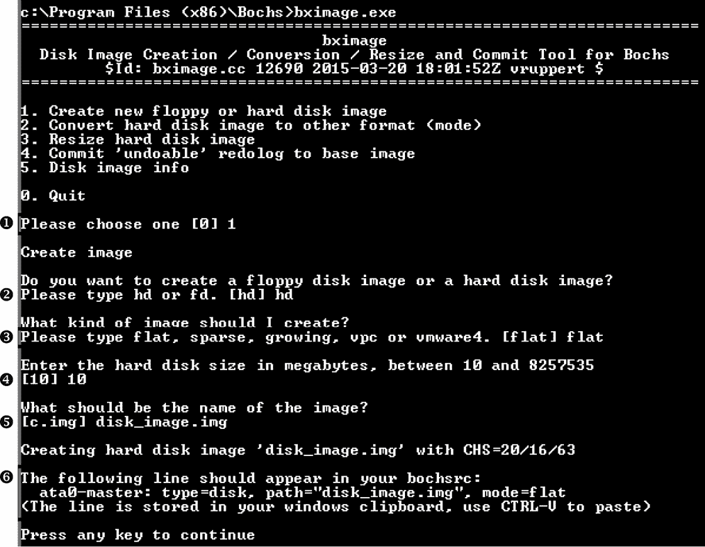

*图 9-1：使用`bximage`工具创建 Bochs 磁盘映像*

接下来，我们需要指定磁盘大小（以兆字节为单位）。你提供的值取决于你使用 Bochs 的目的。如果你想在磁盘映像中安装操作系统，则磁盘大小需要足够大，以存储所有操作系统文件。另一方面，如果你只想将磁盘映像用于调试引导代码，10MB ➍的磁盘大小就足够了。

最后，`bximage`会提示输入映像名称——这是映像将存储在主机文件系统中的文件路径 ➎。如果你只提供文件名而没有完整路径，文件将存储在 Bochs 所在的同一目录中。输入文件名后，Bochs 会创建磁盘映像并输出一个配置字符串 ➏，让你输入到 Bochs 配置文件中的`ata0-master`行中（列表 9-1）。为避免混淆，可以在`bximage`中提供映像文件的完整路径，或者将新创建的映像文件复制到与配置文件相同的目录中。这确保了 Bochs 能够找到并加载映像文件。

#### *感染磁盘映像*

一旦你创建了磁盘映像，我们就可以继续将引导程序感染到磁盘中。我们可以通过两种方式来实现这一点。第一种选择是将一个来宾操作系统安装到 Bochs 磁盘映像中，然后将引导程序感染器执行到来宾环境中。在执行时，恶意软件会将引导程序感染到磁盘映像中。这种方法允许你进行更深入的恶意软件分析，因为恶意软件将所有组件安装到来宾系统中，包括引导程序和内核模式驱动程序。但它也有一些缺点：

+   我们之前创建的磁盘映像必须足够大，以容纳操作系统。

+   在操作系统安装和恶意软件执行过程中，指令的仿真会显著增加执行时间。

+   一些现代恶意软件实现了反仿真功能，意味着恶意软件可以检测到它在仿真器中运行并在不感染系统的情况下退出。

出于这些原因，我们将使用第二种选项：通过从恶意软件中提取启动工具组件（MBR、VBR 和 IPL），并直接将它们写入磁盘镜像来感染磁盘镜像。这种方法需要的磁盘大小显著较小，通常速度也更快。但这也意味着我们无法观察和分析恶意软件的其他组件，如内核模式驱动程序。这种方法还需要一些对恶意软件及其架构的先验了解。因此，我们选择这种方法的另一个原因是，它能让我们更深入地了解在动态分析环境中使用 Bochs。

##### 将 MBR 写入磁盘镜像

确保你已从 *[`nostarch.com/rootkits/`](https://nostarch.com/rootkits/)* 下载并保存 *mbr.mbr* 代码。清单 9-2 展示了将恶意 MBR 写入磁盘镜像的 Python 代码。将其复制到文本编辑器中并保存为外部 Python 文件。

```
# read MBR from file

mbr_file = open("path_to_mbr_file", "rb") ➊

mbr = mbr_file.read()

mbr_file.close()

# write MBR to the very beginning of the disk image

disk_image_file = open("path_to_disk_image", "r+b") ➋

disk_image_file.seek(0)

disk_image_file.write(mbr) ➌

disk_image_file.close()
```

*清单 9-2：将 MBR 代码写入磁盘镜像*

在此示例中，将 MBR 的文件位置替换为 path_to_mbr_file ➊，将磁盘镜像的位置替换为 path_to_disk_image ➋，然后将代码保存为 *.py* 扩展名的文件。现在，执行 `python path_to_the_script_file`.py`，Python 解释器将在 Bochs 中执行该代码。我们写入的 MBR ➌ 仅包含分区表中的一个活动分区（0），如 表 9-1 所示。

**表 9-1：** MBR 分区表

| **分区编号** | **类型** | **起始扇区** | **分区大小（扇区）** |
| --- | --- | --- | --- |
| 0 | 0x80（可启动） | 0x10 ➊ | 0x200 |
| 1 | 0（无分区） | 0 | 0 |
| 2 | 0（无分区） | 0 | 0 |
| 3 | 0（无分区） | 0 | 0 |

接下来，我们需要将 VBR 和 IPL 写入磁盘镜像。确保你从 *[`nostarch.com/rootkits/`](https://nostarch.com/rootkits/)* 下载并保存 *partition0.data* 代码。我们需要将这些模块写入 表 9-1 中指定的偏移量 ➊，该偏移量对应于活动分区的起始偏移。

##### 将 VBR 和 IPL 写入磁盘镜像

要将 VBR 和 IPL 写入磁盘镜像，将 清单 9-3 中的代码复制到文本编辑器中，并将其保存为 Python 脚本。

```
# read VBR and IPL from file

vbr_file = open("path_to_vbr_file", "rb") ➊

vbr = vbr_file.read()

vbr_file.close()

# write VBR and IPL at the offset 0x2000

disk_image_file = open("path_to_disk_image", "r+b") ➋

disk_image_file.seek(0x10 * 0x200)

disk_image_file.write(vbr)

disk_image_file.close()
```

*清单 9-3：将 VBR 和 IPL 写入磁盘镜像*

再次，与 清单 9-2 相同，在运行脚本之前，将 path_to_vbr_file ➊ 替换为包含 VBR 的文件路径，将 path_to_disk_image ➋ 替换为镜像位置。

执行脚本后，我们就有了一个可以在 Bochs 中调试的磁盘镜像。我们已经成功地将恶意 MBR 和 VBR/IPL 写入了镜像，并可以在 Bochs 调试器中分析它们。

#### *使用 Bochs 内部调试器*

Bochs 调试器是一个独立的应用程序，*bochsdbg.exe*，具有命令行界面。我们可以使用 Bochs 调试器支持的功能——例如断点、内存操作、跟踪和代码反汇编——来检查启动代码中的恶意活动或解密多态 MBR 代码。要开始调试会话，请从命令行调用 *bochsdbg.exe* 应用程序，并指定 Bochs 配置文件 *bochsrc.bxrc* 的路径，如下所示：

```
bochsdbg.exe -q -f bochsrc.bxrc
```

该命令启动虚拟机并打开调试控制台。首先，在启动代码的开头设置一个断点，使得调试器在执行 MBR 代码时停下来，从而给我们提供机会分析代码。第一个 MBR 指令位于地址 0x7c00，因此输入命令 lb 0x7c00，将断点设置在指令的开头。要开始执行，我们使用 `c` 命令，如 图 9-2 所示。要查看当前地址处的反汇编指令，我们使用 `u` 调试命令；例如，图 9-2 显示了使用命令 `u /10` 获得的前 10 条反汇编指令。

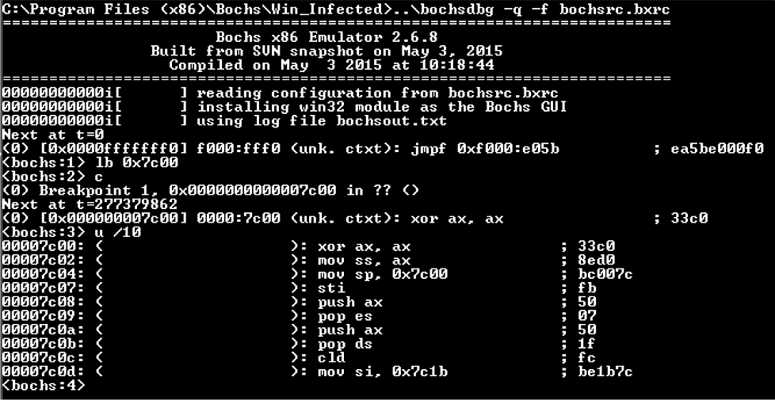

*图 9-2：命令行 Bochs 调试器界面*

你可以通过输入`help`或者访问文档 *[`bochs.sourceforge.net/doc/docbook/user/internal-debugger.html`](http://bochs.sourceforge.net/doc/docbook/user/internal-debugger.html)* 来获取完整的调试器命令列表。以下是一些更常用的命令：

c 继续执行。

s [count] 执行 count 次指令（步进）；默认值为 `1`。

q 退出调试器并停止执行。

**CTRL-C** 停止执行并返回到命令行提示符。

lb addr 设置线性地址指令断点。

info break 显示所有当前断点的状态。

bpe n 启用断点。

bpd n 禁用断点。

del n 删除断点。

尽管我们可以单独使用 Bochs 调试器进行基本的动态分析，但将其与 IDA 结合使用时，我们能做的更多，主要是因为 IDA 中的代码导航功能比批处理模式调试更强大。在 IDA 会话中，我们还可以继续对创建的 IDA Pro 数据库文件进行静态分析，并使用反编译器等功能。

#### *将 Bochs 与 IDA 结合使用*

现在我们已经准备好感染的磁盘镜像，将启动 Bochs 并开始仿真。从版本 5.4 开始，IDA Pro 提供了 DBG 调试器的前端，我们可以与 Bochs 一起使用它来调试来宾操作系统。要在 IDA Pro 中启动 Bochs 调试器，打开 IDA Pro，然后转到 **调试器**▸**运行**▸**本地 Bochs 调试器**。

将会打开一个对话框，询问一些选项，如 图 9-3 所示。在应用程序字段中，指定你之前创建的 Bochs 配置文件的路径。

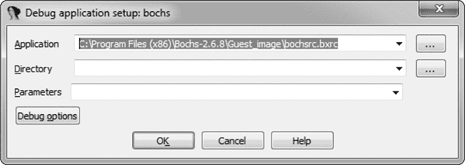

*图 9-3：指定 Bochs 配置文件的路径*

接下来，我们需要设置一些选项。点击 **调试选项**，然后进入 **设置特定选项**。你会看到一个对话框，如图 9-4 所示，提供了三种 Bochs 操作模式的选项：

**磁盘镜像** 启动 Bochs 并执行磁盘镜像。

**IDB** 模拟 Bochs 中选定部分的代码。

**PE** 加载并在 Bochs 中仿真 PE 镜像。

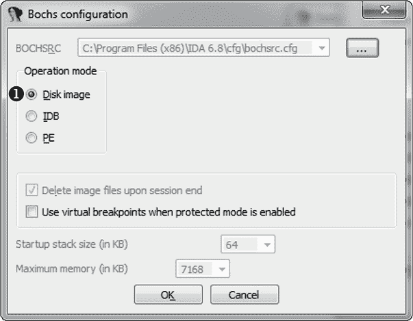

*图 9-4：为 Bochs 选择操作模式*

对于我们的情况，我们选择 **磁盘镜像** ➊，让 Bochs 加载并执行我们之前创建并感染的磁盘镜像。

接下来，IDA Pro 会使用我们指定的参数启动 Bochs，并且由于我们之前设置了断点，它将在 MBR 的第一个指令执行时（地址 0000:7c00h）触发中断。然后，我们可以使用标准的 IDA Pro 调试器界面来调试引导组件（见图 9-5）。

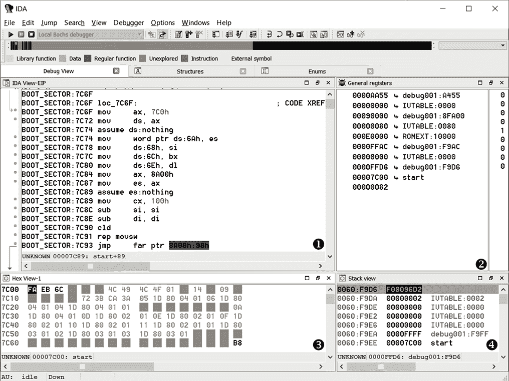

*图 9-5：在 Bochs 虚拟机中从 IDA 界面调试 MBR*

在图 9-5 中呈现的界面比 Bochs 调试器提供的命令行界面（如图 9-2 所示）更为用户友好。你可以在一个窗口中看到引导代码的反汇编 ➊、CPU 寄存器的内容 ➋、内存转储 ➌ 和 CPU 堆栈 ➍。这大大简化了引导代码调试的过程。

### 使用 VMware Workstation 虚拟化

IDA Pro 和 Bochs 是进行引导代码分析的强大组合。但是，有时使用 Bochs 调试操作系统引导过程不稳定，并且仿真技术存在一些性能限制。例如，进行恶意软件的深入分析需要你创建一个预安装操作系统的磁盘镜像。由于仿真的特性，这一步骤可能会非常耗时。Bochs 还缺少一个方便的系统来管理仿真环境的快照，而这一功能在恶意软件分析中是不可或缺的。

对于更稳定和高效的调试，我们可以使用 VMware 的内部 GDB 调试接口与 IDA 结合使用。在这一部分，我们介绍 VMware GDB 调试器，并演示如何设置调试会话。接下来的几章将讨论调试 Microsoft Windows 引导加载程序的具体方法，重点讲解 MBR 和 VBR 启动工具包。我们还将从调试的角度看如何从实模式切换到保护模式。

VMware Workstation 是一个强大的工具，用于复制操作系统和环境。它允许我们创建具有客户操作系统的虚拟机，并在与主操作系统相同的机器上运行它们。客户操作系统和主操作系统将互不干扰，就像它们运行在两台不同的物理机器上一样。这对于调试非常有用，因为它使得在同一主机上运行两个程序——调试器和被调试的应用程序——变得容易。在这方面，VMware Workstation 与 Bochs 非常相似，区别在于后者模拟 CPU 指令，而 VMware Workstation 则在物理 CPU 上执行这些指令。因此，虚拟机中执行的代码比在 Bochs 中执行的要快。

最近版本的 VMware Workstation（6.5 版本及之后的版本）包括一个 GDB 存根，用于调试在 VMware 中运行的虚拟机。这使我们能够从虚拟机执行的最开始阶段进行调试，甚至在 BIOS 执行 MBR 代码之前就可以开始调试。从 5.4 版本开始，IDA Pro 包括一个调试模块，支持 GDB 调试协议，我们可以与 VMware 一起使用它。

在编写本章内容时，VMware Workstation 有两个版本可供选择：专业版（商业版）和 Workstation Player（免费版）。专业版提供扩展功能，包括创建和编辑虚拟机的能力，而 Workstation Player 仅允许用户运行虚拟机或修改其配置。但两个版本都包括 GDB 调试器，我们可以使用这两者进行引导程序分析。本章中，我们将使用专业版，这样我们就可以创建虚拟机。

**注意**

*在你开始使用 VMware GDB 调试器之前，需要使用 VMware Workstation 创建一个虚拟机实例，并在其上预先安装操作系统。创建虚拟机的过程超出了本章的讨论范围，但你可以在文档中找到所有必要的信息，文档地址为* [`www.vmware.com/pdf/desktop/ws90-using.pdf`](https://www.vmware.com/pdf/desktop/ws90-using.pdf)。

#### *配置 VMware Workstation*

一旦你创建了虚拟机，VMware Workstation 会将虚拟机镜像和配置文件放置在用户指定的目录中，我们将其称为虚拟机的目录。

要使 VMware 与 GDB 一起工作，首先需要在虚拟机的配置文件中指定某些配置选项，配置文件如 列表 9-4 所示。虚拟机的配置文件是一个文本文件，扩展名为 *.vmx*，它位于虚拟机的目录中。用你喜欢的文本编辑器打开该文件，并复制 列表 9-4 中的参数。

```
➊ debugStub.listen.guest32 = "TRUE"

➋ debugStub.hideBreakpoints= "TRUE"

➌ monitor.debugOnStartGuest32 = "TRUE"
```

*列表 9-4：在虚拟机中启用 GDB 存根*

第一个选项 ➊ 允许从本地主机进行来宾调试。它启用了 VMware GDB 存根，允许我们将支持 GDB 协议的调试器附加到被调试的虚拟机。如果我们的调试器和虚拟机运行在不同的机器上，则需要启用远程调试，命令为`debugStub.listen.guest32.remote`。

第二个选项 ➋ 启用使用硬件断点而不是软件断点。硬件断点使用 CPU 调试设施——即调试寄存器`dr0`到`dr7`——而实现软件断点通常涉及执行`int 3`指令。在恶意软件调试的上下文中，这意味着硬件断点更具韧性，更难以被检测到。

最后一个选项 ➌ 指示 GDB 在 CPU 执行第一条指令时中断调试器——即虚拟机启动后立即中断。如果跳过此配置选项，VMware Workstation 将开始执行启动代码，而不会在其上中断，因此我们将无法调试它。

**32 位或 64 位调试**

选项`debugStub.listen.guest32`和`debugStub.debugOnStartGuest32`中的后缀 32 表示正在调试 32 位代码。如果需要调试 64 位操作系统，可以使用`debugStub.listen.guest64`和`debugStub.debugOnStartGuest64`选项。然而，对于以 16 位实模式运行的预启动代码（MBR/VBR），32 位或 64 位选项均可使用。

#### *将 VMware GDB 与 IDA 结合使用*

配置完虚拟机后，我们可以继续启动调试会话。首先，在 VMware Workstation 中启动虚拟机，转到菜单并选择**虚拟机**▸**电源**▸**打开电源**。

接下来，我们将运行 IDA Pro 调试器并附加到虚拟机。选择**调试器**并转到**附加**▸**远程 GDB 调试器**。

现在我们需要配置调试选项。首先，我们指定目标的主机名和端口。由于我们在同一主机上运行虚拟机，因此将主机名指定为 localhost（如图 9-6 所示），端口号为 8832。这是当我们在虚拟机配置文件中使用`debugStub.listen.guest32`时，GDB 存根将监听的端口（如果我们在配置文件中使用`debugStub.listen.guest64`，则端口号为`8864`）。其余调试参数可以保留默认值。

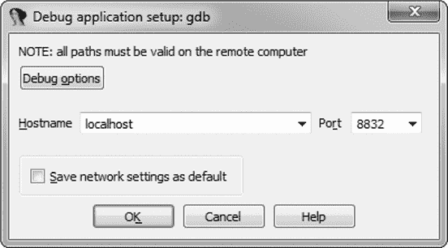

*图 9-6：指定 GDB 参数*

所有选项设置完毕后，IDA Pro 会尝试附加到目标，并建议一个可以附加的进程列表。由于我们已经开始调试预启动组件，应该选择**<附加到目标上启动的进程>**，如图 9-7 所示。

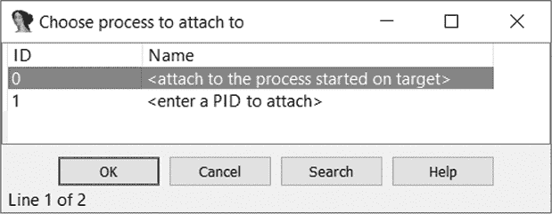

*图 9-7：选择目标进程*

此时，IDA Pro 会附加到虚拟机并在执行第一条指令时中断。

##### 配置内存段

在继续之前，我们需要更改调试器为我们创建的内存段的类型。当我们开始调试会话时，IDA Pro 创建了一个 32 位的内存段，如图 9-8 所示。

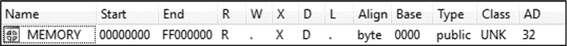

*图 9-8：IDA Pro 中内存段的参数*

在预启动环境中，CPU 以实模式运行，因此为了正确地反汇编代码，我们需要将该段从 32 位更改为 16 位。为此，右键单击目标段并选择 **更改段属性**。在出现的对话框中，在段位数面板中选择 **16 位** ➊，如图 9-9 所示。

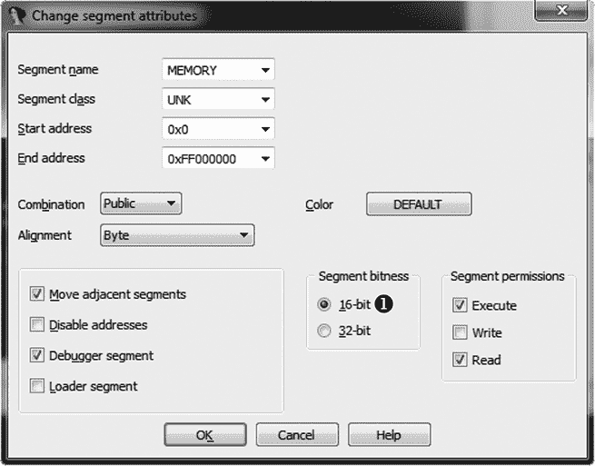

*图 9-9：更改内存段的位数*

这将使该段变为 16 位，启动组件中的所有指令将会被正确地反汇编。

##### 运行调试器

设置好所有正确的选项后，我们可以继续进行 MBR 加载。由于调试器在执行开始时就已附加到虚拟机，因此 MBR 代码尚未加载。为了加载 MBR 代码，我们在代码开始处的地址 0000:7c00h 设置断点，然后继续执行。要设置断点，进入反汇编窗口中的地址 0000:7c00h，然后按 F2。这将显示带有断点参数的对话框（见图 9-10）。

Location 文本框 ➊ 指定将设置断点的地址：0x7c00，对应虚拟地址 0000:7c00h。在设置区域 ➋，我们选择启用和硬件复选框选项。选中启用框表示断点处于激活状态，一旦执行流程到达 Location 文本框中指定的地址，断点就会被触发。选中硬件框表示调试器将使用 CPU 的调试寄存器来设置断点，并且它还会激活硬件断点模式选项 ➌，该选项指定断点的类型。在我们的情况下，我们选择执行来为地址 0000:7c00h 设置一个执行指令的断点。其他类型的硬件断点用于在指定位置读取和写入内存，但在此不需要。Size 下拉菜单 ➍ 指定了控制的内存大小。我们可以保留默认值 1，表示断点将仅控制地址 0000:7c00h 处的 1 字节内存。设置完这些参数后，点击 **确定**，然后按 F9 继续执行。

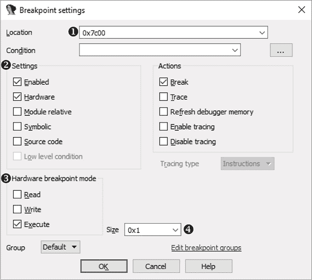

*图 9-10：断点设置对话框*

一旦 MBR 加载并执行，调试器会中断。调试器窗口如图 9-11 所示。

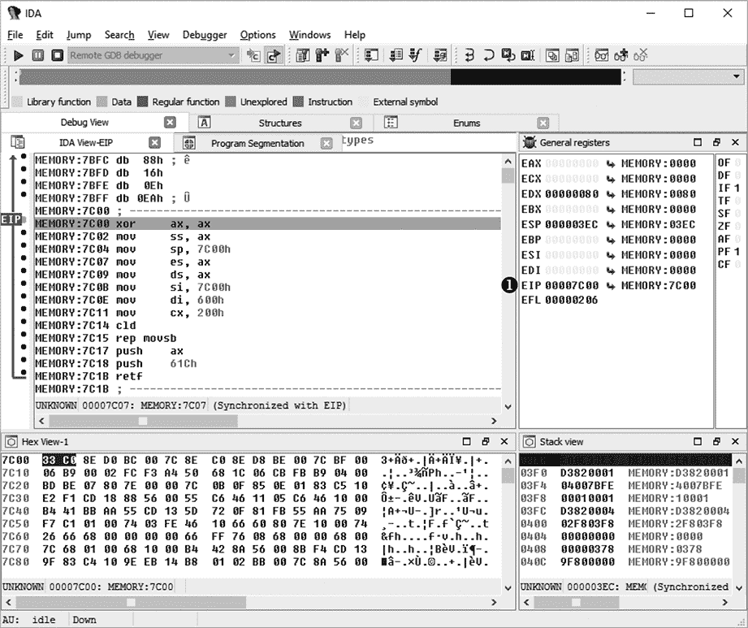

*图 9-11：IDA Pro 调试器界面*

到目前为止，我们已经来到了 MBR 代码的第一条指令，指令指针寄存器➊指向 0000:7c00h。我们可以在内存转储窗口和反汇编中看到 MBR 已经成功加载。从这里开始，我们可以继续调试 MBR 代码，逐步执行每条指令。

**注意**

*本节的目的是简单地向你介绍使用 VMware Workstation GDB 调试器与 IDA Pro 结合的可能性，因此我们不会在本章中深入探讨如何使用 GDB 调试器。你将在接下来的几章中找到更多关于它的使用信息，特别是在分析 Rovnix 引导工具包时。*

### Microsoft Hyper-V 和 Oracle VirtualBox

本章没有涉及 Hyper-V 虚拟机管理器，它是微软自 Windows 8 以来的客户端操作系统的一部分，也没有涉及 VirtualBox 开源虚拟机管理器（VMM）。这是因为在撰写本书时，两个程序都没有提供足够早的调试接口，无法满足引导代码恶意软件分析的要求。

在本书发布时，微软的 Hyper-V 是唯一能够支持启用安全启动的虚拟机的虚拟化软件，这可能是没有为启动过程早期阶段提供调试接口的原因之一。我们将在第十七章中深入探讨安全启动技术及其漏洞。我们在这里提到这两个程序，是因为它们在恶意软件分析中被广泛使用，但它们缺乏早期启动过程的调试接口，这是我们偏好使用 VMware Workstation 进行恶意引导代码调试的主要原因。

### 结论

在本章中，我们演示了如何使用 Bochs 模拟器和 VMware Workstation 调试引导工具包的 MBR 和 VBR 代码。这些动态分析技巧对于深入了解恶意引导代码时非常有用，补充了你在静态分析中可能使用的方法，帮助回答静态分析无法解答的问题。

我们将在第十一章中再次使用这些工具和方法来分析 Rovnix 引导工具包，其架构和功能过于复杂，以至于静态分析方法无法有效。

### 练习

我们为你提供了一系列练习，供你测试本章所学的技能。你将从一个 MBR、一个 VBR/IPL 和一个新技术文件系统（NTFS）分区构建一个 PC 的 Bochs 镜像，然后使用 IDA Pro 的 Bochs 前端进行动态分析。首先，你需要在* [`nostarch.com/rootkits/`](https://nostarch.com/rootkits/)* 下载以下资源。

***mbr.mbr*** 一个包含 MBR 的二进制文件

***partition0.data*** 一个 NTFS 分区镜像，包含 VBR 和 IPL

***bochs.bochsrc*** Bochs 配置文件

你还需要 IDA Pro 反汇编器、Python 解释器和 Bochs 模拟器。使用这些工具和本章中涵盖的信息，你应该能够完成以下练习：

1.  创建 Bochs 镜像并调整提供的模板配置文件*bochs.bochsrc*中的值，使其匹配清单 9-1。使用“创建磁盘镜像”中描述的`bximage`工具，在第 118 页上创建一个 10MB 的扁平镜像。然后将镜像存储在文件中。

1.  编辑模板配置文件中的`ata0-master`选项，以使用练习 1 中的镜像。使用清单 9-1 中提供的参数。

1.  准备好 Bochs 镜像后，将 MBR 和 VBR 启动工具组件写入镜像中。首先，在 IDA Pro 中打开*mbr.mbr*文件并进行分析。观察到 MBR 的代码是加密的。定位解密例程并描述其算法。

1.  分析 MBR 的分区表并尝试回答以下问题：有多少个分区？哪个是活动分区？该活动分区在硬盘的哪个位置？它从硬盘开始的位置偏移是多少，它的大小是多少扇区？

1.  定位到活动分区后，使用清单 9-2 中的 Python 脚本将*mbr.mbr*文件写入 Bochs 镜像。使用清单 9-3 中的 Python 脚本将*partition0.data*文件写入 Bochs 镜像，并放置在上一个练习中找到的偏移位置。完成此任务后，你将拥有一个感染了的 Bochs 镜像，准备好进行模拟。

1.  使用新编辑的*bochs.bochsrc*配置启动 Bochs 模拟器，并使用第 123 页上描述的 IDA Pro 前端，在“将 Bochs 与 IDA 结合使用”中启动。IDA Pro 调试器应该在执行时触发断点。设置断点在地址 0000:7c00h 处，该地址对应 MBR 代码将被加载的位置。

1.  当命中地址 0000:7c00h 处的断点时，检查 MBR 的代码是否仍然是加密的。设置早前识别出的解密例程的断点并恢复执行。当解密例程的断点被触发时，追踪它直到所有 MBR 代码完全解密。将解密后的 MBR 转储到文件中，以便进一步的静态分析。（有关 MBR 静态分析技术，请参阅第八章）。
