## IPL 引导工具：ROVNIX 和 CARBERP**


Rovnix 的分发始于 2011 年底，这是第一个已知的感染可启动硬盘的活动分区 IPL 代码的引导工具。当时的安全产品已经进化到能够监控 MBR，如第十章中所讨论的，用以防御如 TDL4 和 Olmasco 等引导工具。因此，Rovnix 的出现对安全软件构成了挑战。由于 Rovnix 进一步深入了引导过程，感染了在 VBR 代码之后执行的 IPL 代码（见第五章），它在几个月内未被察觉，直到安全行业跟进。

在本章中，我们将通过研究 Rovnix 如何感染目标系统并绕过内核模式签名策略来加载恶意内核模式驱动程序，专注于 Rovnix 引导工具框架的技术细节。我们将特别关注恶意 IPL 代码，并使用 VMware 和 IDA Pro GDB 进行调试，如第九章所讨论的。最后，我们将看到 Rovnix 在野外的实现：Carberp 银行木马，它使用了 Rovnix 的修改版本在受害者机器上保持持久性。

### Rovnix 的演变

Rovnix 首次在一个私人地下论坛上广告宣传，如图 11-1 所示，作为一个具有广泛功能的新 Ring0 捆绑软件。

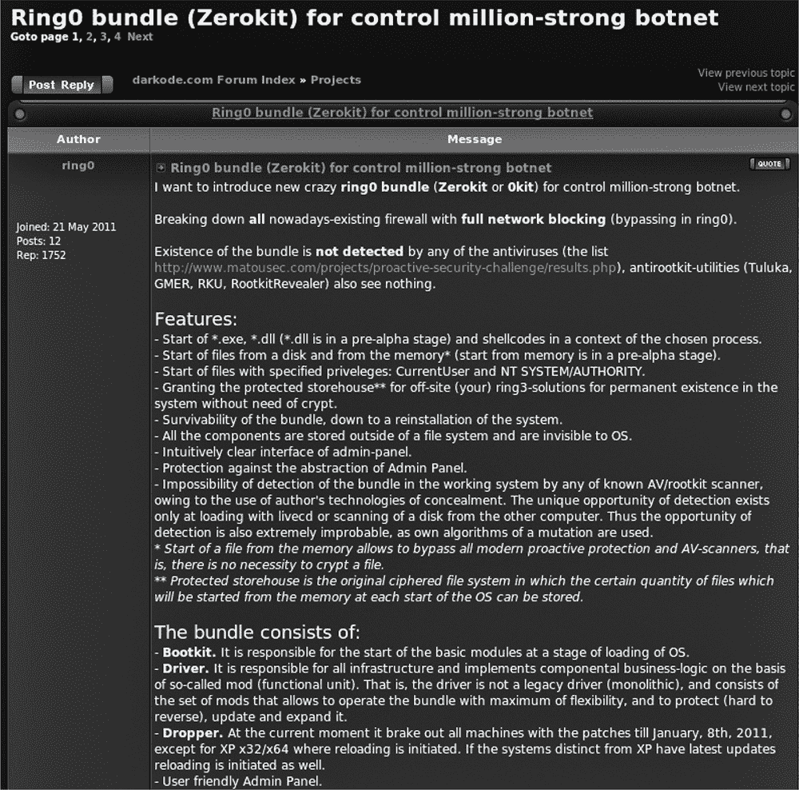

*图 11-1：Rovnix 在私人地下论坛上的广告*

它具有模块化架构，这使其对恶意软件开发者和分发者非常有吸引力。开发者似乎更专注于销售该框架，而不是分发和使用恶意软件。

自首次在野外出现以来，Rovnix 经历了多个迭代。本章将重点介绍撰写时的最新版本，但我们也会提及早期版本，以帮助你了解其发展过程。

Rovnix 的早期版本使用简单的 IPL 感染器，将有效负载注入到引导进程的用户模式地址空间中。所有早期版本的恶意 IPL 代码相同，因此安全行业能够迅速开发出使用简单静态签名的检测方法。

Rovnix 的后续版本通过实施*多态*恶意 IPL 代码，使这些检测方法变得无效。Rovnix 还增加了一个新特性：一个隐藏的文件系统，用于秘密存储其配置数据、有效负载模块等。受到类似 TDL4 引导工具的启发，Rovnix 还开始实现监控对感染硬盘的读写请求的功能，从而使得从系统中移除恶意软件变得更加困难。

后来的一个版本添加了一个隐藏的通信通道，使 Rovnix 能够与远程 C&C 服务器交换数据，并绕过个人防火墙和主机入侵防护系统（HIPS）执行的流量监控。

在这一点上，我们将把注意力转向本写作时已知的最新 Rovnix 修改版本（也称为 Win32/Rovnix.D），并详细讨论其特性。

### Bootkit 架构

首先，我们将从高层次角度考虑 Rovnix 的架构。图 11-2 展示了 Rovnix 的主要组件及其相互关系。

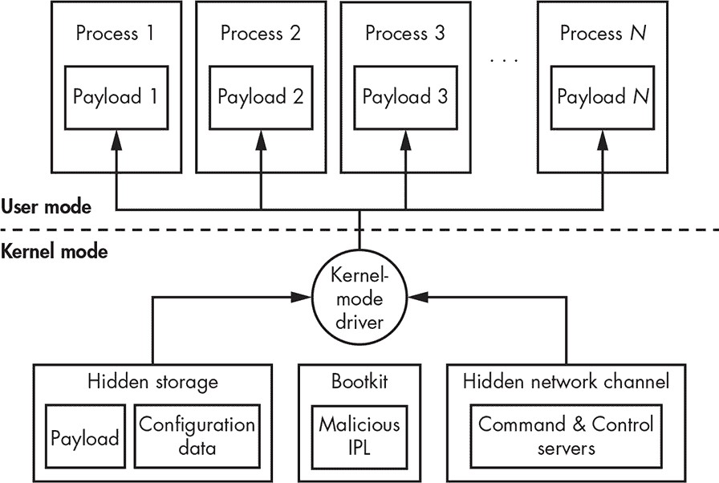

*图 11-2：Rovnix 架构*

Rovnix 的核心是一种恶意的内核模式驱动程序，其主要目的是将有效负载模块注入系统中的进程。Rovnix 可以持有多个有效负载，以便注入到不同的进程中。一个这样的有效负载示例是银行木马，它创建伪造交易，如本章后面讨论的 Carberp 木马。Rovnix 默认在恶意内核模式驱动程序中硬编码了一个有效负载模块，但它能够通过隐藏的网络通道（在 “隐藏通信通道” 章节的 第 169 页中讨论）从远程 C&C 服务器下载额外的模块。内核模式驱动程序还实现了隐藏存储，用于存储下载的有效负载和配置信息（在 “隐藏文件系统” 章节的 第 167 页中有详细讨论）。

### 感染系统

让我们继续分析 Rovnix，通过剖析其感染算法，如图 11-3 所示。


*图 11-3：Rovnix 投放器感染算法*

Rovnix 首先通过访问系统注册表项 *HKLM\Software\Classes\CLSID\<XXXXXXXX-XXXX-XXXX-XXXX-XXXXXXXXXXXX>* 来检查系统是否已被感染，其中 *X* 是根据文件系统卷序列号生成的。如果此注册表项存在，则意味着系统已经被 Rovnix 感染，恶意软件会终止并从系统中删除自身。

如果系统尚未感染，Rovnix 会查询操作系统的版本。为了获得硬盘的低级访问权限，恶意软件需要管理员权限。在 Windows XP 中，普通用户默认被授予管理员权限，因此如果操作系统是 XP，Rovnix 可以作为普通用户继续运行，而无需检查权限。

然而，在 Windows Vista 中，微软引入了一个新的安全功能——*用户帐户控制（UAC）*——它会降低以管理员帐户运行的应用程序的权限。因此，如果操作系统是 Vista 或更高版本，Rovnix 需要检查管理员权限。如果没有管理员权限运行，Rovnix 会通过使用 `ShellExecuteEx` API 和 `runas` 命令重新启动自身以提升权限。启动器的清单包含一个 `requireAdministrator` 属性，因此 `runas` 尝试以提升的权限执行启动器。在启用了 UAC 的系统上，会弹出一个对话框，询问用户是否授权程序以管理员权限运行。如果用户选择“是”，恶意软件将以提升的权限启动并感染系统。如果用户选择“否”，恶意软件将不会执行。如果系统没有启用 UAC 或 UAC 被禁用，恶意软件将以当前帐户的权限运行。

一旦获得所需的权限，Rovnix 通过使用本地 API 函数 `ZwOpenFile`、`ZwReadFile` 和 `ZwWriteFile` 获取对硬盘的低级访问权限。

恶意软件首先使用 `ZwOpenFile` 调用 *\??\PhysicalDrive0* 作为文件名，返回一个与硬盘对应的句柄。然后，Rovnix 使用返回的句柄与 `ZwReadFile` 和 `ZwWriteFile` 函数来读取和写入硬盘上的数据。

为了感染系统，恶意软件扫描硬盘的 MBR 中的分区表，然后读取活动分区的 IPL，并通过 aPlib 压缩库减小其大小。接下来，Rovnix 通过将恶意加载程序代码附加到压缩后的合法 IPL 前面，创建一个新的恶意 IPL，如 图 11-4 所示。

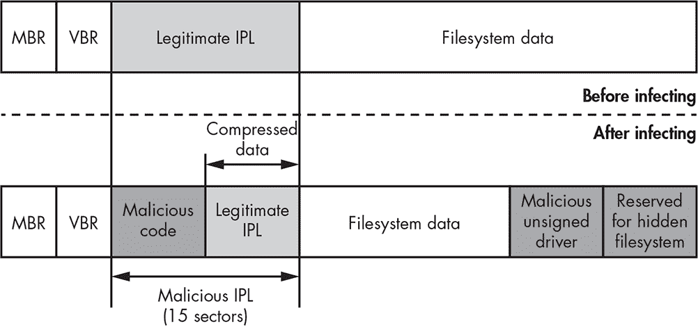

*图 11-4：Rovnix 感染前后的硬盘布局*

在修改 IPL 后，Rovnix 将一个恶意的内核模式驱动程序写入硬盘的末尾，供恶意的 IPL 代码在系统启动时加载。该恶意软件在硬盘的末尾保留了一些空间，用于隐藏的文件系统，稍后我们将在本章中详细描述。

**APLIB**

aPlib 是一个小型压缩库，主要用于压缩可执行代码。它基于用于打包可执行文件的 aPack 软件中的压缩算法。该库的一个显著特点是具有良好的压缩：速度比，并且解压器占用空间小，这在启动前环境中尤其重要，因为该环境内存较小。aPlib 压缩库在恶意软件中也被广泛用于打包和混淆有效载荷。

最后，Rovnix 创建了系统注册表项，以标记系统为已感染，并通过调用 `ExitWindowsEx` Win32 API，并使用参数 `EWX_REBOOT | EWX_FORCE` 发起重启。

### 感染后启动过程与 IPL

一旦 Rovnix 感染了机器并强制重启，BIOS 启动代码照常继续，加载并执行启动硬盘上未修改的 MBR。MBR 找到硬盘上的活动分区，并执行合法且未修改的 VBR。VBR 随后加载并执行感染的 IPL 代码。

#### *实现多态解密器*

被感染的 IPL 以一个小的解密器开始，其目的是解密其余的恶意 IPL 代码并执行它（图 11-5）。解密器的多态性意味着每个 Rovnix 实例都带有定制的解密器代码。

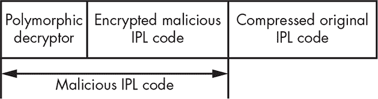

*图 11-5：感染的 IPL 布局*

让我们看看解密器是如何实现的。在分析实际的多态代码之前，我们将先给出解密算法的一般描述。解密器按以下流程解密恶意 IPL 的内容：

1.  分配内存缓冲区来存储解密后的代码。

1.  初始化解密密钥和解密计数器——分别是加密数据的偏移量和大小。

1.  将 IPL 代码解密到已分配的缓冲区中。

1.  在执行解密后的代码之前初始化寄存器。

1.  将控制权转移到解密后的代码。

为了定制解密例程，Rovnix 随机将其拆分成 *基本块*（一组没有分支的连续指令），每个基本块包含少量的汇编指令。然后 Rovnix 将这些基本块进行洗牌并随机重新排序，通过 `jmp` 指令连接它们，如图 11-6 所示。结果是每个 Rovnix 实例都有一个定制的解密代码。


*图 11-6：多态解密器的生成*

这个多态机制与一些现代恶意软件中采用的代码混淆技术相比其实相当简单，但由于每次 Rovnix 的实例中例程的字节模式都会变化，它足以避免使用静态签名的安全软件检测。

多态性并非无懈可击，其中一种最常见的应对方法是软件仿真。在仿真中，安全软件应用行为模式来检测恶意软件。

#### *使用 VMware 和 IDA Pro 解密 Rovnix 启动加载程序*

让我们来看一下使用 VMware 虚拟机和 IDA Pro 的实际解密例程实现。关于如何设置 VMware 和 IDA Pro 的所有必要信息，可以在第九章中找到。在本示范中，我们将使用一个已感染 Win32/Rovnix.D 启动木马的 VMware 镜像，你可以从 *[`nostarch.com/rootkits`](https://nostarch.com/rootkits)* 下载该文件 *bootkit_files.zip*。

我们的目标是通过动态分析获取解密后的恶意 IPL 代码。我们将引导你完成调试过程，快速跳过 MBR 和 VBR 步骤，重点分析多态 IPL 解密程序。

##### 观察 MBR 和 VBR 代码

返回到 “将 VMware GDB 与 IDA 结合使用” 第 126 页，并按照那里的步骤解密来自 *bootkit_files.zip* 的 MBR。你会在地址 0000:7c00h 处找到 MBR 代码。在图 11-7 中，地址 0000:7c00h 被表示为 `MEMORY:7c00h`，因为 IDA Pro 显示的是段名（在我们的例子中是 `MEMORY`），而不是段基址 0000h。由于 Rovnix 感染的是 IPL 代码而不是 MBR，调试器中显示的 MBR 代码是合法的，我们不需要深入研究它。

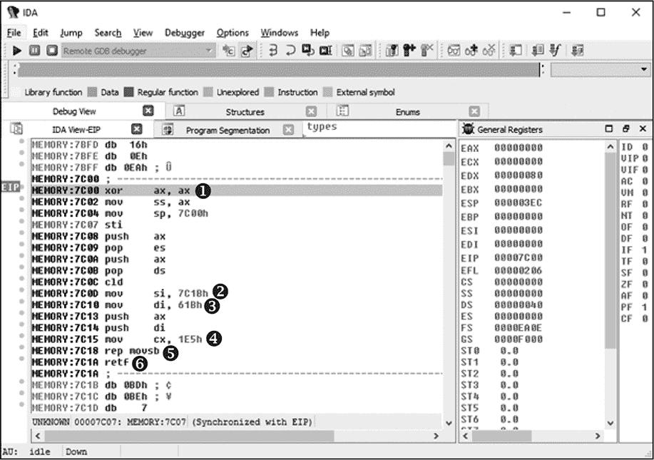

*图 11-7：MBR 代码的开头*

这个程序代码将 MBR 移动到另一个内存地址，以回收位于 0000:7c00h 的内存，用于读取和存储活动分区的 VBR。寄存器 `si` ➋ 被初始化为值 `7C1h`，对应源地址，寄存器 `di` ➌ 被初始化为值 `61Bh`，对应目标地址。寄存器 `cx` ➍ 被初始化为 `1E5h`，即要复制的字节数，`rep movsb` 指令 ➎ 执行字节复制。`retf` 指令 ➏ 将控制转移到复制后的代码。

此时，指令指针寄存器 `ip` 指向地址 0000:7c00h ➊。通过按 **F8** 执行列出的每条指令，直到到达最后一条 `retf` 指令 ➏。执行 `retf` 后，控制转移到刚刚复制到地址 0000:061Bh 的代码——即主 MBR 程序，其目的是查找 MBR 分区表中活动分区并加载其第一个扇区，即 VBR。

VBR 也保持不变，因此我们将继续下一步，直接在该程序的末尾设置断点。位于地址 0000:069Ah 的 `retf` 指令将控制直接转移到活动分区的 VBR 代码，因此我们将在 `retf` 指令处设置断点（如图 11-8 所示）。将光标移动到该地址，按 **F2** 切换断点。如果按 F2 后出现对话框，只需点击 **OK** 以使用默认值。

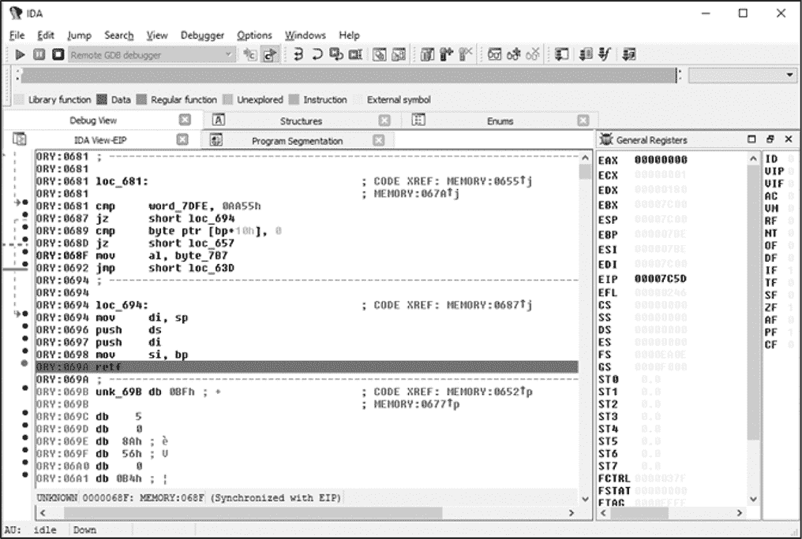

*图 11-8：在 MBR 代码的末尾设置断点*

设置断点后，按 **F9** 继续分析，直到达到断点。这将执行主 MBR 程序。当执行到达断点时，VBR 已经被读取到内存中，我们可以通过执行 `retf`（F8）指令来进入 VBR。

VBR 代码以 `jmp` 指令开始，该指令将控制转移到读取 IPL 代码到内存并执行它的例程。该例程的反汇编显示在 图 11-9 中。为了直接跳转到恶意 IPL 代码，请在 VBR 例程的最后一条指令（地址 0000:7C7Ah ➊）设置断点，然后再次按 **F9** 释放控制。一旦执行到达断点，调试器会在 `retf` 指令处中断。执行此指令（按 **F8**）以跳转到恶意 IPL 代码。

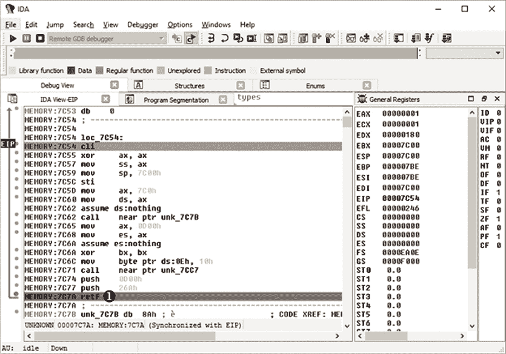

*图 11-9：VBR 代码*

##### 解剖 IPL 多态解密器

恶意 IPL 代码以一系列指令开始，这些指令位于基本块中，负责在执行解密器之前初始化寄存器。之后是一个调用指令，控制转移到 IPL 解密器。

解密器第一个基本块的代码（见 清单 11-1）获取恶意 IPL 在内存中的基本地址 ➊，并将其存储在栈中 ➋。位于 ➌ 的 `jmp` 指令将控制转移到第二个基本块（回顾 图 11-6）。

```
MEMORY:D984 pop     ax

MEMORY:D985 sub     ax, 0Eh ➊

MEMORY:D988 push    cs

MEMORY:D989 push    ax ➋

MEMORY:D98A push    ds

MEMORY:D98B jmp     short loc_D9A0 ➌
```

*清单 11-1：多态解密器的基本块 1*

第二个和第三个基本块都实现了解密算法的单步操作——内存分配——因此它们一起显示在 清单 11-2 中。

```
; Basic Block #2

MEMORY:D9A0 push    es

MEMORY:D9A1 pusha

MEMORY:D9A2 mov     di, 13h

MEMORY:D9A5 push    40h ; '@'

MEMORY:D9A7 pop     ds

MEMORY:D9A8 jmp     short loc_D95D

--snip--

; Basic Block #3

MEMORY:D95D mov     cx, [di]

MEMORY:D95F sub     ecx, 3 ➊

MEMORY:D963 mov     [di], cx

MEMORY:D965 shl     cx, 6

MEMORY:D968 push    cs

MEMORY:D98B jmp     short loc_D98F ➋
```

*清单 11-2：多态解密器的基本块 2 和 3*

该代码分配了 3KB 的内存（请参见 第五章 关于实模式下内存分配的内容），并将内存的地址存储在 `cx` 寄存器中。分配的内存将用于存储解密后的恶意 IPL 代码。然后，代码从地址 0040:0013h 读取实执行模式下的总可用内存，并将值减去 3KB ➊。位于 ➋ 的 `jmp` 指令将控制转移到下一个基本块。

基本块 4 至 8，如 清单 11-3 所示，实现了解密密钥和解密计数器的初始化，以及解密循环。

```
   ; Basic Block #4

   MEMORY:D98F pop     ds

   MEMORY:D990 mov     bx, sp

   MEMORY:D992 mov     bp, 4D4h

   MEMORY:D995 jmp     short loc_D954

   --snip--

   ; Basic Block #5

   MEMORY:D954 push    ax

   MEMORY:D955 push    cx

   MEMORY:D956 add     ax, 0Eh

➊ MEMORY:D959 mov     si, ax

   MEMORY:D95B jmp     short loc_D96B

   --snip--

   ; Basic Block #6

   MEMORY:D96B add     bp, ax

   MEMORY:D96D xor     di, di

➋ MEMORY:D96F pop     es

   MEMORY:D970 jmp     short loc_D93E

   --snip--

   ; Basic Block #7

➌ MEMORY:D93E mov     dx, 0FCE8h

   MEMORY:D941 cld

➍ MEMORY:D942 mov     cx, 4C3h

   MEMORY:D945 loc_D945:

➎ MEMORY:D945 mov     ax, [si]

➏ MEMORY:D947 xor     ax, dx

   MEMORY:D949 jmp     short loc_D972

   --snip--

   ; Basic Block #8

➐ MEMORY:D972 mov     es:[di], ax

   MEMORY:D975 add     si, 2

   MEMORY:D978 add     di, 2

   MEMORY:D97B loop    loc_D945

   MEMORY:D97D pop     di

   MEMORY:D97E mov     ax, 25Eh

   MEMORY:D981 push    es

➑ MEMORY:D982 jmp     short loc_D94B
```

*清单 11-3：多态解密器的基本块 4 至 8*

在地址 0000:D959h，`si` 寄存器被初始化为加密数据的地址 ➊。位于 ➋ 的指令初始化 `es` 和 `di` 寄存器，指向存储解密数据的缓冲区地址。位于地址 0000:D93Eh ➌ 的 `dx` 寄存器被初始化为解密密钥 `0FCE8h`，`cx` 寄存器则初始化为解密循环中要执行的 XOR 操作次数 ➍。在每次 XOR 操作中，2 字节的加密数据与解密密钥进行异或运算，因此 `cx` 寄存器的值等于 `number_of_bytes_to_decrypt` 除以 2。

解密循环中的指令从源地址 ➎ 读取 2 个字节，将其与密钥 ➏ 做异或运算，并将结果写入目标缓冲区 ➐。解密步骤完成后，`jmp` 指令 ➑ 会将控制权转移到下一个基本块。

基本块 9 到 11 实现了寄存器初始化，并将控制权转交给解密代码（列表 11-4）。

```
   ; Basic Block #9

   MEMORY:D94B push    ds

   MEMORY:D94C pop     es

   MEMORY:D94D mov     cx, 4D4h

   MEMORY:D950 add     ax, cx

   MEMORY:D952 jmp     short loc_D997

   --snip--

   ; Basic Block #10

   MEMORY:D997 mov     si, 4B2h

➊ MEMORY:D99A push    ax

   MEMORY:D99B push    cx

   MEMORY:D99C add     si, bp

   MEMORY:D99E jmp     short loc_D98D

   --snip--

   ; Basic Block #11

   MEMORY:D98D pop     bp

➋ MEMORY:D98E retf
```

*列表 11-4：多态解密器的基本块 9 到 11*

地址 ➊ 处的指令将解密后的 IPL 代码存储在栈地址中，`retf` ➋ 从栈中弹出该地址，并将控制权转移到该地址。

为了获取解密后的 IPL 代码，我们需要确定解密数据缓冲区的地址。为此，我们在 列表 11-3 中的指令 ➋ 后紧接着设置一个断点，地址为 0000:D970h，并释放控制，如 图 11-10 所示。

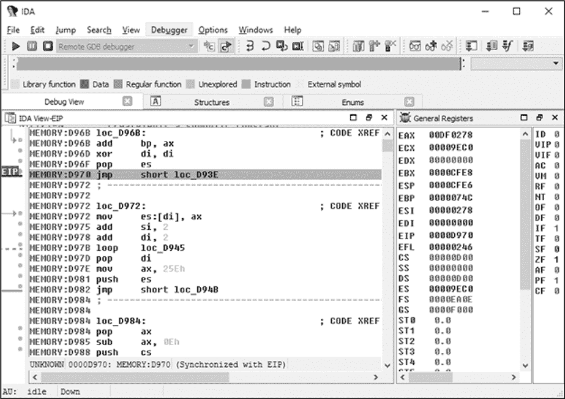

*图 11-10：在 IDA Pro 中设置断点*

接下来，我们将在地址 0000:D98Eh 处设置一个断点（列表 11-4 中的➋），这是多态解密器的最后一条指令，并让其余的解密器代码继续执行。一旦调试器在这个地址断开，我们执行最后的 `retf` 指令，这会直接将我们引导到地址 9EC0:0732h 处的解密代码。

此时，恶意 IPL 代码已在内存中解密，可以进行进一步分析。请注意，解密后，恶意 IPL 的第一个例程并不位于解密缓冲区的开始处（地址 9EC0:0000h），而是位于偏移量 732h 处，这是由于恶意 IPL 的布局。如果你想将缓冲区的内容从内存转储到磁盘文件以进行静态分析，你应该从地址 9EC0:0000h 开始转储，这里是缓冲区的起始位置。

#### *通过修补 Windows 引导加载器来控制*

Rovnix 的 IPL 代码的主要目的是加载一个恶意的内核模式驱动程序。恶意引导代码与操作系统引导加载器组件紧密协作，并遵循从启动过程一开始，到处理器执行模式切换，再到操作系统内核加载的执行流程。加载器在很大程度上依赖于平台调试设施和操作系统引导加载器组件的二进制表示。

一旦解密后的恶意 IPL 代码执行，它会挂钩 INT 13h 处理程序，以便监控所有从硬盘读取的数据，并在操作系统引导加载器组件中设置进一步的钩子。恶意 IPL 随后会解压，并将控制权交还给原始 IPL 代码，以继续正常的启动过程。

图 11-11 展示了 Rovnix 干扰启动过程并危及操作系统内核的步骤。我们已经覆盖了前四个步骤，因此我们将从 ➊ 处的“加载 *bootmgr*”步骤继续描述引导病毒的功能。

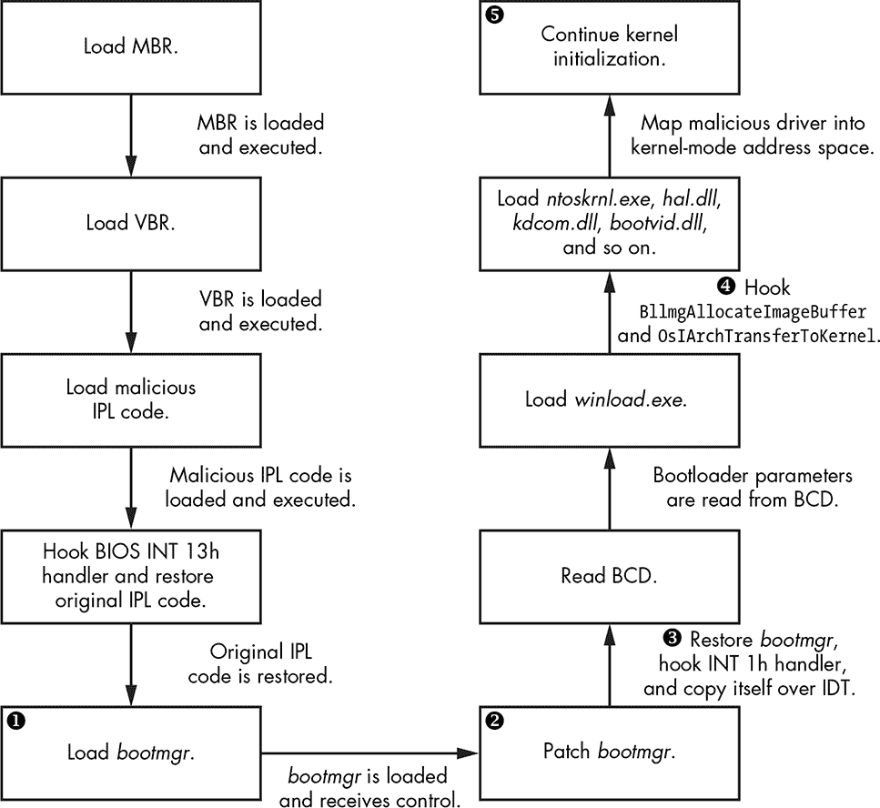

*图 11-11：Rovnix IPL 代码的引导过程*

一旦钩住了 INT 13h 处理程序，Rovnix 监视所有从硬盘读取的数据，并寻找与操作系统的*bootmgr*对应的某个字节模式。当 Rovnix 找到匹配模式时，它会修改*bootmgr* ➋，使其能够检测处理器从实模式切换到保护模式，这是引导过程中的标准步骤。此执行模式切换改变了虚拟地址到物理地址的转换，因此改变了虚拟内存的布局，这会使 Rovnix 失效。因此，为了在切换过程中保持自身传播并控制引导过程，Rovnix 通过在*bootmgr*中打补丁，插入`jmp`指令，使 Rovnix 能够在操作系统切换执行模式之前立即接管控制。

在继续之前，我们将探讨 Rovnix 如何隐藏其钩子，然后看它是如何通过模式切换保持持久性的。

##### 滥用调试接口隐藏钩子

使 Rovnix 比其他引导工具更有趣的一件事是它的控制钩子的隐蔽性。它钩住了 INT 1h 处理程序 ➌，以便在操作系统内核初始化的特定时刻接管控制，并且它滥用调试寄存器`dr0`到`dr7`来设置钩子，从而避免通过不修改被钩住的代码来进行检测。INT 1h 处理程序负责处理调试事件，例如追踪和设置硬件断点，使用`dr0`到`dr7`寄存器。

八个调试寄存器，`dr0` 到 `dr7`，在 Intel x86 和 x64 平台上提供硬件级调试支持。前四个寄存器，`dr0` 到 `dr3`，用于指定断点的线性地址。`dr7`寄存器允许你选择性地指定并启用触发断点的条件；例如，你可以使用它来设置一个断点，当代码执行或在特定地址发生内存访问（读/写）时触发。`dr6`寄存器是一个状态寄存器，允许你确定哪个调试条件已发生——即，哪个断点被触发。`dr4`^(1) 和 `dr5`寄存器是保留的，不使用。一旦硬件断点被触发，INT 1h 将被执行，以确定发生了哪个调试条件并做出相应响应。

这是使 Rovnix 引导工具能够在不修改代码的情况下设置隐蔽钩子的功能。Rovnix 将`dr0`到`dr4`寄存器设置为其预定的钩子位置，并通过在`dr7`寄存器中设置相应的位掩码，启用每个寄存器的硬件断点。

##### 滥用中断描述符表实现引导过程中的持久性

除了滥用平台的调试功能外，Rovnix 的初期版本还使用了一种有趣的技术，以在处理器从实模式切换到保护模式时生存下来。在执行切换到保护模式之前，*bootmgr* 初始化了重要的系统结构，如全局描述符表（GDT）和中断描述符表（IDT）。后者填充了中断处理程序的描述符。

**中断描述符表**

IDT 是 CPU 在保护模式下使用的特殊系统结构，用于指定 CPU 中断处理程序。在实模式下，IDT（也称为*中断向量表*，或*IVT*）很简单——只是一个由处理程序的 4 字节地址组成的数组，从地址 0000:0000h 开始。换句话说，INT 0h 处理程序的地址是 0000:0000h，INT 1h 处理程序的地址是 0000:0004h，INT 2h 处理程序的地址是 0000:0008h，依此类推。在保护模式下，IDT 具有更复杂的布局：一个由 8 字节中断处理程序描述符组成的数组。可以通过`sidt`处理器指令获取 IDT 的基地址。有关 IDT 的更多信息，请参阅英特尔的文档：*[`www.intel.com/content/www/us/en/processors/architectures-software-developer-manuals.html`](http://www.intel.com/content/www/us/en/processors/architectures-software-developer-manuals.html)*。

Rovnix 将恶意 IPL 代码复制到 IDT 的第二半部分，该部分目前系统未使用。由于每个描述符占 8 字节，而表中有 256 个描述符，这为 Rovnix 提供了 1KB 的 IDT 内存，足够存储其恶意代码。IDT 在保护模式下，因此将代码存储在 IDT 中可确保 Rovnix 在模式切换后仍能保持，并且可以通过`sidt`指令轻松获取 IDT 地址。Rovnix 修改后 IDT 的整体布局如图 11-12 所示。


*图 11-12：Rovnix 如何滥用 IDT 在执行模式切换中传播*

#### *加载恶意内核模式驱动程序*

在挂钩 INT 1h 处理程序后，Rovnix 接着挂钩其他操作系统引导加载程序组件，如*winload.exe*和操作系统内核镜像（例如*ntoskrnl.exe*）。Rovnix 在*bootmgr*代码加载*winload.exe*时等待，然后挂钩`BlImgAllocateImageBuffer`例程（见图 11-11）来为可执行镜像分配缓冲区，通过在其起始地址设置硬件断点。此技术分配内存来容纳恶意的内核模式驱动程序。

恶意软件还会钩住 *winload.exe* 中的 `OslArchTransferToKernel` 例程。该例程将控制从 *winload.exe* 转移到内核的入口点 `KiSystemStartup`，进而启动内核初始化。通过钩住 `OslArchTransferToKernel`，Rovnix 在 `KiSystemStartup` 被调用之前获取控制权，并趁机注入恶意的内核模式驱动程序。

`KiSystemStartup` 例程接受一个参数 `KeLoaderBlock`，这是一个指向 `LOADER_PARAMETER_BLOCK` 的指针——这是一个由 *winload.exe* 初始化的未记录结构，包含了重要的系统信息，如启动选项和已加载的模块。该结构见列表 11-5。

```
typedef struct _LOADER_PARAMETER_BLOCK

{

     LIST_ENTRY LoadOrderListHead;

     LIST_ENTRY MemoryDescriptorListHead;

  ➊ LIST_ENTRY BootDriverListHead;

     ULONG KernelStack;

     ULONG Prcb;

     ULONG Process;

     ULONG Thread;

     ULONG RegistryLength;

     PVOID RegistryBase;

     PCONFIGURATION_COMPONENT_DATA ConfigurationRoot;

     CHAR * ArcBootDeviceName;

     CHAR * ArcHalDeviceName;

     CHAR * NtBootPathName;

     CHAR * NtHalPathName;

     CHAR * LoadOptions;

     PNLS_DATA_BLOCK NlsData;

     PARC_DISK_INFORMATION ArcDiskInformation;

     PVOID OemFontFile;

     _SETUP_LOADER_BLOCK * SetupLoaderBlock;

     PLOADER_PARAMETER_EXTENSION Extension;

     BYTE u[12];

     FIRMWARE_INFORMATION_LOADER_BLOCK FirmwareInformation;

} LOADER_PARAMETER_BLOCK, *PLOADER_PARAMETER_BLOCK;
```

*列表 11-5：`LOADER_PARAMETER_BLOCK` 描述*

Rovnix 关注的是字段 `BootDriverListHead` ➊，它包含了一个与启动模式驱动程序对应的特殊数据结构的列表头。这些驱动程序与内核映像一起由 *winload.exe* 加载。然而，初始化这些驱动程序的 `DriverEntry` 例程直到操作系统内核映像接管控制权后才会被调用。操作系统内核初始化代码会遍历 `BootDriverListHead` 中的记录，并调用相应驱动程序的 `DriverEntry` 例程。

一旦 `OslArchTransferToKernel` 钩子被触发，Rovnix 从栈中获取 `KeLoaderBlock` 结构的地址，并使用 `BootDriverListHead` 字段将一个对应于恶意驱动程序的记录插入启动驱动程序列表。此时，恶意驱动程序被加载到内存中，仿佛它是一个具有合法数字签名的内核模式驱动程序。接下来，Rovnix 将控制权转交给 `KiSystemStartup` 例程，后者恢复启动过程并开始内核初始化（见图 11-11 中的➎）。

在初始化的某个时刻，内核会遍历 `KeLoaderBlock` 中的启动驱动程序列表，并调用它们的初始化例程，包括恶意驱动程序的初始化例程（见图 11-13）。这就是恶意内核模式驱动程序的 `DriverEntry` 例程被执行的方式。

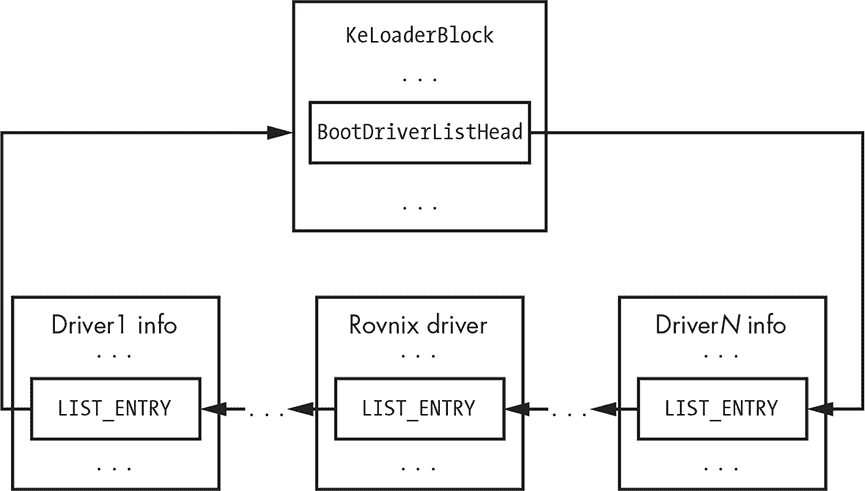

*图 11-13：恶意的 Rovnix 驱动程序被插入到`BootDriverList`中*

### 内核模式驱动程序功能

恶意驱动程序的主要功能是将存储在驱动程序二进制文件中的有效负载注入目标进程，之前提到过，这些有效负载使用 aPlib 进行压缩，主要注入到 *explorer.exe* 和浏览器中。

#### *注入有效负载模块*

有效负载模块在其签名中包含了 *JFA* 代码，因此，为了提取它，Rovnix 会在驱动程序的节表和第一个节之间的空闲空间中查找 JFA 签名。该签名表示配置数据块的开始，示例见列表 11-6。

```
typedef struct _PAYLOAD_CONFIGURATION_BLOCK

{

   DWORD Signature;              // "JFA\0"

   DWORD PayloadRva;             // RVA of the payload start

   DWORD PayloadSize;            // Size of the payload

   DWORD NumberOfProcessNames;   // Number of NULL-terminated strings in ProcessNames

   char ProcessNames[0];         // Array of NULL-terminated process names to inject payload

} PAYLOAD_CONFIGURATION_BLOCK, *PPAYLOAD_CONFIGURATION_BLOCK;
```

*列表 11-6：描述有效负载配置的 `PAYLOAD_CONFIGURATION_BLOCK` 结构*

`PayloadRva` 和 `PayloadSize` 字段指定了压缩有效负载镜像在内核模式驱动中的坐标。`ProcessNames` 数组包含了要将有效负载注入的进程名称。数组中的条目数由 `NumberOfProcessNames` 指定。图 11-14 显示了一个来自真实恶意内核模式驱动的数据块示例。如你所见，有效负载将被注入到 *explorer.exe* 以及浏览器 *iexplore.exe*、*firefox.exe* 和 *chrome.exe* 中。

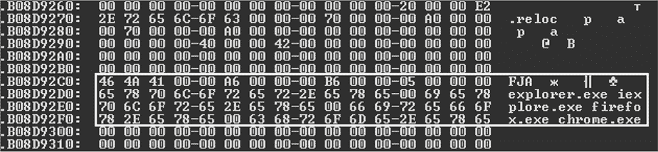

*图 11-14：有效负载配置块*

Rovnix 首先将有效负载解压到内存缓冲区中。然后它使用根套件（rootkit）常用的传统技术来注入有效负载，具体步骤如下：

1.  使用标准文档化的内核模式 API 注册 `CreateProcessNotifyRoutine` 和 `LoadImageNotifyRoutine`。这样，Rovnix 就能在每次新进程创建或新镜像加载到目标进程的地址空间时获得控制。

1.  监控系统中新进程的创建，并通过镜像名称寻找目标进程。

1.  一旦目标进程被加载，将有效负载映射到其地址空间，并排队一个 *异步过程调用（APC）*，将控制权转交给有效负载。

让我们更详细地分析这种技术。`CreateProcessNotify` 例程允许 Rovnix 安装一个特殊的处理程序，每当系统上创建新进程时触发。通过这种方式，恶意软件能够检测何时启动目标进程。然而，由于恶意的创建进程处理程序在进程创建的最初阶段被触发，即在所有必要的系统结构已初始化但目标进程的可执行文件尚未加载到其地址空间时，恶意软件此时无法注入有效负载。

第二个例程 `LoadImageNotifyRoutine` 允许 Rovnix 设置一个处理程序，每次加载或卸载可执行模块（*.exe* 文件、DLL 库等）时触发。这个处理程序监控主可执行镜像，并在镜像加载到目标进程的地址空间后通知 Rovnix，这时 Rovnix 将注入有效负载并通过创建 APC 来执行它。

#### *隐匿自我防御机制*

内核模式驱动实现了与 TDL4 启动工具相同的防御机制：它钩住了硬盘迷你端口 `DRIVER_OBJECT` 的 `IRP_MJ_INTERNAL_CONTROL` 处理程序。这个处理程序是与硬件无关的最低级接口，可以访问硬盘上存储的数据，为恶意软件提供了一种可靠的方式来控制从硬盘读取和写入的数据。

通过这种方式，Rovnix 可以拦截所有的读/写请求，并保护关键区域免受读取或覆盖。具体来说，它保护以下内容：

+   被感染的 IPL 代码

+   存储的内核模式驱动

+   隐藏的文件系统分区

Listing 11-7 展示了 `IRP_MJ_INTERNAL_CONTROL` 钩子例程的伪代码，该例程决定是否阻止或授权 I/O 操作，具体取决于正在读取或写入硬盘的哪个部分。

```
int __stdcall NewIrpMjInternalHandler(PDEVICE_OBJECT DeviceObject, PIRP Irp)

{

  UCHAR ScsiCommand;

  NTSTATUS Status;

  unsigned __int64 Lba;

  PVOID pTransferBuffer;

➊ if ( DeviceObject != g_DiskDevObj )

    return OriginalIrpMjInternalHandler(DeviceObject, Irp);

➋ ScsiCommand = GetSrbParameters(_Irp, &Lba, &DeviceObject, &pTransferBuffer,

                                                             Irp);

  if ( ScsiCommand == 0x2A || ScsiCommand == 0x3B )

  {

    // SCSI write commands

  ➌ if ( CheckSrbParams(Lba, DeviceObject)

    {

       Status = STATUS_ACCESS_DENIED;

     ➍ Irp->IoStatus.Status = STATUS_ACCESS_DENIED;

       IofCompleteRequest(Irp, 0);

    } else

    {

       return OriginalIrpMjInternalHandler(DeviceObject, Irp);

    }

  } else if ( ScsiCommand == 0x28 || ScsiCommand == 0x3C)

  {

      // SCSI read commands

      if ( CheckSrbParams(Lba, DeviceObject)

      {

     ➎ Status = SetCompletionRoutine(DeviceObject, Irp, Lba,

                                      DeviceObject, pTransferBuffer, Irp);

      } else

      {

        return OriginalIrpMjInternalHandler(DeviceObject, Irp);

      }

  }

  if ( Status == STATUS_REQUEST_NOT_ACCEPTED )

    return OriginalIrpMjInternalHandler(DeviceObject, Irp);

  return Status;

}
```

*Listing 11-7: 恶意 `IRP_MJ_INTERNAL_CONTROL` 处理程序的伪代码*

首先，代码检查 I/O 请求是否针对硬盘设备对象 ➊。如果是，恶意软件会检查操作是读取还是写入操作，以及正在访问硬盘的哪个区域 ➋。`CheckSrbParams` 例程 ➌ 在访问受 bootkit 保护的区域时返回 `TRUE`。如果有人尝试向受 bootkit 保护的区域写入数据，代码会拒绝 I/O 操作并返回 `STATUS_ACCESS_DENIED` ➍。如果有人尝试从受 bootkit 保护的区域读取数据，恶意软件会设置一个恶意的完成例程 ➎，并将 I/O 请求传递给硬盘设备对象以完成读取操作。一旦读取操作完成，恶意的完成例程会被触发，通过向缓冲区写入零来清除读取数据。这种方式，恶意软件保护了它在硬盘上的数据。

### 隐藏文件系统

Rovnix 的另一个显著特征是其隐藏的文件系统 (FS) 分区（即操作系统无法看到的分区），用于秘密存储配置数据和附加的有效载荷模块。隐藏存储的实现并不是一种新的 bootkit 技术——它已被其他 rootkit 如 TDL4 和 Olmasco 使用过——但 Rovnix 的实现略有不同。

为了物理存储其隐藏分区，Rovnix 会占用硬盘的开始部分或结束部分的空间，具体取决于哪里有足够的空闲空间；如果在第一个分区之前有 0x7D0（即 2,000 十进制，几乎 1MB）或更多的空闲扇区，Rovnix 会将隐藏分区放置在 MBR 扇区之后，并扩展到所有空闲的 0x7D0 扇区。如果硬盘的开始部分没有足够的空间，Rovnix 会尝试将隐藏分区放在硬盘的末尾。为了访问存储在隐藏分区中的数据，Rovnix 使用原始的 `IRP_MJ_INTERNAL_CONTROL` 处理程序，按前一部分中解释的方式进行钩取。

#### *将分区格式化为虚拟 FAT 系统*

一旦 Rovnix 为隐藏分区分配了空间，它将其格式化为 *虚拟文件分配表 (VFAT)* 文件系统——这是一种 FAT 文件系统的修改版，能够存储带有长 Unicode 文件名的文件（最长 256 字节）。原始的 FAT 文件系统对文件名的长度有限制，为 8 + 3，即文件名最多 8 个字符，扩展名最多 3 个字符。

#### *加密隐藏文件系统*

为了保护隐藏文件系统中的数据，Rovnix 使用 RC6 加密算法在电子密码本（ECB）模式下实施分区透明加密，并且密钥长度为 128 位。在 ECB 模式下，待加密的数据被分割成等长的块，每个块都使用相同的密钥独立加密，与其他块无关。该密钥存储在隐藏分区第一扇区的最后 16 字节中，如图 11-15 所示，并用于加密和解密整个分区。

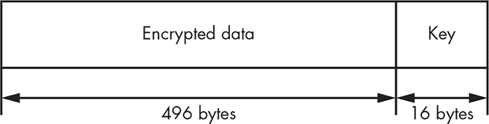

*图 11-15：隐藏分区第一扇区的加密密钥位置*

**RC6**

Rivest 密码 6，或称 RC6，是由 Ron Rivest、Matt Robshaw、Ray Sidney 和 Yiqun Lisa Yin 设计的一种对称密钥分组密码，旨在满足*高级加密标准（AES）*竞赛的要求。RC6 的分组大小为 128 位，支持 128 位、192 位和 256 位的密钥长度。

#### *访问隐藏文件系统*

为了使隐藏文件系统对有效载荷模块可访问，Rovnix 创建了一个名为*符号链接*的特殊对象。宽泛地讲，符号链接是隐藏存储设备对象的另一种名称，可以被用户模式进程中的模块使用。Rovnix 生成字符串 `\DosDevices\<`XXXXXXXX-XXXX-XXXX-XXXX-XXXXXXXXXXXX`>`，其中 X 是一个随机生成的十六进制数字，范围从 0 到 F，用作隐藏存储的符号链接名称。

隐藏文件系统的一个优势是，可以通过操作系统提供的标准 Win32 API 函数，如 `CreateFile`、`CloseFile`、`ReadFile` 或 `WriteFile`，将其作为常规文件系统访问。例如，要在隐藏文件系统的根目录中创建名为 *file_to_create* 的文件，恶意有效载荷会调用 `CreateFile`，并传递符号链接字符串 `\DosDevices\<%`XXXXXXXX`-`XXXX`-`XXXX`-`XXXX`-`XXXXXXXXXXXX`>\file_to_create` 作为文件名参数。一旦有效载荷模块发出此调用，操作系统会将请求重定向到负责处理隐藏文件系统请求的恶意内核模式驱动程序。

图 11-16 展示了恶意驱动程序如何实现文件系统驱动程序功能。一旦它收到来自有效载荷的 I/O 请求，Rovnix 使用钩住的硬盘处理程序调度该请求，执行针对硬盘上隐藏文件系统的读写操作。

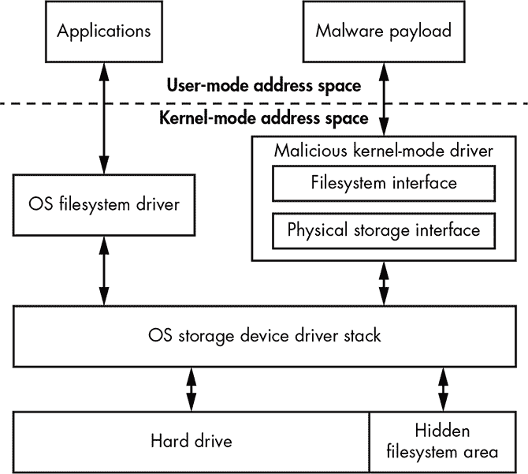

*图 11-16：Rovnix 隐藏存储文件系统的架构*

在这种情况下，操作系统和恶意隐藏文件系统共存于同一硬盘上，但操作系统并不知道用于存储隐藏数据的硬盘区域。

恶意隐藏文件系统可能会更改存储在操作系统文件系统中的合法数据，但由于隐藏文件系统被放置在硬盘的开始或结束位置，因此这种情况发生的几率较低。

### 隐藏的通信通道

Rovnix 还有更多隐秘的伎俩。Rovnix 内核模式驱动程序实现了一个 TCP/IP 协议栈，用于与远程 C&C 服务器秘密通信。操作系统提供的网络接口常常被安全软件劫持，以监控和控制通过网络的流量。Rovnix 并不依赖这些网络接口，也避免了被安全软件检测的风险，而是使用了其自定义的网络协议实现，独立于操作系统，从 C&C 服务器下载有效载荷模块。

为了能够在这个网络上发送和接收数据，Rovnix 内核模式驱动实现了一个完整的网络栈，包括以下接口：

+   微软 *网络驱动接口规范 (NDIS)* 微型端口接口，通过物理网络以太网接口发送数据包

+   用于 TCP/IP 网络协议的传输驱动接口

+   套接字接口

+   HTTP 协议用于与远程 C&C 服务器通信

如 图 11-17 所示，NDIS 微型端口层负责与网络接口卡通信，发送和接收网络数据包。传输驱动接口为上层套接字接口提供了 TCP/IP 接口，后者则被 Rovnix 的 HTTP 协议用来传输数据。

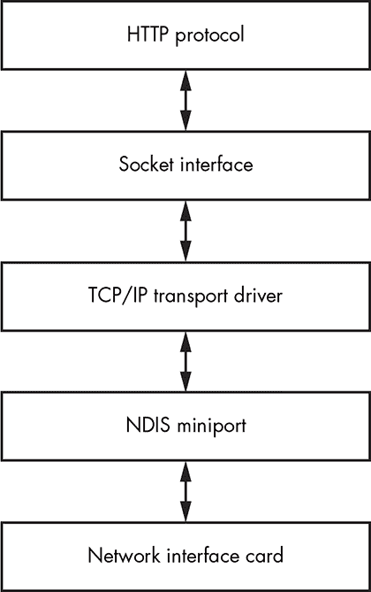

*图 11-17：Rovnix 自定义网络栈实现架构*

Rovnix 的创造者并不是从零开始开发这个隐藏的网络通信系统——这种实现需要成千上万行代码，因此容易出错。相反，他们基于一个开源、轻量级的 TCP/IP 网络库 lwIP 进行了实现。lwIP 库是一个小型、独立的 TCP/IP 协议套件实现，重点是减少资源使用，同时仍提供完整的 TCP/IP 协议栈。根据其官方网站的描述，lwIP 占用的 RAM 空间只有几十 KB，代码量约为 40KB，非常适合用作启动木马。

隐藏的通信通道等特性使得 Rovnix 可以绕过本地网络监控安全软件。由于 Rovnix 带有自己的网络协议栈，网络安全软件无法识别——因此也无法监控——它在网络上的通信。从协议层的最上层到底层的 NDIS 微型端口驱动，Rovnix 仅使用自己的网络组件，使其成为一个非常隐秘的启动木马。

### 案例分析：Carberp 连接

Rovnix 在实际环境中使用的一个例子是 Carberp 木马，它由俄罗斯最著名的网络犯罪集团开发。Carberp 被用于使一个银行木马在受害者的系统上持续存在。^(2)我们将查看 Carberp 的一些方面，以及它如何从 Rovnix 引导程序开发而来。

**与 CARBERP 相关的恶意软件**

据估计，开发 Carberp 的集团每周的平均收入达到数百万美元，并在其他恶意软件技术上投入了大量资金，如 Hodprot 投放器，^(1)该投放器曾在 Carberp、RDPdoor 和 Sheldor 的安装中发挥作用。^(2) RDPdoor 尤其恶意：它安装 Carberp 以便在被感染的系统中打开后门，并手动执行欺诈性银行交易。

1。 *[`www.welivesecurity.com/media_files/white-papers/Hodprot-Report.pdf`](https://www.welivesecurity.com/media_files/white-papers/Hodprot-Report.pdf)*

2。 *[`www.welivesecurity.com/2011/01/14/sheldor-shocked/`](https://www.welivesecurity.com/2011/01/14/sheldor-shocked/)*

#### *Carberp 的开发*

2011 年 11 月，我们注意到 Carberp 背后的网络犯罪集团设置的一个 C&C 服务器开始分发一个基于 Rovnix 框架的引导程序。我们开始跟踪 Carberp 木马，发现此期间其分发非常有限。

我们的分析中有两个迹象表明该机器人处于测试模式，因此正在积极开发中。第一个线索是关于机器人安装和二进制文件行为的大量调试和追踪信息。第二个线索是我们通过访问机器人 C&C 服务器的日志文件发现的——大量安装失败信息被发送回 C&C。图 11-18 展示了 Carberp 报告的此类信息示例。

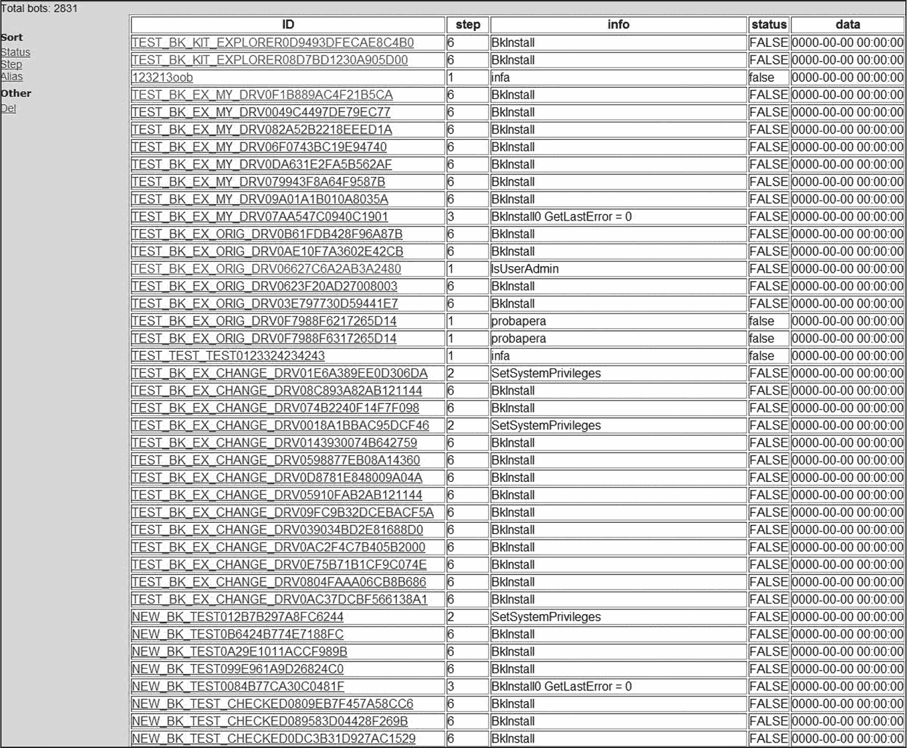

*图 11-18：Rovnix 投放器日志示例*

ID 列指定 Rovnix 实例的唯一标识符；状态列包含受害者系统是否成功被攻破的信息。感染算法分为多个步骤，每完成一步后，信息便会直接报告给 C&C 服务器。步骤列提供正在执行的步骤信息，信息列包含安装过程中遇到的任何错误描述。通过查看步骤和信息列，僵尸网络操作员可以确定感染失败的步骤和原因。

Carberp 使用的 Rovnix 版本包含了大量的调试字符串，并且向 C&C 发送了许多冗长的消息。图 11-19 展示了它可能发送的字符串示例。这些信息对我们分析这个威胁并理解其功能非常有帮助。二进制文件中留下的调试信息揭示了二进制中实现的例程名称及其目的，记录了代码的逻辑。利用这些数据，我们可以更容易地重建恶意代码的上下文。

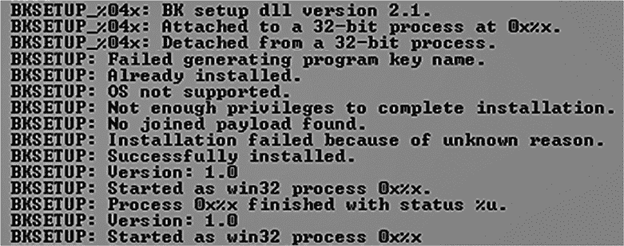

*图 11-19：开发人员在 Rovnix 下拉程序中留下的调试字符串*

#### *下拉程序增强功能*

Carberp 中使用的 Rovnix 框架与我们在本章开始时描述的引导工具几乎相同，唯一的显著变化出现在下拉程序中。在 “感染系统” 中的第 150 页，我们提到 Rovnix 尝试通过使用 `ShellExecuteEx` Win32 API 来提升权限，从而在受害者机器上获得管理员权限。在 Carberp 版本的 Rovnix 中，下拉程序利用了系统中的以下漏洞来提升权限：

**MS10-073 在 *win32k.sys* 模块中的漏洞** 该漏洞最初由 Stuxnet 蠕虫利用，攻击了对特殊构造的键盘布局文件的错误处理。

**MS10-092 在 Windows 任务计划程序中的漏洞** 该漏洞也首次在 Stuxnet 中被发现，利用了 Windows 计划程序中的完整性验证机制。

**MS11-011 在 *win32k.sys* 模块中的漏洞** 该漏洞导致 `win32k.sys!RtlQueryRegistryValues` 例程中的堆栈溢出。

**.NET 运行时优化漏洞** 这是 Microsoft .NET 运行时优化服务中的一个漏洞，导致以 SYSTEM 权限执行恶意代码。

另一个有趣的特性是 Carberp 安装程序在将特洛伊木马或引导工具安装到系统之前，从系统例程列表中移除了各种钩子，这些内容在清单 11-8 中显示。由于这些例程通常是安全软件（如沙箱、主机入侵防护系统等）的钩子目标，因此通过解除钩子，恶意软件增加了绕过检测的能力。

```
ntdll!ZwSetContextThread

ntdll!ZwGetContextThread

ntdll!ZwUnmapViewOfSection

ntdll!ZwMapViewOfSection

ntdll!ZwAllocateVirtualMemory

ntdll!ZwWriteVirtualMemory

ntdll!ZwProtectVirtualMemory

ntdll!ZwCreateThread

ntdll!ZwOpenProcess

ntdll!ZwQueueApcThread

ntdll!ZwTerminateProcess

ntdll!ZwTerminateThread

ntdll!ZwResumeThread

ntdll!ZwQueryDirectoryFile

ntdll!ZwCreateProcess

ntdll!ZwCreateProcessEx

ntdll!ZwCreateFile

ntdll!ZwDeviceIoControlFile

ntdll!ZwClose

ntdll!ZwSetInformationProcess

kernel32!CreateRemoteThread

kernel32!WriteProcessMemory

kernel32!VirtualProtectEx

kernel32!VirtualAllocEx

kernel32!SetThreadContext

kernel32!CreateProcessInternalA

kernel32!CreateProcessInternalW

kernel32!CreateFileA

kernel32!CreateFileW

kernel32!CopyFileA

kernel32!CopyFileW

kernel32!CopyFileExW

ws2_32!connect

ws2_32!send

ws2_32!recv

ws2_32!gethostbyname
```

*清单 11-8：Rovnix 下拉程序解除钩子的例程列表*

Carberp 的 Rovnix 修改版中的引导工具和内核模式驱动程序部分与原版引导工具相同。成功安装到系统后，恶意的 IPL 代码加载了内核模式驱动程序，该驱动程序将 Carberp 特洛伊木马有效载荷注入到系统进程中。

#### *泄露的源代码*

2013 年 6 月，Carberp 和 Rovnix 的源代码泄露给了公众。完整的档案文件可以下载，其中包含了攻击者用来构建自己 Rovnix 启动病毒的所有必要源代码。尽管如此，我们并没有在现实中看到像预期那样多的 Rovnix 和 Carberp 定制版本，这我们推测是因为这种启动病毒技术的复杂性。

### 结论

本章对 Rovnix 进行了详细的技术分析，讨论了在安全行业面临的持续启动病毒军备竞赛中，Rovnix 的作用。随着安全软件赶上了当时感染 MBR 的启动病毒，Rovnix 则提出了另一种感染途径——IPL，引发了杀毒技术的另一轮进化。由于其 IPL 感染方法，以及隐藏存储和隐藏网络通信通道的实现，Rovnix 成为了在现实中最复杂的启动病毒之一。这些特性使它成为网络犯罪分子手中的一种危险武器，Carberp 案件就证明了这一点。

本章我们特别关注了使用 VMware 和 IDA Pro 剖析 Rovnix 的 IPL 代码，展示了这些工具在启动病毒分析中的实际应用。你可以从*[`nostarch.com/rootkits/`](https://nostarch.com/rootkits/)*下载所有必要的数据，重复步骤或进行你自己的深入调查，研究 Rovnix 的 IPL 代码。
