## 第十二章：**GAPZ：高级 VBR 感染**


本章介绍了野外发现的最隐秘的引导病毒之一：Win32/Gapz 引导病毒。我们将讨论其技术特性和功能，从引导程序和引导病毒组件开始，接着讲解用户模式的有效载荷。

根据我们的经验，Gapz 是迄今为止分析过的最复杂的引导病毒。它的每一个设计和实现特性——复杂的引导程序、先进的引导病毒感染方法、以及扩展的 rootkit 功能——都确保了 Gapz 能够感染并持续存在于受害者的计算机中，并长期保持隐蔽。

Gapz 是通过一个利用多个本地特权升级漏洞并实施绕过主机入侵防御系统（HIPS）的非同寻常技术的引导程序安装到受害者系统上的。

在成功渗透到受害者系统后，引导程序安装了引导病毒，该病毒占用空间非常小，且在感染系统上难以被发现。引导病毒将恶意代码加载到内核模式中，执行 Gapz rootkit 功能。

其 rootkit 功能非常丰富，包括自定义 TCP/IP 网络栈、先进的钩子引擎、加密库和有效载荷注入引擎。

本章深入探讨了这些强大功能的每个方面。

**为什么它叫 GAPZ？**

该引导病毒的名字来源于字符串`‘GAPZ’`，该字符串在所有二进制文件和 shellcode 中作为分配内存的标记使用。例如，下面这段内核模式代码通过执行 `ExAllocatePoolWithTag` 函数，并使用第三个参数`‘ZPAG’` ➊（即反向的`‘GAPZ’`）来分配内存：

```
int _stdcall alloc_mem(STRUCT_IPL_THREAD_2 *al, int pBuffer, unsigned int
Size, int Pool)

{

   v7 = -1;

    for ( i = -30000000; ; (a1->KeDelagExecutionThread)(0, 0, &i) )

    {

        v4 = (a1->ExAllocatePoolWithTag)(Pool, Size, ➊'ZPAG');

        if ( v4 )

            break;

    }

    memset(v4, 0, Size);

    result = pBuffer;

    *pBuffer = v4;

    return result;

}
```

### Gapz 引导程序

Gapz 是通过复杂的引导程序安装到目标系统上的。Gapz 引导程序有多个变种，所有变种都包含一个相似的有效载荷，稍后我们将在《Gapz Rootkit 功能》章节中详细讨论（第 191 页）。这些引导程序的区别在于引导病毒技术和它们各自利用的*本地特权升级（LPE）* 漏洞的数量。

第一个在野外发现的 Gapz 版本是 Win32/Gapz.C，发现时间为 2012 年 4 月^(1)。这种引导程序变种使用了基于 MBR 的引导病毒——与第七章中讨论的 TDL4 引导病毒使用的技术相同——来在受害者计算机上保持持久性。Win32/Gapz.C 的显著特点是它包含了大量用于调试和测试的冗长字符串，并且它的早期分发非常有限。这表明 Gapz 的最早版本并不是为了大规模分发，而是测试版，用于调试恶意软件的功能。

第二个变种 Win32/Gapz.B 根本没有在目标系统上安装 bootkit。为了在受害者系统上保持持久性，Gapz 仅安装了一个恶意的内核模式驱动程序。然而，由于缺乏有效的内核模式驱动程序数字签名，这种方法在 Microsoft Windows 64 位平台上无法使用，限制了该修改仅适用于 Microsoft Windows 32 位操作系统。

最后一个已知且最有趣的投放器版本 Win32/Gapz.A，是我们在本章重点讨论的版本。该版本带有 VBR bootkit。在本章的其余部分，我们将简化为使用“Gapz”来指代 Win32/Gapz.A。

表 12-1 总结了不同版本的投放器。

**表 12-1：** Win32/Gapz 投放器的版本

| **检测名称** | **编译日期** | **LPE 漏洞** | **Bootkit 技术** |
| --- | --- | --- | --- |
| Win32/Gapz.A | 2012/09/11 至 2012/10/30 | CVE-2011-3402CVE-2010-4398COM 提权 | VBR |
| Win32/Gapz.B | 2012/11/06 | CVE-2011-3402COM 提权 | 无 bootkit |
| Win32/Gapz.C | 2012/04/19 | CVE-2010-4398CVE-2011-2005COM 提权 | MBR |

检测名称列列出了杀毒行业采用的 Gapz 变种。编译日期列中的条目来自 Gapz 投放器的 PE 头部，据信这是一个准确的时间戳。Bootkit 技术列显示了投放器使用的 bootkit 类型。

最后，LPE 漏洞列列出了 Gapz 投放器利用的多个 LPE 漏洞，以便在受害者系统上获取管理员权限。COM 提权漏洞用于绕过用户帐户控制（UAC）安全功能，以便将代码注入到 UAC 白名单中的系统进程中。CVE-2011-3402 漏洞与*win32k.sys*模块中实现的 TrueType 字体解析功能有关。CVE-2010-4398 漏洞是由于`RtlQueryRegistryValues`例程中的栈溢出，位于*win32k.sys*模块中。CVE-2011-2005 漏洞位于*afd.sys*（辅助功能驱动程序）模块中，允许攻击者在内核模式地址空间中覆盖数据。

表 12-1 中列出的所有 Gapz 投放器版本都包含相同的有效载荷。

#### *投放器算法*

在更详细地检查 Gapz 投放器之前，我们先回顾一下它需要什么条件才能悄无声息地成功安装 Gapz 到系统中。

首先，投放器需要管理员权限来访问硬盘并修改 MBR/VBR/IPL 数据。如果投放器的用户帐户没有管理员权限，它必须通过利用系统中的 LPE 漏洞来提升权限。

其次，它需要绕过安全软件，如防病毒程序、个人防火墙和主机入侵防御系统。为了保持低调，Gapz 使用了先进的工具和方法，包括混淆、反调试和反仿真技术。除了这些方法外，Gapz dropper 还使用了一种独特且相当有趣的技术来绕过 HIPS，稍后将在本章中讨论。

**主机入侵防御系统（HIPS）**

顾名思义，主机入侵防御系统（Host Intrusion Prevention System，简称 HIPS）是一种计算机安全软件，旨在防止攻击者访问目标系统。它采用多种方法，包括但不限于使用签名和启发式分析，监控单个主机的可疑活动（例如，系统中新进程的创建、在另一个进程中分配具有可执行页面的内存缓冲区，以及新的网络连接）。与仅分析可执行文件的计算机防病毒软件不同，HIPS 会分析事件以发现系统正常状态的偏差。如果恶意软件设法绕过计算机防病毒软件并在计算机上执行，HIPS 仍然可以通过检测不同事件交互的变化来发现并阻止入侵者。

考虑到这些障碍，Gapz dropper 执行以下步骤以成功感染系统：

1.  将自己注入 *explorer.exe* 以绕过 HIPS（如 “绕过 HIPS” 在 第 181 页 中讨论的那样）。

1.  利用目标系统中的 LPE 漏洞提升其用户权限。

1.  将引导程序安装到系统中。

#### *Dropper 分析*

当解包后的 dropper 被加载到 IDA Pro 反汇编器中时，其导出地址表将像 图 12-1 所示。导出地址表显示了二进制文件导出的所有符号，并很好地总结了 dropper 执行算法中的步骤。

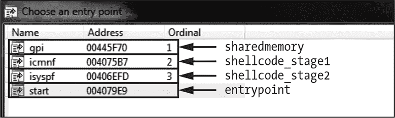

*图 12-1：Gapz dropper 的导出地址表*

二进制文件导出了三个例程：一个主入口点和两个具有随机生成名称的例程。每个例程都有其特定的目的：

start 将 dropper 注入到 *explorer.exe* 地址空间

icmnf 利用系统中的 LPE 漏洞来提升权限

isyspf 感染受害者的机器

图 12-1 还显示了导出的符号 `gpi`。这个符号指向 dropper 映像中的共享内存，由前面的例程用来将 dropper 注入到 *explorer.exe* 进程中。

Figure 12-2 描述了这些阶段。主要入口点并不会通过 Gapz bootkit 感染系统。相反，它执行 `start` 例程将投放器注入 *explorer.exe*，以绕过安全软件的检测。一旦投放器被注入，它通过利用系统中的 LPE 漏洞（利用 `icmnf` 例程）尝试获得管理员权限。投放器获得所需权限后，执行 `isyspf` 例程将 bootkit 注入硬盘。


*Figure 12-2: Gapz 投放器工作流程*

让我们更仔细地看看注入投放器并绕过 HIPS 的过程。

#### *绕过 HIPS*

计算机病毒有许多方法将自己伪装成良性软件，以避免引起安全软件的注意。我们在 第一章 中讨论的 TDL3 rootkit 就采用了另一种有趣的绕过 HIPS 的技术，它利用 `AddPrintProvidor`/`AddPrintProvider` 系统 API 来避免被发现。这些 API 函数用于将自定义模块加载到受信任的系统进程 *spoolsvc.exe* 中，该进程负责 Windows 系统中的打印支持。`AddPrintProvidor`（*sic*）例程是一个用于将本地打印提供程序安装到系统中的可执行模块，通常会被排除在安全软件监视的项目列表之外。TDL3 只是创建一个带有恶意代码的可执行文件，并通过运行 `AddPrintProvidor` 将其加载到 *spoolsvc.exe* 中。一旦该例程执行，恶意代码便在受信任的系统进程中运行，使得 TDL3 能够在不被检测的情况下进行攻击。

Gapz 还将其代码注入到受信任的系统进程中，以绕过 HIPS，但它采用了一种复杂的非标准方法，核心目的是注入 shellcode，将恶意镜像加载并执行到 explorer 进程中。这些是投放器采取的步骤：

1.  打开映射到 *explorer.exe* 地址空间中的 *\BaseNamedObjects* 共享部分之一（见 Listing 12-1），并将 shellcode 写入此部分。Windows 对象管理器命名空间中的 *\BaseNamedObjects* 目录包含互斥锁、事件、信号量和段对象的名称。

1.  写入 shellcode 后，搜索窗口 `Shell_TrayWnd`。该窗口对应于 Windows 任务栏。Gapz 特别针对这个窗口，因为它是由 *explorer.exe* 创建和管理的，并且很可能在系统中可用。

1.  调用 Win32 API 函数 `GetWindowLong` 获取与 `Shell_TrayWnd` 窗口处理程序相关的例程地址。

1.  调用 Win32 API 函数 `SetWindowLong` 来修改与 `Shell_TrayWnd` 窗口处理程序相关的例程地址。

1.  调用 `SendNotifyMessage` 触发在 *explorer.exe* 地址空间中执行 shellcode。

区段对象用于与其他进程共享某一进程的一部分内存；换句话说，它们代表了可以跨系统进程共享的内存区段。Listing 12-1 显示了恶意软件在第一步中查找的*\BaseNamedObjects*中的区段对象。这些区段对象对应系统区段——即它们是由操作系统创建的，包含系统数据。Gapz 遍历区段对象列表并打开它们，以检查它们是否存在于系统中。如果系统中存在某个区段对象，投放程序将停止遍历，并返回该区段的句柄。

```
char _stdcall OpenSection_(HANDLE *hSection, int pBase, int *pRegSize)

{

    sect_name = L"\\BaseNamedObjects\\ShimSharedMemory";

    v7 = L"\\BaseNamedObjects\\windows_shell_global_counters";

    v8 = L"\\BaseNamedObjects\\MSCTF.Shared.SFM.MIH";

    v9 = L"\\BaseNamedObjects\\MSCTF.Shared.SFM.AMF";

    v10 = L"\\BaseNamedObjectsUrlZonesSM_Administrator";

    i = 0;

    while ( OpenSection(hSection, (&sect_name)[i], pBase, pRegSize) < 0 )

    {

        if ( ++i >= 5 )

            return 0;

    }

    if ( VirtualQuery(*pBase, &Buffer, 0xlCu) )

        *pRegSize = v7;

    return 1;

}
```

*Listing 12-1：Gapz 投放程序中使用的对象名称*

一旦打开现有区段，恶意软件便开始将其代码注入到*explorer.exe*进程中，如 Listing 12-2 所示。

```
char __cdecl InjectIntoExplorer()

{

  returnValue = 0;

  if ( OpenSectionObject(&hSection, &SectionBase, &SectSize) )  // open some of SHIM sections

  {

 ➊ TargetBuffer = (SectionBase + SectSize - 0x150);            // find free space in the end

                                                                // of the section

    memset(TargetBuffer, 0, 0x150u);

    qmemcpy(TargetBuffer->code, sub_408468, sizeof(TargetBuffer->code));

    hKernel32 = GetModuleHandleA("kernel32.dll");

 ➋ TargetBuffer->CloseHandle = GetExport(hKernel32, "CloseHandle", 0);

    TargetBuffer->MapViewOfFile = GetExport(hKernel32, "MapViewOfFile", 0);

    TargetBuffer->OpenFileMappingA = GetExport(hKernel32, "OpenFileMappingA", 0);

    TargetBuffer->CreateThread = GetExport(hKernel32, "CreateThread", 0);

    hUser32 = GetModuleHandleA("user32.dll");

    TargetBuffer->SetWindowLongA = GetExport(hUser32, "SetWindowLongA", 0);

 ➌ TargetBuffer_ = ConstructTargetBuffer(TargetBuffer);

    if ( TargetBuffer_ )

    {

      hWnd = FindWindowA("Shell_TrayWnd", 0);

   ➍ originalWinProc = GetWindowLongA(hWnd, 0);

      if ( hWnd && originalWinProc )

      {

        TargetBuffer->MappingName[10] = 0;

        TargetBuffer->Shell_TrayWnd = hWnd;

        TargetBuffer->Shell_TrayWnd_Long_0 = originalWinProc;

        TargetBuffer->icmnf = GetExport(CurrentImageAllocBase, "icmnf", 1);

        qmemcpy(&TargetBuffer->field07, &MappingSize, 0xCu);

        TargetBuffer->gpi = GetExport(CurrentImageAllocBase, "gpi", 1);

        BotId = InitBid();

        lstrcpynA(TargetBuffer->MappingName, BotId, 10);

        if ( CopyToFileMappingAndReloc(TargetBuffer->MappingName, CurrentImageAllocBase,

                                       CurrentImageSizeOfImage, &hObject) )

        {

          BotEvent = CreateBotEvent();

          if ( BotEvent )

          {

         ➎ SetWindowLongA(hWnd, 0, &TargetBuffer_->pKiUserApcDispatcher);

         ➏ SendNotifyMessageA(hWnd, 0xFu, 0, 0);

            if ( !WaitForSingleObject(BotEvent, 0xBB80u) )

              returnValue = 1;

            CloseHandle(BotEvent);

          }

          CloseHandle(hObject);

        }

      }

    }

    NtUnmapViewOfSection(-1, SectionBase);

    NtClose(hSection);

  }

  return returnValue;

}
```

*Listing 12-2：将 Gapz 投放程序注入*explorer.exe*

恶意软件使用区段末尾的 336 个字节（0x150）➊来写入 shellcode。为了确保 shellcode 正确执行，恶意软件还提供了在注入过程中使用的某些 API 例程的地址：`CloseHandle`、`MapViewOfFile`、`OpenFileMappingA`、`CreateThread`和`SetWindowLongA` ➋。shellcode 将使用这些例程将 Gapz 投放程序加载到*explorer.exe*的内存空间中。

Gapz 使用*返回导向编程（ROP）*技术执行 shellcode。ROP 利用了 x86 和 x64 架构中`ret`指令的特性，在执行完子例程后，`ret`指令可以将控制权返回给父例程。`ret`指令假定控制权返回的地址位于栈顶，因此它会从栈中弹出返回地址，并将控制权转移到该地址。通过执行`ret`指令来控制栈，攻击者可以执行任意代码。

Gapz 使用 ROP 技术执行 shellcode 的原因是，部分共享内存对象的内存可能不可执行，因此尝试从中执行指令将引发异常。为了解决这个限制，恶意软件使用了一个小型 ROP 程序，在 shellcode 之前执行。该 ROP 程序在目标进程内部分配了一些可执行内存，将 shellcode 复制到这个缓冲区中，并从那里执行。

Gapz 在`ConstructTargetBuffer`例程中找到触发 shellcode 的小工具➌。对于 32 位系统，Gapz 使用系统例程`ntdll!KiUserApcDispatcher`将控制权转移到 ROP 程序。

##### 修改 Shell_TrayWnd 过程

一旦它将 shellcode 写入节对象并找到所有必要的 ROP 小工具，恶意软件就进入下一步：修改`Shell_TrayWnd`窗口过程。该过程负责处理所有发生并发送到窗口的事件和消息。每当窗口被调整大小或移动、按钮被按下等，系统都会调用`Shell_TrayWnd`例程以通知并更新窗口。系统在窗口创建时指定窗口过程的地址。

Gapz 掉落程序通过执行`GetWindowLongA` ➍例程来检索原始窗口过程的地址，以便在注入后返回此地址。该例程用于获取窗口参数，并接受两个参数：窗口句柄和要检索的参数索引。如您所见，Gapz 调用该例程时传入了索引参数`0`，表示原始`Shell_TrayWnd`窗口过程的地址。恶意软件将此值存储在内存缓冲区中，以便在注入后恢复原始地址。

接下来，恶意软件执行`SetWindowLongA`例程 ➎，将`Shell_TrayWnd`窗口过程的地址修改为`ntdll!KiUserApcDispatcher`系统例程的地址。通过重定向到系统模块中的地址，而非 shellcode 本身，Gapz 进一步保护自己免受安全软件的检测。此时，shellcode 已经准备好执行。

##### 执行 Shellcode

Gapz 通过使用`SendNotifyMessageA` API ➏ 向`Shell_TrayWnd`窗口发送消息，触发 shellcode 的执行，将控制权传递给窗口过程。如前一节所述，在修改了窗口过程的地址后，新的地址指向`KiUserApcDispatcher`例程。这最终导致控制权转移到映射在*explorer.exe*进程地址空间中的 shellcode，如列表 12-3 所示。

```
int __stdcall ShellCode(int a1, STRUCT_86_INJECT *a2, int a3, int a4)

{

  if ( !BYTE2(a2->injected) )

  {

    BYTE2(a2->injected) = 1;

 ➊ hFileMapping = (a2->call_OpenFileMapping)(38, 0, &a2->field4);

    if ( hFileMapping )

    {

   ➋ ImageBase = (a2->call_MapViewOfFile)(hFileMapping, 38, 0, 0, 0);

      if ( ImageBase )

      {

        qmemcpy((ImageBase + a2->bytes_5), &a2->field0, 0xCu);

     ➌ (a2->call_CreateThread)(0, 0, ImageBase + a2->routineOffs, ImageBase, 0, 0);

      }

      (a2->call_CloseHandle)( hFileMapping );

    }

  }

➍ (a2->call_SetWindowLongA)(a2->hWnd, 0, a2->OriginalWindowProc);

  return 0;

}
```

*列表 12-3：将 Gapz 掉落程序映射到 explorer.exe 的地址空间中*

您可以看到`OpenFileMapping`、`MapViewOfFile`、`CreateThread`和`CloseHandle`等 API 例程的使用，这些例程的地址之前已经填充（在列表 12-2 的➋处）。通过这些例程，shellcode 将对应掉落程序的文件映射到*explorer.exe*的地址空间中（➊和➋）。然后，它在*explorer.exe*进程中创建一个线程 ➌ 来执行映射的镜像，并恢复`SetWindowLongA` WinAPI 函数 ➍修改的原始索引值。新创建的线程运行掉落程序的下一部分，提升其权限。一旦掉落程序获得足够的权限，它就会尝试感染系统，这时引导病毒功能就会发挥作用。

**Power Loader 的影响**

这里描述的注入技术并不是 Gapz 开发者的发明，它之前出现在 Power Loader 恶意软件创建工具中。Power Loader 是一种专门用于为其他恶意软件家族创建下载器的机器人构建器，它是恶意软件生产中专业化和模块化的另一个例子。Power Loader 第一次在野外被发现是在 2012 年 9 月。从 2012 年 11 月起，名为 Win32/Redyms 的恶意软件在其自己的投放程序中使用了 Power Loader 组件。本文撰写时，Power Loader 套件——包括一个构建工具包和一个 C&C 面板——在俄罗斯网络犯罪市场上的价格约为 500 美元。

### 用 Gapz 引导程序感染系统

Gapz 使用了两种不同的感染技术：一种针对可启动硬盘的 MBR，另一种针对活动分区的 VBR。然而，两个版本的引导程序功能基本相同。MBR 版本通过类似于 TDL4 引导程序的方式修改 MBR 代码，旨在保持在受害者的计算机上。VBR 版本则使用更微妙、更隐蔽的技术来感染受害者的系统，正如前面所提到的，这就是我们在这里重点讨论的版本。

我们在第七章中简要提到过 Gapz 的引导程序技术，现在我们将详细说明其实现细节。Gapz 使用的感染方法是迄今为止在野外见过的最隐蔽的技术之一，只修改了 VBR 的几个字节，使得安全软件很难检测到它。

#### *查看 BIOS 参数块*

恶意软件的主要目标是位于 VBR 中的 BIOS 参数块（BPB）数据结构（有关详细信息，请参见第五章）。该结构包含有关分区上文件系统卷的信息，并在引导过程中起着至关重要的作用。不同文件系统（如 FAT、NTFS 等）的 BPB 布局有所不同，但我们将专注于 NTFS。NTFS 的 BPB 结构内容如清单 12-4 所示（为方便起见，这是从清单 5-3 中摘录的）。

```
typedef struct _BIOS_PARAMETER_BLOCK_NTFS {

   WORD SectorSize;

   BYTE SectorsPerCluster;

   WORD ReservedSectors;

   BYTE Reserved[5];

   BYTE MediaId;

   BYTE Reserved2[2];

   WORD SectorsPerTrack;

   WORD NumberOfHeads;

➊ DWORD HiddenSectors;

   BYTE Reserved3[8];

   QWORD NumberOfSectors;

   QWORD MFTStartingCluster;

   QWORD MFTMirrorStartingCluster;

   BYTE ClusterPerFileRecord;

   BYTE Reserved4[3];

   BYTE ClusterPerIndexBuffer;

   BYTE Reserved5[3];

   QWORD NTFSSerial;

   BYTE Reserved6[4];

} BIOS_PARAMETER_BLOCK_NTFS, *PBIOS_PARAMETER_BLOCK_NTFS;
```

*清单 12-4：NTFS 的`BIOS_PARAMETER_BLOCK`布局*

如你在第五章中所记得的，位于结构开始偏移 14 的位置的`HiddenSectors`字段➊，确定了硬盘上 IPL 的位置（见图 12-3）。VBR 代码使用`HiddenSectors`来查找磁盘上的 IPL 并执行它。

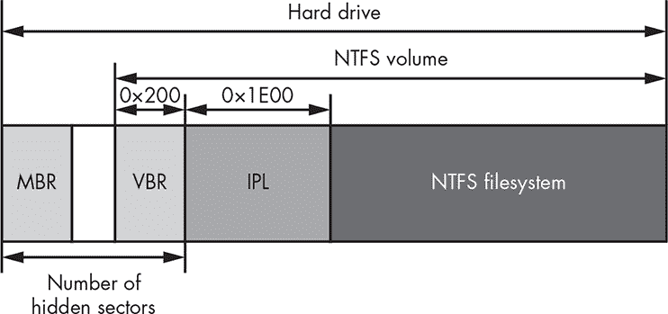

*图 12-3：硬盘上 IPL 的位置*

#### *感染 VBR*

Gapz 通过在系统启动时操作 BPB 中的`HiddenSectors`字段值来劫持控制流。在感染计算机时，如果有足够的空间，Gapz 会在第一个分区之前写入引导程序主体，否则会在最后一个分区之后写入，并修改`HiddenSectors`字段，使其指向硬盘上根木马主体的起始位置，而不是指向合法的 IPL 代码（见图 12-4）。因此，在下一次启动时，VBR 代码会加载并执行位于硬盘末端的 Gapz 引导程序代码。

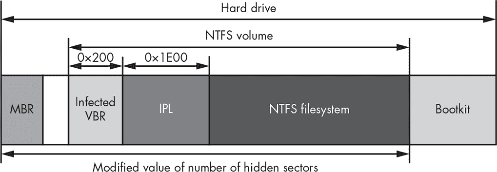

*图 12-4：Gapz 引导程序感染布局*

这一技术特别巧妙之处在于，它只修改了 VBR 数据中的 4 个字节，远少于其他引导程序。例如，TDL4 修改了 MBR 代码（446 字节）；Olmasco 修改了 MBR 分区表中的一个条目（16 字节）；Rovnix 修改了占用 15 个扇区或 7,680 字节的 IPL 代码。

Gapz 出现在 2012 年，当时安全行业已经赶上了现代引导程序（bootkits），并且 MBR、VBR 和 IPL 代码监控已经成为常规做法。然而，通过修改 BPB 中的`HiddenSectors`字段，Gapz 将引导程序感染技术推向了一个新的高度，甩开了安全行业。Gapz 出现之前，安全软件通常不会检查 BPB 字段的异常情况。安全行业花了一些时间才意识到它的新型感染方法并开发出相应的解决方案。

另一个使 Gapz 与众不同的地方是，`HiddenSectors`字段的内容并非固定不变的—它们可能会因系统而异。`HiddenSectors`的值很大程度上取决于硬盘的分区方案。一般来说，安全软件仅凭`HiddenSectors`值无法判断系统是否感染，需要对偏移处的实际代码进行更深入的分析。

图 12-5 展示了从感染了 Gapz 的真实系统中提取的 VBR 内容。BPB 位于偏移量 11 处，`HiddenSectors`字段的值为 0x00000800，并已突出显示。

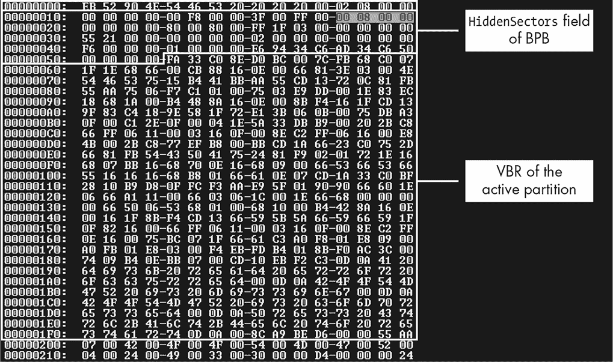

*图 12-5：感染系统上的`HiddenSectors`值*

为了能够检测到 Gapz，安全软件必须分析硬盘从起始位置偏移 0x00000800 处的数据。这就是恶意引导加载程序的位置。

#### *加载恶意的内核模式驱动程序*

与许多现代引导程序类似，Gapz 引导程序代码的主要目的是通过将恶意代码加载到内核模式地址空间中来破坏操作系统。一旦 Gapz 引导程序获得控制，它会按之前章节所描述的常规流程修补操作系统的引导组件。

一旦执行，bootkit 代码会挂钩 INT 13h 处理程序，以监视从硬盘读取的数据。然后，它从硬盘加载原始 IPL 代码并执行，以恢复启动过程。图 12-6 展示了一个受 Gapz 感染的系统中的启动过程。

在挂钩 INT 13h ➊ 后，恶意软件监视从硬盘读取的数据，并寻找 *bootmgr* 模块，进而在内存中打补丁以挂钩 `Archx86TransferTo32BitApplicationAsm`（对于 x64 Windows 平台为 `Archx86TransferTo64BitApplicationAsm`）例程 ➋。该例程将控制权从 *bootmgr* 转移到 *winload.exe* 的入口点。这个挂钩用于修补 *winload.exe* 模块。一旦 *bootmgr* 中的挂钩被触发，*winload.exe* 就已经在内存中，恶意软件可以对其进行打补丁。Bootkit 在 *winload.exe* 模块中挂钩 `OslArchTransferToKernel` 例程 ➌。

如上一章所述，Rovnix 也从挂钩 INT 13h 处理程序开始，修补 *bootmgr*，并挂钩 `OslArchTransferToKernel`。但是，与 Gapz 不同，Rovnix 在下一步通过修补内核的 `KiSystemStartup` 例程来入侵内核。

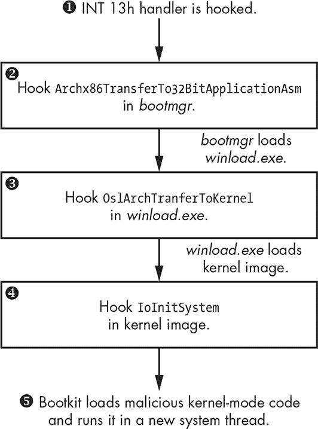

*图 12-6：bootkit 的工作流程*

另一方面，Gapz 会在内核映像中挂钩另一个例程：`IoInitSystem` ➍。这个例程的目的是通过初始化不同的操作系统子系统并调用启动驱动程序的入口点来完成内核初始化。一旦 `IoInitSystem` 执行，恶意挂钩就会被触发，恢复 `IoInitSystem` 例程的修补字节，并将 `IoInitSystem` 的返回地址覆盖为指向恶意代码的地址。然后，Gapz bootkit 会将控制权交还给 `IoInitSystem` 例程。

在例程完成后，控制权会返回到恶意代码中。`IoInitSystem` 执行后，内核被正确初始化，bootkit 可以使用它提供的服务来访问硬盘、分配内存、创建线程等。接下来，恶意软件从硬盘读取其余的 bootkit 代码，创建一个系统线程，最后将控制权交还给内核。一旦恶意的内核模式代码在内核模式地址空间中执行完毕，bootkit 的工作就完成了 ➎。

**避免被安全软件检测到**

在启动过程的最开始，Gapz 会从受感染的 VBR 中移除 bootkit 感染；它在内核模式模块执行期间稍后恢复感染。一个可能的解释是，一些安全产品在启动时会执行系统检查，因此通过在此时从 VBR 中移除感染证据，Gapz 能够不被察觉。

### Gapz Rootkit 功能

在本节中，我们将重点讨论恶意软件的 rootkit 功能，这是 Gapz 在其 bootkit 功能之后最有趣的方面。我们将 Gapz 的 rootkit 功能称为*内核模式模块*，因为它不是一个有效的内核模式驱动程序，严格来说，它根本不是一个 PE 映像。相反，它被布置为位置独立代码，包含多个块，每个块实现恶意软件的特定功能以完成某个任务。内核模式模块的目的是秘密且悄无声息地将有效负载注入系统进程。

Gapz 内核模式模块最有趣的方面之一是它实现了一个自定义的 TCP/IP 网络栈，用于与 C&C 服务器通信；它使用一个加密库，其中包含自定义实现的加密原语，如 RC4、MD5、SHA1、AES 和 BASE64，用于保护其配置数据和 C&C 通信通道。而且，像其他复杂的威胁一样，它实现了隐藏存储，用于秘密存储其用户模式有效负载和配置信息。Gapz 还包括一个强大的钩子引擎，并内置反汇编器，用于设置持久且隐蔽的钩子。在本节的其余部分，我们将详细讨论 Gapz 内核模式模块的这些以及更多方面。

Gapz 内核模式模块不是传统的 PE 映像，而是由一组位置独立代码（*PIC*）的块组成，这些块不使用绝对地址来引用数据。因此，它的内存缓冲区可以位于进程地址空间中的任何有效虚拟地址。每个块都有特定的用途。每个块前面都有一个头部，描述其在模块中的大小和位置，以及用于计算该块中实现的例程地址的一些常量。头部的布局如列表 12-5 所示。

```
struct GAPZ_BASIC_BLOCK_HEADER

{

    // A constant that is used to obtain addresses

    // of the routines implemented in the block

 ➊ unsigned int ProcBase;

    unsigned int Reserved[2];

    // Offset to the next block

 ➋ unsigned int NextBlockOffset;

    // Offset of the routine performing block initialization

 ➌ unsigned int BlockInitialization;

    // Offset to configuration information

    // from the end of the kernel-mode module

    // valid only for the first block

    unsigned int CfgOffset;

    // Set to zeroes

    unsigned int Reserved1[2];

}
```

*列表 12-5：Gapz 内核模式模块块头部*

头部以整数常量`ProcBase` ➊开始，用于计算基本块中实现的例程的偏移量。`NextBlockOffset` ➋指定模块中下一个块的偏移量，允许 Gapz 枚举内核模式模块中的所有块。`BlockInitialization` ➌包含从块开始到块初始化例程的偏移量，该例程在内核模式模块初始化时执行。此例程初始化与相应块相关的所有必要数据结构，并应在块中实现的任何其他功能之前执行。

Gapz 使用一个全局结构，保存所有与其内核模式代码相关的数据：实现的例程的地址、分配的缓冲区的指针等。该结构使 Gapz 能够确定所有在位置独立代码块中实现的例程的地址，然后执行它们。

无关位置的代码通过十六进制常量 0xBBBBBBBB（适用于 x86 模块）引用全局结构。在恶意内核模式代码执行的最初阶段，Gapz 为全局结构分配一个内存缓冲区。然后，它使用 `BlockInitialization` 例程遍历每个代码块中实现的代码，并将 0xBBBBBBBB 的每次出现替换为全局结构的指针。

在内核模式模块中实现的 `OpenRegKey` 例程的反汇编代码类似于 清单 12-6。再次强调，常量 0xBBBBBBBB 用来引用全局上下文的地址，但在执行过程中，这个常量会被内存中全局结构的实际地址替换，从而确保代码正确执行。

```
int __stdcall OpenRegKey(PHANDLE hKey, PUNICODE_STRING Name)

{

    OBJECT_ATTRIBUTES obj_attr; // [esp+Oh] (ebp-1Ch)@1

    int _global_ptr; // [esp+18h] (ebp-4h)@1

    global ptr = OxBBBBBBBB;

    obj_attr.ObjectName = Name;

    obj_attr.RootDirectory = 0;

    obj_attr.SecurityDescriptor = 0;

    obj_attr.SecurityQualityOfService = 0;

    obj_attr.Length = 24;

    obj_attr.Attributes = 576;

    return (MEMORY[0xBBBBBBB] ->Zw0penKey)(hKey, 0x20019 &ob attr);

}
```

*清单 12-6：在 Gapz 内核模式代码中使用全局上下文*

总的来说，Gapz 在内核模式模块中实现了 12 个代码块，列在 表 12-2 中。最后一个代码块实现了内核模式模块的主例程，该例程启动模块的执行，初始化其他代码块，设置挂钩并启动与 C&C 服务器的通信。

**表 12-2：** Gapz 内核模式代码块

| **代码块编号** | **实现功能** |
| --- | --- |
| 1 | 一般 API，收集硬盘上的信息，CRT 字符串例程等 |
| 2 | 加密库：RC4，MD5，SHA1，AES，BASE64 等 |
| 3 | 挂钩引擎，反汇编引擎 |
| 4 | 隐藏存储实现 |
| 5 | 硬盘驱动程序挂钩，自我防御 |
| 6 | 有效载荷管理器 |
| 7 | 注入有效载荷到进程的用户模式地址空间 |
| 8 | 网络通信：数据链路层 |
| 9 | 网络通信：传输层 |
| 10 | 网络通信：协议层 |
| 11 | 有效载荷通信接口 |
| 12 | 主例程 |

### 隐藏存储

与大多数启动工具一样，Gapz 实现了隐藏存储，以安全地存储其有效载荷和配置信息。隐藏文件系统的映像位于硬盘上的一个文件中，路径为 *\??\C:\System Volume Information\<XXXXXXXX-XXXX-XXXX-XXXX-XXXXXXXXXXXX>*，其中 *X* 表示基于配置信息生成的十六进制数字。隐藏存储的布局采用 FAT32 文件系统。图 12-7 显示了 *\usr\overlord* 隐藏存储目录的内容示例。你可以看到该目录中存储了三个文件：*overlord32.dll*、*overlord64.dll* 和 *conf.z*。前两个文件对应用户模式有效载荷，将被注入到系统进程中。第三个文件 *conf.z* 包含配置数据。

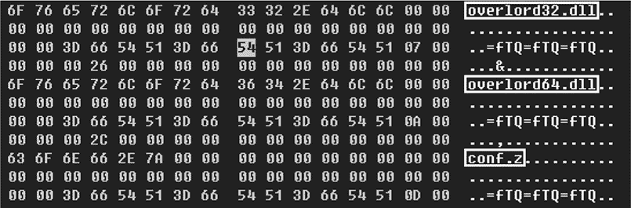

*图 12-7：隐藏存储的内容* \usr\overlord *目录*

为了保持隐藏文件系统中存储的信息的机密性，其内容被加密，如 清单 12-7 所示。

```
int stdcall aes_crypt_sectors_cbc(int 1V, int c_text, int p_text, int num_of_sect,

                                  int bEncrypt, STRUCT_AES_KEY *Key)

{

    int result; // eax01

    int _iv; // edi02

    int cbc_iv[4]; // [esp+0h] [ebp-14h)@3

   STRUCT_IPL_THREAD_1 *gl_struct; // [esp+10h] [ebp-4h}@1

    gl_struct = 0xBBBBBBBB;

    result = num_of_sect;

    if ( num_of_sect )

    {

     ➊ _iv = IV;

        do

        {

            cbc_iv[3] = 0;

            cbc_iv[2] = 0;

            cbc_iv[1] = 0;

            cbc iu[0] = _iv; // CBC initialization value

            result = (gl_struct->crypto->aes_crypt_cbc)(Key, bEncrypt, 512, cbc_iv,

                                                        p_text, c_text);

            p_text += 512; // plain text

            c text += 512; // ciper text

         ➋ ++_iv;

            --num_of_sect;

        }

        while( num_of_sect );

    }

    return result;

}
```

*清单 12-7：隐藏存储中扇区的加密*

为了加密和解密隐藏存储的每个扇区，Gapz 采用了自定义实现的高级加密标准（AES）算法，密钥长度为 256 位，并以*密码块链接（CBC）*模式工作。Gapz 将第一个被加密或解密的扇区的编号➊作为 CBC 模式的初始化值（IV），如 Listing 12-7 所示。然后，每个后续扇区的 IV 都会递增 1➋。尽管使用相同的密钥加密硬盘的每个扇区，但由于对不同扇区使用不同的 IV，每次生成的密文都是不同的。

#### *针对反恶意软件软件的自我防御*

为了防止自己被从系统中移除，Gapz 在硬盘迷你端口驱动程序上钩住了两个例程：`IRP_MJ_INTERNAL_DEVICE_CONTROL`和`IRP_MJ_DEVICE_CONTROL`。在这些钩子中，恶意软件只对以下请求感兴趣。

+   `IOCTL_SCSI_PASS_THROUGH`

+   `IOCTL_SCSI_PASS_THROUGH_DIRECT`

+   `IOCTL_ATA_PASS_THROUGH`

+   `IOCTL_ATA_PASS_THROUGH_DIRECT`

这些钩子保护了被感染的 VBR 或 MBR 以及硬盘上的 Gapz 映像，避免它们被读取或覆盖。

与 TDL4、Olmasco 和 Rovnix 不同，后者通过覆盖`DRIVER_OBJECT`结构中的处理程序指针，Gapz 使用拼接技术：即它直接修补处理程序的代码。在 Listing 12-8 中，你可以看到内存中*scsiport.sys*驱动程序映像的钩子例程。在这个例子中，*scsiport.sys*是一个磁盘迷你端口驱动程序，负责实现`IOCTL_SCSI_`XXX 和`IOCTL_ATA_`XXX 请求处理程序，它是 Gapz 钩子的主要目标。

```
   SCSIPORTncsiPortGlobalDispatch:

   f84ce44c 8bff                       mov     edi,edi

➊ f84ce44e e902180307                 jmp     ff4ffc55

   f84ce453 088b42288b40               or      byte ptr [ebx+408B2842h],c1

   f84ce459 1456                       adc     a1,56h

   f84ce45b 8b750c                     mov     esi,dword ptr [ebp+0Ch]

   f84ce45e 8b4e60                     mov     ecx,dword ptr [esi+60h}]

   f84ce461 0fb609                     movzx   ecx,byte ptr [ecx]

   f84ce464 56                         push    esi

   f84ce465 52                         push    edx

   f84ce466 ff1488                     call    dword ptr [eax+ecx*4]

   f84ce469 5e                         pop     esi

   f84ce46a 5d                         pop     ebp

   f84ce46b c20800                     ret     8
```

*Listing 12-8: `scsiport!ScsiPortGlobalDispatch`例程的钩子*

请注意，Gapz 并没有像其他恶意软件那样在例程的最开始（0xf84ce44c）处打补丁➊。Listing 12-9 中可以看到，它跳过了被钩住的例程的前几条指令（例如，`nop`和`mov edi, edi`）。

其中一个可能的原因是为了提高内核模式模块的稳定性和隐蔽性。一些安全软件只检查前几个字节的修改，以检测是否有补丁或钩子程序，因此跳过钩子前的几条指令让 Gapz 有机会绕过安全检查。

跳过钩子例程的前几条指令还防止 Gapz 干扰已经放置在例程上的合法钩子。例如，在 Windows 的“热补丁”可执行映像中，编译器会在函数的最开始插入`mov edi, edi`指令（如 Listing 12-8 所示）。这条指令是 OS 可能设置的合法钩子的占位符。跳过这条指令可以确保 Gapz 不会破坏操作系统的代码修补功能。

清单 12-9 中的代码片段显示了钩子例程的代码，该例程分析处理程序的指令，以找到设置钩子的最佳位置。它检查指令的操作码 0x90（对应于`nop`）和 0x8B/0x89（对应于`mov edi, edi`）。这些指令可能表明目标例程属于一个可热补丁的镜像，因此可能会被操作系统潜在地补丁。这样，恶意软件就知道在设置钩子时跳过这些指令。

```
for ( patch_offset = code_to_patch; ; patch_offset += instr.len )

{

    (v42->proc_buff_3->disasm)(patch_offset, &instr);

    if ( (instr.len != 1 || instr.opcode != 0x90u)

        && (instr.len != 2 || instr.opcode != 8x89u &&

            instr.opcode != Ox8Bu || instr.modrm_rm != instr.modrm_reg) ) )

    {

        break;

    }

}
```

*清单 12-9：Gapz 使用反汇编器跳过钩子例程的前几个字节*

为了执行此分析，Gapz 实现了*黑客反汇编引擎*，该引擎可用于 x86 和 x64 平台。这使得恶意软件不仅能够获取指令的长度，还能获取其他特性，如指令的操作码及其操作数。

**黑客反汇编引擎**

黑客反汇编引擎（HDE）是一个小型、简单、易于使用的反汇编引擎，旨在用于 x86 和 x64 代码分析。它提供命令的长度、操作码以及其他指令参数，如前缀 ModR/M 和 SIB。HDE 常被恶意软件用于反汇编例程的序言，以设置恶意钩子（如上文所述的情况）或检测并移除安全软件安装的钩子。

#### *有效负载注入*

Gapz 内核模式模块将有效负载注入到用户模式地址空间，如下所示：

1.  读取配置文件信息，以确定应将哪些有效负载模块注入到特定进程中，然后从隐藏存储中读取这些模块。

1.  在目标进程的地址空间中分配一个内存缓冲区，用于存储有效负载镜像。

1.  在目标进程中创建并运行一个线程，执行加载器代码；该线程映射有效负载镜像，初始化 IAT，并修复重定位。

隐藏文件系统中的*\sys*目录包含一个配置文件，该文件指定了应注入到特定进程中的有效负载模块。配置文件的名称是通过 SHA1 哈希算法，从隐藏文件系统的 AES 加密密钥推导而来。配置文件由一个头部和多个条目组成，每个条目描述了一个目标进程，如图 12-8 所示。

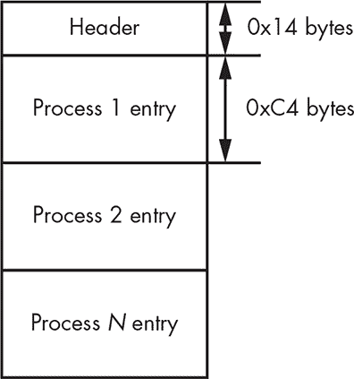

*图 12-8：有效负载注入配置文件的布局*

每个进程条目具有清单 12-10 所示的布局。

```
struct GAPZ_PAYLOAD_CFG

{

  // Full path to payload module into hidden storage

  char PayloadPath[128];

  // name of the process image

➊ char TargetProcess[64];

  // Specifies load options: x86 or x64 and and so on

➋ unsigned char LoadOptions;

  // Reserved

  unsigned char Reserved[2];

  // Payload type: overlord, other

➌ unsigned char PayloadType;

}
```

*清单 12-10：配置文件中有效负载配置条目的布局*

`TargetProcess`字段➊包含要注入有效负载的进程名称。`LoadOptions`字段➋指定有效负载模块是 32 位镜像还是 64 位镜像，具体取决于受感染的系统。`PayloadType`字段➌表示要注入的模块是“上级”模块还是其他有效负载。

模块*overlord32.dll*（64 位进程为*overlord64.dll*）被注入到系统中的*svchost.exe*进程中。*overlord32.dll*模块的目的是执行恶意内核模式代码发出的 Gapz 命令。这些执行的命令可能会执行以下任务：

+   收集系统中所有网络适配器及其属性的信息。

+   收集系统中特定软件的存在信息。

+   通过尝试访问* [`www.update.microsoft.com`](http://www.update.microsoft.com) *来检查互联网连接。

+   使用 Windows 套接字发送和接收远程主机的数据。

+   从*http://www.time.windows.com*获取系统时间。

+   在给定域名时，通过 Win32 API `gethostbyname`获取主机的 IP 地址。

+   获取 Windows Shell（通过查询*Software\Microsoft\Windows NT\CurrentVersion\Winlogon*注册表项的“shell”值）。

然后，这些命令的结果会传回内核模式。图 12-9 显示了从受感染系统的隐藏存储中提取的一些配置信息示例。

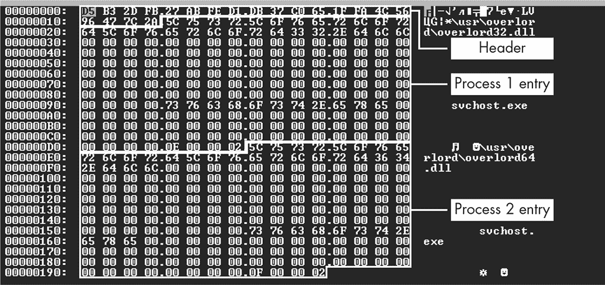

*图 12-9：有效负载配置文件的示例*

您可以看到两个模块—*overlord32.dll*和*overlord64.dll*—分别用于注入到 x86 和 x64 位系统中的*svchost.exe*进程。

一旦有效负载模块和目标进程被识别，Gapz 会在目标进程的地址空间中分配一个内存缓冲区，并将有效负载模块复制到其中。然后，恶意软件在目标进程中创建一个线程来运行加载器代码。如果操作系统是 Windows Vista 或更高版本，Gapz 可以通过简单地执行系统例程`NtCreateThreadEx`来创建新线程。

在 Vista 之前的操作系统（如 Windows XP 或 Server 2003）中，事情会更加复杂，因为操作系统内核并未导出`NtCreateThreadEx`例程。在这些情况下，Gapz 会重新实现`NtCreateThreadEx`的一部分功能，并遵循以下步骤：

1.  手动分配将保存新线程的堆栈。

1.  初始化线程的上下文和线程环境块（TEB）。

1.  通过执行未记录的例程`NtCreateThread`来创建一个线程结构。

1.  如有必要，在客户端/服务器运行时子系统（CSRSS）中注册新创建的线程。

1.  执行新线程。

加载器代码负责将有效负载映射到进程的地址空间，并在用户模式下执行。根据有效负载类型，加载器代码有不同的实现，如图 12-10 所示。对于作为 DLL 库实现的有效负载模块，有两个加载器：DLL 加载器和命令执行器。对于作为 EXE 模块实现的有效负载模块，也有两个加载器。

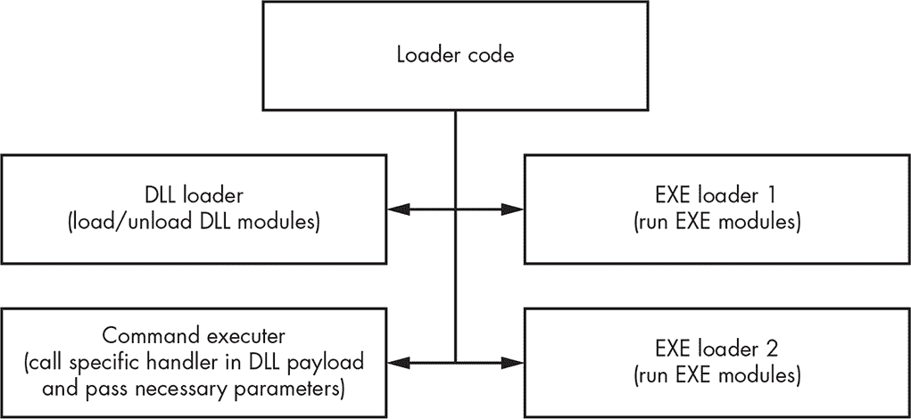

*图 12-10：Gapz 注入能力*

现在我们来看看每个加载器。

##### DLL 加载器代码

Gapz DLL 加载器例程负责加载和卸载 DLL。它将可执行图像映射到目标进程的用户模式地址空间，初始化其 IAT，修复重定位，并根据有效载荷是否加载或卸载，执行以下导出例程：

**导出例程 #1（加载有效载荷）** 初始化加载的有效载荷

**导出例程 #2（卸载有效载荷）** 取消初始化已加载的有效载荷

图 12-11 展示了有效载荷模块*overlord32.dll*。

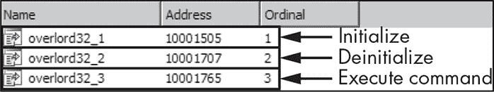

*图 12-11：Gapz 有效载荷的导出地址表*

图 12-12 展示了该例程。当卸载有效载荷时，Gapz 执行导出例程 #2 并释放用于保存有效载荷图像的内存。当加载有效载荷时，Gapz 执行所有必要的步骤，将图像映射到进程的地址空间中，然后执行导出例程 #1。

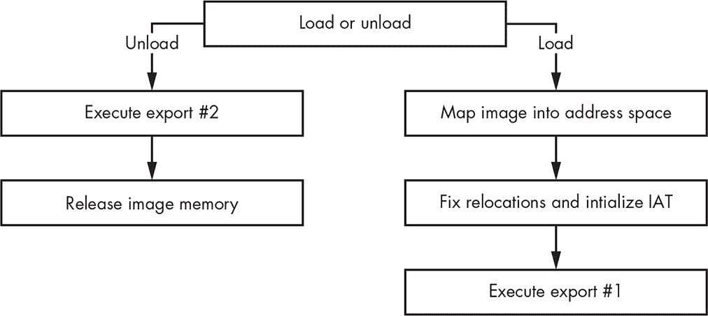

*图 12-12：Gapz DLL 有效载荷加载算法*

##### 命令执行器代码

命令执行器例程负责按照加载的有效载荷 DLL 模块的指令执行命令。该例程仅调用有效载荷的导出例程 #3（图 12-11），并将所有必要的参数传递给其处理程序。

##### EXE 加载器代码

另外两个加载器例程用于在感染的系统中运行下载的可执行文件。第一个实现从*TEMP*目录运行可执行有效载荷：图像被保存到*TEMP*目录，并执行`CreateProcess` API，如图 12-13 所示。

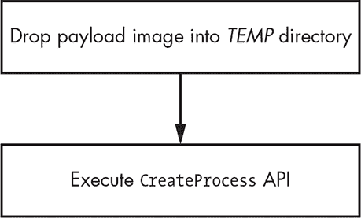

*图 12-13：通过`CreateProcess`运行 Gapz EXE 有效载荷的算法*

第二种实现通过创建一个挂起的合法进程来运行有效载荷，然后用恶意图像覆盖合法进程图像；之后，进程恢复运行，如图 12-14 所示。

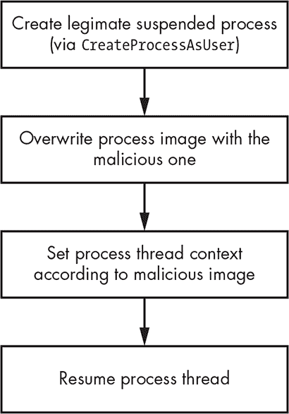

*图 12-14：通过`CreateProcessAsUser`运行 Gapz EXE 有效载荷的算法*

第二种加载可执行有效载荷的方法比第一种更隐蔽且不易被检测。虽然第一种方法只是直接运行有效载荷而不加任何预防，但第二种方法首先创建一个合法的可执行进程，然后才用恶意有效载荷替换原始图像。这可能会欺骗安全软件，使其允许有效载荷执行。

#### *有效载荷通信接口*

为了与注入的有效载荷进行通信，Gapz 以一种相当不寻常的方式实现了特定接口：通过伪装成*null.sys*驱动程序中有效载荷请求的处理程序。此技术在图 12-15 中展示。

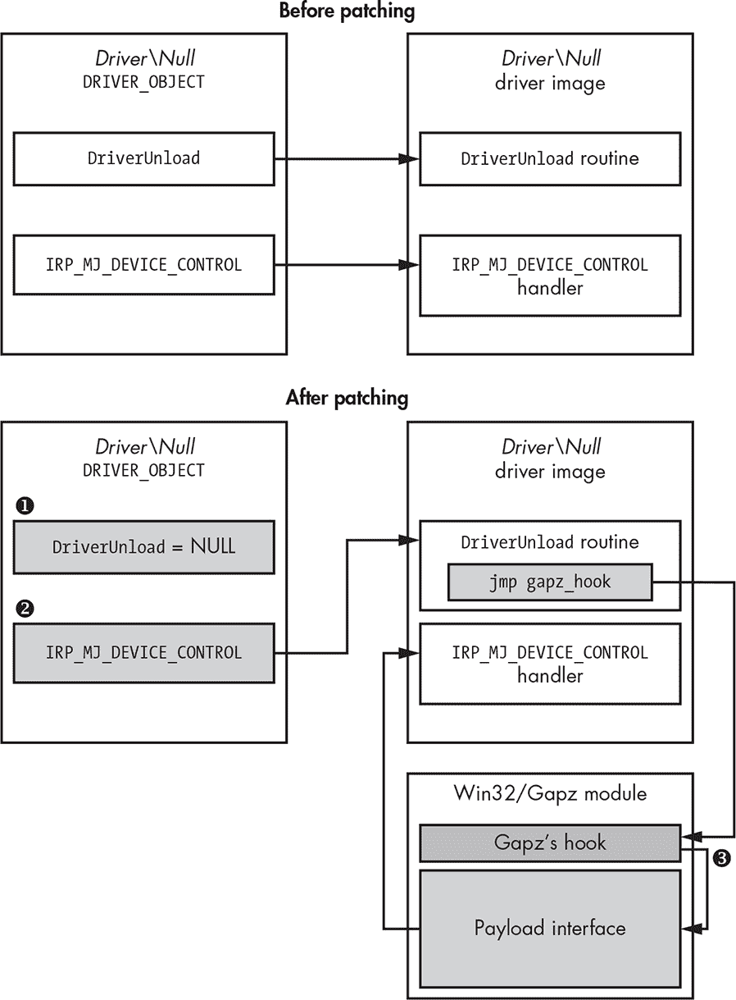

*图 12-15：Gapz 有效载荷接口架构*

恶意软件首先将对应于 *\Device\Null* 设备对象的 `DRIVER_OBJECT` 结构中的 `DriverUnload` 字段 ➊ 设置为 `0`（存储当操作系统卸载驱动程序时将执行的处理程序的指针），并钩住原始的 `DriverUnload` 例程。然后，它将 `DRIVER_OBJECT` 中 `IRP_MJ_DEVICE_CONTROL` 处理程序的地址替换为钩住的 `DriverUnload` 例程的地址 ➋。

钩子检查 `IRP_MJ_DEVICE_CONTROL` 请求的参数，以确定请求是否由有效负载发起。如果是，则调用有效负载接口处理程序，而不是原始的 `IRP_MJ_DEVICE_CONTROL` 处理程序 ➌。

**驱动卸载例程**

在卸载内核模式驱动程序之前，操作系统内核会执行特殊的 `DriverUnload` 例程。这个由要卸载的内核模式驱动程序实现的可选例程，用于执行系统卸载驱动程序之前所需的任何操作。该例程的指针存储在对应 `DRIVER_OBJECT` 结构的 `DriverUnload` 字段中。如果该例程未实现，`DriverUnload` 字段将包含 `NULL`，此时驱动程序无法卸载。

`DriverUnload` 钩子的代码片段显示在 示例 12-11 中。

```
hooked_ioctl = MEMORY[0xBBBBBBE3]->IoControlCode_HookArray;

➊ while ( *hooked_ioctl != IoStack->Parameters.DeviceIoControl_IoControlCode )

{

    ++1; // check if the request comes from the payload

    ++hooked_ioctl;

    if ( i >= IRP_MJ_SYSTEM_CONTROL )

        goto LABEL_11;

}

UserBuff = Irp->UserBuffer;

IoStack = IoStack->Parameters_DeviceIoControl.OutputBufferLength;

OutputBufferLength = IoStack;

if ( UserBuff )

{

    // decrypt payload request

 ➋ (MEMORY [0xBBBBBBBF]->rc4)(UserBuff, IoStack, MEMORY [0xBBBBBBBB]->rc4_key, 48);

    v4 = 0xBBBBBBBB;

    // check signature

    if ( *UserBuff == 0x34798977 )

    {

        hooked_ioctl = MEMORY [0xBBBBBBE3];

        IoStack = i;

        // determine the handler

        if ( UserBuff[1] == MEMORY [0xBBBBBBE3]->IoControlCodeSubCmd_Hook[i] )

        {

           ➌ (MEMORY [0xBBBBBBE3] ->IoControlCode_HookDpc[i])(UserBuff);

           ➍ (MEMORY 0xBBBBBBBF( // encrypt the reply

                UserBuff,

                OutputBufferLength,

                MEMORY [0xBRBBBBBB] ->rc4_key,

                48);

            v4 = 0xBBBBBBBB;

        }

        _Irp = Irp;

    }

}
```

*示例 12-11：`DriverUnload` 钩子代码摘录自* null.sys

Gapz 在➊处检查请求是否来自有效负载。如果是，它使用 RC4 加密算法 ➋ 解密请求并执行相应的处理程序 ➌。请求处理完毕后，Gapz 将结果加密 ➍ 并返回给有效负载。

有效负载可以使用 示例 12-12 中的代码向 Gapz 内核模式模块发送请求。

```
// open handle for \Device\NULL

➊  HANDLE hNull = CreateFile(_T("\\??\\NUL"), ...);

if(hNull != INVALID_HANDLE_VALUE) {

  // Send request to kernel-mode module

➋ DWORD dwResult = DeviceIoControl(hNUll, WIN32_GAPZ_IOCTL, InBuffer, InBufferSize, OutBuffer,

                                   OutBufferSize, &BytesRead);

  CloseHandle(hNull);

}
```

*示例 12-12：从用户模式有效负载向内核模式模块发送请求*

有效负载打开 `NULL` 设备的句柄 ➊。这是一个系统设备，因此该操作不会引起任何安全软件的注意。一旦有效负载获得句柄，它便使用 `DeviceIoControl` 系统 API ➋ 与内核模式模块进行通信。

#### *自定义网络协议栈*

引导木马通过 HTTP 协议与 C&C 服务器通信，其主要目的是请求并下载有效负载并报告机器人状态。恶意软件强制执行加密，以保护交换消息的机密性，并验证消息来源的真实性，以防止来自伪造 C&C 服务器的指令破坏。

网络通信最引人注目的特点是其实现方式。恶意软件通过两种方式向 C&C 服务器发送消息：使用用户模式有效负载模块（*overlord32.dll* 或 *overlord64.dll*）或使用自定义的内核模式 TCP/IP 协议栈实现。这种网络通信方案如图 12-16 所示。

用户模式的有效载荷，*overlord32.dll* 或 *overlord64.dll*，通过 Windows 套接字实现将消息发送到 C&C 服务器。自定义实现的 TCP/IP 协议栈依赖于迷你端口适配器驱动程序。通常，网络通信请求会通过网络驱动程序栈，而在栈的不同层级，安全软件驱动程序可能会对其进行检查。根据微软的网络驱动接口规范（NDIS），迷你端口驱动程序是网络驱动栈中的最低级驱动程序，因此通过将网络 I/O 数据包直接发送到迷你端口设备对象，Gapz 可以绕过所有中间驱动程序，避免被检查（见图 12-17）。

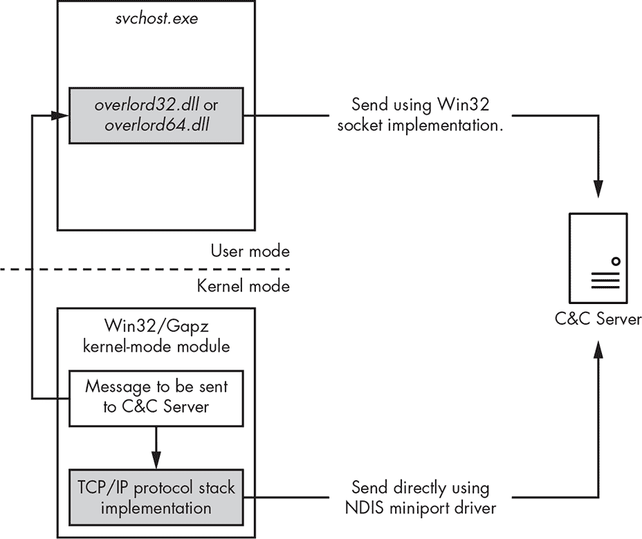

*图 12-16: Gapz 网络通信方案*

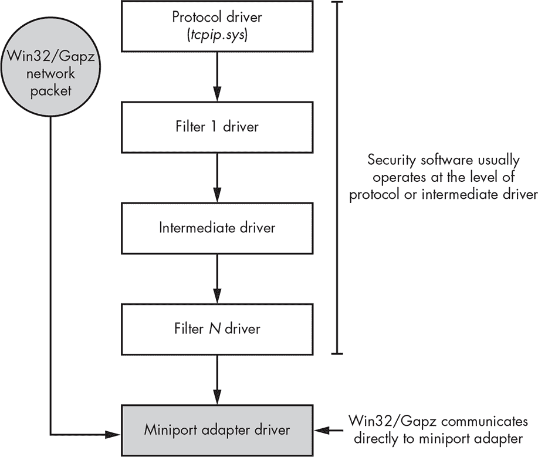

*图 12-17: Gapz 自定义网络实现*

Gapz 通过手动检查 NDIS 库（*ndis.sys*）代码，获取描述迷你端口适配器的结构体指针。负责处理 NDIS 迷你端口适配器的例程在内核模式模块的第 8 块中实现。

这种方法使得 Gapz 能够通过套接字接口与 C&C 服务器通信，而不被发现。Gapz 网络子系统的架构概述见图 12-18。

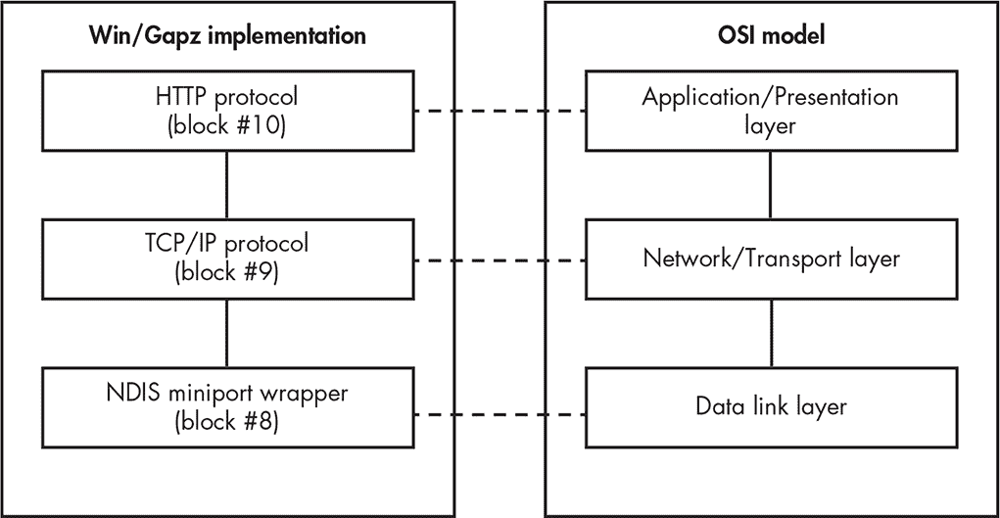

*图 12-18: Gapz 网络架构*

正如你所看到的，Gapz 网络架构实现了开放系统互联（OSI）模型的大部分层级：数据链路层、传输层和应用层。为了将网络数据包发送到并接收自代表网络接口卡的物理设备对象，Gapz 使用系统中可用的相应接口（由网络卡驱动提供）。然而，所有与创建和解析网络帧相关的工作完全由恶意软件的自定义网络栈实现。

### 结论

正如你所看到的，Gapz 是一种复杂的恶意软件，具有非常精密的实现，并且由于其 VBR 感染技术，它是最为隐蔽的引导病毒之一。没有任何已知的引导病毒能够拥有如此优雅和微妙的感染方式。它的发现迫使安全行业提升了对引导病毒的检测方法，并深入挖掘 MBR/VBR 扫描，不仅关注 MBR/VBR 代码修改，还关注以前被认为不在范围内的参数和数据结构。
