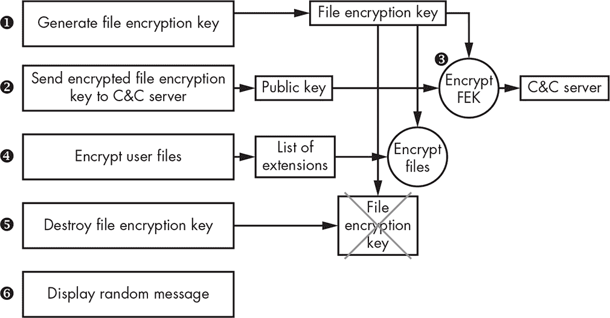
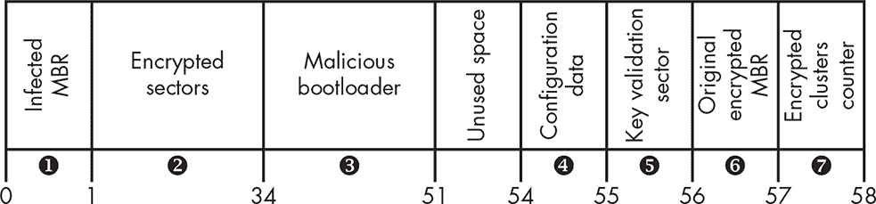
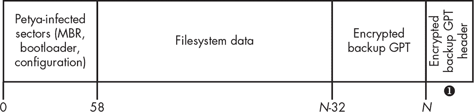
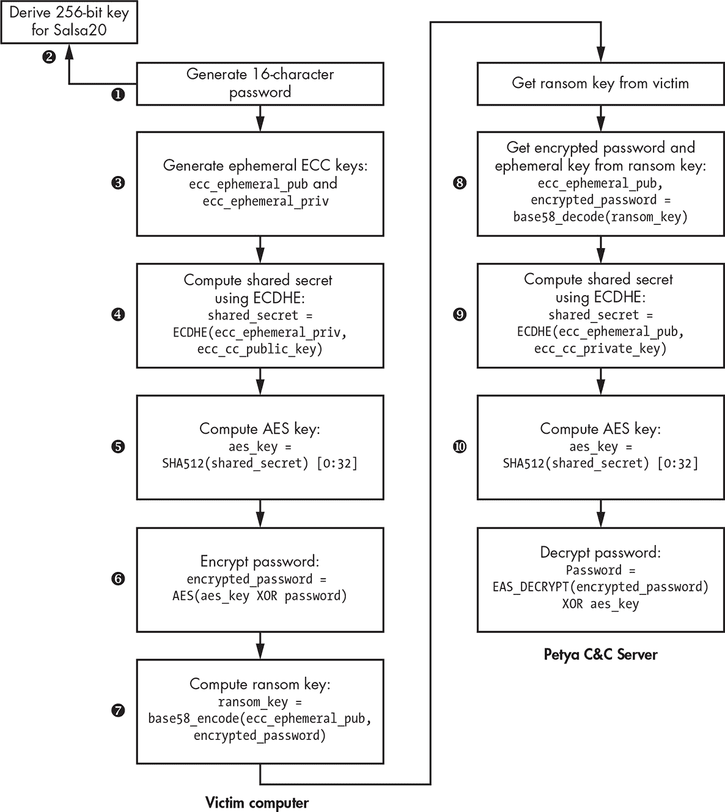
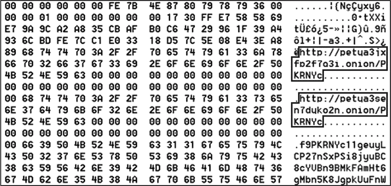
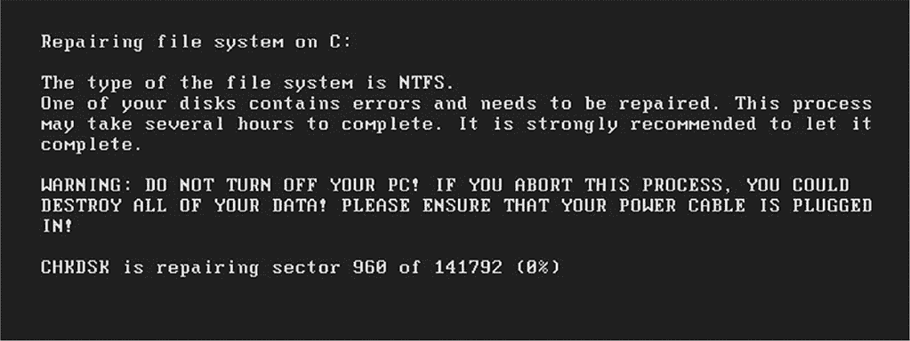
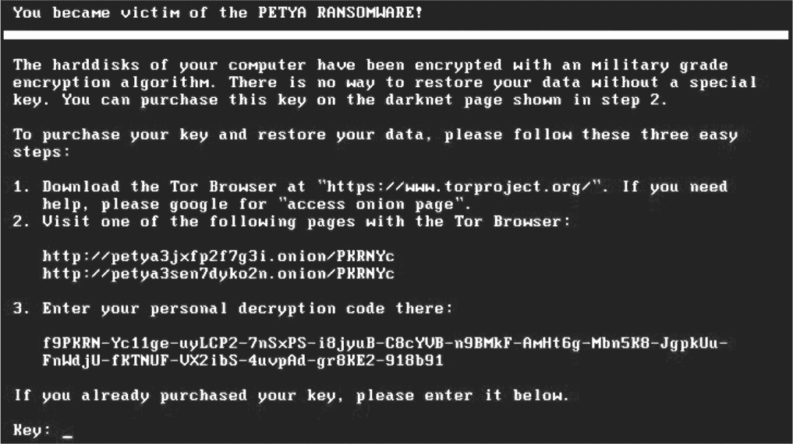
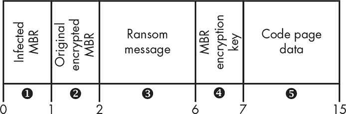
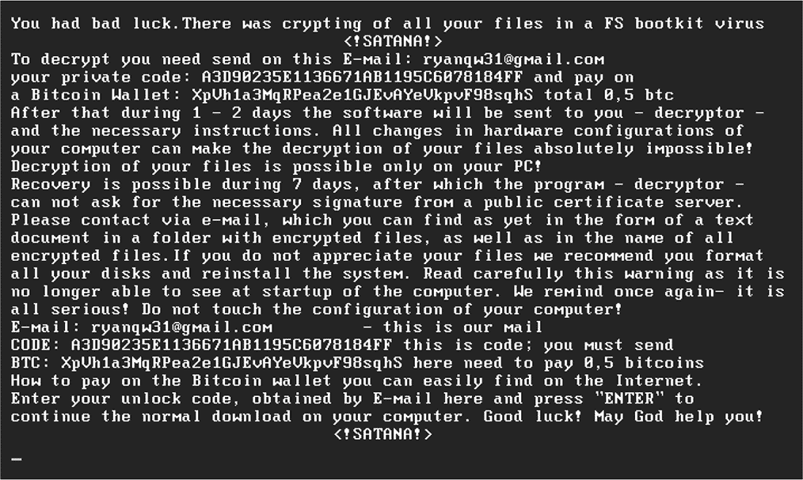

## **MBR 勒索软件的兴起**


到目前为止，本书中描述的恶意软件示例都属于某一特定类别：具备 rootkit 或 bootkit 功能的计算机木马，其目的是在受害者的系统上长期存在，执行各种恶意活动——如进行浏览器点击欺诈、发送垃圾邮件、打开后门或创建 HTTP 代理等。这些木马利用 bootkit 持久化方法在感染的计算机上持续存在，并利用 rootkit 功能保持隐匿。

在这一章中，我们将重点介绍 *勒索软件*，这是一种有着截然不同作案手法的恶意软件家族。顾名思义，勒索软件的主要目的是完全锁定用户的数据或计算机系统，并要求支付赎金以恢复访问权限。

在大多数已知案例中，勒索软件通过加密来剥夺用户的数据。一旦恶意软件被执行，它会尝试加密对用户有价值的所有内容——文档、照片、电子邮件等——然后要求用户支付赎金以获取解密密钥，从而解锁数据。

大多数勒索软件针对存储在计算机文件系统中的用户文件，尽管这些方法并未实现任何先进的 rootkit 或 bootkit 功能，因此与本书内容无关。然而，一些勒索软件家族则加密硬盘的某些扇区，利用 bootkit 功能来阻止用户访问系统。

在这一章中，我们将专注于后一类：针对计算机硬盘的勒索软件，不仅剥夺受害者的文件，还剥夺对整个计算机系统的访问。这类勒索软件加密硬盘的特定区域，并在 MBR 上安装恶意引导程序。该引导程序不会启动操作系统，而是执行硬盘内容的低级加密，并向受害者显示要求支付赎金的信息。特别地，我们将关注两大受到媒体广泛关注的勒索软件家族：Petya 和 Satana。

### 现代勒索软件的简史

勒索软件类恶意软件的最早踪迹出现在计算机病毒 AIDS 中，该病毒首次在 1989 年在野外发现。AIDS 使用类似现代勒索软件的方法，通过覆盖文件开头的恶意代码来感染旧版 MS-DOS COM 可执行文件，使其无法恢复。然而，AIDS 并没有要求受害者支付赎金以恢复访问受感染的程序——它只是彻底销毁了信息，且无法恢复。

第一个已知要求支付赎金的恶意软件是 GpCode Trojan，它首次出现在 2004 年。它因使用 660 位 RSA 加密算法锁定用户文件而闻名。整数因式分解的进展使得在 2004 年几乎能够对 600 位整数进行因式分解（2005 年对成功分解 RSA-640（一种 640 位数字）的人奖励了现金奖金）。随后的修改升级采用了 1,024 位 RSA 加密，提高了恶意软件对暴力破解攻击的抗性。GpCode 通过伪装成求职申请的电子邮件附件进行传播。一旦在受害者系统上执行，它便开始加密用户文件并显示赎金信息。

尽管这些早期的勒索病毒出现了，但直到 2012 年勒索病毒才成为广泛的威胁，从那时起，它一直盛行。一个可能在其增长中起到了重要作用的因素是匿名在线服务的流行，如比特币支付系统和 Tor 网络。勒索病毒开发者能够利用这些系统收取赎金，而不被执法机构追踪到。这种网络犯罪业务证明了极其丰厚的利润，导致勒索病毒的多样化开发和广泛传播。

2012 年勒索病毒激增的起点是 Reveton，它伪装成来自执法机构的消息，根据用户的位置量身定制。例如，在美国的受害者会看到一条伪装成 FBI 的消息。受害者被指控进行非法活动，如未经许可使用版权内容或观看和传播色情内容，并被指示支付罚款，通过如 Ukash、Paysafe 或 MoneyPak 等服务。

不久后，具有类似功能的更多威胁在野外出现。2013 年发现的 CryptoLocker，是当时领先的勒索病毒威胁。它使用了 2,048 位 RSA 加密，主要通过被攻陷的网站和电子邮件附件传播。CryptoLocker 的一个有趣特点是，受害者必须以比特币或预付现金凭证的形式支付赎金。使用比特币为这种威胁增加了另一层匿名性，使追踪攻击者变得极其困难。

另一种显著的勒索病毒是 CTB-Locker，它出现在 2014 年。CTB 代表*Curve/TOR/Bitcoin*，指的是该威胁所使用的核心技术。CTB-Locker 使用了*椭圆曲线加密算法（ECC）*，并且是已知的第一个使用 TOR 协议来隐藏 C&C 服务器的勒索病毒。

网络犯罪业务至今仍然极为盈利，勒索病毒继续演化，许多修改版本不断出现。这里讨论的勒索病毒家族仅占所有已知威胁中的一小部分。

### 具有引导程序功能的勒索病毒

2016 年，发现了两种新的勒索病毒家族：Petya 和 Satana。与其加密文件系统中的用户文件不同，Petya 和 Satana 加密了硬盘的一部分，导致操作系统无法启动，并显示一条消息，要求受害者支付赎金以恢复加密的扇区。实现显示赎金消息的最简单方法是利用基于 MBR 的引导病毒技术。

Petya 通过加密硬盘上*主文件表（MFT）*的内容，将用户锁定在系统之外。MFT 是 NTFS 卷中的一个重要特殊数据结构，包含所有存储在其中的文件的信息，如它们在卷上的位置、文件名及其他属性。它主要作为查找硬盘上文件位置的索引。通过加密 MFT，Petya 确保了文件无法被定位，受害者无法访问卷上的文件，甚至无法启动系统。

Petya 主要通过一封声称是工作申请的电子邮件链接进行传播。这个恶意链接实际上指向了一个包含 Petya 投放程序的恶意 ZIP 压缩包。该恶意软件甚至利用了合法的服务 Dropbox 来托管 ZIP 压缩包。

在 Petya 之后不久发现的 Satana 也通过加密硬盘的 MBR 来使受害者无法访问他们的系统。尽管它的 MBR 感染能力不像 Petya 那样复杂——甚至包含一些漏洞——但它足够有趣，值得稍作讨论。

**SHAMOON：失落的木马**

*Shamoon*是一种木马，它与 Satana 和 Petya 大约同时出现，功能类似。它因在目标系统上销毁数据并使其无法启动而臭名昭著。它的主要目的是破坏目标组织的服务，主要针对能源和石油行业，但由于它没有要求受害者支付赎金，因此这里不做详细讨论。Shamoon 包含一个合法文件系统工具的组件，用于以低级方式访问硬盘，从而覆盖用户文件，包括 MBR 扇区，用它自己的数据块替代。这种攻击导致了许多目标组织的严重停机。它的一个受害者——沙特阿美（Saudi Aramco）花了一周时间才恢复其服务。

### 勒索病毒作案手法

在深入分析 Petya 和 Satana 的引导程序组件之前，我们先从高层次了解一下现代勒索病毒的运作方式。每个勒索病毒家族都有一些偏离这里所示的典型模式的独特之处，但图 13-1 反映了勒索病毒操作最常见的模式。



*图 13-1：现代勒索病毒的作案手法*

在被执行到受害者系统后不久，勒索软件会生成一个用于对称加密的唯一加密密钥 ➊——即任何块加密或流加密（例如 AES、RC4 或 RC5）。这个密钥，我们称之为*文件加密密钥（FEK）*，用于加密用户文件。恶意软件使用一个（伪）随机数生成器生成一个独特的密钥，该密钥无法被猜测或预测。

一旦文件加密密钥生成，它会被传送到 C&C 服务器 ➋ 进行存储。为了避免被网络流量监控软件拦截，恶意软件会使用嵌入在恶意软件中的公钥 ➌ 对文件加密密钥进行加密，通常使用 RSA 加密算法或 ECC 加密，如 CTB-Locker 和 Petya 所采用的方式。这把私钥不在恶意软件主体中，仅攻击者知晓，确保没有其他人能够访问文件加密密钥。

一旦 C&C 服务器确认收到文件加密密钥，恶意软件便开始加密硬盘上的用户文件 ➍。为了减少需要加密的文件量，勒索软件使用嵌入的文件扩展名列表来过滤掉无关的文件（如可执行文件、系统文件等），并只加密那些对受害者最有价值的特定用户文件，如文档、图像和照片。

在加密后，恶意软件会摧毁受害者系统上的文件加密密钥 ➎，使得用户在不支付赎金的情况下几乎不可能恢复文件内容。此时，文件加密密钥通常只存在于攻击者的 C&C 服务器中，尽管在某些情况下，它的加密版本会存储在受害者的系统上。即便如此，如果不知道私有加密密钥，用户仍然几乎无法恢复文件加密密钥并恢复对文件的访问。

接下来，恶意软件会向用户显示一条赎金信息 ➏，并附带支付赎金的说明。在某些情况下，赎金信息嵌入在恶意软件的主体中，而在其他情况下，它会从 C&C 服务器获取赎金页面。

**TORRENTLOCKER：致命缺陷**

不是所有早期的勒索病毒都是如此难以破解的，因为加密过程的实现存在缺陷。例如，早期版本的 TorrentLocker 使用了高级加密标准（AES）加密算法的计数模式来加密文件。在计数模式下，AES 加密算法生成一系列密钥字符，然后与文件内容进行异或（XOR）操作以加密文件。这个方法的弱点在于，它对于相同的密钥和初始化值生成相同的密钥序列，无论文件内容如何。为了恢复密钥序列，受害者可以将加密文件与对应的原始文件进行异或操作，然后使用这个序列来解密其他文件。发现这一点后，TorrentLocker 被更新为使用 AES 加密算法的密码分组链接（CBC）模式，从而消除了这个弱点。在 CBC 模式下，在加密之前，明文块会与上一次加密迭代中的密文块进行异或操作，这样即使输入数据存在微小差异，最终的加密结果也会有显著不同。这使得通过恢复数据的方式来破解 TorrentLocker 变得无效。

### 分析 Petya 勒索病毒

在本节中，我们将重点分析 Petya 硬盘加密功能的技术细节。Petya 以恶意投放程序的形式进入受害者计算机，执行后会解压包含主要勒索病毒功能的有效载荷，这些功能实现为一个 DLL 文件。

#### *获取管理员权限*

虽然大多数勒索病毒不需要管理员权限，但 Petya 确实需要管理员权限，以便能够直接向受害者系统的硬盘写入数据。如果没有此权限，Petya 将无法修改 MBR 的内容并安装恶意引导加载程序。投放程序可执行文件包含一个清单，指定该可执行文件只能在管理员权限下启动。清单 13-1 展示了来自投放程序清单的摘录。

```
<trustInfo >

 <security>

  <requestedPrivileges>

 ➊ <requestedExecutionLevel level="requireAdministrator" uiAccess="false"/>

  </requestedPrivileges>

 </security>

</trustInfo>
```

*清单 13-1：Petya 投放程序清单摘录*

安全部分包含了参数`requestedExecutionLevel`，其值设置为`requireAdministrator` ➊。当用户尝试执行投放程序时，操作系统加载器会检查用户当前的执行级别。如果低于`Administrator`，操作系统会弹出对话框，询问用户是否希望以提升的权限运行该程序（如果用户的账户具有管理员权限），或者提示输入管理员凭据（如果用户账户没有管理员权限）。如果用户决定不授予该程序管理员权限，则投放程序不会启动，系统也不会受到损害。如果用户被引诱以管理员权限执行投放程序，恶意软件则会继续感染系统。

Petya 通过两步感染系统。在第一步中，它收集目标系统的信息，确定硬盘上使用的分区类型，生成其配置文件（加密密钥和勒索信息），构建第二步的恶意引导加载程序，然后用恶意引导加载程序感染计算机的 MBR，并发起系统重启。

重启后，恶意引导加载程序被执行，触发了感染过程的第二步。恶意的 MBR 引导加载程序加密了包含 MFT 的硬盘扇区，然后再次重启计算机。在第二次重启后，恶意引导加载程序显示了第一步生成的勒索消息。

我们将在接下来的章节中更详细地介绍这些步骤。

#### *感染硬盘（第一步）*

Petya 通过获取表示物理硬盘的文件名来启动 MBR 的感染过程。在 Windows 操作系统中，可以通过执行 `CreateFile` API，并传递字符串 `'\\.\PhysicalDrive`X`'` 作为文件名参数来直接访问硬盘，其中 X 对应硬盘在系统中的索引。如果系统中只有一个硬盘，则物理硬盘的文件名为 `'\\.\PhysicalDrive0'`。然而，如果有多个硬盘，恶意软件则使用系统启动的硬盘的索引。

Petya 通过向包含当前 Windows 实例的 NTFS 卷发送特殊请求 `IOCTL_VOLUME_GET_VOLUME_DISK_EXTENTS` 来实现这一过程，恶意软件通过执行 `DeviceIoControl` API 获取此请求。此请求返回一个结构体数组，描述了用于托管 NTFS 卷的所有硬盘。更具体地说，这个请求返回一个 NTFS 卷范围的数组。*卷范围*是指在一个硬盘上连续的扇区范围。例如，单一 NTFS 卷可能托管在两个硬盘上，在这种情况下，此请求将返回包含两个范围的数组。返回的结构体布局如 Listing 13-2 所示。

```
typedef struct _DISK_EXTENT {

➊ DWORD         DiskNumber;

➋ LARGE_INTEGER StartingOffset;

➌ LARGE_INTEGER ExtentLength;

} DISK_EXTENT, *PDISK_EXTENT;
```

*Listing 13-2: `DISK_EXTENT` 布局*

`StartingOffset` 字段 ➋ 描述了硬盘上卷范围的位置，表示从硬盘开始位置的扇区偏移量，而 `ExtentLength` ➌ 提供了它的长度。`DiskNumber` 参数 ➊ 包含了系统中对应硬盘的索引，这个索引也与硬盘文件名中的索引相对应。恶意软件使用返回的卷范围数组中第一个结构体的 `DiskNumber` 字段来构建文件名并访问硬盘。

在构建了物理硬盘的文件名后，恶意软件通过向硬盘发送请求 `IOCTL_DISK_GET_PARTITION_INFO_EX` 来确定硬盘的分区方案。

Petya 能够感染基于 MBR 的分区或 GUID 分区表（GPT）分区的硬盘（GPT 分区的布局在第十四章中描述）。我们首先将查看 Petya 如何感染基于 MBR 的硬盘，然后描述基于 GPT 的磁盘感染细节。

##### 感染 MBR 硬盘

为了感染 MBR 分区方案，Petya 首先读取 MBR，以计算硬盘开始部分与第一个分区开始部分之间的空闲磁盘空间。该空间用于存储恶意引导程序及其配置信息。Petya 获取第一个分区的起始扇区号；如果该分区起始的扇区索引小于 60（0x3C），则表示硬盘上没有足够的空间，Petya 会停止感染过程并退出。

如果索引为 60 或以上，则表示有足够的空间，恶意软件会继续构建恶意引导程序，该引导程序由两个组件组成：恶意 MBR 代码和二阶段引导程序。图 13-2 显示了感染后硬盘前 57 个扇区的布局。



*图 13-2：Petya 感染 MBR 硬盘的扇区布局*

为了构建恶意 MBR，Petya 将原始 MBR 的分区表与恶意 MBR 代码结合，将结果写入硬盘的第一个扇区 ➊，替换掉原始 MBR。原始 MBR 会与固定字节值 0x37 进行异或运算，结果写入第 56 扇区 ➏。

二阶段的恶意引导程序占据了 17 个连续扇区（0x2E00 字节）的磁盘空间，并写入硬盘的 34 至 50 扇区 ➌。恶意软件还通过将扇区 1 至 33 ➋的内容与固定字节值 0x37 进行异或运算来混淆这些扇区。

恶意引导程序的配置信息存储在第 54 扇区 ➍，并由引导程序在感染过程的第二步中使用。我们将在“使用恶意引导程序配置数据加密”中详细讨论配置数据结构，详见第 215 页。

Petya 还使用第 55 扇区 ➎存储一个 512 字节的缓冲区，填充了 0x37 字节值，该缓冲区将用于验证受害者提供的密码并解锁硬盘，具体内容将在“显示勒索信息”中讨论，详见第 224 页。

至此，MBR 的感染已经完成。虽然在图 13-2 中，第 57 扇区 ➐标记为“加密簇计数器”，但在当前感染阶段并未使用它。恶意引导程序代码将在步骤 2 中使用它来存储 MFT 的加密簇数量。

##### 感染 GPT 硬盘

GPT 硬盘感染过程类似于 MBR 硬盘感染，但有几个额外的步骤。第一个额外步骤是加密 GPT 头的备份副本，以使系统恢复变得更加困难。GPT 头包含有关 GPT 硬盘布局的信息，这个备份副本使得系统在 GPT 头损坏或无效时能够恢复 GPT 头。

为了找到备份 GPT 头，Petya 读取硬盘中包含 GPT 头的扇区的偏移量 1 处的扇区，然后进入包含备份副本偏移量的字段。

一旦获取位置，Petya 通过将其与固定常数 0x37 进行异或处理，混淆备份 GPT 头以及它之前的 32 个扇区，如图 13-3 ➊所示。这些扇区包含备份 GPT。



*图 13-3：GPT 磁盘上 Petya 感染后的硬盘扇区布局*

由于 GPT 分区方案与 MBR 分区方案的硬盘布局不同，Petya 不能像在 MBR 硬盘的情况中那样简单地重复使用 GPT 分区表来构建恶意 MBR。相反，它手动构建了一个表示整个硬盘的 MBR 感染分区表条目。

除了这些点外，GPT 硬盘的感染与 MBR 磁盘的感染完全相同。然而，值得注意的是，这种方法在启用了 UEFI 启动的系统上不起作用。正如你在第十四章中将学到的，在 UEFI 启动过程中，UEFI 代码（而非 MBR 代码）负责启动系统。如果 Petya 在 UEFI 系统上执行，它会使系统无法启动，因为 UEFI 加载程序无法读取加密的 GPT 或其备份副本，以确定操作系统加载程序的位置。

Petya 感染*将*在使用传统 BIOS 启动代码和 GPT 分区方案的混合系统上起作用——例如，当启用 BIOS 兼容性支持模式时——因为在这样的系统中，MBR 扇区仍然用于存储第一阶段系统引导加载程序代码，但会修改以识别 GPT 分区。

#### *使用恶意引导加载程序配置数据进行加密*

我们提到，在感染过程的第 1 步中，Petya 将引导加载程序配置数据写入硬盘的第 54 扇区。引导加载程序使用这些数据完成硬盘扇区的加密。我们来看一下这些数据是如何生成的。

配置数据结构如清单 13-3 所示。

```
typedef struct _PETYA_CONFIGURATION_DATA {

➊ BYTE EncryptionStatus;

➋ BYTE SalsaKey[32];

➌ BYTE SalsaNonce[8];

  CHAR RansomURLs[128];

  BYTE RansomCode[343];

} PETYA_CONFIGURATION_DATA, * PPETYA_CONFIGURATION_DATA;
```

*清单 13-3：Petya 配置数据布局*

该结构以一个标志 ➊ 开始，指示硬盘的 MFT 是否已加密。在感染过程的第 1 步中，恶意软件会清除这个标志，因为此时并不会进行 MFT 加密。这个标志在第 2 步中由恶意引导加载程序设置，一旦它开始执行 MFT 加密。接下来的部分是用于加密 MFT 的加密密钥 ➋ 和初始化值（IV） ➌，我们将进一步讲解这些内容。

##### 生成加密密钥

为了实现加密功能，Petya 使用了公共库 mbedtls（“嵌入式 TLS”），该库专为嵌入式解决方案设计。这个小巧的库实现了多种现代加密算法，包括对称和非对称数据加密、哈希函数等。它的小内存占用非常适合在恶意引导加载程序阶段使用 MFT 加密时的有限资源。

Petya 最有趣的特点之一是它使用了罕见的 Salsa20 加密算法来加密 MFT。这个算法生成一个密钥字符流，通过与明文进行异或操作来得到密文，它的输入是一个 256 位的密钥和一个 64 位的初始化值。对于公钥加密算法，Petya 使用了 ECC。Figure 13-4 展示了生成加密密钥过程的高级视图。

为了生成 Salsa20 加密密钥，恶意软件首先生成一个密码——一个包含字母数字字符的 16 字节随机字符串 ➊。然后，Petya 使用 Listing 13-4 中介绍的算法，将这个字符串扩展成一个 32 字节的 Salsa20 密钥 ➋，该密钥用于加密硬盘上 MFT 扇区的内容。恶意软件还通过伪随机数生成器为 Salsa20 生成一个 64 位的 nonce（初始化值）。

```
do

{

  config_data->salsa20_key[2 * i] = password[i] + 0x7A;

  config_data->salsa20_key[2 * i + 1] = 2 * password[i];

  ++i;

} while ( i < 0x10 );
```

*Listing 13-4: 将密码扩展为 Salsa20 加密密钥*

接下来，Petya 生成一个用于赎金信息的密钥，这个密钥作为字符串显示在赎金页面上。受害者必须将这个赎金密钥提供给 C&C 服务器，才能获得解密 MFT 的密码。

##### 生成赎金密钥

只有攻击者能够从赎金密钥中提取密码，因此为了保护它，Petya 使用了内嵌在恶意软件中的 ECC 公钥加密方案。我们将这个公钥称为 C&C 公钥 `ecc_cc_public_key`。



*Figure 13-4: 生成加密密钥*

首先，Petya 在受害者的系统上生成一个临时的 ECC 密钥对 ➌，即 *临时密钥*，用来与 C&C 服务器建立安全通信：`ecc_ephemeral_pub` 和 `ecc_ephemeral_priv`。

接下来，它使用 ECC Diffie-Hellman 密钥交换算法 ➍生成共享密钥（即共享秘密）。该算法允许双方共享一个只有他们知道的秘密，任何窃听的对手都无法推测出来。在受害者的计算机上，共享秘密的计算方式是`shared_secret = ECDHE(ecc_ephemeral_priv, ecc_cc_public_key)`，其中`ECDHE`是 Diffie-Hellman 密钥交换过程。它需要两个参数：受害者的私有临时密钥和嵌入恶意软件中的公共 C&C 密钥。攻击者使用`shared_secret = ECDHE(ecc_ephemeral_pub, ecc_cc_private_key)`计算出相同的秘密，其中它使用自己的私有 C&C 密钥和受害者的公共临时密钥。

一旦生成了`shared_secret`，恶意软件使用 SHA512 哈希算法计算其哈希值，并使用哈希的前 32 个字节作为 AES 密钥 ➎：`aes_key = SHA512(shared_secret)[0:32]`。

然后，它使用刚刚导出的`aes_key`加密密码 ➏，如下所示：`encrypted_password = AES(aes_key XOR password)`。正如你所看到的，在加密密码之前，恶意软件会将密码与 AES 密钥进行异或操作。

最后，Petya 使用 base58 编码算法对临时公钥和加密密码进行编码，以获得一个 ASCII 字符串，作为赎金密钥 ➐：`ransom_key = base58_encode(ecc_ephemeral_pub, encrypted_password)`。

##### 验证赎金密钥

如果用户支付赎金，攻击者会提供解密数据的密码，因此我们来看看攻击者如何验证赎金密钥以恢复受害者的密码。

一旦受害者将赎金密钥发送给攻击者，Petya 使用`base58`解码算法对其进行解码，并获得受害者的公共临时密钥和加密密码：`ecc_ephemeral_pub, encrypted_password = base58_decode(ransom_key)` ➑。

攻击者接着使用前述的`ECDHE`密钥交换协议计算共享秘密：`shared_secret = ECDHE(ecc_ephemeral_pub, ecc_cc_private_key)` ➒。

使用共享秘密，攻击者可以通过计算共享秘密的 SHA512 哈希值来推导 AES 加密密钥，方法与之前相同：`aes_key = SHA512(shared_secret)[0:32]` ➓。

一旦计算出 AES 密钥，攻击者就可以解密密码，并得到受害者的密码：`password=AES_DECRYPT(encrypted_password) XOR aes_key`。

攻击者现在已经通过赎金密钥获得了受害者的密码，其他人如果没有攻击者的私钥是无法做到这一点的。

##### 生成赎金 URL

作为第二阶段引导加载程序的最终配置数据，Petya 生成勒索 URL，这些 URL 会显示在勒索信息中，告诉受害者如何支付赎金并恢复系统的数据。恶意软件随机生成一个字母数字组合的受害者 ID，然后将其与恶意域名结合，生成形如 *http://<malicious_domain>/<victim_id>* 的 URL。图 13-5 展示了一些示例 URL。



*图 13-5：Petya 配置数据与勒索 URL*

你可以看到顶级域名是 *.onion*，这意味着恶意软件使用 TOR 来生成这些 URL。

#### *使系统崩溃*

一旦恶意引导加载程序及其配置数据被写入硬盘，Petya 会使系统崩溃并强制重启，以便它可以执行恶意引导加载程序并完成系统的感染。清单 13-5 展示了如何完成这一步。

```
void __cdecl RebootSystem()

{

  hProcess = GetCurrentProcess();

  if ( OpenProcessToken(hProcess, 0x28u, &TokenHandle) )

  {

    LookupPrivilegeValueA(0, "SeShutdownPrivilege", NewState.Privileges);

    NewState.PrivilegeCount = 1;

    NewState.Privileges[0].Attributes = 2;

 ➊ AdjustTokenPrivileges(TokenHandle, 0, &NewState, 0, 0, 0);

    if ( !GetLastError() )

    {

      v1 = GetModuleHandleA("NTDLL.DLL");

      NtRaiseHardError = GetProcAddress(v1, "NtRaiseHardError");

   ➋ (NtRaiseHardError)(0xC0000350, 0, 0, 0, 6, &v4);

    }

  }

}
```

*清单 13-5：Petya 强制系统重启的例程*

Petya 执行系统 API 例程 `NtRaiseHardError` ➋ 来使系统崩溃，这会通知系统发生严重错误，阻止正常操作，并要求重启以避免数据丢失或损坏。

要执行此例程，调用进程需要特权 `SeShutdownPrivilege`，由于 Petya 是以管理员帐户权限启动的，因此这一特权很容易获得。如清单 13-5 所示，在执行 `NtRaiseHardError` 之前，Petya 通过调用 `AdjustTokenPrivileges` ➊ 调整当前的特权。

#### *加密 MFT（步骤 2）*

现在让我们关注感染过程的第二步。引导加载程序由两个组件组成：恶意 MBR 和第二阶段引导加载程序（在本节中我们将其称为恶意引导加载程序）。恶意 MBR 代码的唯一目的是将第二阶段引导加载程序加载到内存中并执行它，因此我们将跳过对恶意 MBR 的分析。第二阶段引导加载程序实现了勒索软件最有趣的功能。

##### 查找可用磁盘

一旦引导加载程序接管控制权，它必须收集系统中可用磁盘的信息。为此，它依赖于广为人知的 INT 13h 服务，如清单 13-6 所示。

```
➊ mov     dl, [bp+disk_no]

➋ mov     ah, 8

  int     13h
```

*清单 13-6：使用 INT 13h 检查系统中磁盘的可用性*

为了检查硬盘的可用性和大小，恶意软件将索引号存储在 `dl` 寄存器中 ➊，然后执行 INT 13h。磁盘按顺序分配索引号，因此 Petya 会通过检查从 0 到 15 的磁盘索引来查找系统中的硬盘。接着，它将值 8 移入 `ah` 寄存器 ➋，这表示 INT 13h 的“获取当前驱动器参数”功能。然后，恶意软件执行 INT 13h。执行后，如果 `ah` 设置为 `0`，则说明指定的磁盘存在于系统中，并且 `dx` 和 `cx` 寄存器包含磁盘大小信息。如果 `ah` 寄存器不等于 `0`，则表示给定索引的磁盘在系统中不存在。

然后，恶意引导程序从第 54 扇区读取配置数据，并检查通过查看读取缓冲区中的第一个字节来判断硬盘的 MFT 是否已加密，该字节对应于配置数据中的 `EncryptionStatus` 字段。如果标志清除——意味着 MFT 内容未加密——恶意软件将继续加密系统中可用硬盘的 MFT，完成感染过程。如果 MFT 已加密，恶意引导程序将向受害者显示赎金消息。我们稍后将讨论赎金消息，但首先，我们将重点介绍恶意引导程序如何执行加密操作。

##### 加密 MFT

如果配置数据的 `EncryptionStatus` 标志清除（即设置为 `0`），恶意软件会从 `SalsaKey` 和 `SalsaNonce` 参数中分别读取 Salsa20 加密密钥和 IV，并用它们加密硬盘数据。然后，引导程序设置 `EncryptionStatus` 标志，并销毁配置数据第五十四部分中的 `SalsaKey`，以防止数据被解密。

接下来，引导程序读取感染硬盘的第 55 扇区，该扇区稍后将用于验证受害者输入的密码。此时，该扇区占用 0x37 字节。Petya 使用从配置数据中读取的密钥和 IV，通过 Salsa20 算法加密此扇区，然后将结果写回第 55 扇区。

现在，恶意引导程序已经准备好加密系统中硬盘的 MFT。加密过程大大延长了引导过程的时间，因此，为了避免引起怀疑，Petya 显示了一个假的 `chkdsk` 消息，如图 13-6 所示。系统工具 `chkdsk` 用于修复硬盘上的文件系统，系统崩溃后看到 `chkdsk` 消息并不罕见。屏幕上显示虚假的消息时，恶意软件会对系统中每个硬盘执行以下算法。



*图 13-6：一个虚假的 `chkdsk` 消息*

首先，恶意软件读取硬盘的 MBR，并遍历 MBR 分区表，寻找可用的分区。它检查描述分区使用的文件系统类型的参数，并跳过所有类型值不是 0x07（表示分区包含 NTFS 卷）、0xEE 和 0xEF（表示硬盘采用 GPT 布局）的分区。如果硬盘确实具有 GPT 布局，恶意引导代码将从 GPT 分区表获取分区的位置。

##### 解析 GPT 分区表

对于 GPT 分区表，恶意软件会采取额外的一步来查找硬盘上的分区：它从硬盘的第三个扇区开始读取 GPT 分区表。每个 GPT 分区表项的长度为 128 字节，其结构如列表 13-7 所示。

```
typedef struct _GPT_PARTITION_TABLE_ENTRY {

  BYTE PartitionTypeGuid[16];

  BYTE PartitionUniqueGuid[16];

  QWORD PartitionStartLba;

  QWORD PartitionLastLba;

  QWORD PartitionAttributes;

  BYTE PartitionName[72];

} GPT_PARTITION_TABLE_ENTRY, *PGPT_PARTITION_TABLE_ENTRY;
```

*列表 13-7：GPT 分区表项的布局*

第一个字段，`PartitionTypeGuid`，是一个包含 16 个字节的数组，包含分区类型的标识符，该标识符决定了分区用于存储哪种类型的数据。恶意引导代码检查该字段，以筛选出所有分区项，除非`PartitionTypeGuid`字段等于`{EBD0A0A2-B9E5-4433-87C0-68B6B72699C7}`；该类型被称为 Windows 操作系统的基本数据分区，用于存储 NTFS 卷。这正是恶意软件所关注的内容。

如果恶意引导代码识别到一个基本数据分区，它会读取`PartitionStartLba`和`PartitionLastLba`字段，这些字段分别包含分区的第一个和最后一个扇区的地址，以确定目标分区在硬盘上的位置。一旦 Petya 引导代码获取到分区的坐标，它就会进入下一步。

##### 定位 MFT

为了定位 MFT，恶意软件从硬盘读取所选分区的 VBR（VBR 的布局在第五章中有详细描述）。文件系统的参数在 BIOS 参数块（BPB）中进行描述，其结构如列表 13-8 所示。

```
typedef struct _BIOS_PARAMETER_BLOCK_NTFS {

  WORD SectorSize;

➊ BYTE SectorsPerCluster;

  WORD ReservedSectors;

  BYTE Reserved[5];

  BYTE MediaId;

  BYTE Reserved2[2];

  WORD SectorsPerTrack;

  WORD NumberOfHeads;

  DWORD HiddenSectors;

  BYTE Reserved3[8];

  QWORD NumberOfSectors;

➋ QWORD MFTStartingCluster;

  QWORD MFTMirrorStartingCluster;

  BYTE ClusterPerFileRecord;

  BYTE Reserved4[3];

  BYTE ClusterPerIndexBuffer;

  BYTE Reserved5[3];

  QWORD NTFSSerial;

  BYTE Reserved6[4];

} BIOS_PARAMETER_BLOCK_NTFS, *PBIOS_PARAMETER_BLOCK_NTFS;
```

*列表 13-8：VBR 中 BIOS 参数块的布局*

恶意引导代码检查`MFTStartingCluster` ➋，该字段指定了 MFT 的位置，表示为从分区开始的偏移量，单位为簇。*簇*是文件系统中最小的可寻址存储单元。簇的大小在不同的系统之间可能会有所不同，并且在`SectorsPerCluster`字段 ➊ 中进行指定，恶意软件也会检查该字段。例如，NTFS 的最典型值为 8，因此在扇区大小为 512 字节的情况下，簇的大小为 4,096 字节。通过这两个字段，Petya 计算出 MFT 相对于分区起始位置的偏移量。

##### 解析 MFT

MFT（主文件表）被排列成一个条目数组，每个条目描述一个特定的文件或目录。我们不会详细介绍 MFT 的格式，因为它足够复杂，至少需要一个章节来解释。相反，我们只提供理解 Petya 恶意引导程序所需的必要信息。

到这时，恶意软件已经通过`MFTStartingCluster`获得了 MFT 的起始地址，但要获取准确的位置信息，Petya 还需要知道 MFT 的大小。此外，MFT 可能并非以连续的扇区形式存储在硬盘上，而是分散存储为多个小的扇区块，分布在硬盘的不同位置。为了获得 MFT 的精确位置，恶意代码读取并解析了特殊的元数据文件 *$MFT*，该文件位于 NTFS 元数据文件中，对应于 MFT 的前 16 条记录。

这些文件包含了确保文件系统正确操作的关键信息：

***$MFT*** 自引用 MFT，包含 MFT 在硬盘上的大小和位置的信息。

***$MFTMirr*** MFT 的镜像，包含前 16 条记录的副本。

***$LogFile*** 包含卷的事务数据的日志文件。

***$BadClus*** 一个列出所有被标记为“坏”的损坏簇的列表。

如你所见，第一个元数据文件 *$MFT* 包含了确定 MFT 在硬盘上确切位置所需的所有信息。恶意代码解析这个文件以获取连续扇区的位置信息，然后使用 Salsa20 加密算法对它们进行加密。

一旦系统中硬盘上的所有 MFT 被加密，感染过程就完成了，恶意软件执行 INT 19h 来重新启动引导过程。这个中断处理程序使 BIOS 引导代码加载可启动硬盘的 MBR 到内存并执行其代码。这时，当恶意引导代码从第 54 扇区读取配置信息时，`EncryptionStatus`标志被设置为`1`，表示 MFT 加密已完成，恶意软件接着显示勒索信息。

##### 显示勒索信息

引导代码显示的勒索信息如图 13-7 所示。



*图 13-7：Petya 勒索信息*

该信息通知受害者，他们的系统已被 Petya 勒索病毒感染，硬盘已被军用级加密算法加密。然后提供解锁数据的说明。你可以看到 Petya 在感染过程的第一步中生成的 URL 列表。这些 URL 页面包含进一步的指示信息。恶意软件还显示了用户需要输入的勒索代码，以获取解密密码。

该恶意软件通过在勒索页面上输入的密码生成 Salsa20 密钥，并尝试解密用于密钥验证的 55 号扇区。如果密码正确，解密 55 号扇区将得到一个占用 0x37 字节的缓冲区。在这种情况下，勒索病毒接受密码，解密 MFT，并恢复原始 MBR。如果密码错误，恶意软件会显示信息“`Incorrect key! Please try again.`”

#### *总结：关于 Petya 的最终思考*

这就是我们对 Petya 感染过程的讨论，但我们还有一些关于其方法有趣方面的最终说明。

首先，与其他加密用户文件的勒索病毒不同，Petya 以低级模式操作硬盘，读取和写入原始数据，因此需要管理员权限。然而，它并没有利用任何本地权限提升（LPE）漏洞，而是依赖于之前本章讨论过的恶意软件中嵌入的清单信息。因此，如果用户选择不授予该应用程序管理员权限，恶意软件将由于清单要求而无法启动。即使没有管理员权限执行，Petya 也无法打开硬盘设备的句柄，因此无法造成任何危害。在这种情况下，Petya 用来获取硬盘句柄的`CreateFile`例程将返回`INVALID_HANDLE`值，从而导致错误。

为了绕过这个限制，Petya 通常与另一种勒索病毒一起传播：Mischa。Mischa 是一种普通的勒索病毒，它加密用户文件而不是硬盘，并且不需要管理员权限。如果 Petya 未能获取管理员权限，恶意下载器将执行 Mischa。有关 Mischa 的讨论超出了本章的范围。

其次，正如前面所讨论的，Petya 并不是加密硬盘上文件的内容，而是加密存储在 MFT 中的元数据，从而使得文件系统无法获取文件的位置和属性信息。因此，即使文件内容没有被加密，受害者仍然无法访问他们的文件。这意味着文件内容有可能通过数据恢复工具和方法恢复。此类工具常用于法医分析中，恢复损坏镜像中的信息。

最后，正如你可能已经领悟到的，Petya 是一款非常复杂的恶意软件，由熟练的开发人员编写。它实现的功能表明其对文件系统和引导加载程序有着深刻的理解。这款恶意软件标志着勒索病毒进化的又一步。

### 分析 Satana 勒索病毒

现在，让我们来看一个针对启动过程的勒索病毒示例：Satana。与 Petya 只感染硬盘的 MBR 不同，Satana 还加密了受害者的文件。

此外，MBR 并不是 Satana 的主要感染媒介。我们将展示，作为原始 MBR 替代的恶意引导程序代码存在缺陷，且很可能是在 Satana 分发时还在开发中的。

在本节中，我们将只关注 MBR 感染功能，因为用户模式文件加密功能超出了本章的范围。

#### *Satana 投放程序*

让我们从 Satana 投放程序开始。解压到内存后，恶意软件将自身复制到*TEMP*目录下一个随机名称的文件中并执行该文件。Satana 需要管理员权限才能感染 MBR，并且像 Petya 一样，不利用任何 LPE 漏洞来提升权限。相反，它通过`setupapi!IsUserAdmin` API 例程检查进程的权限级别，该例程进一步检查当前进程的安全令牌是否属于管理员组。如果投放程序没有足够的权限来感染系统，它会执行*TEMP*文件夹中的副本，并尝试通过使用带有`runas`参数的`ShellExecute` API 例程，在管理员帐户下执行恶意软件，这会弹出一个提示消息，要求受害者授予应用程序管理员权限。如果用户选择“否”，恶意软件会重复调用`ShellExecute`，直到用户选择“是”或终止恶意进程。

#### *MBR 感染*

一旦 Satana 获得管理员权限，它就开始感染硬盘。在整个感染过程中，恶意软件从投放程序的镜像中提取多个组件，并将它们写入硬盘。图 13-8 显示了被 Satana 感染的硬盘前几个扇区的布局。在本节中，我们将详细描述 MBR 感染的每个元素。为了简化说明，我们假设扇区索引从 0 开始。



*图 13-8：带有 Satana 感染的硬盘布局*

为了以低级模式访问硬盘，恶意软件使用与 Petya 相同的 API：`CreateFile`、`DeviceIoControl`、`WriteFile`和`SetFilePointer`。为了打开一个代表硬盘的文件句柄，Satana 使用`CreateFile`例程，并将字符串`'\\.\PhysicalDrive0'`作为`FileName`参数传递。然后，投放程序执行`DeviceIoControl`例程，使用`IOCTL_DISK_GET_DRIVE_GEOMETRY`参数来获取硬盘参数，如总扇区数和扇区大小（以字节为单位）。

**注意**

*使用'\\.\PhysicalDrive0'来获取硬盘句柄的方法并不是百分百可靠，因为它假设可引导硬盘总是在索引 0 的位置。虽然大多数系统是这种情况，但并不保证。在这方面，Petya 更加小心，因为它在感染时动态确定当前硬盘的索引，而 Satana 则使用硬编码的值。*

在继续感染 MBR 之前，Satana 确保硬盘上 MBR 和第一个分区之间有足够的空闲空间来存储恶意引导加载程序组件，方法是枚举分区并定位第一个分区及其起始扇区。如果 MBR 和第一个分区之间的扇区少于 15 个，Satana 会停止感染过程，转而继续加密用户文件。否则，它将尝试感染 MBR。

首先，Satana 应该在从第 7 个扇区 ➎ 开始的扇区中写入包含用户字体信息的缓冲区。该缓冲区最多可以占用硬盘的八个扇区。写入这些扇区的信息旨在被恶意引导加载程序用来显示赎金信息，且该信息可以是除默认的英语以外的其他语言。然而，在我们分析的 Satana 样本中并未看到该功能。恶意软件并未在第 7 个扇区写入任何内容，因此它使用默认的英语显示赎金信息。

Satana 在启动时将赎金信息写入第 2 到第 5 个扇区 ➌，以明文形式显示，不进行加密。

然后，恶意软件从第一个扇区读取原始 MBR，并通过与一个 512 字节的密钥进行异或加密，这个密钥是在感染阶段使用伪随机数生成器生成的。Satana 用随机数据填充 512 字节的缓冲区，并将 MBR 的每个字节与密钥缓冲区中相应的字节进行异或。一旦 MBR 被加密，恶意软件将加密密钥存储在第 6 个扇区 ➍，并将加密后的原始 MBR 存储在硬盘的第 1 个扇区 ➋。

最后，恶意软件将恶意 MBR 写入硬盘的第一个扇区 ➊。覆盖 MBR 之前，Satana 会通过与随机生成的字节值进行异或加密来加密感染后的 MBR，并将密钥写入感染 MBR 的末尾，以便恶意 MBR 代码在系统启动时可以使用该密钥解密自己。

这个步骤完成了 MBR 的感染过程，Satana 接下来将继续进行用户文件加密。为了触发恶意 MBR 的执行，Satana 在加密用户文件后不久重启计算机。

#### *Dropper 调试信息*

在继续分析恶意 MBR 代码之前，我们想提到 dropper 中一个特别有趣的方面。我们分析的 Satana 样本包含了大量详细的调试信息，记录了 dropper 中实现的代码，这与我们在第十一章中讨论的 Carberp 木马的发现类似。

dropper 中调试信息的存在进一步证明了在我们分析 Satana 时，它仍处于开发阶段。Satana 使用 `OutputDebugString` API 输出调试信息，你可以在调试器中看到这些信息，或者通过其他拦截调试输出的工具查看。清单 13-9 展示了使用 `DebugMonitor` 工具拦截到的恶意软件调试跟踪的片段。

```
00000042 ➊ 27.19946671  [2760] Engine: Try to open drive \\.\PHYSICALDRIVE0

00000043    27.19972229  [2760] Engine: \\.\PHYSICALDRIVE0 opened

00000044 ➋ 27.21799088  [2760] Total sectors:83875365

00000045    27.21813583  [2760] SectorSize: 512

00000046    27.21813583  [2760] ZeroSecNum:15

00000047    27.21813583  [2760] FirstZero:2

00000048    27.21813583  [2760] LastZero:15

00000049 ➌ 27.21823502  [2760] XOR key=0x91

00000050    27.21839333  [2760] Message len: 1719

00000051 ➍ 27.21941948  [2760] Message written to Disk

00000052    27.22294235  [2760] Try write MBR to Disk: 0

00000053 ➎ 27.22335243  [2760] Random sector written

00000054    27.22373199  [2760] DAY: 2

00000055 ➏ 27.22402954  [2760] MBR written to Disk# 0
```

*清单 13-9：Satana dropper 的调试输出*

你可以从输出中看到，恶意软件试图访问`'\\.\PhysicalDrive0'` ➊，以从硬盘读写扇区。在 ➋ 处，Satana 获取硬盘的参数：大小和总扇区数。在 ➍ 处，它将勒索信息写入硬盘，然后生成一个密钥来加密感染的 MBR ➌。它存储加密密钥 ➎，然后用感染的代码覆盖 MBR ➏。这些信息揭示了恶意软件的功能，而无需我们进行数小时的逆向工程工作。

#### *Satana 恶意 MBR*

Satana 的恶意引导程序相比于 Petya 来说相对较小且简单。恶意代码被包含在一个扇区内，并实现了显示勒索信息的功能。

系统启动后，恶意 MBR 代码通过读取 MBR 扇区末尾的解密密钥，并与密钥进行异或操作来解密自身。列表 13-10 显示了恶意 MBR 解密器代码。

```
seg000:0000    pushad

seg000:0002    cld

seg000:0003 ➊ mov     si, 7C00h

seg000:0006    mov     di, 600h

seg000:0009    mov     cx, 200h

seg000:000C ➋ rep movsb

seg000:000E    mov     bx, 7C2Ch

seg000:0011    sub     bx, 7C00h

seg000:0015    add     bx, 600h

seg000:0019    mov     cx, bx

seg000:001B decr_loop:

seg000:001B    mov     al, [bx]

seg000:001D ➌ xor     al, byte ptr ds:xor_key

seg000:0021    mov     [bx], al

seg000:0023    inc     bx

seg000:0024    cmp     bx, 7FBh

seg000:0028    jnz     short loc_1B

seg000:002A ➍ jmp     cx
```

*列表 13-10：Satana 的恶意 MBR 解密器*

首先，解密器初始化`si`、`di`和`cx`寄存器 ➊，以将加密的 MBR 代码复制到另一个内存位置，然后通过与字节值 ➌进行异或操作来解密复制的代码。一旦解密完成，指令 ➍将执行流转移到解密后的代码（`cx`中的地址）。

如果你仔细观察复制加密 MBR 代码到另一个内存位置的那一行，可能会发现一个错误：复制是通过`rep movsb`指令 ➋完成的，该指令将由`cx`寄存器指定的字节数从源缓冲区（其地址存储在`ds:si`中）复制到目标缓冲区（其地址由`es:di`寄存器指定）。然而，MBR 代码中并未初始化段寄存器`ds`和`es`。相反，恶意软件假设`ds`（数据段）寄存器的值与`cs`（代码段）寄存器的值完全相同（也就是说，`ds:si`应该转换为 cs:7c00h，这对应内存中 MBR 的地址）。然而，这并非总是正确的：`ds`寄存器可能包含不同的值。如果是这种情况，恶意软件会尝试从`ds:si`地址处复制错误的字节——这与 MBR 所在的位置完全不同。为了解决这个问题，`ds`和`es`寄存器需要使用`cs`寄存器的值 0x0000 进行初始化（因为 MBR 加载在地址 0000:7c00h，`cs`寄存器包含 0x0000）。

**MBR 执行环境之前**

CPU 从复位状态启动后执行的第一段代码不是 MBR 代码，而是执行基本系统初始化的 BIOS 代码。在执行 MBR 之前，BIOS 会初始化段寄存器 `cs`、`ds`、`es`、`ss` 等的内容。由于不同平台上 BIOS 的实现有所不同，因此某些段寄存器的内容在不同平台上可能会有所不同。因此，MBR 代码必须确保段寄存器包含预期的值。

解密代码的功能非常直接：恶意软件将赎金信息从第 2 到第 5 扇区读取到内存缓冲区，如果第 7 到第 15 扇区写入了字体，Satana 会通过 INT 10h 服务加载它。然后，恶意软件通过同样的 INT 10h 服务显示赎金信息，并从键盘读取输入。Satana 的赎金信息如图 13-9 所示。

在底部，信息提示用户输入密码以解锁 MBR。然而有一个小技巧：恶意软件在输入密码后并不会真正解锁 MBR。正如在清单 13-11 中展示的密码验证程序所示，恶意软件并没有恢复原始的 MBR。

```
seg000:01C2 ➊ mov     si, 2800h

seg000:01C5    mov     cx, 8

seg000:01C8 ➋ call    compute_checksum

seg000:01CB    add     al, ah

seg000:01CD ➌ cmp     al, ds:2900h

seg000:01D1 infinit_loop:

seg000:01D1 ➍ jmp     short infinit_loop
```

*清单 13-11：Satana 密码验证程序*



*图 13-9：Satana 赎金信息*

`compute_checksum` 程序 ➋ 计算存储在地址 ds:2800h ➊ 的 8 字节字符串的校验和，并将结果存储在 `ax` 寄存器中。然后代码将校验和与地址 ds:2900h ➌ 处的值进行比较。然而，无论比较结果如何，代码都会在 ➍ 无限循环，这意味着从此时起，执行流不会继续，尽管恶意的 MBR 包含了用于解密原始 MBR 并在第一个扇区恢复它的代码。支付赎金解锁系统的受害者，实际上在没有系统恢复软件的情况下是无法恢复的。这清楚地提醒我们，勒索软件的受害者不应支付赎金，因为没人能保证他们能找回数据。

#### *总结：关于 Satana 的最终思考*

Satana 是一个仍在追赶现代勒索软件趋势的勒索软件程序。实施中的缺陷和大量调试信息表明，我们第一次在野外看到它时，它仍处于开发阶段。

与 Petya 相比，Satana 缺乏复杂性。尽管它从未恢复原始的 MBR，但它的 MBR 感染方式并不像 Petya 那样具有破坏性。受 Satana 影响的唯一启动组件是 MBR，这使得受害者可以通过使用 Windows 安装 DVD 修复 MBR 来恢复对系统的访问，系统安装 DVD 可以恢复系统分区上的信息，并重建一个包含有效分区表的新 MBR。

受害者还可以通过读取来自 MBR 第 1 扇区的加密 MBR，并与存储在第 6 扇区的加密密钥进行异或运算，来恢复对系统的访问。这将恢复原始的 MBR，并应写入第一个扇区，以恢复对系统的访问。然而，即使受害者通过恢复 MBR 成功恢复了对系统的访问，Satana 加密的文件内容仍然无法访问。

### 结论

本章涵盖了现代勒索软件的一些主要演变。对家庭用户和组织的攻击构成了恶意软件演变中的一种现代趋势，这一趋势在 2012 年木马病毒开始加密用户文件内容后，令杀毒软件行业不得不努力赶上。

尽管这种新兴的勒索软件趋势越来越流行，但开发引导程序组件需要的技能和知识与开发加密用户文件的木马病毒有所不同。Satana 引导加载程序组件中的缺陷清楚地展示了这种技能差距。

正如我们在其他恶意软件中看到的那样，恶意软件与安全软件开发之间的军备竞赛迫使勒索软件不断进化，并采用引导程序感染技术以保持隐蔽。随着越来越多的勒索软件出现，许多安全实践已经成为常规，例如备份数据——这是抵御各种威胁，尤其是勒索软件的最佳保护方法之一。
