## **UEFI 引导与 MBR/VBR 引导过程**


如我们所见，bootkit 的开发遵循了引导过程的演变。随着 Windows 7 引入内核模式代码签名策略，这使得将任意代码加载到内核中变得困难，bootkit 也因此迎来了复兴，它们通过攻击在任何签名检查应用之前的引导过程逻辑（例如，通过攻击当时无法保护的 VBR）来进行感染。同样，由于 Windows 8 中支持的 UEFI 标准正在取代像 MBR/VBR 这样的传统引导流程，它也正在成为下一个引导感染的目标。

现代 UEFI 与传统方法非常不同。传统 BIOS 与第一台兼容 PC 的计算机固件一同发展，在早期，它只是一个简单的代码片段，在初次设置时配置 PC 硬件，以便启动其他所有软件。但随着 PC 硬件复杂性的增加，需要更复杂的固件代码来进行配置，因此开发了 UEFI 标准，以统一的结构来控制不断扩展的复杂性。如今，几乎所有现代计算机系统都预计会使用 UEFI 固件进行配置；而传统的 BIOS 引导过程则越来越被简单的嵌入式系统所取代。

在引入 UEFI 标准之前，不同厂商的 BIOS 实现并没有共同的结构。这种不一致性为攻击者创造了障碍，他们被迫分别攻击每一个 BIOS 实现，但这对防御者来说也是一种挑战，因为他们没有统一的机制来保护引导过程和控制流的完整性。UEFI 标准使防御者能够创建这样的机制，它被称为 UEFI 安全引导（UEFI Secure Boot）。

部分支持 UEFI 从 Windows 7 开始，但直到 Windows 8 才引入了 UEFI 安全引导。与安全引导一同，微软继续通过 UEFI 的兼容性支持模块（CSM）支持基于 MBR 的传统引导过程，而 CSM 与安全引导不兼容，并且无法提供其完整性保证，正如稍后所讨论的那样。无论未来是否禁用通过 CSM 提供的传统支持，UEFI 显然是引导过程演变的下一步，因此，它将成为 bootkit 和引导防御共同发展的领域。

在本章中，我们将重点关注 UEFI 引导过程的细节，特别是它与传统的 MBR/VBR 引导感染方法的区别。

### 统一可扩展固件接口

UEFI 是一个规范（*[`www.uefi.org`](https://www.uefi.org)*），定义了操作系统与固件之间的软件接口。最初由英特尔开发，用来取代广泛存在差异的传统 BIOS 启动软件，后者仅限于 16 位模式，因此不适用于新硬件。如今，UEFI 固件在配备英特尔 CPU 的 PC 市场中占主导地位，ARM 供应商也在朝这个方向发展。如前所述，出于兼容性考虑，一些基于 UEFI 的固件包含兼容性支持模块（CSM），以支持旧版操作系统的传统 BIOS 启动过程；然而，CSM 下无法支持安全启动（Secure Boot）。

UEFI 固件类似于一个迷你操作系统，甚至拥有自己的网络栈。它包含几百万行代码，主要是 C 语言，也混合了一些汇编语言，用于平台特定的部分。因此，UEFI 固件比其传统 BIOS 前身更加复杂，提供了更多的功能。而且，与传统 BIOS 不同，它的核心部分是开源的，这一特点以及代码泄漏（例如，2013 年的 AMI 源代码泄漏）为外部漏洞研究人员提供了更多的可能性。事实上，关于 UEFI 漏洞和攻击路径的大量信息已经被公开，其中一些将在第十六章中介绍。

**注意**

*UEFI 固件的固有复杂性是多年来报告的许多 UEFI 漏洞和攻击路径的主要原因之一。然而，源代码的可用性和 UEFI 固件实现细节的更大开放性并不是原因。源代码的可用性不应对安全性产生负面影响，事实上，它产生了相反的效果。*

### 传统 BIOS 和 UEFI 启动过程的区别

从安全角度来看，UEFI 启动过程的主要区别在于其支持安全启动（Secure Boot）的目标：MBR/VBR 的流程逻辑被完全消除，并由 UEFI 组件完全取代。我们已经提到过安全启动，现在我们将更详细地了解它，并深入分析 UEFI 过程。

让我们首先回顾一下我们到目前为止看到的恶意操作系统启动修改示例，以及施加这些修改的启动工具包（bootkits）：

+   MBR 启动代码修改（TDL4）

+   MBR 分区表修改（Olmasco）

+   VBR BIOS 参数块（Gapz）

+   IPL 启动代码修改（Rovnix）

从这份列表中，我们可以看到，感染启动过程的技术都依赖于违反加载的下一个阶段的完整性。UEFI 安全启动旨在通过建立一个信任链来改变这一模式，通过该链，流中每个阶段的完整性在该阶段被加载并控制之前都会得到验证。

#### *启动过程流*

基于 MBR 的传统 BIOS 的任务仅仅是应用必要的硬件配置，然后将控制权传递给启动代码的每个后续阶段——从启动代码到 MBR，再到 VBR，最后到操作系统引导加载程序（例如，在 Windows 系统中为*bootmgr*和*winload.exe*）；其余的流程逻辑超出了它的职责范围。

在 UEFI 中的启动过程有显著不同。MBR 和 VBR 不再存在；取而代之的是 UEFI 自身的一段启动代码，负责加载*bootmgr*。

#### *磁盘分区：MBR 与 GPT*

UEFI 还与传统 BIOS 在使用的分区表类型上有所不同。与使用 MBR 式分区表的传统 BIOS 不同，UEFI 支持*GUID 分区表（GPT）*。GPT 与 MBR 有很大不同。MBR 表仅支持四个主分区或扩展分区插槽（如果需要，可以在扩展分区中有多个逻辑分区），而 GPT 支持更多的分区，每个分区都有一个唯一的 16 字节标识符——全球唯一标识符（GUID）。总体而言，MBR 的分区规则比 GPT 更复杂；GPT 方式允许更大的分区大小，并且具有扁平化的表结构，代价是使用 GUID 标签而不是小整数来标识分区。此扁平结构简化了 UEFI 下的某些分区管理。

为了支持 UEFI 启动过程，新的 GPT 分区方案指定了一个专用分区，用于加载 UEFI 操作系统引导加载程序（在传统的 MBR 表中，这个角色是由设置在主分区上的“活动”位标志来承担的）。这个特殊分区被称为*EFI 系统分区*，并且采用 FAT32 文件系统格式（尽管 FAT12 和 FAT16 也是可能的）。该分区内文件系统中引导加载程序的路径在一个专用的*非易失性随机存取存储器（NVRAM）*变量中指定，也称为 UEFI 变量。NVRAM 是一个小型内存存储模块，位于 PC 主板上，用于存储 BIOS 和操作系统配置设置。

对于微软 Windows，UEFI 系统中的引导加载程序路径看起来像是*\EFI\Microsoft\Boot\bootmgfw.efi*。这个模块的目的是定位操作系统内核加载程序——对于支持 UEFI 的现代 Windows 版本为*winload.efi*——并将控制权传递给它。*winload.efi*的功能与*winload.exe*本质相同：加载并初始化操作系统内核镜像。

图 14-1 展示了传统 BIOS 与 UEFI 之间的启动过程流图，跳过了 MBR 和 VBR 步骤。

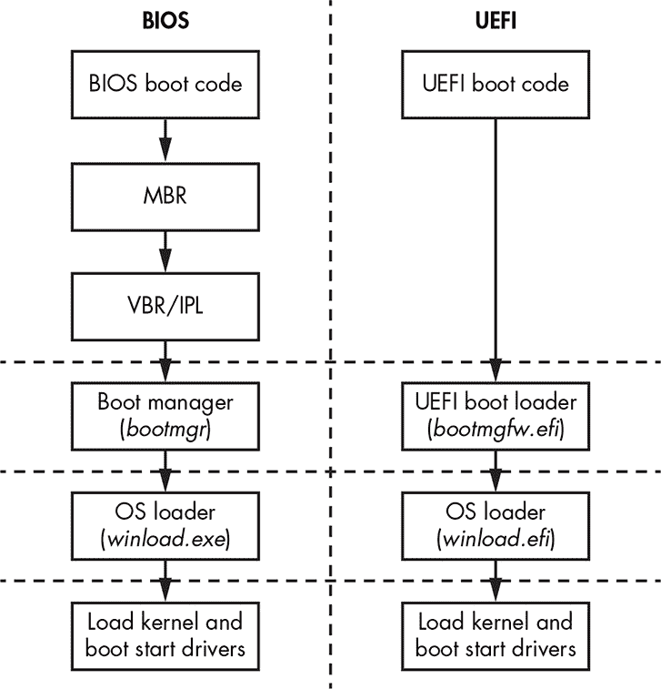

*图 14-1：传统 BIOS 与 UEFI 系统启动流程的差异*

正如您所看到的，基于 UEFI 的系统在将控制权转交给操作系统启动加载程序之前，固件中执行的工作比遗留 BIOS 要多得多。没有像 MBR/VBR 启动代码这样的中间阶段；启动过程完全由 UEFI 固件控制，而 BIOS 固件只负责平台初始化，将其余部分交给操作系统加载程序（*bootmgr* 和 *winload.exe*）处理。

#### *其他差异*

UEFI 引入的另一个巨大变化是几乎所有的代码都在保护模式下运行，只有在 CPU 启动或重置时，给定的少量初始代码才会由 CPU 控制。保护模式提供了执行 32 位或 64 位代码的支持（尽管它也允许模拟其他不被现代启动逻辑使用的遗留模式）。相比之下，遗留启动逻辑大部分代码都在 16 位模式下执行，直到它将控制权转交给操作系统加载程序。

另一个 UEFI 固件与遗留 BIOS 之间的区别是，大多数 UEFI 固件都是用 C 语言编写的（甚至可以用 C++ 编译器编译，正如某些厂商所做的那样），只有一小部分是用汇编语言编写的。这与遗留 BIOS 固件完全采用汇编语言实现相比，提供了更好的代码质量。

遗留 BIOS 和 UEFI 固件之间的更多差异见 表 14-1。

**表 14-1：** 遗留 BIOS 和 UEFI 固件比较

|  | **遗留 BIOS** | **UEFI 固件** |
| --- | --- | --- |
| **架构** | 未指定固件开发过程；所有 BIOS 厂商独立支持各自的代码库 | 统一的固件开发规范和英特尔参考代码 (EDKI/EDKII) |
| **实现方式** | 主要是汇编语言 | C/C++ |
| **内存模型** | 16 位实模式 | 32 位/64 位保护模式 |
| **启动代码** | MBR 和 VBR | 无 (固件控制启动过程) |
| **分区方案** | MBR 分区表 | GUID 分区表 (GPT) |
| **磁盘 I/O** | 系统中断 | UEFI 服务 |
| **启动加载器** | *bootmgr* 和 *winload.exe* | *bootmgfw.efi* 和 *winload.efi* |
| **操作系统交互** | BIOS 中断 | UEFI 服务 |
| **启动配置** | CMOS 内存，无 NVRAM 变量的概念 | UEFI NVRAM 变量存储 |

在深入了解 UEFI 启动过程及其操作系统启动加载程序之前，我们将仔细查看 GPT 相关细节。理解 MBR 和 GPT 分区方案之间的差异对于学习 UEFI 启动过程至关重要。

### GUID 分区表详情

如果你用十六进制编辑器查看一个格式化为 GPT 的 Windows 主硬盘，你会发现在前两个扇区中（1 个扇区 = 512 字节）没有 MBR 或 VBR 启动代码。传统 BIOS 中本应包含 MBR 代码的空间几乎完全为零化。相反，在第二个扇区的开始，你可以看到偏移量 0x200 处有一个`EFI PART`签名（见图 14-2），紧跟着熟悉的`55 AA` MBR 结束标志。这是 GPT 头部的 EFI 分区表签名，标识其为 GPT。

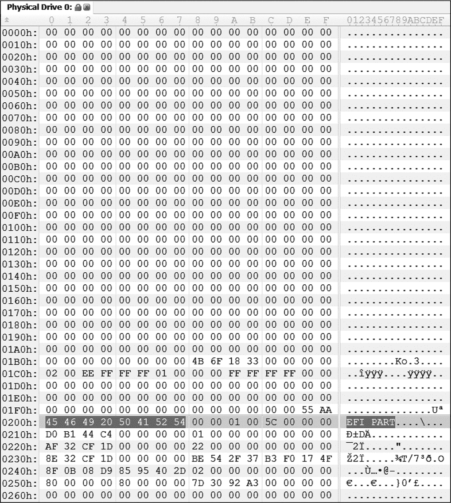

*图 14-2：从* \\.\PhysicalDrive0 导出的 GUID 分区表签名*

然而，MBR 分区表结构并没有完全消失。为了与传统的启动过程和工具（如 GPT 之前的低级磁盘编辑器）兼容，GPT 在启动时会模拟旧的 MBR 表。这个模拟的 MBR 分区表现在只包含一个条目，表示整个 GPT 磁盘，见图 14-3。这种 MBR 方案形式被称为*保护性 MBR*。

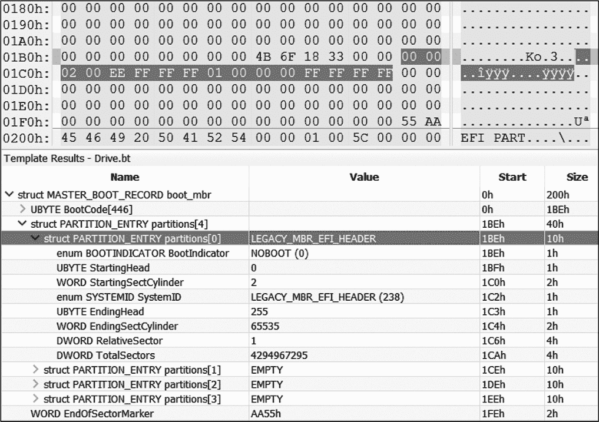

*图 14-3：010 编辑器中通过`Drive.bt`模板解析的传统 MBR 头部*

这个保护性 MBR 通过将整个磁盘空间标记为由单一分区占用，防止了传统软件（如磁盘工具）意外破坏 GUID 分区；不支持 GPT 的传统工具不会误将其 GPT 分区的部分当作空闲空间。尽管它只是一个存根，保护性 MBR 的格式与普通 MBR 相同。UEFI 固件会识别这个保护性 MBR，并不会尝试从中执行任何代码。

与传统 BIOS 启动过程的主要区别在于，负责系统早期启动阶段的所有代码现在都被封装在 UEFI 固件中，存储在闪存芯片中，而不是磁盘上。这意味着感染或修改磁盘上的 MBR 或 VBR 的 MBR 感染方法（例如 TDL4 和 Olmasco 病毒，分别在第七章和第十章中讨论）将不会对基于 GPT 的系统启动流程产生影响，即使没有启用安全启动。

**检查 GPT 支持**

你可以通过使用微软的 PowerShell 命令来检查你的 Windows 系统是否支持 GPT。具体来说，`Get-Disk`命令（见清单 14-1）将返回一个表格，最后一列名为“Partition Style”，显示支持的分区表类型。如果是 GPT 兼容的，你将看到 GPT 列在 Partition Style 这一列中；否则，看到 MBR。

```
PS C:\> Get-Disk

Number Friendly Name  Operational Status  Total Size  Partition Style

------ -------------  ------------------  ----------  ---------------

0      Microsoft      Online                   127GB  GPT

       Virtual Disk
```

*清单 14-1：`Get-Disk`的输出*

表 14-2 列出了 GPT 头部中各个值的描述。

**表 14-2：** GPT 头部

| **名称** | **偏移量** | **长度** |
| --- | --- | --- |
| 签名“EFI PART” | 0x00 | 8 字节 |
| GPT 版本的修订号 | 0x08 | 4 字节 |
| 头部大小 | 0x0C | 4 字节 |
| 头部的 CRC32 | 0x10 | 4 字节 |
| 保留 | 0x14 | 4 字节 |
| 当前 LBA（逻辑块寻址） | 0x18 | 8 字节 |
| 备份 LBA | 0x20 | 8 字节 |
| 分区的第一个可用 LBA | 0x28 | 8 字节 |
| 最后一个可用 LBA | 0x30 | 8 字节 |
| 磁盘 GUID | 0x38 | 16 字节 |
| 分区条目数组的起始 LBA | 0x48 | 8 字节 |
| 分区条目数组中的条目数 | 0x50 | 4 字节 |
| 单个分区条目的大小 | 0x54 | 4 字节 |
| 分区数组的 CRC32 | 0x58 | 4 字节 |
| 保留 | 0x5C | * |

如你所见，GPT 头仅包含常量字段，而不是代码。从取证的角度来看，这些字段中最重要的是 *分区条目数组的起始 LBA* 和 *分区条目数组中的条目数*。这些条目分别定义了硬盘上分区表的位置和大小。

GPT 头中的另一个有趣的字段是 *备份 LBA*，它提供了 GPT 头的备份副本的位置。这使你能够在主 GPT 头损坏时恢复主 GPT 头。我们在第十三章中提到过备份 GPT 头，当时我们讨论了 Petya 勒索软件，它加密了主 GPT 头和备份 GPT 头，从而使得系统恢复变得更加困难。

如图 14-4 所示，分区表中的每个条目提供关于硬盘分区的属性和位置的信息。

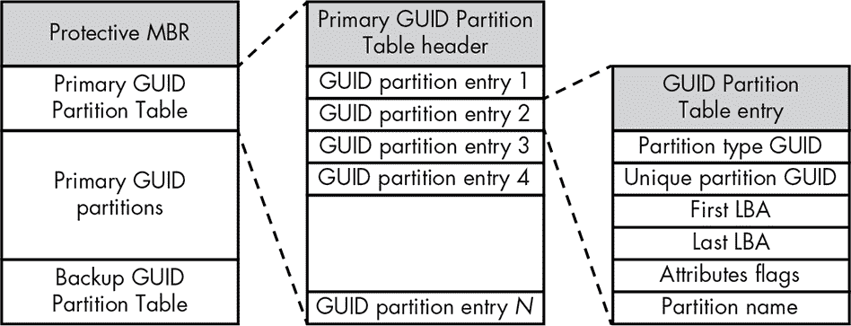

*图 14-4：GUID 分区表*

两个 64 位字段 *第一个 LBA* 和 *最后一个 LBA* 分别定义了分区的第一个和最后一个扇区的地址。*分区类型 GUID* 字段包含一个 GUID 值，标识分区的类型。例如，在前面提到的 “磁盘分区：MBR vs. GPT” 中，EFI 系统分区的类型是 *C12A7328-F81F-11D2-BA4B-00A0C93EC93B*，它位于第 235 页。

GPT 方案中没有任何可执行代码，这对引导病毒感染构成了问题：恶意软件开发者如何在 GPT 方案中将引导过程的控制权转交给他们的恶意代码？一种想法是在 EFI 引导加载程序将控制权转交给操作系统内核之前修改它们。然而，在我们深入探讨这个问题之前，我们将首先了解 UEFI 固件架构和引导过程的基础知识。

**使用 SweetScape 解析 GPT 驱动器**

要解析一个 GPT 驱动器的字段，可以在实机或转储的分区中使用共享软件 SweetScape 010 Editor（* [`www.sweetscape.com`](https://www.sweetscape.com) *），并利用 Benjamin Vernoux 提供的 `Drive.bt` 模板，该模板可以在 SweetScape 网站的 *Templates* 存储库的下载区找到。010 Editor 拥有一个强大的基于模板的解析引擎，基于 C 类结构（见图 14-3）。

### UEFI 固件的工作原理

在探讨了 GPT 分区方案之后，我们现在了解了操作系统引导加载程序的位置以及 UEFI 固件如何在硬盘上找到它。接下来，让我们看看 UEFI 固件是如何加载和执行操作系统加载器的。我们将提供有关 UEFI 引导过程各个阶段的背景信息，以便为执行加载器做好环境准备。

UEFI 固件通过解释 GPT 表中的上述数据结构来定位操作系统加载器，存储在主板的闪存芯片中（也称为 *SPI flash*，其中“SPI”指的是将芯片与其他芯片组连接的总线接口）。当系统启动时，芯片组逻辑将闪存芯片的内存映射到特定的 RAM 区域，该区域的起始和结束地址在硬件芯片组中进行配置，并依赖于特定 CPU 的配置。一旦映射的 SPI 闪存芯片代码在开机时获得控制，它会初始化硬件并加载各种驱动程序、操作系统引导管理器、操作系统加载器，最后是操作系统内核。此过程的步骤可以总结如下：

1.  UEFI 固件执行 UEFI 平台初始化，执行 CPU 和芯片组初始化，并加载 UEFI 平台模块（也称为 UEFI 驱动程序；这些与下一步加载的设备特定代码不同）。

1.  UEFI 引导管理器列举外部总线（如 PCI 总线）上的设备，加载 UEFI 设备驱动程序，然后加载引导应用程序。

1.  Windows 引导管理器（*bootmgfw.efi*）加载 Windows 引导加载程序。

1.  Windows 引导加载程序（*winload.efi*）加载 Windows 操作系统。

步骤 1 和 2 所需的代码驻留在 SPI 闪存中；步骤 3 和 4 的代码从硬盘上的特殊 UEFI 分区的文件系统中提取，一旦步骤 1 和 2 使得硬盘可读。UEFI 规范进一步将固件划分为不同部分，负责硬件初始化或引导过程中的活动，如 图 14-5 所示。

操作系统加载器本质上依赖于 UEFI 固件提供的 EFI 引导服务和 EFI 运行时服务来引导和管理系统。正如我们将在 “操作系统加载器内部” 的 第 245 页 中解释的那样，操作系统加载器依赖这些服务来建立一个能够加载操作系统内核的环境。一旦操作系统加载器从 UEFI 固件接管了引导流程，引导服务就被移除，并且操作系统将无法再访问它们。然而，运行时服务在操作系统运行时仍然可用，并提供一个接口，用于读取和写入 NVRAM UEFI 变量、执行固件更新（通过 *Capsule Update*）以及重新启动或关闭系统。

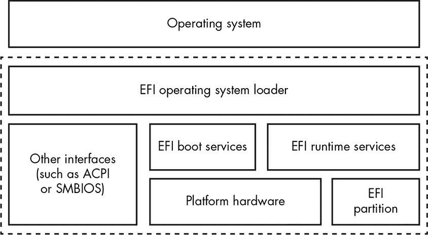

*图 14-5：UEFI 框架概览*

**固件 Capsule 更新**

Capsule Update 是一种用于安全更新 UEFI 固件的技术。操作系统将 Capsule 固件更新镜像加载到内存中，并通过运行时服务向 UEFI 固件发出信号，表示 Capsule 已经存在。结果，UEFI 固件在下次启动时重启系统并处理更新 Capsule。Capsule Update 力求标准化并提高 UEFI 固件更新过程的安全性。我们将在第十五章中深入讨论。

#### *UEFI 规范*

与传统的 BIOS 启动方式相比，UEFI 规范涵盖了从硬件初始化开始的每个步骤。在此规范之前，硬件厂商在固件开发过程中有更多自由，但这种自由也带来了混乱，因此也存在漏洞。该规范概述了启动过程的四个主要连续阶段，每个阶段都有自己的职责：

**安全 (SEC)** 使用 CPU 缓存初始化临时内存，并为 PEI 阶段定位加载程序。在 SEC 阶段执行的代码来自 SPI 闪存内存。

**预 EFI 初始化 (PEI)** 配置内存控制器，初始化芯片组，并处理 S3 恢复过程。在此阶段执行的代码在临时内存中运行，直到内存控制器初始化完成。一旦完成，PEI 代码将从永久内存中执行。

**驱动执行环境 (DXE)** 初始化系统管理模式 (SMM) 和 DXE 服务（核心、调度器、驱动程序等），以及启动和运行时服务。

**启动设备选择 (BDS)** 发现操作系统可以从中启动的硬件设备，例如，通过枚举可能包含 UEFI 兼容启动加载程序（如操作系统加载程序）的 PCI 总线上的外部设备。

除了操作系统加载程序（位于磁盘文件系统中，并通过基于 SPI 闪存的 DXE/BDS 阶段代码通过存储在 NVRAM UEFI 变量中的文件系统路径找到）外，启动过程中使用的所有组件都位于 SPI 闪存中。

SMM 和 DXE 初始化阶段是植入 rootkit 的最有趣的领域之一。SMM 处于环 –2，是最特权的系统模式——比环 –1 的虚拟机监控器更具特权。（有关 SMM 和环特权级别的更多信息，请参见 “系统管理模式”框。）从这个模式下，恶意代码可以完全控制系统。

类似地，DXE 驱动程序为实现启动病毒功能提供了另一个强大的手段。一个典型的 DXE 基础恶意软件例子是 Hacking Team 的固件 rootkit 实现，详见第十五章。

**系统管理模式**

系统管理模式（SMM）是 x86 CPU 的一种特殊模式，以特殊的更高“环 –2”权限执行（即“负二”，比“环 –1”更低且更强大，而“环 0”则是历史上最可信的权限——幸运的是，我们有无限多小于零的整数可用！）。SMM 最初在 Intel 386 处理器中作为一种帮助电源管理的手段引入，但在现代 CPU 中，SMM 的复杂性和重要性大大增加。现在，SMM 已经成为固件的一个组成部分，负责启动过程中的所有初始化和内存分离设置。SMM 的代码在一个独立的地址空间中执行，该地址空间应与正常操作系统地址空间布局（包括操作系统内核空间）隔离。在第十五章和第十六章中，我们将更多地探讨 UEFI 根套件如何利用 SMM。

现在，我们将探讨最后阶段以及操作系统内核如何获得控制权的过程。在下一章中，我们将更详细地讨论 DXE 和 SMM。

#### *操作系统加载程序内部*

现在，存储在 SPI 中的 UEFI 固件代码已经完成它的工作，它将控制权交给存储在磁盘上的操作系统加载程序。加载程序代码也是 64 位或 32 位（取决于操作系统版本）；MBR 或 VBR 的 16 位加载程序代码在启动过程中没有位置。

操作系统加载程序由存储在 EFI 系统分区中的多个文件组成，包括模块*bootmgfw.efi*和*winload.efi*。第一个被称为*Windows 启动管理器*，第二个被称为*Windows 启动加载程序*。这些模块的位置也由 NVRAM 变量指定。特别地，包含 ESP 的驱动器的 UEFI 路径（由 UEFI 标准如何枚举主板的端口和总线定义）存储在启动顺序 NVRAM 变量`BOOT_ORDER`中（用户通常可以通过 BIOS 配置更改）；ESP 文件系统中的路径存储在另一个变量`BOOT`中（通常位于*\\EFI\\Microsoft\\Boot\\*）。

##### 访问 Windows 启动管理器

UEFI 固件启动管理器会查阅 NVRAM UEFI 变量以查找 ESP，然后在 Windows 的情况下，查找其中的操作系统特定启动管理器*bootmgfw.efi*。启动管理器随后在内存中创建此文件的运行时镜像。为此，它依赖 UEFI 固件读取启动硬盘并解析其文件系统。在其他操作系统下，NVRAM 变量会包含指向该操作系统加载程序的路径；例如，对于 Linux，它指向 GRUB 启动加载程序（*grub.efi*）。

一旦*bootmgfw.efi*被加载，UEFI 固件启动管理器会跳转到*bootmgfw.efi*的入口点`EfiEntry`。这是操作系统启动过程的开始，此时存储在 SPI 闪存中的固件将控制权交给硬盘上的代码。

##### 建立执行环境

`EfiEntry`条目，其原型在列表 14-2 中展示，调用 Windows 启动管理器*bootmgfw.efi*，并用于配置 Windows 引导加载程序*winload.efi*的 UEFI 固件回调，后者在调用*bootmgfw.efi*后紧接着被调用。这些回调将*winload.efi*代码与 UEFI 固件运行时服务连接，这些服务用于外设操作，比如读取硬盘。这些服务将继续被 Windows 使用，即使它已经完全加载，通过硬件抽象层（HAL）包装器，稍后我们将看到它们的设置。

```
EFI_STATUS EfiEntry (

➊ EFI_HANDLE ImageHandle,       // UEFI image handle for loaded application

➋ EFI_SYSTEM_TABLE *SystemTable // Pointer to UEFI system table

);
```

*列表 14-2：`EfiEntry`例程的原型（`EFI_IMAGE_ENTRY_POINT`）*

`EfiEntry`的第一个参数➊指向负责继续启动过程并调用*winload.efi*的*bootmgfw.efi*模块。第二个参数➋包含指向 UEFI 配置表（`EFI_SYSTEM_TABLE`）的指针，后者是访问大部分 EFI 环境服务配置数据的关键（见图 14-6）。

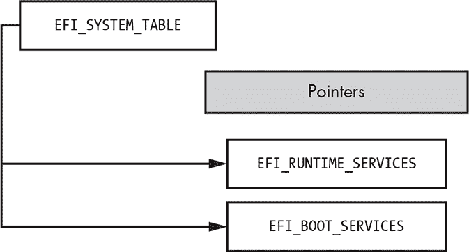

*图 14-6：`EFI_SYSTEM_TABLE`的高级结构*

*winload.efi*加载程序使用 UEFI 服务加载操作系统内核及其启动设备驱动栈，并初始化内核空间中的`EFI_RUNTIME_TABLE`，以便将来内核通过 HAL 库代码模块（*hal.dll*）访问这些数据。HAL 消耗`EFI_SYSTEM_TABLE`并导出包装 UEFI 运行时函数的功能给内核的其他部分。内核调用这些函数执行任务，如读取 NVRAM 变量和处理通过 UEFI 固件传递的所谓封装更新。

请注意在每个后续层中创建的多重封装模式，这些封装在启动的最早阶段配置了 UEFI 硬件特定代码。你永远不知道操作系统系统调用可能深入到 UEFI 的哪个层次！

HAL 模块*hal.dll*使用的`EFI_RUNTIME_SERVICES`结构在图 14-7 中展示。

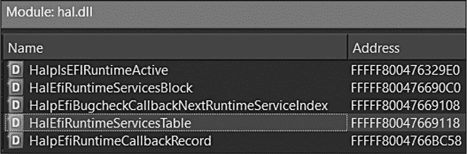

*图 14-7：`EFI_RUNTIME_SERVICES`在* hal.dll*中的表现*

`HalEfiRuntimeServiceTable`持有指向`EFI_RUNTIME_SERVICES`的指针，而`EFI_RUNTIME_SERVICES`包含服务例程入口点的地址，这些例程执行的操作包括获取或设置 NVRAM 变量、执行封装更新等。

在接下来的章节中，我们将分析这些结构在固件漏洞、利用和根工具的背景下的表现。现在，我们只想强调`EFI_SYSTEM_TABLE`及其内部的（尤其是）`EFI_RUNTIME_SERVICES`是找到负责访问 UEFI 配置的结构的关键，而且其中的一些信息可以从操作系统的内核模式访问。

图 14-8 显示了反汇编的 `EfiEntry` 例程。它的第一个指令之一触发了对函数 `EfiInitCreateInputParametersEx()` 的调用，该函数将 `EfiEntry` 参数转换为 *bootmgfw.efi* 所期望的格式。在 `EfiInitCreateInputParametersEx()` 内部，一个名为 `EfiInitpCreateApplicationEntry()` 的例程会在启动配置数据（BCD）中创建 *bootmgfw.efi* 的条目，BCD 是 Windows 启动加载程序的配置参数的二进制存储。在 `EfiInitCreateInputParametersEx()` 返回后，`BmMain` 例程（如 图 14-8 所示）接管了控制。请注意，此时，为了正确访问硬件设备操作，包括任何硬盘输入输出和初始化内存，Windows 启动管理器必须仅使用 EFI 服务，因为主要的 Windows 驱动程序堆栈尚未加载，因此无法使用。

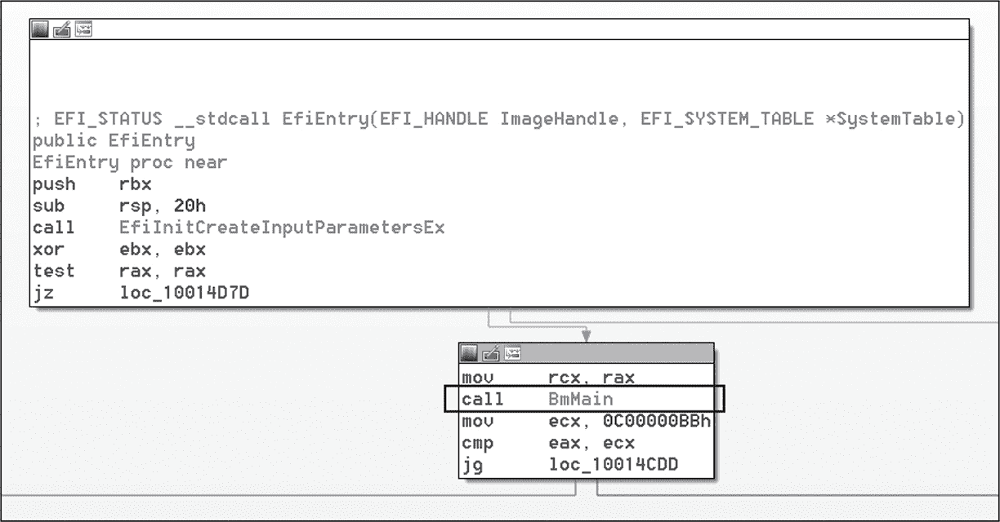

*图 14-8：反汇编的 `EfiEntry` 例程*

##### 读取启动配置数据

下一步，`BmMain` 调用以下例程：

BmFwInitializeBootDirectoryPath 例程用于初始化启动应用程序的路径（*\EFI\Microsoft\Boot*）

BmOpenDataStore 例程用于通过 UEFI 服务（磁盘 I/O）挂载并读取 BCD 数据库文件（*\EFI\Microsoft\Boot\BCD*）

BmpLaunchBootEntry **和** ImgArchEfiStartBootApplication 例程用于执行启动应用程序（*winload.efi*）

清单 14-3 显示了通过标准命令行工具 *bcdedit.exe* 输出的启动配置数据，该工具包含在所有近期版本的 Microsoft Windows 中。Windows 启动管理器和 Windows 启动加载程序模块的路径分别用 ➊ 和 ➋ 标记。

```
   PS C:\WINDOWS\system32> bcdedit

   Windows Boot Manager

   --------------------

   identifier              {bootmgr}

   device                  partition=\Device\HarddiskVolume2

➊ path                    \EFI\Microsoft\Boot\bootmgfw.efi

   description             Windows Boot Manager

   locale                  en-US

   inherit                 {globalsettings}

   default                 {current}

   resumeobject            {c68c4e64-6159-11e8-8512-a4c49440f67c}

   displayorder            {current}

   toolsdisplayorder       {memdiag}

   timeout                 30

   Windows Boot Loader

   -------------------

   identifier              {current}

   device                  partition=C:

➋ path                    \WINDOWS\system32\winload.efi

   description             Windows 10

   locale                  en-US

   inherit                 {bootloadersettings}

   recoverysequence        {f5b4c688-6159-11e8-81bd-8aecff577cb6}

   displaymessageoverride  Recovery

   recoveryenabled         Yes

   isolatedcontext         Yes

   allowedinmemorysettings 0x15000075

   osdevice                partition=C:

   systemroot              \WINDOWS

   resumeobject            {c68c4e64-6159-11e8-8512-a4c49440f67c}

   nx                      OptIn

   bootmenupolicy          Standard
```

*清单 14-3：`bcdedit` 控制台命令的输出*

Windows 启动管理器（*bootmgfw.efi*）还负责启动策略验证，以及初始化代码完整性和安全启动组件，这些将在后续章节中介绍。

在启动过程的下一个阶段，*bootmgfw.efi* 加载并验证 Windows 启动加载程序（*winload.efi*）。在开始加载 *winload.efi* 之前，Windows 启动管理器初始化内存映射以过渡到受保护的内存模式，该模式提供虚拟内存和分页。重要的是，它通过 UEFI 运行时服务而非直接方式执行此设置。这为操作系统虚拟内存数据结构（如 GDT）创建了一个强大的抽象层，而这些结构以前是通过传统的 BIOS 在 16 位汇编代码中处理的。

##### 将控制权转移给 Winload

在 Windows 引导管理器的最后阶段，`BmpLaunchBootEntry()` 例程加载并执行 *winload.efi*，即 Windows 引导加载程序。图 14-9 展示了从 `EfiEntry()` 到 `BmpLaunchBootEntry()` 的完整调用图，如 Hex-Rays IDA Pro 反汇编器通过 IDAPathFinder 脚本生成的图形（* [`www.devttys0.com/tools/`](http://www.devttys0.com/tools/) *）。

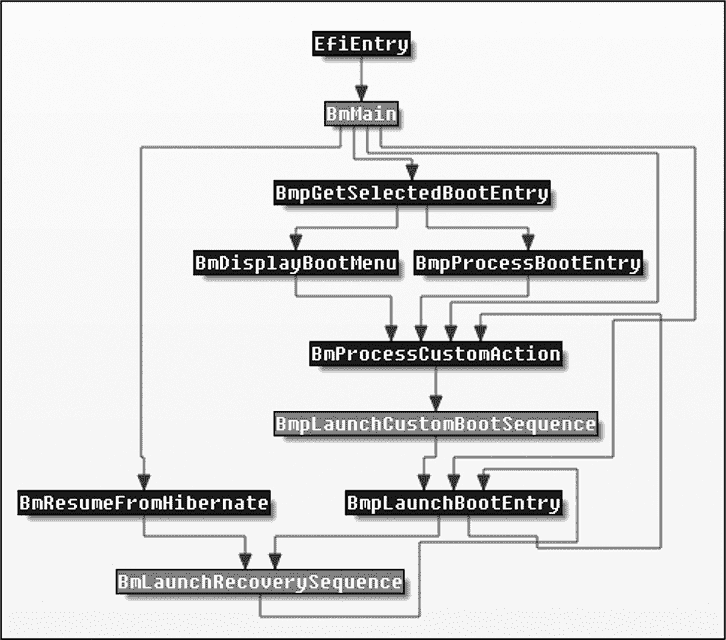

*图 14-9：从 `EfiEntry()` 到 `BmpLaunchBootEntry()` 的调用图流程*

`BmpLaunchBootEntry()` 函数之前的控制流根据来自 BCD 存储的值选择正确的引导项。如果启用了完全磁盘加密（BitLocker），引导管理器会在将控制权转交给引导加载程序之前解密系统分区。`BmpLaunchBootEntry()` 函数后跟 `BmpTransferExecution()` 会检查引导选项，并将执行权传递给 `BlImgLoadBootApplication()`，该函数接着调用 `ImgArchEfiStartBootApplication()`。`ImgArchEfiStartBootApplication()` 例程负责初始化 *winload.efi* 的受保护内存模式。之后，控制权被传递给 `Archpx64TransferTo64BitApplicationAsm()` 函数，该函数最终准备好启动 *winload.efi*（图 14-10）。

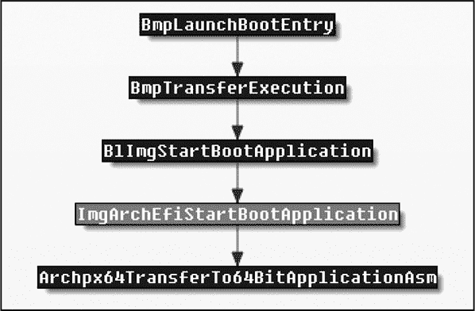

*图 14-10：从 `BmpLaunchBootEntry()` 到 `Archpx64TransferTo64BitApplicationAsm()` 的调用图流程*

在这一关键点之后，所有执行流都转交给 *winload.efi*，它负责加载和初始化 Windows 内核。在此之前，执行发生在 UEFI 环境中，依赖引导服务，并且操作在平坦的物理内存模型下。

**注意**

*如果禁用安全启动，恶意代码可以在引导过程的这一阶段对内存进行任何修改，因为内核模式模块尚未受到 Windows 内核补丁保护（KPP）技术（也称为 PatchGuard）的保护。PatchGuard 只有在引导过程的后续步骤中才会初始化。一旦 PatchGuard 被激活，它将使恶意修改内核模块变得更加困难。*

#### *Windows 引导加载程序*

Windows 引导加载程序执行以下配置操作：

+   如果操作系统以调试模式启动（包括虚拟化程序调试模式），则初始化内核调试器。

+   将 UEFI 引导服务封装为 HAL 抽象，以供后续 Windows 内核模式代码使用，并调用退出引导服务。

+   检查 CPU 是否支持 Hyper-V 虚拟化程序功能，并在支持的情况下进行设置。

+   检查虚拟安全模式（VSM）和 DeviceGuard 策略（仅限 Windows 10）。

+   对内核本身以及 Windows 组件进行完整性检查，然后将控制权转交给内核。

Windows 引导加载程序从 `OslMain()` 例程开始执行，如 清单 14-4 所示，该例程执行所有先前描述的操作。

```
__int64 __fastcall OslpMain(__int64 a1)

{

  __int64 v1; // rbx@1

  unsigned int v2; // eax@3

  __int64 v3; //rdx@3

  __int64 v4; //rcx@3

  __int64 v5; //r8@3

  __int64 v6; //rbx@5

  unsigned int v7; // eax@7

  __int64 v8; //rdx@7

  __int64 v9; //rcx@7

  __int64 v10; //rdx@9

  __int64 v11; //rcx@9

  unsigned int v12; // eax@10

  char v14; // [rsp+20h] [rbp-18h]@1

  int v15; // [rsp+2Ch] [rbp-Ch]@1

  char v16; // [rsp+48h] [rbp+10h]@3

  v1 = a1;

  BlArchCpuId(0x80000001, 0i64, &v14);

  if ( !(v15 & 0x100000) )

    BlArchGetCpuVendor();

  v2 = OslPrepareTarget (v1, &v16);

  LODWORD(v5) = v2;

  if ( (v2 & 0x80000000) == 0 && v16 )

  {

    v6 = OslLoaderBlock;

    if ( !BdDebugAfterExitBootServices )

      BlBdStop(v4, v3, v2);

  ➊ v7 = OslFwpKernelSetupPhase1(v6);

    LODWORD(v5) = v7;

    if ( (v7 & 0x80000000) == 0 )

    {

      ArchRestoreProcessorFeatures(v9, v8, v7);

      OslArchHypervisorSetup(1i64, v6);

    ➋ LODWORD(v5) = BlVsmCheckSystemPolicy(1i64);

      if ( (signed int)v5 >= 0 )

      {

        if ( (signed int)OslVsmSetup(1i64, 0xFFFFFFFFi64, v6) >= 0

         ➌ || (v12 = BlVsmCheckSystemPolicy(2i64), v5 = v12, (v12 & 0x80000000) == 0 ) )

        {

          BlBdStop(v11, v10, v5);

        ➍ OslArchTransferToKernel(v6, OslEntryPoint);

          while ( 1 )

            ;

        }

      }

    }

  }

}
```

*清单 14-4：反编译后的 `OslMain()` 函数（Windows 10）*

Windows 引导加载程序首先通过调用 `OslBuildKernelMemoryMap()` 函数来配置内核内存地址空间（图 14-11）。接着，它通过调用 `OslFwpKernelSetupPhase1()` 函数 ➊ 为加载内核做准备。`OslFwpKernelSetupPhase1()` 函数调用 `EfiGetMemoryMap()` 获取指向先前配置的 `EFI_BOOT_SERVICE` 结构的指针，然后将其存储在一个全局变量中，以便在内核模式下通过 HAL 服务进行未来的操作。

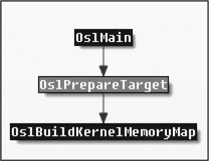

*图 14-11：从 `OslMain()` 到 `OslBuildKernelMemoryMap()` 的调用图流*

之后，`OslFwpKernelSetupPhase1()` 例程调用 EFI 函数 `ExitBootServices()`。该函数通知操作系统即将获得完全控制；此回调允许在跳转到内核之前进行最后的配置。

VSM 引导策略检查在 `BlVsmCheckSystemPolicy` 例程中实现 ➋ ➌，该例程检查环境是否符合安全启动策略，并将 UEFI 变量 `VbsPolicy` 读取到内存中，填充内存中的 `BlVsmpSystemPolicy` 结构。

最后，执行流程通过 `OslArchTransferToKernel()` 到达操作系统内核（在我们的案例中是 *ntoskrnl.exe* 映像） ➍（清单 14-5）。

```
.text:0000000180123C90 OslArchTransferToKernel proc near

.text:0000000180123C90                 xor     esi, esi

.text:0000000180123C92                 mov     r12, rcx

.text:0000000180123C95                 mov     r13, rdx

.text:0000000180123C98                 wbinvd

.text:0000000180123C9A                 sub     rax, rax

.text:0000000180123C9D                 mov     ss, ax

.text:0000000180123CA0                 mov     rsp, cs:OslArchKernelStack

.text:0000000180123CA7                 lea     rax, OslArchKernelGdt

.text:0000000180123CAE                 lea     rcx, OslArchKernelIdt

.text:0000000180123CB5                 lgdt    fword ptr [rax]

.text:0000000180123CB8                 lidt    fword ptr [rcx]

.text:0000000180123CBB                 mov     rax, cr4

.text:0000000180123CBE                 or      rax, 680h

.text:0000000180123CC4                 mov     cr4, rax

.text:0000000180123CC7                 mov     rax, cr0

.text:0000000180123CCA                 or      rax, 50020h

.text:0000000180123CD0                 mov     cr0, rax

.text:0000000180123CD3                 xor     ecx, ecx

.text:0000000180123CD5                 mov     cr8, rcx

.text:0000000180123CD9                 mov     ecx, 0C0000080h

.text:0000000180123CDE                 rdmsr

.text:0000000180123CE0                 or      rax, cs:OslArchEferFlags

.text:0000000180123CE7                 wrmsr

.text:0000000180123CE9                 mov     eax, 40h

.text:0000000180123CEE                 ltr     ax

.text:0000000180123CF1                 mov     ecx, 2Bh

.text:0000000180123CF6                 mov     gs, ecx

.text:0000000180123CF8                 assume gs:nothing

.text:0000000180123CF8                 mov     rcx, r12

.text:0000000180123CFB                 push    rsi

.text:0000000180123CFC                 push    10h

.text:0000000180123CFE                 push    r13

.text:0000000180123D00                 retfq

.text:0000000180123D00 OslArchTransferToKernel endp
```

*清单 14-5：反汇编的 `OslArchTransferToKernel()` 函数*

这一功能在前几章中已经提到，因为一些引导病毒（如 Gapz）会钩取它，以将自己的钩子插入内核映像中。

#### *UEFI 固件的安全性优势*

正如我们所见，基于传统 MBR 和 VBR 的引导病毒无法控制 UEFI 引导方案，因为它们感染的引导代码在 UEFI 引导流程中不再执行。然而，UEFI 的最大安全影响在于它支持安全启动技术。安全启动改变了 rootkit 和 bootkit 感染的游戏规则，因为它防止攻击者修改任何操作系统之前的引导组件——除非他们找到绕过安全启动的方法。

此外，英特尔最近发布的 Boot Guard 技术标志着安全启动演变的又一步。Boot Guard 是一种基于硬件的完整性保护技术，旨在在安全启动开始之前就保护系统。简而言之，Boot Guard 允许平台厂商安装加密密钥，以保持安全启动的完整性。

另一个自英特尔 Skylake CPU（英特尔处理器的一代）发布以来的近期技术是 BIOS Guard，它为平台提供防止固件闪存存储修改的保护。即使攻击者能够访问闪存内存，BIOS Guard 也能保护它免于安装恶意植入物，从而防止在引导时执行恶意代码。

这些安全技术直接影响了现代启动工具（bootkit）的发展方向，迫使恶意软件开发者在应对这些防御措施时不得不进化他们的方法。

### 结论

自从微软 Windows 7 开始，现代 PC 转向 UEFI 固件，这标志着启动流程发生了首次变化，并重塑了启动工具生态。依赖传统 BIOS 中断将控制权转交给恶意代码的方法已经过时，因为这些结构已从通过 UEFI 启动的系统中消失。

安全启动技术彻底改变了局面，因为不再可能直接修改启动加载器组件，如*bootmgfw.efi*和*winload.efi*。

现在，所有的启动流程都得到固件的信任和验证，并且有硬件支持。攻击者需要深入固件，寻找并利用 BIOS 漏洞，才能绕过这些 UEFI 安全特性。第十六章将概述现代 BIOS 漏洞的现状，但首先，第十五章将讨论固件攻击背景下 rootkit 和 bootkit 威胁的演变。
