## **15

当代 UEFI 引导工具**


如今，在野外很少能捕捉到新的创新根工具或引导工具。大多数恶意软件威胁已经转向用户模式，因为现代安全技术使得旧有的根工具和引导工具方法已经过时。像微软的内核模式代码签名策略、PatchGuard、虚拟安全模式（VSM）和设备保护等安全措施限制了内核模式代码的修改，并提高了内核模式根工具开发的复杂性。

向基于 UEFI 的系统过渡，以及安全启动方案的推广，改变了引导工具开发的格局，提高了内核模式根工具和引导工具的开发成本。就像内核模式代码签名策略的引入促使恶意软件开发者寻求新的引导工具功能，而不是寻找绕过代码签名保护的方法一样，最近的变化也使安全研究人员将注意力转向了 BIOS 固件。

从攻击者的角度来看，感染系统的下一个逻辑步骤是将感染点向下移动到软件堆栈中，在引导代码初始化之后，进入 BIOS（如 图 15-1 所示）。BIOS 在引导过程中启动硬件设置的初步阶段，这意味着 BIOS 固件级别是硬件之前的最后一道屏障。

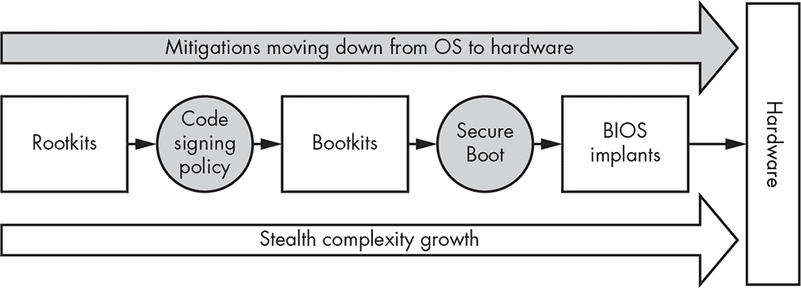

*图 15-1：根工具和引导工具对安全性发展的回应*

BIOS 所需的持久性级别与我们在本书中迄今讨论的其他任何内容都非常不同。固件植入可以在重新安装操作系统后甚至更换硬盘后继续存活，这意味着根工具感染有可能在感染硬件的整个生命周期内保持活跃。

本章重点讨论 UEFI 固件的引导工具感染，因为在撰写本文时，大多数 x86 平台的系统固件都基于 UEFI 规范。然而，在讨论这些现代 UEFI 固件感染方法之前，我们将先讨论一些历史遗留的 BIOS 引导工具，以便提供历史背景。

### 历史 BIOS 威胁概览

BIOS 恶意软件一直以其复杂性而著称，而随着现代 BIOS 特性的增加，恶意软件需要与之协作或绕过，今天这一点比以往任何时候都更加真实。即便在厂商开始认真对待之前，BIOS 恶意软件已经有了丰富的历史。我们将详细看几个早期的 BIOS 恶意软件示例，然后简要列出自第一个 BIOS 感染恶意软件 WinCIH 以来所有威胁的主要特征。

#### *WinCIH，首个针对 BIOS 的恶意软件*

WinCIH 病毒，也被称为切尔诺贝利病毒，是第一个公开被知道攻击 BIOS 的恶意软件。它由台湾学生陈英豪开发，1998 年在野外被发现，并通过盗版软件迅速传播。WinCIH 会感染 Microsoft Windows 95 和 98 的可执行文件；当感染的文件被执行时，病毒会驻留在内存中并设置文件系统钩子，以便在访问其他程序时将其感染。这种方法使 WinCIH 在传播上极为有效，但病毒最具破坏性的部分是它试图覆盖感染机器上闪存 BIOS 芯片的内存。

具有破坏性的 WinCIH 载荷被定时设置在切尔诺贝利核灾难的日期——4 月 26 日。如果闪存 BIOS 覆盖成功，除非恢复原始 BIOS，否则机器将无法启动。在本章的资源中（*[`nostarch.com/rootkits/`](https://nostarch.com/rootkits/)*），你可以下载 WinCIH 的原始汇编代码，该代码由其作者分发。

**注意**

*如果你有兴趣深入了解传统 BIOS 逆向工程和架构，我们推荐由 Darmawan Mappatutu Salihun（也被称为 pinczakko）所著的《BIOS Disassembly Ninjutsu Uncovered》一书。该书的电子版可以从作者的 GitHub 账户免费下载* ([`github.com/pinczakko/BIOS-Disassembly-Ninjutsu-Uncovered`](https://github.com/pinczakko/BIOS-Disassembly-Ninjutsu-Uncovered))。

#### *Mebromi*

在 WinCIH 之后，直到 2011 年，下一种在野外发现的 BIOS 攻击恶意软件才出现。它被称为 Mebromi 或 BIOSkit，目标是具有传统 BIOS 的机器。到那时，安全研究人员已经在会议和电子杂志上发布了 BIOS 攻击的感染思路和概念证明（PoC）。这些思路中的大多数在实际的恶意软件中难以实施，但 BIOS 感染被视为针对性攻击的一种有趣理论方向，因为这种攻击需要维持长期的持久感染。

Mebromi 并没有实现这些理论技术，而是将 BIOS 感染作为一种简单的方法，用来保持 MBR 在系统启动时始终处于感染状态。即使 MBR 被恢复到原始状态或操作系统重新安装，甚至硬盘被更换，Mebromi 也能恢复感染；感染的 BIOS 部分会保留并重新感染系统的其他部分。

在初期阶段，Mebromi 使用原始的 BIOS 更新软件传递恶意固件更新，特别是在 Award BIOS 系统上，这些系统曾是当时最流行的 BIOS 供应商之一（1998 年被 Phoenix BIOS 收购）。在 Mebromi 存在期间，几乎没有保护措施可以防止恶意更新遗留 BIOS。与 WinCIH 类似，Mebromi 修改了 BIOS 更新例程的系统管理中断（SMI）处理程序，以传递修改后的恶意 BIOS 更新。由于当时没有固件签名等防护措施，感染相对容易；你可以使用* [`nostarch.com/rootkits/`](https://nostarch.com/rootkits/)*提供的资源链接自行检查这一经典恶意软件。

**注意**

*如果你对阅读更多关于 Mebromi 的内容感兴趣，可以在 Zhitao Zhou 撰写的论文《一种新的 BIOS 根套件在中国传播》中找到详细分析* ([`www.virusbulletin.com/virusbulletin/2011/10/new-bios-rootkit-spreads-china/`](https://www.virusbulletin.com/virusbulletin/2011/10/new-bios-rootkit-spreads-china/))。

#### *其他威胁及应对概述*

现在让我们看看野外 BIOS 威胁的时间线以及安全研究人员的相关活动。正如你在图 15-2 中所见，BIOS 根套件和植入物的发现最活跃的时期始于 2013 年，并持续至今。

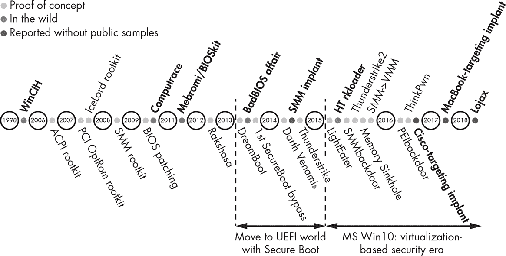

*图 15-2：BIOS 威胁时间线*

为了简要说明 BIOS bootkit 的演变，我们在表 15-1 中按时间顺序列出了每个威胁的重点。左列列出了研究人员为展示安全问题而开发的 PoC 的演变，中间列列出了在野外发现的真实 BIOS 威胁样本。第三列提供了进一步阅读的资源。

这些威胁中许多利用了 SMI 处理程序，它负责硬件与操作系统之间的接口，并在系统管理模式（SMM）下执行。为了本章的讨论，我们简要描述了最常被利用的 SMI 处理程序漏洞，这些漏洞被用来感染 BIOS。对于不同 UEFI 固件漏洞的更详细讨论，请参考第十六章。

**表 15-1：** BIOS 根套件历史时间线

| **PoC BIOS bootkit 演变** | **BIOS bootkit 威胁演变** | **进一步资源** |
| --- | --- | --- |
|  | **WinCIH, 1998** 第一个已知的攻击操作系统的 BIOS 恶意软件 |  |
| **APCI rootkit, 2006** 第一个基于 ACPI 的根套件（高级配置与电源接口），由 John Heasman 在 Black Hat 会议上展示 |  | “实现和检测 ACPI BIOS 根套件”，Black Hat 2006，*[`www.blackhat.com/presentations/bh-europe-06/bh-eu-06-Heasman.pdf`](https://www.blackhat.com/presentations/bh-europe-06/bh-eu-06-Heasman.pdf)* |
| **PCI OptRom rootkit, 2007**第一个针对 PCI 的 Option ROM 根工具，由 John Heasman 在 Black Hat 上展示 |  | “实现和检测 PCI 根工具，”Black Hat 2007，* [`www.blackhat.com/presentations/bh-dc-07/Heasman/Paper/bh-dc-07-Heasman-WP.pdf`](https://www.blackhat.com/presentations/bh-dc-07/Heasman/Paper/bh-dc-07-Heasman-WP.pdf)* |
| **IceLord rootkit, 2007**一个中国的 BIOS 引导工具 PoC；二进制文件在研究者的论坛上公开发布 |  |  |
| **SMM rootkit, 2007**首次已知的 SMM 根工具 PoC，由 Rodrigo Branco 展示，在巴西的 H2HC 大会上亮相 |  | “使用 SMM 进行‘其他用途’的系统管理模式攻击，” *[`phrack.org/issues/65/7.html`](http://phrack.org/issues/65/7.html)* |
| **SMM rootkit, 2008**第二个已知的 SMM 根工具 PoC，在 Black Hat 上展示 |  | “SMM 根工具：一种新的操作系统独立恶意软件类型，”Black Hat 2008，* [`dl.acm.org/citation.cfm?id=1460892`](http://dl.acm.org/citation.cfm?id=1460892)*；另见 *[`phrack.org/issues/65/7.html`](http://phrack.org/issues/65/7.html)* |
| **BIOS 修补，2009**多位研究人员发表了关于 BIOS 镜像修改的论文 | **Computrace, 2009**首个已知的逆向工程研究，由 Anibal Sacco 和 Alfredo Ortega 发布 | “停用根工具，”Black Hat 2009，* [`www.coresecurity.com/corelabs-research/publications/deactivate-rootkit/`](https://www.coresecurity.com/corelabs-research/publications/deactivate-rootkit/)* |
|  | **Mebromi, 2011**首个在野外被发现的 BIOS 引导工具，Mebromi 使用的思路类似于 IceLord | “Mebromi：首个在野外发现的 BIOS Rootkit，” *[`www.webroot.com/blog/2011/09/13/mebromi-the-first-bios-rootkit-in-the-wild/`](https://www.webroot.com/blog/2011/09/13/mebromi-the-first-bios-rootkit-in-the-wild/)* |
| **Rakshasa, 2012**一个持久性 BIOS 根工具的 PoC，由 Jonathan Brossard 在 Black Hat 上展示 |  |  |
| **DreamBoot, 2013**UEFI 引导工具的首个公开 PoC | **BadBIOS, 2013**据称是一个持久性 BIOS 根工具，由 Dragos Ruiu 报告 | “UEFI 和 Dreamboot，”HiTB 2013，* [`conference.hitb.org/hitbsecconf2013ams/materials/D2T1%20-%20Sebastien%20Kaczmarek%20-%20Dreamboot%20UEFI%20Bootkit.pdf`](https://conference.hitb.org/hitbsecconf2013ams/materials/D2T1%20-%20Sebastien%20Kaczmarek%20-%20Dreamboot%20UEFI%20Bootkit.pdf)* “认识‘badBIOS’，这个神秘的 Mac 和 PC 恶意软件能够跨越空气隔离，” *[`arstechnica.com/information-technology/2013/10/meet-badbios-the-mysterious-mac-and-pc-malware-that-jumps-airgaps/`](https://arstechnica.com/information-technology/2013/10/meet-badbios-the-mysterious-mac-and-pc-malware-that-jumps-airgaps/)* |
| **x86 Memory bootkit, 2013**基于 UEFI 的内存引导工具 PoC |  | “x86 内存引导工具，” *[`github.com/AaLl86/retroware/tree/master/MemoryBootkit`](https://github.com/AaLl86/retroware/tree/master/MemoryBootkit)* |
| **从 BIOS 绕过安全启动，2013**首次公开了绕过 Microsoft Windows 8 安全启动的技术 |  | “Windows 8 安全启动软件绕过的故事，” Black Hat 2013， *[`c7zero.info/stuff/Windows8SecureBoot_Bulygin-Furtak-Bazhniuk_BHUSA2013.pdf`](http://c7zero.info/stuff/Windows8SecureBoot_Bulygin-Furtak-Bazhniuk_BHUSA2013.pdf)* |
| **隐秘硬盘后门的实现及其影响，2013**Jonas Zaddach 等人演示了硬盘固件后门的概念验证 |  | “隐秘硬盘后门的实现及其影响，”年度计算机安全应用大会（ACSAC）2013， *[`www.syssec-project.eu/m/page-media/3/acsac13_zaddach.pdf`](http://www.syssec-project.eu/m/page-media/3/acsac13_zaddach.pdf)* |
| **Darth Venamis，2014**Rafal Wojtczuk 和 Corey Kallenberg 发现了 S3BootSript 漏洞（VU#976132） | 首次公开涉嫌国家支持的基于 SMM 的植入程序的报告 | “VU#976132，” *[`www.kb.cert.org/vuls/id/976132/`](https://www.kb.cert.org/vuls/id/976132/)* |
| **雷击攻击，2014**通过 Thunderbolt 端口利用恶意 Option ROM 攻击 Apple 设备，由 Trammell Hudson 在 31C3 会议上展示 |  | “雷击：针对 Apple MacBook 的 EFI Bootkit，” *[`events.ccc.de/congress/2014/Fahrplan/events/6128.html`](https://events.ccc.de/congress/2014/Fahrplan/events/6128.html)* |
| **LightEater，2015**基于 UEFI 的 rootkit，演示了如何从固件中的内存中暴露敏感信息，由 Corey Kallenberg 和 Xeno Kovah 展示 | **Hacking Team rkloader，2015**首次公开的商业级 UEFI 固件 bootkit 泄露，由 Hacking Team rkloader 揭示 |  |
| **SmmBackdoor，2015**首次公开的 UEFI 固件 bootkit 的概念验证，源代码发布在 GitHub 上 |  | “为 UEFI 平台构建可靠的 SMM 后门，” *[`blog.cr4.sh/2015/07/building-reliable-smm-backdoor-for-uefi.html`](http://blog.cr4.sh/2015/07/building-reliable-smm-backdoor-for-uefi.html)* |
| **Thunderstrike2，2015**展示了一种混合攻击方法，结合了 Darth Venamis 和 Thunderstrike 漏洞 |  | “雷击 2：西斯之击——MacBook 固件蠕虫，” Black Hat 2015， *[`legbacore.com/Research_files/ts2-blackhat.pdf`](http://legbacore.com/Research_files/ts2-blackhat.pdf)* |
| **Memory Sinkhole，2015**存在于高级可编程中断控制器（APIC）中的漏洞，攻击者可以利用该漏洞攻击操作系统使用的 SMM 内存区域，发现者为 Christopher Domas；攻击者可以利用该漏洞安装 rootkit |  | “内存陷阱，” Black Hat 2015， *[`github.com/xoreaxeaxeax/sinkhole/`](https://github.com/xoreaxeaxeax/sinkhole/)* |
| **提权从 SMM 到 VMM，2015**一组英特尔研究人员提出了从 SMM 到 hypervisor 的提权 PoC，并演示了在 MS Hyper-V 和 Xen 上暴露 VMM 保护内存区域的 PoC |  | “通过固件和硬件攻击 Hypervisor”，Black Hat 2015，*[`2015.zeronights.org/assets/files/10-Matrosov.pdf`](http://2015.zeronights.org/assets/files/10-Matrosov.pdf)* |
| **PeiBackdoor, 2016**第一个公开发布的在启动的 PEI（Pre-EFI Initialization）阶段操作的 UEFI rootkit PoC；在 GitHub 上发布了源代码 | **Cisco 路由器定向植入物，2016**据称是面向 Cisco 路由器 BIOS 的国家赞助植入物的报道 | “PeiBackdoor”，*[`github.com/Cr4sh/PeiBackdoor/`](https://github.com/Cr4sh/PeiBackdoor/)* |
| **ThinkPwn, 2016**提权漏洞，晋升至 SMM；最初由 Dmytro Oleksiuk，也被称为 Cr4sh，在 ThinkPad 系列笔记本上发现 |  | “探索和利用联想固件秘密”，*[`blog.cr4.sh/2016/06/exploring-and-exploiting-lenovo.html`](http://blog.cr4.sh/2016/06/exploring-and-exploiting-lenovo.html)* |
|  | **MacBook 定向植入物，2017**据称是面向苹果笔记本的国家赞助 UEFI 植入物的报道 |  |
|  | **Lojax 植入物，2018**ESET 研究人员在野外发现的 UEFI rootkit | “LOJAX”，*[`www.welivesecurity.com/wp-content/uploads/2018/09/ESET-LoJax.pdf`](https://www.welivesecurity.com/wp-content/uploads/2018/09/ESET-LoJax.pdf)* |

BIOS 固件一直是研究人员的一个挑战目标，这既因为信息缺乏，也因为在启动过程中添加新代码来修改或调节 BIOS 的难度。但自 2013 年以来，我们看到安全研究社区在寻找新漏洞并展示最近引入的安全功能（如安全启动）方面做出了更大的努力。

查看实际 BIOS 恶意软件的发展，您可能会注意到，很少有 BIOS 威胁 PoC 实际上成为固件基础植入物的趋势，大多数用于定向攻击。我们将在这里重点讨论感染 BIOS 的持久 rootkit 的方法，该 rootkit 不仅可以在操作系统重新启动时生存，而且还可以在具有感染的固件的 BIOS 中进行任何硬件更改（除了主板）。多个媒体报道显示，国家赞助的行动者可用的 UEFI 植入物表明，这些植入物是技术上的现实，并且已经存在相当长的时间。

### 所有硬件都有固件

在我们开始深入研究 UEFI rootkit 和 bootkit 的具体细节之前，让我们先看看现代 x86 硬件及其内部存储的不同类型固件。如今，所有硬件都带有一些固件；甚至笔记本电脑电池也有固件，由操作系统更新以实现更准确的电池参数和使用情况测量。

**注意**

*查理·米勒是第一位公开关注笔记本电池的研究人员。他在 2011 年黑帽大会上发表了名为“电池固件黑客攻击”的演讲* ([`media.blackhat.com/bh-us-11/Miller/BH_US_11_Miller_Battery_Firmware_Public_Slides.pdf`](https://media.blackhat.com/bh-us-11/Miller/BH_US_11_Miller_Battery_Firmware_Public_Slides.pdf)) *。

每一块固件都是攻击者可以存储和执行代码的区域，因此也是恶意植入的机会。大多数现代桌面和笔记本电脑拥有以下几种类型的固件：

+   UEFI 固件（BIOS）管理引擎固件（例如，英特尔 ME）

+   硬盘固件（HDD/SSD）

+   外设设备固件（例如，网络适配器）

+   显卡固件（GPU）

尽管存在许多明显的攻击途径，固件攻击在网络犯罪分子中并不常见，因为他们更倾向于选择能够针对广泛受害者的攻击。由于固件在不同系统之间存在差异，大多数已知的固件泄漏事件都是针对性的攻击，而非概念验证攻击（PoC）。

例如，第一个在野外发现的硬盘固件植入是由卡巴斯基实验室的研究人员在 2015 年初发现的。卡巴斯基将这种恶意软件的创作者称为*方程组*并将其分类为国家级威胁行为者。

根据卡巴斯基实验室的说法，他们发现的恶意软件具备感染特定硬盘型号的能力，包括一些非常常见的品牌。所有目标硬盘型号都没有固件更新的认证要求，这也是这种攻击得以实施的原因。

在这次攻击中，卡巴斯基检测到的硬盘感染模块*nls933w.dll*，被标记为*Trojan.Win32.EquationDrug.c*，通过*高级技术附件（ATA）*存储设备连接命令接口传送了修改过的固件。访问 ATA 命令允许攻击者重新编程或更新硬盘（HDD）/固态硬盘（SSD）固件，只需进行非常简单的更新验证或认证。这种固件植入可以在固件层面伪造磁盘扇区，或者通过拦截读写请求来修改数据流，例如传送修改版的 MBR。这些硬盘固件植入位于固件栈的低层，因此非常难以检测。

针对固件的恶意软件通常通过正常的操作系统更新过程重新闪存恶意固件更新，从而进行固件植入。这意味着它主要影响那些不支持固件更新认证的硬盘，而是直接设置新的固件。接下来的部分，我们将重点讨论基于 UEFI 的根套件和植入物，但了解 BIOS 并不是唯一可以开发持久固件植入的地方，也是很有用的。

#### *UEFI 固件漏洞*

现代操作系统中关于不同类型漏洞的讨论和示例在网上有很多，但关于 UEFI 固件漏洞的讨论却较为罕见。在这里，我们将列出过去几年公开披露的与 rootkit 相关的漏洞类型。大多数是内存损坏和 SMM 调用漏洞，当 CPU 处于 SMM 模式时，这些漏洞可能导致任意代码执行。攻击者可以利用这些漏洞绕过 BIOS 保护位，从而实现对某些系统上 SPI 闪存区域的任意写入和读取。我们将在第十六章中详细介绍，但这里有几个具有代表性的重点：

**ThinkPwn (LEN-8324)** 一个针对多个 BIOS 厂商的任意 SMM 代码执行漏洞。此漏洞允许攻击者禁用闪存写保护，并修改平台固件。

**Aptiocalypsis (INTEL-SA-00057)** 一个针对基于 AMI 固件的任意 SMM 代码执行漏洞，允许攻击者禁用闪存写保护位并修改平台固件。

任何这些问题都可能允许攻击者将持久的 rootkit 或植入物安装到受害者硬件中。许多这类漏洞依赖于攻击者能够绕过内存保护位，或者依赖于这些位没有启用或没有效果。

#### *(内)存保护位的有效性*

保护 SPI 闪存免受任意写入的最常见技术基于*内存保护位*，这是一种相当古老的防御方法，Intel 十年前就引入了这一方法。内存保护位是便宜的基于 UEFI 的硬件在物联网（IoT）市场中唯一可用的保护手段。一个允许攻击者获得 SMM 访问权限并执行任意代码的 SMM 漏洞将使攻击者能够更改这些位。让我们更仔细地看看这些位：

**BIOSWE** BIOS 写使能位，通常设置为`0`，并由 SMM 更改为`1`以验证固件或允许更新。

**BLE** BIOS 锁定使能位，默认应设置为`1`以防止对 SPI 闪存 BIOS 区域的任意修改。此位可被具有 SMM 权限的攻击者更改。

**SMM_BWP** SMM BIOS 写保护位应设置为`1`以防止 SPI 闪存内存被 SMM 以外的方式写入。2015 年，研究人员 Corey Kallenberg 和 Rafal Wojtczuk 发现了一个竞态条件漏洞（VU#766164），该漏洞使得此位未设置时，可能导致 BLE 位被禁用。

**PRx** SPI 受保护区域（PR 寄存器 PR0–PR5）并不保护整个 BIOS 区域免受修改，但它们为配置特定的 BIOS 区域提供了一定的灵活性，并能设置读取或写入策略。PR 寄存器受到 SMM 的保护，防止任意修改。如果所有安全位都已设置，并且 PR 寄存器配置正确，那么攻击者修改 SPI 闪存将变得非常困难。

这些安全位在 DXE 阶段设置，我们在第十四章中讨论过这一点。如果你感兴趣，可以在 Intel EDK2 的 GitHub 仓库中找到平台初始化阶段代码的示例。

#### *检查保护位*

我们可以通过使用一个名为*Chipsec*的安全评估平台来检查 BIOS 保护位是否已启用且有效，*Chipsec*由 Intel 安全卓越中心（现称为 IPAS，Intel 产品保障与安全）开发并开源。

我们将在第十九章中从法医角度检查 Chipsec，但现在，我们只使用`bios_wp`模块（* [`github.com/chipsec/chipsec/blob/master/chipsec/modules/common/bios_wp.py`](https://github.com/chipsec/chipsec/blob/master/chipsec/modules/common/bios_wp.py)*），该模块检查保护是否正确配置并保护 BIOS。`bios_wp`模块读取保护位的实际值，并输出 SPI 闪存保护的状态，如果配置错误，则警告用户。

要使用`bios_wp`模块，首先安装 Chipsec，然后运行以下命令：

```
chipsec_main.py -m common.bios_wp
```

作为示例，我们在一个基于 MSI Cubi2 且搭载 Intel 第七代 CPU 的易受攻击平台上进行了此检查，这款硬件在撰写本文时相对较新。此检查的输出结果见于清单 15-1。Cubi2 的 UEFI 固件基于 AMI 的框架。

```
   [x][ =======================================================================

   [x][ Module: BIOS Region Write Protection

   [x][ =======================================================================

   [*] BC = 0x00000A88 << BIOS Control (b:d.f 00:31.5 + 0xDC)

   [00] BIOSWE              = 0 << BIOS Write Enable

➊ [01] BLE                 = 0 << BIOS Lock Enable

   [02] SRC                 = 2 << SPI Read Configuration

   [04] TSS                 = 0 << Top Swap Status

➋ [05] SMM_BWP             = 0 << SMM BIOS Write Protection

   [06] BBS                 = 0 << Boot BIOS Strap

   [07] BILD                = 1 << BIOS Interface Lock Down

   [-] BIOS region write protection is disabled!

   [*] BIOS Region: Base = 0x00A00000, Limit = 0x00FFFFFF

   SPI Protected Ranges

   ------------------------------------------------------------

➌ PRx (offset) | Value    | Base     | Limit    | WP? | RP?

   ------------------------------------------------------------

   PR0 (84)     | 00000000 | 00000000 | 00000000 | 0   | 0

   PR1 (88)     | 00000000 | 00000000 | 00000000 | 0   | 0

   PR2 (8C)     | 00000000 | 00000000 | 00000000 | 0   | 0

   PR3 (90)     | 00000000 | 00000000 | 00000000 | 0   | 0

   PR4 (94)     | 00000000 | 00000000 | 00000000 | 0   | 0

   [!] None of the SPI protected ranges write-protect BIOS region

   [!] BIOS should enable all available SMM based write protection mechanisms or

   configure SPI protected ranges to protect the entire BIOS region

   [-] FAILED: BIOS is NOT protected completely
```

*清单 15-1：来自模块`common.bios_wp`的 Chipsec 工具输出*

输出结果显示`BLE` ➊没有启用，这意味着攻击者可以直接从常规操作系统的内核模式修改 SPI 闪存芯片上的任何 BIOS 内存区域。此外，`SMM_BWP` ➋和`PRx` ➌完全未使用，这表明该平台没有任何 SPI 闪存内存保护。

如果在清单 15-1 中测试的平台的 BIOS 更新没有签名，或者硬件供应商没有正确地验证更新，攻击者就可以轻松通过恶意的 BIOS 更新修改固件。这看起来可能像一个异常，但实际上这类简单的错误相当常见。原因各异：有些供应商根本不关心安全性，而另一些则意识到安全问题，但不想为廉价硬件开发复杂的更新方案。现在让我们看看其他几种感染 BIOS 的方式。

### 感染 BIOS 的方式

我们在第十四章中检查了复杂且多面的 UEFI 启动过程。对于我们当前讨论的要点，来自那一章的收获是，在 UEFI 固件将控制权交给操作系统加载器并启动操作系统之前，攻击者有很多机会隐藏或感染系统。

实际上，现代 UEFI 固件越来越像一个独立的操作系统。它有自己的网络堆栈和任务调度器，并且可以在引导过程之外直接与物理设备通信——例如，许多设备通过 UEFI DXE 驱动程序与操作系统通信。图 15-3 显示了固件感染在不同引导阶段可能的表现。

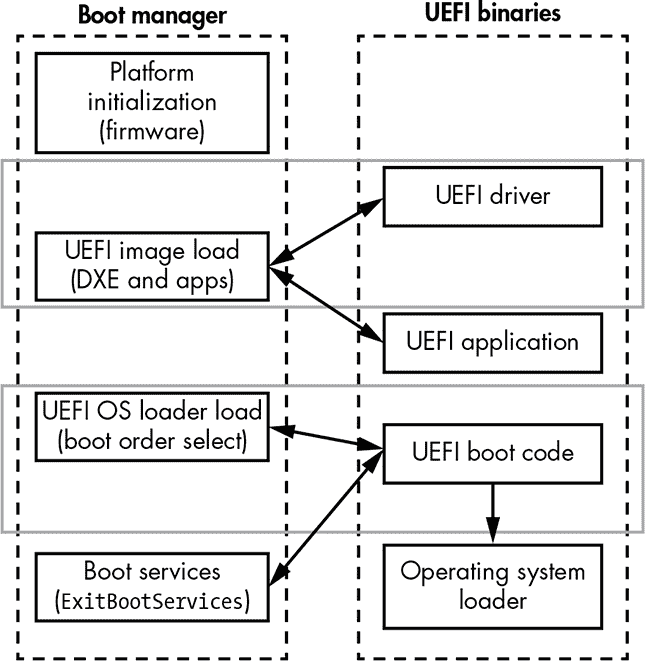

*图 15-3：带有攻击指针的 UEFI 固件启动流程*

多年来，安全研究人员已识别出许多漏洞，允许攻击者修改引导过程并添加恶意代码。到今天为止，大多数这些漏洞已经被修复，但一些硬件——甚至是新硬件——仍然可能容易受到这些旧问题的影响。以下是感染 UEFI 固件并植入持久性 rootkit 的不同方式：

**修改未签名的 UEFI 选项 ROM** 攻击者可以修改某些附加卡（用于网络、存储等）中的 UEFI DXE 驱动程序，以便在 DXE 阶段执行恶意代码。

**添加/修改 DXE 驱动程序** 攻击者可以修改现有的 DXE 驱动程序或向 UEFI 固件镜像中添加恶意的 DXE 驱动程序。结果是，添加/修改的 DXE 驱动程序将在 DXE 阶段执行。

**替换 Windows 启动管理器（后备引导加载程序）** 攻击者可以替换硬盘的 EFI 系统分区（ESP）上的引导管理器（后备引导加载程序）（*ESP\EFI\Microsoft\Boot\bootmgfw.efi* 或 *ESP\EFI\ BOOT\bootx64.efi*），以在 UEFI 固件将控制权交给操作系统引导加载程序时接管代码执行。

**添加新的引导加载程序（*bootkit.efi*）** 攻击者可以通过修改 `BootOrder`/`Boot`#### EFI 变量，向可用引导加载程序列表中添加另一个引导加载程序，这些变量决定操作系统引导加载程序的顺序。

在这些方法中，前两种方法在本章的上下文中最为有趣，因为它们会在 UEFI DXE 阶段执行恶意代码；这两种方法我们将更详细地讨论。最后两种方法——尽管与 UEFI 启动过程相关——专注于攻击操作系统引导加载程序，并在 UEFI 固件执行后执行恶意代码，因此我们在这里不再进一步讨论它们。

#### *修改未签名的 UEFI 选项 ROM*

*选项 ROM* 是位于 PCI 兼容设备上的 x86 代码中的 PCI/PCIe 扩展固件（ROM）。选项 ROM 在启动过程中被加载、配置并执行。John Heasman 在 2007 年的 Black Hat 大会上首次揭示了选项 ROM 作为潜伏 rootkit 感染的入口点（参见 表 15-1）。随后，在 2012 年，一位名为 Snare 的黑客介绍了多种通过选项 ROM 感染 Apple 笔记本电脑的技术（* [`ho.ax/downloads/De_Mysteriis_Dom_Jobsivs_Black_Hat_Slides.pdf`](http://ho.ax/downloads/De_Mysteriis_Dom_Jobsivs_Black_Hat_Slides.pdf) *）。在 2015 年的 Black Hat 大会上，演讲者 Trammell Hudson、Xeno Kovah 和 Corey Kallenberg 演示了一种名为 *Thunderstrike* 的攻击，通过修改固件渗透 Apple 以太网适配器并加载恶意代码（* [`www.blackhat.com/docs/us-15/materials/us-15-Hudson-Thunderstrike-2-Sith-Strike.pdf`](https://www.blackhat.com/docs/us-15/materials/us-15-Hudson-Thunderstrike-2-Sith-Strike.pdf) *）。

选项 ROM 包含一个 PE 镜像，这是一个特定的 PCI 设备的 DXE 驱动程序。在英特尔的开源 EDK2 工具包中（* [`github.com/tianocore/edk2/`](https://github.com/tianocore/edk2/) *），你可以找到加载这些 DXE 驱动程序的代码；在源代码中，你会在 *PciOptionRomSupport.h* 文件中找到实现选项 ROM 加载器的代码，该文件位于 *PciBusDxe* 文件夹内。清单 15-2 显示了该代码中的 `LoadOpRomImage()` 函数。

```
EFI_STATUS LoadOpRomImage (

     ➊ IN PCI_IO_DEVICE       *PciDevice,    // PCI device instance

     ➋ IN UINT64              RomBase        // address of Option ROM

);
```

*清单 15-2：EDK2 中的 `LoadOpRomImage()` 例程*

我们看到 `LoadOpRomImage()` 函数接收两个输入参数：一个指向 PCI 设备实例的指针 ➊ 和选项 ROM 镜像的地址 ➋。由此我们可以推测，该函数将 ROM 镜像映射到内存中并为执行做准备。下一个函数 `ProcessOpRomImage()` 如 清单 15-3 所示。

```
EFI_STATUS ProcessOpRomImage (

     IN PCI_IO_DEVICE   *PciDevice    // Pci device instance

);
```

*清单 15-3：EDK2 中的 `ProcessOpRomImage()` 例程*

`ProcessOpRomImage()` 负责启动选项 ROM 中包含的特定设备驱动程序的执行过程。使用选项 ROM 作为入口点的 Thunderstrike 攻击者通过修改 Thunderbolt 以太网适配器，使其能够连接外部外设，从而发起攻击。该适配器由 Apple 和 Intel 开发，基于 GN2033 芯片，提供 Thunderbolt 接口。图 15-4 显示了一个类似于 Thunderstrike 攻击中使用的 Thunderbolt 以太网适配器的反汇编图。

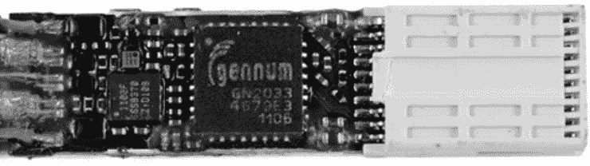

*图 15-4：反汇编的 Apple Thunderbolt 以太网适配器*

具体来说，Thunderstrike 加载了原始的 Option ROM 驱动程序，并加入了额外的代码，随后该代码在固件没有对 Option ROM 扩展驱动程序进行身份验证的情况下被执行（此攻击在苹果 MacBook 上演示过，但同样可以应用于其他硬件）。苹果在其硬件上修复了这个问题，但许多其他厂商仍然可能容易受到这种攻击。

表 15-1 中列出的许多 BIOS 漏洞已经在现代硬件和操作系统中得到了修复，例如 Windows 的较新版本，当硬件和固件支持时，Secure Boot 默认启用。我们将在第十七章中更详细地讨论 Secure Boot 的实现方法和弱点，但目前可以简单地说，任何缺乏严格认证要求的加载固件或扩展驱动程序都可能成为安全问题。在现代企业硬件上，第三方 Option ROM 通常默认被阻止，但可以在 BIOS 管理界面中重新启用，如图 15-5 所示。

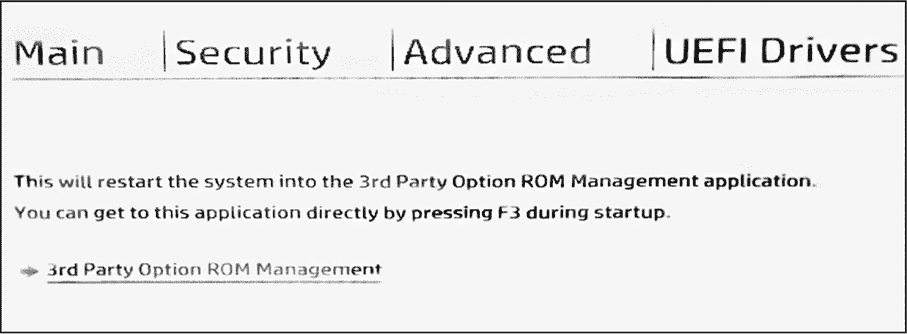

*图 15-5：在 BIOS 管理界面中阻止第三方 Option ROM*

在 Thunderstrike PoC 发布后，包括苹果在内的一些厂商变得更加积极地阻止所有未签名或第三方 Option ROM。我们认为这是正确的政策：需要加载第三方 Option ROM 的情况很少，而且阻止所有第三方设备的 Option ROM 可以显著降低安全风险。如果你正在使用带有 Option ROM 的外设扩展，请确保从与设备相同的供应商处购买；购买随机的并不值得冒这个险。

#### *添加或修改 DXE 驱动程序*

现在让我们来看一下列表中的第二种攻击类型：在 UEFI 固件映像中添加或修改 DXE 驱动程序。本质上，这种攻击相当简单：通过修改固件中的合法 DXE 驱动程序，攻击者能够引入恶意代码，该代码将在预启动环境中的 DXE 阶段执行。然而，这种攻击最有趣（也可能是最复杂）的一部分是添加或修改 DXE 驱动程序，这涉及到利用 UEFI 固件、操作系统和用户模式应用程序中的漏洞，形成复杂的攻击链。

修改 UEFI 固件映像中的 DXE 驱动程序的一种方式是绕过我们在本章前面讨论的 SPI 闪存保护位，通过利用特权升级漏洞。提高的特权允许攻击者通过关闭保护位来禁用 SPI 闪存保护。

另一种方法是利用 BIOS 更新过程中的漏洞，允许攻击者绕过更新认证并将恶意代码写入 SPI 闪存。让我们来看看这些方法是如何被用来感染 BIOS 的恶意代码。

**注意**

*这两种方法并不是修改受保护的 SPI 闪存内容的唯一途径，但我们在这里重点讨论它们，以说明恶意 BIOS 代码是如何在受害者的计算机上持久存在的。第十六章提供了 UEFI 固件中漏洞的更全面列表。*

### 理解 Rootkit 注入

大多数用户的机密和敏感信息都存储在操作系统的内核级别，或受到在该级别运行的代码保护。这就是为什么 Rootkit 长期以来一直试图妥协内核模式（“Ring 0”）：从这个层次，Rootkit 可以观察所有用户活动，或针对特定的用户模式（“Ring 3”）应用程序，包括这些应用程序加载的任何组件。

然而，在某些方面，Ring 0 Rootkit 处于劣势：它缺乏用户模式上下文。当从内核模式运行的 Rootkit 试图窃取一个 Ring 3 应用程序持有的数据时，Rootkit 并没有获得该数据最自然的视图，因为内核模式的设计本来就不应该意识到用户级的数据抽象。因此，内核模式 Rootkit 通常不得不使用某些技巧来重构这些数据，尤其是当数据分布在多个内存页面时。因此，内核模式 Rootkit 需要巧妙地重用实现用户级抽象的代码。然而，由于只有一层分离，这种代码重用并不特别棘手。

SMM 添加了一个更好的目标，但也增加了与用户级抽象之间的另一个分离层次。基于 SMM 的 Rootkit 可以通过控制任何物理内存页面来控制内核级和用户级的内存。然而，SMM 级恶意代码的这个优势也是其弱点，因为这段代码必须可靠地重新实现上层抽象，如虚拟内存，并处理这一任务中涉及的所有复杂性。

幸运的是，对于攻击者而言，SMM Rootkit 可以通过类似于引导程序的方式将恶意的 Ring 0 Rootkit 模块注入操作系统内核，而不仅仅是在引导时。然后，它可以依赖这段代码在内核模式上下文中使用内核模式结构，同时保护这些代码免受内核级安全工具的检测。关键是，基于 SMM 的代码可以选择植入的注入点。

具体而言，固件植入物甚至可以绕过一些安全启动实现——这是直接的启动工具无法做到的，它通过将感染点移动到*完整性检查*完成之后来实现。在图 15-6 中，我们展示了交付方式如何从一个简单的用户模式（Ring 3）加载器的交付方案演变而来，该加载器利用漏洞提升权限，安装恶意的内核模式（Ring 0）驱动程序。然而，缓解措施的演变赶上了这一方案。微软的内核模式签名政策使其无效，并开启了启动工具时代，而安全启动技术则应运而生以应对这一问题。随后，SMM 威胁出现，试图破坏安全启动。


*图 15-6：加载 Ring 0 根工具的可能方式*

截至本文写作时，SMM 威胁已经成功绕过了大多数基于 Intel 的平台的安全启动。SMM 根工具和植入物再次将安全边界下移，接近物理硬件。

随着 SMM 威胁日益严重，固件的取证分析成为一个新兴且非常重要的研究领域。

##### 通过 SMM 权限提升注入恶意代码

为了提升权限到 SMM 级别，以便能够修改 SPI 闪存内容，攻击者必须利用操作系统的回调接口，这些接口由系统管理中断（SMI）处理程序处理（我们将在第十六章中详细讨论 SMI 处理程序）。负责操作系统硬件接口的 SMI 处理程序是在 SMM 中执行的，因此如果攻击者能够利用 SMM 驱动程序中的漏洞，他们可能获得 SMM 执行权限。以 SMM 权限执行的恶意代码可以禁用 SPI 闪存保护位，并在某些平台上修改或添加 DXE 驱动程序到 UEFI 固件中。

要理解这种攻击，我们需要考虑从操作系统层级持久化感染方案的攻击策略。攻击者需要做什么才能修改 SPI 闪存内存？图 15-7 展示了必要的步骤。

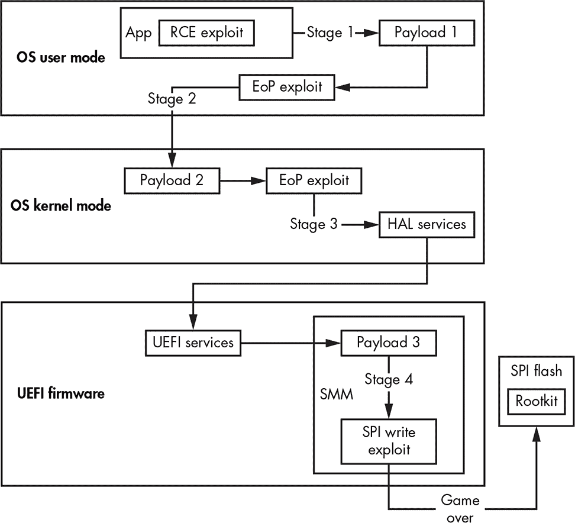

*图 15-7：UEFI 根工具感染的通用方案*

如我们所见，利用路径相当复杂，涉及多个层级的漏洞利用。让我们将这个过程分解为几个阶段：

**阶段 1，用户模式** 客户端漏洞利用，如网页浏览器的*远程代码执行（RCE）*，将恶意安装程序放到系统上。然后，安装程序使用提升权限漏洞来获得对`LOCALSYSTEM`的访问权限，并以这些新权限继续执行。

**阶段 2，内核模式** 安装程序绕过代码签名策略（在第六章中讨论）以在内核模式下执行其代码。*内核模式有效载荷*（驱动程序）运行一个漏洞利用程序来获得 SMM 权限。

**阶段 3，系统管理模式** *SMM 代码*成功执行，特权提升到 SMM。*SMM 负载*禁用了 SPI 闪存内存修改的保护。

**阶段 4，SPI 闪存** 所有 SPI 闪存保护都被禁用，闪存内存可进行任意写入。然后，*rootkit/植入程序*被安装到 SPI 闪存芯片的固件中。这个漏洞可以在系统中达到非常高的持久性。

这个图 15-8 的通用感染模式实际上展示了一个 SMM 勒索病毒 PoC 的真实案例，我们在 2017 年 Black Hat Asia 会议上进行了展示。该报告名为“UEFI 固件 Rootkit：神话与现实”，如果你想了解更多，推荐阅读它（*[`www.blackhat.com/docs/asia-17/materials/asia-17-Matrosov-The-UEFI-Firmware-Rootkits-Myths-And-Reality.pdf`](https://www.blackhat.com/docs/asia-17/materials/asia-17-Matrosov-The-UEFI-Firmware-Rootkits-Myths-And-Reality.pdf)*）。

##### 利用 BIOS 更新过程中的（不）安全性

注入恶意代码到 BIOS 的另一种方式是滥用 BIOS 更新认证过程。BIOS 更新认证旨在防止无法验证真实性的 BIOS 更新安装，确保只有平台供应商发布的 BIOS 更新映像被授权安装。如果攻击者能够利用该认证机制中的漏洞，他们就能将恶意代码注入到更新映像中，并随后写入 SPI 闪存。

2017 年 3 月，本书的作者之一 Alex Matrosov 在 Black Hat Asia 演示了一个 UEFI 勒索病毒 PoC（*[`www.cylance.com/en_us/blog/gigabyte-brix-systems-vulnerabilities.html`](https://www.cylance.com/en_us/blog/gigabyte-brix-systems-vulnerabilities.html)*）。他的 PoC 展示了 Gigabyte 实施的弱更新过程如何被利用。他使用了 Gigabyte 的一个基于英特尔第六代 CPU（Skylake）和微软 Windows 10 的最新平台，且启用了所有保护措施，包括带有 BLE 位的安全启动。尽管有这些保护措施，Gigabyte Brix 平台没有对更新进行身份验证，因此允许攻击者从操作系统内核安装任何固件更新（*[`www.kb.cert.org/vuls/id/507496/`](http://www.kb.cert.org/vuls/id/507496/)*）。图 15-8 展示了 Gigabyte Brix 硬件上 BIOS 更新过程中的漏洞。

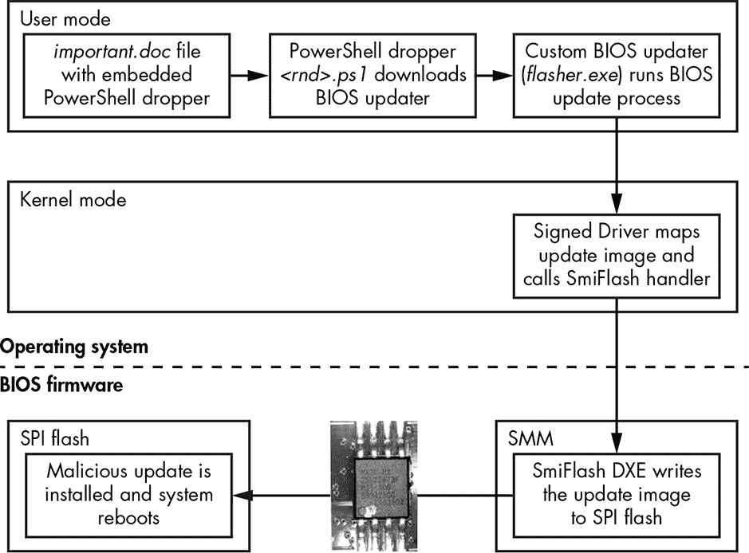

*图 15-8：UEFI 勒索病毒感染算法*

正如我们所看到的，攻击者可以利用硬件厂商提供并签名的 BIOS 更新软件中的原始内核模式驱动程序，来交付恶意的 BIOS 更新。该驱动程序与 SWSMI 处理程序 SmiFlash 通信，SmiFlash 具有读写 SPI 闪存的接口。特别是为了这次展示，其中一个 DXE 驱动程序被修改并在 SMM 中执行，以演示在 UEFI 固件中可能实现的最高级别的持久性，并控制从最早的启动阶段开始的启动过程。如果 UEFI 勒索软件感染成功，目标机器会显示 图 15-9 中所示的赎金信息。

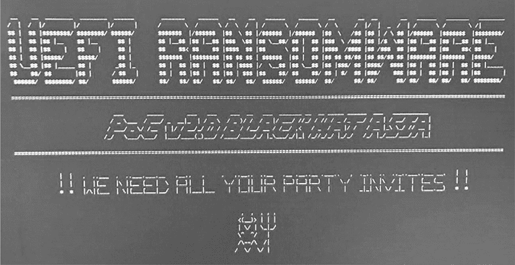

*图 15-9: 2017 年 Black Hat Asia 活动中的 UEFI 勒索软件感染屏幕*

在传统的 BIOS 固件中，在 UEFI 成为行业标准之前，主流硬件厂商并没有过多考虑固件更新的认证安全性。这意味着他们在面对恶意 BIOS 植入时非常脆弱；当这些植入开始出现时，厂商们才被迫关注这个问题。如今，为了抵御此类攻击，UEFI 固件更新采用了统一格式，称为 Capsule 更新，详细描述见 UEFI 规范。Capsule 更新的开发旨在提供一种更好的 BIOS 更新交付过程。让我们通过前面提到的 Intel EDK2 仓库来详细了解它。

##### Capsule 更新改进

Capsule 更新包含一个头部（在 EDK2 标注中为`EFI_CAPSULE_HEADER`）和一个主体，用于存储关于更新可执行模块的所有信息，包括 DXE 和 PEI 驱动程序。Capsule 更新镜像包含了更新数据的强制数字签名，以及用于认证和完整性保护的代码。

让我们通过 Nikolaj Schlej 开发的 UEFITool 工具来查看 Capsule 更新镜像的布局 (*[`github.com/LongSoft/UEFITool`](https://github.com/LongSoft/UEFITool)*)。这个工具允许我们解析 UEFI 固件镜像，包括那些包含在 UEFI Capsule 更新中的镜像，并提取不同的 DXE 或 PEI 可执行模块作为独立的二进制文件。我们将在 第十九章 中回到 UEFITool 的讨论。

图 15-10 展示了 UEFI Capsule 更新在 UEFITool 输出中的结构。

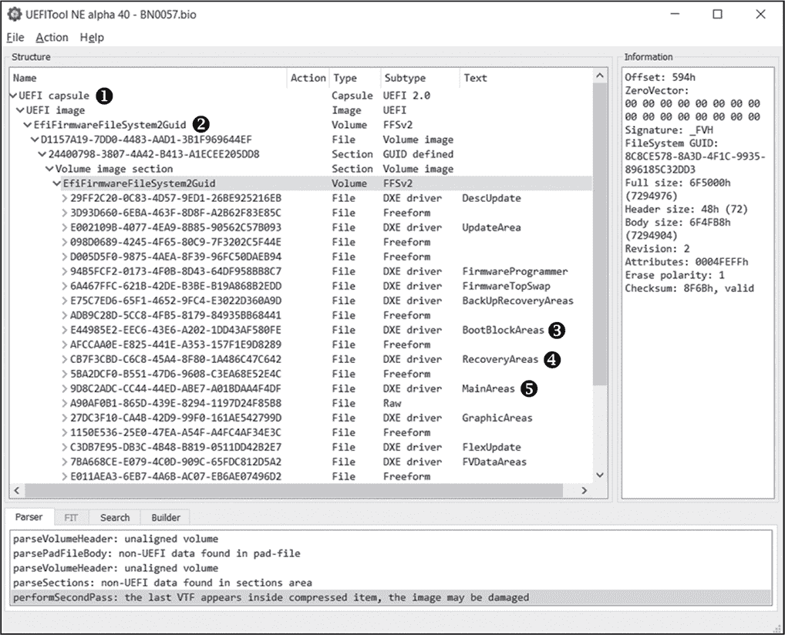

*图 15-10: UEFITool 界面*

capsule 镜像从一个头部➊开始，描述了更新镜像的一般参数，如头部大小和更新镜像大小。然后我们看到 capsule 体，通常由一个*固件卷* ➋组成。（固件卷是在平台初始化规范中定义的对象，用于存储固件文件镜像，包括 DXE 和 PEI 模块。我们将在第十九章中详细讨论它们。）此固件卷包含实际的 BIOS 更新数据，要写入 SPI 闪存内存的多个固件文件：例如，`BootBlockAreas` ➌和`RecoveryAreas` ➍包含 PEI 阶段的更新，而`MainAreas` ➎包含 DXE 阶段的更新。

重要的一点是，包含 BIOS 更新的固件卷内容是有签名的（尽管 UEFITool 在图 15-11 中未显示此信息）。因此，攻击者无法在不使数字签名失效的情况下对更新进行修改。如果实施得当，Capsule Update 可以防止攻击者利用未经认证的固件更新。

### 野外的 UEFI 根工具

自从卡巴斯基实验室在 2015 年发现 UEFI 恶意软件以来，我们已经看到多篇媒体报道了更为复杂的根工具，声称是由国家级行为者开发的。在本章的其余部分，我们将讨论其他 UEFI 根工具的例子，包括那些已被商业组织广泛部署的工具，如 Vector-EDK 和 Computrace。

#### *黑客团队的 Vector-EDK 根工具*

2015 年，一家为执法机构和其他政府客户开发间谍软件的意大利公司——*黑客团队*，遭到攻击，公司的大量机密信息被曝光，其中包括一个名为*Vector-EDK*的有趣项目的描述。对这一泄漏事件的分析揭示，Vector-EDK 是一个 UEFI 固件根工具，它直接在 Windows 的用户模式 NTFS 子系统中安装并执行其恶意组件。

Alex Matrosov，本书的作者之一，当时是 Intel 高级威胁研究（ATR）组的成员，意识到 Vector-EDK 的攻击潜力，并发布了博客文章《黑客团队的‘坏 BIOS’：一种商业根工具用于 UEFI 固件？》（*[`www.mcafee.com/enterprise/en-us/threat-center/advanced-threat-research/uefi-rootkit.html`](https://www.mcafee.com/enterprise/en-us/threat-center/advanced-threat-research/uefi-rootkit.html)*）。

##### 发现 Vector-EDK

当我们在一个被泄露的黑客团队邮件中发现一个名为*Z5WE1X64.fd*的奇怪文件，并附在一个名为*Uefi_windows_persistent.zip*的压缩文件中时，我们的调查便开始了（见图 15-11）。

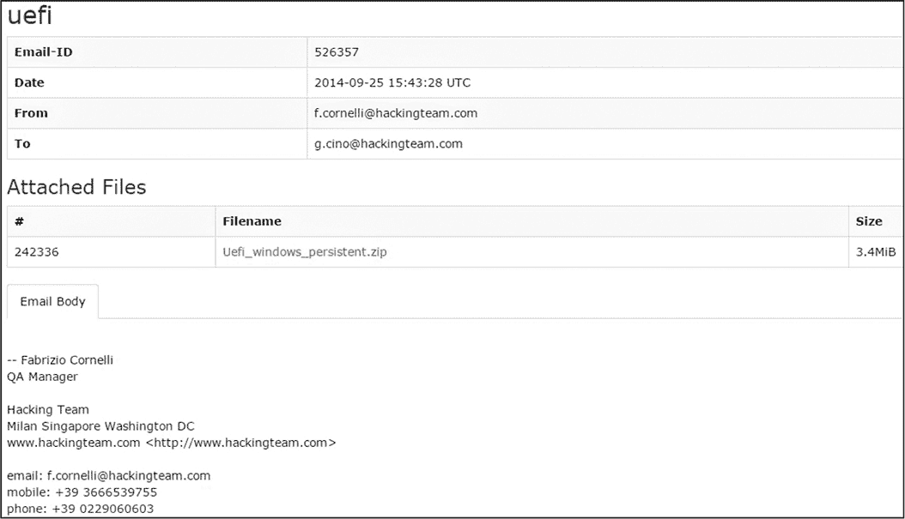

*图 15-11：来自黑客团队档案中的一封泄露邮件*

在我们分析附件后，很明显它是一个 UEFI 固件映像，经过进一步阅读泄露的几封邮件后，我们看到我们正在处理的是一个 UEFI rootkit。使用 UEFITool 进行的快速调查揭示了在 DXE 驱动列表中有一个暗示性的名称 *rkloader*（暗示 *rootkit loader*）。图 15-12 显示了我们的分析结果。

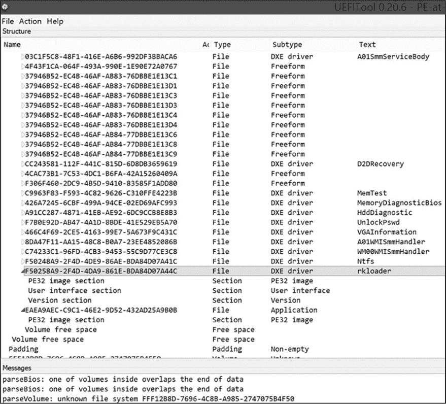

*图 15-12：使用 UEFITool 检测 Hacking Team Vector-EDK*

这引起了我们的注意，因为我们之前从未遇到过这个名称的 DXE 驱动。我们更加仔细地查看了泄露的档案，发现了 Vector-EDK 项目的源代码。这就是我们的技术调查真正开始的地方。

##### 分析 Vector-EDK

Vector-EDK rootkit 使用了之前讨论过的 UEFI 植入（*rkloader*）传递方法。然而，这个 rootkit 仅在 DXE 阶段工作，无法在 BIOS 更新后存活。在感染的 *Z5WE1X64.fd* BIOS 映像中，有三个主要模块：

**NTFS 解析器 (*Ntfs.efi*)** 一款 DXE 驱动，包含完整的 NTFS 解析器，用于读写操作。

**Rootkit (*rkloader.efi*)** 一款 DXE 驱动，注册了一个回调函数，用来拦截 `EFI_EVENT_GROUP_READY_TO_BOOT` 事件（这表明平台已准备好执行操作系统引导程序），并在操作系统引导开始之前加载 *fsbg.efi* UEFI 应用程序。

**Bootkit (*fsbg.efi*)** 一款 UEFI 应用程序，在 BIOS 将控制权传递给操作系统引导程序之前运行。它包含了主要的 bootkit 功能，解析 NTFS 文件系统并使用 *Ntfs.efi* 将恶意软件注入文件系统。

我们分析了泄露的 Vector-EDK 源代码，并发现组件 *rkloader.efi* 和 *fsbg.efi* 实现了 rootkit 的核心功能。

首先，让我们来看一下 *rkloader.efi*，它会运行 *fsbg.efi*。列表 15-4 显示了 UEFI DXE 驱动 *rkloader* 的主要例程 `_ModuleEntryPoint()`。

```
EFI_STATUS

EFIAPI

_ModuleEntryPoint (EFI_HANDLE ImageHandle, EFI_SYSTEM_TABLE *SystemTable)

{

    EFI_EVENT Event;

    DEBUG((EFI_D_INFO, "Running RK loader.\n"));

    InitializeLib(ImageHandle, SystemTable);

    gReceived = FALSE;    // reset event!

    //CpuBreakpoint();

    // wait for EFI EVENT GROUP READY TO BOOT

 ➊ gBootServices->CreateEventEx( 0x200, 0x10,

                     ➋ &CallbackSMI, NULL, &SMBIOS_TABLE_GUID, &Event );

    return EFI_SUCCESS;

}
```

*列表 15-4：* rkloader *组件中的 `_ModuleEntryPoint()` 例程*

我们发现例程 `_ModuleEntryPoint()` 只做了两件事，其中第一件是为事件组 `EFI_EVENT_GROUP_READY_TO_BOOT` 创建触发器 ➊。第二件事是在事件到达时，通过 `CallbackSMI()` 执行 SMI 处理程序 ➋。`CreateEventEx()` 例程的第一个参数表明 `EFI_EVENT_GROUP_READY_TO_BOOT` 的即时值是 0x200\。这个事件发生在操作系统引导程序接管控制之前，位于 BIOS DXE 阶段的末尾，允许恶意负载 *fsbg.efi* 在操作系统之前接管执行。

大部分有趣的逻辑都包含在 列表 15-5 中的 `CallbackSMI()` 例程内。这个例程的代码相当长，因此我们这里只展示了其流程中最重要的部分。

```
VOID

EFIAPI

CallbackSMI (EFI_EVENT Event, VOID *Context)

{

   --snip--

➊ EFI_LOADED_IMAGE_PROTOCOL       *LoadedImage;

   EFI_FIRMWARE_VOLUME_PROTOCOL    *FirmwareProtocol;

   EFI_DEVICE_PATH_PROTOCOL        *DevicePathProtocol,

                                   *NewDevicePathProtocol,

                                   *NewFilePathProtocol,

                                   *NewDevicePathEnd;

   --snip--

➋ Status = gBootServices->HandleProtocol( gImageHandle,

                                           &LOADED_IMAGE_PROTOCOL_GUID,

                                           &LoadedImage);

   --snip--

   DeviceHandle = LoadedImage->DeviceHandle;

➌ Status = gBootServices->HandleProtocol( DeviceHandle,

                                           &FIRMWARE_VOLUME_PROTOCOL_GUID,

                                           &FirmwareProtocol);

➍ Status = gBootServices->HandleProtocol( DeviceHandle,

                                           &DEVICE_PATH_PROTOCOL_GUID,

                                           &DevicePathProtocol);

   --snip--

   // copy "VOLUME" descriptor

➎ gBootServices->CopyMem( NewDevicePathProtocol,

                           DevicePathProtocol,

                           DevicePathLength);

   --snip--

➏ gBootServices->CopyMem( ((CHAR8 *)(NewFilePathProtocol) + 4),

                           &LAUNCH_APP, sizeof(EFI_GUID));

   --snip--

➐ Status = gBootServices->LoadImage( FALSE,

                                      gImageHandle,

                                      NewDevicePathProtocol,

                                      NULL,

                                      0,

                                      &ImageLoadedHandle);

   --snip--

done:

   return;

}
```

*列表 15-5：来自* fsbg *组件的 `CallbackSMI()` 例程*

首先我们看到多个 UEFI 协议初始化 ➊，例如：

EFI_LOADED_IMAGE_PROTOCOL 提供有关已加载 UEFI 映像的信息（映像基地址、映像大小以及映像在 UEFI 固件中的位置）。

EFI_FIRMWARE_VOLUME_PROTOCOL 提供读取和写入固件卷的接口。

EFI_DEVICE_PATH_PROTOCOL 提供构建设备路径的接口。

这里的有趣部分从多个 `EFI_DEVICE_PATH_PROTOCOL` 初始化开始；我们可以看到许多变量名以 `New` 为前缀，通常表示它们是钩子。`LoadedImage` 变量在 ➋ 时被初始化为指向 `EFI_LOADED_IMAGE_PROTOCOL` 的指针，之后 `LoadedImage` 可用于确定当前模块（*rkloader*）所在的设备。

接下来，代码获取 `EFI_FIRMWARE_VOLUME_PROTOCOL` ➌ 和 `EFI_DEVICE_PATH_PROTOCOL` ➍ 协议，这些协议用于构建指向 *rkloader* 所在设备的路径。这些协议对于构建下一个恶意模块的路径非常必要——即 *fsbg.efi*——从固件卷加载。

一旦获取到这些协议，*rkloader* 构建一个路径来加载 *fsbg.efi* 模块，从固件卷中加载它。路径的第一部分 ➎ 是 *rkloader* 所在固件卷的路径（*fsbg.efi* 就位于与 *rkloader* 完全相同的固件卷上），第二部分 ➏ 添加了 *fsbg.efi* 模块的唯一标识符：`LAUNCH_APP = {eaea9aec-c9c1-46e2-9d52432ad25a9b0b}`。

最后一步是调用 `LoadImage()` 例程 ➐，该例程接管 *fsbg.efi* 模块的执行。这个恶意组件包含了主负载，并带有它想要修改的文件系统的直接路径。列表 15-6 提供了 *fsbg.efi* 模块在其中丢弃操作系统级恶意模块的目录列表。

```
#define FILE_NAME_SCOUT L"\\AppData\\Roaming\\Microsoft\\Windows\\Start Menu\\

Programs\\Startup\\"

#define FILE_NAME_SOLDIER L"\\AppData\\Roaming\\Microsoft\\Windows\\Start

Menu\\Programs\\Startup\\"

#define FILE_NAME_ELITE  L"\\AppData\\Local\\"

#define DIR_NAME_ELITE L"\\AppData\\Local\\Microsoft\\"

#ifdef FORCE_DEBUG

UINT16 g_NAME_SCOUT[] =   L"scoute.exe";

UINT16 g_NAME_SOLDIER[] = L"soldier.exe";

UINT16 g_NAME_ELITE[]   = L"elite";

#else

UINT16 g_NAME_SCOUT[] =   L"6To_60S7K_FU06yjEhjh5dpFw96549UU";

UINT16 g_NAME_SOLDIER[] = L"kdfas7835jfwe09j29FKFLDOR3r35fJR";

UINT16 g_NAME_ELITE[]   = L"eorpekf3904kLDKQO023iosdn93smMXK";

#endif
```

*列表 15-6：操作系统级组件的硬编码路径*

高层次上，*fsbg.efi* 模块遵循以下步骤：

1.  检查系统是否已经通过预定义的 UEFI 变量 `fTA` 被主动感染。

1.  初始化 NTFS 协议。

1.  通过查看预定义的部分，在 BIOS 映像中寻找恶意可执行文件。

1.  通过查看主目录中的名称来检查机器上是否有现有用户，以寻找特定目标。

1.  通过直接写入 NTFS 安装恶意可执行模块 *scoute.exe*（后门）和 *soldier.exe*（RCS 代理）。

`fTA` UEFI 变量由 *fsbg.efi* 在第一次感染时安装，每次启动时都会检查其存在：如果变量 `fTA` 存在，则意味着活动感染已存在于硬盘上，*fsbg.efi* 不需要将操作系统级的恶意二进制文件传送到文件系统。如果在硬编码路径位置没有找到操作系统级的恶意组件（列表 15-6），*fsbg.efi* 模块将在启动过程中重新安装它们。

Hacking Team 的 Vector-EDK 是一个非常具有教育意义的 UEFI 启动工具包示例。我们强烈建议阅读其完整源代码，以更好地理解其工作原理。

##### Absolute Software 的 Computrace/LoJack

我们下一个 UEFI 根套件的示例并不完全是恶意的。*Computrace*，也叫 LoJack，实际上是一个由 Absolute Software 开发的常见专有防盗系统，几乎在所有流行的企业级笔记本电脑中都能找到。Computrace 实现了一个基于互联网的笔记本电脑追踪系统，并包含远程锁定和远程擦除硬盘等功能，以防笔记本丢失或被盗。

许多研究人员独立宣称 Computrace 从技术上讲是一个根套件，因为该软件的行为与 BIOS 根套件非常相似。然而，主要区别在于 Computrace 并不会试图隐藏其存在。其配置菜单甚至可以在 BIOS 设置菜单中找到（图 15-13）。

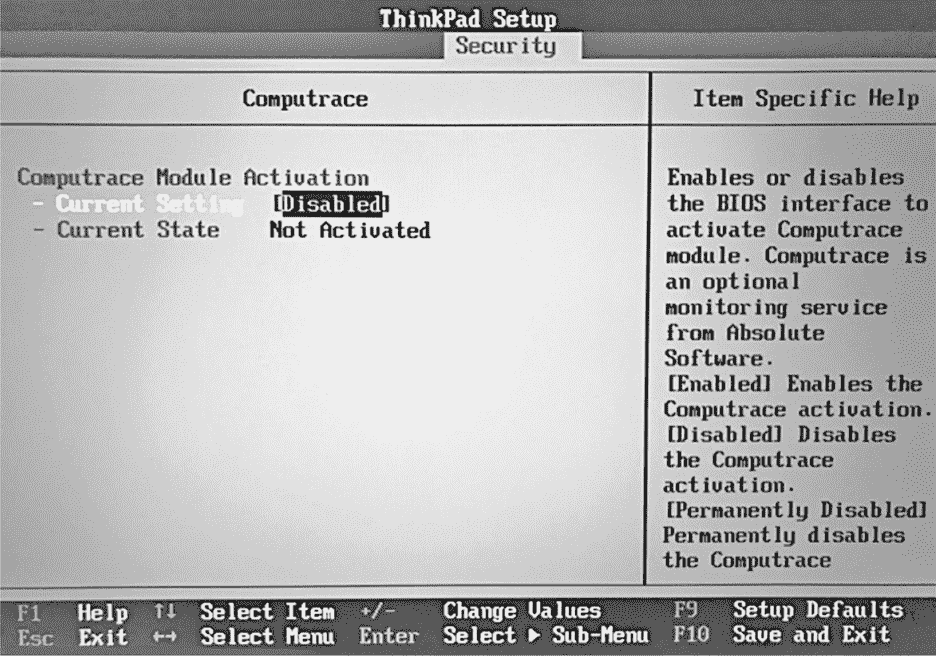

*图 15-13: Lenovo ThinkPad T540p 中 BIOS 设置中的 Computrace 菜单*

在非企业级计算机中，默认情况下 Computrace 通常在 BIOS 菜单中被禁用，如 图 15-13 所示。还有一个选项可以通过设置 NVRAM 变量来永久禁用 Computrace，该变量不允许重新激活 Computrace，并且只能在硬件中编程一次。

在这里，我们将分析 Computrace 在 Lenovo T540p 和 P50 笔记本电脑上的实现。我们对 Computrace 架构的概念性理解见于 图 15-14。

Computrace 拥有复杂的架构，包含多个 DXE 驱动程序，其中包括在 SMM 中运行的组件。它还包含一个代理程序，*rpcnetp.exe*，该程序在操作系统中执行，并负责与云（C&C 服务器）的所有网络通信。

LenovoComputraceEnableDxe 是一个 DXE 驱动程序，用于追踪 BIOS 菜单中的 Computrace 选项，以触发 `LenovoComputraceLoaderDxe` 的安装阶段。

LenovoComputraceLoaderDxe 是一个 DXE 驱动程序，用于验证安全策略并加载 `AbsoluteComputraceInstallerDxe`。

AbsoluteComputraceInstallerDxe 是一个 DXE 驱动程序，它通过直接修改文件系统（NTFS）将 Computrace 代理程序安装到操作系统中。代理程序二进制文件被嵌入到 DXE 驱动程序映像中，如 图 15-15 所示。在现代笔记本电脑上，ACPI 表用于代理程序的安装。

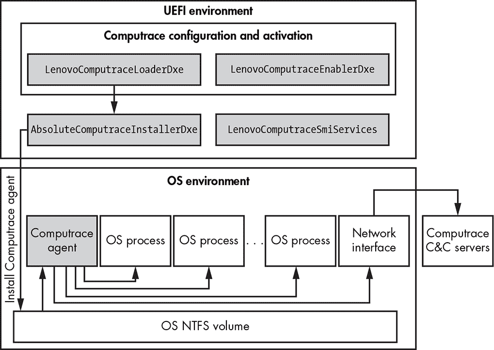

*图 15-14: Computrace 高级架构*

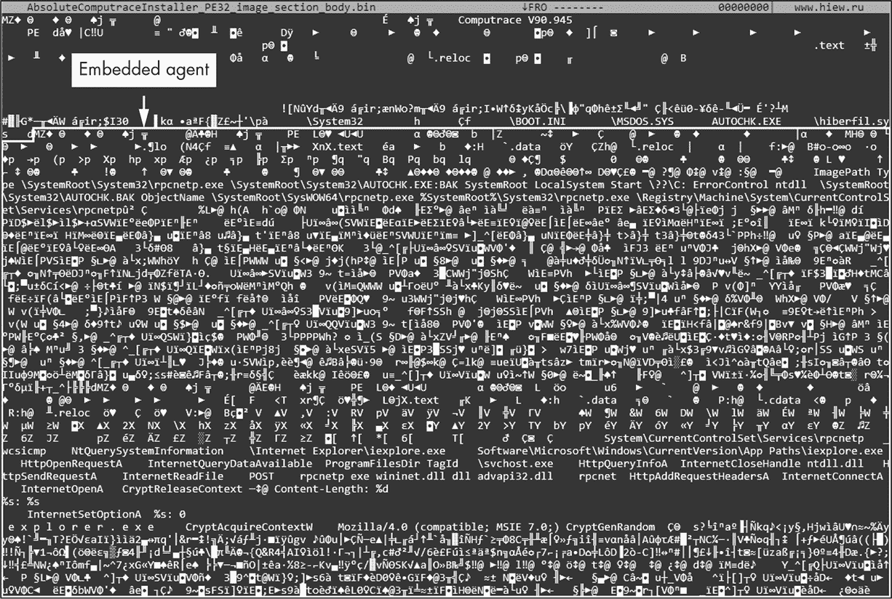

*图 15-15: `AbsoluteComputraceInstallerDxe` 二进制文件在 Hiew 十六进制编辑器中的显示*

LenovoComputraceSmiServices 是一个 DXE 驱动程序，在 SMM 内部执行，以支持与 OS 代理和其他 BIOS 组件的通信。

**Computrace 代理程序 (*rpcnetp.exe*)** 是一个 PE 可执行映像，存储在 `AbsoluteComputraceInstallerDxe` 中。Computrace 代理程序在操作系统用户登录后执行。

Computrace 的*rpcnetp.exe*代理的主要功能是收集地理位置信息并将其发送到 Absolute Software 的云端。这是通过将 Computrace 的组件*rpcnetp.dll*注入到*iexplore.exe*和*svchost.exe*进程中实现的，如图 15-16 所示。该代理还从云端接收命令，例如执行低级别硬盘擦除操作以安全删除文件。

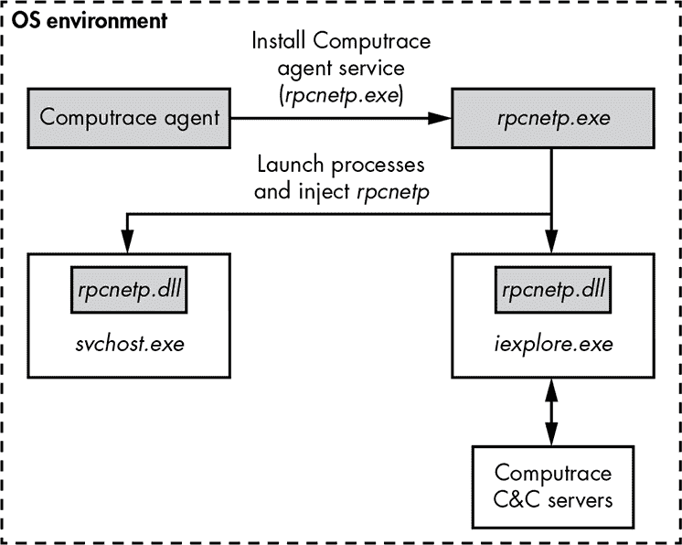

*图 15-16: * rpcnetp.exe *进程注入方案*

Computrace 是一个很好的例子，它看起来明显像一个 BIOS rootkit，但它为合法目的提供了持久功能，例如盗窃恢复。这种类型的持久性允许主要的 Computrace 组件独立于操作系统工作，并与 UEFI 固件深度集成。禁用 Computrace 需要攻击者付出比仅仅停止其操作系统代理组件更多的努力！

### 结论

BIOS rootkit 和植入物是 bootkit 的下一阶段进化。正如我们在本章所看到的，这一进化创造了一种新的固件持久性层次，尚未被杀毒软件解决，这意味着使用这些技术的恶意软件可以保持活动多年。我们尽力提供了关于 BIOS rootkit 的详细概述，从最初的 PoC 和野外样本到高级的 UEFI 植入物。然而，这一主题非常复杂，需要更多的章节来深入探讨。我们鼓励你访问提供的链接，进一步阅读，并关注我们的博客。

针对这种恶意软件的缓解方法仍然薄弱，但也有一个事实是，硬件厂商继续推出越来越复杂的安全启动实现，其中启动完整性检查从更早的启动步骤开始，甚至在 BIOS 运行之前就已启动。第十七章将更深入探讨现代安全启动的实现。在撰写本文时，安全行业才刚刚开始学习如何进行固件的法医调查，因为关于真实、实际发生的案例的信息不幸地仍然很少。我们将在最后一章中深入探讨更多的 UEFI 固件法医调查。

第十六章探讨了 UEFI 漏洞。据我们所知，迄今为止没有其他书籍在相同的详细程度上涵盖这一主题，因此请准备好！
