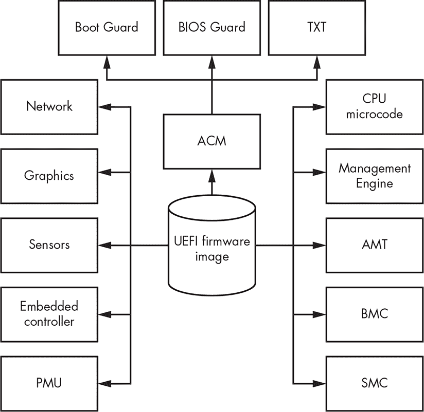
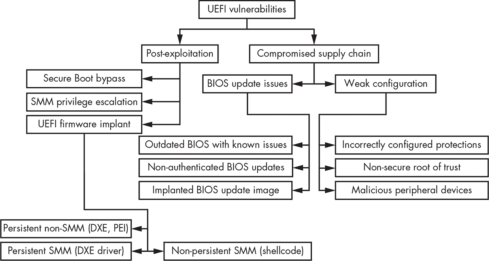
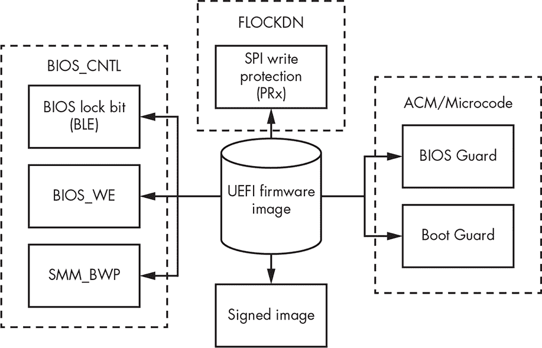
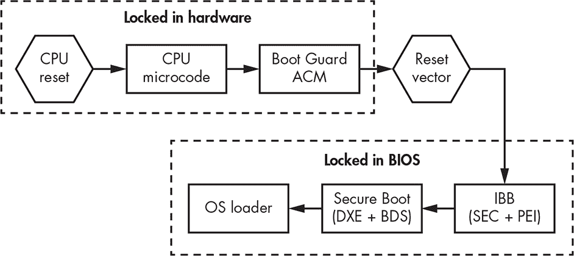
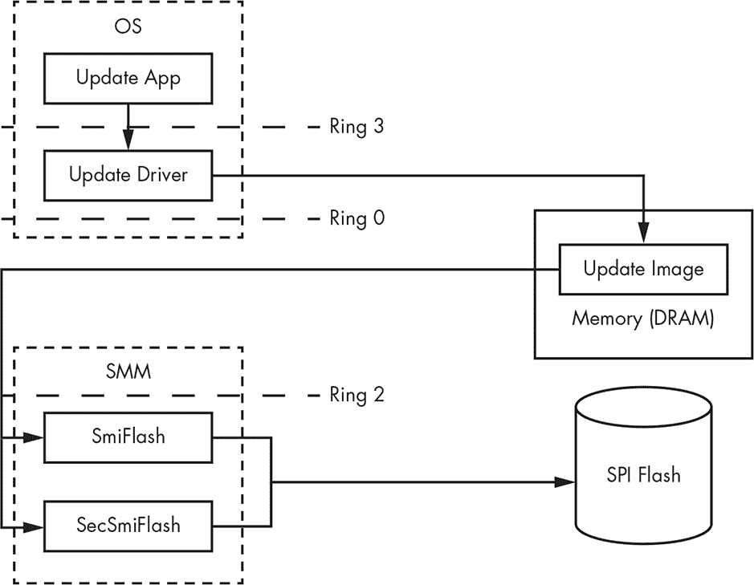
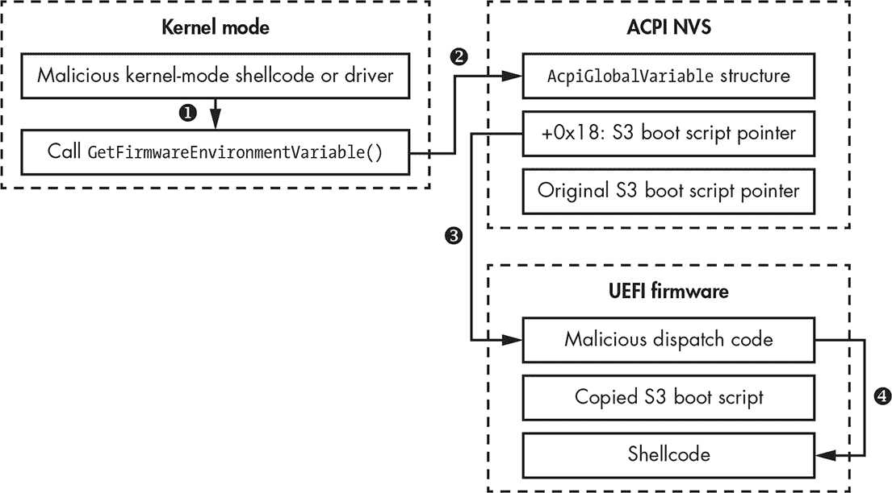

## **16

UEFI 固件漏洞


目前的安全产品倾向于专注于操作软件堆栈高层的威胁，并取得了相当不错的成果。然而，这使得它们无法看到固件中的黑暗水域。如果攻击者已经获得系统的特权访问权限并安装了固件植入物，那么这些产品将毫无作用。

很少有安全产品检查固件，而且那些做检查的产品也仅限于操作系统级别，它们只能在植入物成功安装并破坏系统后，才能检测到其存在。更复杂的植入物还可以利用其在系统中的特权位置，避免被检测，并破坏操作系统级别的安全产品。

基于这些原因，固件 rootkit 和植入物是对个人电脑最危险的威胁之一，它们对现代云平台构成了更大的威胁，因为一个配置错误或被攻破的客户操作系统就会危及所有其他客户，暴露其内存并受到恶意操控。

检测固件异常是一个技术挑战，原因有很多。不同厂商提供的 UEFI 固件代码库各不相同，现有的检测异常方法在每种情况下都不有效。攻击者还可以利用检测方案的误报和漏报来他们的优势，甚至可能接管操作系统级别的检测算法用来访问和检查固件的接口。

保护免受固件 rootkit 攻击的唯一可行方法是防止其安装。检测和其他缓解措施无效；相反，我们必须阻止可能的感染途径。检测或防止固件威胁的解决方案仅在开发者完全控制软件和硬件堆栈时有效，就像苹果或微软那样。第三方解决方案总是会有盲点。

在本章中，我们将概述用于感染 UEFI 固件的大多数已知漏洞和利用途径。我们将首先检查易受攻击的固件，分类固件弱点和漏洞，并分析现有的固件安全措施。然后，我们将描述 Intel Boot Guard、SMM 模块、S3 启动脚本和 Intel 管理引擎中的漏洞。

### **是什么使固件容易受到攻击？**

我们将从攻击者可能通过恶意更新攻击的固件开始讲解。更新是最有效的感染方法。

厂商通常将 UEFI 固件更新广义地描述为 *BIOS 更新*，因为 BIOS 是主要的固件，但典型的更新还会为主板内部的各种硬件单元，甚至 CPU 提供许多其他类型的嵌入式固件。

被篡改的 BIOS 更新会破坏由 BIOS 管理的所有其他固件更新的完整性保证（其中一些更新，如英特尔微码，具有额外的认证方法，不仅仅依赖 BIOS），因此，任何绕过 BIOS 更新镜像认证的漏洞，也为恶意根工具或植入物的传送打开了大门，可能影响这些设备中的任何一个。

图 16-1 展示了 BIOS 管理的典型固件单元，所有这些都容易受到恶意 BIOS 更新的影响。



*图 16-1：现代基于 x86 计算机中不同固件的概述*

以下是每种固件类型的简要描述：

**电源管理单元（PMU）** 一种微控制器，负责控制 PC 在不同电源状态之间的电源功能和过渡，例如睡眠和休眠。它包含自己的固件和低功耗处理器。

**英特尔嵌入式控制器（EC）** 一种始终开启的微控制器，支持多种功能，例如开关计算机、处理键盘信号、计算热量测量和控制风扇。它通过 ACPI、SMBus 或共享内存与主 CPU 通信。EC 与随后描述的英特尔管理引擎一起，可以在系统管理模式被破坏时充当安全信任根。例如，英特尔 BIOS 保护技术（厂商特定的实现）使用 EC 控制对 SPI 闪存的读/写访问。

**英特尔集成传感器集线器（ISH）** 一种微控制器，负责传感器，例如设备旋转检测器和自动背光调节器。它还可以负责这些传感器的一些低功耗睡眠状态。

**图形处理单元（GPU）** 一种集成图形处理器（iGPU），它是大多数现代英特尔 x86 计算机中平台控制器集线器（PCH）设计的一部分。GPU 具有自己的先进固件和计算单元，专注于生成图形，如着色器。

**英特尔千兆网络** 集成以太网卡用于基于 x86 的计算机，表现为连接到 PCH 的 PCIe 设备，并包含其固件，通过 BIOS 更新镜像提供。

**英特尔 CPU 微码** CPU 的内部固件，是解释 ISA 的解释层。程序员可见的*指令集架构（ISA）* 是微码的一部分，但有些指令可以在硬件层面上更深入地集成。英特尔微码是硬件级指令的一层，实现更高层次的机器码指令和许多数字处理元素中的内部状态机序列。

**认证代码模块 (ACM)** 是一种签名的二进制文件，在缓存内存中执行。英特尔微代码在受保护的内部 CPU 内存中加载并执行，这块内存被称为*认证代码 RAM (ACRAM)*，或*缓存作为 RAM (CAR)*。这块高速内存会在启动过程中较早初始化。在主内存被激活并且早期启动 ACM 代码（英特尔启动保护）的复位向量代码运行之前，它作为常规 RAM 使用；也可以在启动过程稍后加载。之后，它会被重新用于一般用途的缓存。ACM 由一个带有定义入口点的 RSA 二进制文件签名。现代的英特尔计算机可能有多个 ACM，用于不同的目的，但它们大多数用于支持额外的安全平台功能。

**英特尔管理引擎 (ME)** 是一款微控制器，为英特尔开发的多项安全功能提供根信任功能，包括与*固件受信平台模块*（*fTPM*）的软硬件接口（通常，TPM 是端点设备上的专用芯片，用于硬件认证，并且通常包含独立的固件）。自英特尔第六代 CPU 起，英特尔 ME 是一款基于 x86 架构的微控制器。

**英特尔主动管理技术 (AMT)** 是用于远程管理个人计算机和服务器的硬件和固件平台。它提供对显示器、键盘和其他设备的远程访问。它包括英特尔基于芯片组的基础板管理控制器技术，专为客户平台设计（稍后讨论），并集成在英特尔的 ME 中。

**基础板管理控制器 (BMC)** 是一套计算机接口规范，用于管理和监控计算机子系统，该子系统独立于主机系统的 CPU、UEFI 固件和实时操作系统运行。BMC 通常在一个独立的芯片上实现，具有自己的以太网网络接口和固件。

**系统管理控制器 (SMC)** 是一款位于主板上的微控制器，用于控制电源功能和传感器。它通常出现在苹果生产的计算机中。

每个固件单元都可能成为攻击者存储和执行代码的机会，而所有单元又相互依赖以保持完整性。例如，Alex Matrosov 发现了近期某些技嘉硬件中的一个问题，ME 允许其内存区域被写入并从 BIOS 中读取。结合弱配置的英特尔启动保护，这个问题使我们能够完全绕过硬件的启动保护实现。（更多关于此漏洞的信息，请参考 CVE-2017–11313 和 CVE-2017–11314，供应商已确认并修复了此问题。）我们将在本章稍后讨论启动保护的实现及绕过方法。

BIOS rootkit 的主要目标是保持持续且隐蔽的感染，就像书中描述的内核模式 rootkit 和 MBR/VBR 启动根 kit 一样。然而，BIOS rootkit 可能有额外的有趣目标。例如，它可能尝试临时控制系统管理模式（SMM）或非特权驱动程序执行环境（DXE；在 SMM 之外执行），以进行内存或文件系统的隐藏操作。即使是从 SMM 执行的非持久性攻击，也能够绕过现代 Windows 系统中的安全边界，包括基于虚拟化的安全（VBS）和虚拟机来宾实例。

### **分类 UEFI 固件漏洞**

在深入研究漏洞之前，让我们先分类 BIOS 植入安装可能针对的安全缺陷类型。图 16-2 中展示的所有漏洞类别都可以帮助攻击者突破安全边界并安装持久性植入物。

英特尔研究人员首次尝试根据攻击对漏洞潜在影响的不同，来对 UEFI 固件漏洞进行分类。他们在 2017 年的 Black Hat USA 大会上，展示了他们的分类方法，主题为“固件是新的黑色——分析过去三年 BIOS/UEFI 安全漏洞”（* [`www.youtube.com/watch?v=SeZO5AYsBCw`](https://www.youtube.com/watch?v=SeZO5AYsBCw)*），该演讲涵盖了不同类别的安全问题以及一些缓解措施。它的一个重要贡献是提供了英特尔 PSIRT 处理的安全问题总数增长的统计数据。

我们有一种不同的安全问题分类方法，专注于固件 rootkit 的影响，如 图 16-2 所示。

**注意**

*图 16-2 中表示的威胁模型仅涵盖与 UEFI 固件相关的流量，但英特尔 ME 和 AMT 的安全问题范围正在显著增加。此外，近年来，BMC 已成为远程管理服务器平台非常重要的安全资产，并且受到了研究人员的高度关注。*



*图 16-2：适用于安装 BIOS 植入物的 BIOS 漏洞分类*

我们可以根据漏洞的使用方式对 图 16-2 中提出的漏洞类别进行分类，分为两大类：*后期利用* 和 *受损供应链*。

#### ***后期利用漏洞***

后渗透漏洞通常被用作传递恶意载荷的第二阶段（该利用方案在第十五章中有详细解释）。这是攻击者利用的主要漏洞类别，在成功利用先前攻击阶段后安装持久和非持久植入物的过程中被利用。以下是此类别中主要植入物、利用和漏洞的类别。

**安全启动绕过** 攻击者专注于绕过安全启动过程，而不是利用信任根（即完全妥协）或引导阶段中的其他漏洞。安全启动绕过可以发生在不同的引导阶段，并且可以被攻击者用来针对所有后续层和它们的信任机制。

**SMM 特权升级** SMM 在 x86 硬件上具有很强的功能，因为几乎所有的 SMM 特权升级问题最终都会成为代码执行问题。提升到 SMM 的特权往往是 BIOS 植入物安装的最后阶段之一。

**UEFI 固件植入物** UEFI 固件植入物是持久 BIOS 植入物安装的最终阶段。攻击者可以将植入物安装在 UEFI 固件的各个级别上，可以是修改后的合法模块，也可以是后续将讨论的 DXE 或 PEI 等独立驱动程序。

**持久植入物** 持久植入物是可以在完全重启和关机周期中存活的植入物。在某些情况下，为了在后续更新过程中存活，它可以修改 BIOS 更新映像。

**非持久植入物** 非持久植入物是不能在完全重启和关机周期中存活的植入物。这些植入物可能会提供特权升级，并在具有受保护硬件虚拟化（如 Intel VT-x）和受信任执行层（如 MS VBS）的操作系统中提供代码执行。它们还可以用作向操作系统内核模式传递恶意载荷的隐蔽通道。

#### ***受损供应链漏洞***

*受损供应链攻击* 利用 BIOS 开发团队或 OEM 硬件供应商的错误，或涉及目标软件的故意配置错误，从而提供给攻击者对平台安全特性的可否认绕过。

在供应链攻击中，攻击者在硬件生产和制造过程中获取硬件访问权限，并在硬件到达消费者之前向固件注入恶意修改或安装恶意外围设备。供应链攻击也可以远程发生，例如当攻击者获取固件开发者内部网络（有时是供应商网站）的访问权限，并直接将恶意修改传递到源代码存储库或构建服务器中。

具有物理访问权限的供应链攻击涉及悄悄干扰目标平台，它们有时与*邪恶女仆攻击*相似，攻击者在有限的时间内拥有物理访问权限，并利用供应链漏洞进行攻击。这些攻击利用了硬件所有者无法监控物理访问的情况——例如，当所有者将笔记本电脑放入托运行李中，交给外方海关检查，或者仅仅忘记在酒店房间里。攻击者可以利用这些机会重新配置硬件和固件，植入 BIOS 或直接将恶意固件写入 SPI 闪存芯片。

以下大多数问题适用于供应链和邪恶女仆攻击场景。

**配置错误的保护措施** 通过在开发过程或生产后阶段攻击硬件或固件，攻击者可以错误配置技术保护措施，以便在后续轻松绕过它们。

**不安全的信任根** 该漏洞涉及通过操作系统与固件（例如 SMM）的通信接口来破坏信任根。

**恶意外设** 这种攻击涉及在生产或交付阶段植入恶意外设。恶意设备可以以多种方式被使用，例如进行*直接内存访问（DMA）*攻击。

**植入的 BIOS 更新** 攻击者可能会破坏供应商网站或其他远程更新机制，利用它来传送感染了的 BIOS 更新。攻击的突破点可能包括供应商的构建服务器、开发者系统或被窃取的数字证书与供应商的私钥。

**未经认证的 BIOS 更新过程** 供应商可能会破坏 BIOS 更新的认证过程，无论是有意还是无意，从而允许攻击者对更新镜像进行任何他们想要的修改。

**具有已知安全问题的过时 BIOS** BIOS 开发人员可能会继续使用较旧的、存在漏洞的 BIOS 固件版本，即使基础代码库已经修补，这使得固件容易受到攻击。硬件供应商最初交付的过时 BIOS 版本可能会在用户的个人电脑或数据中心服务器上长期存在而没有更新。这是 BIOS 固件中最常见的安全问题之一。

#### ***供应链漏洞缓解***

在不对开发和生产生命周期进行根本性改变的情况下，很难减轻与供应链相关的风险。典型的生产客户端或服务器平台包括许多第三方组件，包括软件和硬件。大多数没有完全拥有生产周期的公司对安全性不太关注，也确实负担不起。

这种情况由于缺乏与 BIOS 安全配置和芯片组配置相关的信息和资源而进一步加剧。NIST 800-147（“BIOS 保护指南”）和 NIST 800-147B（“服务器 BIOS 保护指南”）出版物作为一个有用的起点，但自 2011 年首次发布以及 2014 年针对服务器更新以来，它们很快就变得过时了。

让我们深入了解一些 UEFI 固件攻击，以填补这些普遍知识的空白。

### **UEFI 固件保护的历史**

在本节中，我们将介绍一些允许攻击者绕过安全启动的漏洞类别；我们将在下一章讨论具体的安全启动实施细节。

以前，任何允许攻击者在 SMM 环境中执行代码的安全问题都可以绕过安全启动。尽管一些现代硬件平台，即使经过了最近的硬件更新，仍然容易受到基于 SMM 的安全启动攻击，但大多数企业供应商已经转向使用最新的英特尔安全功能，这使得这些攻击变得更加困难。今天的英特尔技术，如英特尔启动保护（Intel Boot Guard）和 BIOS 保护（BIOS Guard，稍后将在本章中讨论），将启动过程的信任根从 SMM 转移到一个更安全的环境：英特尔 ME 固件/硬件。

**信任根**

信任根是一个经过验证的加密密钥，作为安全启动的锚点。安全启动通过建立一个硬件验证的启动过程，确保平台只能使用已经通过信任根验证的受信任代码启动。现代平台设计将其信任根锁定在基于硬件的受保护存储中，例如一次性可编程熔丝或带有持久存储的独立芯片。

UEFI 安全启动的第一个版本在 2012 年推出。它的主要组成部分包括在 DXE 启动阶段（UEFI 固件启动的最新阶段之一，操作系统接管控制之前）实现的信任根。这意味着这个早期的安全启动实现只真正确保了操作系统引导程序的完整性，而不是 BIOS 本身。

很快，这一设计的弱点变得显而易见，在下一个实施中，信任根被移至 PEI，这是平台初始化的早期阶段，在 DXE 之前就将其锁定。然而，这个安全边界也证明是脆弱的。自 2013 年起，随着英特尔启动保护技术的发布，信任根通过 TPM 芯片（或在 ME 固件中实现的等效功能，以降低支持成本）锁定在硬件中。现场可编程熔丝（FPF）位于主板芯片组（PCH 组件，通过 ME 固件可编程）。

在我们深入探讨促使这些重新设计的相关漏洞历史之前，让我们先讨论一下基本的 BIOS 保护技术如何工作。

#### ***BIOS 保护如何工作***

图 16-3 显示了用于保护持久 SPI 闪存存储的技术的高级视图。SMM 最初允许对 SPI 闪存存储进行读写访问，以便实现常规的 BIOS 更新。这意味着 BIOS 的完整性依赖于 *任何* 在 SMM 中运行的代码的质量，因为任何此类代码都可以修改 SPI 存储中的 BIOS。因此，安全边界的强度仅与运行在 SMM 中的最弱代码的强度相同，而这些代码又有权限访问 SMM 之外的内存区域。因此，平台开发者采取措施将 BIOS 更新与 SMM 的其他功能分开，引入了一系列附加的安全控制措施，例如英特尔 BIOS Guard。



*图 16-3：BIOS 安全技术的高级表示*

#### ***SPI 闪存保护及其漏洞***

我们在“(内存保护位的(无)效力”第 263 页中讨论了图 16-3 中显示的一些控制：BIOS 控制位保护（BIOS_CNTL）、闪存配置锁定（FLOCKDN）和 SPI 闪存写保护（PRx）。然而，BIOS_CNTL 保护仅对尝试从操作系统修改 BIOS 的攻击者有效，并且它可以通过任何来自 SMM 的代码执行漏洞绕过（SMI 处理程序可以从外部访问），因为 SMM 代码可以自由修改这些保护位。基本上，BIOS_CNTL 仅创建了一种安全的假象。

最初，SMM 对 SPI 闪存存储既有读访问权限也有写访问权限，因此可以实现常规的 BIOS 更新。这使得 BIOS 的完整性依赖于 *任何* 在 SMM 中运行的代码的质量，因为任何此类代码都能够修改 SPI 存储中的 BIOS。这个安全边界证明是相当脆弱的——脆弱程度与 SMM 中运行的最弱代码相当。

因此，平台开发者采取措施将 BIOS 更新与 SMM 的其他功能分离。这些控制本身往往较弱。例如，BIOS 控制位保护（BIOS_CNTL）仅对尝试从操作系统修改 BIOS 的攻击者有效；任何来自 SMM 的代码执行漏洞都可以绕过该保护，因为 SMM 代码可以自由修改这些保护位。

PRx 控制更有效，因为其政策无法从 SMM 中更改。然而，正如我们稍后将讨论的那样，许多厂商并未使用 PRx 保护——包括 Apple 和令人惊讶的 Intel，尽管它是这种保护技术的发明者。

表 16-1 总结了截至 2018 年 1 月，流行厂商基于安全锁位的 x86 硬件的活动保护技术状态。在此，RP 表示 *读取保护*，WP 表示 *写入保护*。

**表 16-1：** 常见硬件厂商的安全级别

| **厂商名称** | **BLE** | **SMM_BWP** | **PRx** | **认证更新** |
| --- | --- | --- | --- | --- |
| **华硕** | 激活 | 激活 | 未激活 | 未激活 |
| **微星** | 未激活 | 未激活 | 未激活 | 未激活 |
| **技嘉** | 激活 | 激活 | 未激活 | 未激活 |
| **戴尔** | 激活 | 激活 | RP/WP | 激活 |
| **联想** | 激活 | 激活 | RP | 激活 |
| **惠普** | 激活 | 激活 | RP/WP | 激活 |
| **英特尔** | 激活 | 激活 | 未激活 | 激活 |
| **苹果** | 未激活 | 未激活 | WP | 激活 |

如你所见，厂商在 BIOS 安全性上的做法差异巨大。一些厂商甚至不对 BIOS 更新进行认证，这就带来了严重的安全隐患，因为安装植入程序变得更加容易（除非厂商强制执行 Intel Boot Guard 策略）。

此外，PRx 保护必须正确配置才能生效。列表 16-1 显示了一个配置不当的闪存区域示例，所有 PRx 段定义都设置为零，使其无法使用。

```
[*] BIOS Region: Base = 0x00800000, Limit = 0x00FFFFFF

SPI Protected Ranges

------------------------------------------------------------

PRx (offset) | Value    | Base     | Limit    | WP? | RP?

------------------------------------------------------------

PR0 (74)     | 00000000 | 00000000 | 00000000 | 0   | 0

PR1 (78)     | 00000000 | 00000000 | 00000000 | 0   | 0

PR2 (7C)     | 00000000 | 00000000 | 00000000 | 0   | 0

PR3 (80)     | 00000000 | 00000000 | 00000000 | 0   | 0

PR4 (84)     | 00000000 | 00000000 | 00000000 | 0   | 0
```

*列表 16-1：配置不当的 PRx 访问策略（由 Chipsec 工具导出）*

我们也看到一些厂商配置了仅限读取保护的策略，这仍然允许攻击者修改 SPI 闪存。此外，PRx 并不能保证对 SPI 实际内容的任何完整性度量，因为它仅在启动过程的非常早期 PEI 阶段实现了对直接读写访问的按位锁定。

一些厂商如苹果和英特尔倾向于禁用 PRx 保护的原因是，这些保护需要立即重启，使得 BIOS 更新变得不太方便。没有 PRx 保护时，厂商的 BIOS 更新工具可以使用操作系统 API 将新的 BIOS 镜像写入物理内存中的空闲区域，然后调用 SMI 中断，使得驻留在 SMM 中的某些辅助代码可以从该区域获取镜像并将其写入 SPI 闪存。更新后的 SPI 闪存镜像将在下次重启时接管控制，但该重启可以在用户方便时进行。

当 PRx 被启用并正确配置以保护 SPI 的适当区域免受 SMM 代码修改时，BIOS 更新工具将无法再使用 SMM 来修改 BIOS。相反，它必须将更新镜像存储在动态随机存取内存（DRAM）中，并触发立即重启。安装更新的辅助代码必须是一个特殊的早期启动阶段驱动程序的一部分，该驱动程序在 PRx 保护激活之前运行，并将更新镜像从 DRAM 转移到 SPI。这种更新方法有时需要在工具运行时进行重启（或直接调用 SMI 处理程序而不重启），这对用户来说不太方便。

无论 BIOS 更新程序采取哪种方式，都必须确保助手代码在安装之前认证更新镜像。否则，无论是否启用 PRx，是否重启，助手代码都会毫不犹豫地安装一个经过修改的带有植入物的 BIOS 镜像，只要攻击者在助手代码运行之前能够修改该镜像。如表 16-1 所示，一些硬件供应商不认证固件更新，这使得攻击者的任务变得简单，只需篡改更新镜像即可。

**第一次公开已知的 BIOS 更新过程攻击**

请记住，即使你正确配置了 PRx 并认证了 BIOS 更新的加密签名，你仍然可能会受到攻击。2009 年，Rafal Wojtczuk 和 Alex Tereshkin 在 Black Hat Vegas 大会上提出了第一次公开已知的攻击，目标是一个经过认证和签名的 BIOS 更新过程，该过程装备了活跃的 SPI 闪存保护位。作者展示了 BIOS 更新镜像文件解析器中的内存损坏漏洞，该漏洞导致了任意代码执行，并绕过了更新文件签名的认证。

#### ***未经认证的 BIOS 更新所带来的风险***

2018 年 9 月，反病毒公司 ESET 发布了一份关于 LOJAX 的研究报告，LOJAX 是一种针对 UEFI 固件的 rootkit 攻击。1 在攻击发生时，LOJAX rootkit 所使用的所有技术都是众所周知的，曾在过去五年里出现在其他发现的恶意软件中。LOJAX 采用了与黑客团队的 UEFI rootkit 相似的战术：它滥用了存储在 NTFS 中的未经认证的 Computrace 组件，如我们在第十五章中讨论的。因此，LOJAX rootkit 并没有使用任何新漏洞；它唯一的新颖之处在于其感染目标的方式——它检查系统是否存在未经认证的 SPI 闪存访问，如果找到了，就交付一个经过修改的 BIOS 更新文件。

对 BIOS 安全的松懈态度为攻击提供了大量机会。攻击者可以在运行时扫描系统，寻找合适的易受攻击目标和感染向量，而这些都是丰富的。LOJAX rootkit 感染者检查了多个保护措施，包括 BIOS 锁位（BLE）和 SMM BIOS 写保护位（SMM_BWP）。如果固件没有经过认证，或者在将 BIOS 更新镜像传输到 SPI 存储之前没有检查其完整性，攻击者就可以直接从操作系统交付修改过的更新。LOJAX 使用了 Speed Racer 漏洞（VU#766164，最初由 Corey Kallenberg 在 2014 年发现）来通过竞争条件绕过 SPI 闪存保护位。你可以使用`chipsec_main -m common.bios_wp`命令来检测该漏洞及与 BIOS 锁保护位相关的其他弱点。

这个例子表明，安全边界的强度仅取决于其最弱的组成部分。无论平台可能具有其他什么保护，Computrace 对代码认证的松散处理都会削弱它们，重新启用了操作系统侧的攻击向量，而其他保护措施正是试图消除这个向量。只需要一处海堤被突破，整个平原就会被淹没。

#### ***具有安全启动的 BIOS 保护***

安全启动如何改变这一威胁格局？简短的回答是，这取决于它的实现方式。2016 年之前实现的旧版本（没有 Intel Boot Guard 和 BIOS Guard 技术）将面临危险，因为在这些旧实现中，信任根位于 SPI 闪存中，并且可能会被覆盖。

当 2012 年首次推出 UEFI 安全启动时，其主要组成部分包括在*DXE 启动阶段*实现的信任根，这是 UEFI 固件启动中的最新阶段之一，发生在操作系统获得控制之前。由于信任根在启动过程中的出现较晚，这一早期的安全启动实现实际上只保证了操作系统引导程序的完整性，而不是 BIOS 本身的完整性。这种设计的弱点很快显现出来，在下一版本中，信任根被移到了*PEI*，即早期平台初始化阶段，以便在 DXE 之前锁定信任根。这个安全边界也证明了其脆弱性。

Boot Guard 和 BIOS Guard 是安全启动中较新的功能，解决了这一弱点：Boot Guard 将信任根从 SPI 移到硬件中，而 BIOS Guard 则将更新 SPI 闪存内容的任务从 SMM 转移到一个独立的芯片（Intel 嵌入式控制器，简称 EC），并移除了允许 SMM 写入 SPI 闪存的权限。

另一个考虑将信任根提早到启动过程中的硬件部分，是最小化可信平台的启动时间。你可以想象一种启动保护方案，它将验证成百上千个可用 EFI 映像的数字签名，而不是一个包含所有驱动程序的单一映像。然而，这对于今天的世界来说速度太慢，因为平台供应商希望在启动时间上节省毫秒级的时间。

在这一点上，你可能会问：既然安全启动过程涉及这么多组件，我们如何避免在其中一个微小的错误摧毁所有安全保障？（我们将在第十七章中详细介绍安全启动的完整过程。）迄今为止，最好的答案是拥有能够确保每个组件执行其指定角色的工具，并确保每个启动阶段按照确切的顺序进行。也就是说，我们需要一个过程的正式模型，自动化代码分析工具可以验证它——这意味着模型越简单，我们就越有信心它能被正确检查。

安全启动依赖于信任链：预定的执行路径从锁定在硬件或 SPI 闪存存储中的信任根开始，并通过安全启动过程的各个阶段，只有在每个阶段的所有条件和策略都满足的情况下，才能按特定顺序进行。

严格来说，我们将这个模型称为*有限状态机*，其中不同的状态代表系统启动过程中的不同阶段。如果任何一个阶段具有非确定性行为——例如，如果一个阶段可以将启动过程切换到不同的模式或有多个退出点——我们的安全启动过程就变成了一个非确定性有限状态机。这使得自动验证安全启动过程变得更加困难，因为它指数级地增加了我们必须验证的执行路径数量。在我们看来，安全启动中的非确定性行为应该被视为一种设计失误，可能会导致代价高昂的漏洞，正如本章稍后讨论的 S3 启动脚本漏洞一样。

### **英特尔 Boot Guard**

在本节中，我们将讨论英特尔 Boot Guard 技术的工作原理，然后探讨它的一些漏洞。尽管英特尔没有公开的 Boot Guard 官方文档，但我们和其他人的研究使我们能够描绘出这项卓越技术的清晰图景。

#### ***英特尔 Boot Guard 技术***

Boot Guard 将安全启动分为两个阶段：在第一阶段，Boot Guard 认证 SPI 存储器中 BIOS 部分的所有内容；在第二阶段，安全启动处理其余的启动过程，包括操作系统引导加载程序的认证（图 16-4）。



*图 16-4：启用英特尔 Boot Guard 技术的启动过程*

英特尔 Boot Guard 技术跨越了 CPU 架构的多个层次及相关抽象层。一个好处是它不需要信任 SPI 存储，因此能够避免我们在本章前面讨论的漏洞。Boot Guard 通过使用英特尔签名的认证代码模块（ACM），将 SPI 闪存中存储的 BIOS 的完整性检查与 BIOS 本身分开，从而在允许执行之前验证 BIOS 映像的完整性。启用 Boot Guard 的设备上，信任根移入英特尔微架构中，其中 CPU 的微代码解析 ACM 内容，并检查 ACM 中实现的数字签名验证程序，进而检查 BIOS 签名。

相比之下，原始的 UEFI 安全启动信任根位于 UEFI DXE 阶段，这几乎是控制权交给操作系统引导加载程序之前的最后一个阶段——正如我们之前提到的，这个时间点非常靠后。如果在 DXE 阶段固件被妥协，攻击者可以完全绕过或禁用安全启动。如果没有硬件辅助的验证，就无法保证 DXE 阶段之前发生的启动过程阶段的完整性（PEI 实现也存在已知的弱点），包括 DXE 驱动程序本身的完整性。

Boot Guard 通过将安全启动的信任根从 UEFI 固件转移到硬件本身，解决了这个问题。例如，Verified Boot——这是英特尔在 2013 年引入的 Boot Guard 的一个新变种，我们将在下一章详细讨论——将 OEM 公钥的哈希值锁定在现场可编程熔丝（FPF）存储区内。FPF 只能编程一次，硬件供应商在制造过程结束时锁定该配置（在某些情况下可以撤销，但由于这些属于边缘案例，这里不做讨论）。

#### ***Boot Guard 中的漏洞***

Boot Guard 的有效性取决于其所有组件的协同工作，每一层都不应包含任何漏洞，避免攻击者执行代码或提升权限，以干扰多层安全启动方案的其他组件。Alex Matrosov 在 2017 年 Black Hat USA 上发布的“背叛 BIOS：BIOS 的守护者在哪里失败” (*[`www.youtube.com/watch?v=Dfl2JI2eLc8`](https://www.youtube.com/watch?v=Dfl2JI2eLc8)*) 演讲中揭示了攻击者如何通过干扰较低层设置的位标志，来传递关于其完整性状态的信息给上层，从而成功攻击该方案。

正如已证明的那样，固件无法被信任，因为大多数 SMM 攻击能够妥协它。即使是依赖 TPM 作为信任根的度量启动方案，也可能被破坏，因为度量代码本身运行在 SMM 中，并且在许多情况下可以从 SMM 进行修改，尽管存储在 TPM 硬件中的密钥无法被 SMM 更改。尽管对 TPM 芯片的某些攻击是可能的，但持有 SMM 权限的攻击者并不需要这些攻击，他们只需攻击固件与 TPM 的接口。2013 年，英特尔引入了 Verified Boot（我们刚刚提到的）来解决度量启动的弱点。

启动保护 ACM 验证逻辑会测量 *初始启动块 (IBB)* 并在将控制权传递到 IBB 入口点之前检查其完整性。如果 IBB 验证失败，启动过程通常会中断，具体取决于策略。UEFI 固件（BIOS）的 IBB 部分在普通 CPU 上执行（非隔离或认证）。接下来，IBB 会继续启动过程，按照启动保护策略在已验证或已测量模式下进行，进入平台初始化阶段。PEI 驱动程序验证 DXE 驱动程序的完整性，并将信任链过渡到 DXE 阶段。然后，DXE 阶段继续将信任链传递到操作系统启动加载程序。表 16-2 展示了关于各个硬件厂商在这些阶段中安全状态的研究数据。

**表 16-2：** 不同硬件厂商如何配置安全性（截至 2018 年 1 月）

| **厂商名称** | **ME 访问** | **EC 访问** | **CPU 调试 (DCI)** | **启动保护** | **强制启动保护 ACM** | **启动保护 FPF** | **BIOS 保护** |
| --- | --- | --- | --- | --- | --- | --- | --- |
| **华硕 VivoMini** | 禁用 | 禁用 | 启用 | 禁用 | 禁用 | 禁用 | 禁用 |
| **微星 Cubi2** | 禁用 | 禁用 | 启用 | 禁用 | 禁用 | 禁用 | 禁用 |
| **技嘉 Brix** | 启用读写 | 启用读写 | 启用 | 已测量验证 | 启用（FPF 未设置） | 未设置 | 禁用 |
| **戴尔** | 禁用 | 禁用 | 启用 | 已测量验证 | 启用 | 启用 | 启用 |
| **联想 ThinkCenter** | 禁用 | 禁用 | 启用 | 禁用 | 禁用 | 禁用 | 禁用 |
| **惠普 Elitedesk** | 禁用 | 禁用 | 启用 | 禁用 | 禁用 | 禁用 | 禁用 |
| **英特尔 NUC** | 禁用 | 禁用 | 启用 | 禁用 | 禁用 | 禁用 | 禁用 |
| **苹果** | 启用读取 | 禁用 | 禁用 | 不支持 | 不支持 | 不支持 | 不支持 |

正如你所看到的，这些安全选项的灾难性配置错误并非仅仅是理论上的。例如，一些厂商没有在 FPF 中写入其哈希值，或者写入了但随后没有禁用允许此类写入的制造模式。因此，攻击者可以写入自己的 FPF 密钥，然后锁定系统，将其永远绑定到他们自己的根和信任链上（尽管如果硬件厂商已经开发了撤销过程，存在熔丝覆盖用于撤销）。更准确地说，FPF 可以由 ME 在其内存区域中写入，当 ME 仍处于制造模式时；此时，ME 可以从操作系统进行访问，包括读取和写入。通过这种方式，攻击者实际上获得了“王国的钥匙”。

此外，大多数研究过的基于 Intel 的硬件都启用了 CPU 调试，因此对具有物理访问权限的攻击者来说，所有的“门”都是打开的。部分平台支持 Intel BIOS Guard 技术，但为了简化 BIOS 更新，该功能在制造过程中被禁用了。

因此，表 16-2 提供了多个供应链安全问题的优秀示例，其中厂商为了简化硬件支持，创建了关键的安全漏洞。

### **SMM 模块中的漏洞**

现在让我们来看一下从操作系统利用 UEFI 固件的另一个攻击途径：利用 SMM 模块中的错误。

#### ***理解 SMM***

我们在前几章中讨论了 SMM 和 SMI 处理程序，但现在我们将重新回顾这两个概念，以便温故知新。

SMM 是 x86 处理器的一种高特权执行模式。它旨在独立于操作系统实现平台特定的管理功能。这些功能包括高级电源管理、安全固件更新和 UEFI 安全启动变量的配置。

SMM 的关键设计特性是，它提供了一个与操作系统不可见的独立执行环境。SMM 中使用的代码和数据存储在一个硬件保护的内存区域，称为*SMRAM*，该区域只能由在 SMM 中运行的代码访问。为了进入 SMM，CPU 会生成一个系统管理中断（SMI），这是一个旨在由操作系统软件触发的特殊中断。

*SMI 处理程序*是平台固件的特权服务和功能。SMI 充当操作系统与这些 SMI 处理程序之间的桥梁。一旦所有必要的代码和数据被加载到 SMRAM 中，固件会锁定该内存区域，使其只能由在 SMM 中运行的代码访问，从而防止操作系统访问它。

#### ***利用 SMI 处理程序***

由于 SMM 具有高度特权级别，SMI 处理程序是植入程序和根套件的一个非常有趣的目标。这些处理程序中的任何漏洞都可能为攻击者提供一个机会，将特权提升到 SMM 的级别，也就是所谓的 Ring -2。

与其他多层模型一样，例如内核与用户空间分离，攻击特权代码的最佳方法是针对任何可以从外部消耗的数据，这些数据可能来自隔离的特权内存区域之外。对于 SMM 来说，这些数据是任何位于 SMRAM 之外的内存。对于 SMM 的安全模型，攻击者通常是操作系统或特权软件（如 BIOS 更新工具）；因此，操作系统中任何位于 SMRAM 之外的位置都可能是可疑的，因为它有时会被攻击者操控（甚至可能在经过某种检查之后）。潜在的攻击目标包括 SMM 代码消费的函数指针，这些指针可能会将执行指向 SMRAM 之外的区域，或者是任何包含数据的缓冲区，这些数据被 SMM 代码读取或解析。

如今，UEFI 固件开发人员尝试通过最小化与外部世界（Ring 0——操作系统的内核模式）直接通信的 SMI 处理程序数量，来减少这一攻击面，并通过寻找新的方式来结构化和检查这些交互。但这项工作才刚刚开始，SMI 处理程序的安全问题可能会持续相当长一段时间。

当然，SMM 中的代码可以从操作系统接收一些数据以便发挥作用。然而，为了保持安全性，正如其他多层模型一样，SMM 代码必须始终在数据被复制并在 SMRAM 内检查之后，才可以对外部数据进行处理。任何已被检查但仍保留在 SMRAM 外的数据都不能被信任，因为攻击者可能会在检查点和使用点之间通过竞态条件改变数据。此外，任何已被复制进来的数据都不应引用任何未经检查且未复制的外部数据。

听起来很简单，但像 C 这样的语言并不会原生帮助追踪指针指向的区域，因此“内部”SMRAM 内存位置与“外部”受攻击者控制的操作系统内存之间的安全性差异，在代码中并不总是显而易见。因此，程序员通常只能依靠自己。（如果你在想，这个问题能通过静态分析工具解决多少，继续阅读——事实证明，我们接下来讨论的 SMI 调用约定使得这个问题变得相当具有挑战性。）

要理解攻击者如何利用 SMI 处理程序，你需要理解它们的调用约定。正如清单 16-2 所示，从 Chipsec 框架的 Python 端调用 SMI 处理程序看起来像普通的函数调用，但实际的二进制调用约定，如清单 16-3 所示，是不同的。

```
import chipsec.chipset

import chipsec.hal.interrupts

#SW SMI handler number

SMI_NUM = 0x25

#CHIPSEC initialization

cs = chipsec.chipset.cs()

cs.init(None, True)

#create instances of required classes

ints = chipsec.hal.interrupts.Interrupts(cs)

#call SW SMI handler 0x25

cs.ints.send_SW_SMI(0, SMI_NUM, 0, 0, 0, 0, 0, 0, 0)
```

*清单 16-2：如何通过 Chipsec 框架从 Python 调用 SMI 处理程序*

清单 16-2 中的代码调用 SMI 处理程序时，除了 0x25（被调用的处理程序编号）外，所有参数都被置为零。这样的调用可能确实不传递任何参数，但也有可能 SMI 处理程序在获得控制后间接获取这些参数——例如，通过 ACPI 或 UEFI 变量。当操作系统触发 SMI 时（例如，通过 I/O 端口 0xB2 作为软件中断），它通过通用寄存器将参数传递给 SMI 处理程序。在清单 16-3 中，你可以看到 SMI 处理程序的实际调用方式以及参数是如何传递的。Chipsec 框架当然在幕后实现了这一调用约定。

```
mov rax, rdx     ; rax_value

mov ax, cx       ; smi_code_data

mov rdx, r10     ; rdx_value

mov dx, 0B2h     ; SMI control port (0xB2)

mov rbx, r8      ; rbx_value

mov rcx, r9      ; rcx_value

mov rsi, r11     ; rsi_value

mov rdi, r12     ; rdi_value

; write smi data value to SW SMI control/data ports (0xB2/0xB3)

out dx, ax
```

*清单 16-3：汇编语言中的 SMI 处理程序调用*

##### **SMI 调用问题与任意代码执行**

对 BIOS 植入物感兴趣的最常见 SMI 处理程序漏洞主要分为两大类：SMI 调用问题和任意代码执行（在许多情况下，任意代码执行是由 SMI 调用问题引发的）。在 SMI 调用问题中，SMM 代码无意中使用了一个由攻击者控制的函数指针，该指针指向 SMM 外部的植入载荷。在任意代码执行中，SMM 代码从 SMRAM 外部读取一些数据，这些数据能够影响控制流，并且可以被用来获得更多控制权限。这些地址通常位于物理内存的第一个兆字节以下，因为 SMI 处理程序预期使用这一内存范围，而操作系统并未使用该内存范围。在 SMI 调用问题中，当攻击者能够覆盖一个间接跳转的地址或一个从 SMM 调用的函数指针时，攻击者控制的任意代码将会在 SMM 外部执行，但仍然拥有 SMM 的特权（这种攻击的一个典型例子是 VU#631788）。

在主要企业厂商的新版本 BIOS 中，这类漏洞更难发现，但即使引入了标准函数`SmmIsBufferOutsideSmmValid()`来检查指向内存缓冲区的指针是否在 SMRAM 范围内，访问超出 SMRAM 范围的指针的问题仍然存在。这个通用检查的实现已经在 GitHub 上的 Intel EDK2 代码库中引入（* [`github.com/tianocore/edk2/blob/master/MdePkg/Library/SmmMemLib/SmmMemLib.c`](https://github.com/tianocore/edk2/blob/master/MdePkg/Library/SmmMemLib/SmmMemLib.c) *），它的声明见于清单 16-4。

```
BOOLEAN

EFIAPI

SmmIsBufferOutsideSmmValid (

  IN EFI_PHYSICAL_ADDRESS  Buffer,

  IN UINT64                Length

  )
```

*清单 16-4：来自 Intel EDK2 的函数`SmmIsBufferOutsideSmmValid()`的原型*

`SmmIsBufferOutsideSmmValid()`函数可以准确检测指向 SMRAM 范围外的内存缓冲区的指针，唯一的例外是：`Buffer`参数可能是一个结构体，而该结构体的一个字段可能是指向 SMRAM 外部的另一个缓冲区的指针。如果安全检查仅对结构体本身的地址进行检查，SMM 代码仍然可能存在漏洞，即使已经通过`SmmIsBufferOutsideSmmValid()`进行了检查。因此，SMI 处理程序必须在从操作系统接收到每个地址或指针（包括偏移量！）之前验证它们，而在读取或写入这些内存位置时尤为重要。值得注意的是，这也包括返回状态和错误代码。在 SMM 内部发生的任何算术计算都应该验证任何来自 SMM 外部或低权限模式的参数。

##### **SMI 处理程序利用案例研究**

既然我们已经讨论了 SMI 处理程序从操作系统获取数据的危险，现在是时候深入探讨一个 SMI 处理程序被利用的实际案例了。我们将查看 Windows 10 等操作系统中使用的 UEFI 固件更新过程的常见工作流程。在这种情况下，固件在 SMM 内部进行验证和认证，使用的是较弱的 DXE 运行时驱动程序。

图 16-5 展示了该场景下 BIOS 更新过程的高级示意图。



*图 16-5：操作系统中 BIOS 更新过程的高级表示*

如你所见，用户态 BIOS 更新工具（Update App）与其内核模式驱动程序（Update Driver）进行通信，后者通常通过 Ring 0 API 函数 `MmMapIoSpace()` 直接访问物理内存设备。这种访问使得潜在攻击者可以修改或映射恶意数据到与 SMI 处理程序 BIOS（SmiFlash 或 SecSmiFlash）更新解析器通信的内存区域。通常，解析流程复杂到足以留下漏洞，特别是当解析器通常用 C 语言编写时。攻击者构造一个恶意数据缓冲区，并通过其编号调用一个易受攻击的 SMI 处理程序，如清单 16-3 所示，使用 MS Visual C++ 编译器中的 `__outbyte()` 内建函数。

在图 16-5 中展示的 DXE 驱动程序 SmiFlash 和 SecSmiFlash，广泛存在于许多 SMM 代码库中。SmiFlash 会在没有任何身份验证的情况下刷新 BIOS 镜像。使用基于此驱动程序的更新工具，攻击者可以轻松地刷新一个经过恶意修改的 BIOS 更新镜像，而无需任何额外操作（这种类型漏洞的一个典型例子是 Alex Matrosov 发现的 VU#507496）。相反，SecSmiFlash 通过检查数字签名来验证更新，从而阻止了这种攻击。

### **S3 启动脚本中的漏洞**

在本节中，我们将概述 S3 启动脚本中的漏洞，这是 BIOS 用于从睡眠模式唤醒的脚本。尽管 S3 启动脚本加速了唤醒过程，但其不当实现可能会带来严重的安全影响，我们将在此进行探讨。

#### ***理解 S3 启动脚本***

现代硬件的电源转换状态——如工作模式和睡眠模式——非常复杂，涉及多个 DRAM 操作阶段。在睡眠模式（S3）期间，DRAM 保持供电，尽管 CPU 并未工作。当系统从睡眠状态唤醒时，BIOS 恢复平台配置，包括 DRAM 的内容，然后将控制权转交给操作系统。你可以在 *[`docs.microsoft.com/en-us/windows/desktop/power/system-power-states/`](https://docs.microsoft.com/en-us/windows/desktop/power/system-power-states/)* 中找到这些状态的简要总结。

S3 启动脚本存储在 DRAM 中，并在 S3 状态下得以保存，当从 S3 恢复完全功能时执行。尽管被称为“脚本”，但它实际上是一系列由启动脚本执行器固件模块解释的操作码（* [`github.com/tianocore/edk2/blob/master/MdeModulePkg/Library/PiDxeS3BootScriptLib/BootScriptExecute.c`](https://github.com/tianocore/edk2/blob/master/MdeModulePkg/Library/PiDxeS3BootScriptLib/BootScriptExecute.c) *）。启动脚本执行器在 PEI 阶段结束时重放这些操作码定义的每个操作，以恢复平台硬件的配置和操作系统的整个预启动状态。执行 S3 启动脚本后，BIOS 会定位并执行操作系统唤醒向量，将其软件执行恢复到它停止时的状态。这意味着 S3 启动脚本使平台可以跳过 DXE 阶段，从而缩短从 S3 睡眠状态唤醒的时间。然而，这种优化也带来了一些风险，正如我们接下来将讨论的那样。^(2)

#### ***针对 S3 启动脚本的弱点***

S3 启动脚本只是存储在内存中的另一种程序代码。攻击者如果能够访问并修改它，便可以在启动脚本中添加秘密操作（保持在 S3 编程模型内，以避免引起警觉），或者如果这不够，还可以通过超越操作码的预定功能，利用启动脚本的解释器。

S3 启动脚本可以访问输入/输出（I/O）端口进行读写、PCI 配置读写、直接访问物理内存并具有读写权限，以及其他对平台安全至关重要的数据。特别是，S3 启动脚本可以攻击虚拟机监控程序，泄露本应隔离的内存区域。所有这些意味着，恶意的 S3 脚本会产生类似于本章早些时候讨论的 SMM 内部代码执行漏洞的影响。

由于 S3 脚本在唤醒过程的早期执行，在各种安全措施激活之前，攻击者可以利用这些脚本绕过一些通常会在启动过程中生效的安全硬件配置。实际上，按设计，大多数 S3 启动脚本的操作码会导致系统固件恢复各种硬件配置寄存器的内容。在大多数情况下，这个过程与在操作系统运行时向这些寄存器写入内容并无不同，只不过 S3 脚本允许写访问，而操作系统则不允许。

攻击者可以通过修改一个名为*UEFI 引导脚本表*的数据结构来攻击 S3 引导脚本，该表保存了平台在高级配置和电源接口（ACPI）规范的 S3 睡眠阶段的状态，此时大部分平台组件已关闭电源。UEFI 代码在正常引导过程中构建引导脚本表，并在 S3 恢复时解释其条目，此时平台正从睡眠中唤醒。能够从操作系统内核模式修改当前引导脚本表内容的攻击者，触发 S3 挂起恢复周期时，可以在平台早期唤醒阶段实现任意代码执行，此时一些安全功能尚未初始化或在内存中被锁定。

**S3 引导脚本漏洞的发现**

首批公开描述 S3 引导脚本恶意行为的研究人员是 Rafal Wojtczuk 和 Corey Kallenberg。在他们 2014 年 12 月的演讲《针对 UEFI 安全的攻击，灵感来自 Darth Venamis 的痛苦和*速度赛车*》(*[`bit.ly/2ucc2vU`](https://bit.ly/2ucc2vU)*)中，他们揭示了与 S3 相关的漏洞 CVE-2014-8274（VU＃976132）。几周后，安全研究员 Dmytro Oleksiuk（也被称为 Cr4sh）发布了该漏洞的第一个概念验证（PoC）漏洞利用。PoC 的发布引发了其他研究人员的多次发现。几个月后，Pedro Vilaca 在基于 UEFI 固件的 Apple 产品中发现了多个相关问题。英特尔高级威胁研究小组的研究人员还在他们的讲座“通过固件和硬件攻击虚拟化程序”(*[`www.youtube.com/watch?v=nyW3eTobXAI`](https://www.youtube.com/watch?v=nyW3eTobXAI)*)中，强调了几个潜在的 S3 攻击，讲座于 2015 年在 Black Hat Vegas 上展示。如果你想了解更多关于 S3 引导脚本漏洞的信息，我们推荐查看一些这些演讲。

#### ***利用 S3 引导脚本漏洞***

S3 引导脚本漏洞的影响显然是巨大的。但攻击是如何工作的呢？首先，攻击者必须已经在操作系统的内核模式（Ring 0）中获得代码执行权限，如图 16-6 所示。



*图 16-6：S3 引导脚本的逐步利用*

让我们深入研究这个漏洞利用的每一个步骤。

1.  **初步侦察。** 在侦察阶段，攻击者必须从 UEFI 变量 `AcpiGlobalVariable` 获取 S3 启动脚本指针（地址），该变量指向未保护的 DRAM 内存中的启动脚本位置。然后，他们必须将原始启动脚本复制到一个内存位置，以便在利用后恢复原始状态。最后，他们必须确保系统实际受到 S3 启动脚本漏洞的影响，可以通过使用修改后的调度代码 `EFI_BOOT_SCRIPT_DISPATCH_OPCODE` 来验证，这段代码将一条记录添加到指定的启动脚本表中以执行任意代码，如清单 16-5 所示。如果成功修改了单个 S3 操作码，系统很可能存在漏洞。

1.  **S3 启动脚本修改。** 为了修改启动脚本，攻击者将恶意的调度操作码记录插入到复制的启动脚本顶部，将其放置为第一个启动脚本操作码命令。然后，他们通过将 `AcpiGlobalVariable` 设置为指向修改后的恶意版本启动脚本的指针，覆盖启动脚本地址位置。

1.  **有效载荷交付。** S3 启动脚本调度代码（`EFI_BOOT_SCRIPT_DISPATCH_OPCODE`）现在应该指向恶意的 shellcode。有效载荷的内容取决于攻击者的目标。它可以服务于多种目的，包括绕过 SMM 内存保护或执行额外的 shellcode 阶段，这些阶段可能在内存中的其他位置单独映射。

1.  **漏洞触发。** 恶意启动脚本在被攻击的机器从睡眠模式恢复后立即执行。要触发漏洞，用户或操作系统内的其他恶意代码必须激活 S3 睡眠模式。启动脚本开始执行后，它会跳转到由调度代码定义的入口地址——此时恶意的 shellcode 获取控制权。

清单 16-5 列出了 Intel 文档中的所有 S3 启动脚本操作码，包括突出显示的 `EFI_BOOT_SCRIPT_DISPATCH_OPCODE`，该操作码用于执行恶意的 shellcode。

```
EFI_BOOT_SCRIPT_IO_WRITE_OPCODE = 0x00

EFI_BOOT_SCRIPT_IO_READ_WRITE_OPCODE = 0x01

EFI_BOOT_SCRIPT_MEM_WRITE_OPCODE = 0x02

EFI_BOOT_SCRIPT_MEM_READ_WRITE_OPCODE = 0x03

EFI_BOOT_SCRIPT_PCI_CONFIG_WRITE_OPCODE = 0x04

EFI_BOOT_SCRIPT_PCI_CONFIG_READ_WRITE_OPCODE = 0x05

EFI_BOOT_SCRIPT_SMBUS_EXECUTE_OPCODE = 0x06

EFI_BOOT_SCRIPT_STALL_OPCODE = 0x07

EFI_BOOT_SCRIPT_DISPATCH_OPCODE = 0x08

EFI_BOOT_SCRIPT_MEM_POLL_OPCODE = 0x09
```

*清单 16-5：S3 启动脚本调度操作码*

你可以在 GitHub 上的 EDKII 仓库中找到 Intel 开发的 S3 启动脚本的参考实现（*[`github.com/tianocore/edk2/tree/master/MdeModulePkg/Library/PiDxeS3BootScriptLib/`](https://github.com/tianocore/edk2/tree/master/MdeModulePkg/Library/PiDxeS3BootScriptLib/)*）。这段代码对于理解 x86 系统上 S3 启动脚本行为的内部机制以及实施的防护措施非常有用，能够帮助防止我们刚才讨论的漏洞。

要检查系统是否受到 S3 启动脚本漏洞的影响，可以使用 Chipsec 的 S3 启动脚本工具（*chipsec/modules/common/uefi/s3bootscript.py*）。然而，你不能使用这个工具来利用漏洞。

然而，您可以使用 Dmytro Oleksiuk 在 GitHub 上发布的 PoC 利用代码（*[`github.com/Cr4sh/UEFI_boot_script_expl/`](https://github.com/Cr4sh/UEFI_boot_script_expl/)）来交付有效载荷。Listing 16-6 展示了这一 PoC 利用的成功结果。

```
[x][ =======================================================================

[x][ Module: UEFI boot script table vulnerability exploit

[x][ =======================================================================

[*] AcpiGlobalVariable = 0x79078000

[*] UEFI boot script addr = 0x79078013

[*] Target function addr = 0x790780b6

8 bytes to patch

Found 79 zero bytes at 0x0x790780b3

Jump from 0x79078ffb to 0x79078074

Jump from 0x790780b6 to 0x790780b3

Going to S3 sleep for 10 seconds ...

rtcwake: wakeup from "mem" using /dev/rtc0 at Mon Jun 6 09:03:04 2018

[*] BIOS_CNTL = 0x28

[*] TSEGMB = 0xd7000000

[!] Bios lock enable bit is not set

[!] SMRAM is not locked

[!] Your system is VULNERABLE
```

*Listing 16-6: 成功的 S3 启动脚本利用结果*

这个漏洞及其利用方式同样有助于禁用一些 BIOS 保护位，例如启用 BIOS 锁定、BIOS 写保护，以及在 FLOCKDN（Flash Lock-Down）寄存器中配置的其他一些保护位。重要的是，S3 漏洞还可以通过修改 PRx 寄存器的配置来禁用受保护的寄存器范围。另外，正如我们之前提到的，您可以利用 S3 漏洞绕过虚拟化内存隔离技术，例如 Intel VT-x。事实上，以下 S3 操作码可以在从睡眠状态恢复期间直接访问内存：

```
EFI_BOOT_SCRIPT_IO_WRITE_OPCODE = 0x00

EFI_BOOT_SCRIPT_IO_READ_WRITE_OPCODE = 0x01
```

这些操作码可以代表 UEFI 固件将某些值写入指定的内存位置，从而使得攻击来宾虚拟机成为可能。即使架构中包括了比主机系统更具特权的虚拟机监控器，主机系统仍然可以通过 S3 攻击它，并通过它攻击所有来宾虚拟机。

#### ***修复 S3 启动脚本漏洞***

S3 启动脚本漏洞是 UEFI 固件中最具影响力的安全漏洞之一。它容易被利用且难以缓解，因为真正的修复需要多个固件架构的更改。

缓解 S3 启动脚本问题需要防止 Ring 0 的修改。实现这一点的一种方法是将 S3 启动脚本移动到 SMRAM（SMM 内存范围）。但还有另一种方法：在 EDKII 中引入的技术中（*edk2/MdeModulePkg/Library/SmmLockBoxLib*），英特尔架构师设计了一种 LockBox 机制，用以保护 S3 启动脚本不受 SMM 外部任何修改的影响。^(3)

### **英特尔管理引擎中的漏洞**

英特尔管理引擎对攻击者具有吸引力。这项技术自诞生以来就一直令硬件安全研究人员感到着迷，因为它几乎没有文档记录且极其强大。今天，ME 使用一个独立的基于 x86 的 CPU（过去使用的是定制的 ARC CPU），并作为英特尔硬件信任根和多个安全技术的基础，例如 Intel Boot Guard、Intel BIOS Guard 以及部分的 Intel 软件保护扩展（SGX）。因此，妥协 ME 可以绕过安全启动。

ME 的控制权是攻击者非常渴望的目标，因为 ME 拥有 SMM 的所有权限，但还可以在一个独立的 32 位微控制器上执行嵌入式实时操作系统，该微控制器完全独立于主 CPU 运行。让我们来看看它的一些漏洞。

#### ***ME 漏洞历史***

2009 年，安全研究人员亚历山大·特列什金（Alexander Tereshkin）和拉法尔·沃伊茨丘克（Rafal Wojtczuk）来自 Invisible Things Lab，在他们的报告《Introducing Ring –3 Rootkits》中展示了他们关于滥用 ME 的研究，该报告在拉斯维加斯的 Black Hat USA 大会上进行。^(4) 他们分享了关于英特尔 ME 内部机制的发现，并讨论了如何将代码注入到英特尔 AMT 执行上下文中——例如，通过将 ME 作为 rootkit 的一部分来实现。

对 ME 漏洞的下一次突破出现在整整八年后。来自 Positive Technologies 的研究人员马克西姆·戈里亚奇（Maxim Goryachy）和马克·厄尔莫洛夫（Mark Ermolov）发现了英特尔第六、七和八代 CPU 中更新版本的 ME 代码执行漏洞。这些漏洞——分别为 CVE-2017-5705、CVE-2017-5706 和 CVE-2017-5707——允许攻击者在 ME 操作系统上下文中执行任意代码，从而完全妥协相应平台的最高权限。戈里亚奇和厄尔莫洛夫在 2017 年 Black Hat Europe 大会上展示了这些发现，报告题为《如何攻击一台关机的计算机，或者在英特尔管理引擎中运行未签名的代码》^(5)，研究人员展示了如何通过危及信任根，绕过或禁用多个安全功能，包括英特尔的 Boot Guard 和 BIOS Guard 技术。是否有任何安全技术能够抵抗被妥协的 ME 仍然是一个开放的研究问题。除了其他功能外，在英特尔 ME 上下文中执行的 rootkit 代码使得攻击者能够直接在 SPI 闪存芯片中修改 BIOS 映像（以及部分 Boot Guard 的信任根），从而绕过大多数安全功能。

#### ***ME 代码攻击***

尽管 ME 代码在其自己的芯片上执行，但它与操作系统的其他层进行通信，并可以通过这些通信受到攻击。像往常一样，通信边界是任何计算环境攻击面的一部分，无论该环境多么隔离。

英特尔创建了一个特殊的接口，称为*主机-嵌入式控制器接口（HECI）*，以便 ME 应用程序能够与操作系统内核进行通信。这个接口可以用于远程管理系统，例如通过网络连接终止在 ME 端但能够捕获操作系统 GUI（例如通过 VNC）进行管理，或者在制造过程中实现操作系统辅助的系统配置。它还可以用于实现英特尔 vPro 企业管理服务，包括 AMT（我们将在下一节讨论）。

通常，UEFI 固件通过位于 BIOS 中的代理 SMM 驱动程序`HeciInitDxe`来初始化 HECI。该 SMM 驱动程序通过 PCH 桥在 ME 和主机操作系统供应商特定驱动程序之间传递消息，而 PCH 桥连接着 CPU 和 ME 芯片。

在 ME 内部运行的应用程序可以注册 HECI 处理程序，以接受来自主机操作系统的通信（ME 不应信任操作系统的任何输入）。如果操作系统内核被攻击者接管，这些接口就成为 ME 的攻击面的一部分；例如，一个过于信任的解析器在 ME 应用程序内，未能完全验证来自操作系统的消息，就可能被精心构造的消息所攻破，就像脆弱的网络服务器一样。这就是为什么通过最小化 HECI 处理程序的数量来减少 ME 应用程序的攻击面非常重要。实际上，苹果平台出于安全政策决定，永久禁用 HECI 接口，并最小化其 ME 应用程序的数量。然而，一个被攻破的 ME 应用程序并不意味着整个 ME 被攻破。

#### ***案例研究：针对英特尔 AMT 和 BMC 的攻击***

现在让我们来考虑在使用 ME 的两种技术中的漏洞。为了管理大型数据中心，以及必须集中管理的大规模企业工作站库存，组织通常使用将管理端点和逻辑嵌入到平台主板中的技术。这使得他们能够远程控制平台，即使平台的主 CPU 没有运行。这些技术，包括英特尔的 AMT 和各种基板管理控制器（BMC）芯片，不可避免地成为其平台攻击面的一部分。

对 AMT 和 BMC 攻击的全面讨论超出了本章的范围。然而，我们仍然希望提供一些指引，因为这些技术的利用直接与 UEFI 漏洞相关，且由于 2017 年和 2018 年暴露的高影响力英特尔 AMT 和 BMC 漏洞，最近受到了广泛关注。接下来，我们将讨论这些漏洞。

##### **AMT 漏洞**

英特尔的 AMT 平台作为 ME 应用程序实现，因此与英特尔 ME 执行环境直接相关。AMT 利用 ME 即使在主 CPU 不活动或完全关闭的情况下，也能通过网络与平台进行通信的能力。它还使用 ME 在运行时读取和写入 DRAM，独立于主 CPU。AMT 是一个典型的 ME 固件应用程序示例，旨在通过 BIOS 更新机制进行更新。为此，英特尔 AMT 运行其自己的 Web 服务器，作为企业远程管理控制台的主要入口点。

2017 年，在近二十年没有任何公开的安全记录之后，AMT 首次报告了漏洞——但这是一个令人震惊的漏洞，并且鉴于其性质，几乎肯定不会是我们看到的最后一个！来自 Embedi（一个私人安全公司）的研究人员向英特尔通报了关键问题 CVE-2017-5689（INTEL-SA-00075），该漏洞允许远程访问和认证绕过。所有自 2008 年以来生产的支持 ME 的英特尔系统都受到影响。（这不包括大量的英特尔 Atom 系列产品，它们本身不包含 ME，但如果它们包括易受攻击的 ME 组件，则所有服务器和工作站产品可能存在漏洞。官方上，只有英特尔 vPro 系统才包含 AMT。）该漏洞的范围相当有趣，因为它主要影响设计为通过远程 AMT 管理控制台访问的系统，即使在关闭时——这意味着系统在关闭时也可能被 *攻击*。

通常，AMT 被作为英特尔 vPro 技术的一部分进行推广，但在同一场展示中，Embedi 的研究人员演示了 AMT 可以在非 vPro 系统上启用。他们发布了 AMTactivator 工具，操作系统管理员可以运行该工具来启用 AMT，即使它并非该平台的正式组成部分。研究人员展示了 AMT 是所有当前由 ME 驱动的英特尔 CPU 的一部分，无论它们是否被宣传为 vPro 启用；在后一种情况下，AMT 仍然存在并可以激活，无论是好是坏。关于此漏洞的更多细节可以在 *[`www.blackhat.com/docs/us-17/thursday/us-17-Evdokimov-Intel-AMT-Stealth-Breakthrough-wp.pdf`](https://www.blackhat.com/docs/us-17/thursday/us-17-Evdokimov-Intel-AMT-Stealth-Breakthrough-wp.pdf)* 中找到。

英特尔故意披露了关于 AMT 的极少信息，这给任何想要研究该技术安全漏洞的外部人员带来了相当大的困难。然而，先进的攻击者接受了挑战，并在分析 AMT 的隐藏可能性方面取得了显著进展。防御者可能还会面临更多令人不安的惊喜。

**铂金 APT 根工具**

尽管与英特尔 AMT 固件没有直接关系，但有趣的是，所谓的*PLATINUM APT*攻击者使用了 AMT 的串行-以太网（SOL）通道进行网络通信。这个根工具包是由微软的 Windows Defender 研究小组在 2017 年夏季发现的。AMT SOL 的通信独立于操作系统工作，因此对操作系统级防火墙和在主机设备上运行的网络监控应用程序不可见。在此事件之前，尚未有恶意软件被发现利用 AMT SOL 特性作为隐蔽通信通道。更多详细信息，请查阅微软发布的原始论文和博客文章 (*[`cloudblogs.microsoft.com/microsoftsecure/2017/06/07/platinum-continues-to-evolve-find-ways-to-maintain-invisibility/`](https://cloudblogs.microsoft.com/microsoftsecure/2017/06/07/platinum-continues-to-evolve-find-ways-to-maintain-invisibility/)*)。该通道的存在是由 LegbaCore 的研究人员发现的，他们在该漏洞在野外被发现之前就已披露了这一信息 (*[`legbacore.com/Research_files/HowManyMillionBIOSWouldYouLikeToInfect_Full.pdf`](http://legbacore.com/Research_files/HowManyMillionBIOSWouldYouLikeToInfect_Full.pdf)*).

##### **BMC 芯片漏洞**

与英特尔在开发基于 AMT 平台的 vPro 解决方案的同时，其他厂商也在忙于开发用于服务器的竞争性集中式远程管理解决方案：BMC 芯片集成到服务器中。作为这一平行发展的产物，BMC 设计与 AMT 有很多相同的弱点。

BMC 在服务器硬件中常见，BMC 部署在数据中心中无处不在。像英特尔、戴尔和惠普等主要硬件厂商都有自己的 BMC 实现，主要基于集成了网络接口和闪存存储的 ARM 微控制器。这些专用的闪存存储包含一个实时操作系统（RTOS），支持多种应用程序，例如一个监听 BMC 芯片网络接口的 Web 服务器（一个独立的网络管理接口）。

如果你一直在仔细阅读，这应该会让你想到“攻击面！”的警告。的确，BMC 的嵌入式 Web 服务器通常是用 C 语言编写的（包括 CGI），因此它是攻击者在寻找输入处理漏洞时的主要目标。一个很好的例子是 HP iLO BMC 的 CVE-2017-12542 漏洞，该漏洞允许身份验证绕过和远程代码执行。这一安全问题是由空客的研究人员 Fabien Périgaud、Alexandre Gazet 和 Joffrey Czarny 发现的。我们强烈推荐他们的详细白皮书《通过 BMC 颠覆你的服务器：HPE iLO4 案例》 (*[`bit.ly/2HxeCUS`](https://bit.ly/2HxeCUS)*).

BMC 漏洞凸显了一个事实：无论你采用何种硬件隔离技术，平台攻击面整体的衡量标准是其通信边界。你在这个边界上暴露的功能越多，平台整体安全性的风险就越大。一个平台可能配有一个独立的 CPU 和运行独立固件，但如果这个固件包括一个丰富的目标，比如一个 web 服务器，攻击者就能利用平台的弱点安装植入物。例如，一个不对网络更新镜像进行身份验证的基于 BMC 的固件更新过程，其安全性与任何安全性依赖模糊的软件下载方案一样脆弱。

### **结论**

UEFI 固件和其他系统固件在 x86 平台上的可信度是今天的一个热门话题，值得写一本专门的书来讨论。从某种意义上说，UEFI 本应重新定义 BIOS，但它在保留了传统 BIOS 安全性模糊化方法所有缺点的同时，带来了更多的问题。

我们在这里做出了一些艰难的决定，决定包含哪些漏洞，以及哪些漏洞需要更详细的覆盖，以便说明更大的架构性失败。最终，我们希望这一章已经提供了足够的背景，以便通过常见设计缺陷的视角，帮助你深入了解当前 UEFI 固件安全性，而不仅仅是给你讲述一堆臭名昭著的漏洞。

如今，UEFI 固件是平台安全性的基石，尽管几年前它在厂商中几乎被普遍忽视。安全研究社区的协作努力使得这一变化成为可能——我们希望我们的书能为此给予应有的关注，并帮助推动其进展。
