## **17**

**UEFI 安全启动如何工作**


在前几章中，我们讨论了内核模式代码签名策略的引入，它鼓励恶意软件开发者从使用根套件转向使用引导套件，将攻击向量从操作系统内核转移到未受保护的引导组件。这种恶意软件在操作系统加载之前执行，因此能够绕过或禁用操作系统的安全机制。为了强制执行安全性并确保安全性，操作系统必须能够启动到一个受信任的环境中，其中的组件未被篡改。

这就是 UEFI 安全启动技术发挥作用的地方，本章的主题。UEFI 安全启动主要旨在保护平台的引导组件免受修改，并确保只有受信任的模块在启动时加载和执行。只要它覆盖所有攻击角度，UEFI 安全启动可以有效应对引导套件威胁。

然而，UEFI 安全启动提供的保护容易受到*固件根套件*的威胁，后者是最新且增长最快的恶意软件技术。因此，你需要额外的安全层来覆盖整个引导过程的开始。你可以通过一种名为*验证和测量启动*的安全启动实现来做到这一点。

本章将介绍这项安全技术的核心，首先描述它如何在嵌入到硬件中时保护免受固件根套件的攻击，然后讨论其实现细节以及它如何保护受害者免受引导套件的攻击。

然而，正如安全行业中常见的那样，极少有安全解决方案能够提供对攻击的终极保护；攻击者和防御者在一场永恒的军备竞赛中相互博弈。我们将在本章结束时讨论 UEFI 安全启动的缺陷、绕过方法以及如何使用英特尔和 ARM 的两个版本的验证和测量启动来保护它。

### **什么是安全启动？**

安全启动的主要目的是防止任何人在引导环境中执行未经授权的代码；因此，只有符合平台完整性策略的代码才能执行。这项技术对高安全保障平台非常重要，也常用于嵌入式设备和移动平台，因为它允许供应商限制平台只能运行经过供应商批准的软件，例如 iPhone 上的 iOS 或 Windows 10 S 操作系统。

安全启动有三种形式，具体取决于在哪个引导过程层次上执行：

**操作系统安全启动** 在操作系统引导加载程序层面实现。它验证操作系统引导加载程序加载的组件，例如操作系统内核和引导启动驱动程序。

**UEFI 安全启动** 实现于 UEFI 固件中。它验证 UEFI DXE 驱动程序和应用程序、选项 ROM 以及操作系统引导加载程序。

**平台安全启动（验证和测量安全启动）** 锚定在硬件中。它验证平台初始化固件。

我们在第六章中讨论了操作系统安全启动，因此在本章中我们将重点讨论 UEFI 安全启动以及验证启动和度量启动。

### **UEFI 安全启动实现细节**

我们将从 UEFI 安全启动的工作原理开始讨论。首先，重要的是要注意，UEFI 安全启动是 UEFI 规范的一部分，你可以在*[`www.uefi.org/sites/default/files/resources/UEFI_Spec_2_7.pdf`](http://www.uefi.org/sites/default/files/resources/UEFI_Spec_2_7.pdf)*找到这份规范。我们将参考该规范——换句话说，描述 UEFI 安全启动*应该*如何工作的内容——尽管不同的平台制造商可能有不同的实现细节。

**注意**

*当我们在本节中提到“安全启动”时，除非另有说明，我们指的是 UEFI 安全启动。*

我们将首先查看启动序列，了解“安全启动”在其中的作用。然后，我们将讨论“安全启动”如何认证可执行文件，并讨论涉及的数据库。

#### ***启动序列***

让我们快速回顾一下在第十四章中描述的 UEFI 启动序列，看看“安全启动”在这个过程中出现的位置。如果你跳过了这一章，现在回去看看是值得的。

如果你回到第 242 页的“UEFI 固件如何工作”一节，你会看到系统从复位状态启动时，执行的第一段代码是平台初始化（PI）固件，它执行平台硬件的基本初始化。当 PI 执行时，芯片组和内存控制器仍处于未初始化状态：此时固件还无法访问 DRAM，PCIe 总线上的外设设备尚未被枚举。（*PCIe 总线*是一种高速串行总线标准，几乎用于所有现代 PC；我们将在后续章节中进一步讨论。）此时，“安全启动”尚未激活，这意味着系统固件的 PI 部分在此时并没有受到保护。

一旦 PI 固件发现并配置了 RAM，并完成了平台硬件的基本初始化，它将继续加载 DXE 驱动程序和 UEFI 应用程序，后者继续初始化平台硬件。这时，“安全启动”开始发挥作用。作为 PI 固件的一部分，“安全启动”用于验证从 SPI（串行外设接口）闪存或外设设备的选项 ROM 中加载的 UEFI 模块。

“安全启动”中使用的认证机制本质上是一个数字签名验证过程。只有经过正确认证的映像才被允许执行。“安全启动”依赖于*公钥基础设施（PKI）*来管理签名验证密钥。

简单来说，安全启动实现包含一个公钥，用于验证启动时加载的可执行映像的数字签名。映像应该包含嵌入的数字签名，尽管正如你将在本章稍后看到的那样，某些情况下此规则有例外。如果映像通过验证，它将被加载并最终执行。如果映像没有签名并且验证失败，则会触发修复行为——当安全启动失败时执行的操作。根据策略，系统可以继续正常启动，也可以中止启动过程并向用户显示错误信息。

安全启动的实际实现比我们在这里描述的要复杂一些。为了正确建立启动过程中执行的代码的信任，安全启动使用不同类型的签名数据库、密钥和策略。让我们逐一看一下这些因素，并深入了解其细节。

**实际世界的实现：权衡**

在实际的 UEFI 固件实现中，平台制造商通常在安全性和性能之间做出妥协。检查每个请求执行的 UEFI 映像的数字签名需要时间。在现代平台上，可能有几百个 UEFI 映像试图加载，因此验证每个可执行文件的数字签名会延长启动过程。同时，制造商面临着缩短启动时间的压力，特别是在嵌入式系统和汽车行业中。固件供应商通常选择通过哈希值来验证 UEFI 映像，以提高性能，而不是验证每个 UEFI 映像。允许的映像的哈希集存储在一个存储解决方案中，该存储解决方案的完整性和真实性仅在访问存储时通过数字签名确保。我们将在本章稍后详细讨论这些哈希值。

#### ***使用数字签名进行可执行文件认证***

作为理解安全启动的第一步，让我们看看 UEFI 可执行文件是如何被签名的——即数字签名位于可执行文件的哪个位置，以及安全启动支持哪些类型的签名。

对于作为可移植可执行（PE）映像的 UEFI 可执行文件，数字签名包含在一种特殊的数据结构中，称为*签名证书*。这些证书在二进制文件中的位置由 PE 头数据结构中的一个特殊字段确定，称为*证书表数据目录*，如图 17-1 所示。值得一提的是，单个文件可能有多个数字签名，这些签名使用不同的签名密钥生成，目的是用于不同的用途。通过查看这个字段，UEFI 固件可以找到用于验证可执行文件的签名信息。

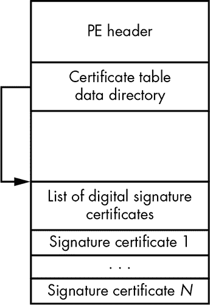

*图 17-1：UEFI 映像中数字签名的位置*

其他类型的 UEFI 可执行镜像，如 *简洁可执行文件（TE）* 镜像，由于其可执行格式的特点，未嵌入数字签名。TE 镜像格式源自 PE/COFF 格式，旨在减少 TE 的大小，使其占用更少的空间。因此，TE 镜像仅包含 PE 格式中执行镜像所需的字段，这意味着它们不包含诸如证书表数据目录之类的字段。因此，UEFI 固件无法通过验证数字签名直接对这些镜像进行认证。然而，安全启动提供了通过加密散列来认证这些镜像的功能，下一节将详细描述这一机制。

嵌入式签名证书的布局取决于其类型。我们在此不深入讨论布局的具体细节，但你可以在第 73 页的“驱动程序签名的位置”中了解更多。

每种用于安全启动的签名证书至少包含以下内容：用于签名生成和验证的加密算法信息（例如，密码散列函数和数字签名算法标识符）、目标可执行文件的加密散列、实际的数字签名，以及用于验证数字签名的公钥。

这些信息足以让安全启动验证可执行镜像的真实性。为此，UEFI 固件会定位并读取可执行文件中的签名证书，按照指定的算法计算可执行文件的散列值，然后将该散列值与签名证书中提供的散列值进行比较。如果匹配，UEFI 固件将使用签名证书中提供的密钥验证该散列的数字签名。如果签名验证成功，则 UEFI 固件接受该签名。在任何其他情况下（如散列不匹配或签名验证失败），UEFI 固件将无法认证该镜像。

然而，仅仅验证签名是否匹配不足以建立对 UEFI 可执行文件的信任。UEFI 固件还必须确保该可执行文件是用授权密钥签名的。否则，任何人都可以生成自定义签名密钥，并使用该密钥签署恶意镜像以通过安全启动验证。

这就是为什么用于签名验证的公钥应该与受信任的私钥匹配的原因。UEFI 固件显式信任这些私钥，因此它们可以用于建立对镜像的信任。受信任公钥的列表存储在`db`数据库中，接下来我们将进行探索。

#### ***db 数据库***

`db`数据库保存了一个受信任的公钥证书列表，这些证书被授权用来验证签名。每当安全启动执行可执行文件的签名验证时，它会将签名的公钥与`db`数据库中的密钥列表进行比对，以判断是否可以信任该密钥。只有使用与这些证书对应的私钥签名的代码，才能在启动过程中在平台上执行。

除了受信任的公钥证书列表外，`db`数据库还包含允许在平台上执行的单个可执行文件的哈希值，无论这些文件是否有数字签名。这个机制可以用来验证没有嵌入数字签名的 TE 文件。

根据 UEFI 规范，签名数据库存储在一个非易失性 RAM（NVRAM）变量中，该变量在系统重启后依然保留。NVRAM 变量的实现方式是平台特定的，不同的原始设备制造商（OEM）可能会以不同的方式实现它。最常见的是，这些变量存储在与平台固件（如 BIOS）相同的 SPI 闪存中。正如你将在《修改 UEFI 变量以绕过安全检查》中看到的，在第 337 页，这会导致一些漏洞，你可以利用这些漏洞绕过安全启动。

让我们通过转储保存数据库的 NVRAM 变量的内容，来查看你自己系统上`db`数据库的内容。我们将以联想 Thinkpad T540p 平台为例，但你应该使用你所工作的平台。我们将使用 Chipsec 开源工具集来转储 NVRAM 变量的内容，这个工具集你在第十五章中已经接触过。这个工具集具有丰富的功能，适用于取证分析，我们将在第十九章中更详细地讨论它。

从 GitHub 下载 Chipsec 工具，地址是*[`github.com/chipsec/chipsec/`](https://github.com/chipsec/chipsec/)*。该工具依赖于`winpy`（Windows 平台的 Python 扩展），你需要先下载并安装`winpy`，然后才能运行 Chipsec。安装完毕后，打开命令提示符或其他命令行解释器，进入存放下载的 Chipsec 工具的目录。然后输入以下命令，获取你的 UEFI 变量列表：

```
$ chipsec_util.py uefi var-list
```

该命令将从当前目录转储所有 UEFI 变量到子目录*efi_variables.dir*中，并解码其中的一些内容（Chipsec 只解码已知变量的内容）。进入该目录，你应该会看到类似图 17-2 的内容。

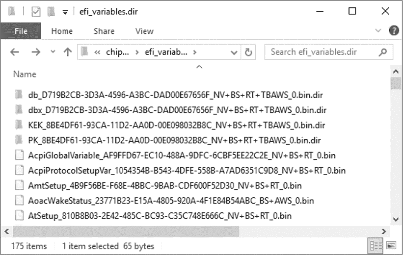

*图 17-2：Chipsec 转储的 UEFI 变量*

该目录中的每个条目对应一个单独的 UEFI NVRAM 变量。这些变量名的结构为 VarName`_`VarGUID`_`VarAttributes`.bin，其中 VarName 是变量的名称，VarGUID 是变量的 16 字节全局唯一标识符（GUID），VarAttributes 是该变量属性的简短列表。根据 UEFI 规范，以下是 图 17-2 中条目的部分属性。

NV 非易失性，意味着变量的内容在重启后仍然存在。

BS 可以通过 UEFI 启动服务访问。UEFI 启动服务通常在启动时可用，即操作系统加载器执行之前。一旦操作系统加载器启动，UEFI 启动服务将不再可用。

RT 可以通过 UEFI 运行时服务访问。与 UEFI 启动服务不同，运行时服务在操作系统加载和运行期间持续有效。

AWS 基于计数的认证变量，意味着任何新的变量内容需要用授权密钥进行签名，以便该变量能够被写入。该变量的签名数据包括一个计数器，用于防止回滚攻击。

TBAWS 基于时间的认证变量，意味着任何新的变量内容需要用授权密钥进行签名，以便该变量能够被写入。签名中的时间戳反映了数据签名的时间。它用于确认签名是在相应的签名密钥过期之前创建的。我们将在下一节提供有关基于时间认证的更多信息。

如果配置了安全启动并且平台上存在 `db` 变量，你应该在该目录中找到一个以 *db_D719B2CB-3D3A-4596-A3BC-DAD00E67656F* 开头的子文件夹。当 Chipsec 转储 `db` UEFI 变量时，它会自动将变量的内容解码到该子文件夹中，该子文件夹包含与公钥证书和授权执行的 UEFI 镜像的哈希值对应的文件。在我们的例子中，我们有五个文件——四个证书和一个 SHA256 哈希，如 图 17-3 所示。

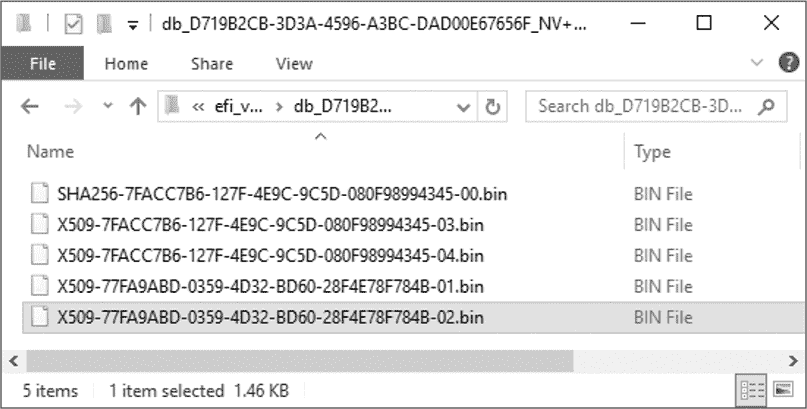

*图 17-3：签名数据库 UEFI 变量的内容*

这些证书采用 X.509 编码，X.509 是一种定义公钥证书格式的加密标准。我们可以解码这些证书，获取有关发行者的信息，这将告诉我们谁的签名能够通过安全启动验证。为此，我们将使用 `openssl` 工具包，工具包的描述见框中“OpenSSL 工具包”。从 *[`github.com/openssl/openssl/`](https://github.com/openssl/openssl/)* 安装该工具包，然后使用以下命令运行它，替换 `certificate_file_path` 为包含 `openssl` 的目录路径：

```
$ openssl x509 -in certificate_file_path
```

在 Windows 操作系统上，只需将 X.509 证书文件的扩展名从*bin*更改为*crt*，然后使用资源管理器打开该文件，即可查看解码结果。表 17-1 展示了我们的结果，其中列出了证书的颁发者和主题。

**表 17-1：** 从 UEFI 变量中解码的证书和哈希值

| **文件名** | **颁发给** | **颁发者** |
| --- | --- | --- |
| *X509-7FACC7B6-127F-4E9C-9C5D-080F98994345-03.bin* | Thinkpad 产品 CA 2012 | 联想有限公司根证书 CA 2012 |
| *X509-7FACC7B6-127F-4E9C-9C5D-080F98994345-04.bin* | 联想 UEFI CA 2014 | 联想 UEFI CA 2014 |
| *X509-77FA9ABD-0359-4D32-BD60-28F4E78F784B-01.bin* | 微软公司 UEFI CA 2011 | 微软公司第三方市场根证书 |
| *X509-77FA9ABD-0359-4D32-BD60-28F4E78F784B-02.bin* | 微软 Windows 生产 PCA 2011 | 微软根证书颁发机构 2010 |

从表中可以看到，只有由联想和微软签名的 UEFI 镜像才能通过 UEFI 安全启动的代码完整性检查。

**OPENSSL 工具包**

OpenSSL 是一个开源软件库，实现了安全套接字层（SSL）和传输层安全性（TLS）协议，以及通用的加密原语。OpenSSL 在 Apache 风格的许可证下发布，广泛应用于商业和非商业应用程序。该库提供了丰富的功能，供用户操作 X.509 证书，无论是解析现有证书还是生成新证书。你可以在*[`www.openssl.org/`](https://www.openssl.org/)*找到有关该项目的信息。

#### ***dbx 数据库***

与`db`数据库不同，`dbx`数据库包含公钥证书和 UEFI 可执行文件的哈希值，这些文件在启动时被*禁止*执行。这个数据库也被称为*撤销签名数据库*，它明确列出了将无法通过安全启动验证的镜像，防止已知漏洞的模块执行，从而保护整个平台的安全。

我们将以与`db`签名数据库相同的方式探讨`dbx`数据库的内容。当你运行 Chipsec 工具时，会生成一些文件夹，在这些文件夹中，你会找到名为*efi_variables.dir*的文件夹，该文件夹下应该包含一个以*dbx_D719B2CB-3D3A-4596-A3BC-DAD00E67656f*开头的子文件夹。这个文件夹包含被禁止的 UEFI 镜像的证书和哈希值。在我们的案例中，文件夹仅包含 78 个哈希值，而没有证书，如图 17-4 所示。

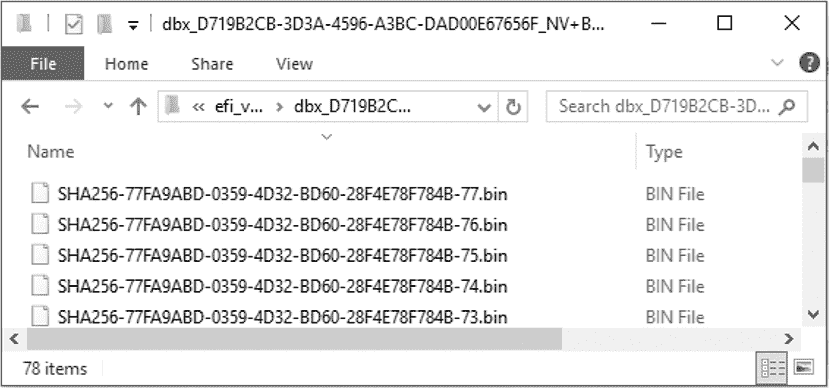

*图 17-4：`dbx`数据库（撤销签名数据库）UEFI 变量的内容*

图 17-5 展示了使用`db`和`dbx`数据库的镜像签名验证算法。

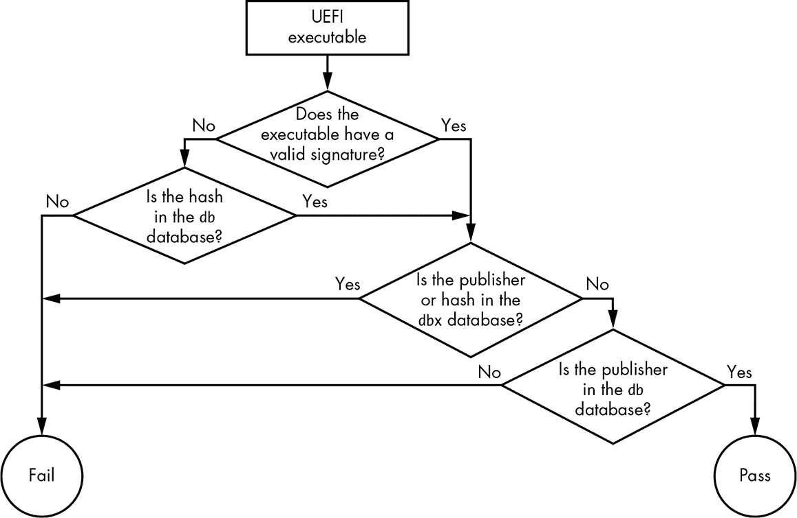

*图 17-5：UEFI 安全启动镜像验证算法*

从这张图中，你可以看到，只有当 UEFI 可执行文件的哈希或签名证书在`db`数据库中被信任且未列在`dbx`数据库中时，它才会通过认证。否则，该映像将无法通过 Secure Boot 的完整性检查。

#### ***基于时间的认证***

除了`db`和`dbx`数据库，Secure Boot 还使用另外两个数据库，分别叫做`dbt`和`dbr`。第一个，`dbr`，包含用于验证操作系统恢复加载程序签名的公钥证书，我们不再深入讨论。

第二个，`dbt`，包含用于验证 UEFI 可执行文件数字签名时间戳的时间戳证书，从而实现 Secure Boot 中的基于时间的认证（TBAWS）。(你在本章早些时候查看 UEFI 变量的属性时，已经见过 TBAWS。)

UEFI 可执行文件的数字签名有时包含由*时间戳认证机构（TSA）*服务颁发的时间戳。该签名的时间戳反映了签名生成的时间。通过比较签名时间戳与签名密钥的过期时间戳，Secure Boot 可以确定签名是生成在签名密钥过期之前还是之后。通常，签名密钥的过期日期是指签名密钥被认为已被泄露的日期。因此，签名的时间戳使得 Secure Boot 能够验证签名是在签名密钥未被泄露的时刻生成的，从而确保签名的合法性。通过这种方式，基于时间的认证减少了 PKI 在 Secure Boot `db` 证书中的复杂性。

基于时间的认证还允许你避免重新签名相同的 UEFI 映像。签名的时间戳向 Secure Boot 证明，某个 UEFI 映像是在相应签名密钥过期或被撤销之前签署的。因此，即使签名密钥过期，签名仍然有效，因为它是在签名密钥仍然有效且未被泄露时创建的。

#### ***Secure Boot 密钥***

现在你已经了解了 Secure Boot 如何获取受信任和撤销的公钥证书信息，让我们来谈谈这些数据库是如何存储并防止未经授权的修改的。毕竟，通过修改`db`数据库，攻击者可以轻松绕过 Secure Boot 检查，注入恶意证书，并用与恶意证书对应的私钥签名的流氓引导程序替换操作系统引导加载程序。由于恶意证书已经存在于`db`签名数据库中，Secure Boot 将允许流氓引导程序运行。

因此，为了防止 `db` 和 `dbx` 数据库遭受未经授权的修改，平台或操作系统供应商必须对这些数据库进行签名。当 UEFI 固件读取这些数据库的内容时，它首先通过验证数字签名来认证它们，验证的过程使用了一个称为 *密钥交换密钥（KEK）* 的公钥。然后，它使用第二个密钥，称为 *平台密钥（PK）*，来认证每个 KEK。

##### **密钥交换密钥**

与 `db` 和 `dbx` 数据库一样，公钥 KEK 的列表也存储在 NVRAM UEFI 变量中。我们将使用之前执行的 `chipsec` 命令的结果来探索 `KEK` 变量的内容。打开包含结果的目录，你应该会看到一个名为 *KEK_8BE4DF61-93CA-11D2-AA0D-00E098032B8C* 的子文件夹，里面包含公钥 KEK 的证书（见 图 17-6）。这个 UEFI 变量也需要进行认证，正如你接下来会看到的那样。

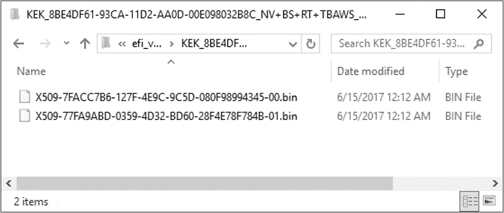

*图 17-6：`KEK` UEFI 变量的内容*

只有对应这些证书中任何一个的私钥所有者才能修改 `db` 和 `dbx` 数据库的内容。在这个例子中，我们只有两个 KEK 证书，分别来自 Microsoft 和 Lenovo，如 表 17-2 所示。

**表 17-2：KEK UEFI 变量中的证书**

| **文件名** | **发放给** | **由...发放** |
| --- | --- | --- |
| *X509-7FACC7B6-127F-4E9C-9C5D-080F98994345-00.bin* | 联想有限公司 KEK CA 2012 | 联想有限公司 KEK CA 2012 |
| *X509-77FA9ABD-0359-4D32-BD60-28F4E78F784B-01.bin* | 微软公司 KEK CA 2011 | 微软公司第三方市场根证书 |

你可以通过转储 `KEK` 变量并执行我们之前使用的 `openssl` 命令，来发现与你系统的 KEK 证书相对应的私钥所有者。

##### **平台密钥**

PK 是安全启动中 PKI 密钥层级的最后一个签名密钥。正如你可能已经猜到的，这个密钥用于通过签名 `KEK` UEFI 变量来认证 KEK。根据 UEFI 规范，每个平台都有一个唯一的 PK。通常，这个密钥对应于平台的制造商。

返回到你执行 `chipsec` 时创建的 *efi_variables.dir* 文件夹中的 *PK_8BE4DF61-93CA-11D2-AA0D-00E098032B8C* 子文件夹。在那里，你可以找到公钥 PK 的证书。你的证书将对应于你的平台。因此，既然我们使用了 Lenovo Thinkpad T540p 平台，我们可以预期我们的 PK 证书会对应于 Lenovo（见 图 17-7）。

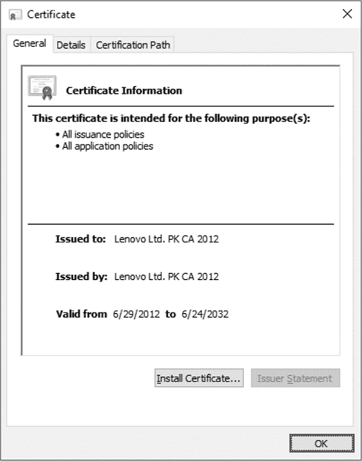

*图 17-7：PK 证书*

你可以看到，这个确实是由联想发布的。`PK` UEFI 变量也经过认证，并且每次更新该变量时都应使用相应的私钥进行签名。换句话说，如果平台所有者（或者在 UEFI 术语中是平台制造商）希望用新证书更新`PK`变量，则包含新证书的缓冲区应使用与当前存储在`PK`变量中的证书对应的私钥进行签名。

#### ***UEFI 安全启动：完整图景***

现在我们已经探索了 UEFI 安全启动中使用的 PKI 基础设施的完整层次结构，让我们把所有内容汇总起来，看看整个图景，见图 17-8。

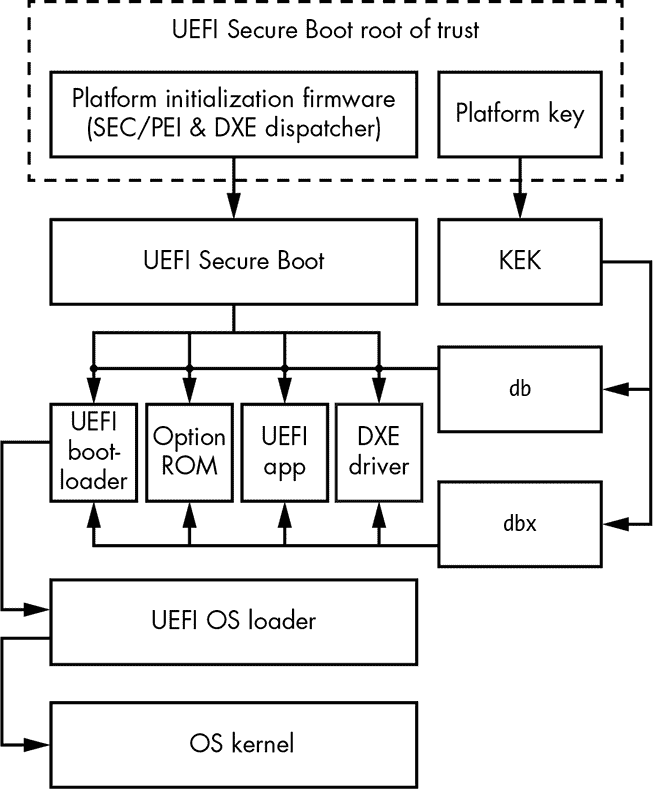

*图 17-8：UEFI 安全启动验证流程*

在图形的顶部，你可以看到信任根（UEFI 安全启动固有信任的组件，所有未来验证的基础）是平台初始化固件和平台密钥。平台初始化固件是在 CPU 复位后第一次执行的代码，UEFI 安全启动隐式信任这段代码。如果攻击者破坏了 PI 固件，安全启动强制的整个信任链就会被打破。在这种情况下，攻击者可以修改任何实现安全启动镜像验证程序的 UEFI 模块，使其始终返回成功，从而允许所有提供的 UEFI 镜像通过认证。

这就是为什么安全启动信任模型假设你已正确实现固件安全更新机制，该机制要求每次固件更新都必须使用正确的签名密钥进行签名（该密钥必须不同于平台密钥 PK）。这样，只有经过授权的 PI 固件更新才能进行，并且信任根保持不被破坏。

很容易看出，这种信任模型无法防范物理攻击者，物理攻击者可以通过恶意固件镜像重新编程 SPI 闪存，从而危及 PI 固件。我们将在《通过验证和度量启动保护安全启动》一章的第 338 页讨论如何保护固件免受物理攻击。

在图 17-8 的顶部，你可以看到由平台制造商提供的平台密钥与 PI 固件具有相同级别的固有信任。此密钥用于建立 PI 固件与平台制造商之间的信任。一旦提供了平台密钥，平台固件允许制造商更新 KEK 密钥，因此可以控制哪些镜像通过安全启动检查，哪些不通过。

在下一级，你可以看到用于建立平台上 PI 固件与操作系统之间信任的 KEK。一旦平台的 KEK 被写入 UEFI 变量中，操作系统就能够指定哪些镜像可以通过 Secure Boot 检查。例如，操作系统厂商可以使用 KEK 来允许 UEFI 固件执行操作系统加载程序。

在信任模型的底层，你可以看到使用 KEK 签名的 `db` 和 `dbx` 数据库，这些数据库包含镜像的哈希值和公钥证书，它们直接用于 Secure Boot 强制执行的可执行文件完整性检查。

#### ***Secure Boot 策略***

单独来看，Secure Boot 使用 `PK`、`KEK`、`db`、`dbx` 和 `dbt` 变量来告诉平台一个可执行镜像是否可信，如你所见。然而，Secure Boot 验证结果的解释方式（换句话说，是否执行镜像）在很大程度上取决于所实施的策略。

我们已经在本章中多次提到 Secure Boot 策略，但尚未深入探讨它究竟是什么。所以，让我们更详细地了解这个概念。

本质上，Secure Boot 策略决定了平台固件在执行镜像认证后应该采取的行动。固件可能会执行该镜像、拒绝镜像执行、推迟镜像执行，或要求用户做出决定。

Secure Boot 策略在 UEFI 规范中并没有严格定义，因此它是特定于每个实现的。特别是，不同厂商的 UEFI 固件实现之间的策略可能有所不同。在本节中，我们将探讨一些在英特尔 EDK2 源代码中实现的 Secure Boot 策略元素，这些源代码在 第十五章 中已经使用。如果你还没有下载或克隆 EDK2 源代码，请立即从 *[`github.com/tianocore/edk2/`](https://github.com/tianocore/edk2/)* 仓库中获取。

在 EDK2 中实现的 Secure Boot 考虑的因素之一是被认证的可执行镜像的来源。这些镜像可能来自不同的存储设备，其中一些设备可能本身就被信任。例如，如果镜像是从 SPI 闪存加载的，即它与其余的 UEFI 固件位于同一存储设备上，那么平台可能会自动信任它。（然而，如果攻击者能够修改 SPI 闪存上的镜像，他们也可能篡改其他固件并完全禁用 Secure Boot。我们将在 “修补 PI 固件以禁用 Secure Boot” 第 335 页 中讨论这一攻击。）另一方面，如果镜像是从外部 PCI 设备加载的——例如，Option ROM 或从外部外设设备加载的特殊固件——则它会被视为不可信，并需经过 Secure Boot 检查。

在此，我们概述了一些决定如何处理与其来源相关的图像的策略定义。你可以在 EDK2 代码库中的*SecurityPkg\SecurityPkg.dec*文件中找到这些策略。每个策略都会为符合条件的图像分配一个默认值。

PcdOptionRomImageVerificationPolicy 定义了作为选项 ROM 加载的图像的验证策略，例如来自 PCI 设备的图像（默认值：0x00000004）。

PcdRemovableMediaImageVerificationPolicy 定义了位于可移动介质上的图像的验证策略，包括 CD-ROM、USB 和网络（默认值：0x00000004）。

PcdFixedMediaImageVerificationPolicy 定义了位于固定介质设备（如硬盘）上的图像的验证策略（默认值：0x00000004）。

除了这些策略外，还有两种策略并未在*SecurityPkg\SecurityPkg.dec*文件中明确定义，但在 EDK2 Secure Boot 实现中使用：

**SPI 闪存 ROM 策略** 定义了位于 SPI 闪存上的图像的验证策略（默认值：0x00000000）。

**其他来源** 定义了对于位于除前述设备外的任何设备上的图像的验证策略（默认值：0x00000004）。

**注意**

*请记住，这并不是用于图像认证的 Secure Boot 策略的完整列表。不同的固件厂商可以修改或扩展此列表，加入他们的自定义策略。*

以下是默认策略值的描述：

**0x00000000** 始终信任该图像，无论其是否已签名，也无论其哈希是否在`db`或`dbx`数据库中。

**0x00000001** 永远不信任该图像。即使图像有有效签名，也会被拒绝。

**0x00000002** 允许在存在安全违规时执行。当签名无法验证或其哈希在`dbx`数据库中被列入黑名单时，仍然会执行该图像。

**0x00000003** 在存在安全违规时推迟执行。在这种情况下，图像不会立即被拒绝，而是被加载到内存中。然而，直到重新评估其认证状态后，其执行才会被推迟。

**0x00000004** 在 Secure Boot 无法使用`db`和`dbx`数据库验证图像时拒绝执行。

**0x00000005** 在存在安全违规时询问用户。在这种情况下，如果 Secure Boot 无法验证图像，授权用户可以决定是否信任该图像。例如，用户在启动时可能会看到一个提示消息。

从 Secure Boot 策略定义中，你可以看到，从 SPI 闪存加载的所有图像天生是可信的，根本不需要进行数字签名验证。在所有其他情况下，默认值 0x000000004 强制执行签名验证，并禁止执行任何未经认证的代码，无论该代码是作为选项 ROM 加载的，还是位于可移动、固定或任何其他介质上。

#### ***使用 Secure Boot 防止 Bootkit***

既然你已经了解了安全启动（Secure Boot）的工作原理，我们来看看一个具体的例子，了解它如何保护操作系统启动流程免受启动病毒（bootkit）的攻击。我们不会讨论针对 MBR 和 VBR 的启动病毒，因为正如第十四章所解释的那样，UEFI 固件不再使用像 MBR 和 VBR 这样的对象（除非在 UEFI 兼容模式下），因此传统的启动病毒无法危害基于 UEFI 的系统。

如第十五章所提到的，DreamBoot 启动病毒是第一个公开的、针对 UEFI 系统的启动病毒概念验证。对于没有启用安全启动的 UEFI 系统，该启动病毒的工作方式如下：

1.  启动病毒的作者将原始的 UEFI Windows 启动加载器 *bootmgfw.efi* 替换为恶意启动加载器 *bootx64.efi*，并将其放置在启动分区中。

1.  恶意启动加载器会加载原始的 *bootmgfw.efi*，并对其进行修补以控制 Windows 加载程序 *winload.efi*，然后执行它，正如在图 17-9 中所展示的那样。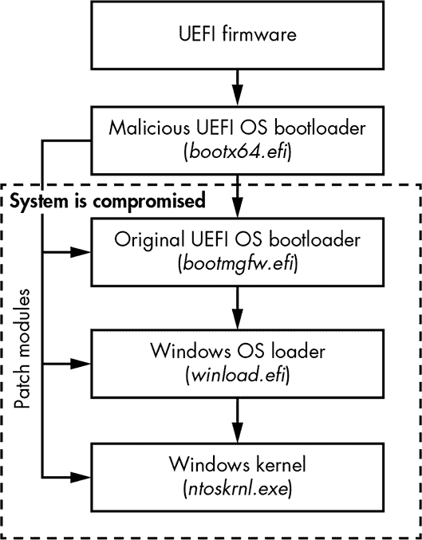

    *图 17-9：DreamBoot 攻击操作系统启动加载器的流程*

1.  恶意代码会继续修补系统模块，直到它达到操作系统的内核，绕过了旨在防止未授权内核模式代码执行的内核保护机制（例如内核模式代码签名策略）。

这种攻击之所以可能发生，是因为默认情况下，操作系统启动加载器在 UEFI 启动过程中没有经过身份验证。UEFI 固件通过 UEFI 变量获取操作系统启动加载器的位置，对于 Microsoft Windows 平台来说，它位于启动分区的 *\EFI\Microsoft\Boot\bootmgfw.efi*。具有系统权限的攻击者可以轻松地替换或篡改启动加载器。

然而，当启用安全启动时，这种攻击就不再可能。由于安全启动会验证启动时执行的 UEFI 镜像的完整性，而操作系统启动加载器是启动时验证的可执行文件之一，安全启动将会检查启动加载器的签名是否符合 `db` 和 `dbx` 数据库中的记录。恶意启动加载器没有使用正确的签名密钥，因此它可能会在检查时失败并无法执行（这取决于启动策略）。这是安全启动防止启动病毒的一种方式。

### **攻击安全启动**

现在我们来看一些能够成功攻击 UEFI 安全启动的攻击方式。由于安全启动依赖 PI 固件和 PK 作为信任的根源，如果其中任何一个组件被破坏，整个安全启动检查链就会失效。我们将研究一些能够破坏安全启动的启动病毒和根病毒（rootkit）。

我们在这里讨论的启动病毒主要依赖于对 SPI 闪存内容的修改。在现代计算机系统中，SPI 闪存通常用作主要固件存储几乎每台笔记本电脑和台式计算机都会将 UEFI 固件存储在通过 SPI 控制器访问的闪存中。

在第十五章，我们介绍了各种将持久性 UEFI rootkit 安装到闪存固件中的攻击，因此在这里我们不再详细讨论这些内容，尽管相同的攻击（SMI 处理程序问题、S3 启动脚本、BIOS 写保护等）可能会被用于攻击安全启动。本节中的攻击假设攻击者已经能够修改包含 UEFI 固件的闪存内容。接下来我们来看看他们可以做些什么！

#### ***修补 PI 固件以禁用安全启动***

一旦攻击者能够修改 SPI 闪存的内容，他们可以通过修补 PI 固件轻松禁用安全启动。你在图 17-8 中看到，UEFI 安全启动是基于 PI 固件的，因此如果我们修改实现安全启动的 PI 固件模块，就能有效地禁用其功能。

为了探索这个过程，我们将再次使用 Intel 的 EDK2 源代码（*[`github.com/tianocore/edk2/`](https://github.com/tianocore/edk2/)）作为 UEFI 实现的示例。你将了解安全启动验证功能的实现位置，以及如何可能会破坏它。

在仓库中的*SecurityPkg/Library/DxeImageVerificationLib*文件夹内，你会找到实现代码完整性验证功能的*DxeImageVerificationLib.c*源代码文件。具体来说，这个文件实现了`DxeImageVerificationHandler`例程，用于决定一个 UEFI 可执行文件是否被信任并应该被执行，或者它是否未通过验证。列表 17-1 展示了该例程的原型。

```
EFI_STATUS EFI_API DxeImageVerificationHandler (

  IN  UINT32                           AuthenticationStatus, ➊

  IN  CONST EFI_DEVICE_PATH_PROTOCOL   *File, ➋

  IN  VOID                             *FileBuffer, ➌

  IN  UINTN                            FileSize, ➍

  IN  BOOLEAN                          BootPolicy ➎

);
```

*列表 17-1：`DxeImageVerificationHandler`例程的定义*

作为第一个参数，例程接收`AuthenticationStatus`变量 ➊，它指示镜像是否已签名。`File`参数 ➋是指向正在分派的文件的设备路径的指针。`FileBuffer` ➌ 和 `FileSize` ➍ 参数提供指向 UEFI 镜像及其大小的指针，以便进行验证。

最后，`BootPolicy` ➎是一个参数，指示请求加载正在认证的镜像是否来自 UEFI 引导管理器，并且是一个启动选择（意味着该镜像是选定的操作系统引导加载程序）。我们在第十四章中更详细地讨论了 UEFI 引导管理器。

在验证完成后，该例程返回以下值之一：

EFI_SUCCESS 认证成功，镜像将被执行。

EFI_ACCESS_DENIED 该镜像未通过认证，因为平台策略已规定固件不能使用该镜像文件。如果固件尝试从可移动介质加载镜像，而平台策略禁止在启动时从可移动介质执行，无论这些镜像是否已签名，都可能会发生这种情况。在这种情况下，该例程将立即返回`EFI_ACCESS_DENIED`，而不会进行任何签名验证。

EFI_SECURITY_VIOLATION 认证失败，原因是 Secure Boot 无法验证映像的数字签名，或者可执行文件的哈希值被发现存在于禁止映像的数据库（`dbx`）中。这个返回值表明映像不被信任，平台应遵循 Secure Boot 策略来决定是否允许执行该映像。

EFI_OUT_RESOURCE 在验证过程中发生错误，原因是系统资源不足（通常是内存不足），无法执行映像认证。

为了绕过 Secure Boot 检查，具有 SPI 闪存写入权限的攻击者可以修改这个例程，使其始终返回 `EFI_SUCCESS` 值，不论输入的可执行文件是否有效。结果，所有 UEFI 映像都会通过认证，无论它们是否已签名。

#### ***修改 UEFI 变量以绕过安全检查***

攻击 Secure Boot 实现的另一种方式是修改 UEFI NVRAM 变量。如本章前面所述，Secure Boot 使用某些变量来存储其配置参数，诸如 Secure Boot 是否启用、PK 和 KEK、签名数据库以及平台策略等详细信息。如果攻击者能够修改这些变量，他们可以禁用或绕过 Secure Boot 验证检查。

确实，大多数 Secure Boot 实现会将 UEFI NVRAM 变量存储在 SPI 闪存中，与系统固件一起使用。尽管这些变量是经过认证的，并且通过使用 UEFI API 从内核模式更改它们的值需要相应的私钥，但具有写入 SPI 闪存权限的攻击者仍然可以更改其内容。

一旦攻击者访问了 UEFI NVRAM 变量，他们可以例如篡改 `PK`、`KEK`、`db` 和 `dbx`，添加自定义的恶意证书，从而允许恶意模块绕过安全检查。另一种方式是将恶意文件的哈希值添加到 `db` 数据库，并将其从 `dbx` 数据库中移除（如果该哈希值最初在 `dbx` 数据库中）。如图 17-10 所示，通过更改 `PK` 变量以包含攻击者的公钥证书，攻击者能够在 `KEK` UEFI 变量中添加和删除 KEK，从而控制 `db` 和 `dbx` 签名数据库，突破 Secure Boot 保护。

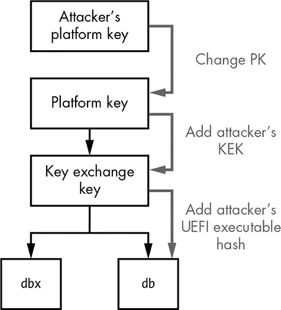

*图 17-10：针对 UEFI Secure Boot 信任链的攻击*

作为第三种选择，攻击者可以直接破坏 UEFI 变量中的 PK，而不必更改 PK 或妥协底层的 PKI 层级。为了正常工作，Secure Boot 需要一个有效的 PK 被注册到平台固件中；否则，保护机制将被禁用。

如果你对这些攻击感兴趣，以下会议论文对 UEFI Secure Boot 技术进行了全面分析：

+   Corey Kallenberg 等人，"Setup for Failure: Defeating Secure Boot"，LegbaCore，* [`papers.put.as/papers/firmware/2014/SetupForFailure-syscan-v4.pdf`](https://papers.put.as/papers/firmware/2014/SetupForFailure-syscan-v4.pdf)*。

+   Yuriy Bulygin 等人，"Summary of Attacks Against BIOS and Secure Boot"，英特尔安全，* [`www.c7zero.info/stuff/DEFCON22-BIOSAttacks.pdf`](http://www.c7zero.info/stuff/DEFCON22-BIOSAttacks.pdf)*。

### **通过验证启动和度量启动保护安全启动**

正如我们刚才讨论的，单靠安全启动无法防范涉及平台固件变化的攻击。那么，是否有任何保护措施来保护安全启动技术本身呢？答案是肯定的。在本节中，我们将重点介绍旨在保护系统固件免受未经授权修改的安全技术——即验证启动和度量启动。*验证启动*检查平台固件是否未被篡改或修改，而*度量启动*计算启动过程中涉及的某些组件的加密哈希，并将其存储在受信任平台模块平台配置寄存器（TPM PCR）中。

验证启动和度量启动是独立运作的，因此有可能只启用其中一个，或同时启用两者。然而，验证启动和度量启动都属于同一信任链的一部分（如图 17-11 所示）。

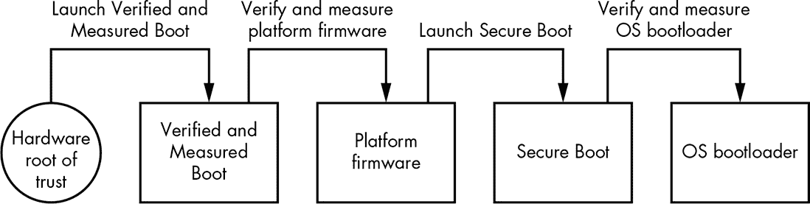

*图 17-11：验证启动和度量启动流程*

如图 17-8 所示，PI 固件是在 CPU 复位后执行的第一段代码。UEFI 安全启动无条件信任 PI 固件，因此当前对安全启动的攻击依赖于对其的未经授权的修改，这一点是可以理解的。

为了防范此类攻击，系统需要一个位于 PI 固件*之外*的信任根。这就是验证启动（Verified Boot）和度量启动（Measured Boot）发挥作用的地方。这些过程执行的保护机制，其信任根被锚定在硬件中。而且，它们在系统固件之前执行，这意味着它们既能认证*又能*度量系统固件。稍后我们将讨论在这个背景下“度量”意味着什么。

#### ***验证启动***

当启用验证启动的系统通电时，硬件逻辑会启动实现于启动 ROM 或 CPU 内的微代码中的启动验证功能。这个逻辑是*不可变的*，这意味着软件无法更改它。通常，验证启动会执行一个模块来验证系统的完整性，确保系统将执行未经恶意修改的真实固件。为了验证固件，验证启动依赖于公钥加密技术；与 UEFI 安全启动类似，它会检查平台固件的数字签名，以确保其真实性。成功认证后，平台固件被执行并继续验证其他固件组件（例如，选项 ROM、DXE 驱动程序和操作系统引导加载程序）以保持正确的信任链。这就是“验证启动”中“验证”部分的内容。现在我们来看看“度量启动”部分。

#### ***度量启动***

度量启动通过测量平台固件和操作系统引导加载程序来工作。这意味着它会计算启动过程相关组件的加密哈希值。这些哈希值存储在一组 TPM PCR 中。哈希值本身并不能告诉你所测量的组件是良性的还是恶意的，但它们确实告诉你配置和启动组件是否在某个时刻发生过更改。如果某个启动组件被修改，其哈希值将与对原始版本组件计算出的哈希值不同。因此，度量启动将注意到任何启动组件的修改。

后续，系统软件可以使用这些 TPM PCR 中的哈希值来确保系统处于一个已知的良好状态，没有任何恶意修改。系统还可以使用这些哈希值进行*远程证明*，即当一个系统试图向另一个系统证明它处于一个受信状态时。

现在你已经了解了验证启动和度量启动的一般工作原理，接下来我们来看看它的几种实现方式，首先是英特尔 BootGuard。

### **英特尔 BootGuard**

英特尔 BootGuard 是英特尔的验证启动和度量启动技术。图 17-12 显示了启用英特尔 BootGuard 的平台上的启动流程。

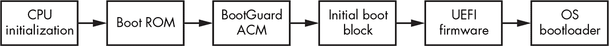

*图 17-12：英特尔 BootGuard 流程*

在初始化期间，在 CPU 开始执行位于复位向量的第一段代码之前，它会执行启动 ROM 中的代码。这段代码执行必要的 CPU 状态初始化，然后加载并执行 BootGuard *认证代码模块 (ACM)*。

ACM 是一种用于执行安全敏感操作的特殊模块，必须由英特尔签名。因此，加载 ACM 的启动 ROM 代码会执行强制签名验证，除非 ACM 由英特尔签名，否则模块无法运行。成功通过签名验证后，ACM 会在隔离的环境中执行，以防止任何恶意软件干扰其执行。

BootGuard ACM 实现了验证和测量启动功能。此模块将第一阶段固件加载器，即初始启动块（IBB），加载到内存中，并根据当前的启动策略对其进行验证和/或测量。IBB 是固件的一部分，包含在重置向量处执行的代码。

严格来说，在启动过程中，此时还没有 RAM。内存控制器尚未初始化，RAM 也不可访问。然而，CPU 会配置其最后一级缓存，使其可以被用作 RAM，通过将其设置为 Cache-as-RAM 模式，直到启动过程中的某个时刻，BIOS 内存引用代码可以配置内存控制器并发现 RAM。

一旦 IBB 成功验证和/或测量完毕，ACM 会将控制权转交给 IBB。如果 IBB 验证失败，ACM 会根据当前的启动策略进行处理：系统可能会立即关闭，或者在某个超时后允许固件恢复。

然后，IBB 从 SPI 闪存加载其余的 UEFI 固件，并对其进行验证和/或测量。一旦 IBB 获得控制，Intel BootGuard 就不再负责维持正确的信任链，因为它的目的仅仅是验证和测量 IBB。IBB 负责继续信任链，直到 UEFI 安全启动接管固件镜像的验证和测量。

#### ***寻找 ACM***

让我们从 ACM 开始，了解 Intel BootGuard 技术在桌面平台上的实现细节。由于 ACM 是系统开机时执行的第一个 Intel BootGuard 组件之一，第一个问题是：CPU 在开机时如何找到 ACM？

ACM 的确切位置存储在一种特殊的数据结构中，称为 *固件接口表（FIT）*，它存储在固件镜像中。FIT 被组织为 FIT 条目的数组，每个条目描述固件中特定对象的位置，如 ACM 或微代码更新文件。图 17-13 显示了重置后 FIT 在系统内存中的布局。

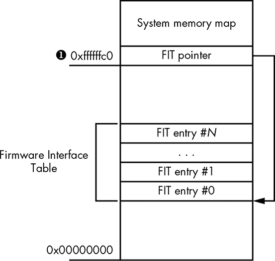

*图 17-13：FIT 在内存中的位置*

当 CPU 开机时，它会从内存地址 0xFFFFFFC0 ➊ 读取 FIT 的地址。由于此时还没有 RAM，当 CPU 对物理地址 0xFFFFFFC0 发出读取内存事务时，内部芯片组逻辑会识别该地址属于特殊地址范围，因此不会将该事务发送给内存控制器，而是解码它。对 FIT 表的读取内存事务将被转发到 SPI 闪存控制器，由其从闪存中读取 FIT。

我们将通过返回到 EDK2 仓库来更详细地了解这个过程。在*IntelSiliconPkg/Include/IndustryStandard/*目录中，您将找到*FirmwareInterfaceTable.h*头文件，其中包含与 FIT 结构相关的一些代码定义。FIT 条目的布局请参见 Listing 17-2。

```
typedef struct {

  UINT64 Address; ➊

  UINT8  Size[3]; ➋

  UINT8  Reserved;

  UINT16 Version; ➌

  UINT8  Type : 7; ➍

  UINT8  C_V  : 1; ➎

  UINT8  Chksum; ➏

} FIRMWARE_INTERFACE_TABLE_ENTRY;
```

*Listing 17-2：FIT 条目的布局*

如前所述，每个 FIT 条目描述了固件镜像中的某个对象。每个对象的性质由 FIT 的`Type`字段编码。这些对象可能是微代码更新文件、BootGuard 的 ACM，或者 BootGuard 策略等。例如，`Address`字段➊和`Size`字段➋提供了该对象在内存中的位置：`Address`包含该对象的物理地址，而`Size`定义了以`dword`（4 字节值）为单位的大小。`C_V`字段➎是校验和有效字段；如果该字段为`1`，则`Chksum`字段➏包含该对象的有效校验和。组件中所有字节的和对 0xFF 取模后的结果与`Chksum`字段中的值必须为零。`Version`字段➌包含组件的版本号，采用二进制编码的十进制格式。对于 FIT 头条目，该字段的值将指示 FIT 数据结构的修订号。

头文件*FirmwareInterfaceTable.h*包含了`Type`字段➍可能取的值。这些类型值大多没有文档说明，信息较少，但 FIT 条目类型的定义相当详细，您可以从上下文中推断它们的含义。以下是与 BootGuard 相关的类型：

+   `FIT_TYPE_00_HEADER`条目在其`Size`字段中提供 FIT 表中条目的总数。其地址字段包含一个特殊的 8 字节签名，`'_FIT_'`（`_FIT_`后有三个空格）。

+   类型为`FIT_TYPE_02_STARTUP_ACM`的条目提供了 BootGuard ACM 的位置，启动 ROM 代码解析该位置以在系统内存中找到 ACM。

+   `FIT_TYPE_0C_BOOT_POLICY_MANIFEST`（BootGuard 启动策略清单）和`FIT_TYPE_0B_KEY_MANIFEST`（BootGuard 密钥清单）类型的条目提供了当前生效的 BootGuard 启动策略和配置信息，我们将在稍后的“配置 Intel BootGuard”中讨论这些内容，见第 343 页。

请记住，Intel BootGuard 启动策略和 UEFI Secure Boot 策略是两个不同的概念。第一个术语指的是用于验证和度量启动过程的启动策略。也就是说，Intel BootGuard 启动策略由 ACM 和芯片组逻辑执行，其中包括是否应执行验证和度量启动以及当 BootGuard 无法验证 IBB 时应采取什么措施等参数。第二个术语指的是本章早些时候讨论的 UEFI Secure Boot，完全由 UEFI 固件执行。

#### ***探索 FIT***

你可以使用 UEFITool 浏览固件镜像中的一些 FIT 条目，我们在第十五章中介绍过它（并且我们将在第十九章中进一步讨论），并从镜像中提取 ACM、启动策略和密钥清单以进行进一步分析。这是有用的，因为 ACM 可以用来隐藏恶意代码。在下面的示例中，我们使用从启用了 Intel BootGuard 技术的系统中获取的固件镜像。（第十九章提供了如何从平台获取固件的信息。）

首先，在 UEFITool 中加载固件镜像，方法是选择**文件**▸**打开镜像文件**。在指定要加载的固件镜像文件后，你将看到一个像图 17-14 所示的窗口。

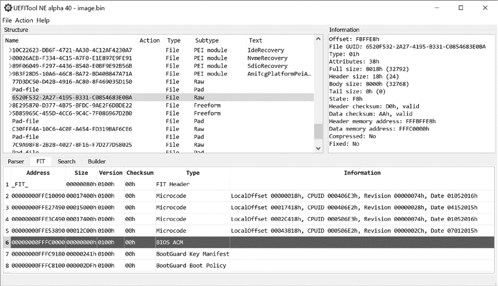

*图 17-14：在 UEFITool 中浏览 FIT*

在窗口的下半部分，你可以看到列出条目的 FIT 标签。FIT 标签的`Type`列显示 FIT 条目的类型。我们正在寻找 BIOS ACM、BootGuard 密钥清单和 BootGuard 启动策略类型的 FIT 条目。根据这些信息，我们可以在固件镜像中定位 Intel BootGuard 组件并提取它们进行进一步分析。在这个特定示例中，FIT 条目#6 指示 BIOS ACM 的位置；它从地址 0xfffc0000 开始。FIT 条目#7 和#8 分别指示密钥和启动策略清单的位置；它们分别从地址 0xfffc9180 和 0xfffc8100 开始。

#### ***配置 Intel BootGuard***

执行时，BootGuard BIOS ACM 会消耗 BootGuard 密钥，而启动策略则定位系统内存中的 IBB，以获取正确的公钥来验证 IBB 的签名。

BootGuard 密钥清单包含启动策略清单（BPM）的哈希、OEM 根公钥、前述字段的数字签名（根公钥除外，因为它不包含在签名数据中）以及安全版本号（一个随着每次安全更新递增的计数器，旨在防止回滚攻击）。

BPM 本身包含 IBB 的安全版本号、位置和哈希值；BPM 公钥；以及刚才列出的 BPM 字段的数字签名——除了根公钥，根公钥可以通过 BPM 公钥验证。IBB 的位置提供了 IBB 在内存中的布局。这可能不是一个连续的内存块；它可能由几个不相邻的内存区域组成。IBB 哈希包含 IBB 占用的所有内存区域的累计哈希值。因此，验证 IBB 签名的整个过程如下：

1.  BootGuard 使用 FIT 定位密钥清单（KM），获取启动策略清单的哈希值和 OEM 根密钥，我们称之为密钥 1。BootGuard 使用密钥 1 验证 KM 中的数字签名，以确保 BPM 哈希值的完整性。如果验证失败，BootGuard 会报告错误并触发修复操作。

1.  如果验证成功，BootGuard 将使用 FIT 定位 BPM，计算 BPM 的哈希值，并将其与 KM 中的 BPM 哈希值进行比较。如果值不相等，BootGuard 会报告错误并触发修复操作；否则，它将从 BPM 获取 IBB 的哈希值和位置。

1.  BootGuard 定位 IBB 在内存中的位置，计算其累积哈希值，并将其与 BPM 中的 IBB 哈希值进行比较。如果哈希值不相等，BootGuard 会报告错误并触发修复操作。

1.  否则，BootGuard 会报告验证成功。如果启用了度量启动，BootGuard 还会通过计算 IBB 的哈希值并将度量结果存储在 TPM 中来度量 IBB。然后，BootGuard 将控制权转交给 IBB。

KM 是一个关键结构，因为它包含用于验证 IBB 完整性的 OEM 根公钥。你可能会问：“如果 BootGuard 的 KM 和固件映像一起存储在未保护的 SPI 闪存中，那是不是意味着攻击者可以修改闪存中的内容，给 BootGuard 提供一个假的验证密钥？”为了防止此类攻击，OEM 根公钥的哈希值存储在芯片组的*现场可编程保险丝*中。这些保险丝只能在 BootGuard 启动策略配置时编程一次。保险丝一旦写入，就无法被覆盖。这就是 BootGuard 验证密钥如何被锚定在硬件中，使硬件成为不可变的信任根。（BootGuard 启动策略也存储在芯片组的保险丝中，因此在启动策略配置后无法更改该策略。）

如果攻击者更改了 BootGuard 密钥清单，ACM 将通过计算其哈希值并将其与“黄金”值进行比较来检测密钥的更改，这个“黄金”值被写入芯片组中。哈希不匹配会触发错误报告和修复行为。图 17-15 展示了 BootGuard 强制执行的信任链。

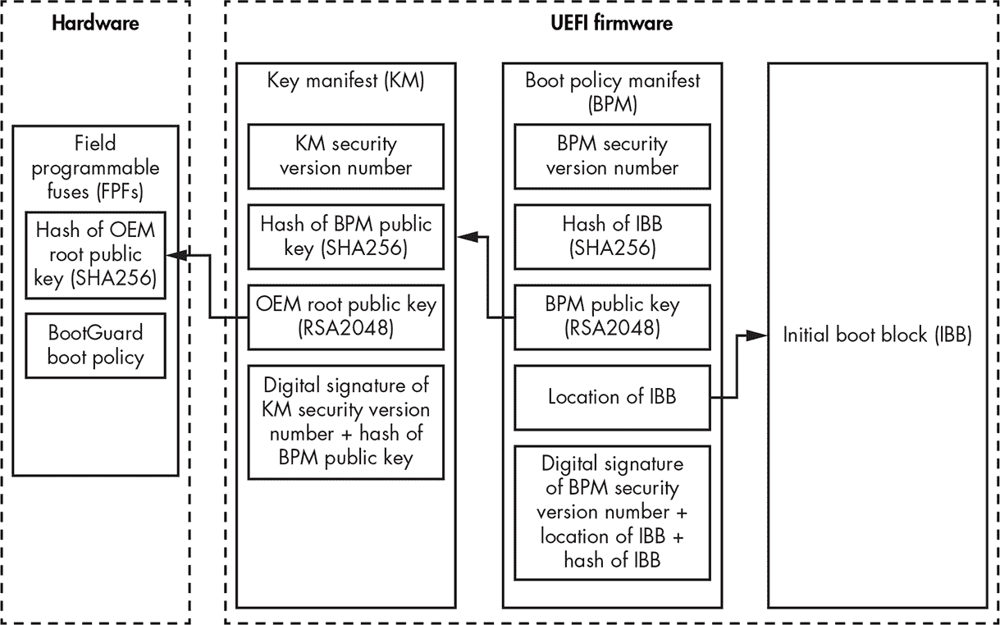

*图 17-15：英特尔 BootGuard 信任链*

一旦 IBB 成功验证，并在必要时进行测量，它将执行一些基本的芯片组初始化，然后加载 UEFI 固件。在此时，IBB 有责任在加载和执行固件之前对 UEFI 固件进行身份验证。否则，信任链将被打破。

图 17-16 通过展示安全启动实现的责任边界来总结本节内容。

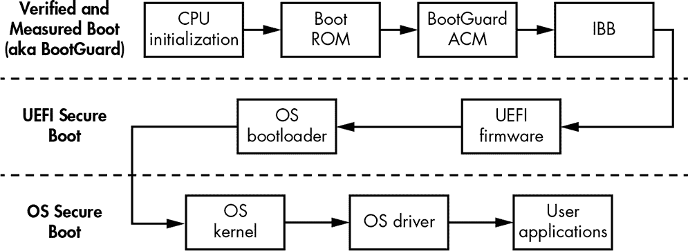

*图 17-16：安全启动实现的责任边界*

### **ARM 可信启动板**

ARM 有自己实现的验证和度量引导技术，称为*受信引导板（TBB）*，简称*受信引导*。在本节中，我们将探讨受信引导的设计。ARM 有一种非常特定的设置，称为*Trust Zone* 安全技术，将执行环境分为两个部分。在介绍 ARM 的验证和度量引导过程之前，我们需要描述 Trust Zone 的工作原理。

#### ***ARM Trust Zone***

Trust Zone 安全技术是一种硬件实现的安全特性，它将 ARM 执行环境分为两个*世界*：安全世界和普通（或非安全）世界，这两个世界共存于同一个物理核心中，如图 17-17 所示。处理器硬件和固件中实现的逻辑确保安全世界的资源与在非安全世界中运行的软件正确隔离并得到保护。

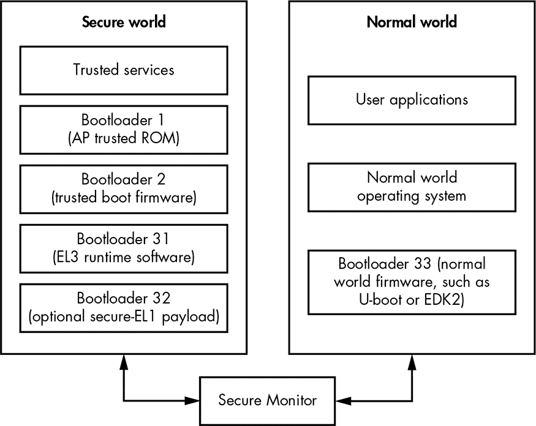

*图 17-17：ARM Trust Zone*

两个世界各自拥有独立的固件和软件栈：普通世界执行用户应用程序和操作系统，而安全世界执行安全操作系统和受信服务。这些世界的固件由不同的引导加载程序组成，负责初始化各自的世界并加载操作系统，我们稍后会谈到。因此，安全世界和普通世界具有不同的固件镜像。

在处理器内部，运行在普通世界中的软件无法直接访问安全世界中的代码和数据。防止这种访问的控制逻辑是由硬件实现的，通常位于芯片系统硬件中。然而，运行在普通世界中的软件可以通过特定的软件（如 ARM Cortex-A 中的 Secure Monitor 或 ARM Cortex-M 中的核心逻辑）将控制权转移到位于安全世界中的软件（例如，执行安全世界中的受信服务）。此机制确保世界之间的切换不会破坏系统的安全性。

Trusted Boot 技术和 Trust Zone 一起构成了受信执行环境，用于运行具有高级权限的软件，并为数字版权管理、加密和身份验证原语以及其他安全敏感应用提供安全环境。通过这种方式，一个孤立的、受保护的环境可以容纳最敏感的软件。

#### ***ARM 引导加载程序***

由于安全世界和普通世界是分开的，每个世界需要自己的引导加载程序。此外，每个世界的引导过程由多个阶段组成，这意味着必须在引导过程的不同阶段执行多个引导加载程序。在这里，我们将以一般术语描述 ARM 应用处理器的受信引导流程，并列出涉及受信引导的引导加载程序，这些在图 17-17 中已有展示：

**BL1** 第一阶段引导加载程序，位于启动 ROM 中并在安全世界执行。

**BL2** 第二阶段引导加载程序，位于闪存中，由 BL1 在安全世界加载并执行。

**BL31** 安全世界运行时固件，由 BL2 加载并执行。

**BL32** 可选的安全世界第三阶段引导加载程序，由 BL2 加载。

**BL33** 普通世界运行时固件，由 BL2 加载并执行。

这份清单并不是所有 ARM 实现的完整和准确列表，因为一些制造商引入了额外的引导加载程序或移除了一些现有的程序。在某些情况下，BL1 可能不是系统复位后应用处理器上执行的第一个代码。

为了验证这些引导组件的完整性，受信启动依赖于 X.509 公钥证书（请记住，UEFI 安全启动中的 `db` 数据库文件是使用 X.509 编码的）。值得一提的是，所有证书都是自签名的。无需证书颁发机构，因为信任链的建立并不是通过证书颁发者的有效性，而是通过证书扩展的内容。

受信启动使用两种类型的证书：*密钥*证书和*内容*证书。它首先使用密钥证书验证用于签名内容证书的公钥。然后，它使用内容证书存储引导加载程序映像的哈希值。这种关系如图 17-18 所示。

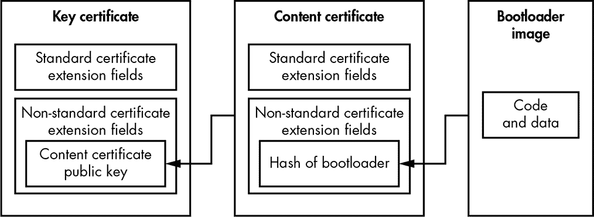

*图 17-18：受信启动密钥和内容证书*

受信启动通过计算映像的哈希值并将结果与从内容证书中提取的哈希值进行匹配来验证映像。

#### ***受信启动流程***

现在你已经熟悉了受信启动的基础概念，让我们看看应用处理器的受信启动流程，如图 17-19 所示。这将为你提供一个完整的视角，了解在 ARM 处理器中如何实现验证启动，并且它如何保护平台免受不受信任代码的执行，包括固件根套件。

在图 17-19 中，实线箭头表示执行流的转移，虚线箭头表示信任关系；换句话说，每个元素信任其虚线箭头指向的元素。

一旦 CPU 从重置中恢复，执行的第一段代码是引导加载程序 1（BL1）➊。BL1 从只读引导 ROM 加载，这意味着在存储期间它不能被篡改。BL1 读取来自闪存的引导加载程序 2（BL2）内容证书➒并检查其发行者密钥。BL1 然后计算 BL2 内容证书发行者的哈希值，并将其与硬件中存储在*受信任的根公钥寄存器（ROTPK）*寄存器中的“黄金”值进行比较➓。ROTPK 寄存器和引导 ROM 是受信任引导的根信任来源，根植于硬件。如果哈希值不相等或 BL2 内容证书签名验证失败，系统将出现故障。

一旦 BL2 内容证书通过 ROTPK 验证，BL1 从闪存加载 BL2 映像➋，计算其加密哈希值，并将该哈希值与从 BL2 内容证书➎获取的哈希值进行比较。

一旦认证通过，BL1 将控制权转交给 BL2，BL2 随后从闪存读取其受信任的密钥证书➏。该受信任的密钥证书包含用于验证安全世界➐和普通世界➑固件的公钥。发行该受信任密钥证书的密钥将与 ROTPK 寄存器➓进行比对。

接下来，BL2 认证 BL31➌，即安全世界的运行时固件。为了认证 BL31 映像，BL2 使用 BL31 的密钥证书和内容证书➌。BL2 通过使用从受信任的密钥证书获取的安全世界公钥来验证这些密钥证书。BL31 密钥证书包含用于验证 BL32 内容证书签名的 BL31 内容证书公钥。


*图 17-19：受信任引导流程*

一旦 BL31 内容证书验证通过，存储在该 BL31 证书中的 BL31 映像的哈希值将用于检查 BL3 映像的完整性。再次，如果验证失败，系统将出现故障。

类似地，BL2 使用 BL32 密钥和内容证书检查可选的安全世界 BL32 映像的完整性。

BL33 固件映像（在普通世界中执行）的完整性将通过 BL33 密钥和 BL33 内容证书进行检查。BL33 密钥证书将通过从受信任的密钥证书中获取的普通世界公钥进行验证。

如果所有检查都成功通过，系统将继续执行经过认证的安全世界和普通世界固件。

**AMD 硬件验证引导**

尽管本章没有讨论，但 AMD 有自己的验证和测量引导实现，称为硬件验证引导（HVB）。该技术实现了类似于 Intel BootGuard 的功能。基于 AMD 平台安全处理器技术，它拥有一颗专门用于安全相关计算的微控制器，独立于系统的主核心运行。

### **验证引导与固件根木马**

拿到这些知识后，最终让我们来看看验证启动（Verified Boot）是否能防止固件根套件（rootkits）攻击。

我们知道，验证启动发生在任何固件在启动过程中执行之前。这意味着当验证启动开始验证固件时，任何感染的固件根套件还没有激活，因此恶意软件无法反制验证过程。验证启动将检测任何恶意修改的固件并防止其执行。

此外，验证启动的信任根是基于硬件的，因此攻击者无法篡改它。Intel BootGuard 的 OEM 根公钥被烧录到芯片组中，而 ARM 的信任根密钥则存储在安全寄存器中。在这两种情况下，触发验证启动的启动代码是从只读存储器中加载的，因此恶意软件无法修补或修改它。

因此，我们可以得出结论，验证启动能够抵御固件根套件的攻击。然而，正如你可能已经观察到的，这项技术非常复杂；它有很多依赖项，因此很容易被错误实现。这项技术的安全性与其最薄弱的组件相当；信任链中的任何一个缺陷都可能导致绕过。这意味着攻击者很可能在验证启动的实现中找到漏洞，从而利用并安装固件根套件。

### **结论**

本章中，我们探讨了三种安全启动技术：UEFI 安全启动、Intel BootGuard 和 ARM Trusted Boot。这些技术依赖于从启动过程开始到用户应用程序执行的信任链，并涉及大量的启动模块。当正确配置和实现时，它们能够防止日益增长的 UEFI 固件根套件攻击。这也是为什么高安全性系统必须使用安全启动的原因，现如今许多消费级系统默认启用安全启动。在下一章，我们将重点讨论分析固件根套件的取证方法。
