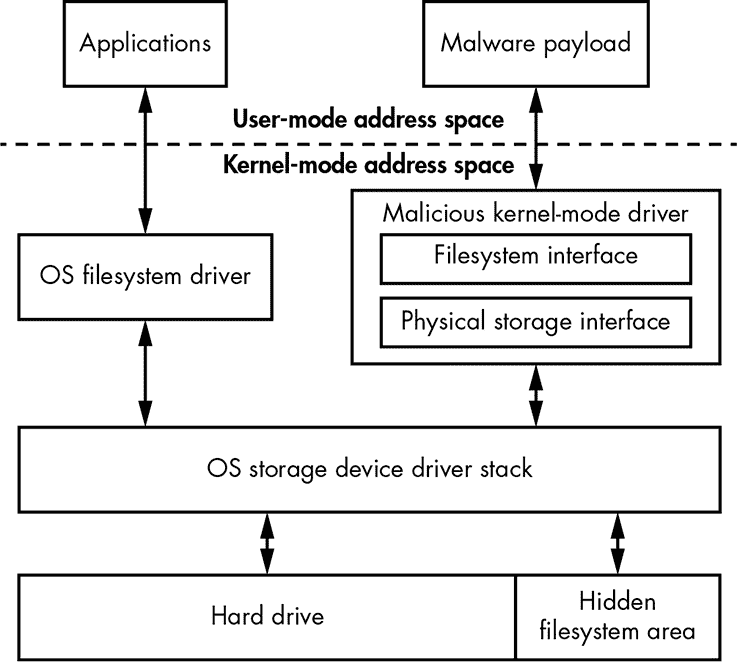
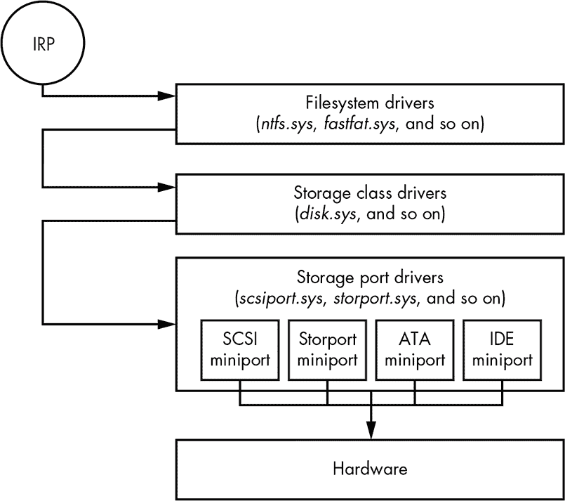
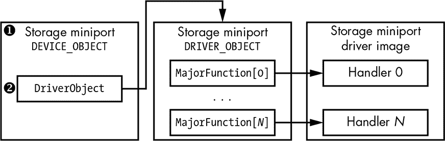
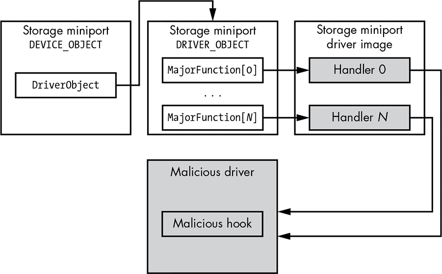
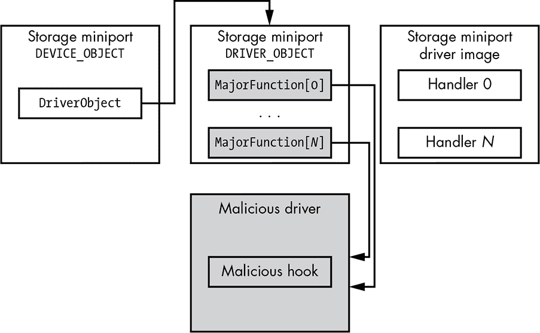
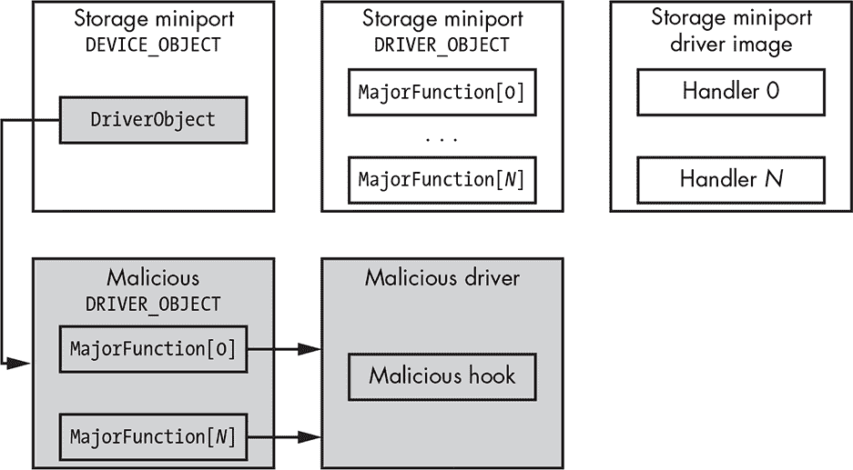
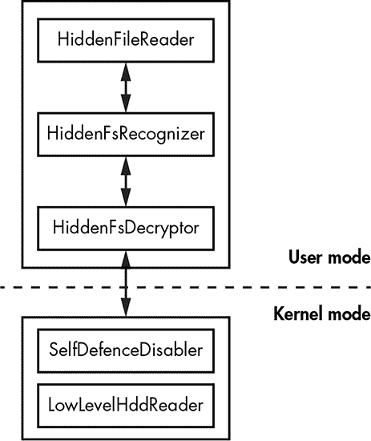

## **分析隐藏文件系统的方法**


到目前为止，本书中你已经学习了引导木马如何通过使用复杂技术渗透并保持在受害者计算机上，从而避免被检测到。这些高级威胁的一个共同特点是使用定制的隐藏存储系统，将模块和配置信息存储在被攻破的机器上。

许多恶意软件中的隐藏文件系统是标准文件系统的定制或修改版本，这意味着对感染了 rootkit 或 bootkit 的计算机进行取证分析通常需要定制的工具集。为了开发这些工具，研究人员必须通过深入分析和逆向工程，了解隐藏文件系统的布局及其加密数据所使用的算法。

本章中，我们将更详细地研究隐藏文件系统以及分析它们的方法。我们将分享我们在进行本书中描述的 rootkit 和 bootkit 的长期取证分析时的经验。我们还将讨论从隐藏存储中检索数据的方法，并分享在这种分析过程中常见问题的解决方案。最后，我们将介绍我们开发的定制工具 HiddenFsReader，其目的是转储特定恶意软件中隐藏文件系统的内容。

### 隐藏文件系统概述

图 18-1 展示了典型隐藏文件系统的概述。我们可以看到与隐藏存储进行通信的恶意载荷被注入到受害进程的用户模式地址空间中。该载荷通常利用隐藏存储读取和更新其配置信息，或存储像被窃取的凭据之类的数据。



*图 18-1：典型的恶意隐藏文件系统实现*

隐藏存储服务是通过内核模式模块提供的，而恶意软件暴露的接口仅对载荷模块可见。这个接口通常对系统上的其他软件不可用，也无法通过标准方法（如 Windows 文件资源管理器）访问。

恶意软件在隐藏文件系统中存储的数据保留在硬盘上未被操作系统使用的区域，以避免与操作系统发生冲突。在大多数情况下，这个区域位于硬盘的末端，因为通常会有一些未分配的空间。然而，在某些情况下，如第十一章中讨论的 Rovnix 引导木马，恶意软件可以将其隐藏文件系统存储在硬盘开头的未分配空间中。

执行取证分析的主要目标是检索这些隐藏存储的数据，接下来我们将讨论几种实现这一目标的方法。

### 从隐藏文件系统中检索引导木马数据

我们可以通过在感染的系统离线时检索数据，或通过从实时感染系统中读取恶意数据，来获取来自引导木马感染计算机的取证信息。

每种方法都有其优缺点，我们将在讨论这两种方法时进行考虑。

#### *从离线系统中检索数据*

首先，我们来讨论如何在系统离线时从硬盘读取数据（也就是说，恶意软件处于非活动状态）。我们可以通过对硬盘进行离线分析来实现这一点，但另一个选择是使用实时 CD 启动未感染的操作系统实例。这确保计算机使用安装在实时 CD 上的未受感染的引导加载程序，从而避免了引导包的执行。这种方法假设引导包在合法引导加载程序之前无法执行，也无法在尝试从外部设备启动以清除敏感数据之前检测到这一行为。

这种方法相对于在线分析的一个显著优势是，你无需绕过恶意软件的自我防御机制，这些机制用于保护隐藏的存储内容。正如我们在后续章节中看到的，绕过恶意软件的保护并非易事，且需要一定的专业知识。

**注意**

*一旦你获得了对硬盘上存储的数据的访问权限，你就可以继续转储恶意隐藏文件系统的镜像，并进行解密和解析。不同类型的恶意软件需要不同的方法来解密和解析隐藏的文件系统，正如我们在章节 “解析隐藏文件系统镜像” 第 360 页中将讨论的那样。*

然而，这种方法的缺点是，它需要同时具备对受感染计算机的物理访问权限以及使用实时 CD 启动计算机并转储隐藏文件系统的技术知识。满足这两个要求可能会存在问题。

如果在非活动机器上进行分析不可行，我们就必须使用主动方法。

#### *在实时系统上读取数据*

在一个存在活动引导包的实时系统上，我们需要转储恶意隐藏文件系统的内容。

然而，在系统运行恶意软件时读取恶意隐藏存储面临一个主要难题：恶意软件可能会尝试反制读取操作，并伪造从硬盘读取的数据，以阻碍取证分析。本书中我们讨论的大多数根套件——如 TDL3、TDL4、Rovnix、Olmasco 等——都会监视硬盘访问，并阻止对包含恶意数据区域的访问。

为了能够读取硬盘上的恶意数据，你必须克服恶意软件的自我防御机制。稍后我们会讨论一些应对方法，但首先，我们将研究 Windows 的存储设备驱动堆栈，以及恶意软件如何钩住它，以更好地理解恶意软件是如何保护恶意数据的。这些信息也有助于理解某些移除恶意钩子的方式。

#### *钩住 Miniport 存储驱动程序*

我们在第一章中介绍了 Microsoft Windows 存储设备驱动程序堆栈的架构以及恶意软件如何钩住它。此方法经历了 TDL3 并被后来的恶意软件采用，包括本书中我们研究的启动工具。这里我们将详细讲解。

TDL3 钩住了位于存储设备驱动程序堆栈最底部的迷你端口存储驱动程序，如图 18-2 所示。



*图 18-2：设备存储驱动程序堆栈*

在此层级钩住驱动程序堆栈使得恶意软件能够监视并修改往返硬盘的 I/O 请求，从而获得对其隐藏存储的访问权限。

在驱动程序堆栈的最底层进行钩子操作并直接与硬件通信，也使得恶意软件能够绕过在文件系统或磁盘类驱动程序级别运行的安全软件。正如我们在第一章中提到的，当对硬盘执行 I/O 操作时，操作系统会生成一个输入/输出请求数据包（IRP）——这是一个描述 I/O 操作的特殊数据结构，它会从堆栈顶部传递到底部。

负责监视硬盘 I/O 操作的安全软件模块可以检查并修改 IRP 数据包，但由于恶意钩子安装在安全软件下方的级别，因此这些安全工具无法察觉到这些钩子。

启动程序可能钩住的其他几个层次包括用户模式 API、文件系统驱动程序和磁盘类驱动程序，但没有一个能够像迷你端口存储层那样既隐秘又强大。

##### 存储设备堆栈布局

我们在本节中不会涵盖所有可能的迷你端口存储钩子方法。相反，我们将重点讨论我们在恶意软件分析过程中遇到的最常见的方法。

首先，我们将仔细观察存储设备，如图 18-3 所示。



*图 18-3：迷你端口存储设备组织*

IRP 从堆栈的顶部传递到底部。堆栈中的每个设备可以处理并完成 I/O 请求，或者将其转发到下一级设备。

`DEVICE_OBJECT` ➊是操作系统用于描述堆栈中设备的系统数据结构，它包含一个指针 ➋，指向相应的`DRIVER_OBJECT`，这是描述系统中加载的驱动程序的另一个系统数据结构。在此情况下，`DEVICE_OBJECT`包含指向迷你端口存储驱动程序的指针。

`DRIVER_OBJECT`结构的布局如清单 18-1 所示。

```
typedef struct _DRIVER_OBJECT {

   SHORT Type;

   SHORT Size;

➊ PDEVICE_OBJECT DeviceObject;

   ULONG Flags;

➋ PVOID DriverStart;

➌ ULONG DriverSize;

   PVOID DriverSection;

   PDRIVER_EXTENSION DriverExtension;

➍ UNICODE_STRING DriverName;

   PUNICODE_STRING HardwareDatabase;

   PFAST_IO_DISPATCH FastIoDispatch;

➎ LONG * DriverInit;

   PVOID DriverStartIo;

   PVOID DriverUnload;

➏ LONG * MajorFunction[28];

} DRIVER_OBJECT, *PDRIVER_OBJECT;
```

*清单 18-1：`DRIVER_OBJECT` 结构的布局*

`DriverName` 字段 ➍ 包含结构描述的驱动程序的名称；`DriverStart` ➋ 和 `DriverSize` ➌ 分别包含驱动程序内存中的起始地址和大小；`DriverInit` ➎ 包含指向驱动程序初始化例程的指针；`DeviceObject` ➊ 包含指向与驱动程序相关的 `DEVICE_OBJECT` 结构列表的指针。从恶意软件的角度来看，最重要的字段是位于结构末尾的 `MajorFunction` ➏，它包含驱动程序中实现的各类 I/O 操作处理程序的地址。

当 I/O 数据包到达设备对象时，操作系统会检查相应 `DEVICE_OBJECT` 结构中的 `DriverObject` 字段，以获取内存中 `DRIVER_OBJECT` 的地址。一旦内核获取了 `DRIVER_OBJECT` 结构，它会从与 I/O 操作类型相关的 `MajorFunction` 数组中获取相应 I/O 处理程序的地址。有了这些信息，我们可以识别出存储设备栈中可能被恶意软件钩取的部分。让我们来看看几种不同的方法。

##### 直接修补迷你端口存储驱动程序镜像

一种钩取迷你端口存储驱动程序的方法是直接修改驱动程序在内存中的镜像。一旦恶意软件获取到硬盘迷你端口设备对象的地址，它会查看 `DriverObject` 来定位相应的 `DRIVER_OBJECT` 结构。然后，恶意软件从 `MajorFunction` 数组中获取硬盘 I/O 处理程序的地址，并在该地址处修补代码，如图 18-4 所示（灰色部分是恶意软件修改的部分）。



*图 18-4：通过修补迷你端口驱动程序钩取存储驱动程序栈*

当设备对象接收到 I/O 请求时，恶意软件会被执行。恶意钩子现在可以拒绝 I/O 操作，阻止访问硬盘的保护区域，或者它可以修改 I/O 请求，返回伪造的数据并欺骗安全软件。

例如，这种类型的钩子被 Gapz 启动程序使用，如第十二章中讨论的那样。在 Gapz 的情况下，恶意软件钩取了硬盘迷你端口驱动程序中的两个例程，负责处理 `IRP_MJ_INTERNAL_DEVICE_CONTROL` 和 `IRP_MJ_DEVICE_CONTROL` I/O 请求，以保护它们不被读取或覆盖。

然而，这种方法并不特别隐蔽。安全软件可以通过在文件系统中定位被钩取的驱动程序镜像并将其映射到内存中来检测并移除钩子。接着，它会将加载到内核中的驱动程序代码部分与从文件手动加载的驱动程序版本进行比较，并注意代码部分的任何差异，这些差异可能表明驱动程序中存在恶意钩子。

安全软件可以通过覆盖修改过的代码，使用文件中提取的代码，来删除恶意钩子并恢复原始代码。这种方法假设文件系统中的驱动程序是合法的，并且没有被恶意软件修改。

##### DRIVER_OBJECT 修改

硬盘迷你端口驱动程序也可以通过修改`DRIVER_OBJECT`结构来实现钩子注入。如前所述，这个数据结构包含了驱动程序镜像在内存中的位置以及驱动程序调度例程在`MajorFunction`数组中的地址。

因此，修改`MajorFunction`数组允许恶意软件在不触及内存中驱动程序镜像的情况下安装其钩子。例如，恶意软件可以替换`MajorFunction`数组中与`IRP_MJ_INTERNAL_DEVICE_CONTROL`和`IRP_MJ_DEVICE_CONTROL` I/O 请求相关的条目，将其地址替换为恶意钩子的地址，而不是像前一种方法那样直接修改镜像中的代码。这样，每当操作系统内核试图解析`DRIVER_OBJECT`结构中的处理程序地址时，就会被重定向到恶意代码。这个方法在图 18-5 中有示范。

由于驱动程序镜像在内存中保持未修改，因此这种方法比前一种方法更具隐蔽性，但并非无法被发现。安全软件仍然可以通过定位驱动程序镜像并检查`IRP_MJ_INTERNAL_DEVICE_CONTROL`和`IRP_MJ_DEVICE_CONTROL` I/O 请求处理程序的地址来检测钩子的存在：如果这些地址不属于迷你端口驱动程序镜像在内存中的地址范围，那么就表明设备堆栈中存在钩子。



*图 18-5：通过修补迷你端口`DRIVER_OBJECT`来钩住存储驱动堆栈*

另一方面，移除这些钩子并恢复`MajorFunction`数组的原始值比前一种方法要困难得多。在这种方法中，驱动程序会在执行其初始化例程时初始化`MajorFunction`数组，该例程接收一个指向部分初始化的`DRIVER_OBJECT`结构的指针作为输入参数，并通过将`MajorFunction`数组填充为指向调度处理程序的指针来完成初始化。

只有迷你端口驱动程序知道处理程序的地址。安全软件无法获取这些信息，这使得恢复`DRIVER_OBJECT`结构中原始地址变得更加困难。

安全软件可能采用的一种方法是将迷你端口驱动程序映像加载到仿真环境中，创建一个`DRIVER_OBJECT`结构，并执行驱动程序的入口点（初始化例程），同时将`DRIVER_OBJECT`结构作为参数传递。在退出初始化例程时，`DRIVER_OBJECT`应包含有效的`MajorFunction`处理程序，安全软件可以利用这些信息计算驱动程序映像中 I/O 分派例程的地址，并恢复被修改的`DRIVER_OBJECT`结构。

然而，驱动程序的仿真可能会很棘手。如果驱动程序的初始化例程实现了简单的功能（例如，使用有效的处理程序地址初始化`DRIVER_OBJECT`结构），这种方法会有效，但如果它实现了复杂的功能（例如，调用系统服务或系统 API，这些更难仿真），仿真可能会失败并在驱动程序初始化数据结构之前终止。在这种情况下，安全软件将无法恢复原始处理程序的地址并移除恶意钩子。

解决这个问题的另一种方法是生成原始处理程序地址的数据库，并使用它来恢复这些地址。然而，这个解决方案缺乏通用性。它可能对最常用的迷你端口驱动程序有效，但对数据库中未包含的稀有或自定义驱动程序可能不起作用。

##### DEVICE_OBJECT 修改

本章中我们考虑的最后一种迷你端口驱动程序钩住方法是前一种方法的逻辑延续。我们知道，要执行迷你端口驱动程序中的 I/O 请求处理程序，操作系统内核必须从迷你端口`DEVICE_OBJECT`中获取`DRIVER_OBJECT`结构的地址，然后从`MajorFunction`数组中获取处理程序地址，最后执行处理程序。

所以，安装钩子的另一种方式是修改相关`DEVICE_OBJECT`中的`DriverObject`字段。恶意软件需要创建一个伪造的`DRIVER_OBJECT`结构，并用恶意钩子的地址初始化其`MajorFunction`数组，之后操作系统内核将使用恶意的`DRIVER_OBJECT`结构来获取 I/O 请求处理程序的地址并执行恶意钩子（图 18-6）。



*图 18-6：通过劫持迷你端口`DRIVER_OBJECT`钩住存储驱动程序堆栈*

这种方法被 TDL3/TDL4、Rovnix 和 Olmasco 使用，它与前一种方法有相似的优缺点。然而，它的钩子更难移除，因为整个`DRIVER_OBJECT`结构不同，这意味着安全软件需要付出额外的努力来定位原始的`DRIVER_OBJECT`结构。

这标志着我们对设备驱动程序栈挂钩技术的讨论结束。正如我们所见，要从感染机器的硬盘的受保护区域读取恶意数据，没有简单的通用解决方案来去除恶意挂钩。困难的另一个原因是，有许多不同实现的迷你端口存储驱动程序，而且由于它们直接与硬件通信，每个存储设备厂商都会为其硬件提供定制驱动程序，因此对于某一类迷你端口驱动程序有效的方法，在其他驱动程序中可能无效。

### 解析隐藏文件系统镜像

一旦 Rootkit 的自我防护保护被禁用，我们就可以读取恶意隐藏存储中的数据，从而得到恶意文件系统的镜像。法医分析中的下一步逻辑是解析隐藏文件系统并提取有意义的信息。

为了能够解析转储的文件系统，我们需要知道它对应的是哪种类型的恶意软件。每种威胁都有其自己实现的隐藏存储，而重构其布局的唯一方法是通过逆向工程恶意软件，理解负责维护该布局的代码。在某些情况下，隐藏存储的布局可能会在同一恶意软件家族的不同版本之间发生变化。

恶意软件还可能加密或混淆其隐藏存储，以使法医分析变得更加困难，在这种情况下，我们需要找到加密密钥。

表 18-1 提供了与我们在前几章中讨论的恶意软件家族相关的隐藏文件系统的总结。在此表中，我们仅考虑隐藏文件系统的基本特性，如布局类型、使用的加密方式以及是否实现了压缩。

**表 18-1：**隐藏文件系统实现比较

| **功能/恶意软件** | **TDL4** | **Rovnix** | **Olmasco** | **Gapz** |
| --- | --- | --- | --- | --- |
| 文件系统类型 | 自定义 | FAT16 修改 | 自定义 | 自定义 |
| 加密 | XOR/RC4 | 自定义（XOR+ROL） | RC6 修改 | RC4 |
| 压缩 | 否 | 是 | 否 | 是 |

正如我们所看到的，每种实现都不同，给法医分析师和调查人员带来了困难。

### HiddenFsReader 工具

在我们对高级恶意软件威胁的研究过程中，我们逆向分析了许多不同的恶意软件家族，并成功地收集了关于各种隐藏文件系统实现的广泛信息，这些信息对安全研究社区可能非常有用。因此，我们实现了一款名为 HiddenFsReader 的工具（* [`download.eset.com/special/ESETHfsReader.exe/`](http://download.eset.com/special/ESETHfsReader.exe/) *），该工具能够自动寻找计算机上的隐藏恶意容器并提取其中包含的信息。

图 18-7 展示了 HiddenFsReader 的高层架构。



*图 18-7：HiddenFsReader 的高层架构*

HiddenFsReader 由两个组件组成：一个用户模式应用程序和一个内核模式驱动程序。内核模式驱动程序基本上实现了禁用根套件/引导套件自我防御机制的功能，而用户模式应用程序则为用户提供接口，以便低级访问硬盘。即使系统感染了活跃的恶意软件实例，应用程序也可以通过该接口从硬盘读取实际数据。

用户态应用程序负责识别从硬盘读取的隐藏文件系统，并且实现解密功能，以便从加密的隐藏存储中获取明文数据。

在撰写时，最新版本的 HiddenFsReader 支持以下威胁及其相应的隐藏文件系统：

+   Win32/Olmarik (TDL3/TDL3+/TDL4)

+   Win32/Olmasco (MaxXSS)

+   Win32/Sirefef (ZeroAccess)

+   Win32/Rovnix

+   Win32/Xpaj

+   Win32/Gapz

+   Win32/Flamer

+   Win32/Urelas (GBPBoot)

+   Win32/Avatar

这些威胁使用自定义隐藏文件系统来存储有效载荷和配置信息，从而更好地防范安全软件，增加取证分析的难度。我们在本书中并未讨论所有这些威胁，但你可以在* [`nostarch.com/rootkits/`](https://nostarch.com/rootkits/)* 上找到相关信息。

### 结论

对于像根套件和引导套件这样的高级威胁，实施自定义隐藏文件系统是常见的做法。隐藏存储用于保密配置信息和有效载荷，从而使传统的取证分析方法失效。

取证分析人员必须禁用威胁的自我防御机制并对恶意软件进行逆向工程。通过这种方式，他们可以重建隐藏文件系统的布局，并识别用于保护恶意数据的加密方案和密钥。这需要针对每个威胁额外的时间和努力，但本章已经探讨了一些应对这些问题的可能方法。在第十九章中，我们将继续探讨恶意软件的取证分析，特别是针对 UEFI 根套件的分析。我们将提供关于 UEFI 固件获取和分析的相关信息，重点关注针对 UEFI 固件的恶意软件。
