## **19

**BIOS/UEFI 取证：固件获取与分析方法**


最近针对 UEFI 固件的 rootkit 攻击重新激起了人们对 UEFI 固件取证的兴趣。有关国家支持的 BIOS 植入程序的机密信息泄露，以及在第十五章中提到的 Hacking Team 的安全泄露事件，展示了针对 BIOS 的恶意软件越来越隐蔽和强大的能力，并促使研究界深入探讨固件领域。我们在前几章中已经讨论了一些关于这些 BIOS 威胁的技术细节。如果你还没读过第十五章和第十六章，强烈建议你在继续之前阅读这两章；这两章涉及了固件安全的关键概念，我们假设你已经理解这些概念。

**注意**

*在本章中，我们将* BIOS *和* UEFI 固件 *交替使用。*

目前，UEFI 固件取证是一个新兴的研究领域，因此从事该领域的安全研究人员缺乏传统的工具和方法。在本章中，我们将介绍一些固件分析技术，包括固件获取的不同方法以及解析和提取有用信息的技术。

我们首先关注固件获取，这是取证分析的第一步。我们将介绍软件和硬件两种方法来获取 UEFI 固件镜像。接下来，我们将比较这些方法，并讨论每种方法的优缺点。然后，我们讨论 UEFI 固件镜像的内部结构，以及如何解析它以提取取证证据。在本次讨论中，我们将展示如何使用 UEFITool，这是一款不可或缺的开源固件分析工具，用于浏览和修改 UEFI 固件镜像。最后，我们讨论 Chipsec，这是一款功能非常强大且广泛的工具，并考虑它在取证分析中的应用。两款工具在第十五章中已有介绍。

### 我们取证技术的局限性

我们在这里呈现的材料确实存在一些局限性。在现代平台上，固件种类繁多：UEFI 固件、Intel ME 固件、硬盘控制器固件等等。本章专门致力于 UEFI 固件的分析，它是平台固件中最大的一部分。

还需要注意的是，固件非常具有平台特性；也就是说，每个平台都有其独特性。在本章中，我们将重点讨论针对 Intel x86 系统的 UEFI 固件，这些系统占据了大多数桌面、笔记本和服务器市场份额。

### 为什么固件取证很重要

在第十五章中，我们看到现代固件是嵌入非常强大的后门或 rootkit 的便捷位置，尤其是在 BIOS 中。这种类型的恶意软件能够在操作系统重装或硬盘更换后存活，并且使攻击者能够控制整个平台。在写作本文时，大多数最先进的安全软件根本没有考虑到 UEFI 固件威胁，这使得它们更加危险。这为攻击者提供了一个重要机会，可以在目标系统上植入持久存在且未被检测到的恶意软件。

接下来，我们概述了攻击者可能利用固件 rootkit 的几种具体方式。

#### *攻击供应链*

针对 UEFI 固件的威胁增加了供应链攻击的风险，因为攻击者可以在服务器送往数据中心之前，或者在笔记本电脑送到 IT 部门之前，安装恶意植入物。而且，由于这些威胁可能通过暴露所有秘密影响大量服务提供商的客户，一些大型云计算公司，如 Google，最近开始使用固件取证分析技术，以确保其固件没有被破坏。

**GOOGLE TITAN 芯片**

2017 年，Google 公布了 Titan 芯片，这是一款通过建立硬件信任根来保护平台固件的芯片。信任硬件配置至关重要，尤其是在云安全领域，因为攻击的影响会因受影响的客户数量而成倍增加。

与大型云和数据相关的公司，如 Amazon、Google、Microsoft、Facebook 和 Apple，正在开发（或已经开发）用于控制平台信任根的硬件。即使攻击者利用固件 rootkit 攻击平台，拥有一个隔离的信任根也能防止 Secure Boot 攻击和固件更新攻击。

#### *通过固件漏洞攻破 BIOS*

攻击者可以通过利用固件中的漏洞，绕过 BIOS 写保护或认证，从而破坏平台固件。如需了解这种攻击，请参阅第十六章，我们在其中讨论了用于攻击 BIOS 的不同类型的漏洞。为了检测这些攻击，可以使用本章讨论的固件取证方法来验证平台固件的完整性，或帮助检测恶意固件模块。

### 理解固件获取

BIOS 取证分析的第一步是获取 BIOS 固件的映像进行分析。要更好地了解现代平台上 BIOS 固件的位置，请参阅图 19-1，该图展示了典型 PC 系统芯片组的架构。

芯片组中有两个主要组件：一个 CPU 和一个平台控制器集线器（PCH）或南桥。PCH 提供了平台上外设设备控制器与 CPU 之间的连接。在大多数基于 Intel x86 架构（包括 64 位平台）的现代系统中，系统固件位于串行外设接口（SPI）总线上的闪存中➊，该总线物理上与 PCH 连接。SPI 闪存是法医分析的主要目标，因为它存储了我们想要分析的固件。

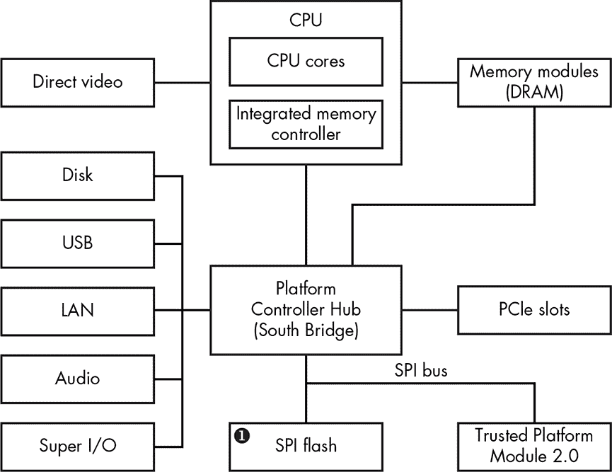

*图 19-1：现代 Intel 芯片组的框图*

一块 PC 主板通常有一个单独的物理 SPI 闪存芯片焊接在其上，但你可能偶尔会遇到有多个 SPI 闪存芯片的系统。这种情况发生在单个芯片没有足够的容量来存储所有系统固件时；在这种情况下，平台厂商使用两个芯片。我们将在本章稍后的“定位 SPI 闪存芯片”中讨论这种情况，见第 376 页。

**双 BIOS 技术**

双 BIOS 技术也使用计算机主板上的多个 SPI 闪存芯片。但与刚才讨论的使用多个 SPI 闪存芯片存储单一固件镜像的方式不同，双 BIOS 技术使用多个芯片存储不同的固件镜像或相同固件镜像的多个副本。这项技术提供了额外的固件损坏保护，因为如果一个芯片中的固件损坏，系统可以从第二个包含相同固件镜像的芯片启动。

要获取存储在 SPI 闪存中的固件镜像，你需要能够读取闪存的内容。一般来说，你可以通过软件方法或硬件方法来读取固件。在软件方法中，你尝试通过与 SPI 控制器通信来读取固件镜像，通信是通过在主机 CPU 上运行的软件实现的。在硬件方法中，你物理连接一个叫做 SPI 编程器的特殊设备到 SPI 闪存，然后直接从 SPI 闪存读取固件镜像。我们将介绍这两种方法，首先从软件方法开始。

然而，在我们进入软件方法的描述之前，你应该明白每种方法都有其优缺点。使用软件方法转储 UEFI 固件的一个好处是可以远程操作。目标系统的用户可以运行一个应用程序，将 SPI 闪存的内容转储并发送给法医分析师。但这种方法也有一个主要缺点：如果攻击者已经妥协了系统固件，他或她可能通过伪造从 SPI 闪存读取的数据来干扰固件获取过程。这使得软件方法在一定程度上不可靠。

硬件方法没有这种缺点。尽管你必须亲自到场并且需要打开目标系统的机箱，但此方法直接读取关闭电源系统的 SPI 闪存内容，而不会给攻击者任何伪造数据的机会（除非你面对的是硬件植入物，但本书不讨论这一内容）。

### 固件获取的软方法

在从目标系统转储 UEFI 固件的软件方法中，你通过操作系统读取 SPI 闪存的内容。你可以通过 *PCI 配置空间*（指定 PCI 总线上设备配置的一组寄存器）中的寄存器访问现代系统的 SPI 控制器。这些寄存器是内存映射的，你可以使用常规的内存读写操作对它们进行读写。在本节中，我们将演示如何定位这些寄存器并与 SPI 控制器进行通信。

在我们继续之前，你需要知道 SPI 寄存器的位置是芯片组特定的，因此为了与 SPI 控制器进行通信，我们需要参考专为我们目标平台设计的芯片组。在本章中，我们将演示如何读取英特尔 200 系列芯片组（SPI 寄存器的位置可以在 *[`www.intel.com/content/www/us/en/chipsets/200-series-chipset-pch-datasheet-vol-2.html`](https://www.intel.com/content/www/us/en/chipsets/200-series-chipset-pch-datasheet-vol-2.html)*）的 SPI 闪存，这些芯片组是本文写作时最新的桌面系统芯片组。

还值得一提的是，通过 PCI 配置空间暴露的寄存器对应的内存位置被映射到内核模式地址空间，因此无法访问在用户模式地址空间中运行的代码。你需要开发一个内核模式驱动程序来访问该地址范围。本章稍后讨论的 Chipsec 工具提供了自己的内核模式驱动程序，用于访问 PCI 配置空间。

#### *定位 PCI 配置空间寄存器*

首先，我们需要定位 SPI 控制器寄存器映射的内存范围。这个内存范围被称为 *根复合寄存器块（RCRB）*。在 RCRB 的 3800h 偏移处，你会找到 *SPI 基地址寄存器（SPIBAR）*，它保存了内存映射 SPI 寄存器的基地址（参见 图 19-2）。

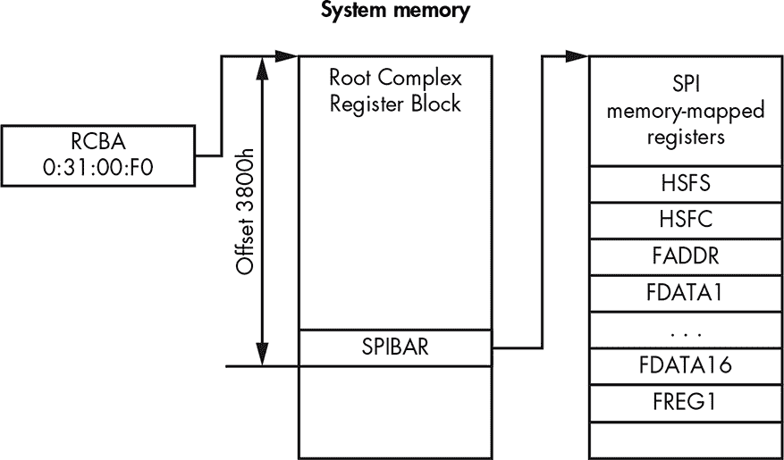

*图 19-2：系统内存中 SPI 控制和状态寄存器的位置*

**PCIE 总线**

PCI Express（PCIe）总线是一种高速串行总线标准，几乎在所有现代 PC 中都有使用，包括消费类笔记本电脑和台式机、数据中心服务器等。PCIe 总线作为计算机内部各个组件和外部设备之间的互连。许多集成的芯片组设备（如 SPI 闪存、内存控制器等）作为 PCIe 总线上的端点设备存在。

RCRB 地址存储在 *根复合基址（RCBA）* PCI 寄存器中，该寄存器位于总线 0，设备 31h，功能 0。这是一个 32 位寄存器，RCRB 的地址存储在第 31 位到第 14 位中。我们假设 RCRB 地址的低 14 位为零，因为 RCRB 按照 16Kb 边界对齐。一旦我们获得 RCRB 的地址，我们可以通过读取 3800h 偏移量处的内存来获取 SPIBAR 值。在下一节中，我们将更详细地讨论 SPI 寄存器。

**SPI FLASH 固件**

SPI 闪存不仅包含 BIOS 固件，还包括其他类型的平台固件，如 Intel ME（管理引擎）、以太网控制器固件以及供应商特定的固件和数据。不同类型的固件在其位置和访问控制权限上有所不同。例如，主机操作系统无法访问 Intel ME 固件，因此获取固件的软件方法对于 Intel ME 不适用。

#### *计算 SPI 配置寄存器地址*

一旦我们获取了 SPIBAR 值，该值为我们提供了 SPI 寄存器在内存中的位置，我们就可以编程寄存器来读取 SPI 闪存的内容。SPI 寄存器的偏移量可能会根据平台有所不同，因此确定给定硬件配置的实际值的最佳方法是查阅平台芯片组文档。例如，对于本文写作时支持 Intel 最新 CPU（Kaby Lake）的平台，我们可以查阅 Intel 200 系列芯片组家族平台控制器集线器数据手册，以查找 SPI 内存映射寄存器的位置。相关信息位于名为“串行外设接口”的章节中。对于每个 SPI 寄存器，数据手册提供了从 SPIBAR 值的偏移量、寄存器名称以及平台重置时寄存器的默认值。我们将在本节中使用该数据手册作为参考，来确定我们感兴趣的 SPI 寄存器的地址。

#### *使用 SPI 寄存器*

现在你知道如何查找 SPI 寄存器的地址，你可以确定使用哪个寄存器来读取 SPI 闪存的内容。表 19-1 列出了我们需要用来获取 SPI 闪存镜像的所有寄存器。

**表 19-1：** 固件获取的 SPI 寄存器

| **从 SPIBAR 的偏移量** | **寄存器名称** | **寄存器描述** |
| --- | --- | --- |
| 04h–05h | HSFS | 硬件排序闪存状态 |
| 06h–07h | HSFC | 硬件排序闪存控制寄存器 |
| 08h–0Bh | FADDR | 闪存地址 |
| 10h–4Fh | FDATAX | 闪存数据数组 |
| 58h–5Bh | FREG1 | 闪存区域 1（BIOS 描述符） |

我们将在接下来的章节中讨论这些寄存器。

##### FREG1 寄存器

我们首先要介绍的寄存器是 *闪存区域 1（FREG1）*。它提供了 BIOS 区域在 SPI 闪存中的位置。此 32 位长度寄存器的布局见 图 19-3。

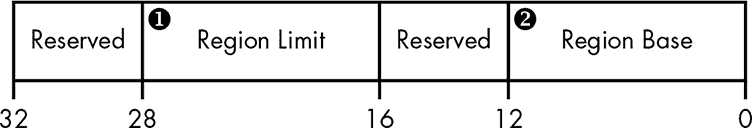

*图 19-3：FREG1 SPI 寄存器布局*

Region Base 字段 ➋ 提供了 BIOS 区域在 SPI 闪存中的基地址的 24:12 位。由于 BIOS 区域是按 4KB 对齐的，因此该区域基地址的最低 12 位从 0 开始。Region Limit 字段 ➊ 提供了 BIOS 区域在 SPI 闪存中的 24:12 位。例如，如果 Region Base 字段的值为 0xaaa，Region Limit 字段的值为 0xbbb，则 BIOS 区域从 0xaaa000 到 0xbbbfff 之间。

##### HSFC 寄存器

*硬件顺序闪存控制 (HSFC)* 寄存器允许我们向 SPI 控制器发送命令。（在规格说明中，这些命令被称为 *周期*。）您可以在 图 19-4 中看到 HSFC 寄存器的布局。

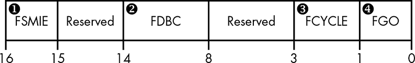

*图 19-4：HSFC SPI 寄存器布局*

我们使用 HSFC 寄存器向 SPI 闪存发送读/写/删除周期。2 位的 FCYCLE 字段 ➌ 编码了要执行的操作：

**00** 从 SPI 闪存读取数据块

**01** 向 SPI 闪存写入数据块

**11** 擦除 SPI 闪存中的数据块

**10** 保留

对于读写周期，FDBC 字段 ➋ 表示应传输到 SPI 闪存的字节数。此字段的内容是以零为基准的；000000b 表示 1 字节，111111b 表示 64 字节。因此，要传输的字节数为该字段的值加 1。

FGO 字段 ➍ 用于启动 SPI 闪存操作。当此字段的值为 1b 时，SPI 控制器将根据写入 FCYCLE 和 FDBC 字段的值进行读、写和擦除操作。在设置 FGO 字段之前，软件需要指定所有指示操作类型、数据量和 SPI 闪存地址的寄存器。

我们需要关注的最后一个 HSFC 字段是 *闪存 SPI SMI# 启用 (FSMIE)* ➊。当该字段被设置时，芯片组会生成系统管理中断（SMI），从而触发 SMM 代码的执行。正如我们在 “考虑软件方法的缺点” 的 第 373 页 中所看到的，您可以使用 FSMIE 来对抗固件映像获取。

**与 SPI 控制器通信**

使用 HSFC 寄存器并不是向 SPI 控制器发送命令的唯一方式。通常，与 SPI 闪存通信有两种方式：硬件序列和软件序列。在这里我们展示的硬件序列方法是通过让硬件选择发送用于读/写操作的 SPI 命令（这正是 HSFC 寄存器的作用）。软件序列则让我们有更多的选择，可以指定具体的命令来执行读/写操作。在本节中，我们通过 HSFC 寄存器使用硬件序列，因为它简单且能提供读取 BIOS 固件所需的功能。

##### FADDR 寄存器

我们使用*闪存地址(FADDR)*寄存器来指定用于读、写和擦除操作的 SPI 闪存线性地址。该寄存器为 32 位，但我们只使用低 24 位来指定操作的线性地址。该寄存器的高 8 位是保留的且未使用。

##### HSFS 寄存器

一旦我们通过设置 HSFC 寄存器的 FGO 字段启动了 SPI 周期，就可以通过查看*硬件序列闪存状态（HSFS）*寄存器来确定周期是否已完成。该寄存器由多个字段组成，这些字段提供有关请求操作状态的信息。在表 19-2 中，您可以看到用于读取 SPI 映像的 HSFS 字段。

**表 19-2：** SPI 寄存器 HSFS 字段

| **字段偏移** | **字段大小** | **字段名称** | **字段描述** |
| --- | --- | --- | --- |
| 0h | 1 | FDONE | 闪存周期完成 |
| 1h | 1 | FCERR | 闪存周期错误 |
| 2h | 1 | AEL | 访问错误日志 |
| 5h | 1 | SCIP | SPI 周期进行中 |

当上一个闪存周期（由 HSFC 寄存器的 FGO 字段启动）完成时，芯片组会设置 FDONE 位。FCERR 和 AEL 位指示在 SPI 闪存周期中发生了错误，返回的数据可能不包含有效值。SCIP 位指示闪存周期正在进行中。我们通过设置 FGO 位来设置 SCIP，且当 FDONE 的值为 1 时，SCIP 会被清除。根据这些信息，我们可以确定当以下表达式为真时，我们启动的操作已成功完成：

```
(FDONE == 1) && (FCERR == 0) && (AEL == 0) && (SCIP == 0)
```

##### FDATAX 寄存器

*闪存数据数组(FDATAX)*寄存器保存着从 SPI 闪存读取或写入的数据。每个寄存器是 32 位的，使用的 FDATAX 寄存器总数取决于要传输的字节数，这个字节数由 HSFC 寄存器的 FDBC 字段指定。

#### *从 SPI 闪存读取数据*

现在，让我们将所有这些信息汇总起来，看看如何使用这些寄存器从 SPI 闪存中读取数据。首先，我们定位根复合寄存器块，从中可以确定 SPI 内存映射寄存器的基地址，并获取对这些寄存器的访问权限。通过读取 FREG1 SPI 寄存器，我们可以确定 BIOS 区域在闪存中的位置——即 BIOS 的起始地址和 BIOS 限制。

接下来，我们使用刚才描述的 SPI 寄存器读取 BIOS 区域。此步骤在图 19-5 中进行了演示。

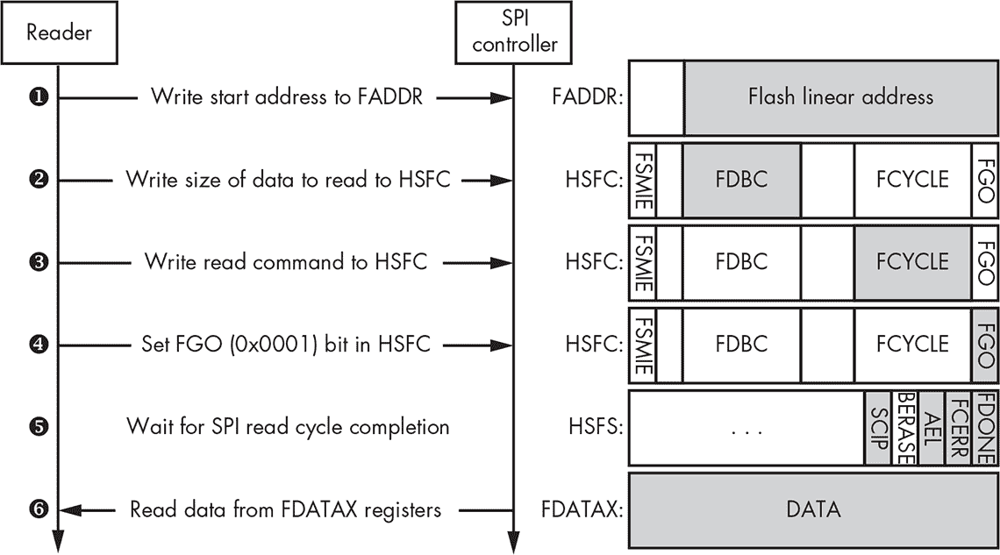

*图 19-5：从 SPI 闪存读取数据*

首先，我们将 FADDR 设置为我们要读取的闪存区域的线性地址 ➊。然后，我们通过设置闪存控制寄存器的 FDBC 字段 ➋ 来指定从闪存读取的总字节数。（111111b 的值表示每次读取 64 字节。）接着，我们用 00b 值设置 FCYCLE 字段 ➌，该值表示读取周期并设置启动我们闪存读取操作的 FGO 位 ➍。

一旦我们设置了 FGO 位，我们需要监控闪存状态寄存器，以了解操作何时完成。我们可以通过检查 FDONE、FCERR、AEL 和 SCIP 字段 ➎ 来做到这一点。读取操作完成后，我们从 FDATAX 寄存器 ➏ 中读取闪存数据。FDATAX[1]寄存器提供我们目标地址（由 FADDR 寄存器指定）处的前 4 个字节闪存；FDATAX[2]提供第二组 4 个字节闪存，以此类推。通过重复这些步骤，并在每次迭代时将 FADDR 值增加 64 字节，我们可以从 SPI 闪存中读取整个 BIOS 区域。

#### *考虑到软件方法的缺点*

BIOS 固件转储的软件方法很方便，因为它不需要你在场；通过这种方法，你可以远程读取 SPI 闪存的内容。但它对已经破坏了系统固件并能在 SMM 中执行恶意代码的攻击者来说并不稳健。

正如我们所注意到的，HSFC 寄存器有一个 FSMIE 位，当闪存周期完成时，它会触发 SMI。如果攻击者已经破坏了 SMM 并且能够在固件获取软件设置 FGO 位之前设置 FSMIE 位，那么攻击者将在 SMI 生成后控制系统，并能够修改 FDATAX 寄存器的内容。因此，固件获取软件将从 FDATAX 中读取伪造的值，无法获得 BIOS 区域的原始镜像。图 19-6 演示了这种攻击。


*图 19-6：通过 SMI 破坏软件 BIOS 获取*

在读取器设置闪存控制寄存器中的 FGO 位➋之前，攻击者将 1 写入寄存器的 FSMIE 位➊。一旦循环结束并且数据被写回到 FDATAX 寄存器，触发了 SMI，攻击者获得了控制权➌。接着，攻击者修改 FDATAX 寄存器的内容➍，以掩盖对 BIOS 固件的攻击。恢复控制后，读取器将收到伪造的数据➎，并且不会检测到固件被篡改。

该攻击展示了软件方法无法提供 100%可靠的固件获取解决方案。在接下来的部分中，我们将讨论获取系统固件用于取证分析的硬件方法。通过物理连接设备到 SPI 闪存来进行取证分析，避免了图 19-6 中描述的攻击可能性。

### 固件获取的硬件方法

为了确保我们获取的是存储在 SPI 闪存上的实际 BIOS 镜像，而不是已经被攻击者篡改的版本，我们可以使用硬件方法。采用这种方法时，我们会将设备物理连接到 SPI 闪存，并直接读取其内容。这是最好的解决方案，因为它比软件方法更可靠。额外的好处是，这种方法还允许我们获取存储在 SPI 闪存上的其他固件，例如 ME 和 GBE 固件，而这些固件可能由于 SPI 控制器的限制无法通过软件方法访问。

现代系统中的 SPI 总线允许多个主设备与 SPI 闪存通信。例如，在基于英特尔芯片组的系统中，通常有三个主设备：主机 CPU、英特尔 ME 和 GBE。这三个主设备对 SPI 闪存的不同区域具有不同的访问权限。在大多数现代平台上，主机 CPU 无法读写包含英特尔 ME 和 GBE 固件的 SPI 闪存区域。

图 19-7 展示了通过读取 SPI 闪存获取 BIOS 固件镜像的典型设置。

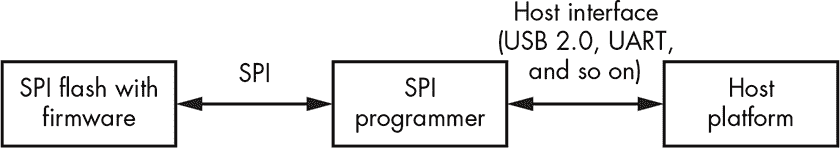

*图 19-7：用于转储 SPI 闪存镜像的典型设置*

为了从闪存中读取数据，我们需要一个额外的设备，叫做*SPI 编程器*，我们将其物理连接到目标系统上的 SPI 闪存芯片。我们还通过 USB 或 UART 接口将 SPI 编程器连接到主机，使用主机获取 BIOS 固件镜像。然后，我们会在编程器上运行一些特定的软件，使其从闪存芯片读取数据并将数据传输到分析师的计算机。这些软件可能是随特定 SPI 编程器提供的专有软件，或者它也可能是一个开源解决方案，比如稍后在“使用 FT2232 Mini 模块读取 SPI 闪存”中讨论的 Flashrom 工具，第 377 页有详细介绍。

#### *回顾联想 ThinkPad T540p 案例分析*

硬件方法比软件方法更为具体。它要求你查阅平台文档，以了解平台使用什么样的闪存来存储固件，以及固件在系统中的物理位置。此外，还有许多专用于特定硬件的闪存编程设备，我们可以使用它们来读取闪存的内容。由于可供选择的硬件和软件选项实在太多，我们不会讨论系统固件获取的各种方法。相反，我们将介绍使用 FT2232 SPI 编程器从联想 ThinkPad T540p 提取固件的一种可能方法。

我们选择这款 SPI 编程器是因为它的价格相对较低（大约 30 美元）且具有灵活性，此外我们之前也有使用过它的经验。正如我们所提到的，市面上有许多解决方案，每种方案都有其独特的特点、优点和缺点。

**DEDIPROG SF100 ISP IC 编程器**

我们还想提到另一款设备，即 Dediprog SF100 ISP IC 编程器（如图 19-8 所示）。它在安全研究社区中非常流行，支持许多 SPI 闪存，并提供广泛的功能。Minnowboard 是一个开源参考板，供硬件和固件开发者使用，提供了一个关于如何使用 Dediprog 更新固件的好教程，教程地址为 *[`minnowboard.org/tutorials/updating-firmware-via-spi-flash-programmer/`](https://minnowboard.org/tutorials/updating-firmware-via-spi-flash-programmer/)。*

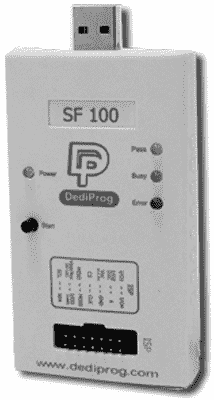

*图 19-8：Dediprog SF100 ISP IC 编程器*

#### *定位 SPI 闪存芯片*

让我们从物理上读取联想 ThinkPad T540p 平台的固件镜像开始。首先，要从目标系统中提取系统固件，我们需要找出在主板上 SPI 闪存芯片的位置。为此，我们查阅了这款笔记本型号的硬件维护手册 (*[`thinkpads.com/support/hmm/hmm_pdf/t540p_w540_hmm_en_sp40a26003_01.pdf`](https://thinkpads.com/support/hmm/hmm_pdf/t540p_w540_hmm_en_sp40a26003_01.pdf)*)，并拆开了目标系统的硬件。在图 19-9 和图 19-10 中，你可以看到两个闪存芯片的位置。图 19-9 展示了系统板的完整图像，SPI 闪存芯片位于高亮区域。

**警告**

*除非你百分之百确定自己在做什么，否则不要重复本节中描述的操作。工具配置无效或不正确可能会使目标系统无法启动。*

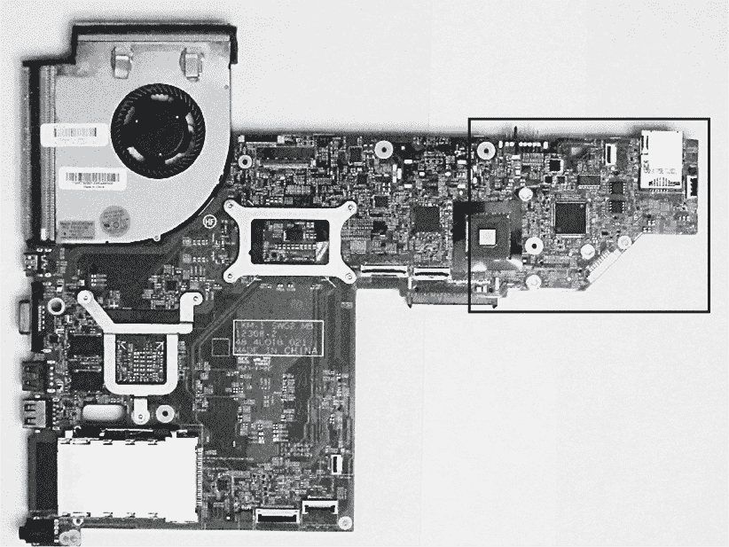

*图 19-9：联想 ThinkPad T540p 主板与 SPI 闪存模块*

图 19-10 放大了图 19-9 中突出显示的区域，使你能更清楚地看到 SPI 闪存芯片。这款笔记本型号使用了两个 SOIC-8 闪存模块来存储固件——一个是 64Mb（8MB），另一个是 32Mb（4MB）。这是许多现代桌面和笔记本电脑中非常流行的解决方案。

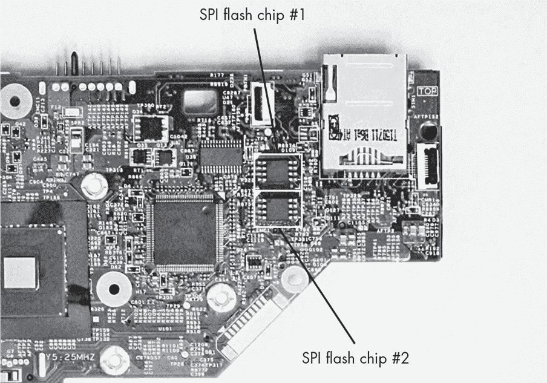

*图 19-10：笔记本主板上 SPI 闪存模块的位置*

由于使用了两个独立的芯片来存储系统固件，我们需要将两个芯片的内容都转储。我们通过将两个闪存芯片的映像拼接成一个文件来获得最终的固件映像。

#### *使用 FT2232 迷你模块读取 SPI 闪存*

一旦我们确定了芯片的物理位置，就可以将 SPI 编程器的引脚连接到系统板上的闪存模块。FT2232H 迷你模块的技术资料（*[`www.ftdichip.com/Support/Documents/DataSheets/Modules/DS_FT2232H_Mini_Module.pdf`](http://www.ftdichip.com/Support/Documents/DataSheets/Modules/DS_FT2232H_Mini_Module.pdf)*）向我们展示了应使用哪些引脚将设备连接到存储芯片。图 19-11 展示了 FT2232H 迷你模块和 SPI 闪存芯片的引脚布局。

FT2232H 有两组引脚，对应两个通道：通道 2 和通道 3。你可以使用任一通道读取 SPI 闪存的内容。在我们的实验中，我们使用通道 3 将 FT2232H 连接到 SPI 存储芯片。图 19-11 展示了我们如何将 FT2232H 的引脚连接到 SPI 闪存芯片的相应引脚。

除了将 FT2232H 连接到存储芯片，我们还需要将其配置为在 USB 总线供电模式下工作。FT2232H 迷你模块支持两种工作模式：*USB 总线供电*和*自供电*。在总线供电模式下，迷你模块从其连接的 USB 总线获取电源，而在自供电模式下，电源独立于 USB 总线连接提供。

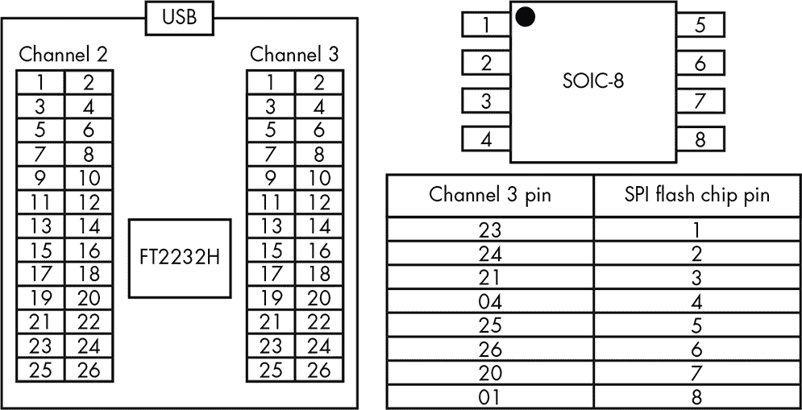

*图 19-11：FT2232H 迷你模块和 SPI 闪存芯片的引脚布局*

为了帮助我们将 SPI 编程器连接到 SPI 芯片模块，我们使用了一个 SOIC-8 夹具，如图 19-12 所示。这个夹具让我们能够轻松地将迷你模块的引脚连接到闪存芯片的相应引脚。

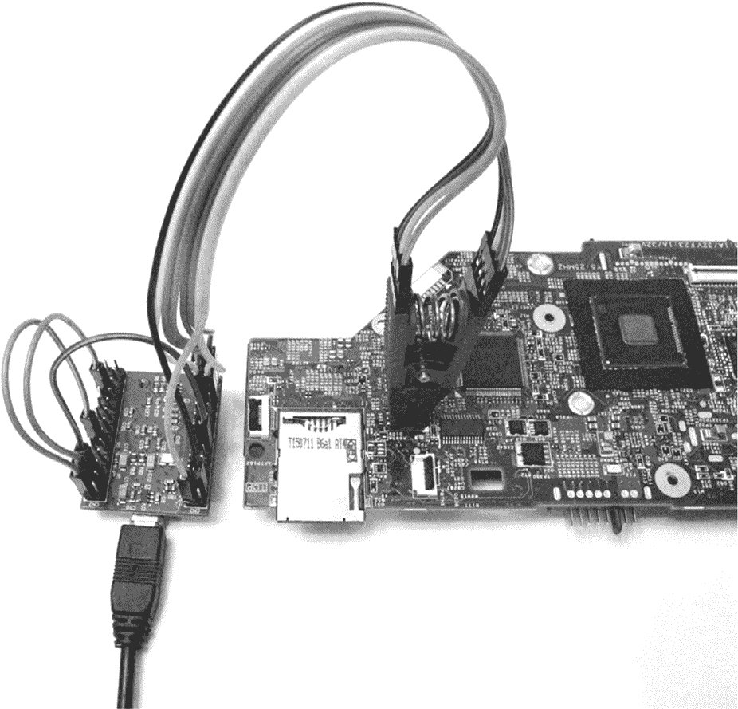

*图 19-12：将 FT2232H 迷你模块连接到 SPI 闪存芯片*

一旦我们连接了所有组件，就可以读取 SPI 闪存芯片的内容。为此，我们使用一个名为 *Flashrom*（* [`www.flashrom.org/Flashrom`](https://www.flashrom.org/Flashrom) *）的开源工具。该工具专门用于识别、读取、写入、验证和擦除闪存芯片。它支持大量闪存芯片，并与许多不同的 SPI 编程器兼容，包括 FT2232H Mini 模块。

清单 19-1 显示了在 Lenovo ThinkPad T540p 平台上运行 Flashrom 以读取两个 SPI 闪存芯片内容的结果。

```
➊ user@host: flashrom -p ft2232_spi:type=2232H,port=B --read dump_1.bin

   flashrom v0.9.9-r1955 on Linux 4.8.0-36-generic (x86_64)

   flashrom is free software, get the source code at https://flashrom.org

   Calibrating delay loop... OK.

➋ Found Macronix flash chip "MX25L6436E/MX25L6445E/MX25L6465E/MX25L6473E"

   (8192 kB, SPI) on ft2232_spi.

➌ Reading flash... done.

   user@host: flashrom -p ft2232_spi:type=2232H,port=B --read dump_2.bin

   flashrom v0.9.9-r1955 on Linux 4.8.0-36-generic (x86_64)

   flashrom is free software, get the source code at https://flashrom.org

   Calibrating delay loop... OK.

   Found Macronix flash chip "MX25L3273E" (4096 kB, SPI) on ft2232_spi.

   Reading flash... done.

➍ user@host: cat dump_2.bin >> dump_1.bin
```

*清单 19-1：使用 Flashrom 工具导出 SPI 闪存镜像*

首先，我们运行 Flashrom 来导出第一个 SPI 闪存芯片的内容，并将编程器类型和端口号作为参数传递 ➊。我们指定的类型为 2232H，对应我们的 FT2232H Mini 模块，而端口 B 对应通道 3，即我们用来连接 SPI 闪存芯片的端口。`--read` 参数告诉 Flashrom 读取 SPI 闪存内存的内容并保存到 *dump_1.bin* 文件中。一旦我们运行该工具，它会显示检测到的 SPI 闪存芯片类型——在我们的例子中是 Macronix MX25L6473E ➋。等 Flashrom 完成读取闪存内存后，它会输出确认信息 ➌。

在读取完第一个闪存芯片后，我们重新连接夹具到第二个芯片，并再次运行 Flashrom，将第二个芯片的内容导出到 *dump_2.bin* 文件中。完成此操作后，我们通过将两个导出的镜像拼接在一起，创建了一个完整的固件镜像 ➍。

我们现在已经成功导出了完整且可信的固件镜像。即使 BIOS 已经被感染且攻击者试图阻止我们获取固件，我们仍然能够获得实际的固件代码和数据。接下来，我们将对其进行分析。

### 使用 UEFITool 分析固件镜像

一旦我们从目标系统的 SPI 闪存中获取了固件镜像，我们就可以对其进行分析。在本节中，我们将介绍平台固件的基本组件，如固件卷、卷文件以及理解闪存镜像中 UEFI 固件布局所必需的各个部分。然后我们将重点关注固件取证分析中最重要的步骤。

**注意**

*在本节中，我们将提供高层次的描述，而不是详细的结构定义，因为这涉及的内容过于庞大，深度探讨超出了本章的范围。不过，如果您需要更多信息，我们会提供参考文献，其中包含定义和数据结构布局。*

我们将重新审视 UEFITool（*[`github.com/LongSoft/UEFITool/`](https://github.com/LongSoft/UEFITool/)*），这是一款用于解析、提取和修改 UEFI 固件映像的开源工具，已经在第十五章中介绍过，接下来我们将用前一节获得的真实固件映像来演示理论概念。查看固件映像内部并浏览提取不同组件的能力对于取证分析非常有用。此工具无需安装；下载后即可直接运行。

#### *了解 SPI 闪存区域*

在查看固件映像之前，我们需要了解 SPI 闪存上存储的信息是如何组织的。通常，基于英特尔芯片组的现代平台 SPI 闪存由多个区域组成。每个区域专门用于存储平台中特定设备的固件；例如，UEFI BIOS 固件、英特尔 ME 固件和英特尔 GBE（集成 LAN 设备）固件都分别存储在自己的区域中。图 19-13 展示了 SPI 闪存的几个区域布局。

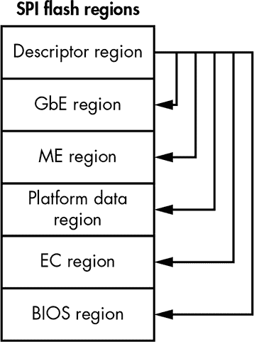

*图 19-13：SPI 闪存映像的区域*

现代系统中的 SPI 闪存支持最多六个区域，包括*描述符*区域，闪存映像总是从该区域开始。描述符区域包含有关 SPI 闪存布局的信息；即它向芯片组提供关于 SPI 闪存上其他区域的信息，如它们的位置和访问权限。描述符区域还决定了系统中每个主机与 SPI 闪存控制器通信的访问权限。多个主机可以同时与控制器通信。我们可以在目标平台的芯片组规格中找到描述符区域的完整布局，包括其中所有数据结构的定义。

在本章中，我们主要关注的是 BIOS 区域，该区域包含 CPU 在复位向量时执行的固件。我们可以从描述符区域提取 BIOS 区域的位置。通常，BIOS 是 SPI 闪存中的最后一个区域，也是取证分析的主要目标。

让我们来看看我们通过硬件方法获得的 SPI 映像的不同区域。

#### *使用 UEFITool 查看 SPI 闪存区域*

首先，启动 UEFITool 并选择**文件**▸**打开映像文件**。然后选择包含您要分析的 SPI 映像的文件——我们已为您提供一个，可以通过书本资源使用，网址是*[`nostarch.com/rootkits/`](https://nostarch.com/rootkits/)*。图 19-14 展示了此操作的结果。

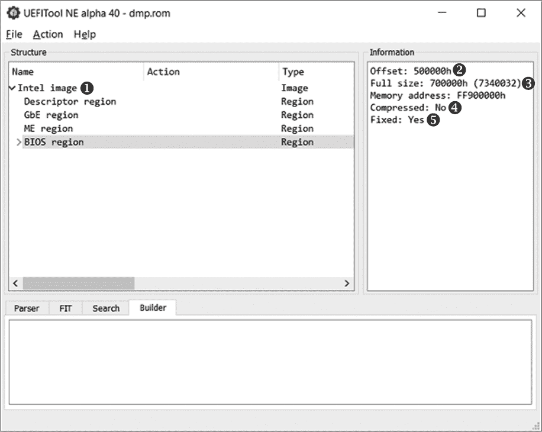

*图 19-14：在 UEFITool 中浏览 SPI 闪存区域*

当固件映像加载时，UEFITool 会自动解析它，并以树状结构提供这些信息。在图 19-14 中，工具识别到该固件映像来自基于英特尔芯片组的系统➊，并且只有四个 SPI 区域：描述符、ME、GbE 和 BIOS。如果我们在结构窗口中选择 BIOS 区域，就可以在信息窗口中看到有关它的信息。UEFITool 显示以下描述该区域的项：

**偏移量** ➋ 区域相对于 SPI 闪存映像开始位置的偏移量

**完整大小** ➌ 区域的字节大小

**内存地址** ➍ 映射到物理内存的区域地址

**压缩** ➎ 区域是否包含压缩数据

该工具提供了一种方便的方法，从 SPI 映像中提取单个区域（以及结构窗口中显示的任何其他对象）并将其保存为单独的文件，如图 19-15 所示。

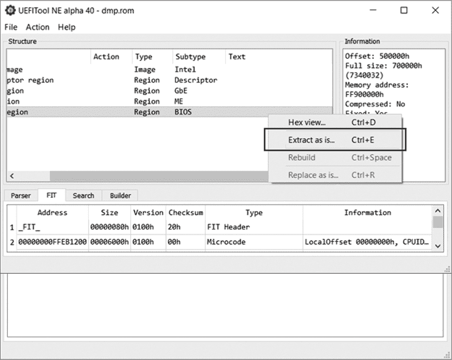

*图 19-15：提取 BIOS 区域并将其保存为单独的文件*

要提取并保存一个区域，右键点击该区域并在上下文菜单中选择**按原样提取 . . .**。然后工具会显示一个常规对话框，让你选择要保存新文件的位置。完成后，检查所选位置以确认操作是否成功。

#### *分析 BIOS 区域*

一旦我们确定了 BIOS 区域的位置，就可以开始分析了。从高层次来看，BIOS 区域被组织成*固件卷*，它们是数据和代码的基本存储库。固件卷的具体定义见于 EFI 固件卷规范（*[`www.intel.com/content/www/us/en/architecture-and-technology/unified-extensible-firmware-interface/efi-firmware-file-volume-specification.html`](https://www.intel.com/content/www/us/en/architecture-and-technology/unified-extensible-firmware-interface/efi-firmware-file-volume-specification.html)*）。每个卷都以一个头部开始，提供必要的卷属性，例如卷文件系统类型、卷大小和校验和。

让我们检查一下我们获取的 BIOS 中可用的固件卷。如果我们在 UEFITool 窗口中双击 BIOS 区域（如图 19-15 所示），我们会看到一个可用的固件卷列表，如图 19-16 所示。

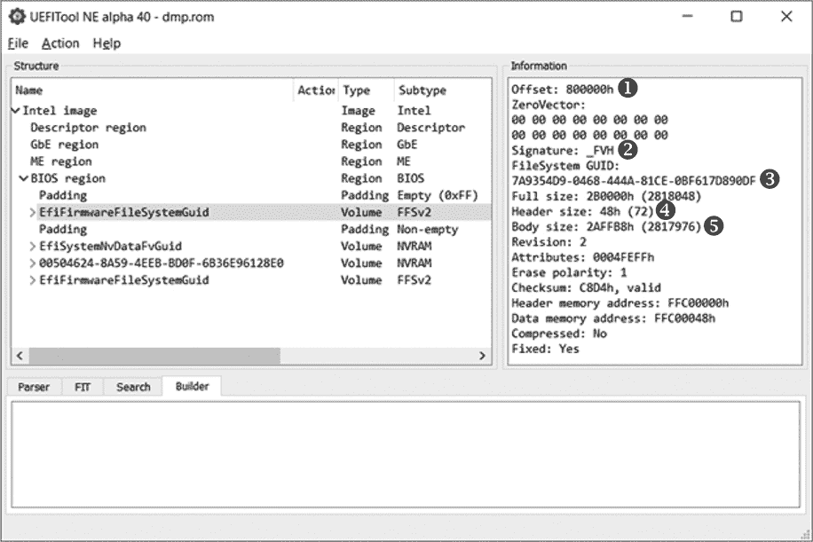

*图 19-16：浏览 BIOS 区域中可用的固件卷*

我们的 BIOS 区域中有四个固件卷，你还会注意到有两个区域标记为*填充*。填充区域不属于任何固件卷，而是表示它们之间的空白区域，填充的值为 0x00 或 0xff，具体取决于 SPI 闪存的擦除极性。擦除极性决定写入闪存的擦除操作的值。如果擦除极性为 1，则擦除的闪存字节会被设置为 0xff 的值；如果擦除极性为 0，则擦除的闪存字节会被设置为 0x00 的值。因此，当擦除极性为 1 时，填充区域（空白区域）由 0xff 值构成。

在图 19-16 中卷的右侧信息标签中，我们可以看到所选卷的属性。以下是一些重要的字段：

**偏移量** ➊ 固件卷相对于 SPI 映像起始位置的偏移量。

**签名** ➋ 固件卷头部的签名。此字段用于识别 BIOS 区域中的卷。

**文件系统 GUID** ➌ 固件卷中使用的文件系统的标识符。此全球唯一标识符（GUID）显示为结构窗口中卷的名称。如果 GUID 已被记录，UEFITool 将显示其人类可读的名称（如图 19-16 中的 EfiFirmwareFileSystemGuid），而不是十六进制值。

**头部大小** ➍ 固件卷头部的大小。卷数据位于头部之后。

**主体大小** ➎ 固件卷体的大小——即存储在该卷中的数据大小。

##### 了解固件文件系统

固件卷被组织为文件系统，其类型在固件头中的文件系统 GUID 中指明。固件卷中最常用的文件系统是*固件文件系统（FFS）*，该文件系统在 EFI FFS 规范中定义，但固件卷也使用其他文件系统，如 FAT32 或 NTFS。我们将重点讨论 FFS，因为它是最常见的。

FFS 将所有文件存储在根目录中，并且不提供任何目录层次结构。根据 EFI FFS 规范，每个文件都有一个与之关联的类型，位于该文件的头部，描述存储在该文件中的数据。以下是一些在取证分析中可能有用的常见文件类型：

***EFI_FV_FILETYPE_RAW*** 一个原始文件——对于文件中存储的数据不应做任何假设。

***EFI_FV_FILETYPE_FIRMWARE_VOLUME_IMAGE*** 一个包含封装固件卷的文件。尽管 FFS 没有为目录层次结构提供规定，但我们可以使用此文件类型通过将固件模块封装在文件中来创建类似树形结构。

***EFI_FV_FILETYPE_SECURITY_CORE*** 一个包含代码和数据的文件，在启动过程的安全（SEC）阶段执行。SEC 阶段是 UEFI 启动过程的第一个阶段。

***EFI_FV_FILETYPE_PEI_CORE*** 是一个可执行文件，用于启动引导过程中的预 EFI 初始化（PEI）阶段。PEI 阶段紧随 SEC 阶段之后。

***EFI_FV_FILETYPE_PEIM*** 是 PEI 模块，它是包含代码和数据的文件，在 PEI 阶段执行。

***EFI_FV_FILETYPE_DXE_CORE*** 是一个可执行文件，用于启动引导过程中的 *驱动程序执行环境*（*DXE*）阶段。DXE 阶段紧随 PEI 阶段之后。

***EFI_FV_FILETYPE_DRIVER*** 是在 DXE 阶段启动的可执行文件。

***EFI_FV_FILETYPE_COMBINED_PEIM_DRIVER*** 是一个包含代码和数据的文件，可以在 PEI 和 DXE 阶段都执行。

***EFI_FV_FILETYPE_APPLICATION*** 是一个 UEFI 应用程序，它是一个可以在 DXE 阶段启动的可执行文件。

***EFI_FV_FILETYPE_FFS_PAD*** 是一个填充文件。

与操作系统中常见的文件系统不同，操作系统中文件具有可读的文件名，而 FFS 文件通过 GUID 进行标识。

##### 了解文件部分

大多数存储在 FFS 中的固件文件由单一部分或多个独立部分组成，称为 *部分*（尽管某些文件，如 *EFI_FV_FILETYPE_RAW* 文件，可能不包含任何部分）。

有两种类型的部分：叶部分和封装部分。*叶部分* 直接包含数据，其类型由部分头中的部分类型属性决定。*封装部分* 包含文件部分，这些文件部分可能包含叶部分或封装部分。这意味着一个封装部分可以包含嵌套的封装部分。

以下列表描述了一些类型的叶部分：

***EFI_SECTION_PE32*** 包含一个 PE 映像。

***EFI_SECTION_PIC*** 包含位置无关代码（PIC）。

***EFI_SECTION_TE*** 包含一个简洁可执行（TE）映像。

***EFI_SECTION_USER_INTERFACE*** 包含一个用户界面字符串。它通常用于存储文件的可读名称，以及文件的 GUID。

***EFI_SECTION_FIRMWARE_VOLUME_IMAGE*** 包含一个封装的固件映像。

以下是 FFS 规范中定义的几个封装部分：

***EFI_SECTION_COMPRESSION*** 包含压缩的文件部分。

***EFI_SECTION_GUID_DEFINED*** 根据由部分 GUID 标识的算法封装其他部分。此类型通常用于签名部分，例如。

这些对象构成了现代平台上的 UEFI 固件内容。法证分析员必须考虑固件的每个组成部分，无论它是具有可执行代码的部分，如 PE32、TE 或 PIC，还是包含非易失性变量的数据文件。

为了更好地理解这里介绍的概念，请参见 图 19-17，它展示了 `CpuInitDxe` 驱动程序在固件卷中的位置。该驱动程序负责在 DXE 阶段初始化 CPU。我们将从 FFS 层次结构的底部开始，描述它在固件映像中的位置。

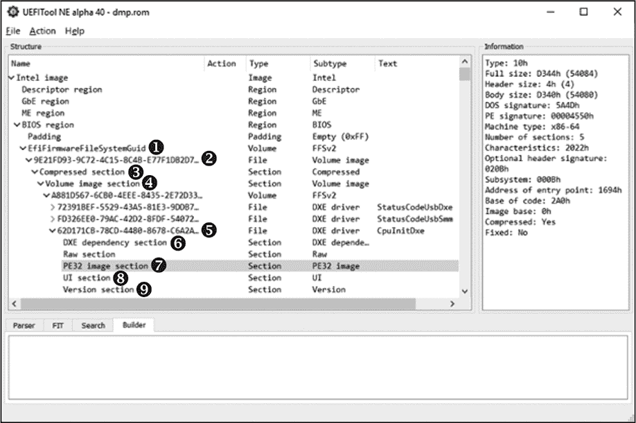

*图 19-17：`CpuInitDxe`驱动程序在 BIOS 区域中的位置*

驱动程序的可执行镜像位于 PE32 镜像区段➐中。这个区段与其他包含驱动程序名称➑、版本➒和依赖关系➏的区段一起，位于文件中，文件的 GUID 为`{62D171CB-78CD-4480-8678-C6A2A797A8DE}`➎。该文件是封装固件卷➍的一部分，存储在压缩区段➌中。压缩区段位于固件卷镜像类型中的`{9E21FD93-9C72-4C15-8C4B-E77F1DB2D792}`文件➋，该文件存储在顶级固件卷➊中。

这个示例主要是为了展示构成 UEFI 固件的对象层次结构，但这仅仅是解析固件的一种可能方法。

现在我们知道了 BIOS 区域是如何组织的，我们就能浏览其层次结构，搜索存储在 BIOS 固件中的各种对象。

### 使用 Chipsec 分析固件镜像

在本节中，我们将讨论使用平台安全评估框架 Chipsec 进行固件法医分析（* [`github.com/chipsec/`](https://github.com/chipsec/) *），该框架在第十五章中介绍。在本节中，我们将更详细地探讨该工具的架构；然后，我们将分析一些固件，提供几个示例来展示 Chipsec 的功能和实用性。

该工具提供了多种接口来访问平台硬件资源，如物理内存、PCI 寄存器、NVRAM 变量和 SPI 闪存。这些接口对法医分析师非常有用，我们将在本节稍后更深入地探讨这些接口。

请按照 Chipsec 手册中的安装指南（* [`github.com/chipsec/chipsec/blob/master/chipsec-manual.pdf`](https://github.com/chipsec/chipsec/blob/master/chipsec-manual.pdf) *）进行安装和设置。手册还涵盖了许多您可以使用的功能，但在本节中，我们仅关注 Chipsec 的法医分析功能。

#### *了解 Chipsec 架构*

图 19-18 展示了该工具的高层架构。

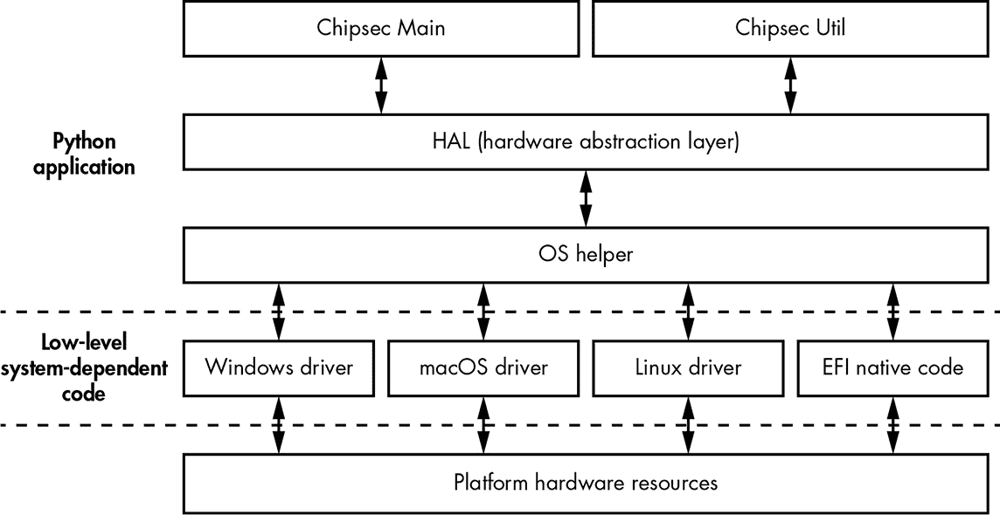

*图 19-18：Chipsec 工具的架构*

在底部，我们可以看到提供访问系统资源的模块，如内存映射 I/O 地址范围、PCI 配置空间寄存器和物理内存。这些是平台相关的模块，作为内核模式驱动程序和 EFI 本地代码实现。（目前，Chipsec 为 Windows、Linux 和 macOS 提供了内核模式驱动程序。）大多数模块是用 C 语言编写的，旨在内核模式或 EFI Shell 中执行。

**注意**

*UEFI Shell 是一个 UEFI 应用程序，它提供了一个固件的命令行界面，允许我们启动 UEFI 应用程序并执行命令。我们可以使用 UEFI Shell 来检索平台信息，查看和修改启动管理器变量，加载 UEFI 驱动程序等等。*

在这些低级依赖于操作系统的组件之上，是一个名为 OS Helper 的操作系统独立抽象层，它由多个模块组成，隐藏了与内核模式组件通信的操作系统特定 API。这些位于该层的模块是用 Python 实现的。在底层，这些模块与内核模式组件进行交互；在顶部，它们为另一个组件——硬件抽象层（HAL）提供操作系统独立的接口。

HAL 进一步抽象了平台的低级概念，如 PCI 配置寄存器和特定型号寄存器（MSRs），并为位于其上层的 Chipsec 组件提供接口：*Chipsec Main*和*Chipsec Util*。HAL 同样是用 Python 编写的，并依赖于 OSHelper 来访问平台特定的硬件资源。

其余的两个组件位于架构的顶部，提供了用户可以使用的主要功能。第一个接口，Chipsec Main，通过工具根文件夹中的*chipsec_main.py* Python 脚本提供。它允许我们执行测试，检查平台某些方面的安全配置，运行 PoC 测试以检查系统固件中的漏洞等。第二个接口，Chipsec Util，通过*chipsec_util.py*脚本提供。我们可以使用它来运行单独的命令，并访问平台硬件资源，读取 SPI 闪存镜像、转储 UEFI NVRAM 变量等。

我们主要关注 Chipsec Util 接口，因为它提供了丰富的功能，用于处理 UEFI 固件。

#### *使用 Chipsec Util 分析固件*

你可以通过运行位于工具仓库根目录下的*chipsec_util.py*脚本，而不指定任何参数，来查找 Chipsec Util 提供的命令。通常，命令会根据它们操作的硬件资源被分组到不同的模块中。以下是一些最有用的模块：

acpi 实现了与*高级配置与电源接口*表格相关的命令。

cpu 实现了与 CPU 相关的命令，如读取配置寄存器和获取 CPU 信息。

spi 实现了一些用于操作 SPI 闪存的命令，如读取、写入和擦除数据。还可以选择在解锁写保护的系统上禁用 BIOS 写保护（如第十六章中所讨论的）。

uefi 实现了用于解析 UEFI 固件（SPI 闪存 BIOS 区域）的命令，以提取可执行文件、NVRAM 变量等。

我们可以运行`chipsec_util.py` command_name，其中 command_name 是我们想了解的命令名称，来输出该命令的描述和使用信息。例如，列表 19-2 显示了`chipsec_util.py spi`的输出。

```
   ################################################################

   ##                                                            ##

   ##  CHIPSEC: Platform Hardware Security Assessment Framework  ##

   ##                                                            ##

   ################################################################

   [CHIPSEC] Version 1.3.3h

   [CHIPSEC] API mode: using OS native API (not using CHIPSEC kernel module)

   [CHIPSEC] Executing command 'spi' with args []

➊ >>> chipsec_util spi info|dump|read|write|erase|disable-wp

   [flash_address] [length] [file]

       Examples:

       >>> chipsec_util spi info

       >>> chipsec_util spi dump rom.bin

       >>> chipsec_util spi read 0x700000 0x100000 bios.bin

       >>> chipsec_util spi write 0x0 flash_descriptor.bin

       >>> chipsec_util spi disable-wp
```

*列表 19-2：`spi`模块的描述和使用信息*

当我们想要了解具有自描述名称的命令的支持选项时，像 `info`、`read`、`write`、`erase` 或 `disable-wp` ➊ 这样的命令就非常有用。在接下来的示例中，我们将主要使用 `spi` 和 `uefi` 命令来获取并解包固件镜像。

##### 转储与解析 SPI 闪存镜像

首先我们来看一下 `spi`，它允许我们执行固件获取操作。这个命令使用软件方法来转储 SPI 闪存的内容。要获取 SPI 闪存的镜像，我们可以运行以下命令：

```
chipsec_util.py spi dump path_to_file
```

其中 `path_to_file` 是我们希望保存 SPI 镜像的位置的路径。成功执行此命令后，该文件将包含闪存镜像。

现在我们已经拥有了 SPI 闪存镜像，可以使用 `decode` 命令解析它并提取有用的信息（值得一提的是，`decode` 命令本身也可以用来解析通过硬件固件获取方法获得的 SPI 闪存镜像），像这样：

```
chipsec_util.py decode path_to_file
```

其中 `path_to_file` 指向一个包含 SPI 闪存镜像的文件。Chipsec 将解析并提取存储在闪存镜像中的数据，并将其存储在一个目录中。我们也可以使用 `uefi` 命令和 `decode` 选项来执行这个任务，像这样：

```
chipsec_util.py uefi decode path_to_file
```

一旦我们成功执行命令，我们将获得从镜像中提取的一组对象，如可执行文件、包含 NVRAM 变量的数据文件以及文件部分。

##### 转储 UEFI NVRAM 变量

现在我们将使用 Chipsec 枚举并从 SPI 闪存镜像中提取 UEFI 变量。在第十七章中，我们简要介绍了如何使用 `chipsec uefi var-list` 提取 NVRAM 变量。UEFI 安全启动依赖 NVRAM 变量来存储配置数据，如其安全启动策略值、平台密钥、密钥交换密钥，以及 `db` 和 `dbx` 数据。运行此命令将生成一个包含固件镜像中所有 UEFI NVRAM 变量的列表，以及它们的内容和属性。

这些只是 Chipsec 工具丰富功能中的一部分命令。Chipsec 所有用例的全面列表可能需要一本书的篇幅，但如果你对这个工具感兴趣，我们建议查看其文档。

这就结束了我们使用 Chipsec 分析固件镜像的过程。执行这些命令后，我们获得了固件镜像的提取内容。法医分析的下一步是使用特定于提取对象类型的工具单独分析这些提取的组件。例如，你可以使用 IDA Pro 反汇编器分析 PEI 和 DXE 模块，而可以在十六进制编辑器中浏览 UEFI NVRAM 变量。

这份 Chipsec 命令列表为进一步探索 UEFI 固件提供了一个良好的起点。我们鼓励你玩一下这个工具，并参考手册了解它的其他功能和特性，以便加深你对固件法医分析的理解。

### 结论

在本章中，我们讨论了 UEFI 固件取证分析的重要方法：获取固件、解析固件镜像以及从 UEFI 固件镜像中提取信息。

我们讨论了两种获取固件的不同方式——软件方法和硬件方法。软件方法方便，但它并不能提供一种完全可信的方式来从目标系统获取固件镜像。因此，尽管硬件方法更为困难，我们还是推荐使用硬件方法。

我们还演示了如何使用两个在分析和逆向工程 SPI 闪存镜像时不可或缺的开源工具：UEFITool 和 Chipsec。UEFITool 提供了浏览、修改和从 SPI 闪存镜像中提取取证数据的功能，而 Chipsec 对于执行取证分析所需的许多操作非常有用。使用 Chipsec 还展示了攻击者如何轻松地通过恶意负载修改固件镜像，因此我们预计固件取证在安全行业中的关注度将显著增加。
