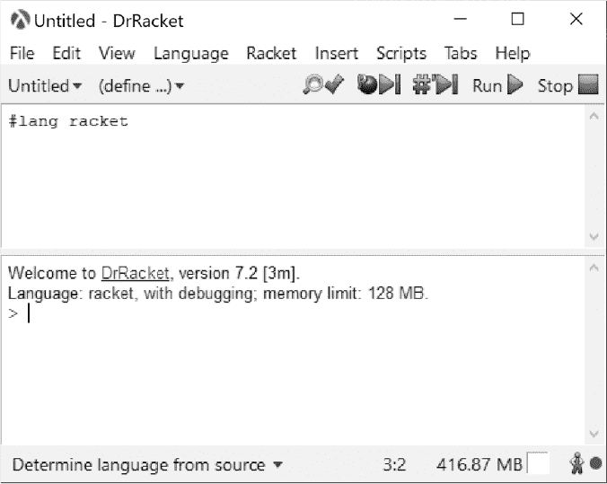

## 前言


在本书中，我们将探讨如何使用 Racket（一种源自 Scheme 家族的编程语言——而 Scheme 又源自 Lisp）以及 DrRacket，这是一种图形化环境，能够让我们充分利用 Racket 的所有功能。该生态系统的一个吸引人的特点是，它配备了大量涵盖各种学科的库。开发者将 Racket 描述为一个“内置电池”的系统，这使它成为互动探索计算机科学和数学中各种主题的理想平台。

鉴于 Racket 的 Lisp 血统，我们如果忽略函数式编程就有失公允，因此本书肯定会探讨这一领域。然而，Racket 绝非单一技巧的语言，因此我们也会在此过程中探讨命令式编程、面向对象编程以及逻辑编程。此外，在计算机科学方面，我们还将研究各种抽象计算机、数据结构，以及与解决一些休闲数学问题相关的搜索算法。最后，我们将通过构建自己的计算器来结束本书，其中包括使用正则表达式进行词法分析，使用扩展巴科斯–诺尔范式（EBNF）定义语法，以及构建递归下降解析器。

#### *Racket*

Racket 拥有广泛且编写良好的文档，其中包括 *Quick: Racket 入门图解*、入门书籍 *Racket Guide* 和详尽的 *Racket Reference*。其他各种工具包和环境也有单独的文档。在 DrRacket 中，这些文档可以通过帮助菜单访问。

Racket 支持多种平台：Windows、Linux、macOS 和 Unix。可以通过链接[*https://download.racket-lang.org/*](https://download.racket-lang.org/)从 Racket 网站下载。下载后，安装过程很简单，只需在 Windows 上运行下载的可执行文件，在 macOS 上运行 *.dmg* 文件，或在 Linux 上运行 shell 脚本。写作时，当前版本为 7.8。书中的示例可以在任何版本 7.0 或更高版本上运行，也可能在早期版本上运行，但由于当前版本可以免费下载，因此其实没必要使用旧版。当第一次启动 DrRacket 环境时，用户将被提示选择一个 Racket 语言变体。本书中的示例使用弹出对话框中的第一个选项（即标有“Racket 语言”的选项）。

DrRacket 窗口提供了一个定义窗格（图 1 中的顶部窗格），用于定义变量和函数，以及一个交互窗格（图 1 中的底部窗格），可以在其中交互式地执行 Racket 代码。在这些窗格内，帮助只需按下一个按键即可。只需点击任何内置函数名称并按下 F1 键。

定义窗口包含了一个强大互动开发环境（IDE）所期望的所有功能，如语法高亮、变量重命名和集成调试器。

Racket 爱好者亲切地被称为 *Racketeers*（听起来很有意思吧？）。一旦你有机会探索这个奇妙的环境，别惊讶自己会成为一个 Racketeer。



*图 1：DrRacket IDE*

#### *本书使用的约定*

DrRacket 支持多种编程和学习语言。在本书中，我们仅关注默认的 Racket 语言。因此，除非另有说明，所有定义文件应以以下行开始：

```
#lang racket
```

在定义部分输入的代码将以框架框起来，如上所示。

在交互面板中输入的表达式将以右尖括号 `>` 为前缀显示，如下所示。尖括号是 DrRacket 的输入提示符。输出将不带尖括号。为了方便区分输入和输出，书中将以粗体显示输入内容（但在 IDE 中输入不会以粗体显示）。

```
> (+ 1 2 3) ; this is an input, the following is an output
6
```

我们偶尔会使用 DrRacket 支持的一些特殊符号，如希腊字母（例如，我们可能会使用 *θ* 作为角度的标识符）。这些符号列在附录 B 中。输入这些符号的方法也在那里给出。如果你手动输入示例而不想使用这些特殊符号，只需替换为你自己选择的名称：例如使用 `alpha` 代替 *α*。

在定义窗口中输入的程序列表示例如下所示。

```
#lang racket

(define (piscis x y r b)
  (let* ([y (- y r)]
         [2r (* 2 r)]
         [yi (sqrt (- (sqr r) (sqr x)))] ; y-intersection
         [π pi]
      ➊ [ϕ (asin (/ yi r))]
      ➋ [θ (- π ϕ)]
      ➌ [path (new dc-path%)])
   (send dc set-brush b)
➍ (send path move-to 0 (- yi))
➎ (send path arc (- x r)     y 2r 2r  θ    (+ π  ϕ))
➏ (send path arc (- (- x) r) y 2r 2r (- ϕ) ϕ)
➐ (send dc draw-path path)))
```

我们将使用 Wingdings 符号，如 ➊，来突出显示代码中的有趣部分。

#### *本书适合谁阅读*

虽然不需要具备 Racket、Lisp 或 Scheme 的先前知识，但拥有一些基本的编程知识会更好，不过这并非必须。数学先决条件会有所不同。某些主题可能会有点挑战性，但假设的数学背景仅限于高中代数和三角学。可能会涉及一两个定理，但处理方式是非正式的。

#### *关于本书*

如果你已经熟悉 Racket 语言，可以跳过（或者只是略读）前几章，因为这些章节仅提供了语言的介绍。这些早期的章节绝不是 Racket 功能的全面百科全书。雄心勃勃的读者应查阅优秀的 Racket 文档以获取更详细的信息。以下是每一章内容的简要描述。

**第一章：Racket 基础** 给初学者提供了学习 Racket 的基本概念，这些概念将帮助你顺利阅读本书的其他章节。

**第二章：算术与其他数值工具** 描述了 Racket 广泛的数值数据类型：整数、真有理数和复数（仅举几例）。这一章将使读者熟练掌握在 Racket 中使用这些实体。

**第三章：函数基础** 介绍了 Racket 的多范式编程能力。本章将向读者介绍函数式编程和命令式编程。最后一部分将介绍一些有趣的编程应用。

**第四章：绘图、绘制和一点集合论** 介绍了交互式图形。大多数 IDE 仅支持文本；DrRacket 在交互式环境中生成图形输出的能力非常强。本章将向你展示如何实现这一点。

**第五章：GUI：让用户感兴趣** 展示了如何构建运行在独立窗口中的迷你图形应用程序。

**第六章：数据** 探讨了在 Racket 中处理数据的各种方法。本章将讨论如何从计算机中的文件读取和写入数据，还将讨论如何使用统计和数据可视化来分析数据。

**第七章：寻找答案** 探讨了多种强大的搜索算法。这些算法将用于解决娱乐数学中的各种问题和谜题。

**第八章：逻辑编程** 探讨了另一种强大的编程范式。在这里，我们将使用 Racket 的类 Prolog 风格的逻辑编程库：Racklog。

**第九章：计算机机器** 简要回顾了各种抽象计算机机器。这些简单的机制是进入计算机科学一些深刻概念的门户。

**第十章：TRAC：Racket 代数计算器** 利用前几章中开发的技能，构建一个独立的交互式命令行计算器。
