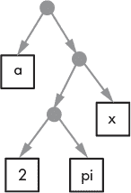
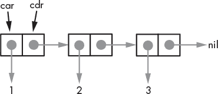
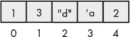

## 第一章：RACKET 基础


让我们从介绍一些 Racket 的基本概念开始。在本章中，我们将介绍一些将在整本书中使用的基本数据类型。你需要特别关注列表的讨论，因为它支撑了 Racket 的大部分功能。我们还将介绍如何给变量赋值以及各种字符串操作方法，在过程中，你将初次接触向量和结构体。最后，本章将讨论如何生成格式化输出。

### 原子数据

*原子数据* 是任何编程语言的基本构建块，Racket 也不例外。原子数据指的是通常被认为是不可分割的基本数据类型；即，像 `123` 这样的数字，像 `"hello there"` 这样的字符串，以及像 `pi` 这样的标识符。数字和字符串求值为其本身；如果被绑定，标识符则会求值为其关联的值：

```
> 123 
123

> "hello there"
"hello there"

> pi
3.141592653589793
```

求值一个未绑定的标识符会导致错误。为了防止未绑定的标识符被求值，你可以在它前面加上撇号：

```
> alpha
. . alpha: undefined;
  cannot reference an identifier before its definition

> 'alpha
'alpha
```

我们可以使用列表将原子数据组织在一起，接下来会介绍列表。

### 列表

在 Racket 中，列表是主要的非原子数据结构（即，除了数字、字符串等之外的其他东西）。Racket 依赖列表的原因之一是它是 *Lisp*（LISt Processing，列表处理）的后代。在深入细节之前，让我们看一些简单的示例。

#### *初探列表*

这是创建一个包含一些数字的列表的方法：

```
> (list 1 2 3)
```

注意语法。列表通常以一个开括号 `(` 开始，接着是由空格分隔的元素列表，最后以闭括号 `)` 结束。列表中的第一个元素通常是一个标识符，用来指示该列表如何被求值。

列表也可以包含其他列表。

```
> (list 1 (list "two" "three") 4 5)
```

它打印为

```
'(1 ("two" "three") 4 5)
```

注意最后一个示例中开头的撇号（或反引号）。这是 `quote` 关键字的别名。如果你想输入一个字面量列表（即一个按原样接受的列表），你可以将其*引用*：

```
> (quote (1 ("two" "three") 4 5))
```

或者

```
> '(1 ("two" "three") 4 5)
```

其中任何一个都打印为

```
'(1 ("two" "three") 4 5)
```

虽然 `list` 和 `quote` 看起来是构建列表的两种等效方式，但它们之间有一个重要的区别。以下示例演示了这个区别。

```
> (quote (3 1 4 pi))
'(3 1 4 pi)

> (list 3 1 4 pi)
'(3 1 4 3.141592653589793)
```

注意，`quote` 会返回输入的列表内容，而当使用 `list` 时，标识符 `pi` 被求值并用其值替代。通常，在一个非引用的列表中，*所有* 标识符都会被求值并替换为其对应的值。关键字 `quote` 在宏和符号表达式求值中扮演重要角色，这些是高级主题，我们在本书中不予讨论。

Lisp 系列语言的一个批评点是括号的过多。为了解决这个问题，Racket 允许使用方括号或花括号代替圆括号。例如，最后一个表达式完全可以写成：

```
> '(1 ["two" "three"] 4 5)
```

或者

```
> '(1 {"two" "three"} 4 5)
```

#### *S 表达式*

列表是称为 *s-表达式* 的事物的一种特殊情况。s-表达式（或符号表达式）被定义为两种情况之一：

**案例 1** s-表达式是一个原子。

**案例 2** s-表达式是形如 `(x . y)` 的表达式，其中 *x* 和 *y* 是其他 s-表达式。

形式 `(x . y)` 通常称为 *对*。这是一种特殊的语法形式，用来指定一个 *cons* 单元，我们将很快详细讨论这个内容。

让我们看看能否构造一些 s-表达式的例子。嗯，`1` 怎么样？是的，它是一个原子，因此符合案例 1。`"spud"` 呢？没错，字符串是原子，因此 `"spud"` 也是一个 s-表达式。我们可以将这些组合起来形成另一个 s-表达式：`(1 . "spud")`，它符合案例 2。由于 `(1 . "spud")` 是一个 s-表达式，案例 2 允许我们再形成另一个 s-表达式：`((1 . "spud") . (1 . "spud"))`。从中我们可以看出，s-表达式实际上是类似树状的结构，如 图 1-1 所示。（严格来说，s-表达式形成了一个 *二叉树*，其中非叶节点有恰好两个子节点。）



*图 1-1：`((a . (2 . pi) . x))`*

在 图 1-1 中，方框是表示原子的叶节点，圆形节点表示对。接下来我们将看到 s-表达式如何用于构建列表。

#### *列表结构*

如上所述，列表是 s-表达式的一种特殊情况。不同之处在于，在一个列表中，如果我们跟踪每个对中的最右边元素，最终的节点是一个特殊的原子节点，称为 *nil*。图 1-2 展示了列表 `'(1 2 3)`——作为一个 s-表达式是 `(1 . (2 . (3 . nil)))`——在内部的样子。



*图 1-2：列表结构*

我们已经将树状结构展平，以便更像一个列表。我们还展开了每个对节点（也就是 *cons 单元*），以显示它包含两个单元，每个单元包含指向另一个节点的指针。这些指针单元，出于历史原因，分别被称为 *car* 和 *cdr*（它们是 Lisp 早期版本中使用的计算机寄存器的名称）。我们可以看到，列表中的最后一个 cdr 单元指向 nil。Nil 在 Racket 中由空列表表示：`()` 或 `null`。

可以通过使用 `cons` 函数直接创建 cons 单元。注意，`cons` 函数不一定创建一个列表。例如：

```
> (cons 1 2)
'(1 . 2)
```

它生成一个对，但 *不是* 一个列表。然而，如果我们使用一个空列表作为第二个 s-表达式：

```
> (cons 1 '())
'(1)
```

我们生成一个只有一个元素的列表。

Racket 提供了几个函数来测试某个元素是否是列表或对。在 Racket 中，`#t` 表示真，`#f` 表示假：

```
> (pair? (cons 1 2))
#t

> (list? (cons 1 2))
#f

> (pair? (cons 1 '()))
#t

> (list? (cons 1 '()))
#t
```

从中我们可以看出，列表始终是一个对，但反过来并不总是成立：一对并不总是一个列表。

通常，`cons` 用于将一个原子值添加到列表的开头，如下所示：

```
> (cons 1 '(2 3))
'(1 2 3)
```

Racket 提供了专门的函数来访问 cons 单元的组成部分。`car` 函数返回由 car 指针指向的元素，`cdr` 函数则返回由 cdr 指针指向的元素。在 Racket 中，`first` 和 `rest` 函数与 `car` 和 `cdr` 类似，但它们不是这两个函数的别名，因为它们仅适用于列表。下面给出了一些示例。

```
> (car '(1 ("two" "three") 4 5))
1

> (first '(1 ("two" "three") 4 5))
1

> (cdr '(1 ("two" "three") 4 5))
'(("two" "three") 4 5)

> (rest '(1 ("two" "three") 4 5))
'(("two" "three") 4 5)
```

列表元素也可以通过 `second`、`third` 等函数进行访问。

```
> (first '(1 2 3 4))
1

> (second '(1 2 3 4))
2

> (third '(1 2 3 4))
3
```

最后，可以使用 `list-ref` 提取任意位置的值。

```
> (list-ref '(a b c) 0)
'a

> (list-ref '(a b c) 1)
'b
```

`list-ref` 函数接受一个列表和你想要的值的索引，列表作为第一个参数。请注意，Racket 使用 *从零开始的索引*，这意味着在任何值序列中，第一个值的索引为 0，第二个值的索引为 1，以此类推。

#### *一些有用的列表函数*

让我们快速回顾一些有用的列表函数。

##### 长度

要获取列表的长度，你可以使用 `length` 函数，像这样：

```
> (length '(1 2 3 4 5))
5
```

##### 反转

如果你需要将列表中的元素反转，可以使用 `reverse` 函数。

```
> (reverse '(1 2 3 4 5)) ; reverse elements of a list
'(5 4 3 2 1)
```

##### 排序

`sort` 函数将对列表进行排序。你可以传入 `<` 来将列表按升序排序：

```
> (sort '(1 3 6 5 7 9 2 4 8) <) 
'(1 2 3 4 5 6 7 8 9)
```

或者，如果你传入 `>`，它将按降序排序列表：

```
> (sort '(1 3 6 5 7 9 2 4 8) >)
'(9 8 7 6 5 4 3 2 1)
```

##### 追加

要将两个列表合并在一起，可以使用 `append` 函数：

```
> (append '(1 2 3) '(4 5 6)) 
'(1 2 3 4 5 6)
```

`append` 函数可以接受多个列表：

```
> (append '(1 2) '(3 4) '(5 6)) 
'(1 2 3 4 5 6)
```

##### 范围

`range` 函数将根据一些参数创建一个数字列表。你可以传入一个起始值和一个结束值，以及一个步进值：

```
> (range 0 10 2)
'(0 2 4 6 8)
```

或者，如果你只传入一个结束值，它将从 0 开始，步进为 1：

```
> (range 10)
'(0 1 2 3 4 5 6 7 8 9)
```

##### 创建列表

创建列表的另一种方式是使用 `make-list` 函数：

```
> (make-list 10 'me)
'(me me me me me me me me me me)
```

如你所见，`make-list` 接受一个数字和一个值，并创建一个包含该值，且该值重复指定次数的列表。

##### 空?

要测试一个列表是否为空，可以使用 `null?` 函数：

```
> (null? '()) ; test for empty list
#t
> (null? '(1 2 3))
#f
```

##### 索引值

如果你需要在列表中查找一个值，可以使用 `index-of`。如果该值存在，它将返回该值的索引：

```
> (index-of '(8 7 1 9 5 2) 9)
3
```

如果没有，它将返回 `#f`：

```
> (index-of '(8 7 1 9 5 2) 10)
#f
```

##### 成员

另一种搜索列表的方法是使用 `member`，它测试一个列表是否包含某个特定元素的实例。如果没有，返回符号 `#f`；如果有，则返回从第一个匹配元素开始的列表尾部。

```
> (member 7 '(9 3 5 (6 2) 5 1 4))
#f

> (member 5 '(9 3 5 (6 2) 5 1 4))
'(5 (6 2) 5 1 4)

> (member 6 '(9 3 5 (6 2) 5 1 4))
#f
```

请注意，在最后一个例子中，尽管 6 是被搜索列表的一个子列表中的成员，`member` 函数仍然返回了 false。然而，以下的做法是有效的。

```
> (member '(6 2) '(9 3 5 (6 2) 5 1 4))
'((6 2) 5 1 4)
```

稍后你会看到，在函数式编程中，你常常需要判断一个元素是否包含在列表中。`member` 函数不仅能找到该元素（如果它存在），还会返回实际的值，以便在后续计算中使用。

在接下来的内容中，我们将对列表进行更多的讲解。

### 定义、赋值和变量

到目前为止，我们已经见过一些*函数*的例子，函数是接受一个或多个输入值并提供一个输出值（某种形式的数据）。函数调用表达式中的第一个元素是标识符（函数名）。函数形式中的其余元素是函数的参数。这些元素会被逐一评估，然后传递给函数，函数对其参数执行某些操作并返回一个值。

更具体来说，一个*形式*或*表达式*可以定义一个函数，执行一个函数调用，或仅仅返回一个结构（通常是一个列表），并且可能会或可能不会评估它的所有参数。请注意，`quote` 是一种不同类型的形式（与评估其参数的函数形式不同），因为它*不会*首先评估其参数。在下一节中，你将见到 `define`，它是另一种形式，因为它不会评估其第一个参数，但会评估其第二个参数。随着文本的推进，我们将会见到许多其他类型的形式。

*变量*是一个值的占位符。在 Racket 中，变量通过*标识符*（特定的字符序列）来指定，每个标识符只与一个事物关联。（稍后我们将详细讨论什么构成有效的标识符。）要定义一个变量，你使用 `define` 形式。例如：

```
> (define a 123)
> a
123
```

在这里，`define` 被用来*绑定*值 `123` 到标识符 `a`。几乎任何东西都可以绑定到一个变量。这里我们将绑定一个列表到标识符 `b`。

```
> (define b '(1 2 3))
> b
'(1 2 3)
```

可以并行绑定多个变量：

```
> (define-values (x y z) (values 1 2 3))

> x
1

> y
2

> z
3
```

Racket 区分*定义*变量和*赋值*变量。赋值通过 `set!` 表达式进行。通常，任何改变或*变更*一个值的形式都会以感叹号结尾。试图赋值给一个未曾定义的标识符会导致一个难看的错误信息：

```
> (set! ice 9)
. . set!: assignment disallowed;
  cannot set variable before its definition
  variable: ice
```

但这是可以的：

```
> (define ice 9)
> ice
9
> (set! ice 32)
32
```

一种理解方式是，`define` 设置了一个存储值的位置，而 `set!` 只是将一个新值放入先前定义的位置。

当我们谈到在 Racket 代码中定义的变量 *x* 时，它将被排版为 `x`。如果我们仅仅在数学意义上讨论该变量，它将以斜体形式排版为 *x*。

### 符号、标识符和关键字

与大多数语言不同，Racket 允许几乎任何字符串用作标识符。例如，我们可以使用 `2x3` 作为标识符：

```
> (define 2x3 7)
> 2x3
7
```

你可以设想定义一个名为`rags->riches`的函数，它将破衣服变成财富（告诉我你完成后是如何实现的）。这一切看起来很奇怪，但它赋予 Racket 一种许多其他编程语言所没有的表达能力。当然，这其中有一些限制，但除了少数特殊字符，如圆括号、方括号和算术运算符（即使这些通常也没问题，只要它们不是第一个字符），几乎任何东西都可以使用。事实上，看到包含连字符的标识符（如`solve-for-x`）是很常见的。

一个*符号*本质上就是一个带引号的标识符：

```
> 'this-is-a-symbol
'this-is-a-symbol
```

它们有点像二等字符串（下面会详细介绍字符串）。它们通常像其他编程语言中的`enum`一样使用，用来表示特定的值。

一个*关键字*是一个以#`:`为前缀的标识符。关键字主要用于在函数调用中标识可选参数。这里是一个函数（˜`r`）的例子，它使用关键字将*π*以两位小数的字符串形式输出。

```
> (~r pi #:precision 2)
"3.14"
```

这里我们定义了可选的`precision`参数，用来指定`pi`的值应该四舍五入到两位小数。

### 相等性

Racket 定义了两种不同的相等性：看起来完全相同的东西和实际上是同一个东西。下面是它们的区别。假设我们做以下两个定义。

```
> (define a '(1 2 3))
> (define b '(1 2 3))
```

标识符`a`和`b`看起来完全一样，如果我们询问 Racket 它们是否相同，使用`equal?`谓词，它会回答它们是相同的。注意，*谓词*是一个返回布尔值（真或假）的函数。

```
> (equal? a b)
#t
```

但如果我们使用`eq?`谓词来询问它们是否是同一个东西，我们会得到不同的答案。

```
> (eq? a b)
#f
```

那么，什么时候`eq?`返回`true`呢？这里有一个例子。

```
> (define x '(1 2 3))
> (define y x)
> (eq? x y)
#t
```

在这种情况下，我们将`x`绑定到列表`(1 2 3)`。然后，我们将`y`绑定到与`x`绑定的相同*位置*，有效地使`x`和`y`绑定到相同的内容。这个差异微妙但重要。在大多数情况下，`equal?`是你需要的，但也有一些场景使用`eq?`来确保变量绑定到相同的对象，而不仅仅是绑定到*看起来*相同的东西。

另一个必须讨论的相等性细微差别是数字相等性。在上面的讨论中，我们关注的是结构相等性。数字是另一种情况。我们将在下一章详细讨论数字，但我们需要澄清一些与数字相等性相关的事项。请检查以下序列：

```
> (define a  123)
> (define b  123)
> (eq? a b)
#t
```

上面我们将 `a` 和 `b` 绑定到相同的列表 '`(1 2 3)`，在这种情况下 `eq?` 返回了 false。在这个例子中，我们将 `a` 和 `b` 绑定到相同的数字 `123`，`eq?` 返回了 true。数字（严格来说是*fixnums*，即适合存储在固定存储空间中的小整数——通常是 32 位或 64 位，具体取决于计算平台）在这方面是独一无二的。每个数字只有一个实例，不管它绑定了多少不同的标识符。换句话说，每个数字都存储在唯一的一个位置。此外，还有一个特殊的谓词 (=)，只能用于数字：

```
> (= 123 123)
#t

> (= 123 456)
#f

(= '(1 2 3) '(1 2 3))
. . =: contract violation
  expected: number?
  given: '(1 2 3)
  argument position: 1st
  other arguments...:
```

在本节中，我们仅覆盖一般的相等性。我们将在下一章详细讨论数值比较的更多细节。

### 字符串与其他元素

在本节中，我们将探讨 Racket 中处理文本值的不同方式。我们将从最简单的文本值类型开始。

#### *字符*

单个文本值，例如单个字母，使用*字符*表示，字符是一个特殊实体，对应于*Unicode*值。例如，字母 A 对应的 Unicode 值是 65\。Unicode 值通常以十六进制指定，因此 A 的 Unicode 值为 65[10] = 0041[16]。字符值要么以 #\ 开头，后跟一个字面键盘字符，要么以 #\`u` 开头，后跟一个 Unicode 值。

下面是使用字符函数编写字符的多种方式。注意使用了注释字符（`;`），它允许将注释（非编译文本）添加到 Racket 代码中。

```
> #\A
#\A

> #\u0041
#\A

> #\   ; this is a space character
#\space

> #\u0020  ; so is this
#\space

> (char->integer #\u0041)
65

> (integer->char 65)
#\A

> (char-alphabetic? #\a)
#t

> (char-alphabetic? #\1)
#f

> (char-numeric? #\1)
#t

> (char-numeric? #\a)
#f
```

Unicode 支持广泛的字符集。这里有一些示例：

```
> '(#\u2660 #\u2663 #\u2665 #\u2666)
'(#♠ #♣ #♡ #♢)

> '(#\u263A #\u2639 #\u263B)
'(\#☺ \#☹ \#☻)

> '(#\u25A1 #\u25CB #\u25C7)
'(\#□ \#◯ \#◇)
```

大多数 Unicode 字符应该能够正常打印，但这在一定程度上取决于你计算机上可用的字体。

##### 字符串

一个*字符串*通常由一系列键盘字符组成，并被双引号字符包围。

```
> "This is a string."
"This is a string."
```

Unicode 字符可以嵌入到字符串中，但在这种情况下，前导的 `#` 会被省略。

```
> "Happy: \u263A."
"Happy: ☺."
```

你也可以使用 `string-append` 将两个字符串连接起来，创建一个新的字符串。

```
> (string-append "Luke, " "I am " "your father!")
"Luke, I am your father!"
```

要访问字符串中的字符，使用 `string-ref`：

```
> (string-ref "abcdef" 2)
#\c
```

字符串中每个字符的位置从 0 开始编号，因此在这个例子中，使用索引 2 实际上返回的是第三个字符。

到目前为止，我们看到的字符串是不可变的。要创建一个可变字符串，请使用 `string` 函数。这允许在字符串中修改字符。

```
> (define wishy-washy (string #\I #\  #\a #\m #\  #\m #\u #\t #\a #\b #\l #\e)
    )
> wishy-washy
"I am mutable"

> (string-set! wishy-washy 5 #\a)
> (string-set! wishy-washy 6 #\ ) 

> wishy-washy
"I am a table"
```

注意，对于可变字符串，我们必须使用单个字符来定义字符串。

创建可变字符串的另一种方式是使用 `string-copy`：

```
> (define mstr (string-copy "I am also mutable"))
> (string-set! mstr 5 #\space)
> (string-set! mstr 6 #\space)
> mstr
"I am   so mutable"
```

你也可以使用 `make-string` 来做同样的事情：

```
> (define exes (make-string 10 #\X))
> (string-set! exes 5 #\O)
> exes
"XXXXXOXXXX"
```

根据需要，以上任何一个都可能是优选项。如果你需要让现有的字符串变为可变的，`string-copy` 是显而易见的选择。如果你只想要一个空格字符串，`make-string` 是明确的赢家。

#### *有用的字符串函数*

当然，还有许多其他有用的字符串函数，接下来我们将展示其中的一些。

##### 字符串长度

`string-length`函数输出字符串中的字符数（请参见之前在第 14 页“字符串”中的`wishy-washy`）。

```
> (string-length wishy-washy)
12
```

##### substring

`substring`函数从给定的字符串中提取子字符串。

```
> (substring wishy-washy 7 12) ; characters 7-11
"table"
```

##### string-titlecase

使用`string-titlecase`将字符串中每个单词的首字母大写。

```
> (string-titlecase wishy-washy)
"I Am A Table"
```

##### string-upcase

要将字符串输出为大写形式，请使用`string-upcase`：

```
> (string-upcase "big")
"BIG"
```

##### string-downcase

相反，对于小写字符串，使用`string-downcase`：

```
> (string-downcase "SMALL")
"small"
```

##### string<=?

要进行字母比较，请使用`string<=?`函数：

```
> (string<=? "big" "small")  ; alphabetical comparison
#t
```

##### string=?

`string=?`函数用于测试两个字符串是否相等：

```
> (string=? "big" "small")
#f
```

##### string-replace

`string-replace`函数用于将字符串的部分内容替换为另一个字符串：

```
> (define darth-quote "Luke, I am your father!")
> (string-replace darth-quote "am" "am not")
"Luke, I am not your father!"
```

##### string-contains?

要测试一个字符串是否包含在另一个字符串中，请使用`string-contains?`：

```
> (string-contains? darth-quote "Luke")
#t

> (string-contains? darth-quote "Darth")
#f
```

##### string-split

`string-split`函数可用于将字符串拆分为多个标记：

```
> (string-split darth-quote)
'("Luke," "I" "am" "your" "father!")

> (string-split darth-quote ",")
'("Luke" " I am your father!")
```

请注意，上面的第一个示例使用了默认版本，它会根据空格拆分，而第二个版本明确使用了逗号（,）。

##### string-trim

`string-trim`函数用于去除字符串的前导和/或尾随空格：

```
> (string-trim "  hello   ")
"hello"

> (string-trim "  hello   " #:right? #f)
"hello   "

> (string-trim "  hello   " #:left? #f)
"  hello"
```

请注意，在最后两个版本中，`#:left?`或`#:right?`用于禁止修剪对应一侧的内容。最后的`#f`参数（默认值）用于指定每一侧只去掉一个匹配项；否则，所有的前导或尾随匹配项都会被去掉。

更多高级字符串功能，请参见第 279 页的“正则表达式”。

#### *字符串转换和格式化函数*

有许多函数可以将值转换为字符串或从字符串转换。它们的名称都很直观，下面有相关示例。

```
> (symbol->string 'FBI)
"FBI"

> (string->symbol "FBI")
'FBI

> (list->string '(#\x #\y #\z))
"xyz"

> (string->list "xyz")
'(#\x #\y #\z)

> (string->keyword "string->keyword")
'#:string->keyword

> (keyword->string '#:keyword)
"keyword"
```

要查看完整的列表，请访问[*https://docs.racket-lang.org/reference/strings.html*](https://docs.racket-lang.org/reference/strings.html)。

一个方便的函数用于在字符串中嵌入其他值的是`format`。

```
> (format "let ~a = ~a" "x" 2)
"let x = 2"
```

在格式化语句中，˜`a`充当占位符。每个额外的参数应该有一个占位符。请注意，数字 2 在嵌入到输出字符串中之前会自动转换为字符串。

如果你想简单地将数字转换为字符串，请使用`number->string`函数：

```
> (number->string pi)
"3.141592653589793"
```

相反：

```
> (string->number "3.141592653589793")
3.141592653589793
```

尝试让 Racket 将单词的值转换为数字是行不通的：

```
> (string->number "five")
#f
```

对于更多的控制，可以使用在*racket/format*库中定义的˜`r`函数，它提供了多种选项，可以将数字转换为字符串并控制数字的精度及其他输出特性。例如，要显示*π*到四位小数，可以使用以下方式：

```
> (~r pi #:precision 4)
"3.1416"
```

要将其右对齐，在 20 个字符宽的字段中并用句点填充左侧，可以执行以下操作：

```
> (~r pi #:min-width 20 #:precision 4 #:pad-string ".")
"..............3.1416"
```

关于 ˜`r` 的更多信息，请参见附录 A，该附录讨论了数字基数。还有许多其他有用的波浪符前缀字符串转换函数，如 ˜`a`、˜`v` 和 ˜`s`。我们这里不做详细讨论，但你可以查阅 Racket 文档了解更多信息：[ *https://docs.racket-lang.org/reference/strings.html*](https://docs.racket-lang.org/reference/strings.html)。

### 向量

向量看起来与列表有些相似，但实际上它们大不相同。与列表的内部树结构不同，*向量*是一个顺序数组（类似于命令式语言中的数组），直接包含值，如图 1-3 所示。



*图 1-3：向量结构*

向量可以通过 `vector` 函数来输入。

```
> (vector 1 3 "d" 'a 2)
'#(1 3 "d" a 2)
```

另外，向量可以通过使用 `#` 来输入，如下所示（请注意，未加引号的 `#` 表示一个引用）：

```
> #(1 3 "d" a 2)
'#(1 3 "d" a 2)
```

需要注意的是，这些方法是 *不* 等价的。以下是一个原因：

```
> (vector 1 2 pi)
'#(1 2 3.141592653589793)

> #(1 2 pi)
'#(1 2 pi)
```

在第一个示例中，就像 `list` 一样，`vector` 会先评估它的参数，然后再形成向量。在最后一个示例中，像 `quote` 一样，`#` 不会评估它的参数。更重要的是，`#` 是 `vector-immutable` 的别名，这也引出了我们下一个话题。

#### *访问向量元素*

函数 `vector-ref` 是一个索引操作符，用于返回向量的元素。该函数将一个向量作为第一个参数，一个索引作为第二个参数：

```
> (define v (vector 'alpha 'beta 'gamma))
> (vector-ref v 1)
'beta

> (vector-ref v 0)
'alpha
```

要给向量单元赋值，使用 `vector-set!`。`vector-set!` 表达式接受三个参数：一个向量、一个索引和一个要赋给该索引位置的值。

```
> (vector-set! v 2 'foo)
> v
'#(alpha beta foo)
```

我们来尝试一种不同的方式：

```
> (define u #(alpha beta gamma))
> (vector-set! u 2 'foo)
. . vector-set!: contract violation
  expected: (and/c vector? (not/c immutable?))
  given: '#('alpha 'beta 'gamma)
  argument position: 1st
  other arguments...:
```

记住，`#` 是 `vector-immutable` 的别名。这意味着通过 `#`（或 `vector-immutable`）创建的向量是（敲锣打鼓。。。）*不可变的*：它们不能被更改或赋予新值。另一方面，通过 `vector` 创建的向量是 *可变的*，意味着它们的单元可以被修改。

向量相对于列表的一个优势是，向量的元素可以比列表的元素访问得更快。这是因为要访问列表的第 100 个元素，必须按顺序访问列表中的每个单元，直到达到第 100 个元素。相反，对于向量，可以直接访问第 100 个元素，而无需遍历之前的单元。另一方面，列表非常灵活，可以轻松扩展，还可以用来表示其他数据结构，如树。它们是 Racket（以及所有基于 Lisp 的语言）的核心，因此语言的大部分功能依赖于列表结构。可预见地，提供了将两者相互转换的函数。

#### *常用的向量函数*

##### 向量长度

`vector-length` 函数返回向量中元素的数量：

```
> (vector-length #(one ringy dingy))
3
```

##### 向量排序

`vector-sort` 函数对向量的元素进行排序：

```
> (vector-sort #(9 1 3 8 2 5 4 0 7 6 ) <)
'#(0 1 2 3 4 5 6 7 8 9)

> (vector-sort #(9 1 3 8 2 5 4 0 7 6 ) >)
'#(9 8 7 6 5 4 3 2 1 0)
```

为了激发你对后面内容的兴趣，`vector-sort` 是函数式编程的典型例子。最后一个参数实际上会评估一个函数，用来确定排序的方向。

##### vector->list

`vector->list` 函数将一个向量转换为一个列表：

```
>  (vector->list #(one little piggy))
'(one little piggy)
```

##### list->vector

相反，`list->vector` 将一个列表转换为向量：

```
> (list->vector '(two little piggies))
'#(two little piggies)
```

##### make-vector

要创建一个可变向量，使用 `make-vector` 形式：

```
> (make-vector 10 'piggies) ; create a mutable vector
'#(piggies piggies piggies piggies piggies piggies piggies piggies piggies
     piggies)
```

##### vector-append

要将两个向量连接在一起，使用 `vector-append`：

```
> (vector-append #(ten little) #(soldier boys))
'#(ten little soldier boys)
```

##### vector-member

`vector-member` 函数返回项目在向量中的索引位置：

```
> (vector-member 'waldo (vector 'where 'is 'waldo '?) )
2
```

当然，还有许多其他有用的向量函数，我们将在接下来的章节中探索其中的一些。

### 使用结构体

为了介绍下一个 Racket 特性，让我们构建一个示例程序。你可以用 Racket 创建一个电子版的支票簿，而不是在纸质银行本上记录交易。通常，这样的交易包含以下组件：

+   交易日期

+   收款人

+   支票号码

+   金额

跟踪这些不同信息的一个方法是使用 Racket 结构体，称为 `struct`。Racket 中的 `struct` 概念上类似于 C 或 C++ 等语言中的 `struct`。它是一种复合数据结构，包含一组预定义的字段。在使用 `struct` 之前，必须告诉 Racket 它的样子。对于我们的银行交易示例，这样的定义可能是这样的：

```
> (struct transaction (date payee check-number amount))
```

结构的每个组件（`date`、`payee` 等）都称为*字段*。一旦我们定义了 `transaction struct`，我们可以像这样创建一个：

```
> (define trans (transaction 20170907 "John Doe" 1012 100.10))
```

Racket 会自动为结构中的每个字段创建一个*访问器方法*。访问器方法返回字段的值。它们总是以结构体的名称（在本例中为 `transaction`）、连字符和字段名开头。

```
> (transaction-date trans)
20170907

> (transaction-payee trans)
"John Doe"

> (transaction-check-number trans)
1012

> (transaction-amount trans)
100.1
```

假设你犯了个错误，发现支付给 John Doe 的支票应该是 $100.12 而不是 $100.10，并尝试通过 `set-transaction-amount!` 来修正它。注意感叹号：这是一个信号，表示 `set-transaction-amount!` 是一个*变异器*，即修改字段值的方法。这些变异器在定义结构时生成，通常以 `set` 开头并以 `!` 结尾。

```
> (set-transaction-amount! trans 100.12)
. . set-transaction-amount!: undefined;
  cannot reference an identifier before its definition
```

哎呀。。。结构体中的字段默认是不可变的，因此不会导出*变异器*。解决方法是在结构定义中为需要修改的字段包含 `#:mutable` 关键字。

```
> (struct transaction 
    (date payee check-number [amount #:mutable]))
> (define trans (transaction 20170907 "John Doe" 1012 100.10))
> (set-transaction-amount! trans 100.12)
> (transaction-amount trans)
100.12
{
```

如果所有字段都应是可变的，可以在字段列表后添加 `#:mutable` 关键字。

```
> (struct transaction 
    (date payee check-number amount) #:mutable)
> (define trans (transaction 20170907 "John Doe" 1012 100.10))
> (set-transaction-check-number! trans 1013)
> (transaction-check-number trans)
1013
```

虽然访问器方法足以获取单个字段的值，但它们在查看所有值时有些繁琐。仅输入结构名称并不会提供太多信息。

```
> trans
#<transaction>
```

为了使你的结构更加透明，在 `struct` 定义中包含 `#:transparent` 选项。

```
> (struct transaction 
    (date payee check-number amount) #:mutable #:transparent)
> (define trans (transaction 20170907 "John Doe" 1012 100.10))
> trans
(transaction 20170907 "John Doe" 1012 100.1)
```

在定义结构时，有一些额外的有用选项，其中一个特别值得关注的是 `#:guard`。`#:guard` 提供了一种机制，用于在构造结构时验证字段。例如，为了确保不使用负的支票号，我们可以采取以下措施。

```
> (struct transaction 
    (date payee check-number amount)
    #:mutable #:transparent
    #:guard (λ (date payee num amt name)
        (unless (> num 0) 
        (error "Not a valid check number"))
        (values date payee num amt)))

> (transaction 20170907 "John Doe" -1012 100.10)
Not a valid check number

> (transaction 20170907 "John Doe" 1012 100.10)
(transaction 20170907 "John Doe" 1012 100.1)
```

别慌张。我们还没有介绍那个看起来有点奇怪的符号（*λ*，或 *lambda*），但你应该能理解发生了什么。`#:guard` 表达式是一个函数，它为每个字段接受一个参数，并且还有一个额外的参数，包含结构的名称。在这个例子中，我们只是测试支票号是否大于零。`#:guard` 表达式必须返回与 `struct` 中字段数量相同的值。

在前面的例子中，我们只是返回了输入的相同值，但假设我们有一个变量保存了最后的支票号，叫做 `last-check`。在这种情况下，我们可以输入 0 作为支票号，并使用 `#:guard` 表达式插入下一个可用的号码，如下所示。

```
> (define last-check 1000)

> (struct transaction 
    (date payee check-number amount)
    #:mutable #:transparent
    #:guard (λ (date payee num amt name)
              (cond
                [(< num 0)
                   (error "Not a valid check number")]
                [(= num 0)
                   (let ([next-num (add1 last-check)])
                     (set! last-check next-num)
                     (values date payee next-num amt))]
                [else 
                   (set! last-check num)
                   (values date payee num amt)])))

> (transaction 20170907 "John Doe" 0 100.10)
(transaction 20170907 "John Doe" 1001 100.1)

> (transaction 20170907 "Jane Smith" 1013 65.25)
(transaction 20170907 "Jane Smith" 1013 65.25)

> (transaction 20170907 "Acme Hardware" 0 39.99)
(transaction 20170907 "Acme Hardware" 1014 39.99)
```

如你所见，非零的支票号被存储为最后的支票号，但如果输入了零作为支票号，`struct` 值将使用下一个可用的号码生成，这个号码成为 `last-check` 的当前值。`cond` 语句将在本书稍后详细解释，但它在这里的使用应该相当清晰：它是用来检查多个情况的一种方式。

### 控制输出

在交互面板中，DrRacket 会立即显示评估任何表达式后的输出。通常我们希望对输出的呈现方式进行一定控制。当输出是由某个函数或方法生成时，这一点尤其重要。Racket 提供了多种生成格式化输出的机制。主要的形式有 `write`、`print` 和 `display`。每种方式的工作方式略有不同。最好的说明方法是通过示例。

##### write

`write` 表达式的输出方式使得输出值形成一个有效的值，这个值可以在输入中使用：

```
> (write "show me the money")
"show me the money"

> (write '(show me the money))
(show me the money)

> (write #\A)
#\A

> (write 1.23)
1.23

> (write 1/2)
1/2

> (write #(a b c))
#(a b c)
```

##### display

`display` 表达式与 `write` 类似，但字符串和字符数据类型会原样输出，不会添加任何修饰符，如引号或反引号：

```
> (display "show me the money")
show me the money

> (display '(show me the money))
(show me the money)

> (display #\A)
A

> (display 1.23)
1.23

> (display 1/2)
1/2

> (display #(a b c))
#(a b c)
```

##### print

`print` 表达式也类似于 `write`，但它为输出添加了一些额外的格式化。`print` 的目的是展示一个表达式，该表达式在计算后会得到与打印的值相同的结果：

```
> (print "show me the money")
"show me the money"

> (print '(show me the money))
'(show me the money)

> (print #\A)
#\A

> (print 1.23)
1.23

> (print 1/2)
1
-
2

> (print #(a b c))
'#(a b c)
```

注意理性数值 `1/2` 是如何被打印的（关于有理数的内容将在下一章讲解）。

每种表达式都有一个以 `ln` 结尾的形式。唯一的区别是，带有 `ln` 结尾的会自动在输出末尾打印一个新行。以下是几个例子来突出这个区别。

```
> (print "show me ") (print "the money")
"show me ""the money"

> (display "show me ") (display "the money")
show me the money

> (println "show me ") (println "the money")
"show me "
"the money"

> (displayln "show me ") (displayln "the money")
show me 
the money
```

一个非常有用的形式是`printf`。`printf`表达式的工作方式类似于`format`函数：它将一个格式字符串作为第一个参数，其他值作为随后的参数。格式字符串使用˜`a`作为占位符。格式字符串之后的每个参数必须对应一个占位符。格式字符串会按输入的方式打印，唯一的例外是每个占位符会被相应的参数替换。下面是`printf`的示例。

```
> (printf "~a + ~a = ~a" 1 2 (+ 1 2))
1 + 2 = 3

> (printf "~a, can you hear ~a?" "Watson" "me")
Watson, can you hear me?

> (printf "~a, can you hear ~a?" "Jeeves" "the bell")
Jeeves, can you hear the bell?
```

有一些额外的格式说明符（详细信息请参阅 Racket 文档），但我们主要使用`print`，因为它能更好地视觉化输出值的数据类型。

### 摘要

在本章中，我们为接下来的内容奠定了基础。大多数核心数据类型已被介绍，并附有一些希望能帮助理解的示例。到目前为止，你应该已经对基础的 Racket 语法感到熟悉，并且对列表的结构以及如何操作它们有了相当好的理解。下一章将详细讲解 Racket 提供的各种数字数据类型。
