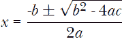

## 第二章：算术及其他数值附属物


在本章中，我们将探讨 Racket 提供的丰富数值数据类型。我们将发现常见的整数和浮点值，但我们也会了解到 Racket 支持有理数（或分数）以及复数（即使你不清楚复数是什么，也没关系；它在本文中并不会大量使用，但我们简要介绍一下，以供感兴趣的人参考）。

### 布尔值

*布尔值*是表示真和假的值，尽管它们严格来说不是数字，但它们的行为有点像数字，因为可以通过各种运算符将它们组合成其他布尔值。统领这些运算的学科被称为*布尔代数*。在 Racket 中，布尔值由`#t`和`#f`表示，分别代表真和假。也可以使用`#true`（或`true`）和`#false`（或`false`）作为`#t`和`#f`的别名。

在介绍具体的布尔运算符之前，一个关于 Racket 布尔运算符的一般性重要观察是：它们通常将任何非`#f`的值视为 true。你将在下面看到一些这种行为的示例。

我们将要讨论的第一个运算符是`not`，它简单地将`#t`转换为`#f`，反之亦然。

```
> (not #t)
#f

> (not #f)
#t

> (not 5)
#f
```

注意到`5`被转换成了`#f`，意味着它原本被视为`#t`。

我们将要讨论的下一个布尔运算符是`and`，它在所有参数都为 true 时返回 true。让我们看一些示例：

```
> (and #t #t)
#t

> (and #t #f)
#f

> (and 'apples #t)
#t

> (and (equal? 5 5) #f)
#f

> (and (equal? 5 5) #t)
#t

> (and (equal? 5 5) #t 23)
23
```

你可能会对最后一个示例感到有些困惑（这也完全合理）。记住，Racket 认为所有非`#f`的值都是真值，因此 23 实际上是一个有效的返回值。更重要的是，`and`如何评估其参数。实际上发生的情况是，`and`依次评估其参数，直到遇到`#f`值。如果没有遇到`#f`值，它就返回最后一个参数的值，在上面的例子中是 23。虽然这种行为看起来有些奇怪，但它与`or`运算符的工作方式一致，正如我们稍后将看到的那样，它在某些情况下非常有用。

我们将要讨论的最后一个布尔运算符是`or`运算符，如果其任一参数为 true，则返回 true，否则返回`#f`。以下是一些示例：

```
> (or #f #f)
#f

> (or #f #t)
#t

> (or #f 45 (= 1 3))
45
```

与`and`类似，`or`会依次评估其参数。但在`or`的情况下，返回的是第一个*true*值。在上面的例子中，45 被视为 true，因此返回的值就是它。这种行为在你希望返回第一个非`#f`值时非常有用。

其他一些不常用的布尔运算符包括`nand`、`nor`和`xor`。有关这些运算符的详细信息，请参考 Racket 文档。

### 数值塔

在数学中，有一套数字类型的层级结构。*整数*是*有理数*（或分数）的子集。*有理数*是*实数*（或浮动点数，在计算机中进行近似）的子集。而*实数*又是*复数*的子集。这个层级结构在 Racket 中被称为*数值塔*。

#### *整数*

在数学中，整数集由符号 ℤ 表示。Racket 中的整数由 0 到 9 的数字序列组成，前面可以选择性地加上加号或减号。Racket 中的整数被称为*精确的*。这意味着对精确数字进行算术运算将始终产生精确的数值结果（在这种情况下，仍然是整数）。在许多编程语言中，一旦某个操作生成了某个大小的数字，结果要么不正确，要么会被转换为近似值，由浮动点数表示。使用 Racket，数字可以越来越大，直到计算机的内存耗尽并崩溃。以下是一些示例。

```
> (+ 1 1)
2

> (define int 1234567890987654321)
> (* int int int int)
2323057235416375647706123102514602108949250692331618011140356079618623681

> (- int)
-1234567890987654321

> (- 5 -7)
12

> (/ 4 8)
1/2

> (/ 5)
1/5
```

请注意，在最后的示例中，除法操作没有产生浮动点数，而是返回了*精确*值：一个有理数（将在下一节讨论）。

可以输入除了 10 以外的其他进制的整数。Racket 理解*二进制数字*（以`#b`为前缀的整数）、*八进制*数字（以`#o`为前缀的整数）和*十六进制*数字（以`#x`为前缀的整数）：

```
> #b1011
11

> #b-10101
-21

> #o666
438

> #xadded
712173
```

非十进制进制有一些特定的使用场景，一个例子是 HTML 网页通常将颜色值表示为十六进制数字。此外，二进制数字是计算机内部存储所有值的方式，因此它们对于学习基础计算机科学的人来说非常有用。八进制和十六进制值还有一个额外的优势：二进制数字可以很容易地转换为八进制，因为三个二进制位等于一个八进制值，四个二进制位等于一个十六进制位。

#### *有理数*

数学食物链中的下一级是有理数（或分数），用数学符号 ℚ 表示。Racket 中的分数由两个正整数值组成，它们之间用斜杠分隔（不允许有空格），前面可以选择性地加上加号或减号。有理数也是一种精确的数字类型，所有整数的运算都适用于有理数。

```
> -2/4
-1/2

> 4/6
2/3

> (+ 1/2 4/8)
1

> (- 1/2 2/4 4/8 8/16)
-1

> (* 1/2 2/3)
1/3

> (/ 2 2/3)
3
```

可以通过`numerator`和`denominator`函数获取有理数的分子和分母。

```
> (numerator 2/3)
2

> (denominator 2/3)
3
```

#### *实数*

*实数*是一个数学概念（由符号 ℝ 表示），在现实中并不存在于计算机世界中。像*π*这样的实数具有无限小数扩展，在计算机中只能被近似。因此，我们得到了第一类*不精确*数字：浮动小数。Racket 中的浮动小数与大多数编程语言和计算器中的输入方式相同。以下是一些（不幸的是无聊的）例子：

```
> -3.14159
-3.14159

> 3.14e159
3.14e+159

> pi
3.141592653589793

> 2.718281828459045
2.718281828459045

> -20e-2
-0.2
```

需要牢记的是，某些数字类型的数学概念在计算环境中的含义存在一些细微的区别。例如，输入为 1/10 的数字，如上所述，被视为精确的有理数，因为它可以在计算机中表示为这种形式（内部以两个二进制整数值存储），但值 0.1 被视为不精确的浮动小数值，作为实数值的近似值，因为它不能在内部表示为单一的二进制值（至少不能在不使用无限二进制位的情况下表示）。

#### *复数*

当我们使用*复数*这个术语时，并不意味着我们在说一个*复杂*的数字，而是指一种特殊类型的数字。如果你还不熟悉这个概念，可以跳过这一节，因为在本书的剩余部分不会使用复数（不过我鼓励你阅读这个迷人的主题）。这一节作为参考，供那些可能在自己项目中使用这些信息的勇敢人士参考。

复数的输入几乎与任何数学文本中的表示方式完全相同，但有一些需要注意的点。首先，如果省略了实部，虚部必须以加号或减号开头。其次，用于定义数字的字符串中不能有空格。最后，复数必须以`i`结尾。示例如下：

```
> +1i ; our friend, the imaginary number
0+1i

> 1i ; this will give an error
. . 1i: undefined;
  cannot reference an identifier before its definition

> +i ; it is even possible to leave off the 1
0+1i

> -1-234i
-1-234i

> -1.23+4.56i
-1.23+4.56i

> 1e10-2e10i
10000000000.0-20000000000.0i
```

请注意，复数可以是精确的或不精确的。我们可以使用`exact?`运算符来测试精确度：

```
> (exact? 1/2+8/3i)
#t

> (exact? 0.5+8/3i)
#f
```

要获取复数的组成部分，使用`real-part`和`imag-part`：

```
> (real-part 1+2i)
1

> (imag-part 1+2i)
2
```

这就是我们对数字塔和各种数字类型的基本算术操作的讨论。在接下来的几节中，我们将讨论比较运算符，数字类型相加时会发生什么（例如将整数与浮动小数相加），以及一些有用的数学函数。

### 数字比较

Racket 支持常见的数字比较运算符。我们可以测试数字是否相等：

```
> (= 1 1.0)
#t

> (= 1 2)
#f

> (= 0.5 1/2)
#t
```

并比较它们的大小：

```
> (< 1 2)
#t

> (<= 1 2)
#t

> (>= 2 1.9)
#t
```

你还可以将这些运算符应用于多个参数，Racket 会确保元素按对满足比较运算符。如下例所示，意味着 1 < 2，2 < 3，3 < 4。

```
> (< 1 2 3 4)
#t

> (< 1 2 4 3)
#f
```

但没有*不等于*运算符，所以要测试两个数字是否不相等，你需要做类似如下的操作：

```
> (not (= 1 2))
#t
```

### 合并数据类型

如上所示，你可以比较不同类型的数字。但请注意，我们只对精确数字与精确数字进行算术运算，反之亦然。这里我们将讨论混合精确和不精确数字的影响。混合精确和不精确数字不会导致大规模混乱（想象一下*捉鬼敢死队*中的能量流交叉），但你应该注意一些细节。

首先，当涉及到算术运算符（加法、减法等）时，规则相当简单：

将精确与精确混合将得到精确的结果。

将不精确与不精确混合将得到不精确的结果。

将精确与不精确（或反之）混合将得到不精确的结果。

这里没有什么意外，但这些规则也有一些微妙的例外，比如将任何数与零相乘会得到精确的零。

三角函数通常会返回一个不精确的结果（但同样也有一些合理的例外；例如 `exp 0` 会返回精确的 1）。你将在本章后面看到这些函数。平方函数`(sqr)`如果输入一个精确数字，将返回一个精确结果。如果它的平方根对应函数`(sqrt)`接收的是精确数字*并且*结果是精确数字，则也会返回精确结果；否则，它将返回不精确的数字：

```
> (sqrt 25)
5

> (sqrt 24)
4.898979485566356

> (sqr 1/4)
1/16

> (sqr 0.25)
0.0625

> (sqrt 1/4)
1/2

> (sqrt -1)
0+1i
```

有几个函数可以用来测试精确性。之前你见过`exact?`函数，如果它的参数是精确数字，则返回`#t`；否则返回`#f`。它的对等函数是`inexact?`。还可以通过两个内置函数强制将一个精确数字变为不精确，反之亦然：

```
> (exact->inexact 1/3)
0.3333333333333333

> (inexact->exact pi)
3 39854788871587/281474976710656
>
```

有一个谓词可以测试本节中提到的每种数字数据类型，但它们的工作方式可能不完全如你所预期。

```
> (integer? 70)
#t

> (real? 70.0)
#t

> (complex? 70)
#t

> (integer? 70.0)
#t

> (integer? 1.5)
#f

> (rational? 1.5)
#t

> (rational? 1+5i)
#f

> (real? 2)
#t

> (complex? 1+2i)
#t
```

这些谓词返回的结果符合该谓词的数学含义。你可能期望`(complex? 70)`返回`#f`，但是整数也是复数，只不过它的实部为零。同样，你可能期望`(integer? 70.0)`返回`#f`，因为它是一个浮点数，但由于小数部分为 0，该数（虽然也是实数）实际上是一个整数（但不是精确的数字）。数字 1.5 等于 3/2，因此 Racket 认为它是一个有理数（但同样是近似的）。数字类型谓词（`integer?`、`rational?`、`real?` 和 `complex?`）与数学层级（或数值塔）对齐，如本节开头所提到的。

### 内置函数

除了上述的普通算术运算符，Racket 还提供了通常的数学函数，这些函数是任何编程语言中的标准内容。以下是一些详细的示例。

```
> (abs -5)
5

> (ceiling 1.5)
2.0

> (ceiling 3/2)
2

> (floor 1.5)
1.0

> (tan (/ pi 4))
0.9999999999999999

> (atan 1/2)
0.4636476090008061

> (cos (* 2 pi))
1.0

> (sqrt 81)
9

> (sqr 4)
16

> (log 100) ; natural logarithm
4.605170185988092

> (log 100 10) ; base 10 logarithm
2.0

> (exp 1) ; e¹
2.718281828459045

> (expt 2 8) ; 2⁸
256
```

请注意，当可能时，带有精确参数的函数将返回精确的结果。

当然，还有许多其他可用的函数。详情请查阅 Racket 文档。

### 中缀表示法

正如我们所看到的，在 Racket 中，数学运算符位于操作数之前：`(+ 1 2)`。典型的数学符号是将运算符放在操作数之间：1 + 2。这种写法叫做 *中缀表示法*。Racket 原生支持一种通过点运算符的中缀表示法。下面是一些示例。

```
> (1 . >= . 2)
#f

> (1 . < . 2)
#t

> (1 . + . 2)
3

> (2 . / . 4)
1/2

> (2 . * . 3)
6
```

当我们希望明确某些运算符之间的关系时，这非常有用，但对于复杂的表达式来说，它显得有些笨重。

对于复杂的数学表达式，Racket 提供了 `infix` 包。这个包可以通过以下代码导入：

```
#lang at-exp racket
(require infix)
```

`#lang` 关键字允许我们定义语言扩展（在本例中，`at-exp` 允许我们使用 @-表达式，我们很快就会看到）。`require infix` 表达式表示我们希望使用 *infix* 库。不幸的是，`infix` 包默认没有安装，必须从 Racket 包管理器安装（可以通过 DrRacket 的文件菜单访问包管理器）或使用 `raco` 命令行工具（如果 `raco` 的可执行文件不在你的执行路径中，可以直接从 Racket 安装文件夹启动）。要使用 `raco` 安装，请在命令行执行以下命令：

```
> raco pkg install infix
```

还需要注意，我们使用了语言扩展 `at-exp`，虽然它不是完全必要的，但提供了一种更优雅的语法来输入中缀表达式。例如，如果没有 `at-exp`，要计算 1 + 2 * 3，我们需要输入以下内容：

```
> ($ "1+2*3")
7
```

使用 `at-exp` 扩展，我们可以输入如下内容：

```
> @${1+2*3}
7
```

尽管这仅节省了几个按键，但它去除了令人讨厌的字符串分隔符，看起来更自然一些。

函数调用通过使用方括号以熟悉的方式处理。例如

```
> @${1 + 2*sin[pi/2]}
3.0
```

甚至有一种特殊的列表表示形式：

```
> @${{1, 2, 1+2}}
'(1 2 3)
```

还有一个用于变量赋值的形式（使用 `:=`，等同于 `set!`，因此变量必须先绑定）：

```
> (define a 5)
> @${a²}
25
> @${a := 6}
> @${2*a + 7}
19
```

为了进一步说明 `infix` 包的功能，下面是一个包含名为 `quad` 的函数的完整程序，该函数返回一个包含二次方程根的列表

*ax² + bx + c* = 0

正如你在代数课上学到的（你*还记得*吧），这些根可以表示为



```
#lang at-exp racket
(require infix)

(define (quad a b c)
  (let ([d 0])
    @${d := sqrt[b² - 4 * a * c];
         {(-b + d)/(2*a), (-b - d)/(2*a)}}))
```

编译后，我们可以通过输入以下内容求解 2*x*² -* 8*x* + 6 = 0 的 *x*：

```
> @${quad[2, -8, 6]}
'(3 1)
```

或者等效地。。。 

```
> (quad 2 -8 6)
'(3 1)
```

### 总结

通过前两章的学习，你应该已经对 Racket 的基本数据类型非常熟悉。你也应该能熟练地在 Racket 丰富的数值环境中执行数学运算。这应该为接下来更有趣的主题做好准备，我们将在其中探讨数论、数据分析、逻辑编程等内容。但接下来要学习的是函数式编程，我们将深入探讨如何实际编写程序。
