## 第三章：函数基础


在上一章中，我们介绍了 Racket 的基本数值运算。在本章中，我们将探讨构成函数式编程主题的核心思想。

### 什么是函数？

一个*函数*可以被看作是一个盒子，具有以下特点：如果你把一个对象放入一侧，另一个对象（可能相同，也可能不同）会从另一侧出来；对于任何给定的输入项，都会输出相同的结果。这最后一个特点意味着，如果你把一个三角形放进一侧，另一侧出来的是一个星星，那么下次你再放入一个三角形时，出来的也会是一个星星（参见图 3-1）。不幸的是，Racket 没有任何内置函数可以接受几何形状作为输入，所以我们只能使用更普通的对象，比如数字或字符串。


*图 3-1：函数如何工作*

#### *Lambda 函数*

在 Racket 中，函数最基本的形式是由 *lambda 表达式* 产生的，通常用希腊字母 *λ* 表示。这来源于一种名为 λ 演算的数学学科，这个领域比较晦涩，我们在这里不作探讨。相反，我们将重点关注 lambda 表达式的实际应用。Lambda 函数用于简短的简单函数，它们会立即被应用，因此不需要一个名字（它们是匿名的）。例如，Racket 有一个内置函数 `add1`，它简单地将 1 加到它的参数上。一个等价的 Racket lambda 表达式如下所示：

```
(lambda (x) (+ 1 x))
```

Racket 允许你用希腊字母*λ*来简写 `lambda`，我们将频繁使用这种方式表示它。你可以通过在 DrRacket 中从插入菜单中选择它，或使用快捷键 CTRL-\ 来输入 *λ*。我们可以将上面的代码重写为如下：

```
(λ (x) (+ 1 x))
```

为了查看 lambda 表达式的实际效果，在交互面板中输入以下内容：

```
> ((λ (x y) (+ (* 2 x) y)) 4 5)
13
```

请注意，在列表的第一个元素位置，我们并没有使用函数名，而是使用了实际的函数。在这里，4 和 5 会被传递给 lambda 函数进行求值。

执行上述计算的另一种等效方式是使用 `let` 形式。

```
> (let ([x 4]
        [y 5])
    (+ (* 2 x) y))
13
```

这种形式使得对变量 `x` 和 `y` 的赋值更加直观。

我们可以通过将 lambda 表达式赋值给标识符（一个命名函数）来以更常规的方式使用它们。

```
> (define foo (λ (x y) (+ (* 2 x) y)))
> (foo 4 5)
13
```

Racket 还允许你使用这个快捷方式来定义函数：

```
> (define (foo x y) (+ (* 2 x) y))
> (foo 4 5)
13
```

这两种函数定义形式是完全等价的。

#### *高阶函数*

Racket 是一种函数式编程语言。*函数式编程*是一种编程范式，强调一种声明式的编程风格，没有副作用。*副作用*是指改变编程环境状态的事情，比如给全局变量赋值。

Lambda 值特别强大，因为它们可以作为值传递给其他函数。接受其他函数作为值（或返回一个函数作为值）的函数被称为 *高阶函数*。在本节中，我们将探讨一些最常用的高阶函数。

##### map 函数

`map` 函数是最直接的高阶函数之一，它将一个函数作为第一个参数，一个列表作为第二个参数，然后将该函数应用于列表中的每个元素。下面是一个 `map` 函数的示例：

```
> (map (λ (x) (+ 1 x)) '(1 2 3))
'(2 3 4)
```

你也可以将一个命名函数传递给 `map`：

```
> (define my-add1 (λ (x) (+ 1 x)))
> (map my-add1 '(1 2 3)) ; this works too
'(2 3 4)
```

在上面的第一个示例中，我们将增量函数传递给 `map` 作为一个值。然后 `map` 函数将它应用于列表中的每个元素`(1 2 3)`。

事实证明，`map` 非常灵活。它可以接受函数能够接受的任意多个列表作为参数。效果有点像拉链，其中列表参数并行传递给函数，得到的结果是一个单一的列表，该列表通过将每个列表中的元素应用到函数上形成。下面的示例展示了如何使用 `map` 将两个等大小列表的相应元素相加：

```
> (map + '(1 2 3) '(2 3 4))
'(3 5 7)
```

如你所见，两个列表通过将相应元素加在一起进行了合并。

##### apply 函数

`map` 函数让你可以将一个函数应用于列表中的每一项。但有时候，我们希望将列表的所有元素作为参数应用到单个函数调用中。例如，Racket 的算术运算符可以接受多个数值参数：

```
> (+ 1 2 3 4)
10
```

但是如果我们尝试将一个列表作为参数传递进去，我们会得到一个错误：

```
> (+ '(1 2 3 4))
. . +: contract violation
  expected: number?
  given: '(1 2 3 4)
```

`+` 运算符只接受数值类型的参数。但别担心，有一个简单的解决方案：`apply` 函数：

```
> (apply + '(1 2 3 4))
10
```

`apply` 函数接受一个函数和一个列表作为参数。然后它 *应用* 该函数到列表中的值，就像这些值是函数的参数一样。

##### foldr 和 foldl 函数

另一种将列表元素加在一起的方式是使用 `foldr` 函数。`foldr` 函数接受一个函数、一个初始参数和一个列表：

```
> (foldr + 0 '(1 2 3 4))
10
```

尽管 `foldr` 在这里产生了与 `apply` 相同的结果，但它在幕后是以非常不同的方式工作的。这就是 `foldr` 如何将列表加在一起的方式：1 + (2 + (3 + (4 + 0)))。该函数通过以右关联的方式执行操作（因此 `foldr` 中的 `r`）将列表“折叠”在一起。

与 `foldr` 紧密相关的是 `foldl`。`foldl` 的作用与你的预期略有不同。请观察以下内容：

```
> (foldl cons '() '(1 2 3 4))
'(4 3 2 1)

> (foldr cons '() '(1 2 3 4))
'(1 2 3 4)
```

你可能会预期 `foldl` 会生成`(1 2 3 4)`，但实际上 `foldl` 执行的计算是`(cons 4 (cons 3 (cons 2 (cons 1 ())))))`。列表参数是从左到右处理的，但传递给 `cons` 的两个参数是反转的——例如，我们有 `(cons 1 ())` 而不是 `(cons () 1)`。

##### compose 函数

函数可以通过将一个函数的输出作为另一个函数的输入来组合在一起，或称为*组合*。在数学中，如果我们有 *f* (*x*) 和 *g*(*x*)，它们可以组合成 *h*(*x*) = *f* (*g*(*x*))（在数学文本中，有时使用一个特殊的组合运算符表示为 *h*(*x*) = (*f* ∘ *g*)(*x*)）。我们可以在 Racket 中使用 `compose` 函数来实现这一点，它接受两个或更多的函数并返回一个新的组合函数。这个新函数有点像管道。例如，如果我们想将一个数字加 1 并平方结果（即，对于任何 *n* 计算 (*n* + 1)²），我们可以使用以下函数：  

```
(define (n+1_squared n) (sqr (add1 n)))
```

但是 `compose` 使得这个表达式更加简洁：  

```
> (define n+1_squared (compose sqr add1))
> (n+1_squared 4)
25
```

更简单一些. . .  

```
> ((compose sqr add1) 4)
25
```

请注意，`add1` 会首先执行，然后是 `sqr`。函数是从右到左组合的——即最右边的函数先执行。  

##### filter 函数  

我们的最后一个例子是 `filter`。这个函数接受一个谓词（返回布尔值的函数）和一个列表。返回值是一个列表，其中仅包含原始列表中满足谓词的元素。下面是我们如何使用 `filter` 来返回列表中的偶数元素：  

```
> (filter even? '(1 2 3 4 5 6))
'(2 4 6)
```

`filter` 函数允许你过滤掉原始列表中不需要的项目。  

正如你在本节中所看到的，我们将函数描述为盒子的方式是恰当的，因为它实际上是一个值，可以像数字、字符串或列表一样传递给其他函数。

#### *词法作用域*  

Racket 是一种词法作用域语言。Racket 文档为 *词法作用域* 提供了以下定义：  

Racket 是一种词法作用域语言，这意味着每当一个标识符被用作表达式时，表达式的文本环境中的某些内容决定了该标识符的绑定。  

这个定义中重要的概念是 *文本环境*。文本环境有两种类型：*全局环境* 或者标识符绑定的地方。如我们所见，标识符通常在全局环境（有时称为顶层）中用 `define` 绑定。例如：  

```
> (define ten 10)
> ten
10
```

在全局环境中绑定的标识符的值是可以在任何地方使用的。因此，它们应该谨慎使用。全局定义通常应保留给函数定义和常量值。然而，这并不是一个命令，因为全局变量还有其他合法的用途。  

在一个形式中绑定的标识符*通常*不会在形式外部被定义（但请参阅第 58 页的 “一些闭包的时刻”，这条规则有个有趣的例外）。  

让我们来看几个例子。  

之前我们探讨了 lambda 表达式 `((λ (x y) (+ (* 2 x) y)) 4 5)`。在这个表达式中，标识符 `x` 和 `y` 被绑定为 4 和 5。一旦 lambda 表达式返回了一个值，标识符将不再被定义。  

这里再次是等价的 `let` 表达式。

```
(let ([x 4]
      [y 5])
  (+ (* 2 x) y))
```

你可能会想象，以下代码也会有效：

```
(let ([x 4]
      [y 5]
      [z (* 2 x)])
  (+ z y))
```

但是这无法正常工作。从语法角度来看，无法将其转换回等效的 lambda 表达式。尽管标识符 `x` 已在绑定表达式列表中绑定，但 `x` 的值仅在 `let` 表达式的主体内可用。

然而，`let` 还有一种替代定义，叫做 `let*`。在这种情况下，以下代码将有效。

```
> (let* ([x 4]
         [y 5]
         [z (* 2 x)])
    (+ z y))
13
```

区别在于，使用 `let*` 时，标识符的值在它被绑定后立即可用，而使用 `let` 时，标识符的值只有在*所有*标识符被绑定后才能使用。

这是另一个稍微不同的变体，其中 `let` *确实*有效。

```
> (let ([x 4]
        [y 5])
    (let ([z (* 2 x)])
      (+ z y)))
13
```

在这种情况下，第二个 `let` 位于第一个 `let` 的词法环境中（但正如我们所见，`let*` 更高效地编码了这种类型的嵌套结构）。因此，`x` 可以在表达式 `(* 2 x)` 中使用。

### 条件表达式：一切都与选择有关

计算机根据输入改变执行路径的能力是其架构中的一个重要组成部分。没有这一点，计算机无法进行计算。在大多数编程语言中，这种能力表现为一种叫做 *条件表达式* 的东西，而在 Racket 中，它被表达为（以最通用的形式）`cond` 表达式。

假设你被要求编写一个函数，该函数返回一个值，指示一个数字是否只能被 3 整除、只能被 5 整除，或者同时被两者整除。一种实现方式是使用以下代码。

```
(define (div-3-5 n)
  (let ([div3 (= 0 (remainder n 3))]
        [div5 (= 0 (remainder n 5))])
    (cond [(and div3 div5) 'div-by-both]
          [div3 'div-by-3]
          [div5 'div-by-5]
          [else 'div-by-neither])))
```

`cond` 表达式包含一系列表达式。对于这些表达式中的每一个，第一个元素包含某种类型的测试，如果该测试为真，则计算第二个元素并返回其值。请注意，在这个例子中，判断是否能被 3 和 5 整除的测试必须放在最前面。以下是试运行：

```
> (div-3-5 10)
'div-by-5

> (div-3-5 6)
'div-by-3

> (div-3-5 15)
'div-by-both

> (div-3-5 11)
'div-by-neither
```

`cond` 的简化版是 `if` 表达式。该表达式由一个单一的测试（第一个子表达式）组成，如果测试为真，则返回其第二个参数（在其被计算之后）；否则返回并计算第三个参数。这个例子简单地测试一个数字是偶数还是奇数。

```
(define (parity n)
  (if (= 0 (remainder n 2)) 'even 'odd))
```

如果我们运行一些测试：

```
> (parity 5)
'odd
> (parity 4)
'even
```

`cond` 和 `if` 都是返回值的表达式。在某些情况下，人们只是希望在条件为真或为假时有条件地执行一些步骤。这通常涉及到某些副作用，比如打印一个值，而不需要返回结果。为了这个目的，Racket 提供了 `when` 和 `unless`。如果条件表达式为真，`when` 会计算其主体中的所有表达式；否则它什么也不做。

```
> (when (> 5 4)
    (displayln 'a)
    (displayln 'b))
a
b

> (when (< 5 4) ; doesn't generate output
    (displayln 'a)
    (displayln 'b))
```

`unless` 表达式的行为与 `when` 完全相同；区别在于，如果条件表达式不为真，`unless` 将会计算其主体。

```
> (unless (> 5 4) ; doesn't generate output
    (displayln 'a)
    (displayln 'b))

> (unless (< 5 4)
    (displayln 'a)
    (displayln 'b))
a
b
```

### 我感觉有点循环！

循环（或迭代）是任何编程语言的基础。在讨论循环时，不可避免地会涉及到*可变性*的话题。可变性当然意味着变化。可变性的例子包括给变量赋值（或者更糟的情况，改变嵌入在数据结构中的值，例如向量）。如果一个函数在函数体内没有发生变异（或副作用，如打印出一个值或写入文件——这些也属于变异形式），则该函数被称为*纯粹*函数。如果可能的话，通常应避免变异。一些语言，如 Haskell，会特别避免这种不良做法。一个 Haskell 程序员宁愿赤脚走过一床炙热的煤炭，也不愿写一个不纯粹的函数。

偏好纯粹函数有很多充分的理由，比如所谓的引用透明性（这个术语的意思是能够推理程序的行为）。我们不会那么挑剔，并将在必要时谨慎使用变异和不纯粹的函数。

假设你被要求定义一个函数来加上前 *n* 个正整数。如果你熟悉像 Python 这样的语言（它本身是一个优秀的语言），你可能会这样实现它。

```
def sum(n):
    s = 0
    while n > 0:
     ➊ s = s + n
     ➋ n = n - 1
    return s
```

这是一个完全有效的函数（并且是使用可变变量的一个相当温和的例子）来生成所需的和，但请注意，变量 `s` 和 `n` 都被修改了 ➊ ➋。虽然这本身没有什么问题，但这些赋值操作使得 `sum` 函数的实现变得不纯粹。

#### *纯粹性*

在我们开始深入讨论之前，让我们先看看如何仅使用纯函数来实现循环。*递归* 是 Racket（以及所有函数式编程语言）中循环或迭代的常见做法。递归函数就是通过自身来定义的函数。以下是一个纯粹的（且简单的）递归程序，用于返回前 *n* 个正整数的和。

```
 (define (sum n)
➊ (if (= 0 n) 0
    ➋ (+ n (sum (- n 1)))))
```

正如你所看到的，我们首先测试 `n` 是否已达到 0 ➊，如果是，则直接返回 0。否则，我们取当前的 `n` 值，并*递归*地将其加上所有小于 `n` 的数字的 `sum` ➋。对于数学爱好者来说，这有点像数学归纳法的证明方式，其中我们有一个基例 ➊ 和归纳部分 ➋。

让我们来测试一下。

```
> (sum 100)
5050
```

我们刚才看到的例子存在一个潜在的问题。问题在于每次进行递归调用时，Racket 必须跟踪当前代码的位置，以便它可以返回到正确的位置。让我们更深入地看一下这个函数。

```
(define (sum n)
  (if (= 0 n) 0
   ➊ (+ n (sum (- n 1)))))
```

当递归调用 `sum` 被执行 ➊ 时，递归调用返回后仍然需要做加法操作。此时，系统必须记住递归调用发生时的位置，以便在递归调用返回后能够从中断的地方继续执行。这对于不需要深度嵌套的函数来说不成问题，但对于深度递归较大的情况，计算机可能会耗尽空间并以戏剧性的方式失败。

Racket（以及几乎所有的 Scheme 变种）实现了一种叫做 *尾调用优化* 的技术（Racket 社区称这只是处理尾调用的正确方式，而不是一种优化，但在其他地方一般称为 *尾调用优化*）。这意味着，如果递归调用是函数中最后一个执行的调用，那么就不需要记住返回的地方，因为在该函数中没有更多需要计算的内容。此类函数实际上表现为一个简单的迭代循环。这是 Lisp 系列语言中进行循环计算的基本范式。然而，你必须以特定的方式构造函数，才能利用这一特性。我们可以按如下方式重写求和函数。

```
(define (sum n)
  (define (s n acc)
 ➊ (if (= 0 n) acc
     ➋ (s (- n 1) (+ acc n))))
  (s n 0))
```

请注意，`sum` 现在有一个名为 `s` 的局部函数，它接受一个额外的参数 `acc`。还要注意，`s` 会递归调用自己 ➋，但它是局部函数中的最后一个调用，因此会进行尾调用优化。之所以能够这样工作，是因为 `acc` 累积了和并在递归过程中不断传递。当它达到最终的嵌套调用 ➊ 时，累积的值会被返回。

另一种实现方法是使用命名 `let` 形式，如下所示。

```
(define (sum n)
  (let loop ([n n] [acc 0])
    (if (= 0 n) acc
        (loop (- n 1) (+ acc n)))))
```

命名的 `let` 形式与普通的 `let` 类似，它有一个初始化局部变量的部分。表达式 `[n n]` 起初可能让人感到困惑，但它的意思是，`let` 中的第一个 `n` 被初始化为 `sum` 函数调用时传入的 `n`。与 `define` 不同，`define` 只是将标识符与函数体绑定，而命名的 `let` 则绑定标识符（在这个例子中是 `loop`），计算函数体并返回通过初始化参数列表调用函数所得到的值。在这个例子中，函数是递归调用的（这是命名 `let` 的正常使用情况），如代码中的最后一行所示。这是一个无副作用的循环构造的简单示例，受 Lisp 社区推崇。

#### *黑暗面的力量*

纯粹性是好的，就它所达到的程度而言。问题在于，保持纯粹需要很多工作（特别是在现实生活中）。是时候仔细看看让人头痛的 `set!` 形式了。请注意，任何内建的 Racket 标识符末尾加上感叹号，可能是在警告它会做一些不纯的事情，比如以某种方式修改程序状态。使用语句改变程序状态的编程风格被称为*命令式编程*。无论如何，`set!` 会重新为先前绑定的标识符分配一个值。让我们重新审视一下之前提到的 Python 的 `sum` 函数。下面给出了等效的 Racket 版本。

```
(define (sum n)
  (let ([s 0])   ; initialize s to zero
    (do ()       ; an optional initializer statement can go here
      ((< n 1))  ; do until this becomes true
      (set! s (+ s n))
      (set! n (- n 1)))
    s))
```

Racket 实际上没有 `while` 语句（这是因为 Lisp 社区的预期是递归*应该*成为主要的递归方式）。Racket 的 `do` 形式起到了 `do-until` 的作用。

如果你熟悉 C 系列编程语言，那么你会看到 `do` 语句的完整形式实际上类似于 C 语言中的 `for` 语句。用 C 语言求前 *n* 个整数之和的一种方式如下：

```
int sum(int n)
{
  int s = 0;
  for (i=1; i<= n; i++) // initialize i=1, set i = i+1 at each iteration
                        // do while i<= n
  {
      s = s + i;
  }
  return s;             // return s
}
```

这里是 Racket 的等效形式：

```
 (define (sum n)
➊ (let ([s 0])
  ➋ (do ([i 1 (add1 i)])   ; initialize i=1, set i = i+1 at each iteration
    ➌ ((> i n) s)          ; do until i>n, then return s
    ➍ (set! s (+ s i)))))
```

在上面的代码中，我们首先将局部变量 `s`（它存储我们的总和）初始化为 0 ➊。`do` 的第一个参数 ➋ 初始化 `i`（`i` 对于 `do` 形式是局部的）为 1，并指定每次迭代时 `i` 增加 1。第二个参数 ➌ 测试 `i` 是否达到了目标值，如果是，则返回当前 `s` 的值。最后一行 ➍ 实际计算总和的地方，通过 `set!` 语句将当前 `i` 的值加到 `s` 上。

诸如带有 `set!` 语句的 `do` 形式的值，其优点在于许多算法自然地以逐步的方式陈述，而变量则通过类似于 `set!` 语句的操作被改变。这有助于避免将这些结构转换为纯递归函数时需要的复杂思维。

在下一部分，我们将研究 `for` 家族的循环变体。在这里，我们将看到 Racket 的 `for` 形式在管理循环方面提供了很大的灵活性。

#### *for 家族*

Racket 提供了 `for` 形式，并且有一个庞大的 `for` 变体家族，足以满足大部分的迭代需求。

##### 一系列的值

在我们深入研究 `for` 之前，让我们先看一下几个常常与 `for` 一起使用的 Racket 形式：`in-range` 和 `in-naturals`。这些函数返回一些我们之前没有见过的东西，叫做*流*。流是类似于列表的对象，但与列表一次性返回所有值不同，流只有在请求时才返回一个值。这基本上是一种*惰性求值*的形式，值在请求之前不会提供。例如，`(in-range 10)` 会返回一个包含 10 个值的流，起始值为 0，结束值为 9。下面是 `in-range` 实际应用的一些例子。

```
> (define digits (in-range 10))
> (stream-first digits)
0

> (stream-first (stream-rest digits))
1

> (stream-ref digits 5)
5
```

上面的代码中，`(in-range 10)`定义了一个值的序列 0，1，...，9，但`digits`实际上并不包含这些数字。它基本上只是包含了一个规范，允许它在稍后的某个时间返回这些数字。当执行`(stream-first digits)`时，`digits`返回第一个可用值，这个值是数字 0。然后，`(stream-rest digits)`返回包含第一个数字之后所有数字的流，因此`(stream-first (stream-rest digits))`返回数字 1。最后，`stream-ref`返回流中的第*i*个值，在这个例子中是 5。

函数`in-naturals`的工作方式与`in-range`类似，但它返回的是无限数量的值，而不是特定数量的值。

```
> (define naturals (in-naturals))
> (stream-first naturals)
0

> (stream-first (stream-rest naturals))
1

> (stream-ref naturals 1000)
1000
```

随着我们在一些`for`例子中的使用，流的概念如何有用将变得更加清晰。我们还将介绍一些有用的额外参数，用于`in-range`。

##### for 的具体实现

下面是`for`最基本形式的一个例子。目标是将字符串“Hello”的每个字符单独打印在一行上。

```
> (let* ([h "Hello"]
      ➊ [l (string-length h)])
   ➋ (for ([i (in-range l)])
     ➌ (display (string-ref h i))
      (newline)))
H
e
l
l
o
```

我们捕获了`string-length` ➊，并使用该长度与`in-range`函数 ➋。然后，`for`使用生成的值流来填充标识符`i`，该标识符在`for`表达式体中用于提取和显示字符 ➌。在前一部分中提到，`in-range`会生成一个值的序列，但事实证明，在`for`语句的上下文中，一个正整数也可以生成一个流，下面的例子将说明这一点。

```
> (for ([i 5]) (display i))
01234
```

`for`表达式对于接受的参数类型非常宽容。事实证明，有一种更简单的方法可以实现我们的目标。

```
> (for ([c "Hello"])
    (display c)
    (newline))
H
e
l
l
o
```

我们没有使用索引流，而是直接提供了字符串本身。正如我们将看到的，`for`可以接受许多内建数据类型，这些数据类型包含多个值，如列表、向量和集合。这些数据类型也可以转换为流（例如，通过`in-list`，`in-vector`等），在某些情况下与`for`一起使用时可以提供更好的性能。所有提供值给`for`用来迭代的标识符的表达式被称为*序列表达式*。

是时候看看我们如何利用上面介绍的神秘`in-naturals`表达式了。

```
> (define (list-chars str)
    (for ([c str]
          [i (in-naturals)])
      (printf "~a: ~a\n" i c)))

> (list-chars "Hello")
0: H
1: e
2: l
3: l
4: o
```

`list-chars`函数中的`for`表达式现在有*两个*序列表达式。这些序列表达式并行评估，直到其中一个表达式没有值为止。这就是为什么即使`in-naturals`提供了无限数量的值，`for`表达式最终仍然会终止的原因。

事实上，确实有一种版本的`for`，它*不*并行评估其序列表达式：它被称为`for*`。这个版本的`for`会像下面的例子所示，以嵌套的方式评估其序列表达式。

```
> (for* ([i (in-range 2 7 4)]
         [j (in-range 1 4)])
    (display (list i j (* i j)))
    (newline))
(2 1 2)
(2 2 4)
(2 3 6)
(6 1 6)
(6 2 12)
(6 3 18)
```

在这个例子中，我们还展示了`in-range`可以接受的额外可选参数。序列表达式`(in-range 2 7 4)`将产生一个从数字 2 开始的流，每次迭代时将该值增加 4。当流中的值达到小于 7 的数值时，迭代会停止。所以在这个表达式中，`i`绑定为 2 和 6。表达式`(in-range 1 4)`没有指定步长值，因此使用默认的步长 1。这会导致`j`绑定为 1、2 和 3。

最终，`for*`会将每一个可能的`i`值和`j`值的组合形成输出。

##### 你能*理解*这个吗？

数学中有一种符号叫做集合表示法。集合表示法的一个例子是表达式 {*x*² ∣ *x* ∈ ℕ, *x* ≤ 10}。这只是 0 到 10 之间所有自然数的平方集合。Racket 提供了一个自然的（字面意思上的）扩展形式，称为*列表推导式*。这个数学表达式在 Racket 中的直接翻译如下：

```
> (for/list ([x (in-naturals)] #:break (> x 10)) (sqr x))
'(0 1 4 9 16 25 36 49 64 81 100)
```

`#:break`关键字用于在`in-naturals`生成的流中，一旦所有期望的值都已生成，就终止该流。另一种方法是在不使用`#:break`的情况下使用`in-range`来实现这一点。

```
> (for/list ([x (in-range 11)]) (sqr x))
'(0 1 4 9 16 25 36 49 64 81 100)
```

如果你只想要偶数的平方，可以这样做：

```
> (for/list ([x (in-range 11)] #:when (even? x)) (sqr x))
'(0 4 16 36 64 100)
```

这次引入了`#:when`关键字，以提供一个条件，用于过滤生成列表时所用的值。

`for/list`与`for`的一个重要区别是，`for/list`不会产生任何副作用，因此它是一种纯粹的形式，而`for`明确用于产生副作用。

##### 更多有趣的`for`用法

`for`和`for/list`共享相同的关键字参数。假设我们想打印一个平方数的列表，但不太喜欢数字 5。以下是如何实现它的方法。

```
> (for ([n (in-range 1 10)] #:unless (= n 5))
    (printf "~a: ~a\n" n (sqr n)))
1: 1
2: 4
3: 9
4: 16
6: 36
7: 49
8: 64
9: 81
```

通过使用`#:unless`，我们为所有值生成了输出，1 ≤ *n* < 10，除非*n* = 5。

有时，我们需要测试一组值是否都满足某些特定条件。数学家们使用一种叫做全称量词的符号来表示这一点，符号是 ∀，表示“对于所有”。例如，表达式 ∀x ∈ {2, 4, 6}, *x* mod 2 = 0，字面意思是“对于集合{2, 4, 6}中的所有*x*，*x*除以 2 的余数为 0。”这就意味着数字 2、4 和 6 是偶数。在 Racket 中，表示“对于所有”的方式是`for/and`。

给`for/and`形式提供一个值的列表和一个布尔表达式来评估这些值。如果每个值的评估结果为真，则整个`for/and`表达式返回真；否则，它返回假。让我们来试试看。

```
> (for/and ([x '(2 4 6)]) (even? x))
#t

> (for/and ([x '(2 4 5 6)]) (even? x)) 
#f
```

与`for`类似，`for/and`可以处理多个序列表达式。在这种情况下，每个序列中的值会并行比较。

```
> (for/and ([x '(2 4 5 6)]
            [y #(3 5 9 8)])
    (< x y)) 
#t
> (for/and ([x '(2 6 5 6)]
            [y #(3 5 9 8)])
    (< x y)) 
#f
```

与 `for/and` 密切相关的是 `for/or`。数学家们也为此有一种符号：称为存在量词，∃。例如，他们用表达式 ∃*x* ∈ {2, 7, 4, 6}, *x* > 5 来表示在集合 {2, 7, 4, 6} 中 *存在* 一个大于 5 的数。

```
> (for/or ([x '(2 7 4 6)]) (> x 5)) 
#t

> (for/or ([x '(2 1 4 5)]) (> x 5)) 
#f
```

假设现在你不仅仅想知道列表中是否包含符合某个标准的值，还想提取第一个符合标准的值。这是 `for/first` 的工作：

```
> (for/first ([x '(2 1 4 6 7 1)] #:when (> x 5)) x)
6

> (for/first ([x '(2 1 4 5 2)] #:when (> x 5)) x)
#f
```

最后的例子表明，如果没有任何值符合标准，`for/first` 会返回 false。

相应地，如果你想要最后一个值，可以使用 `for/last`：

```
> (for/last ([x '(2 1 4 6 7 1)] #:when (> x 5)) x)
7
```

`for` 家族的函数是探索数学符号与 Racket 形式之间类比的沃土。这里是另一个例子。为了表示从 1 到 10 的整数平方和，可以使用以下符号：

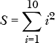

相应的 Racket 表达式是：

```
> (for/sum ([i (in-range 1 11)]) (sqr i))
385
```

对于乘积，等价的数学表达式是

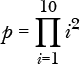

在 Racket 中变为

```
> (for/product ([i (in-range 1 11)]) (sqr i))
13168189440000
```

上面讨论的大多数 `for` 形式都有一个带星版本（例如 `for*/list`、`for*/and`、`for*/or` 等）。每个版本通过以嵌套方式评估其序列表达式，正如 `for*` 所描述的那样。

### 该是时候使用闭包了

假设你在银行有 $100，并且想要探讨不同利率下复利的影响。如果你不熟悉复利是如何运作的（而你应该了解它），它的工作原理如下：如果你在一个支付 *i* 周期性利息的银行账户中存有 *n*[0]，那么在期末你将得到：

*n*[1] = *n*[0] + *n*[0]*i* = *n*0

以你的 $100 存款为例，如果银行每期支付 4 百分之 (*i* = 0*.*04) 的利息（现在想在银行得到这个利率真的很难），那么在期末你将得到以下金额：

100 + 100 · 4% = 100(1 + 0.04) = 104

一种方法是创建一个函数，在应用利率后自动更新余额。一个聪明的方式是使用 Racket 中的 *闭包*，我们将在以下函数中使用它：

```
(define (make-comp bal int)
  (let ([rate (add1 (/ int 100.0))])
 ➊ (λ () (set! bal (* bal rate))  (round bal))))
```

请注意，这个函数实际上返回了另一个函数——lambda 表达式（λ . . . ）➊——并且这个 lambda 表达式包含了来自定义作用域的变量。我们稍后将解释这如何工作。

在上面的代码中，我们定义了一个名为 `make-comp` 的函数，它接受两个参数：初始余额和利率百分比。`rate` 变量初始化为 (1 + *i*)。这个函数并不直接返回一个数字，而是返回另一个函数。返回的函数设计成每次调用时（不带参数）通过应用利率更新余额并返回新余额。你可能会认为，一旦 `make-comp` 返回了 lambda 表达式，`bal` 和 `rate` 变量就会被定义为未定义，但在闭包中并非如此。该 lambda 表达式被称为 *捕获* 了 `bal` 和 `rate` 变量，这些变量在 lambda 表达式定义的词法环境中是可用的。返回的函数包含了 `bal` 和 `rate` 变量（它们是在函数外部定义的），这就是它成为闭包的原因。

让我们尝试一下，看看会发生什么。

```
> (define bal (make-comp 100 4))

> (bal)
104.0

> (bal)
108.0

> (bal)
112.0

> (bal)
117.0
```

如你所见，平衡值已被适当更新。

闭包的另一个用途是在一种叫做 *记忆化* 的技术中。其含义是我们存储先前计算的值，如果某个值已经计算过了，就返回已记住的值；否则，继续计算该值并保存，以便下次需要时使用。这在函数可能会多次调用且参数已经计算过的场景中非常有用。

为了实现这个功能，通常会使用一种叫做 *哈希表* 或字典的结构。哈希表是一个可变的键值对集合。哈希表可以通过 `make-hash` 函数构造。项可以通过 `hash-set!` 存储到哈希表中，通过 `hash-ref` 从哈希表中检索。我们可以通过 `hash-has-key?` 来测试表中是否已包含某个键。

阶乘函数的标准定义是 *n*! = *n*(*n - 1)!。在 Racket 中实现这一点的显而易见方法如下。

```
(define (fact n)
  (if ( = 0 n) 1
      (* n (fact (- n 1)))))
```

这可以正常工作，但每次你调用 `(fact 100)` 时，Racket 都必须执行 100 次计算。使用记忆化时，第一次执行 `(fact 100)` 仍然需要 100 次计算。但下次你调用 `(fact 100)`（或者调用 `fact` 处理任何小于 100 的值）时，Racket 只需在哈希表中查找该值，这只需要一步操作。以下是实现代码。

```
(define fact
  (let ([h (make-hash)]) ; hash table to contain memoized values
 ➊ (define (fact n)
      (cond [(= n 0) 1]
         ➋ [(hash-has-key? h n) (hash-ref h n)]
             [else
             ➌ (let ([f (* n (fact (- n 1)))]) 
               ➍ (hash-set! h n f)
                f)]))
 ➎ fact))
```

需要注意的是，外部的 `fact` 函数实际上返回了内部的 `fact` 函数 ➊。这最终就是我们调用 `fact 100` 时执行的部分。正是这个捕获了哈希表的内部 `fact` 函数，构成了闭包。首先，它检查传递给 `fact` 的参数是否是已计算的值 ➋，如果是，返回保存的值。如果值尚未计算，则必须进行计算 ➌，但计算后会将其保存，以便以后需要时使用 ➍。局部的 `fact` 函数作为全局 `fact` 函数的返回值被返回（抱歉用了相同的名称两次）。

### 应用

在介绍了 Racket 的基本编程构造后，让我们看一下跨越计算机科学、数学和娱乐谜题的一些应用。

#### *我没有队列*

在这一节中，我们将涉及 Racket 的*面向对象编程*功能。对象就像我们在第一章中遇到的结构的豪华版。

想象一下清晨，一个小镇银行只有一个出纳员。银行刚刚开门，出纳员还在试图准备好工作，但客户 Tom 已经到达并在窗口等候。不久，另外两个客户出现了：Dick 和 Harry。出纳员最终依次服务 Tom，然后是 Dick 和 Harry。这种情况是一个典型的*队列*示例。严格来说，队列是一种先进先出（FIFO）数据结构。Racket 自带有内置队列（事实上有好几个），但让我们尝试从头开始构建一个队列。

我们可以用一个列表来模拟队列。例如，排队等待看出纳员的人群可以通过一个单一列表表示：`(define q (list 'tom 'dick 'harry))`。但这里有一个问题。显然，通过使用`car`（或`first`）和`cdr`（或`rest`），很容易将 Tom 从列表头部移除并获得列表的其余部分：

```
> (car q)
'tom

> (set! q (cdr q))
> q
'(dick harry)
```

但是当 Sue 出现时会发生什么？我们可以做如下操作：

```
> (set! q (append q (list 'sue)))
> q
'(dick harry sue)
```

但是想一想，如果列表非常长，比如有 10,000 个元素，会发生什么。`append`函数将会创建一个包含 q 中所有元素以及一个附加值`'sue`的新列表。实现这一点的高效方法之一是保持一个指向列表最后一个元素的指针，并且在不创建新列表的情况下，将列表最后一个节点的`cdr`指向列表`(list 'sue)`（参见图 3-2）。此时，警报铃声应该在你脑中响起。你应该会觉得修改列表结构某种程度上是错误的。你是对的。使用正常的 Racket 列表结构实际上无法做到这一点，因为列表对中的`car`和`cdr`单元是不可变的，不能被更改。

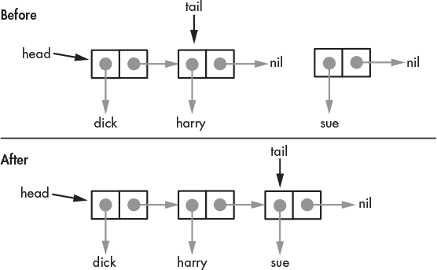

*图 3-2：可变列表*

Scheme 的传统版本允许通过`set-car!`和`set-cdr!`方法修改一个 cons 节点的元素。由于这些方法在 Racket 中没有定义，Racket 保证任何绑定到 Racket 列表的标识符，在程序的生命周期内都会保持相同的值。

仍然有合理的理由需要这种功能。正如我们所见，这种功能对于队列的高效操作是必需的。为了满足这一需求，Racket 提供了一个可变的 cons 单元，可以通过`mcons`函数创建。可变 cons 单元的每个组件都可以通过`set-mcar!`和`set-mcdr!`修改。`mcar`和`mcdr`是相应的访问器函数。

修改列表结构之所以不好，是因为如果某个其他标识符绑定到该列表，它现在会将修改后的列表作为值，可能这并不是预期的行为。请观察以下示例。

```
> (define a (mcons 'apple 'orange))
> (define b a)
> a
(mcons 'apple 'orange)
> b
(mcons 'apple 'orange)

> (set-mcdr! a 'banana)
> a
(mcons 'apple 'banana)
> b
(mcons 'apple 'banana)
```

尽管我们看似只改变了 `a` 的值，但我们实际上也改变了 `b` 的值。

为了避免这种潜在的灾难性情况，我们将 *封装* 列表，使得列表本身不可访问，但我们仍然能够从列表的前端移除元素并向列表的末端添加元素，以实现队列的功能。封装是面向对象编程的基本组成部分。我们将通过创建一个包含实现队列所需所有功能的类来直接深入：

```
➊ (define queue%

  ➋ (class object%

    ➌ (init [queue-list '()])

    ➍ (define head '{})
       (define tail '{}) 

    ➎ (super-new) 

    ➏ (define/public (enqueue val)
         (let ([t (mcons val '())])
           (if (null? head)
               (begin
                 (set! head t)
                 (set! tail t))
               (begin
                 (set-mcdr! tail t)
                 (set! tail t)))))

    ➐ (define/public (dequeue)
         (if (null? head) (error "Queue is empty.")
             (let ([val (mcar head)])
            ➑ (set! head (mcdr head))
               (when (null? head) (set! tail '()))
               val)))

      (define/public (print-queue)
        (define (prt rest)
          (if (null? rest)
              (newline)
              (let ([h (mcar rest)]
                    [t (mcdr rest)])
                (printf "~a " h)
                (prt t))))
         (prt head))

    ➒ (for ([v queue-list]) (enqueue v))))
```

我们的类名是 `queue%`（注意，按照约定，Racket 类名以 `%` 结尾）。我们从类定义 ➊ 开始。所有类都必须继承自某个父类。在这个例子中，我们使用内置类 `object%` ➋。一旦我们指定了类名和父类，我们就指定了类的初始化参数 ➌。这个类接受一个单一的可选列表参数。如果提供了该列表，则使用它来初始化队列 ➒。我们的类使用 `head` 和 `tail` 指针标识符，我们必须定义它们 ➍。在类的主体内部，`define` 语句对类外部不可访问。这意味着 `head` 或 `tail` 的值不能绑定到类外部的标识符上。

在必须调用父类（在此情况下是 `object%`） ➎ 之后，我们进入了这个类的核心部分：它的方法。首先我们定义了一个 *public* 类方法，叫做 `enqueue` ➏。公共方法可以从类外部访问。此方法接受一个单一值，并将其以类似我们苹果和香蕉示例的方式添加到队列的末尾。如果队列为空，则初始化 `head` 和 `tail` 标识符为可变的 cons 单元 `t`。

`dequeue` 方法 ➐ 返回队列头部的值，但如果队列为空则会生成错误。`head` 指针会更新为指向队列中的下一个值 ➑。

为了查看队列中的所有值，我们还定义了方法 `print-queue`。

让我们看看它的实际操作。

```
> (define queue (new queue% [queue-list '(tom dick harry)]))

> (send queue dequeue)
'tom

> (send queue enqueue 'sue)
> (send queue print-queue)
dick harry sue 

> (send queue dequeue)
'dick

> (send queue dequeue)
'harry

> (send queue dequeue)
'sue

> (send queue dequeue)
. . Queue is empty.
```

类对象是通过 `new` 形式创建的。此形式包括类名和类定义中的 `init` 形式所定义的任何参数（参见类定义代码 ➌）。

与普通的 Racket 函数和方法不同，对象方法必须通过 `send` 形式调用。`send` 标识符后跟对象名称（`queue`）、方法名称以及方法的任何参数。

本例旨在展示 Racket 面向对象功能的基础，但在接下来的内容中，我们将看到 Racket 在面向对象方面的更多强大功能。

#### *汉诺塔*

汉诺塔是一个包含三根钉子的难题，钉子插在一块板上，板上还有八个圆形的圆盘，每个圆盘中央有一个孔。没有两个圆盘的大小相同，它们排列在其中一根钉子上，最大的圆盘在底部，其他圆盘按照从大到小的顺序排列，确保较小的圆盘总是位于较大的圆盘之上（见图 3-3）。

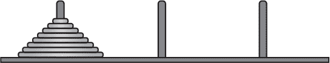

*图 3-3：汉诺塔*

W. W. Rouse Ball 讲述了一个有趣的故事，说明了这个难题是如何产生的（见[**3**]和[**8**]）。

在贝拿勒斯的大庙中，在标志着世界中心的圆顶下，安放着一块铜板，上面固定着三根钻石针，每根针高一肘，粗如蜜蜂的身体。在其中一根针上，神在创造之初放置了 64 个纯金圆盘，最大的圆盘放在铜板上，其他圆盘逐渐变小，直到顶部的圆盘。这就是梵天之塔。日夜不停，值班的祭司根据梵天的不变法则，将圆盘从一根钻石针移动到另一根上，按照要求，祭司每次只能移动一个圆盘，并且必须把这些圆盘放置在针上，确保没有较小的圆盘在较大的圆盘下面。当这 64 个圆盘都从神在创造时所放置的那根针上转移到其他任一根针上时，塔、庙和祭司们都会化为尘土，世界将伴随着一声雷鸣消失。

这将需要 2⁶⁴ *-* 1 步。让我们看看在世界末日来临之前我们还有多少时间。我们假设每秒可以完成一次移动。

```
> (define moves (- (expt 2 64) 1))
> moves
18446744073709551615

> (define seconds-in-a-year (* 60 60 24 365.25))
> seconds-in-a-year
31557600.0

> (/ moves seconds-in-a-year)
584542046090.6263
```

这个最后的数字大约是 5*.*84 × 10¹¹ 年。当前宇宙的年龄估计略低于 14 × 10⁹ 年。如果祭司们从宇宙起始时就开始移动圆盘，那么还剩大约 570 亿年，因此你应该至少有足够的时间读完这本书。

尽管这个过程很有趣，我们的主要目标是使用 Racket 来展示如何实际执行这些移动。当然，我们会先从较少的圆盘开始，所以让我们从一个圆盘开始。我们将钉子编号为 0、1 和 2。假设我们的目标是将圆盘从钉子 0 移动到钉子 2。只有一个圆盘时，我们只需将圆盘从钉子 0 移动到钉子 2。如果我们有 *n* > 1 个圆盘，我们将我们要移动所有圆盘的钉子指定为 *f*，将我们要移动到的钉子指定为 *t*，剩下的钉子我们指定为 *u*。解决这个难题的步骤可以这样表述：

1.  将 *n -* 1 个圆盘从 *f* 移动到 *u*。

1.  将一个圆盘从 *f* 移动到 *t*。

1.  将 *n -* 1 个圆盘从 *u* 移动到 *t*。

虽然这个过程简单，但足以解决这个难题。步骤 1 和 3 暗示了递归的使用。以下是实现这些步骤的 Racket 代码。

```
➊ (define (hanoi n f t)
  ➋ (if (= 1 n) (list (list f t))        ; only a single disk to move
      ➌ (let* ([u (- 3 (+ f t))]         ; determine unused peg
             ➍ [m1 (hanoi (sub1 n) f u)] ; move n-1 disks from f to u
             ➎ [m2 (list f t)]           ; move single disk from f to t
             ➏ [m3 (hanoi (sub1 n) u t)]); move disks from u to t
        ➐ (append m1 (cons m2 m3)))))
```

我们传递给`hanoi`函数磁盘的数量、起始的柱子和目标柱子。然后，我们计算实现步骤一 ➌、二 ➍ 和三 ➎ 所需的移动。你能理解为什么`let`表达式 ➌ 决定了未使用的柱子吗？（提示：考虑所有可能的组合。例如，如果 *f* = 1 且 *t* = 2，`let`表达式 ➌ 将得到 *u* = 3 *-* (1 + 2) = 0，即未使用的柱子编号。）`hanoi`函数返回一个移动列表 ➏。列表中的每个元素是由两个元素组成的列表，指定了从哪个柱子移动到哪个柱子。以下是三个磁盘的输出示例：

```
> (hanoi 3 0 2)
'((0 2) (0 1) (2 1) (0 2) (1 0) (1 2) (0 2))
```

注意，我们有 2³ *-* 1 = 7 次移动。

如代码中的注释所示，`hanoi`函数本质上是前面给出的三步解决过程的直接翻译。此外，它提供了递归的实际应用，其中函数通过传递问题的简化版本来调用自身。

#### *斐波那契与朋友们*

*斐波那契序列*的定义如下：

0, 1, 1, 2, 3, 5, 8, 13, 21, 34, . . .

在这个序列中，下一个项总是前两个项的和。在某些情况下，初始的零不被认为是序列的一部分。这个序列有许多有趣的属性。我们这里只会简要介绍其中的一些。

##### 一些有趣的属性

斐波那契序列的一个有趣属性是，总是可以创建一个由斐波那契序列中生成的边长的正方形拼接而成的矩形，如图 3-4 所示。我们将在第四章中看到如何生成这种平铺。

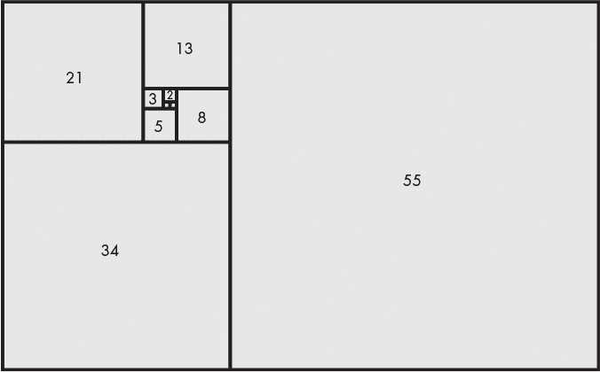

*图 3-4：斐波那契平铺*

约翰内斯·开普勒指出，连续斐波那契数的比值接近一个特定的数字，称为 *ϕ*，也被称为*黄金比例*：

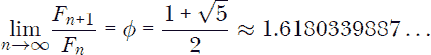

如果你不熟悉 *lim n* →*∞* 这种写法，它只是意味着当 *n* 越来越大时，结果就是这个。

数字 *ϕ* 也有许多有趣的属性。一个例子是*黄金螺旋*。黄金螺旋是一个对数螺旋，其增长因子为 *ϕ*，这意味着每转一个四分之一圈，螺旋就会以 *ϕ* 的倍数变宽（或远离原点）。初始半径为 1 的黄金螺旋具有以下极坐标方程：

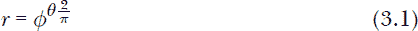

黄金螺旋的图示见图 3-5。我们将在第四章中展示如何生成这个图。

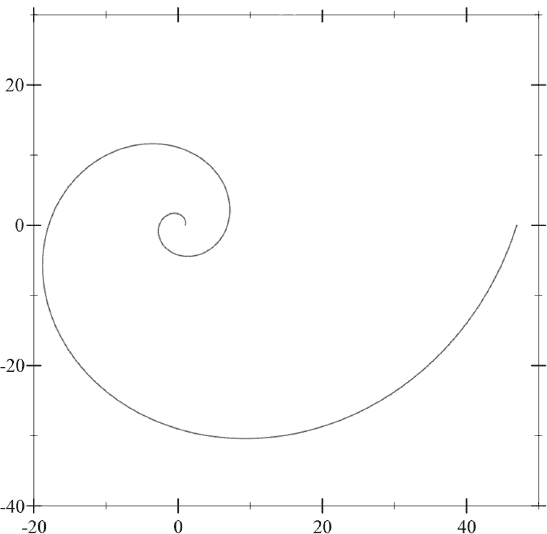

*图 3-5：黄金螺旋*

图 3-6 展示了通过绘制连接斐波那契平铺中正方形对角线的圆弧来近似黄金螺旋（在第四章中，我们将看到如何将这个螺旋叠加到斐波那契平铺上）。

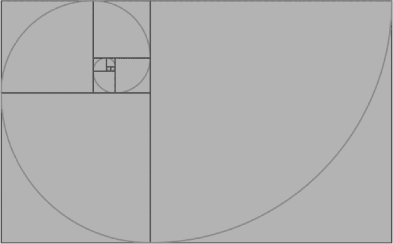

*图 3-6：黄金螺旋近似*

虽然这两个黄金螺旋的版本看起来非常相似，但从数学上讲，它们是非常不同的。这与一个叫做*曲率*的概念有关。这个概念有一个精确的数学定义，但现在你只需将其理解为路径的弯曲程度。曲线越紧，曲率越大。方程（3.1）描述的路径具有连续的曲率，而斐波那契螺旋则具有不连续的曲率。图 3-7 展示了这两条路径在曲率上的明显差异。

我们将在接下来的章节中以及第四章中使用这些性质。

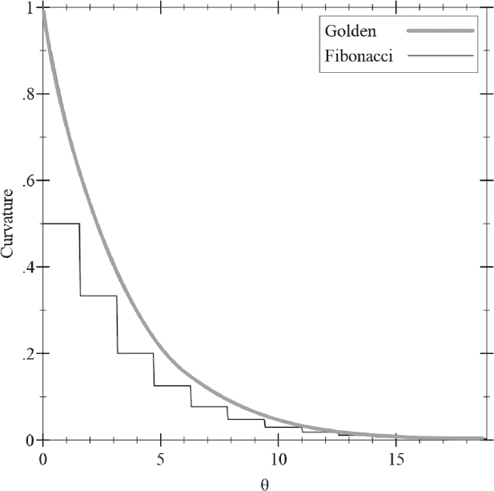

*图 3-7：曲率：黄金与斐波那契*

##### 计算数列

数学上，斐波那契数列*F*[*n*]由以下递推关系定义：

*F*[n] = *F*[n-1] + *F*[n-2]

在本节中，我们将探讨三种不同的计算该数列的方法。

**1. 傻瓜式方法。** 根据斐波那契数列的递推关系定义，我们的第一个版本几乎是现成的。它实际上是从定义到 Racket 函数的精确翻译。

```
(define (F n)
  (if (<= n 1) n
    (+ (F (- n 1)) (F (- n 2)))))
```

这段代码的优点是非常清晰简洁。唯一的问题是，它效率极低。两个嵌套调用导致相同的值被反复计算。最终结果是计算量随着*n*的增加而呈指数增长。

**2. 效率至上。** 在这里，我们探讨了计算机科学经典著作《计算机程序的构造与解释》中提出的一种巧妙方法[**2**]。这个方法的思路是使用一对整数初始化，使得*a* = *F*[1] = 1 和 *b* = *F*[0] = 0，并反复应用以下变换：

*a ← a + b*

*b ← a*

可以证明，在应用这些变换*n*次之后，我们将得到*a* = *F*[*n*+1] 和 *b* = *F*[*n*]。这个证明并不难，我已将其留作习题给你。下面是实现这一解决方案的代码：

```
(define (F n)
  (define (f a b c)
    (if (= c 0) b
        (f (+ a b) a (- c 1))))
  (f 1 0 n))
```

由于尾递归优化，`f`递归调用自身时无需保持继续点。它作为一个迭代过程工作，并且随着*n*的增大，增长是线性的。

**3. 内存的作用。** 在这个版本中，我们使用了在《一些闭包的时机》第 58 页中介绍的记忆化技术。为此，下面的代码使用了*哈希表*。回忆一下，哈希表是一个可变的键值对集合，它是通过函数`make-hash`构建的。可以通过`hash-set!`将项目存储到哈希表中，使用`hash-ref`从表中检索项。我们通过`hash-has-key?`测试表中是否已包含某个键。

```
(define F
  (let ([f (make-hash)]) ; hash table to contain memoized F values
    (define (fib n)
      (cond [(<= n 1) n]
            [(hash-has-key? f n) (hash-ref f n)]
            [else
              (let ([fn (+ (fib (- n 1)) (fib (- n 2)))])
                (hash-set! f n fn)
                fn)]))
    fib))
```

这段代码应该相当容易理解。它是前面提到的`fact`示例中记忆化（memoization）方法的直接应用。

**获胜者是谁？** 这取决于情况。你绝对不应该使用第一个方法。比较第二个和第三个方法时，考虑以下内容：第二个方法*总是*在每次调用`F`时需要进行*n*次计算。第三个方法在第一次调用`F`时也需要进行*n*次计算。若第二次（或之后）调用`F`时，针对*n*（或任何小于*n*的数值），它几乎瞬间返回结果，因为它只需查找哈希表中的值。第三种方法会有轻微的空间开销，但在大多数情况下，这个开销是微不足道的。

**比内公式。** 在我们离开斐波那契数列及其计算方式的迷人世界之前，让我们来看看*比内公式*：

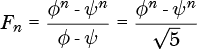

在这个公式中，以下是正确的：

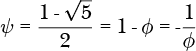

这个公式为我们提供了另一种计算*F*[*n*]的方法。以下对所有*n*都适用：

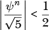

所以数字*F*[*n*]是最接近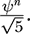的整数。因此，如果我们四舍五入到最接近的整数，*F*[*n*]可以通过以下方式计算：

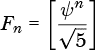

方括号用于指定四舍五入函数。在 Racket 中，这变成：

```
(define (F n)
  (let* ([phi (/ (add1 (sqrt 5)) 2)]
         [phi^n (expt phi n)])
    (round (/ phi^n (sqrt 5)))))
```

虽然比内公式非常快速（因为它不需要循环或递归），但缺点是它只给出一个近似值，而其他版本则提供精确值。

**连分数。** 下面的表达式是一个*连分数*的例子。在这种情况下，分数部分是无限重复的。正如我们将看到的，连分数与斐波那契数列有着惊人的联系。

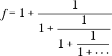

由于这个分数是无限重复的，我们可以进行如下替换。

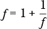

这个替换简化为二次方程：

*f² - f* - 1 = 0

这个方程有几个解。下面是正确的：

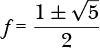

或者，这些是正确的：

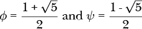

问题依然存在：哪个值才是*f*的正确值？由于*ψ*是负的，答案必须是*ϕ*。因此……

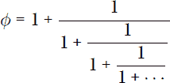

我敢打赌你没想到这个。

#### *保险销售员问题*

这个问题改编自 Flannery 的*《编码》* [**7**]。这是一个可以手工解决的问题，但我们可以利用 Racket 来完成一些繁琐的计算。问题描述如下。

一名上门的保险推销员停在一位女士家门口，接下来发生了以下对话：

销售员：你有几个孩子？

女人：三。

销售员：那么他们的年龄是多少？

女人：猜猜看。

销售员：那给个提示怎么样？

女人：好的，他们年龄的乘积是 36，且所有年龄都是整数。

销售员：这也太少了，能再给我一个提示吗？

女人：他们年龄的总和等于隔壁房子的门牌号。

推销员立即跑开，跳过栅栏，看了看隔壁房子的号码，挠了挠头，然后回到女人身边。

推销员：你能再给我一个提示吗？

女人：最年长的那个弹钢琴。

推销员想了一会儿，做了一些计算，弄清楚了孩子们的年龄。他们分别是多大？

一开始，提示看起来有些不一致。让我们逐个分析。首先，我们知道三个年龄的乘积是 36。以下是一个程序，它生成所有乘积为 36 的唯一三正整数组合。

```
   #lang racket
   (require math/number-theory)

➊ (define triples '())
   (define (gen-triples d1)
  ➋ (let* ([q (/ 36 d1)]
            [divs (divisors q)])
     ➌ (define (try-div divs)
          (when (not (null? divs))
        ➍ (let* ([d2 (car divs)] [d3 (/ q d2)])
          ➎ (when (<= d3 d2 d1)
            ➏ (set! triples (cons (list d3 d2 d1) triples)))
            (try-div (cdr divs)))))
      (try-div divs)))

➐ (for ([d (divisors 36)]) (gen-triples d))

   triples
```

尽管这段代码在效率上不会赢得任何奖项，但它相对简单，且能够完成任务。我们首先定义了变量`triples`，它将包含生成的三元组列表➊。处理实际上在我们为 36 的每个除数调用`gen-triples` ➐时开始（除数由*math/number-theory*库中的`divisors`函数提供）。这个函数接着定义了除数`d1`与 36 的商`q` ➋。之后，我们生成`q`的除数列表（`divs`，这些除数当然也能整除 36）。接下来是`try-div` ➌函数，它完成了大部分工作。然后我们得到`q`的第一个除数（`d2`） ➍，并通过将`q`除以`d2`来生成第三个除数（`d3`）。这些除数（`d1`、`d2`和`d3`）被测试以确定是否形成一个合适的三元组（为了确保唯一性，我们确保它们形成一个有序的序列 ➎）。如果满足条件，它将被添加到三元组列表中➏。测试其他除数将继续进行。运行此程序将生成以下三元组集合：{1, 1, 36}、{1, 2, 18}、{1, 3, 12}、{1, 4, 9}、{2, 2, 9}、{1, 6, 6}、{2, 3, 6}、{3, 3, 4}。

仅凭这一点，当然无法让推销员确定孩子们的年龄。第二个提示是，年龄之和等于隔壁房子的号码。我们再次使用 Racket 生成所需的和。

```
(for ([triple triples]) (printf "~a: ~a\n" triple (apply + triple)))
```

从这里，我们得出以下结论。

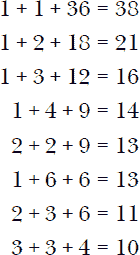

在看过隔壁房子的号码之后，推销员仍然不知道孩子们的年龄。这意味着年龄一定是那两个和为 13 的数字集合之一（否则他会知道该选择哪个集合）。由于女人说“最年长的*那个*弹钢琴”，唯一的可能性是年龄集合*{*2, 2, 9*}*，因为集合*{*1, 6, 6*}*会意味着有*两个*最年长的。

### 总结

本章中，我们介绍了 Racket 的基本编程构造，并将其应用于各种问题领域。到目前为止，我们的探索仅限于以文本形式获取输出。接下来，我们将展示如何通过生成图形输出为我们的应用程序添加一些亮点。
