## 第四章：绘图、绘制与一些集合论


在本章中，我们将探讨如何利用 DrRacket 显示图形信息的功能。具体来说，我们将查看生成二维函数图表的各种方法，以及使用一些内建的图形原语（圆形、矩形等）来创建更复杂的绘图。在介绍基本知识后，我们还将探讨一些扩展应用，包括集合论、黄金螺旋和尼姆游戏。

### 绘图

所有绘图函数都需要*plot*库，因此在尝试本节中的任何示例之前，请确保先执行以下操作。

```
> (require plot)
```

既然这些都解决了，我们就从一些简单而熟悉的内容开始吧。

#### *X-Y 图表*

所有二维图表都使用`plot`函数。此函数接受单个函数或函数列表，并为每个函数生成一个图表。生成图表后，如果需要，可以通过右键点击图表并选择弹出菜单中的“保存图像…”将其保存为位图。

`plot`函数接受多个关键字参数（所有参数都是可选的），但至少建议指定图表的范围，因为 DrRacket 并不总是能确定适当的图表边界。以下是生成简单正弦函数图表的示例：

```
(plot (function sin #:color "Blue")
      #:x-min (* -2 pi) #:x-max (* 2 pi)
      #:title "The Sine Function")
```

结果如图 4-1 所示。请注意，图像显示为灰度，但当你在电脑上输入代码时，图形将显示为彩色。

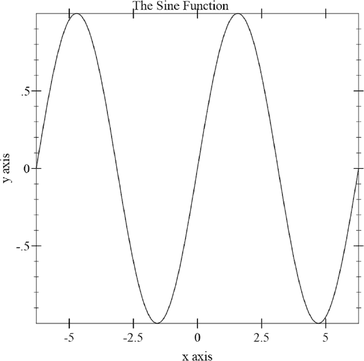

*图 4-1：使用正弦函数的示例图表*

请注意，`sin`函数被包含在`function`形式中。`function`是一个被称为*渲染器*的东西；它控制传递给它的函数参数的渲染方式。`function`形式允许你添加可选的关键字参数来控制单个函数的显示方式。在这种情况下，我们指定正弦函数以蓝色渲染。

以下代码通过将正弦函数和余弦函数合并到一个列表中来创建一个显示这两个函数的图表。

```
(plot (list
       (axes) ; can also use (axis x y) to specify location
       (function sin #:color "Blue" #:label "sin" #:style 'dot)
       (function cos 0 (* 2 pi) #:color "red"  #:label "cos"))
      #:x-min (* -2 pi) #:x-max (* 2 pi)
      #:y-min -2 #:y-max 2
      #:title "Sine and Cosine" 
      #:x-label "X" 
      #:y-label #f) ; suppress y-axis label
```

生成的图表如图 4-2 所示。请注意，我们为余弦函数指定了更窄的图表范围，并为两个函数添加了文本标签，以便它们可以在图表上轻松区分。我们还使用特定的值覆盖了默认标签。

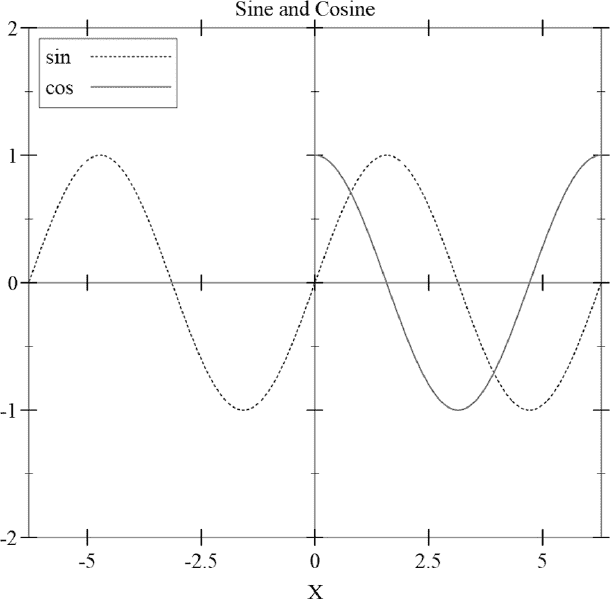

*图 4-2：正弦和余弦函数*

以下代码演示了一些额外的绘图功能（请参见图 4-3 查看输出）。

```
(plot (list (axes)
            (function sin #:color "Blue" #:label "sin" #:style 'dot)
            (inverse sqr -2 2 #:color "red" #:label "x²" #:width 2))
      #:x-min (* -2 pi) #:x-max (* 2 pi)
      #:y-min -2 #:y-max 2
      #:title "Sine and Square" 
      #:x-label "X" 
      #:y-label #f
      #:legend-anchor 'bottom-left)
```

请注意，我们在绘图函数的列表中使用了一种新的`inverse`形式。该形式通过将 y 轴作为自变量的轴来工作。这样，我们可以有效地绘制反函数，而无需代数推导出来。我们还指定了一些附加样式来帮助区分不同的曲线。正弦曲线使用虚线显示，而反平方函数则用更粗的线条表示。通过为`plot`函数指定`#:legend-anchor` `'bottom-left`，我们将图例移到了左下角。

如果你运行代码，应该会得到类似图 4-3 的结果。

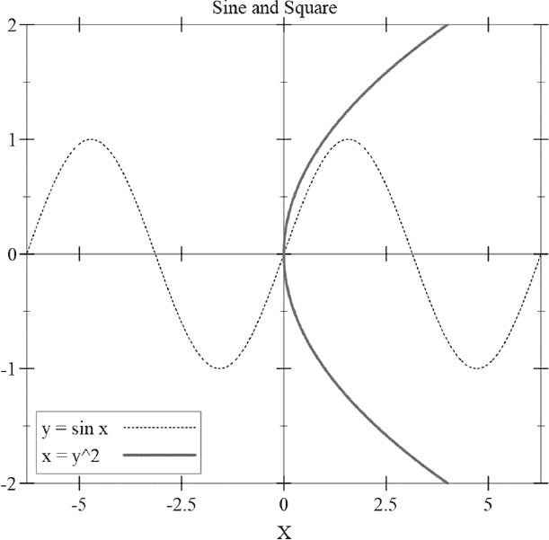

*图 4-3：正弦与反平方*

接下来我们看看参数化绘图。

#### *参数化绘图*

如果一个平面中的曲线是参数化的，那么曲线的坐标（x，y）是由一个变量（或*参数*）的函数表示的，假设该参数为*t*。我们来看一个例子。

##### 圆的参数化

标准的圆定义是以原点为圆心的所有点的集合，且这些点与原点的距离相等。我们可以通过隐式方程的代数形式或通过一对三角函数表达式来表示这一定义，如图 4-4 所示。

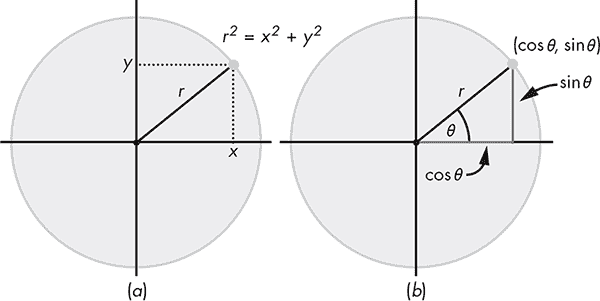

*图 4-4：圆的定义*

在图 4-4（a）中，圆是通过这个代数表达式来定义的：

*r*² = *x*² + *y*²

为了将其绘制为 x-y 图，我们必须明确地将*y*表示为*x*的函数，其中表达式的正值给出圆的上半部分，负值则给出下半部分：

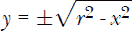

图 4-4（b）说明了如何通过参数*θ*来定义圆。在这种情况下，曲线的 x 和 y 坐标分别由三角函数 cos *θ*和 sin *θ*给出。

在 Racket 中，参数曲线是通过一个函数来定义的，该函数以参数为其输入并返回一个包含计算出的*x*和*y*值的`vector`。下面的代码绘制了代数和参数版本的圆。我们已经将参数版本偏移，使其出现在代数版本的右侧（关于`infix`包及`@`的使用，请参见第二章）。

```
   #lang at-exp racket
   (require infix plot)

   (define r 30)
   (define off (+ 5 (* 2 r)))

   ; algebraic half-circles
➊ (define (c1 x) @${ sqrt[r² - x²]})
➋ (define (c2 x) @${-sqrt[r² - x²]})

   ; parametric circle
➌ (define (cp t) @${vector[off + r*cos[t], r*sin[t]]})

   (plot (list
          (axes)
          (function c1 (- r) r #:color "blue" #:label "c1")
          (function c2 (- r) r #:style 'dot #:label "c2")
     ➍ (parametric cp 0 (* 2 pi) #:color "red" #:label "cp" #:width 2))
         #:x-min (- r)
         #:x-max (+ off r)
         #:y-min (- r)
         #:y-max (+ off r)
         #:legend-anchor 'top-right)
```

我们使用了`infix`包和`at-exp`语言扩展，以便以更自然的形式呈现代数表达式。我们从定义半圆函数`c1` ➊和`c2` ➋开始。参数化版本表示为`cp` ➌。请注意，`cp`被置于一个从`parametric` ➍开始的形式中，并且指定了 0 到 2*π*的绘图范围。此代码的输出显示在图 4-5 中。

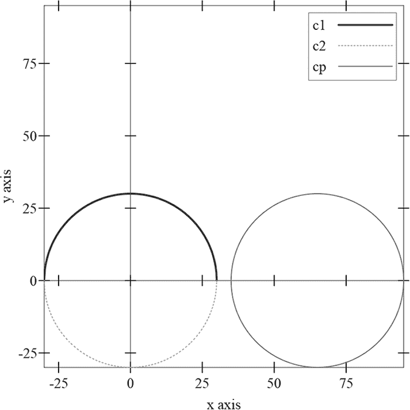

*图 4-5：显式与参数化绘图*

##### 圆的运动

坦白说，静态圆形真的很无聊。在这一节中，我们将探讨圆形的运动。具体来说，我们将研究一个固定点在圆上滚动时沿直线无滑移运动所形成的路径。描述这一路径的曲线叫做*摆线*。我们在图 4-6 中设定了场景，其中一个半径为*r*的圆已经从原点滚动了距离*x*。感兴趣的点是标记为*P*的点。

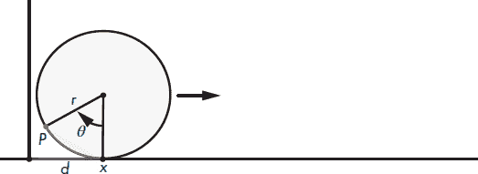

*图 4-6：摆线场景*

让我们来看看生成参数图所需的数学知识，目标是绘制一个点*P*的轨迹，这个点位于一个半径为*r*的圆上，圆在直线上无滑移地滚动。

由于小圆在大圆内无滑移地滚动，从*x*到*P*的弧长等于*d*。我们可以将其表示为*d* = *θr*。因此，当小圆转动角度*θ*时，*P*的 x 坐标为*d - r*sin*θ*。但由于*d* = *rθ*，所以*x* = *rθ - r*sin*θ* = *r*(*θ - sin*θ*)。显然，*y*的值仅由*y* = *r*(1 - cos*θ*)给出。以下是绘图代码：

```
#lang at-exp racket
(require infix plot)

(define r 30)

(define (cycloid t) @${vector[r*(t - sin[t]),  r*(1-cos[t])]})

(plot (list
       (axes)
       (parametric cycloid 0 (* 2 pi)
                   #:color "red"
                   #:samples 1000))
      #:x-min 0
      #:x-max (* r 2 pi)
      #:y-min 0
      #:y-max (* r 2 pi))
```

在这种情况下，我们使用了`#:samples`关键字来增加生成图像时使用的采样点数量，从而使得图形看起来更平滑。以下是生成的图像。

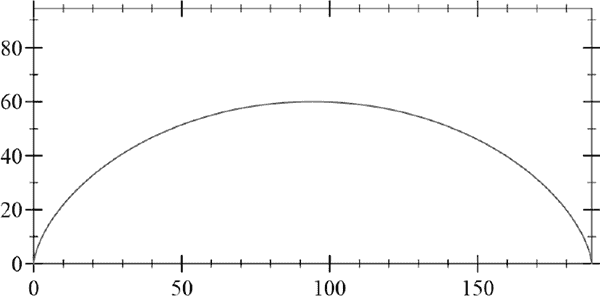

图像中的曲线已经被叠加到图 4-7 中的原始场景设置上。

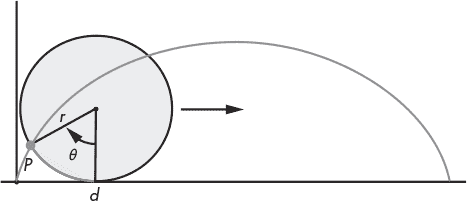

*图 4-7：摆线*

稍后我们将展示如何对其进行动画处理，这样我们就能看到它的运动效果。

##### 内摆线

我们不仅可以让圆形沿直线滚动，还可以让它在另一个圆上滚动。事实上，如果一个圆的半径大于另一个，我们可以让小圆在大圆内滚动。以这种方式生成的曲线叫做*内摆线*。在这里，我们为内摆线创建了一个基于半径为*r*的小圆和半径为*R*的大圆的参数图，其中小圆在大圆内部无滑移地滚动。我们假设大圆的圆心在原点(图 4-8)。


*图 4-8：内摆线设置*

由于小圆在大圆内无滑移地滚动，弧长*s*由公式*s* = *rθ* = R*ϕ*给出，因此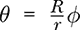。小圆的圆心（图中的*q*）与原点的距离为*R - r*。为了帮助分析，我们放大了小圆并在图 4-9 中提供了一些额外的参考线。

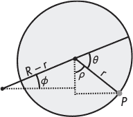

*图 4-9：放大后的设置*

请注意以下几点：

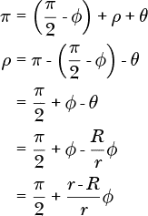

从中可以清楚地看到，*P*的 x 坐标由以下公式给出：

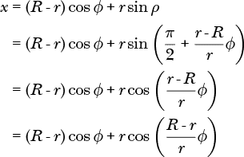

同样，*P*的 y 坐标由以下公式给出：


我们将所有这些结合起来，写成了以下 Racket 代码：

```
#lang at-exp racket
(require infix plot)

(define r 20)
(define R (* r 3))

(define (hypocycloid phi)
  @${vector[
    (R-r)*cos[phi] + r*cos[(R-r)/r * phi],
    (R-r)*sin[phi] - r*sin[(R-r)/r * phi]]})

(plot (list
       (parametric (λ (t) @${vector[R*cos[t], R*sin[t]]})
                   0 (* r 2 pi)
                   #:color "black"
                   #:width 2)
       (parametric hypocycloid
                   0 (* r 2 pi)
                   #:color "red"
                   #:width 2))
      #:x-min (- -10 R ) #:x-max (+ 10 R )
      #:y-min (- -10 R ) #:y-max (+ 10 R )
      #:x-label #f #:y-label #f
      )
```

你可以在图 4-10 中看到我们工作的成果。

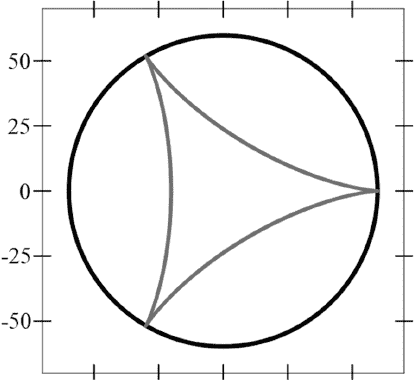

*图 4-10：内滚线图*

为了激发你进一步探索这些迷人曲线的兴趣，给你另一个问题：对于什么半径比率，内滚线是直线？

#### *直击要点*

到目前为止，我们集中在生成连续曲线，但如果你想绘制单个点怎么办？是的，Grasshopper，这也是可以的。从绘图角度来看，一个*点*只是一个包含两个数字的向量。例如，`#(1 2)`是一个点。要绘制一组点，你只需向`plot`例程提供一个由向量点组成的列表。以下是一个示例：

```
#lang racket
(require plot)

(parameterize ([plot-width    250]
               [plot-height   250]
               [plot-x-label  #f]
               [plot-y-label  #f])

  (define lim 30)
  (plot (list
         (points '(#(0 0))
                 #:size 300
                 #:sym 'fullcircle1
                 #:color "black"
                 #:fill-color "yellow")
         (points '(#(-5 5) #(5 5))
                 #:size 10
                 #:fill-color "black")
         (points '(#(0 -5))
                 #:size 30
                 #:sym 'fullcircle1
                 #:color "black"
                 #:fill-color "black"))
        #:x-min (- lim) #:x-max (+ lim)
        #:y-min (- lim) #:y-max (+ lim)))
```

这里是图 4-11 中的输出结果。

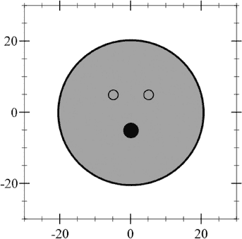

*图 4-11：用点绘制的面部*

在这种情况下，我们使用的是`parameterize`形式，它允许我们指定图表的物理大小（以像素为单位，`plot-width`和`plot-height`），并抑制图表标签。请注意，`#:size`关键字参数也以像素表示。第一个点列表是我们用于绘制面部的单个点。`#:sym`关键字参数指定用于打印该点的符号类型。我们使用的是一个填充圆圈，用符号`fullcircle`表示面部。预定义符号种类繁多（可以在文档中搜索“known-point-symbols”），但你也可以使用 Unicode 字符或字符串。

现在我们可以绘制点了，我们可以使用`line`形式将它们连接成线条。像点一样，线条由两个元素的向量列表组成。`plot`例程将该列表视为一系列线段的端点，并适当地绘制它们。以下是一个示例。

```
#lang racket
(require plot)

(define pts (for/list ([i (in-range 0 6)]) (vector i (sqr i))))

(plot (list
       (lines pts
               #:width 2
               #:color "green")
       (points pts
               #:sym 'fulldiamond
               #:color "red"
               #:fill-color "red"))
      #:x-min -0.5 #:x-max 5.5
      #:y-min -0.5 #:y-max 26)
```

生成的图表显示在图 4-12 中：

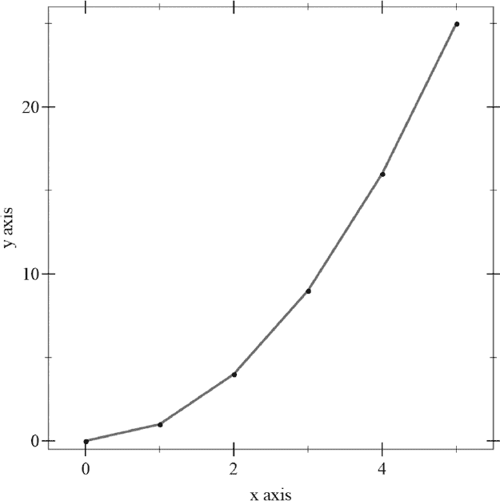

*图 4-12：绘制线条和点*

#### *极坐标图*

极坐标图是通过...（你猜对了！）`polar`形式创建的。`polar`形式接受一个函数，该函数在给定旋转角度时返回原点的距离。最简单的极坐标图函数是单位圆，其作为 lambda 表达式的形式为`(`λ `(`θ`) 1)`。一个稍微更复杂的示例是逆时针螺旋线，定义为`(`λ `(`θ`)` θ`)`。以下是两个图表的代码：

```
(parameterize
    ([plot-width 150]
     [plot-height 150]
     [plot-tick-size 0]
     [plot-font-size 0]
     [plot-x-label  #f]
     [plot-y-label  #f])

  (list (plot (polar (λ (θ) 1) 0 (* 2 pi))
              #:x-min -1 #:x-max 1
              #:y-min -1 #:y-max 1)
        (plot (polar (λ (θ) θ) 0 (* 2.5 pi))
              #:x-min -8 #:x-max 8
              #:y-min -8 #:y-max 8)
        ))
```

我们利用一些图表参数抑制了坐标轴刻度和标签。此代码在图 4-13 中生成以下输出。

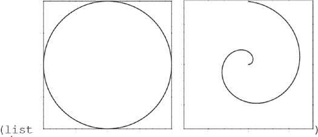

*图 4-13：基本极坐标图*

注意，图表是以列表的形式呈现的。在 Racket 中，图表只是另一种数据值。

让我们生成图 4-14 中所示的图表。

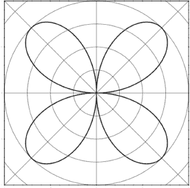

*图 4-14：极玫瑰*

我们需要一个从 0 到 1 再回到 0 的函数。这听起来像是正弦函数。我们需要它在从 0 到*π*/2（并重复直到 2*π*）的过程中产生这些值，因此我们需要的函数是*r*[*θ*] = sin(2*θ*)。绘制此图的代码如下：

```
#lang at-exp racket
(require infix plot)

(parameterize
    ([plot-width 200]
     [plot-height 200]
     [plot-tick-size 0]
     [plot-font-size 0]
     [plot-x-label  #f]
     [plot-y-label  #f])

  (plot (list
         (polar-axes #:number 8)
         (polar (λ (t) @${sin[2*t]})  0 (* 2 pi)
         #:x-min -1 #:x-max 1
         #:y-min -1 #:y-max 1))))
```

通过对函数*r*[*θ*] = sin(*kθ*)添加一个小的参数*k*，就能产生各种有趣的曲线（见图 4-15）。

```
(parameterize
     ([plot-width 200]
     [plot-height 200]
     [plot-tick-size 0]
     [plot-font-size 0]
     [plot-x-label  #f]
     [plot-y-label  #f])

  (define (rose k)
    (plot (polar (λ (t) @${sin[k*t]})  0 (* 4 pi)
                 #:x-min -1 #:x-max 1
                 #:y-min -1 #:y-max 1)))
  (for/list ([k '(1 1.5 2 2.5 3 4 5)]) (rose k)))
```

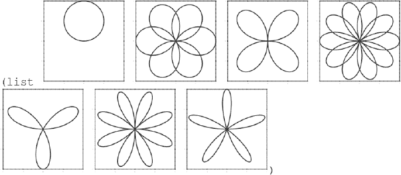

*图 4-15：极坐标玫瑰*

作为另一个极坐标绘图的示例，以下是我们用来绘制黄金螺旋的代码，黄金螺旋最早在第三章的第 68 页介绍，并在此处的图 4-16 中重新绘制。

```
(define ϕ (/ (add1 (sqrt 5)) 2))
(define π pi)
(plot (polar (λ (θ) (expt ϕ (* θ (/ 2 π))))
             0 (* 4 pi)
             #:x-min -20 #:x-max 50
             #:y-min -40 #:y-max 30
             #:color "red")
      #:title "Golden Spiral"
      #:x-label #f ; suppress axis labels
      #:y-label #f)
```

现在，我们有了用于生成黄金螺旋的实际代码，这是我们在第三章首次遇到的。

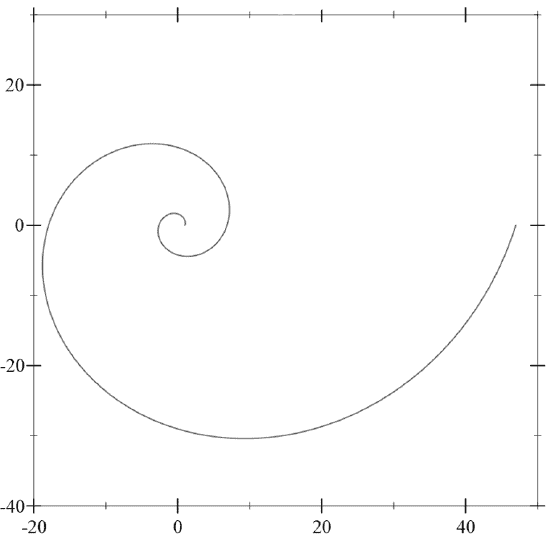

*图 4-16：黄金螺旋*

尽管我们尽力提供了 DrRacket 绘图功能的概述，但其实还有更多：等高线图、区间图、误差条、向量场，等等。我鼓励你查阅文档，了解更多可能对你有兴趣的主题。不过，接下来我们将继续讨论使用图形原语创建图形。

### 绘图

在 Racket 中绘图需要一种称为*绘图上下文（DC）*的东西。你可以把它当作绘图发生的画布。绘图上下文可以为各种对象设置，例如位图、PostScript 文件或 Racket GUI 应用程序。

与用于绘制函数的坐标不同，绘图上下文使用的坐标系中的 y 轴是反转的，如图 4-17 所示。请注意，原点位于画布的左上角。

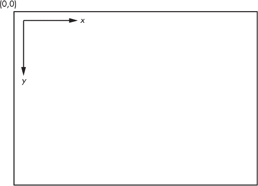

*图 4-17：绘制坐标*

所有使用 Racket 绘图库创建的图形都需要导入*draw*库，如下所示：

```
> (require racket/draw)
```

在本节中，我们将重点介绍使用位图绘图上下文创建简单的图形。要创建这样的上下文，我们需要一个位图（通过`make-bitmap`，如下所示）：

```
> (define drawing (make-bitmap 50 50)) ; a 50x50 bitmap
```

我们还需要一个位图绘图上下文：

```
> (define dc (new bitmap-dc% [bitmap drawing]))
```

接下来，我们需要一些绘图工具。在现实生活中，我们用钢笔画线条，用画笔填充画布上的区域；在 Racket 中也是如此。我们可以通过几种方式告诉 Racket 我们想使用什么样的笔：

```
> (send dc set-pen "black" 2 'solid)
> (send dc set-pen (new pen% [color "black"] [width 2] [style 'solid]))
```

第一个方法是通过设置宽度为 2 的实心黑色笔进行快速且简便的绘制。第二个方法是创建一个*笔对象*并将其发送到绘图上下文。颜色可以通过字符串名称指定，如上所示，也可以通过颜色对象指定，其中红色、绿色、蓝色以及可选的 alpha（透明度）值可以被指定。每个这些值必须在 0 到 255 之间（包括 0 和 255）。例如，以下输入将创建一个青色颜色对象，并设置绘图上下文使用它。

```
> (define cyan (make-object color% 0 255 255))
> (send dc set-pen cyan 2 'solid)
```

一种等效的，但略微高效的方法是执行以下操作：

```
> (define cyan (make-color 0 255 255))
> (send dc set-pen cyan 2 'solid)
```

画刷控制二维图形（如矩形和圆形）内部的填充类型。像钢笔一样，画刷可以通过几种不同的方式定义：

```
> (send dc set-brush "blue" 'cross-hatch)
> (send dc set-brush (new brush% [color "red"] [style 'solid]))
```

第一个例子将创建一个画刷，产生蓝色的交叉填充效果。第二个例子使用一个*画刷对象*，它有一个实心的红色填充。第二个例子中达到相同效果的另一种方法如下：

```
(send dc set-brush (make-brush #:color "red" #:style 'solid))
```

完成这些前期准备后，我们可以实际开始绘图，通过使用 `send` 向绘图上下文发送绘图命令来实现。要绘制一条单独的线段，我们输入以下代码：

```
> (send dc draw-line 10 10 30 25)
```

这将绘制一条从 (10, 10) 到 (30, 25) 的线段。我们已经将这条线添加到绘图上下文中，但它并不会立即显示。为了实际看到这条线，我们需要做以下操作：

```
> (print drawing)
```

这将产生以下效果：


记得之前定义的 `drawing` 变量，它是我们正在绘制的实际位图。

矩形也同样容易绘制：

```
> (send dc draw-rectangle 0 0 50 25)
```

前两个参数 (0, 0) 是矩形左上角的 x 和 y 坐标。接下来的两个参数是矩形的宽度和高度。

圆形和椭圆的处理方式类似。

```
> (send dc draw-ellipse 10 10 30 25)
```

在这种情况下，参数指定了一个*包围盒*，它包含了椭圆，再次强调，第一个两个参数是包围矩形左上角的 x 和 y 坐标，接下来的两个参数是矩形的宽度和高度（参见图 4-18 中的灰色区域——我们稍后将讨论楔形）。

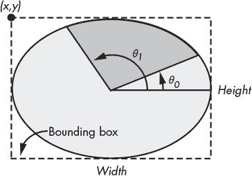

*图 4-18：椭圆包围盒*

要显示绘图，我们只需打印包含我们正在绘制的位图的变量（通过绘图上下文 `dc`）：

```
> (print drawing)
```

它会产生这样的效果：

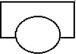

文本可以通过 `draw-text` 方法添加到绘图中。

```
> (send dc draw-text "Hello, World!" 10 10)
```

在这种情况下，最后两个参数指定了文本左上角的 x 和 y 坐标。

为了将这些思想结合起来，这里有一些简单的代码来绘制一个粗略的汽车。

```
#lang racket

(require racket/draw)

(define drawing (make-bitmap 200 100)) ; a 200x100 bitmap
(define dc (new bitmap-dc% [bitmap drawing]))

; background
(send dc set-brush (new brush% [color "yellow"]))
(send dc draw-rectangle 0 0 200 100)

; antenna
(send dc draw-line 160 5 160 50)
(send dc set-brush (new brush% [color "gray"]))
(send dc draw-rectangle 155 45 10 5)

; body
(send dc set-pen "black" 2 'solid)
(send dc set-brush (new brush% [color "gray"]))
(send dc draw-rectangle 60 20 80 30)

(send dc set-brush (new brush% [color "red"]))
(define c (make-object color% 0 255 255))
(send dc set-pen c 2 'solid)
(send dc draw-rectangle 20 50 160 30)

; wheels
(send dc set-pen "black" 2 'solid)
(send dc set-brush (new brush% [color "blue"]))
(send dc draw-ellipse  40 60 40 40)
(send dc draw-ellipse 120 60 40 40)

(send dc draw-text "This is a car?" 5 1)

(print drawing)
```

运行此代码将产生图 4-19 中显示的惊艳艺术作品。根据你的计算机，输出可能会有所不同（主要是由于字体的处理方式不同）。

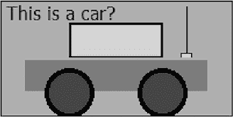

*图 4-19：一件惊艳的艺术作品*

绘图库包含了比我们在这里展示的更多功能，但我们已经学到了足够的知识来开始使用。在接下来的章节中，我们将实际应用我们的新技能（并学习一些新技能）。

### 集合论

你可能会觉得将集合论的讨论放在图形章节中是一个奇怪的选择，你说得对。但是，当你能看到图形时，集合论会更容易理解，我们可以利用 DrRacket 出色的图形功能来说明集合论的一些基本概念。我们还将看到图形库的一些额外功能。

#### *基础知识*

*集合* 就是一些任意的元素集合，例如 *{*5, 1/2, 7, 12*}* 或 *{*汽车, 公交车, 火车*}*。数学集合的一个显著特点是，数学集合不允许包含两个相同的元素。例如 *{*8, 2, 9, 2*}* 不是一个集合，因为数字 2 出现了两次（这种情况通常称为 *袋* 或 *多重集合*）。我们可以通过 *成员*（或 *属于*）符号 ∈ 来表示某个元素属于某个集合。例如 5 ∈ *{*8, 2, 5, 9, 3*}*。同样，我们也可以通过 *非成员* 符号 ∉ 来表示某个元素不属于某个集合，例如 7 ∉ *{*8, 2, 9, 3*}*。

在 Racket 中，集合可以通过一个名为 *hash set* 的对象来表示。一个哈希集合可以是可变的或不可变的，取决于它是如何构建的。可变哈希集合是通过 `mutable-set` 形式创建的，而不可变集合是通过 `set` 形式构建的。我们可以使用 `set-member?` 来测试一个元素是否是哈希集合的成员。元素可以通过 `set-add!` 形式添加到可变集合中，并且可以通过 `set-add` 形式从一个旧的（不可变的）集合中创建一个新的集合。

在接下来的示例中，`mset` 将指定一个可变集合，`iset` 将指定一个不可变集合。

```
   > (define mset {mutable-set 5 1/2 7 12 1/2})
   > mset
   (mutable-set 5 1/2 7 12)

   > (set-member? mset 7)
   #t

   > (set-member? mset 9)
   #f

➊ > (set-add mset 9)
   . . set-add:
     expected: (not/c set-mutable?)
     given mutable set: (mutable-set 5 1/2 7 12)
     argument position: 1st

   > (set-add! mset 9)
   > mset
   (mutable-set 5 1/2 7 9 12)

➋ > (set-add! mset 7)
   > mset
   (mutable-set 5 1/2 7 9 12)

   > (define iset (set 3 8 9 7 4))

   > iset
   (set 9 3 7 4 8)

   > (set-add iset 2)
   (set 9 3 7 2 4 8)

   > (set-add iset 3) ; note, no change in output
   (set 9 3 7 2 4 8)

➌ > (set-add! iset 2)
   . . set-add!:
     expected: set-mutable?
     given immutable set: (set 9 3 7 4 8)
     argument position: 1st
```

注意，我们无法在可变集合 ➊ 上使用 `set-add`，也无法在不可变集合 ➌ 上使用 `set-add!`。此外，尽管没有产生错误，但将数字 7 添加到 `mset` ➋ 上没有任何效果，因为 7 已经是成员。

在许多数学文献中，集合通过包含一个矩形和一个或多个圆的图示来表示。这些图示被称为 *韦恩图*。矩形用于表示所有感兴趣的项目（称为 *讨论宇宙* —— 我们将使用符号 *U* 来表示它），而圆形用于表示特定的集合。为了帮助我们进行探索，我们将定义一些辅助方法来绘制这些图示中的各种对象。

```
#lang racket
#lang racket
(require racket/draw)

(define WIDTH 150)
(define HEIGHT 100)

(define venn (make-bitmap WIDTH HEIGHT))
(define dc (new bitmap-dc% [bitmap venn]))

(send dc scale 1.0 -1.0)
(send dc translate (/ WIDTH 2) (/ HEIGHT -2))
(send dc set-smoothing 'smoothed) 
(send dc set-pen "black" 2 'solid)

(define IN-BRUSH (new brush% [color "green"]))
(define OUT-BRUSH (new brush% [color (make-object color% 220 220 220)]))
```

`(define dc (new bitmap-dc% [bitmap venn]))` 这段代码应该对我们之前的讨论很熟悉。

将绘图原点放在左上角，并且 y 轴方向翻转，这有些不方便，因此我们使用一种叫做 *变换* 的新特性。我们使用 `scale` 变换来按 x 轴方向放大 1 倍，按 y 轴方向放大 -1 倍。这保持了所有东西的大小不变，但将 y 轴翻转，使得向上变为正方向。为了将原点放置在图示的中央，我们使用 `translate` 来居中它。（还有一种旋转变换，但我们当前的目的不需要使用它。）

`set-smoothing` 参数用于 `send dc`，可以启用或禁用绘图的抗锯齿平滑。默认值为 `unsmoothed`，会产生略显锯齿的绘图效果。

`IN-BRUSH` 将用作表示集合中元素的颜色，而 `OUT-BRUSH` 用于表示集合外元素的颜色。

接下来，我们将创建一些方法来实际进行绘图。

```
(define (rect x y w h b)
  (let ([x (- x (/ w 2))]
        [y (- y (/ h 2))])
    (send dc set-brush b)
    (send dc draw-rectangle x y w h)))

(define (circle x y r b)
  (let ([x (- x r)]
        [y (- y r)])
    (send dc set-brush b)
    (send dc draw-ellipse x y (* 2 r) (* 2 r))))
```

`rect` 方法将绘制一个矩形，其中心位于坐标 (x,y)，宽度和高度分别为 `w` 和 `h`。`b` 是我们想要用来绘制矩形的画笔。类似地，`circle` 将绘制一个圆，其中心位于坐标 (*x, y*)，半径为 `r`，画笔为 `b`。

由于我们只需要绘制一个矩形（表示讨论宇宙 *U*），我们创建一个特殊函数，使其能够适当地绘制；我们只需要为它提供颜色的画笔。

```
(define (universe b) (rect 0 0 (- WIDTH 10) (- HEIGHT 10) b))
```

让我们试试这些（参见 图 4-20）。

```
> (universe OUT-BRUSH)
> (circle 0 0 30 IN-BRUSH)
> venn
```

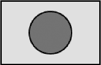

*图 4-20：表示单一集合的图示*

假设我们的讨论宇宙是整数（即 *U* = ℤ）。我们可以用绿色圆圈表示偶数集。现在假设我们对任何*不是*偶数的元素感兴趣。这就是偶数集的*补集*。*A* 的集合补集可以表示为 *A*^(*c*)，Ā，或 *A*’。我们在维恩图中表示如下（并参见图 4-21）：

```
> (send dc erase)
> (universe IN-BRUSH)
> (circle 0 0 30 OUT-BRUSH) 
> venn
```

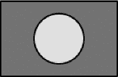

*图 4-21：集合外的元素*

请注意，在生成下一个图示之前，我们使用了 `erase` 来清除绘图上下文。

集合可以以多种方式组合。假设我们有两个集合：*A* 和 *B*。一种组合这些集合的方式是形成一个新的集合，这个集合是集合 *A* 和 *B* 中所有元素的唯一组合。这个操作叫做*集合并*，用符号 ∪ 表示。如果 *C* 是 *A* 和 *B* 的并集，那么数学表达式表示为 *C* = *A* ∪ *B*。使用*集合构造*符号，集合补集可以表示为 *A*^(*c*) = *{x* ∈ *U* ∣ *x* ∉ *A}*。用语言表达就是“*U* 中所有 *x* 的集合，使得 *x* 不在 *A* 中。”

另一种理解集合 *A* 和 *B* 并集的方法是将其看作由以下几个部分组成：

+   所有在 *A* 中而不在 *B* 中的元素（左侧部分圆形）。

+   所有在 *B* 中而不在 *A* 中的元素（右侧部分圆形）。

+   所有同时在 *A* 和 *B* 中的元素（图示的中央形状——这个形状称为*鱼膀胱*，拉丁语为“鱼的膀胱”）。

请参见 图 4-22 以查看示例。

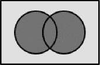

*图 4-22：集合并*

#### *简短的数学绕行*

为了能够绘制 图 4-22 中的维恩图组件，我们首先需要做一些简单的计算。我们的计算将基于 图 4-23 中说明的命名法。

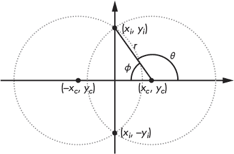

*图 4-23：如何绘制维恩图*

让我们看看如何找到图 4-23 中显示的 *x*[*i*]、*y*[*i*]、*θ* 和 *ϕ* 的值。假设 *x*[*c*]、*y*[*c*] 和 *r* 已知。注意，圆形显然关于 y 轴对称，这在某种程度上简化了我们的任务。可以立即得出 *x*[*i*] = 0。一个以 x 轴为中心的圆的方程如下所示：

(x - x[c])² + y² = r²

交点出现在 *x* = 0。通过这个代入并解出 *y*，我们得到以下结果：

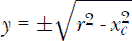

给定 *y*，角度很容易求出：

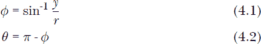

现在让我们来练习一种新的 DrRacket 图形功能，称为 *路径*。路径功能允许绘制任意的图形。路径是通过选择起始位置并构建一系列段来定义整个路径。路径段可以由直线、弧线和一种称为贝塞尔曲线的图形组成（请参见手册）。我们通过以下方法构建一个填充路径来表示韦恩图的中心部分（*vesica piscis*）。

```
(define (piscis x y r b)
  (let* ([y (- y r)]
         [2r (* 2 r)]
         [yi (sqrt (- (sqr r) (sqr x)))] ; y-intersection
         [π pi]
      ➊ [ϕ (asin (/ yi r))]
      ➋ [θ (- π ϕ)]
      ➌ [path (new dc-path%)])
    (send dc set-brush b)
 ➍ (send path move-to 0 (- yi))
 ➎ (send path arc (- x r)     y 2r 2r  θ    (+ π  ϕ))
 ➏ (send path arc (- (- x) r) y 2r 2r (- ϕ) ϕ)
 ➐ (send dc draw-path path)))
```

在 `let*` 表达式中，我们可以找到方程 (4.1) ➊ 和 (4.2) ➋ 的直接翻译。标识符 `path` 然后被绑定到一个新的 `dc-path%` 对象 ➌。路径的工作方式有点像绘图上下文，路径命令会发送到路径对象来构建路径。代码随后将我们定位到初始位置，以绘制第一个弧线 ➍。然后绘制第一个弧线 ➎，并通过镜像第一个弧线来完成它 ➏。路径 `arc` 命令类似于绘图上下文中的 `draw-ellipse` 命令。唯一的区别是，`arc` 需要额外的参数来指定起始角度和结束角度。完成的路径会被发送到绘图上下文中渲染 ➐。

#### *得出结论*

在掌握了 `piscis` 后，我们已经具备了绘制任何二元集合运算所需的大部分工具。为了帮助我们的任务，让我们定义一个简单的函数来生成最终的图表。

```
(define SET-BRUSH (new brush% [color (make-object color% 220 255 220)]))

(define (venn-bin b1 b2 b3)
  (universe OUT-BRUSH)
  (circle (- CIRCLE-OFF) 0 30 b1)
  (circle CIRCLE-OFF 0 30 b3)
  (piscis CIRCLE-OFF 0 30 b2)
  (print venn))
```

我们在 `SET-BRUSH` 中定义了一种新的浅绿色，用于标识参与运算的集合。`venn-bin` 方法（`bin` 部分只是指它在绘制二元操作）接受三种刷子，每种刷子标识图表中的一个组件。其余的代码应该是不言自明的。

为了生成我们在图 4-22 中看到的并集图，我们使用：

```
> (venn-bin IN-BRUSH IN-BRUSH IN-BRUSH)
```

为了说明 Racket 的集合操作，我们将使用两个集合：

```
> (define A (set 2 4 6 8 10 12 14 16 18))
> (define B (set 3 6 9 12 15 18))
```

这是形成两个集合的并集 (*A* ∪ *B*) 后的结果：

```
> (set-union A B)
(set 9 18 14 3 16 2 6 10 15 4 8 12)
```

请注意，集合不一定按任何特定顺序排列。

我们接下来的操作是 *集合交集*。集合交集由符号 ∩ 表示。*A* 和 *B* 的交集包含所有同时属于 *A* 和 *B* 的元素。即 *A* ∩ *B* = *{x* ∣ *x* ∈ *A* 且 *x* ∈ *B}*。交集的韦恩图如下所示：

```
(venn-bin SET-BRUSH IN-BRUSH SET-BRUSH)
```

它也显示在图 4-24 中。

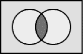

*图 4-24：集合交集*

下面是一个 Racket 代码的交集示例：

```
> (set-intersect A B)
(set 18 6 12)
```

接下来是 *集合差异*。集合差异由符号 *\* 表示。*A* 和 *B* 的集合差异包含所有属于 *A* 但不属于 *B* 的元素。即 *A \ B* = {*x* ∣ *x* ∈ *A* 且 *x* ∉ *B*}。集合差异的维恩图如下所示：

```
(venn-bin IN-BRUSH SET-BRUSH SET-BRUSH)
```

它也显示在 图 4-25 中。

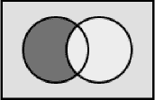

*图 4-25：集合差异*

集合差异通过 Racket 中的 `set-subtract` 函数执行。

```
> (set-subtract A B)
(set 14 16 2 10 4 8)
```

我们的最终操作是 *对称差异*。对称差异由符号 △ 表示。*A* 和 *B* 的对称差异包含所有属于 *A* 或 *B* 但不同时属于 *A* 和 *B* 的元素。即 *A* △ *B* = {*x* ∣ *x* ∈ *A* 或 *x* ∈ *B*，但 *x* 不属于 *A* 且不属于 *B*}。对称差异的维恩图如下所示：

```
(venn-bin SET-BRUSH IN-BRUSH SET-BRUSH)
```

参见 图 4-26 中的示例。

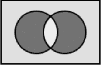

*图 4-26：对称差异*

对称集合差异通过 Racket 中的 `set-symmetric-difference` 函数执行。

```
> (set-symmetric-difference A B)
(set 9 14 3 16 2 10 15 4 8)
```

#### *我们有关联吗？*

在集合理论中，有几个重要的关系是你应该了解的。第一个是 *子集* 的概念。如果集合 *A* 的所有元素也都是集合 *B* 的元素，那么集合 *A* 是集合 *B* 的子集。这个关系由符号 ⊆ 表示。在 Racket 中，可以使用谓词 `subset?` 来测试一个集合是否是另一个集合的子集。

```
> (subset? (set 2 4 6 8) (set 1 2 3 4 5 6 7 8 9 10))
#t

> (subset? (set 2 4 6 8) (set 3 4 5 6 7 8 9 10))
#f
```

第一个示例中的子集关系可以通过 图 4-27 中的维恩图表示。在这种情况下，内圈完全被外圈包围。

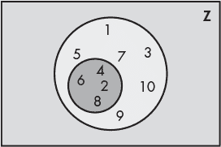

*图 4-27：子集关系*

如果集合 *A* 是集合 *B* 的子集，但 *A* ≠ *B*，则称 *A* 为 *B* 的 *真子集*。这个关系由符号 ⊂ 表示。Racket 提供了 `proper-subset?` 谓词来执行此功能。

```
> (subset? (set 2 4 6 8) (set 2 4 6 8))
#t

> (proper-subset? (set 2 4 6 8) (set 2 4 6 8))
#f
```

给定集合 *A* 和 *B*，*笛卡尔积* 定义如下：

*A* × *B* = {(*a*, *b*) | *a* ∈ *A* 且 *b* ∈ *B*}

虽然 Racket 没有内建的函数返回两个集合的笛卡尔积，但我们可以轻松地自己实现一个版本。

```
> (define (cart-prod A B)
    (list->set
     (for*/list ([a A]
                 [b B])
       (list a b))))
```

但是一个更简洁的版本如下：

```
> (define (cart-prod A B)
    (for*/set ([a A]
               [b B])
      (list a b)))
```

我们可以通过以下方式进行测试：

```
> (define A (set 'a 'b 'c))
> (define B (set 1 2 3))

> (cart-prod A B)
(set '(a 1) '(c 3) '(c 1) '(c 2) '(a 2) '(a 3) '(b 2) '(b 3) '(b 1))
```

从中可以看出，笛卡尔积是从两个给定集合中生成的所有可能值对的集合。笛卡尔积的子集常常用于定义关系。例如，如果 *A* = {1, 2, 3, 4}，我们可以如下表示“小于”关系：

{(1, 2), (1, 3), (1, 4), (2, 3), (2, 4), (3, 4)}

注意，每对中的第一个值总是小于第二个元素。

这段简短的探索结束了我们利用 DrRacket 的图形功能，探讨集合理论这一激动人心的主题。接下来，我们将看看几个扩展应用，利用这些功能来探索数学中的其他主题。

### 应用

让我们从一个老朋友开始，斐波那契数列。

#### *斐波那契复习*

正如我们在上一个章节的斐波那契与朋友部分所学，使用斐波那契数列给出的边长的正方形始终可以平铺一个矩形。在这一部分，我们将创建一个可以绘制任何斐波那契数（直到屏幕限制）的平铺的函数。平铺从绘图画布的中心开始，并通过从该点螺旋状扩展出去。我们在编写这段代码之前，进行一些小的分析将帮助我们找到方向。

##### 平铺

请参见图 4-28。我们将使用每个正方形的左上角作为参考点（如黑色象限所示）。每个箭头表示我们必须移动的方向，以创建下一个斐波那契正方形。

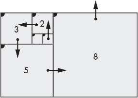

*图 4-28：瓷砖分析*

如果 *n* 是第 *n* 个斐波那契数（*F*[*n*]），我们将 *f*[*n*] 定义为具有边长 *s*[*n*] 的第 *n* 个斐波那契正方形（这只是 *F*[*n*] 的某个常数倍）。*f*[*n*] 的左上角坐标为（*x*[*n*]，*y*[*n*]）。我们假设绘图已经初始化，*f*[1] 和 *f*[2] 如图中心的两个小正方形所示。从 *f*[2] 向上移动到 *f*[3]，我们看到（*x*[*3*]，*y*[*3*]）=（*x*[*1*]，*y*[*2*] - 2）。我们可以将这一点推广为（*x*[*n*]，*y*[*n*]）=（*x*[*n-2*]，*y*[*n-1*] - *s*[*n*]），每当我们从一个正方形移动到另一个正方形时，方向向上。表 4-1 给出了四个方向的坐标变化。由于模式在四次移动后会重复，因此适用的移动由余数（*n* mod 4）列给出。

**表 4-1**：方向坐标

| 方向 | 坐标 | *n* mod 4 |
| --- | --- | --- |
| *↑* | (x[n-2], y[n-1] – s[n]) | 3 |
| ← | (x[n-1] – s[n], y[n-1]) | 0 |
| *↓* | (x[n-1], y[n-1] + s[n-1]) | 1 |
| → | (x[n-1] + s[n-1], y[n-2]) | 2 |

这张表告诉我们，在绘制过程中任何阶段，我们不仅需要访问 *F*[*n*] 和 *F*[*n-*1]，还需要（x[n-1], y[n-1]）和（*x*[*n-2]，*y*[*n-2]）。我们将使用斐波那契与朋友部分介绍的第二种方法来生成绘图代码中的 *F*[*n*]。因此，我们将描述一个 `draw-tiles` 函数，该函数接收一个斐波那契 *n* 并返回四个值：*x*[*n-*1]，*y*[*n-*1]，*x*[*n-*2]，和 *y*[*n-*2]。这些值与 *F*[*n*] 和 *F*[*n-*1] 一起用于绘制第 *n* 个瓷砖。

图 4-29 显示了调用 `(draw-tiles 10)` 后的结果。

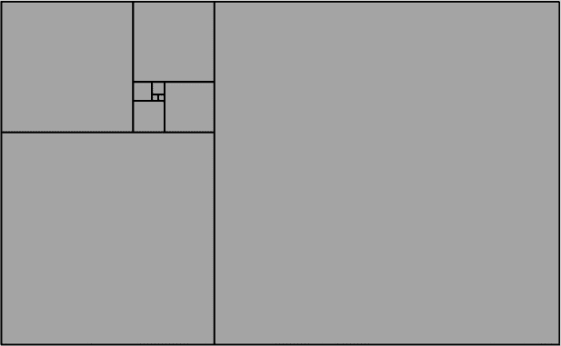

*图 4-29：斐波那契平铺*

我们的代码从一些常量定义开始，以设定在程序其余部分中使用的参数。

```
#lang racket
(require racket/draw)

(define WIDTH 600)  ; width of drawing area
(define HEIGHT 400) ; height of drawing area
(define UNIT 6) ; pixels in unit-width square
(define OFFSET-X 140) ; starting x offset
(define OFFSET-Y 75) ; starting y offset
(define START-X (- (/ WIDTH 2)  UNIT OFFSET-X))
(define START-Y (- (/ HEIGHT 2) UNIT OFFSET-Y))
```

这里应该有足够的注释来说明每个部分的作用。我们通过添加一些偏移值来弥补瓷砖不对称的特性。

接下来，我们设置绘图表面、画笔和画刷。

```
(define tiling (make-bitmap WIDTH HEIGHT)) 
(define dc (new bitmap-dc% [bitmap tiling]))

(define TILE-PEN   (new pen% [color "black"] [width 1] [style 'solid]))
(send dc set-pen TILE-PEN)

(define TILE-BRUSH (new brush% [color "yellow"] [style 'solid]))
(send dc set-brush TILE-BRUSH)
```

现在我们定义两个函数：一个用于计算*F*[*n*]，另一个是`draw-n`，用于实际生成清单 4-1 中的瓷砖：

```
  ; function to compute F(n)
  (define (F n)
    (define (f a b cnt)
      (if (= cnt 0) b
          (f (+ a b) a (- cnt 1))))
    (f 1 0 n))

  ; function to draw the tiling
  (define (draw-n n)
 ➊ (let* ([fn (F n)]
       ➋ [sn (* UNIT fn)]
       ➌ [fn1 (F (sub1 n))]
       ➍ [sn1 (* UNIT fn1)]
          [n-mod-4 (remainder n 4)])
     (cond [(< n 2) #f] ; do nothing tiles already drawn
           [(= n 2) (values (+ UNIT START-X) START-Y START-X START-Y)]
           [else
         ➎ (let-values ([(x1 y1 x2 y2) (draw-n (sub1 n))])
              (let-values ([(x y)
                            (case n-mod-4
                           ➏ [(0) (values (- x1 sn) y1)]
                              [(1) (values x1 (+ y1 sn1))]
                              [(2) (values (+ x1 sn1) y2)]
                           ➐ [(3) (values x2 (- y1 sn))])])
              ➑ (draw-tile x y sn)
              ➒ (values x y x1 y1)))])))
```

*清单 4-1: 使用瓷砖的斐波那契数列*

`draw-n`函数是这个过程的核心。这个过程会递归调用➎，直到绘制出所需数量的瓷砖。首先，我们计算*F*[*n*] ➊和*F*[*n-*1] ➌。然后，我们将这些数字乘以常量`UNIT` ➋ ➍来确定方块的大小。接下来，我们根据表 4-1 中讨论的内容确定方块左上角的坐标 ➏ ➐。然后，实际绘制瓷砖 ➑。最后，我们返回在上述分析部分中提到的值*x*[*n-*1]、*y*[*n-*1]、*x*[*n-*2]和*y*[*n-*2] ➒，因为这些值是前一个递归调用➎所需要的。

为了实际绘制图形，我们有以下代码：

```
(define (draw-tiles n)
  (draw-tile START-X START-Y UNIT)
  (draw-tile (+ UNIT START-X) START-Y UNIT)
  (draw-n n)
  (print tiling))
```

它用两个单位方块初始化绘图，调用`draw-n`，并将构建的位图输出到屏幕上。

最后，调用`(draw-tiles 10)`将生成之前在图 4-29 中展示的输出。

##### 黄金螺旋（近似）

为了绘制在第三章中讨论的黄金螺旋（并在图 4-30 中再现），我们只需在我们的瓷砖代码中添加几行内容。

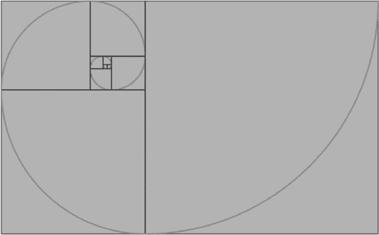

*图 4-30: 黄金螺旋*

我们首先定义一个新的绘图画笔和画刷，用于绘制螺旋。

```
(define SPIRAL-PEN (new pen% [color "red"] [width 2] [style 'solid]))
(define TRANS-BRUSH (new brush% [style 'transparent]))
```

为了绘制螺旋，我们将使用`draw-arc`函数。这个函数的工作方式与`draw-ellipse`相似，不同之处在于它多了两个参数，用来指定弧线的起始角度和终止角度。这些值在图 4-18 中由*θ*[0]和*θ*[1]表示。默认情况下，弧线使用填充画刷，因此为了避免覆盖瓷砖，我们将`TRANS-BRUSH`定义为透明画刷。螺旋是通过每绘制一个瓷砖就绘制一个弧线来产生的。我们预先定义了绘制弧线时需要用到的各种角度（以弧度为单位）：

```
; define angle constants
(define 0d 0)
(define 90d (/ pi 2))
(define 180d pi)
(define 270d (* 3 (/ pi 2)))
(define 360d (* 2 pi))
```

接下来，我们定义了用于绘制螺旋段的实际函数。

```
(define (arc x y r a)
  (let-values ([(d) (values (* 2 r))]
               [(start stop x y)
                (case a
               ➊ [(0) (values  90d 180d x       y  )]
                  [(1) (values 180d 270d x       (- y r)  )]
                  [(2) (values 270d 360d (- x r) (- y r) )]
                  [(3) (values   0d  90d (- x r) y)])])
    (send dc set-pen SPIRAL-PEN)
    (send dc set-brush TRANS-BRUSH)
    (send dc draw-arc x y d d start stop)
    (send dc set-pen TILE-PEN)
    (send dc set-brush TILE-BRUSH)))
```

首先，我们确定弧线的起始角度和终止角度 ➊，以及绘制弧线的位置的 x 坐标和 y 坐标。接下来，我们切换到适当的画笔和画刷来绘制弧线。最后，绘图上下文被重置为绘制瓷砖所需的状态。

对`draw-n`代码所需的唯一修改是在清单 4-1 中的`(draw-tile x y sn)`语句 ➑后立即添加这一行：

```
(arc x y sn n-mod-4)
```

通过这个修改，调用 `(draw-tiles 10)` 现在会生成一个覆盖黄金螺旋的瓷砖，如 图 4-30 所示。

#### *Nim*

Nim 是一款策略游戏，两个玩家轮流从不同的堆中移除物体。每一轮，玩家必须至少移除一个物体，并且可以移除任意数量的物体，只要它们都来自同一个堆。游戏的胜者是最后移除物体的玩家。这个游戏也可以修改为移除最后一个物体的玩家输，但在我们这个版本中，移除最后一个物体的玩家获胜。

在这个版本的 Nim 中，我们将有三个堆，每个堆最多有 15 个球，如 图 4-31 所示。这次不再是两个玩家对战，而是人类对机器，*mano a mano*。

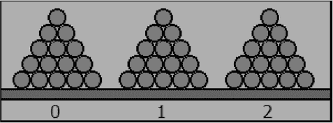

*图 4-31：Nim 开始的堆*

##### 设置图形

我们将从一些基本定义开始，以建立一些有用的常量。这些常量大多数应该是相当明显的。`BOARD`引用的是球体所放置的棕色板。

```
#lang racket
(require racket/draw)

; overall dimensions of drawing area
(define WIDTH 300)
(define HEIGHT 110)
(define BOTTOM-MARGIN 20)

(define RADIUS 8) ; ball radius
(define DIAMETER (* 2 RADIUS))
(define DELTA-Y (- (* DIAMETER (sin (/ pi 3)))))

(define BOARD-THICKNESS 10)
(define BOARD-Y (- HEIGHT BOARD-THICKNESS BOTTOM-MARGIN))

; location to start drawing pile numbers
(define TEXT-X (+ 5 (* RADIUS 5)))
(define TEXT-Y (- HEIGHT BOTTOM-MARGIN))

; x, y location to start drawing balls
(define START-X 20)
(define START-Y (- BOARD-Y RADIUS))

(define BALL-BRUSH (new brush% [color "red"]))
(define BACKGROUND-BRUSH (new brush% [color "yellow"]))
(define BOARD-BRUSH (new brush% [color "brown"]))
```

Nim 图形的关键是 `draw-pile` 函数，如下所示，它绘制了一个单独的球堆。此代码使用球的中心位置的 x 和 y 坐标调用 `draw-ball`。它从下到上绘制每一行（见 `draw-row`），直到没有更多球或该行已经包含所有球。

```
(define (draw-ball x y) ; draw ball with center at (x,y)
  (send dc draw-ellipse (- x RADIUS) (- y RADIUS) DIAMETER DIAMETER))

(define (draw-pile n start-x)
  {let ([rem n]
        [x start-x]
        [y START-Y])
    (define (draw-row x y n max)
       (when (and (> rem 0) (<= n max))
         (set! rem (sub1 rem))
         (draw-ball x y)
         (draw-row (+ x DIAMETER) y (add1 n) max)))
    (for ([r (in-range 5 0 -1)])
      (draw-row x y 1 r)
      (set! x (+ x RADIUS))
      (set! y (+ y DELTA-Y)))})
```

最后，我们来看一下实际上绘制整个 Nim 环境的代码 `draw-game`：

```
(define pile (make-vector 3 15))

(define (draw-game)
  (send dc set-pen "black" 2 'solid)
  (send dc set-brush BACKGROUND-BRUSH)
  (send dc draw-rectangle 0 0 WIDTH HEIGHT)
  (send dc set-brush BOARD-BRUSH)
  (send dc draw-rectangle 0 BOARD-Y WIDTH BOARD-THICKNESS)
  (send dc set-brush BALL-BRUSH)

  (draw-pile (vector-ref pile 0) START-X)
  (send dc draw-text "0" TEXT-X TEXT-Y)

  (draw-pile (vector-ref pile 1) (+ START-X (* 6 DIAMETER)))
  (send dc draw-text "1" (+ TEXT-X (* 6 DIAMETER)) TEXT-Y)

  (draw-pile (vector-ref pile 2) (+ START-X (* 12 DIAMETER)))
  (send dc draw-text "2" (+ TEXT-X (* 12 DIAMETER)) TEXT-Y)

  (print drawing) ; display the board
)
(draw-game)
```

这个例程只是绘制了背景和堆下的矩形板。然后它会为每个堆调用一次 `draw-pile`。每个堆中包含的球的数量存储在向量变量 `pile` 中。作为参考，堆的编号显示在每个堆下方。

##### 游戏玩法

Nim 游戏在所有游戏中有点不同，因为已知存在一种完美的游戏策略。它相对容易实现，但并不显而易见。所以，一旦你编写了这个程序，你就可以将它用在一个毫无戒备的朋友身上，让电脑把他打得一败涂地。

这一策略的关键是所谓的 *nim-sum*。nim-sum 就是每个堆中物体数量的按位异或。异或运算符用数学符号 ⊕ 表示，通常称为 xor。它可以通过 Racket 的 `bitwise-xor` 函数来计算。

按位异或的计算方法如下：如果你在结合两个单一的比特且两个比特相同，则结果为 0；否则，结果为 1。例如，1 ⊕ 1 = 0 和 1 ⊕ 0 = 1。

在 Racket 中，我们可以通过在 `printf` 语句的格式字符串中使用 `"`˜`b"` 来显示数字的二进制表示。例如，我们有如下代码：

```
> (printf "~b" 13)
1101

> (printf "~b" 9)
1001

> (printf "~b" (bitwise-xor 13 9))
0100
```

请注意，如果你在对应的比特位置上对 13[10] = 1101[2] 和 9[10] = 1001[2] 进行按位异或运算，你会得到 0100[2]。

事实证明，获胜的策略就是每次操作结束时使 nim-sum（即异或）为 0。如果在操作之前 nim-sum 不为零，那么这种方法总是可行的。实现这一点的方法如下：

1.  指定 *b*[0]、*b*[1] 和 *b*[2]* 为堆 0、堆 1 和堆 2 中的球数。

1.  设 *s* = *b*[0] ⊕ *b*[1] ⊕ *b*[2] 为所有堆大小的 nim-sum。

1.  计算 *n*[0] = *s* ⊕ *b*[0]、*n*[1] = *s* ⊕ *b*[1] 和 *n*[2] = *s* ⊕ *b*[2]。

1.  在这三堆中，至少有一个值 *n*[0]、*n*[1] 或 *n*[2] 的数值将小于对应堆中的物品数量。我们从其中一堆中选择，并用字母 *i* 来表示它。

1.  获胜的操作是将堆 *i* 的大小减少到 *n*[*i*]。也就是说，这一步是从堆 *i* 中移除 *b*[*i*] *- n*[*i*] 个球。

如果在玩家回合开始时 nim-sum 为零，那么如果对手完美发挥，该玩家将会输。在这种情况下，最佳策略是通过从其中一堆中取出一个球来拖延时间，并希望对手在某个时刻犯错。之所以这种策略有效，原因有点技术性，不过可以在维基百科的文章中找到分析，链接为 *[`en.wikipedia.org/wiki/Nim`](https://en.wikipedia.org/wiki/Nim)*。

这引出了实际的 Racket 代码，用于找到获胜的操作。

```
➊ (define nim-sum bitwise-xor)

➋ (define (random-pile) ; select a random pile that has balls
     (let ([i (random 3)])
       (if (> (vector-ref pile i) 0) i (random-pile))))

   (define (find-move)
     (let* ([balls (vector->list pile)]
         ➌ [s (apply nim-sum balls)])
    ➍ (if (= 0 s)
           (let ([i (random-pile)]) (values i 1)) ; stall
        ➎ (let ([n (list->vector (map (λ (b) (nim-sum s b)) balls))])
          ➏ (define (test? i) (< (vector-ref n i) (vector-ref pile i)))
             (define (move i) (values i  (- (vector-ref pile i) (vector-ref n i))))  
          ➐ (cond [(test? 0) (move 0)]
             [(test? 1) (move 1)]
             [(test? 2) (move 2)])))))
```

首先，我们将 `nim-sum` 定义为 `bitwise-xor` ➊。接下来，我们有辅助函数 `random-pile` ➋，它只是找到一个有球的随机堆。我们用它来实现上述提到的拖延策略。`find-move` 实现了我们在上面列出的整体游戏策略。该函数返回两个值：堆的编号和从堆中移除的球数。现在我们计算整体的 nim-sum ➌（上面步骤 2）。然后测试这个和 ➍，如果它为零，它就返回一个随机堆，移除一个球。上面步骤 3 中提到的计算执行 ➎。局部函数 `test?` ➏ 确定 *n*[*i*] 是否小于 *b*[*i*]。局部函数 `move` 返回堆的编号和要移除的球数，如步骤 5 所示。最后，我们进行测试以确定使用哪个堆 ➐。

在我们为玩家输入他们的操作创建代码之前，我们定义了一些辅助函数。

```
(define (apply-move p n) ; remove n balls from pile p
  (vector-set! pile p (- (vector-ref pile p) n)))

(define (game-over?)
  (for/and ([i (in-range 3)]) (= 0 (vector-ref pile i))))

(define (valid-move? p n)
  (cond [(not (<= 0 p 2)) #f]
        [(< n 0) #f]
        [else (>= (vector-ref pile p) n)]))
```

`apply-move` 函数通过移除指定数量的球来更新指定的堆。`game-over?` 函数测试是否还有球可以继续操作。`valid-move?` 函数测试给定的操作是否有效。

将所有内容结合起来的是实现以下游戏循环的函数：

```
(define (move p n)
  (if (not (valid-move? p n))
    (printf"\n Invalid move.\n\n")
    (begin (apply-move p n)
           (if (game-over?)
             (printf "\nYou win!")
             (let-values ([(p n) (find-move)])
             (draw-game)
             (printf "\n\nComputer removes ~a balls from pile ~a.\n" n p)
             (apply-move p n)
             (draw-game)
             (when (game-over?)
               (printf "\nComputer wins!")))))))
```

玩家通过指定堆的编号和要移除的球数来输入他们的操作。例如，要从堆 1 中移除 5 个球，可以输入以下内容：

```
> (move 1 5)
```

为了让事情更有趣，我们定义了一个 `init` 函数，它会随机初始化每个堆，球的数量在 10 到 15 个之间。

```
(define (init)
  (for ([i (in-range 3)]) (vector-set! pile i (random 10 16)))
  (newline)
  (draw-game)
  (newline))
```

图 4-32 展示了正在进行中的游戏。


*图 4-32: Nim: 游戏进行中*

### 摘要

在本章中，我们玩转了绘图，探索了图形，并在过程中发现了 Racket 在视觉表现方面的强大功能。在下一章，我们将基于这个功能，突破命令行的局限，制作动画，并迈出创建互动应用程序的第一步。
