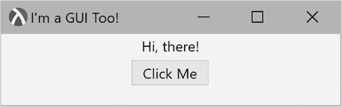
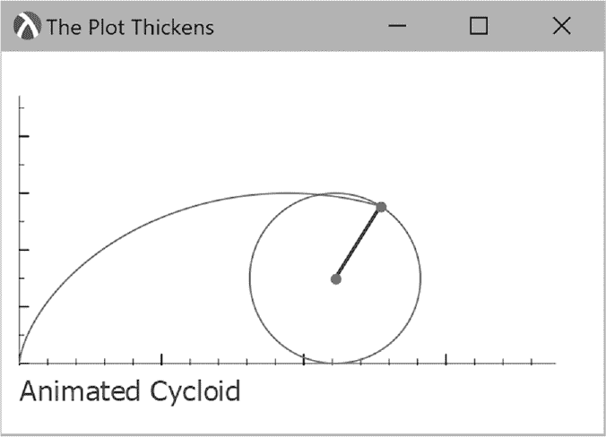
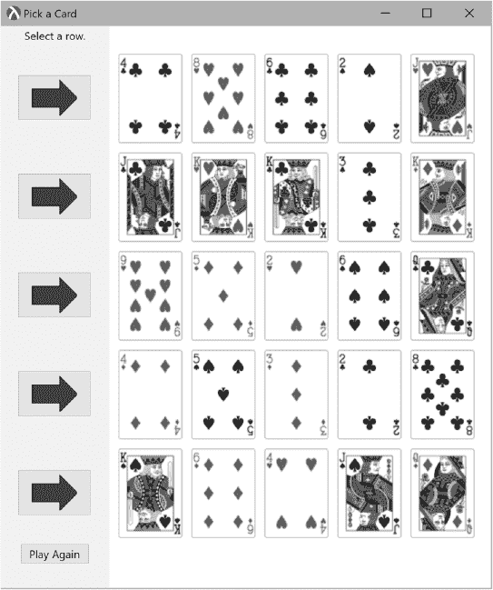
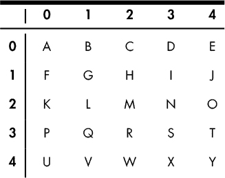
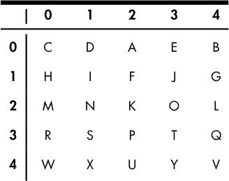
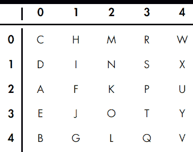
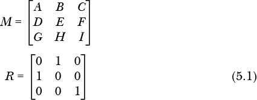
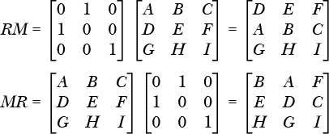
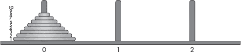
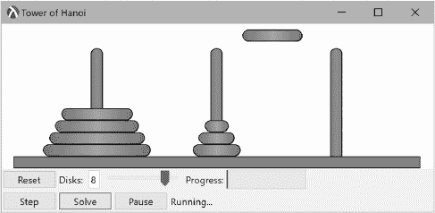

## 第五章：GUI：吸引用户兴趣


GUI（发音为 gooey）代表图形用户界面。这个术语是指任何具有图形元素的程序，与仅基于文本的程序不同。图形元素可以是静态图像或绘图，就像我们在上一章中探索的那样，或者是像按钮和菜单这样的互动元素。除了图形元素外，GUI 还引入了 *事件* 范式——事件触发动作。事件可以是按键、鼠标点击，甚至是定时器触发等。Racket 不仅支持构建迷你应用程序，还支持独立的可执行文件。

在本章中，我们将通过动画将我们的老朋友圆弧线重新带入生活，学习一些新的（卡片）技巧，并让汉诺塔不仅仅是一个智力游戏。

### GUI 简介

Racket GUI 编程使用 *racket/gui/base* 库，可以通过 `(require racket/gui/base)` 语句导入。或者，你可以使用语言切换 `#lang racket/gui`，它包含了 Racket 的基础库和 GUI 库。下面是一个简单的代码片段，它仅仅是创建并显示一个 300 x 200 像素的窗口框架。

```
#lang racket/gui

(define frame
  (new frame%
       [label "I'm a GUI!"]
       [width 300]
       [height 200]))

(send frame show #t)
```

你应该注意到，框架的大小是外部窗口的大小，包括标题栏和任何窗口边框。框架内部会稍微小一些。

以下代码展示了一个稍微更刺激的示例，演示了如何响应事件的基本思想。

```
   #lang racket/gui

   (define main-frame
     (new frame%
          [label "I'm a GUI Too!"]
          [width 300]
          [height 100]))

   (define msg
  ➊ (new message%
       ➋ [parent main-frame]
          [auto-resize #t]
          [label "Hi, there!"]))

➌ (new button%
        [parent main-frame]
        [label "Click Me"]
     ➍ [callback (λ (button event)
                   (send msg set-label "You didn't say may I!"))])

   (send main-frame show #t)
```

`message%` 对象 ➊ 创建一个文本为“Hi, there!”的标签（`message%` 对象比你想象的更强大；它们还可以包含一个位图作为标签）。GUI 对象通常需要指定它们所在的父框架 ➋。我们还定义了 `auto-resize` 参数，以便如果文本比初始化时的更大，消息控件会自动扩展。

接下来我们创建一个 `button%` 对象 ➌，并将其设置为 `main-frame` 窗口的子对象。按钮可以响应鼠标点击。这个响应通过 `callback` 选项 ➍ 来处理。它接受一个函数（在这种情况下是一个 lambda 表达式），该函数接受两个参数。当按钮被点击时，窗口事件处理器会将一个指向按钮对象的指针和一个包含事件信息的事件对象传递给回调函数（我们在这里没有使用它们；我们只需要知道按钮被点击了）。在我们的例子中，我们向 `msg` 对象发送一个命令，让它将标签设置为一个新值。

图 5-1 显示了该应用的外观（根据操作系统的不同，可能会略有不同）。



*图 5-1：简单的 GUI 应用程序*

让我们尝试一下动画。我们将从简单的开始，让一个小红圆圈在屏幕上移动：

```
   #lang racket/gui

   (define RADIUS 8) 
   (define DIAMETER (* 2 RADIUS))

   (define loc-x RADIUS)
   (define loc-y 35)

   (define main-frame
     (new frame%
          [label "I'm a GUI Too!"]
          [width 300]
          [height 100]))

   (define canvas
     (new canvas% [parent main-frame]
       ➊ [paint-callback
           (λ (canvas dc)
             (send dc set-smoothing 'smoothed)
             (send dc set-text-foreground "blue")
             (send dc draw-text "Having a ball!" 0 0)
             (send dc set-brush "red" 'solid)
             (send dc draw-ellipse (- loc-x RADIUS) (- loc-y RADIUS) DIAMETER DIAMETER))]))

   (define timer
   ➋ (new timer%
       ➌ [notify-callback
           (λ ()
          ➍ (set! loc-x (add1 loc-x))
          ➎ (send canvas refresh-now))]))

   (send main-frame show #t)

➏ (send timer start 50)
```

在这段代码中，我们在`frame%`对象中创建了一个`canvas%`对象。这是我们在上一章中探讨过的相同画布对象，因此之前看到的所有绘图命令都可用。`canvas`对象支持一个`paint-callback`事件➊。每当画布需要重新绘制时，都会触发此事件（注意，回调函数会提供一个绘图上下文`dc`）。默认情况下，当画布首次显示时会触发该事件，但我们通过使用`timer%`对象➋强制其刷新。画布对象会在`(loc-x, loc-y)`处绘制小球，因此我们的定时器会在每次调用时更新`loc-x`值。定时器会响应一个名为`notify-callback`的事件➌。当该事件触发时，它会通过发送`refresh-now`消息➎强制画布刷新。定时器回调还会递增`loc-x`变量➍。整个过程由最后一行代码启动。我们向定时器对象发送消息，使其每 50 毫秒触发一次➏。

我们在这里没有使用它，但定时器也可以通过向其发送`stop`消息来停止。`timer%`对象还支持`just-once?`选项，如果定时器只需要触发一次。也可以通过`start`消息来指定。例如，调用以下代码会使定时器停止，并在等待一秒钟后触发一次。

```
> (send timer stop)
> (send timer start 1000 #t)
```

如果我们希望小球来回弹跳，可以按如下方式修改`timer`：

```
(define timer
  (let ([delta 2])
    (new timer%
         [notify-callback
          (λ ()
            (cond [(<= loc-x RADIUS) (set! delta 2)]
                  [(>= loc-x (- (send canvas get-width) RADIUS)) (set! delta -2)])
            (set! loc-x (+ loc-x delta))
            (send canvas refresh-now))])))
```

这次我们定义了变量`delta`，它的值根据小球的运动方向可以是正值或负值。我们还添加了一个`cond`语句，用于检测小球是否到达画布的某个边缘，并改变其运动方向。

### 动画化摆线

在上一章中，我们展示了如何绘制摆线曲线，这条曲线是由一个在圆周上移动的点生成的，该点在没有滑动的情况下沿着直线滚动。在这一节中，我们将制作一个动画，以便我们可以看到这一运动的实际效果。最终结果将是一个滚动的圆形动画，圆周上的点在其运动过程中描绘出摆线。动画的快照见图 5-2。



*图 5-2：动画摆线*

我们再次使用`infix`包来简化代数表达式的输入。我们还将使用之前用过的*plot*库：

```
#lang at-exp racket/gui 
(require infix plot)
```

接下来我们看到`cycloid`函数与之前使用的版本相同。

```
(define r 30)
(define angle 0)

(define (cycloid t) @${vector[r*(t - sin[t]),  r*(1-cos[t])]})
(define (circle t) @${vector[r*angle + r*sin[t], r + r*cos[t]]})
```

再次提醒，`r`是用来定义摆线的圆的半径。`angle`变量用于定义动画中任意时刻的旋转角度。`circle`函数将用来创建我们正在旋转的实际圆的参数图（图中以绿色显示）。

为了创建从圆心到圆边的蓝色线段以及线的红色端点，我们将使用以下两个函数。参数`t`是旋转角度。

```
(define (line t)
  (let ([x @${r*(t - sin[t])}]
        [y @${r*(1 - cos[t])}]
        [x0 (* r angle)]
        [y0 r])
    (lines (list (vector x0 y0) (vector x y))
           #:width 2
           #:color "blue")))

(define (end-points t)
  (let ([x @${r*(t - sin[t])}]
        [y @${r*(1 - cos[t])}]
        [x0 (* r angle)]
        [y0 r])
    (points (list (vector x0 y0) (vector x y))
            #:size 10
            #:sym 'fullcircle1
            #:color "red"
            #:fill-color "red")))
```

这里应该没有什么意外：*x* 和 *y* 端点值是通过基本的三角学计算得出的（请参见上一章关于旋轮线问题的解决方案）。我们在上一章中也研究了使用`lines`和`points`的情况。

最后，我们来看看实际的绘图程序：

```
(plot-decorations? #f)

(define (cycloid-plot dc)
  (plot/dc (list
            (axes)
            (parametric circle 0 (* 2 pi) #:color "green")
         ➊ (parametric cycloid 0 angle #:color "red")
         ➋ (line angle)
         ➌ (end-points angle))
        ➍ dc 10 25 300 150
           #:x-min 0
           #:x-max (* r 2 pi)
           #:y-min 0
           #:y-max (* r pi)))
```

为了在 GUI 中绘图，我们必须使用一个特殊版本的`plot`，叫做`plot/dc`，因为这次我们希望输出进入绘图上下文。注意`plot`和`plot/dc`之间的区别 ➍。在这里，我们指定了绘图上下文、绘图的* x * 和 * y * 位置，以及绘图的宽度和高度。其他参数与`plot`相同。这段代码的主要内容是指定我们要绘制的具体对象。特别要注意的是：旋轮线本身 ➊、连接圆心到边缘的线 ➋，以及线的端点 ➌。列表开头的代码`(plot-decorations? #f)`关闭了一些坐标轴信息，以便我们获得一个更简洁的图形。

为了实际生成动画，我们对之前看到的窗口代码做了一些小改动：

```
(define main-frame
  (new frame%
       [label "The Plot Thickens"]
       [width 350]
       [height 250]))

(define canvas
  (new canvas% [parent main-frame]
       [paint-callback
        (λ (canvas dc)
          (send dc set-smoothing 'smoothed)
       ➊ (cycloid-plot dc)
          (send dc set-text-foreground "blue")
          (send dc draw-text "Animated Cycloid" 10 180))]))

(define timer
  (new timer%
       [notify-callback
        (λ ()
        ➋ (set! angle (+ 0.1 angle))
        ➌ (when (> angle (* 2 pi)) (set! angle 0))
           (send canvas refresh-now))]))

(send main-frame show #t)

(send timer start 10)
```

具体来说，我们在每次计时器滴答声响时更新旋转角度 ➋，当圆圈旋转达到 2*π*度时，将角度重置为零 ➌。绘图实际上是通过`cycloid-plot dc` ➊来生成的。

在完成了几个热身练习，以熟悉一些基本的 GUI 功能之后，我们来看看更有挑战性的内容——一些我们可以用来让朋友们惊叹的东西。

### 抽卡

让我们在计算机上施展一点魔法。在这个魔术中，我们随机发出一个 5x5 的卡牌矩阵，卡面朝上。参与者心里挑选其中一张卡片，并指出卡片所在的行。然后，卡片被重新洗牌，并再次发出一个 5x5 的矩阵。接着，参与者再次被要求指出卡片所在的行。选中的卡片随后会在热烈的气氛中被揭示出来。我们游戏的 Racket 版本如图 5-3 所示。这里使用的卡片图像根据 GPL 许可协议提供，感谢 Chris Aguilar 的贡献^(1)^和^(2)^。



*图 5-3：抽卡魔术*

很明显，如果卡片被正确洗牌并重新发出，就不可能不出错地选择正确的卡片。像所有的魔术一样，这个也涉及一点欺骗。这背后的机制其实相当简单。在以下图示中，我们用字母表示每张卡片。



假设在第二行第三列选择了`N`。我们可以随机交换列，而不影响已选中的行。做完这一步后，我们可能会得到如下所示的结果。



现在，我们得到的东西看起来相当不同，但我们仍然可以看到第 2 行中的 `N`（但现在位于第 1 列）。在一个重要的步骤中，我们进一步增强了这种错觉，我们对行和列进行了转置（所谓转置，是指行变成列，列变成行——也就是说，第 1 行变成第 1 列，第 2 行变成第 2 列，依此类推）。这样做会得到以下排列。



结果矩阵现在与原始矩阵完全不同，但请注意，`N` 现在位于第 2 列，而不是第 2 行。一旦玩家确定第 1 行为正确行（原本是第 1 列），我们立即得到了位置（第 1 行，第 2 列——原本是第 2 行）。由于我们对行和列进行了转置，玩家无意中揭示了卡片所在的行和列。

交换行和列，以及行列转置，是*线性代数*数学学科中的常见操作。我们将利用 Racket 的 *矩阵* 库，它提供了我们所需的功能。基于此，我们的代码从以下内容开始：

```
#lang racket/gui
(require math/matrix)

(define selected-row -1)
(define selected-col -1)
(define show-card #t)
```

`define` 表达式用于跟踪程序状态。

卡片位图将保存在一个名为 `card-deck` 的向量中。正在使用的卡片图像的根名称将存储在另一个向量中，名为 `card-names`。以下代码从一个名为 `Card PNGs` 的子文件夹中读取卡片图像：

```
(define card-names
  #("01H" "02H" "03H" "04H" "05H" "06H" "07H" "08H" "09H" "10H" "11H" "12H" "13H"
    "01C" "02C" "03C" "04C" "05C" "06C" "07C" "08C" "09C" "10C" "11C" "12C" "13C"
    "01D" "02D" "03D" "04D" "05D" "06D" "07D" "08D" "09D" "10D" "11D" "12D" "13D"
    "01S" "02S" "03S" "04S" "05S" "06S" "07S" "08S" "09S" "10S" "11S" "12S" "13S"))

(define card-deck 
  (for/vector ([card-name (in-vector card-names)]) 
    (read-bitmap (build-path "Card PNGs" (string-append card-name ".png")))))

(define card-width (send (vector-ref card-deck 0) get-width))
(define card-height (send (vector-ref card-deck 0) get-height))
```

请注意，我们使用了 `build-path` 来构造一个操作系统无关的路径名。

由于我们希望能够洗牌，以下代码将把 `card-deck` 按随机顺序排列：

```
(define (shuffle-deck)
  (for ([i (in-range 52)])
    (let ([j (random 52)]
          [t (vector-ref card-deck i)])
      (vector-set! card-deck i (vector-ref card-deck j))
      (vector-set! card-deck j t))))
```

`card-deck` 向量只是一个卡片位图的线性列表。为了能够以显示时的排列方式展示它们，我们定义了一个 Racket 的 `display-matrix`，它存储了指向 `card-deck` 向量的索引。我们还创建了 `get-card`，使我们能够根据卡片所在的行和列访问任何位图。

```
(define display-matrix
  (build-matrix SIZE SIZE (λ (r c) (+ (* r SIZE) c))))

(define (get-card r c)
  (vector-ref card-deck (matrix-ref display-matrix r c)))
```

在本节中，我们已经解释了这个技巧背后的基本机制，并定义了一些数据结构来存储谜题对象（卡片及其图像）。在下一节中，我们将利用 Racket 的布局机制生成一个吸引人的表格。

#### *GUI 布局*

我们之前使用过按钮、消息控件和画布控件，但我们以默认顺序显示它们，即一个堆叠在另一个上面。在这种情况下，我们需要一些更复杂的东西。Racket 提供了两个足够满足我们需求的布局控件：`horizontal-panel%` 和 `vertical-panel%`。`vertical-panel%` 控件允许我们将控件垂直堆叠，如 图 5-3 左侧所示。下面的代码中，我们使用 `horizontal-panel%` 来容纳 `vertical-panel%` 和用于绘制卡片面朝上的画布。

```
(define main-frame
  (new frame%
       [label "Pick a Card"]
       [width 550]
       [height 650]))

(define main-panel (new horizontal-panel%
                        [parent main-frame]))

(define control-panel (new vertical-panel%
                           [parent main-panel]
                           [min-width 100]
                           [stretchable-width 100]))

(define MARGIN 10)     ; in pixels
(define SIZE 5)        ; card rows and columns
(define MSG-HEIGHT 20) ; height of msg label

(define canvas
  (new canvas%
       [parent main-panel]
       [min-width 400]
       [paint-callback
        (λ (canvas dc)
          (send dc set-smoothing 'smoothed)
          (for* ([r (in-range SIZE)] ; draw the cards
                 [c (in-range SIZE)])
            (send dc draw-bitmap (get-card r c)
                  (+ MARGIN (* c (+ MARGIN card-width)))
                  (+ MSG-HEIGHT MARGIN (* r (+ MARGIN card-height)))))
       ➊ (when show-card ; draw red border on selected card
            (let* ([off-x (/ MARGIN 2)]
                   [off-y (+ off-x MSG-HEIGHT)])
              (send dc set-pen "red" 3 'solid)
              (send dc set-brush (new brush% [style 'transparent]))
              (send dc draw-rectangle
                    (+ off-x (* selected-col (+ MARGIN card-width)))
                    (+ off-y (* selected-row (+ MARGIN card-height)))
                    (+ card-width MARGIN) (+ card-height MARGIN))
              (send dc set-pen "black" 2 'solid)))
         )]))
```

大部分`canvas`的代码应该是熟悉的，但从`when` ➊开始的部分使用了一个名为`show-card`的状态变量，当它为真时，表示该显示选定的卡片（通过在卡片周围绘制红色边框）。

#### *构建控件*

我们希望在应用程序的左上角显示一个消息控件，以作为用户的提示。让我们现在添加代码来实现这一点。首先使用以下代码。

```
(define msg
  (new message%
       [parent control-panel]
       [min-height MSG-HEIGHT]
       [label "Select again."]))
```

为了美化我们的按钮，我们需要一张箭头的图像。与其去外面寻找箭头的位图，不如通过一系列`path`语句来即时构建它，正如我们在这里通过生成箭头形状的多边形来做到的：

```
(define arrow ; bitmap
  (let* ([image (make-bitmap 50 40)]
         [dc (new bitmap-dc% [bitmap image])]
         [path (new dc-path%)])
    (send dc set-brush (new brush% [color "blue"]))
    (send path move-to  0 10)
    (send path line-to 30 10)
    (send path line-to 30  0)
    (send path line-to 50 20)
    (send path line-to 30 40)
    (send path line-to 30 30)
    (send path line-to  0 30)
    (send path line-to  0 10)
    (send dc draw-path path)
    image))
```

这里有一种稍微简洁的写法：

```
(define arrow ; bitmap
  (let* ([image (make-bitmap 50 40)]
         [dc (new bitmap-dc% [bitmap image])]
         [path (new dc-path%)])
    (send dc set-brush (new brush% [color "blue"]))
    (send path move-to  0 10)
    (send path
          lines '(
                 (30 . 10)
                 (30 . 0)
                 (50 . 20)
                 (30 . 40)
                 (30 . 30)
                 ( 0 . 30)
                 ( 0 . 10)))
    (send dc draw-path path)
    image))
```

现在我们已经有了箭头，我们还需要按钮来选择卡片行。我们将使用以下代码：

```
(define (gen-row-button r)
  (new button%
       [parent control-panel]
       [label arrow]
       [min-width 80]
       [min-height 50]
       [vert-margin (/ (+ MARGIN (- card-height 50)) 2)]
       [callback (λ (button event)
                   (select-row r))]))

(for ([i (in-range SIZE)])
  (gen-row-button i))
```

请注意，我们使用卡片的高度来调整按钮的边距，使它们与卡片图像行对齐。

#### *控制逻辑*

现在我们已经指定了基本的 GUI 组件，接下来进入控制逻辑部分，使得拼图变得互动。交换`display-matrix`列的逻辑在下面给出的`swap-cols`函数中。它接受两个列号，并按要求交换`display-matrix`的列。我们将简要介绍它是如何工作的，但如果你不熟悉线性代数，可能需要将这个函数视为一个按预期工作的黑盒，并跳过下一部分。

```
(define (swap-cols c1 c2)
  (let ([swap-matrix (make-swap c1 c2)])
    (matrix* display-matrix swap-matrix)))
```

#### *线性代数区域*

正如你从线性代数中回忆起的那样，有三种基本的矩阵操作。

+   交换两行（或两列）。

+   将一行（或一列）中的每个元素乘以一个数字。

+   将一行（或一列）乘以一个数字，并将结果加到另一行（或一列）中。

所有这些操作都可以通过矩阵乘法来实现。为了我们的目的，我们只需要实现交换列的功能，但如果*M*和*R*是矩阵，使得*RM* = *M*[*r*]，其中*M*的某些行已交换，那么*MR* = *M*[*c*]将产生一个交换了相应列的矩阵。举个例子，我们定义*M*和*R*如下：



然后我们可以按如下方式交换*矩阵 M*的前两行或前两列：



Racket 提供了一个矩阵乘法运算符`matrix*`，但遗憾的是没有提供内置的行或列交换操作，因此我们必须自己创建。以下的`make-swap`函数接受两个行号，并返回一个矩阵，其对应的矩阵行已被交换。我们将其与 Racket 提供的矩阵乘法运算符结合使用，在上面的`swap-cols`函数中给出。由于`swap-matrix`是乘法中的第二个参数，它执行列交换，而不是行交换。

```
(define (make-swap r1 r2)
  (define (swap-func r c)
    (cond [(= r r1) (if (= c r2) 1 0)]
          [(= r r2) (if (= c r1) 1 0)]
          [(= r c) 1]
          [else 0]))
  (build-matrix SIZE SIZE swap-func))
```

函数`build-matrix`在 Racket 的*matrix*库中定义。它通过使用`swap-func`计算的元素来构造一个新的矩阵。

#### *总结 GUI 部分*

当用户进行第一次行选择时，以下代码会运行：

```
 (define (first-row-selection r)
   (set! selected-col r)
   (send msg set-label "Select again.")
➊ (for ([i (in-range SIZE)])
    (let ([j (random SIZE)]
          [t (vector-ref card-deck i)])
   ➋ (set! display-matrix (swap-cols i j))))
➌ (set! display-matrix (matrix-transpose display-matrix))
   (send canvas refresh-now))
```

你可能会好奇它首先做的事情是为什么要将`selected-col`设置为选定的行`r`。原因是，在执行内置的`matrix-transpose`操作后，选定的行将变成选定的列➌。我们通过一系列列交换来打乱显示的方程式，而不影响行顺序➊ ➋)。

用户第二次进行行选择时，将运行`show-selection`函数。

```
(define (show-selection r)
  (send msg set-label "Tada!")
  {set! selected-row r}
  (set! show-card #t)
  (send canvas refresh-now))
```

该函数设置了`show-card`变量，并触发画布刷新，显示选定的卡片。

为了初始化整个过程，我们有`restart`函数：

```
(define (restart)
  (shuffle-deck)
  (send msg set-label "Select a row.")
  (set! show-card #f)
  (set! selected-row -1)
  (set! selected-col -1)
  (send canvas refresh-now))

(restart)

(send main-frame show #t)
```

让我们看看当用户点击按钮时会发生什么。早在我们创建箭头按钮时，我们为它们分配了一个名为`select-row`的回调函数，并指定了相应的行号。根据状态变量`selected-row`和`selected-col`，该函数会执行不同的操作。

```
(define (select-row r)
  (cond [(< selected-col 0) (first-row-selection r)]
        [(< selected-row 0) (show-selection r)]
        [else (send msg set-label "Restart.")]))
```

如果`selected-col`小于零（表示这是第一次选择），则运行`first-row-selection`。如果`selected-row`小于零（表示这是第二次选择），则运行`show-selection`以显示选定的卡片。如果两者都不为真（表示已经进行了两次选择），则提示用户通过按“重新开始”按钮重置程序。

我们的卡片魔术应用程序已经充分利用了 Racket 的 GUI 功能，但没有什么比看到物体在屏幕上飞来飞去更具吸引力了。在下一部分，我们将把我们的命令行版汉诺塔转化为一个互动动画谜题。

### 控制塔

在第三章中，我们看到了解决汉诺塔谜题的一个简单函数。该函数返回一个包含解决谜题所需移动的列表。当然，这并不是一个非常令人满意的方式来可视化解决方案的进展。在本节中，我们将通过动画展示解决方案来弥补这一遗漏，并在此过程中进一步了解 Racket 小部件。小部件是用于向应用程序提供输入（如按钮、文本框和选择列表）或显示信息（如进度条和标签）的图形对象。

解决谜题的代码（`hanoi`）如下所示。它仍然完全符合我们的需求。回想一下，它返回一个移动列表，每个列表包含从哪个柱子到哪个柱子的移动。它可以放在`#lang racket/gui`命令之后的任何位置。

```
(define (hanoi n f t)
  (if (= 1 n) (list (list f t))
      (let* ([u (- 3 (+ f t))] ; determine unused peg
             [m1 (hanoi (sub1 n) f u)] ; move n-1 disks from f to u
             [m2 (list f t)] ; move single disk from f to t
             [m3 (hanoi (sub1 n) u t)]); move disks from u to t
        (append m1 (cons m2 m3)))))
```

我们将在接下来的部分构建的程序将支持 1 到 10 个盘子的情况。图 5-4 展示了我们在本节其余部分将使用的一些基本参数。如图所示，每根柱子将分配一个从 0 到 2 的数字。柱子上的每个位置也有一个指定的值。这些值将作为参数传递给各种函数，以控制盘子的源位置和目标位置。



*图 5-4: 汉诺塔参数*

#### *设置*

我们将从一些有用的常量开始。

```
#lang racket/gui

(define MAX-DISKS 9)
(define UNIT 15)
(define PEG-X (+ (* 3 UNIT) (* MAX-DISKS (/ UNIT 2))))
(define PEG-Y (* 2 UNIT))
(define START-Y (+ PEG-Y (* UNIT MAX-DISKS)))
(define PEG-DIST (* UNIT (add1 MAX-DISKS)))
(define RADIUS (/ UNIT 2))
(define ANIMATION-INTERVAL 1) ; ms
(define MOVE-DIST 2)
```

为了实现可扩展性，我们将常量`UNIT`定义为基本的度量单位（以像素为单位）。通过将所有其他测量值基于这个值，我们可以通过更改这个数字来缩放整个界面。常量`PEG-X`和`PEG-Y`是第一个柱子的位置。常量`PEG-DIST`是柱子之间的距离，`START-Y`是盘子在最底部位置（位置 1）时的*y*坐标。常量`RADIUS`用于弯曲盘子和柱子的两端。常量`ANIMATION-INTERVAL`定义了动画更新之间的毫秒时间间隔，`MOVE-DIST`定义了每次动画更新时盘子移动的距离。这两个最后的参数可能需要根据运行代码的计算机的性能特点进行调整。

这里是主窗口元素，应该没有什么令人惊讶的地方。

```
(define main-frame
  (new frame%
       [label "Tower of Hanoi"]
       [width (+ (* 7 UNIT) (* 3 PEG-DIST))]))

(define main-panel (new vertical-panel%
                        [parent main-frame]))

(define canvas
  (new canvas%
       [parent main-panel]
       [min-height (+ START-Y UNIT)]
       [paint-callback (λ (canvas dc) (update-canvas dc))]))

(define control-panel1
  (new horizontal-panel%
       [parent main-panel]))

(define control-panel2
  (new horizontal-panel%
       [parent main-panel]))
```

我们将在稍后更详细地查看`update-canvas`。

以下定义的是一些变量，这些变量将在动画过程中进行更新。

```
(define num-disks 8)
(define delta-x 0) 
(define delta-y 0)
(define target-x 0) 
(define target-y 0)
(define source-peg 0)
(define dest-peg 0)
(define current-disk 0)
(define current-x 0)
(define current-y 0)
(define peg-disks (make-vector 3 0))
(define move-list '())
(define total-moves 0)
(define move-num 0)
(define in-motion #f)
(define mode 'stoppd)
```

`peg-disks`变量是一个三元素向量，用于表示三个柱子。向量的每个元素将包含一个数字列表，表示分别位于各个柱子上的盘子。其他大多数变量的名称能较好地描述它们的用途，但我们将在本节中进一步详细说明。

为了让你了解我们正在构建的内容，图 5-5 是最终应用程序的快照，展示了一个盘子正在移动的过程。



*图 5-5: 汉诺塔 GUI*

在接下来的部分中，我们将描述将在 GUI 中使用的界面小部件。

#### *第 1 行小部件*

第一行控件（显示在图 5-5 画布下方）被放置在水平面板`control-panel1`中。我们将按添加到面板的顺序描述它们。

首先，有一个基本的按钮控件，它具有一个回调函数，该函数在动画尚未开始的情况下调用`reset`，将一切恢复到初始状态。

```
(define btn-reset
  (new button%
       [parent control-panel1]
       [label "Reset"]
       [callback (λ (button event)
                   (when (not in-motion) (reset)))]))
```

接下来是一个`text-field%`小部件。这是一个基本的文本输入框，用来让用户指定动画中使用的盘子数量（通过`init-value`，它还用于初始化其他一些控件）。

```
(define text-disks
  (new text-field%
       [parent control-panel1]
       [label "Disks: "]
       [stretchable-width #f]
       [init-value "8"]))
```

在文本框之后，我们有一个方便的滑块控件。滑块提供了选择盘子数量的另一种方法。回调函数将根据滑块的位置更新文本框中的盘子数量。通过获取滑块的值并将其发送到文本框小部件来完成此操作。其余参数的用途应该是显而易见的。

```
(define slider-disks
  (new slider%
       [parent control-panel1]
       [label #f]
       [stretchable-width #f]
       [min-width 100]
       [style (list' horizontal 'plain)]
       [min-value 1]
       [max-value MAX-DISKS]
       [init-value 8]
       [callback (λ (slider event)
                   (send text-disks
                         set-value
                         (number->string (send slider-disks get-value))))]))
```

第一行的最后一个元素是一个进度条。这里我们使用的是 Racket 的 `gauge%` 小部件。要更新此控件，只需发送一个数字，表示要显示的值（该数字必须在指定的范围内）。

```
(define gauge
  (new gauge%
       [parent control-panel1]
       [label "Progress: "]
       [stretchable-width #f]
       [min-width 100]
       (range 100)))
```

#### *第二行控件*

控件的第二行位于水平面板 `control-panel2` 中。首先是一个按钮，允许用户一步一步地解决难题。

```
(new button%
     [parent control-panel2]
     [label "Step"]
     [callback (λ (button event)
                 (when (not in-motion)
                   (when (equal? move-list '()) (reset))
                   (set! in-motion #t)
                   (set! mode 'step)
                   (send msg set-label "Running...")
                   (init-next-step)
                   (send timer start ANIMATION-INTERVAL)))])
```

状态变量 `in-motion` 用于标记动画是否正在进行中。如果是，它会检查该变量，以确保在步骤完成之前不会重新触发动作。`move-list` 变量包含求解器 `hanoi` 提供的移动列表。如果列表为空，表示解决方案已经生成，此时程序会自动重置。`mode` 变量可以有三种值：

’`stopped`。等待用户输入。

’`step`。执行一个单独的步骤。

’`solve`。解决方案动画正在进行中。

接着，`init-next-step` 会设置所有状态变量，以执行下一个解决步骤。

接下来是触发完整解决方案的按钮。

```
(new button%
     [parent control-panel2]
     [label "Solve"]
     [callback (λ (button event)
                 (when (not in-motion)
                   (let ([old num-disks]
                         [new (validate-disks)])
                  ➊ (when (or (equal? move-list '()) (not (= old new)))
                       (set! num-disks new)
                       (reset))
                     (set! in-motion #t)
                     (set! mode 'solve)
                     (send msg set-label "Running...")
                     (init-next-step)
                     (send timer start ANIMATION-INTERVAL))))])
```

该按钮的回调与步骤按钮的回调类似，但这次我们还会检查用户是否更改了盘子数量 ➊ ，如果更改了，程序会重置以反映新的盘子数量，然后再运行动画。同时，它会将 `mode` 变量设置为’`solve`。（如果你不喜欢在执行时 `(object:button . . . )` 在 DrRacket 窗口中打印出来，可以将其包裹在一个 `void` 语句中。）

下一个按钮非常简单：它将 `mode` 设置为’`step`。模式会在每一步结束时被检查，所以这会自动停止动画。可以通过按下“解决”或“步骤”按钮来恢复动画。

```
(new button%
     [parent control-panel2]
     [label "Pause"]
     [callback (λ (button event)
                 (set! mode 'step))])
```

面板中的最后一个控件是一个标准的 `message%` 小部件。它用于显示程序的当前状态。

```
(define msg
  (new message%
       [parent control-panel2]
       [auto-resize #t]
       [label "Ready"]))
```

#### *定位*

现在让我们看几个函数，它们决定如何在画布上定位盘子。每个盘子都有一个从 1 到 `MAX-DISKS` 的编号，决定盘子的大小。`disk-x` 函数接收盘子编号和盘子所在的柱子的编号，它返回盘子的 x 坐标。`disk-y` 函数接收盘子在柱子上的位置（参见 图 5-4）并返回盘子的 y 坐标。

```
(define (disk-x n peg)
  (let ([w (* (add1 n) UNIT)])
    (- (+ PEG-X (* peg PEG-DIST)) (/ w 2) (/ UNIT -2))))

(define (disk-y pos)
  (- START-Y (* pos UNIT)))
```

盘子实际上只是一个圆角矩形。我们打算通过添加渐变效果为盘子增添一些亮点，这样盘子看起来会更像盘子。如果你仔细看 图 5-5，你会注意到盘子不是单一的颜色，而是呈现出圆柱形的效果。为此，我们定义了一个 `make-gradient` 函数。

```
(define (make-gradient start stop c1 c2)
  (new linear-gradient%
       [x0 start] [y0 0]
       [x1 stop] [y1 0]
       [stops
        (list (list 0   (make-object color% c1))
              (list 0.5 (make-object color% c2))
              (list 1   (make-object color% c1)))]))
```

这个函数返回一个 Racket 的`linear-gradient%`对象，可以应用于画笔。`start`和`stop`参数是渐变开始和结束的屏幕* x *位置。变量`c1`是渐变两端的颜色，而`c2`是渐变中心的颜色。线性渐变通过定义一个线段来工作，该线段的端点由(*x*[0], *y*[0])和(*x*[1], *y*[1])给出。颜色是沿着线段垂直应用的。这就是为什么在我们的应用中，我们可以将* y *值设为 0。颜色沿着线段变化，通过定义一组* stop *位置来实现。每个位置定义了沿着线段应用颜色的位置。该位置是一个介于 0 和 1 之间的数字，其中 0 是线段起点的颜色，1 是线段终点的颜色；0 到 1 之间的任何数字都表示在该点处应用颜色。

要实际绘制一个圆盘，我们使用以下`draw-disk`函数。我们传递给该函数一个绘图上下文、一个圆盘编号、一个柱子编号以及柱子上的位置。

```
(define (draw-disk dc n peg pos)
  (let* ([w (* (add1 n) UNIT)]
         [x (disk-x n peg)]
         [y (disk-y pos)])
    (send dc set-brush
          (new brush%
               [gradient (make-gradient x (+ x w) "Green" "GreenYellow")]))
    (send dc draw-rounded-rectangle x y w UNIT RADIUS)))
```

在其中，我们计算圆盘的宽度和 x、y 坐标。然后，我们使用`make-gradient`函数创建一个画笔，该函数生成一个线性渐变，使用它绘制一个圆角矩形来表示圆盘。

以下函数用于绘制圆盘。`draw-peg-disks`函数会在一个柱子上绘制所有圆盘。它接受一个绘图上下文、一个柱子编号以及一个包含需要绘制的圆盘的列表。`draw-disks`函数会为每个柱子调用一次`draw-peg-disks`。

```
(define (draw-peg-disks dc peg disks)
  (define (loop disks pos)
    (when (> pos 0)
      (let ([n (first disks)]
            [r (rest disks)])
        (draw-disk dc n peg pos)
        (loop r (sub1 pos)))))
  (loop disks (length disks)))

(define (draw-disks dc)
  (for ([peg (in-range 3)])
    (draw-peg-disks dc peg (vector-ref peg-disks peg))))
```

这里是`draw-base`，它绘制了带有柱子的基础（注意柱子也使用了线性渐变）。

```
(define (draw-base dc)
  (for ([i (in-range 3)])
    (let ([x (+ PEG-X (* i PEG-DIST))])
      (send dc set-brush
            (new brush%
                 [gradient (make-gradient x (+ x UNIT) "Chocolate" "DarkOrange")]))
      (send dc draw-rounded-rectangle x PEG-Y UNIT (+ UNIT (- START-Y PEG-Y)) RADIUS)))
  (send dc set-brush (new brush% [color "Chocolate"]))
  (send dc draw-rectangle UNIT START-Y (+ (* 4 UNIT) (* 3 PEG-DIST)) UNIT))
```

实际的绘制过程由这里给出的`update-canvas`开始。除了调用上述的`draw-base`和`draw-disks`之外，它还会检查是否有圆盘正在移动（通过`current-disk`大于零来判断）。如果是这种情况，它还会渲染正在动画化的圆盘。

```
(define (update-canvas dc)
  (draw-base dc)
  (draw-disks dc)
  (when (current-disk . > . 0)
    (let* ([w (* (add1 current-disk) UNIT)]
           [x current-x]
           [y current-y])
      (send dc set-brush
            (new brush%
                 [gradient (make-gradient x (+ x w) "Green" "GreenYellow")]))
      (send dc draw-rounded-rectangle x y w UNIT RADIUS))))
```

#### *控制动画*

现在我们将查看两个用于在过程中的两个关键点初始化状态变量的函数：在解决方案开始时和每一步之前。第一个叫做`reset`。

```
  (define (reset)
 ➊ (set! num-disks (validate-disks))
    (set! delta-x 0)
    (set! delta-y 0)
    (set! current-disk 0)
 ➋ (set! move-list (hanoi num-disks 0 2))
    (set! total-moves (length move-list))
    (set! move-num 0)
 ➌ (vector-set! peg-disks 0 (range 1 (+ 1 num-disks)))
    (vector-set! peg-disks 1 '())
 ➍ (vector-set! peg-disks 2 '())
    (send canvas refresh-now))

➎ (define (init-next-step)
    (let ([move (first move-list)])
      (set! source-peg (first move))
      (set! dest-peg (second move))
      (set! delta-x 0)
      (set! delta-y (- MOVE-DIST))
      (set! target-y (/ UNIT 2))
      (set! move-list (rest move-list))
      (let* ([source-disks (vector-ref peg-disks source-peg)]
             [pos (length source-disks)])
        (set! current-disk (first source-disks))
        (set! current-x (disk-x current-disk source-peg))
        (set! current-y (disk-y pos))
        (vector-set! peg-disks source-peg
                     (rest source-disks)))))

 ➏ (define (validate-disks)
     (let* ([disks-str (send text-disks get-value)]
            [n (string->number disks-str)])
       (if (and (integer? n) (< 0 n (add1 MAX-DISKS)))
           (begin
             (send slider-disks set-value n)
             (send msg set-label "  Ready")
             n)
           (begin
             (send text-disks set-value (number->string num-disks))
             (send msg set-label "  Disks out of range.")
             num-disks))))
```

上面的代码首先通过调用`validate-disks` ➊将请求的圆盘数量赋值给变量`num-disks`（`validate-disks` ➏确保用户输入了正确的圆盘数量；如果没有，它会回退到上一个有效的输入）。接下来，根据请求的圆盘数量生成一个移动列表 ➋。然后，我们初始化`peg-disks`向量，将圆盘放置在每个柱子上 ➌ ➍。`init-next-step`函数 ➎通过从移动列表中提取下一个移动来确定源柱子和目标柱子、目标位置以及需要移动的圆盘的参数。

我们最终到达了负责主要动画更新过程的`move-disk`代码。它分为三个阶段处理单个移动步骤：目标盘子从源柱子向上移动并脱离，盘子向左或向右移动至目标柱子，然后盘子向下移动到最终的停放位置。下面的代码中，`update-progress`用于更新进度条。它在每一步的末尾由`move-disk`调用 ➎。

```
(define (update-progress)
  (send gauge set-value (inexact->exact (floor (* 100 (/ move-num total-moves))))))

(define (move-disk)
  (cond [((abs delta-y) . > . 0)
         (begin
        ➊ (set! current-y (+ current-y delta-y))
           (when ((abs (- target-y current-y)) . < . MOVE-DIST)
             (set! current-y target-y)
             (if (delta-y . < . 0) 
                 (begin ; was moving up
                   (set! target-x (disk-x current-disk dest-peg))
                   (set! delta-x (sgn (- dest-peg source-peg)))
                   (set! delta-y 0))
                 (begin ; was moving down
                   (set! move-num (add1 move-num))
                ➋ (vector-set! peg-disks dest-peg
                        (cons current-disk (vector-ref peg-disks dest-peg)))
                   (if (equal? mode 'step)
                       (begin
                         (send timer stop)
                         (set! current-disk 0)
                         (set! in-motion #f)
                         (set! mode 'stopped)
                         (send msg set-label "Ready")
                         (set! delta-y 0))
                       (if (> (length move-list) 0)
                           (init-next-step)
                           (begin
                             (send timer stop)
                             (send msg set-label "Done!")
                             (set mode 'stopped)
                             (set! in-motion #f)
                             (set! delta-y 0))))))))]

     ➌ [((abs delta-x) . > . 0)
         (begin
        ➍ (set! current-x (+ current-x delta-x))
           (when ((abs (- target-x current-x)) . < . MOVE-DIST)
             (set! current-x target-x)
             (set! target-y (* PEG-DIST (- dest-peg source-peg)))
             (set! delta-y MOVE-DIST)
             (let ([tdisks (length (vector-ref peg-disks dest-peg))])
               (set! target-y (disk-y (add1 tdisks))))
             (set! delta-x 0)))]

        [else (send timer stop)])

➎ (update-progress)
➏ (send canvas refresh-now))
```

在调用`move-disk`之前，目标盘子、源柱子和目标柱子的参数都将通过调用`init-next-step`来设定。

垂直移动的代码从 ➊ 开始，并更新盘子的当前 y 坐标。接着进行检查，看看盘子是否已经到达目标位置。如果盘子到达了目标位置且正在向上移动，则为盘子设置新的 x 坐标目标和移动增量。如果盘子正在向下移动，则通过将动画盘子添加到列表中来更新目标柱子 ➋。如果动画处于`step`模式，动画计时器将被关闭，并且状态变量会设置为指示该步骤已完成。否则，动画处于`solve`模式，因此会检查是否还有剩余的移动。如果有剩余的移动，则调用`init-next-step`；否则，停止计时器。

水平移动的检查在➌处进行。盘子的 x 坐标会被更新，随后检查盘子是否位于目标位置 ➍。如果是，它会设置状态变量，以便下次触发`move-disk`时，盘子开始向下移动。在每个步骤的末尾，进度计和画布都会更新 ➎ ➏。

#### *总结*

启动所需的剩余项目如下所示。首先，我们定义`timer`并指定回调函数为`move-disk`。接着，调用`reset`初始化所有状态变量。最后，显示主窗口。

```
(define timer
    (new timer% [notify-callback move-disk]))

(reset)

(send main-frame show #t)
```

除了一个小巧的应用程序来探索汉诺塔谜题的各个方面外，在构建这个应用程序的过程中，我们还使用了 DrRacket 环境提供的大量（但不是全部）控件。

### 总结

在本章中，我们从几个简单的 GUI 应用程序开始，逐步构建成一个功能相对完备的应用程序，在此过程中我们接触到构建稳健应用所需的一些元素。在本书的后续部分，我们将看到如何将此功能打包成一个独立的应用程序，可以在不依赖 DrRacket 环境的情况下运行。但接下来，我们将探索如何访问和分析数据的各种形式。
