## 第六章：数据


本章讲述的是数据：如何读取它、写入它、可视化它以及分析它。我们将从使用 Racket 端口进行输入和输出的讨论开始（这是我们在本章中将使用的一个重要工具）。

### I/O，I/O，我们开始工作了

在 Racket 中，数据通过端口进行传输：数据流入输入端口并流出输出端口。将数据从外部源（如文本文件或数据库服务器）传输到 Racket，或从 Racket 传输到外部源的过程被称为 *I/O*。让我们来看一些端口的例子。

#### *文件 I/O 端口*

端口可以用于写入和读取文件中的数据，如下对话所示。

```
> ; Output some stuff
(define out-port (open-output-file "data/SomeStuff.txt"))
(display "some stuff" out-port)
(close-output-port out-port)

> ; Read it back in
(define in-port (open-input-file "data/SomeStuff.txt"))
(read-line in-port)
(close-input-port in-port)
"some stuff"
```

如果我们尝试打开一个已存在的文件端口，就会出现错误。

```
> (define more-out (open-output-file "data/SomeStuff.txt"))
open-output-file: file exists
  path: ...\data\SomeStuff.txt
```

`open-output-file` 的默认操作模式是创建一个新文件。由于我们不能两次创建新文件，因此需要声明如何处理现有文件。这是通过 `#:exists` 关键字来管理的：通过指定 `append` 作为值，我们可以将数据附加到现有文件中，使用 `replace` 会删除文件并创建一个新文件，或者使用 `truncate` 保留文件但删除其内容（`#:exists` 的默认值是 `error`，即如果文件已存在则生成错误）。我们在下面演示了一些选项。

```
> (define out-port (open-output-file "data/SomeStuff.txt" #:exists 'append))
  (display "some more stuff\n" out-port)
  (close-output-port out-port)

> (define in-port (open-input-file "data/SomeStuff.txt"))
> (read-line in-port)
"some stuff"

> (read-line in-port)
"some more stuff"
> (close-input-port in-port)

> (define out-port (open-output-file "data/SomeStuff.txt" #:exists 'truncate))
  (display "some new stuff\n" out-port)
  (close-output-port out-port)

> (define in-port (open-input-file "data/SomeStuff.txt"))
> (read-line in-port)
"some new stuff"
> (read-line in-port)
#<eof>
> (close-input-port in-port)
```

一旦到达文件的末尾，`read-line` 会返回一个文件结束对象；它显示为`#<eof>`，但在 Racket 中定义为 `eof`。可以通过 `eof-object?` 谓词来测试这个值。

```
> eof
#<eof>

> (eof-object? eof)
#t
```

每次打开端口时，必须记得在数据传输完成后关闭端口。可以通过使用 `call-with-output-file` 或 `call-with-input-file` 自动执行关闭操作（具体取决于数据流的方向）。这些过程通过提供一个执行实际数据传输的函数来工作。下面是一些使用这种方法的示例。

```
> (call-with-output-file "data/SomeData.txt"
    #:exists 'truncate
    (λ (out-port)
      (display "Data line1\n" out-port)
      (display "Data line2\n" out-port)
      (display "Data line3\n" out-port)
      (display "Data line4\n" out-port)))

> (call-with-input-file "data/SomeData.txt"
    (λ (in-port)
      (let loop()
        (let ([data (read-line in-port)])
          (unless (eof-object? data)
            (displayln data)
            (loop))))))
Data line1
Data line2
Data line3
Data line4
```

我们将在本章稍后部分更详细地探讨文件端口。

#### *字符串端口*

端口可以与字符串一起打开。当你尝试构建一个字符串时，这会非常方便，因为字符串的不同部分将在过程中的不同时间被附加。我们将在第十章中通过构建代数表达式的字符串表示来充分利用字符串端口。这里提供了一些简单的例子：

```
> (define str-port (open-output-string))
> (display "Hello "   str-port)
  (display "there, " str-port)
  (display "amigo!"   str-port)
> (get-output-string str-port)
"Hello there, amigo!"
```

与文件端口不同，字符串端口不需要显式关闭。

#### *计算机对计算机端口*

端口可以设置以允许两台计算机相互通信。这种类型的通信使用 TCP/IP 协议。为了建立连接，第一台计算机（称为*服务器*）通过`tcp-listen`命令将自己设置为监听者。此命令接受一个无符号整数作为端口号（这是一个 TCP/IP 端口号）。请注意，Racket 端口与端口号指定的 TCP 端口是不同的实体。然后，服务器调用`tcp-accept`，该命令返回两个值——一个输入端口和一个输出端口——以便两台计算机之间进行双向通信。以下会话演示了设置服务器并等待来自客户端计算机的查询。

**计算机 1** – 服务器

```
> (define comp1 (tcp-listen 999))
  (define-values (comp1-in comp1-out) (tcp-accept comp1))
  (read-line comp1-in)
  (displayln "Got it, bro!\n" comp1-out)
  (close-input-port comp1-in) 
  (close-output-port comp1-out)
 "Hello there!"
```

字符串`"Hello there!"`从客户端发送。这是执行`(read-line comp1-in)`这一行后的结果，之后服务器响应`"Got it, bro!"`。

客户端通过使用`tcp-connect`建立通信连接。`tcp-connect`命令接受服务器计算机名称和服务器建立的端口号作为参数。然后，它通过输出端口发送`(displayln "Hello there!\n" comp2-out)`启动对话，并使用`(read-line comp2-in)`等待来自服务器的响应。

**计算机 2** – 客户端

```
> (define-values (comp2-in comp2-out) (tcp-connect "Comp1Name" 999))
  (displayln "Hello there!\n" comp2-out)
  (flush-output comp2-out)
  (read-line comp2-in)
  (close-input-port comp2-in) 
  (close-output-port comp2-out)
"Got it, bro!"
```

这只是一个简单的示例；当然，在建立成功的计算机间通信通道时有许多细节。有关更多详细信息，请查阅 Racket 文档。

### 安全性简介

既然我们已经了解了端口的知识，接下来看看如何利用它们来增强我们的安全性。不，这不是计算机安全。在本节中，我们将探讨一种几乎每个人都感兴趣的安全性：金钱。特别地，我们将研究证券，如股票和债券。我们将要查看的具体数据是价格随时间的变化。有许多方式可以查看价格：单个公司的股票价格、行业或机构集团的平均价格，或是指数基金的价格。

表 6-1 列出了我们将要研究的各种实体。在本章的其余部分，我们将这些实体称为*资产*。符号列显示了用于查找价格信息的股票市场符号。类型列中条目的定义如下：

**公司** 一个独立的公司。大多数这些应该是相对熟悉的。

**指数** 一个市场指数——只是一个指标，而不是你实际投资的东西。道琼斯工业平均指数是由 30 家大型上市公司组成的加权平均数。标准普尔 500 指数（S&P 500）类似，但由 500 家大型上市公司组成。

**指数基金** 与指数不同，*可以*进行投资。指数基金通常由一些股票或债券的混合组成。Vanguard Total Bond Market 基金由长期和短期以及公司债券和政府债券的混合组成。指数基金的理念是，通过投资于多个机构来最小化风险，因为一个投资表现不佳时，其影响会在其他投资中得到缓解。

**表 6-1**：证券选集

| **名称** | **符号** | **类型** |
| --- | --- | --- |
| Amazon | AMZN | 公司 |
| Apple | AAPL | 公司 |
| Bank of America | BAC | 公司 |
| Dow Jones | ^DJI | 指数 |
| ExxonMobil | XOM | 公司 |
| Ford | F | 公司 |
| Microsoft | MSFT | 公司 |
| S&P 500 | ^GSPC | 指数 |
| Vanguard Total Bond Market | VBMFX | 指数基金 |

我们要检查的数据是从 Yahoo! Finance 网站下载的。数据格式为*逗号分隔值（CSV）*文件。这意味着文件中的每个值都由逗号分隔，每条记录占用一行。下面是一个包含 2007 年初几天道琼斯工业平均指数的文件示例（我们已将价格的小数位去掉，以防止列表超出页面）。

```
Date,Open,High,Low,Close,Adj Close,Volume
2007-01-03,12459.540,12580.349,12404.820,12474.519,12474.519,327200000
2007-01-04,12473.160,12510.410,12403.860,12480.690,12480.690,259060000
2007-01-05,12480.049,12480.129,12365.410,12398.009,12398.009,235220000
```

第一行简要描述了后续各行中的数据值。表 6-2 提供了更详细的描述。

**表 6-2**：CSV 文件格式

| **值** | **描述** |
| --- | --- |
| Date | 交易日期（年-月-日） |
| Open | 市场开盘时的价格 |
| High | 当日最高交易价格 |
| Low | 当日最低交易价格 |
| Close | 市场关闭时的价格 |
| Adj Close | 调整后的收盘价 |
| Volume | 当日交易量 |

调整后的收盘价反映了基于股息或股票拆分的任何调整（“拆分”一词意味着，如果你拥有一股售价为 100 美元的股票，那么拆分后你将拥有两股，每股 50 美元）。

### 将数据导入 Racket

第一个任务是将 CSV 数据转化为在 Racket 中有用的形式。我们将使用一个`hist`结构来存储 CSV 文件中的单条记录数据。该结构具有以下形式。

```
(struct hist (date open high low close adj-close vol)
  #:transparent)
```

字段名称无需额外解释。

以下函数将接受一个文件端口并返回一个`hist`结构，结构内填充了当前导入记录中的数据值（文件中的下一行未读取行），每个价格条目都会被转换为数字值。

```
(define (import-record port)
  (let ([rec (read-line port)])
    (if (eof-object? rec)
        eof
     ➊ (match (string-split rec ",")
      ➋ [(list date open high low close adj-close vol)
       ➌ (hist date
                (string->number open)
                (string->number high)
                (string->number low)
                (string->number close)
                (string->number adj-close)
                (string->number vol))]
       ➍ [_ (error "Failed to load record.")]))))
```

在这里，我们有机会使用 Racket 的另一个隐藏宝藏——模式匹配。*模式匹配*使用`match`形式 ➊（包含在*racket/match*库中，别担心；这个库会自动包含在*racket*库中）。

`match`表达式看起来有点像`cond`表达式，但我们不需要使用复杂的布尔表达式，而是简单地提供我们要匹配的数据结构。可以使用多种不同的结构作为匹配模式，包括字面值，但在本练习中，我们将仅使用一个列表➋。拆分后的`rec`值被绑定到标识符`date`、`open`等。如果找到匹配项，则返回一个`hist`结构➌。单个下划线（`_`）充当通配符，匹配任何内容➍（例如，如果拆分列表中的值数量与绑定列表中的项数不匹配，则会引发`error`异常）。在此基础上，以下代码读取一些值（在接下来的代码片段中，读者应将以`StockHistory/`开头的路径替换为自己的数据路径）：

```
> (define in-port 
    (open-input-file "StockHistory/Daily/XOM.csv"))
> (import-record in-port)
(hist "Date" #f #f #f #f #f #f)

> (import-record in-port)
(hist "1980-01-02" 3.445313 3.453125 3.351563 3.367188 0.692578 6622400)

> (import-record in-port)
(hist "1980-01-03" 3.320313 3.320313 3.25 3.28125 0.674902 7222400)

> (close-input-port in-port)
```

生成的第一个`hist`结构包含错误值，因为 CSV 文件第一行的头部字符串无法通过`import-record`转换为数字。

为了显示的目的，我们通常希望统一格式化历史记录，将每个值以字符串形式右对齐并具有一定的精度。以下函数执行此操作：

```
(define (format-rec rec width prec)
  (match rec
    [(hist date open high low close adj-close vol)
     (hist date
           (~r open #:min-width width  #:precision (list '= prec))
           (~r high #:min-width width  #:precision (list '= prec))
           (~r low #:min-width width  #:precision (list '= prec))
           (~r close #:min-width width  #:precision (list '= prec))
           (~r adj-close #:min-width width  #:precision (list '= prec))
           (~r vol #:min-width 9 ))]))
```

`width`参数指定每个值的整体宽度，`prec`参数指定精度。将此函数应用于 ExxonMobil 数据的前几行，结果如下：

```
> (define in-port 
    (open-input-file "StockHistory/Daily/XOM.csv"))
> (import-record in-port)
(hist "Date" #f #f #f #f #f #f)

> (format-rec (import-record in-port) 6 2)
(hist "1980-01-02" "  3.45" "  3.45" "  3.35" "  3.37" "  0.69" "  6622400")

> (format-rec (import-record in-port) 6 2)
(hist "1980-01-03" "  3.32" "  3.32" "  3.25" "  3.28" "  0.67" "  7222400")

> (close-input-port in-port)
```

请注意，由于数字格式化为两位小数时宽度小于六个字符，因此一些输出值使用了空格进行填充。

由于我们有时需要以表格形式显示数据，因此我们将利用`text-table`包。不幸的是，这个包并未包含在默认的 Racket 安装中，因此需要通过 Racket 的包管理器或`raco`命令行工具进行安装（有关如何安装包的示例，请参见第二章的`infix`部分）。一旦安装了`text-table`包，以下命令必须包含在定义文件中或在交互窗口中执行：

```
(require text-table)
```

`text-table`包定义了`table->string`函数，该函数接受一个列表的列表，每个子列表表示表中的一行。以下是它的一个简单使用示例。

```
> (define data '((a b c) (1 2 3) (4 5 6)))
> (display (table->string data))
+-+-+-+
|a|b|c|
+-+-+-+
|1|2|3|
+-+-+-+
|4|5|6|
+-+-+-+
```

我们将查询的数据具有类似于图 6-1 所示的文件结构。这些文件包含 1980 年至 2016 年底（如果有的话）之间的记录（每个记录代表一天、一个月或一周）。

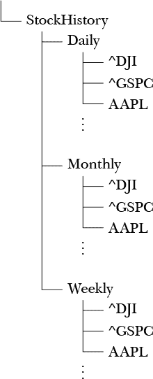

*图 6-1：股票历史文件结构*

以下代码将在给定股票符号和时间周期（“每日”，“每月”或“每周”——每个周期的文件存储在相应的文件夹中）时显示股票历史记录的行。此外，必须指定一个过滤器。过滤器是一个接受`hist`结构并根据搜索内容返回`#t`或`#f`的函数。

```
(define (show sym period filter)
  (let ([in-port (open-input-file
      (build-path "StockHistory" period (string-append sym ".csv")))])
    (read-line in-port) ; skip past header row
 ➊ (let* ([recs
         (reverse
         ➋ (let loop([rec-list '()])
           ➌ (let ([rec (import-record in-port)])
                (if (eof-object? rec)
                    rec-list
                 ➍ (if (filter rec)
                     ➎ (let* ([rec (format-rec rec 8 2)]
                               [rec (list (hist-date rec)
                                          (hist-high rec)
                                          (hist-low rec)
                                          (hist-close rec))])                          
                       ➏ (loop (cons rec rec-list)))
                     ➐ (loop rec-list))))))]
       ➑ [tbl-list (cons (list "   Date" "  High" "  Low" "  Close") recs)])
      (close-input-port in-port)
   ➒ (display (table->string tbl-list)))))
```

一旦输入文件被打开并且我们跳过了标题行，代码行`(let* ([recs` ➊绑定了两个变量：`recs`和`tbl-list` ➑。请注意，`recs`用于初始化`tbl-list` ➑，它仅仅为`recs`中包含的数据添加了一个标题。然后生成最终输出 ➒。

在代码的主体部分，我们设置了一个名为`loop` ➋的函数，用于递归提取输入文件中的数据（在此之前的`reverse`是必需的，因为递归调用会反向构建数据）。请注意，`rec-list`初始化为空列表。标识符`rec` ➌被填充为输入文件中的一行记录。一旦文件末尾被达到，我们将输出编译后的`rec-list`，但在此之前，我们使用过滤器搜索符合条件的记录 ➍。当找到这样的记录时，我们使用之前定义的`format-rec`代码 ➎将`rec`的本地版本绑定。由于我们在`let*`形式中，因此我们将在下一行绑定一个新的本地版本的`rec`，并从导入的记录中提取数据。完成此操作后，我们将其添加到之前导入的数据中 ➏，并递归调用`loop`。如果过滤器的条件不符合，我们只需触发读取导入文件中的下一行数据，并保留现有数据 ➐。

让我们来看一下 2008 年，当时金融部门开始出现严重问题。（`substring`函数用于从日期字段中提取年份，并仅显示年份等于 2008 的记录。）

```
> (show "^DJI" "Monthly"
        (λ (rec) (equal? (substring (hist-date rec) 0 4) "2008")))

+----------+--------+--------+--------+
|   Date   |  High  |  Low   |  Close |
+----------+--------+--------+--------+
|2008-01-01|13279.54|11634.82|12650.36|
+----------+--------+--------+--------+
|2008-02-01|12767.74|12069.47|12266.39|
+----------+--------+--------+--------+
|2008-03-01|12622.07|11731.60|12262.89|
+----------+--------+--------+--------+
|2008-04-01|13010.00|12266.47|12820.13|
+----------+--------+--------+--------+
|2008-05-01|13136.69|12442.59|12638.32|
+----------+--------+--------+--------+
|2008-06-01|12638.08|11287.56|11350.01|
+----------+--------+--------+--------+
|2008-07-01|11698.17|10827.71|11378.02|
+----------+--------+--------+--------+
|2008-08-01|11867.11|11221.53|11543.96|
+----------+--------+--------+--------+
|2008-09-01|11790.17|10365.45|10850.66|
+----------+--------+--------+--------+
|2008-10-01|10882.52| 7882.51| 9325.01|
+----------+--------+--------+--------+
|2008-11-01| 9653.95| 7449.38| 8829.04|
+----------+--------+--------+--------+
|2008-12-01| 9026.41| 8118.50| 8776.39|
+----------+--------+--------+--------+
```

在那一年，道琼斯指数从 1 月的 13,279.54 点跌至 11 月的 7,449.38 点。下跌幅度达到 5,380 点，或 44%的跌幅！

一年前，微软的股票平均价格约为每股$30，但在 2008 年几次跌破$19。我们来看一下那时发生了什么。

```
> (show "MSFT" "Daily"
     (λ (rec) (and
                     (< (hist-close rec) 19)
                     (equal? (substring (hist-date rec) 0 4) "2008"))))

+----------+--------+--------+--------+
|   Date   |  High  |  Low   |  Close |
+----------+--------+--------+--------+
|2008-11-19|   19.95|   18.25|   18.29|
+----------+--------+--------+--------+
|2008-11-20|   18.84|   17.50|   17.53|
+----------+--------+--------+--------+
|2008-12-01|   19.95|   18.60|   18.61|
+----------+--------+--------+--------+
|2008-12-29|   19.21|   18.64|   18.96|
+----------+--------+--------+--------+
```

### 数据库绕行

本节是完全可选的，因为本章的其余部分不依赖于这里介绍的思想。但我们确实想要介绍一些随机文件访问的信息，这在各种场景中可能会很有用。*随机文件访问*是高效数据查询的关键组件。特别是，随机文件访问是任何数据库中的一个关键组件。数据库主要是一个预定义的表格集合，每个表可能包含多个记录。到目前为止，为了在一个表中找到特定的记录，我们需要逐条扫描文件，直到找到所需的条目。平均而言，必须检查一半的记录，在最坏的情况下，所有记录都要检查。这显然不是很高效。

通常，我们是在查找特定日期，而记录是按日期顺序排列的，这表明可能适用二分查找（如果你不知道什么是二分查找，稍后我们会详细介绍）；但是有一个问题。在 CSV 文件中，记录是以可变长度的字符数打包在一起的，因此无法通过不从文件开头逐行读取的方式准确定位到特定记录。关键是为每条记录分配固定大小的槽，每个槽的大小足以容纳最大的记录。为方便起见，我们将定义以下函数：

```
(define (file-info sym period)
  (let ([port (open-input-file
          (build-path "StockHistory" period (string-append sym ".csv")))]
        [recs 0]
        [max-size 0])
    (let loop ()
      (let ([rec (read-line port)])
        (unless (eof-object? rec)
          (let ([len (string-length rec)])
            (set! recs (add1 recs))
            (unless (<= len max-size)
              (set! max-size len)))
          (loop))))
    (close-input-port port)
    (values recs max-size)))
```

这个函数扫描输入文件，以确定文件中的记录数量和最大记录大小。

利用 `file-info` 返回的信息，我们可以构建一个适当格式的数据文件。这个文件保留第一个槽来存放 `file-info` 返回的信息，因为这在我们实际搜索文件时会非常有用。其余槽将通过使用 `file-position` 函数设置位置来填充源文件中的值（通过调用 `display`）。记录末尾的未使用空间将填充零（0）字节。为了实际创建文件，我们定义了一个名为 `csv->db` 的函数：

```
(define (csv->db sym period)
  (let*-values ([(recs max-size) (file-info sym period)]
      [(in-port) (open-input-file
        (build-path "StockHistory" period (string-append sym ".csv")))]
   ➊ [(out-port) (open-output-file
       (build-path "StockHistory" period (string-append sym ".db"))
         #:exists 'truncate)]
      [(slot-size) (+ 10 max-size)])
 ➋ (file-position out-port (* recs slot-size))
 ➌ (display (make-string slot-size #\space) out-port)
    (file-position out-port 0)
 ➍ (display recs out-port)
    (display "," out-port)
 ➎ (displayln slot-size out-port)
    (read-line in-port) ; read past header
    (for ([ i (in-range 1 recs)])
      (let ([rec (read-line in-port)]
            [pos (* i slot-size)])
     ➏ (file-position out-port pos)
     ➐ (displayln rec out-port)))
    (close-input-port in-port)
    (close-output-port out-port)
    ))
```

这个函数会在与源文件相同的文件夹中创建一个数据文件，文件名相同，只是输出文件 ➊ 的扩展名为 *.db*，而不是 *.csv*。接下来，我们将文件位置设置到文件末尾 ➋ 并写入一个虚拟记录 ➌。这个步骤是为了提高效率，防止操作系统每次写入记录时都不断扩展文件大小。我们将记录数量和槽大小写入文件的第一条记录 ➍ ➎。然后，对于输入文件中的每条记录，我们设置输出文件指针 ➏ 并写出记录 ➐。

通过这样创建了一个可搜索的数据文件后，我们现在可以创建一个例程，执行二分查找以高效地找到特定日期的记录。（有关二分查找的更详细信息，请参阅维基百科文章：[ *http://en.wikipedia.org/wiki/Binary_search_algorithm* ](http://en.wikipedia.org/wiki/Binary_search_algorithm)。）

```
 (define (bin-search sym period date)
➊ (let* ([port (open-input-file
          (build-path "StockHistory" period (string-append sym ".db")))]
      [info (string-split (read-line port) ",")]
      [recs (string->number (first info))]
      [slot-size (string->number (second info))]
      [min 1]
   ➋ [max recs])

 ➌ (define (get-date rec)
      (substring rec 0 10))

 ➍ (define (get-rec i)
      (file-position port (* slot-size i))
      (read-line port))

    (let loop ()
   ➎ (if (> min max)
          (begin
            (close-input-port port)
            #f)
       ➎ (let* ([i (floor (/ (+ min max) 2))]
                 [rec (get-rec i)]
                 [d (get-date rec)])
            (cond [(string<? d date)
                ➏ (set! min (add1 i))
                   (loop)]
                  [(string>? d date)
                ➐ (set! max (sub1 i))
                   (loop)]
                  [else
                   (close-input-port port)
                ➑ rec]))))))
```

首先，我们执行一些基本的初始化 ➊ ➋。打开输入文件后，我们读取第一条记录（其中包含记录数和槽大小），并将 `recs` 和 `slot-size` 绑定到相应的值。接下来，我们定义几个辅助函数，以简化检索当前记录数据的过程 ➌ ➍。其余代码是二分查找常规的直观实现，主要部分由一个循环组成（通过递归函数 `loop`）。搜索首先通过测试是否还有记录待检查 ➎。如果 `(> min max)` 为真，则表示所有记录都已检查过且未找到匹配项，因此函数返回 `#f`。接下来，我们将文件中间元素的日期与目标日期进行比较 ➏。如果目标日期与中间元素匹配，则返回当前记录 ➑。如果目标日期小于或大于当前元素的日期，则通过根据需要重置 `min` ➏ 和 `max` ➐ 来缩小文件范围，继续进行搜索。

我们通过首先使用以下内容创建一个可搜索的微软股票价格数据文件来测试我们的创建：

```
> (csv->db "MSFT" "Daily")
```

如果我们接下来想要检索 1992 年 3 月 13 日的股票价格记录，我们可以这样做：

```
> (bin-search "MSFT" "Daily" "1992-03-13")
"1992-03-13,2.552083,2.562500,2.510417,2.520833,1.674268,36761600"
```

Microsoft 文件有 7,768 条记录。平均而言，线性搜索需要检查 3,884 条记录。二分查找的最坏情况性能由以下公式给出，其中 *t* 是需要执行的检查次数，*n* 是记录的数量：

*t* = ⌊log2⌋

这意味着搜索微软数据只需要进行以下检查。检查 12 条记录远比检查 3,884 条要好得多。

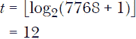

### 数据可视化

一张图片胜过千言万语，呃…千字。到目前为止，我们一直在查看数据。现在我们想要查看信息。两者的区别在于：数据只是数字、日期和字符串的原始集合；而信息则说明这些事物如何相互关联。仅仅浏览数字列表并不会提供太多对其含义的洞察，但往往一个视觉化的表现能够带来顿悟。考虑到这一点，我们转向数据可视化的主题。在本节中，我们将从两个不同的角度来看待财务数据：随时间变化的价值和通过直方图的频率分析。

为确保我们拥有所需的一切，我们从以下定义开始。

```
#lang racket
(require plot)
(require text-table)

(define (data-path symbol period)
  (build-path "StockHistory" period (string-append symbol ".csv")))

(struct hist (date open high low close adj-close vol)
  #:transparent)

(define symbols '("^DJI" "^GSPC" "AAPL" "AMZN"
                         "BAC" "F" "MSFT" "VBMFX" "XOM"))

(define symbol-color
  (make-hash
   (list
    (cons "^DJI" "black")
    (cons "^GSPC" "gray")
    (cons "AAPL" "black")
    (cons "AMZN" "gray")
    (cons "BAC" "purple")
    (cons "F" "orange")
    (cons "MSFT" "blue")
    (cons "VBMFX" "black")
    (cons "XOM" "gray")
    )))

(define symbol-style
  (make-hash
   (list
    (cons "^DJI" 'solid)
    (cons "^GSPC" 'solid)
    (cons "AAPL" 'dot)
    (cons "AMZN" 'dot)
    (cons "BAC" 'dot-dash)
    (cons "F" 'solid)
    (cons "MSFT" 'long-dash)
    (cons "VBMFX" 'short-dash)
    (cons "XOM" 'short-dash)
    )))
```

其中大部分应该不言自明。提醒一下，`text-table` 包并不是默认的 Racket 设置的一部分（更多信息请参见第 150 页的“将数据导入 Racket”）。我们使用 `data-path` 来避免在各种函数体内硬编码文件路径。为了区分图表上的多个资产，它们在 `symbol-color` 中被分配了独特的颜色，在 `symbol-style` 中分配了线条样式。

我们将再次使用 `import-record`，如下所示。

```
(define (import-record port)
  (let ([rec (read-line port)])
    (if (eof-object? rec)
        eof
        (match (string-split rec ",")
          [(list date open high low close adj-close vol)
           (hist date
                 (string->number open)
                 (string->number high)
                 (string->number low)
                 (string->number close)
                 (string->number adj-close)
                 (string->number vol))]
          [_ (error "Failed to load record.")]))))
```

虽然这个函数提取了记录中的所有内容，但在本章剩余部分，我们将主要关注日期和收盘价。

由于我们将绘制随时间变化的值，我们需要将每个记录中的日期字符串转换为数值。我们可以通过以下向量和函数来完成：

```
(define month-days
  #(0 0 31 59.25 90.25 120.25 151.25 181.25
      212.25 243.25 273.25 304.25 334.25))

(define (date->number d)
  (match (string-split d "-")
    [(list year month day)
     (let ([year (string->number year)]
           [month (string->number month)]
           [day (string->number day)])
       (exact->inexact (+ year
                          (/ (vector-ref month-days month) 365.25)
                          (/ (sub1 day) 365.25))))]))
```

`month-days` 向量提供了年份中每个月第一天经过的天数（月份编号是索引；例如，二月的索引是 2）。例如，索引为 2 的条目是 31，表示 2 月 1 日已经过去了 31 天。2 月之后的月份有额外的四分之一天来考虑闰年。日期转换发生在 `date->number` 函数中，年份构成日期的整数部分，而月份和日期则提供小数部分。2 月可能有 28 天或 29 天的问题通过近似值来处理，这对于我们的目的应该足够。

#### *成功绘图*

正如你在第四章中看到的，Racket 通过使用 `lines` 形式来绘制一系列线段，该形式以一个向量列表作为参数。每个向量指定了一个线段的 *x*（日期）和 *y*（收盘价）坐标。为了构建这个列表，我们使用 `get-coords` 函数：

```
(define (get-coords symbol period filter normalize)
  (let ([in-port (open-input-file (data-path symbol period))]
        [start-price #f])
    (read-line in-port)
    (let* ([recs
      (reverse
        (let loop([rec-list '()])
          (let ([rec (import-record in-port)])
            (if (eof-object? rec)
               rec-list
               (if (filter rec)
                 (let ([date-val (date->number (hist-date rec))]
                     [close (hist-close rec)])
                   (unless start-price (set! start-price close))
                   (let ([val 
                  ➊ (if normalize (/ close start-price) close)])
                     (loop 
                       (cons (vector date-val val) rec-list))))
                 (loop rec-list))))))])
      (close-input-port in-port)
      recs)))
```

与其他示例一样，这个函数接受股票符号、时间段类型和一个过滤函数作为参数。由于我们正在检查的资产可能有很大的价值差异，为了能在同一图表上显示它们，我们提供了通过额外参数规范化值的功能。这意味着我们不会绘制实际的值，而是绘制时间段内第一个值与实际值的比率 ➊。这样，所有资产的起始值都是 1，但我们仍然可以看到它们随时间变化的相对值。稍后通过几个示例会更加清晰。

执行绘图的例程非常简单。

```
(define (plot-symbols symbols period filter
                      [normalize #f]
                      [anchor 'top-left]
                      [y-min #f]
                      [y-max #f])
  (let* ([plot-data
          (for/list ([symbol symbols])
            (let ([color (hash-ref symbol-color symbol)]
                  [style (hash-ref symbol-style symbol)])
              (lines (get-coords symbol period filter normalize)
                     #:label symbol
                     #:width 1.5
                     #:color color
                     #:style style)))]
         [ymin (if (and normalize (not y-min)) 0.0 y-min)]
         [ymax (if (and normalize (not y-max)) 2.0 y-max)])
    (parameterize
        ([plot-width 400]
         [plot-height 250]
         [plot-x-label "Year"]
         [plot-y-label #f]
         [plot-legend-anchor anchor])
      (plot plot-data
            #:y-min ymin
            #:y-max ymax))))
```

这次，我们为它提供了一组股票符号（以允许同时绘制多个资产），一个时间段类型，以及一个过滤函数作为参数。我们还可以选择是否使用可选的 `normalize` 参数来规范化数据，默认为 `#f`。由于绘制的值几乎可以出现在图表的任何部分，我们允许用户通过可选的 `anchor` 参数指定图例的位置。此外，我们还允许用户覆盖 *y* 值的默认范围。

由于我们主要会绘制某个年份或日期范围的数据，我们将定义几个函数工厂，通过指定我们感兴趣的日期范围来创建查询函数。

```
(define (year-range y1 y2)
  (λ (rec) 
    (string<=? y1 (substring (hist-date rec) 0 4)
               y2)))

(define (date-range d1 d2)
  (λ (rec) 
    (string<=? d1 (substring (hist-date rec) 0 10)
               d2)))
```

在确定了先决条件后，我们准备生成一些图表。让我们从绘制 2007 年和 2008 年的道琼斯数据开始（见图 6-2）。

```
> (plot-symbols '("^DJI") "Daily"
                (year-range "2007" "2008")
                #f 'bottom-left)
```

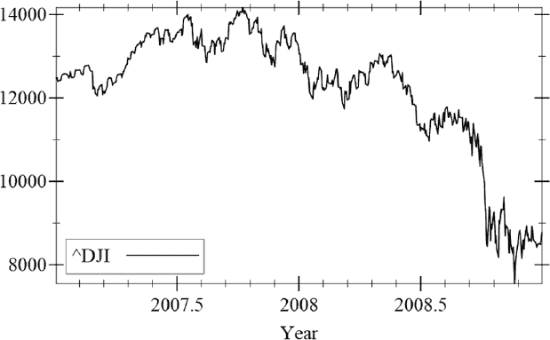

*图 6-2：道琼斯 2007–2008 年每日收盘价*

现在我们可以实际*看到* 2008 年 10 月发生的急剧下跌了。接下来，让我们看看其他一些机构的表现如何（见 图 6-3）。

```
> (plot-symbols '("^DJI" "^GSPC" "AAPL" "VBMFX") "Daily"
                (year-range "2007" "2008")
                #f 'bottom-left)
```

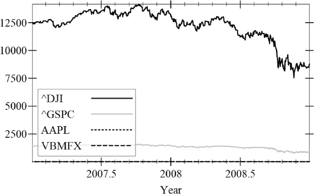

*图 6-3：多个日度收盘价格*

不幸的是，道琼斯指数的数字太大，它已经淹没了其他所有指标。现在让我们来看一下当我们对数字进行标准化时会发生什么（见 图 6-4）。

```
> (plot-symbols '("^DJI" "^GSPC" "AAPL" "VBMFX") "Daily"
                (year-range "2007" "2008")
                #t 'bottom-left)
```

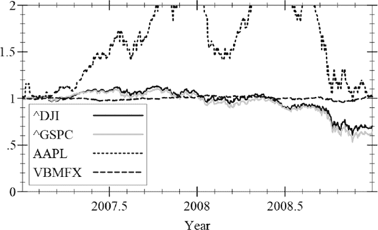

*图 6-4：标准化的日度收盘价格*

很明显，道琼斯指数和标准普尔 500 指数整体市场走势非常接近。苹果的走势则波动较大。债券基金在这场混乱中保持稳定。

我们学到了什么？嗯，基于几个图表做出太多假设是愚蠢的。不过，至少在这个时间段内，债券几乎没有波动，整个市场（由标准普尔 500 指数和道琼斯指数代表）有些波动，但不如苹果股价波动那么大。

让我们从更长远的角度来看一下，看看 图 6-5 展现了什么。

```
> (plot-symbols '("^GSPC" "AAPL" "XOM") "Monthly"
                (year-range "1981" "2016")
                #t 'top-left 0 20)
```

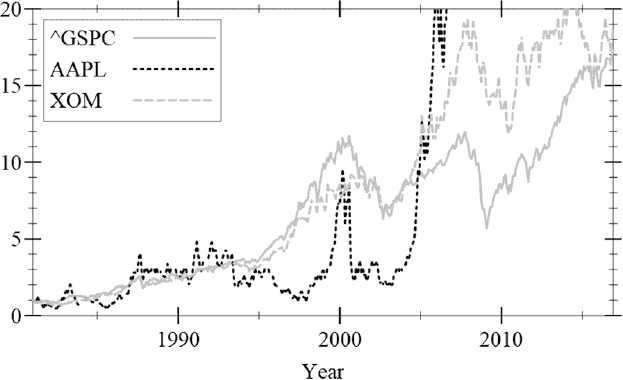

*图 6-5：1981-2016 年月度收盘价格*

所以大约在 2005 年左右，苹果股价突破了图表（稍后会详细讲解）。让我们更详细地研究一下埃克森美孚。由于这是一个标准化的图表，我们看到的是价格的相对差异；这意味着在 2016 年底，埃克森美孚的股票大约是 1981 年初价格的 18 倍。听起来很多，但真的是这样吗？我们可以通过使用复利公式来大致了解这代表的年平均回报率：

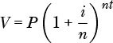

在这个公式中，*V* 是当前价值，*P* 是初始本金，*i* 是年利率，*n* 是每年的复利周期数（我们假设为按月复利，因此这里是 12），*t* 是周期数（所以 *nt* 是 12 乘以年份数）。我们想要知道年利率 *i*，所以经过一点代数运算（我们不在此赘述细节），得到这个公式：

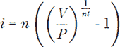

以下函数将为我们计算这个值：

```
(define (int-rate v p t)
  (let ([n 12.0])
    (* n (- (expt (/ v p) (/ 1 (* n t))) 1))))
```

因此，在 35 年的时间里，投资 1 美元在埃克森美孚股票上将获得的利率是……

```
> (int-rate 18 1 35)
0.08286686131778254
```

或者约 8%，考虑到埃克森美孚也每季度支付股息，这无疑让投资回报更具吸引力。

那么那匹狂野的独角兽——苹果呢？让我们稍微调整一下范围，看看会发生什么。

```
> (plot-symbols '("^GSPC" "AAPL" "XOM") "Monthly"
                (year-range "1981" "2016")
                #t 'top-left 0 300)
```

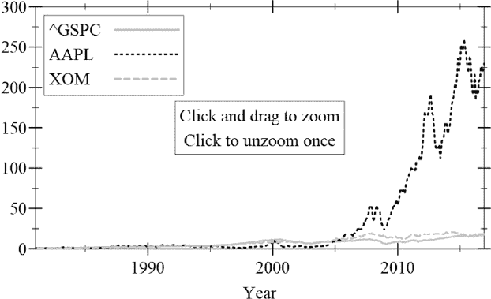

*图 6-6：月度收盘价格最高达 300 美元*

哇，1981 年投资的一美元（经过长时间的低迷期）到 2016 年底将值约 225 美元。谁能想到？让我们看看实际的利率是多少。

```
> (int-rate 225 1 35)
0.15574778848870174
```

几乎 16%——不错吧。苹果是一个好的投资吗？嗯，任何（诚实的）财务顾问都会反复告诉你这一点：过去的表现并不能保证未来的结果。

#### *将事物合并在一起*

除了苹果的投资回报率（ROI）令人瞠目结舌外，还有一点特别突出：它的股价波动非常大。让我们来看一下 2008 年事情变得疯狂之前，埃克森美孚和苹果的股价（参见图 6-7）。

```
> (plot-symbols '("AAPL" "XOM") "Daily"
                (date-range "2007-01-01" "2008-09-30")
                #t 'top-left 0.5 2.5)
```

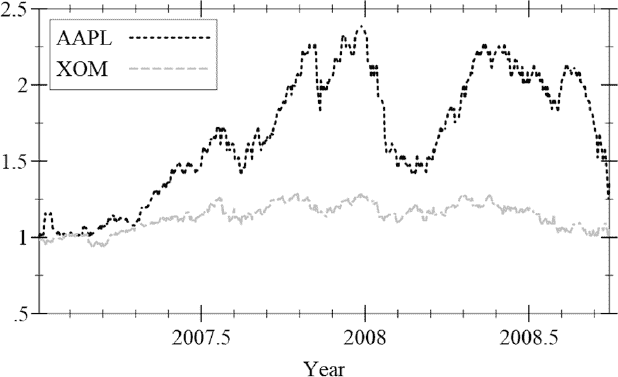

*图 6-7：苹果与埃克森美孚在崩盘前的情况*

很明显，即使是在这段短暂的时间内，苹果从一天到另一天的股价也很难预测。如果某人对股票的具体数值不感兴趣，而是对其波动性更感兴趣，一种可视化波动性的方法是使用直方图。*直方图*通过显示数据值如何分布在某些区间中来表示数据。我们将这些区间称为*箱子*。为了帮助我们的分析，我们将每个直方图与一个表格一起展示，表格中显示每个箱子的数值范围和各箱子中的数值数量。

首先，我们定义一个函数，它根据股票符号、时间段、过滤函数和相应的`hist`结构字段提取投资的特定数据字段。

```
(define (get-data symbol period filter field)
  (let ([in-port (open-input-file (data-path symbol period))])
    (read-line in-port)
    (let* ([recs
            (reverse
             (let loop([rec-list '()])
               (let ([rec (import-record in-port)])
                 (if (eof-object? rec)
                     rec-list
                     (if (filter rec)
                         (loop (cons (field rec) rec-list))
                         (loop rec-list))))))])
      (close-input-port in-port)
      recs)))
```

例如，如果我们想要查看 1999 年微软（对微软来说是一个相当不错的年份）在每月数据中的最大股价，我们可以通过以下方式获取：

```
> (get-data "MSFT" "Monthly"
                (year-range "1999" "1999")
                hist-close)
'(43.75 37.53125 44.8125 40.65625 40.34375 45.09375 42.90625 46.28125 45.28125
      46.28125 45.523399 58.375)
```

以下函数会汇总数据（数值列表）并将正确数量的值填入箱子中。

```
(define (categorize data avg num-bins)
  (let* ([bin (make-vector num-bins 0)]
         [bin-min (* 0.4 avg)]
         [bin-max (* 1.6 avg)]
         [bin-delta (/ (- bin-max bin-min) num-bins)])
    (define (update-bin val)
      (when (<= bin-min val bin-max)
        (let ([i (inexact->exact (floor (/ (- val bin-min) bin-delta)))])
          (vector-set! bin i (add1 (vector-ref bin i))))))
    (let loop ([val-list data])
      (unless (null? val-list)
        (update-bin (car val-list))
        (loop (cdr val-list))))
    (values bin-min bin-max
            (for/list ([i (in-range num-bins)])
              (vector i (vector-ref bin i))))))
```

该函数首先设置一个整体值范围，这个范围低于平均值 60%并且高于平均值 60%。在这个范围内，数据值将被汇总到`bin`向量中。在处理的最后，函数返回这些箱子的最小值和最大值范围，以及`bin`中包含的分类值。`bin`中的每个向量包含箱子索引和箱子中的数据值数量（它必须以这种方式格式化才能与 Racket 的`discrete-histogram`函数一起使用）。

为了以表格形式显示数据，我们定义了`bin-table`，它将显示箱子索引、箱子的数值范围以及每个箱子中的数据数量。

```
(define (bin-table bins bin-min bin-max)
  (let* ([num-bins (length bins)]
         [bin-delta (/ (- bin-max bin-min) num-bins)]
         [rows
          (for/list ([i (in-range num-bins)]
                     [bin bins])
            (let ([bmin (+ bin-min (* bin-delta i))]
                  [bmax (+ bin-min (* bin-delta (add1 i)))]
                  [count (vector-ref bin 1)])
              (list
               (~r i #:min-width 3)
               (~r bmin #:min-width 8  #:precision (list '= 2))
               (~r bmax #:min-width 8  #:precision (list '= 2))
               (~r count #:min-width 4))))])
    (table->string (cons '("Bin" "   Min" "   Max" "Vals") rows))))
```

在我们打好基础后，创建一个函数来生成输出是相当简单的。

```
(define (histogram-symbol symbol period filter [bins 11])
  (let*-values ([(data) (get-data symbol period filter hist-close)]
                [(avg) (/ (apply + data) (length data))]
                [(bin-min bin-max hist-data) (categorize data avg bins)])
    (displayln (bin-table hist-data bin-min bin-max))
    (parameterize
        ([plot-width 400]
         [plot-height 250]
         [plot-x-label #f]
         [plot-y-label "Frequency"])
      (plot (discrete-histogram hist-data)))))
```

让我们看看这对苹果和埃克森美孚告诉了我们什么（参见图 6-8 和图 6-9）。

```
> (histogram-symbol "AAPL" "Daily" (date-range "2007-01-01" "2008-09-30"))
+---+--------+--------+----+
|Bin|   Min  |   Max  |Vals|
+---+--------+--------+----+
|  0|    8.06|   10.25|   0|
+---+--------+--------+----+
|  1|   10.25|   12.45|  30|
+---+--------+--------+----+
|  2|   12.45|   14.65|  55|
+---+--------+--------+----+
|  3|   14.65|   16.85|  20|
+---+--------+--------+----+
|  4|   16.85|   19.04|  87|
+---+--------+--------+----+
|  5|   19.04|   21.24|  54|
+---+--------+--------+----+
|  6|   21.24|   23.44|  46|
+---+--------+--------+----+
|  7|   23.44|   25.64|  81|
+---+--------+--------+----+
|  8|   25.64|   27.83|  61|
+---+--------+--------+----+
|  9|   27.83|   30.03|   6|
+---+--------+--------+----+
| 10|   30.03|   32.23|   0|
+---+--------+--------+----+
```

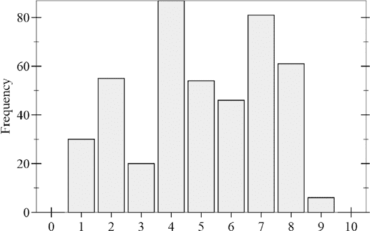

*图 6-8：苹果直方图*

```
> (histogram-symbol "XOM" "Daily" (date-range "2007-01-01" "2008-09-30"))

+---+--------+--------+----+
|Bin|   Min  |   Max  |Vals|
+---+--------+--------+----+
|  0|   33.65|   42.83|   0|
+---+--------+--------+----+
|  1|   42.83|   52.00|   0|
+---+--------+--------+----+
|  2|   52.00|   61.18|   0|
+---+--------+--------+----+
|  3|   61.18|   70.36|   4|
+---+--------+--------+----+
|  4|   70.36|   79.54| 106|
+---+--------+--------+----+
|  5|   79.54|   88.71| 210|
+---+--------+--------+----+
|  6|   88.71|   97.89| 120|
+---+--------+--------+----+
|  7|   97.89|  107.07|   0|
+---+--------+--------+----+
|  8|  107.07|  116.25|   0|
+---+--------+--------+----+
|  9|  116.25|  125.42|   0|
+---+--------+--------+----+
| 10|  125.42|  134.60|   0|
+---+--------+--------+----+
```


*图 6-9：埃克森美孚直方图*

从直方图可以清楚地看出，苹果的数据值在同一时间段内比埃克森美孚的数据值分布范围更广。这种更高的波动性是苹果投资者为可能获得更大回报而付出的代价。

### 一点统计学

我们在上一节中展示了这样一个老生常谈的道理：一张图片胜过千言万语，这至少在分析投资数据时是有一定道理的。但同样正确的是，一个数字也至少值得上一张图片。到目前为止，我们的分析主要是定性的，我们使用了多种技巧来可视化我们的数据。现在我们转向一些广泛用于定量分析的标准统计工具。

#### *标准差*

在上一节中，我们使用直方图来了解某一时间段内股价的分布情况。这类信息可以用一个数字来总结，这个数字就是*标准差*。对于一组给定的数字，标准差表示个别数字偏离该组数据总体平均值的程度。你可以将它视为偏差的平均值。标准差的定义如下公式：

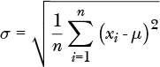

在这个公式中，*n*是数据值的数量，希腊字母 mu（*μ*）表示所有数据值的均值或平均值，*x*[*i*]表示单个数据值。

与标准差密切相关的统计概念是*方差*，它实际上是标准差的平方：

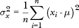

我们稍后会看到，方差在回归分析中非常有用，回归分析旨在确定数据的趋势。

我们将标准差公式封装到一个 Racket 函数中，如下所示：

```
(define (std-deviation nums)
  (let* ([n (length nums)]
         [mu (/ (apply + nums) n)]
         [sqr-diff (map (λ (x) (sqr (- x mu))) nums)])
    (sqrt (/ (apply + sqr-diff) n))))
```

现在我们可以计算数值，从而分析不同资产的偏差。让我们来看一下我们生成的直方图数据。

```
> (define apple (get-data "AAPL" "Daily" (date-range "2007-01-01" "2008-09-30"
    ) hist-close))
> (define xom (get-data "XOM" "Daily" (date-range "2007-01-01" "2008-09-30")
    hist-close))

> (std-deviation apple)
4.811932439819516

> (std-deviation xom)
6.399636764602135
```

这*似乎*表明苹果的偏差实际上小于埃克森美孚。这时，数据的正确解释至关重要。直方图数据向我们展示了数据在±60%的*平均*值范围内的分布情况。为了更好地理解偏差数据，我们来计算一下这些股票的平均值。

```
> (define apple-avg (/ (apply + apple) (length apple)))
> apple-avg
20.143350647727257

> (define xom-avg (/ (apply + xom) (length xom)))
> xom-avg
84.12513634318191

> (/ (std-deviation apple) apple-avg)
0.23888441024395504

> (/ (std-deviation xom) xom-avg)
0.07607282487478317
```

从中我们可以看出，在那段时间内，苹果的价格偏离其平均价格大约 24%，而埃克森美孚仅偏离约 7.5%。

虽然我们在这里严格地看的是收盘价的标准差，但这*不是*通常在金融领域评估偏差的方式。更为关注的是*收益*的偏差。一个年回报率稳定为 10%的股票显然会有一些价格偏差，但根据收益来看的话，它几乎没有偏差。另一个需要考虑的因素是，单纯的股价变化并不一定能反映出收益，因为股息（对于那些支付股息的股票）也会影响结果。

#### *回归分析*

在我们对各种金融资产的分析中，我们提到过“过去的表现不能保证未来的结果”这句格言，这是正确的，但过去的表现可能暗示未来的结果。给定一组不同的数据点，常常需要确定它们是否暗示着某种趋势。名为 *回归分析* 的统计工具旨在做出这种判断。回归分析将一条直线拟合到一组数据点（由于我们只是将数据拟合到直线，这技术上称为 *线性回归*），其中 *x* 称为 *独立预测变量* 或 *预测变量*，*y* 称为 *依赖响应*。期望的结果是这个 *回归* 或 *预测* 直线：

*y* = *a + bx*

其思想是，给定这条直线和某个 *x* 值，我们可以计算出 *y* 的估计值。*a* 和 *b* 参数的定义方式是最小化 *y* 数据值与回归线之间的总距离。具体而言，如果 (*x*[*i*], *y*[*i*]) 是实际的数据点，我们让 *ŷ*[*i*] = *a* + *bx*[*i*]（这是 *x*[*i*] 处的 *y* 估计值），在这种情况下，回归分析的目标是最小化以下公式所给出的 *平方和误差*：

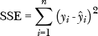

如果  是所有 *x* 值的均值，或平均值，而 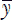 是所有 *y* 值的均值，那么可以证明，回归线的 *a* 和 *b* 参数由以下公式给出：

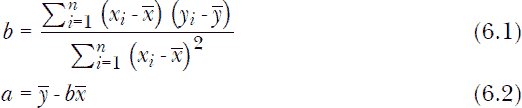

看似复杂的方程（6.1）实际上是两个更简单公式的比率：*x* 和 *y* 的 *协方差* 以及 *x* 的方差。我们已经看到，*x* 的方差由以下公式给出：

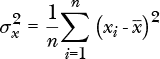

*x* 和 *y* 的协方差由以下公式给出：

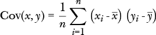

协方差是衡量两个随机变量联合变化的度量（在我们的案例中是 *x*[*i*] 和 *y*[*i*]）。我们利用这两个方程的略微调整形式，以及其他一些方程，来开发一种方法，确定我们的回归线在多大程度上真实地拟合数据。

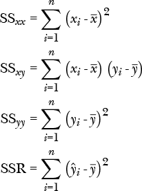

我们可以看到，SS[*xx*] 只是 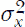 的略微调整版本，而 SS[*xy*] 同样是 Cov(*x*, *y*) 的调整版本。最后一个方程，平方和回归，表示的是估计的 *ŷ* 从 *y* 值的均值到回归线的距离的平方和（最小化这个距离的回归线将给出最佳的拟合数据）。我们在方程（6.1）中看到，回归线的斜率由以下公式给出：


但是也可以证明：


最后一方程称为*平方相关*或*决定系数*。这个数值在 0 和 1 之间变化。值为 1 表示数据点完全拟合回归线，值为 0 表示没有任何相关性。

回归线的参数可以通过以下 Racket 函数计算：

```
(define (regression-params data)
  (define (x v) (vector-ref v 0))
  (define (y v) (vector-ref v 1))
  (let* ([num (length data)] 
         [totx (apply + (map x data))]
         [toty (apply + (map y data))]
         [avgx (/ totx num)]
         [avgy (/ toty num)]
         [ss-xy (apply + (map (λ (v) (* (- (x v) avgx) (- (y v) avgy))) data))]
         [ss-xx (apply + (map (λ (v) (sqr (- (x v) avgx))) data))]
         [b (/ ss-xy ss-xx)]
         [a (- avgy (* b avgx))])
    (values a b)))
```

这是对方程（6.1）和（6.2）的直接改编。让我们看看这对在 2008 年金融危机期间陷入下行漩涡的美国银行有什么启示。

```
> (define bac (get-coords "BAC" "Monthly"
                          (date-range "2007-07-01" "2009-02-01")
                          #f))

> (regression-params bac)
54422.310899480566
-27.082265190974677
```

第二个值是回归线的斜率，它表示在那个时期，平均每年损失 27 美元（相当于 2007 年 7 月其价值的一半）。哎呀。

我们现在定义一个绘图例程，接受单一资产符号，但绘制数据点而不是线条，并包括相应的回归线。

```
(define (plot-regression symbol period filter
                         [anchor 'top-left])
  (let* ([coords (get-coords symbol period filter #f)]
         [plot-data 
          (let ([color (hash-ref symbol-color symbol)])
            (points coords #:label symbol #:color color))])
    (let-values ([(a b) (regression-params coords)])
      (parameterize 
          ([plot-width 400]
           [plot-height 250]
           [plot-x-label "Year"]
           [plot-y-label #f]
           [plot-legend-anchor anchor])
        (plot (list
               plot-data
               (function (λ (x) (+ (* b x) a))
                         #:color "black" #:label "Regr")))))))
```

我们可以在图 6-10 中详细查看美国银行的困境。

```
> (plot-regression "BAC" "Monthly"
                (date-range "2007-07-01" "2009-02-01")
                'bottom-left)
```

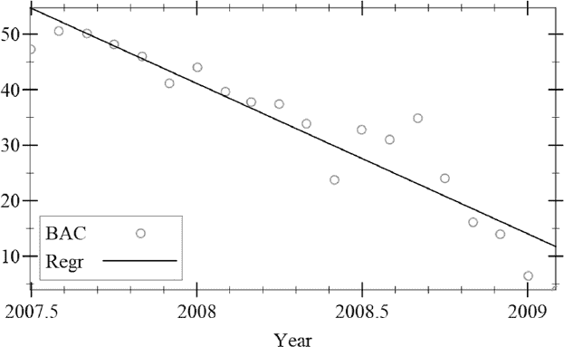

*图 6-10：美国银行数据上的回归线*

为了确定回归线与数据的拟合程度，我们定义一个`correlation`函数：

```
(define (correlation data)
  (define (x v) (vector-ref v 0))
  (define (y v) (vector-ref v 1))
  (let* ([num (length data)] 
         [totx (apply + (map x data))]
         [toty (apply + (map y data))]
         [avgx (/ totx num)]
         [avgy (/ toty num)]
         [ss-xx (apply + (map (λ (v) (sqr (- (x v) avgx))) data))]         
         [ss-yy (apply + (map (λ (v) (sqr (- (y v) avgy))) data))]
         [ss-xy (apply + (map (λ (v) (* (- (x v) avgx) (- (y v) avgy))) data))]
         [b (/ ss-xy ss-xx)]
         [a (- avgy (* b avgx))]
         [ssr (apply + (map (λ (v) (sqr (- (+ (* b (x v)) a) avgy))) data))])
    (/ ssr ss-yy)))
```

这也是对上述*R*²定义的直接实现。通过这个，我们可以测试美国银行最小二乘回归线与数据的拟合情况。

```
> (define bac (get-coords "BAC" "Monthly"
                          (date-range "2007-07-01" "2009-02-01")
                          #f))
> (correlation bac)
0.8799353920116734
```

这表示拟合得相当不错。但在许多情况下，数据并不能很好地与直线拟合。例如，如果我们包括恢复阶段的开始，最终得到的图像就像图 6-11 中所示。

```
> (plot-regression "BAC" "Monthly"
                   (year-range "2008" "2009")
                   'bottom-left)
```

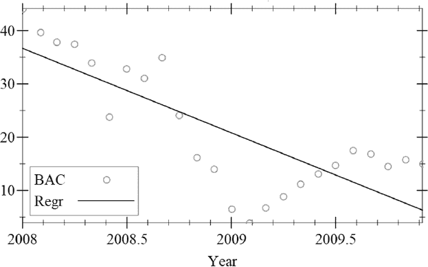

*图 6-11：拟合不好的回归线*

这表示一定程度的相关性，但不如之前的拟合效果好：

```
> (define bac (get-coords "BAC" "Monthly"
                          (year-range "2008" "2009")
                          #f))

> (correlation bac)
0.6064135484684874
```

### 总结

在本章中，我们探讨了使用 Racket 和 DrRacket 访问和分析数据的各种方法。我们首先介绍了如何将数据导入和导出到 Racket 端口的机制。一旦掌握了这一技术，我们就利用它来查看证券数据，即原始历史股市数据。接着，我们稍微绕了一下，探索了使用随机文件访问的二分查找。在定义了访问和解析股市数据的机制之后，我们又通过各种可视化技术来分析数据的定性方法。最后，我们鼓起勇气引入了一些数学内容，使我们能够进行一些统计量化分析。

接下来，我们将看到如何使用一些复杂的搜索算法来解决一些经典的 recreational mathematics（娱乐数学）问题。
