## 第七章：寻找答案

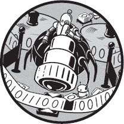

对于我们到目前为止遇到的所有问题，都有一种直接的方法来计算解决方案。但情况并不总是如此。对于许多问题，我们必须使用某种算法来搜索解决方案，例如在解决数独谜题或*n*皇后问题时。在这些情况下，过程涉及尝试一系列步骤，直到我们找到解决方案，或者必须回退到上一步尝试另一条路径。本章中，我们将探索一些算法，帮助我们高效选择一条通向解决方案的路径。这种方法被称为*启发式*。通常，启发式算法不能保证找到解决方案，但我们在这里探索的算法（幸运的是）是可以的。

### 图论

我们试图解决的问题往往可以用*图*来建模。直观地说，图只是一些点（或节点）和连接这些点的线条，如图 7-1 所示。每个节点表示问题解决过程中的某个状态，从一个节点延伸到其他节点的线条表示可能的替代步骤。在深入实际问题解决算法之前，我们首先介绍一些基本的图的定义作为背景。

#### *基础知识*

从正式定义来看，图是一个有限集合 *V* 的*顶点*（或节点），以及一个集合 *E* 的*边*，连接不同的顶点对（见图 7-1）。


*图 7-1: 图*

在上面的图 7-1 中，*V* = {*a, b, c, d, e*} 是顶点，*E* = {(*a*, *b*), (*a*, *c*), (*b*, *c*), (*c*, *d*), (*b*, *e*), (*e*, *d*)} 是边。

一系列图的顶点（*v*[1], *v*[2], …, *v*[*n*]），使得存在一条边连接 *v*[*i*] 和 *v*[*i*+1]，称为*路径*。如果所有顶点都不相同，则路径称为*简单路径*。如果路径中所有顶点都不相同，除了 *v*[1] = *v*[*n*] 外，则称为*循环*或*回路*。在图 7-1 中，序列（*a*, *b*, *c*, *b*）是一个路径，序列（*a*, *b*, *c*, *d*）是一个简单路径，序列（*a*, *b*, *c*, *a*）是一个循环。

一个图，如果从每个顶点到其他所有顶点都有路径，则称为*连通图*。一个没有循环的连通图称为*树*。在树中，任何路径都假定从上层节点流向下层节点。这样的结构（没有循环，并且从一个节点到另一个节点只有一条路径）称为*有向无环图（DAG）*。通过移除一些边，可以将上面的图转换为树，如图 7-2 所示。

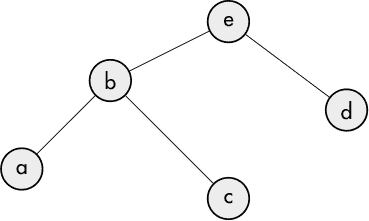

*图 7-2: 树*

如果节点*x*和*y*以某种方式连接，使得从*x*到*y*是可能的，那么*y*被称为*x*的*子节点*。没有子节点的节点（如*a*、*c*和*d*）被称为*终端*（或*叶子*）节点。通过树结构建模并能得到解的问题通常采用更简单的搜索策略，因为树没有回路。搜索有回路的图需要跟踪已经访问过的节点，以避免重新探索相同的节点。

可以为图的每一条边标记一个叫做*权重*的数值，如图 7-3 所示。这种类型的图叫做*加权图*。

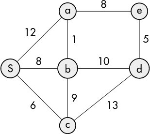

*图 7-3：加权图*

如果*e*是一个边，那么该边的权重由*w*(*e*)表示。权重可以用来表示许多测量值，如时间、成本或距离，这些因素可能在搜索图时影响边的选择。

在探索图的属性时，会提出许多有趣的问题。一个这样的问题是：“给定任意两个节点，如何找到它们之间的最短路径？”另一个问题是著名的旅行商问题：“给定一系列城市及其之间的距离，如何找到一条最短路径，能够访问每个城市一次，并返回到原始城市？”最后一个问题，其中每个节点被访问一次并返回到原始节点，涉及到所谓的*哈密顿回路*。

#### *图搜索*

搜索图的策略大致分为两类：*广度优先搜索（BFS）*和*深度优先搜索（DFS）*。为了说明这些概念，我们将使用图 7-2 中的树。

##### 广度优先搜索

广度优先搜索涉及通过完全探索每个层级（或深度）后再进入下一个层级的方式来搜索图。在树状图中（如图 7-2 所示），*e*（根）节点位于第一层，节点*b*和*d*位于下一层，节点*a*和*c*位于第三层。这通常涉及使用队列来暂存待检查的节点。过程从将根节点推送到队列开始，如图 7-4 所示：


*图 7-4：包含根节点的队列*

然后我们弹出队列中的第一个节点（*e*），并检查它是否是目标节点；如果不是，我们将其子节点推送到队列中，如图 7-5 所示：


*图 7-5：节点 e 被探索后的队列*

我们再次从队列中弹出第一个节点（这次是*b*），并检查它是否是目标节点；如果不是，我们将其子节点推送到队列中，如图 7-6 所示：


*图 7-6：节点 b 被探索后的队列*

我们继续以这种方式进行，直到找到目标节点，或者队列为空，在这种情况下说明没有解。

##### 深度优先搜索

深度优先搜索通过不断沿树的一个分支走下去，直到找到目标节点或到达终端节点。例如，从树的根节点开始，依次检查节点*e*、*b*和*a*。如果这些节点都不是目标节点，我们回溯到节点*b*，并检查它的下一个子节点*c*。如果*c*也不是目标节点，我们回溯到节点*e*，并检查它的下一个子节点*d*。下一节的*n*-皇后问题提供了一个使用深度优先搜索的简单例子。

### *N*皇后问题

*n*-皇后问题是一个经典问题，经常用来说明深度优先搜索。问题是这样的：在一个*n*乘*n*的棋盘上放置*n*个皇后，使得没有一个皇后会被其他皇后攻击。如果你不熟悉国际象棋，皇后可以攻击位于同一行、同一列或对角线上的任意格子，如图 7-7 所示。

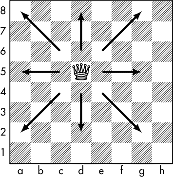

*图 7-7：皇后的可能移动*

存在解的最小*n*值是 4。两个可能的解法如图 7-8 所示。

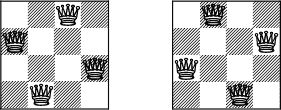

*图 7-8：4 皇后问题的解法*

这个问题受欢迎的一个原因是它的搜索图是树形的，这意味着通过深度优先搜索，不会再次到达之前已经见过的状态（也就是说，一旦皇后被放置，就无法在后续步骤中回到一个皇后更少的状态）。这避免了需要跟踪之前的状态，确保它们不会被重复探索的麻烦。

解决这个问题的一个简单方法是逐列检查，每次测试一列中的每个格子，直到找到解决方案（需要时进行回溯）。例如，如果我们从图 7-9 开始，无法将皇后放置在 b1 或 b2，因为它们会被 a1 位置的皇后攻击。

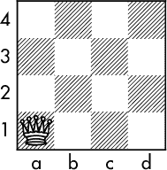

*图 7-9：第一个皇后放置在 a1*

下一个未被攻击的格子是 b3，结果如图 7-10 所示：

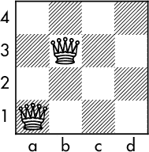

*图 7-10：第二个皇后放置在 b3*

但现在当我们到达 c 列时，卡住了，因为该列的每个格子都被其他皇后攻击了。所以我们回溯并将 b 列的皇后移到 b4，见图 7-11：

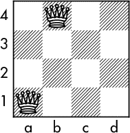

*图 7-11：第二个皇后放置在 b4*

所以现在我们可以在图 7-12 中将皇后放置在 c2：

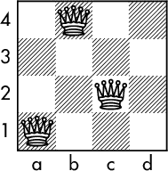

*图 7-12：第三个皇后放置在 c2*

唉，现在 d 列没有位置可以放置皇后了。所以我们回溯到 a 列，重新开始，如图 7-13 所示。

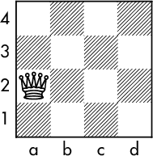

*图 7-13：回溯到第一个皇后位置 a2*

这个过程继续进行，直到找到解决方案。

#### *一个 Racket 解决方案*

我们将棋盘定义为一个*n*乘*n*的数组，由一个包含*n*个元素的可变向量构成，每个元素也是一个包含*n*个元素的向量，其中每个元素是 1 或 0（0 表示该位置未被占据；1 表示该位置有一个皇后）：

```
(define (make-chessboard n)
  (let loop ([v n] [l '()])
    (if (zero? v)
        (list->vector l)
        (loop (sub1 v) (cons (make-vector n 0) l)))))
```

为了通过行（`r`）和列（`c`）编号访问棋盘`cb`的元素，我们定义了以下访问器形式，其中`v`是要设置或检索的值。

```
(define (cb-set! cb r c v)
  (vector-set! (vector-ref cb c) r v))

(define (cb-ref cb r c)
  (vector-ref (vector-ref cb c) r))
```

由于我们使用的是一个可变的数据结构来表示棋盘，因此每当找到一个解时，我们需要一种机制来复制棋盘，以保持棋盘的状态。

```
(define (cb-copy cb)
  (for/vector ([v cb]) (vector-copy v)))
```

当然，我们需要能够查看解，因此我们提供了一个打印过程：

```
(define (cb-print cb)
  (let ([n (vector-length cb)])
    (for* ([r n]
           [c n])
      (when (zero? c) (newline))
      (let ([v (cb-ref cb r c)])
        (if (zero? v)
            (display " .")
            (display " Q")
            ))))
  (newline))
```

解决问题的实际代码`dfs`是一个简单的深度优先搜索。当解被找到时，它们会被编译成一个名为`sols`的列表，这是函数的返回值。在下面的代码中，回想一下，在`let loop`形式中，我们使用了一个命名的`let`（我们在第三章中描述过），我们在其中定义了一个函数（`loop`），我们将递归调用它。

```
(define (dfs n)
  (let ([sols '()]
        [cb (make-chessboard n)])
    (let loop([r 0][c 0])
      (when (< c n)
     ➊ (let ([valid (not (attacked cb r c))])
          (when valid
         ➋ (cb-set! cb r c 1)
         ➌ (if (= c (sub1 n))
              (let ([copy (cb-copy cb)])
             ➍ (set! sols (cons copy sols)))
           ➎ (loop 0 (add1 c)))
         ➏ (cb-set! cb r c 0))
       ➐ (when (< (add1 r) n) (loop (add1 r) c)))))
 ➑ sols))
```

代码首先测试每个位置，看看当前单元格是否被已经放置的任何皇后攻击➊（`attacked`的代码稍后会描述）；如果没有，那么该单元格标记为`valid`，并在该位置放置一个皇后（数字 1）➋。接下来，我们测试当前单元格是否位于棋盘的最后一列➌；如果是，那么我们找到了解，复制棋盘并将其放入`sols` ➍。如果我们不在最后一列，我们就继续进入下一层（即下一列）➎。最后，清除有效的单元格➏，以便可以测试列中的其他行➐。一旦所有解都被找到，它们会被返回➑。

在这个过程中，DFS 回溯发生的位置有些微妙。假设我们处于一个被之前放置的皇后攻击的位置，因此`valid` ➊为假，执行会跳到➐。现在假设我们还在最后一行。在这种情况下，测试失败➐，因此不会再进行循环，递归调用返回。要么没有后续语句，在这种情况下整个循环退出，要么在从递归调用返回后有额外的语句需要执行。这只能在当前位置被清除且我们回到先前的位置➏时发生。这就是回溯点。然后，执行会在最后的`when`语句➐处恢复。

以下函数测试一个位置是否受到任何已经放置的皇后的攻击。它仅检查当前列之前的列，因为棋盘的其他列尚未填充。

```
(define (attacked cb r c)
  (let ([n (vector-length cb)])
    (let loop ([ac (sub1 c)])
      (if (< ac 0) #f
          (let ([r1 (+ r (- c ac))]
                [r2 (+ r (- ac c))])
            (if (or (= 1 (cb-ref cb r ac))
                    (and (< r1 n) (= 1 (cb-ref cb r1 ac)))
                    (and (>= r2 0) (= 1 (cb-ref cb r2 ac))))
                #t
                (loop (sub1 ac))))))))
```

为了输出解，我们定义了一个简单的例程来迭代并打印`dfs`返回的每一个解。

```
(define (solve n)
  (for ([cb (dfs n)]) (cb-print cb)))
```

下面是几个测试运行。

```
> (solve 4)

 . Q . .
 . . . Q
 Q . . .
 . . Q .
 . . Q .
 Q . . .
 . . . Q
 . Q . .

> (solve 5)

 . . Q . .   . . . Q .  . . . . Q   . Q . . .   . . . . Q
 . . . . Q   . Q . . .  . Q . . .   . . . . Q   . . Q . .
 . Q . . .   . . . . Q  . . . Q .   . . Q . .   Q . . . .
 . . . Q .   . . Q . .  Q . . . .   Q . . . .   . . . Q .
 Q . . . .   Q . . . .  . . Q . .   . . . Q .   . Q . . .

 . Q . . .   . . . Q .   . . Q . .   Q . . . .  Q . . . .
 . . . Q .   Q . . . .   Q . . . .   . . Q . .  . . . Q .
 Q . . . .   . . Q . .   . . . Q .   . . . . Q  . Q . . .
 . . Q . .   . . . . Q   . Q . . .   . Q . . .  . . . . Q
 . . . . Q   . Q . . .   . . . . Q   . . . Q .  . . Q . .

> (solve 8)

 . . Q . . . . .
 . . . . . Q . .
 . . . Q . . . .
 . Q . . . . . .
 . . . . . . . Q
 . . . . Q . . .
 . . . . . . Q .
 Q . . . . . . .

<intermediate solutions omitted>

 Q . . . . . . .
 . . . . . . Q .
 . . . . Q . . .
 . . . . . . . Q
 . Q . . . . . .
 . . . Q . . . .
 . . . . . Q . .
 . . Q . . . . .
```

### Dijkstra 的最短路径算法

给定一个图，其中一个节点被指定为起始节点，Edsger Dijkstra 的算法用于找到到其他任何节点的最短路径。该算法首先将所有节点（除了起始节点，它的距离为零）赋予无穷大的距离值。随着算法的进行，节点的距离会逐步调整，直到能够确定其真实距离。

我们将使用图 7-3 中介绍的加权图来说明 Dijkstra 算法（其中 *S* 是起始节点）。我们描述的算法将使用一种名为优先队列的数据结构。*优先队列*类似于常规队列，但在优先队列中，每个项都有一个关联值，称为优先级，这决定了它在队列中的顺序。与普通队列的先进先出顺序不同，优先级较高的项将排在其他项之前。由于我们关心的是找到最短路径，因此较短的距离将被赋予比较长的距离更高的优先级。

图 7-14 中的下图展示了算法的起始条件。

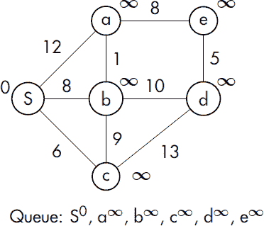

*图 7-14：从 S 找到最短路径的起始条件*

从起始节点到各节点的距离值显示在节点圆圈外面。尚未访问的节点被赋予无穷大的暂定距离值（起始节点的距离值为零）。队列中显示的是带有距离值的节点，距离值由指数表示。

第一步是从队列中弹出第一个节点（该节点将始终具有已知的距离），并将其以浅色背景标记，如图 7-15 所示。将此节点设置为当前节点，*u*（在这种情况下，*u* = *S*，距离值为零）。

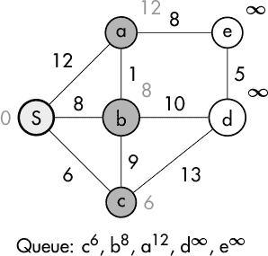

*图 7-15：Dijkstra 算法的步骤 1*

*u* 的邻居节点用更深的颜色标记。然后，我们对队列中仍然存在的每个 *u* 的邻居（标记为 *v*）执行以下的暂定距离计算 *t*，其中 *d*(*u*) 是从起始节点到 *u* 的已知距离，*l*(*u*, *v*) 是从 *u* 到 *v* 的边的距离值：

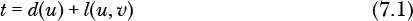

如果 *t* 小于先前的距离值（最初为 *∞*），则队列会更新为新的节点距离。

在队列更新后，我们重复这个过程，这次将 *c* 从队列中弹出，使其成为当前节点（换句话说，*u* = *c*），并像之前一样更新队列和邻居节点的距离。此时图的状态如图 7-16 所示：

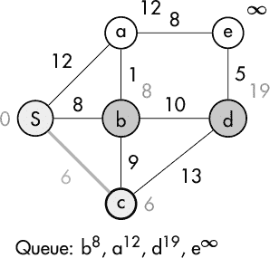

*图 7-16：Dijkstra 算法的步骤 2*

我们用一条较粗的灰线显示从 *S* 到 *c* 的路径，以表示在图 7-16 中已知的最短路径。图 7-17 中的一系列图示展示了其余的过程。请注意，在图 7-17a 中，节点 *a* 的原始距离已从 12 更新为 9，原因是当前路径是从 *S* 通过 *b* 到 *a*。在 7-17d 中，最终图中粗线条所形成的树形结构反映了所有从节点 *S* 出发到其余节点的最短路径。


*图 7-17：Dijkstra 算法的其余部分*

我们通常关心的是算法的执行效率。这通常通过一个*复杂度*值来指定。有很多种方式可以做到这一点，但一种常见的表述方式叫做*大 O 符号*（O 代表“阶”（Order））。这种符号旨在给出算法执行效率的粗略估算（在运行时间或内存使用方面），并且基于输入的规模。Dijkstra 算法的运行时间复杂度是 *O*(*N*²)，其中 *N* 是图中节点的数量。这意味着运行时间随着输入数量的平方增长。换句话说，如果我们将节点数加倍，算法的运行时间大约会变为原来的四倍。这被视为一个上界或最坏情况，并且根据图的性质，运行时间可能会更少。

#### *优先队列*

正如我们在上面的分析中所看到的，优先队列在 Dijkstra 算法中起着关键作用。优先队列可以通过多种方式实现，但一种流行的方法是使用称为二叉堆的结构。*二叉堆*是一种二叉树结构（意味着每个节点最多有两个子节点），其中每个节点的值大于或等于其子节点的值。这种类型的堆叫做*最大堆*。也可以让每个父节点小于或等于其子节点的值，这种类型的堆叫做*最小堆*。这种堆的示例如图 7-18 所示。根节点或顶部节点总是第一个被移除，因为它被认为具有最高优先级。在向堆中添加或移除节点后，剩余的节点会重新排列以维持正确的优先顺序。虽然构建二叉堆对象并不是特别困难，但 Racket 中已经有一个可用的二叉堆，它在 *data/heap* 库中。

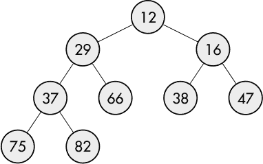

*图 7-18：最小堆*

我们的堆条目不仅仅是数字：我们需要跟踪节点及其当前的距离值（这决定了它的优先级）。因此，每个堆条目将由一对元素组成，其中第一个元素是节点，第二个元素是当前距离。当构建一个 Racket 堆时，必须提供一个函数，用来在给定两个节点条目时执行正确的比较。我们通过以下代码来实现这一点。`comp`函数只比较每对中的第二个元素，因为那才是决定优先级的关键。

```
#lang racket
(require data/heap)

(define (comp n1 n2)
  (let ([d1 (cdr n1)]
        [d2 (cdr n2)])
    (<= d1 d2)))

(define queue (make-heap comp))
```

为了减少一些输入工作，我们创建了几个简单的辅助函数。

```
(define (enqueue n) (heap-add! queue n))

(define (dequeue)
  (let ([n (heap-min queue)])
    (heap-remove-min! queue)
    n))

(define (update-priority s p)
  (let ([q (for/first ([x (in-heap queue)] #:when (equal? s (car x))) x)])
    (heap-remove! queue q)
    (enqueue (cons s p))))

(define (peek-queue) (heap-min queue))

(define (queue->list) (for/list ([n (in-heap queue)]) n))

(define (in-queue? s)
  (for/or ([x (in-heap queue)]) (equal? (car x) s)))
```

`update-priority`过程接受一个符号和一个新的优先级来更新队列。它通过删除（出队）旧值并添加（入队）新值来完成此操作。`heap-remove!`函数的执行非常高效，但它需要确切的值（符号和优先级的配对）才能工作。不幸的是，在不知道优先级的情况下，我们必须通过`in-heap`序列进行线性搜索，查找符号。这可以通过将符号和当前优先级存储在另一种数据结构中（如哈希表）来优化。如果读者愿意，可以进行这个附加步骤。

以下是优先队列实际操作的一些示例。

```
> (enqueue '(a . 12))
> (enqueue '(b . 8))
> (enqueue '(c . 6))
> (queue->list)
'((c . 6) (b . 8) (a . 12))

> (in-queue? 'b)
#t

> (in-queue? 'x)
#f

> (update-priority 'a 9)
> (queue->list)
'((c . 6) (b . 8) (a . 9))

> (dequeue)
'(c . 6)

> (queue->list)
'((b . 8) (a . 9))

> (peek-queue)
'(b . 8)
```

无论值添加到队列的顺序如何，它们都会按优先级顺序存储和移除。

#### *实现*

我们将图定义为一个边的列表。列表中的每条边由端节点和节点之间的距离组成。

```
(define edge-list
  '((S a 12)
    (S b 8)
    (S c 6)
    (a b 1)
    (b c 9)
    (a e 8)
    (e d 5)
    (b d 10)
    (c d 13)))
```

随着算法的推进，我们希望跟踪每个节点的当前父节点，以便算法完成后，我们能够重现到达每个节点的最短路径。一个哈希表将用于维护这些信息。键是节点名，值是父节点的名称。

```
(define parent (make-hash))
```

我们在编码时需要小心，牢记我们的图是双向的，一个由(*a*, *b*)定义的边与由(*b*, *a*)定义的边是等价的。我们通过补充原始边列表，加入一个由反向节点构成的列表来考虑这一点。我们还将使用一个哈希表（`lengths`）来维护每条边的长度，并使用另一个哈希表（`dist`）来记录到达每个节点的最短距离，一旦发现该节点。为了整合这些内容，我们定义了`init-graph`，它接受一个边列表并返回一个附加了反向节点列表的原始列表。它还将用于初始化优先队列和各个哈希表。

```
(define lengths (make-hash))
(define dist (make-hash))

(define (init-graph start-node edges)
  (let* ([INFINITY 9999]
         [swapped (map (λ (e) (list (second e) (first e) (third e))) edges)] 
         [all-edges (append edges swapped)]
         [nodes (list->set (map (λ (e) (first e)) all-edges))])
    (hash-clear! lengths)
    (for ([e all-edges]) (hash-set! lengths (cons (first e) (second e)) (third e)))
    (set! queue (make-heap comp))
    (hash-clear! parent)
    (hash-clear! dist)
    (for ([n nodes])
      (hash-set! parent n null)
      (hash-set! dist n INFINITY)
      (if (equal? n start-node)
          (enqueue (cons start-node 0))
          (enqueue (cons n INFINITY))))
    (hash-set! dist start-node 0)
    all-edges))
```

这是实际计算每个节点最短路径的代码，`dijkstra`。

```
(define (dijkstra start-node edges)
  (let ([graph (init-graph start-node edges)])
 ➊ (define (neighbors n)
      (filter
       (λ (e) (and (equal? n (first e)) (in-queue? (second e))))
       graph))
 ➋ (let loop ()
      (let* ([u (car (dequeue))])
        (for ([n (neighbors u)])
       ➌ (let* ([v (second n)]
              ➍ [t (+ (hash-ref dist u) (hash-ref lengths (cons u v)))])
    ➎ (when (< t (hash-ref dist v))
           ➏ (hash-set! dist v t)
           ➐ (hash-set! parent v u)
           ➑ (update-priority v t)))))
   ➒ (when (> (heap-count queue) 0) (loop)))))
```

`dijkstra` 代码将起始节点符号和边列表作为参数。接着，它定义了 `graph`，这是原始的边列表，并附加了一个节点交换后的边列表。如前所述，`init-graph` 程序还初始化了算法所需的所有其他数据结构。定义了一个局部的 `neighbors` 函数 ➊，它接受一个节点并返回与该节点相邻且仍在队列中的节点列表。主循环开始 ➋，第一步是弹出队列中的第一个节点，并将其符号赋值给 `u`。接着，处理它的每一个邻居（`v`） ➌。对于每个邻居，我们计算 *t* = *d*(*u*) + *l*(*u*, *v*) ➍（回想一下，*d*(*u*) 是从起始符号到 *u* 的当前最短距离估计，*l*(*u*, *v*) 是从 *u* 到 *v* 的边长）。然后我们测试是否 *t* < *d*(*v*) ➎，如果通过测试，我们执行以下操作：

1.  将 *d*(*v*) = *t* ➏。

1.  将 *u* 作为 *v* 的父节点 ➐。

1.  更新队列，将 *t* 作为 *v* 的新优先级 ➑。

最后，我们测试堆中是否还剩值，如果有，则重复该过程 ➒。当算法完成时，`parent` 将包含每个节点的父节点。剩下的就是追踪父节点链到起始符号，以确定到该节点的最短路径。这是通过以下的 `get-path` 函数完成的：

```
(define (get-path n)
  (define (loop n)
    (if (equal? null n)
        null
        (let ([p (hash-ref parent n)])
          (cons n (loop p)))))
  (reverse (loop n)))
```

`show-paths` 程序将打印出所有节点的路径。

```
(define (show-paths)
  (for ([n (hash-keys parent)])
    (printf "  ~a: ~a\n" n (get-path n))))
```

为了方便起见，我们定义了 `solve`，它接收一个起始符号和边列表，调用 `dijkstra` 计算最短路径，并打印出到每个节点的最短路径。

```
(define (solve start-node edges)
  (dijkstra start-node edges)
  (displayln "Shortest path listing:")
  (show-paths))
```

给定我们在 `edge-list` 中定义的原始图以及起始符号 `S`，我们生成解决方案如下：

```
> (solve 'S edge-list)
Shortest path listing:
  S: (S)
  e: (S b a e)
  a: (S b a)
  d: (S b d)
  c: (S c)
  b: (S b)
```

让我们尝试在图 7-19 中展示的这个稍微更有挑战性的示例（参见 [**4**]）。

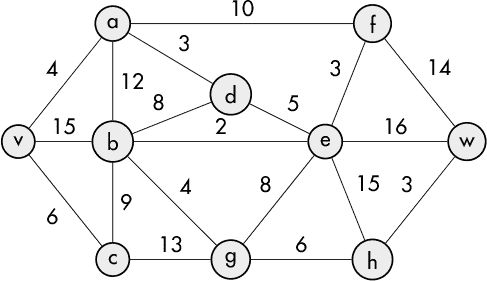

*图 7-19: 测试 Dijkstra 算法的另一个图*

这个图的边列表是 . . .

```
> (define edges '((v a 4) (v b 15) (v c 6) (a b 12) (b c 9) (b d 8) (a f 10) (
     c v 6) (c g 13) (g h 6) (h w 3) (a d 3) (d e 5) (b e 2) (e w 16) (b g 4)
     (g e 8) (e h 16) (e f 3) (f w 14)))
```

所以，求解最短路径时，我们得到了 . . .

```
> (solve 'v edges)
Shortest path listing:
  d: (v a d)
  w: (v a d e b g h w)
  f: (v a f)
  c: (v c)
  v: (v)
  a: (v a)
  e: (v a d e)
  g: (v a d e b g)
  h: (v a d e b g h)
  b: (v a d e b)
```

我们已经在结果图中突出显示了最短路径树（参见 图 7-20）。

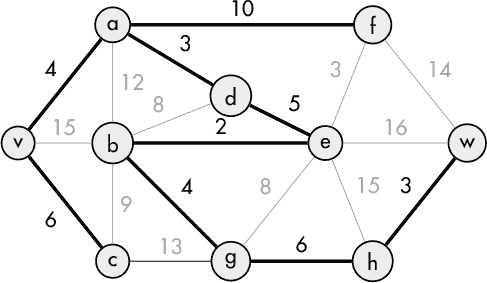

*图 7-20: 找到的最短路径*

现在我们已经彻底研究了 Dijkstra 最短路径算法，接下来我们将通过 Sam Loyd 的（不）著名的 14–15 拼图来看看 A* 算法。

### 15 拼图

15 拼图由 15 个按顺序编号的滑动拼图块组成，这些拼图块随机打乱，目标是将它们恢复到正确的数字顺序。在 19 世纪末，Sam Loyd 通过提供 1000 美元奖金，引起了人们对这个拼图的关注，奖金将奖励任何能够展示从一个已按顺序排列的拼图开始，只是 14 和 15 拼图块反转（如图 7-21 所示，Loyd 将这种排列称为“14-15 拼图”），并能将其恢复到正确顺序的人（当然不允许将拼图块从框架中取出）。正如我们将很快看到的那样，这是数学上不可能的，因此 Loyd 知道他的赌注是安全的。

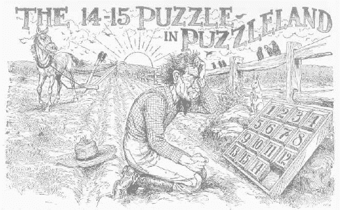

*图 7-21：Sam Loyd 的 14-15 拼图插图*

##### 为什么只交换两个拼图块是不可能的

为了理解为什么 Loyd 的钱是安全的（即为什么不可能只交换两个且仅仅交换两个拼图块），可以考虑图 7-22 所示的已解状态下的拼图。

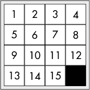

*图 7-22：已解的 15 拼图*

任何能够交换 14 和 15 拼图块的移动序列都会得到 Loyd 拼图中的排列。仅仅重复这个序列就能将拼图块恢复到正确顺序。我们将看到这实际上是不可能的。现在考虑图 7-23 中的排列。


*图 7-23：带有逆序的 15 拼图*

如果我们将这些拼图块按顺序排列，得到 2, 3, 1, 4, 5, 6，……特别地，拼图块 2 和拼图块 3 的值大于其后面的拼图块 1。每当一个拼图块的值大于紧随其后的拼图块时，这种情况称为*逆序*（此情况下有两个逆序）。

与逆序的概念相关的是*换位*的概念。换位只是序列中两个值的交换。通过任意次数的换位，可以得到某一排列。例如，得到序列 2, 3, 1, 4, 5, 6，……的一种方式如下：

1.  初始排列：1, 2, 3, 4, 5, 6，……

1.  换位 1 和 3：3, 2, 1, 4, 5, 6，……

1.  换位 2 和 3：2, 3, 1, 4, 5, 6，……

关键的思想是，包含偶数个逆序的排列总是通过偶数次换位产生的，而包含奇数个逆序的排列总是通过奇数次换位产生的。为了参考，空白位置将视为一个拼图块，并用数字 16 标示。任何拼图块 16 的单次移动都是一次换位。如果拼图块 16 从右下角离开并经过奇数次换位到达某个位置，则需要奇数次换位才能回到起始位置，或者净换位次数为偶数次。这样，拼图就会有偶数个逆序。

萨姆·洛伊德提出的排列是无法解决的，因为它涉及一个单一的奇数逆序。虽然证明起来更为复杂，但也可以证明，任何具有偶数逆序的谜题都是可以解决的。

解决了这个历史性问题——萨姆·洛伊德的难题后，我们现在将注意力转向那些实际上可以解决的谜题。在这方面，我们将探索 A* 搜索算法（我们以后通常简称为“A*算法”）。

#### *A* 搜索算法*

我们当然假设计算机提供的是一个可解的谜题（即它有偶数个逆序对）。计算机应提供一个尽可能高效的解决方案——也就是说，提供一个达到目标状态所需最少步数的解决方案。一种通常能提供良好结果的方法被称为 *A* 搜索算法。与简单的广度优先或深度优先搜索相比，A*算法的一个优势是，它使用一个 *启发式*^(1) 来减少搜索空间。它通过计算搜索树中任意给定分支的 *估算* 成本来实现这一点。它反复改进这一估算，直到确定最佳解决方案或确定无法找到解决方案为止。估算值存储在一个优先队列中，其中最小成本状态位于队列的头部。

我们将通过查看 15 数字拼图的一个较小变体——8 数字拼图来开始我们的分析。8 数字拼图在其已解决状态下如 图 7-24 所示。

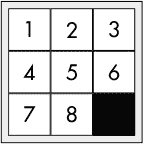

*图 7-24：已解决的 8 数字拼图*

8 数字拼图的搜索树可以如 图 7-25 所示进行建模，其中树的每个节点代表拼图的一个状态，而子节点则是由有效移动产生的可能状态。

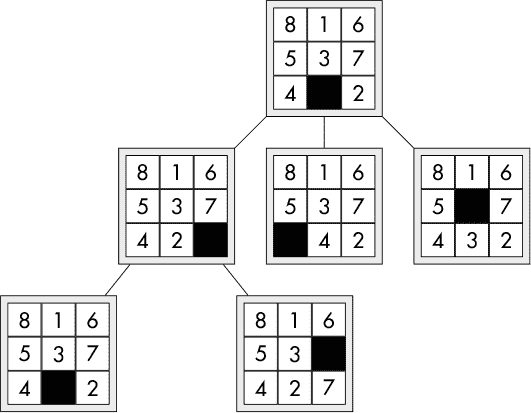

*图 7-25：部分 8 数字拼图游戏树*

在每次 A* 算法迭代中，它都会计算从当前状态到目标状态的成本估算（即所需步数）。形式上，它试图最小化以下估算成本函数，其中 *n* 是正在考虑的节点，*g*(*n*) 是从起始节点到 *n* 的路径成本，*h*(*n*) 是估算从 *n* 到目标的最便宜路径的启发式：

*f(n)* = *g(n)* + *h(n)*

设计一个好的启发式函数有些像是一门艺术。为了从 A* 算法中获得最佳性能，启发式的一个重要特性是，它满足图中每条边的以下条件，其中 *h*^*(*n*) 是到达目标状态的实际（但未知的）成本：

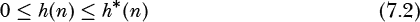

如果一个启发式满足此条件，则称其为 *可接纳的*，并且 A* 算法可以保证找到最优解。

一种可能的启发式方法是使用名为*曼哈顿距离*的计算方法（与常见的直线距离不同）。例如，要将图 7-25 中的瓦片-2 移到它的目标位置（即它在已解决状态中应占据的单元格），该瓦片需要先上移两格，再左移一格，总共需要三次移动——这就是曼哈顿距离。拼图状态的启发式值将是每个瓦片的曼哈顿距离之和。表 7-1 展示了图 7-25 根节点的这一值的计算。

**表 7-1**：计算曼哈顿距离

| **瓦片** | **行** | **列** | **总计** |
| --- | --- | --- | --- |
| 1 | 0 | 1 | 1 |
| 2 | 2 | 1 | 3 |
| 3 | 1 | 1 | 2 |
| 4 | 1 | 0 | 1 |
| 5 | 0 | 1 | 1 |
| 6 | 1 | 0 | 1 |
| 7 | 1 | 2 | 3 |
| 8 | 2 | 1 | 3 |
| 距离： | 15 |

曼哈顿距离始终小于或等于实际的移动次数，因此它满足可接受性条件。

一种稍弱的启发式是*汉明距离*，即错位瓦片的数量。图 7-25 中显示的拼图的汉明距离是八：所有瓦片都没有放在它们的目标位置。

在图 7-26 中，我们为每个节点标注了三个值。第一个值是游戏树的深度（该值每经过一层递增 1，并构成成本公式中*g*(*n*)的值），第二个值是启发式值，*h*(*n*)，即节点的启发式值（在此案例中为曼哈顿距离），第三个值是前两个值之和，表示节点的整体成本分数。

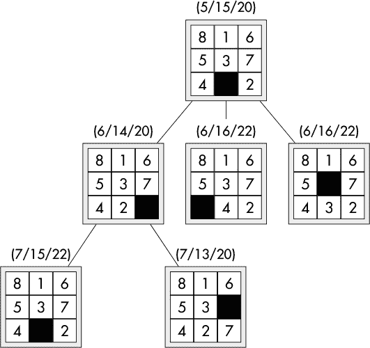

*图 7-26：带有节点成本的 8 拼图*

A*算法使用一个名为*open*的优先队列。这个队列根据估计的到达目标的成本，对已检查但其子节点尚未扩展的拼图状态进行排序。该算法还依赖于一个名为*closed*的字典，该字典将拼图状态作为键，并维护该节点的最新成本值。图 7-27 反映了当前分析的状态，其中 open 队列中的第一个节点是图 7-26 的根节点。

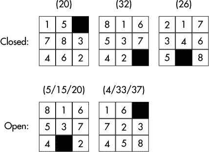

*图 7-27：已关闭和打开的节点*

已关闭节点顶部显示的值是最新的估计成本。打开节点顶部显示的值是上面描述的三个成本值。通过这一介绍，我们将一步步演示 A*算法如何处理游戏树。

第一步是从开放队列中弹出优先级最低的值。然后，该节点被添加到闭合字典中。下一步是计算子节点的成本，这些节点显示在图 7-26 的第二层。如果这些节点中有任何一个不在闭合列表中，它们将直接加入到开放队列中，不需要进一步分析。注意，第一个子节点*已经*在闭合列表中。由于其当前的估计成本低于闭合列表中的成本，它被从闭合列表中移除，并以新的值重新加入队列。如果子节点已经在闭合列表中，但其估计值*大于*闭合列表中的值，则不做任何更改，也不将其添加到队列中。完成此阶段后，开放和闭合结构将如图 7-28 所示。

由于图 7-26 中的第一个子节点的成本低于开放队列中其他节点的成本，它被移到队列的头部，并成为下一个被弹出的项目。注意，它的第一个子节点已经在闭合列表中，但其新计算的成本高于闭合列表中的成本，因此被忽略。剩下的子节点将像以前一样进行处理。

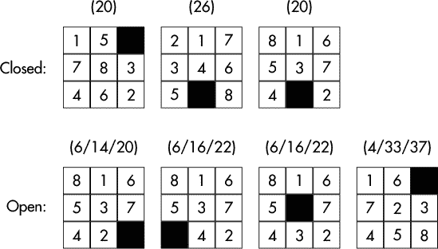

*图 7-28：闭合与开放，更新版*

该过程将持续进行，直到发生以下两种情况之一：要么从开放队列中弹出的节点处于已解状态，在这种情况下算法完成并打印答案（有关如何完成此操作的详细信息将在下一节中描述）；要么开放队列变为空，表示拼图无法解决。

#### *Racket 中的 8-拼图*

我们将先实现一个针对较小的 3x3 版本的拼图的解决方案，然后再继续解决完整的 4x4 版本。

与 Dijkstra 算法类似，我们将使用 Racket 的堆对象来处理开放优先队列：

```
#lang racket
(require data/heap)

(define (comp n1 n2)
  (let ([d1 (cdr n1)]
        [d2 (cdr n2)])
    (<= d1 d2)))

(define queue (make-heap comp))

(define (enqueue n) (heap-add! queue n))

(define (dequeue)
  (let ([n (heap-min queue)])
    (heap-remove-min! queue)
    n))
```

一个`SIZE`常量将指定拼图的行列数。此外，我们还将定义一些实用函数来处理拼图结构。为了提高效率，拼图的状态将内部存储为一个大小为`SIZE*SIZE+2`的 Racket 向量。向量的最后两个元素将包含空白格的行和列。空白格将具有由`(define empty (sqr SIZE))`指定的数值。为此，我们有以下内容：

```
(define SIZE 3)
(define empty (sqr SIZE))

(define (ref puzzle r c)
  (let ([i (+ c (* r SIZE))])
    (vector-ref puzzle i)))

(define (empty-loc puzzle)
  (values
   (vector-ref puzzle empty)
   (vector-ref puzzle (add1 empty))))
```

`ref`函数将接受拼图以及行和列号作为参数。它返回该位置上的拼图块编号。`empty-loc`函数将返回两个值，分别表示空白格的行和列。

以下函数用于计算曼哈顿距离。第一个函数创建一个哈希表，用于根据拼图块的编号查找其家居位置。第二个函数计算拼图中每个块的曼哈顿距离之和。这将用于计算拼图节点的成本。

```
(define tile-homes
  (let ([hash (make-hash)])
    (for ([n (in-range (sqr SIZE))])
      (hash-set! hash (add1 n) (cons (quotient n SIZE) (remainder n SIZE))))
    hash))

(define (manhattan puzzle) 
  (let ([dist 0])
    (for* ([r SIZE] [c SIZE])
      (when (not (= empty (ref puzzle r c)))
        (let* ([t (hash-ref tile-homes (ref puzzle r c))]
               [tr (car t)]
               [tc (cdr t)])
          (set! dist (+ dist
                        (abs (- tr r))
                        (abs (- tc c)))))))
    dist))
```

以下函数用于根据移动说明生成新的谜题状态。移动说明是一个从零到三的数字，用于确定哪一个方向的方块可以移动到空白位置。

```
(define (move-offset i)
  (case i
    [(0) (values  0 -1)]
    [(1) (values  0  1)] 
    [(2) (values -1  0)] 
    [(3) (values  1  0)]))

(define (make-move puzzle i)
  (let*-values ([(ro co) (move-offset i)]
                [(re ce) (empty-loc puzzle)]
                [(rt ct) (values (+ re ro) (+ ce co))]
                [(t) (ref puzzle rt ct)])
    (for/vector ([i (in-range (+ 2 (sqr SIZE)))])
      (cond [(< i empty)
             (let-values ([(r c) (quotient/remainder i SIZE)])
               (cond [(and (= r re) (= c ce)) t]
                     [(and (= r rt) (= c ct)) empty]
                     [else (vector-ref puzzle i)]))]
            [(= i empty) rt]
            [else ct]))))
```

`move-offset` 函数接受一个移动说明，并返回两个值，指定执行该移动所需的行和列增量。`make-move` 函数接受一个移动说明，并返回一个新的向量，表示执行该移动后的谜题状态。

以下函数将接受一个谜题并返回一个列表，包含所有可以从特定谜题状态到达的有效谜题状态。局部的 `legal` 函数通过检查某个方向的移动是否会超出谜题的边界，来判断一个移动说明是否会导致当前谜题状态的有效移动。

```
(define (next-states puzzle)
  (let-values ([(re ce) (empty-loc puzzle)])
    (define (legal i)
      (let*-values ([(ro co) (move-offset i)]
                    [(rt ct) (values (+ re ro) (+ ce co))])
        (and (>= rt 0) (>= ct 0) (< rt SIZE) (< ct SIZE))))
    (for/list ([i (in-range 4)] #:when (legal i))
      (make-move puzzle i))))
```

当然，实际看到谜题的可视化表示会非常有用。以下程序提供了这个功能。

```
(define (print puzzle)
  (for* ([r SIZE] [c SIZE])
    (when (= 0 c) (printf "\n"))
    (let ([t (ref puzzle r c)])
      (if (= t empty)
          (printf "  ")
          (printf " ~a" t))))
  (printf "\n"))
```

接下来，我们定义一个辅助函数来处理关闭节点。

```
(define closed (make-hash))

(define (process-closed node-parent node node-depth score)
  (begin
 ➊ (hash-set! closed node (list node-parent score)) 
    (for ([child (next-states node)])
   ➋ (let* ([depth (add1 node-depth)]
          ➌ [next-score (+ depth (manhattan child))]
          ➍ [next (cons (list child depth node) next-score)])
        (if (hash-has-key? closed child)
         ➎ (let* ([prior-score (second (hash-ref closed child))])
           ➏ (when (< next-score prior-score)
                (hash-remove! closed child)
                (enqueue next)))
         ➐ (enqueue next))))))
```

我们首先将节点、其父节点及其估算成本放入 `closed` 表 ➊。接下来，我们生成可能的子谜题状态列表，并对其进行循环。对于每个子节点，我们生成新的节点深度 ➋ 和估算得分 ➌。然后我们汇总需要的信息，以便将该节点推入打开队列 ➍，如果该节点不在 `closed` 表中，推送操作会自动进行 ➐。如果该节点已经在 `closed` 表中，我们会提取其之前的成本得分 ➎ 并与当前得分 ➏ 进行比较。如果当前得分小于之前的得分，我们会将该节点从 `closed` 表中移除，并将其放入打开队列中。

最后，我们进入真正的算法部分。

```
(define (a-star puzzle)
  (let [(solved #f)]
    (hash-clear! closed)
 ➊ (set! queue (make-heap comp))  ; open
 ➋ (enqueue (cons (list puzzle 0 null) (manhattan puzzle)))
 ➌ (let loop ()
   ➍ (unless solved
        (let* ([node-info (dequeue)])
       ➎ (match node-info
            [(cons (list node node-depth node-parent) score)
          ➏ (if (= 0 (manhattan node))
                 (begin
                   (set! solved #t) 
                   (print-solution (solution-list node-parent (list node))))
             ➐ (process-closed node-parent node node-depth score)
                 )])
       ➑ (if (> (heap-count queue) 0)
              (loop)
           ➒ (unless solved(printf "No solution found\n"))))))))
```

首先，我们定义上述的 `closed` 哈希表。打开队列被初始化 ➊，并且提供给 `a-star` 程序的打乱谜题被推送到打开队列中 ➋。队列中的项由一个 Racket 对组成。对的 `cdr` 部分是估算的得分，而 `car` 部分由谜题状态、树的深度和父节点的谜题状态组成。初始化完成后，主循环开始 ➌。

循环会一直重复，直到 `solved` 变量被设为 true。循环的第一步是从打开队列中弹出优先级最高（成本得分最低）的项，并将其分配给 `node-info` 变量。使用 `match` 形式解析 `node-info` 中包含的值 ➎。首先测试谜题状态（在 `node` 中）是否已达到解决状态 ➏，如果是，函数会输出移动序列并终止过程。否则，处理继续，我们通过将节点、其父节点和估算成本放入 `closed` 表来处理关闭节点 ➐。

每次迭代完成后，会检查队列 ➑ 是否包含任何需要处理的节点。如果有，则下一次迭代继续进行 ➍；否则，表示没有解决方案，过程终止 ➒。

这是显示解法的打印函数。`solution-list`过程通过追溯`closed`中的父节点，生成一个从起始拼图到最终拼图的所有状态列表；`print-solution`则接受该解法列表并打印其中包含的拼图状态。

```
(define (solution-list n l)
  (if (equal? n null)
      l
      (let* ([parent (first (hash-ref closed n))])
        (solution-list parent (cons n l)))))

(define (print-solution l)
  (for ([p l]) (print p)))
```

下面是对图 7-25 中展示的谜题进行的测试运行（为了节省空间，输出谜题横向显示）。

```
> (a-star #(8 1 6 5 3 7 4 9 2 2 1))

 8 1 6  8 1 6  8 1 6    1 6  1   6  1 3 6  1 3 6
 5 3 7  5 3 7    3 7  8 3 7  8 3 7  8   7    8 7
 4   2    4 2  5 4 2  5 4 2  5 4 2  5 4 2  5 4 2

 1 3 6  1 3 6  1 3 6  1 3 6  1 3 6  1 3 6  1 3 6  
 5 8 7  5 8 7  5 8 7  5 8    5   8  5 2 8  5 2 8  
   4 2  4   2  4 2    4 2 7  4 2 7  4   7  4 7    

 1 3 6  1 3    1   3  1 2 3  1 2 3  1 2 3  1 2 3  
 5 2    5 2 6  5 2 6  5   6    5 6  4 5 6  4 5 6  
 4 7 8  4 7 8  4 7 8  4 7 8  4 7 8    7 8  7   8  

 1 2 3
 4 5 6
 7 8
```

#### *上升到 15 拼图*

在 8 拼图的基础上，15 拼图需要进行这个棘手的修改：将`SIZE`的值从 3 更改为 4。好吧，也许这并不算太棘手，但在你太兴奋之前，实际上这也并没有那么简单。观察图 7-29。前两个拼图来自[9]，我们的测试计算机轻松解决了这些问题。但第三个拼图是随机生成的，导致测试计算机崩溃，它自己在地板上咯咯笑，认为我们竟然让它解决如此复杂的问题——没有解答能够成功输出。

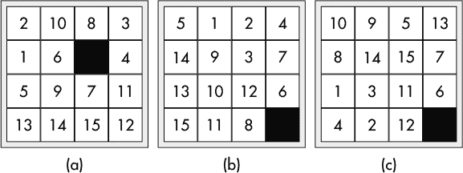

*图 7-29：一些 15 拼图示例*

问题在于，某些谜题可能导致 A*算法需要探索过多的路径，从而使计算机资源耗尽（或者用户在等待答案时耐心耗尽）。我们的解决方案是通过将问题分解成三个子问题，采取稍微不那么优雅的方法。我们将以牺牲完全优化的解法为代价，换取一个不需要等太久就能得到的解法。

为了将问题分解成子问题，我们将如图 7-30 所示将谜题划分为三个区域。这些区域的选择是为了利用 A*算法在 8 拼图上的高效性。

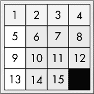

*图 7-30：15 拼图分区*

中灰色区域，我们指定为区域 1，表示一个子问题，白色区域（区域 2）将是第二个子问题，深灰色区域（区域 3）代表另一个子问题（相当于 8 拼图，我们知道它可以快速解决）。这个思路是为`a-star`算法提供不同的评分函数，具体取决于当前正在处理的区域。这些函数仍然会使用曼哈顿距离，但会应用一定的限制。一旦区域 1 和区域 2 被解决，我们就可以像以前一样调用`manhattan`，因为区域 1 和区域 2 中的边缘瓷砖已经到位，剩下的瓷砖将相当于一个 8 拼图。

##### 区域 1

在开始解决区域 1 之前，我们将创建一个帮助函数，该函数与我们在`manhattan`函数中看到的代码非常相似：

```
(define (cost puzzle guard)
  (let ([dist 0])
    (for* ([r SIZE] [c SIZE])
      (let ([t (ref puzzle r c)])
        (when (guard r c t)
          (let* ([th (hash-ref tile-homes t)]
                 [hr (car th)]
                 [hc (cdr th)]
                 [d (+ (abs (- hr r)) (abs (- hc c)))])
            (set! dist (+ dist d))))))
    dist))
```

主要区别在于，替代直接在`cost`函数中嵌入空格测试，我们将传递一个用于`guard`参数的函数来为我们执行该测试。基于此，我们可以重新定义`manhattan`如下：

```
(define (manhattan puzzle)
  (cost puzzle (λ (r c t) 
                 (not (= t empty)))))
```

我们将分两阶段攻击区域 1：首先，我们将第 1 到第 4 个瓦片推入拼图的前两行；然后，我们将它们按照正确的顺序排列到第一行。

为了将瓦片 1 到 4 移入前两行，我们定义了`zone1a`。

```
(define (zone1a puzzle)
  (cost puzzle (λ (r c t)
                 (or (and (<= t 4) (> r 1))))))
```

在这种情况下，我们只更新第 1 到第 4 个瓦片的距离，并且只有在这些瓦片尚未位于前两行时，我们才更新其距离。

第二阶段稍有不同。这次我们始终更新第 1 到第 4 个瓦片的距离，以确保它们落到正确的位置。

```
(define (zone1b puzzle)
  (cost puzzle (λ (r c t)
                 (<= t 4))))
```

可能看起来这一切可以在一个函数中完成，但如果试图一次性将所有瓦片定位，则会导致一个巨大的搜索空间，并需要更多的时间和计算资源（例如内存）。我们的第一阶段，只是将瓦片放置到接近其正确位置的地方，就减少了搜索空间的一半，且不需要大量资源。第二阶段的排序通常只需要处理拼图上半部分的瓦片，因为剩余的瓦片得分为零。

##### 区域 2

此时，我们已将搜索空间缩小了 25%。这种适度的减少足以让我们在一个过程中将瓦片 5、9 和 13 移入区域 2，并按正确顺序排列，我们在这里提供的过程就是`zone2`：

```
(define zone2-tiles (set 5 9 13))

(define (zone2 puzzle)
  (cost puzzle (λ (r c t)
                 (and (>= r 1)
                      (set-member? zone2-tiles t)))))
```

此时，我们不再需要关注第 1 行，正如代码中`>= r 1`所示。除此之外，代码几乎与其他代码相同，唯一不同的是这次我们使用在`zone2-tiles`中定义的值来进行评分。

##### 将所有内容整合在一起

一旦一个区域被解决，我们就不希望干扰已经放置好的瓦片。为此，我们对生成可行状态列表的函数（`next-states`）做了一个轻微调整。之前，我们只是简单地检查是否没有超出第一行或列。现在，我们定义了全局变量`min-r`和`min-c`，它们会根据当前正在处理的区域设置为 0 或 1。

```
(define min-r 0)
(define min-c 0)

(define (next-states puzzle)
  (let-values ([(re ce) (empty-loc puzzle)])
    (define (legal i)
      (let*-values ([(ro co) (move-offset i)]
                    [(rt ct) (values (+ re ro) (+ ce co))])
        (and (>= rt min-r) (>= ct min-c) (< rt SIZE) (< ct SIZE))))
    (for/list ([i (in-range 4)] #:when (legal i))
      (make-move puzzle i))))
```

最终的求解器将在区域 1 和区域 2 填充完成后更新`min-r`和`min-c`的值。

现在，我们需要对`a-star`和`process-closed`的代码进行一些关键的修改。

```
(define (process-closed node-parent node node-depth score fscore)
  (begin
    (hash-set! closed node (list node-parent score)) 
    (for ([child (next-states node)])
      (let* ([depth (add1 node-depth)]
          ➊ [next-score (+ depth (fscore child))]
             [next (cons (list child depth node) next-score)])
        (if (hash-has-key? closed child)
            (let* ([prior-score (second (hash-ref closed child))])
              (when (< next-score prior-score)
                (hash-remove! closed child)
                (enqueue next)))
            (enqueue next))))))
```

最显著的变化是，之前我们一直使用`manhattan`来进行评分估计，而现在我们使用函数`fscore` ➊，它作为额外参数传递给`process-closed`。这个函数会根据正在解决的拼图区域的不同而有所不同。

```
(define (a-star puzzle fscore)
  (let ([solution null]
        [goal null])
    (hash-clear! closed)
    (set! queue (make-heap comp))  ; open
    (enqueue (cons (list puzzle 0 null) (fscore puzzle)))
    (let loop ()
      (when (equal? solution null)
        (let* ([node-info (dequeue)])
          (match node-info
            [(cons (list node node-depth node-parent) score)
             (if (= 0 (fscore node))
                 (begin
                ➊ (set! goal node)
                ➋ (set! solution (solution-list node-parent (list node))))
                 (process-closed node-parent node node-depth score fscore))])
          (if (> (heap-count queue) 0)
              (loop)
              (when (equal? solution null) (printf "No solution found\n"))))))
 ➌ (values goal solution)))
```

在这里，我们还包括了`fscore`作为一个额外的参数。现在，当目标状态达到时，我们不再立即打印出解决方案，而是返回两个值：第一个`set!` ➊中的当前目标和第二个`set!` ➋中的解决方案列表。剩余的代码应与原始版本保持一致。

我们不再像以前那样直接调用`a-star`，而是提供了一个`solve`函数，逐步执行并为`a-star`提供适当的评分函数，该函数可以是区域特定的函数之一，或是`manhattan`。

```
(define (solve puzzle)  
  (set! min-r 0)
  (set! min-c 0)
  (let*-values ([(goal sol-z1a) (a-star puzzle zone1a)])
    (let*-values  ([(goal sol2) (a-star goal zone1b)]
                   [(sol-z1b) (cdr sol2)])
      (set! min-r 1)
      (let*-values  ([(goal sol3) (a-star goal zone2)]
                     [(sol-z2) (cdr sol3)])
        (set! min-c 1)
        (let*-values  ([(goal sol4) (a-star goal manhattan)]
                       [(sol-man) (cdr sol4)])
          (print-solution (append sol-z1a sol-z1b sol-z2 sol-man)))))))
```

在代码执行时，它会在每个步骤存储解决方案列表，并最终在代码的最后一行打印出完整的解决方案。我们在每个步骤（除了第一步）都取解决方案列表的`cdr`，这是因为前一步骤的最后一项是下一步的目标；如果我们把它保留在列表中，这个状态就会被重复。

最后，我们解决了`print`例程中由于瓷砖上的双位数字导致的小问题。修改后的代码如下。

```
(define (print puzzle)
  (for* ([r SIZE] [c SIZE])
    (when (= 0 c) (printf "\n"))
    (let ([t (ref puzzle r c)])
      (if (= t empty)
          (printf "   ")
          (printf " ~a" (~a t #:min-width 2 #:align 'right) ))))
  (printf "\n"))
```

以下是一些用于测试代码的示例输入。为了节省空间，仅显示第一个示例的输出（压缩格式）。

```
> (solve #(2 10 8 3 1 6 16 4 5 9 7 11 13 14 15 12 1 2))

  2 10  8  3   2 10     3    2 10  3       2 10  3  4 
  1  6     4   1  6  8  4    1  6  8  4    1  6  8   
  5  9  7 11   5  9  7 11    5  9  7 11    5  9  7 11
 13 14 15 12  13 14 15 12   13 14 15 12   13 14 15 12

  2 10  3  4    2 10  3  4   2     3  4       2  3  4
  1  6     8    1     6  8   1 10  6  8    1 10  6  8
  5  9  7 11    5  9  7 11   5  9  7 11    5  9  7 11
 13 14 15 12   13 14 15 12  13 14 15 12   13 14 15 12

  1  2  3  4    1  2  3  4    1  2  3  4   1  2  3  4  
    10  6  8    5 10  6  8    5 10  6  8   5     6  8  
  5  9  7 11       9  7 11    9     7 11   9 10  7 11  
 13 14 15 12   13 14 15 12   13 14 15 12  13 14 15 12  

  1  2  3  4    1  2  3  4    1  2  3  4    1  2  3  4 
  5  6     8    5  6  7  8    5  6  7  8    5  6  7  8
  9 10  7 11    9 10    11    9 10 11       9 10 11 12
 13 14 15 12   13 14 15 12   13 14 15 12   13 14 15   

> (solve #(5 1 2 4 14 9 3 7 13 10 12 6 15 11 8 16 3 3))
. . .

> (solve #(10 9 5 13 8 14 15 7 1 3 11 6 4 2 12 16 3 3))
. . .

> (solve #(3 1 2 4 13 6 7 8 5 12 10 11 9 14 15 16 3 3))
. . .

> (solve #(9 6 12 3 5 13 16 8 14 1 10 7 2 15 11 4 1 2))
. . .

> (solve #(11 1 3 12 5 2 9 8 10 6 14 15 7 13 4 16 3 3))
. . .
```

请注意，根据谜题的复杂性和计算机的性能，生成解决方案可能需要从几秒钟到一分钟不等的时间。

### 数独

数独^(2)是一种流行的谜题，由一个 9x9 的方格组成，初始时有一些方格被填入了从 1 到 9 的数字，如图 7-31a 所示。目标是填充空白方格，使得每一行、每一列和每一个 3x3 的方格块也包含数字 1 到 9，如图 7-31b 所示。一个完整的数独谜题应只有一个可能的解。

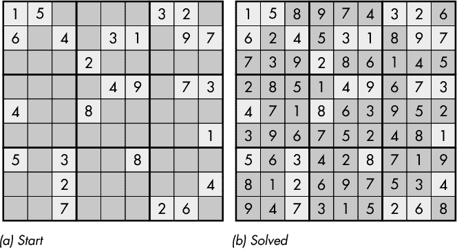

*图 7-31：数独谜题*

本节的目标是编写一个过程，生成任何给定数独谜题的解决方案。

基本策略如下：

1.  检查每个空单元格，确定可用的数字。

1.  选择一个可用数字最少的单元格。

1.  一次填写单元格中的一个可用数字。

1.  对每个可用数字，重复该过程，直到谜题被解决，或没有可用数字填入空单元格。

1.  如果没有可用的数字，请回溯到步骤 3，尝试其他数字。

该过程是深度优先搜索的另一种应用。

图 7-32 给出了在谜题中参考位置的坐标：数字索引列位于顶部，数字索引行位于左边缘，数字索引块位于 3x3 子网格的内部。

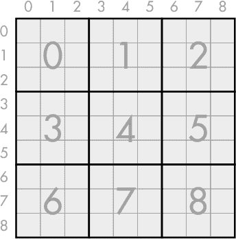

*图 7-32：谜题坐标*

要确定某个单元格的可用数字，我们需要对每行、每列和每个区块中未使用的数字进行集合交集操作。以图 7-31a 中第一行第一列的单元格为例，第一行的可用数字集合为{2, 5, 8}，第一列的所有数字中除了 5 外的其他数字均可用，在区块 0 中，可用的数字集合为{2, 3, 7, 8, 9}。这些集合的交集给出了该单元格的可选值集合：{2, 8}。

我们的实现将使用一个 9x9 的数字数组来表示谜题，其中数字 0 表示一个空白格。该数组将由九个元素的向量构成，每个元素是另一个九个元素的整数向量。为了方便访问数组的元素，我们定义了两个实用函数来设置和获取值：

```
(define (array-set! array r c v)
  (vector-set! (vector-ref array r) c v))

(define (array-ref array r c)
  (vector-ref (vector-ref array r) c))
```

这两个函数都需要将数组以及行列号作为初始参数提供。

从行和列号推导相应的块索引也将是有用的，正如 `getBlk` 函数所示。

```
(define (getBlk r c) ; block from row and column
  (+ (* 3 (quotient r 3)) (quotient c 3)))
```

谜题将作为一个单一字符串输入，其中每行九个数字由换行符分隔，如下面的示例所示。

```
> (define puzzle-str "
150000320
604031097
000200000
000049073
400800000
000000001
503008000
002000004
007000260
")
```

我们将数独谜题对象定义为 `sudoku%` Racket 对象，以下是该对象的部分实现。该对象将维护谜题的状态，并包含可以通过设置单元格值来操作状态的函数，同时提供列出潜在候选数字（在某行、某列或某块中未使用的数字）及其他辅助函数。

```
(define sudoku%
  (class object%

 ➊ (init [puzzle-string ""])

    (define avail-row (make-markers))
    (define avail-col (make-markers))
    (define avail-blk (make-markers))
 ➋ (define count 0)

 ➌ (define grid
      (for/vector ([i 9]) (make-vector 9 0)))

    (super-new)

 ➍ (define/public (item-set! r c n)
      (array-set! grid r c n)
      (array-set! avail-row r n #f)
      (array-set! avail-col c n #f)
      (let ([b (getBlk r c)])
        (array-set! avail-blk b n #f))
      (set! count (+ count 1)))
    (unless (equal? puzzle-string "")
   ➎ (init-puzzle puzzle-string))

    (define/public (get-grid) grid)

    (define/public (item-ref r c)
      (array-ref grid r c))

 ➏ (define/public (init-grid grid)
      (for* ([r 9] [c 9])
        (let ([n (array-ref grid r c)])
          (when (> n 0)
            (item-set! r c n)))))

 ➐ (define/private (init-puzzle p)
      (let ([g 
             (let ([rows (string-split p)])
               (for/vector ([row rows])
                 (for/vector ([c 9])
                   (string->number (substring row c (add1 c))))))])
        (init-grid g)))

; More to come shortly . . .

))
```

`init` 表单 ➊ 捕获定义谜题的输入字符串值。我们通过调用 `init-puzzle` ➐ 来初始化谜题 ➎，该函数通过调用 `init-grid` ➏ 使用适当的数值更新 `grid` ➌。

`count` 变量 ➋ 包含当前已赋值的单元格数量。一旦 `count` 达到 81，谜题即已解答。

`avail-row`、`avail-col` 和 `avail-blk` 变量用于跟踪每行、每列和每个块中当前未使用的数字。`make-markers` 函数用于初始化这些变量，它创建一个布尔数组，表示在给定索引（行、列或块）中哪些数字是可用的；`make-markers` 定义如下：

```
(define (make-markers)
  (for/vector ([i 10])
    (let ([v (make-vector 10 #t)])
      (vector-set! v 0 #f)  
      v)))
```

请注意，数字 0（表示空单元格）自动标记为不可用。

随着数字被添加到谜题中，`item-set!` 会被调用 ➍。该过程负责在给定要分配给谜题的行、列和数字时更新 `grid`、`avail-row`、`avail-col` 和 `avail-blk`。`get-grid` 和 `item-ref` 函数分别返回 `grid` 或 `grid` 中的某个单元格。

在以下代码片段中，所有缩进的函数定义应包含在 `sudoku%` 类定义中，而不是全局定义。

以下 `avail` 函数将 `avail-row`、`avail-col` 和 `avail-blk` 的值结合起来，生成一个指示哪些数字可用的向量。

```
    (define (avail r c)
      (let* ([b (getBlk r c)]
             [ar (vector-ref avail-row r)]
             [ac (vector-ref avail-col c)]
             [ab (vector-ref avail-blk b)])
        (for/vector ([i 10])
          (and (vector-ref ar i)
               (vector-ref ac i)
               (vector-ref ab i)))))
```

给定这个向量，我们按照以下方式创建一个自由数字的列表：

```
    (define (free-numbers v)
      (for/list ([n (in-range 1 10)] #:when (vector-ref v n)) n))
```

为了提高效率，以下代码查找所有只有一个可用数字的单元格，并相应地更新谜题。

```
    (define (set-singles)
      (let ([found #f])
        (for* ([r 9] [c 9])
          (let* ([free (avail r c)]
                 [num-free (vector-count identity free)]
                 [n (item-ref r c)])
            (when (and (zero? n)  (= 1 num-free))
              (let ([first-free
                     (let loop ([i 1])
                       (if (vector-ref free i) i
                           (loop (add1 i))))])
                (item-set! r c first-free)
                (set! found #t))
              )))
        found))
```

执行此过程一次可能会导致其他单元格只有一个可用的数字。以下代码会持续运行，直到没有单元格只剩下一个可用数字。

```
    (define/public (set-all-singles)
      (when (set-singles) (set-all-singles)))
```

对于那些仅凭逻辑即可直接解决的谜题（无需猜测），上述过程就足够了，但情况并不总是如此。为了支持回溯，提供了以下两个函数。

```
    (define (get-free)
      (let ([free-list '()])
        (for* ([r 9] [c 9])
          (let* ([free (avail r c)]
                 [num-free (vector-count identity free)]
                 [n (item-ref r c)])
            (when (zero? n)
              (set! free-list
                    (cons
                     (list r c num-free (free-numbers free))
                     free-list)))))
        free-list))

    (define/public (get-min-free)
      (let ([min-free 10]
            [min-info null]
            [free-list (get-free)])
        (let loop ([free free-list])
          (unless (equal? free '())
            (let* ([info (car free)]
                   [rem (cdr free)]
                   [num-free (third info)])
              (when (< 0 num-free min-free)
                (set! min-free num-free)
                (set! min-info info))
              (loop rem))))
        min-info))
```

第一个函数（`get-free`）逐个单元格地创建每个单元格的所有自由值的列表。列表的每个元素都包含一个列表，保存行、列、自由值的数量以及自由值的列表。第二个函数（`get-min-free`）接受`get-free`返回的列表，并返回自由数字最少的单元格的值。

这里有一些实用的工具函数。

```
    (define/public (print)
      (for* ([r 9] [c 9])
        (when (zero? c) (printf "\n"))
        (let ([n (item-ref r c)])
          (if (zero? n)
              (printf " .")
              (printf " ~a" n)
              )))
      (printf "\n"))

    (define/public (solved?) (= count 81))

    (define/public (clone)
      (let ([p (new sudoku%)])
        (send p init-grid grid)
        p))
```

`print`成员函数提供谜题的简单文本打印输出。`solved?`函数通过测试所有 81 个单元格是否都已填充来判断谜题是否已解。`clone`函数提供谜题的副本。

这就是`sudoku%`类定义体内定义的代码，接下来是实际用于解决谜题的代码。

```
(define (solve-sudoku puzzle)
  (let ([solution null]
     ➊ [puzzle (send puzzle clone)])
 ➋ (define (dfs puzzle)
      (if (send puzzle solved?)
          (set! solution puzzle)
          (let ([info (send puzzle get-min-free)]) 
            (match info
              ['() #f]
           ➌ [(list row col num free-nums) 
               (let loop ([nums free-nums])
                 (if (equal? nums '())
                     #f
                  ➍ (let ([n (car nums)]
                        ➎ [t (cdr nums)])
                       (let ([p (send puzzle clone)])
                      ➏ (send p item-set! row col n)
                         (send p set-all-singles)
                      ➐ (unless (dfs p)(loop t))))))]))))
 ➑ (send puzzle set-all-singles)
    (dfs puzzle)
    (if (equal? solution null)
        (error "No solution found.")
        solution
        )))
```

我们首先创建一个谜题副本进行操作 ➊。接下来，我们定义一个深度优先搜索过程`dfs` ➋，稍后我们将解释。调用`set-all-singles` ➑偶尔足以解决谜题，但谜题会被交给`dfs`，以确保找到完整的解决方案。剩下的行将返回已解的谜题（如果存在）；否则会发出错误信号。

深度优先搜索代码`dfs` ➋，立即测试谜题是否已解决，如果已解决，则返回已解的谜题。否则，探索具有最少可用数字的单元格（如果有的话） ➌，其中`match`表达式提取单元格的行、列、自由数字的数量以及自由数字的列表。然后，从下一行开始，迭代自由数字的列表。在列表不为空时，第一个数字被提取到`n` ➍，剩余的数字存储在`t` ➎中。接下来，创建谜题的副本。然后，使用当前可用的数字填充谜题副本 ➏，并紧接着调用`set-all-singles`。如果这个数字不能生成解决方案（通过递归调用`dfs` ➐），则循环将用原始谜题和下一个可用数字重新开始。

为了测试各种谜题，我们定义了一个简单的例程，接受一个输入的谜题字符串，解决谜题，并打印解决方案。

```
(define (solve pstr)
  (let* ([puzzle (new sudoku% [puzzle-string pstr])]
         [solution (solve-sudoku puzzle)])
    (send puzzle print)
    (send solution print)))
```

现在我们已经打下了基础，接下来用我们的示例谜题进行试运行。

```
> (define puzzle "
150000320
604031097
000200000
000049073
400800000
000000001
503008000
002000004
007000260
")
> (solve puzzle)

 1 5 . . . . 3 2 .
 6 . 4 . 3 1 . 9 7
 . . . 2 . . . . .
 . . . . 4 9 . 7 3
 4 . . 8 . . . . .
 . . . . . . . . 1
 5 . 3 . . 8 . . .
 . . 2 . . . . . 4
 . . 7 . . . 2 6 .

 1 5 8 9 7 4 3 2 6
 6 2 4 5 3 1 8 9 7
 7 3 9 2 8 6 1 4 5
 2 8 5 1 4 9 6 7 3
 4 7 1 8 6 3 9 5 2
 3 9 6 7 5 2 4 8 1
 5 6 3 4 2 8 7 1 9
 8 1 2 6 9 7 5 3 4
 9 4 7 3 1 5 2 6 8
```

虽然这无疑是生成输出的足够方法，但只需稍加额外工作，就可以产生更具吸引力的输出。

为了实现我们的目标，我们需要 Racket 的*draw*库。

```
(require racket/draw)
```

此外，我们还将借用在 15 拼图 GUI 中使用的`draw-centered-text`过程：

```
(define CELL-SIZE 30)

(define (draw-centered-text dc text x y)
  (let-values ([(w h d s) (send dc get-text-extent text)])
    (let ([x (+ x (/ (- CELL-SIZE w) 2))]
          [y (+ y (/ (- CELL-SIZE h d) 2))])
      (send dc draw-text text x y ))))
```

有了这些前提条件后，我们现在可以定义我们的`draw-puzzle`函数：

```
(define (draw-puzzle p1 p2)
  (let* ([drawing (make-bitmap (* 9 CELL-SIZE) (* 9 CELL-SIZE))]
         [dc (new bitmap-dc% [bitmap drawing])]
         [yellow (new brush% [color (make-object color% 240 210 0)])]
         [gray (new brush% [color "Gainsboro"])])
    (for* ([r 9][c 9])
      (let* ([x (* c CELL-SIZE)]
             [y (* r CELL-SIZE)]
             [n1 (send p1 item-ref r c)]
             [n2 (send p2 item-ref r c)]
             [num (if (zero? n2) "" (number->string n2))]
             [color (if (zero? n1) yellow gray)])
        (send dc set-pen "black" 1 'solid)
        (send dc set-brush color)
        (send dc draw-rectangle x y CELL-SIZE CELL-SIZE)
        (draw-centered-text dc num x y)))
    (for* ([r 3][c 3])
      (let* ([x (* 3 c CELL-SIZE)]
             [y (* 3 r CELL-SIZE)])
        (send dc set-pen "black" 2 'solid)
        (send dc set-brush "black" 'transparent)
        (send dc draw-rectangle x y (* 3 CELL-SIZE) (* 3 CELL-SIZE))))
    drawing))
```

这里其实没有什么新鲜的内容。我们传递给它两个拼图的原因是，第一个拼图是原始的未解拼图。它仅用于确定绘制方格时使用的颜色。如果方格在原始拼图中是空白的，它将在输出中被涂成黄色；否则，它将被涂成灰色。

有了这个，我们可以重新定义`solve`如下：

```
(define (solve pstr)
  (let* ([puzzle (new sudoku% [puzzle-string pstr])]
         [solution (solve-sudoku puzzle)])
    (print (draw-puzzle puzzle puzzle))
    (newline)
    (newline)
    (print (draw-puzzle puzzle solution))))
```

使用这个新版本得到如下结果：

```
> (solve "
150000320
604031097
000200000
000049073
400800000
000000001
503008000
002000004
007000260
")
```

它展示了图 7-33 中的初始状态：

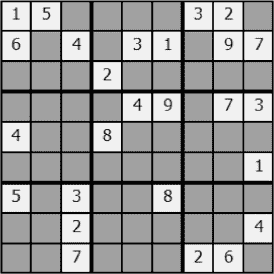

*图 7-33：数独初始状态图示*

以及在图 7-34 中的解题状态：

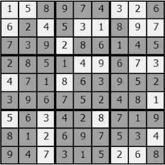

*图 7-34：已解数独图示*

### 总结

在本章中，我们探讨了多种在解决问题时常用的算法。具体来说，我们讨论了广度优先搜索（BFS）、深度优先搜索（DFS）、A* 算法以及 Dijkstra 算法（并且在此过程中了解了优先队列），这些算法用于寻找图中节点之间的最短路径。我们在 *n*-皇后问题和 15 拼图问题中使用了 DFS（后者还使用了 A* 算法）。最后，我们研究了数独，在某些情况下，逻辑就足以解决问题，但如果失败，DFS 又会派上用场。虽然我们探讨的算法远非全面，但它们构成了一套有效的工具集，能在许多领域解决广泛的问题。

到目前为止，我们已经运用了多种编程范式：命令式、函数式和面向对象。在下一章，我们将介绍一种新的技术：逻辑编程或逻辑程序设计。
