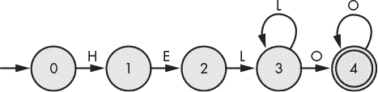
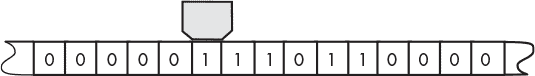
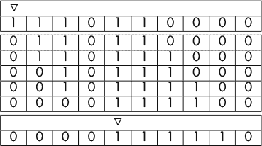
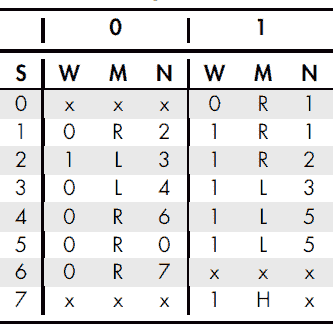
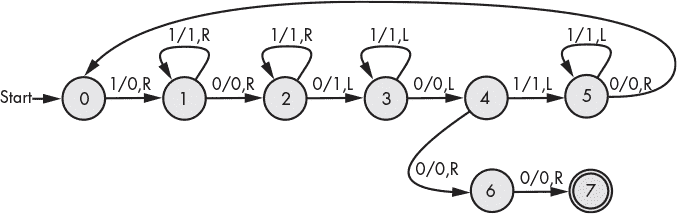
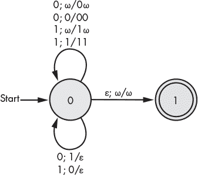

## 第九章：计算机


我们都习惯于使用强大的计算设备，这些设备拥有复杂的架构和指令集，但计算机科学的基本理念是基于更简单的设备。基本的思路是从最简单的设备开始，确定哪些类型的计算是可能的。下面我们将探讨三种此类设备，范围从只能执行简单操作（如识别字符串）的设备到能够执行任何算法的设备。

### 有限状态自动机

在本节中，我们将介绍一种抽象机器——计算模型，而非物理机器——称为*有限状态自动机（FSA）*或*有限状态机（FSM）*。尽管其名字很有威慑力，有限状态自动机实际上非常简单。有限状态自动机的存在意义就是执行条件表达式。

FSA（有限状态自动机）有一条（比喻的）带子，上面有一系列符号作为输入。每个符号只读取一次，机器随后会移动到序列中的下一个符号。FSM 是通过有限的状态和转换来建模的，因此得名有限状态机。机器从给定的初始状态开始，根据输入符号转换到另一个状态。在任何给定时刻，它只能处于一个状态。一些状态是*接受状态*，如果机器在接受状态结束，输入字符串就是有效的。根据输入和从某个状态出发的可能转换，机器可能无法继续，在这种情况下，字符串就是无效的。关键在于，对于*每个*输入，每个转换都有一个*条件*。

有限状态自动机可以用于建模许多不同类型的计算，但在本节中，我们将重点介绍它们在计算机科学中的常见用途——*识别器*：给定输入字符串的程序，判断该字符串是否有效。作为示例，我们将看看一个识别器，它接受形如“HELLO”、“HELLLO”、“HELLOOO”等的字符串，并拒绝所有其他字符串。从这个问题的性质可以看出，FSA 不仅需要能够按条件执行计算，而且重复性（因此也包括迭代）也起着作用。

表示 FSM 程序有很多不同的方式；我们将使用其中两种：*状态转换图*和*状态表*。状态转换图是一个有向图，描述了 FSM 如何从一个状态转换到另一个状态。每个状态由一个圆圈表示。初始状态由指向某一状态的箭头表示，接受状态（可以有多个）通常由双圆圈表示。状态通过线条或弧连接，每条线或弧上标有输入符号。FSM 根据当前输入符号是否与其出弧的标签匹配来从一个状态转换到下一个状态。一个字符串如果最终到达某个接受状态，则认为它被接受；否则，它被拒绝。

用于识别我们的“HELLO”字符串的 FSM 如图 9-1 所示。



*图 9-1：用于“HELLO”字符串的 FSM*

FSM 从状态 0 开始，当接收到输入“H”时，它会转移到状态 1；否则，它会停留在状态 0（表示字符串被拒绝）。一旦进入状态 1，它会期待一个“E”并像之前一样接受或拒绝输入值。它以这种方式继续，直到到达最终的接受状态（状态 4）。请注意，状态 3 可以接受“L”或“O”。像这样的 FSM，每个状态对于每个输入符号只有一个转换，称为*确定性有限状态机*（或*DFA*）。也可以构建有限状态自动机，其中一个或多个状态对于相同的输入符号可能转移到多个状态。这种 FSM 称为*非确定性有限状态机*（或*NFA*）。对于任何非确定性 FSM，我们可以构造一个确定性 FSM，使它们都能识别相同的字符串集。非确定性 FSM 的优势在于，在某些情况下，它们比确定性版本更简单。在本书中，我们将只使用确定性有限状态机。

我们还可以将我们的有限状态机（FSM）表示为一个状态表（有时称为*事件表*）。请参见表 9-1。表的第一列包含状态编号，其余列表示输入符号。表格单元格包含给定输入符号对应的下一个状态。如果没有给出状态，则该输入符号会被拒绝。

**表 9-1**： “HELLO” 字符串的状态表

| S | H | E | L | O |
| --- | --- | --- | --- | --- |
| 0 | 1 |  |  |  |
| 1 |  | 2 |  |  |
| 2 |  |  | 3 |  |
| 3 |  |  | 3 | 4 |
| 4 |  |  |  | 4 |

为了在 Racket 中实现一个 FSM 来识别我们的“HELLO”字符串，我们首先定义一个状态表，如下所示：

```
#lang racket

(define state-table
  (vector
   ;        H  E  L  O
   (vector  1 #f #f #f) ; state 0
   (vector #f  2 #f #f) ; state 1
   (vector #f #f  3 #f) ; state 2
   (vector #f #f  3  4) ; state 3
   (vector #f #f #f  4) ; state 4
   ))
```

在这种情况下，我们使用 `#f` 来表示无效的转换。

由于我们使用向量来表示状态表，我们需要一种方法将字符转换为索引。这是通过哈希表来实现的，如下面的定义所示。

```
(define chr->ndx
  (make-hash '[(#\H . 0) (#\E . 1) (#\L . 2) (#\O . 3)] ))
```

给定一个状态编号和字符，以下的 `next-state` 函数会根据状态表返回下一个状态（或 `#f`）。

```
(define (next-state i chr)
  (if (hash-has-key? chr->ndx chr)
      (vector-ref (vector-ref state-table i)
                  (hash-ref chr->ndx chr) )
      #f))
```

最后，这是用来识别我们“HELLO”字符串的 DFA。

```
  (define (hello-dfa str)
➊ (let ([chrs (string->list str)])
    (let loop ([state 0] [chrs chrs])
   ➋ (if (equal? chrs '()) ; end of string
       ➌ (if (= state 4) 
              #t ;if 4, accepting
              #f ;not 4, not accepting
              )
       ➍ (let ([state (next-state state (car chrs))]
                [tail (cdr chrs)])
            (if (equal? state #f) #f ; invalid
             ➎ (loop state tail)))))))
```

首先，我们将字符串转换为字符列表 ➊。然后我们遍历这个列表，首先检查是否所有字符都已经被读取 ➋。接着我们检查状态 ➌。如果我们处于接受状态（在本例中是状态 4），我们返回`#t`表示接受的字符串；否则，我们返回`#f`。如果整个字符串还没有处理完，我们获取下一个状态和剩余的字符串 ➍。然后我们用剩余的字符串重新开始这个过程 ➎。下面是一些示例运行。

```
> (hello-dfa "HELP")
#f

> (hello-dfa "HELLO")
#t

> (hello-dfa "HELLLLLOOOO")
#t

> (hello-dfa "HELLOS")
#f
```

事实证明，有限状态自动机（无论是确定性还是非确定性）都有一定的局限性。例如，不可能构建一个识别匹配括号的有限状态机（因为在任何时刻，我们都需要一个机制来记住遇到多少个左括号）。在下一节中，我们将介绍有限状态机的更智能的兄弟——图灵机。

### 图灵机

*图灵机*是英国杰出数学家艾伦·图灵的发明。在最简单的形式下，图灵机是一个由以下组件构成的抽象计算机。

+   一条可以包含零或一的无限带（也允许任意符号，但我们在这里不使用）

+   一个可以在每个单元格中读取或写入值并向左或向右移动的头（参见图 9-2）

+   一个状态表

+   一个包含当前状态的状态寄存器



*图 9-2：图灵机带和头部*

尽管这看似简单，但对于任何计算机算法，都可以构造一个图灵机来模拟该算法的逻辑。反过来，任何可以模拟图灵机的计算设备或编程语言都被称为*图灵完备*。因此，图灵机不受我们前面提到的有限状态自动机的局限性。关于图灵机在分析某些函数是否在理论上可计算的文献非常丰富。我们不会深入这些推测，而是集中讨论机器本身的基本操作。

我们构造的机器将执行一个简单的任务——加两个数字。一个数字，*n*，将表示为由*n*个一组成的连续字符串。要加的两个数字将由一个零分隔，头部将位于第一个数字的最左边的一个一上。结果将是一个由一组成的字符串，其长度是两个数字的和。在计算结束时，头部将位于结果的最左边的一个一上。

简而言之，程序通过将最左边的最左边数字中的一个一改为零，然后向右扫描，直到遇到第二个数字的末尾，并在最后一个一后写入一个一。然后头部向左移动，直到发生以下两种情况之一：

+   它遇到一个零，后跟一个一，这意味着还有更多的 1 需要移动，所以它继续向左移动，以便重新开始。

+   它遇到两个连续的零，在这种情况下，进行加法操作（因为第一个数字没有剩下其他的 1），并向右移动，直到它定位在最终数字最左边的 1 上。

图 9-3 展示了计算过程中不同时间的带子快照（图中的三角形表示计算开始和结束时的头位置）。



*图 9-3：带子的故事*

你可能已经猜到，实际上有更直接的方法来组合这两串数字，但所描述的方法更适合应用于其他计算，例如乘法。

编程图灵机包括构造一个*状态表*。表中的每一行表示一个特定的状态。每个状态根据当前头部读取的零或一来指定三种动作。这些动作包括：写入 1 或 0 到当前单元格、接下来是向左或向右移动，以及下一个状态应该是什么。表 9-2 包含了我们的加法器程序。

**表 9-2**：图灵机状态表



最上面的行表示输入符号。标有 W 的列表示应写入的值，标有 M 的列表示移动方向（向左或向右），标有 N 的列表示下一个状态编号。标有 x 的条目表示永远不会到达的状态（假设输入和起始状态设置正确）——在这种情况下，条目将无关紧要。机器从状态 0 开始。最终状态（或停机状态）是状态 7，在一的输入的移动列中以 H 表示。

表示图灵机状态变化的另一种方法（可能更容易解读）是使用状态转换图，如图 9-4 所示。在状态图中，每个转换标签包含三个组成部分：读取的符号、要写入的符号，以及移动的方向。



*图 9-4：图灵机状态转换图*

#### *一个 Racket 图灵机*

正如本节开头提到的，能够模拟图灵机的编程语言被称为图灵完备。我们将通过构建这样一个模拟来演示 Racket 本身是图灵完备的（以我们的加法机作为示例程序）。当然，我们不得不在无限磁带上做一些妥协，因此我们的机器将拥有更为简单的磁带，只有 10 个单元格。状态表将由一个向量组成，其中每个单元格代表一个状态。每个状态是一个包含两个单元格的向量，第一个单元格包含读取零时的动作，第二个单元格包含读取一时的动作。动作将由一个名为`act`的结构表示。`act`结构将包含字段`write`、`move`和`next`（含义显而易见）。状态将存储在一个名为`state`的变量中，而头部位置则在`head`中。考虑到这些初步设定，我们有如下内容：

```
#lang racket

(define tape (vector 1 1 1 0 1 1 0 0 0 0))

(define head 0)

(struct act (write move next))

(define state-table
  (vector
   (vector (act 0 #f 0) (act 0 'R 1)) ; state 0
   (vector (act 0 'R 2) (act 1 'R 1)) ; state 1
   (vector (act 1 'L 3) (act 1 'R 2)) ; state 2
   (vector (act 0 'L 4) (act 1 'L 3)) ; state 3
   (vector (act 0 'R 6) (act 1 'L 5)) ; state 4
   (vector (act 0 'R 0) (act 1 'L 5)) ; state 5
   (vector (act 0 'R 7) (act 1 #f 0)) ; state 6
   (vector (act 0 #f 0) (act 1 'H 0)) ; state 7
   ))

(define state 0)
```

尽管在定义中并不严格要求，我们在“无关”状态中加入了一个`#f`值（表示失败），以防在问题初始设置时引入了某些错误（嘿，谁能做到完美呢）。

在编写指定机器执行的代码之前，我们定义了几个辅助函数来获取各个组件。第一个函数返回给定当前状态和输入符号时的下一个状态，其他两个函数用于获取和设置磁带头的值。

```
(define (state-ref s i) (vector-ref (vector-ref state-table s) i))
(define (head-val) (vector-ref tape head))
(define (tape-set! v) (vector-set! tape head v))
```

运行该机器的程序很简单。请注意，这段代码对于*任何*你编程的图灵机都是一样的；只有`tape`和`state-table`会有所变化。

```
(define (run-machine)
  (let* ([sym (head-val)] ; current input
      ➊ [actions (state-ref state sym)]
         [move (act-move actions)])
    (cond [(equal? #f move)
           (printf "Failure in state ~a, head: ~a\n~a" state head tape)]
       ➋ [(equal? 'H move)
           (printf "Done!\n")]
          [else
        ➌ (let* ([write (act-write actions)]
               ➍ [changed (not (equal? sym write))])
             (tape-set! write)
          ➎ (set! head (if (equal? move 'L) (sub1 head) (add1 head)))
          ➏ (when changed (printf "~a\n" tape))
          ➐ (set! state (act-next actions))
             (run-machine))])))
```

首先，我们捕捉当前状态和输入➊的动作。然后，我们捕捉下一个要写入的符号➌，并更新下一个状态➐。我们还测试头部是否即将改变磁带上的值➍，如果是这种情况，我们会打印出更新后的磁带➏。头部位置会提前更新➎。一旦达到最终状态➋，程序会打印`Done!`。以下是输出结果。

```
#(1 1 1 0 1 1 0 0 0 0)
#(0 1 1 0 1 1 0 0 0 0)
#(0 1 1 0 1 1 1 0 0 0)
#(0 0 1 0 1 1 1 0 0 0)
#(0 0 1 0 1 1 1 1 0 0)
#(0 0 0 0 1 1 1 1 0 0)
#(0 0 0 0 1 1 1 1 1 0)
Done!
```

### 推入自动机

“推入自动机”这个词并不是让你去推翻毫无防备的机器人。不，术语*推入自动机*（或*PDA*）指的是一类抽象计算设备，它们使用*推入堆栈*（或仅称为*堆栈*）。从计算能力上讲，推入自动机的能力恰好介于有限状态自动机和图灵机之间。

PDA 相较于有限状态自动机的优势在于堆栈。堆栈形成了一种基本的内存类型。从概念上讲，堆栈就像一堆盘子，你只能从堆栈顶端移走一个盘子（称为弹出操作）或把一个盘子添加到顶部（称为推入操作）。堆栈的其余部分只能通过从顶部进行添加或移除来访问。为了在 Racket 中模拟这一点，我们将堆栈定义为一个符号串，并且提供两个操作：

+   **推入（Push）**。此操作将一个符号添加到堆栈的顶部（字符串的前端）。

+   **弹出（Pop）**。弹出操作移除堆栈顶部的符号并返回该符号。

PDA 允许读取栈顶符号，但无法访问其他栈值。栈值不一定要与输入符号相匹配。

像 FSA 一样，PDA 按顺序读取输入并通过状态转移来确定下一个状态，但 PDA 有一个要求：除了处于接受状态外，栈也必须为空，才能接受字符串（但为了实际应用，在下面的示例中我们预先在栈中放入一个唯一标记来表示空栈）。需要注意的是，压栈自动机有确定性和非确定性两种类型。此外，非确定性压栈自动机能够执行更广泛的计算。

尽管我们通常尽量保持介绍的非正式性，但我们将提供一个 PDA 的正式描述，因为如果你决定进一步研究抽象计算机，你很可能会遇到这种类型的符号表示。^(1) 如果你不熟悉集合符号，可能需要跳到 第四章 中的“集合理论”部分来复习。

通常，PDA 被定义为一个机器 *M* = (*Q*, *Σ*, *Γ*, *q*[0], *Z*, *F*, *δ*)，其中以下内容成立：

+   *Q* 是有限状态集。

+   *Σ* 是输入符号的集合。

+   *Γ* 是可能的栈值集合。

+   *q*[0] ∈ *Q* 是起始状态。

+   *Z* ∈ *Γ* 是初始栈符号。

+   *F* ⊆ *Q* 是接受状态的集合。

+   *δ* 是可能的转移集合。

允许的转移集合由这个略显复杂的表达式定义（其中 Γ^* 用于表示所有可能的栈字符串，符号 ϵ 用来表示空字符串，即没有任何符号的字符串）。

δ ⊆ (Q × (Σ ∪ {ϵ}) × Γ) × (Q × Γ*)

这并不像看起来那么复杂。基本上，它是说可能的转移集合是所有可能的状态、输入符号和栈值组合的子集（也就是说，转移前的所有可能性），以及所有可能的状态和栈字符串（转移后的所有可能性）。括号中的第一组值表示转移函数的输入，包括以下内容：

+   当前状态：*q* ∈ *Q*

+   当前输入符号：*i* ∈ (*Σ* ∪ {ϵ})（记住，我们使用 *ϵ* 来表示在某个时刻剩余的字符串可以为空）

+   栈顶的值：*s* ∈ *Γ*

给定这些值，转移定义了下一个状态（第二个 *Q*）和潜在的新栈值（Γ^*）。对于任何转移，栈要么不变，要么推入新值，或者从栈顶弹出一个值。

栈的变化通过符号 *a*/*b* 表示，其中 *a* 是栈顶的符号，*b* 是栈顶结果的字符串。例如，如果我们匹配某个输入符号，栈顶是 *α*，并且我们弹出这个值而不替换它，那么我们用 *α*/*ϵ* 来表示。如果我们匹配输入时栈顶是 *α*，并且需要将 *β* 压入栈顶，则表示为 *α*/*βα*。

#### *识别零和一*

现在让我们暂时搁置形式化内容，来看一个简单的例子。一种常见的练习是构建一个 PDA，它能够识别由零和一组成的字符串，其中一串一的长度正好与一串零的长度相等。使用有限状态自动机是做不到这一点的，因为它需要记住在开始扫描一之前已经扫描了多少个零。

表达式 0^(*n*)1^(*n*) 表示我们要寻找的字符串格式（零重复 *n* 次，后跟一重复 *n* 次），我们的输入字母表是 Σ = {0, 1}。任何其他输入都不会被接受。为了识别这个字符串，我们只需要跟踪已经读取的零的数量，因此每当输入中遇到零时，我们会将零压入栈顶。当遇到一时，我们从栈中弹出一个零；如果零和一的数量匹配，输入结束时栈中将不剩任何零。为了判断何时弹出了栈中的最后一个零，我们会预先在栈中放入一个特殊标记 *ω*。因此我们的栈符号集是 Γ = {0, ω}。

图 9-5 是我们 PDA 的状态转移图。


*图 9-5：用于* 0^(*n*)1^(*n*)的下推自动机

转移到状态 0 的循环上标签 0;*ω*/0*ω* 表示在输入中读取一个零，并且栈顶的标记是 *ω*，然后将零压入栈中。（这是第一个转移。）同样，标签 0;0/00 表示在输入中读取一个零，并且栈顶是零，然后将零压入栈中。标签 1;0/*ϵ* 表示从状态 0 转移到状态 1，表示读取一个一，并从栈中弹出一个零。状态 1 上的循环继续读取输入中的一，并为每个读取的零从栈中弹出一个零。一旦没有更多的输入值，并且栈中没有零，机器将转移到状态 2，这是一个接受状态。显然，栈中必须包含与读取的零和一相同数量的零，才能到达接受状态。

#### *更多的零和一*

假设我们稍微提高难度，允许任何零和一的字符串，唯一的要求是零和一的数量相等。

再次假设栈已经预加载了 *ω*。这次我们允许零和一都进入栈中。这个过程基本上是这样的：

+   如果栈顶是 *ω*，且没有更多输入，则接受该字符串。

+   如果栈顶是 *ω*，则将当前读取的符号压入栈中。

+   如果栈顶的符号与当前读取的符号相同，则将当前读取的符号压入栈中。

+   否则，弹出当前读取的符号。

该过程通过图 9-6 中的状态转移图进行了说明。

这两种识别器都无法使用有限状态自动机（FSA）来实现。这是因为在这两种情况下，都需要记住之前读取的符号数量。PDA 栈（在普通 FSA 中不可用）提供了这一功能。



*图 9-6：PDA 用于匹配零和一的计数*

#### *一个 Racket PDA*

在本节中，我们将构造一个 PDA 来识别图 9-6 中描述的字符串。输入将是一个包含若干个 1 和 0 的序列的列表。为了处理该输入，我们将定义 `make-reader`，它返回另一个函数。

```
(define (make-reader input)
  (define (read)
    (if (null? input) 'ϵ ; return empty string indicator
        (let ([sym (car input)])
          (set! input (cdr input))
          sym)))
  read)
```

我们使用 `make-reader` 函数，并传入我们希望用作输入的列表，它将返回一个函数，每次调用时返回列表中的下一个值。以下是如何使用它的示例。

```
> (define read (make-reader '(1 0 1)))
> (read)
1
> (read)
0
> (read)
1
> (read)
ϵ
```

栈也将由一个列表表示。以下代码给出了执行各种栈操作所需的定义。

```
(define stack '(ω)) ; ω is the bottom of stack marker

(define (pop)
  (let ([s (car stack)])
    (set! stack (cdr stack))
    s))

(define (push s)
  (set! stack (cons s stack)))

(define (peek) (car stack))
```

由于只有一个有意义的状态，我们不必费心构建状态表。我们将借此机会练习 Racket 的另一个隐藏宝藏——*模式匹配*。这种模式匹配是 Racket 内置的，与在第八章中介绍的 Racklog 库提供的模式匹配功能不同。模式匹配使用 `match` 表达式，该表达式包含在 *racket/match* 库中。^(2)

`match` 表达式看起来有点像 `cond` 表达式，但我们无需使用复杂的布尔表达式，而是简单地提供我们想要匹配的数据结构。我们可以使用许多不同的结构作为匹配模式，包括字面值，但我们在这个练习中将简单地使用一个列表。

```
(define (run-pda input)
  (let ([read (make-reader input)]) ; initialize the reader
    (set! stack '(ω)) ; initialize stack
    (define (pda)
      (let ([symbol (read)]
            [top (peek)])
        (match (cons symbol top)
          [(cons 'ϵ 'ω ) #t] ; accept input
          [(cons  0 'ω)   (begin (push 0) (pda))]
          [(cons  0  0)  (begin (push 0) (pda))]
          [(cons  1 'ω)   (begin (push 1) (pda))]
          [(cons  1  1)  (begin (push 1) (pda))]
          [(cons  0  1)  (begin (pop)    (pda))]
          [(cons  1  0)  (begin (pop)    (pda))]
          [_ #f]))) ; reject input
    (pda)))
```

请注意，`match` 表达式如何紧密地与图 9-6 中显示的状态转移相似。我们使用 `#t` 和 `#f` 来表示输入是否被接受或拒绝。单个下划线（`_`）作为通配符，匹配任何内容。在这种情况下，匹配通配符表示该字符串被拒绝。

让我们试试看。

```
> (run-pda '(1))
#f

> (run-pda '(1 0))
#t

> (run-pda '(1 0 0 1 1 0))
#t

> (run-pda '(0 1 0 0 1 1 0))
#f

> (run-pda '(1 0 0 1 1 0 0 0 1 1 1))
#f

> (run-pda '(1 0 0 1 1 0 0 0 1 1 1 0))
#t
```

#### *更多的自动机乐趣*

这是另外几个你可以自己尝试的 PDA 练习。

+   构建一个匹配括号的 PDA（例如，“(())((()))” 是正确的，“(())((())” 不是正确的）。

+   构建一个回文识别器（例如，“madam i’m adam” 或 “racecar”）。这个比较棘手，需要构造一个非确定性 PDA（还要忽略空格和标点符号）。

### 关于语言的一些话

有限状态自动机和下推自动机作为不同类型语言的识别器发挥作用。如果有某个有限状态机器能够接受整个符号字符串集合，那么这个符号字符串集合就叫做*正则语言*。正则语言的例子包括表示整数的数字字符串集合，或者像 1.246e52 这样的浮点数表示字符串。

有效的算术表达式集合（例如，*a* + *x*(1 + *y*)）是上下文无关文法（CFG）的一个例子。由下推自动机接受的字符串所组成的语言被称为上下文无关语言。这意味着我们可以构造一个下推自动机来识别算术表达式。

有限状态自动机和下推自动机在将现代计算机语言字符串转换为令牌中发挥着关键作用，这些令牌可以被传递给 PDA 进行语法分析。解析器将输入语言转换为一种叫做*抽象语法树*的结构，然后可以将其传递给编译器或解释器进行进一步处理。

### 总结

在本章中，我们探讨了几种简单的计算机机器：有限状态自动机、下推自动机和图灵机。我们看到，尽管这些机器简单，但它们能够解决实际问题。在下一章中，我们将广泛应用这些概念，它们识别通用字符串和表达式的能力将用于开发一个交互式计算器。
