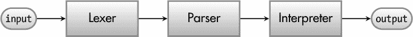
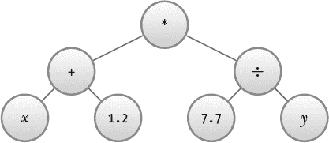
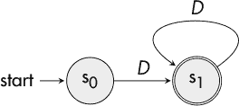
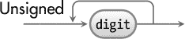
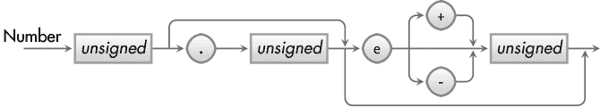
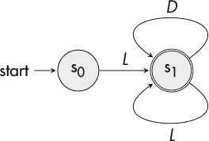
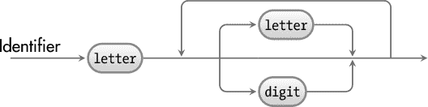
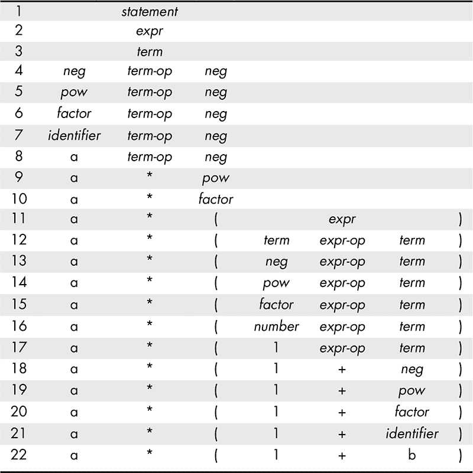
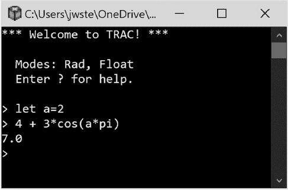

## 第十章：TRAC: RACKET 代数计算器


Racket 提供了一个面向语言编程的生态系统。它拥有广泛的内建功能，可以构建宏、词法分析器和解析器生成器。在本章的最后，我们遗憾地没有时间探索所有这些引人入胜的主题。然而，我们将探索计算机科学中的一些新话题，并利用前面章节中介绍的许多主题（尤其是前一章中介绍的计算机概念）。

在这个过程中，我们将构建一个名为 TRAC（Racket 代数计算器）的命令行程序，它将接收一个表示代数表达式的字符字符串并计算其值。事实上，TRAC 是一种简化版的编程语言。如果需要，它可以通过多种方式扩展，以实现一个完整的编程语言。

这个程序将能够处理如下对话：

```
> let x = 0.8
> let y = 7
> (x + 1.2)*(7.7 / y)
2.2
```

### TRAC 流程

为了构建 TRAC，我们将使用以下的处理流程，该流程分阶段处理输入，以便计算输出。



词法分析器（或 *词法分析器*）负责接收输入字符串，并将其分解为一系列可以传递给解析器进一步处理的标记。例如，考虑以下字符串：

```
"(x + 1.2)*(7.7 / y)"
```

给定上述字符串，词法分析器将返回类似于以下的输出列表：

```
("(" "x" "+" 1.2 ")" "*" "(" 7.7 "/" "Y" ")" )
```

一旦我们生成了标记列表，我们就可以将其传递给解析器。解析器的任务是通过构建一种称为 *抽象语法树*（或 *AST*）的结构，来确定输入的结构。AST 是表达式结构的描述。像刚刚引入的数学表达式具有一种倒置的树状结构。我们示例表达式的 AST 如 图 10-1 所示。



*图 10-1：(*x* + 1.2)*(7.7 / *y*)* 的 AST

然后，我们可以将 AST 传递给 *解释器*，以评估表达式并计算结果。如果我们在构建一个完全的计算机语言，AST 将被传递给编译器和优化器，在那里它将被转换成机器代码，以便高效执行。严格来说，如果仅仅是构建一个解释器，则不需要构建 AST，因为解析器可以直接在运行时进行任何必要的计算，但稍后我们会看到，拥有 AST 使我们能够操作它，从而推导出其他有用的结果。

处理流水线（词法分析器、解析器、解释器）除了提供明确的职责分离外，还允许我们插入针对特定任务优化的不同模块。例如，解释器适合交互式计算，但不适合长期运行的计算。在这种情况下，我们希望将解释器替换为编译器。这将允许我们的代码被转换为机器码，并通过 CPU 直接执行以全速运行。

我们将依次讨论并实现这些组件，直到我们拥有一个功能齐全的代数计算器；然后，我们将研究几种改进 TRAC 的方法。

### 词法分析器

为了将输入分割成标记，词法分析器一次扫描一个字符，寻找特定的模式。从高层次来看，标记就是一些可以以某种方式分类的字符序列。例如，一串数字如 19876 可以被归类为整数标记。以字母开头，后面跟着零个或多个字母和数字的字符串（如“AVG1”或“SIN”）可以被归类为标识符标记。词法分析器通常会忽略不必要的字符，如空格和制表符（Python 语言是一个显著的例外）。

每个模式都可以通过有限状态机（FSM）来表示（参见第九章）。我们将使用的一个 FSM 是无符号整数的识别器。在接下来的讨论中，某些字符集组合在一起时，称为*字符类*。我们需要的一个字符类是由 0 到 9 的数字组成的字符，我们将其简单地指定为*数字*类。无符号整数完全由数字类中的数字串组成，因此我们可以通过下图所示的 FSM 来表示它的识别器，在该 FSM 中，数字类由一个大写斜体字母*D*表示。



*图 10-2：用于识别数字的有限状态机（FSM）*

该图表显示无符号整数总是以数字开始，后面可以跟任意数量的尾随数字。表示无符号整数的另一种方法是使用*语法图*，例如图 10-3 所示。



*图 10-3：用于识别数字的语法图*

在这种情况下，数字类使用类似打字机字体的样式表示，如`digit`。语法图有时可以提供一种更直观的模式识别表示方式。语法图显示，在接受一个数字后，分析器可以选择性地循环回去接受另一个数字。

为了真正有用，TRAC 需要能够识别的不仅仅是整数。以下图 10-4 中的语法图展示了一个可以接受由无符号整数、带小数点的浮点数以及带有嵌入 `e` 的科学计数法表示的数字组成的识别器。



*图 10-4：识别数字的语法图*

请注意，语法图可以嵌套：图 10-4 中的框包含了图 10-3 中的识别器。我们留给读者作为练习，构建对应的 FSM。

除了识别数字，TRAC 还可以识别标识符（如 `let x = 4` 中的 `x`）。TRAC 标识符总是以字母开头，后跟任意数量的字母或数字。我们将字母类指定为斜体大写字母 *L*。因此，以下 FSM（见图 10-5）将用于识别 TRAC 标识符：



*图 10-5：识别标识符的 FSM*

这是图 10-6 中对应的语法图。



*图 10-6：识别标识符的语法图*

#### *正则表达式*

到目前为止，讨论一直处于一种相对抽象的层次。现在的问题是，*如何实际获得一个能够识别各种字符模式的有限状态机（FSM）？* 答案是*正则表达式*。正则表达式本质上是一种特殊语言，用于构建有限状态机（在这种情况下，Racket 会为我们构建 FSM，给定正则表达式）。我们的标记（例如，构成整数的数字字符串）实际上是正则语言。回顾上一章，正则语言是指存在一个 FSM 可以接受整个字符串集的语言。正则表达式有些不同。正则表达式（与正则语言不同）实际上是用来构建一个识别正则语言的 FSM 的规范。

这是一个可以用来识别无符号整数的正则表达式：

`[0-9][0-9]*`

方括号中的表达式是字符类。在这种情况下，它是从 0 到 9 的数字类。这个正则表达式包含了两个字符类，都是用来识别数字的。解释这种方式是，第一个类将识别一个数字，但第二个类，由于后面紧跟着星号，将识别零个或多个额外的数字（星号被称为 *克里尼星号*，以纪念斯蒂芬·克里尼，他正式化了正则表达式的概念）。一种更简洁的方式是使用以下正则表达式：

`[0-9]+`

后缀的加号（称为 *克里尼加号*）表示我们想要识别由一个或多个字符组成的字符串。

克利尼星号和克利尼加号被称为 *量词*。另外一个正则表达式量词是问号 `?`。问号匹配零次或一次正则表达式的出现。如果我们想捕捉恰好有一位或两位数字的数字，可以这样指定：

`[0-9][0-9]?`

还有许多其他方式可以指定正则表达式类。我们已经看到的数字版本指定了一个范围，其中连字符 (`-`) 用于分隔起始字符和结束字符。还可以在一个类中指定多个范围。例如，要指定一个同时包含大写字母和小写字母的类，可以使用 `[A-Za-z]`。一个类还可以包含任何任意字符集合——例如 `[abCD]`。

对于我们的目的，我们将定义一个包含算术运算符的类：`[-+/*^]`。关于这个特定类，有几点需要注意。首先，由于类以连字符开始，因此连字符不会用于指定范围，它被当作普通字符处理。第二点是，如果连字符 (`^`) 是类中的第一个项目，它将被特殊处理。例如，正则表达式 `[^abc]` 会匹配除 `a`、`b` 或 `c` 外的所有字符。

这些只是基础知识。了解了这些概述后，让我们来看看 Racket 如何实现正则表达式，并在此过程中更深入地挖掘正则表达式的能力。

#### *Racket 中的正则表达式*

Racket 使用 `regexp` 函数构建正则表达式，该函数接受一个字符串并将其转换为正则表达式：

```
> (define unsigned-integer (regexp "[0-9]+"))
```

还有一个特殊的文字正则表达式值，它以 `#rx` 开头。例如，一个识别无符号整数的正则表达式值是 `#rx"[0-9]+"`（或者如果你喜欢打字，可以用 `#rx"[0-9][0-9]*"`）。这种语法是一种构建正则表达式的简写方法。

正则表达式值与函数 `regexp-match` 和 `regexp-match-positions` 一起使用。假设我们想在字符串 `"Is the number 1234 an integer?"` 中查找嵌入的整数。可以通过以下方式之一来实现：

```
> (regexp-match #rx"[0-9]+" "Is the number 1234 an integer?")
'("1234")
```

匹配结果以列表的形式返回。之所以这样做，是因为正则表达式可以包含子表达式，这会导致额外的匹配项被返回。我们稍后会讨论这一点。`regexp-match-positions` 函数的工作方式与 `regexp-match` 类似。不同之处在于，`regexp-match-positions` 不返回匹配的字符串；相反，它返回可以与 `substring` 一起使用的索引，以提取匹配的内容。下面是一个示例。

```
> (regexp-match-positions #rx"[0-9]+" "Is the number 1234 an integer?")
'((14 . 18))

> (substring "Is the number 1234 an integer?" 14 18)
"1234"
```

这些函数有许多有用的可选参数。通过指定起始位置和停止位置，可以限定搜索范围，而不是搜索整个字符串。以下是一些示例。

```
> (regexp-match #rx"[0-9]+" "Is the number 1234 an integer?" 14 18)
'("1234")

> (regexp-match-positions #rx"[0-9]+" "Is the number 1234 an integer?" 14 18)
'((14 . 18))

> (regexp-match #rx"[0-9]+" "Is the number 1234 an integer?" 16)
'("34")
```

在第二个例子中，注意 `regexp-match-positions` 总是返回从字符串开始位置的匹配位置，而不是从指定的起始位置开始。结束位置是可选的，如果没有指定，搜索会一直进行到字符串的末尾，就像第三个例子中所示。

可能最基本的正则表达式就是字面上的字母和数字。例如，要判断一个字符串是否包含字符串 `"gizmo"`，可以形成这样的查询：

```
> (regexp-match #rx"gizmo" "Is gizmo here?")
'("gizmo")

> (regexp-match #rx"gizmo" "Is gixmo here?")
#f
```

当然，这种功能也可以通过 `string-contains?` 来实现，但正则表达式要强大得多。与 Kleene 星号和加号操作符配合使用时，我们可以形成更加复杂的查询。

```
> (regexp-match #rx"cats.*dogs" "It's raining cats and dogs!")
'("cats and dogs")
```

正则表达式中的句点（`.`）会匹配任何单一字符，因此上面的正则表达式会匹配任何包含字符串 `"cats"`，并且在其他地方跟随字符串 `"dogs"` 的子字符串。

如果我们只想知道字符串中是否包含 `"cats"` *或* `"dogs"`，该怎么办？这时正则表达式的*或*操作符，即竖线（`|`），就派上用场了。

```
> (regexp-match #rx"cats|dogs" "Do you like cats?")
'("cats")
> (regexp-match #rx"cats|dogs" "Or do you like dogs?")
'("dogs")
```

上箭头符号（`^`）和美元符号（`$`）是特殊的正则表达式标记。上箭头表示匹配必须从字符串的开始处开始，或者如果指定了起始位置，则从起始位置开始。同样，美元符号表示匹配必须延伸到字符串的末尾或结束位置（如果指定了的话）。

```
> (regexp-match #rx"^[0-9]+" "Is the number 1234 an integer?" 16)
'("34")

> (regexp-match #rx"^[0-9]+" "Is the number 1234 an integer?")
#f

> (regexp-match #rx"^[0-9]+" "987 is an integer!")
'("987")

> (regexp-match #rx"[0-9]+$" "987 is a number?")
#f

> (regexp-match #rx"[0-9]+$" "The number is at the end: 987")
'("987")
```

Table 10-1 提供了各种正则表达式操作符的摘要描述。表格中的字符串“…”代表一组任意字符。

**Table 10-1**：正则表达式操作符

| **Operator** | **描述** |
| --- | --- |
| . | 匹配任何字符 |
| *x** | 匹配 *x* 零次或多次 |
| *x*+ | 匹配 *x* 一次或多次 |
| *x*? | 匹配 *x* 零次或一次 |
| *x*∣*y* | 匹配 *x* 或 *y* |
| ^ | 匹配字符串的开始 |
| $ | 匹配字符串的结束 |
| […] | 定义字符类 |
| [^…] | 定义排除字符类 |

到目前为止讨论中有一个不明显的地方，那就是每个字母和数字实际上都是一个正则表达式。像 `"abc"` 这样的字符串实际上是字母 `a`、`b` 和 `c` 的连接。就像数学表达式中的乘法（例如 3*a*）一样，连接在正则表达式中是隐式的。并且像乘法与加法一样，连接的优先级高于或（`|`）操作符。这意味着像 `"abc|def"` 这样的表达式会被解释为 `"(abc)|(def)"`，而不是 `"ab(c|d)ef"`（注意，最后两个字符串中的括号只是用来说明正则表达式 `"abc|def"` 是如何被*解释*的，但请参见下面关于括号在正则表达式中的作用）。

括号在正则表达式中用于将子表达式组合在一起，并指定评估的顺序。让我们看看这如何发挥作用。

```
> (regexp-match #rx"abc|def" "abcdef")
'("abc")

> (regexp-match #rx"abc|def" "defabc")
'("def")

> (regexp-match #rx"(abc)|(def)" "abcdef")
'("abc" "abc" #f)

> (regexp-match #rx"ab(c|d)ef" "abcdef")
#f

> (regexp-match #rx"ab(c|d)ef" "abcef")
'("abcef" "c")
```

前两个示例返回匹配 `"abc"` 或 `"def"` 的字符串的第一部分。

第三个示例，使用子表达式，返回三个值。第一个是符合整体正则表达式的预期匹配。第二个值表示对这个问题的回答：在第一个返回值中，子表达式 `"(abc)"` 的匹配是什么？在这个案例中，值就是字符串 `"(abc)"`。第三个值回答这个问题：在第一个返回值中，子表达式 `"(def)"` 的匹配是什么？在这个案例中没有匹配，因此返回 `#f`。

在第四个示例中，匹配失败，因为正则表达式在查找包含 `c` 或 `d` 的字符串，但不能同时包含两者。在最后一个示例中，整个字符串被匹配，这在第一个返回值中有所体现，但第二个返回值反映了只有子表达式 `"(c|d)"` 中的 `"c"` 被匹配。

在我们的词法分析器中，我们希望使用子表达式，但我们只关心整体正则表达式是否找到匹配，而不关心各个子表达式的匹配（也就是说，我们主要使用它来控制评估）。在这种情况下，我们将使用特殊的括号语法 `"(?>...)"`，表示我们只想要整体匹配，而不返回匹配的子表达式（请注意，`?:` 的作用与 `?>` 类似，但 `?:` 允许指定匹配模式，如是否区分大小写——具体请参见 Racket 文档）。

```
> (regexp-match #rx"(?>abc)|(?>def)" "abcdef")
'("abc")
```

`regexp-match` 的一个有趣变种是 `regexp-match*`。这个特定的函数（虽然我们在应用中不需要它）只返回子表达式的匹配项。

```
> (regexp-match* #rx"(abc)|(def)" "abcdef")
'("abc" "def")
```

请注意，`regexp-match` 只匹配 `"abc"`，而 `regexp-match*` 返回所有匹配的列表，因此会返回 `"abc"` 和 `"def"`。更多信息请参见 Racket 文档中的 `regexp-match*`。

**注意**

*Racket 提供了一种附加的正则表达式形式，符合 Perl 编程语言中使用的正则表达式。用于创建这种正则表达式的函数叫做 `pregexp`。还有一种文字语法，类似于 `#rx` 形式，但以 `#px` 开头。Perl 语法提供了一些有用的扩展，包括预定义的字符类。由于我们的需求相对简单，我们将坚持使用上述基本语法。*

#### *TRAC 中的正则表达式*

在 TRAC（或者任何计算器中），我们需要识别有效的数字字符串（准确来说是浮动小数点数）。此外，我们还需要定义变量，这意味着我们需要能够定义标识符。我们还需要指定数学运算符，如加法、减法等，并定义一组合理的基本函数名。这些都需要使用正则表达式。

为了我们 TRAC 应用的需要，我们将始终指定正则表达式搜索的起始位置，因此每个正则表达式都会以`^`开始。标识符的识别器定义如下：

```
(define regex-ident #rx"^A-Za-z*")
```

从上面的信息应该能清楚地看出，这将匹配任何以字母开头，后面跟着零个或多个字母或数字的字符串。

数字的识别器（如下所示）稍微复杂一点，但唯一的新元素是带有`\\.`的部分。由于句点（`.`）是一个匹配任意字符的正则表达式，它需要被*转义*，以便将其视为普通字符（如果字符在正则表达式中具有特殊含义，转义就是去除或*转义*这种特殊含义的一种方式）。为了避免转义句点，我们也可以将`\\.`指定为`[.]`，这在某些上下文中可能更容易阅读。正则表达式的转义字符是反斜杠（`\`），而且由于它嵌入在 Racket 字符串中，因此必须通过在前面加一个斜杠来转义。

```
(define regex-number #rx"^[0-9]+(?>\\.[0-9]+)?(?>e[+-]?[0-9]+)?")
```

虽然这有点长，但它与前面图 10-4 中给出的语法图定义非常相似。让我们回顾几个测试用例。

```
> (regexp-match regex-number "123")
'("123")

> (regexp-match regex-number "a123")
#f
(@\pagebreak@)
> (regexp-match regex-number "123.")
'("123")
```

注意在最后的表达式中，匹配没有包括小数点，因为我们规定小数点后必须至少跟随一个数字。这与语法图一致，因为匹配是直到但不包括小数点。如果正则表达式以`$`结尾，这个匹配将会失败。请注意以下内容。

```
> (regexp-match regex-number "123.0")
'("123.0")
```

在这种情况下，整个字符串都会被匹配。这里有几个更多的例子。

```
> (regexp-match regex-number "123.456")
'("123.456")

> (regexp-match regex-number "123.456e")
'("123.456")
```

同样，匹配没有包括`e`，因为我们规定`e`后必须跟随至少一个数字。

```
> (regexp-match regex-number "123.456e23")
'("123.456e23")

> (regexp-match regex-number "123.456e+23")
'("123.456e+23")

> (regexp-match regex-number "123e+23")
'("123e+23")

> (regexp-match regex-number "123e23")
'("123e23")

> (regexp-match regex-number "e23")
#f
```

算术运算符的定义很明显。

```
(define regex-op #rx"^[-+*/^=]")
```

我们希望跳过任何空格字符，因此我们将其添加到我们的工具箱中：

```
(define regex-ws #rx"^ *")
```

为了让 TRAC 真正有用，我们包括了常见的超越函数。

```
(define regex-fname #rx"^(sin|cos|tan|asin|acos|atan|log|ln|sqrt)")
```

最后，为了方便变量赋值，我们为关键字创建了一个正则表达式。目前，`let`是我们唯一的关键字。

```
(define regex-keyword #rx"^let")
```

#### *词法分析器*

在定义了必要的定义后，我们继续实际定义词法分析器。我们不仅仅返回一个令牌列表，而是将每个令牌值与其类型进行补充。例如，如果匹配到了一个标识符，我们将返回一个对：对的第一个元素是令牌类型，在这种情况下是`identifier`，第二个元素是匹配的字符串。这些额外的信息将使解析器的工作稍微容易一点。

词法分析器（从概念上讲）相当简单：它只是顺序地尝试匹配每种令牌类型，并跟踪匹配字符串的位置。如果没有找到匹配项，过程会失败。如果找到匹配项，则会记录令牌及其位置，并在下一个位置重复该过程。这个过程会一直持续，直到整个输入字符串被消耗完。

另一个值得注意的点是，我们使用`regexp-match-positions`作为我们的匹配函数。这将使我们在匹配成功后，轻松获取下一个匹配位置。

TRAC 的词法分析器是一个名为`tokenize`的函数，如下所示。代码的主体部分只有几行（见`cond`块➌）；其余部分由一些辅助函数组成，用于处理一些账务管理。

```
(define (tokenize instr)
  (let loop ([i 0])
    (let* ([str-len (string-length instr)]
           [next-pos 0]
        ➊ [start (cdar (regexp-match-positions regex-ws instr i))])

      (define (match-reg regex)
        (let ([v (regexp-match-positions regex instr start)])
          (if (equal? v #f)
              (set! next-pos #f)
              (set! next-pos (cdar v)))
          next-pos))

   ➋ (define (classify type)
        (let ([val (substring instr start next-pos)])
          (if (equal? type 'number)
              (cons type (string->number val))
              (cons type val))))

      (define (at-end)
        (or (= str-len next-pos)
            (let ([c (string-ref instr next-pos)])
              (not (or (char-numeric? c) (char-alphabetic? c))))))

      (let ([token
          ➌ (cond [(= start str-len)'()]
                ➍ [(and (match-reg regex-keyword) (at-end))
                      (classify 'keyword)]
                   [(and (match-reg regex-fname) (at-end))
                      (classify 'fname)]
                   [(match-reg regex-ident) (classify 'ident)]
                   [(match-reg regex-number) (classify 'number)]
                   [(match-reg regex-op) (classify 'op)]
                ➎ [(equal? #\( (string-ref instr start))
                      (set! next-pos (add1 start))
                      (cons 'lpar "(")]
                ➏ [(equal? #\) (string-ref instr start))
                      (set! next-pos (add1 start))
                      (cons 'rpar ")")]
                   [else #f])])
        (cond [(equal? token '()) '()]
           ➐ [token (cons token (loop next-pos))]
           ➑ [else (error (format "Invalid token at ~a." start))])))))
```

在从第二行开始的循环的每次迭代中，变量`i`表示输入字符串`instr`中的当前位置。初始化`str-len`和`next-pos`后，函数会跳过任何空白字符➊。`match-reg`函数执行传递给它的正则表达式，并将`next-pos`设置为字符串中的下一个位置（如果匹配成功）；否则设置为`#f`。如果匹配成功，则返回`next-pos`；否则返回`#f`。`classify`函数➋将标记类型和标记值合并到一个 Racket 的`cons`单元中。如果标记是数字，它还会将字符串值转换为相应的数字值。`at-end`函数测试词法分析器是否已经到达关键字或函数的结尾。像`sine`这样的字符串是有效的变量名，但不能作为函数名`sin`，因此`at-end`允许词法分析器区分不同的输入类型。

有了这些函数，实际的字符串标记化逻辑就相当简单。首先会进行检查➌，判断我们是否已经到达字符串的末尾，如果是，则返回空列表。接着进行一系列检查➍，判断当前字符串位置的文本是否与指定的某个正则表达式匹配；如果匹配，则通过`classify`将匹配的标记打包成一个`cons`单元并返回。如果没有找到匹配项，`cond`语句将返回`#f`，从而生成一个错误➑。如果`token`的值不是`#f`，则将其添加到返回的列表中➐。我们没有为括号设置正则表达式，因为它们可以很容易地通过➎➏处理。

正则表达式的评估顺序是非常重要的。如果`regex-ident`在`regex-fname`之前被评估，像`cos`这样的函数名可能会被错误地解释为普通变量名，而不是余弦函数（这可以在解析器中处理，但最好将尽可能多的工作委托给词法分析器）。

下面是输出的一个示例：

```
> (tokenize "(x1*cos(45) + 25 *(4e-12 / alpha)²")
'((lpar . "(")
  (ident . "x1")
  (op . "*")
  (fname . "cos")
  (lpar . "(")
  (number . 45)
  (rpar . ")")
  (op . "+")
  (number . 25)
  (op . "*")
  (lpar . "(")
  (number . 4e-012)
  (op . "/")
  (ident . "alpha")
  (rpar . ")")
  (op . "^")
  (number . 2))
```

### 解析器

我们的下一个主要 TRAC 组件是解析器。解析器接受来自词法分析器的标记列表，并输出一个抽象语法树，该语法树可以进一步由解释器或编译器处理。我们首先提供一个正式的语法定义，作为构建解析器的指导。

#### *TRAC 语法规范*

计算机语言通常通过一种称为*扩展巴科斯–诺尔形式（EBNF）*的元语法（描述另一种语法的语法）来指定。你会发现 EBNF 与正则表达式有许多相似之处，但 EBNF 具有更强的表达能力。EBNF 可用于描述*上下文无关文法*，或*CFG*（参见第 272 页的“关于语言的一些话”），这类文法超出了正则表达式的范围。（TRAC 使用的是 CFG）。这种符号将用于给 TRAC 提供形式定义。我们将从简单开始，正式定义`digit`的含义（实际上我们将使用词法分析器来识别数字和标识符，但为了介绍 EBNF 的简单示例，我们也在这里定义它们）。

digit = "1" | "2" | "3" | "4" | "5" | "6" | "7" | "8" | "9";

这被称为*产生式规则*。与正则表达式一样，竖线（`|`）表示*或*。引号中的项目（`" "`）称为*终结符*，而标识符`digit`称为*非终结符*。终结符是一系列实际字符（例如你在计算机终端上输入的字符）。非终结符是一个规则的标签，例如上面的`digit`。`letter`的定义类似，但我们这里不展示，因为你可以自行推断。

`unsigned`的产生式直接来自`digit`：

unsigned = digit , { digit };

在 EBNF 中，大括号`{`和`}`几乎完全像克里尼星（Kleene star），不同之处在于它们还允许将项组合在一起。这意味着大括号内的项可以重复零次或多次。逗号（`,`）是连接操作符。

在这些实体确定后，我们定义`identifier`如下：

identifier = letter , { letter | digit };

`number`的产生式如下：

number = unsigned , [ "." unsigned ]

, [ "e", [ "+" | "-" ] , unsigned ];

这个产生式引入了方括号`[`和`]`的使用。与正则表达式中的`?`类似，方括号包含可选项。

函数名定义如下：

fname = "sin" | "cos" | "tan" | "asin" | "acos" | "atan"

| "log" | "ln";

所有这些产生式都有正则表达式的等价形式，因此实现由词法分析器管理。语法分析器将实现更复杂的产生式规则。算术表达式通常包含多个层次的嵌套括号表达式；这样的表达式构成了上下文无关文法。如前一章所述，解析这种表达式超出了有限状态自动机（FSA，进而是正则表达式）的能力。因此，我们现在需要 EBNF 的表达能力来完成我们的定义。

完成这些初步工作后，我们可以给出 TRAC 语法的其余部分定义。由于我们仅使用没有空格的产生式名称，因此省略逗号，因此连接操作是隐式的。

statement = "let" identifier "=" expr

| expr;

expr = term { [ "+" | "-" ] term };

term = neg { [ "*" | "/" ] neg };

neg = "-" neg

| pow;

pow = factor | factor "^" pow;

factor = number

| identifier

| "(" expr ")"

| fname  "(" expr ")";

这些规则是这样编写的，使得优先级更高的运算符被嵌套在更深的地方。因为 EBNF 的求值方式（见下例），这确保了乘法和除法在加法和减法之前发生。同样，指数运算发生在乘法和除法之前。还要注意，`pow`产生式是递归定义的，递归调用位于运算符的右侧。这使得指数运算是右结合的，这是正常的处理方式（即，`a^b^c`被解释为`a^(b^c)`，其中最右侧的指数运算首先进行）。

表 10-2 展示了如何为表达式*a* * (1 + *b*)扩展产生式。

**表 10-2**：*a* * (1 + *b*)的展开



标准字体用于表示终结符，而斜体用于表示非终结符规则。符号*expr-op*表示表达式运算符`+`和`-`，而*term-op*表示项运算符`*`和`/`。请注意，只有最左侧的产生式会展开，直到识别出一个终结符值。展开从第 1 行的*statement*规则开始。一个*statement*可以是一个*expr*，而*expr*又可以是一个*term*；这在第 2 行和第 3 行中得到了体现。

一个*term*可以是一个*neg*，后跟一个*term-op*，再后跟一个*neg*。这一点在第 4 行展示。展开按这种方式继续，直到我们到达第 7 行。请注意，我们的最左侧规则是*identifier*。现在我们有一个终结符`a`，它满足这个规则。这个规则的展开显示在第 8 行。此行的最左侧规则是*term-op*，它可以展开为终结符`*`。展开继续进行，直到我们在第 22 行解析完整个字符串。

这个语法是设计成一个*LL(1)语法*。LL(1)中的 LL 表示它从左到右扫描输入（来自词法分析器的符号列表），使用最左推导（就像我们在上面的讲解中做的那样），并且具有一个向前看（向前看定义了我们需要查看输入符号列表的多远）的范围为一个符号（符号）。这种特定类型的语法允许解析器以一种无需回溯即可解析输入流的方式构建。LL(1)语法由*递归下降解析器*识别，其中每个非终结符产生式都有一个过程（或函数），负责识别其语法部分，并返回相应的语法树部分（如果输入不正确，则生成错误）。

#### *TRAC 解析器*

如前一节所述，TRAC 将使用递归下降解析器。递归下降解析器主要是一组相互递归的函数，每个语法规则都有一个对应的函数。总是有一个起始函数（对应于顶层规则——这就是为什么它被称为自顶向下解析器），该函数根据语法规则调用其他函数。定义中的*descent*部分之所以存在，是因为规则会继续嵌套，直到遇到终结符（或错误）。

我们需要一些全局变量来跟踪解析过程中的令牌。

```
(define token-symbol #f)
(define token-value null)
(define token-list '())
```

接下来是用于测试各种运算符类型的谓词。

```
(define (assign?) (equal? token-value "="))

(define (pow?) (equal? token-value "^"))

(define (neg?) (equal? token-value "-"))

(define (term?) (or
                  (equal? token-value "*")
                  (equal? token-value "/")))

(define (expr?) (or
                  (equal? token-value "+")
                  (equal? token-value "-")))
```

以下过程会在每次请求下一个标记值时更新令牌信息。

```
(define (next-symbol)
  (unless (null? token-list)
    (let ([token (car token-list)])
      (set! token-symbol (car token))
      (set! token-value (cdr token))
      (set! token-list (cdr token-list)))))
```

`accept`函数测试输入的令牌是否为预期类型，如果是，则读取下一个令牌并返回`#t`；否则返回`#f`。

```
(define (accept sym)
  (if (equal? token-symbol sym)
      (begin
        (next-symbol)
        #t)
      #f))
```

`expect`函数测试输入的令牌是否为预期类型，如果是，则读取下一个令牌并返回`#t`；否则，它会产生错误。

```
(define (expect sym)
  (if (accept sym)
      #t
      (if (null? token-list)
          (error "Unexpected end of input.") 
          (error (format "Unexpected symbol '~a' in input." token-value)))))
```

我们同时使用`accept`和`expect`的原因是，在某些情况下，我们需要测试各种令牌类型，而不产生错误。例如，*factor*规则接受多种不同类型的令牌。如果我们在测试一个数字时，当前令牌是一个标识符，我们不希望产生错误，因为即使数字测试失败，我们仍然希望测试标识符，因此使用`accept`。另一方面，如果预期的令牌*必须*是某种特定类型，我们使用`expect`函数，如果当前令牌不是预期的类型，它将产生错误。

现在我们可以定义与每个语法生成式对应的函数。尽管递归下降解析器是自顶向下的解析器，但我们将从底向上展示代码。这样依赖关系更少，应该更容易理解。基于此，第一个函数是`factor`：

```
(define (factor)
  (let ([val token-value])
    (cond [(accept 'number) (cons 'number val)]
          [(accept 'ident) (cons 'ident val)]
       ➊ [(accept 'lpar)
           (let ([v (expr)])
             (expect 'rpar)
             v)]
          [(accept 'fname)
           (let ([fname val])
             (expect 'lpar)
             (let ([v (expr)])
               (expect 'rpar)
               (cons 'func-call (cons fname v))))]
          [else (error (format "Invalid token: ~a." token-value))])))
```

请注意，我们需要将当前的令牌值保存在`val`中（它在`let`的第一行被设置）。一旦调用了`accept`并找到匹配项，变量`token-value`会被设置为下一个令牌的值，但这不是我们在代码的`cond`部分返回值所需要的内容。各种`cond`测试与`factor`生成式之间的对应关系应该是显而易见的。关于第三个条件分支➊的简要说明，如果我们回顾一下`factor`的规则，会发现`"(" expr ")"`是一个有效的生成式。因此，我们看到这段代码接受一个左括号，调用`expr`来解析该部分规则，然后*期望*一个右括号（如果当前标记不是右括号，则会报错）。

对于每个接受的值，会创建一个`cons`单元，其中第一个元素是一个符号，用于标识节点类型，第二个元素是值。`factor`规则中的函数调用部分（`fname "(" expr ")"`）没有给它起名字，但我们在这里指定`func-call`来标识节点类型。定义规则的函数的这种模式将在所有的产生式中得到复制，最终的结果是构造语法树所需的解析器。

接下来是`pow`的代码：

```
(define (pow)
  (let ([e1 (factor)])
    (if (pow?)
        (begin
          (next-symbol)
       ➊ (let ([e2 (pow)])
            (cons '^ (cons e1 e2))))
        e1)))
```

这是以一种方式编写的，目的是强制执行语法规则，要求它是右结合的。通过递归调用`pow` ➊来管理这一点。`pow`返回的值要么是`factor`返回的值，要么是一个新对（如果识别到符号`^`）。这个新对的第一个元素是字符`^`，第二个元素是另一个对，其中第一个元素是基数（来自`e1`），第二个元素是它的幂（来自对`pow`的递归调用）。

`neg`（一元减法）的代码非常简单。如果需要，它会将一个否定操作符附加到`pow`的返回值上，从而生成一元减法的节点。

```
(define (neg)
  (if (neg?)
      (begin
        (next-symbol)
        (cons 'neg (neg)))
      (pow)))
```

乘法和除法由下一个函数`term`处理。只要它继续识别其他`term`操作符（`*`或`/`），它就会循环，从`neg`中收集值。注意这与`pow`的代码不同：这段代码使得`term`操作符是左结合的，而`pow`的代码使得指数运算是右结合的。

```
(define (term)
  (let ([e1 (neg)])
    (let loop ()
      (when (term?)
        (let ([op (if (equal? token-value "*") '* '/)])
          (next-symbol) 
          (let ([e2 (neg)])
            (set! e1 (cons op (cons e1 e2)))))
        (loop)))
    e1))
```

加法和减法由`expr`管理。这个函数的工作方式与`term`类似。

```
(define (expr)
  (let ([e1 (term)])
    (let loop ()
      (when (expr?)
        (let ([op (if (equal? token-value "+") '+ '-)])
          (next-symbol) 
          (let ([e2 (term)])
            (set! e1 (cons op (cons e1 e2)))))
        (loop)))
    e1))
```

最后，我们来到顶层，大部分需要做的工作是设置解析赋值语句的过程。

```
(define (statement)
  (if (equal? token-value "let")
      (begin
        (next-symbol)
        (let ([id token-value])
          (accept 'ident)
          (if (assign?)
              (begin
                (next-symbol)
                (cons 'assign (cons id (expr))))
              (error "Invalid let statement"))))
      (expr)))
```

实际的解析器只需要调用`tokenize`（词法分析器）将输入字符串转换成一个符号列表，并通过调用`statement`启动解析过程。

```
(define (parse instr)
  (set! token-list (tokenize (string-trim instr)))
  (next-symbol)
  (let ([val (statement)])
    (if (equal? token-list '())
        val
        (error "Syntax error in input."))))
```

注意，如果`token-list`中还有剩余的内容，会生成一个错误。如果没有这个机制，输入开始时是一个有效的表达式，但如果有一些悬挂的符号，也不会警告用户输入无效。例如，以下输入将返回一个部分结果（在这个例子中是`(ident . "x")`），却没有提醒用户输入无效。

```
> (parse "x y")
```

下面是一个测试输入表达式：

```
> (parse "(x1*cos(45) + 25 *(4e-12 / alpha))²")
'(pow (+ (* (ident . "x1") func-call "cos" number . 45) * (number . 25) / (
     number . 4e-012) ident . "alpha") number . 2)
```

它似乎能工作，但要解读这个输出的实际内容有些困难。我们需要一个程序，它能够接收语法树，并以一种更直观的方式打印出来，从而使结构更明显。所以，这就是它的实现！

```
(define (print-tree ast)
  (let loop ([level 0][node ast])
    (let ([indent (make-string (* 4 level) #\ )]
           [sym (car node)]
           [val (cdr node)])
      (printf indent)
      (define (print-op)
        (printf "Operator: ~a\n"  sym)
        (loop (add1 level) (car val))
        (loop (add1 level) (cdr val)))
      (match sym
        ['number (printf "Number: ~a\n" val)]
        ['ident  (printf "Identifier: ~a\n" val)]
        ['func-call 
           (printf "Function: ~a\n" (car val))
           (loop (add1 level) (cdr val))]
        ['+ (print-op)]
        ['- (print-op)]
        ['* (print-op)]
        ['/ (print-op)]
        ['^ (print-op)]
        ['neg 
           (printf "Neg:\n")
           (loop (add1 level) val)]
        ['assign
           (printf "Assign: ~a\n" (car val))
           (loop (add1 level) (cdr val))]
        [_ (printf "Node: ~a?\n" node)]))))
```

它本质上是一个大的`match`语句，用来与树的节点类型进行匹配。缩进根据节点在树中的深度而变化。这将提供一个视觉化的表示，展示子节点如何排列。通过这种方式，我们可以生成更容易解读的输出。

```
> (define ast (parse "(x1*cos(45) + 25 *(4e-12 / alpha))²"))
> (print-tree ast)
Operator: ^
    Operator: +
        Operator: *
            Identifier: x1
            Function: cos
                Number: 45
        Operator: *
            Number: 25
            Operator: /
                Number: 4e-012
                Identifier: alpha
    Number: 2
```

解析器创建了输入字符串的语法树，而`print-tree`打印出树的可视化表示。事实证明，`print-tree`提供了一个框架，通过它可以构建一个例程，从语法树中重构输入字符串。这对于调试非常有用，因为它允许我们检查从 AST 构建的输出字符串是否与输入字符串对应。我们通过首先从语法树创建一个标记列表，然后将这些标记拼接在一起生成输出字符串，来逆转这个过程。

创建树到字符串的转换函数的最大难点在于决定何时在表达式周围加上括号。我们当然希望在需要时包含括号，但在不需要时我们不希望加入不必要的括号。为了解决这个问题，我们创建了一个返回每个操作符优先级和结合性的函数。这是为了判断是否需要括号（例如，优先级较低的操作符需要括号，如果优先级相同，则由结合性决定是否需要括号）。

```
(struct op (prec assoc))

(define get-prop
  (let ([op-prop
         (hash
          'assign (cons 0 'r)
          '+   (op 10 'l) 
          '-   (op 10 'l) 
          '*   (op 20 'l) 
          '/   (op 20 'l)
          'neg (op 30 'n)
          '^   (op 40 'r)
          'expt   (op 40 'r)
          'number (op 90 'n)
          'ident  (op 90 'n)
          'func-call (op 90 'n))])
    (λ (sym)
      (hash-ref op-prop sym (λ () (op 90 'n))))))
```

如果符号不在表中，第二个λ表达式将返回默认值`(info 90` ’`n)`。

有了这个功能，我们可以生成`ast->string`：

```
(define (ast->string ast)
  (let ([expr-port (open-output-string)])
    (define (push str)
      (display str expr-port))
    (let loop ([node ast])
      (let* ([sym (car node)]
             [val (cdr node)]
             [prop (get-prop sym)]
             [prec (op-prec prop)]
             [assoc (op-assoc prop)])

        (define (need-paren arg side)
          (let ([arg-prec (op-prec (get-prop (car arg)))])
            (cond [(< arg-prec prec) #t]
                  [(> arg-prec prec) #f]
                  [else (not (equal? assoc side))])))

        (define (push-op) 
          (let* ([e1 (car val)]
                 [par1 (need-paren e1 'l)]
                 [e2 (cdr val)]
                 [par2 (need-paren e2 'r)])
            (when par1 (push "("))
            (loop e1)
            (when par1 (push ")"))
            (push (format " ~a "  sym))
            (when par2 (push "("))
            (loop e2)
            (when par2 (push ")"))))

        (match sym
          ['number (push (number->string val))]
          ['ident (push val)]
          ['func-call 
           (push (car val))
           (push "(")
           (loop (cdr val))
           (push ")")]
          ['+ (push-op)]
          ['- (push-op)]
          ['* (push-op)]
          ['/ (push-op)]
          ['^ (push-op)]
          ['neg 
           (push "-")
           (let ([paren (need-paren val 'n)])
             (when paren (push "("))
             (loop val)
             (when paren (push ")")))]
          ['assign
           (push (format "let ~a = " (car val)))
           (loop (cdr val))]
          [_ (push (format "Node: ~a" sym))])))
    (get-output-string expr-port)))
```

定义了一个本地函数`push`，它将一个标记添加到输出字符串端口（`expr-port`）。这段代码与`print-tree`的主要区别在于，所有的`print`语句都被改成了`push`语句。此外，处理各种操作符的函数`push-op`（取代了`print-op`）被扩展，以决定何时加入括号。除了这些变化之外，从`match`语句开始，`ast->string`和`print-tree`之间的结构相似性应该是显而易见的。那么现在我们可以完整回环：从输入字符串到抽象语法树，再到输入字符串：

```
> (ast->string (parse "(x1*cos(45) - 4 + -25 *(4e-12 / alpha))²"))
"(x1 * cos(45) - 4 + -25 * (4e-012 / alpha)) ^ 2"
```

### TRAC

一旦语法树创建完成，其余的工作就变得轻松了。剩下的主要部分是一个字典，用于保存变量值，以及实际计算输入表达式并生成数值的代码。在我们结束之前，我们将看一些改进，例如添加复数和设置角度模式。

### 添加字典

由于 TRAC 有能力为变量分配值，我们将需要一个字典来保存这些值。我们实际上将以函数的形式创建它，其中我们传递一个动作（例如，`get`用于检索值，`set`用于分配值）。这将使其更容易扩展其功能，而不会用额外的定义来弄乱命名空间。这也提供了一个在 lambda 表达式中使用单个*rest-id*的示例。rest-id 是接受单个列表中提供给函数的所有参数的参数。下面代码中的`args`参数是一个 rest-id，接受一个参数列表。请注意，它没有被括号包围。

```
(define var
  (let ([vars (make-hash)])
    (λ args
      (match args
        [(list 'set v n) (hash-set! vars v n)]
        [(list 'get v)
         (if (hash-has-key? vars v)
             (hash-ref vars v)
             (error (format "Undefined variable: ~a" v)))]))))
```

请注意，此代码实际上使用闭包来构造字典（即`vars`，以哈希表的形式）。此函数返回一个嵌入了字典的函数。

现在有了一个用于保持变量值的字典，我们可以定义表达式评估器。

```
(define (eval-ast ast)
  (let loop ([node ast])
  ➊ (let ([sym (car node)]
           [val (cdr node)])

   ➋ (define (eval-op)
        (let ([n1 (loop (car val))]
              [n2 (loop (cdr val))])
          (match sym
            ['+ (+ n1 n2)]
            ['- (- n1 n2)]
            ['* (* n1 n2)]
            ['/ (/ n1 n2)]
            ['^ (expt n1 n2)])))

   ➌ (define (eval-func fname val)
        (match fname
          ["sin" (sin val)]
          ["cos" (cos val)]
          ["tan" (tan val)]
          ["asin" (asin val)]
          ["acos" (acos val)]
          ["atan" (atan val)]
          ["ln" (log val)]
          ["log" (log val 10)]
          ["sqrt" (sqrt val)] ))

   ➍ (match sym
        ['number val]
        ['ident (var 'get val)]
        ['+ (eval-op)]
        ['- (eval-op)]
        ['* (eval-op)]
        ['/ (eval-op)]
        ['^ (eval-op)]
        ['neg (- (loop val))]
        ['assign (var 'set (car val)
                      (loop (cdr val)))]
     ➎ ['func-call 
         (eval-func (car val)
                    (loop (cdr val)))]
        [_ (error "Unknown symbol")]))))
```

注意它遵循类似于`ast->string`和`print-tree`的模式；不同之处在于，现在它不是返回或打印字符串，而是遍历语法树并计算节点的数值。

让我们逐步走一遍发生的事情。给定 AST，我们提取解析的符号（`sym`）和值（`val`）➊。然后我们匹配符号➍并采取适当的操作。如果给定的是字面数字，我们简单地返回值。如果是标识符，我们使用`(var` ’`get val)`从字典中提取值。算术运算将调用`eval-op` ➋，它首先递归提取参数`n1`和`n2`。然后，它匹配输入符号以确定要执行的操作。函数调用➎通过`(loop (cdr val))`递归提取其参数，并调用`eval-func` ➌来执行计算。

现在我们可以实际执行一些计算了。

```
> (eval-ast (parse "let x = 3"))
> (eval-ast (parse "let y = 4"))
> (eval-ast (parse "sqrt(x² + y²)"))
5

> (eval-ast (parse "x + tan(45 * 3.14159 / 180)"))
3.9999986732059836
```

为了避免每次调用`parse`和`eval-ast`，我们需要设置一个交互式读取-评估-打印循环（REPL）。为此，我们创建一个`start`函数来启动这个过程并设置几个预定义变量。

```
(define (start)
  (var 'set "pi" pi)
  (var 'set "e" (exp 1))
  (display "Welcome to TRAC!\n\n")
  (let loop ()
    (display "> ")
      (let ([v (eval-ast (parse (read-line)))])
        (when (number? v) (displayln  v)))
    (loop)))
```

现在我们可以以更自然的方式运行 TRAC 了。

```
> (start)
Welcome to TRAC!

> let x = 3
> let y = 2+2
> sqrt(x²+y²)
5

> tan(45 * pi / 180)
0.9999999999999999
```

#### *一些增强*

我们现在已经建立了 TRAC 的基本功能，但要使其真正有用，我们将添加一些增强功能。一个重要的增强功能是使其在用户输入错误时优雅地失败。如果能让高级用户能够处理复数也不错。我们将在接下来的部分中探讨这些主题及更多内容。

##### 异常处理

目前，TRAC 非常脆弱。稍有不慎就会导致失败：

```
> let x=3
> let y=4
> sqrt(x² + y²
. . Unexpected end of input
```

它应该更容忍输入错误（毕竟我们是人类）。为了缓解这种情况，我们利用了 Racket 的*异常处理*能力。

当执行 Racket 代码时发生错误，异常将被引发。异常将具有 `exn` 类型或其子类型之一。由 `error` 引发的异常具有 `exn:fail` 类型。为了捕获这种错误，可以将代码包装在 `with-handlers` 结构中。这里给出了一个使用 `with-handlers` 的修改版 `start` 函数。

```
(define (start)
  (var 'set "pi" pi)
  (var 'set "e" (exp 1))
  (display "Welcome to TRAC!\n\n")
  (let loop ()
    (display "> ")
    (with-handlers ([exn:fail? (λ (e) (displayln "An error occured"))])
      (let ([v (eval-ast (parse (read-line)))])
        (when (number? v) (displayln v))))
    (loop)))
```

`with-handlers` 结构可以捕获多种不同类型的错误。在这种情况下，我们使用 `exn:fail?` 谓词来捕获由 `error` 结构生成的 `exn:fail` 错误。每种捕获的错误类型都有一个相应的函数来处理捕获的错误。

这里我们使用一个 lambda 表达式来生成稍微不具信息性的 `"An error occurred."` 消息。现在，评估缺少右括号的表达式将产生以下结果。

```
> sqrt(x² + y²
An error occurred!
>
```

请注意，这一次，尽管发生了错误，`>` 提示符仍然出现，表示程序仍在运行。用户现在有机会重新输入表达式并继续工作。

假设我们想提供一个更具信息量的错误信息，类似于 Racket 提供的错误信息。传递给异常处理函数的 `e` 参数是一个 `exn` 结构体。这个结构体有一个 `message` 字段，包含了引发的错误的实际文本字符串。所以，为了打印错误信息的文本，我们需要修改 lambda 函数，使其如下所示：

```
(λ (e) (displayln (exn-message e)))
```

进行此修改后，一个包含错误输入的会话将按如下方式进行：

```
> (start)
Welcome to TRAC!

> let x=3
> let y=4
> sqrt(x² + y²
Unexpected end of input.
> sqrt(x² + y²)
5
>
```

请注意，像 `sqrt(-1)` 这样的表达式会产生复数 `0+1i`。这可能会让不熟悉复数的用户感到困惑。在这种情况下，最好是引发一个错误，而不是返回结果。为此，可以将 `start` 函数修改如下：

```
(define (start)
  (reset)
  (let loop ()
    (display "> ")
    (with-handlers ([exn:fail? (λ (e) (displayln (exn-message e)))])
      (let ([v (eval-ast (parse (read-line)))])
        (when (number? v)
          (if (not (real? v))
              (error "Result undefined.")
              (displayln v)))))
    (loop)))
```

进行此修改后，评估一个返回复数的表达式将产生以下结果：

```
> sqrt(-2)
Result undefined.
```

##### 复数

在上一节中，我们提到如果计算结果是复数则抛出异常。如果用户*熟悉*复数，词法分析器可以修改为接受复数类型，在这种情况下，原始的 `start` 函数可以保持不变。修改 TRAC 的词法分析器，使其能够处理复数，并不是非常困难。人们可能会倾向于创建一个识别复数（例如 `1+2i`）的正则表达式。那将是一个大错误。如果评估像 `2*1+2i` 这样的表达式，期望的结果是 `2+2i`，因为乘法的优先级高于加法。如果词法分析器将整个表达式当作一个数字返回，解析器将把表达式 `2*1+2i` 当作 `2*(1+2i)` 来处理，从而得到 `2+4i` 的结果。

实际的解决方案非常简单。我们不是识别整个复数，而是只识别虚部。也就是说，数字的正则表达式变为如下所示：

```
(define regex-number #rx"^[0-9]+(?>\\.[0-9]+)?(?>e[+-]?[0-9]+)?i?")
```

请注意，表达式中唯一的变化是在末尾添加了`i?`，这意味着我们接受数字输入末尾的可选`i`。

此外，我们对`classify`（嵌入在`tokenize`中）进行了一些小修改，以处理虚数。

```
(define (tokenize instr)
         ⋮
      (define (classify type)
        (let ([val (substring instr start next-pos)])
          (if (equal? type 'number) 
              (cons type
                    (if (equal? #\i (string-ref val (sub1 (string-length val))))
                        (string->number (string-append "0+" val))
                        (string->number val)))
              (cons type val))))
         ⋮
```

在这些更改完成后，我们可以在 TRAC 中进行如下计算：

```
> 1i
0+1i

> 1i²
-1

> 2*1+2i
2+2i

> 2*(1+2i)
2+4i
```

##### 模式、重置和帮助命令

大多数计算器允许用户使用角度或弧度计算三角函数。如果 TRAC 没有这个功能那就太遗憾了。为此，我们需要一个全局变量来存储三角函数模式：

```
(define RADIANS 1)
(define DEGREES (/ pi 180))
(define trig-mode RADIANS)
```

TRAC 目前处理数字输入的方式与 Racket 完全相同。也就是说，如果一个精确值除以另一个精确值，将返回一个分数结果。例如，输入`2/4`会返回`1/2`。这通常不是日常计算时所期望的结果。因此，我们将修改 TRAC，让用户可以选择将所有输入当作浮点数处理，或者保留分数输入。为了实现这一点，我们将使用一个全局变量来维护数字模式。

```
(define FRAC 1)
(define FLOAT 2)
(define num-mode FLOAT)
```

另外，允许用户将 TRAC 重置为默认启动状态也是很好的，因此 TRAC 引入了一个新的关键字`reset`，这要求对`regex-keyword`做出以下更改。

```
(define regex-keyword #rx"^(let|reset|\\?)")
```

末尾的问号将允许 TRAC 拥有一个迷你帮助系统，用户可以通过在命令行输入`?`来访问它（稍后会详细介绍）。

输入`reset`将清除 TRAC 字典中的先前条目，并用默认值初始化它。这些操作被捆绑成一个`reset`过程：

```
(define (reset)
  (var 'set "pi" pi)
  (var 'set "e" (exp 1))

  (var 'set "Rad" RADIANS)
  (var 'set "Deg" DEGREES)
  (set! trig-mode RADIANS)

  (var 'set "Frac" FRAC)
  (var 'set "Float" FLOAT)
  (set! num-mode FLOAT)

  (displayln "** Welcome to TRAC! **\n")
  (displayln "  Modes: Rad, Float")
  (displayln "  Enter ? for help.\n")
  )
```

然后，`start`过程变为如下：

```
(define (start)
  (reset)
  (let loop ()
    (display "> ")
    (with-handlers ([exn:fail? (λ (e) (displayln (exn-message e)))])
      (let ([v (eval-ast (parse (read-line)))])
        (when (number? v) (displayln v))))
    (loop)))
```

为了适应新的`reset`和`?`关键字，解析器的`statement`部分进行了如下更新：

```
(define (statement)
  (cond [(equal? token-value "let")
         (next-symbol)
         (let ([id token-value])
           (accept 'ident)
           (if (assign?)
               (begin
                 (next-symbol)
                 (cons 'assign (cons id (expr))))
               (error "Invalid let statement")))]
        [(equal? token-value "reset") (cons 'reset null)]
        [(equal? token-value "?") (cons 'help null)]
        [else (expr)]))
```

如果输入`reset`或`?`，函数会立即返回，而不会深入解析器，以便表达式求值器可以直接处理这些命令。

当然，我们仍然需要修改三角函数，以确保它们在当前模式下正确运行。数字输入的处理也需要调整，以确保它们遵循当前的数字模式。以下是调整过的`ast-eval`版本。

```
(define (eval-ast ast)
  (let loop ([node ast])
    (let ([sym (car node)]
          [val (cdr node)])

      (define (eval-op)
        (let ([n1 (loop (car val))]
              [n2 (loop (cdr val))])
          (match sym
            ['+ (+ n1 n2)]
            ['- (- n1 n2)]
            ['* (* n1 n2)]
            ['/ (/ n1 n2)]
            ['^ (expt n1 n2)])))

      (define (eval-func fname val)
        (match fname
       ➊ ["sin" (sin (* val trig-mode))]
          ["cos" (cos (* val trig-mode))]
          ["tan" (tan (* val trig-mode))]
          ["asin" (/ (asin val) trig-mode)]
          ["acos" (/ (acos val) trig-mode)]
          ["atan" (/ (atan val) trig-mode)]
          ["ln" (log val)]
          ["log" (log val 10)]
          ["sqrt" (sqrt val)] ))

      (match sym
        ['number
      ➋ (if (and (= num-mode FLOAT) (exact? val))
             (exact->inexact val)
             val)]
        ['ident (var 'get val)]
        ['+ (eval-op)]
        ['- (eval-op)]
        ['* (eval-op)]
        ['/ (eval-op)]
        ['^ (eval-op)]
        ['neg (- (loop val))]
     ➌ ['reset (reset)]
     ➍ ['help (print-help)]
        ['assign
         (var 'set (car val)                    
              (let ([n (loop (cdr val))])
             ➎ (cond [(equal? (car val) "TrigMode")
                       (if (or (= n RADIANS) (= n DEGREES))
                           (begin
                             (set! trig-mode n)
                             (printf "TrigMode set to ~a.\n\n" (if (= n
     RADIANS) "Rad" "Deg")))
                           (error "Invalid TrigMode."))]
                   ➏ [(equal? (car val) "NumMode")
                       (if (or (= n FRAC) (= n FLOAT))
                           (begin
                             (set! num-mode n)
                             (printf "NumMode set to ~a.\n\n" (if (= n FRAC) "
     Frac" "Float")))
                           (error "Invalid NumMode."))]
                      [else n])))]
        ['func-call 
         (eval-func (car val)
                    (loop  (cdr val)))]
        [_ (error "Unknown symbol")]))))
```

对三角函数的实际更改是微小的：只需通过`mode`进行乘法或除法就能完成（观察`trig-mode`是如何处理的➊）。代码还增加了在模式设置为`FLOAT`时正确将精确值转换为不精确值的功能➋。其余的大多数更改都涉及修改赋值语句，以捕捉`TrigMode`➎和`NumMode`➏的变化，确保它们只能被赋予正确的值。注意`reset`➌和`help`➍的新增内容。这里提供了`print-help`过程：

```
(define (print-help)
  (let ([help (list
               (format "Current TrigMode: ~a"
                       (if (= trig-mode RADIANS) "Rad" "Deg"))              
               "To change TrigMode: to radians type:"
               "   let TrigMode = Rad"
               "To change TrigMode to degrees type:"
               "   let TrigMode = Deg"
               ""   
               (format "Current NumMode: ~a"
                       (if (= num-mode FLOAT) "Float" "Frac"))
               "To change NumMode to float type:"
               "   let NumMode: = Float"
               "To change NumMode: to fraction type:"
               "   let NumMode: = Frac"
               ""
               "To reset TRAC to defaults type:"
               "   reset")])
    (let loop([h help])
      (unless (equal? h '())
        (printf "~a\n" (car h))
        (loop (cdr h)))))
  (newline))
```

这里有一个展示新功能的会话。

```
> (start)
** Welcome to TRAC! **

  Modes: Rad, Float
  Enter ? for help.

> tan(45)
1.6197751905438615
> let TrigMode=Deg
TrigMode set to Deg.

> tan(45)
0.9999999999999999
> atan(1)
45.0
> let TrigMode=45
Invalid TrigMode.
> let TrigMode=Rad
TrigMode set to Rad.

> cos(pi)
-1.0
> 2/4
0.5
> let NumMode=Frac
NumMode set to Frac.

> 2/4
1/2
> reset
** Welcome to TRAC! **

  Modes: Rad, Float
  Enter ? for help.

> ?
Current TrigMode: Rad
To change TrigMode: to radians type:
   let TrigMode = Rad
To change TrigMode to degrees type:
   let TrigMode = Deg

Current NumMode: Float
To change NumMode to float type:
   let NumMode: = Float
To change NumMode: to fraction type:
   let NumMode: = Frac

To reset TRAC to defaults type:
   reset

>
```

相当酷，是吧？

#### *确保 TRAC 正常工作*

鉴于这个应用的性质，能够确认其正确执行计算是很有必要的。如果你用这个计算月球着陆轨迹的话，结果应该是正确的，而不是返回一个将飞船送入空旷太空的计算。

当然，理论上你可以坐下来手动输入大量的测试方程到 TRAC 中，并通过在其他计算器上输入相同的方程来验证结果，看看它们是否一致。显然，这样做既不有趣（也不高效）。不，我们希望有一个自动化的过程，让计算机做所有的工作。我们采取的方法是构建一个程序，生成一个随机的 Racket 表达式。这个表达式可以通过 Racket 的`eval`函数计算出一个数值。此外，我们还需要一个函数，将 Racket 表达式转换为 TRAC 表达式字符串。我们可以评估 TRAC 表达式，看看它是否返回相同的值。接着，我们可以让计算机重复执行这个过程几千次，以确保没有出现任何不匹配的结果。

下面是随机 Racket 表达式生成器的代码。

```
(define ops
  (vector
   (cons '+ 2) 
   (cons '- 1) ; unary minus
   (cons '- 2) ; subtraction
   (cons '* 2) 
   (cons '/ 2) 
   (cons 'expt 2) 
   (cons 'sin 1) 
   (cons 'cos 1) 
   (cons 'tan 1) 
   (cons 'asin 1) 
   (cons 'acos 1) 
   (cons 'atan 1) 
   (cons 'sqrt 1) 
   (cons 'log 1) ; natural log
   (cons 'log 2) ; base n log
   ))

(define (gen-racket)
  (let ([num-ops (vector-length ops)])
    (let loop ([d (random 1 5)])
      (if (= d 0)
          (exact->inexact (* (random) 1000000000))
          (let* ([op (vector-ref ops (random num-ops))]
                 [sym (car op)]
                 [args (cdr op)]
                 [next-d (sub1 d)])
            (if (= args 1)
                (list sym (loop next-d))
                (if (equal? sym 'log)
                    (list sym (loop next-d) 10)
                    (list sym (loop next-d) (loop next-d)))))))))
```

`gen-racket`函数会从`ops`向量中随机选择一个操作符。`ops`中的值包括操作符符号以及它所期望的参数个数（称为它的*元数*）。请注意，`log`和减号（`-`）有两个不同的元数。TRAC 中的`log(x)`（以 10 为底的对数）与 Racket 中的`(log x 10)`是相同的。然后，`gen-racket`会构建一个包含从一个到五个随机操作或函数的表达式，且这些操作或函数的浮点数参数是随机生成的。结果是一个实际的 Racket 表达式，而非抽象语法树（AST），其参数和函数都会被随机值填充。

下面是`gen-racket`生成的一些表达式的展示。

```
> (gen-racket)
'(* (cos 25563340.24229431) (cos 112137357.31425005))

> (gen-racket)
'(log 502944961.7985059 10)

> (gen-racket)
'(sqrt (tan (expt (sqrt 721196577.8863264) (+ 739078577.777451 744205482.2563056))))
```

大部分工作都涉及将 Racket 表达式转换为 TRAC 表达式。

```
(define (racket->trac expr)
  (let ([out-port (open-output-string)])
    (define (push str)
      (display str out-port))
    (let loop ([node expr])
      (if (number? node)
          (push (number->string node))
          (let* ([sym (car node)]
                 [sym (cond [(equal? sym 'expt) '^]
                            [(equal? sym 'log)
                             (if (= (length node) 2) 'ln 'log)]
                            [(equal? sym '-)
                             (if (= (length node) 2) 'neg '-)]
                            [else sym])]
                 [prop (get-prop sym)]
                 [prec (op-prec prop)]
                 [assoc (op-assoc prop)])

            (define (need-paren arg side)
              (if (not (list? arg))
                  #f
                  (let ([arg-prec (op-prec (get-prop (car arg)))])
                    (cond [(< arg-prec prec) #t]
                          [(> arg-prec prec) #f]
                          [else (not (equal? assoc side))]))))

            (define (push-op)
              (let* ([e1 (second node)]
                     [e2 (third node)]
                     [par1 (need-paren e1 'l)]
                     [par2 (need-paren e2 'r)])
                (when par1 (push "("))
                (loop e1)
                (when par1 (push ")"))
                (push (format " ~a "  sym))
                (when par2 (push "("))
                (loop e2)
                (when par2 (push ")"))))

            (define (push-neg)
              (let* ([e (second node)]
                     [paren (need-paren e 'n)])
                (push "-")
                (when paren (push "("))
                (loop e)
                (when paren (push ")"))))

            (define (push-func)
              (push (format "~a"  sym))
              (push "(")
              (loop (second node))
              (push ")"))

            (match sym
              ['+ (push-op)]
              ['- (push-op)]
              ['* (push-op)]
              ['/ (push-op)]
              ['^ (push-op)]
              ['neg  (push-neg)]
              ['sin  (push-func)]
              ['cos  (push-func)]
              ['tan  (push-func)]
              ['asin (push-func)]
              ['acos (push-func)]
              ['atan (push-func)]
              ['ln   (push-func)]
              ['log  (push-func)]
              ['sqrt (push-func)])))
      (get-output-string out-port))))
```

这在很大程度上是`ast->string`函数的改编，但使用`gen-racket`生成的随机 Racket 表达式作为输入，而不是 TRAC 语法树。我们不得不做出一些调整，以考虑到`-`和`log`的多个元数。我们还会匹配字面上的函数符号。除了这些考虑之外，代码应当与`ast->string`非常相似。以下是其输出的一些示例。

```
> (racket->trac (gen-racket))

"asin(tan(944670433.0 - 858658023.0 + (918652763.0 + 285573780.0)))"
> (racket->trac (gen-racket))
"sin(atan(364076270.0)) / sqrt(ln(536830818.0))"

> (racket->trac (gen-racket))
"atan(978003385.0)"
```

基本思路是自动化以下过程：

```
> (define r (gen-racket))
> r
'(+ (cos (atan 142163217.6660815)) (log (cos 528420918.36769867)))

> (define v1 (eval r))
> v1
-1.021485300993499

> (define v2 (eval-ast (parse (racket->trac r))))
> v2
-1.021485300993499

> (= v1 v2)
#t
```

下面是我们的测试平台：

```
(define (test n)
  (for ([in-range n])
    (let* ([expr (gen-racket)]
           [v1 (eval expr)]
           [v2 (eval-ast (parse (racket->trac expr)))]
           [delta (magnitude (- v1 v2))])
      (when (> delta 0)
        (displayln "Mismatch:")
        (printf "Racket: ~a\n" expr)
        (printf "TRAC: ~a\n" (racket->trac expr))
        (printf "v1: ~a, v2: ~a, delta: ~a\n\n" v1 v2 delta)))))
```

计算结果可能会导致复数（例如，`(sqrt -1)`），因此我们使用`magnitude`来获取值之间差异的绝对值大小。

下面是初步测试运行的输出，事实上显示 TRAC 的评估程序并不总是产生正确的结果。

```
> (test 10)
Mismatch:
Racket: (atan (atan (expt 137194961.20152807 513552901.52574974)))
TRAC: atan(atan(137194961.20152807 ^ 513552901.52574974))
v1: 1.0038848218538872, v2: 0.2553534898896325, delta: 0.7485313319642546

Mismatch:
Racket: (- (log (expt (+ 67463417.07939068 342883686.1438599) (sin
     521439863.24302197))) (sqrt (+ (atan 402359159.5913063) (acos
     213010305.84288383))))
TRAC: ln((67463417.07939068 + 342883686.1438599) ^ sin(521439863.24302197)) -
     sqrt(atan(402359159.5913063) + acos(213010305.84288383))
v1: -23.07001808516913-3.029949988703483i, v2:
     16.55567328478171+0.11164266488631025i, delta: 39.75003171002113
```

所有不匹配的共同点是指数运算符 `^`（来自 Racket 的 `expt` 函数），它不小心与除法运算符在 `eval-ast` 中一起定义了（上面给出的 `eval-ast` 代码是正确的，但如果您想测试这个错误，可以引入相同的错误）。一旦修正后，另一次测试运行产生了以下结果。

```
> (test 100000)
>
```

在这种情况下，无新闻即是*好消息*。

#### *创建可执行文件*

其实没有必要让 TRAC 依赖于 DrRacket 环境。只需几个额外的步骤，就可以创建一个可执行文件，该文件可以在不启动 DrRacket 的情况下启动。第一步是简单地在定义文件的最后一行添加 `(start)` 命令（见下文），使得程序在启动时立即开始执行。

```
(start)
```

Racket 支持三种不同类型的可执行文件：

**启动器** 这种类型的可执行文件将执行当前版本的 `.rkt` 源文件，因此它会在可执行文件中包含源文件的路径。这将使您的可执行文件能够立即反映程序的任何改进。缺点是您无法将源文件移到其他位置或轻松与他人共享可执行文件。

**独立版** 这个版本将源文件嵌入到可执行文件中，因此可以将其移动到您计算机上的其他位置。独立版可执行文件仍然依赖于安装的 Racket DLL 文件，因此如果移到另一台计算机上，可能无法正常工作。

**分发归档** 分发归档将所有需要的文件捆绑到一个安装文件中。只要目标计算机使用的操作系统与创建归档时使用的操作系统相同，安装文件就可以用来在另一台计算机上安装 TRAC。

在创建可执行文件之前，建议关闭调试功能。可以通过进入**选择语言 . . .**对话框（从主菜单的语言选项中）并点击**显示详情**按钮来实现。这将打开一个面板，您应该选择**不启用调试**。完成后，前往 Racket 主菜单，从那里选择**创建可执行文件 . . .**。在对话框中，您可以选择要创建的三种不同类型的可执行文件中的一种。甚至可以选择一个自定义图标，为 TRAC 增添个人风格。

图 10-7 是 TRAC 在我们机器上运行的截图。



*图 10-7：TRAC 的实际操作*

### 概要

在本章中，我们利用了之前章节中介绍的抽象计算机和各种自动机的知识，构建了一个交互式命令行表达式计算器。在这个过程中，我们学习了词法分析器（以及如何使用正则表达式构建它们）、语法分析器（构建抽象语法树）和解释器。我们使用了 EBNF（扩展巴科斯范式）来指定我们的计算器语法。构建好基础计算器后，我们增强了它的功能，例如处理复数和手动选择角度或弧度。为了确保我们的计算器不会给出错误的结果，我们建立了一个简单的测试平台，确保我们的代码具有鲁棒性。

好的，这差不多就是我们目前 Racket 之旅的总结了。但我们仅仅是触及了冰山一角。还有更多的功能我们甚至没有提及。我们鼓励你通过 Racket 网站和其他可用文献进一步探索 Racket。祝你学习愉快！
