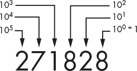
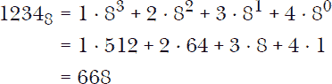
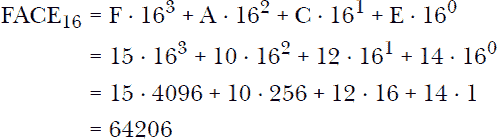

## 第十一章：A

数字基数


*数字*这个词来源于拉丁语*digitus*，意为手指或脚趾。当然，我们将其视为我们从零到九的计数数字的起源，可以通过手指（或脚趾）来匹配这些数字。这些数字构成了我们的十进制或基数为 10 的数字系统的基础。当前常用的位置数字系统称为*印度-阿拉伯数字系统*。穆罕默德·伊本·穆萨·阿尔·赫瓦里兹米的著作（例如《用印度数字进行计算》，约公元 825 年）在这一系统的引入中具有影响力。创新之处在于利用每个数字的位置来表示该数字乘以的 10 的幂。与使用其他系统（如罗马数字）相比，这使得计算变得更加简便。

十进制数字系统为每个数字位置分配了一个 10 的幂次，从数字串中的最右侧数字开始。数字串的含义则通过将每个数字与对应的 10 的幂相乘来得出，如图 A-1 所示。



*图 A-1：基数为 10 的位置值*

这意味着以下内容：

271828 = 2 ⋅ 10⁵ + 7 ⋅ 10⁴ + 1 ⋅ 10³ + 8 ⋅ 10² + 2 ⋅ 10¹ + 8 ⋅ 10⁰

表示此值的一种简洁方式如下：


这里 *d*[0] = 8, *d*[1] = 2, …, *d*[5] = 2——从最低位到最高位的数字。

十进制系统并不是唯一的数字系统。任何大于 1 的整数都可以用作数字系统的基数。如果你生活在一个人们只有八个手指的宇宙中（见图 A-2），你可能会使用八进制（或基数为 8）数字系统。


*图 A-2：八进制数字*

除 10 进制外的其他基数系统中的数字通常以数字的下标形式表示基数。一个八进制数会写作 1234[8]。我们可以按以下方式将其转换为十进制：



如大家所知，计算机内部严格按照二进制（或基数为 2）数字系统工作。三个二进制数字能够表示从 0 到 7 的数字，这些数字，如我们所见，构成了八进制数字系统的基础。四个二进制数字可以表示从 0 到 15 的数字（基数为 16 的数字）。由于数字 10 到 15 需要多个十进制数字来表示，因此使用字母 A 到 F 代替。也就是说，A=10，B=11，依此类推。这就是所谓的十六进制数字系统。例如，数字 FACE[16] = 64206，如下所示。



两个十六进制数字（或八个二进制数字）构成所谓的一个字节。字节通常不是用作数字的基数，但它们是用来表示计算机内存大小的常见单位。

这里有一些 Racket 代码，它接受一个正十进制整数，并返回一个包含该数字二进制表示的数字列表。

```
(define (decimal->bin n)
  (let loop ([n n] [l '()])
    (if (zero? n) l
        (let-values ([(n d) (quotient/remainder n 2)])
          (loop n (cons d l))))))
```

这个方法通过提取最不重要的（二进制中最右边的）数字，并通过除以 2 来减少*n*的值，从而得到下一个数字。

```
> (decimal->bin 15)
'(1 1 1 1)
> (decimal->bin 10)
'(1 0 1 0)
> (decimal->bin 64206)
'(1 1 1 1 1 0 1 0 1 1 0 0 1 1 1 0)
```

Racket 还提供了˜`r`函数，它接受一个十进制值并输出以另一进制格式化的字符串。

```
> (~r 64206 #:base 2)
"1111101011001110"

> (~r 64206 #:base 8)
"175316"

> (~r 64206 #:base 16)
"face"

> (~r  170 #:base 2 #:min-width 12  #:pad-string "0" )
"000010101010"
```
