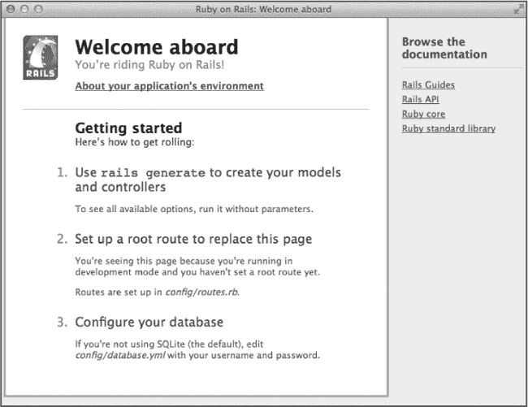
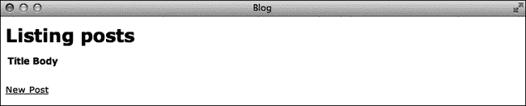

# 第二章. Rails 基础

*Ruby on Rails* 是一个开源的 web 框架。像 Ruby 语言一样，它强调程序员的幸福感和生产力。正如你将看到的，它包括了合理的默认设置，帮助你减少配置的时间，让你有更多时间写代码。它还为你的应用程序创建了一个目录结构，为你所需要的每个文件提供了合适的位置。

Rails 由 David Heinemeier Hansson 创建。他将其从他为 37signals 构建的项目管理应用 Basecamp 中提取出来，并于 2004 年 7 月首次作为开源发布。

Rails 还是一个 *全栈* web 框架。这意味着它包含了构建 web 应用程序所需的一切，能够接受用户请求、查询数据库并使用模板呈现数据来响应。

在终端中输入以下命令，确保已经安装了 Rails：

```
$ **rails --version**
```

这应该会显示 Rails 4.0.0 或更高版本。如果没有，请查看 Ruby、Rails 和 Git 中的 Rails 安装说明。

# 您的第一个 Rails 应用程序

Rails 让入门变得简单，所以让我们马上开始吧。你只需要输入五个命令，就可以运行一个 Rails web 应用程序了。

就像绝地武士自己制造光剑一样，我认为 web 开发者应该自己建造个人网站，因此我们将从这里开始。我把我的网站当作一个测试新想法的游乐场。在快速发展的 Ruby on Rails 世界中，保持自己的网站最新，也有助于你学习如何使用新发布的特性。

打开一个终端窗口，并为你的 Rails 项目创建一个目录。我称之为 *code*，但你可以使用任何你喜欢的名称。

```
$ **mkdir code**
$ **cd code**
```

现在使用 `rails new` 命令创建一个新应用程序。我们的第一个应用程序将是一个简单的博客，因此我们就称它为 *blog*。

```
$ **rails new blog**
```

该命令会创建你新应用所需的所有文件，并运行 `bundle install` 命令来下载并安装 Rails 所需的其他 gems。（*Gems* 是打包的 Ruby 应用程序或库。）根据你的网络速度，这可能需要几分钟。当安装完成后，使用 `cd` 命令进入新创建的 *blog* 目录：

```
$ **cd blog**
```

最后，使用 `rails server` 命令启动服务器，这样你就能看到你新的应用程序。当你创建这个应用程序时，*blog* 目录中也会创建一个名为 *bin* 的目录。*bin* 目录是你将来找到 `rails` 和其他命令的地方。

```
$ **bin/rails server**
```

该命令启动了内置于 Ruby 中的 WEBrick 服务器。服务器启动后，打开您的网页浏览器并访问这个地址：*http://localhost:3000*。如果一切正常，您应该能看到像 图 2-1 中那样的网页。



图 2-1. 您的第一个 Rails 应用程序

恭喜你！你正式成为了一名 Ruby on Rails 开发者。你刚刚创建的页面包含了一些关于如何开始使用你的应用程序的提示，但在我们深入了解之前，让我们先了解一下 Rails。

# Rails 原则

Rails 框架基于两个广为人知的软件工程原则。理解这些原则将帮助你理解构建应用程序的 “Rails 方式”。

## 约定优于配置

你无需配置任何内容就能让基本的 Rails 应用程序启动并运行。在 Rails 中，这个概念被称为 *约定优于配置*。只要遵循 Rails 的约定，一切都会按预期工作。

当你创建一个应用时，Rails 会为你做出许多选择。这些选择包括开发模式下使用哪个 Web 服务器和数据库服务器，应用将使用哪个 JavaScript 库和测试库。甚至应用数据库表和模型的名称也是根据约定自动选择的。当然，你可以打破约定，改变这些设置，但那样你就需要自己配置一些内容。

## 不重复自己

Rails 中的另一个关键原则是 *不重复自己*，通常缩写为 *DRY*。在 Rails 中，你避免在应用程序中重复相同的知识。在多个地方指定相同的信息，可能会导致在修改一个实例时忘记更新另一个，从而引发错误。

在我们深入了解 Rails 架构和目录结构的过程中，你会看到 DRY 原则的几个示例。Rails 应用的每个部分都有一个单一的、特定的位置。那些可以从其他来源推断出来的内容，例如数据库表中的列名，便不需要在任何地方重复指定。

# Rails 架构

Rails 应用程序围绕 *模型-视图-控制器（MVC）* 软件工程模式构建。MVC 模式旨在将应用程序的数据与用户的交互分离。这种关注点分离通常会导致一个更易于理解和维护的应用程序。

## 模型

*模型* 表示应用程序的数据以及操作这些数据的规则。应用程序的数据有时被称为应用程序的 *状态*。操作这些数据的规则也被称为 *业务逻辑*。所有对应用程序状态的更改必须通过模型层。

Rails 模型包含数据验证和模型间关联的代码。你写的大部分代码都会位于 Rails 模型内部，除非它直接与用户看到的数据视图相关。

## 视图

*视图* 是你应用程序的用户界面。因为我们正在构建 Web 应用程序，所以视图主要由 HTML 组成。Rails 默认使用一种名为 *嵌入式 Ruby（ERB）* 的模板系统。

嵌入式 Ruby 允许你在 HTML 模板中包含 Ruby 代码以访问数据。当用户请求页面时，模板中的 Ruby 代码会被服务器评估，结果生成的 HTML 页面会被发送给用户。

在视图中嵌入 Ruby 代码有时会导致程序员在视图中包含过多的代码。这样做是有问题的，因为如果你添加了另一个视图，代码就需要被重复使用。只在视图中使用的代码可以移动到*helper*中，*helper*是专门用于视图中的方法。一般来说，视图中不应包含比简单条件语句更复杂的代码。

### 注意

*除了 HTML 页面，Rails 还可以生成 JSON 和 XML。Ruby 内置支持生成 CSV 文件，并且有很多 gem 可以用来生成其他类型的输出，例如 PDF 文档和 Excel 表格。*

## 控制器

*controller* 就像是将模型和视图连接在一起的“粘合剂”。控制器负责接受来自用户的请求，从模型中收集必要的数据，并渲染正确的视图。听起来像是很多工作，但得益于 Rails 应用程序中使用的约定，这个过程几乎是自动完成的。

在 Rails 中，控制器只是一个 Ruby 类，其中的方法与应用程序中的各种操作相对应。例如，在你的博客应用程序中，你可能有一个名为 `show` 的方法用来显示博客文章，还有一个名为 `new` 的方法用来添加新文章。

# Rails 应用程序结构

现在你已经了解了 Rails 使用的原则和架构，让我们看看这些部分在 `rails new` 命令创建的目录结构中位于哪里。在博客目录中，你应该会找到 10 个子目录。

## app 目录

*app* 目录是你在构建应用程序时会花费大部分时间的地方。它包含了之前讨论过的 MVC 架构的各个部分的子目录，以及*assets*、*helpers* 和 *mailers*。

*assets* 目录保存着应用程序使用的图片、JavaScript 文件和 CSS 样式表。*helpers* 目录包含着视图使用的 Ruby 文件和方法。*mailers* 目录用于存放发送电子邮件的 Ruby 类。

## bin 目录

*bin* 目录包含了用于访问 *bundle*、*rails* 和 *rake* 命令行程序的简单 Ruby 脚本，这些程序用于构建你的应用程序。这些脚本确保这三个程序在当前 Rails 应用程序的上下文中运行。你可以同时安装多个版本的这些程序，如果不使用 *bin* 中的脚本来访问它们，可能会导致错误。

## config 目录

Rails 强烈依赖“约定优于配置”，但有时配置是不可避免的。在这些情况下，可以查找 *config* 目录。

*environments* 子目录包含 Rails 自动创建的三个不同环境的配置文件。环境是为特定用途（如开发或测试）使用的一组设置。这些设置存储在 *development.rb*（用于开发应用程序时）、*test.rb*（用于运行自动化测试时）和 *production.rb*（应用程序部署并在生产环境中运行时使用）中。

文件 *application.rb* 包含所有环境的设置。然而，刚才提到的某个特定环境文件中的信息将优先于此处的设置。

文件 *database.yml* 存储每个环境的数据库配置。默认情况下，Rails 在你运行 `rails new` 时会创建一个 SQLite 数据库，因此 *database.yml* 中的默认设置适用于该 SQLite 数据库。这个数据库是一个单一的文件，你将在开发期间使用它。通常，在生产环境中，你会指定一个不同的数据库服务器。

文件 *routes.rb* 将用户输入的网页地址映射到应用程序中的特定控制器和操作。随着你向应用程序添加资源和操作，你需要更新此文件以反映这些变化。在讨论控制器时，我会在第四章中讲解基于资源的路由。

## db 目录

*db* 目录初始时只包含一个名为 *seeds.rb* 的文件。你可以使用这个文件创建应用程序的默认数据。例如，在一个包含用户帐户的应用程序中，你可能希望在这里添加一个特殊的“管理员”用户。

在构建应用程序时，你会创建 *数据库迁移*，即用于创建和修改数据库中表的 Ruby 脚本。会创建一个名为 *migrate* 的目录，用来存放这些数据库迁移文件。文件 *schema.rb* 会显示应用程序数据库的当前状态。如果你在应用程序中使用默认的 SQLite 数据库，数据库本身也会被放在这个文件夹中。

## lib 目录

*lib* 目录是你放置任何可重用库代码的地方。除了两个子目录：assets 和 tasks 之外，初始时该目录为空。*Assets* 是图像、CSS 样式表和 JavaScript 文件。*Tasks* 是 Ruby 脚本，用于自动化操作，如管理应用程序的数据库、清除日志和临时文件、以及运行测试。这些任务使用 `rake` 命令执行。

## log 目录

当你的应用程序运行时，数据会写入 *log* 目录中的一个文件。当你在开发环境中运行代码时，这个文件名为 *development.log*。针对测试和生产环境，将创建单独的文件。

## public 目录

*public* 目录中的文件会像在应用程序根目录中的文件一样发送给用户。例如，目录中的三个文件用于错误信息——*404.html*、*422.html* 和 *500.html*。你可以通过将这些文件的名称添加到地址栏中来查看其中一个文件。例如，如果访问 *http://localhost:3000/404.html*，你应该会看到默认的“页面不存在”错误页面。

这个目录还包含一个默认的*favicon.ico*，这是大多数浏览器地址栏中显示的图标，还有一个*robots.txt*文件，控制搜索引擎如何索引你的应用。你可以修改这些文件以适应你的应用。你可能想要自定义错误页面，加入自己的品牌标识，并为你的站点添加自定义的 favicon。

## 测试目录

*test* 目录包含自动化测试的子目录，每个子目录用于你的应用的不同部分。它还包含脚本 *test_helper.rb*，该脚本加载 *config/environments/test.rb* 中的测试环境设置，并添加在测试中使用的辅助方法。

一些 Rails 开发者实践*测试驱动开发（TDD）*。在 TDD 中，你首先编写一个自动化测试，描述一个新特性；然后你编写足够的代码让测试通过；最后，你*重构*或重组代码，以提高可读性并减少复杂性。

## tmp 目录

*tmp* 目录包含临时文件。在这里，你可以找到应用程序资源的缓存副本、运行程序（如 Web 服务器）的进程 ID 文件（pid）、用户会话以及表示应用正在使用的套接字的文件。

### 注意

*因为这些文件通常不需要保存，所以版本控制系统会忽略它们。*

## vendor 目录

最后，*vendor* 目录保存第三方 gems 所需的资源。它的作用类似于 *lib* 目录，只不过它用于你没有自己编写的库。

# Rails 命令

在构建 Rails 应用时，你会使用四个不同的命令行程序。对于新的 Rails 开发者来说，这些程序有时会让人感到困惑。

## gem 命令

`gem` 命令用于安装 Ruby gems。Rails 框架实际上是作为一组 gem 文件发布的。

你新创建的 Rails 应用由超过 40 个 gems 组成。维护这些 gems 的正确版本及其依赖关系可能变得复杂。因此，你很少直接使用 `gem` 命令；相反，你通常依赖一个名为 Bundler 的工具来管理 gems，并保持依赖关系的更新。你通过 `bundle` 命令与 Bundler 进行交互。

## bundle 命令

`bundle` 命令用于安装和更新应用所需的 gems。它通过读取在 `rails new` 命令自动创建的位于 Rails 应用根目录的 *Gemfile* 来安装 gems。它将你所使用的 gems 及其依赖的版本号存储在 *Gemfile.lock* 文件中。

`bundle list`命令会显示当前应用程序使用的所有 gems 的名称和版本：

```
$ **bin/bundle list**
```

如前所述，我们使用的是*bin*目录中的`bundle`副本。

## `rake`命令

`rake`命令是一个自动化构建工具，用于执行与应用程序相关的任务。（如果您熟悉`make`命令，`rake`是其 Ruby 版本。）输入此命令以获取应用程序的可用任务列表：

```
$ **bin/rake --tasks**
```

此命令会将您应用程序可以使用的任务列表以及每个任务的简短描述打印到终端。有些 gems 会为您的应用程序添加任务，您也可以通过编写 Ruby 脚本并将其保存在*lib/tasks*目录中来添加您自己的任务。

## `rails`命令

您之前使用`rails`命令来创建应用程序并启动服务器。您还可以使用此命令来生成新代码并启动控制台。单独输入`rails`命令以列出可用选项：

```
$ **bin/rails**
```

除了您用来构建应用程序的`new`命令和启动 web 服务器的`server`命令外，Rails 还提供了其他一些有用的命令。这些包括`generate`命令（生成新代码）、`console`命令（启动一个交互式 Ruby 控制台，并预加载您的 Rails 应用程序）以及`dbconsole`命令（启动当前配置数据库的命令行界面）。

现在，您已经看到了几个 Rails 命令行工具，让我们使用其中一些来为我们创建的博客应用程序添加一些功能。

# Rails 脚手架

我们将使用 Rails 中的一个功能，称为*脚手架*。Rails 脚手架是一个有时会引发争议的功能，它会为您生成应用程序代码。这个单一命令会自动创建模型、一组视图和控制器。

许多开发者认为您应该编写所有自己的代码。我同意他们的观点，但 Rails 脚手架对于启动一个应用程序非常有用，尤其是对于新接触 Ruby on Rails 的开发者。接下来的几章我们将探讨生成的代码。到最后，您将理解每个文件，并能够手动编写这些文件。

打开一个新的终端窗口（或在当前窗口中新建一个标签页）。如果需要，切换到*code/blog*目录。然后，使用`rails generate`命令为博客添加帖子：

```
$ **bin/rails generate scaffold Post** ➊**title:string** ➋ **body:text**
```

在这里，我们要求 Rails 为博客文章生成一个脚手架。我们指定了文章应该包含标题 ➊ 和正文 ➋。

标题将是一个字符串，正文将是数据库中的一个文本字段。当此命令运行时，您应该能在终端看到一阵活动，文件会被生成并放入正确的文件夹中。

上一个命令应该已经生成了数据库迁移。使用`rake`命令来运行该迁移：

```
$ **bin/rake db:migrate**
```

该命令应该会创建一个名为 *posts* 的表，字段包括 `id`、`title`、`body`、`created_at` 和 `updated_at`。`title` 和 `body` 字段将存储用户输入的数据。Rails 会自动添加 `id`、`created_at` 和 `updated_at` 字段。`id` 字段是一个唯一的、自增的整数，代表数据库中的每一行。`created_at` 和 `updated_at` 字段是时间戳，表示该行数据创建的时间和最后一次更新的时间。Rails 会自动跟踪这些值。

要查看结果，请在浏览器中访问 *http://localhost:3000/posts*。你应该能看到类似于图 2-2 的页面。



图 2-2. Rails Post 脚手架

这个页面的设计可能不会赢得任何奖项，但它是实用的。点击*新建帖子*链接，查看添加新博客帖子的表单。添加帖子后，点击*返回*链接返回主页。

默认情况下，Rails 会以表格的形式显示数据，并提供*查看*、*编辑*和*删除*链接。随意尝试这些链接，并验证应用程序是否正常工作。

在你玩应用程序时，记得查看运行服务器的终端窗口中的输出。这是应用程序生成的开发日志副本。你将在这里找到大量信息，例如请求的 URL、正在运行的 Ruby 方法和正在执行的 SQL 命令。

# 总结

本章介绍了构建 Rails 应用程序的基本原理、架构、目录结构和命令。在下一章中，我们将深入探讨刚刚生成的 Rails 代码，从模型开始，你将学习如何编写自己的代码。

# 练习

| 问题： | 1\. 探索你新博客的功能。创建、编辑和删除帖子。查看帖子列表和单个帖子。注意当你在应用程序中浏览时，地址栏中的 URL 是如何变化的。 |
| --- | --- |
| 问题： | 2\. 习惯在你选择的编辑器中浏览博客应用程序中的各种文件。如果你使用的是 Sublime Text 2，你可以直接打开博客目录，然后使用侧边栏打开单个文件。 |
