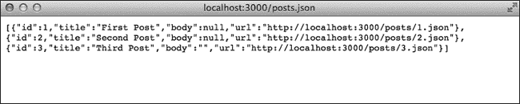

# 第四章. 控制器

Rails 的*控制器*连接应用程序的模型和视图。应用程序接收到的任何网页请求都会被路由到相应的控制器。控制器从模型获取数据，然后呈现适当的视图或重定向到其他位置。

在本章中，我们将继续开发我们的博客。在这个过程中，你将详细了解控制器。我将介绍使用 REST 进行资源表示、资源路由以及控制器可以执行的操作类型。

# 表现层状态转移

*表现层状态转移*，或称*REST*，是一种由 HTTP 规范的作者之一罗伊·菲尔丁博士于 2000 年提出的客户端-服务器软件架构。REST 处理资源的表示，在 Rails 中，资源对应于模型。在 RESTful 架构中，客户端发起请求到服务器，服务器处理请求并将响应返回给客户端。在 Rails 应用中，处理请求并返回响应的服务器是控制器。控制器通过一组常见的 URL 和 HTTP 动词与客户端交互。

你可能已经至少熟悉这两种 HTTP 动词。请求一个网页有时被称为*GET*请求。GET 请求不会改变应用程序的状态；它仅仅返回数据。当你在网页上提交表单数据时，结果通常是一个*POST*请求。在使用 REST 的应用程序中，POST 请求用于在服务器上创建记录。

在我们上一章讨论模型时，你了解了 CRUD（创建、读取、更新和删除）。REST 使用表 4-1 中列出的四个 HTTP 动词，分别对应这些操作。

表 4-1. 数据库操作与 HTTP 动词的映射

| 数据库操作 | HTTP 动词 |
| --- | --- |
| `创建` | POST |
| `读取` | GET |
| `更新` | PATCH |
| `删除` | DELETE |

你的应用程序会根据所使用的 HTTP 动词来决定如何处理请求。对于一个资源的 GET 请求，它会返回对应模型的数据；PATCH 请求会用新信息更新模型；DELETE 请求则销毁模型。所有这三种操作都使用相同的 URL，只有 HTTP 动词不同。

Rails 应用程序在表 4-1 中列出的四个 CRUD 操作之外，还增加了三种操作。`index`操作显示所有资源的列表；`new`操作显示用于创建新资源的表单；`edit`操作显示用于编辑现有资源的表单。

每个操作在 Rails 控制器中都有一个对应的方法。这七个方法在表 4-2 中进行了总结。

表 4-2. 默认的 RESTful 操作

| 操作 | 描述 | HTTP 动词 |
| --- | --- | --- |
| `index` | 列出所有记录 | GET |
| `show` | 显示一条记录 | GET |
| `new` | 显示创建记录的表单 | GET |
| `edit` | 显示编辑记录的表单 | GET |
| `create` | 创建一条新记录 | POST |
| `update` | 更新现有记录 | PATCH |
| `destroy` | 删除记录 | DELETE |

我们将在本章中涵盖这些操作，但首先让我们看看 URL 是如何生成的。

# 路由

设置所有这些 URL 并将动作映射到动词听起来可能有点复杂，但幸运的是，Rails 路由会为你处理这一切。*路由*将 URL 连接到组成应用程序的代码。首先，让我们看看最常见的路由类型——资源路由。

## 资源

应用程序的路由存储在*config/routes.rb*文件中。请在文本编辑器中打开该文件。

忽略所有注释。现在，你的文件应该只有三行：

```
Rails.application.routes.draw do
  resources :posts
end
```

Rails 应用程序默认使用 REST。博客应用目前只有一个资源（博客文章），单行的`resources :posts`为应用程序构建了一组路由。使用`rake`命令来显示应用程序的路由：

```
$ **bin/rake routes**
Prefix Verb   URI Pattern                Controller#Action
 posts GET    /posts(.:format)           posts#index
       POST   /posts(.:format)           posts#create
--*snip*--
```

此命令输出每个七个默认 RESTful 操作的路由帮助器前缀、HTTP 动词、URL 模式和控制器操作。

例如，对*/posts*的 GET 请求会调用`PostsController#index`方法。当你修改路由文件时，再次运行此命令以查看应用程序的路由如何变化。

### 嵌套资源

当一个资源属于另一个资源时，可以将其作为*嵌套资源*添加。在博客中，评论属于文章。以下是在*config/routes.rb*中表示这种关系的方式：

```
resources :posts **do**
  **resources :comments**
**end**
```

在`resources :posts`后添加一个`do`、`end`块。然后在该块中添加`resources :comments`。这告诉 Rails，评论仅在文章内可用。

### 限制资源

像你刚才看到的那样，添加`resources :comments`会为评论创建七个默认 RESTful 操作的路由。现在，我们只关心创建新的评论。你可以通过在*config/routes.rb*中为该资源添加`only`子句来限制生成的路由集：

```
resources :posts do
  resources :comments**, only: :create**
end
```

现在，只有评论的`create`操作被映射到一个 URL。你应该只为计划实现的操作提供路由。

## 自定义路由

你的应用程序中的某些操作可能与七个默认操作不对应。例如，应用程序可能包含一个`search`操作，返回包含特定术语的博客文章列表。在这种情况下，Rails 允许你手动配置*自定义路由*。

自定义路由对于将旧的 URL 映射到新的 Rails 应用程序，或简化复杂操作的 URL 也非常有用。例如，假设你的应用程序允许用户通过创建一个新的会话来登录，通过销毁会话来注销。添加 `resources :user_session` 会创建类似 *user_session/new* 的路径。如果你更愿意使用不同的路径，可以为 *login* 和 *logout* 创建自定义路由。

```
Rails.application.routes.draw do
  resources :posts do
    resources :comments, :only => :create
  end

  **get 'login' => 'user_sessions#new'**
  **post 'login' => 'user_session#create'**
  **delete 'logout' => 'user_sessions#destroy'**
end
```

现在你的应用程序的登录页面应该位于路径 */login*。当用户访问登录页面时，浏览器会发送一个 GET 请求到这个路径。控制器会响应该 GET 请求并显示登录表单。当用户提交表单时，浏览器会向相同的路径发送一个 POST 请求，并包含表单内容。然后，控制器会响应该 POST 请求并为用户创建一个新的会话。当用户点击注销按钮时，浏览器会向路径 */logout* 发送一个 DELETE 请求，销毁用户的会话。

我们没有为博客应用程序添加身份验证，但如果你想查看创建的路由，仍然可以将这些路由添加到 *config/routes.rb* 中。如果你不想继续，删除它们，因为访问与控制器动作不对应的路径会导致错误。

## 根路由

最后，让我们创建一个 *根路由*，这样我们就不需要每次都在浏览器地址栏中输入 */posts* 了。根路由为你的应用程序设置了首页。在 *config/routes.rb* 的末尾添加 `root 'posts#index'`：

```
Rails.application.routes.draw do
  resources :posts do
    resources :comments, :only => :create
  end
  **root 'posts#index'**
end
```

现在，在没有路径的情况下访问服务器应该显示文章索引页面。你应该始终为你的应用程序包含一个根路由。

## 路径和 URL

添加路由还会自动为你的控制器和视图创建助手。你可以使用这些助手，参见 表 4-3，而无需在应用程序中手动输入 URL。这样，如果你将来决定更改应用程序的 URL，就不必在代码中查找并更新所有旧的 URL。

表 4-3. Rails 路径和 URL 助手

| 路径助手 | URL 助手 |
| --- | --- |
| `posts_path` | `posts_url` |
| `new_post_path` | `new_post_url` |
| `edit_post_path(id)` | `edit_post_url(id)` |
| `post_path(id)` | `post_url(id)` |

*路径助手* 仅包含路径，而 *URL 助手* 还包括协议、服务器和端口（如果不是标准的）。Rails 应用程序通常使用路径助手。URL 助手在需要完整 URL 的情况下非常有用，例如生成用于电子邮件中的 URL。

每个方法名称的第一部分与 `bin/rake routes` 命令显示的前缀匹配。

你可以在 Rails 控制台中测试这些助手，方法如下：

```
2.1.0 :001 > **app.posts_path**
 => "/posts"
2.1.0 :002 > **app.post_path(1)**
 => "/posts/1"
2.1.0 :003 > **app.new_post_path**
 => "/posts/new"
2.1.0 :004 > **app.root_path**
 => "/"
```

在使用 Rails 路由时，测试这些助手是一个有用的检查方法。如果你忘记使用哪个助手来创建路径，可以在控制台中输入它以查看结果。

# 控制器动作

在 Rails 中的约定是每个资源对应一个控制器。该控制器包含每个动作的方法。（记住第二章中的原则：约定优于配置。）Rails 脚手架生成器为帖子创建了一个控制器。打开文件 *app/controllers/posts_controller.rb*，查看这些方法背后的 Ruby 代码。建议在继续阅读本章的过程中运行 Rails 服务器：

```
$ **bin/rails server**
```

现在，让我们逐个查看每个控制器方法，从 `index` 开始，依次查看 `destroy`。

`index` 动作从数据库中检索所有帖子：

```
def index
  @posts = Post.all
end
```

你会在该方法中看到熟悉的 `@post = Post.all`。你可能会惊讶地发现，这就是 `index` 方法中的*唯一*一行代码。默认情况下，Rails 会渲染与动作名称匹配的视图文件，在本例中是 *app/views/posts/index.html.erb*。（我们将在下一章讨论视图。）

在浏览器中访问 *http://localhost:3000/posts*，查看 `index` 动作的结果。

`show` 动作从数据库中检索单个帖子，但 `show` 方法本身没有任何代码：

```
def show
end
```

此方法依赖于一个 Rails `before_action`，你应该能在控制器的第二行看到它：

```
before_action :set_post, only: [:show, :edit, :update, :destroy]
```

`before_action` 是一个类方法，它会在 `show`、`edit`、`update` 和 `destroy` 方法之前自动调用 `set_post` 方法，避免在这些方法中重复代码。（记住 DRY：不要重复自己。）

```
def set_post
  @post = Post.find(params[:id])
end
```

`set_post` 方法在控制器的底部附近定义，并使用 `private` 关键字。它调用 `Post.find` 方法，检索与传递给控制器的参数 `id` 相对应的帖子。参数将在下一节中更详细地讨论，所以现在我们继续查看这些控制器方法。

`new` 动作显示一个表单，用于添加新帖子：

```
def new
  @post = Post.new
end
```

表单使用新创建的帖子的数据。在帖子索引页面底部点击 *新建帖子* 链接，查看此表单。

`edit` 动作显示一个表单，用于编辑现有的帖子。像 `show` 方法一样，这个方法不包含任何代码：

```
def edit
end
```

此表单使用之前讨论过的 `set_post` 方法检索的数据。

## 动作的简要偏离

在讨论 `create`、`update` 和 `destroy` 之前，让我们先了解一些关键的 Rails 主题，这些是理解这些方法所必需的。在本节中，我们将探讨参数、渲染/重定向、响应格式和 flash。

### 参数

*参数* 通常表示用于请求页面或表单值的 URL 部分，它们可以在控制器中作为名为 `params` 的哈希访问。例如，你之前看到的 `set_post` 方法从 `params` 哈希中检索请求的帖子的 `id`，如下所示：

```
@post = Post.find(params[:id])
```

你可以在终端中通过`rails server`命令的输出看到每个请求传递的参数。例如，访问*http://localhost:3000/posts/1*，然后查看终端中 Rails 服务器的输出：

```
  Started GET "/posts/1" for 127.0.0.1 at 2014-03-31 20:30:03 -0500
  Processing by PostsController#show as HTML
➊   Parameters: {"id"=>"1"}
    Post Load (0.3ms) SELECT "posts".* FROM "posts"
      WHERE "posts"."id" = ? LIMIT 1 [["id", "1"]]
    Rendered posts/show.html.erb within layouts/application (233.9ms)
  Completed 200 OK in 274ms (Views: 245.5ms | ActiveRecord: 26.2ms)
```

在这种情况下，URL 中的`1`表示请求帖子➊的`id`。因为我们请求的是单个帖子，所以调用`show`方法，并且这个`id`用于在`set_post`中查找帖子。

表单数据由一个嵌套哈希表示，哈希包含值。例如，编辑这个帖子会生成一个更像这样的`params`哈希：

```
  {
    "utf8"=>"✓",
    "authenticity_token"=>"...",
➊   "post"=>{"title"=>"First Post", "body"=>""},
    "commit"=>"Update Post",
➋   "id"=>"1"
  }
```

你仍然可以访问`params[:id]` ➋来查找正确的帖子，也可以访问`params[:post]` ➊来查看用户提交的新值。因为这些是用户提交的值，你应确保应用程序仅接受适当属性的数据。恶意用户可能会发送带有无效参数的请求，试图攻击你的应用程序。

对于博客帖子，你只希望用户能够编辑`title`和`body`属性。Rails 包括一个名为*强参数*（Strong Parameters）的功能，使得指定应用程序接受哪些属性变得很容易。你可以在`post_params`方法中看到这个功能的实际应用：

```
def post_params
  params.require(:post).permit(:title, :body)
end
```

该方法首先要求`params`哈希包含一个嵌套哈希，键为`:post`。然后，它只返回该嵌套哈希中允许的值（`:title`和`:body`）。使用前面的`params`哈希示例，`post_params`返回一个类似这样的哈希：

```
{"title" => "First Post", "body" => ""}
```

`params[:post]`哈希中的其他值会被默默忽略。记住，访问新创建或更新的帖子参数时，始终使用`post_params`方法。

### 渲染或重定向

每个动作必须*渲染*一个视图或*重定向*到另一个动作。默认情况下，动作会渲染与动作名称匹配的文件。例如，帖子控制器中的`show`方法会查找一个名为*app/views/posts/show.html.erb*的文件，并使用该文件构建返回给用户的 HTML 响应。

你可以通过`render`方法告诉 Rails 渲染不同动作的响应，方式如下：

```
render action: "edit"
```

指定动作的能力在需要根据用户输入呈现不同视图时非常有用。这个例子来自`update`方法。如果帖子无法使用用户提供的数据更新，该方法会重新渲染`edit`视图，给用户一个机会来修正数据。

有时你需要将用户重定向到他或她请求之外的页面。使用`redirect_to`方法来处理这种情况。例如，如果用户在创建或更新帖子时输入了有效数据，控制器动作会将用户重定向到该帖子：

```
redirect_to @post
```

当你调用`redirect_to`时，用户浏览器中的地址会更改，以反映新页面，并且会发出另一个请求。你可以通过提交表单数据时观察地址栏并查看终端中`rails server`的输出来看到这一点。

要查看此功能，首先在浏览器中访问*http://localhost:3000/posts/new*。这是新建文章的表单。输入新文章的标题，然后点击*创建文章*按钮。点击按钮后请密切关注地址栏。

表单向*http://localhost:3000/posts*发起 POST 请求。该请求会被路由到`create`方法。创建完文章后，你会被重定向到*http://localhost:3000/posts/3*，假设你的新文章的`id`是 3。地址会通过`redirect_to`方法自动更改。

### 响应格式

Rails 可以生成多种格式的响应，尽管到目前为止我们讨论的都是 HTML 格式。通过脚手架生成的控制器也可以包含 JavaScript 对象表示法（JSON）响应，这对于创建应用程序编程接口（API）非常有用。其他格式包括 XML 甚至 PDF。

你可以通过访问这个网址来尝试另一种响应类型：*http://localhost:3000/posts.json*。这个网址与之前使用的文章索引网址相同，只不过末尾加了*.json*。Rails 会识别这是一个 JSON 请求，并将文章集合以 JSON 格式呈现，如图 4-1 所示。



图 4-1. 文章以 JSON 格式呈现

你可以通过调用`respond_to`方法指定一个操作接受的格式以及每种格式的响应。这个方法接受一个块，块中有一个表示请求格式的单一参数。以下是`destroy`方法中的示例：

```
respond_to do |format|
 format.html { redirect_to posts_url }
 format.json { head :no_content }
end
```

这个方法在文章被销毁后立即调用。如果客户端请求 HTML 数据，这个代码块会重定向到`posts_url`，即索引页面。如果客户端请求 JSON 数据，添加*.json*到 URL 末尾，这个代码块会返回一个空的头部，表示该文章已不存在。

### 闪存

*闪存消息*是向用户发送的提示信息，仅在单次请求中有效。闪存消息通常存储在用户的会话中，通常是一个 cookie。它们通常使用不同的样式以便突出显示。例如，Rails 脚手架附带的样式表使用绿色文字来显示闪存消息。

闪存消息对于向用户发送错误信息或其他通知非常有用。它们通常在重定向时设置。以下是来自文章控制器`create`方法的示例：

```
redirect_to @post, notice: 'Post was successfully created.'
```

当文章创建成功后，用户会被重定向到新文章页面，并显示类似图 4-2 中的闪存消息。


图 4-2. 一条闪存消息

`create`闪存消息是绿色文字，且与之前添加的消息相匹配。

## 返回控制器操作

现在，你应该了解了足够的信息，能够理解 `create`、`update` 和 `destroy` 动作。由 scaffolding 生成的这些方法响应 HTML 和 JSON 数据的请求，并返回指示成功或错误的消息，但现在我们先专注于 HTML 响应。关于 JSON 响应的内容，我将在讲解如何构建你自己的 API 时详细讨论。

### 注意

*每个方法中的格式已稍作调整，以更好地适应此页面。*

`create` 方法负责使用新帖子表单中的 `params` 来创建一个帖子：

```
def create
  @post = Post.new(post_params)

  respond_to do |format|
    if @post.save
      format.html { redirect_to @post,
                    notice: 'Post was successfully created.' }
      format.json { render action: 'show',
                    status: :created, location: @post }
    else
      format.html { render action: 'new' }
      format.json { render json: @post.errors,
                    status: :unprocessable_entity }

    end
  end
end
```

方法的第一行 `@post = Post.new(post_params)` 使用强参数来确保只有允许的参数能够传递给 `new`。在 `respond_to` 块内部，检查 `@post.save` 的返回值。如果返回 `true`，则用户将被重定向到新创建的帖子；如果返回 `false`，则重新渲染 `new` 动作，用户可以修正任何错误。

`update` 方法与 `create` 方法类似，主要区别在于代码检查的是 `@post.update` 的返回值，而不是 `@post.save`。

```
def update
  respond_to do |format|
    if @post.update(post_params)
      format.html { redirect_to @post,
                    notice: 'Post was successfully updated.' }
      format.json { render action: 'show',
                    status: :ok, location: @post }

    else
      format.html { render action: 'edit' }
      format.json { render json: @post.errors,
                    status: :unprocessable_entity }
    end
  end
end
```

如果 `@post.update` 返回 `true`，代码将重定向用户到更新后的帖子；否则，它将重新渲染编辑表单，以便用户修正错误。

`destroy` 方法比 `create` 和 `update` 方法更简单，因为它不检查 `@post.destroy` 的返回值。

```
def destroy
  @post.destroy
  respond_to do |format|
    format.html { redirect_to posts_url }
    format.json { head :no_content }
  end
end
```

在帖子被销毁后，代码会将用户重定向回索引页面 `posts_url`。

# 添加评论

你之前已经为 `create` 评论动作添加了一个路由，现在让我们为这个动作添加一个简单的控制器。你将在下一章中添加用于输入新评论的表单。

使用 Rails 生成器生成一个新的评论控制器：

```
  $ **bin/rails generate controller comments**
➊    create  app/controllers/comments_controller.rb
     invoke  erb
➋    create    app/views/comments
     invoke  test_unit
     create    test/controllers/comments_controller_test.rb
     invoke  helper
     create    app/helpers/comments_helper.rb
     invoke    test_unit
     create      test/helpers/comments_helper_test.rb
     invoke  assets
     invoke    coffee
     create      app/assets/javascripts/comments.js.coffee
     invoke    scss
     create      app/assets/stylesheets/comments.css.scss
```

注意，我只指定了控制器，而不是 scaffolding。这段代码会生成一个空的控制器 ➊ 和一个空的 *views* 目录 ➋，同时还会生成 helpers、tests 和 assets 的文件。我们需要自己填充细节。首先打开编辑器中的文件 *app/controllers/comments_controller.rb*：

```
class CommentsController < ApplicationController
end
```

因为你正在实现 `create` 动作，首先需要一个 `create` 方法。你可以将其模仿为帖子控制器中的 `create` 方法。假设用户不会通过 API 添加评论，因此不需要生成 JSON 响应。

```
  class CommentsController < ApplicationController
    **def create**
1     **@post = Post.find(params[:post_id])**

2     **if @post.comments.create(comment_params)**
3       **redirect_to @post,**
                    **notice: 'Comment was successfully created.'**
      **else**
        **redirect_to @post,**
                    **alert: 'Error creating comment.'**
      **end**
    **end**
  end
```

这段代码首先使用 `params` 哈希中的 `post_id` 查找正确的帖子 ➊。然后，利用 `comments` 关联来创建一个新的评论 ➋，并重定向回该帖子 ➌。每次调用 `redirect_to` 都会设置一个闪存消息以指示成功或失败。

由于你在应用程序中使用了强参数，你还需要添加 `comment_params` 方法以指定你希望接受的参数。

```
class CommentsController < ApplicationController
  --*snip*--

  **private**

  **def comment_params**
    **params.require(:comment).permit(:author, :body)**
  **end**
end
```

对于评论，你只接受 `author` 和 `body`。其他参数会被忽略。在下一章，你将更新帖子 `show` 视图以显示现有评论，并包括一个用于创建新评论的表单。

# 总结

本章介绍了许多重要的 Rails 概念——REST、路由和控制器。我还讨论了参数、渲染与重定向、响应格式以及闪存。

我们在上一章从数据库开始，在本章逐步向前推进。在下一章，我们将深入到用户部分，覆盖 MVC 的最后一块拼图：视图。

# 练习

| 问题： | 1\. 良好的错误信息对于任何应用程序都至关重要。如果出现问题，用户需要知道问题所在以及如何修正。目前，如果评论无法创建，用户会看到“创建评论时出错”这一消息。请更新`CommentsController create`方法，确保在警告框中也能显示错误消息列表。 |
| --- | --- |
| 问题： | 2\. 在第三章的练习 1 中，你向`Comment`模型添加了一个`email`字段。请更新`CommentsController`中的`comment_params`方法，使其也能够接收这个字段。 |
