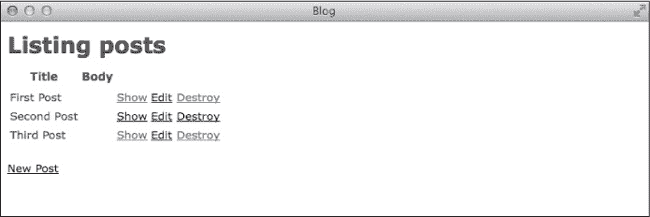
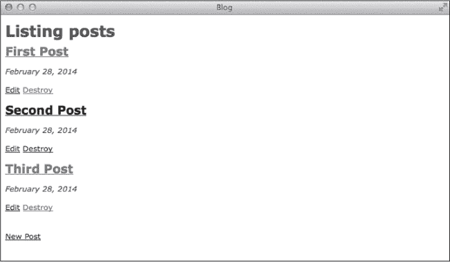
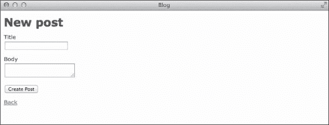
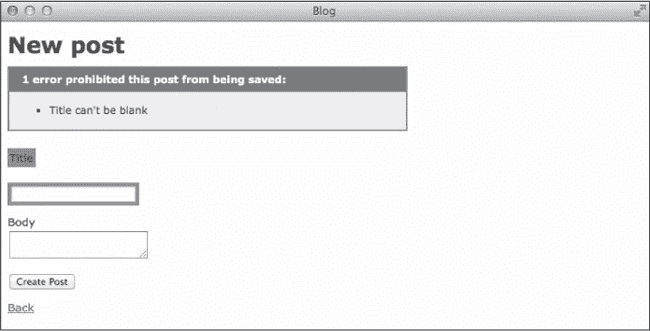
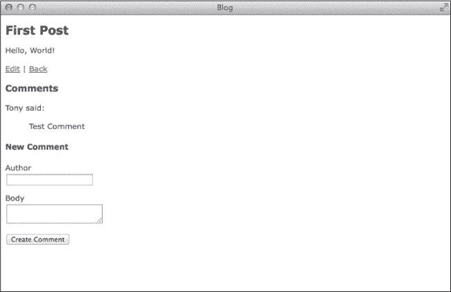

# 第五章 视图

*视图*是用户与应用程序交互的界面。通常，视图包括用于显示数据库记录的网页，以及用于创建和更新这些记录的表单。视图有时也可以是对 API 请求的响应。

本章介绍了最常用的 Rails 视图模板类型——*嵌入式 Ruby*，以及视图特定的助手和布局。你还将学习如何通过部分模板避免 HTML 代码重复，并且如何生成表单以接受用户输入。

现在输入**`bin/rails server`**来启动 Rails 服务器。并保持服务器在终端窗口中运行，当你在本章示例中进行操作时，这样你可以在浏览器中看到你对应用程序所做的更改，并查看服务器的输出。

# 嵌入式 Ruby

嵌入式 Ruby（ERB），是 Rails 中的默认模板类型，用于构建视图模板。嵌入式 Ruby 模板包含 Ruby 代码和 HTML 的混合，类似于 ASP、JSP 或 PHP。

模板存储在*app/views*的子目录中，该子目录以控制器的名称命名。例如，你会在*app/views/posts*目录中找到帖子控制器的模板。Rails 的约定是根据操作命名模板，并且文件扩展名为*.html.erb*。`index`操作的默认模板是*index.html.erb*。

嵌入式 Ruby 包含三种特殊的标签用于执行 Ruby 代码。这些标签用于输出、控制流和注释。让我们来看看每一种标签。

## 输出

`<%= %>`标签（也称为*输出标签*）执行其包含的代码并将返回值打印在页面上。打开文件*app/views/posts/show.html.erb*，查看这个标签的几个示例。

例如，这个标签打印当前帖子的标题：

```
<%= @post.title %>
```

请注意，标题中的任何 HTML 默认都会被转义。也就是说，任何保留字符都会被转换为字符引用，并显示在页面上，而不是被解释为 HTML。这个保护措施可以防止恶意用户在页面上输入 HTML 代码，从而导致页面崩溃，甚至是跨站脚本攻击。跨站脚本攻击和其他安全问题会在第十一章中详细讨论。

## 控制流

`<% %>`标签执行其包含的代码，但不会在页面上打印任何内容。这个标签对于控制流语句（如循环或条件语句）非常有用。打开文件*app/views/posts/index.html.erb*，查看此标签的实际应用。

这个示例使用`each`方法遍历一个帖子数组：

```
<% @posts.each do |post| %>
  <tr>
    <td><%= post.title %></td>
    <td><%= post.body %></td>
    <td><%= link_to 'Show', post %></td>
    <td><%= link_to 'Edit', edit_post_path(post) %></td>
    <td><%= link_to 'Destroy', post, method: :delete,
              data: { confirm: 'Are you sure?' } %></td>
  </tr>
<% end %>
```

输出标签在循环内用于打印`post.title`和`post.body`的值。这个示例还展示了三个`link_to`助手的使用。这些助手为每个帖子创建指向`show`、`edit`和`destroy`操作的链接。我们将在下一节讨论助手。

## 注释

最后，`<%# %>` 标签用于输入注释。*注释* 通常是给自己或其他程序员的说明，描述你的代码在做什么。与 HTML 注释（以 `<!--` 开始，以 `-->` 结束）不同，ERB 注释不会出现在 HTML 源代码中。使用 ERB 注释来添加你不希望在由视图模板生成的 HTML 中看到的注释。

你到目前为止看到的 ERB 模板是我们在最初创建博客时通过 Rails 脚手架生成的。它们没有注释，但你可以轻松地添加自己的注释。这里是一个例子：

```
<%# This code is crazy %>
```

除了给程序员的注释外，你还可以使用 ERB 注释临时从页面中移除代码。在任何其他 ERB 标签中的第一个百分号符号（`%`）后面加上井号符号（`#`），该标签内的代码将不会被执行。

# 助手方法

*Helpers* 是 Ruby 方法，用于简化视图中的代码，使其更易于阅读。Rails 提供了用于创建资源链接、格式化数字和其他常见任务的助手方法。你也可以轻松编写自己的助手方法。

通过使用助手方法，你可以避免在视图中放置过多的逻辑。如果显示一个值需要超过一行代码，那么这段代码可能应该放在一个助手方法中。

## URL 助手方法

使用 `link_to` 助手方法创建链接：

```
link_to 'Show', post
```

这个示例生成一个 HTML 链接，像这样：`<a href="/posts/1"> Show</a>`，假设 `post` 的 `id` 为 1。

你还可以使用在上一章中看到的 URL 和路径助手方法来创建链接：

```
link_to 'Edit', edit_post_path(post)
```

这个示例生成一个链接，像这样：`<a href="/posts/1/edit">Edit</a>`。

你还可以为链接指定使用的 HTTP 动词以及其他数据属性。对于那些会在服务器上更改状态的链接，例如删除资源的链接，可以使用这种方式。记住，GET 请求不应该用于更改状态。

```
link_to 'Destroy', post, method: :delete,
  data: { confirm: 'Are you sure?'}
```

这个示例生成一个链接，使用`data-method="delete"`和`data-confirm="Are you sure?"`。Rails 默认包含了 jQuery 非侵入式 JavaScript 库（jquery_ujs.js）。这个库使用 `method` 和 `confirm` 属性，在运行时构建一个隐藏表单，创建一个确认窗口，然后使用适当的 DELETE 请求提交删除链接。你不需要自己做这些，难道不高兴吗？

### 注意

*Web 浏览器只能发出 GET 和 POST 请求。Rails 通过传递名为 `_method` 且值为 `delete` 的参数来模拟 DELETE 请求。当你更新记录时，PATCH 请求也是以相同的方式处理的。*

## 数字助手方法

Rails 提供了几个方便的用于显示数字的方法：

```
number_to_currency
number_to_human
number_to_human_size
number_to_percentage
number_with_delimiter
number_with_precision
```

每个方法接受一个数字，并返回一个字符串，该字符串表示该数字并应用了一些格式。这个格式与方法名称末尾的单词有关。

`number_to_currency` 方法，如下所示，将给定的数字四舍五入到小数点后两位，并在前面加上美元符号：

```
number_to_currency 100
```

所以这个示例返回`"$100.00"`。

`number_to_human` 和 `number_to_human_size` 方法将数字转换为易于阅读的字符串表示。

```
number_to_human 1000000
number_to_human_size 1024
```

所以这些示例分别返回 `"100 万"` 和 `"1 KB"`。

使用`number_to_percentage`格式化百分比。默认情况下，这个方法将数字四舍五入到小数点后三位，并添加一个百分号。你可以通过选项指定精度。

```
number_to_percentage 12.345
number_to_percentage 12.345, precision: 1
```

这些示例分别返回 `"12.345%"` 和 `"12.3%"`。

除了 URL 和数字助手外，Rails 还内置了用于处理日期和资源（如图片、CSS 文件和 JavaScript 文件）的助手方法。在本章后面，我将介绍用于创建表单和表单字段的助手方法。

我无法在这里介绍 Rails 中的所有助手方法，所以目前我们先来看一下如何添加你自己的助手方法。

## 自定义助手方法

你可以通过在 *app/helpers* 目录中的适当文件中添加方法，轻松创建自己的助手方法。Rails 的脚手架生成器会自动为你在该目录中创建一些几乎为空的文件。

将只在单个控制器中需要的助手方法添加到该控制器的助手文件中。例如，只有在帖子视图中使用的助手方法应添加到 *app/helpers/posts_helper.rb* 中的 `PostsHelper` 模块。

将应用程序中使用的助手方法添加到`ApplicationHelper`模块中，文件路径是 *app/helpers/application_helper.rb*。打开这个文件，看看它是如何工作的：

```
module ApplicationHelper
  **def friendly_date(d)**
    **d.strftime("%B %e, %Y")**
  **end**
end
```

这段代码定义了一个新的助手方法`friendly_date`。你可以在应用程序中的任何视图中使用这个方法来格式化日期以供显示。

```
friendly_date Time.new(2014, 12, 25)
```

这个示例返回 `"2014 年 12 月 25 日"`。如果你之后决定在整个应用程序中以不同格式显示日期，只需更改这个方法，而不需要更改所有的视图。

# 帖子索引页面

现在你对 Rails 中的视图工作原理有了更多了解，让我们更新索引视图，使其更像一个博客。打开浏览器并访问 *http://localhost:3000/posts* 查看索引页面，参见图 5-1。



图 5-1. 帖子索引页面

你的博客帖子当前是以表格的形式展示的。打开文件 *app/views/posts/index.html.erb* 以编辑：

```
  <h1>Listing posts</h1>

➊ <table>
    <thead>
      <tr>
        <th>Title</th>
        <th>Body</th>
        <th></th>
        <th></th>
        <th></th>
      </tr>
    </thead>

    <tbody>
➋     <% @posts.each do |post| %>
        <tr>
          <td><%= post.title %></td>
          <td><%= post.body %></td>
          <td><%= link_to 'Show', post %></td>
          <td><%= link_to 'Edit', edit_post_path(post) %></td>
          <td><%= link_to 'Destroy', post, method: :delete,
                    data: { confirm: 'Are you sure?' } %></td>
        </tr>
       <% end %>
      </tbody>
    </table>

    <br>

    <%= link_to 'New Post', new_post_path %>
```

这个模板首先创建一个 HTML 表格 ➊ 并向页面添加一个表头。然后它遍历每个帖子 ➋ 并在表格行中显示该帖子的属性。

一个合适的博客应将每个帖子标题作为标题显示，接着是帖子的正文，以段落的形式展示。更新索引视图，使其看起来像这样：

```
  <h1>Listing posts</h1>

➊  **<% @posts.each do |post| %>**
➋  **<h2><%= link_to post.title, post %></h2>**
➌  **<p><i><%= friendly_date post.created_at %></i>**
 **<p><%= post.body %>**
➍  **<p>**
   **<%= link_to 'Edit', edit_post_path(post) %>**
   **<%= link_to 'Destroy', post, method: :delete,**
         data: { confirm: 'Are you sure?' } %>
  **</p>**
  **<% end %>**

  <br>

  <%= link_to 'New Post', new_post_path %>
```

模板仍然像以前一样循环遍历每个帖子 ➊。然而，它现在不再在表格单元格中显示帖子属性，而是将 `title` ➋ 显示为二级标题，并使用你在前一节中添加的 `friendly_date` 帮助器 ➌ 来格式化 `created_at` 日期。用于 `edit` 和 `destroy` 帖子的链接 ➍ 现在位于底部，而 `show` 帖子的链接现在围绕帖子 `title`。刷新浏览器中的页面查看更改，具体内容见图 5-2。



图 5-2. 更新后的帖子索引页面

我们的博客虽然还不能获得任何设计奖项，但它已经看起来更好了！

# 布局

你可能已经注意到，至今为止你看到的视图只包含了网页的内容，而没有其他必需的元素，如 `html`、`head` 和 `body`。这些元素是所有网页的基本结构。

检查终端中的服务器输出，看看在加载索引页面时发生了什么：

```
   --*snip*--
➊  Started GET "/posts" for 127.0.0.1 at 2014-03-09 18:34:40 -0500
➋  Processing by PostsController#index as HTML
     Post Load (0.2ms) SELECT "posts".* FROM "posts"
➌    Rendered posts/index.html.erb within layouts/application (62.5ms)
   Completed 200 OK in 92ms (Views: 91.2ms | ActiveRecord: 0.2ms)
   --*snip*--
```

这里，我们有一个 GET 请求 ➊，路径为 */posts*。它由 PostsController 中的 index 方法 ➋ 处理。最后，服务器在 layouts/application 中渲染 posts/index.html.erb ➌。

在 Rails 中，*布局* 是包含每个页面所需基本 HTML 的文件。你无需在每个视图中重复相同的 HTML，而是只需在布局文件中写一次。这是 Rails 去除不必要重复的另一种方式。

让我们直接进入并解析你的博客的布局。服务器输出将其称为 `layouts/application`，因此打开 *app/views/layouts/application.html.erb* 以查看你应用的布局：

```
➊ <!DOCTYPE html>
  <html>
  <head>
    <title>Blog</title>
    <%= stylesheet_link_tag 'application', media: 'all',
➋         'data-turbolinks-track' => true %>
    <%= javascript_include_tag 'application',
➌         'data-turbolinks-track' => true %>
➍   <%= csrf_meta_tags %>
  </head>
  <body>

➎ <%= yield %>

</body>
</html>
```

这个文件包含了你网站上每个页面的基本 HTML：HTML5 `doctype` ➊，然后是 `head` 部分和 `body` 部分。

`head` 部分设置页面的标题。接着，它包括 Rails 帮助器，用于链接你网站的 CSS ➋ 和 JavaScript ➌ 文件。它还包含一个帮助器 ➍，用于保护你的应用免受 *跨站请求伪造（CSRF）* 攻击，具体内容我将在第十一章中讲解。`body` 部分包括 `yield` 语句 ➎。

本节的其余部分涵盖了这些助手方法和 `yield` 语句。

## 资源标签助手

在 Rails 应用中，CSS、JavaScript 和图像等文件被称为 *资产*。资产是访问你应用的 Web 浏览器所需的外部文件。这些文件存储在 *app/assets* 目录的子目录中。

随着应用的增长，你可能需要多个 CSS 和 JavaScript 文件来控制网站的外观和客户端功能。Rails 服务器输出还列出了你的应用当前正在使用的 CSS 和 JavaScript 文件：

```
  --*snip*--
➊ Started GET "/assets/scaffolds.css?body=1" for 127.0.0.1 at ...

➊ Started GET "/assets/application.css?body=1" for 127.0.0.1 at ...

➋ Started GET "/assets/turbolinks.js?body=1" for 127.0.0.1 at ...

➋ Started GET "/assets/jquery.js?body=1" for 127.0.0.1 at ...

➋ Started GET "/assets/posts.js?body=1" for 127.0.0.1 at ...

➋ Started GET "/assets/jquery_ujs.js?body=1" for 127.0.0.1 at ...

➋ Started GET "/assets/application.js?body=1" for 127.0.0.1 at ...

➊ Started GET "/assets/posts.css?body=1" for 127.0.0.1 at ...
```

如你所见，我们简单的博客已经使用了三个不同的 CSS 文件 ➊ 和五个 JavaScript 文件 ➋。Rails 并没有在布局中单独列出这些文件，而是使用名为 *manifests* 的 CSS 和 JavaScript 文件来引入各个独立的 CSS 和 JavaScript 文件。一个 manifest 文件实际上只是列出了你的应用程序所需的其他文件。

Rails 的一项功能，称为 *资产管道*，将这些 CSS 和 JavaScript 文件合并为两个文件，并在生产环境中运行时进行压缩。这些文件分别命名为 *application.css* 和 *application.js*。通过合并这些文件，你的应用程序可以减少来自用户的请求，从而提高性能。

布局的 `head` 部分包含了用于添加应用程序所需的 CSS 和 JavaScript manifest 文件的 ERB 标签。

### stylesheet_link_tag

`stylesheet_link_tag` 方法为默认的 CSS manifest 文件 *application.css* 和 manifest 中引用的每个 CSS 文件添加了一个 HTML 链接标签。打开文件 *app/assets/stylesheets/application.css* 来查看它是如何工作的。

```
 /*
  --*snip*-
  *

➊ *= require_tree .
➋ *= require_self
  */
```

该文件以一段注释开始，解释其目的，以及以 `require_tree` ➊ 和 `require_self` ➋ 开头的行。`require_tree` 语句包含了 *app/assets/stylesheets* 目录和子目录下的所有其他 CSS 文件。`require_self` 语句则意味着该 CSS 文件的内容会被包含在文件的底部。

### javascript_include_tag

`javascript_include_tag` 方法为默认的 JavaScript manifest 文件 *application.js* 和 manifest 中列出的每个 JavaScript 文件添加了一个 script 标签。现在，打开 JavaScript manifest 文件 *app/assets/javascript/application.js*。

```
--*snip*-
//
//= require jquery
//= require jquery_ujs
//= require turbolinks
//= require_tree .
```

这个文件类似于 CSS manifest 文件。它以一段注释开始，解释其目的，然后默认包含了 `jquery`、`jquery_ujs` 和 `turbolinks` 三个 JavaScript 库，以及 *app/assets/javascript* 目录和子目录下的其他 JavaScript 文件。

### Note

*资产管道、turbolinks 和其他性能问题将在 第十二章 中更详细地讨论。*

## CSRF Meta Tags Helper

`csrf_meta_tags` 方法将两个 meta 标签添加到每个网页的 head 部分。这些标签旨在保护你的应用免受 CSRF 攻击。

如果你查看应用程序任何页面的源代码，你应该会看到一个名为 `csrf-token` 的 meta 标签，其中包含一长串随机的十六进制数字。这个令牌是唯一的，且与当前会话相关，每次提交表单时都会传递给你的应用程序。

```
<meta content="authenticity_token" name="csrf-param" />
<meta content="..." name="csrf-token" />
```

在 CSRF 攻击中，应用程序的一个可信用户访问了一个恶意网站。该恶意网站随后尝试以该可信用户的身份向你的应用程序提交请求。由于恶意网站无法知道这个秘密令牌，因此这些请求会失败。CSRF 和其他安全问题将在 第十一章 中详细讨论。

## Yield

在布局中，`yield` 语句标识了视图中内容应该插入的位置。在这种情况下，*app/views/posts/index.html* 生成的 HTML 会插入到 `body` 标签之间，形成发送给用户的完整网页。

`yield` 语句不一定是 `body` 元素中的唯一语句。你可以根据需要向 body 中添加其他元素。例如，你可以在这里添加一个常见的页眉或页脚，出现在你应用程序的每个页面上。

# 部分模板

与帮助器一样，*部分模板* 用于将代码提取到有意义的单元中，避免在多个视图中重复相同的代码。不同之处在于，帮助器包含共享的 Ruby 代码，而部分模板包含共享的 HTML 代码。

部分模板存储在视图模板中，文件名以下划线开头。例如，*app/views/posts/_form.html.erb* 是一个渲染帖子表单的部分模板。

在多个页面中重复的代码通常会被分离到部分模板中，以使模板代码更易于理解。如果你查看新的帖子和编辑帖子模板，*app/views/posts/new.html.erb* 和 *app/views/posts/edit.html.erb*，你会看到它们都用这行代码渲染相同的表单部分：

```
<%= render 'form' %>
```

这里，部分模板的名称是 *_form.html.erb*，但在渲染时只是简单地称为 `form`。

如果你发现自己在多个页面中，或者在单个页面的多个位置重复相同的 HTML 代码，你应该将这段代码复制到一个部分模板中，并用 `render` 语句替换它。

## 集合

部分模板也可以用来消除视图模板中的循环。当你使用 `:collection` 选项时，模板中会为集合中的每个成员插入一个相应的部分。使用 `:collection` 不一定能完全消除代码重复，但它可以简化模板。

例如，你可以将 *index.html.erb* 中 `<% @posts.each ... %>` 块内的代码移动到一个名为 *app/views/posts/_post.html.erb* 的新文件中。然后你可以用一行类似这样的代码替换该块：

```
<%= render :partial => 'post', :collection => @posts %>
```

在这个例子中，Rails 知道 `@posts` 是一个包含帖子对象的数组，因此它会查找一个名为 *app/views/posts/_post.html.erb* 的部分，并在页面上为数组中的每个对象渲染一次。因为这个操作非常常见，你可以进一步简化为：

```
<%= render @posts %>
```

让我们通过向帖子展示页面添加评论来实践部分模板的使用。

## 显示评论

你在第三章添加了评论模型，在第四章添加了控制器，但你仍然无法在页面上看到它们。几乎每个帖子都应该有评论，而你不希望在每个页面中都重复这段代码，因此这是一个将部分模板应用于此的绝佳机会。

要开始使用部分模板，打开 *app/views/posts/show.html.erb* 文件：

```
<p id='notice'><%= notice %></p>

<p>
  <strong>Title:</strong>
  <%= @post.title %>
</p>

<p>
 <strong>Body:</strong>
 <%= @post.body %>
</p>

<%= link_to 'Edit', edit_post_path(@post) %> |
<%= link_to 'Back', posts_path %>
```

首先像处理帖子索引页面一样清理一下这个页面，将`title`包裹在标题标签中，将`body`包裹在段落标签中，如下所示：

```
<p id='notice'><%= notice %></p>

**<h2><%= @post.title %></h2>**

**<p><%= @post.body %></p>**

<%= link_to 'Edit', edit_post_path(@post) %> |
<%= link_to 'Back', posts_path %>
```

现在在页面底部添加一个标题和用于渲染评论的语句：

```
--*snip*--

**<h3>Comments</h3>**

**<%= render @post.comments %>**
```

这段代码通过使用部分模板渲染`@post.comments`集合，显示了标题下的评论。为了使其生效，你还需要为渲染单个评论创建一个部分模板。创建一个名为*app/views/comments/_comment.html.erb*的新文件，内容如下：

```
**<p><%= comment.author %> said:</p>**

**<blockquote>**
  **<%= comment.body %>**
**</blockquote>**
```

如果你之前通过 Rails 控制台添加了评论，现在应该可以在页面底部看到它们。当然，你不能要求用户通过控制台添加评论；他们期望看到一个评论表单。让我们来看看在 Rails 应用程序中是如何创建表单的。

# 表单

接受用户输入可能是构建 web 应用程序中最困难的部分之一。Rails 包含了一个优雅的系统，用于生成表单。

Rails 提供了各种表单控件的辅助方法。当绑定到模型时，这些辅助方法会自动生成正确的 HTML 标记，以将值传递回控制器。

在浏览器中访问*http://localhost:3000/posts/new*，查看由 Rails scaffold 生成的“新建帖子”表单，如图 5-3 所示。



图 5-3. 新建帖子表单

这个简单的表单包含一个用于输入帖子`title`的文本框，一个用于输入帖子`body`的文本区域，以及一个标有“创建帖子”的按钮，用于提交表单。

## 表单辅助方法

你可以使用辅助方法生成表单以及所有必要的字段和标签。打开文件*app/views/posts/_form.html.erb*，查看 Rails 表单的示例：

```
➊ <%= form_for(@post) do |f| %>
➋   <% if @post.errors.any? %>
➌     <div id="error_explanation">
        <h2><%= pluralize(@post.errors.count, 'error') %>
          prohibited this post from being saved:</h2>

        <ul>
        <% @post.errors.full_messages.each do |msg| %>
          <li><%= msg %></li>
        <% end %>
        </ul>
      </div>
     <% end %>

➍    <div class='field'>
       <%= f.label :title %><br>
       <%= f.text_field :title %>
     </div>
     <div class='field'>
       <%= f.label :body %><br>
       <%= f.text_area :body %>
     </div>
     <div class='actions'>
       <%= f.submit %>
     </div>
   <% end %>
```

这个部分模板用于创建新帖子和编辑现有帖子。表单以调用`form_for`方法 ➊开始，后续表单内容放在一个块中。接下来，`if`语句 ➋ 检查帖子是否包含任何错误。如果表单存在错误，`error_explanation div` ➌ 会在表单的其余部分之前显示。否则，这里什么也不会显示。最后，你会看到表单控件 ➍。

## 表单错误

首先，我们来看一下用于显示错误的代码，类似于图 5-4 中所示的错误。记得我们在讨论控制器时提到过，如果`create`或`update`操作失败，表单会重新渲染。尝试创建一个没有标题的新帖子，看看错误信息。



图 5-4. 帖子创建错误

图 5-4 显示了`error_explanation div`，其中包含错误数量的标题，并后跟实际错误的项目符号列表。此外，`title`字段的标签现在具有红色背景，`title`的文本框也被红色边框围绕。Rails 通过将这些元素包装在一个类为`field_with_errors`的`div`中来实现这一点。

现在你已经知道如何显示错误，让我们看看`form_for`方法以及其他用于创建表单控件的助手方法。

## 表单控件

使用`form_for`块来创建绑定到模型的表单。例如，这个表单绑定到存储在`@post`中的模型：

```
<%= form_for(@post) do |f| %>
```

在这个块中，你可以使用辅助方法来添加控件，例如标签、文本框和按钮。使用*表单构建器对象*（在这个例子中是`f`）来调用这些方法。

```
<%= f.label :title %>
```

`label`助手用于为指定字段创建标签。上面的语句会生成如下 HTML：`<label for="post_title"> Title</label>`。Rails 会将字段名转换为字符串并将第一个字母大写。用户可以点击该标签，将光标聚焦到标题的文本框中。当然，你还需要创建那个文本框，Rails 也提供了相应的助手。

```
<%= f.text_field :title %>
```

`text_field`助手生成以下 HTML：`<input id="post_title" name="post[title]" type="text" />`。请注意，这个输入框的`id`（`post_title`）与前面段落中的标签的`for`值匹配。同时注意这个字段的名称。Rails 会为表单字段设置名称，以表示模型（`post`）和要修改的属性（`title`）。

接下来的几行代码添加了一个用于帖子`body`的`label`，并在其后添加了一个用于输入`body`文本的`text_area`。这些控件与`title`字段的工作方式相同。`text_area`助手会生成如下 HTML：`<textarea id="post_body" name="post[body]"></textarea>`。

除了输入`title`和`body`文本的控件外，你还需要一个按钮来提交表单：

```
<%= f.submit %>
```

`submit`助手生成一个提交按钮。按钮的标签基于当前模型的类名以及该模型是否已保存到数据库。如果是新帖子，则值为`"Create Post"`，对应的 HTML 如下：`<input name="commit" type="submit" value="Create Post" />`。如果帖子已经保存到数据库中，则值为`"Update Post"`。

Rails 为你需要的每个字段都包括了表单助手，你也可以随时添加自己的助手来创建自定义字段。内置的示例包括`check_box`、`hidden_field`、`password_field`、`radio_button`和`text_area`。

还包括 HTML5 字段类型的助手方法，例如`email_field`、`phone_field`和`url_field`。这些字段看起来像普通的文本框，但在移动设备上会显示不同的键盘。使用这些字段类型可以确保你的应用程序是移动友好的。

# 评论表单

现在让我们利用你新学的表单知识，添加评论表单。首先，在*app/views/posts/show.html.erb*文件的帖子显示页面末尾添加另一个标题：

```
<h4>New Comment</h4>
```

在新标题下方添加用于创建评论的表单，如下所示。传递给`form_for`方法的数组包含`@post`和`@post.comments.build`。因为每个评论都属于一个帖子，所以你必须将帖子和评论一起传递给该方法。在这种情况下，你正在使用当前帖子和由`@post.comments.build`创建的新评论。

```
<%= form_for [@post, @post.comments.build] do |f| %>
  <div class='field'>
    <%= f.label :author %><br>
    <%= f.text_field :author %>
  </div>
  <div class='field'>
    <%= f.label :body %><br>
    <%= f.text_area :body %>
  </div>
  <div class='actions'>
    <%= f.submit %>
  </div>
 <% end %>
```

其余的评论表单应该看起来与发布表单相似；即使是字段名称也一样。在浏览器中刷新页面，确保表单像图 5-5 中所示那样呈现。



图 5-5. 新评论表单

现在输入作者名和评论正文，然后点击**创建评论**按钮。提交表单后，应该显示你的新评论，并在页面顶部添加一条闪烁消息，显示“评论已成功创建”。

检查终端中`rails server`命令的输出，查看到底发生了什么。假设你的帖子`id`为 1，你应该首先看到对路径`/posts/1/comments`的 POST 请求。这会调用`CommentsController#create`方法。

你在上一章中添加了这个控制器和方法；回想一下，`create`方法创建并保存一个新评论，然后将用户重定向回帖子页面。你应该能在输出中看到这次重定向，它是对`/posts/1`的 GET 请求。这发生在用户被重定向回帖子显示页面时。

# 总结

花些时间处理应用程序的视图。我们稍微清理了一下索引页面，但我建议你进一步改善它。其他页面也可以做一些改进。以下练习应能给你一些灵感。

在下一章中，你将设置 Git 进行版本控制，并将应用部署到网络上，让所有人都能看到。

# 练习

| 问题： | 1\. 我们博客的标题只出现在`index`页面。将`h1`元素从帖子索引页面移动到应用程序布局中。在此过程中，想出比“列出帖子”更有趣的标题。另外，将“新建帖子”和“编辑帖子”页面上的`h1`标题更改为`h2`标题。 |
| --- | --- |
| 问题： | 2\. 在第三章中，你向帖子表添加了一个`author`字段。请在帖子表单中添加一个文本字段用于`author`，并在`PostsController`中更新`post_params`方法，允许`author`作为参数。 |
| Q: | 3\. 用户现在可以创建评论，但无法删除它们。你需要能够删除不可避免的垃圾帖子！首先，在*config/routes.rb*中更新评论资源，添加`destroy`操作的路由。`:only`选项应该是`:only => [:create, :destroy]`。接着，在 CommentsController 中添加`destroy`操作，类似于帖子中的`destroy`操作。最后，在*app/views/comments/_comment.html.erb*的底部添加指向该操作的链接： |

```
<%= link_to 'Destroy', [comment.post, comment],
  method: :delete, data: { confirm: 'Are you sure?' } %>
```
